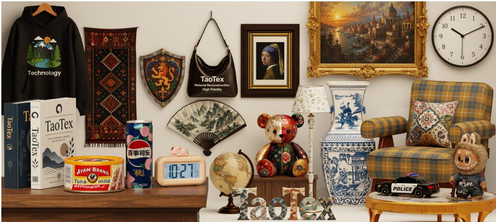
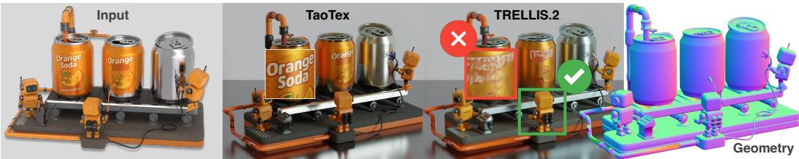
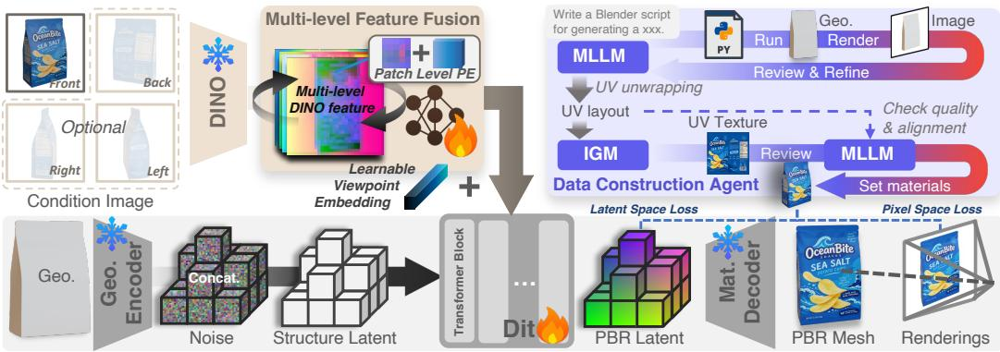
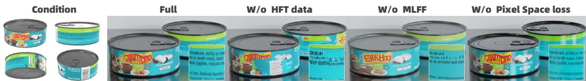
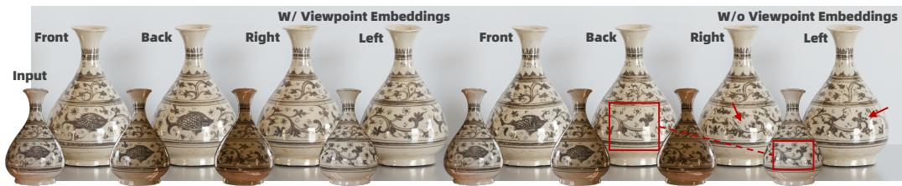
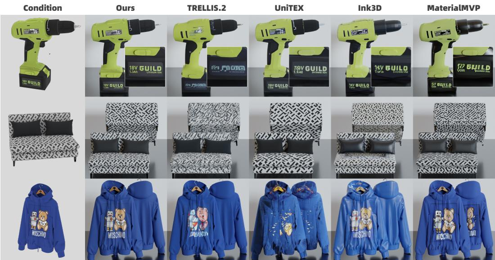
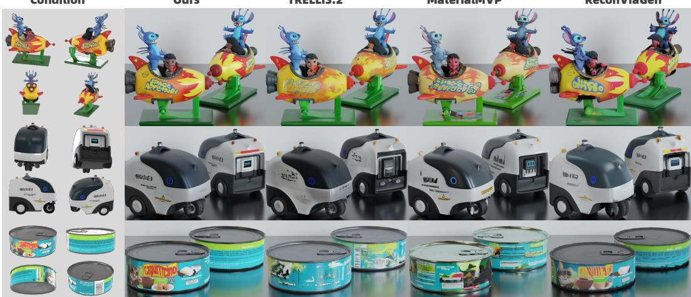
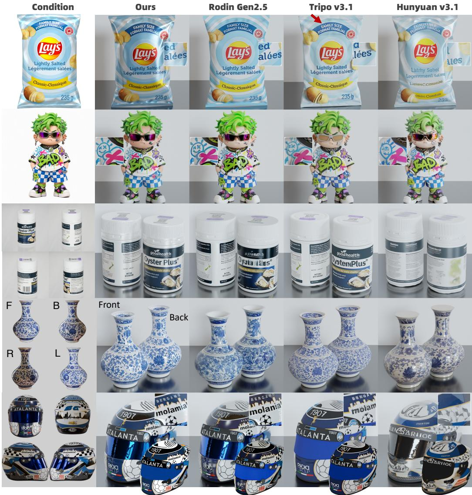

# TAOTEX: BOOSTING TEXTURE DETAIL FIDELITY FOR NATIVE 3D MATERIAL GENERATION

Xiuchao Wu∗ Shuichang Lai∗ Jiangjing Lyu† Chengfei Lyu† Alibaba Group

  
Figure 1: Native 3D materials generated by TaoTex. TaoTex is capable of generating highly faithful materials across a wide range of categories, including challenging details such as text and logos. The geometries shown in the figure above are generated by TRELLIS.2 (Xiang et al., 2026).

## ABSTRACT

Recent 3D generation models can produce accurate geometries while still struggling to reconstruct detailed textures. We propose a diffusion-based native 3D material generation model TaoTex, which faithfully recovers intricate textures through tailored strategies and improvements. First, we develop a data construction agent to create high-frequency textured 3D assets to bridge the data gap in public datasets. Training with these data significantly enhances the ability of Tao-Tex to recover challenging details such as text and patterns. Second, we design a multi-level feature fusion (MLFF) module to adaptively integrate local and global features of the conditional input, providing more complete texture cues for the diffusion model and thereby enhancing reconstruction fidelity. To alleviate VAE reconstruction errors, we adopt a latent-to-pixel space loss transition, further improving the pixel-level details and generation quality. Finally, we scale TaoTex to multi-view inputs by incorporating learnable viewpoint embeddings, achieving accurate and consistent material reconstruction across views. Extensive experiments demonstrate that our method significantly outperforms existing approaches in preserving texture details in both single- and multi-view settings.

## 1 INTRODUCTION

Diffusion-based Image-to-3D asset generation (Chang et al., 2026; Hunyuan3D Team, 2024; 2025a;b; Xiang et al., 2024; 2026) has advanced rapidly, yet existing methods struggle to faithfully reconstruct complex textures on 3D surfaces from input images, restricting their applicability to objects with simple textures rather than texture-rich categories. Current methods for generating materials on 3D assets typically operate either in view-space (Hunyuan3D Team, 2025b;a; He et al., 2025; Wu et al., 2026; Huang et al., 2025; Zhang et al., 2026; Liang et al., 2026; Han et al., 2026) or directly in 3D-space (Lai et al., 2026; Xiang et al., 2024; 2026; Chang et al., 2026). While viewspace methods can leverage the priors of image generation models to assist texture synthesis, they still suffer from significant limitations. For example, texture baking may produce ghosting in overlapping regions, self-occluded areas require additional UV-space inpainting, and texture-geometry misalignment can cause projection artifacts. In contrast, generating material properties in 3D space inherently ensures global consistency and avoids the issue of self-occlusion.

  
Figure 2: Texture generation and geometric cues. In the green box, geometric variations align well with texture changes, effectively guiding appearance generation. Conversely, the red box contains feature-sparse surfaces where geometry provides little guidance for synthesizing patterns and text.

However, existing 3D-space methods often fail to generate accurate patterns on planar or smooth surfaces. These regions lack distinctive geometric cues for the model to match with the conditional images, leading to incorrect or fragmented textures (Fig. 2). We attribute this limitation to three factors: 1) Current public 3D datasets provide insufficient high-frequency textures, leaving the mapping from intricate patterns to simple surfaces unexplored by the model. 2) Conditional image features are semantically biased and lack detailed information. 3) Latent-space training is bounded by the reconstruction accuracy of the 3D VAE. Moreover, these methods either do not support multi-view input or perform poorly on it, despite its necessity in practical applications.

To address these issues, we propose TaoTex, a native material generation model with the capability to recover texture details from both single-view and multi-view inputs. For training this model, we develop a 3D asset data construction agent based on the Qwen LLM (Qwen Team, 2026), which enables the automatic creation of diverse 3D assets with detailed text, logo patterns, and various material properties. To better capture fine details from the conditional images, we propose a Multilevel Feature Fusion (MLFF) module that adaptively integrates both semantic and local information, allowing a more faithful reconstruction. To mitigate the accuracy degradation caused by the 3D VAE, we use a two-stage training strategy, starting with latent-space loss and then switching to pixelspace loss. Furthermore, we scale TaoTex to multi-view inputs by introducing learnable viewpoint embeddings. Combined with our constructed dataset and trained with a low-SNR schedule, this enables accurate and consistent texture reconstruction across different views.

The primary contributions of this work are as follows:

• Design a novel data construction agent to create high-frequency textured 3D assets for training, boosting the ability of the native 3D material generation model to handle patterns and text.

• Propose the MLFF module, coupled with the latent-to-pixel space loss transition strategy, enabling TaoTex to reconstruct higher-fidelity texture details from the input images.

• Develop a training strategy for multi-view reconstruction, incorporating learnable viewpoint embeddings, symmetric geometry data, and a low-SNR schedule, which enables TaoTex to support both single- and multi-view inputs while achieving globally consistent and seamless texture reconstruction via a generation framework that outperforms existing leading methods.

## 2 RELATED WORK

## 2.1 VIEW-SPACE TEXTURE GENERATION

Leveraging 2D diffusion priors (Rombach et al., 2022), early methods optimize surface appearance via Score Distillation Sampling (SDS) (Poole et al., 2022; Chen et al., 2023b; Lin et al., 2023; Liang et al., 2024; Zhang et al., 2024), which is computationally expensive and prone to over-saturation and Janus artifacts. To improve efficiency, TEXTure (Richardson et al., 2023) and Text2Tex (Chen et al., 2023a) sequentially synthesize and project individual views onto meshes, but their view-byview pipeline lacks direct cross-view interaction, accumulating inconsistencies across viewpoints.

Recent methods adopt multi-view diffusion (MVD) to improve cross-view consistency (Liu et al., 2023; Shi et al., 2023; Long et al., 2024; Li et al., 2024). Subsequent works improve texture quality through synchronized denoising, geometric conditioning, cross-view attention, and specialized projection strategies (Liu et al., 2024b; Zeng et al., 2024; Cheng et al., 2025; Bensadoun et al., 2024; Hunyuan3D Team, 2025b;a; Liu et al., 2026). In parallel, Ink3D (Han et al., 2026) employs video diffusion for continuous orbit-scan coverage. Other recent methods extend view-space synthesis from RGB appearances to PBR material properties, including albedo, roughness, and metallic (He et al., 2025; Huang et al., 2025; Wu et al., 2026). Despite substantial progress, view-space methods still suffer from cross-view inconsistencies in high-frequency regions, incomplete coverage under self-occlusion, and projection artifacts along depth boundaries.

## 2.2 NATIVE 3D TEXTURE GENERATION

Native 3D methods model appearance directly in geometry-aligned spaces. Early works synthesize per-face colors using adversarial objectives (Siddiqui et al., 2022) or continuous implicit fields (Oechsle et al., 2019). Modern diffusion-based approaches investigate varied representations, including colored point clouds, octree grids, UV parameterizations, and 3D Gaussian attributes (Yu et al., 2023; Liu et al., 2024a; Yu et al., 2024; Liu et al., 2025; Xiong et al., 2025), each presenting trade-offs between resolution, efficiency, and graphics compatibility. Concurrently, unified frameworks generate geometry and texture jointly (Hong et al., 2023; Tang et al., 2024), though their structural coupling restricts independent texture optimization.

More recently, structured latent spaces have established a powerful foundation for native 3D appearance modeling. Pioneered by Trellis (Xiang et al., 2024; 2026), geometry and texture can be jointly parameterized within a unified Structured LATent (SLAT) manifold. Targeting texture synthesis on fixed shapes, NaTex (Lai et al., 2026) introduces an explicit decoupling of geometric structure and surface color using a dual-stream autoencoder enriched with cross-latent feature aggregation. Building upon spatial sparsity and coordinate continuity, recent approaches perform diffusion on sparse voxel features or topology-agnostic texture formulations (Zeng et al., 2026; Liang et al., 2026), expanding the generative scope from raw radiance to complete physically based material channels (Yeo et al., 2026). While 3D-space methods effectively ensure global consistency and seamless surface coverage, existing frameworks fall short of resolving sharp, high-frequency appearance details.

## 3 METHOD

TaoTex is a native 3D generative model based on the o-voxel representation (Xiang et al., 2026), producing PBR materials (albedo, roughness, and metallic) from an input geometry and one or multiple images. Below, we present our data construction agent (Sec. 3.1), key improvements for boosting texture details (Sec. 3.2), and the extension of this backbone to multi-view setting (Sec. 3.3).

## 3.1 DATA CONSTRUCTION AGENT

MLLM-Driven Procedural Geometry Synthesis. We prompt a Multimodal Large Language Model (MLLM) to produce Blender scripts that generate target meshes ( Fig. 3). The candidate mesh is then rendered and visually critiqued by the MLLM to guide iterative code refinement, with an iteration cap enforced to control runtime. Once approved, the constructed geometry undergoes automated UV unwrapping. Owing to the simple topologies of our target geometries such as cans, cups and boxes, this pipeline is able to autonomously produce meshes with well-structured UV layouts, which is essential for subsequent texture generation.

UV-Guided Texture Synthesis and PBR Binding. The UV layout mask acts as a spatial condition for an Image Generation Model (IGM) to synthesize textures in the UV domain, tasked with producing detailed text and patterns ( Fig. 3). To prevent perceptual artifacts, the MLLM evaluates the texture map by checking pattern sharpness and boundary alignment against the UV layout.

  
Figure 3: Method overview. We advance native 3D material detail reconstruction across three fronts: a data agent for high-frequency asset curation, an MLFF module fusing multi-scale features, and a pixel-space loss countering latent compression. Coupled with learnable viewpoint embeddings, TaoTex robustly supports both single- and multi-view inputs.

The verified texture is bound to the geometric mesh alongside MLLM-prescribed PBR parameters (roughness and metallic), which yields high-frequency textured (HFT) 3D assets.

Notes. We employ Qwen-3.8 as the MLLM and Qwen-Image-3.0-Pro (Qwen Team, 2026) as the IGM. Although our agent natively supports end-to-end construction, in practice we prioritize efficiency: we first produce a fixed set of category-specific meshes, and subsequently synthesize a large volume of diverse textures over their UV layouts. This choice is driven by the fact that our task demands far greater texture diversity than geometric diversity. Constrained by the capabilities of current IGM models, the synthesized textures may not align flawlessly with the given UV layouts, but this discrepancy does not compromise the training of TaoTex in any manner.

## 3.2 DETAIL PRESERVATION SCHEME

Using HFT data together with public datasets, we train a DiT model $\mathcal { F } _ { \theta }$ to recover PBR materials from a given image $\dot { C }$ and geometry $\mathcal { G }$ with v-parameterization (Salimans & Ho, 2022):

$$
\mathcal { L } _ { \boldsymbol { \theta } } = \mathbb { E } \left. \mathcal { F } _ { \boldsymbol { \theta } } \Big ( \mathbf { x } _ { t } , t , \mathbf { z } _ { c } , \mathbf { z } _ { \mathcal { G } } \Big ) - \mathbf { v } \right. _ { 2 } ^ { 2 } ,\tag{1}
$$

where $\mathbf { x } _ { t }$ is the latent feature at step t, and $\mathbf { z } _ { \mathcal { G } }$ is the geometry latent from a pretrained encoder (Xiang et al., 2026). As deep semantic features $\mathbf { z } _ { c } = \mathcal { E } ( C )$ via DINOv2 (Oquab et al., 2024) fail to retain details (Fig. 4), we design an MLFF module to overcome this.

Multi-level Feature Fusion. We extract DINOv2 (Oquab et al., 2024) features $\{ \mathcal { E } ^ { ( l ) } ( C ) \} _ { l = 1 } ^ { L }$ across L layers spanning both shallow and deep levels from the image C. These features are aggregated into a single representation via $\mathcal { M } _ { \phi }$ and jointly optimized with the denoiser $\mathcal { F } _ { \theta }$ :

$$
\mathcal { L } _ { \boldsymbol { \theta } , \boldsymbol { \phi } } = \mathbb { E } \left. \mathcal { F } _ { \boldsymbol { \theta } } \left( \mathbf { x } _ { t } , t , \mathcal { M } _ { \boldsymbol { \phi } } \big ( \{ \boldsymbol { \mathcal { E } } ^ { ( l ) } ( C ) \} _ { l = 1 } ^ { L } \big ) , \mathbf { z } _ { \mathcal { G } } \right) - \mathbf { v } \right. _ { 2 } ^ { 2 } .\tag{2}
$$

We select $L = 4$ layers (the 4th, 11th, 17th, and 23rd), which empirically suffices to recover diverse texture details. Furthermore, to enhance the spatial awareness of the fused representations, we augment them with learnable patch-level positional embeddings.

Latent-to-pixel Space Loss Transition. Although computationally efficient, latent-space training inevitably incurs fidelity loss from compression artifacts (see w/o pixel space loss in Fig. 4). To counter this, we introduce a coarse-to-fine supervision strategy that transitions to pixel space in late training stages. Formally, the predicted vˆ is mapped back to $\mathbf { x } _ { \mathrm { 0 } }$ and decoded into a PBR mesh, which is rendered into pixel-space albedo, roughness, and metallic maps across different viewpoints

  
Figure 4: Effect of the HFT data, MLFF and pixel space loss. The comparisons above validate the efficacy of each proposed component. Specifically, the HFT dataset is indispensable for reconstructing text and patterns; without it, the model fails to synthesize legible text. Furthermore, the MLFF module is crucial for faithfully reproducing textures from input images, while the pixel-space loss further sharpens subtle details, notably minute characters.

to provide multi-view photometric supervision:

$$
\mathcal { L } _ { \theta , \phi } ^ { * } = \frac { 1 } { K } \sum _ { i = 1 } ^ { K } \left( \lambda _ { 1 } \mathcal { L } _ { \mathrm { L 1 } } ^ { ( i ) } + \lambda _ { 2 } \mathcal { L } _ { \mathrm { S S I M } } ^ { ( i ) } + \lambda _ { 3 } \mathcal { L } _ { \mathrm { L P I P S } } ^ { ( i ) } \right) ,\tag{3}
$$

where K indicates the number of viewpoints under supervision. $\mathcal { L } _ { \mathrm { S S I M } }$ denotes the structural similarity loss (Wang et al., 2004), and L denotes the learned perceptual loss (Zhang et al., 2018). To preserve reconstruction capability, we supervise the views rendered from the same viewpoints as the input images with weights set to $( \lambda _ { 1 } , \lambda _ { 2 } , \lambda _ { 3 } ) = ( 1 . 0 , 0 . 2 , 0 . 2 )$ , favoring high photometric fidelity. Meanwhile, we render 2 novel viewpoints and adjust the weights to (0.2, 0.2, 1.0) to enhance generative quality, emphasizing global perceptual realism over rigid per-pixel alignment.

## 3.3 MULTI-VIEW RECONSTRUCTION

Incorporating inputs from additional viewpoints provides an alternative path to enhance texture fidelity. However, existing methods either lack native support for multi-view inputs or yield suboptimal results when generalized to this setting. To scale our pipeline to multi-view inputs, a straightforward approach is to concatenate the visual tokens of all input views before feeding them into $\mathcal { F } _ { \theta }$ Nevertheless, the expanded token sequence exacerbates the difficulty of image-to-geometry feature alignment, leading to fragmented or incorrect texture generation (Fig. 5). We address this issue through a simple yet effective strategy: adding a learnable viewpoint embedding to the features of each view to disambiguate tokens originating from different viewpoints. These embeddings are jointly optimized with $\mathcal { F } _ { \theta }$ and $\mathcal { M } _ { \phi }$ to ensure seamless integration, and remain fixed during inference. Our model accommodates up to four input views, which proves sufficient for the vast majority of objects. These viewpoint embeddings correspond to canonical front, back, left, and right positions, covering a 90-degree horizontal range and a 180-degree vertical elevation range.

Optimizing via Geometric Ambiguity. Training on the HFT dataset is critical for properly optimizing the viewpoint embeddings. We intentionally curate this dataset with an abundance of symmetric primitives like cylinders and boxes, whose geometries are nearly indistinguishable across views. This structural ambiguity prevents the model from deducing viewpoints solely from shape cues, ensuring that the viewpoint embeddings are not bypassed. Meanwhile, rich multi-view appearance details compel the model to learn seamless cross-view transitions.

Low-SNR Timestep Sampling. Multi-view texture reconstruction critically relies on the early denoising steps, which establish coarse texture localization before later steps refine details. This makes training near t = 1 (pure noise) essential for learning the viewpoint embeddings. Motivated by this observation, we sample timesteps from a logit-normal distribution biased toward the low-SNR regime, with a mean of 2 and a standard deviation of 1.

## 3.4 IMPLEMENTATION DETAILS

Dataset. The overall training data is assembled from Objaverse-XL (Deitke et al., 2023), Tex-Verse (Zhang et al., 2025), and our HFT dataset, encompassing 500K, 300K, and 50K high-quality filtered PBR assets, respectively. Each asset is rendered across 16 viewpoints at a resolution of $1 0 2 4 \times 1 0 2 4$ under randomized fields of view and varied environmental lighting.

  
Figure 5: Effect of the viewpoint embeddings. Red boxes highlight texture misplacement caused by omitting viewpoint embeddings (e.g., left-view textures are erroneously mapped to the back), while arrows indicate severe texture fragmentation in its absence.

Table 1: Quantitative comparison under single-view input. Bold: best, underlined: second best.
<table><tr><td></td><td colspan="6">Conditioning View Reconstruction</td><td colspan="6">Novel View Generation</td></tr><tr><td></td><td colspan="3">Albedo</td><td colspan="3">Rendering</td><td colspan="3">Albedo</td><td colspan="3">Rendering</td></tr><tr><td>Method</td><td>| PSNR↑</td><td>SSIM↑</td><td>LPIPS↓</td><td>PSNR↑</td><td>SSIM↑</td><td>LPIPS↓</td><td>FID↓</td><td>CLIP-FID↓</td><td>CLIP-I↑</td><td>FID↓</td><td>CLIP-FID↓</td><td>CLIP-I↑</td></tr><tr><td>MaterialMVP (He et al., 2025)</td><td>18.90</td><td>0.830</td><td>0.160</td><td>20.84</td><td>0.866</td><td>0.150</td><td>124.10</td><td>17.12</td><td>0.8777</td><td>102.88</td><td>13.19</td><td>0.9037</td></tr><tr><td>UniTEX (Liang et al., 2026)</td><td>21.84</td><td>0.873</td><td>0.101</td><td>22.81</td><td>0.896</td><td>0.097</td><td>111.82</td><td>16.33</td><td>0.8896</td><td>104.33</td><td>13.88</td><td>0.9074</td></tr><tr><td>Ink3D (Han et al., 2026)</td><td>19.39</td><td>0.837</td><td>0.155</td><td>21.24</td><td>0.873</td><td>0.134</td><td>143.89</td><td>21.08</td><td>0.8633</td><td>112.94</td><td>14.88</td><td>0.9023</td></tr><tr><td>TRELLIS.2 (Xiang et al., 2026)</td><td>21.92</td><td>0.879</td><td>0.096</td><td>23.46</td><td>0.907</td><td>0.090</td><td>113.86</td><td>15.21</td><td>0.9063</td><td>87.69</td><td>13.21</td><td>0.9150</td></tr><tr><td>Ours</td><td>25.15</td><td>0.914</td><td>0.049</td><td>26.52</td><td>0.938</td><td>0.044</td><td>96.90</td><td>14.53</td><td>0.9096</td><td>77.66</td><td>12.11</td><td>0.9219</td></tr></table>

MLFF Architecture. Multi-layer DINOv2 features are projected via dedicated two-layer MLPs and concatenated along the channel dimension, followed by an SE-inspired (Hu et al., 2018) channel attention gate that adaptively reweights channels via global pooling and a two-layer gated excitation MLP. The calibrated features are then compressed along the channel dimension by a three-layer fusion MLP, added to the mean residual of all projected layers, and normalized through Layer-Norm, achieving efficient cross-layer feature fusion with enhanced training stability. Across all aforementioned MLPs, intermediate hidden layers consistently employ GELU activations, while the excitation module terminates with a Sigmoid function to generate attention weights.

Optimization. We fine-tune the material SC-VAE (Xiang et al., 2026) on our dataset using 16 NVIDIA H20 GPUs (total batch size 64). Freezing the fine-tuned VAE, we train the DiT and the remaining modules under the same setup with a batch size of 16, using AdamW (Loshchilov & Hutter, 2017) with a learning rate of $1 \times \mathrm { { 1 0 ^ { - 4 } } }$ . Training spans two 100K-step phases: first optimizing strictly with the latent-space loss, then continuing with the pixel-space loss, while alternating between single-view and multi-view inputs throughout.

## 4 EXPERIMENTS

Baselines. We compare TaoTex with existing SOTA methods for evaluation. In the single-view setting, we compare against TRELLIS.2 (Xiang et al., 2026), a 3D generation method, as well as view-space methods including UniTEX (Liang et al., 2026), Ink3D (Han et al., 2026), and MaterialMVP (He et al., 2025). In the multi-view setting, we compare against TRELLIS.2, MaterialMVP, and ReconViaGen (Chang et al., 2026), as the remaining baselines support only single-image conditioning. For TRELLIS.2, we implement the multi-view mode by switching the conditioning view during denoising, following TRELLIS (Xiang et al., 2024). To ensure a fair comparison of material generation, all methods use GT geometry except ReconViaGen, which cannot incorporate geometric input; therefore, we provide only qualitative comparisons for ReconViaGen. We also present qualitative comparisons with industry-leading commercial models.

Metrics. As our method focuses on the generation of complex textures, we select 30 objects with rich textures from TexVerse (Zhang et al., 2025) for quantitative comparisons. We render views on both the conditioning and novel viewpoints of the generated objects to evaluate texture reconstruction and generation performance of all methods. For conditioning views, we report Peak Signal-to-Noise Ratio (PSNR), Structural Similarity Index Measure (SSIM) (Wang et al., 2004), and Learned Perceptual Image Patch Similarity (LPIPS) (Zhang et al., 2018). For novel views, we re port Frechet Inception Distance (FID) (Heusel et al., 2017), CLIP-based Fr ´ echet Inception Distance ´ (CLIP-FID) (Radford et al., 2021), and CLIP Image Similarity (CLIP-I).

Table 2: Quantitative comparison under multi-view input. Evaluated under four input views.
<table><tr><td rowspan="2"></td><td colspan="3">Albedo</td><td colspan="3">Rendering</td></tr><tr><td>PSNR↑</td><td>SSIM↑</td><td>LPIPS↓</td><td>PSNR↑</td><td>SSIM↑</td><td>LPIPS↓</td></tr><tr><td>MaterialMVP (He et al., 2025)</td><td>20.18</td><td>0.873</td><td>0.117</td><td>22.40</td><td>0.900</td><td>0.103</td></tr><tr><td>TRELLIS.2 (Xiang et al., 2026)</td><td>19.91</td><td>0.852</td><td>0.162</td><td>21.76</td><td>0.883</td><td>0.153</td></tr><tr><td>Ours</td><td>25.48</td><td>0.919</td><td>0.051</td><td>27.30</td><td>0.941</td><td>0.045</td></tr></table>

  
Figure 6: Single-view comparisons. Our method achieves superior reconstruction fidelity, especially on text and patterns, while synthesizing highly coherent textures across unobserved regions.

## 4.1 COMPARISONS

Single-view Input. Quantitative results in Tab. 1 show that our method substantially surpasses all competing methods across metrics, confirming its advantage in material reconstruction and generation. Qualitatively (Fig. 6), our approach faithfully preserves text and pattern details that other baselines fail to resolve. Among the alternatives, TRELLIS.2 (Xiang et al., 2026) yields coherent textures but lacks high-frequency details. UniTEX (Liang et al., 2026) leverages fine-tuned FLUX (Labs et al., 2025) to synthesize multi-view textures, yet suffers from instability and severe texture fragmentation. While Ink3D (Han et al., 2026) and MaterialMVP (He et al., 2025) achieve plausible visual quality, Ink3D suffers from noticeable geometry-appearance misalignment stemming from its video-based orbit synthesis, whereas MaterialMVP struggles to preserve fine-grained texture details, ultimately compromising their quantitative performance.

Multi-view Inputs. Our method continues to lead all baselines under multi-view conditioning (Tab. 2). TRELLIS.2 and MaterialMVP produce blurry and incorrect textures when conditioned on multiple views, and they are particularly unable to place textures at the correct locations on cylindrical cans ( Fig. 7), where geometric cues are less pronounced. ReconViaGen (Chang et al., 2026) reconstructs geometry and textures using VGGT (Wang et al., 2025) features. While it can generate roughly accurate textures, the results are often blurry and lack fine details. In contrast, benefiting from our well-learned viewpoint embeddings, our method accurately generates text and complex patterns on the correct geometric surfaces while producing sharp and consistent textures.

Comparison with Commercial Models. Fig. 8 presents qualitative comparisons with commercial alternatives. In the single-view setting, our method faithfully preserves fine-grained text and patterns (e.g., on product packaging and clothes). In multi-view scenarios, whereas commercial models frequently suffer from texture misalignment and ghosting artifacts on symmetric objects (e.g., medicine bottles and vases), our approach accurately maps multi-view inputs onto corresponding surfaces with seamless transitions. Overall, our method outperforms competing commercial models in texture fidelity, material disentanglement, and generation stability.

  
Figure 7: Multi-view comparisons. Given four-view inputs, our method produces accurate, consistent and detailed textures, whereas competing methods yield erroneous and incoherent patterns

Table 3: Ablation study. All ablations are evaluated under the multi-view input setting.
<table><tr><td rowspan="2"></td><td colspan="3">Albedo</td><td colspan="3">Rendering</td></tr><tr><td>PSNR↑</td><td>SSIM↑</td><td>LPIPS↓</td><td>PSNR↑</td><td>SSIM↑</td><td>LPIPS↓</td></tr><tr><td>W/o HFT data</td><td>22.90</td><td>0.896</td><td>0.087</td><td>24.86</td><td>0.923</td><td>0.077</td></tr><tr><td>W/o MLFF</td><td>23.40</td><td>0.905</td><td>0.072</td><td>25.34</td><td>0.928</td><td>0.065</td></tr><tr><td>W/o viewpoint embeddings</td><td>24.47</td><td>0.911</td><td>0.062</td><td>26.47</td><td>0.935</td><td>0.054</td></tr><tr><td>W/o pixel-space loss</td><td>24.61</td><td>0.913</td><td>0.064</td><td>26.22</td><td>0.935</td><td>0.057</td></tr><tr><td>Ours</td><td>25.48</td><td>0.919</td><td>0.051</td><td>27.30</td><td>0.941</td><td>0.045</td></tr></table>

## 4.2 ABLATION STUDY

HFT Dataset. The HFT dataset substantially enhances high-frequency details, particularly text patterns. As illustrated in Fig. 4, training with HFT data allows our model to faithfully recover clear text across curved surfaces. Quantitative results in Tab. 3 further corroborate these gains in detail fidelity, validating both our data construction agent strategy and the effectiveness of the curated data.

Multi-level Feature Fusion. Fig. 4 compares our fused features with semantic features alone. By aggregating multi-level representations, the fused features from MLFF better preserve fine-grained details from the input images. Without MLFF, the model struggles to reconstruct patterns and text, producing fragmented, blocky, and distorted textures. Coupled with the quantitative results in Tab. 3, this confirms that the MLFF module effectively enhances texture fidelity.

Pixel-space Loss. Both Tab. 3 and Fig. 4 demonstrate that introducing the pixel space loss alleviates reconstruction errors from the material SC-VAE, thereby further refining fine details. Without this constraint, optimizing solely in the latent space produces visually plausible textures overall, but tiny text exhibits noticeable distortion (see the zoomed-in views in Fig. 4).

Viewpoint Embeddings. The ablation results in Tab. 3 and Fig. 5 validate the efficacy of our viewpoint embeddings and the associated training strategy. Without viewpoint embeddings, the model exhibits spatial ambiguity on nearly symmetric objects with repetitive, intricate patterns (e.g., the vase), often misplacing textures across surface regions. This positional mismatch consequently leads to distorted and fragmented textures (highlighted by the red arrows in Fig. 5).

  
Figure 8: Comparisons with commercial models. We use the geometry from Rodin Gen2.5 (Rodin Team, 2026) as our geometric input and others use their own geometries. Overall, TaoTex achieves superior performance compared to existing commercial models in fine-grained reconstruction.

## 5 CONCLUSION

TaoTex enables high-fidelity native 3D material reconstruction from single- or multi-view inputs via co-designed data, architecture, and training strategies. We leverage a designed data agent to create high-frequency assets, an MLFF module with pixel-space loss to maximize detail preservation, and viewpoint embeddings to ensure accurate multi-view reconstruction. Despite outperforming existing methods, TaoTex remains constrained by voxel resolution when reconstructing minute text or patterns. Since higher resolutions demand prohibitive GPU memory, scaling resolution under a limited memory budget to improve details presents a compelling avenue for future research.

## REFERENCES

Raphael Bensadoun, Yanir Kleiman, Idan Azuri, Omri Harosh, Andrea Vedaldi, Natalia Neverova, and Oran Gafni. Meta 3d texturegen: Fast and consistent texture generation for 3d objects. arXiv preprint arXiv:2407.02430, 2024.

Jiahao Chang, Chongjie Ye, Yushuang Wu, Yuantao Chen, Yidan Zhang, Zhongjin Luo, Chenghong Li, Yihao Zhi, and Xiaoguang Han. Reconviagen: Towards accurate multi-view 3d object reconstruction via generation. In Int. Conf. Learn. Represent., 2026.

Dave Zhenyu Chen, Yawar Siddiqui, Hsin-Ying Lee, Sergey Tulyakov, and Matthias Nießner. Text2tex: Text-driven texture synthesis via diffusion models. In Int. Conf. Comput. Vis., pp. 18558–18568, 2023a.

Rui Chen, Yongwei Chen, Ningxin Jiao, and Kui Jia. Fantasia3d: Disentangling geometry and appearance for high-quality text-to-3d content creation. In Int. Conf. Comput. Vis., pp. 22246– 22256, 2023b.

Wei Cheng, Juncheng Mu, Xianfang Zeng, Xin Chen, Anqi Pang, Chi Zhang, Zhibin Wang, Bin Fu, Gang Yu, Ziwei Liu, et al. Mvpaint: Synchronized multi-view diffusion for painting anything 3d. In 2025 IEEE/CVF Conference on Computer Vision and Pattern Recognition (CVPR), pp. 585–594. IEEE, 2025.

Matt Deitke, Ruoshi Liu, Matthew Wallingford, Huong Ngo, Oscar Michel, Aditya Kusupati, Alan Fan, Christian Laforte, Vikram Voleti, Samir Yitzhak Gadre, et al. Objaverse-xl: A universe of 10m+ 3d objects. Advances in Neural Information Processing Systems, 36:35799–35813, 2023.

Yue Han, Chong Li, Zhening Liu, Cong Huang, Fang Deng, Yong Liu, Fangyun Wei, and Yan Lu. Ink3d: Sculpting 3d assets with extremely complex textures via video generative models. arXiv preprint arXiv:2607.01222, 2026.

Zebin He, Mingxin Yang, Shuhui Yang, Yixuan Tang, Tao Wang, Kaihao Zhang, Guanying Chen, Yuhong Liu, Jie Jiang, Chunchao Guo, et al. Materialmvp: Illumination-invariant material generation via multi-view pbr diffusion. In Int. Conf. Comput. Vis., 2025.

Martin Heusel, Hubert Ramsauer, Thomas Unterthiner, Bernhard Nessler, and Sepp Hochreiter. Gans trained by a two time-scale update rule converge to a local nash equilibrium. In Adv. Neural Inform. Process. Syst., 2017.

Yicong Hong, Kai Zhang, Jiuxiang Gu, Sai Bi, Yang Zhou, Difan Liu, Feng Liu, Kalyan Sunkavalli, Trung Bui, and Hao Tan. Lrm: Large reconstruction model for single image to 3d. arXiv preprint arXiv:2311.04400, 2023.

Jie Hu, Li Shen, and Gang Sun. Squeeze-and-excitation networks. In 2018 IEEE/CVF Conference on Computer Vision and Pattern Recognition, pp. 7132–7141, 2018. doi: 10.1109/CVPR.2018. 00745.

Xin Huang, Tengfei Wang, Ziwei Liu, and Qing Wang. Material anything: Generating materials for any 3d object via diffusion. In IEEE Conf. Comput. Vis. Pattern Recog., pp. 26556–26565, 2025.

Hunyuan3D Team. Hunyuan3d 1.0: A unified framework for text-to-3d and image-to-3d generation, 2024.

Hunyuan3D Team. Hunyuan3d 2.1: From images to high-fidelity 3d assets with production-ready pbr material. arXiv preprint arXiv:2506.15442, 2025a.

Hunyuan3D Team. Hunyuan3d 2.0: Scaling diffusion models for high resolution textured 3d assets generation, 2025b.

Black Forest Labs, Stephen Batifol, Andreas Blattmann, Frederic Boesel, Saksham Consul, Cyril Diagne, Tim Dockhorn, Jack English, Zion English, Patrick Esser, Sumith Kulal, Kyle Lacey, Yam Levi, Cheng Li, Dominik Lorenz, Jonas Muller, Dustin Podell, Robin Rombach, Harry Saini,¨ Axel Sauer, and Luke Smith. Flux.1 kontext: Flow matching for in-context image generation and editing in latent space, 2025. URL https://arxiv.org/abs/2506.15742.

Zeqiang Lai, Yunfei Zhao, Zibo Zhao, Xin Yang, Xin Huang, Jingwei Huang, Xiangyu Yue, and Chunchao Guo. Natex: Seamless texture generation as latent color diffusion. In IEEE Conf. Comput. Vis. Pattern Recog., 2026.

Peng Li, Yuan Liu, Xiaoxiao Long, Feihu Zhang, Cheng Lin, Mengfei Li, Xingqun Qi, Shanghang Zhang, Wenhan Luo, Ping Tan, et al. Era3d: High-resolution multiview diffusion using efficient row-wise attention. arXiv preprint arXiv:2405.11616, 2024.

Yixun Liang, Xin Yang, Jiantao Lin, Haodong Li, Xiaogang Xu, and Yingcong Chen. Luciddreamer: Towards high-fidelity text-to-3d generation via interval score matching. In IEEE Conf. Comput. Vis. Pattern Recog., pp. 6517–6526, 2024.

Yixun Liang, Kunming Luo, Xiao Chen, Rui Chen, Hongyu Yan, Weiyu Li, Jiarui Liu, Fei-Peng Tian, and Ping Tan. Unitex: Universal high fidelity generative texturing for 3d shapes. In IEEE Conf. Comput. Vis. Pattern Recog., 2026.

Chen-Hsuan Lin, Jun Gao, Luming Tang, Towaki Takikawa, Xiaohui Zeng, Xun Huang, Karsten Kreis, Sanja Fidler, Ming-Yu Liu, and Tsung-Yi Lin. Magic3d: High-resolution text-to-3d content creation. In 2023 IEEE/CVF Conference on Computer Vision and Pattern Recognition (CVPR), pp. 300–309. IEEE, 2023.

Chenyu Liu, Hongze Chen, Jingzhi Bao, Lingting Zhu, Runze Zhang, Weikai Chen, Zeyu Hu, Yingda Yin, Keyang Luo, and Xin Wang. Calitex: Geometry-calibrated attention for viewcoherent 3d texture generation. In Proceedings ofthe IEEE/CVF Conference on Computer Vision and Pattern Recognition, pp. 5923–5933, 2026.

Jialun Liu, Chenming Wu, Xinqi Liu, Xing Liu, Jinbo Wu, Haotian Peng, Chen Zhao, Haocheng Feng, Jingtuo Liu, and Errui Ding. Texoct: Generating textures of 3d models with octree-based diffusion. In 2024 IEEE/CVF Conference on Computer Vision and Pattern Recognition (CVPR), pp. 4284–4293. IEEE, 2024a.

Jialun Liu, Jinbo Wu, Xiaobo Gao, Jiakui Hu, Bojun Xiong, Xing Liu, Chen Zhao, Hongbin Pei, Haocheng Feng, Yingying Li, et al. Texgarment: Consistent garment uv texture generation via efficient 3d structure-guided diffusion transformer. In 2025 IEEE/CVF Conference on Computer Vision and Pattern Recognition (CVPR), pp. 26566–26575. IEEE, 2025.

Ruoshi Liu, Rundi Wu, Basile Van Hoorick, Pavel Tokmakov, Sergey Zakharov, and Carl Vondrick. Zero-1-to-3: Zero-shot one image to 3d object. In Int. Conf. Comput. Vis., pp. 9298–9309, 2023.

Yuxin Liu, Minshan Xie, Hanyuan Liu, and Tien-Tsin Wong. Text-guided texturing by synchronized multi-view diffusion. In SIGGRAPH Asia 2024 Conference Papers, pp. 1–11, 2024b.

Xiaoxiao Long, Yuan-Chen Guo, Cheng Lin, Yuan Liu, Zhiyang Dou, Lingjie Liu, Yuexin Ma, Song-Hai Zhang, Marc Habermann, Christian Theobalt, et al. Wonder3d: Single image to 3d using cross-domain diffusion. In IEEE Conf. Comput. Vis. Pattern Recog., pp. 9970–9980, 2024.

Ilya Loshchilov and Frank Hutter. Decoupled weight decay regularization. arXiv preprint arXiv:1711.05101, 2017.

Michael Oechsle, Lars Mescheder, Michael Niemeyer, Thilo Strauss, and Andreas Geiger. Texture fields: Learning texture representations in function space. In 2019 IEEE/CVF international conference on computer vision (ICCV), pp. 4530–4539. IEEE, 2019.

Maxime Oquab, Timothee Darcet, Th´ eo Moutakanni, Huy Vo, Marc Szafraniec, Vasil Khalidov,´ Pierre Fernandez, Daniel Haziza, Francisco Massa, Alaaeldin El-Nouby, Mahmoud Assran, Nicolas Ballas, Wojciech Galuba, Russell Howes, Po-Yao Huang, Shang-Wen Li, Ishan Misra, Michael Rabbat, Vasu Sharma, Gabriel Synnaeve, Hu Xu, Herve Jegou, Julien Mairal, Patrick Labatut, Ar-´ mand Joulin, and Piotr Bojanowski. Dinov2: Learning robust visual features without supervision, 2024. URL https://arxiv.org/abs/2304.07193.

Ben Poole, Ajay Jain, Jonathan T Barron, and Ben Mildenhall. Dreamfusion: Text-to-3d using 2d diffusion. arXiv preprint arXiv:2209.14988, 2022.

Qwen Team. Qwen, 2026. URL https://qwen.ai/.

Alec Radford, Jong Wook Kim, Chris Hallacy, Aditya Ramesh, Gabriel Goh, Sandhini Agarwal, Girish Sastry, Amanda Askell, Pamela Mishkin, Jack Clark, et al. Learning transferable visual models from natural language supervision. pp. 8748–8763. PmLR, 2021.

Elad Richardson, Gal Metzer, Yuval Alaluf, Raja Giryes, and Daniel Cohen-Or. Texture: Textguided texturing of 3d shapes. In ACM SIGGRAPH 2023 Conference Papers, pp. 1–11, 2023.

Rodin Team. Rodin, 2026. URL https://hyper3d.ai/.

Robin Rombach, Andreas Blattmann, Dominik Lorenz, Patrick Esser, and Bjorn Ommer. High-¨ resolution image synthesis with latent diffusion models. In IEEE Conf. Comput. Vis. Pattern Recog., pp. 10684–10695, 2022.

Tim Salimans and Jonathan Ho. Progressive distillation for fast sampling of diffusion models. arXiv preprint arXiv:2202.00512, 2022.

Ruoxi Shi, Hansheng Chen, Zhuoyang Zhang, Minghua Liu, Chao Xu, Xinyue Wei, Linghao Chen, Chong Zeng, and Hao Su. Zero123++: a single image to consistent multi-view diffusion base model. arXiv preprint arXiv:2310.15110, 2023.

Yawar Siddiqui, Justus Thies, Fangchang Ma, Qi Shan, Matthias Nießner, and Angela Dai. Texturify: Generating textures on 3d shape surfaces. In European Conference on Computer Vision, pp. 72–88. Springer, 2022.

Jiaxiang Tang, Zhaoxi Chen, Xiaokang Chen, Tengfei Wang, Gang Zeng, and Ziwei Liu. Lgm: Large multi-view gaussian model for high-resolution 3d content creation. In European Conference on Computer Vision, pp. 1–18. Springer, 2024.

Jianyuan Wang, Minghao Chen, Nikita Karaev, Andrea Vedaldi, Christian Rupprecht, and David Novotny. Vggt: Visual geometry grounded transformer. In Proceedings of the IEEE/CVF Conference on Computer Vision and Pattern Recognition, 2025.

Zhou Wang, A.C. Bovik, H.R. Sheikh, and E.P. Simoncelli. Image quality assessment: from error visibility to structural similarity. IEEE Trans. Image Process., 13(4):600–612, 2004. doi: 10. 1109/TIP.2003.819861.

Xiuchao Wu, Pengfei Zhu, Jiangjing Lyu, Xinguo Liu, Jie Guo, Yanwen Guo, Weiwei Xu, and Chengfei Lyu. Matmart: Material reconstruction of 3d objects via diffusion. In IEEE Conf. Comput. Vis. Pattern Recog., 2026.

Jianfeng Xiang, Zelong Lv, Sicheng Xu, Yu Deng, Ruicheng Wang, Bowen Zhang, Dong Chen, Xin Tong, and Jiaolong Yang. Structured 3d latents for scalable and versatile 3d generation. arXiv preprint arXiv:2412.01506, 2024.

Jianfeng Xiang, Xiaoxue Chen, Sicheng Xu, Ruicheng Wang, Zelong Lv, Yu Deng, Hongyuan Zhu, Yue Dong, Hao Zhao, Nicholas Jing Yuan, and Jiaolong Yang. Native and compact structured latents for 3d generation. In IEEE Conf. Comput. Vis. Pattern Recog., 2026.

Bojun Xiong, Jialun Liu, Jiakui Hu, Chenming Wu, Jinbo Wu, Xing Liu, Chen Zhao, Errui Ding, and Zhouhui Lian. Texgaussian: Generating high-quality pbr material via octree-based 3d gaussian splatting. In 2025 IEEE/CVF Conference on Computer Vision and Pattern Recognition (CVPR), pp. 551–561. IEEE, 2025.

Kyeongmin Yeo, Yunhong Min, Jaihoon Kim, and Minhyuk Sung. Matlat: material latent space for pbr texture generation. In Proceedings ofthe IEEE/CVF Conference on Computer Vision and Pattern Recognition, pp. 4602–4612, 2026.

Xin Yu, Peng Dai, Wenbo Li, Lan Ma, Zhengzhe Liu, and Xiaojuan Qi. Texture generation on 3d meshes with point-uv diffusion. In 2023 IEEE/CVF international conference on computer vision (ICCV), pp. 4183–4193. IEEE, 2023.

Xin Yu, Ze Yuan, Yuan-Chen Guo, Ying-Tian Liu, Jianhui Liu, Yangguang Li, Yan-Pei Cao, Ding Liang, and Xiaojuan Qi. Texgen: a generative diffusion model for mesh textures. ACM Trans. Graph., 43(6):1–14, 2024.

Xianfang Zeng, Xin Chen, Zhongqi Qi, Wen Liu, Zibo Zhao, Zhibin Wang, Bin Fu, Yong Liu, and Gang Yu. Paint3d: Paint anything 3d with lighting-less texture diffusion models. In IEEE Conf. Comput. Vis. Pattern Recog., pp. 4252–4262, 2024.

Yifei Zeng, Yajie Bao, Jiachen Qian, Shuang Wu, Youtian Lin, Hao Zhu, Buyu Li, Feihu Zhang, Xun Cao, and Yao Yao. Textrix: Latent attribute grid for native texture generation and beyond. In Proceedings of the IEEE/CVF Conference on Computer Vision and Pattern Recognition, pp. 27104–27113, 2026.

Richard Zhang, Phillip Isola, Alexei A Efros, Eli Shechtman, and Oliver Wang. The unreasonable effectiveness of deep features as a perceptual metric. In IEEE Conf. Comput. Vis. Pattern Recog., 2018.

Yibo Zhang, Li Zhang, Rui Ma, and Nan Cao. Texverse: A universe of 3d objects with highresolution textures. arXiv preprint arXiv:2508.10868, 2025.

Yuqing Zhang, Yuan Liu, Zhiyu Xie, Lei Yang, Zhongyuan Liu, Mengzhou Yang, Runze Zhang, Qilong Kou, Cheng Lin, Wenping Wang, et al. Dreammat: High-quality pbr material generation with geometry-and light-aware diffusion models. ACM Trans. Graph., 43(4):1–18, 2024.

Yuqing Zhang, Yan-Pei Cao, Hao Xu, Yiqian Wu, Sirui Lin, Yuqing Wang, Ding Liang, Yuan-Chen Guo, and Xiaogang Jin. Pixtex: Consistent 3d texturing via pixel-space multi-view diffusion. In ACM SIGGRAPH 2026 Conference Papers, 2026.