# THE DEVIL IS IN THE SPECTRUM BIAS: SPECTRUM-BALANCED FEATURE MATCHING FOR ROBUST REP-RESENTATION DISTILLATION

Kuniaki Saito<sup>∗</sup>, Yoshitaka Ushiku OMRON SINIC X Corporation

## ABSTRACT

Large visual foundation models have demonstrated remarkable transferability across a wide range of downstream tasks. To deploy such models efficiently, feature matching has become a popular knowledge distillation approach that transfers teacher representations to smaller student models without requiring labeled data. However, we show that the conventional feature matching objective with L2- distance is inherently biased toward reconstructing dominant spectral directions of the teacher representation, while under-optimizing low-variance directions that often contain task-relevant information. To address this, we propose Spectrum-Balanced Feature Matching, SpecMatch, a simple objective that adaptively emphasizes under-optimized spectral directions while preserving the relative importance of dominant directions. SpecMatch is easy to implement and introduces negligible computational overhead. Extensive experiments on image recognition demonstrate that SpecMatch consistently improves downstream adaptation across diverse tasks, including image classification, anomaly detection, medical image analysis, and domain generalization. In particular, SpecMatch outperforms conventional feature matching in 40 of 42 teacher–student and training-setting combinations, while consistently improving over the original student model in all settings. We further demonstrate that the proposed objective generalizes beyond vision, improving downstream performance across six protein understanding tasks.

## 1 INTRODUCTION

Recent advances in large-scale representation learning have led to the emergence of large foundation models trained on billions of images (Oquab et al., 2023; Simeoni et al., 2025; Bolya et al.,´ 2026; Chuang et al., 2026; Xu et al., 2024; Radford et al., 2021). Such models have demonstrated remarkable transferability across a wide range of downstream tasks, including object recognition, medical image analysis, and domain generalization. As foundation models continue to grow in scale and capability, they increasingly serve as a source of visual knowledge for downstream applications.

However, directly deploying these large models is often impractical due to computational constraints. Consequently, an important challenge is how to effectively transfer the rich knowledge in large models to smaller and more efficient models. Knowledge distillation has emerged as a promising solution to this problem, enabling student models to inherit useful representations from powerful teachers (Hinton et al., 2015; Jang et al., 2025; Lee et al., 2025; Ranzinger et al., 2024b; Zhang et al., 2025). Feature matching is a popular distillation approach since it transfers teacher representations to a student model and can be applied to diverse scenarios in a label-free manner (Sarıyıldız et al., 2024; Chen et al., 2021; Wang et al., 2019). However, standard feature matching objectives treat the teacher representation as a whole, without explicitly accounting for how information is distributed across different feature directions. This raises an important question: does feature matching effectively transfer all information encoded in the teacher representation, including information that may be important for downstream tasks? Our preliminary analysis reveals an important tension: teacher representations learned from large-scale pre-training are highly anisotropic, with a small number of principal directions dominating the feature variance; however, non-dominant directions can also contain information that contributes substantially to downstream tasks. As illustrated in Fig. 1, different downstream tasks rely on different spectral regions of the teacher representation, and important task-relevant information can reside in non-dominant directions.

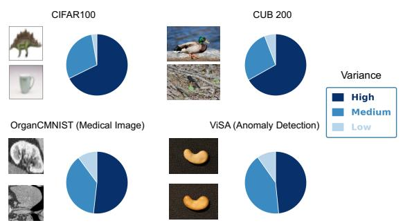

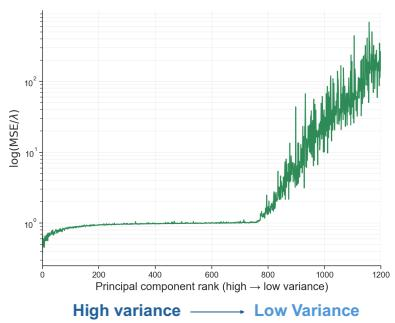  
Figure 1: (Left): Contribution of principal component (PC) groups to downstream tasks. PCs are sorted by explained variance and divided into three equal-sized groups. Different tasks rely on dif ferent spectral regions, motivating the preservation of a broad representation spectrum during distillation. (Right): Variance-normalized reconstruction error of vanilla L2 feature matching. Reconstruction deteriorates toward higher-rank, lower-variance PCs, revealing a bias toward high-variance components that may discard information useful for downstream tasks. We further provide evidence in Fig. 7 that lower-variance PCs do not merely represent noise but can substantially improve performance on certain downstream tasks.

Motivated by this observation, we identify a limitation of conventional feature matching in transferring teacher knowledge to a student. We theoretically and empirically show that feature matching with L2 distance is biased toward reproducing dominant spectral directions: its learning signals scale with teacher feature variance, leading student models to prioritize high-variance directions over lowvariance ones. As a result, the student may fail to preserve information that is useful for downstream transfer. Indeed, we empirically observe settings in which vanilla feature matching fails to improve downstream performance. To address this issue, we propose Spectrum-Balanced Feature Matching, SpecMatch, a simple objective that adaptively emphasizes under-optimized spectral directions while preserving the relative importance of dominant directions. SpecMatch is easy to implement, introduces negligible computational overhead, and can be incorporated into existing feature matching frameworks with minimal modification.

Extensive experiments on image recognition demonstrate that SpecMatch generally outperforms conventional feature-matching baselines in a downstream adaptation setting, where distillation is performed separately for each target dataset using only its unlabeled images. Across diverse tasks—including image classification, anomaly detection, medical image classification, and domain generalization—our method outperforms vanilla feature matching in 40 out of 42 teacher–student and training-setting combinations, while improving over the original student model in all 42 settings. The method remains effective on large-scale datasets such as ImageNet, as well as on challenging datasets such as iNaturalist, which contains a large number of categories and a highly imbalanced class distribution. Furthermore, the proposed objective generalizes to protein foundation models, achieving consistent improvements across six downstream protein understanding tasks.

## 2 RELATED WORK

Knowledge distillation is a popular approach to transfer knowledge between different models by training one model to mimic the outputs of another model. Various approaches have been proposed and some employ task logits (Hinton et al., 2015), others utilize intermediate features or embeddings (Heo et al., 2019; Tian et al., 2020), relations between samples (Park et al., 2019). Some of the self-supervised learning approaches include learning mechanisms similar to model distillation (Oquab et al., 2023; Simeoni et al., 2025). Feature distillation approaches are common in dis-´ tillation literature while they do not account for transferring rich teacher representations (Sarıyıldız et al., 2024; Heo et al., 2019; Chen et al., 2021; Romero et al., 2015). We mainly focus on how to adapt the student model to a downstream task by leveraging a huge teacher model, using unlabeled data from the downstream domain. The downstream tasks can require diverse features for the performance boost, thus transferring diverse features is desirable. Our setting is close to (Vemulapalli et al., 2024; Jang et al., 2025) in that they assume a label-scarce scenario for cheaper adaptation. While Vemulapalli et al. (2024) focus on obtaining the auxiliary dataset that helps the adaptation to the target domain, our focus is on developing an objective that achieves rich feature transfer. SpecMatch is simple, yet effective in improving the performance of the student model by allowing students to learn rich features.

Normalization in knowledge distillation. Miles et al. (2024); Miles & Mikolajczyk (2024); Lee et al. (2018) employ feature normalization or whitening in knowledge distillation. Our theoretical analysis provides an intuition for why whitening can facilitate feature matching: by equalizing the variance of the teacher representation across spectral directions, it prevents a small number of highvariance directions from dominating the objective. However, our analysis shows that whitening does not consistently improve downstream transfer and can even cause substantial degradation on several datasets. These results suggest that completely equalizing spectral directions can be overly aggressive, since dominant directions may remain important for downstream tasks. In contrast, SpecMatch is designed to reduce the excessive optimization focus on high-variance directions without enforcing equal contributions across the spectrum. Specifically, it moderately emphasizes low-variance directions without fully equalizing their contributions with those of high-variance directions.

Richness of feature representations. The richness of learned representations has been extensively studied in the self-supervised learning (SSL) literature. RankMe (Garrido et al., 2023) showed that the effective rank of learned representations is strongly correlated with downstream performance, suggesting that high-rank representations capture richer semantic information. Motivated by this observation, several SSL methods have been proposed to prevent rank collapse or maintain a high effective rank of learned representations (Zbontar et al., 2021; Jing et al., 2021; He & Ozay, 2022). Our work shares a similar motivation in that we aim to preserve the richness of teacher representations during knowledge transfer. However, rather than designing a self-supervised objective to improve the representation itself, we develop a distillation objective that transfers the rich representations of a powerful teacher model to a student model.

## 3 REVISITING FEATURE MATCHING FOR REPRESENTATION TRANSFER

## 3.1 TASK-RELEVANT INFORMATION IS DISTRIBUTED ACROSS THE SPECTRUM

We analyze the contribution of each principal component to downstream classification. $\boldsymbol { \mathrm { L e t } } \boldsymbol { z } \in \mathbb { R } ^ { d }$ denote the teacher representation, $\bar { U = [ u _ { 1 } , \ldots , u _ { d } ] }$ the orthonormal PCA basis computed from the teacher representations (ordered by decreasing variance), and $W = [ w _ { 1 } , \dots , w _ { C } ] ^ { \top }$ the weight matrix of a linear classifier trained for a downstream task, where C is the number of classes. Since U is orthonormal, each classifier weight can be decomposed as $\begin{array} { r } { w _ { c } = \sum _ { k = 1 } ^ { d } ( u _ { k } ^ { \top } w _ { c } ) u _ { k } } \end{array}$ . We quantify the contribution of the k-th principal component by measuring the energy of the classifier weights projected onto that direction: $\begin{array} { r } { I _ { k } = \sum _ { c = 1 } ^ { C } ( u _ { k } ^ { \top } w _ { c } ) ^ { 2 } } \end{array}$ . Fig. 1 (left) partitions the principal components into consecutive rank intervals and compute the normalized contribution within each interval: $\begin{array} { r } { C _ { m } = \frac { \sum _ { k \in \{ 3 m } } I _ { k } } { \sum _ { k = 1 } ^ { d } I _ { k } }  \end{array}$ , where $B _ { m }$ denotes the m-th rank interval. The darker shades of blue indicate principal component groups with larger teacher variance. For the CIFAR-10, the task-relevant directions are strongly aligned with the dominant principal components of the teacher representation, while higher-rank components contribute little to the classifier. In contrast, for anomaly detection and medical image classification, which require recognizing subtle visual patterns, lower-variance principal components also exhibit substantial contributions. These suggest that transferring only the dominant directions of the teacher can be insufficient for downstream tasks. Instead, effective representation transfer should preserve information across a broader spectrum of principal components.

## 3.2 INSIGHTS INTO VANILLA FEATURE MATCHING

We analyze the feature matching with L2-distance from the perspective of the principal components of the teacher representation. Let $z _ { b } ^ { t } , z _ { b } ^ { s } \in \mathbb { R } ^ { d }$ denote the teacher and student representations for the b-th sample, respectively. Applying PCA to the teacher features yields an orthonormal basis $\{ u _ { k } \in$ $\mathbb { R } ^ { d } \} _ { k = 1 } ^ { d }$ , where the teacher representation is expressed as $\begin{array} { r } { z _ { b } ^ { t } = \sum _ { k = 1 } ^ { d } c _ { b , k } ^ { t } u _ { k } } \end{array}$ , and $\lambda _ { k } = \mathrm { V a r } ( c _ { k } ^ { t } )$ denotes the variance along the k-th principal direction.

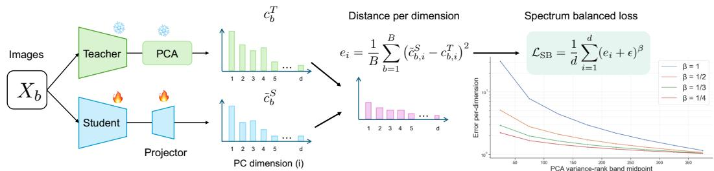

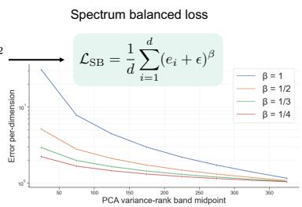  
Figure 2: (Left): Description of the proposed objective. (Right): The illustration of the error (y-axis) on different principal components (x-axis).

Since the PCA basis is orthonormal, feature matching is equivalent to minimizing the reconstruction error in the PCA space:

$$
e _ { k } = \frac { 1 } { B } \sum _ { b = 1 } ^ { B } ( \tilde { c } _ { b , k } ^ { s } - c _ { b , k } ^ { t } ) ^ { 2 } , \qquad \mathcal { L } _ { \mathrm { F M } } = \sum _ { k = 1 } ^ { d } e _ { k }\tag{1}
$$

where $\tilde { c } _ { b , k } ^ { s }$ is the student prediction along the k-th principal direction. At the early stage of training, the expected reconstruction error satisfies

$$
\mathbb { E } [ e _ { k } ] \approx \lambda _ { k } + C ,\tag{2}
$$

where $C$ is approximately constant across principal components (See Sec. B for proof). Combining Eq. 2 with the gradient analysis (See Sec. B), we obtain

$$
\mathbb { E } \Big [ \big \| \nabla _ { \tilde { \mathbf { c } } _ { : , k } } \mathcal { L } _ { \mathrm { F M } } \big \| _ { 2 } ^ { 2 } \Big ] \propto \lambda _ { k } + C .\tag{3}
$$

This shows that the gradient norm along each principal direction k scales with $\lambda _ { k }$ , i.e., the variance of the teacher features along that direction. This demonstrates that the optimization dynamics of feature matching allocate larger optimization signals to principal components with larger teacher variance, which can hinder the reconstructing target features with higher ranks, low-variance principal directions <sup>\*</sup>. In fact, the right of Fig. 1 shows that a model trained with vanilla feature matching struggles to accurately reconstruct the teacher representations along higher-rank directions.

## 4 SPECMATCH: SPECTRUM-BALANCED FEATURE MATCHING

To mitigate the spectral bias explained above, we propose Spectrum-Balanced Feature Matching, SpecMatch. Our key observation is that reconstruction errors tend to be larger along dominant principal directions due to their higher variance. Consequently, the normal feature matching allocates disproportionate learning signals to these directions. To address this, we introduce a simple framework that explicitly mitigates the imbalance in the contributions using their reconstruction errors.

Predicting coefficients of the PCA basis. As shown in the left of Fig. 2, the student predicts the coefficients of the teacher representation in the PCA basis, rather than directly regressing the teacher features. This formulation makes the reconstruction error along each principal direction explicit, allowing us to balance the loss across spectral directions. Both the teacher model and the PCA basis are fixed during training. We employ a linear classifier as the prediction head.

Proposed Objective. To quantify the reconstruction error along each principal direction, we first compute the average teacher–student error $e _ { k }$ within each mini-batch, as defined in Eq. 1. As indicated by Eq. 2, $e _ { k }$ scales with the variance $\lambda _ { k }$ of the corresponding teacher direction. Rather than linearly aggregating these per-direction errors, we employ a sub-linear aggregation:

$$
\mathcal { L } _ { \mathrm { S B } } = \sum _ { i = 1 } ^ { d } ( e _ { k } + \epsilon ) ^ { \beta } , \qquad 0 < \beta < 1 ,\tag{4}
$$

where ϵ is a small constant for numerical stability. This transformation reduces the relative influence of large-error directions and increases that of under-optimized directions. $\beta$ is an important hyperparameter that controls the degree of emphasis placed on low-energy components. As $\beta$ approaches

1, the objective becomes equivalent to the standard L2 feature-matching loss. As $\beta$ approaches 0, the contributions of low- and high-energy components become more uniform. Importantly, because $( e _ { k } + \epsilon ) ^ { \beta }$ remains monotonically increasing in $e _ { k }$ , directions with large variance and reconstruction error still receive greater emphasis; the objective only moderates their dominance to achieve a better balance across the spectrum. The right panel of Fig. 2 illustrates $( e _ { k } + \epsilon ) ^ { \beta }$ for different values of β on real data, with principal components ordered from the highest to the lowest teacher variance. Empirically, high-variance components tend to exhibit larger reconstruction errors, whereas low-variance components incur substantially smaller errors. Our objective compresses this disparity, balancing the contributions of different principal components while preserving the greater importance of dominant directions. The pseudo-code is available in Alg. 1.

Analysis with respect to gradient. The gradient with respect to $e _ { k }$ is

$$
\frac { \partial \mathcal { L } _ { \mathrm { S B } } } { \partial e _ { k } } = \beta ( e _ { k } + \epsilon ) ^ { \beta - 1 }\tag{5}
$$

Since $\beta < 1$ , directions with smaller reconstruction errors receive relatively larger gradient coefficients, while directions with large errors are prevented from dominating the optimization. Here, ϵ controls the maximum gradient coefficient. Similarly, the gradient with respect to the student coefficient can be written as

$$
\frac { \partial \mathcal { L } _ { \mathrm { S B } } } { \partial \tilde { c } _ { b , k } ^ { S } } = ( e _ { k } + \epsilon ) ^ { \beta - 1 } \frac { \partial \mathcal { L } _ { \mathrm { F M } } } { \partial \tilde { c } _ { b , k } ^ { S } } .\tag{6}
$$

This shows that SpecMatch can be interpreted as an adaptive spectral reweighting strategy, where each principal direction receives a weight determined by its reconstruction error. Thus, compared with vanilla feature matching, the proposed objective reduces the variance-dependent learning bias to approximately $\lambda _ { k } ^ { \beta - 1 }$ . Since $0 ~ < ~ \beta ~ < ~ 1$ , the gap between high- and low-variance directions is substantially reduced. In summary, conventional feature matching tends to reproduce dominant spectral directions first, while under-optimizing non-dominant directions that may be important for downstream transfer. SpecMatch counteracts this bias by balancing learning progress across teacher spectral directions, enabling the student to inherit richer representations.

Alternative formulation with static spectral balancing. Our analysis reveals that vanilla feature matching induces an optimization bias across spectral directions: principal directions with larger teacher variance tend to produce larger reconstruction errors and dominate the optimization. This observation suggests that the identified bias can be mitigated by explicitly accounting for the teacher spectrum. One possible formulation is to directly assign a static weight to each principal direction according to its variance and leading to the following objective:

$$
\mathcal { L } _ { \mathrm { s t a t i c } } = \sum _ { k = 1 } ^ { d } ( \lambda _ { k } + \epsilon ) ^ { \beta - 1 } e _ { k } .\tag{7}
$$

Since $0 < \beta < 1$ , this formulation suppresses the excessive contribution of high-variance directions while relatively emphasizing low-variance directions. Importantly, this objective follows directly from our analysis of the variance-dependent optimization bias and therefore represents another way of exploiting the proposed spectral-balancing principle. We provide the empirical analysis of this objective in Sec. D and confirm the superiority over the vanilla feature matching.

## 5 EXPERIMENTS

## 5.1 EVALUATION ON DIVERSE DOWNSTREAM TASKS

We first evaluate the proposed method across diverse image classification datasets to assess its general applicability. For each dataset, we train a student to match the teacher’s representations and evaluate the resulting model on that dataset.

Datasets. We consider 14 benchmark datasets spanning seven categories: general image classification (CIFAR10 and CIFAR100 (Krizhevsky, 2009)), fine-grained recognition (CUB (Wah et al., 2011)), medical image classification ((Yang et al., 2023),(Bandi et al., 2019)), remote sensing ((Cheng et al., 2017), (Helber et al., 2019)), anomaly detection ((Zou et al., 2022), (Bergmann et al., 2019)), and domain generalization ((Beery et al., 2018), (Christie et al., 2018)).

Table 1: Performance comparison across 14 datasets, including general recognition, OCR, fine-grained recognition, medical image classification, and anomaly detection benchmarks. The cell where the distillation model underperforms the student linear probe is highlighted with red while the best model is highlighted with bold.
<table><tr><td colspan="2" rowspan="2"></td><td colspan="2">General</td><td colspan="2">OCR</td><td colspan="2">Fine</td><td colspan="2" rowspan="2">Remote</td><td colspan="2" rowspan="2"></td><td colspan="2" rowspan="2">Medical Camcyomi)</td><td colspan="2">Anomaly</td><td colspan="2">Generalization</td></tr><tr><td colspan="2">CAR10</td><td colspan="2">GTSRB</td><td colspan="2">NArds</td><td colspan="2"></td><td colspan="2">OCIST</td></tr><tr><td>Average</td><td># classes</td><td></td><td>CIR10</td><td>NHAS</td><td></td><td></td><td>CUB</td><td>Resisc</td><td>Eurosat</td><td></td><td></td><td>VisA</td><td>MVec</td><td>WiPcamm</td><td></td><td>FmmoW</td></tr><tr><td colspan="2">PE-Core-Large → PE-Core-Tiny</td><td>100</td><td>10</td><td></td><td>10</td><td>43</td><td>555</td><td>200</td><td>45</td><td>10</td><td>11</td><td>2</td><td>2</td><td>2</td><td>186</td><td>62</td></tr><tr><td colspan="2">Teacher 86.5</td><td></td><td>93.1 99.4</td><td></td><td>73.6 93.7</td><td></td><td>87.3 90.6</td><td></td><td>96.1 97.4</td><td></td><td>82.9</td><td>90.1</td><td>81.9</td><td>96.3</td><td>79.2</td><td>50.1</td></tr><tr><td colspan="2">Student 76.0</td><td>76.2 92.1</td><td></td><td></td><td>57.7 81.5</td><td></td><td>59.7 71.1</td><td></td><td>88.9 94.6</td><td></td><td>82.9 89.0</td><td></td><td>75.8</td><td>86.3</td><td>71.0</td><td>36.5</td></tr><tr><td colspan="2">Logits-KD (Hinton et al., 2015)</td><td>80.9 79.5</td><td>95.1</td><td></td><td>82.2</td><td>96.8</td><td>69.9</td><td>71.6</td><td>93.2 98.4</td><td></td><td>92.4 88.8</td><td></td><td>69.2</td><td>71.9</td><td>74.1</td><td>45.3</td></tr><tr><td colspan="2">DINO (Caron et al., 2021)</td><td>79.3 74.2</td><td>94.3</td><td></td><td>85.5</td><td>89.9</td><td>69.272.7</td><td></td><td>91.5</td><td>97.8</td><td>85.9 91.1</td><td></td><td>62.9</td><td>89.4</td><td>66.2</td><td>40.4</td></tr><tr><td colspan="2">RKD (Park et al., 2019)</td><td>70.0 60.7</td><td>93.7</td><td></td><td>67.3</td><td>90.8</td><td>62.3 76.1</td><td></td><td>19.2</td><td>92.7</td><td>84.1 91.5</td><td></td><td>66.1</td><td>92.4</td><td>74.3</td><td>9.3</td></tr><tr><td colspan="2">FM</td><td>83.0 80.9</td><td>97.1</td><td></td><td>84.1</td><td>93.3</td><td>70.377.5</td><td></td><td>93.6</td><td>98.3</td><td>83.8 94.0</td><td></td><td>74.2</td><td>96.5</td><td>71.7</td><td>43.6</td></tr><tr><td colspan="2">SpecMatch 84.6</td><td>81.9 97.3</td><td></td><td></td><td>85.8 94.8</td><td></td><td>73.7 79.6</td><td></td><td>94.8 98.4</td><td></td><td>89.2 93.4</td><td></td><td>76.6 97.9</td><td></td><td>74.5</td><td>47.4</td></tr><tr><td colspan="2">PE-Core-Large → MobileNet-V3 86.5</td><td>93.1 99.4</td><td></td><td></td><td>73.6 93.7</td><td></td><td>87.3 90.6</td><td></td><td>96.1 97.4</td><td></td><td></td><td></td><td></td><td></td><td></td><td></td></tr><tr><td colspan="2">Teacher Student</td><td>76.0</td><td>64.6 86.5</td><td></td><td>65.0 77.6</td><td></td><td>55.4 67.6</td><td></td><td>86.3 94.9</td><td></td><td>82.9 90.1 85.2 85.7</td><td></td><td>81.9 96.3 72.8</td><td>84.6</td><td>79.2 50.1</td><td>26.1</td></tr><tr><td colspan="2">Logits-KD (Hinton et al., 2015)</td><td>80.3 76.3</td><td>94.2</td><td></td><td>92.9</td><td>96.6</td><td>60.8</td><td>67.9</td><td>93.0</td><td>98.1</td><td>92.6</td><td>88.8</td><td>75.1</td><td>89.2</td><td>58.6 57.8</td><td>40.2</td></tr><tr><td colspan="2">DINO (Caron et al., 2021)</td><td>79.3 74.8</td><td>94.3</td><td></td><td>87.4</td><td>93.3</td><td></td><td></td><td></td><td></td><td></td><td></td><td></td><td></td><td></td><td></td></tr><tr><td colspan="2">RKD (Park et al., 2019)</td><td>70.8 70.0</td><td>92.0</td><td></td><td>81.3</td><td>89.8</td><td>54.7 54.7</td><td>66.6 70.0</td><td>|91.5 89.7</td><td>97.8 97.4</td><td>88.4 88.4 91.4</td><td>93.0</td><td>76.5</td><td>96.0</td><td>59.7</td><td>35.7 32.7</td></tr><tr><td colspan="2">FM</td><td>80.9 76.0</td><td>94.8</td><td></td><td>87.6</td><td>93.9</td><td>62.6</td><td>71.3</td><td>92.6</td><td>98.2</td><td>89.2</td><td>93.0</td><td>76.8 80.7</td><td>93.7 95.5</td><td>56.3</td><td>39.0</td></tr><tr><td colspan="2">SpecMatch</td><td>82.4 77.6</td><td>95.2</td><td></td><td>89.5</td><td>94.6</td><td>64.2</td><td>72.5</td><td>93.6 98.2</td><td></td><td>90.7</td><td>93.9</td><td>81.9</td><td>96.8</td><td>58.5 59.9</td><td>42.1</td></tr><tr><td colspan="2">DINO-V2 → MobileNet-V3</td><td></td><td></td><td></td><td></td><td></td><td></td><td></td><td></td><td></td><td></td><td></td><td></td><td></td><td></td><td></td></tr><tr><td colspan="2">Teacher</td><td>84.0</td><td>92.7 99.3</td><td></td><td>62.777.6</td><td></td><td>87.8 90.3</td><td></td><td>93.8 96.7</td><td></td><td>87.6 87.1</td><td></td><td>82.1 95.2</td><td></td><td>81.1</td><td>41.4</td></tr><tr><td colspan="2">Student</td><td>76.0 64.6</td><td>86.5</td><td></td><td>65.077.6</td><td></td><td>55.4 67.6</td><td></td><td>86.3</td><td>94.9</td><td>85.2</td><td>85.7</td><td>72.8</td><td>84.6</td><td>58.6</td><td>26.1</td></tr><tr><td colspan="2">Logits-KD (Hinton et al., 2015)</td><td>80.1 76.7</td><td>94.3</td><td></td><td>88.7</td><td>95.6</td><td>61.0</td><td>67.9</td><td>92.9</td><td>98.3</td><td>93.5</td><td>92.0</td><td>77.0</td><td>86.4</td><td>57.7</td><td>39.0</td></tr><tr><td colspan="2">DINO (Caron et al., 2021) RKD (Park et al., 2019)</td><td>76.9 75.5 75.8 69.4</td><td></td><td>94.4</td><td>78.2</td><td>84.5</td><td>52.6</td><td>66.3</td><td>91.7</td><td>97.5</td><td>88.8</td><td>86.1 74.9</td><td>74.4</td><td>91.3 61.2</td></table>

Models. We use PE-Core-G14 (Bolya et al., 2026) and DINO-V2-ViT-G14 (Oquab et al., 2023) as the teacher model and evaluate two student architectures with different capacities: MobileNetV3- Small-1.0 (Howard et al., 2019) pre-trained on ImageNet (Deng et al., 2009) and PE-Core-T14 (Bolya et al., 2026) pre-trained on image-text data.

Baselines. Relational knowledge distillation (RKD) (Park et al., 2019), feature matching with L2- distance (FM), and DINO (Caron et al., 2021) are used as the baseline for the model distillation with unlabeled data. The implementation details are available in Sec. C. As a reference to the distillation baseline using labeled data during training, we additionally report Logits-KD (Hinton et al., 2015), where a classification head is trained on the teacher using labeled data, and the resulting logits are used as soft targets for students.

Training. All models are trained with AdamW (Loshchilov & Hutter, 2019). Since FM, DINO and SpecMatch need to train the linear head, we freeze the base model for 500 iterations and tune all parameters. $\beta ^ { - 1 }$ is set as 3 in all datasets. Other details are provided in Sec. C.

Evaluation. After unlabeled feature matching, the learned representations are evaluated by linearprobing and report classification accuracy. For MVTec, we compute the distance to the nearest neighbor to compute AUROC. We report the performance averaged over three runs.

Overview of the results. According to Table 1, SpecMatch outperforms all baselines in almost every setting (40/42 settings), demonstrating the effectiveness of distilling rich feature representations. Notably, the performance gains are consistent across all combinations of teacher pre-training strategies and student architectures, indicating that our method generalizes well across diverse distillation settings. Several observations can be drawn from these results.

SpecMatch consistently improves the pretrained student. First, while several distillation baselines even degrade performance compared to the pretrained student, as highlighted by red numbers, SpecMatch consistently improves performance in all evaluated settings. Transferring rich feature representations is a highly effective strategy for improving downstream task performance.

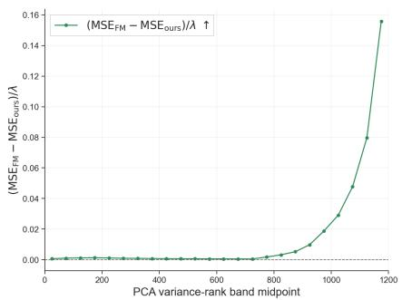  
(a) CIFAR100

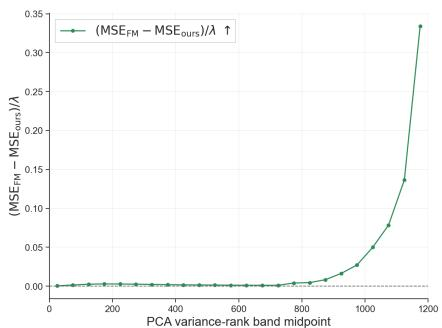  
(b) NABirds  
Figure 3: Difference in reconstruction errors across the principal components. We compute the mean reconstruction error between the teacher representation and the student, and report $e _ { k } ^ { \mathrm { F M } } - e _ { k } ^ { \mathrm { o u r s } }$ normalized by the teacher variance $\lambda _ { k }$ . A higher value shows that SpecMatch reconstructs the teacher representation more accurately than the feature matching baseline.

Table 2: Experiments on distillation with ImageNet. All models are evaluated with classification accuracy (%) after linear-probing on the corresponding labeled subset.
<table><tr><td>Teacher</td><td>Student</td><td>Params</td><td>Initialization</td><td>Method</td><td>5-shot</td><td>10-shot</td><td>Full-shot</td></tr><tr><td>PE-Core-G14</td><td>ViT-Tiny</td><td>5.5M</td><td>Scratch</td><td>DINO FM SpecMatch</td><td>31.3 48.4 50.2</td><td>37.2 51.6 52.7</td><td>54.6 57.6 58.4</td></tr><tr><td>ConvNEXT-XLarge</td><td>ConvNEXT-Tiny</td><td>27.8M</td><td>Scratch</td><td>DINO FM SpecMatch</td><td>36.4 57.6 61.2</td><td>42.9 60.6 63.9</td><td>54.7 67.1 70.0</td></tr><tr><td>PE-Core-G14</td><td>PE-Core-T14</td><td>6.1M</td><td>Pretrained</td><td>Base DINO FM SpecMatch</td><td>45.3 60.0 59.3 60.3</td><td>52.1 62.6 63.5 64.4</td><td>68.1 68.3 72.1 73.1</td></tr></table>

SpecMatch provides larger gains on fine-grained recognition. Second, the improvement over the feature matching (FM) baseline is relatively modest on general recognition tasks such as CIFAR-10 and CIFAR-100, whereas substantially larger gains are observed on fine-grained datasets such as CUB and NABirds. This trend is consistent with the analysis in Figure 1, which shows that general recognition primarily relies on high-variance feature directions, while fine-grained recognition benefits more from preserving lower-variance components.

SpecMatch is effective for domain generalization. SpecMatch yields large improvements on domain generalization benchmarks. We conjecture that preserving richer representations leads to more transferable and robust representations, thereby improving generalization to unseen domains.

The student can even surpass the teacher on out-of-domain tasks. Finally, the student frequently surpasses the teacher on several domains, particularly OCR, medical imaging, and remote sensing, even with FM. These domains are likely underrepresented in the teacher’s pretraining data, suggesting that our distillation strategy enables the student to leverage the teacher’s rich representations while adapting them more effectively to out-of-domain tasks.

## 5.2 ANALYSIS.

Reconstruction Error in each basis. Figure 3 compares the reconstruction errors of Feature Matching (FM) and SpecMatch along each principal direction. Let $e _ { k } ^ { \mathrm { F M } }$ and $e _ { k } ^ { \mathrm { o u r s } }$ denote the mean squared reconstruction errors along the k-th principal direction for FM and SpecMatch, respectively. We visualize their difference, $e _ { k } ^ { \mathrm { { \breve { F M } } } } - e _ { k } ^ { \mathrm { { o u r s } } }$ , normalized by the teacher variance $\lambda _ { k }$ along the corresponding direction. Positive values indicate that SpecMatch reconstructs the teacher representations more accurately than FM. SpecMatch consistently achieves lower reconstruction error across the entire spectrum, demonstrating that the improvement is not limited to a specific subset of principal components. Notably, the gain becomes substantially larger for low-variance components, indicating that our objective effectively addresses the optimization imbalance highlighted in Fig. 1, where conventional feature matching tends to underfit low-variance directions. This observation further suggests that improving the reconstruction of these previously under-learned directions contributes directly to the superior downstream performance. Interestingly, although our objective balances optimization across spectral directions, it also yields a small but consistent improvement in high-variance components. This suggests that balancing the optimization landscape not only prevents the neglect of low-variance directions but also facilitates overall optimization, leading to better reconstruction even in the dominant spectral components.

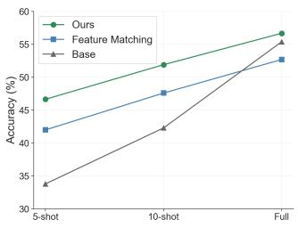  
(a) NABirds

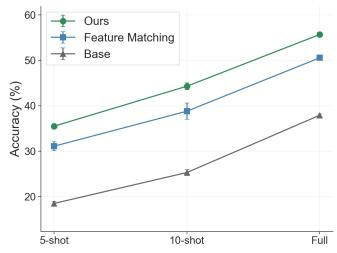  
(b) FGVC

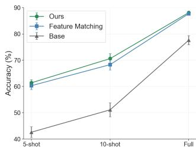  
(c) GTSRB  
Figure 4: Linear probing with different shots. Our approach consistently improves performance over the base student model while vanilla feature matching sometimes fails in improving as in NABirds full-shot case (a).

Table 3: (Left): Sensitivity analysis for $\beta ^ { - 1 } . \ \beta = 1$ corresponds to vanilla feature matching, while $\beta ^ { - 1 } = 2$ and 3 consistently improve performance. (Right): Comparison among different objectives, including L1, cosine distance, and L2 + whitening. SpecMatch is the best or the second best approach in these results.
<table><tr><td colspan="4">β-1 ImageNet NAB CIF100 SVHN</td></tr><tr><td>1 (FM)</td><td>72.1 60.7</td><td>76.2</td><td>87.2</td></tr><tr><td>2</td><td>72.7 62.3</td><td>77.5</td><td>89.4</td></tr><tr><td>3</td><td>73.1 64.2</td><td>77.6</td><td>89.5</td></tr><tr><td>4</td><td>72.9 64.9</td><td>77.8</td><td>89.9</td></tr><tr><td>5</td><td>72.9 64.9</td><td>78.2</td><td>89.4</td></tr></table>

<table><tr><td>Objective</td><td>NAB</td><td>CIF100</td><td>Cam17</td><td>GTSRB</td><td>SVHN</td><td>FmoW</td></tr><tr><td>L1</td><td>63.6</td><td>76.4</td><td>94.3</td><td>93.9</td><td>88.9</td><td>38.8</td></tr><tr><td>Cosine</td><td>61.3</td><td>75.8</td><td>93.2</td><td>92.4</td><td>87.1</td><td>37.3</td></tr><tr><td>L2</td><td>62.6</td><td>76.0</td><td>93.0</td><td>93.9</td><td>87.6</td><td>39.0</td></tr><tr><td>L2 + Whitening</td><td>63.2</td><td>77.8</td><td>93.1</td><td>91.6</td><td>86.7</td><td>39.4</td></tr><tr><td>SpecMatch</td><td>64.8</td><td>77.6</td><td>93.9</td><td>94.6</td><td>89.5</td><td>42.1</td></tr></table>

Experiments on ImageNet. Table 2 presents analysis on ImageNet. We train a student model from scratch or fine-tune a pre-trained student model. In both cases, the models are trained without labels. Our objective shows consistent improvement over vanilla feature matching. These results indicate that the proposed method remains effective even on a large-scale dataset such as ImageNet. Furthermore, the improvements are consistently observed under both 5-shot and 10-shot linear evaluation protocols.

Few-shot probing. Figure 4 presents few-shot linear probing results on fine-grained datasets (NABirds and FGVC Aircraft (Maji et al., 2013)) and GTSRB. Compared with vanilla feature matching, our method consistently improves performance across all datasets and shot settings. The gains are particularly pronounced on the fine-grained datasets, suggesting that balancing feature learning across spectral directions is especially beneficial for tasks requiring subtle visual discrimination. Moreover, while the distilled representations consistently outperform the original student representations, the improvements are larger in the few-shot regime than in the full-shot setting. As more labeled data becomes available, the performance gap gradually narrows.

Analysis of the distance function. Previous feature matching methods have employed L1, L2, or cosine distance. We therefore compare these objectives in the right part of Table 3. SpecMatch achieves either the best or second-best performance on all datasets, yielding the strongest performance on average. In contrast, none of the conventional distance functions consistently performs well across datasets: each can be effective on certain tasks but performs relatively poorly on others. These results demonstrate the robustness of SpecMatch across diverse downstream tasks.

Does whitening target features improve performance? Given the discussion in Sec. 3.2, a natural alternative for balancing the training signal is to whiten the target features, i.e., normalizing each spectral direction by its variance, as studied by Ranzinger et al. (2024a). We therefore train the student to predict whitened teacher features after PCA projection using an MSE loss. The right of Table 3 shows that whitening does not necessarily improve the performance over the L2 distance. We hypothesize that this is because whitening completely equalizes the training signal, disregarding the relative importance of high-variance directions that may capture prominent variations in the data. In contrast, SpecMatch reduces the imbalance across spectral directions while preserving their relative importance, which we find more effective for downstream performance.

Table 4: Study on imbalanced data distribution using PE-Core-G14 and PE-Core-Tiny as teacher and student, respectively. (Left): Anomaly detection performance (AUROC) on ViSA with different numbers of anomaly samples used for distillation. (Right): Results on iNaturalist2018 across head, medium, and tail classes.
<table><tr><td rowspan="2">Method</td><td colspan="4">ViSA # Anomaly Samples</td></tr><tr><td>100</td><td>200</td><td>500</td><td>1000</td></tr><tr><td>Teacher</td><td colspan="4">0.898 0.825</td></tr><tr><td>Student</td><td colspan="4"></td></tr><tr><td>FM</td><td>0.835</td><td>0.851</td><td>0.863</td><td>0.880</td></tr><tr><td>SpecMatch</td><td>0.851</td><td>0.867</td><td>0.873</td><td>0.896</td></tr></table>

<table><tr><td rowspan="2">Method</td><td colspan="4">iNaturalist2018</td></tr><tr><td>Head</td><td>Medium</td><td>Tail</td><td>All</td></tr><tr><td>Teacher</td><td>86.7</td><td>78.0</td><td>73.7</td><td>77.2</td></tr><tr><td>Student</td><td>54.2</td><td>47.2</td><td>44.5</td><td>46.8</td></tr><tr><td>FM</td><td>60.3</td><td>51.8</td><td>51.0</td><td>52.3</td></tr><tr><td>SpecMatch</td><td>61.3</td><td>52.7</td><td>52.0</td><td>53.3</td></tr></table>

Table 5: Protein downstream performance on six PFMBench tasks. Results are scaled by 100 and reported as mean ± standard deviation over three runs. Higher is better for all metrics.
<table><tr><td>Method</td><td colspan="2">Fold: 1195 classes</td><td colspan="2">GO-MF: 489 classes</td><td colspan="2">GO-CC: 320 classes</td><td colspan="2">EC: 585 classes</td><td colspan="2"> $\begin{array} { r } { \mathrm { C a t . ~ E f f . : \ r e g r e s s i o n ~ } } \\ { \mathrm { V a l ~ } \qquad \mathrm { T e s t } } \end{array}$ </td><td colspan="2">DeepLoc2: 10 classes</td></tr><tr><td></td><td>Val</td><td>Test</td><td>Val</td><td>Test</td><td>Val</td><td>Test</td><td>Val</td><td>Test</td><td></td><td></td><td>Val</td><td>Test</td></tr><tr><td>Teacher (ESM-2 650M) Student (ESM-2 6M)</td><td> $7 5 . 0 { \scriptstyle \pm 0 . 1 }$ </td><td>73.1±0.3</td><td> $5 5 . 6 { \scriptstyle \pm 0 . 2 }$  34.5±0.4</td><td> $5 5 . 5 { \pm } 0 . 4 $ </td><td> $4 5 . 7 { \scriptstyle \pm 0 . 4 }$ </td><td>47.6±0.2</td><td> $5 8 . 8 { \scriptstyle \pm 0 . 2 }$ </td><td> $5 9 . 8 { \scriptstyle \pm 0 . 2 }$ </td><td> $7 . 5 { \pm } 0 . 4 $ </td><td>10.6±0.5</td><td> $7 1 . 7 { \scriptstyle \pm 0 . 5 }$ </td><td> $7 0 . 9 { \scriptstyle \pm 0 . 1 }$ </td></tr><tr><td></td><td>49.4±0.3</td><td>51.2±0.2</td><td></td><td>36.6±0.3</td><td>30.4±0.5</td><td> $2 9 . 7 { \scriptstyle \pm 0 . 2 }$ </td><td> $3 8 . 7 { \scriptstyle \pm 0 . 1 }$ </td><td> $4 0 . 1 { \pm } 0 . 3 $ </td><td>14.3±0.3</td><td> $1 7 . 0 { \scriptstyle \pm 0 . 5 }$ </td><td>64.3±0.1</td><td> $6 2 . 9 2 0 . 1 $ </td></tr><tr><td>L1</td><td>52.6±0.3</td><td> $5 3 . 1 _ { \pm 0 . 3 }$ </td><td> $3 6 . 5 { \scriptstyle \pm 0 . 1 }$ </td><td>37.5±0.2</td><td> $3 5 . 2 _ { \pm 0 . 1 }$ </td><td>34.8±0.1</td><td> $3 8 . 3 { \scriptstyle \pm 0 . 2 }$ </td><td>40.9±0.4</td><td> $2 0 . 7 _ { \pm 1 . 3 }$ </td><td>22.0±0.8</td><td> ${ \bf 7 0 . 1 _ { \pm 0 . 1 } }$ </td><td> $6 8 . 4 _ { \pm 0 . 1 }$ </td></tr><tr><td>L2</td><td> $5 1 . 9 { \scriptstyle \pm 0 . 2 }$ </td><td> $5 2 . 2 _ { \pm 0 . 3 }$ </td><td>36.8±0.2</td><td> $3 8 . 0 { \scriptstyle \pm 0 . 2 }$ </td><td>35.2±0.2</td><td> $3 5 . 3 { \scriptstyle \pm 0 . 3 }$ </td><td> $3 9 . 9 { \scriptstyle \pm 0 . 4 }$ </td><td> $4 1 . 0 { \scriptstyle \pm 0 . 4 }$ </td><td> $1 8 . 8 { \scriptstyle \pm 1 . 3 }$ </td><td> $2 7 . 0 { \scriptstyle \pm 0 . 8 }$ </td><td> $6 9 . 6 _ { \pm 0 . 1 }$ </td><td> $6 8 . 5 { \scriptstyle \pm 0 . 1 }$ </td></tr><tr><td>SpecMatch</td><td> ${ \bf 5 4 . 4 _ { \pm 0 . 6 } }$ </td><td> ${ \bf 5 5 . 6 _ { \pm 0 . 5 } }$ </td><td>38.6±0.2</td><td> $\mathbf { 3 9 . 6 _ { \pm 0 . 1 } }$ </td><td>35.8±0.2</td><td> $\mathbf { 3 5 . 8 _ { \pm 0 . 2 } }$ </td><td> ${ \bf 4 1 . 7 _ { \pm 0 . 3 } }$ </td><td> $\mathbf { 4 2 . 0 } _ { \pm 0 . 6 } ^ { - }$ </td><td> ${ \bf 2 1 . 3 _ { \pm 0 . 6 } }$ </td><td> $\mathbf { 3 0 . 7 _ { \pm 1 . 0 } }$ </td><td>69.9±0.3</td><td> ${ \bf 6 9 . 2 _ { \pm 0 . 1 } }$ </td></tr></table>

Hyper-parameter sensitivity. The left part of Table 3 studies the effect of $\beta .$ . Increasing $\beta ^ { - 1 }$ from 1 progressively balances the contributions of different spectral directions. All tested values improve performance over the unweighted baseline, while the differences among them remain relatively small. Thus, the proposed method is not highly sensitive to $\beta$ within the evaluated range.

Robustness to imbalanced class distribution. Table 4 analyzes the effectiveness of SpecMatch under imbalanced unlabeled data distributions. On the left, we progressively reduce the number of unlabeled anomaly samples used during distillation. As the number of anomaly samples decreases, the overall performance gradually drops, likely because anomaly-specific feature patterns are observed less frequently during training and therefore receive fewer optimization updates. Nevertheless, SpecMatch consistently outperforms vanilla feature matching across all settings, demonstrating its robustness even when anomaly samples are scarce. On the right of Table 4, we assess on iNatural ist2018 (Van Horn et al., 2018), a long-tailed recognition dataset with $^ { 8 , }$ 142 categories. SpecMatch consistently improves over the baseline on all metrics. These indicate that the proposed objective remains effective under highly imbalanced class distributions and learns more discriminative representations for both well-represented and under-represented classes.

Experiments on protein embedding model. SpecMatch also generalizes to protein foundation models. We distill ESM-2 650M into ESM-2 6M (Lin et al., 2023) and evaluate the learned representations via linear probing on six PFMBench tasks (Gao et al., 2025). Fold denotes protein fold classification on the Remote Homology benchmark (Lo Conte et al., 2000). GO-MF and GO-CC are multi-label Gene Ontology prediction tasks for molecular function and cellular component, respectively (Ashburner et al., 2000). EC denotes multi-label enzyme commission number prediction (Bairoch, 2000). Cat. Eff. measures enzyme catalytic efficiency prediction using Spearman correlation (Li et al., 2022), while DeepLoc2 evaluates multi-label protein subcellular localization prediction (Thumuluri et al., 2022). As in the image experiments, distillation is performed separately on the training set of each task, and evaluation follows the official protocol and metrics. The consistent improvements across these diverse tasks suggest that useful information is distributed beyond high-variance components in both image and protein representations. Thus, spectral balancing provides a robust feature-distillation objective that generalizes across modalities.

## 6 CONCLUSION

We presented Spectrum-Balanced Feature Matching, SpecMatch, a simple and effective objective for feature distillation that addresses the imbalance of optimization across spectral directions. By dynamically reweighting the reconstruction loss according to the reconstruction error of each principal component, the proposed objective encourages the student to learn richer feature representations while introducing negligible computational overhead. Extensive experiments on diverse downstream tasks demonstrate that SpecMatch consistently improves over conventional feature matching across a wide range of teacher–student combinations and datasets. We hope that this work provides a simple yet effective direction for improving feature distillation.

## ACKNOWLEDGEMENT

This research was supported by JST PRESTO, Japan, Grant Number JPMJPR2523. This work was partly achieved through the use of SQUID at D3 Center, The University of Osaka. This research was conducted using the Supermicro ARS-111GL-DNHR-LCC and FUJITSU Server PRIMERGY CX2550 M7 (Miyabi) at Joint Center for Advanced High Performance Computing (JCAHPC). This work was supported in part by the Physical AI Development Support Program by AWS Japan through the provision of computational resources.

## AI USE STATEMENT

In this work, we used generative AI tools to assist with writing code and with manuscript writing/editing. All AI-assisted outputs were reviewed by the authors. In particular, AI-assisted code was inspected and verified by the authors, and AI-assisted text was edited and checked for accuracy, consistency with the experiments, and originality. We take responsibility for the final content of this work, including all text, claims, code, and artifacts produced with the aid of generative AI.

## ETHICS STATEMENT

This work studies knowledge distillation and representation transfer using publicly available datasets and pretrained models. Our experiments do not involve human subjects or the collection of personally identifiable or sensitive information. We follow the licenses and intended research use of the datasets and models used in our experiments. We do not identify any direct ethical concerns specific to the proposed methodology beyond those generally associated with the underlying pretrained models and datasets.

## REPRODUCIBILITY STATEMENT

The Pytorch-style code of the proposed objective is shown in Algorithm 1. The overview of the experimental setup is described in Sec. 5.1. More specific details of the experiments, e.g., models and hyper-parameters, are described in the Sec. C. We will also release the code used for our experiments upon acceptance.

## REFERENCES

Michael Ashburner, Catherine A Ball, Judith A Blake, David Botstein, Heather Butler, J Michael Cherry, Allan P Davis, Kara Dolinski, Selina S Dwight, Janan T Eppig, et al. Gene ontology: tool for the unification of biology. Nature genetics, 25(1):25–29, 2000.

Amos Bairoch. The enzyme database in 2000. Nucleic acids research, 28(1):304–305, 2000.

Peter Bandi, Oscar Geessink, Quirine Manson, Mayer Reiter, Marc Balkenhol, Meyke Hermsen, Babak Ehteshami Bejnordi, Brenda Bandettini di Poggio, Iris Rutgers, Geert Litjens, and et al. From detection of individual metastases to classification of lymph node status at the patient level: The camelyon17 challenge. IEEE Transactions on Medical Imaging, 38(2):550–560, 2019. doi: 10.1109/TMI.2018.2867350.

Sara Beery, Grant Van Horn, and Pietro Perona. Recognition in terra incognita. In ECCV, 2018.

Paul Bergmann, Michael Fauser, David Sattlegger, and Carsten Steger. Mvtec ad – a comprehensive real-world dataset for unsupervised anomaly detection. In CVPR, 2019.

Daniel Bolya, Po-Yao Huang, Peize Sun, Jang Hyun Cho, Andrea Madotto, Chen Wei, Tengyu Ma, Jiale Zhi, Jathushan Rajasegaran, Hanoona Bangalath, et al. Perception encoder: The best visual embeddings are not at the output of the network. NeurIPS, 38:60884–60937, 2026.

Mathilde Caron, Hugo Touvron, Ishan Misra, Herve J´ egou, Julien Mairal, Piotr Bojanowski, and´ Armand Joulin. Emerging properties in self-supervised vision transformers. In ICCV, 2021.

Pengguang Chen, Shu Liu, Hengshuang Zhao, and Jiaya Jia. Distilling knowledge via knowledge review. In CVPR, 2021.

Gong Cheng, Junwei Han, and Xiaoqiang Lu. Remote sensing image scene classification: Benchmark and state of the art. Proceedings of the IEEE, 105(10):1865–1883, Oct 2017. ISSN 1558- 2256. doi: 10.1109/jproc.2017.2675998. URL http://dx.doi.org/10.1109/JPROC. 2017.2675998.

Gordon Christie, Neil Fendley, James Wilson, and Ryan Mukherjee. Functional map of the world. In CVPR, 2018.

Yung-Sung Chuang, Yang Li, Dong Wang, Ching-Feng Yeh, Kehan Lyu, Ramya Raghavendra, Jim Glass, Lifei Huang, Jason Weston, Luke Zettlemoyer, et al. Meta clip 2: A worldwide scaling recipe. NeurIPS, 38:48009–48036, 2026.

Jia Deng, Wei Dong, Richard Socher, Li-Jia Li, Kai Li, and Li Fei-Fei. Imagenet: A large-scale hierarchical image database. In CVPR, pp. 248–255, 2009.

Zhangyang Gao, Hao Wang, Cheng Tan, Chenrui Xu, Mengdi Liu, Bozhen Hu, Linlin Chao, Xiaoming Zhang, and Stan Z Li. Pfmbench: Protein foundation model benchmark. arXiv preprint arXiv:2506.14796, 2025.

Quentin Garrido, Randall Balestriero, Laurent Najman, and Yann Lecun. Rankme: Assessing the downstream performance of pretrained self-supervised representations by their rank. In ICML. PMLR, 2023.

Bobby He and Mete Ozay. Exploring the gap between collapsed & whitened features in selfsupervised learning. In ICML. PMLR, 2022.

Patrick Helber, Benjamin Bischke, Andreas Dengel, and Damian Borth. Eurosat: A novel dataset and deep learning benchmark for land use and land cover classification. IEEE Journal ofSelected Topics in Applied Earth Observations and Remote Sensing, 2019.

Byeongho Heo, Jeesoo Kim, Sangdoo Yun, Hyojin Park, Nojun Kwak, and Jin Young Choi. A comprehensive overhaul of feature distillation. In ICCV, pp. 1921–1930, 2019.

Geoffrey Hinton, Oriol Vinyals, and Jeff Dean. Distilling the knowledge in a neural network. arXiv preprint arXiv:1503.02531, 2015.

Andrew Howard, Mark Sandler, Grace Chu, Liang-Chieh Chen, Bo Chen, Mingxing Tan, Weijun Wang, Yukun Zhu, Ruoming Pang, Vijay Vasudevan, et al. Searching for mobilenetv3. In ICCV, 2019.

Jinseong Jang, Chunfei Ma, and Byeongwon Lee. Vl2lite: Task-specific knowledge distillation from large vision-language models to lightweight networks. In CVPR, 2025.

Li Jing, Pascal Vincent, Yann LeCun, and Yuandong Tian. Understanding dimensional collapse in contrastive self-supervised learning. arXiv preprint arXiv:2110.09348, 2021.

Alex Krizhevsky. Learning multiple layers of features from tiny images. Technical report, University of Toronto, 2009.

Jungsoo Lee, Debasmit Das, Munawar Hayat, Sungha Choi, Kyuwoong Hwang, and Fatih Porikli. Customkd: Customizing large vision foundation for edge model improvement via knowledge distillation. In CVPR, 2025.

Seung Hyun Lee, Dae Ha Kim, and Byung Cheol Song. Self-supervised knowledge distillation using singular value decomposition. In ECCV, 2018.

Feiran Li, Le Yuan, Hongzhong Lu, Gang Li, Yu Chen, Martin KM Engqvist, Eduard J Kerkhoven, and Jens Nielsen. Deep learning-based k cat prediction enables improved enzyme-constrained model reconstruction. Nature catalysis, 5(8):662–672, 2022.

Zeming Lin, Halil Akin, Roshan Rao, Brian Hie, Zhongkai Zhu, Wenting Lu, Nikita Smetanin, Robert Verkuil, Ori Kabeli, Yaniv Shmueli, Allan dos Santos Costa, Maryam Fazel-Zarandi, Tom Sercu, Salvatore Candido, and Alexander Rives. Evolutionary-scale prediction of atomic-level protein structure with a language model. Science, 379(6637):1123–1130, 2023. doi: 10.1126/ science.ade2574.

Loredana Lo Conte, Bart Ailey, Tim JP Hubbard, Steven E Brenner, Alexey G Murzin, and Cyrus Chothia. Scop: a structural classification of proteins database. Nucleic acids research, 28(1): 257–259, 2000.

Ilya Loshchilov and Frank Hutter. Decoupled weight decay regularization. In ICLR, 2019.

Subhransu Maji, Juho Kannala, Esa Rahtu, Matthew Blaschko, and Andrea Vedaldi. Fine-grained visual classification of aircraft. arXiv preprint arXiv:1306.5151, 2013.

Roy Miles and Krystian Mikolajczyk. Understanding the role of the projector in knowledge distillation. In AAAI, 2024.

Roy Miles, Ismail Elezi, and Jiankang Deng. v k d: Improving knowledge distillation using orthogonal projections. In CVPR. IEEE, 2024.

Maxime Oquab, Timothee Darcet, Th´ eo Moutakanni, Huy Vo, Marc Szafraniec, Vasil Khalidov,´ Pierre Fernandez, Daniel Haziza, Francisco Massa, Alaaeldin El-Nouby, et al. Dinov2: Learning robust visual features without supervision. arXiv preprint arXiv:2304.07193, 2023.

Wonpyo Park, Dongju Kim, Yan Lu, and Minsu Cho. Relational knowledge distillation. In CVPR, 2019.

Alec Radford, Jong Wook Kim, Chris Hallacy, Aditya Ramesh, Gabriel Goh, Sandhini Agarwal, Girish Sastry, Amanda Askell, Pamela Mishkin, Jack Clark, Gretchen Krueger, and Ilya Sutskever. Learning transferable visual models from natural language supervision. In ICML, 2021.

Mike Ranzinger, Jon Barker, Greg Heinrich, Pavlo Molchanov, Bryan Catanzaro, and Andrew Tao. Phi-s: Distribution balancing for label-free multi-teacher distillation. arXiv preprint arXiv:2410.01680, 2024a.

Mike Ranzinger, Greg Heinrich, Jan Kautz, and Pavlo Molchanov. Am-radio: Agglomerative vision foundation model reduce all domains into one. In CVPR, 2024b.

Adriana Romero, Nicolas Ballas, Samira Ebrahimi Kahou, Antoine Chassang, Carlo Gatta, and Yoshua Bengio. FitNets: Hints for thin deep nets, 2015. URL https://arxiv.org/abs/ 1412.6550.

Mert Bulent Sarıyıldız, Philippe Weinzaepfel, Thomas Lucas, Diane Larlus, and Yannis Kalantidis.¨ Unic: Universal classification models via multi-teacher distillation. In ECCV. Springer, 2024.

Oriane Simeoni, Huy V Vo, Maximilian Seitzer, Federico Baldassarre, Maxime Oquab, Cijo Jose, ´ Vasil Khalidov, Marc Szafraniec, Seungeun Yi, Michael Ramamonjisoa, et al. Dinov3.¨ arXiv preprint arXiv:2508.10104, 2025.

Vineet Thumuluri, Jose Juan Almagro Armenteros, Alexander Rosenberg Johansen, Henrik Nielsen,´ and Ole Winther. Deeploc 2.0: multi-label subcellular localization prediction using protein language models. Nucleic acids research, 50(W1):W228–W234, 2022.

Yonglong Tian, Dilip Krishnan, and Phillip Isola. Contrastive representation distillation. In ICLR, 2020.

Grant Van Horn, Oisin Mac Aodha, Yang Song, Yin Cui, Chen Sun, Alex Shepard, Hartwig Adam, Pietro Perona, and Serge Belongie. The inaturalist species classification and detection dataset. In CVPR, 2018.

Raviteja Vemulapalli, Hadi Pouransari, Fartash Faghri, Sachin Mehta, Mehrdad Farajtabar, Mohammad Rastegari, and Oncel Tuzel. Knowledge transfer from vision foundation models for efficient training of small task-specific models. In ICML, 2024.

Catherine Wah, Steve Branson, Peter Welinder, Pietro Perona, and Serge Belongie. The caltech-ucsd birds-200-2011 dataset. California Institute ofTechnology, 2011.

Tao Wang, Li Yuan, Xiaopeng Zhang, and Jiashi Feng. Distilling object detectors with fine-grained feature imitation. In CVPR, 2019.

Hu Xu, Saining Xie, Xiaoqing Tan, Po-Yao Huang, Russell Howes, Vasu Sharma, Shang-Wen Li, Gargi Ghosh, Luke Zettlemoyer, and Christoph Feichtenhofer. Demystifying clip data. In ICLR, volume 2024, pp. 47812–47831, 2024.

Jiancheng Yang, Rui Shi, Donglai Wei, Zequan Liu, Lin Zhao, Bilian Ke, Hanspeter Pfister, and Bingbing Ni. Medmnist v2-a large-scale lightweight benchmark for 2d and 3d biomedical image classification. Scientific Data, 10(1):41, 2023.

Jure Zbontar, Li Jing, Ishan Misra, Yann LeCun, and Stephane Deny. Barlow twins: Self-supervised´ learning via redundancy reduction. In ICML. PMLR, 2021.

Yitian Zhang, Xu Ma, Yue Bai, Huan Wang, and Yun Fu. Accessing vision foundation models via imagenet-1k. In ICLR, 2025.

Yang Zou, Jongheon Jeong, Latha Pemula, Dongqing Zhang, and Onkar Dabeer. Spot-the-difference self-supervised pre-training for anomaly detection and segmentation. In ECCV, 2022.

## A APPENDIX

## B THEORETICAL MOTIVATION

Insights into vanilla feature matching. We analyze conventional feature matching from the perspective of the principal components of the teacher representation. Let $z _ { b } ^ { t } \in \mathbb { R } ^ { d }$ denote the centered teacher representation for the b-th sample, and let $\tilde { z } _ { b } ^ { s } \in \mathbb { R } ^ { d }$ denote the corresponding student prediction. We apply PCA to the teacher representations and denote the resulting orthonormal principal directions by $\{ u _ { k } \} _ { k = 1 } ^ { d }$ . The teacher representation can then be written as

$$
\boldsymbol { z } _ { b } ^ { t } = \sum _ { k = 1 } ^ { d } \boldsymbol { c } _ { b , k } ^ { t } \boldsymbol { u } _ { k } ,\tag{8}
$$

where

$$
\begin{array} { r } { c _ { b , k } ^ { t } = u _ { k } ^ { \top } z _ { b } ^ { t } . } \end{array}\tag{9}
$$

We similarly denote the student prediction along the k-th principal direction by $\tilde { c } _ { b , k } ^ { s }$ . Since the PCA basis is orthonormal, projecting both representations onto this basis does not change the conventional feature matching objective:

$$
\left\| \tilde { z } _ { b } ^ { s } - z _ { b } ^ { t } \right\| _ { 2 } ^ { 2 } = \sum _ { k = 1 } ^ { d } \left( \tilde { c } _ { b , k } ^ { s } - c _ { b , k } ^ { t } \right) ^ { 2 } .\tag{10}
$$

Thus, expressing feature matching in the PCA basis is equivalent to conventional feature matching. The standard feature matching objective is given by

$$
\mathcal { L } _ { \mathrm { F M } } = \sum _ { k = 1 } ^ { d } e _ { k } , \qquad e _ { k } = \frac { 1 } { B } \sum _ { b = 1 } ^ { B } \left( \tilde { c } _ { b , k } ^ { s } - c _ { b , k } ^ { t } \right) ^ { 2 } ,\tag{11}
$$

where $e _ { k }$ denotes the batch-averaged reconstruction error along the k-th principal direction.

Reconstruction error and teacher variance. Let

$$
\lambda _ { k } = \mathrm { V a r } ( c _ { k } ^ { t } ) , \qquad v _ { k } = \mathrm { V a r } ( \tilde { c } _ { k } ^ { s } ) ,\tag{12}
$$

and let $\rho _ { k }$ denote the correlation coefficient between $c _ { k } ^ { t }$ and $\tilde { c } _ { k } ^ { s }$ . Furthermore, define the difference between their means as

$$
b _ { k } = \mathbb { E } [ \tilde { c } _ { k } ^ { s } ] - \mathbb { E } [ c _ { k } ^ { t } ] .\tag{13}
$$

The expected reconstruction error satisfies

$$
\begin{array} { r l } & { \mathbb { E } [ e _ { k } ] = \mathbb { E } \left[ \left( \tilde { c } _ { k } ^ { s } - c _ { k } ^ { t } \right) ^ { 2 } \right] } \\ & { \quad \quad = \lambda _ { k } + v _ { k } - 2 \rho _ { k } \sqrt { \lambda _ { k } v _ { k } } + b _ { k } ^ { 2 } . } \end{array}\tag{14}
$$

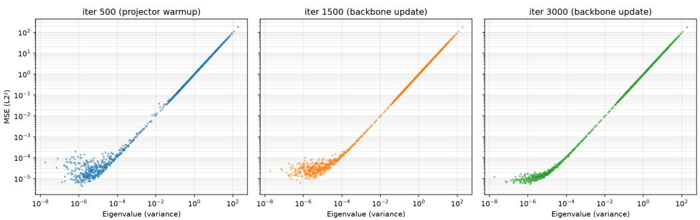  
Figure 5: Eigenvalues (x-axis) and reconstruction error.

At the early stage of training, the student prediction is largely uninformative about the teacher prin cipal directions. It is therefore reasonable to assume that

$$
\rho _ { k } \approx 0 , \qquad v _ { k } \approx v , \qquad b _ { k } \approx b ,\tag{15}
$$

where v and b are approximately constant across principal components. Under these assumptions,

$$
\begin{array} { r } { \mathbb { E } [ e _ { k } ] \approx \lambda _ { k } + C , \qquad C = v + b ^ { 2 } . } \end{array}\tag{16}
$$

Therefore, at the early stage of training, the reconstruction error is approximately an affine function of the teacher variance.

## Dominance in optimization. Let

$$
r _ { b , k } = \tilde { c } _ { b , k } ^ { s } - c _ { b , k } ^ { t }\tag{17}
$$

denote the residual along the k-th principal direction. The gradient of the feature matching objective with respect to the student prediction is

$$
\frac { \partial \mathcal { L } _ { \mathrm { F M } } } { \partial \tilde { c } _ { b , k } ^ { s } } = \frac { 2 } { B d } r _ { b , k } .\tag{18}
$$

Consequently, the squared norm of the output-space gradient associated with the k-th principal direction is

$$
\begin{array} { r l } & { \left\| \nabla _ { \tilde { c } _ { : , k } ^ { s } } \mathcal { L } _ { \mathrm { F M } } \right\| _ { 2 } ^ { 2 } = \displaystyle \sum _ { b = 1 } ^ { B } \left( \frac { 2 } { B d } r _ { b , k } \right) ^ { 2 } } \\ & { \qquad = \displaystyle \frac { 4 } { B d ^ { 2 } } e _ { k } . } \end{array}\tag{19}
$$

Thus, the gradient magnitude contributed by each principal direction is directly proportional to its reconstruction error. Combining Equation 16 and 19 gives

$$
\mathbb { E } \left[ \left\| \nabla _ { \tilde { c } _ { : , k } ^ { s } } \mathcal { L } _ { \mathrm { F M } } \right\| _ { 2 } ^ { 2 } \right] \approx \frac { 4 } { B d ^ { 2 } } \left( \lambda _ { k } + C \right) .\tag{20}
$$

Hence, high-variance principal components produce larger reconstruction errors and stronger optimization signals, causing conventional feature matching to preferentially fit the dominant spectral directions of the teacher representation.

Empirical analysis. Fig. 5 describes the eigenvalues and corresponding error in the axis. Fig. 6 describes the reconstruction error along principal components with L2-distance feature matching loss. Fig. 5 empirically supports the Equation 16, i.e., the error is proportional to the eigenvalues. Also, the trend is consistent across different training iterations.

## C EXPERIMETAL DETAILS

We provide additional details on the datasets and experimental settings used in our experiments. Table 6 summarizes the datasets used in the experiments reported in Table 1. We report the number of

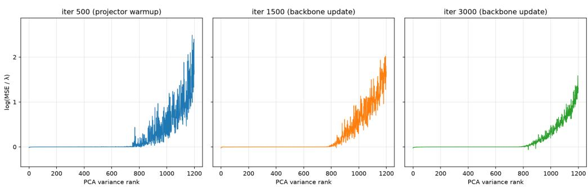  
Figure 6: Reconstruction error along principal components.

Algorithm 1 PyTorch-style pseudocode for SpecMatch.

```python
def specmatch_loss(student, teacher, beta_inv=3.0, eps=1e-3):
# student and teacher: PCA coefficients shaped (B, D)."""
# reconstruction error for each principal direction
error = (student - teacher).pow(2).mean(dim=0)
beta = 1.0 / beta_inv
# mitigate the imbalance across principal directions
loss = (error + eps).pow(beta).mean()
return loss
```

training and test samples and the number of classes for each dataset. Similarly, Table 7 summarizes the statistics of the protein datasets used in the experiments reported in Table 5.

Experimental settings for Table 1. We use AdamW as the optimizer in all experiments. The learning rate for the backbone is set to $1 \times 1 0 ^ { - 4 }$ by default, while we use a smaller learning rate of $1 \times \overline { { 1 } } 0 ^ { - 5 }$ for MVTec and iWildCam. The learning rate for the projector is set to $1 \times 1 0 ^ { - 5 }$ . We first trained only the linear projector for 500 iterations as a warm-up, and then jointly trained the backbone and projector for an additional 2,500 iterations. These hyperparameters are kept fixed across all three teacher–student combinations to ensure a consistent comparison. We set ϵ as 1e-3 and 1e-4 for the training on PE-Core-Tiny and MobileNet-V3, respectively.

Experiments on ViSA and MvTec. During the distillation training using unlabeled data, we employ both normal and anomaly samples as training data. For the experiments on ViSA, we employ a few labeled normal and anomaly data to train a linear classifier following their evaluation protocol. For the experiments on MvTec, we employ the nearest neighbor distance to the normal samples to compute the anomaly score.

Experiments on ImageNet. We use a batch size of 512 and train for 200,000 iterations. When initializing the model with PE-Core-Tiny, we use a fixed learning rate of $1 \times 1 0 ^ { - 5 }$ throughout training. For training from scratch, we use an initial learning rate of $\overline { { 1 } } \times 1 0 ^ { - 3 }$ and decay the learning rate using a cosine schedule.

Protein Experiments. For the protein-related experiments in Table 5, we use AdamW with a learning rate of $\bar { 1 \times 1 0 ^ { - 4 } }$ . The learning rate is kept fixed throughout training. Since the number of training samples varies substantially across the protein datasets, we adjust the number of training epochs for each dataset accordingly. The dataset-specific training configurations are summarized in Table 7.

## D ADDITIONAL RESULTS

The number of principal components and linear probe accuracy. In relation to Figure 1, Fig. 7 studies how linear-probing accuracy changes as the number of principal components increases. For tasks such as CIFAR-100, high performance was achieved using only a small number of components. For many other tasks, however, performance continued to improve as up to approximately 50% of the components were included. On SVHN, performance improved further as even more components were used. These results indicate that low-variance principal components can contain information useful for certain downstream tasks, rather than merely representing noise.

Table 6: Dataset statistics.
<table><tr><td>Dataset</td><td>Train</td><td>Test</td><td># Classes</td></tr><tr><td>CIFAR-100</td><td>50,000</td><td>10,000</td><td>100</td></tr><tr><td>CIFAR-10</td><td>50,000</td><td>10,000</td><td>10</td></tr><tr><td>SVHN</td><td>73,257</td><td>26,032</td><td>10</td></tr><tr><td>GTSRB</td><td>26,640</td><td>12,630</td><td>43</td></tr><tr><td>RESISC45</td><td>18,900</td><td>6,300</td><td>45</td></tr><tr><td>EuroSAT</td><td>21,600</td><td>5,400</td><td>10</td></tr><tr><td>OrganCMNIST</td><td>12,975</td><td>8,216</td><td>11</td></tr><tr><td>Camelyon17</td><td>302,436</td><td>85,054</td><td>2</td></tr><tr><td>VisA</td><td>10,821</td><td>962 normal + 1,200 anomaly</td><td>2</td></tr><tr><td>MVTec</td><td>5,354</td><td>467 normal + 1,258 anomaly</td><td>2</td></tr><tr><td>iWildCam</td><td>129,809</td><td>42,791</td><td>182</td></tr><tr><td>FMoW</td><td>76,863</td><td>22,108</td><td>62</td></tr><tr><td>CUB</td><td>5,994</td><td>5,794</td><td>200</td></tr><tr><td>NABirds</td><td>23,929</td><td>24,633</td><td>555</td></tr></table>

Table 7: Statistics of the protein datasets used in Table 5.
<table><tr><td>Dataset</td><td>Task</td><td>Classes</td><td>Train</td><td>Val</td><td>Test</td><td>Epochs</td></tr><tr><td>Fold prediction</td><td>classification</td><td>1195</td><td>13034</td><td>1628</td><td>1630</td><td>20</td></tr><tr><td>GO molecular function</td><td>multi labels classification</td><td>489</td><td>22291</td><td>2785</td><td>2787</td><td>20</td></tr><tr><td>GO cellular component</td><td>multi labels classification</td><td>320</td><td>11196</td><td>1398</td><td>1400</td><td>20</td></tr><tr><td>Enzyme commission number</td><td>multi labels classification</td><td>585</td><td>12928</td><td>1615</td><td>1616</td><td>60</td></tr><tr><td>Enzyme catalytic efficiency</td><td>regression</td><td></td><td>10363</td><td>1290</td><td>1298</td><td>60</td></tr><tr><td>DeepLoc2Multi</td><td>multi labels classification</td><td>10</td><td>21949</td><td>2743</td><td>2744</td><td>50</td></tr></table>

Comparison between dynamic and static loss weighting. In Sec 4 (Eq. 7), we mention the alternative formulation to realize the spectral balancing, which aims to mitigate the spectral bias by using the variance in the target representations. Table 11 compares the results by setting $\beta ^ { - 1 } = 3$ in both loss. Overall, the dynamic weighting scheme used in the main paper achieves better performance. On ImageNet, however, static weighting performs slightly better, suggesting that the difference between the two schemes is modest. Importantly, both weighting schemes consistently outperform the unweighted L2 loss, demonstrating that variance-based loss weighting improves performance.

Instance recognition. To further evaluate the quality of the representations learned on ImageNet, we assess the ConvNeXt-Tiny model trained in the ImageNet experiments on the Oxford and Paris instance recognition benchmarks. Since this task requires discriminative instance-level representations rather than category-level classification, it provides a complementary evaluation of represen tation quality. As shown in Table 10, SpecMatch consistently outperforms vanilla feature matching across most metrics, indicating that it better preserves the teacher’s rich feature representations. DINO outperforms SpecMatch on many metrics, in contrast to the results on ImageNet (Table 2). This suggests that DINO is more effective at capturing fine-grained, instance-level details, whereas SpecMatch is better suited to transferring class-discriminative features.

Table 8: Overview of teacher and student vision models used in our experiments. Parameter counts correspond to the vision backbone only, excluding classification heads and text encoders.
<table><tr><td>Role</td><td>Model</td><td>Source</td><td>Pre-training</td><td>Input</td><td>Params.</td></tr><tr><td rowspan="3">Teacher</td><td>DINOv2 ViT-g/14</td><td>DINOv2</td><td>DINOv2</td><td>518</td><td>1.1B</td></tr><tr><td>PE-Core-G14-448</td><td>Meta PE</td><td>Perception Encoder</td><td>448</td><td>1.9B</td></tr><tr><td>CLIP ConvNeXt-XXLarge</td><td>OpenCLIP</td><td>LAION-2B</td><td>256</td><td>846.5M</td></tr><tr><td rowspan="4">Student</td><td>MobileNetV3-Small</td><td>timm</td><td>IN-1K</td><td>224</td><td>1.5M</td></tr><tr><td>PE-Core-T16-384</td><td>Meta PE</td><td>Perception Encoder</td><td>384</td><td>10M</td></tr><tr><td>ConvNeXt-Tiny</td><td>timm</td><td>Scratch</td><td>224</td><td>27.8M</td></tr><tr><td>ViT-Tiny/16</td><td>timm</td><td>Scratch</td><td>224</td><td>5.5M</td></tr></table>

<sup>†</sup>ViT-Tiny/16 is also trained from scratch in experiments where specified. Links in the Source column point to the model repository or the exact checkpoint used.

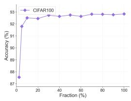  
(a) CIFAR100

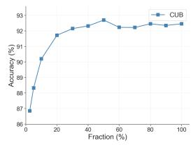  
(b) CUB

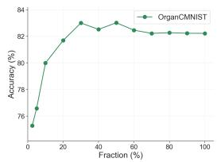  
(c) OrganCMNIST

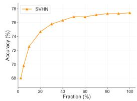  
(d) SVHN  
Figure 7: Relationship between linear probe accuracy and the number of used principal components. We measure the linear probe accuracy in using top K% principal components.

Table 9: Comparison with fully supervised fine-tuning. All methods use the same pretrained MobileNetV3-Small student. $\Delta$ denotes the performance difference between SpecMatch and supervised fine-tuning.
<table><tr><td>Method</td><td>CIFAR100</td><td>CIFAR10</td><td>SVHN</td><td>GTSRB</td><td>NABirds</td><td>CUB</td><td>RESISC</td><td>EuroSAT</td><td>OrganCMNIST</td><td>Camelyon17</td><td>iWildCam</td><td>FMoW</td></tr><tr><td>Supervised FT</td><td>76.5</td><td>93.8</td><td>95.2</td><td>95.4</td><td>50.1</td><td>55.8</td><td>93.0</td><td>98.4</td><td>93.4</td><td>90.1</td><td>58.5</td><td>41.0</td></tr><tr><td>SpecMatch (T: PE-Core)</td><td>77.6</td><td>95.2</td><td>89.5</td><td>94.6</td><td>64.2</td><td>72.5</td><td>93.6</td><td>98.2</td><td>90.7</td><td>93.9</td><td>62.4</td><td>42.1</td></tr><tr><td>Δ</td><td>+1.1</td><td>+1.5</td><td>-5.7</td><td>-0.8</td><td>+14.1</td><td>+16.7</td><td>+0.6</td><td>-0.2</td><td>-2.7</td><td>+3.8</td><td>+3.9</td><td>+1.1</td></tr><tr><td>SpecMatch (T: DINOv2)</td><td>78.1</td><td>95.5</td><td>82.3</td><td>88.1</td><td>56.8</td><td>69.0</td><td>92.8</td><td>98.0</td><td>91.0</td><td>93.4</td><td>61.1</td><td>39.5</td></tr><tr><td>Δ</td><td>+1.6</td><td>+1.8</td><td>-12.9</td><td>-7.3</td><td>+6.7</td><td>+13.2</td><td>-0.2</td><td>-0.4</td><td>-2.4</td><td>+3.3</td><td>+2.6</td><td>-1.5</td></tr></table>

Table 10: Instance recognition results on the Oxford and Paris datasets. A ConvNeXt-Large model pre-trained with image-text data is used as the teacher, while ConvNeXt-Tiny serves as the student.
<table><tr><td rowspan="3">Method</td><td colspan="10">Oxford</td><td colspan="10">Paris</td></tr><tr><td colspan="3">Easy</td><td colspan="3">Medium</td><td colspan="3">Hard</td><td colspan="3"></td><td colspan="3">Easy</td><td colspan="3">Medium</td><td colspan="3">Hard</td></tr><tr><td>mAP</td><td>P@1</td><td></td><td>P@10</td><td>mAP</td><td>P@1 P@10</td><td></td><td>mAP</td><td>P@1</td><td>P@10</td><td></td><td>mAP</td><td>P@1</td><td>P@10</td><td>mAP</td><td>P@1</td><td>P@10</td><td>mAP</td><td>P@1</td><td>P@10</td></tr><tr><td>ConvNEXT-XXlarge → ConvNEXT-Tiny</td><td></td><td></td><td></td><td></td><td></td><td></td><td></td><td></td><td></td><td></td><td></td><td></td><td></td><td></td><td></td><td></td><td></td><td></td><td></td><td></td></tr><tr><td>DINO</td><td>21.9</td><td>41.2</td><td>27.7</td><td>15.0</td><td>45.7</td><td></td><td>27.3</td><td>3.4</td><td>17.1</td><td>5.3</td><td>64.8</td><td>95.7</td><td>87.7</td><td></td><td>49.9</td><td>97.1</td><td>91.3</td><td>24.7</td><td>68.6</td><td>56.0</td></tr><tr><td>FM</td><td>17.6</td><td>29.4</td><td>20.9</td><td>13.8</td><td>30.0</td><td></td><td>18.7</td><td>3.7</td><td>10.0</td><td>7.0</td><td>53.4</td><td>87.1</td><td>81.0</td><td></td><td>40.5</td><td>88.6</td><td>82.7</td><td>17.4</td><td>54.3</td><td>41.6</td></tr><tr><td>SpecMatch</td><td>19.7</td><td>30.9</td><td>22.4</td><td>15.7</td><td>38.6</td><td></td><td>22.3</td><td>4.9</td><td>18.6</td><td>8.6</td><td>55.5</td><td>87.1</td><td>81.6</td><td></td><td>43.7</td><td>88.6</td><td>84.4</td><td>21.5</td><td>67.1</td><td>49.9</td></tr><tr><td>PE-Core-G14 → ViT-Tiny</td><td></td><td></td><td></td><td></td><td></td><td></td><td></td><td></td><td></td><td></td><td></td><td></td><td></td><td></td><td></td><td></td><td></td><td></td><td></td><td></td></tr><tr><td>DINO</td><td>19.0</td><td>36.7</td><td>28.1</td><td>14.4</td><td>37.1</td><td></td><td>26.9</td><td>2.9</td><td>8.6</td><td>4.0</td><td></td><td>60.3 95.7</td><td></td><td>88.3</td><td>45.2</td><td>98.6</td><td>90.4</td><td>19.8</td><td>68.6</td><td>51.4</td></tr><tr><td>FM SpecMatch</td><td>10.0 11.2</td><td>14.7 29.4</td><td>14.9 14.3</td><td>9.1 9.6</td><td></td><td>18.6 31.4</td><td>16.4 15.3</td><td>2.2 2.4</td><td>5.7 5.7</td><td>3.1 2.7</td><td>32.9</td><td>30.3 75.7 77.1</td><td>64.7 64.9</td><td></td><td>24.7 26.8</td><td>77.1 78.6</td><td>66.9 67.6</td><td>9.1 11.2</td><td>31.4 35.7</td><td>19.4 23.4</td></tr></table>

Table 11: Comparison between static and dynamic weighting.
<table><tr><td>Method</td><td>CIFAR-10</td><td>SVHN</td><td>NABirds</td><td>CUB</td><td>RESISC</td><td>ImageNet</td></tr><tr><td>FM</td><td>94.8</td><td>87.6</td><td>62.6</td><td>71.3</td><td>92.6</td><td>72.1</td></tr><tr><td>Static</td><td>95.0</td><td>88.3</td><td>63.7</td><td>71.7</td><td>93.6</td><td>73.2</td></tr><tr><td>Dynamic</td><td>95.2</td><td>89.5</td><td>64.2</td><td>72.5</td><td>93.6</td><td>73.1</td></tr></table>