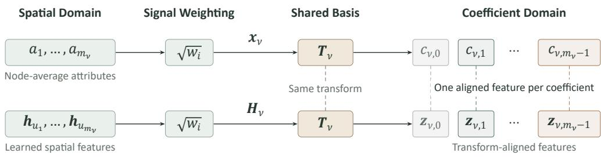
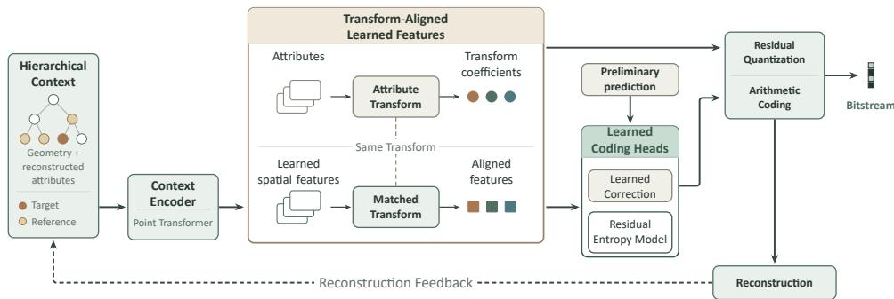
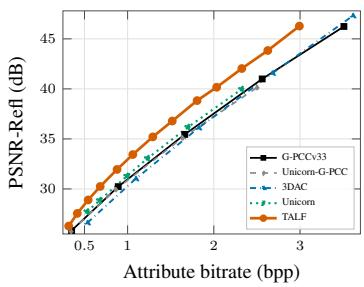
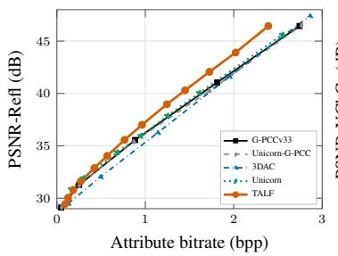
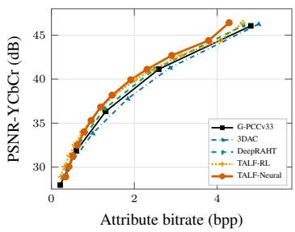
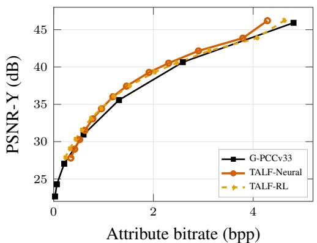
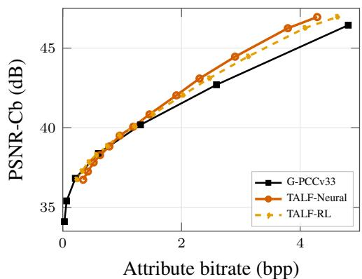
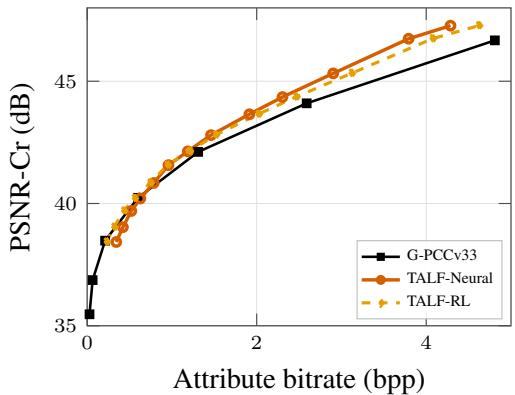

# TRANSFORM-ALIGNED LEARNED FEATURES FOR LOSSY POINT CLOUD ATTRIBUTE COMPRESSION

Yueru Chen1, Pengpeng Yu1,2, Dingquan Li1, Wei Gao3, Wei Zhang1,4, and Fei Song1

1Pengcheng Laboratory, Shenzhen, China

2Sun Yat-sen University, Shenzhen, China

3Peking University, Shenzhen, China

4Xidian University, Xi’an, China

## ABSTRACT

Transform-based methods provide an effective framework for point cloud attribute compression by representing attributes as transform coefficients. Introducing learned spatial context into this framework requires mapping spatial representations to the transform domain, but this known basis change is often left for the network to learn implicitly. We propose Transform-Aligned Learned Features (TALF) by applying the attribute transform to learned spatial representations, explicitly aligning them with the coding targets. Our analysis shows that the resulting features exactly represent the first-order prediction term of a smooth nonlinear model, with a bounded Taylor remainder. We integrate TALF into a transformbased attribute codec with explicit coefficient prediction and conditional residual entropy modeling under a unified coefficient-domain rate–distortion objective, while retaining explicit quantization-step control. Extensive experiments across three benchmark datasets and multiple transform bases demonstrate that TALF improves rate–distortion performance over conventional and learned baselines.

## 1 INTRODUCTION

Point cloud attributes such as reflectance and color carry information needed for driving-scene perception and immersive 3D applications (Graziosi et al., 2020; Wang et al., 2025b). Practical attribute codecs benefit from two complementary capabilities: expressive probability modeling for efficient compression (Peng, 2025; Chen et al., 2025; Wang et al., 2023) and an explicit, interpretable quantization step (QS) for predictable rate–distortion control (Wei et al., 2025; Zhang et al., 2024). Traditional transform codecs provide a well-defined transform–quantization pipeline with reliable QS-based control, but rely on hand-crafted probability models with limited contextual capacity. Learned approaches can capture richer dependencies (Gao et al., 2025; Zhao et al., 2025; Nguyen & Kaup, 2023), yet their latent representations can obscure the link between quantization and attribute distortion (Guo et al., 2025; Balle et al., 2021; Wang & Ma, 2022). Effectively integrating these´ complementary strengths is therefore a promising direction for attribute compression.

Existing methods combine conventional attribute transforms with learned entropy modeling, as in 3DAC (Fang et al., 2022), or prediction, as in DeepRAHT (Fu et al., 2026). However, the attribute transform defines the coding targets without itself aligning learned spatial representations. Consequently, the network is often left to learn this known basis change implicitly alongside coefficient prediction or probability modeling.

We propose Transform-Aligned Learned Features (TALF) to make this interface explicit. As illustrated in Figure 1, TALF applies the codec’s attribute transform to every learned feature channel, with the same weighting and node ordering as the attribute signals. The local smoothness and spatial correlation of point-cloud attributes (Hu et al., 2022) motivate a local first-order approximation of a nonlinear predictor. Neighborhood-based linear prediction in conventional attribute codecs offers further practical support (Do et al., 2024). We show that transform-aligned features exactly represent this first-order prediction term and derive a bound on the higher-order remainder, providing a structural basis for learned coefficient modeling.

  
Figure 1: Transform alignment within a hierarchical block. Node-average attributes and learned spatial features undergo the same weighting and transform. Matching colors indicate coefficient– feature correspondence. Gray denotes the low-pass pair; only detail-aligned features enter the prediction and entropy-modeling heads.

We instantiate TALF in an attribute codec with explicit coefficient prediction and conditional residual entropy modeling. We formulate the Laplace location parameter as an explicit coefficient prediction, jointly optimized through the entropy-rate and reconstruction-distortion terms. The resulting zero-centered residual is modeled conditionally. Orthonormality preserves reconstruction distortion, enabling coefficient-domain rate–distortion learning that pairs each aligned feature with its coding target, rate, and distortion. Analytical conversion between quantization units enables one model per dataset to operate across the evaluated QS range. The alignment interface accommodates different context encoders, compatible transform bases, and entropy-coding methods, with experiments covering a normalized graph basis and RAHT. With learned entropy coding, TALF achieves BD-Rate savings of 20.93% on Ford, 14.01% on KITTI, and 9.71% on ScanNet relative to our G-PCC anchor.

Our contributions are:

• We introduce transform-aligned learned features through a parameter-free interface that applies the attribute transform to learned context features and establish its first-order alignment property with a bounded nonlinear remainder.

• We formulate a unified coefficient-domain rate–distortion objective that couples an explicit coefficient prediction with conditional entropy modeling of the resulting zerocentered residual.

• We integrate these components into a QS-compatible lossy point cloud attribute coding framework. Experiments on reflectance and color across datasets and transform bases demonstrate its rate–distortion benefits and the modularity of the alignment interface.

## 2 RELATED WORK

Conventional Transform-Based Attribute Compression Traditional point cloud attribute compression exploits geometry–attribute correlation through prediction and transform coding. The MPEG Geometry-based Point Cloud Compression (G-PCC) standard provides prediction-, lifting-, and RAHT-based attribute coding tools (Schwarz et al., 2019; MPEG 3DG, 2023). In particular, RAHT can be viewed as a geometry-adaptive variant of the Haar wavelet transform, recursively applying occupancy-weighted two-point transforms over the point-cloud octree hierarchy (De Queiroz & Chou, 2016). Graph-transform methods instead regard attributes as signals over geometry-derived graphs (Shao et al., 2017; Xu et al., 2021). Early work established blockwise graph Fourier coding for regular and sparse point clouds (Zhang et al., 2014; Cohen et al., 2016). RA-GFT incorporates multiresolution region masses through a Q-normalized graph Laplacian (Pavez et al., 2020), while SSGT recursively constructs normalized-Laplacian subspace transforms (Chen et al., 2020). Grounded in classical signal analysis, these methods provide well-defined transform–quantization pipelines. TALF builds on this structure by using the same transform to generate attribute coefficients and align the learned features used to model them.

Learning-Based Lossy Attribute Compression Existing learned methods broadly follow two routes according to the representation being quantized and entropy-coded: learned latent representations or explicit attribute transform coefficients. The first route includes Deep-PCAC, a geometryconditioned point-based autoencoder (Sheng et al., 2022), and Unicorn, which employs universal multiscale conditional coding for both lossy and lossless attribute compression (Wang et al., 2025a). LVAC encodes learned latent representations in the form of RAHT coefficients for attribute reconstruction with local coordinate-based networks (Isik et al., 2022). These methods offer expressive nonlinear modeling, but their reliance on learned representations makes rate–distortion control less interpretable.

The second route learns prediction or probability models for explicit attribute transform coefficients. 3DAC retains RAHT and learns a context-adaptive probability model for arithmetic coding of the quantized transform coefficients (Fang et al., 2022). DeepRAHT predicts node attributes through interpolation and learned compensation, then applies RAHT to obtain coefficient predictions for residual coding (Fu et al., 2026). It uses conventional zero run-length coding rather than a learned conditional entropy model. However, coefficient prediction or probability modeling does not itself ensure alignment between learned spatial representations and transform coefficients. This mismatch motivates explicit feature–coefficient alignment.

## 3 TRANSFORM-ALIGNED LEARNED FEATURES

Our goal is to construct coefficient-specific representations for probability modeling. We establish two theoretical properties in a general transform-block setting. First, aligned features exactly represent the first-order term of a shared nonlinear signal predictor followed by the transform, with a second-order bound on the nonlinear remainder. Second, orthonormality preserves reconstruction error, enabling coefficient-domain rate–distortion learning.

## 3.1 TRANSFORM-BLOCK FORMULATION

Consider a local transform block $\begin{array} { r c l } { { B _ { \nu } } } & { { = } } & { { \left\{ 1 , \dots , m _ { \nu } \right\} } } \end{array}$ with scalar signal samples $\begin{array} { r l } { \mathbf { x } _ { \nu } } & { { } = } \end{array}$ $[ x _ { \nu , 1 } , \ldots , x _ { \nu , m _ { \nu } } ] ^ { \top }$ . The block may be formed by any deterministic construction available at both codec ends. We present one signal channel; multiple channels can be processed separately or condi tionally. A known analysis transform produces

$$
\begin{array} { r } { \mathbf { c } _ { \nu } = \mathbf { T } _ { \nu } \mathbf { x } _ { \nu } , } \end{array}\tag{1}
$$

where $\mathbf { T } _ { \nu } \in \mathbb { R } ^ { m _ { \nu } \times m _ { \nu } }$ and coefficient indices in $\mathbf { c } _ { \nu }$ start at zero.

For the analysis below, we consider orthonormal transforms that separate a constant signal component from its detail components. These properties are standard in many classical transform-coding constructions (Goyal, 2001; Mallat, 2009). With the low-pass, or DC, basis first and the remaining local detail, or AC, rows denoted by $\mathbf { T } _ { \nu , \mathrm { A C } }$ , we write

$$
\mathbf { T } _ { \nu } ^ { \top } \mathbf { T } _ { \nu } = \mathbf { I } , \qquad \mathbf { T } _ { \nu , \mathrm { A C } } \mathbf { 1 } = \mathbf { 0 } .\tag{2}
$$

The first row is $\mathbf { d } _ { \nu } ^ { \top } = \mathbf { 1 } ^ { \top } / \sqrt { m _ { \nu } }$ , so the low-pass coefficient equals $\sqrt { m _ { \nu } }$ times the block mean. A constant signal has zero detail coefficients. The detail basis may be any orthonormal complement of the constant direction.

We use unweighted signals here to expose the alignment principle. Appendix A.2 extends the analysis to weighted coordinates, and Section 4 specializes it to point-count-weighted hierarchical attribute coding.

## 3.2 TRANSFORM ALIGNMENT OF LEARNED FEATURES

For each element $i \in \boldsymbol { B } _ { \nu }$ , an encoder extracts $\mathbf { h } _ { \nu , i } = \mathcal { E } _ { \theta } ( i , \mathcal { C } _ { \nu } ) \in \mathbb { R } ^ { d }$ , where $\mathcal { C } _ { \nu }$ denotes any context available at both codec ends. Stack these features in the same element order as the signal:

$$
\mathbf { H } _ { \nu } = [ \mathbf { h } _ { \nu , 1 } , \hdots , \mathbf { h } _ { \nu , m _ { \nu } } ] ^ { \top } \in \mathbb { R } ^ { m _ { \nu } \times d } .
$$

Rows of $\mathbf { H } _ { \nu }$ identify block elements, whereas entries of $\mathbf { c } _ { \nu }$ identify transform modes that generally combine multiple elements. Directly assigning element features to coefficient slots therefore leaves a known basis change implicit, which we callfeature–coefficient misalignment.

  
Figure 2: Overview of a TALF-based point-cloud attribute codec. Learned spatial features are aligned with attribute coefficients to guide coefficient prediction and residual entropy modeling.

TALF removes this mismatch by applying the same analysis transform to every feature channel:

$$
\mathbf { Z } _ { \nu } = \mathbf { T } _ { \nu } \mathbf { H } _ { \nu } \in \mathbb { R } ^ { m _ { \nu } \times d } .\tag{3}
$$

The k-th row $\mathbf { z } _ { \nu , k } ^ { \top }$ is paired with coefficient $c _ { \nu , k }$ . Each aligned feature provides an informative representation for learned coefficient modeling, specifically coefficient prediction and residual probability estimation.

## 3.3 THEORETICAL ANALYSIS AND COEFFICIENT-DOMAIN LEARNING

Local first-order alignment. We first establish why transform-aligned features provide a suitable representation for coefficient prediction. We fix a block and omit the subscript ν throughout this subsection. Assume that its signal samples admit one common nonlinear function $f \colon$

$$
x _ { i } = f ( \mathbf { h } _ { i } ) + \epsilon _ { i } ,
$$

where $\epsilon _ { i }$ is the residual not explained by $f .$ The function may vary across blocks and is assumed to be twice continuously differentiable in a neighborhood of the convex hull of the block’s features. This regularity condition holds for networks with smooth activations such as GELU (Hendrycks & Gimpel, 2016). Define the feature center as $\bar { \mathbf { h } } = m ^ { - 1 } \sum _ { i }$ hi. Expanding $f$ about h¯ and stacking the elements gives

$$
\begin{array} { r l } & { \mathbf { x } = \mathbf { H } \underbrace { \nabla f ( \bar { \mathbf { h } } ) } _ { \mathbf { g } } + \underbrace { \left[ f ( \bar { \mathbf { h } } ) - \nabla f ( \bar { \mathbf { h } } ) ^ { \top } \bar { \mathbf { h } } \right] } _ { \boldsymbol { \xi } } \mathbf { 1 } + \boldsymbol { \tau } + \boldsymbol { \epsilon } } \\ & { = \mathbf { H } \mathbf { g } + \boldsymbol { \xi } \mathbf { 1 } + \boldsymbol { \tau } + \boldsymbol { \epsilon } , } \end{array}
$$

Here $\tau$ is the second-order Taylor remainder. Since $\mathbf { T _ { \mathrm { A C } } 1 } = \mathbf { 0 }$ , the shared intercept contribute only to the low-pass coefficient. Applying the detail rows to this expansion therefore yields

$$
\begin{array} { r } { \boxed { \mathbf { c } _ { \mathrm { A C } } = \mathbf { Z } _ { \mathrm { A C } } \mathbf { g } + \mathbf { T } _ { \mathrm { A C } } ( \pmb { \tau } + \epsilon ) \vphantom { \Bigg | } \Bigg \rvert , } } \end{array}\tag{4}
$$

where $\mathbf { Z } _ { \mathrm { A C } }$ contains the detail rows of $\mathbf { Z } ,$ and the remaining error comprises the transformed Taylor remainder and unexplained residual. For a globally shared affine predictor $f ( \mathbf { h } ) = \mathbf { g } ^ { \top } \mathbf { h } + \boldsymbol { \xi } ,$ , the Taylor remainder vanishes and g is identical across blocks. A shared linear head on the aligned features then exactly reproduces the transformed detail predictions.

For nonlinear $f , \mathrm { i f } \parallel \nabla ^ { 2 } f ( \mathbf { h } ) \parallel _ { 2 } \leq$ κ along every segment from $\bar { \mathbf { h } }$ to an element feature, the nonlinear discrepancy obeys

$$
\left\| \mathbf { T } _ { \mathrm { A C } } \pmb { \tau } \right\| _ { 2 } \leq \frac { \kappa } { 2 } \left( \sum _ { i } \left\| \mathbf { h } _ { i } - \bar { \mathbf { h } } \right\| _ { 2 } ^ { 4 } \right) ^ { 1 / 2 } .\tag{5}
$$

The higher-order contribution is therefore small when the function has low local curvature and the within-block features have limited dispersion. Aligned features thus exactly represent the first-order prediction term, with a bounded higher-order remainder, providing a structural basis for learned coefficient modeling. In practice, a globally shared nonlinear head approximates these blockdependent prediction relationships. Appendix A.2 provides the complete derivation.

Coefficient-domain rate–distortion objective. We next formulate the training objective in the coefficient domain. Orthonormality preserves squared reconstruction error independently of the local prediction model. For any reconstruction xˆ, with $\hat { \mathbf { c } } = \mathbf { T } \hat { \mathbf { x } }$ , Parseval’s identity gives

$$
\lVert \mathbf { x } - \hat { \mathbf { x } } \rVert _ { 2 } ^ { 2 } = \lVert \mathbf { c } - \hat { \mathbf { c } } \rVert _ { 2 } ^ { 2 } .\tag{6}
$$

Within each block, fixing the low-pass reconstruction makes detail-coefficient distortion equivalent to signal-domain distortion up to a constant term. We therefore optimize the following coefficientdomain rate–distortion objective:

$$
\mathcal { L } _ { \mathrm { R D } } = D _ { \mathrm { c o e f f } } + \beta R = \frac { 1 } { | \mathcal { K } | } \sum _ { k \in \mathcal { K } } \left[ ( c _ { k } - \hat { c } _ { k } ) ^ { 2 } + \beta \left( - \log _ { 2 } p ( q _ { k } \mid \mathcal { C } _ { k } ) \right) \right] ,\tag{7}
$$

where $\kappa$ indexes the coefficients modeled by the learned components, $q _ { k }$ is the transmitted quantization index, $\mathcal { C } _ { k }$ is the coding context available at both codec ends, and $\beta > 0$ controls the rate– distortion trade-off. This coefficient-wise formulation associates every aligned feature with its target coefficient, reconstruction error, and estimated rate. The alignment principle is independent of the context encoder, prediction head, entropy model, and the choice of basis within the transform setting above.

## 4 TALF-BASED ATTRIBUTE CODEC

We instantiate the alignment principle of Section 3 in a hierarchical attribute codec. As shown in Figure 2, a context encoder extracts node features from hierarchical context, TALF aligns these features with the attribute coefficients, and learned coding heads predict coefficients and their residual distribution parameters. Reconstructed attributes then provide context for subsequent coding steps.

## 4.1 HIERARCHICAL CONTEXT AND ALIGNED FEATURE CONSTRUCTION

We organize the point-cloud geometry using an octree, with the occupied children of each parent forming a transform block. Each child node $u _ { i }$ represents $w _ { i }$ points, and its attribute $a _ { i }$ is their average attribute. With $\mathbf { a } _ { \nu } = [ a _ { 1 } , \ldots , a _ { m _ { \nu } } ] ^ { \top }$ and $\mathbf { M } _ { \nu } = \mathrm { d i a g } ( w _ { 1 } , \dots , w _ { m _ { \nu } } )$ , the transform input is $\mathbf { x } _ { \nu } = \mathbf { M } _ { \nu } ^ { 1 / 2 } \mathbf { a } _ { \nu }$ . Each entry $x _ { i } ~ = ~ \sqrt { w _ { i } } a _ { i }$ is the DC coefficient propagated from an internal child’s subtree, or the original attribute at a leaf where $w _ { i } = 1$ . This corresponds to $\mathbf { S } _ { \nu } = \mathbf { M } _ { \nu } ^ { 1 / 2 }$ in Appendix A.2.

For an occupied child node $u _ { i }$ in block $B _ { \nu }$ , we construct a reference set ${ \mathcal { R } } ( u _ { i } ) = { \mathcal { R } } _ { \mathrm { p a r } } ( u _ { i } )$ ∪ $\mathcal { R } _ { \mathrm { c u r } } ( u _ { i } )$ . We first select nearby parent-level nodes and replace those whose child attributes have already been reconstructed with their occupied children. $\mathcal { R } _ { \mathrm { p a r } }$ contains the remaining parent-level references, and ${ \mathcal { R } } _ { \operatorname { c u r } }$ contains the replacement child nodes. Each reference contains relative coordinates, reconstructed attributes, and its own reconstructed prediction residual. Higher-level coordinates are averages of child coordinates weighted by point counts.

Our implementation uses an adaptive Point Transformer encoder (You et al., 2024). Query-masked attention combines the reference features with their relative positions while suppressing padded entries. The resulting features are aggregated and mapped to a representation $\mathbf { h } _ { u _ { i } } \equiv \mathcal { E } _ { \theta } ( u _ { i } , \bar { \mathcal { R } } ( u _ { i } ) )$ To match these transform inputs, we weight each learned representation by $\sqrt { w _ { i } }$ and stack the results in the same element order to form $\mathbf { H } _ { \nu } .$ This is the point-count-weighted specialization of Hν in Section 3.2.

As a concrete instantiation of the general transform in Section 3.1, we use a normalized graph-Laplacian basis (Chen et al., 2020) for both attribute analysis and feature alignment. The graph construction and basis conventions are specified in Appendix A.1. RAHT (De Queiroz & Chou, 2016) provides an alternative basis through the same interface. Only features corresponding to valid AC coefficients enter the learned heads; DC coefficients follow the hierarchical propagation rule.

## 4.2 COEFFICIENT PREDICTION AND RESIDUAL ENTROPY MODELING

Each aligned feature $\mathbf { z } _ { \nu , k }$ supplies the context for two coefficient-specific quantities: a coefficient prediction and the parameters of its residual entropy model.

Explicit coefficient prediction. We use a deterministic preliminary predictor together with a learned correction. For each occupied child node $u _ { i } .$ , we interpolate the reconstructed attributes of the three nearest reference nodes in $\mathcal { R } ( u _ { i } )$ using inverse-distance weighting. Collecting these nodeaverage attribute predictions gives $\mathbf { a } _ { \nu } ^ { \mathrm { p r e } }$ . Square-root weighting followed by the attribute transform yields the preliminary coefficient prediction

$$
\pmb { \mu } _ { \nu } ^ { \mathrm { p r e } } = \mathbf { T } _ { \nu } \mathbf { M } _ { \nu } ^ { 1 / 2 } \mathbf { a } _ { \nu } ^ { \mathrm { p r e } } .
$$

The coefficient-prediction head $g _ { \mu }$ produces a learned correction from the aligned feature. Adding this correction to the preliminary prediction gives the final coefficient prediction $\mu _ { \nu , k } ^ { \mathrm { p } } \mathrm { . }$

$$
\mu _ { \nu , k } ^ { \mathrm { p } } = \mu _ { \nu , k } ^ { \mathrm { p r e } } + \mu _ { \nu , k } ^ { \mathrm { c o r r } } , \qquad \mu _ { \nu , k } ^ { \mathrm { c o r r } } = g _ { \mu } ( \mathbf { z } _ { \nu , k } ) .\tag{8}
$$

For channel $\chi$ with quantization step $\Delta _ { \chi }$ , the quantized residual index $q _ { \nu , k }$ and reconstructed coefficient $\hat { c } _ { \nu , k }$ are given by

$$
q _ { \nu , k } = \mathcal { Q } \bigg ( \frac { c _ { \nu , k } - \mu _ { \nu , k } ^ { \mathrm { p } } } { \Delta _ { \chi } } \bigg ) , \qquad \hat { c } _ { \nu , k } = \mu _ { \nu , k } ^ { \mathrm { p } } + \Delta _ { \chi } \cdot q _ { \nu , k } .\tag{9}
$$

Here $\mathcal { Q }$ is the scalar quantizer in index units. Unlike a location parameter used solely for entropy modeling, the explicit prediction affects both the transmitted residual index and the reconstructed coefficient. Appendix A.5 further analyzes these two effects through the integer and fractional components of the learned correction.

Zero-centered residual entropy modeling. We model the residual indices with a zero-centered discretized Laplace distribution. The entropy head predicts only a positive scale parameter $b _ { \nu , k }$ assigning probability and estimated rate

$$
p _ { \nu , k } ( q ) = \int _ { q - \frac { 1 } { 2 } } ^ { q + \frac { 1 } { 2 } } \mathrm { L a p } ( t ; 0 , b _ { \nu , k } ) \mathrm { d } t , \qquad R _ { \nu , k } = - \log _ { 2 } p _ { \nu , k } ( q _ { \nu , k } ) .
$$

After transform alignment, a shared MLP maps each $\mathbf { z } _ { \nu , k }$ to a compact hidden representation, from which lightweight heads predict $\mu _ { \nu , k } ^ { \mathrm { c o r r } }$ and $b _ { \nu , k }$ . For color, corrections are predicted jointly, while scale prediction is conditioned on previously decoded channel indices in the order $\mathrm { C b } \to \mathrm { C r } \to \mathrm { Y }$

The learned components are trained with the coefficient-domain rate–distortion objective in Eq. (7). The forward pass uses hard quantization indices, with a straight-through estimator (Bengio et al., 2013) for backpropagation. We also evaluate conventional run-length coding of the residual indices, as reported in Section 5.2.

## 4.3 CODING PROCEDURE AND QUANTIZATION-STEP CONTROL

Coding and reconstruction proceed from coarse to fine through the octree, starting from the root DC. Combining the AC coefficients reconstructed by Eq. (9) with the DC supplied by the coarser level gives $\hat { \mathbf { c } } _ { \nu }$ . The node-average attributes $\hat { \mathbf { a } } _ { \nu } = \mathbf { M } _ { \nu } ^ { - 1 / 2 } \mathbf { T } _ { \nu } ^ { \top } \hat { \mathbf { c } } _ { \nu }$ then provide context for subsequent blocks and finer levels. At the leaf level, they constitute the final point cloud reconstruction.

Conversion between quantization units. Converting learned coefficient corrections and entropy scales between quantization units enables a single model to operate across QS values with explicit quantization control. Let $\Delta _ { \chi } ^ { \mathrm { r } }$ and $\Delta _ { \chi } ^ { \mathrm { t } }$ denote the reference training QS and target QS, respectively. In implementation, the prediction head parameterizes the correction by $\mu _ { \chi } ^ { q , \mathrm { r } }$ in units of the reference quantization step, so that $\mu _ { \chi } ^ { \mathrm { c o r r } } = \Delta _ { \chi } ^ { \mathrm { r } } \cdot \dot { \mu } _ { \chi } ^ { q , \mathrm { r } }$ . With $b _ { \chi } ^ { \mathrm { r } }$ denoting the predicted scale in the same units, the target-QS parameters are

$$
\rho _ { \chi } = \frac { \Delta _ { \chi } ^ { \mathrm { r } } } { \Delta _ { \chi } ^ { \mathrm { t } } } , \qquad \mu _ { \chi } ^ { q , \mathrm { t } } = \rho _ { \chi } \mu _ { \chi } ^ { q , \mathrm { r } } , \qquad b _ { \chi } ^ { \mathrm { t } } = \rho _ { \chi } b _ { \chi } ^ { \mathrm { r } } .\tag{10}
$$

This conversion preserves the coefficient-domain correction. For cross-channel conditioning, the decoded symbol $\bar { q } _ { \chi } ^ { \mathrm { t } }$ is rescaled to reference units before embedding as $q _ { \chi } ^ { \mathrm { r } } = q _ { \chi } ^ { \mathrm { t } } / \rho _ { \chi }$

Table 1: Comparisons of coding performance using average BD-Rate (%) against the baseline methods and runtime (s/frame). G-PCCv33 is the BD-Rate anchor, except for Unicorn†, which uses the reported Unicorn-G-PCC (RAHT21) anchor.  
(a) Reflectance compression
<table><tr><td>Dataset</td><td>3DAC</td><td>Unicorn</td><td>TALF</td></tr><tr><td>Ford</td><td>+1.81</td><td>-5.63†</td><td>-20.93</td></tr><tr><td>KITTI</td><td>+9.89</td><td>-4.68†</td><td>-14.01</td></tr></table>

(b) Color compression
<table><tr><td colspan="3">TALF- TALF- TALF-</td></tr><tr><td>Dataset 3DAC DeepRAHT Neural</td><td>RL</td><td>Hybrid</td></tr><tr><td>ScanNet +3.85 -6.65</td><td>-9.71 -12.26 -15.07</td><td></td></tr></table>

(c) Runtime (Enc./Dec.)
<table><tr><td>Method</td><td>Ford</td><td>KITTI</td><td>ScanNet</td></tr><tr><td>G-PCCv33</td><td>1.5 / 0.8</td><td>0.6 / 0.3</td><td>1.8 / 1.4</td></tr><tr><td>3DAC</td><td>3.8 / 4.5</td><td>3.6 / 4.9</td><td>4.3 / 5.0</td></tr><tr><td>DeepRAHT</td><td></td><td></td><td>3.1 / 3.1</td></tr><tr><td>TALF</td><td>7.9 / 7.7</td><td>9.0/ 8.9</td><td>8.5 / 8.4</td></tr></table>

## 5 EXPERIMENTS

We now present the experimental settings, compression performance, and ablation studies.

## 5.1 EXPERIMENTAL SETUP

Datasets. We evaluate color compression on ScanNet (Dai et al., 2017), using 1,513 scans for training and 100 scans for testing. The geometry is quantized at a spatial resolution of 2 mm, preserving point uniqueness and one-to-one correspondence with the associated colors. Reflectance experiments use the KITTI LiDAR dataset (Geiger et al., 2012) and Ford (Pandey et al., 2011). KITTI sequences 00–10 are used for training and 11–21 for testing; Ford sequence 01 is used for training, with sequences 02 and 03 reserved for testing. Both reflectance datasets are voxelized at a resolution of 1 mm.

Baselines and metrics. Our default baseline, denoted G-PCCv33, is TMC13v33 (MPEG 3DG, 2026) configured with predictive RAHT. We compare with 3DAC (Fang et al., 2022), Unicorn (Wang et al., 2025a), and DeepRAHT (Fu et al., 2026). We retrain 3DAC on the same training data as TALF and evaluate it on our test sets. We report the released Unicorn reflectance results with their original Unicorn-G-PCC (RAHT21) anchor for reference. For DeepRAHT, we evaluate the executable released in its GitHub repository on our color test set without retraining.

Attribute bitrate is reported in bits per input point (bpp). We report PSNR-Refl for reflectance and PSNR-YCbCr for color, with color MSE computed by weighting the Y, Cb, and Cr channel MSEs in a 6:1:1 ratio. Per-channel color PSNR is reported in the appendix. BD-Rate is computed using a Bjøntegaard fit over the common quality interval (Bjøntegaard, 2001).

Implementation. Experiments use an NVIDIA Tesla T4 GPU and an Intel Xeon Gold 6248 CPU at 2.50 GHz. For each dataset, a single model is evaluated at 13 base QS settings from 4 to 64 using the conversion in Section 4.3. Network and training configurations are given in Table 4, and the causal batching procedure is described in Appendix A.4.

## 5.2 OVERALL RATE–DISTORTION PERFORMANCE

Figure 3 and Table 1 show consistent rate–distortion improvements over G-PCCv33 across three datasets, with bitrate savings reaching 20.93% on Ford. The gains extend from outdoor LiDAR reflectance to indoor color scans, demonstrating the effectiveness of the codec across different attribute types and scene conditions.

On ScanNet, we distinguish three variants with identical coefficient predictions and reconstructions: TALF-Neural uses the learned residual entropy model, TALF-RL uses conventional run-length coding, and TALF-Hybrid uses learned entropy coding for QS ≤ 16 and run-length coding otherwise,

  
(a) Ford.

  
(b) KITTI.

  
(c) ScanNet.  
Figure 3: Rate–distortion curves for Ford and KITTI reflectance and ScanNet color.

Table 2: Analysis of transform alignment on Ford. (a) Residual energy reduction is relative to zeroinnovation prediction. (b) Prediction MSE is evaluated on valid AC coefficients before quantization. (c) BD-Rate is relative to G-PCCv33. All reductions, increases, and BD-Rate values are in %.

(a) Assessing the first-order approximation
<table><tr><td>Predictor</td><td>Nonlinearity</td><td>Parameters</td><td>Innovation MSE</td><td>Residual energy reduction</td></tr><tr><td>Shared linear predictor</td><td>None</td><td>513</td><td>139.2518</td><td>30.37</td></tr><tr><td>Shared one-hidden-layer MLP</td><td>GELU</td><td>263,169</td><td>135.2843</td><td>32.35</td></tr></table>

(b) Feature-mapping ablation relative to TALF
<table><tr><td>Feature mapping</td><td>Prediction MSE increase</td><td>BD-Rate vs. TALF</td></tr><tr><td>Weighted centering</td><td>+30.45</td><td>+13.32</td></tr><tr><td>Learned transform</td><td>+28.11</td><td>+10.17</td></tr></table>

(c) Transform-basis comparison
<table><tr><td>Method</td><td colspan="2">Transform basis BD-Rate</td></tr><tr><td>TALF-RAHT</td><td>RAHT</td><td>-20.35</td></tr><tr><td>TALF</td><td>Graph</td><td>-20.93</td></tr></table>

using a validation-selected threshold fixed for all test samples. All three variants outperform 3DAC and DeepRAHT in average BD-Rate, with TALF-Hybrid achieving the largest savings. As shown in Table 1(c), G-PCCv33 is the fastest method, while TALF has moderately higher runtimes than 3DAC and DeepRAHT.

## 5.3 ANALYSIS OF TRANSFORM ALIGNMENT

We examine the first-order approximation, the effectiveness of explicit feature alignment, and its applicability across transform bases on Ford.

Assessing the first-order approximation. We examine whether a single linear predictor shared across child nodes captures most of the prediction benefit provided by a nonlinear model. Specifically, we freeze the feature encoder and compare a shared linear predictor with a nonlinear MLP predictor for predicting the child-attribute innovations after the deterministic preliminary predictor. As shown in Table 2(a), after convergence, the shared linear predictor yields approximately 94% of the MLP’s residual energy reduction with approximately 500× fewer trainable parameters. These results suggest that linear prediction accounts for most of the observed gain, supporting the first-order analysis in Section 3.3.

Feature-mapping ablation. We replace TALF’s explicit feature transform with two alternative mappings while keeping the remaining coding framework unchanged. The weighted-centering variant forms child representations as $\widetilde { \mathbf { h } } _ { u _ { i } } = \sqrt { w _ { i } } ( \mathbf { h } _ { u _ { i } } - \bar { \mathbf { h } } _ { w } )$ , where $\begin{array} { r } { \bar { \mathbf { h } } _ { w } = \sum _ { j } w _ { j } \mathbf { h } _ { u _ { j } } / \sum _ { j } w _ { j } } \end{array}$ . The point-count weights $w _ { i }$ are defined in Section 4.1. The first $m _ { \nu } - 1$ centered features are paired with AC coefficients in coding order without applying $\mathbf { T } _ { \nu }$ . The learned-transform variant instead uses a shared nonlinear mapping across child features, allowing data-driven alignment without imposing the codec’s transform basis.

Table 3: Ablation of explicit coefficient correction on Ford. BD-Rate (%) is reported relative to G-PCCv33, No $\mu ,$ , and Integer $\mu _ { n } ^ { q }$
<table><tr><td>Prediction variant</td><td>BD-Rate vs. G-PCCv33</td><td>BD-Rate  $\mathbf { V S } .$  No µ</td><td>BD-Rate vs. Integer  $\mu _ { n } ^ { q }$ </td></tr><tr><td>No µ</td><td>-7.68</td><td>0.00</td><td></td></tr><tr><td>Integer  $\mu _ { n } ^ { q }$ </td><td>-15.50</td><td>-8.46</td><td>0.00</td></tr><tr><td>Full  $\mu$ </td><td>-20.93</td><td>-14.02</td><td>-6.00</td></tr></table>

Table 2(b) shows that weighted centering and the learned mapping both increase prediction MSE, with BD-Rate penalties of 13.32% and 10.17%, respectively, relative to TALF. These results indicate that removing the constant component alone is insufficient, while learning the mapping does not fully recover the benefit of explicit transform alignment.

Applicability across transform bases. To examine dependence on the transform basis, we instantiate the same alignment interface with RAHT. The corresponding RAHT operator (Taquet & Lasserre, 2020) is applied to both attribute signals and learned features, while the other coding components remain unchanged. As shown in Table 2(c), TALF-RAHT achieves 20.35% BD-Rate savings over G-PCCv33 on Ford, only 0.58 percentage points below TALF. These results support the applicability of the alignment interface across the two tested transform bases.

## 5.4 EXPLICIT COEFFICIENT CORRECTION AND ENTROPY CODING

Effect of explicit coefficient correction. We decompose the learned correction in quantizationindex units as $\mu ^ { q } = \mu _ { n } ^ { q } + \mu _ { f } ^ { q }$ , where $\mu _ { n } ^ { q } = \operatorname { r o u n d } ( \mu ^ { q } )$ and $\mu _ { f } ^ { q }$ is the remaining fractional component. The $\mathrm { N o } \mu$ variant uses the deterministic preliminary predictor without learned coefficient correction; Integer $\mu _ { n } ^ { q }$ adds the grid-aligned learned correction; Full $\mu$ also includes its fractional part. Each variant uses the same trained model and codec configuration but advances its own reconstructed causal context and produces an actual arithmetic-coded bitstream across the evaluated QS range.

Without learned coefficient correction, No $\mu$ still models residual uncertainty through conditional scales and achieves 7.68% BD-Rate savings over G-PCCv33 (Table 3). Integer correction further recenters the coded symbols. The fractional component shifts the reconstruction grid within a quantization step and enables learned adjustments to quantization decisions toward lower rate–distortion cost. Together, these effects yield an additional 6.00% BD-Rate reduction over Integer $\mu _ { n } ^ { q }$ . Appendix A.5 gives the corresponding local symbol statistics and coefficient-error analysis.

Effect of the entropy-coding method. To examine entropy-backend dependence, we retain TALF’s coefficient prediction and feature alignment while switching between neural and run-length coding (MPEG 3DG, 2020), keeping reconstructed coefficients fixed (Figure 3(c)). TALF-Neural uses fewer bits at fine QS, whereas TALF-RL is more efficient at coarse QS, where residuals are sparse. Part of this gap arises from the finite-precision entropy coder. Our 16-bit arithmetic CDF uses a 2049-symbol alphabet, capping the probability of any symbol at 31/32. Consequently, even all-zero color residuals incur an approximate rate floor of 0.137 bpp. For ScanNet scene 0707 00 at the coarsest tested QS, the neural and run-length payloads are 0.237 and 0.112 bpp, respectively. The latter falls below this floor, showing that improved probability estimates alone cannot close the gap.

## 6 CONCLUSION

We presented Transform-Aligned Learned Features (TALF), which applies the attribute transform to align learned spatial representations with their coefficient targets. Our framework combines TALF, explicit coefficient prediction, and conditional residual entropy modeling under a unified coefficientdomain rate–distortion objective, while preserving quantization-step control. Results on reflectance and color show coding gains over conventional and learned baselines, with both the normalized graph basis and RAHT supporting the effectiveness of the alignment principle.

More broadly, this work suggests that attribute transforms can structure learned representations by making the known basis change explicit, while neural models learn contextual dependencies. The TALF alignment interface has the potential to accommodate different context encoders, transform bases, and entropy models. In future, we can exploit this flexibility to develop probability models better suited to sparse residuals and investigate alignment in other transform-based compression settings, such as graph signals and 3D Gaussian Splatting (3DGS) attributes.

## AI USE STATEMENT

We used generative AI tools to assist with language editing, literature organization, figure and table preparation, and code implementation and debugging. The authors take responsibility for the manuscript, code, and reported results.

## REPRODUCIBILITY STATEMENT

To support reproducibility, we describe the model architecture, coding procedure, and training settings in the main text. Our experiments use publicly available datasets, with data splits, preprocessing, and evaluation protocols specified in Section 5.1. We state the assumptions underlying our theoretical analysis and provide the corresponding derivations. The appendix supplements these descriptions with transform implementation details, analysis of the learned coefficient correction, and dataset-average rate–distortion results. We will publicly release our code, trained model weights, and data-preparation scripts to enable independent verification and further research.

## REFERENCES

Johannes Balle, Philip A. Chou, David Minnen, Saurabh Singh, Nick Johnston, Eirikur Agustsson, ´ Sung Jin Hwang, and George Toderici. Nonlinear transform coding. IEEE Journal of Selected Topics in Signal Processing, 15(2):339–353, 2021.

Yoshua Bengio, Nicholas Leonard, and Aaron Courville. Estimating or propagating gradients ´ through stochastic neurons for conditional computation, 2013. URL https://arxiv.org/ abs/1308.3432.

Gisle Bjøntegaard. Calculation of average PSNR differences between RD-curves. Technical Report VCEG-M33, ITU-T Video Coding Experts Group (VCEG), April 2001.

Yueru Chen, Yiting Shao, Jing Wang, Ge Li, and C-C Jay Kuo. Point cloud attribute compression via successive subspace graph transform. In IEEE International Conference on Visual Communications and Image Processing, pp. 66–69, 2020.

Yueru Chen, Wei Zhang, Dingquan Li, Jing Wang, and Ge Li. Hierarchical attention networks for lossless point cloud attribute compression. In Data Compression Conference, pp. 362–362, 2025.

Robert A. Cohen, Dong Tian, and Anthony Vetro. Attribute compression for sparse point clouds using graph transforms. In IEEE International Conference on Image Processing, pp. 1374–1378, 2016.

Angela Dai, Angel X Chang, Manolis Savva, Maciej Halber, Thomas Funkhouser, and Matthias Nießner. ScanNet: Richly-annotated 3D reconstructions of indoor scenes. In IEEE Conference on Computer Vision and Pattern Recognition, pp. 5828–5839, 2017.

Ricardo L. De Queiroz and Philip A. Chou. Compression of 3D point clouds using a region-adaptive hierarchical transform. IEEE Transactions on Image Processing, 25(8):3947–3956, 2016.

Tam Thuc Do, Philip A. Chou, and Gene Cheung. Learned nonlinear predictor for critically sampled 3D point cloud attribute compression. In 2024 IEEE International Conference on Image Processing (ICIP), pp. 3299–3305, 2024. doi: 10.1109/ICIP51287.2024.10647580.

Guangchi Fang, Qingyong Hu, Hanyun Wang, Yiling Xu, and Yulan Guo. 3DAC: Learning attribute compression for point clouds. In IEEE/CVF Conference on Computer Vision and Pattern Recognition, pp. 14819–14828, 2022.

Chunyang Fu, Tai Qin, Shiqi Wang, and Zhu Li. DeepRAHT: Learning predictive RAHT for point cloud attribute compression. In Proceedings of the AAAI Conference on Artificial Intelligence, volume 40, pp. 14738–14746, 2026.

Wei Gao, Liang Xie, Songlin Fan, Ge Li, Shan Liu, and Wen Gao. Deep learning-based point cloud compression: An in-depth survey and benchmark. IEEE Transactions on Pattern Analysis and Machine Intelligence, 47(11):10731–10752, 2025.

Andreas Geiger, Philip Lenz, and Raquel Urtasun. Are we ready for autonomous driving? The KITTI vision benchmark suite. In IEEE Conference on Computer Vision and Pattern Recognition, pp. 3354–3361, 2012.

Vivek K. Goyal. Theoretical foundations of transform coding. IEEE Signal Processing Magazine, 18(5):9–21, 2001.

Danillo Graziosi, Ohji Nakagami, Shinroku Kuma, Alexandre Zaghetto, Teruhiko Suzuki, and Ali Tabatabai. An overview of ongoing point cloud compression standardization activities: Videobased (V-PCC) and geometry-based (G-PCC). APSIPA Transactions on Signal and Information Processing, 9:e13, 2020.

Zixi Guo, Yun Zhang, Linwei Zhu, Hanli Wang, and Gangyi Jiang. TSC-PCAC: Voxel transformer and sparse convolution-based point cloud attribute compression for 3D broadcasting. IEEE Transactions on Broadcasting, 71(1):154–166, 2025.

Dan Hendrycks and Kevin Gimpel. Gaussian error linear units (GELUs), 2016. URL https: //arxiv.org/abs/1606.08415.

Wei Hu, Jiahao Pang, Xianming Liu, Dong Tian, Chia-Wen Lin, and Anthony Vetro. Graph signal processing for geometric data and beyond: Theory and applications. IEEE Transactions on Multimedia, 24:3961–3977, 2022.

Berivan Isik, Philip A. Chou, Sung Jin Hwang, Nick Johnston, and George Toderici. LVAC: Learned volumetric attribute compression for point clouds using coordinate based networks. Frontiers in Signal Processing, 2:1008812, 2022.

Stephane Mallat. ´ A Wavelet Tour of Signal Processing: The Sparse Way. Academic Press, 3rd edition, 2009.

MPEG 3DG. Report on modifying entropy coding of attributes coefficients with dictionary removal and run-length coding. Technical Report m54265, ISO/IEC JTC1/SC29/WG11 MPEG, 2020.

MPEG 3DG. G-PCC 2nd edition codec description. Technical Report N00506, ISO/IEC JTC1/SC29/WG7 MPEG, 2023.

MPEG 3DG. Geometry based point cloud compression (G-PCC) test model version 33.0 (TMC13v33) [online]. https://git.mpeg.expert/MPEG/3dgh/g-pcc/software/ tm/mpeg-pcc-tmc13, 2026.

Dat Thanh Nguyen and Andre Kaup. Lossless point cloud geometry and attribute compression using ´ a learned conditional probability model. IEEE Transactions on Circuits and Systems for Video Technology, 33(8):4337–4348, 2023.

Gaurav Pandey, James R. McBride, and Ryan M. Eustice. Ford campus vision and lidar data set. The International Journal ofRobotics Research, 30(13):1543–1552, 2011.

Eduardo Pavez, Benjamin Girault, Antonio Ortega, and Philip A. Chou. Region adaptive graph Fourier transform for 3D point clouds. In IEEE International Conference on Image Processing, pp. 2726–2730, 2020.

Changhao Peng. Generalized Gaussian entropy model for point cloud attribute compression with dynamic likelihood intervals. In IEEE/CVF Conference on Computer Vision and Pattern Recognition, pp. 11779–11788, 2025.

Sebastian Schwarz, Marius Preda, Vittorio Baroncini, Madhukar Budagavi, Pablo Cesar, Philip A Chou, Robert A Cohen, Maja Krivokuca, S´ ebastien Lasserre, Zhu Li, et al. Emerging MPEG´ standards for point cloud compression. IEEE Journal on Emerging and Selected Topics in Circuits and Systems, 9(1):133–148, 2019.

Yiting Shao, Zhaobin Zhang, Zhu Li, Kui Fan, and Ge Li. Attribute compression of 3D point clouds using Laplacian sparsity optimized graph transform. In IEEE International Conference on Visual Communications and Image Processing, pp. 1–4, 2017.

Xihua Sheng, Li Li, Dong Liu, Zhiwei Xiong, Zhu Li, and Feng Wu. Deep-PCAC: An end-to-end deep lossy compression framework for point cloud attributes. IEEE Transactions on Multimedia, 24:2617–2632, 2022.

Jonathan Taquet and S. Lasserre. Report on dyadic RAHT. Technical Report m54266, ISO/IEC JTC1/SC29/WG11 MPEG, 2020.

Jianqiang Wang and Zhan Ma. Sparse tensor-based point cloud attribute compression. In IEEE 5th International Conference on Multimedia Information Processing and Retrieval, pp. 59–64, 2022.

Jianqiang Wang, Dandan Ding, and Zhan Ma. Lossless point cloud attribute compression using cross-scale, cross-group, and cross-color prediction. In Data Compression Conference, pp. 228– 237, 2023.

Jianqiang Wang, Ruixiang Xue, Jiaxin Li, Dandan Ding, Yi Lin, and Zhan Ma. A versatile point cloud compressor using universal multiscale conditional coding—part II: Attribute. IEEE Transactions on Pattern Analysis and Machine Intelligence, 47(1):252–268, 2025a.

Miaohui Wang, Runnan Huang, Wuyuan Xie, Zhan Ma, and Siwei Ma. Compression approaches for LiDAR point clouds and beyond: A survey. ACM Transactions on Multimedia Computing, Communications, and Applications, 21(7):188:1–188:31, 2025b.

Lei Wei, Zhiwei Zhu, Zhecheng Wang, and Shuai Wan. Quantization parameter cascading for lossy point cloud attribute compression in G-PCC. APSIPA Transactions on Signal and Information Processing, 14(2), 2025.

Yiqun Xu, Wei Hu, Shanshe Wang, Xinfeng Zhang, Shiqi Wang, Siwei Ma, Zongming Guo, and Wen Gao. Predictive generalized graph Fourier transform for attribute compression of dynamic point clouds. IEEE Transactions on Circuits and Systems for Video Technology, 31(5):1968–1982, 2021.

Kang You, Pan Gao, and Zhan Ma. Efficient and generic point model for lossless point cloud attribute compression, 2024. URL https://arxiv.org/abs/2404.06936.

Cha Zhang, Dinei Florencio, and Charles Loop. Point cloud attribute compression with graph transform. In IEEE International Conference on Image Processing, pp. 2066–2070, 2014.

Junteng Zhang, Junzhe Zhang, Wenxi Ma, Dandan Ding, and Zhan Ma. Content-aware rate control for geometry-based point cloud compression. IEEE Transactions on Circuits and Systems for Video Technology, 34(10):9550–9561, 2024.

Wenbo Zhao, Wei Gao, Dingquan Li, Jing Wang, and Guoqing Liu. LOD-PCAC: Level-of-Detail-Based Deep Lossless Point Cloud Attribute Compression. IEEE Transactions on Image Processing, 34:3918–3929, 2025.

## A APPENDIX

This appendix provides implementation details for the TALF-based codec, including transform construction, network architecture, training, and evaluation.

## A.1 TRANSFORM CONSTRUCTION

Our main instantiation uses a normalized graph-Laplacian basis (Chen et al., 2020; Pavez et al., 2020). For a block $B _ { \nu } ,$ its occupied children form a local graph with edge set $\mathcal { E } _ { \nu }$ . With child positions $\mathbf { r } _ { i } .$ , the Gaussian adjacency weights are

$$
\mathbf { A } _ { \nu } [ i , j ] = \left\{ \begin{array} { l l } { \exp \left( - \frac { \| \mathbf { r } _ { i } - \mathbf { r } _ { j } \| _ { 2 } ^ { 2 } } { 2 \sigma _ { \nu } ^ { 2 } } \right) , } & { ( i , j ) \in \mathcal { E } _ { \nu } , } \\ { 0 , } & { \mathrm { o t h e r w i s e , } } \end{array} \right.
$$

where $\sigma _ { \nu }$ is proportional to the cell size at the current level. Child-node positions are computed as point-count-weighted averages of their constituent point coordinates. We connect two occupied octants when their cells share a face. We set $\sigma _ { \nu }$ equal to the current child-cell size. Let $w _ { i }$ be the number of source points represented by child $u _ { i } .$ , and define the diagonal node-weight matrix $\mathbf { M } _ { \nu } = \mathrm { d i a g } ( w _ { 1 } , \dots , w _ { m _ { \nu } } )$ . With the degree matrix $\mathbf { D } _ { \nu } = \mathrm { d i a g } ( \mathbf { A } _ { \nu } \mathbf { 1 } )$ , we construct

$$
\widetilde { \mathbf { L } } _ { \nu } = \mathbf { M } _ { \nu } ^ { - 1 / 2 } ( \mathbf { D } _ { \nu } - \mathbf { A } _ { \nu } ) \mathbf { M } _ { \nu } ^ { - 1 / 2 } = \mathbf { U } _ { \nu } \mathbf { A } _ { \nu } \mathbf { U } _ { \nu } ^ { \top } , \qquad \mathbf { T } _ { \nu } = \mathbf { U } _ { \nu } ^ { \top } .
$$

The eigenvectors are orthonormal, so $\begin{array} { r } { \mathbf { T } _ { \nu } ^ { \top } \mathbf { T } _ { \nu } = \mathbf { I } . } \end{array}$ . The first row produces the low-pass coefficient and is fixed to

$$
\begin{array} { r } { \mathbf { t } _ { \nu , 0 } = ( \sum _ { i } w _ { i } ) ^ { - 1 / 2 } [ \sqrt { w _ { 1 } } , \dots , \sqrt { w _ { m _ { \nu } } } ] , } \end{array}
$$

while the remaining rows produce local detail coefficients and follow a deterministic sign and ordering convention.

Face connectivity does not necessarily produce a connected graph for the occupied children. When the graph has multiple connected components, its Laplacian has a multidimensional zero eigenspace. We fix the weighted constant direction as the low-pass basis and construct the remaining zeroeigenvalue vectors in its orthogonal complement; these vectors encode differences between component averages. If no edges exist, the Laplacian is zero, and the detail basis is obtained by orthogonal completion of the prescribed low-pass vector. The transform remains orthonormal and invertible. For repeated eigenvalues, we retain the deterministic eigenvector order produced by the Jacobi solver, followed by fixed reorthogonalization and sign canonicalization. The encoder and decoder derive the transform from the same decoded geometry using identical numerical conventions, requiring no additional basis information.

For node-average attributes $\mathbf { a } _ { \nu }$ and raw encoder features $\mathbf { F } _ { \nu } ,$ the point-count-weighted transform inputs used by the codec are $\mathbf { x } _ { \nu } = \mathbf { M } _ { \nu } ^ { 1 / 2 } \mathbf { a } _ { \nu }$ and $\mathbf { H } _ { \nu } = \mathbf { M } _ { \nu } ^ { 1 / 2 } \mathbf { F } _ { \nu }$ . Applying the orthonormal transform gives

$$
\begin{array} { r } { { \bf c } _ { \nu } = { \bf T } _ { \nu } { \bf x } _ { \nu } , \qquad { \bf Z } _ { \nu } = { \bf T } _ { \nu } { \bf H } _ { \nu } . } \end{array}
$$

Reconstructed node-average attributes are recovered as $\hat { \mathbf { a } } _ { \nu } = \mathbf { M } _ { \nu } ^ { - 1 / 2 } \mathbf { T } _ { \nu } ^ { \top } \hat { \mathbf { c } } _ { \nu }$

## A.2 FIRST-ORDER ALIGNMENT AND RECONSTRUCTION ERROR PRESERVATION

We extend the two properties in Section 3.3 to weighted transform inputs: exact alignment of the first-order prediction term with a bounded higher-order remainder, and preservation of squared reconstruction error. The unweighted formulation in Section 3 follows by setting the weighting matrix to the identity.

Weighted transform formulation. Let $i = 1 , \ldots , m _ { \nu }$ index the elements of block $\nu .$ Associate each element with a positive weight $\alpha _ { \nu , i }$ and collect them in the diagonal matrix

$$
\mathbf { S } _ { \nu } = \mathrm { d i a g } ( \alpha _ { \nu , 1 } , \dots , \alpha _ { \nu , m _ { \nu } } ) .
$$

For signal samples $\mathbf { a } _ { \nu }$ , define the weighted transform input $\mathbf { x } _ { \nu } = \mathbf { S } _ { \nu } \mathbf { a } _ { \nu }$ and coefficients $\mathbf { c } _ { \nu } = \mathbf { T } _ { \nu } \mathbf { x } _ { \nu }$ In the point-count-weighted construction of Section $4 , \mathbf { S } _ { \nu } = \mathbf { M } _ { \nu } ^ { 1 / 2 }$ and $\mathbf { a } _ { \nu }$ contains node-average attributes. Weighting is applied to the input; the transform $\mathbf { T } _ { \nu }$ remains orthonormal. Define

$$
\begin{array} { r } { \pmb { \alpha } _ { \nu } = \mathbf { S } _ { \nu } \mathbf { 1 } , \qquad \gamma _ { \nu } = \| \pmb { \alpha } _ { \nu } \| _ { 2 } . } \end{array}
$$

Partition the analysis transform as

$$
\mathbf { T } _ { \nu } = \left[ \mathbf { d } _ { \nu } ^ { \top } \right] , \qquad \mathbf { T } _ { \nu } ^ { \top } \mathbf { T } _ { \nu } = \mathbf { I } .
$$

The first row is the low-pass basis, and the remaining rows form the detail basis. To separate a constant signal from its detail components after weighting, the condition $\mathbf { T } _ { \nu , \mathrm { A C } } \mathbf { 1 } = \mathbf { 0 }$ in Eq. (2) becomes

$$
\mathbf { T } _ { \nu , \mathrm { A C } } \pmb { \alpha } _ { \nu } = \mathbf { 0 } .\tag{11}
$$

Since an orthonormal $\mathbf { T } _ { \nu }$ has $m _ { \nu } \mathrm { ~ - ~ } 1$ independent detail rows, the nullspace of $\mathbf { T } _ { \nu , \mathrm { A C } }$ is onedimensional and is spanned by $\mathbf { d } _ { \nu } .$ . Because $\alpha _ { \nu } \neq 0$ , Eq. (11) holds if and only if $\mathbf { d } _ { \nu } = \pm \pm \pmb { \alpha } _ { \nu } / \gamma _ { \nu }$ Fixing the positive low-pass convention gives

$$
\mathbf { d } _ { \nu } = \frac { \alpha _ { \nu } } { \gamma _ { \nu } } = \frac { \mathbf { S } _ { \nu } \mathbf { 1 } } { \Vert \mathbf { S } _ { \nu } \mathbf { 1 } \Vert _ { 2 } } .\tag{12}
$$

Thus the low-pass basis follows the normalized weighted constant direction.

For a constant signal $\mathbf { a } _ { \nu } ~ = ~ a \mathbf { 1 }$ , its weighted transform input need not be elementwise constant. Instead,

$$
\mathbf { x } _ { \nu } = \mathbf { S } _ { \nu } \mathbf { a } _ { \nu } = a \pmb { \alpha } _ { \nu } = a \gamma _ { \nu } \mathbf { d } _ { \nu } .
$$

It lies exactly in the low-pass direction and therefore produces

$$
\mathbf { T } _ { \nu } \mathbf { S } _ { \nu } ( a \mathbf { 1 } ) = \left[ \begin{array} { c } { a \gamma _ { \nu } } \\ { \mathbf { 0 } } \end{array} \right] .
$$

Local first-order alignment. Stack the element features and define their weighted and aligned forms:

$$
\begin{array} { r l } & { \mathbf { F } _ { \nu } = [ \mathbf { h } _ { \nu , 1 } , \ldots , \mathbf { h } _ { \nu , m _ { \nu } } ] ^ { \top } , } \\ & { \mathbf { H } _ { \nu } = \mathbf { S } _ { \nu } \mathbf { F } _ { \nu } , \qquad \mathbf { Z } _ { \nu } = \mathbf { T } _ { \nu } \mathbf { H } _ { \nu } . } \end{array}
$$

Assume that the signal samples admit one common nonlinear function $f _ { \nu }$

$$
a _ { \nu , i } = f _ { \nu } ( { \bf h } _ { \nu , i } ) + \epsilon _ { \nu , i } .
$$

Here $\epsilon _ { \nu , i }$ is the residual not explained by $f _ { \nu } .$ The function may vary across blocks and is twice continuously differentiable in a neighborhood of the convex hull of the block’s features, as in Section 3.3. Use the weighted feature center

$$
\bar { \mathbf { h } } _ { \nu } = \frac { 1 } { \gamma _ { \nu } ^ { 2 } } \sum _ { i = 1 } ^ { m _ { \nu } } \alpha _ { \nu , i } ^ { 2 } \mathbf { h } _ { \nu , i } , \qquad \mathbf { g } _ { \nu } = \nabla f _ { \nu } ( \bar { \mathbf { h } } _ { \nu } ) .
$$

Taylor’s theorem gives, for each element,

$$
f _ { \nu } ( \mathbf { h } _ { \nu , i } ) = f _ { \nu } ( \bar { \mathbf { h } } _ { \nu } ) + \mathbf { g } _ { \nu } ^ { \top } ( \mathbf { h } _ { \nu , i } - \bar { \mathbf { h } } _ { \nu } ) + \tau _ { \nu , i } .
$$

With $\xi _ { \nu } = f _ { \nu } ( \bar { \mathbf { h } } _ { \nu } ) - \mathbf { g } _ { \nu } ^ { \top } \bar { \mathbf { h } } _ { \nu }$ , stacking the elements yields

$$
\mathbf { a } _ { \nu } = \mathbf { F } _ { \nu } \mathbf { g } _ { \nu } + \xi _ { \nu } \mathbf { 1 } + \boldsymbol { \tau } _ { \nu } + \boldsymbol { \epsilon } _ { \nu } .
$$

Multiplication by $\mathbf { S } _ { \nu }$ sends the common intercept to $\xi _ { \nu } \alpha _ { \nu }$ , which is removed exactly by every detail row through Eq. (11). Consequently,

$$
\begin{array} { r } { \mathbf { c } _ { \nu , \mathrm { A C } } = \mathbf { Z } _ { \nu , \mathrm { A C } } \mathbf { g } _ { \nu } + \mathbf { T } _ { \nu , \mathrm { A C } } \mathbf { S } _ { \nu } ( \tau _ { \nu } + \epsilon _ { \nu } ) . } \end{array}\tag{13}
$$

The aligned features therefore represent the first-order prediction term exactly in the detail basis. The remaining terms are the transformed Taylor remainder and unexplained residual. I $\mathbf { \partial } : \| \nabla ^ { 2 } f _ { \nu } ( \mathbf { h } ) \| _ { 2 } \leq$ $\kappa _ { \nu }$ on every line segment from $\bar { \mathbf { h } } _ { \nu }$ to an element feature, then

$$
\lvert \tau _ { \nu , i } \rvert \leq \frac { \kappa _ { \nu } } { 2 } \lVert \mathbf h _ { \nu , i } - \bar { \mathbf h } _ { \nu } \rVert _ { 2 } ^ { 2 } .
$$

Combining this bound with $\| \mathbf { T } _ { \nu , \mathrm { A C V } } \| _ { 2 } \leq \| \mathbf { v } \| _ { 2 }$ for any vector v gives

$$
\| \mathbf { T } _ { \nu , \mathrm { A C } } \mathbf { S } _ { \nu } \pmb { \tau } _ { \nu } \| _ { 2 } \leq \frac { \kappa _ { \nu } } { 2 } \left( \sum _ { i = 1 } ^ { m _ { \nu } } \alpha _ { \nu , i } ^ { 2 } \| \mathbf { h } _ { \nu , i } - \bar { \mathbf { h } } _ { \nu } \| _ { 2 } ^ { 4 } \right) ^ { 1 / 2 } .\tag{14}
$$

This bound controls the higher-order contribution, separately from $\epsilon _ { \nu } .$ . For fixed weights, this contribution is small when the function has low local curvature and the block’s features have limited dispersion. Setting $\mathbf { S } _ { \nu } = \mathbf { I }$ recovers the feature center and remainder bound in Section 3.3.

Reconstruction error preservation. Independently of the local prediction model, orthonormality preserves squared reconstruction error. For any signal reconstruction $\hat { \mathbf { a } } _ { \nu } .$ , let $\hat { \mathbf { x } } _ { \nu } = \mathbf { S } _ { \nu } \hat { \mathbf { a } } _ { \nu }$ and $\hat { \mathbf { c } } _ { \nu } =$ $\mathbf { T } _ { \nu } \hat { \mathbf { x } } _ { \nu }$ . Then

$$
\| \mathbf { S } _ { \nu } ( \mathbf { a } _ { \nu } - \hat { \mathbf { a } } _ { \nu } ) \| _ { 2 } ^ { 2 } = \| \mathbf { x } _ { \nu } - \hat { \mathbf { x } } _ { \nu } \| _ { 2 } ^ { 2 } = \| \mathbf { c } _ { \nu } - \hat { \mathbf { c } } _ { \nu } \| _ { 2 } ^ { 2 } .\tag{15}
$$

Thus coefficient-domain squared error equals weighted signal-domain squared error, reducing to ordinary squared error when $\mathbf { S } _ { \nu } = \mathbf { I }$ . For point-count weights, this is $\dot { \sum } _ { i } w _ { i } ( a _ { \nu , i } - \hat { a } _ { \nu , i } ) ^ { 2 }$ , the point-count-weighted error of the node-average attributes. Its aggregation across the hierarchy is determined by the codec. This identity supports the coefficient-domain distortion term in Section 3.3 without requiring the local nonlinear approximation.

## A.3 NETWORK ARCHITECTURE AND TRAINING

Each reference is represented by relative coordinates, reconstructed attributes, and its reconstructed prediction residual. For every target, the relative coordinates of its first 32 references are divided by their maximum absolute coordinate component. Reconstructed attributes are centered by the preliminary prediction, and both the centered attributes and reconstructed residuals are divided by 255. This gives five input channels for reflectance and nine for color. Padded references are masked during attention. The input projection maps these features to width 128. Five masked attention blocks are followed by masked sum pooling and a 128 → 512 adapter. The resulting child features are weighted and transformed following Section 4.1.

A shared 512 → 256 MLP processes each transform-aligned feature, followed by lightweight heads that predict the coefficient correction and residual scale. Only features associated with local detail coefficients are passed to these heads. The reflectance heads are linear maps from 256 to one. For color, one linear head jointly predicts the three channel corrections. The scale heads operate causally: the Cb scale head is evaluated first, followed by the Cr scale head and then the Y scale head. For each decoded residual index, we preserve its sign, apply $\log ( 1 + | q | )$ to its magnitude, and map the resulting scalar to a 32-dimensional embedding using a linear layer followed by ReLU. Consequently, the Cb, Cr, and Y scale heads receive 256, 288, and 320 inputs, respectively; each uses a 256-unit hidden layer and a scalar softplus output.

We train a separate model for each dataset at a fixed reference QS using the coefficient-domain rate– distortion objective. The context encoder, explicit coefficient predictor, and residual entropy model are optimized jointly. At most two million eligible blocks are sampled per epoch. A held-out subset of each training split is used for validation, hyperparameter selection, and checkpoint selection; the test sets are used only for final evaluation. The rate weights, $\beta = 1 . 5$ for reflectance and $\beta = 1 8 . 0$ for color, are selected empirically on the corresponding validation sets and then fixed across all experiments. The learned path is enabled after skipping the three coarsest octree levels, provided that the target has more than 16 valid references; all other coefficients use the conventional path. During evaluation, the same model is used across QS values through the conversion described in Section 4.3.

## A.4 CODING AND EVALUATION DETAILS

The forward pass uses hard residual quantization, and coefficient reconstruction follows Eq. (9). The quantizer uses a deadzone offset of $1 / 3$ . The rate branch uses $q _ { \mathrm { r a t e } } = r / \Delta + \mathrm { s g } ( q - r / \Delta )$ where $r = c - \mu ^ { \mathrm { p } }$ , q is the hard index, and $\mathrm { s g }$ denotes stop gradient. Thus, the forward value is the hard index while its backward derivative with respect to the continuous residual index is one. In the distortion branch, the dequantized hard residual is detached and added to the predicted coefficient; gradients therefore pass through the explicit prediction while the selected hard symbol remains fixed.

During encoding and decoding, coding proceeds from coarse to fine over the octree levels. The root low-pass coefficient and all blocks at levels containing at most 128 transform blocks are processed sequentially using the conventional run-length arithmetic backend. For each remaining level, the blocks are divided in coding order into 256 contiguous sections for reflectance and 64 for color. Processing is interleaved across sections: batching round t collects the t-th block from every nonempty section, so up to 256 reflectance blocks or 64 color blocks are evaluated in parallel. After each coding step, the reconstructed attributes are committed before the reference sets for the next step are formed. The encoder and decoder replay the same level-wise coding schedule to maintain identical causal contexts.

Table 4: Network and training configuration used for the reported models.
<table><tr><td>Configuration</td><td>Reflectance</td><td>Color</td></tr><tr><td>Maximum references per node</td><td>32</td><td>32</td></tr><tr><td>Attention blocks</td><td>5</td><td>5</td></tr><tr><td>Attention width</td><td>128</td><td>128</td></tr><tr><td>Output feature dimension</td><td>512</td><td>512</td></tr><tr><td>Input feature dimension</td><td>5</td><td>9</td></tr><tr><td>Shared MLP dimensions</td><td> $5 1 2  2 5 6$ </td><td> $5 1 2  2 5 6$ </td></tr><tr><td>Prediction head</td><td>256→1</td><td> $2 5 6  3$ </td></tr><tr><td>Scale head</td><td> $2 5 6 \to 1$ </td><td> $2 5 6 / 2 8 8 / 3 2 0 \to 2 5 6 \to 1$ </td></tr><tr><td>Activations</td><td>ReLU; softplus scale</td><td>ReLU; softplus scale</td></tr><tr><td>Optimizer</td><td>Adam</td><td>Adam</td></tr><tr><td>Initial learning rate</td><td> $1 0 ^ { - 4 }$ </td><td> $1 0 ^ { - 4 }$ </td></tr><tr><td>Learning-rate schedule</td><td>Constant</td><td>Constant</td></tr><tr><td>Training epochs</td><td>40</td><td>40</td></tr><tr><td>Training batch size</td><td>128 (Ford), 128 (KITTI)</td><td>128</td></tr><tr><td>Reference QS</td><td>4</td><td>4</td></tr><tr><td>Rate weight  $\beta$ </td><td>1.5</td><td>18.0</td></tr><tr><td>Max. blocks per epoch</td><td> $2 \times 1 0 ^ { 6 }$ </td><td> $2 \times 1 0 ^ { 6 }$ </td></tr><tr><td>Checkpoint selection</td><td>Minimum validation objective Minimum validation objective</td><td></td></tr></table>

Evaluation uses the data splits and preprocessing described in Section 5.1. Dataset-level bitrate and MSE are averaged across test sequences, or scans for ScanNet, and PSNR is computed from the averaged MSE. Color MSE combines the Y, Cb, and Cr channel MSEs in a 6:1:1 ratio. BD-Rate is calculated over the common quality interval using the complete operating-point sets. Runtime is measured at QS 16 for the learned-entropy variant.

## A.5 ANALYSIS OF EXPLICIT COEFFICIENT CORRECTION

We analyze how the integer and fractional components of the learned coefficient correction affect residual coding and reconstruction. We decompose the correction in quantization-index units as $\mu ^ { q } = \mu _ { n } ^ { q } + \mu _ { f } ^ { \overline { { { q } } } }$ , where $\mu _ { n } ^ { q } = \operatorname { r o u n d } ( \mu ^ { q } )$ is aligned with the integer quantization grid and $\mu _ { f } ^ { q } =$ $\mu ^ { q } - \mu _ { n } ^ { q }$ is the remaining fractional component. The corresponding coefficient-domain components are $\mu _ { n } = \Delta \cdot \mu _ { n } ^ { q }$ and $\mu _ { f } = \Delta \cdot \mu _ { f } ^ { q }$ , giving $\mu ^ { \mathrm { c o r r } } = \Delta \cdot \mu ^ { q } = \mu _ { n } + \mu _ { f }$

For a translation-invariant rounding quantizer, the integer component can be absorbed exactly into the residual index. It therefore changes the coded-symbol representation without changing reconstruction, providing an entropy-oriented residual recentering mechanism. The fractional component cannot be absorbed into an integer symbol; it adjusts the reconstruction within a quantization step and may also move the residual across a quantization boundary. The actual codec uses a deadzone offset of $1 / 3 ,$ for which this separation is approximate rather than exact.

The results nevertheless exhibit the expected division of roles. Integer correction concentrates the coded symbols closer to zero while only slightly changing coefficient reconstruction error (Table 5(b) and (c)), indicating that its primary effect is residual recentering. Adding the fractional component further increases the zero-symbol ratio and reduces reconstruction error across the evaluated QS settings. Although changes to the quantized symbols become less frequent at coarser QS (Table 5(a)), reconstruction still improves, consistent with fractional correction refining reconstructed values without requiring a symbol change. These results support the two practical roles of explicit prediction: residual recentering for improved symbol concentration and sub-step reconstruction refinement for quantization-aware distortion reduction.

These local analyses complement the rate–distortion results in Section 5.4.

Table 5: Mechanistic analysis of the explicit coefficient correction on Ford. The integer-only and full corrections are compared with the no-correction path using the codec’s actual quantizer. Probabilities, zero-symbol ratios, and relative changes are reported in %.  
(a) Learned correction decomposition
<table><tr><td>QS</td><td> $\operatorname* { P r } ( \mu _ { n } ^ { q } \neq 0 )$ </td><td>E[|µn|]</td><td> $\Pr ( q _ { \mu } \neq q _ { n } )$ </td></tr><tr><td>4</td><td>50.92</td><td>1.460</td><td>19.21</td></tr><tr><td>8</td><td>34.93</td><td>0.678</td><td>14.93</td></tr><tr><td>16</td><td>19.76</td><td>0.291</td><td>11.14</td></tr><tr><td>32</td><td>8.00</td><td>0.101</td><td>6.08</td></tr><tr><td>64</td><td>2.28</td><td>0.027</td><td>2.48</td></tr></table>

(b) Resulting symbol statistics
<table><tr><td></td><td colspan="3">Zero-symbol ratio</td><td colspan="2">Relative increase</td></tr><tr><td>QS</td><td>Noµ</td><td>Integer  $\mu _ { n } ^ { q }$ </td><td>Full µ</td><td>Full vs. No μ</td><td>Full  $\mathbf { V S } .$  Integer  $\mu _ { n } ^ { q }$ </td></tr><tr><td>4</td><td>34.11</td><td>37.24</td><td>38.04</td><td>11.53</td><td>2.16</td></tr><tr><td>8</td><td>51.85</td><td>55.59</td><td>56.73</td><td>9.41</td><td>2.05</td></tr><tr><td>16</td><td>68.16</td><td>71.14</td><td>72.75</td><td>6.74</td><td>2.26</td></tr><tr><td>32</td><td>84.46</td><td>85.99</td><td>87.38</td><td>3.45</td><td>1.61</td></tr><tr><td>64</td><td>94.30</td><td>94.67</td><td>95.38</td><td>1.15</td><td>0.75</td></tr></table>

<table><tr><td rowspan="2"></td><td colspan="3">Mean absolute symbol value</td><td colspan="2">Relative reduction</td></tr><tr><td> $\mathrm { N o } \ \mu$ </td><td>Integer µn</td><td>Full μ</td><td>Full vs. No μ</td><td>Full vs. Integer µa</td></tr><tr><td>QS 4</td><td>2.885</td><td>2.414</td><td>2.398</td><td>16.86</td><td>0.66</td></tr><tr><td>8</td><td>1.323</td><td>1.105</td><td>1.086</td><td>17.91</td><td>1.69</td></tr><tr><td>16</td><td>0.595</td><td>0.504</td><td>0.483</td><td>18.90</td><td>4.24</td></tr><tr><td>32</td><td>0.226</td><td>0.197</td><td>0.181</td><td>20.23</td><td>8.15</td></tr><tr><td>64</td><td>0.072</td><td>0.066</td><td>0.058</td><td>19.73</td><td>11.85</td></tr></table>

(c) Coefficient reconstruction MSE
<table><tr><td></td><td colspan="3">Coefficient MSE</td><td colspan="2">MSE reduction</td></tr><tr><td>QS</td><td>Noµ</td><td>Integer µn</td><td>Full  $\mu$ </td><td>Full vs. No  $\mu$ </td><td>Full vs. Integer  $\mu _ { n } ^ { q }$ </td></tr><tr><td>4</td><td>1.46</td><td>1.46</td><td>1.45</td><td>0.39</td><td>0.32</td></tr><tr><td>8</td><td>6.33</td><td>6.30</td><td>6.19</td><td>2.20</td><td>1.73</td></tr><tr><td>16</td><td>20.31</td><td>20.23</td><td>19.60</td><td>3.49</td><td>3.14</td></tr><tr><td>32</td><td>64.98</td><td>64.76</td><td>61.44</td><td>5.45</td><td>5.14</td></tr><tr><td>64</td><td>163.23</td><td>162.84</td><td>152.35</td><td>6.66</td><td>6.44</td></tr></table>

Let $\mathcal { Q } _ { \Delta } ( r ) = \mathcal { Q } ( r / \Delta )$ denote the quantized index at step $\Delta ,$ and let $r _ { 0 } = c - \mu ^ { \mathrm { p r e } }$ be the coefficient residual after the preliminary prediction. The symbols without the learned correction, with its integer component, and with the full correction are respectively

$$
q _ { 0 } = \mathcal { Q } _ { \Delta } ( r _ { 0 } ) , \qquad q _ { n } = \mathcal { Q } _ { \Delta } ( r _ { 0 } - \mu _ { n } ) , \qquad q _ { \mu } = \mathcal { Q } _ { \Delta } ( r _ { 0 } - \mu _ { n } - \mu _ { f } ) .
$$

In (a), $\operatorname* { P r } ( \mu _ { n } ^ { q } \neq 0 )$ is the probability of a nonzero integer correction, and $\mathbb { E } [ | \mu _ { n } ^ { q } | ]$ is its mean absolute value in quantization-index units. $\Pr ( q _ { \mu } \neq q _ { n } )$ is the probability that adding the fractional correction changes the quantized symbol. In (b), the zero-symbol ratio is $\operatorname* { P r } ( \overset { } { q } = 0 )$ , and the mean absolute symbol value is $\mathbb { E } [ | q | ]$ , evaluated for $q _ { 0 } , q _ { n } ,$ and $q _ { \mu }$ . Panel (c) reports $\mathbb { E } [ ( c - \acute { c } ) ^ { 2 } ]$ for the three corresponding reconstructions, where $\hat { c } _ { 0 } = \mu ^ { \mathrm { { p r e } } } \stackrel { - } { + } \Delta \cdot q _ { 0 } , \stackrel { - } { \hat { c } } _ { n } = \mu ^ { \mathrm { p r e } } + \mu _ { n } \stackrel { + } { + } \Delta \cdot q _ { n } , \mathrm { a n d } \stackrel { \hat { c } _ { \mu } } { \hat { c } _ { \mu } } = \mu ^ { \mathrm { p r e } } + \mu _ { n } + \mu _ { f } \stackrel { - } { + } \Delta \cdot q _ { \mu } ^ { \mathrm { ~ * ~ } }$

## A.6 COMPLETE RATE–DISTORTION RESULTS

The complete dataset-average rate–distortion points for Ford, KITTI, and ScanNet are provided in Tables 6–8, with the corresponding per-channel ScanNet curves shown in Figure 4. G-PCCv33 reports the full eight-point TMC13 curve used for BD-Rate. All TALF points within each dataset are produced by a single model over the same QS range used in the main paper.

Table 6: Dataset-average rate–distortion results for Ford.
<table><tr><td colspan="3">G-PCCv33</td><td colspan="3">TALF</td></tr><tr><td>Point</td><td>bpp</td><td>PSNR-Refl</td><td>QS</td><td>bpp</td><td>PSNR-Refl</td></tr><tr><td>R8</td><td>4.4898</td><td>50.17</td><td>4.00</td><td>2.9921</td><td>46.28</td></tr><tr><td>R7</td><td>3.5089</td><td>46.24</td><td>5.03</td><td>2.6260</td><td>43.84</td></tr><tr><td>R6</td><td>2.5609</td><td>41.00</td><td>6.34</td><td>2.3246</td><td>42.03</td></tr><tr><td>R5</td><td>1.6631</td><td>35.45</td><td>8.00</td><td>2.0329</td><td>40.16</td></tr><tr><td>R4</td><td>0.8915</td><td>30.23</td><td>10.06</td><td>1.8060</td><td>38.83</td></tr><tr><td>R3</td><td>0.3508</td><td>25.85</td><td>12.69</td><td>1.5177</td><td>36.79</td></tr><tr><td>R2</td><td>0.1036</td><td>22.84</td><td>16.00</td><td>1.2923</td><td>35.21</td></tr><tr><td>R1</td><td>0.0297</td><td>21.05</td><td>20.13</td><td>1.0602</td><td>33.44</td></tr><tr><td>一</td><td>一</td><td>一</td><td>25.38</td><td>0.8775</td><td>31.95</td></tr><tr><td>一</td><td>一</td><td>一</td><td>32.00</td><td>0.6822</td><td>30.25</td></tr><tr><td>一</td><td>一</td><td>一</td><td>40.25</td><td>0.5426</td><td>28.90</td></tr><tr><td>一</td><td>一</td><td>一</td><td>50.75</td><td>0.4165</td><td>27.55</td></tr><tr><td>一</td><td>一</td><td>一</td><td>64.00</td><td>0.3166</td><td>26.29</td></tr></table>

Table 7: Dataset-average rate–distortion results for KITTI.
<table><tr><td colspan="2">G-PCCv33</td><td colspan="3">TALF</td></tr><tr><td>Point</td><td>bpp PSNR-Refl</td><td>QS</td><td>bpp</td><td>PSNR-Refl</td></tr><tr><td>R8</td><td>3.6923</td><td>50.43</td><td>4.00 2.3908</td><td>46.44</td></tr><tr><td>R7</td><td>2.7439</td><td>46.44 5.03</td><td>2.0212</td><td>43.91</td></tr><tr><td>R6</td><td>1.8133</td><td>41.06 6.34</td><td>1.7255</td><td>42.07</td></tr><tr><td>R5</td><td>0.8855</td><td>35.56 8.00</td><td>1.4498</td><td>40.30</td></tr><tr><td>R4</td><td>0.2518</td><td>31.28</td><td>10.06 1.2438</td><td>38.97</td></tr><tr><td>R3</td><td>0.0486</td><td>29.11</td><td>12.69 0.9629</td><td>37.01</td></tr><tr><td>R2</td><td>0.0113</td><td>27.97</td><td>16.00 0.7651</td><td>35.57</td></tr><tr><td>R1</td><td>0.0043</td><td>27.31</td><td>20.13 0.5682</td><td>34.05</td></tr><tr><td>一</td><td>一</td><td>一</td><td>25.38 0.4235</td><td>32.88</td></tr><tr><td>一</td><td>一</td><td>32.00 一</td><td>0.2702</td><td>31.62</td></tr><tr><td>一</td><td>一</td><td>40.25 一</td><td>0.1851</td><td>30.79</td></tr><tr><td>一</td><td>一</td><td>一 50.75</td><td>0.1267</td><td>30.04</td></tr><tr><td>一</td><td>一</td><td>一</td><td>64.00 0.0945</td><td>29.45</td></tr></table>

  
(a) Luma (Y).

  
(b) Chroma (Cb).

  
(c) Chroma (Cr).  
Figure 4: Rate–distortion curves for ScanNet, measured by (a) PSNR-Y, (b) PSNR-Cb, and (c) PSNR-Cr (dB). Bitrate is the total color-attribute bitrate in bits per point (bpp).

Table 8: Dataset-average rate–distortion results for ScanNet.
<table><tr><td colspan="8">G-PCCv33</td><td colspan="6">TALF</td></tr><tr><td>Point</td><td>bpp</td><td>Y</td><td>Cb</td><td>Cr</td><td>YCbCr</td><td></td><td>QS</td><td>Neural bpp</td><td>RL bpp</td><td>Y</td><td>Cb</td><td>Cr</td><td>YCbCr</td></tr><tr><td>R8</td><td>7.6590</td><td>49.98</td><td>49.98</td><td>49.73</td><td>49.95</td><td>4.00</td><td>4.2864</td><td>4.6183</td><td>46.20</td><td></td><td>46.95</td><td>47.27</td><td>46.41</td></tr><tr><td>R7</td><td>4.8095</td><td>45.92</td><td>46.39</td><td>46.62</td><td>46.06</td><td>5.03</td><td>3.7922</td><td></td><td>4.0720</td><td>43.86</td><td>46.25</td><td>46.74</td><td>44.39</td></tr><tr><td>R6</td><td>2.5896</td><td>40.63</td><td>42.42</td><td>43.99</td><td>41.14</td><td>6.34</td><td></td><td>2.9026</td><td>3.1165</td><td>42.16</td><td>44.46</td><td>45.32</td><td>42.69</td></tr><tr><td>R5</td><td>1.3095</td><td>35.49</td><td>39.82</td><td>41.97</td><td>36.33</td><td>8.00</td><td></td><td>2.3043</td><td>2.4613</td><td>40.51</td><td>43.09</td><td>44.35</td><td>41.11</td></tr><tr><td>R4</td><td>0.5993</td><td>30.82</td><td>38.06</td><td>40.03</td><td>31.85</td><td>10.06</td><td></td><td>1.9140</td><td>2.0176</td><td>39.28</td><td>42.03</td><td>43.65</td><td>39.92</td></tr><tr><td>R3</td><td>0.2118</td><td>26.84</td><td>36.48</td><td>38.21</td><td>27.96</td><td>12.69</td><td></td><td>1.4612</td><td>1.5137</td><td>37.43</td><td>40.84</td><td>42.80</td><td>38.17</td></tr><tr><td>R2</td><td>0.0646</td><td>24.04</td><td>35.05</td><td>36.60</td><td>25.19</td><td>16.00</td><td></td><td>1.1872</td><td>1.2057</td><td>36.01</td><td>40.06</td><td>42.13</td><td>36.82</td></tr><tr><td>R1</td><td>0.0277</td><td>22.42</td><td>33.71</td><td>35.16</td><td>23.58</td><td>20.13</td><td></td><td>0.9591</td><td>0.9463</td><td>34.40</td><td>39.50</td><td>41.57</td><td>35.30</td></tr><tr><td>一</td><td></td><td>一</td><td>一</td><td>一</td><td></td><td>25.38</td><td></td><td>0.7849</td><td>0.7428</td><td>33.06</td><td>38.83</td><td>40.84</td><td>34.00</td></tr><tr><td>一</td><td>一</td><td>一</td><td>一</td><td>一</td><td>一</td><td>32.00</td><td></td><td>0.6275</td><td>0.5581</td><td>31.50</td><td>38.28</td><td>40.20</td><td>32.51</td></tr><tr><td>一</td><td></td><td>一</td><td>一</td><td>一</td><td></td><td>40.25</td><td></td><td>0.5208</td><td>0.4323</td><td>30.27</td><td>37.82</td><td>39.69</td><td>31.31</td></tr><tr><td>一</td><td></td><td>一</td><td>一</td><td>一</td><td></td><td>50.75</td><td></td><td>0.4217</td><td>0.3165</td><td>28.99</td><td>37.25</td><td>39.03</td><td>30.06</td></tr><tr><td>一</td><td></td><td>一</td><td>一</td><td>一</td><td>一</td><td>64.00</td><td></td><td>0.3435</td><td>0.2267</td><td>27.80</td><td>36.73</td><td>38.43</td><td>28.89</td></tr></table>