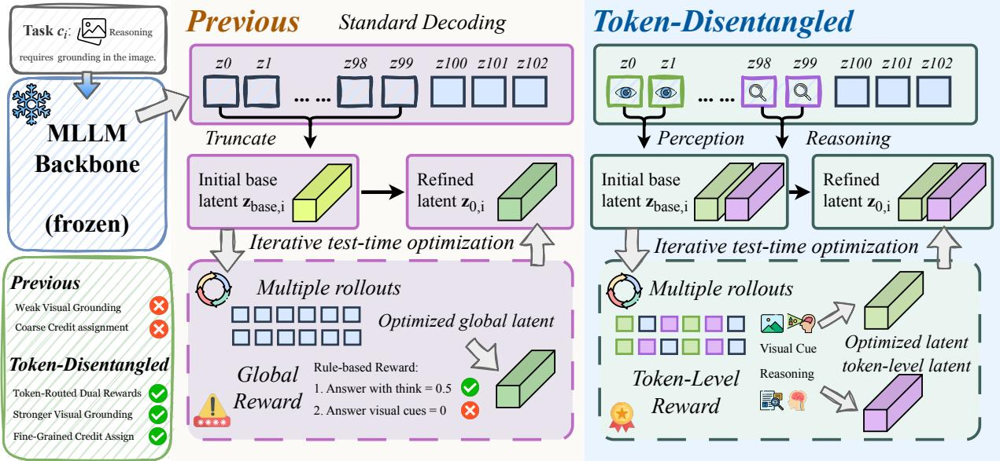
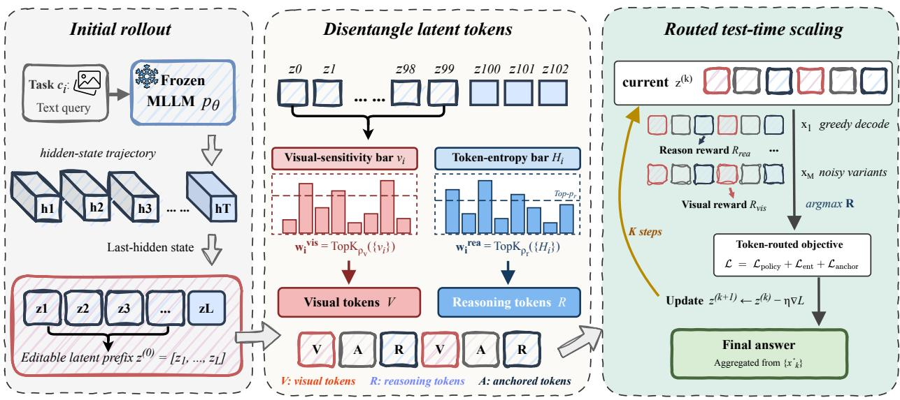
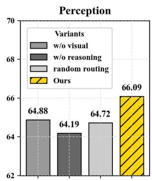
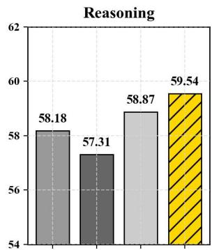
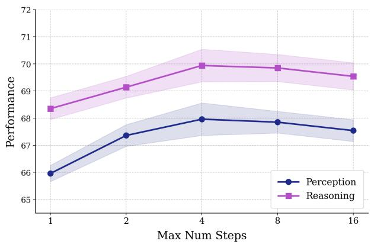

# Token-Disentangled Latent Test-Time Scaling for Vision-Language Reasoning

Hao-Xuan Ma‡1,2,3, Yihao Liu‡1, Yutao Sun‡1,4, Yanting Miao‡1,5, Mengyu Zhou†1, YiCheng Xiao6, Long Chen7, Zhenguo Li7,8, Han-Jia Ye†2,3, Xiaoxi Jiang1 and Guanjun Jiang1

1Qwen Business Unit of Alibaba, 2School of Artificial Intelligence, Nanjing University, 3National Key Laboratory for Novel Software Technology, Nanjing University, 4Zhejiang University, 5University of Waterloo, 6Chinese Academy of Sciences, 7The Hong Kong University of Science and Technology, 8Frontier Robotics

‡Core contributors. †Corresponding authors.

Latent test-time scaling improves reasoning by refining hidden states during inference, but existing methods typically apply a single scalar reward to all editable latent tokens. For multimodal large language models, this global update ignores that generated tokens play diferent roles: some are sensitive to visual evidence, while others correspond to uncertain reasoning decisions. We present Token-Disentangled Latent Test-Time Scaling, an inference-time framework that makes latent refinement token-role-aware. Starting from an initial generated trajectory, we optimize a short hiddenstate prefix while routing perception-side visual feedback to image-sensitive tokens and reasoning feedback to high-entropy tokens. Tokens selected by neither route are constrained by an anchor regularizer. Across both perception and reasoning benchmarks on Qwen2.5-VL-7B and InternVL3.5-8B, our method lifts macro accuracy over CoT by +2.57 and +1.51 respectively, and outperforms strong output-space test-time scaling baselines under matched decoded-candidate budgets. Code is available at https://github.com/Qwen-Applications/TD-LTTS.

## 1. Introduction

Multimodal large language models (MLLMs) have recently achieved impressive progress in integrating visual and textual information for complex reasoning tasks (Shao et al., 2024; Deng et al., 2025; Wen et al., 2025). Despite this progress, further improving these capabilities through additional training remains costly, motivating test-time scaling methods that keep the model frozen while allocating extra computation to the same input at inference time (Brown et al., 2024; Geiping et al., 2026). In multimodal reasoning, however, extra inference-time computation is useful only when it targets the source of the model’s error (Liu et al., 2025a). Such errors can arise from distinct bottlenecks: a model may generate a coherent answer while relying on insuficient visual evidence, or it may capture the relevant visual cues but still fail to discriminate among competing answers.

Recent latent test-time scaling methods move inference-time computation into hidden states, refining internal representations rather than updating model parameters (Li et al., 2025a; Zhang et al., 2025a). This ofers a natural way to reuse existing MLLMs, since the search operates over instance-specific hidden states while leaving the model frozen. However, existing latent refinement objectives typically optimize a short sequence of editable latent tokens with a single global scalar reward, as illustrated in Figure 1. This global feedback is too coarse for multimodal reasoning, where diferent tokens can play diferent roles: some are closely tied to visual evidence, while others support reasoning and answer discrimination (Lu et al., 2026; Huang et al., 2025). As a result, tokens with diferent roles may receive the same credit signal even when they contribute to the error in diferent ways. More concretely, a candidate-level reward cannot determine whether a failed continuation stems from insuficient visual grounding or flawed answer discrimination, which can assign refinement pressure to latent positions unrelated to the actual failure mode.

These observations suggest that efective latent test-time scaling for MLLMs should refine both visualevidence use and reasoning states. To this end, we propose Token-Disentangled Latent Test-Time Scaling, an inference-time framework that makes latent refinement token-role-aware. Our method retains the standard latent test-time optimization: an MLLM first generates an initial response, a short slice of generated hidden states is selected as editable latent variables, and this slice is refined by decoding and scoring candidate continuations. Instead of broadcasting one global reward to all editable tokens, we decompose the optimization signal into visual-evidence and reasoning components and route them to diferent latent positions. Visual tokens are selected by their sensitivity to image perturbations, while reasoning tokens are selected by output uncertainty. This enables visual and reasoning feedback to update diferent parts of the latent sequence.

  
Figure 1 | From global latent refinement to token-disentangled latent refinement. Our method augments latent test-time scaling with token-role-aware routing, separate reasoning and visual rewards, and anchor regularization, improving visual engagement, answer discrimination, and consistency across multimodal reasoning benchmarks.

We evaluate our method on six multimodal reasoning benchmarks spanning both perception-heavy and reasoning-heavy settings, using Qwen2.5-VL-7B and InternVL3.5-8B as frozen backbones. Across these benchmarks, our method consistently improves the initial CoT rollout, yielding macro-average gains of +2.57 on Qwen2.5-VL-7B and +1.51 on InternVL3.5-8B. Under the same decoded-candidate budget, our method also outperforms strong output-space test-time scaling baselines on both backbones, suggesting that targeted latent refinement can improve the model’s internal computation rather than merely selecting among sampled answers. Further analyses show that both visual-token routing and reasoning-token routing contribute to the final improvement.

Our contributions are threefold:

• We identify a multimodal limitation of existing latent test-time scaling: candidate-level scalar rewards cannot distinguish between visual-evidence and reasoning roles within the editable latent sequence.

• We introduce token-disentangled latent refinement, which routes visual engagement feedback to imagesensitive tokens and reasoning feedback to uncertain reasoning tokens.

• We demonstrate consistent gains over CoT across six multimodal reasoning benchmarks and two frozen MLLM backbones, showing the efectiveness of role-aware latent refinement.

## 2. Related Work

## 2.1. Latent Test-Time Scaling

Test-time scaling improves reasoning by spending extra computation during inference rather than increasing model size. Early work mainly scaled in output space through repeated sampling, search, or self-correction (Wang et al., 2022; Brown et al., 2024; Welleck et al., 2022), with later studies analyzing compute-optimal allocation (Snell et al., 2024). A parallel line moves this computation into continuous latent states (Geiping et al., 2026; You et al., 2025; Muennighof et al., 2025): Coconut (Hao et al., 2024) uses continuous thoughts as reusable reasoning states, while SoftCoT and SoftCoT++ introduce soft latent reasoning and test-time latent exploration (Xu et al., 2025b,a). More recent methods refine latent states through search or policy optimization, including LatentSeek (Li et al., 2025a); multimodal variants such as DMLR (Liu et al., 2025a) and VaLR (Jeon et al., 2026) further emphasize preserving visual information during latent computation (Ahmadpour et al., 2025; Zhang et al., 2025b; Kaya et al., 2025). These studies show the promise of latent refinement, but most apply sequence-level, step-level, or globally coupled objectives. Our work instead routes perception and reasoning feedback to diferent latent tokens.

## 2.2. Token-Level Credit Assignment in Multimodal Reasoning

Reliable multimodal reasoning requires more than producing a plausible final answer: intermediate decisions must remain grounded in the relevant visual evidence. Prior studies show that stronger language reasoning does not eliminate perception bottlenecks, and that only a subset of visual tokens is often decisive for downstream prediction (Xiong et al., 2025; Tong et al., 2024; Jiang et al., 2025). This issue becomes more pronounced in generated reasoning trajectories, where longer chains can dilute visual attention and amplify hallucination (Liu et al., 2025b).

These findings motivate token-level credit assignment for multimodal reasoning. Perception-aware optimization and token analyses identify sparse but pivotal visual dependencies (Huang et al., 2025), while ToR (Lu et al., 2026) and PRCO (Miao et al., 2026) explicitly separate perception- and reasoning-related roles during training. Our work brings this role distinction into latent test-time scaling: instead of assigning one candidate-level reward to all editable hidden states, we route perception-side and reasoning-side feedback to diferent latent tokens of a frozen MLLM during inference.

## 3. Preliminaries

Problem Setup. We first formulate latent test-time scaling in the conventional text-only setting. Given a textual context �, a language model with fixed parameters � generates a response $y = ( y _ { 1 } , \dots , y _ { T } )$ with hidden states $h _ { 1 } , \ldots , h _ { T }$ . At each position, the LM head maps the hidden state to the next-token distribution $p _ { \theta } ( y _ { t } \mid$ $c , y _ { < t } )$

Latent test-time scaling treats a short prefix of these pre-LM-head hidden states as editable latent variables,

$$
z ^ { ( 0 ) } = [ h _ { 1 } , \ldots , h _ { L } ] , \qquad z ^ { ( k ) } = \{ z _ { i } ^ { ( k ) } \} _ { i = 1 } ^ { L } ,\tag{1}
$$

where � is the number of editable latent tokens and � indexes refinement steps. The model parameters remain frozen; only the instance-specific latent prefix is updated.

Given a current latent prefix $z ^ { ( k ) }$ , each editable vector induces a local LM-head distribution

$$
\pi _ { i } ( \nu \mid z _ { i } ^ { ( k ) } ) = \mathrm { s o f t m a x } ( W _ { \mathrm { l m } } z _ { i } ^ { ( k ) } ) _ { \nu } .\tag{2}
$$

Decoding from these distributions yields a latent-induced prefix $\hat { y } _ { 1 : L }$ , after which the frozen model continues generation to produce a candidate response �. We write the induced candidate distribution as $p _ { \theta } ( x \mid z ^ { ( k ) } , c )$ and the candidate set at step � as

$$
X ^ { ( k ) } = \{ x _ { 1 } ^ { ( k ) } , \ldots , x _ { M } ^ { ( k ) } \} .\tag{3}
$$

A verifier or rule-based reward then assigns a scalar score $R ( x , c )$ to each decoded candidate. Prior latent search methods use this scalar to update the entire latent prefix with an objective of the form

$$
\mathcal { L } = - R ( x , c ) \sum _ { i = 1 } ^ { L } \log \pi _ { i } ( \hat { y } _ { i } \mid z _ { i } ) .\tag{4}
$$

This formulation is natural for unimodal reasoning: the reward is defined at the candidate level, and all editable latent positions are optimized toward the same decoded trajectory-level signal.

  
Figure 2 | Framework of Token-Disentangled Latent Test-Time Scaling. A frozen VLM first produces an initial chain-of-thought response and its hidden-state trajectory. We refine an early latent prefix from this trajectory at test time. Visual tokens (identified by high image sensitivity) receive visual rewards, while reasoning tokens (identified by high entropy) receive reasoning rewards. Token routing prevents visual and reasoning feedback from collapsing into a single global latent update.

Modality Gap in Vision-Language Models. For vision-language reasoning, the context becomes $\xi = ( I , q )$ with image � and question �. The generated trajectory is now supported by mixed evidence: some latent tokens are tied to visual input—their likelihoods shift under image corruption, indicating that they encode objects, attributes, counts, or spatial relations—while others correspond to uncertain answer comparisons or reasoning transitions, identifiable by high entropy in their LM-head distributions. A single scalar reward can score answer quality or visual engagement, but it cannot tell which latent positions should absorb perception feedback and which should absorb reasoning feedback; broadcasting one signal to both groups risks mixing the two updates and worsening the modality gap.

We therefore treat the latent prefix as a mixture of roles and perform token-level credit assignment. We use two reward signals—a reasoning reward $R _ { \mathrm { r e a } }$ for answer quality and a visual reward $R _ { \mathrm { { v i s } } }$ for perception-side engagement—and route them to two disjoint token groups: high-entropy tokens receive reasoning feedback, while image-sensitive tokens receive visual feedback. This sets up the token-disentangled latent update in Section 4.

## 4. Method

We present Token-Disentangled Latent Test-Time Scaling, an inference-time adaptation method for visionlanguage reasoning. Building on the latent test-time scaling formulation in Section 3, our method changes how reward feedback is assigned to editable latent tokens. Instead of applying one scalar reward to the entire latent prefix, we separate visual feedback from reasoning feedback and route each signal to the tokens most suited for it.

## 4.1. Token-Routed Latent Refinement Objective

The standard latent-search objective is to find an editable prefix $z = ( z _ { 1 } , \dots , z _ { L } )$ of length � that improves the expected quality of decoded continuations:

$$
z ^ { \star } = \arg \operatorname* { m a x } _ { z } \mathbb { E } _ { x \sim p _ { \theta } ( x | z , \xi ) } \left[ R ( x , \xi ) \right] .\tag{5}
$$

Applying a single reward � to every latent token, however, assumes that all tokens in the slice play the same role. This assumption is especially weak for multimodal reasoning: some latent tokens primarily carry visual

evidence, while others encode uncertain answer decisions or reasoning transitions.

We therefore decompose the context-conditioned feedback into a visual reward and a reasoning reward:

$$
R _ { \mathrm { v i s } } ( x ; \xi , y ) , \qquad R _ { \mathrm { r e a } } ( x ; \xi ) ,\tag{6}
$$

where $\xi = ( I , q )$ is the multimodal context and $y$ is the initial rollout used as the per-instance visual baseline. We write these rewards as $R _ { \mathrm { { v i s } } } ( x )$ and $R _ { \mathrm { r e a } } ( x )$ when the context is clear, and compute two disjoint token masks:

$$
w _ { i } ^ { \mathrm { v i s } } , w _ { i } ^ { \mathrm { r e a } } \in \{ 0 , 1 \} , \qquad w _ { i } ^ { \mathrm { v i s } } w _ { i } ^ { \mathrm { r e a } } = 0 .\tag{7}
$$

At update $k ,$ the feedback candidate is selected from a decoded candidate set $\chi ^ { ( k ) }$ by the reasoning reward:

$$
x _ { k } ^ { \star } = \arg \operatorname* { m a x } _ { x \in X ^ { ( k ) } } R _ { \mathrm { r e a } } ( x ) .\tag{8}
$$

For $k \geq 1 , \chi ^ { ( k ) }$ is decoded from the current prefix $z ^ { ( k ) }$ after the �-th latent update; for $k = 0$ we set ${ \cal X } ^ { ( 0 ) } = \{ { y } \}$ so the first update is driven by the rollout’s own reward without any extra decoding at $z ^ { ( 0 ) }$ . The rollout $y$ is also retained throughout as the per-instance reference for relative prediction margins. The selected $x _ { k } ^ { \star }$ is then used for both reward channels: $R _ { \mathrm { r e a } }$ keeps answer quality as the selection criterion, while $R _ { \mathrm { { v i s } } }$ measures whether that candidate improves visual engagement relative to the initial rollout �.

During decoding, we also retain the editable-token prefix that produced each candidate. Let $\hat { y } _ { k , i } ^ { \star }$ denote the token at editable position � for the selected candidate $x _ { k } ^ { \star }$ , with its log probability evaluated under the current latent distribution $\pi _ { i } ( \cdot \mid z _ { i } ^ { ( k ) } )$ ). We first define the routed log-probability sums

$$
\begin{array} { r l } & { S _ { \mathrm { v i s } } ^ { ( k ) } = \displaystyle \sum _ { i } w _ { i } ^ { \mathrm { v i s } } \log \pi _ { i } ( \hat { y } _ { k , i } ^ { \star } \mid z _ { i } ^ { ( k ) } ) , } \\ & { S _ { \mathrm { r e a } } ^ { ( k ) } = \displaystyle \sum _ { i } w _ { i } ^ { \mathrm { r e a } } \log \pi _ { i } ( \hat { y } _ { k , i } ^ { \star } \mid z _ { i } ^ { ( k ) } ) . } \end{array}\tag{9}
$$

The token-routed policy loss is

$$
\begin{array} { r } { \mathcal { L } _ { \mathrm { p o l i c y } } = - \lambda _ { \mathrm { p g } } ^ { \mathrm { v i s } } R _ { \mathrm { v i s } } ( x _ { k } ^ { \star } ) S _ { \mathrm { v i s } } ^ { ( k ) } } \\ { - \lambda _ { \mathrm { p g } } ^ { \mathrm { r e a } } R _ { \mathrm { r e a } } ( x _ { k } ^ { \star } ) S _ { \mathrm { r e a } } ^ { ( k ) } . } \end{array}\tag{10}
$$

Visual rewards therefore update image-sensitive tokens, while reasoning rewards update high-entropy tokens. We additionally regularize the update with a reasoning-weighted entropy term and an anchor penalty:

$$
\mathcal { L } _ { \mathrm { e n t } } = \lambda _ { \mathrm { e n t } } \frac { \sum _ { i } w _ { i } ^ { \mathrm { r e a } } H _ { i } } { \sum _ { i } w _ { i } ^ { \mathrm { r e a } } + \epsilon } ,\tag{11}
$$

$$
\begin{array} { r } { \mathcal { L } _ { \mathrm { a n c h o r } } = \lambda _ { \mathrm { a n c h o r } } \| z ^ { ( k ) } - z ^ { ( 0 ) } \| _ { 2 } ^ { 2 } , } \end{array}\tag{12}
$$

where

$$
H _ { i } = - \sum _ { \nu } \pi _ { i } ( \nu \mid z _ { i } ^ { ( k ) } ) \log \pi _ { i } ( \nu \mid z _ { i } ^ { ( k ) } ) .\tag{13}
$$

The final objective minimized at each refinement step is

$$
\begin{array} { r } { \mathcal { L } = \mathcal { L } _ { \mathrm { p o l i c y } } + \mathcal { L } _ { \mathrm { e n t } } + \mathcal { L } _ { \mathrm { a n c h o r } } . } \end{array}\tag{14}
$$

## 4.2. Visual and Reasoning Rewards

Visual reward. The visual reward uses image-token attention as a lightweight visual-engagement proxy. Let $\mathcal { P } _ { I }$ be the image-token positions. For a generated trajectory $x = \left( u _ { 1 } , \ldots , u _ { N } \right)$ , define

$$
e _ { j } ( x ) = \frac { 1 } { M } \sum _ { m = 1 } ^ { M } \sum _ { p \in \mathcal { P } _ { I } } A _ { m , j , p } ^ { ( \ell ) } ( I , x ) ,\tag{15}
$$

where $A ^ { ( \ell ) }$ is the layer-ℓ attention tensor and � is the number of heads. With $N ^ { \prime } = \operatorname* { m i n } ( N , N _ { \mathrm { m a x } } )$ , the trajectorylevel engagement score is

$$
E ( x ) = \frac { 1 } { N ^ { \prime } } \sum _ { j = 1 } ^ { N ^ { \prime } } e _ { j } ( x ) .\tag{16}
$$

Using the initial rollout � as the per-instance baseline, we define

$$
R _ { \mathrm { v i s } } ( x ) = \operatorname { t a n h } \left( \frac { E ( x ) - E ( y ) } { \tau _ { \mathrm { v i s } } } \right) .\tag{17}
$$

This relative reward also provides visual feedback for the initial candidate set $\chi ^ { ( 0 ) }$ ; baseline details are in Appendix A. The bounded tanh caps the update magnitude so a single instance with degenerate $E ( y )$ cannot dominate the latent step.

Reasoning reward. For a decoded candidate �, let $c ( x )$ be its normalized short prediction. We score candidate quality by subtracting a text-only prior from the image-conditioned likelihood:

$$
S ( c ) = \log p _ { \theta } ( c \mid I , q ) - \lambda _ { \mathrm { p } } \log p _ { \theta } ( c \mid q ) .\tag{18}
$$

We combine a centered bounded score with a relative margin over competing predictions:

$$
R _ { \mathrm { r e a } } ( x ) = \lambda _ { s } \bar { r } ( x ) + \lambda _ { \mathrm { m a r } } r _ { \mathrm { m a r } } ( c ( x ) ) .\tag{19}
$$

Here ${ \bar { r } } ( x )$ is derived from the score $S ( c ( x ) )$ , while $r _ { \mathrm { m a r } }$ compares �(�) against alternatives from the same refinement step. We give the full bounded-score and margin definitions in Appendix B.1.

## 4.3. Token Routing

Visual tokens. We identify visual tokens by measuring how sensitive their likelihoods are to image corruption. Under the original image, the teacher-forced log probability of the generated token corresponding to editable position � is

$$
\ell _ { i } = \log p _ { \theta } ( y _ { i } \mid I , q , y _ { < i } ) .\tag{20}
$$

After corrupting the image to obtain ${ \tilde { I } } ,$ we recompute

$$
\tilde { \ell } _ { i } = \log p _ { \theta } ( y _ { i } \mid \tilde { I } , q , y _ { < i } ) .\tag{21}
$$

The image-sensitivity score is

$$
\nu _ { i } = \phi ( \tilde { \ell } _ { i } - \ell _ { i } ) , \qquad \phi ( x ) = \exp ( x ) - x - 1 .\tag{22}
$$

Tokens with the highest image-sensitivity scores are routed to the visual branch:

$$
w _ { i } ^ { \mathrm { v i s } } = 1 \left[ i \in \mathrm { T o p K } _ { \rho _ { \nu } } \left( \{ \nu _ { j } \} _ { j = 1 } ^ { L } \right) \right] .\tag{23}
$$

Reasoning tokens. Reasoning tokens are identified by uncertainty under the current latent LM-head distribution. We standardize the entropy values within the editable slice,

$$
\bar { H } _ { i } = \frac { H _ { i } - \mu _ { H } } { \sigma _ { H } + \epsilon } ,\tag{24}
$$

where $\mu _ { H }$ and $\sigma _ { H }$ are the mean and standard deviation of $\{ H _ { j } \} _ { j = 1 } ^ { L }$ . Let $N _ { \mathrm { v i s } }$ denote the non-visual tokens, and let $\bar { H } _ { N _ { \mathrm { v i s } } }$ be the corresponding standardized entropy scores. We then select reasoning tokens by

$$
w _ { i } ^ { \mathrm { r e a } } = 1 \big [ i \in \mathrm { T o p K } _ { \rho _ { r } } ( \bar { H } _ { N _ { \mathrm { v i s } } } ) \big ] .\tag{25}
$$

This strict routing keeps the visual and reasoning branches disjoint. Unselected tokens remain anchored to the original trajectory and receive no direct policy reward.

Algorithm 1 Token-Disentangled Latent Test-Time Scaling   
Require: Multimodal context $\xi = ( I , q )$ , frozen VLM ��, update steps �   
1: Generate initial rollout and hidden states $h _ { 1 : T }$   
2: Initialize editable prefix $z ^ { ( 0 ) } = [ h _ { 1 } , \ldots , h _ { L } ]$   
3: Compute image-sensitivity scores $\{ \upsilon _ { i } \} _ { i = 1 } ^ { L }$   
4: Set $\chi ^ { ( 0 ) } = \{ y \} , x _ { 0 } ^ { \star } = y ;$ compute $R _ { \mathrm { r e a } } ( y )$ (with $R _ { \mathrm { v i s } } ( y ) = 0$ by construction)   
5: for $k = 0 , \ldots , K - 1$ do   
6: Compute entropy scores $\{ H _ { i } \} _ { i = 1 } ^ { L }$ from $z ^ { ( k ) }$   
7: Select $w ^ { \mathrm { v i s } }$ by image-sensitivity $\mathrm { T o p K } _ { \rho _ { \nu } }$   
8: Select $w ^ { \mathrm { r e a } }$ by standardized entropy $\mathrm { \dot { T o p K } } _ { \rho _ { r } }$ among non-visual tokens   
9: Update $z ^ { ( k + 1 ) }$ using $R _ { \mathrm { r e a } } ( x _ { k } ^ { \star } )$ and $R _ { \mathrm { v i s } } ( x _ { k } ^ { \star } )$   
10: Decode $\chi ^ { ( k + 1 ) }$ from $z ^ { ( k + 1 ) }$ and noisy variants of $z ^ { ( k + 1 ) }$   
11: Select $x _ { k + 1 } ^ { \star } =$ arg max�∈X(�+1) $R _ { \mathrm { r e a } } ( x )$   
12: Compute $\bar { R } _ { \mathrm { r e a } } ( x _ { k + 1 } ^ { \star } )$ and $R _ { \mathrm { v i s } } ( x _ { k + 1 } ^ { \star } )$ for the next update   
13: end for   
14: return final answer aggregated from $\{ y \} \cup X ^ { ( 1 ) } \cup \cdots \cup X ^ { ( K ) }$

## 4.4. Inference Procedure

Algorithm 1 summarizes our inference procedure. Starting from the model’s own chain-of-thought rollout, we refine an early latent prefix and use decoded candidates as reward feedback for subsequent updates. Candidate sets combine one greedy continuation with stochastic continuations from lightly perturbed latent prefixes, diversifying search while keeping the VLM frozen.

## 5. Experiment

## 5.1. Experiment Setting

Backbones. We evaluate our method on two main open-source MLLM backbones, Qwen2.5-VL-7B-Instruct Bai et al. (2025) and InternVL3.5-8B-Instruct Wang et al. (2025), and further test generality across six additional backbones from diferent families and post-training recipes in Table 2. In all settings the backbone parameters are frozen, and our method only optimizes instance-specific latent states at test time.

Benchmarks. We evaluate on benchmarks covering two capability groups. For perception and visually grounded understanding, we use MMStar Chen et al. (2024), RealWorldQA, and HallusionBench Guan et al. (2024). For reasoning-centric evaluation, we use ScienceQA-IMG Lu et al. (2022), MathVista Lu et al. (2023), and LogicVista Xiao et al. (2024). All methods use the same answer extraction and evaluation protocol.

Baselines. We compare against test-time baselines using the same frozen backbone. CoT Wei et al. (2022) uses chain-of-thought prompting. Self-consistency Wang et al. (2022) samples multiple responses and aggregates final answers, while Best-of-N Snell et al. (2024) selects the highest-scoring candidate. Reward-only applies our reasoning reward only for output-space reranking, without latent updates or token routing. LatentSeek Li et al. (2025a) is a prior latent-adaptation baseline; we use its reasoning- and perception-reward variants, denoted LatentSeek(reasoning) and LatentSeek(perception). DMLR Liu et al. (2025a) is a multimodal latent-refinement method that emphasizes preserving visual information during latent computation. Together, these baselines separate our method from output-space scaling and prior latent-space refinement.

Implementation Details. Unless otherwise noted, we use � = 4 latent refinement steps as the default. To equalize decoding cost, all sampling-based baselines are allocated � = 16 candidate continuations, matching the total number of decoded candidates in our method. Our method additionally incurs reward-scoring and image-sensitivity forward passes; full hyperparameters, decoding settings, and per-call budget accounting are deferred to Appendices B, B.2, and C.5.

## 5.2. Main Results

Table 1 reports the main comparison on Qwen2.5-VL-7B and InternVL3.5-8B. Our method achieves the best average on both perception and reasoning groups across both backbones, lifting the Qwen2.5-VL-7B averages by +2.55/+2.59 and the InternVL3.5-8B counterparts by +0.99/+2.04 over CoT. Because the backbone is frozen, these gains are obtained purely through test-time computation on the latent states and are consistent across both architectures and capability groups, suggesting that the improvement comes from instance-level trajectory refinement rather than any backbone-specific bias.

Table 1 | Main results on multimodal reasoning benchmarks. Best results in each model block are highlighted in bold, and second-best results are underlined.
<table><tr><td rowspan="2">Method</td><td colspan="4">Perception</td><td colspan="4">Reasoning</td></tr><tr><td>MMStar</td><td>RWQA</td><td>Hallusion</td><td>Avg.</td><td>ScienceQA</td><td>MathVista</td><td>LogicVista</td><td>Avg.</td></tr><tr><td colspan="9">Qwen2.5-VL-7B</td></tr><tr><td>CoT</td><td>62.00</td><td>63.66</td><td>70.56</td><td>65.41</td><td>89.74</td><td>67.80</td><td>44.52</td><td>67.35</td></tr><tr><td>Self-consistency</td><td>63.47</td><td>65.49</td><td>68.77</td><td>65.91</td><td>89.60</td><td>70.90</td><td>42.51</td><td>67.67</td></tr><tr><td>Best-of-N</td><td>63.93</td><td>66.37</td><td>70.56</td><td>66.95</td><td>90.63</td><td>71.60</td><td>42.73</td><td>68.32</td></tr><tr><td>Reward-only</td><td>64.67</td><td>67.06</td><td>70.45</td><td>67.39</td><td>90.12</td><td>70.90</td><td>42.95</td><td>67.99</td></tr><tr><td>LatentSeek(reasoning)</td><td>61.60</td><td>63.79</td><td>69.09</td><td>64.83</td><td>88.29</td><td>66.50</td><td>44.07</td><td>66.29</td></tr><tr><td>LatentSeek(perception)</td><td>62.47</td><td>62.35</td><td>68.24</td><td>64.35</td><td>90.53</td><td>70.20</td><td>44.30</td><td>68.34</td></tr><tr><td>DMLR</td><td>60.10</td><td>64.17</td><td>70.80</td><td>65.02</td><td>89.14</td><td>69.10</td><td>43.15</td><td>67.13</td></tr><tr><td>Ours</td><td>64.73</td><td>67.45</td><td>71.71</td><td>67.96</td><td>90.73</td><td>72.10</td><td>46.98</td><td>69.94</td></tr><tr><td colspan="9">InternVL3.5-8B</td></tr><tr><td>CoT</td><td>67.13</td><td>64.36</td><td>66.04</td><td>65.84</td><td>95.04</td><td>69.80</td><td>45.19</td><td>70.01</td></tr><tr><td>Self-consistency</td><td>67.13</td><td>64.71</td><td>66.25</td><td>66.03</td><td>95.64</td><td>70.10</td><td>45.90</td><td>70.55</td></tr><tr><td>Best-of-N</td><td>67.80</td><td>64.71</td><td>66.56</td><td>66.36</td><td>94.75</td><td>72.10</td><td>46.98</td><td>71.28</td></tr><tr><td>Reward-only</td><td>68.07</td><td>65.10</td><td>66.61</td><td>66.59</td><td>96.98</td><td>71.30</td><td>46.53</td><td>71.60</td></tr><tr><td>LatentSeek(reasoning)</td><td>67.07</td><td>61.31</td><td>63.51</td><td>63.96</td><td>94.65</td><td>70.60</td><td>45.64</td><td>70.30</td></tr><tr><td>LatentSeek(perception)</td><td>66.20</td><td>62.61</td><td>64.04</td><td>64.28</td><td>91.08</td><td>72.00</td><td>44.97</td><td>69.35</td></tr><tr><td>DMLR</td><td>67.47</td><td>63.19</td><td>65.65</td><td>65.44</td><td>95.44</td><td>71.80</td><td>45.96</td><td>71.07</td></tr><tr><td>Ours</td><td>68.80</td><td>65.23</td><td>66.46</td><td>66.83</td><td>97.08</td><td>72.30</td><td>46.76</td><td>72.05</td></tr></table>

Against output-space baselines under matched decoded-candidate budgets, our method yields stronger group averages on both backbones: on Qwen2.5-VL-7B the reasoning margins over Best-of-N and Rewardonly are +1.62 and +1.95, and on InternVL3.5-8B they are +0.77 and +0.45, with consistent positive gains on perception. Editing the latent that drives subsequent decoding uses the candidate budget more eficiently than sampling-and-reranking, as the refined latent commits the improvement to every later token rather than only the selected candidate. The LatentSeek comparison is sharper: on Qwen2.5-VL-7B both variants fall below CoT on perception (64.83/64.35 vs. 65.41), and the reasoning-reward variant additionally drops reasoning (66.29 vs. 67.35), showing that a uniform rule-based reward can degrade a competent rollout because a reasoningonly signal erodes perception-sensitive tokens and vice versa. Token-routed refinement avoids this regression by dispatching diferent reward signals to diferent token roles, retaining the strongest performance on both groups simultaneously.

Table 2 | Performance comparison on perception and reasoning benchmarks. ↑ and ↓ indicate performance changes compared with the base model.
<table><tr><td rowspan="2">Base Model</td><td colspan="3">Perception</td><td colspan="3">Reasoning</td></tr><tr><td>MMStar 59.50 54.07</td><td>RWQA Hallusion 63.30</td><td>Avg. 58.96</td><td>ScienceQA MathVista LogicVista 80.76 63.14</td><td>40.93</td><td>Avg. 61.61</td></tr><tr><td>Qwen2.5-VL-3B (Bai et al., 2025) Ours</td><td>62.20 ↑2.70 56.13 ↑2.06</td><td>65.30 ↑2.00 61.21 ↑2.25</td><td></td><td>80.91 ↑0.15 64.05 ↑0.91 41.88 ↑0.95</td><td></td><td>62.28 ↑0.67</td></tr><tr><td>InternVL3.5-4B (Wang et al., 2025) Ours</td><td>69.10 64.87 70.70 ↑1.6065.13 ↑0.26</td><td>63.62 64.04 ↑0.42 66.62 ↑0.76</td><td>65.86</td><td>93.75 54.77 94.86 ↑1.11 63.53 ↑8.7643.04 ↑1.68</td><td>41.36</td><td>63.29 67.14 ↑3.85</td></tr><tr><td>LLaVA-OV-1.5-8B (An et al., 2025) Ours</td><td>62.67 66.80 65.80 ↑3.13 66.67 ↓0.13</td><td>61.72 64.88 ↑3.15 65.78 ↑2.05</td><td>63.73</td><td>90.68 68.30 96.43 ↑5.75</td><td>43.85 70.40↑2.1046.53 ↑2.68</td><td>67.61 71.12 ↑3.51</td></tr><tr><td>MiMO-VL-RL-8B (Li et al., 2025b) Ours</td><td>48.40 45.36 51.60 ↑3.2057.39 ↑12.0358.36 ↑9.2555.78 ↑8.16</td><td>49.11</td><td>47.62</td><td>86.71 63.10 93.85 ↑7.14 66.20 ↑3.1048.55 ↑11.41 69.53 ↑7.22</td><td>37.14</td><td>62.32</td></tr><tr><td>Qwen3-VL-8B Ours</td><td>71.33 69.28 71.73 ↑0.40 68.89 ↓0.39</td><td>67.19 68.45 ↑1.26 69.69 ↑0.42</td><td>69.27</td><td>93.11 77.10 94.89 ↑1.78 76.90 ↓0.20 52.35 ↑3.8074.71 ↑1.79</td><td>48.55</td><td>72.92</td></tr><tr><td></td><td>67.8</td><td>65.3</td><td></td><td>93.2 77.4</td><td></td><td></td></tr><tr><td>Ours</td><td></td><td></td><td></td><td></td><td></td><td></td></tr><tr><td></td><td></td><td></td><td></td><td></td><td></td><td></td></tr><tr><td>Qwen2.5-VL-32B (Bai et al., 2025)</td><td></td><td></td><td></td><td></td><td></td><td></td></tr><tr><td></td><td>67.9</td><td></td><td>67.0</td><td></td><td></td><td></td></tr><tr><td></td><td></td><td></td><td></td><td></td><td>50.3</td><td>73.6</td></tr><tr><td></td><td>68.0 ↑0.1 69.7 ↑1.9</td><td>69.7 ↑4.4</td><td>69.1 ↑2.1</td><td>93.6 ↑0.4 77.8 ↑0.4</td><td>51.7 ↑1.4 74.4 ↑0.7</td><td></td></tr></table>

## 5.3. Detailed Analysis

[Ana.1] Component Ablation. We ablate the two reward branches and the token-routing module with other settings fixed; Figure 3 reports two-task representative averages (perception over MMStar+RWQA, reasoning over MathVista+LogicVista) as a costcontrolled subset of the Table 1 groups. Removing the visual reward $( \mathrm { w } / \mathrm { o } R _ { \mathrm { v i s } } )$ drops both averages from 66.09/59.54 to 64.88/58.18, while removing the reasoning reward $\left( \mathrm { w } / \mathrm { o } \ R _ { \mathrm { r e a } } \right)$ causes the largest drop (64.19/57.31), identifying bounded-likelihood scoring as the dominant signal and image-token engagement as the necessary corrector for perception-sensitive tokens. Replacing token-aware routing with random routing also degrades both groups (64.72/58.87), confirming that multiple rewards alone are insuficient without role-aware token assignment. Extended sweeps over reward formulations and routing signals appear in Appendices C.3 and C.2; the routing budget � sweep and strict-vs-overlap mask comparison show that hard top-� selection is robust within the explored range.

  
Figure 3 | Component ablation. Perception is the average of MMStar and RealWorldQA; reasoning is the average of MathVista and LogicVista (two representative tasks per group, used as a cost-controlled subset of the Table 1 groups).

[Ana.2] Generality Across Backbones. Table 2 extends the evaluation to six additional backbones covering compact (Qwen2.5-VL-3B, InternVL3.5-4B), 8B (LLaVA-OneVision-1.5-8B, MiMO-VL-RL-8B, Qwen3-VL-8B), and large (Qwen2.5-VL-32B) models from diferent families and post-training recipes. Our method improves both group averages on all six backbones. The largest improvements appear on the RL-post-trained MiMO-VL-RL-8B, while stronger backbones such as Qwen3-VL-8B show smaller gains as the initial rollout already approaches benchmark headroom; group averages remain positive even when isolated cells drop within the noise band (at most −0.39). The consistency across model family, scale (3B–32B), and post-training recipe (SFT vs. RL) suggests that the gains arise from instance-level latent refinement rather than any architectural assumption.

[Ana.3] Test-Time Scaling and Token Budget. We study how performance scales with the maximum number of latent refinement steps �. Figure 4 reports the perception/reasoning averages for $K \_ { \mathbf { \Sigma } } \in$ $\{ 1 , 2 , 4 , 8 , 1 6 \}$ Both groups improve monotonically from $K = 1$ to $K = 4$ (perception $6 5 . 9 6 \to 6 7 . 3 6 \to$ $6 7 . 9 6 ;$ reasoning $6 8 . 3 4  6 9 . 1 3  6 9 . 9 4 )$ , and then saturate at $K \ge 8$ within the noise band (perception $6 7 . 8 6 / 6 7 . 7 4 ;$ reasoning 69.88/69.78, with overlapping confidence intervals across $K \in \{ 4 , 8 , 1 6 \} )$ ; the same $K = 4$ optimum appears in the per-benchmark sweep in Appendix C.4. This indicates that a small number of latent updates sufices to correct the initial trajectory and that further refinement yields no additional measurable gain, so we adopt $K = 4$ as the computeoptimal default in the main results.

  
Figure 4 | Efect of the maximum number of latent refinement steps � on the three-benchmark perception and reasoning averages from Table 1.

## 6. Conclusion

We introduced Token-Disentangled Latent Test-Time Scaling, a role-aware latent refinement framework for frozen multimodal large language models. By routing visual feedback to image-sensitive tokens and reasoning feedback to uncertain decision tokens, our method avoids applying a single global reward to all editable latent states. Experiments show consistent improvements over CoT and over test-time scaling baselines, while ablations confirm the importance of both reward decomposition and token-aware routing. Future work can further reduce reward-estimation cost and extend this framework to longer multimodal interactions.

## Limitations

Our method improves frozen MLLMs at test time, but it also introduces additional inference cost because each example requires latent refinement and multiple candidate continuations. The reward signals are proxy objectives rather than guaranteed correctness verifiers, so visual engagement and likelihood-based reasoning scores can be noisy for ambiguous images, underspecified questions, or answers requiring external knowledge; the bounded tanh in $R _ { \mathrm { { v i s } } }$ limits but does not eliminate this. Token routing uses a hard top-� selection for branch disjointness; soft or learned routing is left to future work. In addition, our method requires openweight backbones whose hidden states can be edited and diferentiated through, which excludes API-only closed models by construction. Extending the framework to longer multi-turn settings and broader real-world domains remains future work.

## Acknowledgments

This work was supported by the National Key R&D Program of China under Grant No. 2024YFE0202800 and the National Natural Science Foundation of China under Grant Nos. 62522605 and 62376118. Long Chen was additionally supported by the National Natural Science Foundation of China under Grant Nos. 62522216 and 62402408, and the Hong Kong SAR Research Grants Council under Grant Nos. 26208924 and 16219025.

## References

Mohammadjavad Ahmadpour, Amirmahdi Meighani, Payam Taebi, Omid Ghahroodi, Amirmohammad Izadi, and Mahdieh Soleymani Baghshah. Limits and gains of test-time scaling in vision-language reasoning. arXiv preprint arXiv:2512.11109, 2025.

Xiang An, Yin Xie, Kaicheng Yang, Wenkang Zhang, Xiuwei Zhao, Zheng Cheng, Yirui Wang, Songcen Xu, Changrui Chen, Didi Zhu, et al. Llava-onevision-1.5: Fully open framework for democratized multimodal training. arXiv preprint arXiv:2509.23661, 2025.

Shuai Bai, Keqin Chen, Xuejing Liu, Jialin Wang, Wenbin Ge, Sibo Song, Kai Dang, Peng Wang, Shijie Wang, Jun Tang, et al. Qwen2. 5-vl technical report. arXiv preprint arXiv:2502.13923, 2025.

Bradley Brown, Jordan Juravsky, Ryan Ehrlich, Ronald Clark, Quoc V Le, Christopher Ré, and Azalia Mirhoseini. Large language monkeys: Scaling inference compute with repeated sampling. arXiv preprint arXiv:2407.21787, 2024.

Lin Chen, Jinsong Li, Xiaoyi Dong, Pan Zhang, Yuhang Zang, Zehui Chen, Haodong Duan, Jiaqi Wang, Yu Qiao, Dahua Lin, et al. Are we on the right way for evaluating large vision-language models? NeurIPS, 37:27056– 27087, 2024.

Yihe Deng, Hritik Bansal, Fan Yin, Nanyun Peng, Wei Wang, and Kai-Wei Chang. Openvlthinker: An early exploration to complex vision-language reasoning via iterative self-improvement. arXiv preprint arXiv:2503.17352, 2025.

Jonas Geiping, Sean McLeish, Neel Jain, John Kirchenbauer, Siddharth Singh, Brian Bartoldson, Bhavya Kailkhura, Abhinav Bhatele, and Tom Goldstein. Scaling up test-time compute with latent reasoning: A recurrent depth approach. NeurIPS, 38:41340–41391, 2026.

Tianrui Guan, Fuxiao Liu, Xiyang Wu, Ruiqi Xian, Zongxia Li, Xiaoyu Liu, Xijun Wang, Lichang Chen, Furong Huang, Yaser Yacoob, et al. Hallusionbench: an advanced diagnostic suite for entangled language hallucination and visual illusion in large vision-language models. In CVPR, pp. 14375–14385, 2024.

Shibo Hao, Sainbayar Sukhbaatar, DiJia Su, Xian Li, Zhiting Hu, Jason Weston, and Yuandong Tian. Training large language models to reason in a continuous latent space. arXiv preprint arXiv:2412.06769, 2024.

Siyuan Huang, Xiaoye Qu, Yafu Li, Yun Luo, Zefeng He, Daizong Liu, and Yu Cheng. Spotlight on token perception for multimodal reinforcement learning. arXiv preprint arXiv:2510.09285, 2025.

Byungwoo Jeon, Yoonwoo Jeong, Hyunseok Lee, Minsu Cho, and Jinwoo Shin. Vision-aligned latent reasoning for multi-modal large language model. arXiv preprint arXiv:2602.04476, 2026.

Yutao Jiang, Qiong Wu, Wenhao Lin, Wei Yu, and Yiyi Zhou. What kind of visual tokens do we need? trainingfree visual token pruning for multi-modal large language models from the perspective of graph. In AAAI, number 4, pp. 4075–4083, 2025.

Mehmet Onurcan Kaya, Desmond Elliott, and Dim P Papadopoulos. Eficient test-time scaling for small visionlanguage models. arXiv preprint arXiv:2510.03574, 2025.

Hengli Li, Chenxi Li, Tong Wu, Xuekai Zhu, Yuxuan Wang, Zhaoxin Yu, Eric Hanchen Jiang, Song-Chun Zhu, Zixia Jia, Ying Nian Wu, et al. Seek in the dark: Reasoning via test-time instance-level policy gradient in latent space. arXiv preprint arXiv:2505.13308, 2025a.

Jiaze Li, Jingyang Chen, Yuxun Qu, Shijie Xu, Zhenru Lin, Junyou Zhu, Boshen Xu, Wenhui Tan, Pei Fu, Jianzhong Ju, et al. Xiaomi mimo-vl-miloco technical report. arXiv preprint arXiv:2512.17436, 2025b.

Chengzhi Liu, Yuzhe Yang, Yue Fan, Qingyue Wei, Sheng Liu, and Xin Eric Wang. Reasoning within the mind: Dynamic multimodal interleaving in latent space. arXiv preprint arXiv:2512.12623, 2025a.

Ziyu Liu, Zeyi Sun, Yuhang Zang, Xiaoyi Dong, Yuhang Cao, Haodong Duan, Dahua Lin, and Jiaqi Wang. Visual-rft: Visual reinforcement fine-tuning. arXiv preprint arXiv:2503.01785, 2025b.

Jinda Lu, Junkang Wu, Jinghan Li, Kexin Huang, Shuo Yang, Guoyin Wang, Jiancan Wu, Xiang Wang, and Xiangnan He. Bridging perception and reasoning: Token reweighting for rlvr in multimodal llms. arXiv preprint arXiv:2603.25077, 2026.

Pan Lu, Swaroop Mishra, Tanglin Xia, Liang Qiu, Kai-Wei Chang, Song-Chun Zhu, Oyvind Tafjord, Peter Clark, and Ashwin Kalyan. Learn to explain: Multimodal reasoning via thought chains for science question answering. NeurIPS, 35:2507–2521, 2022.

Pan Lu, Hritik Bansal, Tony Xia, Jiacheng Liu, Chunyuan Li, Hannaneh Hajishirzi, Hao Cheng, Kai-Wei Chang, Michel Galley, and Jianfeng Gao. Mathvista: Evaluating mathematical reasoning of foundation models in visual contexts. arXiv preprint arXiv:2310.02255, 2023.

Ziqi Miao, Haonan Jia, Lijun Li, Chen Qian, Yuan Xiong, Wenting Yan, and Jing Shao. Seeing with you: Perception-reasoning coevolution for multimodal reasoning. arXiv preprint arXiv:2603.28618, 2026.

Niklas Muennighof, Zitong Yang, Weijia Shi, Xiang Lisa Li, Li Fei-Fei, Hannaneh Hajishirzi, Luke Zettlemoyer, Percy Liang, Emmanuel Candès, and Tatsunori B Hashimoto. s1: Simple test-time scaling. In EMNLP, pp. 20286–20332, 2025.

Hao Shao, Shengju Qian, Han Xiao, Guanglu Song, Zhuofan Zong, Letian Wang, Yu Liu, and Hongsheng Li. Visual cot: Advancing multi-modal language models with a comprehensive dataset and benchmark for chain-of-thought reasoning. NeurIPS, 37:8612–8642, 2024.

Charlie Snell, Jaehoon Lee, Kelvin Xu, and Aviral Kumar. Scaling llm test-time compute optimally can be more efective than scaling model parameters. arXiv preprint arXiv:2408.03314, 2024.

Shengbang Tong, Zhuang Liu, Yuexiang Zhai, Yi Ma, Yann LeCun, and Saining Xie. Eyes wide shut? exploring the visual shortcomings of multimodal llms. In CVPR, pp. 9568–9578, 2024.

Weiyun Wang, Zhangwei Gao, Lixin Gu, Hengjun Pu, Long Cui, Xingguang Wei, Zhaoyang Liu, Linglin Jing, Shenglong Ye, Jie Shao, et al. Internvl3. 5: Advancing open-source multimodal models in versatility, reasoning, and eficiency. arXiv preprint arXiv:2508.18265, 2025.

Xuezhi Wang, Jason Wei, Dale Schuurmans, Quoc Le, Ed Chi, Sharan Narang, Aakanksha Chowdhery, and Denny Zhou. Self-consistency improves chain of thought reasoning in language models. arXiv preprint arXiv:2203.11171, 2022.

Jason Wei, Xuezhi Wang, Dale Schuurmans, Maarten Bosma, Fei Xia, Ed Chi, Quoc V Le, Denny Zhou, et al. Chain-of-thought prompting elicits reasoning in large language models. NeurIPS, 35:24824–24837, 2022.

Sean Welleck, Ximing Lu, Peter West, Faeze Brahman, Tianxiao Shen, Daniel Khashabi, and Yejin Choi. Generating sequences by learning to self-correct. arXiv preprint arXiv:2211.00053, 2022.

Xumeng Wen, Zihan Liu, Shun Zheng, Shengyu Ye, Zhirong Wu, Yang Wang, Zhijian Xu, Xiao Liang, Junjie Li, Ziming Miao, et al. Reinforcement learning with verifiable rewards implicitly incentivizes correct reasoning in base llms. arXiv preprint arXiv:2506.14245, 2025.

Yijia Xiao, Edward Sun, Tianyu Liu, and Wei Wang. Logicvista: Multimodal llm logical reasoning benchmark in visual contexts. arXiv preprint arXiv:2407.04973, 2024.

Tianyi Xiong, Xiyao Wang, Dong Guo, Qinghao Ye, Haoqi Fan, Quanquan Gu, Heng Huang, and Chunyuan Li. Llava-critic: Learning to evaluate multimodal models. In CVPR, pp. 13618–13628, 2025.

Yige Xu, Xu Guo, Zhiwei Zeng, and Chunyan Miao. Softcot: Soft chain-of-thought for eficient reasoning with llms. In ACL, pp. 23336–23351, 2025a.

Yige Xu, Xu Guo, Zhiwei Zeng, and Chunyan Miao. Softcot++: Test-time scaling with soft chain-of-thought reasoning. arXiv preprint arXiv:2505.11484, 2025b.

Runyang You, Yongqi Li, Meng Liu, Wenjie Wang, Liqiang Nie, and Wenjie Li. Parallel test-time scaling for latent reasoning models. arXiv preprint arXiv:2510.07745, 2025.

Guibin Zhang, Fanci Meng, Guancheng Wan, Zherui Li, Kun Wang, Zhenfei Yin, Lei Bai, and Shuicheng Yan. Latentevolve: Self-evolving test-time scaling in latent space. arXiv preprint arXiv:2509.24771, 2025a.

Junyu Zhang, Runpei Dong, Han Wang, Xuying Ning, Haoran Geng, Peihao Li, Xialin He, Yutong Bai, Jitendra Malik, Saurabh Gupta, et al. Alphaone: Reasoning models thinking slow and fast at test time. In EMNLP, pp. 11340–11365, 2025b.

## Appendix Overview

This appendix is organized as follows:

A. We define the initial-rollout visual baseline used by the visual reward.

B. We describe implementation details, including the reasoning reward, default configuration, latent editing, and candidate decoding.

C. We report supplementary ablation studies covering routing budgets, routing signals, reward components, latent optimization hyperparameters, and matched-budget comparisons.

D. We provide qualitative case studies illustrating how visual and reasoning rewards are routed to diferent latent-token groups, along with a representative failure case.

## A. Initial-Rollout Visual Baseline

The visual reward compares the image-token attention of a decoded candidate against the initial rollout from the same example. Let $y$ be the initial chain-of-thought trajectory and $E ( \cdot )$ the trajectory-level visual engagement score defined in Section 4. For a later candidate �, the reward is

$$
R _ { \mathrm { v i s } } ( x ) = \mathrm { t a n h } \Bigg ( \frac { E ( x ) - E ( y ) } { \tau _ { \mathrm { v i s } } } \Bigg ) .\tag{26}
$$

The initial rollout is therefore the per-instance baseline, so $R _ { \mathrm { v i s } } ( y ) = 0$ . Concretely, we set ${ \cal X } ^ { ( 0 ) } = \{ { y } \}$ so the first latent update is driven by the reasoning reward of � alone, without any extra decoding $\mathtt { a t } z ^ { ( 0 ) }$ . From the first update onward, each decoded candidate set $X ^ { ( k ) } ~ ( k \geq 1 )$ comes from a perturbed latent prefix, so its candidates have engagement scores that difer from $E ( y )$ , and the visual branch receives nonzero relative feedback whenever the selected candidate attends to image tokens more or less strongly than the initial rollout. This signal is used only for image-sensitive latent tokens and is not treated as an answer-correctness verifier.

## B. Implementation Details

## B.1. Reasoning Reward Details

For a normalized short prediction $c ,$ the text-prior-corrected score is

$$
S ( c ) = \log p _ { \theta } ( c \mid I , q ) - \lambda _ { \mathrm { p } } \log p _ { \theta } ( c \mid q ) .\tag{27}
$$

We map this score to a bounded scalar and center it with a per-step baseline:

$$
r ( c ) = \operatorname { t a n h } ( S ( c ) / \tau _ { s } ) , \qquad \bar { r } ( x ) = r ( c ( x ) ) - b _ { s } .\tag{28}
$$

For the relative margin term, let $\mathcal { B } ( c )$ denote the competing predictions from the same refinement step, including the initial rollout when available. We compute

$$
\begin{array} { l } { \Delta _ { \mathrm { m a r } } ( c ) = S ( c ) - \displaystyle \operatorname* { m a x } _ { c ^ { \prime } \in \mathcal { B } ( c ) } S ( c ^ { \prime } ) , } \\ { r _ { \mathrm { m a r } } ( c ) = \operatorname { t a n h } ( \Delta _ { \mathrm { m a r } } ( c ) / \tau _ { \mathrm { m a r } } ) . } \end{array}\tag{29}
$$

## B.2. Default Configuration

Unless otherwise specified, all reported results use the configuration below.

• Refinement schedule. $K = 4$ refinement steps; editable prefix length $L ~ = ~ \mathrm { m i n } ( \lfloor \rho T \rfloor , 3 0 0 )$ with start position $s = 0$ and $\rho = 0 . 5 ;$ Adam optimizer with learning rate 0.05.

• Token routing. Visual budget $\rho _ { \nu } = 0$ .4 on editable tokens by image sensitivi $\mathbf { \nabla } \cdot \mathbf { y } ;$ reasoning budget $\rho _ { r } = 0 . 4$ on non-visual tokens by standardized LM-head entropy; strictly disjoint masks.

• Visual reward. $\tau _ { \mathrm { v i s } } = 0 . 2$ , final attention layer, engagement scored over at most 128 generated tokens. Image sensitivity uses raw-image patch blackening with patch size 14 and drop probability 0.5.

• Reasoning reward. Bounded-score weight $\lambda _ { s } = 1 . 0 { : }$ , margin weight $\lambda _ { \mathrm { m a r } } = 0 . 5$ , text-prior weight $\lambda _ { \mathrm { p } } =$ 1.0; visual and reasoning policy weights $\lambda _ { \mathrm { p g } } ^ { \mathrm { v i s } } = \lambda _ { \mathrm { p g } } ^ { \mathrm { r e a } } = 1 . 0$

• Regularization. Anchor weight $\lambda _ { \mathrm { a n c h o r } } = 0 . 0 5 ;$ logit-entropy weight $\lambda _ { \mathrm { e n t } } = 0 . 0 1$

• LatentSeek baseline. A separate configuration closer to its original setting: 10 latent update steps, $\rho = 0 . 2 ,$ , learning rate 0.05.

## B.3. Latent Editing and Candidate Decoding

The editable states are the last decoder-layer hidden states of the generated response, immediately before the frozen LM head. They are collected from the model’s native generation API with return\_dict\_in\_ generate=True and output\_hidden\_states=True. We do not edit visual-encoder states, model weights, or intermediate decoder layers.

The optimized continuous states are not directly inserted into the transformer’s KV cache. At each refinement step, each edited state is first projected through the frozen LM head to obtain a latent-induced prefix distribution. We decode one greedy prefix by taking the argmax token at each editable position, and decode three noisy-prefix variants by adding Gaussian noise with base standard deviation 0.3 to the edited states before top-� sampling from the LM-head logits. Each resulting discrete prefix is concatenated with the original multimodal prompt and unedited response prefix before the model continues autoregressive generation with its native generate() function.

Every candidate continuation is generated from a fresh generation call. We reset the model’s multimodal generation state before each call and do not reuse the KV cache from the initial rollout or from previous candidates. Multimodal generation inputs such as image tensors, image-grid metadata, image flags, and model-specific token-type ids are copied from the original prompt inputs and extended when needed to match the latent-induced prefix length.

Across the default $K = 4$ refinement steps the method decodes 4 candidates per step (one greedy and three noisy); the original rollout is also kept as a reference candidate for scoring and final selection. Short answers are normalized by parsing structured outputs when available (JSON fields such as final answer, final\_answer, or answer) and by applying the benchmark adapter’s answer parser for multiple-choice and pairwise-evaluation tasks. The default final aggregation groups candidates by normalized short answer, selects the group with the largest count, and breaks ties by the highest reward within the group; equivalently, the implementation uses the composite score 10·count+max � per normalized-answer group. A reward-weighted log-sum-exp aggregation is also implemented but is not the default.

For model-specific hidden-state handling, Qwen-style models use the HuggingFace generation output directly. InternVL models are wrapped with a lightweight generation adapter so that their generate() output exposes the same prompt-plus-generation sequence convention expected by the latent-prefix code. This keeps hidden-state collection, prefix construction, and candidate decoding identical across the supported backbones.

## C. Additional Ablation Studies

All ablations use Qwen2.5-VL-7B as the frozen backbone and the default configuration unless otherwise specified. Results are reported as accuracy (%). We use LogicVista and RealWorldQA as representative reasoningheavy and perception-heavy benchmarks; the matched-budget comparison (Section C.5) additionally covers MathVista. The baseline rollout values are 44.52 on LogicVista and 63.66 on RealWorldQA, matching the CoT entries in Table 1. Where shown, parenthetical values report the absolute improvement in percentage points over this baseline, computed from unrounded scores prior to rounding, and Macro denotes the two-benchmark average.

## C.1. Token Routing Budget

We sweep the visual and reasoning routing budgets $\rho _ { \nu }$ and $\rho _ { r }$ and test disjoint vs. overlapping masks and swapped reward-token assignment.

Table 3 | Diagonal top-� ratio sweep with $\rho _ { \nu } = \rho _ { r }$
<table><tr><td> $\rho _ { \nu } = \rho _ { r }$ </td><td>LogicVista</td><td>RealWorldQA</td></tr><tr><td>0.10</td><td>45.10(+0.58)</td><td>66.40 (+2.74)</td></tr><tr><td>0.20</td><td>45.55(+1.03)</td><td>66.80 (+3.14)</td></tr><tr><td>0.30</td><td>46.31 (+1.79)</td><td>67.19 (+3.53)</td></tr><tr><td>0.40</td><td>46.98 (+2.46)</td><td>67.45(+3.79)</td></tr><tr><td>0.50</td><td>46.53 (+2.01)</td><td>67.06 (+3.40)</td></tr><tr><td>0.60</td><td>45.86 (+1.34)</td><td>66.80 (+3.14)</td></tr><tr><td>0.80</td><td>45.41(+0.89)</td><td>66.40 (+2.74)</td></tr></table>

The routing budget is not monotonic: both benchmarks peak at $\rho = 0 . 4 .$ Larger budgets such as 0.6 and 0.8 as well as very small budgets such as 0.1 both reduce the gains, but all sweep settings remain above the baseline, indicating that the method is robust to threshold choice within the explored range.

Table 4 | Strict disjoint masks vs. overlapping masks at $\rho = 0 . 4$
<table><tr><td>Setting</td><td>LogicVista</td><td>RealWorldQA</td></tr><tr><td>strict disjoint (default)</td><td>46.98 (+2.46)</td><td>67.45 (+3.79)</td></tr><tr><td>overlap allowed</td><td>46.31 (+1.79)</td><td>67.06 (+3.40)</td></tr></table>

Strict disjoint routing is stronger than overlap on both benchmarks, supporting our default of enforcing disjoint visual and reasoning masks.

Table 5 | Decoupled visual and reasoning routing budgets.
<table><tr><td> $\rho _ { \nu }$ </td><td> $\rho _ { r }$ </td><td>LogicVista</td><td>RealWorldQA</td></tr><tr><td>0.20 0.20</td><td>0.20 0.40</td><td>45.10 (+0.58) 45.41(+0.89)</td><td>66.27(+2.61)</td></tr><tr><td>0.20 0.20</td><td>0.60</td><td>45.19 (+0.67)</td><td>66.40(+2.74) 66.53 (+2.87)</td></tr><tr><td>0.40</td><td>0.80</td><td>44.97(+0.45)</td><td>66.27(+2.61)</td></tr><tr><td></td><td>0.20</td><td>46.31(+1.79)</td><td>66.93 (+3.27)</td></tr><tr><td>0.40</td><td>0.40</td><td>46.98 (+2.46)</td><td>67.45 (+3.79)</td></tr><tr><td>0.40</td><td>0.60</td><td>46.76(+2.24)</td><td>67.19 (+3.53)</td></tr><tr><td>0.40</td><td></td><td></td><td></td></tr><tr><td>0.60</td><td>0.80</td><td>46.31 (+1.79)</td><td>67.06 (+3.40)</td></tr><tr><td></td><td>0.20</td><td>45.86 (+1.34)</td><td>66.80 (+3.14)</td></tr><tr><td>0.60</td><td>0.40</td><td>45.86 (+1.34)</td><td>66.67 (+3.01)</td></tr><tr><td>0.60</td><td></td><td></td><td></td></tr><tr><td>0.60</td><td>0.60</td><td>45.41(+0.89)</td><td>66.40(+2.74)</td></tr><tr><td></td><td>0.80</td><td>45.19 (+0.67)</td><td>66.40 (+2.74)</td></tr><tr><td>0.80</td><td>0.20</td><td>45.10 (+0.58)</td><td>66.27 (+2.61)</td></tr><tr><td>0.80</td><td></td><td></td><td></td></tr><tr><td></td><td>0.40</td><td>45.10 (+0.58)</td><td>66.27(+2.61)</td></tr><tr><td>0.80</td><td>0.60</td><td>45.19 (+0.67)</td><td>66.40(+2.74)</td></tr><tr><td></td><td></td><td></td><td></td></tr><tr><td>0.80</td><td>0.80</td><td>45.19 (+0.67)</td><td>66.40(+2.74)</td></tr></table>

The decoupled sweep shows that the symmetric setting $\rho _ { \nu } = \rho _ { r } = 0 . 4$ is best on both benchmarks. Nearby asymmetric settings such as $\rho _ { \nu } = 0 . 4 , \rho _ { r } = 0 . 6$ remain competitive, indicating that the optimum is reasonably flat around the default.

Table 6 | Swapped-routing sanity check at $\rho = 0 . 4$

<table><tr><td>Setting</td><td>LogicVista</td><td>RealWorldQA</td></tr><tr><td>correctly routed (default)</td><td>46.98 (+2.46)</td><td>67.45 (+3.79)</td></tr><tr><td>swapped routing</td><td>45.41 (+0.89)</td><td>66.27(+2.61)</td></tr></table>

Swapped routing is clearly weaker than the correctly routed strict setting on both benchmarks, supporting

the claim that the direction of reward-token assignment matters rather than gains coming from updating an arbitrary subset of tokens.

## C.2. Routing Signal

We compare the default image-sensitivity routing signal against alternative visual routing signals, and vary the reasoning-side signal while holding the visual channel fixed. We additionally vary the patch size and drop probability used for raw-image patch blackening.

Table 7 | Visual routing signal ablation.

<table><tr><td>Setting</td><td>LogicVista</td><td>RealWorldQA</td><td>Macro</td><td>Δ</td></tr><tr><td>image-sensitivity top-k (default)</td><td>46.98</td><td>67.45</td><td>57.22</td><td>+3.13</td></tr><tr><td>visual-focus only</td><td>46.31</td><td>67.19</td><td>56.75</td><td>+2.66</td></tr><tr><td>hard top-k visual focus</td><td>46.53</td><td>67.06</td><td>56.80</td><td>+2.71</td></tr><tr><td>cosine-prototype score</td><td>45.41</td><td>66.93</td><td>56.17</td><td>+2.08</td></tr></table>

Image-sensitivity top-� outperforms prototype-similarity and visual-focus alternatives, supporting it as the default visual routing signal.

Table 8 | Reasoning routing signal ablation.

<table><tr><td>Setting</td><td>LogicVista</td><td>RealWorldQA</td><td>Macro</td><td>Δ</td></tr><tr><td>neg. log-prob (default)</td><td>46.98</td><td>67.45</td><td>57.22</td><td>+3.13</td></tr><tr><td>token loss</td><td>46.76</td><td>67.19</td><td>56.97</td><td>+2.88</td></tr><tr><td>random non-visual</td><td>45.41</td><td>66.40</td><td>55.90</td><td>+1.81</td></tr></table>

Both likelihood-based routing signals clearly outperform random non-visual routing, indicating that reasoning tokens cannot be selected arbitrarily. Negative log-probability is slightly stronger than token loss and is used as the default reasoning-side routing signal.

Table 9 | Patch-blackening robustness for image-sensitivity routing. Values are two-benchmark Macro averages.
<table><tr><td>Patch / Drop</td><td>0.25</td><td>0.50</td><td>0.75</td></tr><tr><td>patch=7</td><td>56.50</td><td>56.75</td><td>56.95</td></tr><tr><td> $\mathtt { p a t c h } { = } 1 4$ </td><td>56.40</td><td>57.22</td><td>56.80</td></tr><tr><td> $\mathtt { p a t c h } { = } 2 8$ </td><td>56.60</td><td>56.50</td><td>56.70</td></tr><tr><td> $\mathrm { p a t c h } { = } 5 6$ </td><td>56.60</td><td>56.85</td><td>56.20</td></tr></table>

All patch/drop settings remain above Macro 56.20 (vs. base Macro 54.09), so image-sensitivity routing is not overly fragile. The default (patch size 14, drop 0.50) reaches Macro 57.22. Large patches with high drop probability are the weakest combination, suggesting that overly strong image corruption makes the sensitivity signal noisy.

## C.3. Reward Components

We ablate the visual reward formulation, the reasoning-reward components, the visual-reward temperature $\tau _ { \mathrm { v i s } }$ , and the attention layer used for engagement scoring.

The default visual engagement reward dominates both alternative formulations. On the reasoning side, removing either the bounded score or the margin term hurts both benchmarks, and removing the text-only prior also degrades performance; all three components contribute to the full reward.

The visual reward is stable across $\tau _ { \mathrm { v i s } } \in [ 0 . 0 5 , 1 . 0 ]$ with the default $\tau _ { \mathrm { v i s } } = 0 . 2$ as the optimum. Using the final attention layer for engagement scoring outperforms a middle-layer choice, consistent with the late layer carrying more task-aligned image attention.

Table 10 | Readable span-level visualization of token routing for the MMStar dog-counting case. Color legend follows the surrounding paragraph.
<table><tr><td>Field</td><td colspan="3">Routed rollout excerpt</td></tr><tr><td>Question</td><td colspan="3">How many dogs can be seen in the image? Options: A: 3, B: 2, C: 1, D: 4.</td></tr><tr><td>Initial rollout</td><td colspan="3">I need to identify all the dogs in the image. There is one dog visible on the left side in the rest of the room. Final</td></tr><tr><td rowspan="2">Selected refined</td><td colspan="3">of the image, lying down. No other dogs are clearly visible answer: C.</td></tr><tr><td colspan="3">I need to carefully identify the dogs in the image.</td></tr><tr><td rowspan="2">candidate</td><td colspan="3">There is a dog visible on the left side of the image, lying down. Another dog is partially visible behind the couch</td></tr><tr><td colspan="3"></td></tr><tr><td>Routing signal</td><td colspan="3">near the center of the room.No other dogs are clearly visible.Final answer: B.</td></tr></table>

Table 11 | Visual reward ablation.
<table><tr><td>Setting</td><td>LogicVista</td><td>RealWorldQA</td><td>Macro</td></tr><tr><td>visual engagement (default)</td><td>46.98 (+2.46)</td><td>67.45 (+3.79)</td><td>57.22 (+3.13)</td></tr><tr><td>ECL clue + crop</td><td>44.97 (+0.45)</td><td>63.40 (-0.26)</td><td>54.19 (+0.09)</td></tr><tr><td>image-likelihood delta</td><td>46.09 (+1.57)</td><td>65.10 (+1.44)</td><td>55.60 (+1.50)</td></tr></table>

Table 12 | Reasoning reward ablation.
<table><tr><td>Setting</td><td>LogicVista</td><td>RealWorldQA</td><td>Macro</td></tr><tr><td>full (default)</td><td>46.98 (+2.46)</td><td>67.45 (+3.79)</td><td>57.22 (+3.13)</td></tr><tr><td>bounded only</td><td>46.76 (+2.24)</td><td>66.93 (+3.27)</td><td>56.85(+2.76)</td></tr><tr><td>margin only</td><td>45.41 (+0.89)</td><td>66.27 (+2.61)</td><td>55.84 (+1.75)</td></tr><tr><td>no text prior</td><td>45.86 (+1.34)</td><td>66.80 (+3.14)</td><td>56.33 (+2.24)</td></tr></table>

Table 13 | Sweep over the visual-reward temperature $\tau _ { \mathrm { v i s } }$
<table><tr><td> $\tau _ { \mathrm { v i s } }$ </td><td>LogicVista</td><td>RealWorldQA</td><td>Macro</td></tr><tr><td>0.05</td><td>46.53 (+2.01)</td><td>67.06 (+3.40)</td><td>56.80 (+2.71)</td></tr><tr><td>0.10</td><td>46.76(+2.24)</td><td>67.19 (+3.53)</td><td>56.97 (+2.88)</td></tr><tr><td>0.20 (default)</td><td>46.98 (+2.46)</td><td>67.45 (+3.79)</td><td>57.22 (+3.13)</td></tr><tr><td>0.50</td><td>46.76 (+2.24)</td><td>67.06 (+3.40)</td><td>56.91 (+2.82)</td></tr><tr><td>1.00</td><td>46.53 (+2.01)</td><td>66.93 (+3.27)</td><td>56.73 (+2.64)</td></tr></table>

Table 14 | Attention-layer ablation for visual engagement scoring.
<table><tr><td>Setting</td><td>LogicVista</td><td>RealWorldQA</td><td>Macro</td></tr><tr><td>last layer (default)</td><td>46.98 (+2.46)</td><td>67.45 (+3.79)</td><td>57.22 (+3.13)</td></tr><tr><td>middle layer</td><td>46.09 (+1.57)</td><td>67.19 (+3.53)</td><td>56.64 (+2.55)</td></tr></table>

Table 15 | Latent optimization hyperparameter ablation.
<table><tr><td>Setting</td><td>Parameter</td><td>LogicVista</td><td>Δ</td><td>RealWorldQA</td><td>∆</td></tr><tr><td>d1_steps1</td><td>K = 1</td><td>45.86</td><td>+1.34</td><td>66.40</td><td>+2.74</td></tr><tr><td>d1_steps2</td><td>K = 2</td><td>46.53</td><td>+2.01</td><td>66.93</td><td>+3.27</td></tr><tr><td>d1_steps4 (default)</td><td>K = 4</td><td>46.98</td><td>+2.46</td><td>67.45</td><td>+3.79</td></tr><tr><td>d1_steps8</td><td> $K = 8$ </td><td>46.76</td><td>+2.24</td><td>67.19</td><td>+3.53</td></tr><tr><td>d2_rho0p1</td><td> $\rho = 0 . 1$ </td><td>45.10</td><td>+0.58</td><td>66.27</td><td>+2.61</td></tr><tr><td>d2_rho0p25</td><td> $\rho = 0 . 2 5$ </td><td>45.86</td><td>+1.34</td><td>66.67</td><td>+3.01</td></tr><tr><td>d2  $\mathtt { . r h o o p 7 5 }$ </td><td> $\rho = 0 . 7 5$ </td><td>46.53</td><td>+2.01</td><td>67.06</td><td>+3.40</td></tr><tr><td> $\mathtt { d } 2 \_ \mathtt { r h o 1 p 0 }$ </td><td> $\rho = 1 . 0$ </td><td>44.97</td><td>+0.45</td><td>65.62</td><td>+1.96</td></tr><tr><td> $\mathtt { d 3 \_ s n c h o r 0 \_ l o g i t 1 r 0 p 0 1 }$ </td><td> $\mathrm { a n c h o r } { = } 0 , \mathsf { T o g i t \_ l r { = } } 0 . 0 1$ </td><td>46.53</td><td>+2.01</td><td>66.93</td><td>+3.27</td></tr><tr><td> $\mathtt { d 3 \_ s n c h o r 0 p 0 5 \_ l o g i t 1 r 0 }$ </td><td> $\mathrm { a n c h o r } { = } 0 . 0 5 , \mathtt { l o g i t \_ l r } { = } 0$ </td><td>46.31</td><td>+1.79</td><td>67.06</td><td>+3.40</td></tr></table>

Table 16 | Matched-budget comparison against output-space scaling baselines.
<table><tr><td>Method</td><td>Gen. calls</td><td>Score calls</td><td>Dec. toks/sample</td><td>GPU sec/sample</td><td>MathVista</td><td>LogicVista</td></tr><tr><td>CoT</td><td>1</td><td>0</td><td>≈130</td><td>≈3</td><td>67.80</td><td>44.52</td></tr><tr><td>Self-consistency</td><td>17</td><td>0</td><td>≈2.2k</td><td>≈39</td><td>70.90</td><td>42.51</td></tr><tr><td>Best-of-N</td><td>17</td><td>≈32</td><td>≈ 2.2k</td><td>≈43</td><td>71.60</td><td>42.73</td></tr><tr><td>Reward-only</td><td>17</td><td>≈ 34</td><td>≈ 2.2k</td><td>≈45</td><td>70.90</td><td>42.95</td></tr><tr><td>LatentSeek(per.)</td><td>11</td><td>≥ 11</td><td>≈ 1.4k</td><td>≈35</td><td>70.20</td><td>44.30</td></tr><tr><td>Ours</td><td>17</td><td>≈61</td><td>≈ 2.2k</td><td>≈44</td><td>72.10</td><td>46.98</td></tr></table>

## C.4. Latent Optimization Hyperparameters

We evaluate ten representative latent-optimization settings that vary the number of refinement steps �, the update-length ratio $\rho ,$ and the anchor/logit regularization configuration.

The default setting $( K = 4 , \rho = 0 . 5 ,$ anchor=0.05, $\mathsf { l o g i t \_ l r = 0 . 0 1 } )$ achieves the best accuracy on both benchmarks. � = 4 outperforms both $K = 2$ and $K = 8$ , indicating that a moderate update budget is preferable to under- or over-shooting. The update-length ratio $\rho = 0 . 5$ outperforms shorter ratios $( \rho \leq 0 . 2 5 )$ and the very aggressive $\rho = 1 . 0 ;$ , confirming that updating the full latent span is harmful. The anchor-only and logit-only variants remain efective but neither exceeds the default, indicating that the two regularizers complement each other.

## C.5. Matched-Budget Comparison

To verify that gains are not purely a function of additional decoding compute, we compare our method against Best-of-� and Self-consistency baselines at a matched number of decoded candidate continuations. Since our method additionally performs latent optimization, image corruption, attention extraction, and reward scoring, we report generation calls, scoring calls, average decoded tokens, and GPU time per example. All methods use the same answer extraction and evaluation protocol. Output-space baselines use $N = 1 6$ decoded candidates, matching the 4 refinement steps with 4 candidate continuations per step in our method. LatentSeek is reported under its 10-step configuration. One generation call denotes one autoregressive rollout; score calls count reward-scoring forward passes (for our method this includes reasoning and text-prior scoring, visualengagement attention scoring, and image-sensitivity scoring). Runtime values are estimated from Qwen2.5- VL-7B sharded runs and call-count-matched baseline budgets.

Our method is roughly on par with Best-of-� and Reward-only in generation calls and GPU seconds per sample, but uses noticeably more scoring calls because the visual-engagement and image-sensitivity passes sit outside the candidate decoding pipeline. Under this accounting, our method still produces the strongest scores on both MathVista and LogicVista, indicating that the gains are not explained by extra decoded tokens alone.

Table 17 | Successful case studies. Each row shows an example where the initial rollout is incorrect and the token-disentangled update recovers the correct short answer.
<table><tr><td>Case</td><td>Query summary</td><td>Ground truth</td><td>Initial → Final</td><td>Qualitative change</td></tr><tr><td>MMStar, object counting</td><td>How many dogs can be seen in the image?</td><td>B: 2</td><td>C → B</td><td>The initial rollout counts one visible dog. The refined candidate adds a second, partially visible dog behind the couch.</td></tr><tr><td>RealWorldQA, scene geometry</td><td>What level is the ground at? Options: flat, incline, decline.</td><td>B: incline</td><td>A → B</td><td>The initial rollout treats the street as flat. The refined answer uses the slope toward the horizon and predicts incline.</td></tr><tr><td>MathVista, chart reading</td><td>How many bars have values larger than 100?</td><td>1</td><td>2 → 1</td><td>The initial rollout counts both bars. The refined answer keeps only the bar above the threshold and rejects the bar below  $1 0 ^ { 2 }$ </td></tr><tr><td>LogicVista, mechanical reasoning</td><td>If the weight is lifted by 10 mm, which pulley rope must be pulled further?</td><td>C</td><td>B → C</td><td>The initial rollout selects the simpler two-pulley system. The refined answer identifies the system requiring the longer rope displacement.</td></tr><tr><td>HallusionBench, temporal order</td><td>The plug is removed from the power outlet. Are the images in the correct positive order?</td><td>No</td><td>Yes → No</td><td>The initial rollout assumes an insertion sequence. The refined answer rejects the sequence as inconsistent with the stated removal event.</td></tr></table>

Table 18 | Routed reward diagnostics for the cases in Table 17. $E ( y )$ is the visual engagement of the initial rollout and $E ( x ^ { \star } )$ is the engagement of the selected refinement candidate $x _ { k } ^ { \star }$ that produced the final short answer in column 4 of Table 17. The image-sensitivity and entropy columns report selected-token top-� means versus slice means.
<table><tr><td>Case</td><td> $E ( y ) \to E ( x ^ { \star } )$ </td><td> $R _ { \mathrm { { v i s } } }$ </td><td> $R _ { \mathrm { r e a } } { : }$  initial → selected</td><td>Visual / reasoning tokens</td><td>Image sensitivity top-k / mean</td><td>Entropy top-k / mean</td></tr><tr><td>MMStar counting</td><td>0.0867 → 0.1133</td><td>0.133</td><td>-0.997 → 0.858</td><td>12/30 ; 8/30</td><td>1.79/0.32</td><td>1.83/0.54</td></tr><tr><td>RealWorldQA incline</td><td>0.1305 → 0.1401</td><td>0.048</td><td>-0.935 → 0.999</td><td>11/27; 7/27</td><td>1.13/0.24</td><td>1.37/0.51</td></tr><tr><td>MathVista chart</td><td>0.0762 → 0.0826</td><td>0.032</td><td>-1.000 → 0.981</td><td>20/49;12/49</td><td>2.65/0.34</td><td>1.15/0.23</td></tr><tr><td>LogicVista pulley</td><td>0.0924 → 0.1063</td><td>0.069</td><td>–0.725 → 0.919</td><td>28/68 ; 16/68</td><td>1.22/0.12</td><td>2.31/0.75</td></tr><tr><td>HallusionBench sequence</td><td>0.1106 → 0.1309</td><td>0.101</td><td>-0.726 → -0.398</td><td>11/27; 7/27</td><td>1.44/0.34</td><td>1.67/0.70</td></tr></table>

## D. Qualitative Case Studies

We provide qualitative examples from the Qwen2.5-VL-7B runs under the default configuration of $\mathsf { A p - }$ pendix B.2 $( \tau _ { \mathrm { v i s } } = 0 . 2 , \rho _ { \nu } = \rho _ { r } = 0 . 4 )$ . The examples are selected only for analysis after the benchmark runs complete; they are not used for tuning. To keep the appendix focused on the mechanism rather than on verbose generated chains, we report the benchmark question, the ground-truth short answer, the initial and final short predictions, and the routed reward diagnostics.

Example token routing visualization. Table 10 visualizes the routed token selection for the MMStar dogcounting example. The visual / reasoning masks are tied to editable latent positions $1 . . L ,$ so the same set of positions is highlighted on both the initial rollout and the refined candidate; the displayed text difers because the decoded tokens at those positions change after refinement. The actual masks are computed over tokenizer subwords in the editable hidden-state prefix; for readability, adjacent subwords with the same routed role are merged into representative text spans, so span length is illustrative rather than a literal subword count. Pink spans receive the visual reward, blue spans receive the reasoning reward, and gray spans remain anchored. In this example, 12/30 editable tokens are routed to the visual branch and 8/30 to the reasoning branch. The visual tokens concentrate on image-dependent phrases such as the object being counted and its location, while the reasoning tokens concentrate on the count decision.

These examples show two recurring patterns. First, successful visual corrections are accompanied by higher engagement with image tokens, but the visual reward is not broadcast globally: it is assigned only to the image-sensitive subset, whose top-� scores are substantially larger than the slice mean. Second, reasoningheavy examples such as the chart and pulley cases rely on high-entropy latent positions. The reasoning branch receives the answer-quality reward, while the visual branch keeps the refinement tied to image evidence. This separation is especially visible in the LogicVista example: the visual reward is modest, but the selected entropy tokens have much larger uncertainty than the slice average, and the reasoning reward changes the final answer from B to C. Note that the selection rule is an argmax over candidates, so even when the absolute reasoning reward stays negative (HallusionBench: −0.726 → −0.398), the relative gain over alternatives is suficient to flip the answer from Yes to No.