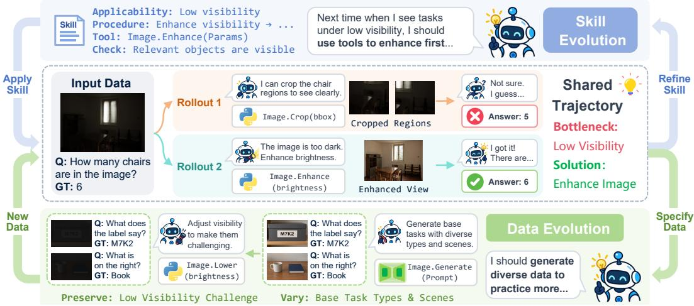
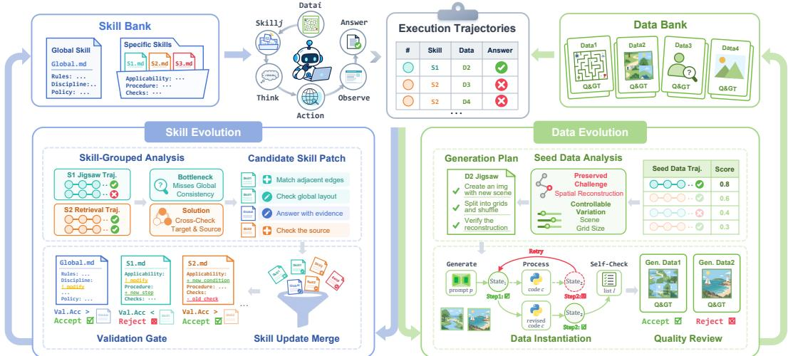
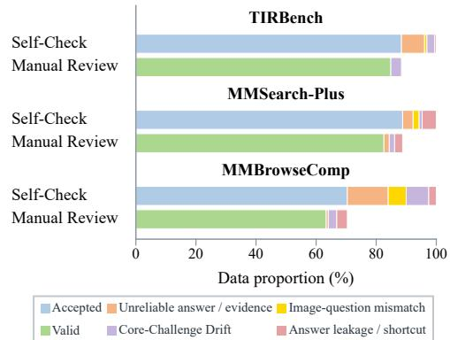
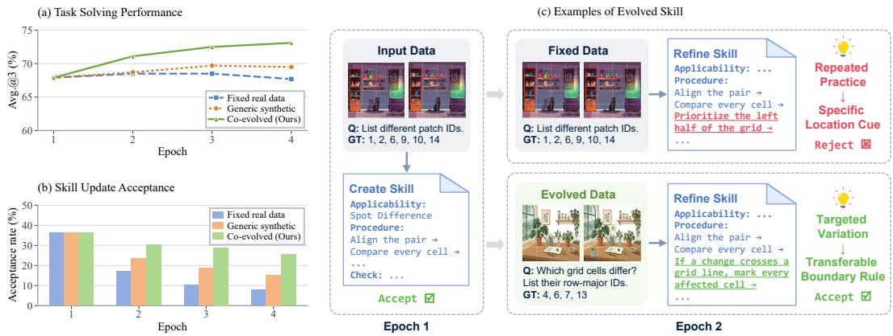
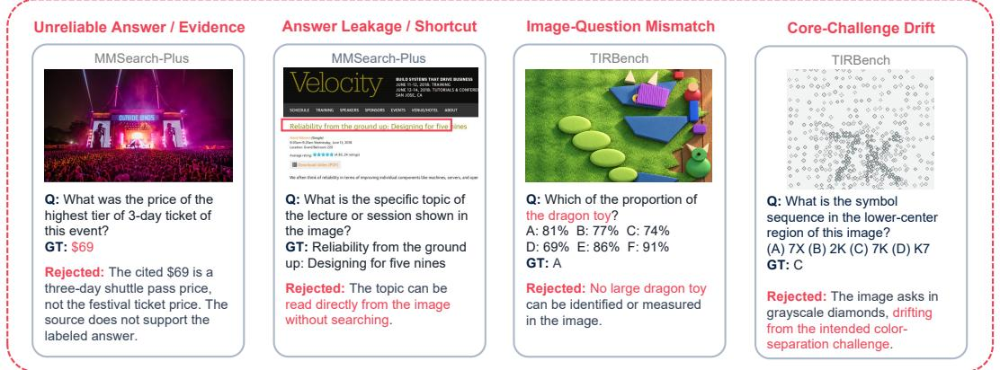
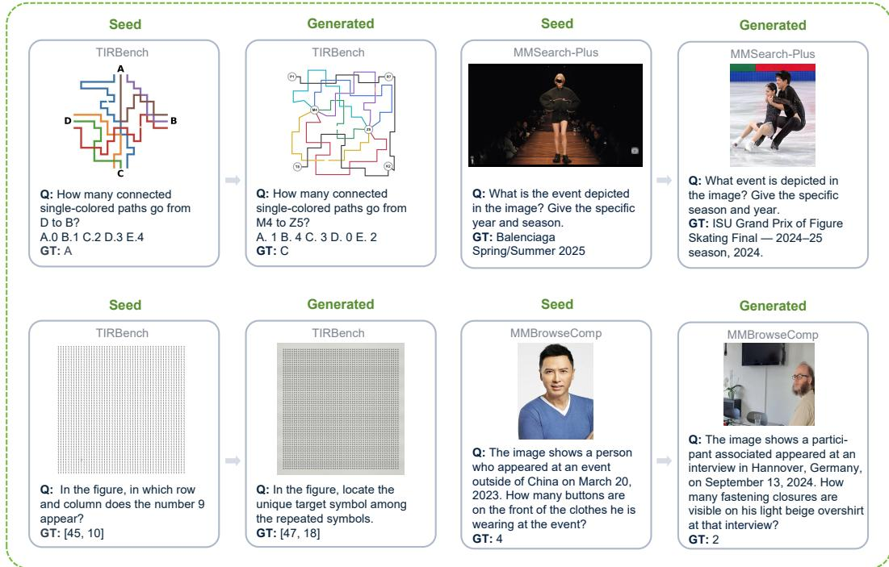
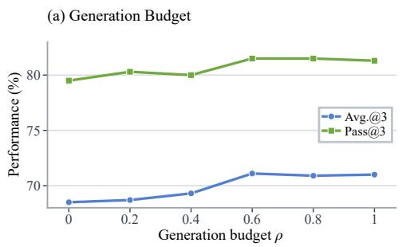
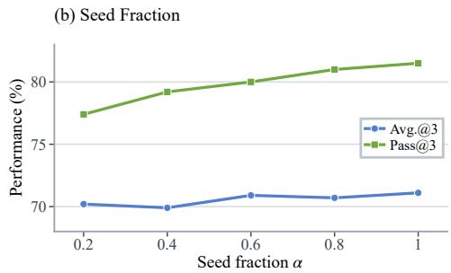

# V-GYM: ENHANCING AGENTIC VISUAL REASONING VIA SKILL-DATA CO-EVOLUTION

Bei Yan1,2, Yuecong Min1,2, Jie Zhang1,2, Junqi Yang1,2, Shiguang Shan1,2, and Xilin Chen1,2

1 State Key Laboratory of AI Safety, Institute of Computing Technology,

Chinese Academy of Sciences, Beijing, China

2 University of Chinese Academy of Sciences, Beijing, China

## ABSTRACT

Advances in multimodal understanding, reasoning, and tool use enable agents to tackle increasingly complex visual reasoning tasks. By distilling past execution experience into reusable skills, agents can transfer lessons from both successes and failures into future reasoning, reducing repeated errors and improving capabilities. However, limited experience may produce unreliable, poorly generalizable skills, while static datasets may lack the targeted and diverse practice needed for refinement. To address this gap, we introduce V-Gym, an autonomous framework that iteratively co-evolves procedural skills and multimodal practice data from execution trajectories. During skill evolution, V-Gym analyzes trajectories to distill and refine hierarchical skills, updating procedural guidance and applicability conditions while retaining an update only if it improves validation performance. During data evolution, V-Gym selects generation seeds by balancing data utility and exploration, then translates trajectory-identified bottlenecks into diverse, targeted practice data that expand the data bank after quality checks. The resulting practice outcomes feed back into subsequent skill updates, closing the loop for continual skill refinement. Experiments across diverse multimodal reasoning benchmarks show substantial improvements over baselines with multiple backbone models. Its evolved skills generalize across domains and models, while evolved data support more effective skill refinement, enabling autonomous diagnosis, targeted practice, and continual self-improvement.

## 1 INTRODUCTION

Advances in multimodal understanding, reasoning, and tool use increasingly enable agents to solve complex tasks by coordinating visual observations, evidence integration, and multistep actions (Surís et al., 2023; Hu et al., 2024). Beyond solving individual tasks, these agents also need to learn from experience to reduce recurring errors and adapt to unfamiliar conditions. A central challenge for such self-improvement is how to transform execution experience into reusable knowledge that benefits subsequent tasks. Prior work has explored distilling execution trajectories into skills, i.e., procedural knowledge that specifies action sequences, applicability conditions, and verification rules (Wang et al., 2024; 2025; Jiang et al., 2026). By retrieving and applying these skills, agents can leverage accumulated experience to guide future decisions.

Execution-derived skills are hypotheses about how to solve a task, rather than verified rules (Yang et al., 2026). A successful rollout shows that a procedure worked in one context without revealing which visual cues or tool states were essential, while a failed rollout may conflate a flawed procedure with missing evidence or incidental execution noise. Reliable skill evolution therefore requires targeted, varied practice to consolidate procedures, test applicability, and revise them using new evidence. The supporting practice data1 should, in turn, adapt to evolving skill-refinement needs, which fixed datasets may not adequately address (Huang et al., 2026b). This challenge is particularly pronounced in multimodal tasks, where meaningful variation must preserve consistency among visual content, questions, and answers while retaining the evidence needed to exercise the intended reasoning and tool-use operations (Luo et al., 2025; Zeng et al., 2026b). Multimodal generation can construct such practice data autonomously and at scale (Alam et al., 2026; Huang et al., 2026b), but generation alone does not identify which task bottlenecks future practice should target or which factors can be varied without weakening the intended challenge. This motivates a coupled self-improvement process in which execution evidence jointly determines how skills are refined and which practice data are selected or generated next.

  
Figure 1: Shared trajectories for skill-data co-evolution. They guide skill refinement (top) and targeted data generation (bottom), updating both banks for later practice.

Our key insight is that execution trajectories provide a shared foundation for both skill and data evolution. As illustrated in Figure 1, execution trajectories reveal reusable procedures and failure patterns that guide skill refinement, while identifying the core task challenges that new practice data should preserve and the aspects that can be varied to introduce diversity. Updated skills and generated data support future practice. We propose V-Gym, an autonomous practice framework for improving agentic visual reasoning through skill-data co-evolution.

V-Gym retrieves relevant skills and performs tool-assisted reasoning on practice data, collecting execution trajectories and evaluation feedback. During skill evolution, it groups related trajectories and analyzes each group to propose skill patches that revise procedural guidance and applicability conditions. Patches targeting the same skill object are consolidated into a single candidate skill update, which is accepted only if it improves task-solving performance on a validation set. During data evolution, it attributes skill-update gains to contributing data instances and balances this utility with exploration to select generation seeds. Analysis of the selected seeds’ trajectories identifies the core task challenges to preserve and the aspects that can be varied, guiding tool-assisted, targeted practice data generation. Generated instances that pass model self-checks expand the data bank for subsequent practice, providing further opportunities for skill refinement.

We evaluate V-Gym with advanced large vision-language model (LVLM) backbones on diverse benchmarks for complex multimodal reasoning. Extensive experiments show that V-Gym consistently outperforms baselines across the evaluated backbones and multimodal scenarios. The evolved skills also generalize to unseen domains and transfer effectively to less capable backbone models, highlighting the transferability of procedural knowledge acquired through autonomous practice. Moreover, continued practice with evolving data leads to more effective skill refinement than practice with a fixed dataset. These results support the potential of jointly evolving reusable skills and targeted practice data for recursive self-improvement in agents.

## Our main contributions are as follows:

• We identify execution trajectories as a shared foundation for both skill and data evolution, which reveal reusable procedures for skill refinement, together with core challenges and permissible variations for targeted data generation.

• We propose V-Gym, an autonomous practice framework for agentic visual reasoning. Skill-update gains guide data selection and generation, and practice outcomes guide skill refinement.

• Experiments show consistent gains across models and benchmarks, transfer of evolved skills across domains and models, and better skill refinement with evolved data.

## 2 RELATED WORK

Distilling Skills from Experience. Self-evolving agents transform execution experience into reusable knowledge (Gao et al., 2026), including reflections, insights, workflows, and playbooks (Shinn et al., 2023; Zhao et al., 2024; Wang et al., 2025; Zhang et al., 2026b). Reasoning and procedural memories further abstract past experience and support continual reuse and refinement (Ouyang et al., 2026; Fang et al., 2026; Cao et al., 2026). Experience also supports utility-aware memory retrieval and reflective prompt optimization (Zhang et al., 2026c; Agrawal et al., 2026). Explicit skill libraries capture executable procedures (Wang et al., 2024; Zheng et al., 2025), while trajectory analysis supports transferable skill extraction and revision (Ni et al., 2026). Candidate skill updates can be checked through student reruns or held-out validation (Shi et al., 2026; Yang et al., 2026). For multimodal agents, experience is organized into task-level skills, clustered knowledge, or visual procedural memories (Jiang et al., 2026; Xiong et al., 2026; Liu et al., 2026b).

Constructing Data from Experience. Agentic synthesis constructs planning and tool-use data through task generation, simulated interaction, and verification (Zeng et al., 2026b; Hu et al., 2025; Liu et al., 2025; Prabhakar et al., 2025), with multimodal extensions that diversify image-text instructions (Luo et al., 2025). Beyond these synthesis pipelines, execution experience informs both task construction and training supervision: environment exploration yields executable tasks (Zhai et al., 2025), while multimodal tool exploration produces step-wise preference data (Li et al., 2025). Adaptive generation uses policy rollouts, success estimates, and failure diagnoses to address evolving learning needs (Huang et al., 2026b; Wu et al., 2026; Wei et al., 2026a). HardGen and VISA extend this feedback to difficult tool-use samples and multimodal instruction synthesis, respectively, using failure-informed API graphs and persistent feedback from verifiers and target models (Hao et al., 2026; Zeng et al., 2026a).

Co-evolution for Agent Self-Improvement. Co-evolution couples updates to multiple learning components. Self-play links task proposal with solver learning (Zhao et al., 2025; Huang et al., 2026a; Xia et al., 2026b), including visual question generation and active image selection (He et al., 2026b;a). Other methods couple policies with rewards and environments (Wang et al., 2026) or tool-grounded verification (Liu et al., 2026a). Skills can evolve alongside policy learning (Xia et al., 2026a) or be internalized through reinforcement learning (Lu et al., 2026). Co-evolution also encompasses skills and tools (Wei et al., 2026b), skill generation and verification (Zhang et al., 2026a), and solver and rubric-generator skills (Chen et al., 2026). Skill Self-Play and SESA connect evolving skills or procedural memory with task generation and solver training (Huang et al., 2026c; Fu et al., 2026). V-Gym studies skill–data co-evolution with a fixed multimodal solver: shared execution trajectories inform both validated skill revisions and targeted practice construction, while attributed skill-update gains guide data selection.

## 3 METHOD

As illustrated in Figure 2, V-Gym improves a multimodal agent by co-evolving its skills and practice data. We first introduce the problem setting in Section 3.1, then describe skill evolution and data evolution in Sections 3.2 and 3.3, respectively.

## 3.1 PROBLEM SETTING

We use a fixed-parameter multimodal tool-using agent $\pi _ { \theta }$ with skill bank S and data bank $D .$ . Skill evolution maximizes the task-solving improvement brought by skill updates, while data evolution maximizes the value of practice data in supporting further skill improvement. Let $R ( S ^ { \prime } ; S )$ denote the skill-update reward and $U ( D ^ { \prime } ; S )$ denote the expected usefulness of a data bank D with skill bank S, informed by the same evidence. Given the current skill bank $S _ { k }$ and data bank $D$ , we consider candidate expansions $D ^ { \prime } \supseteq D$ within a fixed generation budget and express these coupled goals as:

  
Figure 2: Overview of V-Gym. The agent uses the global skill and at most one routed task-specific skill in tool-assisted practice, recording trajectories and feedback. Skill evolution groups trajectories, consolidates patches by object, and accepts updates with positive independent validation gains. Data evolution ranks seeds by utility and exploration, then admits targeted generated data that pass selfchecks. The updated banks support later practice.

$$
S ^ { + } = \underset { S ^ { \prime } } { \mathrm { a r g } \mathrm { m a x } } ~ \mathbb { E } _ { D ^ { + } } \big [ R ( S ^ { \prime } ; S ) \big ] , \quad \mathrm { w h e r e ~ } D ^ { + } = \underset { D ^ { \prime } \geq D } { \mathrm { a r g } \mathrm { m a x } } \quad \mathbb { E } _ { D } \big [ U ( D ^ { \prime } ; S ) \big ] ,\tag{1}
$$

where $S ^ { + }$ and $D ^ { + }$ are evolved skill and data banks. Both evolution processes use practice trajectories collected under the current S and D. Specifically, each instance $\mathbf { \bar { \boldsymbol { d } } } = ( I , q , y )$ contains images I, a question $q ,$ and reference information y. At each iteration, we select $d \in D$ and task-dependent skill $s \in S$ . The agent produces a tool-assisted reasoning trajectory $t \sim \pi _ { \boldsymbol { \theta } } ( \cdot \vert I , q , s )$ and receives answer-evaluation feedback. We estimate skill-update rewards from trajectories through comparative validation in Section 3.2 and attribute these rewards to practice instances to guide data evolution in Section 3.3. Algorithm 1 summarizes the full co-evolution process.

## 3.2 SKILL EVOLUTION

Skill evolution grounds revisions in execution evidence and retains them through comparative validation. The skill bank combines a global skill $S _ { g }$ with task-specific skills $\bar { \{ S ^ { ( k ) } \} } _ { k = 1 } ^ { K ^ { - } } .$ The applicability metadata of task-specific skills automatically form a router document. When solving a task, the agent consults this document and selects at most one applicable specific skill. Writing its choice as $k _ { d } \in \{ 0 , \ldots , K \}$ , the selected context is $s = S _ { g } \oplus S ^ { ( k _ { d } ) }$ , where ⊕ concatenates documents and $S ^ { ( 0 ) } = \emptyset$ denotes no match.

Trajectory-Grounded Skill Refinement. Starting from an empty skill bank and initial data bank D, we run E epochs and update D in place. At epoch e, a fixed practice set $\mathcal { T } _ { e } \subseteq D$ of M instances is partitioned into batches. For batch $B _ { e , b }$ , PRACTICE runs N rollouts per instance under the batch-start bank $S _ { e , b } ,$ retaining the resulting $N | B _ { e , b } |$ trajectories and evaluation feedback for skill refinement and data generation. REFINE uses these recorded trajectories, grouping them by routed specific skill or, when unmatched, the semantic similarity of their source instances. Within each group, reflection compares successful and failed trajectories to identify reusable workflows, missing visual evidence, reasoning errors, and inappropriate applicability conditions. It proposes skill patches that either edit existing global or specific skills or create new skills with complete procedures and metadata.

Skill patches from all groups targeting the same object o are deduplicated and merged into one candidate update $\delta _ { o } .$ For example, patches to a specific skill’s procedure and applicability conditions are merged into a single update to that skill. Each update retains the source instance set $\mathcal { T } _ { o }$ of distinct contributors to these groups for utility attribution.

Comparative Validation. Let $r ( d ; S )$ denote the mean score on instance d across rollouts under bank S. VALIDATE instantiates the skill reward R as the validation improvement of a candidate skill update. Its contributing instances are used to retrieve a nonempty, deduplicated panel $\gamma _ { o }$ from a separate validation data pool V. Each candidate skill update is applied independently to the same batch-start bank $S _ { e , b }$ to obtain $\widetilde { S } _ { e , b } ^ { o }$ . We compare the agent equipped with $\widetilde { S } _ { e , b } ^ { o }$ and the agent equipped with $S _ { e , b }$ on the candidate’s validation panel using fresh rollouts under matched settings, obtaining the skill-update reward as follows:

$$
R _ { o } = \frac { 1 } { | \mathcal { V } _ { o } | } \sum _ { d \in \mathcal { V } _ { o } } \left[ r ( d ; \widetilde { S } _ { e , b } ^ { o } ) - r ( d ; S _ { e , b } ) \right] .\tag{2}
$$

MERGE accepts all candidate object-level skill updates with $R _ { o } ~ > ~ 0$ and merges them into $S _ { e , b }$ to form $S _ { e , b + 1 }$ , with the router refreshed accordingly. Each accepted update retains its reward and contributing instances for data-utility attribution.

Algorithm 1 V-Gym   
Require: Agent $\pi _ { \boldsymbol { \theta } } ,$ Data Bank D, Validation Pool V,   
epochs E, practice size M, rollouts N, budget ρ,   
exploration β, discount γ   
$S \gets \emptyset$   
$( A _ { d } , n _ { d } )  ( 0 , 0 )$ for all $d \in D$   
for $e = \mathrm { 1 } , \ldots , E$ do   
$\mathcal { T } _ { e . } \gets \mathrm { S E L E C T } ( D , M ; \sigma _ { d } )$   
${ \mathcal { U } } _ { e } ^ { + } \gets { \emptyset }$   
for each batch $B _ { e , b }$ of $\mathcal { T } _ { e }$ do   
$S _ { e , b } \gets S$   
P $\mathrm { \mathrm { R A C T I C E } } \left( \pi _ { \theta } , S _ { e , b } , B _ { e , b } , N \right)$   
$\{ ( \delta _ { o } , \mathcal { T } _ { o } ) \}  \mathrm { R E F I N E } ( \dot { S } _ { e , b } , \dot { B } _ { e , b } )$   
$\{ R _ { o } \} \gets \mathrm { V A L I D A T E } ( \dot { S _ { e , b } } , \{ ( \delta _ { o } , \dot { \mathcal { T } } _ { o } ) \} , \mathcal { V } )$   
$\begin{array} { r } { \dot { S } \longleftarrow \mathbf { M E R G E } ( S _ { e , b } , \{ \delta _ { o } : \dot { R _ { o } } > 0 \} ) } \end{array}$   
$\mathcal { U } _ { e } ^ { + }  \mathcal { U } _ { e } ^ { + } \cup \{ ( e , b , o ) : R _ { o } > 0 \}$   
for each $d \in \mathcal { T } _ { e }$ with complete feedback do   
Compute $U _ { d }$ by Eq. (3)   
$( \grave { A _ { d } } , \grave { n _ { d } } ) \gets ( \grave { A _ { d } } \grave { + } \grave { U _ { d } } , n _ { d } + 1 )$   
if $\dot { e } < E$ then   
Rank eligible d $l \in \mathcal { T } _ { e }$ by $\sigma _ { d } \left( 4 \right)$   
$D \gets \mathbf { G e n E R A T E C H E C K E D } ( D , \mathcal { T } _ { e } ; \lfloor \rho M \rfloor )$   
$( A _ { d } , n _ { d } )  ( 0 , 0 )$ for newly admitted d   
$( A _ { d } , n _ { d } )  ( \gamma A _ { d } , \gamma n _ { d } )$ for all $d \in D$   
return S, frozen for inference

## 3.3 DATA EVOLUTION

After all batches of an epoch, data evolution attributes skill-update rewards to the practiced instances, updating utility statistics for the current data bank D. We balance utility and exploration through UCB-style seed selection, then use the selected seeds’ execution trajectories to specify new practice data that expand and evolve the data bank.

Utility–Exploration Selection. Each accepted update event $u = ( e , b , o ) \in \mathcal { U } _ { e } ^ { + }$ retains the reward $R _ { u }$ from Eq. (2) and its contributing instance set $\mathcal { T } _ { u }$ . We instantiate an instance’s utility by attributing an equal share of each accepted reward to its contributors:

$$
U _ { d } = \sum _ { u \in \mathcal { U } _ { e } ^ { + } : d \in \mathcal { T } _ { u } } \frac { R _ { u } } { | \mathcal { T } _ { u } | } ,\tag{3}
$$

where $\mathcal { U } _ { e _ { \mathrm { c } } } ^ { + }$ contains the accepted update events in epoch e. Attribution aggregates contributions across each instance’s rollouts and skill updates. Only instances with complete trajectories, reflection, and all relevant validation outcomes receive one utility observation and qualify as seeds. A complete instance supporting no accepted update has $U _ { d } = 0 $ , while incomplete feedback yields no observation.

Inspired by upper confidence bound (UCB) methods, we define a selection score $\sigma _ { d }$ from accumulated utility $A _ { d }$ and effective practice count $n _ { d } \colon$

$$
\sigma _ { d } = \left\{ \begin{array} { l l } { + \infty , } & { n _ { d } = 0 , } \\ { \displaystyle { \frac { A _ { d } } { n _ { d } } + \beta \sqrt { \frac { 2 \log \left( 1 + \sum _ { \bar { d } \in D } n _ { \bar { d } } \right) } { n _ { d } } } } , } & { \mathrm { o t h e r w i s e } , } \end{array} \right.\tag{4}
$$

for d $\in { \cal D }$ , where $\beta \geq 0$ controls exploration. We initialize $A _ { d } = n _ { d } = 0$ on admission and, once after complete practice in an epoch, add $U _ { d }$ to $A _ { d }$ and one to $n _ { d }$ . Mean utility favors instances supporting useful skill updates, while exploration revisits less-practiced instances.

For $e < E$ , the generation budget $\rho \in [ 0 , 1 ]$ targets at most $\lfloor \rho M \rfloor$ admissions from this epoch’s eligible practice seeds in descending $\sigma _ { d }$ order.

Table 1: Task-solving performance across three backbones and three benchmarks (%).
<table><tr><td rowspan="2">Method</td><td colspan="2">TIRBench</td><td colspan="2">MMSearch-Plus</td><td colspan="2">MMBrowseComp</td><td colspan="2">Average</td></tr><tr><td>Avg.@3 Pass@3</td><td></td><td></td><td>Avg.@3 Pass@3</td><td>Avg.@3</td><td>Pass@3</td><td></td><td>Avg.@3 Pass@3</td></tr><tr><td colspan="9">GPT-5.5</td></tr><tr><td>Baseline</td><td>40.9</td><td>57.7</td><td>20.3</td><td>36.0</td><td>15.6</td><td>22.7</td><td>25.6</td><td>38.8</td></tr><tr><td>Vanilla Tools</td><td>63.1</td><td>73.8</td><td>34.0</td><td>49.0</td><td>33.3</td><td>46.0</td><td>43.5</td><td>56.3</td></tr><tr><td>XSkill (Jiang et al., 2026)</td><td>64.7</td><td>77.4</td><td>34.3</td><td>54.0</td><td>36.2</td><td>54.7</td><td>45.1</td><td>62.0</td></tr><tr><td>Ace-Skill (Xiong et al., 2026)</td><td>64.7</td><td>78.7</td><td>36.0</td><td>50.0</td><td>36.7</td><td>56.0</td><td>45.8</td><td>61.6</td></tr><tr><td>SkillOPT (Yang et al., 2026)</td><td>66.2</td><td>78.2</td><td>36.3</td><td>51.0</td><td>35.3</td><td>55.3</td><td>45.9</td><td>61.5</td></tr><tr><td>V-Gym (Ours)</td><td>71.1</td><td>81.5</td><td>40.0</td><td>57.0</td><td>38.7</td><td>57.3</td><td>49.9</td><td>65.3</td></tr><tr><td colspan="9">Gemini-3.5-Flash</td></tr><tr><td>Baseline</td><td>43.6</td><td>60.3</td><td>30.3</td><td>39.0</td><td>12.9</td><td>22.0</td><td>28.9</td><td>40.4</td></tr><tr><td>Vanilla Tools</td><td>47.7</td><td>68.2</td><td>46.3</td><td>61.0</td><td>18.9</td><td>30.7</td><td>37.6</td><td>53.3</td></tr><tr><td>V-Gym (Ours)</td><td>55.7</td><td>72.1</td><td>56.0</td><td>70.0</td><td>26.7</td><td>37.3</td><td>46.1</td><td>59.8</td></tr><tr><td colspan="9">Qwen-3.7-Flash</td></tr><tr><td>Baseline</td><td>27.9</td><td>37.4</td><td>14.3</td><td>20.0</td><td>7.8</td><td>16.7</td><td>16.7</td><td>24.7</td></tr><tr><td>Vanilla Tools</td><td>58.6</td><td>73.1</td><td>32.7</td><td>49.0</td><td>13.6</td><td>26.7</td><td>35.0</td><td>49.6</td></tr><tr><td>V-Gym (Ours)</td><td>69.9</td><td>78.5</td><td>39.0</td><td>57.0</td><td>17.6</td><td>34.0</td><td>42.2</td><td>56.5</td></tr></table>

Targeted Data Generation. The selection score $\sigma _ { d }$ determines which practice instances are used as seeds to generate new instances, while their trajectories specify what these new instances should preserve and vary. For each seed $d ,$ trajectory analysis identifies the task’s key challenges and data-format requirements, together with aspects that can be varied. The generation plan preserves these requirements and comparable difficulty while introducing diversity. For example, Figure 1 varies base tasks and scenes while retaining the low-visibility challenge.

The generator executes this plan with the enabled construction, search, and image-processing tools, derives the answer from the resulting artifact, and records supporting evidence. Model self-checks assess four requirements: reliable answers and evidence, image-question consistency, preservation of core task challenges, and absence of answer leakage or shortcuts. Candidates that still fail these checks after bounded repair are rejected. In Algorithm 1, GENERATECHECKED traverses the ranked eligible seeds using their recorded trajectories, stopping at the admission budget or when seeds are exhausted. Each successful seed contributes one accepted instance directly to the shared data bank D. Per-seed attempt limits and admission checks are detailed in Appendix A.3.

New instances start with $A _ { d } = n _ { d } = 0$ . We discount all statistics by $( A _ { d } , n _ { d } )  ( \gamma A _ { d } , \gamma n _ { d } )$ , where $\gamma \in ( 0 , 1 ]$ . For the next epoch, SELECT takes the top M real and generated instances from the shared data bank by the same selection score $\sigma _ { d } .$

## 4 EXPERIMENTS

This section examines overall task-solving performance, transfer across domains and backbone models, the contribution of each component, and the quality and usefulness of evolved practice data. We first describe the experimental setup, then report main results, transfer results, ablations, and further analyses.

## 4.1 EXPERIMENTAL SETUP

Our main evaluation uses TIRBench (Li et al., 2026a), MMSearch-Plus (Tao et al., 2026), and MMBrowseComp (Li et al., 2026b), with GPT-5.5 (OpenAI, 2026b), Gemini-3.5-Flash (Kavukcuoglu et al., 2026), and Qwen-3.7-Flash (Alibaba Cloud, 2026b) as backbones. We compare V-Gym with direct chain-of-thought (CoT) reasoning (Baseline), tool-assisted solving (Vanilla Tools), and existing multimodal skill-evolution methods, including XSkill (Jiang et al., 2026), Ace-Skill (Xiong et al., 2026), and SkillOPT (Yang et al., 2026) using GPT-5.5. All skill-evolution methods share the same training rollout budget. We follow each method’s original settings except for the training and validation controls specified in Appendix B.3. V-Gym uses 2 practice epochs by default, a batch size

Table 2: Out-of-distribution transfer evaluation results (%). Skills acquired from the source domain or model are directly applied to the target domain or model for evaluation.  
(a) Cross-Domain Transfer  
(b) Cross-Model Transfer
<table><tr><td rowspan="2">Method</td><td colspan="2">Target Benchmark</td><td rowspan="2">Method</td><td colspan="2">TIRBench</td><td colspan="2">MMSearch-Plus</td></tr><tr><td>Avg.@3</td><td>Pass@3</td><td>Avg.@3</td><td>Pass@3</td><td>Avg.@3</td><td>Pass@3</td></tr><tr><td colspan="3">TIRBench → VisualToolBench</td><td colspan="6">GPT-5.5 → GPT-5.4-mini</td></tr><tr><td>Vanilla Tools</td><td>39.6</td><td>58.7</td><td>Vanilla Tools</td><td>36.7</td><td>58.5</td><td>15.7</td><td>29.0</td></tr><tr><td>V-Gym (Ours)</td><td>46.2 (↑6.6)</td><td>66.7 (↑8.0)</td><td>V-Gym (Ours)</td><td>43.4 (↑6.7)</td><td>70.0 (↑11.5)</td><td>21.3 (↑5.6)</td><td>38.0 (↑9.0)</td></tr><tr><td colspan="3">MMSearch-Plus → AgentVista</td><td colspan="6">GPT-5.5 → Qwen-3.5-Flash</td></tr><tr><td>Vanilla Tools</td><td>31.3</td><td>41.6</td><td>Vanilla Tools</td><td></td><td>62.1</td><td>23.7</td><td>38.0</td></tr><tr><td>V-Gym (Ours)</td><td>35.4 (↑4.1)</td><td>46.9 (↑5.3)</td><td>V-Gym (Ours)</td><td>42.1 46.2 (↑4.1)</td><td>64.4 (↑2.3)</td><td>25.3 (↑1.6)</td><td>40.0 (↑2.0)</td></tr></table>

of 5, and a generation budget for data evolution of $\rho = 0 . 6 .$ . At test time, we run three rollouts per data instance and report Avg.@3 and Pass@3 accuracy. Further experimental details are in Appendix B. To characterize test-time variability, we also report the mean per-benchmark standard deviation of single-run accuracy across three test runs in Appendix C.1.

## 4.2 MAIN RESULTS

We evaluate whether V-Gym’s autonomous practice produces skills that improve agentic visual reasoning beyond tool access and existing skill-evolution methods. As shown in Table 1, V-Gym achieves the highest Avg.@3 and Pass@3 among the compared methods with GPT-5.5 on all three benchmarks. Relative to the strongest competing result for each metric, Avg.@3 improves by 4.9, 3.7, and 2.0 points on TIRBench, MMSearch-Plus, and MMBrowseComp, respectively, with corresponding Pass@3 gains of 2.8, 3.0, and 1.3 points. These consistent gains show that the evolved skill bank improves performance across varied visual reasoning tasks, including multimodal tool use, search, and browsing.

The same consistent improvements over Vanilla Tools with Gemini-3.5-Flash and Qwen-3.7-Flash, across all three benchmarks and both metrics, further demonstrate V-Gym’s ability to enhance agentic visual reasoning across different models and datasets.

## 4.3 OUT-OF-DISTRIBUTION TRANSFER

Domain transfer. We test whether V-Gym’s evolved skill bank generalizes to unseen domains. In Table 2(a), skill banks evolved with GPT-5.5 on TIRBench and MMSearch-Plus are directly transferred to VisualToolBench (Guo et al., 2025) and AgentVista (Su et al., 2026), respectively, without any further skill updates. Compared with Vanilla Tools, transfer raises Avg.@3 from 39.6 to 46.2 on VisualToolBench and from 31.3 to 35.4 on AgentVista, with gains in Pass@3 on both targets as well. These improvements show that the skills acquired through V-Gym’s co-evolved practice remain effective beyond their source domains, supporting their generality across domains.

Model transfer. We further evaluate model transfer to test whether the evolved skill bank can improve less capable agents. Table 2(b) transfers skills acquired with GPT-5.5 without further updates to the same-family GPT-5.4-mini (OpenAI, 2026a) or the cross-family Qwen-3.5-Flash (Alibaba Cloud, 2026a). Both target models improve over Vanilla Tools on both benchmarks and both metrics, for example, GPT-5.4-mini gains 6.7 and 5.6 Avg.@3 points on TIRBench and MMSearch-Plus, respectively. These gains demonstrate that V-Gym acquires effective skills that transfer to less capable models within and across model families.

## 4.4 ABLATION STUDY

Contribution of each component. To assess the contribution of each component, we conduct ablations at epoch 2 on TIRBench. As shown in Table 3, adding skill evolution to tool use improves

Table 3: Ablation on core component (%).
<table><tr><td rowspan="2">Configuration</td><td colspan="2">TIRBench</td></tr><tr><td>Avg.@3</td><td>Pass@3</td></tr><tr><td>w/ Tools</td><td>63.1</td><td>73.8</td></tr><tr><td>w/ Skill Evo.</td><td>68.5</td><td>79.5</td></tr><tr><td>w/ Skill-Data Co-Evo.</td><td>71.1</td><td>81.5</td></tr><tr><td colspan="3">Skill Evolution Ablation</td></tr><tr><td>w/o Hierarchical Bank w/o Validation Gate</td><td>69.3 (↓1.8)</td><td>79.2 (↓2.3)</td></tr><tr><td></td><td>65.8 (↓5.3)</td><td>78.7 (↓2.8)</td></tr><tr><td colspan="3">Data Evolution Ablation</td></tr><tr><td>w/o UCB Sampling</td><td>69.1 (↓2.0)</td><td>79.7 (↓1.8)</td></tr><tr><td>w/o Targeted Spec.</td><td>68.9 (↓2.2)</td><td>80.0 (↓1.5)</td></tr></table>

  
Figure 3: Quality distribution of generated data based on self-checks and manual review.

Avg.@3/Pass@3 from 63.1/73.8 to 68.5/79.5, and co-evolving practice data further raises performance to 71.1/81.5. Without the hierarchical bank, all guidance is maintained in a single skill document without separate global and task-specific layers or a router document. Removing the validation gate retains validation scores for utility estimation but accepts updates without filtering by gain. Both changes reduce performance, with removal of the validation gate causing the largest Avg.@3 drop, highlighting the value of filtering skill updates by measured improvement.

Within data evolution, replacing UCB-style sampling with random selection for both generation seeds and the next epoch’s practice data also lowers performance. Without targeted specification, the generator receives only the seed image-text pair and generates directly, bypassing trajectory analysis while retaining UCB-style sampling and the remaining settings. This variant recovers little of the full method’s gain over skill evolution alone, supporting the value of trajectory-derived generation guidance. Removing any component lowers both metrics, and the full method performs best, supporting the contributions of the individual components and their combined design.

## 4.5 FURTHER ANALYSIS

Evolved-data quality. To assess whether evolved data provide valid practice inputs while preserving the core task challenges, we examine generation self-checks and manually review accepted samples. Figure 3 shows model acceptance rates of 70.4-88.8% across the three benchmarks, with unreliable answers or evidence and answer leakage or shortcuts as the most common rejection reasons. This distribution shows how self-checks screen candidate defects before admission. For an independent assessment, we randomly sample 100 model-accepted instances per benchmark and conduct three independent manual reviews of the same samples for validity, preservation of core task challenges, and comparable difficulty. The proportions satisfying these requirements are 96%, 93%, and 90% on TIRBench, MMSearch-Plus, and MMBrowseComp, respectively, with a mean pairwise agreement of 93.56% across reviews. These results support the reliability of V-Gym’s admitted practice data and their preservation of the core task challenges. Appendix B.4 details the review protocol and disagreement resolution.

Effectiveness of continued co-evolution. To test whether adapting practice data sustains skill evolution over time, we compare fixed-real data, generic synthetic data, and online co-evolution over four epochs with shared initial warm-up. The two generation strategies use the same budget. Generic synthesis uses randomly selected seeds corresponding to 60% of the practice budget, then mixes 60% synthetic and 40% real data for subsequent practice. Figure 4(a) shows that fixed-real practice plateaus and then declines, while generic synthesis improves modestly before leveling off. Co-evolution continues to improve throughout the observed epochs, finishing 3.6 and 5.4 Avg.@3 points above generic synthetic and fixed-real data, respectively. This trend demonstrates the sustained benefit of adapting practice data as the skill bank evolves.

Skill-update acceptance. To examine whether this performance trend is accompanied by continued useful skill revisions, Figure 4(b) tracks the fraction of consolidated candidate updates accepted per epoch. An update is counted as accepted only when it yields a positive validation gain over the corresponding batch-start skill bank. Acceptance declines for all strategies, but co-evolution maintains the highest rate after the shared warm-up, ending at 25.6% compared with 15.4% for generic synthesis and 8.2% for fixed-real practice. This late-stage gap indicates that co-evolution continues to produce a larger proportion of beneficial updates even as successful revisions become less frequent overall. Together, the two trends show that V-Gym sustains a larger share of successful skill revisions alongside continued task-solving gains.

  
Figure 4: Skill evolution with different practice data on TIRBench with GPT-5.5. We compare (a) task-solving performance, (b) skill-update acceptance across epochs, and (c) example skills evolved with fixed data and our co-evolved data. Epoch 1 is shared warm-up.

Case studies. To illustrate how practice data shape skill refinement, Figure 4(c) compares skills evolved with fixed and co-evolved data. Co-evolved practice yields a more general refinement that passes validation, while repeated fixed data produce an instance-specific revision that is rejected. Specifically, the fixed-data revision prioritizes the left half of the grid, whereas the co-evolved revision introduces a rule to mark every affected cell when a change crosses a grid boundary. This example illustrates how V-Gym’s evolving practice data can support reusable skill improvements during continued practice.

## 5 LIMITATIONS

V-Gym is an initial exploration of skill-data co-evolution for agentic visual reasoning. Its current data evolution process remains limited in its ability to construct reliable practice for highly complex real-world multimodal tasks and long videos. Nevertheless, transfer to AgentVista shows that skills acquired within the current framework can already support reasoning in a challenging target domain, while advances in generation tools may enable broader coverage of task types and longer temporal horizons. Further scaling is also constrained by the substantial computational costs of repeated agent rollouts, skill-update validation, and data generation, which limit the size of our training and validation sets. Larger and more diverse high-quality practice datasets, together with broader validation coverage, may further improve skill acquisition and update selection. Exploring these potential benefits at scale remains an important direction for future work.

## 6 CONCLUSION

We propose V-Gym, an autonomous practice framework for improving agentic visual reasoning through skill-data co-evolution with fixed model parameters. Execution trajectories provide shared evidence for refining reusable skills and specifying targeted, diverse practice, while validation feedback guides subsequent updates and data selection. Extensive evaluation results show improvements over the compared baselines across diverse visual reasoning benchmarks, as well as generalization to unseen domains and transfer to weaker models. These findings support the potential of coordinating what an agent learns from experience with what it practices next, making skill refinement and adaptive practice complementary components of agent self-improvement.

## AI USE STATEMENT

For manuscript preparation, we used generative AI tools only for language polishing and the retrieval and discovery of relevant literature. As part of V-Gym, we also used generative AI tools to construct synthetic multimodal practice data. Generated data undergo model self-checks for answer reliability, image-question consistency, preservation of core task challenges, and absence of answer leakage. We further assessed generated-data quality through independent human review of sampled instances, as described in Appendix B.4. We have reviewed and revised the AI-assisted text and checked the retrieved references for accuracy and relevance. We take responsibility for the final content of this work, including its text, citations, claims, and artifacts produced with the aid of generative AI.

## REPRODUCIBILITY STATEMENT

To support reproducibility, we describe V-Gym in Section 3 and provide its detailed algorithm, skill-update validation procedure, and data-evolution rules in Appendix A. Appendix B documents dataset partitions, sampling procedures, tool availability, model configurations, and hyperparameters. Appendix E provides prompt templates for the execution and evolution stages, while Appendix D presents examples of the learned skill bank. The evaluation protocol and test-time variability are described in Section 4 and Appendix C.1, respectively. Appendix B.4 details the sampling, assessment criteria, and disagreement-resolution procedure used for human review of generated data.

## REFERENCES

Lakshya A Agrawal, Shangyin Tan, Dilara Soylu, Noah Ziems, Rishi Khare, Krista Opsahl-Ong, Arnav Singhvi, Herumb Shandilya, Michael J Ryan, Meng Jiang, Christopher Potts, Koushik Sen, Alexandros G. Dimakis, Ion Stoica, Dan Klein, Matei Zaharia, and Omar Khattab. GEPA: Reflective Prompt Evolution Can Outperform Reinforcement Learning. In International Conference on Learning Representations, volume 2026, pp. 8479–8565, 2026.

Md Tanvirul Alam, Saksham Aggarwal, Justin Yang Chae, and Nidhi Rastogi. SPHINX: A synthetic environment for visual perception and reasoning. In 2026 IEEE/CVF Conference on Computer Vision and Pattern Recognition- FINDINGS Track (CVPRF), 2026.

Alibaba Cloud. Qwen3.5-Flash: Model information, 2026a.

Alibaba Cloud. Qwen3.7-Flash: Model information, 2026b.

Zouying Cao, Jiaji Deng, Li Yu, Weikang Zhou, Zhaoyang Liu, Bolin Ding, and Hai Zhao. Remember Me, Refine Me: A Dynamic Procedural Memory Framework for Experience-Driven Agent Evolution. In Maria Liakata, Viviane P. Moreira, Jiajun Zhang, and David Jurgens (eds.), Findings of the Associationfor Computational Linguistics: ACL 2026, pp. 16803–16822, San Diego, California, United States, July 2026. Association for Computational Linguistics. ISBN 979-8-89176-395-1. doi: 10.18653/v1/2026.findings-acl.829.

Jiangwang Chen, Zixin Song, Junlin Liu, Shuaiyu Zhou, Haiyan Wu, Haihan Shi, Chenxi Zhou, Hanqing Li, Xiao Yang, Da Zhu, Guanjun Jiang, Hai Wan, and Xibin Zhao. DecoEvo: Score-Decoupled Co-Evolution of Solver and Rubric-Generator Skills in Text Space. arXiv preprint arXiv:2607.25675, 2026.

Runnan Fang, Yuan Liang, Xiaobin Wang, Jialong Wu, Shuofei Qiao, Pengjun Xie, Fei Huang, Huajun Chen, and Ningyu Zhang. Memp: Exploring Agent Procedural Memory. In Maria Liakata, Viviane P. Moreira, Jiajun Zhang, and David Jurgens (eds.), Findings ofthe Association for Computational Linguistics: ACL 2026, pp. 17490–17502, San Diego, California, United States, July 2026. Association for Computational Linguistics. ISBN 979-8-89176-395-1. doi: 10.18653/v1/2026.findings-acl.866.

Zenghuang Fu, Zhaoyang Li, Qiuyuan Ai, Haoyu Wu, Minghui Wu, Chenxu Zhao, Ante Wang, Guannan He, and Changwei Wang. Self-play meets skill evolution: Self-evolving search agents that pose, solve, and remember. arXiv preprint arXiv:2607.29468, 2026.

Huan-ang Gao, Jiayi Geng, Wenyue Hua, Mengkang Hu, Xinzhe Juan, Hongzhang Liu, Shilong Liu, Jiahao Qiu, Xuan Qi, Qihan Ren, Yiran Wu, Hongru Wang, Han Xiao, Yuhang Zhou, Shaokun Zhang, Jiayi Zhang, Jinyu Xiang, Yixiong Fang, Qiwen Zhao, Dongrui Liu, Cheng Qian, Zhenhailong Wang, Minda Hu, Huazheng Wang, Qingyun Wu, Heng Ji, and Mengdi Wang. A Survey of Self-Evolving Agents: What, When, How, and Where to Evolve on the Path to Artificial Super Intelligence. Transactions on Machine Learning Research, 2026.

Xingang Guo, Utkarsh Tyagi, Advait Gosai, Paula Vergara, Jayeon Park, Ernesto Gabriel Hernández Montoya, Chen Bo Calvin Zhang, Bin Hu, Yunzhong He, Bing Liu, and Rakshith Sharma Srinivasa. Beyond seeing: Evaluating multimodal llms on tool-enabled image perception, transformation, and reasoning. arXiv preprint arXiv:2510.12712, 2025.

Bingguang Hao, Zengzhuang Xu, Yuntao Wen, Xinyi Xu, Yang Liu, Tong Zhao, Maolin Wang, Long Chen, Dong Wang, Yicheng Chen, Cunyin Peng, Xiangyu Zhao, Chenyi Zhuang, and Ji Zhang. From Failure to Mastery: Generating Hard Samples for Tool-use Agents. arXiv preprint arXiv:2601.01498, 2026.

Jinghan He, Junfeng Fang, Feng Xiong, Zijun Yao, Fei Shen, Haiyun Guo, Jinqiao Wang, and Tat-Seng Chua. Active Zero: Self-Evolving Vision-Language Models through Active Environment Exploration. arXiv preprint arXiv:2602.11241, 2026a.

Yicheng He, Chengsong Huang, Zongxia Li, Jiaxin Huang, and Yonghui Yang. VisPlay: Self-Evolving Vision-Language Models. In Proceedings of the IEEE/CVF Conference on Computer Vision and Pattern Recognition (CVPR), pp. 26274–26284, June 2026b.

Mengkang Hu, Pu Zhao, Can Xu, Qingfeng Sun, Jian-Guang Lou, Qingwei Lin, Ping Luo, and Saravan Rajmohan. AgentGen: Enhancing Planning Abilities for Large Language Model based Agent via Environment and Task Generation. In Proceedings ofthe 31st ACM SIGKDD Conference on Knowledge Discovery and Data Mining V.1, pp. 496–507. Association for Computing Machinery, July 2025.

Yushi Hu, Weijia Shi, Xingyu Fu, Dan Roth, Mari Ostendorf, Luke Zettlemoyer, Noah A. Smith, and Ranjay Krishna. Visual Sketchpad: Sketching as a Visual Chain of Thought for Multimodal Language Models. In Advances in Neural Information Processing Systems, volume 37, pp. 139348– 139379. Curran Associates, Inc., 2024.

Chengsong Huang, Wenhao Yu, Xiaoyang Wang, Hongming Zhang, Zongxia Li, Ruosen Li, Jiaxin Huang, Haitao Mi, and Dong Yu. R-Zero: Self-Evolving Reasoning LLM from Zero Data. In C. Vondrick, B. Hariharan, C. Raffel, L. Pinto, D. Yang, and A. Faust (eds.), International Conference on Learning Representations, volume 2026, pp. 130770–130790, 2026a.

Shijue Huang, Hangyu Guo, Guanting Dong, Chenxin Li, Junting Lu, Xinyu Geng, Zhaochen Su, Zhenyu Li, Shuang Chen, Hongru Wang, and Yi R. Fung. Towards on-policy data evolution for visual-native multimodal deep search agents. arXiv preprint arXiv:2605.10832, 2026b.

Siyuan Huang, Pengyu Cheng, Haotian Liu, Tao Chen, Yihao Liu, Jingwei Ni, Shijie Zhou, Ziyi Yang, Gangwei Jiang, Mengyu Zhou, Yu Cheng, Xiaoxi Jiang, and Guanjun Jiang. Skill self-play: Pushing the frontier of llm capability with co-evolving skills. arXiv preprint arXiv:2607.22529, 2026c.

Guanyu Jiang, Zhaochen Su, Xiaoye Qu, and Yi R. Fung. XSkill: Continual Learning from Experience and Skills in Multimodal Agents. In Proceedings of the 43rd International Conference on Machine Learning, 2026.

Koray Kavukcuoglu, Jeff Dean, Oriol Vinyals, and Noam Shazeer. Gemini 3.5: frontier intelligence with action, May 19, 2026.

Ming Li, Jike Zhong, Shitian Zhao, Haoquan Zhang, Shaoheng Lin, Yuxiang Lai, Chen Wei, Konstantinos Psounis, and Kaipeng Zhang. TIR-Bench: A Comprehensive Benchmark for Agentic Thinking-with-Images Reasoning. In Paolo Favaro, Zuzana Kukelova, Atsuto Maki, Anna Rohrbach, Konrad Schindler, and Federico Tombari (eds.), Computer Vision – ECCV 2026, volume 17016 of Lecture Notes in Computer Science, pp. 464–481, Cham, 2026a. Springer Nature Switzerland. ISBN 978-3-032-37383-0. doi: 10.1007/978-3-032-37383-0\_27.

Pengxiang Li, Zhi Gao, Bofei Zhang, Yapeng Mi, Xiaojian (Shawn) Ma, Chenrui Shi, Tao Yuan, Yuwei Wu, Yunde Jia, Song-Chun Zhu, and Qing Li. Iterative Tool Usage Exploration for Multimodal Agents via Step-wise Preference Tuning. In Advances in Neural Information Processing Systems, volume 38, pp. 59496–59528. Curran Associates, Inc., 2025. doi: 10.52202/085713-1991.

Shilong Li, Xingyuan Bu, Wenjie Wang, Jiaheng Liu, Jun Dong, Haoyang He, Hao Lu, Haozhe Zhang, Chenchen Jing, Zhen Li, Chuanhao Li, Jiayi Tian, Chenchen Zhang, Tianhao Peng, Yancheng He, Jihao Gu, Hui Huang, Donghao Zhou, Yuanxing Zhang, Jian Yang, Ge Zhang, Wenhao Huang, Zhaoxiang Zhang, Qiangpeng Yang, and Shilei Wen. MM-BrowseComp: A Comprehensive Benchmark for Multimodal Browsing Agents. arXiv preprint arXiv:2508.13186, 2026b.

Jiaqi Liu, Kaiwen Xiong, Peng Xia, Yiyang Zhou, Haonian Ji, Lu Feng, Siwei Han, Mingyu Ding, and Huaxiu Yao. Agent0-VL: Exploring Self-Evolving Agent for Tool-Integrated Vision-Language Reasoning. In Proceedings of the 43rd International Conference on Machine Learning, 2026a.

Weiwen Liu, Xu Huang, Xingshan Zeng, Xinlong Hao, Shuai Yu, Dexun Li, Shuai Wang, Weinan Gan, Zhengying Liu, Yuanqing Yu, Zezhong Wang, Yuxian Wang, Wu Ning, Yutai Hou, Bin Wang, Chuhan Wu, Xinzhi Wang, Yong Liu, Yasheng Wang, Duyu Tang, Dandan Tu, Lifeng Shang, Xin Jiang, Ruiming Tang, Defu Lian, Qun Liu, and Enhong Chen. ToolACE: Winning the Points of LLM Function Calling. In International Conference on Learning Representations, volume 2025, pp. 41359–41381, 2025.

Zhou Liu, Ligang Huang, Zeli Su, Zewei Pan, Zhaoyang Han, Xing Chen, Yuanfeng Song, and Wentao Zhang. SkillLens: Visual Skill Cards for Retrieval-Augmented GUI Action Prediction and On-Policy Distillation. arXiv preprint arXiv:2608.10775, 2026b.

Zhengxi Lu, Zhiyuan Yao, Jinyang Wu, Chengcheng Han, Qi Gu, Xunliang Cai, Weiming Lu, Jun Xiao, Yueting Zhuang, and Yongliang Shen. SKILL0: In-Context Agentic Reinforcement Learning for Skill Internalization. arXiv preprint arXiv:2604.02268, 2026.

Run Luo, Haonan Zhang, Longze Chen, Ting-En Lin, Xiong Liu, Yuchuan Wu, Min Yang, Yongbin Li, Minzheng Wang, Pengpeng Zeng, Lianli Gao, Heng Tao Shen, Yunshui Li, Hamid Alinejad-Rokny, Xiaobo Xia, Fei Huang, and Jingkuan Song. MMEvol: Empowering Multimodal Large Language Models with Evol-Instruct. In Findings of the Association for Computational Linguistics: ACL 2025, pp. 19655–19682, Vienna, Austria, July 2025. Association for Computational Linguistics.

Jingwei Ni, Yihao Liu, Xinpeng Liu, Yutao Sun, Mengyu Zhou, Pengyu Cheng, Dexin Wang, Erchao Zhao, Xiaoxi Jiang, and Guanjun Jiang. Trace2Skill: Distill Trajectory-Local Lessons into Transferable Agent Skills. arXiv preprint arXiv:2603.25158, 2026.

OpenAI. Introducing GPT-5.4 mini and nano, 2026a.

OpenAI. Introducing GPT-5.5, 2026b.

Siru Ouyang, Jun Yan, I-Hung Hsu, Yanfei Chen, Ke Jiang, Zifeng Wang, Rujun Han, Long T. Le, Samira Daruki, Xiangru Tang, Vishy Tirumalashetty, George Lee, Mahsan Rofouei, Hangfei Lin, Jiawei Han, Chen-Yu Lee, and Tomas Pfister. ReasoningBank: Scaling Agent Self-Evolving with Reasoning Memory. In C. Vondrick, B. Hariharan, C. Raffel, L. Pinto, D. Yang, and A. Faust (eds.), International Conference on Learning Representations, volume 2026, pp. 94327–94354, 2026.

Akshara Prabhakar, Zuxin Liu, Ming Zhu, Jianguo Zhang, Tulika Manoj Awalgaonkar, Shiyu Wang, Zhiwei Liu, Haolin Chen, Thai Hoang, Juan Carlos Niebles, Shelby Heinecke, Weiran Yao, Huan Wang, Silvio Savarese, and Caiming Xiong. APIGen-MT: Agentic Pipeline for Multi-Turn Data Generation via Simulated Agent-Human Interplay. In Advances in Neural Information Processing Systems, volume 38. Curran Associates, Inc., 2025.

Qiming Shi, Yibo Dou, Jiawen Zhu, Yulong Tao, Linbo Jin, Zhaolu Kang, Yunfan Zhou, and Di Weng. SKILL-KD: Contrastive Skill Distillation for LLM Agents. arXiv preprint arXiv:2607.28048, 2026.

Noah Shinn, Federico Cassano, Ashwin Gopinath, Karthik Narasimhan, and Shunyu Yao. Reflexion: language agents with verbal reinforcement learning. In Advances in Neural Information Processing Systems, volume 36, pp. 8634–8652. Curran Associates, Inc., 2023.

Zhaochen Su, Jincheng Gao, Hangyu Guo, Zhenhua Liu, Lueyang Zhang, Xinyu Geng, Shijue Huang, Peng Xia, Guanyu Jiang, Cheng Wang, Yue Zhang, Yi R. Fung, and Junxian He. Agentvista: Evaluating multimodal agents in ultra-challenging realistic visual scenarios. arXiv preprint arXiv:2602.23166, 2026.

Dídac Surís, Sachit Menon, and Carl Vondrick. Vipergpt: Visual inference via python execution for reasoning. In 2023 IEEE/CVF International Conference on Computer Vision (ICCV), pp. 11854–11864, 2023.

Xijia Tao, Yihua Teng, Xinxing Su, Xinyu Fu, Jihao Wu, Chaofan Tao, Ziru Liu, Haoli Bai, Rui Liu, and Lingpeng Kong. MMSearch-Plus: Benchmarking Provenance-Aware Search for Multimodal Browsing Agents. In International Conference on Learning Representations, volume 2026, pp. 70385–70422, 2026.

Guanzhi Wang, Yuqi Xie, Yunfan Jiang, Ajay Mandlekar, Chaowei Xiao, Yuke Zhu, Linxi Fan, and Anima Anandkumar. Voyager: An Open-Ended Embodied Agent with Large Language Models. Transactions on Machine Learning Research, 2024.

Yinjie Wang, Tianbao Xie, Ke Shen, Mengdi Wang, and Ling Yang. RLAnything: Forge Environment, Policy, and Reward Model in Completely Dynamic RL System. In Proceedings of the 43rd International Conference on Machine Learning, 2026.

Zora Zhiruo Wang, Jiayuan Mao, Daniel Fried, and Graham Neubig. Agent Workflow Memory. In Proceedings of the 42nd International Conference on Machine Learning, volume 267 of Proceedings of Machine Learning Research, pp. 63897–63911. PMLR, 13–19 Jul 2025.

Xincheng Wei, Yifan Ding, Yoshua Li, Dongsheng Ma, Rongxiang Weng, Xunliang Cai, Wenjian Ding, and Yao Zhang. Diagevo: Diagnosis-guided self-evolution via hierarchical error memory. arXiv preprint arXiv:2609.00768, 2026a.

Yangbo Wei, Zhen Huang, Shaoqiang Lu, Junhong Qian, Qifan Wang, Chen Wu, and Lei He. SkillSmith: Co-Evolving Skills and Tools for Self-Improving Agent Systems. arXiv preprint arXiv:2606.01314, 2026b.

Xiaojun Wu, Cehao Yang, Honghao Liu, Xueyuan Lin, Zhichao Shi, Hao Zhou, Xuhui Jiang, Chengjin Xu, Jia Li, and Jian Guo. Envs-forge: Frontier-optimized reward-grounded environment synthesis for agent rl. arXiv preprint arXiv:2608.14312, 2026.

Peng Xia, Jianwen Chen, Hanyang Wang, Jiaqi Liu, Kaide Zeng, Yu Wang, Siwei Han, Yiyang Zhou, Xujiang Zhao, Haifeng Chen, Zeyu Zheng, Cihang Xie, and Huaxiu Yao. SkillRL: Evolving Agents via Recursive Skill-Augmented Reinforcement Learning. In Advances in Neural Information Processing Systems, 2026a.

Peng Xia, Kaide Zeng, Jiaqi Liu, Can Qin, Fang Wu, Yiyang Zhou, Caiming Xiong, and Huaxiu Yao. Agent0: Unleashing Self-Evolving Agents from Zero Data via Tool-Integrated Reasoning. In Conference on Language Modeling (COLM), 2026b.

Feng Xiong, Zengbin Wang, Yong Wang, Xuecai Hu, Jinghan He, Liang Lin, Yuan Liu, and Xiangxiang Chu. Ace-skill: Bootstrapping multimodal agents with prioritized and clustered evolution. arXiv preprint arXiv:2605.08887, 2026.

Yifan Yang, Ziyang Gong, Weiquan Huang, Qihao Yang, Ziwei Zhou, Zisu Huang, Yan Li, Xuemei Gao, Qi Dai, Bei Liu, Kai Qiu, Yuqing Yang, Dongdong Chen, Xue Yang, and Chong Luo. Skillopt: Executive strategy for self-evolving agent skills. arXiv preprint arXiv:2605.23904, 2026.

Min Zeng, Guanxin Tan, Libin Cen, Yafei Wen, Rui Hu, Liuyang Bian, Xiaolong Chen, and Xiaoxin Chen. VISA: Agentic Self-Evolving Data Synthesis for Multimodal Instruction Following. arXiv preprint arXiv:2608.26013, 2026a.

Xingshan Zeng, Zishan Xu, Boju Zhang, Yuzhou Wu, Lingzhi Wang, Jianghao Lin, Liangyou Li, Yasheng Wang, Lifeng Shang, Xin Jiang, Weinan Zhang, Yong Yu, Qun Liu, and Weiwen Liu. What makes good agentic data? an ace lens on data generation for llm agents. arXiv preprint arXiv:2608.27260, 2026b.

Yunpeng Zhai, Shuchang Tao, Cheng Chen, Anni Zou, Ziqian Chen, Qingxu Fu, Shinji Mai, Li Yu, Jiaji Deng, Zouying Cao, Zhaoyang Liu, Bolin Ding, and Jingren Zhou. AgentEvolver: Towards Efficient Self-Evolving Agent System. arXiv preprint arXiv:2511.10395, 2025.

Hanrong Zhang, Shicheng Fan, Henry Peng Zou, Yankai Chen, Zhenting Wang, Jiayu Zhou, Chengze Li, Wei-Chieh Huang, Yifei Yao, Kening Zheng, Xue Liu, Xiaoxiao Li, and Philip S. Yu. Co-EvoSkills: Self-Evolving Agent Skills via Co-Evolutionary Verification. In Conference on Language Modeling (COLM), 2026a.

Qizheng Zhang, Changran Hu, Shubhangi Upasani, Boyuan Ma, Fenglu Hong, Vamsidhar Kamanuru, Jay Rainton, Chen Wu, Mengmeng Ji, Hanchen Li, Urmish Thakker, James Y Zou, and Kunle Olukotun. Agentic Context Engineering: Evolving Contexts for Self-Improving Language Models. In International Conference on Learning Representations, volume 2026, pp. 86069–86100, 2026b.

Shengtao Zhang, Jiaqian Wang, Ruiwen Zhou, Junwei Liao, Yuchen Feng, Zhuo Li, Yujie Zheng, Weinan Zhang, Ying Wen, Zhiyu Li, Feiyu Xiong, Yutao Qi, Bo Tang, and Muning Wen. Memrl: Self-evolving agents via runtime reinforcement learning on episodic memory. arXiv preprint arXiv:2601.03192, 2026c.

Andrew Zhao, Daniel Huang, Quentin Xu, Matthieu Lin, Yong-Jin Liu, and Gao Huang. ExpeL: LLM Agents Are Experiential Learners. Proceedings of the AAAI Conference on Artificial Intelligence, 38(17):19632–19642, March 2024.

Andrew Zhao, Yiran Wu, Yang Yue, Tong Wu, Quentin Xu, Matthieu Lin, Shenzhi Wang, Qingyun Wu, Zilong Zheng, and Gao Huang. Absolute Zero: Reinforced Self-play Reasoning with Zero Data. In D. Belgrave, C. Zhang, H. Lin, R. Pascanu, P. Koniusz, M. Ghassemi, and N. Chen (eds.), Advances in Neural Information Processing Systems, volume 38, Main Conference, pp. 105816–105879. Curran Associates, Inc., 2025. doi: 10.52202/085713-3534.

Boyuan Zheng, Michael Y. Fatemi, Xiaolong Jin, Zora Zhiruo Wang, Apurva Gandhi, Yueqi Song, Yu Gu, Jayanth Srinivasa, Gaowen Liu, Graham Neubig, and Yu Su. Skillweaver: Web agents can self-improve by discovering and honing skills. arXiv preprint arXiv:2504.07079, 2025.

## A METHOD DETAILS

## A.1 DETAILED CO-EVOLUTION ALGORITHM

Algorithm 2 expands the co-evolution process in Algorithm 1. Within each epoch, practice and skill refinement proceed batch by batch, while utility accounting follows after all batches, and data generation runs only when $e < { \dot { E } }$ . The resulting data bank supports selection for the next epoch.

Algorithm 2 Detailed V-Gym co-evolution   
Require: Agent $\pi _ { \theta } ,$ Data Bank D, Validation Pool V, epochs E, practice size M, rollouts N, generation budget   
ρ, exploration coefficient $\beta ,$ discount γ   
1: Initialize $S \gets \emptyset$ and $A _ { d } = n _ { d } = 0$ for $d \in D$   
2: for $e = 1 , \ldots , E$ do   
3: Select the M instances with the highest selection scores $\sigma _ { d }$ from D as $\mathcal { T } _ { e } ,$ , breaking ties randomly and   
shuffling the execution order   
4: Partition $\mathcal { T } _ { e }$ into batches $B _ { e , b }$ and initialize accepted update events ${ \mathcal { U } } _ { e } ^ { + }  \emptyset$   
5: Skill evolution   
6: for each batch $B _ { e , b }$ do   
7: Fix the batch-start bank $S _ { e , b } \gets S$ for practice and candidate validation   
8: Collect $N | B _ { e , b } |$ trajectories with evaluation feedback using $\pi _ { \theta }$ and $S _ { e , b }$   
9: Group trajectories by routed skill or, if unmatched, source-instance similarity, then reflect and propose   
skill patches   
10: Deduplicate and merge patches by object o into $\delta _ { o }$ and retain distinct contributors $\mathcal { T } _ { o }$   
11: for each candidate skill update $\delta _ { o }$ do   
12: Retrieve a nonempty, deduplicated panel $\smash { \mathcal { V } _ { o } \subseteq \mathcal { V } }$ using $\mathcal { T } _ { o }$   
13: Apply $\delta _ { o }$ independently to $S _ { e , b }$ to obtain $\widetilde { S } _ { e , b } ^ { o }$   
14: Compare $\widetilde { S } _ { e , b } ^ { o }$ and $S _ { e , b }$ on $\gamma _ { o }$ using fresh rollouts under matched settings and compute $R _ { o }$ by   
Eq. (2)   
15: end for   
16: Merge updates with $R _ { o } > 0$ into $S _ { e , b }$ to form $S _ { e , b + 1 }$ , then set $S \gets S _ { e , b + 1 }$ and refresh the router   
17: Record accepted events $\boldsymbol { u } = ( e , b , o )$ in $\mathcal { U } _ { e } ^ { + }$ with rewards $R _ { u }$ and contributors $\mathcal { T } _ { u }$   
18: end for   
19: Data evolution   
20: for each d $\prime \in \mathcal { T } _ { e }$ with complete practice feedback do   
21: Compute $U _ { d }$ by Eq. (3) and update $A _ { d }  A _ { d } + U _ { d }$ and $n _ { d } \gets n _ { d } + 1$ once   
22: end for   
23: if $e < E$ then   
24: Rank complete-feedback seeds d $\in \mathcal { T } _ { e }$ by $\sigma _ { d }$ in Eq. (4)   
25: for each ranked seed until $\lfloor \rho M \rfloor$ new instances are admitted or seeds are exhausted do   
26: Derive a generation plan from the seed’s execution trajectories   
27: Generate and self-check candidates, stopping at the first accepted instance or five failed attempts   
28: Add any accepted instance to D and initialize its $A _ { d } = n _ { d } = 0$   
29: end for   
30: Discount $( A _ { d } , n _ { d } )  ( \gamma A _ { d } , \gamma n _ { d } )$ for every $d \in D$   
31: end if   
32: end for   
33: return Final skill bank S, frozen for inference

## A.2 SKILL EVOLUTION DETAILS

Skill patches and update objects. Reflection over each trajectory group proposes patches that edit existing global or task-specific skills or create new skills with complete procedures and applicability metadata. A patch specifies its target skill, operation, text location, and revised content. Patches from all groups that target the same object o are deduplicated and merged into one candidate update $\delta _ { o }$ before validation. For example, edits to a specific skill’s procedure and applicability conditions form one update. Its contributor set $\mathcal { T } _ { o }$ contains the distinct source instances of the contributing groups, so multiple trajectories from an instance do not multiply its share of that update’s reward.

Comparative validation. The contributing instances query an embedding index over the separate validation data pool V. Cosine similarity identifies relevant instances, producing a nonempty, deduplicated panel $\bar { \mathcal { V } } _ { o }$ subject to the retrieval and size limits in Table 7. Each candidate skill update is applied independently to the same batch-start bank $S _ { e , b } ,$ , which remains fixed throughout these comparisons. Agents equipped with the candidate bank $\widetilde { S } _ { e , b } ^ { o }$ and the original bank solve the same panel using fresh rollouts under matched settings. The mean score difference in Eq. (2) gives $R _ { o } .$ After these comparisons, all updates with $R _ { o } > 0$ are merged into $S _ { e , b }$ to form $S _ { e , b + 1 }$ , and the router is refreshed from the task-specific skills’ applicability metadata. The validation data pool excludes practice and held-out test instances.

## A.3 DATA EVOLUTION DETAILS

Utility–exploration selection. Only instances in the current practice set $\mathcal { T } _ { e }$ with complete trajectories, reflection, and all relevant validation outcomes receive a utility observation and qualify as generation seeds. A complete instance that contributes to no accepted update receives $U _ { d } = 0$ , while incomplete feedback contributes no observation and does not increment $n _ { d }$

Each accepted update event $u = ( e , b , o ) \in \mathcal { U } _ { e } ^ { + }$ retains its reward $R _ { u }$ and distinct contributors $\mathcal { T } _ { u }$ The event identity distinguishes updates to the same object in different batches or epochs. After all batches, Eq. (3) sums an equal share $R _ { u } / | \mathcal { I } _ { u }$ | of each accepted reward over the events to which a complete instance contributed. Thus, contributions across rollouts and updates yield one utility observation $U _ { d }$ and one increment to $n _ { d }$ per complete practice in an epoch. This utility is a proxy for future skill improvement. Seed ranking uses the resulting statistics in Eq. (4), restricted to the eligible instances in $\mathcal { T } _ { e }$

Targeted generation and self-checks. The generation plan specifies the seed task’s key challenges, data-format requirements, comparable difficulty, and aspects that can vary. It supplies these requirements without exposing private seed images, raw trajectories, or exact seed answers. Using the enabled construction, search, and image-processing tools, the generator builds or acquires the required content, derives its answer, and records supporting evidence.

Model self-checks assess the same four requirements as in Section 3.3: reliable answers and evidence, image-question consistency, preservation of core task challenges, and absence of answer leakage or shortcuts. Candidates that fail undergo bounded repair and renewed self-checks. Changes to the answer require renewed evidence verification. Admission also checks duplicates, label conflicts, and overlap with validation data.

Generation budget and next-epoch practice. After each nonfinal epoch, generation targets at most ⌊ρM⌋ admitted instances, starting with the highest-ranked eligible seeds from $\mathcal { T } _ { e }$ . This is an admission budget, not a prescribed fraction of generated instances in the next practice set. For each seed, generation stops at the first accepted instance or after five failed attempts. The process moves to the next unused seed and stops when the target is reached or eligible seeds are exhausted. Each successful seed contributes one accepted instance directly to the shared data bank D.

New instances enter the shared data bank with $A _ { d } = n _ { d } = 0$ . After generation, all statistics are discounted by $( A _ { d } , n _ { d } )  ( \gamma A _ { d } , \gamma n _ { d } )$ . At the next epoch, SELECT recomputes $\sigma _ { d }$ over the entire expanded bank and takes the M highest-ranked instances. Real and generated instances use the same rule, with $\sigma _ { d } = + \infty$ whenever $n _ { d } = 0$ . Ties are broken randomly and execution order is shuffled. Admission therefore makes a new instance available for future practice without guaranteeing selection in the next epoch. The selected practice set remains fixed throughout that epoch.

## B EXPERIMENTAL SETTINGS

## B.1 TOOL DETAILS

Table 4 summarizes tool capabilities and their main inputs for task solving and data generation. Concrete callable names and argument schemas are supplied by the enabled tool interfaces. Table 6 specifies which tools are enabled for each dataset. Availability does not imply that every tool is called on every data instance.

Table 4: Tool capabilities and main inputs used in the experiments.
<table><tr><td>Tool</td><td>Description</td><td>Main inputs</td></tr><tr><td colspan="3">Shared by execution and generation</td></tr><tr><td>Web Search</td><td>Search the web via Serper API for titles, URLs, and text snippets.</td><td>query (str, required): query. max_results (int, optional): limit.</td></tr><tr><td>Image Search</td><td>Search related images via Serper image/Lens. ImgBB provides URLs for local reverse-image inputs.</td><td>search_type (str): text or reverse. query (str): text. image_url (str): reverse. max_results (int, optional).</td></tr><tr><td>Visit</td><td>Extract the main textual content of a webpage through the Jina Reader API.</td><td>url (str, required): page URL. goal (str): information to find.</td></tr><tr><td>Code Interpreter</td><td>Stateful Jupyter kernel for Python image processing (PIL/OpenCV), calculations, and data manipulation.</td><td>code (str, required): Python code.</td></tr><tr><td colspan="3">Generation only</td></tr><tr><td>Image Generation</td><td>Create an image from a text description with the GPT-Image-2 model.</td><td>prompt (str, required): image description.</td></tr><tr><td>Image Editing</td><td>Modify or extend an existing image with the GPT-Image-2 model.</td><td>image (image, required): source image. instruction (str, required): edit.</td></tr><tr><td>Webpage Capture</td><td>Render a public webpage in Playwright/Chromium and capture the page or a selected region.</td><td>url (str, required): page URL. region (optional): area to capture.</td></tr></table>

Table 5: Dataset domains, sizes, and partitions. All random sampling uses seed 42.
<table><tr><td>Dataset</td><td>Domain</td><td>Total</td><td>Train</td><td>Val.</td><td>Test</td><td>Sampling strategy</td></tr><tr><td colspan="7">Visual Agentic Tool Use</td></tr><tr><td>TIRBench</td><td>Tool-Integrated Reasoning</td><td>1,215</td><td>195</td><td>630</td><td>390</td><td>Balanced random sampling across 13 task types.</td></tr><tr><td>VisualToolBench</td><td>Hybrid Tool Reasoning</td><td>1,204</td><td>一</td><td></td><td>150</td><td>Balanced random sampling of two single-turn types.</td></tr><tr><td colspan="7">Multimodal Search</td></tr><tr><td>MMSearch-Plus</td><td>Multimodal Search</td><td>311</td><td>100</td><td>110</td><td>100</td><td>Random Sampling</td></tr><tr><td>MMBrowseComp</td><td>Multimodal Browsing</td><td>400</td><td>100</td><td>150</td><td>150</td><td>Random Sampling</td></tr><tr><td colspan="7">Comprehensive</td></tr><tr><td>AgentVista</td><td>Ultra-challenging Tasks</td><td>209</td><td></td><td></td><td>209</td><td>All samples for testing.</td></tr></table>

## B.2 DATASET DETAILS

TIRBench, MMSearch-Plus, and MMBrowseComp are the main evaluation datasets. We use training data for practice, validation data to compare candidate skill-bank updates, and held-out test data to evaluate the frozen bank. VisualToolBench and AgentVista are transfer targets: we evaluate the source-trained bank on their test data without target-domain practice or generation. Table 5 reports the original dataset sizes, selected partitions, and sampling rules. Table 6 reports tool availability. A dash marks a partition or tool unavailable in the reported experiment. The TIRBench validation pool excludes the training IDs. The MMSearch-Plus source contains one row without a reference answer. This row is excluded from all three partitions.

In Table 6, Code, Web, Image, Gen., Edit, and Capture abbreviate the corresponding tools in Table 4. TIRBench generation may create new image pixels. On MMSearch-Plus and MMBrowseComp, generated images must originate from public webpages. Code Interpreter may process acquired pixels but may not draw a replacement scene.

Table 6: Tool availability by dataset. Shared tools are available for execution on each marked dataset and for generation on the three main datasets. Generation-only tools are used only in V-Gym data generation. Transfer targets have no target-domain generation.
<table><tr><td>Dataset</td><td colspan="4">Shared tools</td><td colspan="3">Generation only</td></tr><tr><td></td><td>Code</td><td>Web</td><td>Image</td><td>Visit</td><td>Gen.</td><td>Edit</td><td>Capture</td></tr><tr><td colspan="8">Visual Agentic Tool Use</td></tr><tr><td>TIRBench</td><td>√</td><td></td><td>_</td><td></td><td>V</td><td></td><td></td></tr><tr><td>VisualToolBench</td><td>√</td><td>√</td><td></td><td>√</td><td></td><td></td><td></td></tr><tr><td colspan="8">Multimodal Search</td></tr><tr><td>MMSearch-Plus</td><td>√</td><td>√</td><td>√</td><td>V</td><td></td><td></td><td>」</td></tr><tr><td>MMBrowseComp</td><td>√</td><td>√</td><td>√</td><td>√</td><td></td><td></td><td>√</td></tr><tr><td colspan="8">Comprehensive</td></tr><tr><td>AgentVista</td><td></td><td></td><td></td><td></td><td></td><td></td><td></td></tr></table>

## B.3 PARAMETER SETTINGS

Training and validation. To ensure a fair comparison, we match the total training rollout budget across methods to $B _ { \mathrm { t r a i n } } = E M N$ , where M is the initial training-set size, E = 2, and N = 2. V-Gym performs E practice epochs with M selected instances per epoch and N rollouts per instance. SkillOPT performs E epochs over the training set with N rollouts per instance in each epoch. Ace-Skill performs EM prioritized sampling draws with N rollouts per draw. XSkill uses a single training pass with EN rollouts per instance. Each method retains its own sampling and update mechanisms. For methods that use held-out validation, including SkillOPT and V-Gym, we evaluate each candidate update on at most 15 validation instances.

V-Gym settings. Table 7 summarizes the parameter settings for V-Gym. The solver temperature is 0.6 for practice, comparative validation, and test.

## B.4 HUMAN REVIEW OF EVOLVED DATA

Three volunteers recruited from our institution independently reviewed the same 100 randomly sampled, model-accepted data instances from each of TIRBench, MMSearch-Plus, and MMBrowseComp (300 instances in total). The review assessed instance validity, preservation of core task challenges, and comparable difficulty, using the quality categories in Figure 3. Accepted denotes model acceptance during self-checking, while Valid denotes instances confirmed valid by manual review. The four error categories are unreliable answers or evidence, image-question mismatch, Core-Challenge Drift, and answer leakage or shortcuts. Final labels were determined by majority vote. When all three reviewers assigned different labels, they discussed the case to reach a consensus. The mean pairwise agreement across the three reviewer pairs was 93.56%, measured on the independent annotations before disagreement resolution. The final labels were used to summarize the manual-review distributions in Figure 3. Figure 5 provides an example of each error type.

## B.5 EXAMPLES OF VALID GENERATED DATA

Figure 6 presents examples of valid generated data, illustrating the goal of preserving core reasoning challenges and comparable difficulty while introducing meaningful variation. Trajectory-derived generation plans distinguish the demands that define a task’s difficulty from aspects that can vary, keeping new practice focused on the capabilities that require refinement. This combination broadens the range of practice around identified bottlenecks while retaining the challenges that make it useful. The resulting variation provides opportunities to consolidate reusable strategies and test their applicability beyond the original instances, supporting continued skill refinement.

Table 7: Parameter settings for V-Gym.
<table><tr><td>Parameter</td><td>Value</td><td>Description</td></tr><tr><td colspan="3">Models and execution settings</td></tr><tr><td>Solver model</td><td>Evaluated base model</td><td>Backbone used to solve tasks.</td></tr><tr><td>Judge model</td><td>GPT-5.5 (default)</td><td>Scores complete trajectories.</td></tr><tr><td>Embedding model</td><td>text-embedding-3-small</td><td>Similarity-based retrieval. Independent test-time solutions.</td></tr><tr><td>Test rollouts per instance Solver temperature</td><td>3 0.6</td><td>Practice, comparative validation, and</td></tr><tr><td></td><td></td><td>test sampling.</td></tr><tr><td>Solver top-p Maximum solver turns</td><td>1.0 20</td><td>Nucleus sampling cutoff. Interaction turns per rollout.</td></tr><tr><td>Maximum output tokens per turn</td><td>4,096</td><td>Solver completion budget per turn.</td></tr><tr><td>Maximum images per instance</td><td>100</td><td>Image input and tool-result limit.</td></tr><tr><td colspan="3">V-Gym: skill evolution</td></tr><tr><td>Practice epochs E</td><td>2</td><td>Default epochs with M practice instances each.</td></tr><tr><td>Practice size M</td><td>|D| at initialization</td><td>Fixed number of practice instances</td></tr><tr><td>Rollouts per instance N</td><td>2</td><td>per epoch. Trajectories for each practice instance.</td></tr><tr><td>Batch size</td><td>5</td><td>Practice instances per skill-update</td></tr><tr><td>Specific skills per instance</td><td>At most 1</td><td>batch. Selected from the router document.</td></tr><tr><td>Grouping similarity threshold</td><td>0.6</td><td>Source-instance similarity for grouping unmatched trajectories.</td></tr><tr><td>Validation retrieval per source</td><td>3</td><td>Neighbors retrieved for each source instance.</td></tr><tr><td>Validation panel cap</td><td>15</td><td>Distinct instances per candidate update.</td></tr><tr><td>Validation solver temperature</td><td>0.6</td><td>Matched comparison of candidate updates.</td></tr><tr><td colspan="3">V-Gym: data evolution</td></tr><tr><td>Generator Model</td><td>Evaluated base model</td><td>Builds and checks candidate data</td></tr><tr><td>Exploration coefficient β</td><td>0.1</td><td>instances. Exploration weight in the selection</td></tr><tr><td>Statistics discount γ</td><td>0.8</td><td>score σd. Epoch-wise discount of instance</td></tr><tr><td>Generation budget ρ</td><td>0.6</td><td>statistics. Admission budget relative to M.</td></tr><tr><td>Generation attempts per seed</td><td>At most 5</td><td>Candidate attempts before trying another seed.</td></tr></table>

## C ADDITIONAL EXPERIMENTS

## C.1 TEST-TIME VARIABILITY

For each setting in Table 1, we compute the sample standard deviation (SD) of single-run accuracy across three independent test runs on each benchmark, using the denominator 3 − 1 = 2. Mean SD is the unweighted average of these three benchmark-level SDs, reported in percentage points (pp). The model, evaluation settings, and final skill bank, where applicable, remain fixed across test runs. Thus, this analysis characterizes repeated evaluation with a fixed skill bank rather than variability across independent skill-evolution runs. V-Gym has the lowest mean per-benchmark SD among the compared methods for each backbone, as shown in Table 8.

## C.2 DATA-EVOLUTION HYPERPARAMETERS

Generation budget. To assess how much data expansion supports skill evolution, we vary the generation budget ρ while retaining all selected seeds. The budget specifies the target number of admitted data instances relative to the M practice instances per epoch. Figure 7(a) shows that both metrics improve overall as the budget increases to $\rho = 0 . 6$ , with Avg.@3/Pass@3 gains of 2.6/2.0 points over no data evolution. Larger budgets yield similar performance, indicating diminishing returns in this range. These results support the benefit of expanding targeted practice data and show that the default budget of $\rho = 0 . 6$ captures the best or tied-best performance in this sweep.

Figure 5: Examples of unreliable answers or evidence, answer leakage or shortcuts, image-question mismatch, and Core-Challenge Drift, from left to right.  
  
Figure 6: Examples of valid generated data. Generation aims to preserve core challenges and comparable difficulty while introducing meaningful variation.

Table 8: Mean per-benchmark sample SD of single-run accuracy (pp) for Table 1. This differs from the SD of the across-benchmark mean. Dashes denote settings not evaluated.
<table><tr><td rowspan="2">Method</td><td colspan="3">Mean SD (pp)</td></tr><tr><td>GPT-5.5</td><td>Gemini-3.5-Flash</td><td>Qwen-3.7-Flash</td></tr><tr><td>Baseline</td><td>3.16</td><td>3.27</td><td>1.66</td></tr><tr><td>Vanilla Tools</td><td>1.29</td><td>2.19</td><td>2.32</td></tr><tr><td>XSkill</td><td>2.46</td><td></td><td></td></tr><tr><td>Ace-Skill</td><td>2.23</td><td></td><td></td></tr><tr><td>SkillOPT</td><td>2.09</td><td></td><td></td></tr><tr><td>V-Gym (Ours)</td><td>1.20</td><td>1.90</td><td>1.57</td></tr></table>

Seed coverage. To test whether broader seed coverage improves the resulting skill bank, we fix the generation budget at $\rho = 0 .$ 6 and retain a random fraction α of the selected seeds. The total budget remains fixed, with 1/α new data instances per retained seed on average. This analysis varies the number of instances generated from each seed. The default method admits one new instance per successful seed. Figure 7(b) shows that Pass@3 rises steadily with broader coverage, gaining 4.1 points from $\alpha = 0 . 2 \mathrm { t o } \alpha = 1$ . Avg.@3 varies within a narrower range and is also highest at full coverage. These results support V-Gym’s use of a broad set of seeds for targeted data generation, with the clearest benefit in the fraction of test instances solved across repeated attempts.

  
Figure 7: Data-evolution analyses on TIRBench with GPT-5.5 at epoch 2. We compare (a) generation budgets with all selected seeds retained and (b) seed coverage at a fixed generation budget of $\rho = 0 . 6$

## D CASE STUDIES

To illustrate the structure of our hierarchical Skill Bank, we provide examples of the global skill, router, and a specific skill used at test time. This Skill Bank is learned by GPT-5.5 on TIRBench.

Global Skill: global\_skill.md   
Shared tool-use and visual-evidence rules across task families.   
Rules   
1. Verify visual evidence. Cross-check crops, enhancements, masks, and other transformed   
views against the original image or an independently validated representation. Compare   
plausible alternatives.   
2. Preserve input fidelity. Check coordinate mappings and retain the completeness, ordering,   
symbols, and duplicates of structured inputs before computation.   
Discipline   
1. Separate four checkpoints. Distinguish tool execution, candidate discovery, source   
confirmation, and completeness validation.   
2. Resolve contradictions. Match each tool result to the claim it supports. Investigate conflicting   
representations and rerun affected downstream reasoning after corrections.   
Policy   
Audit the final answer. Check scope coverage, duplicates, indexing, ordering, and output format.   
Resolve ambiguity through targeted inspection or preserve uncertainty conservatively.

Specific Skill Router: router.md (sample)

## skill\_0007 — Scaled Schematic Distance

Use when: Estimate straight-line separation between marked positions in a two-dimensional diagram with a visible linear scale.

Do not use when: The task requires route-following distance, lacks a reliable scale, or places the targets and reference at different depths.

Tool need: Code Interpreter (optional).

## skill\_0010 — Grid-Maze Command Validation

Use when: Validate supplied directional command sequences in a discrete maze with identifiable endpoints, grid geometry, and traversability.

Do not use when: The task requires finding a new route, continuous movement, or special mechanics that are not explicitly modeled.

Tool need: Code Interpreter (required).

## skill\_0016 — Global Jigsaw Reconstruction

Use when: Recover the complete layout of equal-size, fixed-orientation numbered panels using horizontal and vertical seams and global scene continuity.

Do not use when: The task asks for one adjacent pair or requires rotation, mirroring, resizing, or arbitrary cropping that is not modeled.

Tool need: Code Interpreter (required).

. . . Other skill entries omitted . . .

## Specific Skill: skill\_0016.md

## Applicability

Reconstruct a complete image grid from equally sized, fixed-orientation, numbered panels. Exclude single-adjacency tasks and unmodeled rotation, mirroring, resizing, or arbitrary cropping.

## Procedure

Use Code Interpreter with Python supplied in its code argument for the image-processing and numerical steps below.

1. Extract clean panels. Infer grid dimensions and boundaries, then crop every panel consistently and preserve its identifier. Remove or downweight gutters, printed labels, borders, and overlays.

2. Measure directional compatibility. Compare every ordered pair of distinct panels horizontally and vertically using narrow edge strips. Use robust color differences, gradient continuity, or feature distances. Vary strip widths when needed.

3. Solve the global layout. Minimize summed horizontal and vertical seam costs while enforcing the grid dimensions and one use of every panel. Retain several near-best complete arrangements.

4. Resolve competing layouts. Rescore leading candidates under alternative seam metrics, crops, or masks. Locate disagreements, including swaps and row, column, or cyclic shifts, and inspect their surrounding seams.

5. Serialize the verified layout. After the checks below pass, read the sequence in the requested order. Return only the complete identifier sequence in the required syntax, normally from left to right and then from top to bottom.

Specific Skill: skill\_0016.md (continued)

## Check

1. Validate the composite. Render the candidates and inspect long-range boundaries, subject continuity, lighting, perspective, and plausible outer edges. Reject close alternatives using explicit structural evidence. Neither the lowest score nor a plausible render alone is sufficient.

2. Audit the identifiers. Check that every identifier occurs exactly once and matches the verified grid.

## E PROMPTS

We present six compact prompt templates aligned with the method in Section 3. Braced placeholders denote supplied content, while images are attached as multimodal inputs. Tool availability follows Table 6, and sampling settings follow Table 7. Tool names and main inputs follow Table 4. Each call uses the registered name and argument schema supplied in the enabled tool interface. Cropping, enhancement, and measurement are operations within Code Interpreter.

## E.1 AGENT EXECUTION AND SKILL USE

## P1. Skill Routing and Agent Execution

## Routing instruction

You are a skill router for a multimodal tool-using agent. Read the question, images, and router document. Select at most one specific skill whose workflow and applicability conditions match the task, or select no skill. Match the requested operation, visual difficulty, and answer requirements. A shared object name alone is insufficient. Prefer no match over an unsuitable skill. Do not solve the task or use a reference answer to make the routing decision.

## Routing input and output

Question: {question}. Images: {images}. Router document: {routerDocument}. Each entry gives a skill identifier and title, followed by Use when, Do not use when, and Tool need. Return JSON with selected\_skill (a listed identifier or null) and reason (a concise applicability explanation).

## Execution instruction

You are a visual reasoning agent. Answer the question using the supplied images and available tools. The global skill provides general execution guidance. Apply the selected specific skill only where its conditions hold. Inspect the visual evidence, choose suitable tools, and check the returned observations before drawing conclusions. Treat a proposed action as unexecuted until a tool result is available. Use additional inspection or verification when evidence is ambiguous. Do not invent observations or treat skill text as evidence for the current answer. The global skill uses Rules, Discipline, and Policy, while the specific skill uses Applicability, Procedure, and Check. Respect these sections, the required answer format, and the supplied interaction budget.

## Execution input and output

Question and images: {question}, {images}. Skill context: {globalSkill}, {selectedSpecificSkill}. For a null route, the specific context is empty. Retain the global skill. Available tools: {tools}. For Python-based image processing and computation, call Code Interpreter with the code argument. Invoke other enabled tools using their supplied names and argument schemas. Inspect each returned result before continuing. Return the final answer inside

<answer>...</answer>. Skill-specific output requirements apply to the content inside these tags.   
The controller records the execution trajectory. Do not fabricate a retrospective tool log.

## P2. Trajectory-Grounded Skill Reflection

## Instruction

Analyze the supplied trajectory group and propose reusable skill patches. All trajectories were collected under the same batch-start skill bank. Compare successful and failed attempts without forcing a majority conclusion. Identify useful workflows, missing visual evidence, reasoning errors, weak verification, and inappropriate applicability conditions. Distinguish tool execution, the evidence it returns, and final-answer correctness. Ground every proposed change in the supplied records and report uncertainty where evidence is incomplete.

A patch must address a reusable execution or selection problem. Generalize incidental entities, scenes, values, and answers into meaningful roles while preserving constraints that define the method. Keep evidence identifiers in provenance fields, outside reusable skill text. Do not copy exact sample answers, benchmark labels, file paths, or one-off visual details into a skill.

EDIT\_GLOBAL. Revise a universal rule for evidence handling, tool use, verification, uncertainty, or answer formatting. Do not place a task-specific procedure in the global skill. Preserve its three sections: Rules for shared evidence and input requirements, Discipline for tool-use and verification conduct, and Policy for final-answer decisions.

EDIT\_SPECIFIC. Revise an existing skill’s procedure, checks, or applicability conditions. Specify the exact target skill, operation, text location, and revised content. State positive and negative applicability boundaries when changing its scope.

CREATE. Propose a distinct reusable skill when the bank lacks the required workflow. Provide a complete procedure and applicability metadata, rather than a description of this individual solution.

Organize each specific skill into Applicability, Procedure, and Check. Applicability states positive and negative scope boundaries. Procedure includes the core strategy, tool workflow, required evidence, intermediate outputs, and final-answer policy. Check specifies verification requirements, common failure modes, risk controls, and fallback conditions where applicable. Metadata must include a concise title, applicability summary, positive and negative triggers, tool requirements, answer format, and retrieval description. Express tool steps using the names and main inputs in Table 4. Image-processing steps use Code Interpreter with Python in its code argument. The controller renders the approved metadata into router entries, each headed by the skill identifier and title and containing Use when, Do not use when, and Tool need. Tool need names the relevant tools from Table 4 and states whether they are required or optional.

Return no patch when the evidence does not justify a reusable change. Do not predict validation gains or decide whether an update should be accepted.

## Input

Batch-start global skill: {globalSkill}. Specific skills and metadata: {specificSkills}.   
Group questions, images, trajectories, route decisions, and evaluation feedback: {groupEvidence}.   
Permitted evidence identifiers: {evidenceIds}.

## Output

Return JSON with observations (evidence-grounded findings) and patches (a list, possibly empty). Each patch contains branch, target\_object, operation, location, content, metadata\_changes, evidence\_refs, and rationale. For CREATE, the content and metadata fields contain the complete skill and its metadata. Use a local proposal identifier for its target. Use append, insert\_after, or replace for edits, and create for a new skill.

## P3. Object-Level Patch Consolidation

## Instruction

Consolidate the supplied patches targeting the same skill object into one candidate update. Patches may originate from different trajectory groups, but refer to the same batch-start bank. Use the supplied batch-start object as the common base. Do not incorporate other candidate updates.

## P3. Object-Level Patch Consolidation (continued)

Deduplicate equivalent edits, integrate complementary changes, and resolve conflicts using their supporting evidence. Preserve useful operational constraints, verification rules, and applicability boundaries. When evidence does not resolve a conflict, retain the supported existing rule and identify the unresolved issue. Do not invent additional changes.

For the global skill, preserve the Rules, Discipline, and Policy sections. For a specific skill, consolidate edits to Applicability, Procedure, and Check together, preserving this organization. Its resulting metadata must describe the revised skill consistently and retain the router fields specified in P2. For a proposed new skill, check that its procedure and metadata are complete and mutually consistent. Keep tool names and inputs consistent with Table 4.

Keep provenance separate from reusable skill text. Retain references to the patches and evidence supporting the consolidated change. The controller verifies these references and computes the union of distinct contributing instances. Repeated trajectories from one instance do not create additional contributors.

## Input

Target object: {targetObject}. Batch-start content and metadata: {batchStartObject}. Cross-group patches with provenance: {objectPatches}. For a new object, the batch-start content is empty.

## Output

Return one JSON record with target\_object, updated\_content, updated\_metadata, source\_patch\_refs, evidence\_refs, and unresolved\_conflicts. This record proposes a candidate for comparative validation. It does not decide acceptance.

## E.3 DATA EVOLUTION

P4. Trajectory-Guided Generation Planning

## Instruction

Analyze the seed task and its execution trajectories to prepare a reusable generation plan. Identify the seed question, its answer format, and the visual or external evidence needed to solve it. Compare successful and failed attempts to locate consequential differences in perception, tool use, reasoning, and verification. Distinguish observed successful operations from hypotheses inferred from failed attempts. Do not present an unexecuted procedure as demonstrated evidence.

Specify the task’s core challenges and explain how they affect the solution process. Target comparable difficulty by preserving these challenges and their relevant evidence relationships. Describe feasible construction or acquisition directions, answer-consistency requirements, and checks of the final artifact. Do not equate visual clutter, object count, image size, or additional tool calls with difficulty without a task-specific justification.

Preserve the core challenges and the evidence relationships essential to them. Task types, answer formats, objects, scenes, layouts, wording, and answer values may vary when they are not essential to these challenges. For each proposed generation direction, specify a coherent question, answer format, and evidence requirements.

Produce an abstract public plan for the generator. Replace concrete seed identities and answer-bearing details with semantic roles and placeholders. Do not include private seed images, raw trajectories, exact seed answers, local paths, or copied seed-specific text. The plan must be feasible with the enabled tools and support generation without access to the private seed.

## Input

{seedTask}, {seedImages}, {executionTrajectories}, {evaluationFeedback}, and {enabledTools}.

## Output

Return JSON with private\_analysis (observed evidence, bottlenecks, and difficulty rationale) and public\_plan. The public plan contains task\_contract, core\_challenges,

## P4. Trajectory-Guided Generation Planning (continued)

difficulty\_rationale, generation\_strategy, allowed\_variations, and verification\_requirements. The task\_contract defines the question, answer format, and evidence requirements for the proposed generation direction. Only the public plan is passed to the generator. Retain the private analysis for self-checking.

## P5. Targeted Data Generation and Repair

## Instruction

Create one candidate practice instance from the public generation plan. Preserve its core challenges, essential evidence relationships, and comparable-difficulty target. Task type and answer format may differ from the seed when they are not essential to these challenges. Follow the question, answer format, and evidence requirements specified for the chosen generation direction. Treat proposed scenes, viewpoints, and layouts as adaptable unless they are essential to the core challenges.

Use only enabled tools from Table 4: Image Generation, Image Editing, Webpage Capture, and the shared execution tools. Follow the supplied name and argument schema for every call. Use Code Interpreter with the code argument for image processing and calculations. When construction is enabled, create new answer-bearing content and apply suitable transformations. When web acquisition is required, find and capture actual source content, preserve its provenance, and process it only as permitted. Do not claim that a source supports the candidate merely because it appeared in the tool history. Do not request or reuse private seed pixels or answers.

Inspect the artifacts as construction proceeds. Derive the answer from the final artifact and supporting evidence, rather than assuming that an intended edit or earlier intermediate state determines it. For counts, regions, coordinates, measurements, or other computed answers, recompute the result after transformations that may affect it. Record enough evidence to verify the submitted question and answer.

Check for ambiguity, unintended cues, missing evidence, and changes that remove the core challenge. Revise or restore a usable intermediate artifact when needed. Keep the question consistent with the visible content and require the intended solution process.

If repair feedback is supplied, continue the same candidate with its existing artifacts, verified sources, and generation context. Address the defect with the smallest effective change. Replace content when necessary to obtain a valid instance. Do not simplify away the prescribed challenge to pass a check. Recheck affected evidence after each repair. Any answer change requires renewed verification before resubmission.

## Input

{publicPlan}, {enabledTools}, {existingArtifacts} (empty for initial generation), and optional {repairFeedback}.

## Output

Use the enabled tool interfaces to produce and submit a candidate with images, question, answer, supporting\_evidence, and source\_provenance. Persist the referenced artifacts. Submission starts self-checking. It does not itself admit the candidate to the data bank.

## P6. Generated-Data Self-Check

## Instruction

Assess the actual candidate images, question, answer, and supporting evidence. Use the original seed analysis as the reference for core challenges and difficulty. Construction plans guide generation. Their proposed surface details and claims are not proof that the final candidate is valid. Check four requirements, giving a concise evidence-based judgment for each.

1. Reliable answers and evidence. Verify that the answer follows from the final artifact and identifiable supporting evidence. Recheck calculations, counts, spatial assignments, and source relationships when

## P6. Generated-Data Self-Check (continued)

relevant. Distinguish verified facts from assumptions. Identify unsupported or ambiguous answer components and evidence that refers only to an earlier version.

2. Image–question consistency. Confirm that the question refers to content present in the images, its instructions and answer format are well defined, and the answer addresses it. Check whether transformations or repairs changed the visual evidence without a corresponding update to the question or answer.

3. Preservation of core task challenges. Determine whether solving the candidate still exercises the intended challenges. Justify comparable difficulty through the required solution process, bottlenecks, and evidence relationships. State uncertainty when the comparison is unsupported. Appearance, metadata, a planned tier, or a fixed number of objects or tool calls does not establish difficulty.

4. Absence of answer leakage or shortcuts. Check for exposed answers, unintended annotations, copied answer-bearing seed content, and cues that bypass the intended challenge.

Accept only when all four requirements are supported, including the comparable-difficulty target. For a repairable failure or missing evidence, identify what must be verified or revised and what usable content can remain. Preserve the candidate’s task contract and core challenges. Request renewed verification whenever the answer or its evidence changes. Keep repair feedback public: do not disclose private seed identities, exact answers, or copied seed content. Reject unrepairable candidates. The controller also rejects unresolved candidates when the repair budget is exhausted.

## Input

{candidate} and {supportingEvidence}. Private reference: {seedTask}, {seedImages}, and {privateAnalysis}.

## Output

Return JSON with decision (accept, revise, or reject), four check\_judgments (each with a verdict and evidence), difficulty\_comparison, and repair\_feedback. Use empty feedback on acceptance. Otherwise, state the defect and the required action, or why repair is infeasible.