# VERIFIABLE VISUAL REWARDS TRANSFER FROM SYNTHETIC SCENES TO NATURAL PROMPTS

Shuyue Stella Li, Xiaochuang Han, Yulia Tsvetkov, Luke Zettlemoyer University of Washington

stelli@cs.washington.edu

https://github.com/stellalisy/VVRBench

https://huggingface.co/datasets/stellalisy/VVRBench

## ABSTRACT

Precise instruction following in image generation, such as satisfying object counts and spatial relations, remains an open challenge at least in part because it is learned using unreliable reward models such as object detectors and vision-language models. We introduce Verifiable Visual Rewards (VVR), the first framework for programmatically verifiable image rewards, and show that training on it generalizes to natural prompts. Each VVR task is a scene of geometric objects and relations among them, from which we derive both the prompt and a deterministic verifier, so tasks can be generated in any number and at any chosen complexity. We release VVRBENCH, with 10,000 tasks over 32 constraint types, and VVRBENCH-Challenge, with 720 more complex tasks; the strongest model we evaluate—GPT-Image-2.5—solves 21.4% of VVRBENCH-Challenge. Using VVR scores as rewards for reinforcement learning (RLVVR) raises the accuracy of Stable Diffusion 3.5 Medium on VVRBENCH from 2.8% to 28.3% and demonstrates consistent easy-to-hard generalization. These gains extend to out-of-domain benchmarks, and mixing VVR into existing objectives further improves overall performance and human preference, motivating the adoption of VVR into standard image generation post-training recipes.

## 1 INTRODUCTION

Reinforcement learning with verifiable rewards has improved how precisely language models follow instructions: constraints such as use the word X at least three times are checked by code and used directly as rewards (Zhou et al., 2023; Lambert et al., 2025; Pyatkin et al., 2025), but image generation has no equivalent reward. Text-to-image generators often fail to follow instructions precisely: given three red circles to the left oftwo blue squares, they draw the wrong counts, colors, or positions, and fail more often as a prompt combines more requirements (Ghosh et al., 2023; Huang et al., 2023; Kamath et al., 2025). Post-training rewards for instruction following come from learned evaluators: preference models (Kirstain et al., 2023; Xu et al., 2023), vision-language models (VLMs) that answer questions about the image (Hu et al., 2023; Cho et al., 2024a; Lin et al., 2024), and object detectors (Ghosh et al., 2023). These evaluators make errors on the judgments that instruction fol lowing depends on (Saxon et al., 2024; Wiles et al., 2025; Kajic et al., 2024; Chen et al., 2025b;´ Kamath et al., 2025), and policies trained on them exploit these errors (Zhang et al., 2024; Kim et al., 2024; Hong et al., 2026).

We introduce Verifiable Visual Rewards (VVR), the first framework for programmatically verifiable image rewards, in which the generated image is scored deterministically by verifiers: Python func tions over pixels, with no learned detector, OCR system, embedding model, or VLM. VVR covers instructions with clear, objective requirements combining color, count, shape, and spatial relations (Figure 1). Unlike constraints in text instruction following, which govern mostly separate properties of the output (e.g., length, keyword, format) and can be excluded pair by pair (Pyatkin et al., 2025), visual constraints lead to more complicated compatibility conflicts. For example, in “A contains B, B contains C, and C contains A,” every pair of constraints can be satisfiable, but the three together are not. Therefore, we propose a generator that guarantees constraint satisfiability under compositions, and compose natural-language instructions from the valid constraint sets. With our generator and constraint taxonomy, new VVR tasks can be generated in any number and at any chosen complexity, for evaluation or for training. Program verifiers of each VVR constraint also enable fine-grained diagnosis of generator capability over different types of instructions.

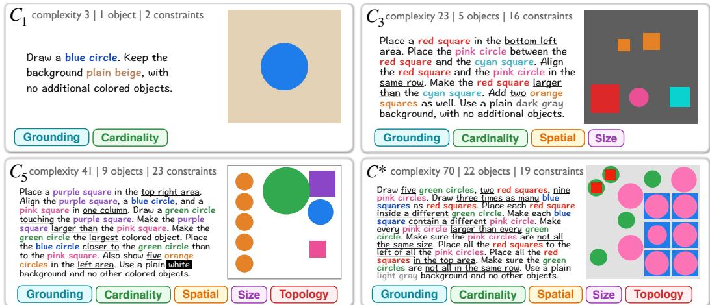  
Figure 1: Example VVRBENCH tasks from different complexity ranges (C –C ) and Challenge (C<sup>∗</sup>). Each panel shows the prompt, its complexity, the number of object instances, the number of constraints, the active constraint families, and a reference image that satisfies every constraint.

VVRBENCH. We instantiate VVR with colored geometric shapes and 46 constraint types over counts, attributes, and spatial relations and release VVRBENCH, with 10,000 tasks across five complexity ranges, and VVRBENCH-Challenge, with 720 more complex tasks to discriminate among frontier models (§3). The strongest open-weight model, FLUX.2-dev, achieves 19.2% accuracy on VVRBENCH, and the strongest model overall, GPT-Image-2.5-Sunburst, solves 21.4% of VVRBENCH-Challenge. Failures concentrate in the Cardinality (e.g., “twice as many A as B”) and Topology (e.g., “each A is inside a different B”) constraint families. The benchmark can be updated with higher complexity as frontier models evolve.

RLVVR. We use the verifiable VVR scores as rewards for reinforcement learning (RLVVR) to train image generators to follow instructions precisely. To study how training complexity affects generalization, we procedurally generate two training corpora: VVR-Easy contains only low complexity tasks of at most one constraint family, and VVR-Matched matches the VVRBENCH distribution. We show that 1) training on easy distribution generalizes to harder tasks, 2) training on harder task teaches compositionality, 3) training on colored shapes transfer to out-of-domain natural prompts to improve position and counting, and, most importantly, 4) mixing VVR with existing post-training objectives (e.g., GenEval2, OCR, PickScore) improves general benchmark performance and human preference, motivating the adoption of VVR into standard image generation post-training recipes. Our contributions are:

1. VVR, the first framework for programmatically verifiable image rewards, whose generator composes constraints on color, count, shape, and spatial relations into satisfiable instructions at any chosen complexity, each constraint checked by its own verifier (§2).

2. VVRBENCH and VVRBENCH-Challenge, benchmark that reveals capability gap of image generators to follow instructions, on which even frontier image generators fail most complex tasks, with failures tracable to specific constraint types (§3).

3. RLVVR, reinforcement learning with VVR rewards, which improves precise instruction following on tasks harder than those seen in training, transfers from synthetic scenes to natural prompts, and, mixed with existing post-training objectives, improves general benchmark performance and human preference (§4).

## 2 VERIFIABLE VISUAL REWARDS

## 2.1 VVR TASK REPRESENTATION

A VVR task specifies the requirements of a scene of colored shapes:

$$
\begin{array} { r } { s = ( \mathcal { G } , B , \mathcal { A } , \mathcal { F } , p ) . } \end{array}\tag{1}
$$

Table 1: Constraint library. VVR groups 46 constraint types into five families. Appendix A.1 lists all types and their supported values, and Appendix C.2 defines their verifiers.
<table><tr><td>Family</td><td>Visual property</td><td>Example constraint types</td></tr><tr><td>Grounding</td><td>Object identity and attribute binding</td><td>Color; shape; color-shape binding</td></tr><tr><td>Cardinality</td><td>Quantities and count comparisons</td><td>Exact count; equal, greater, or fewer counts; count ratios (X times as many)</td></tr><tr><td>Spatial</td><td>Position and arrangement</td><td>Image regions; relative order; alignment; grids; distance comparisons</td></tr><tr><td>Size</td><td>Relative visual extent</td><td>Pairwise and groupwise size; within-group variation; extrema</td></tr><tr><td>Topology</td><td>Contact and enclosure</td><td>Touching; separation; containment; distinct containment</td></tr></table>

Here $\mathcal { G }$ is a set of object groups, B is a set of background constraints, $\mathcal { A }$ is a set of active constraints on the object groups, $\check { \mathcal { F } }$ is a set of forbidden-content constraints, and $p$ is the natural-language instruction. In VVRBENCH, B and F are the same in every task: a plain background color and $\mathcal { F } = \{ \mathrm { n o }$ unrequested objects}, so we focus the rest of the section on the constraints in ${ \mathcal { A } } .$

Each constraint in A is instantiated with a constraint type from the constraint library and one or more object groups. Each constraint type has a predefined number of object groups that it operates on, and a set of supported values (Table 1). For example, exact count $( \mathfrak { g } 1 ; 3 )$ is a unary constraint that requires group $_ { \textrm { \scriptsize 9 1 } }$ to contain three objects, and $\mathtt { l e f t \_ o f } \mathtt { ( g 1 , q 2 ) }$ requires group $\mathfrak { g l }$ to appear left of group ${ \mathfrak { g } } 2 .$ . Every group has exactly one color constraint and one shape constraint; all other constraints are optional. Appendix A.2 shows a complete task.

A valid task must satisfy three desiderata: 1) Well-formed: every constraint uses a defined type with supported parameter values, such as one of eight colors or three shapes, and refers to as many object groups in $\mathcal { G }$ as its type requires; 2) Jointly satisfiable: at least one placement and sizing of the specified objects satisfies all constraints in $| B , A ,$ , and $\mathcal { F }$ simultaneously; and 3) Faithfully expressed: $p$ states every constraint in $B , A .$ , and $\mathcal { F }$ without any addition or omission.

## 2.2 TASK GENERATION

We now walk through the stages of the VVR generator that produces well-formed, jointly satisfiable, and faithfully expressed tasks. Appendix B provides an example generation and validation details.

1. It first creates a scene by sampling background constraints B and objects. It randomly assigns every object a color, shape, position, and size, forming object groups ${ \bar { \boldsymbol { g } } } ,$ and samples forbiddencontent constraints $\mathcal { F }$ that no object in the scene violates.

2. For each constraint type in the library, it lists all object group tuples with size corresponding to the type’s arity. The constraint type and its input tuple form an instantiated constraint.

3. All instantiated constraints that are true under the constructed scene, checked by program verifiers, form satisfiable constraint set $\ b { A } ^ { * }$ . From $\mathcal { A } ^ { \ast }$ , multiple valid active constraint sets A can be sampled such that $\boldsymbol { \mathcal { A } } \subseteq \boldsymbol { \mathcal { A } } ^ { * }$

4. A template τ with phrasing variants transforms each task requirement into natural language, $p = \tau ( \bar { \mathcal { G } } , \mathcal { B } , \mathcal { A } , \mathcal { F } )$ , forming $s = ( \mathcal { G } , \boldsymbol { B } , \mathcal { A } , \mathcal { F } , p )$

Every constraint instantiates a library type on a tuple of sampled groups whose length equals the type’s arity, so every task is well-formed by construction. The scene satisfies $B , { \mathcal { F } } ,$ and every constraint in $\ b { A } ^ { * }$ , so it satisfies the task formed with any $\boldsymbol { \mathcal { A } } \subseteq \boldsymbol { \mathcal { A } } ^ { * }$ , making the task jointly satisfiable. Finally, in the template τ, every requirement of s has a fixed phrase in $p ,$ and every phrase in p comes from a requirement of s, guaranteeing expression faithfulness.

Structural complexity estimates task difficulty. We define the structural complexity of a task as $\begin{array} { r } { C ( s ) = \sum _ { a \in \mathcal { A } } \bar { c } ( a ; s ) } \end{array}$ , where $c ( a ; s )$ is the complexity contribution of one constraint a in task s. c(a; s) follows a fixed rule for each constraint type and grows with the number of object instances that a evaluates in s. Appendix A.1 gives the complexity contribution of every constraint type. In the specific instantiation of tasks that produces datasets in Table 2, each task has one background-color constraint and one forbidden-content constraint, so the constraints in $\boldsymbol { B }$ and $\mathcal { F }$ are excluded.

Datasets. Given a target distribution $\tau$ over constraint families and structural complexity range, the generator can retain task candidates to fit $\tau .$ . Thus datasets can be built to evaluate or learn specific constraint types at specified difficulty. VVR datasets used by this paper and their complexity distribution are listed in Table 2.

## 2.3 DETERMINISTIC, REFERENCE-FREE CONSTRAINT VERIFICATION

VVR is an open-ended image generation task, where any image that satisfies all constraints receives full credit, so the verifier has to be reference-free. It takes in the generated RGB image x and the formal constraints (G, B, A, F) of the task and produces a correctness decision.

Object extraction from pixels. VVR first extracts candidate objects from the generated image using deterministic pixel-level operations. 1) It produces a binary mask for each supported color, with fixed hue and contrast thresholds. 2) Connected-component analysis assigns the same label to foreground pixels connected by a path of edge- or corner-adjacent pixels; each labeled region is a candidate object. 3) Fixed contour measurements classify each candidate into one of the supported shapes (circle, square, or triangle) based on its aspect ratio, bounding-box coverage, and convexity. 4) Candidates are then matched to object groups by the color and shape constraints of each group. Appendix C.1 visualizes the extraction pipeline, including the color map and shape classifier, as well as the handling of ambiguous colors, irregular contours, fragmented objects, and blurred boundaries.

Constraint verifier library. The verifier library V contains one program verifier for each constraint type: a Python function that applies the type’s requirement to the extracted objects. Verifier decisions use fixed comparisons of object counts, positions, extents, or boundary distances. For a constraint $a \in B \cup A \cup { \mathcal { F } } .$ , the verifier $v _ { a }$ returns a pass-or-fail decision $d _ { a } ( x , \bar { s } ) \in \{ 0 , 1 \}$ and a partial-credit score $q _ { a } ( x , s ) \in [ 0 , 1 ]$

Consider the constraint $a = \mathrm { 1 e f t . o f ~ ( g 1 , 9 2 ) }$ its program verifier computes $\delta ,$ the mean horizontal centroid coordinate of g2 minus that of $_ { \textrm { \scriptsize 9 1 } }$ , and compares it with a separation margin m. It returns two values: 1) the decision $d _ { a } .$ , which passes when g1 lies to the left of $_ { \mathtt { g 2 } }$ by at least the margin; and

```python
def left_of(g1, g2, m):
g1x = np.mean([c.centroid[0] for c in g1])
g2x = np.mean([c.centroid[0] for c in g2])
delta = g2x - g1x
partial = np.clip(delta / max(m, 1), 0, 1)
return delta >= m, partial
```

2) the partial-credit score $q _ { a } = \operatorname* { m i n } ( 1 , \operatorname* { m a x } ( 0 , \delta / m ) )$ , the fraction of the required separation that the image achieves. The score is 0 when g1 is at or to the right of ${ \mathfrak { g } } 2$ , rises linearly as g1 moves left, and reaches 1 at the margin, where the decision also passes. Appendix C.2 gives the verifier code for every constraint in an example task, Appendix C.3 provides verifier validation details.

Scores. A generated image succeeds only if every constraint in B, A, and F passes:

$$
r _ { \mathrm { e x a c t } } ( x , s ) = \prod _ { a \in { \cal B } \cup { \cal A } \cup { \cal F } } d _ { a } ( x , s ) .\tag{2}
$$

VVRBENCH accuracy is the mean of $r _ { \mathrm { e x a c t } }$ across tasks. For training, we design a dense reward $r _ { \mathrm { d e n s e } } \in [ 0 , 1 ]$ that gives partial credit through the verifier partial-credit scores:

$$
r _ { \mathrm { d e n s e } } ( x , s ) = \psi ( x , s ) \sum _ { a \in \mathcal { B \cup A \cup \mathcal { F } } } w _ { a } q _ { a } ( x , s ) .\tag{3}
$$

The weights $w _ { a }$ are fixed by constraint type, and $\psi ( x , s ) \in [ 0 , 1 ]$ is a multiplicative penalty factor that prevents the model from exploiting any single easy-to-learn constraint while ignoring others (Zhang et al., 2024; Hong et al., 2026). Appendix C.4 provides more details on $w _ { a }$ and $\psi .$

## 3 VVRBENCH

Benchmark splits. We evaluate on three benchmark splits (Table 2). 1) VVRBENCH, the main benchmark, contains 10,000 tasks of complexity 3 to $^ { 4 8 , }$ which we report in five ranges $C _ { 1 }$ to $C _ { 5 }$ of about 2,000 tasks each. 2) VVRBENCH-Fast is an 820-task subset covering the same range with 20 tasks at each in-

Table 2: Training and evaluation datasets produced by the VVR task generator. Appendix B.5 provides details on target distribution.
<table><tr><td>Dataset</td><td>Use</td><td>Size</td><td>Complexity</td></tr><tr><td>VVRBENCH</td><td>evaluation</td><td>10,000</td><td>3-48</td></tr><tr><td>VVRBENCH-Fast</td><td>evaluation</td><td>820</td><td>3–44, 20 each</td></tr><tr><td>VVRBENCH-Challenge</td><td>evaluation</td><td>720</td><td>45–80, 20 each</td></tr><tr><td>VVR-Easy</td><td>training</td><td>100,000</td><td>≤ 20</td></tr><tr><td>VVR-Matched</td><td>training</td><td>100,000</td><td>~VVRBENCH</td></tr></table>

teger complexity for evaluating image APIs at a twelfth of the generation cost. 3) VVRBENCH-Challenge contains 720 tasks of complexity 45 to 80 and adds 14 more difficult, group level constraint types, above the VVRBENCH range, to separate the strongest generators.

Table 3: Accuracy (%) on the 10,000 VVRBENCH tasks, overall and by complexity range. $C _ { 1 }$ to $C _ { 5 }$ split the tasks by structural complexity $C ( s )$ into five ranges of about 2,000 tasks each: 3–16, 16–21, 21–26, 26–31, and 31–48. Accuracy generally falls with complexity. GPT-Image-2 drops from 97.65% in $C _ { 1 }$ to 65.72% in $C _ { 5 } .$ , and no open weight model exceeds 20% overall.
<table><tr><td rowspan=1 colspan=7>Model          Accuracy (%) ↑        $C _ { 1 }$         $C _ { 2 }$         $C _ { 3 }$         $C _ { 4 }$         $C _ { 5 }$ </td></tr><tr><td rowspan=1 colspan=1>GPT-Image-2</td><td rowspan=1 colspan=1> $\mathbf { 8 6 . 8 6 _ { \pm 0 . 6 8 } }$ </td><td rowspan=1 colspan=1> $\mathbf { 9 7 . 6 5 _ { \pm 0 . 7 4 } }$ </td><td rowspan=1 colspan=1>98.18±0.70</td><td rowspan=1 colspan=1> $\mathbf { 9 1 . 0 0 _ { \pm 1 . 3 4 } }$ </td><td rowspan=1 colspan=1>81.83±1.75 6</td><td rowspan=1 colspan=1>5.72±2.10</td></tr><tr><td rowspan=1 colspan=1> $\mathrm { \bf G P T - I m a g e - 1 - m i n i }$ </td><td rowspan=1 colspan=1> $2 6 . 4 0 _ { \pm 0 . 8 7 }$ </td><td rowspan=1 colspan=1> $7 4 . 0 6 _ { \pm 1 . 9 3 }$ </td><td rowspan=1 colspan=1> $3 6 . 7 8 _ { \pm 2 . 1 8 }$ </td><td rowspan=1 colspan=1> $1 2 . 4 7 _ { \pm 1 . 5 3 }$ </td><td rowspan=1 colspan=1> $4 . 7 0 { \scriptstyle \pm 1 . 0 2 }$ </td><td rowspan=1 colspan=1> $2 . 3 9 _ { \pm 0 . 7 6 }$ </td></tr><tr><td rowspan=1 colspan=1> $\mathrm { F L U X } . 2 – \mathrm { \bar { d e v } }$ </td><td rowspan=1 colspan=1> $1 9 . 1 5 _ { \pm 0 . 7 8 }$ </td><td rowspan=1 colspan=1> $4 9 . 8 6 _ { \pm 2 . 1 5 }$ </td><td rowspan=1 colspan=1> $2 4 . 2 6 _ { \pm 1 . 9 6 }$ </td><td rowspan=1 colspan=1> $1 2 . 4 2 _ { \pm 1 . 5 2 }$ </td><td rowspan=1 colspan=1> $5 . 9 1 _ { \pm 1 . 1 2 }$ </td><td rowspan=1 colspan=1> $2 . 2 4 _ { \pm 0 . 7 4 }$ </td></tr><tr><td rowspan=1 colspan=1>HunyuanImage-2.1</td><td rowspan=1 colspan=1> $1 8 . 7 9 _ { \pm 0 . 7 8 }$ </td><td rowspan=1 colspan=1> $4 5 . 5 3 _ { \pm 2 . 1 5 }$ </td><td rowspan=1 colspan=1> $1 9 . 6 4 _ { \pm 1 . 8 3 }$ </td><td rowspan=1 colspan=1> $1 4 . 8 4 _ { \pm 1 . 6 3 }$ </td><td rowspan=1 colspan=1> $8 . 6 1 \pm 1 . 3 1$ </td><td rowspan=1 colspan=1> $4 . 2 9 _ { \pm 0 . 9 8 }$ </td></tr><tr><td rowspan=1 colspan=1>Qwen-Image-2512</td><td rowspan=1 colspan=1> $5 . 7 9 _ { \pm 0 . 4 7 }$ </td><td rowspan=1 colspan=1> $1 9 . 1 6 _ { \pm 1 . 7 5 }$ </td><td rowspan=1 colspan=1> $5 . 8 7 \pm 1 . 1 4$ </td><td rowspan=1 colspan=1> $2 . 1 1 { \scriptstyle \pm 0 . 7 3 }$ </td><td rowspan=1 colspan=1> $1 . 1 0 { \scriptstyle \pm 0 . 5 6 }$ </td><td rowspan=1 colspan=1> $0 . 1 5 _ { \pm 0 . 2 9 }$ </td></tr><tr><td rowspan=1 colspan=1>HiDream-I1-Full</td><td rowspan=1 colspan=1> $4 . 2 2 _ { \pm 0 . 4 1 }$ </td><td rowspan=1 colspan=1> $1 6 . 4 7 _ { \pm 1 . 6 5 }$ </td><td rowspan=1 colspan=1> $3 . 0 6 _ { \pm 0 . 8 7 }$ </td><td rowspan=1 colspan=1> $0 . 8 0 { \scriptstyle \pm 0 . 5 0 }$ </td><td rowspan=1 colspan=1> $0 . 2 0 { \scriptstyle \pm 0 . 3 1 }$ </td><td rowspan=1 colspan=1> $0 . 0 0 { \scriptstyle \pm 0 }$ 19</td></tr><tr><td rowspan=1 colspan=1> $\mathrm { F L U X . l - d e v }$ </td><td rowspan=1 colspan=1> $3 . 8 7 _ { \pm 0 . 4 0 }$ </td><td rowspan=1 colspan=1> $1 5 . 5 1 _ { \pm 1 . 6 2 }$ </td><td rowspan=1 colspan=1> $2 . 1 8 _ { \pm 0 . 7 5 }$ </td><td rowspan=1 colspan=1> $0 . 9 6 { \scriptstyle \pm 0 . 5 3 }$ </td><td rowspan=1 colspan=1> $0 . 1 5 _ { \pm 0 . 2 9 }$ </td><td rowspan=1 colspan=1> $0 . 0 0 { \scriptstyle \pm 0 . }$ 19</td></tr><tr><td rowspan=1 colspan=1>FLUX.1-schnell</td><td rowspan=1 colspan=1> $2 . 8 8 { \scriptstyle \pm 0 . 3 5 }$ </td><td rowspan=1 colspan=1> $1 1 . 9 6 { \scriptstyle \pm 1 . 4 6 }$ </td><td rowspan=1 colspan=1> $1 . 6 6 { \scriptstyle \pm 0 . 6 7 }$ </td><td rowspan=1 colspan=1> $0 . 2 5 { \scriptstyle \pm 0 . 3 4 }$ </td><td rowspan=1 colspan=1> $0 . 1 0 { \scriptstyle \pm 0 . : }$ 26</td><td rowspan=1 colspan=1> $0 . 0 0 { \scriptstyle \pm 0 . 1 9 }$ </td></tr><tr><td rowspan=1 colspan=1>SD3.5 Medium</td><td rowspan=1 colspan=1> $2 . 8 1 { \scriptstyle \pm 0 . 3 4 }$ </td><td rowspan=1 colspan=1> $1 2 . 0 1 { \scriptstyle \pm 1 . 4 7 }$ </td><td rowspan=1 colspan=1> $1 . 1 9 { \scriptstyle \pm 0 . 5 9 }$ </td><td rowspan=1 colspan=1> $0 . 3 5 { \scriptstyle \pm 0 . 3 7 }$ </td><td rowspan=1 colspan=1> $0 . 0 5 { \scriptstyle \pm 0 . 2 3 }$ </td><td rowspan=1 colspan=1> $0 . 0 0 { \scriptstyle \pm 0 . 1 9 }$ </td></tr><tr><td rowspan=1 colspan=1>SD3.5 Large</td><td rowspan=1 colspan=1> $2 . 4 5 _ { \pm 0 . 3 2 }$ </td><td rowspan=1 colspan=1> $1 0 . 4 7 _ { \pm 1 . 3 9 }$ </td><td rowspan=1 colspan=1> $1 . 1 4 _ { \pm 0 . 5 8 }$ </td><td rowspan=1 colspan=1> $0 . 2 0 { \scriptstyle \pm 0 . 3 2 }$ </td><td rowspan=1 colspan=1> $0 . 0 5 _ { \pm 0 . 2 3 }$ </td><td rowspan=1 colspan=1> $0 . 0 0 { \scriptstyle \pm 0 . 1 9 }$ </td></tr><tr><td rowspan=1 colspan=1> $\mathrm { S D X L 1 . 0 } ^ { \mathrm { \overline { { \mathbf { \Lambda } } } } }$ </td><td rowspan=1 colspan=1> $0 . 0 2 _ { \pm 0 . 0 5 }$ </td><td rowspan=1 colspan=1> $0 . 1 0 { \scriptstyle \pm 0 . 2 5 }$ </td><td rowspan=1 colspan=1> $0 . 0 0 { \scriptstyle \pm 0 . 2 0 }$ </td><td rowspan=1 colspan=1> $0 . 0 0 { \scriptstyle \pm 0 . 1 9 }$ </td><td rowspan=1 colspan=1> $0 . 0 0 { \scriptstyle \pm 0 . 1 9 }$ </td><td rowspan=1 colspan=1> $0 . 0 0 { \scriptstyle \pm 0 . 1 9 }$ </td></tr><tr><td rowspan=1 colspan=1>Sana 1.6B</td><td rowspan=1 colspan=1> $0 . 0 0 { \scriptstyle \pm 0 . 0 4 }$ </td><td rowspan=1 colspan=1> $0 . 0 0 { \scriptstyle \pm 0 . 1 8 }$ </td><td rowspan=1 colspan=1> $0 . 0 0 { \scriptstyle \pm 0 . 2 0 }$ </td><td rowspan=1 colspan=1> $0 . 0 0 { \scriptstyle \pm 0 . 1 9 }$ </td><td rowspan=1 colspan=1> $0 . 0 0 { \scriptstyle \pm 0 . 1 9 }$ </td><td rowspan=1 colspan=1> $0 . 0 0 { \scriptstyle \pm 0 . 1 9 }$ </td></tr></table>

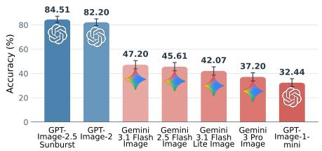  
Figure 2: API models on VVRBENCH-Fast.

Table 4: VVRBENCH-Challenge acc. (%). The best model solves 21.39% overall and 7.92% at complexity 69 to 80.
<table><tr><td>Model</td><td>Accuracy ↑</td><td>45 to 56</td><td>57 to 68</td><td>69 to 80</td></tr><tr><td>GPT-Image-2.5-Sunburst</td><td> ${ \bf 2 1 . 3 9 _ { \pm 3 . 1 4 } }$ </td><td> $\mathbf { 3 1 . 6 7 _ { \pm 6 . 1 3 } }$ </td><td> $2 4 . 5 8 _ { \pm 5 . 8 2 }$ </td><td> $\mathbf { 7 . 9 2 _ { \pm 4 . 1 2 } }$ </td></tr><tr><td>GPT-Image-2</td><td> $1 0 . 2 8 _ { \pm 2 . 4 3 }$ </td><td> $1 7 . 5 0 _ { \pm 5 . 3 1 }$ </td><td> $1 0 . 8 3 _ { \pm 4 . 5 7 }$ </td><td> $2 . 5 0 { \scriptstyle \pm 2 . 8 5 }$ </td></tr><tr><td>Gemini-3.1-Flash-Lite-Image</td><td> $7 . 3 6 _ { \pm 2 . 1 4 }$ </td><td> $1 0 . 0 0 _ { \pm 4 . 4 5 }$ </td><td> $4 . 1 7 _ { \pm 3 . 3 3 } ^ { - }$ </td><td> $7 . 9 2 _ { \pm 4 . 1 2 }$ </td></tr><tr><td>Gemini-3-Pro-Image</td><td> $4 . 5 8 _ { \pm 1 . 7 8 }$ </td><td> $7 . 0 8 _ { \pm 3 . 9 7 }$ </td><td> $4 . 1 7 _ { \pm 3 . 3 3 }$ </td><td> $2 . 5 0 { \scriptstyle \pm 2 . 8 5 }$ </td></tr><tr><td>Gemini-3.1-Flash-Īmage</td><td> $3 . 8 9 _ { \pm 1 . 6 7 }$ </td><td> $3 . 3 3 _ { \pm 3 . 1 1 }$ </td><td> $3 . 7 5 _ { \pm 3 . 2 2 }$ </td><td> $4 . 5 8 _ { \pm 3 . 4 4 }$ </td></tr><tr><td>Gemini-2.5-Flash-Image</td><td> $1 . 1 1 _ { \pm 1 . 0 7 }$ </td><td> $2 . 5 0 _ { \pm 2 . 8 5 }$ </td><td> $0 . 4 2 _ { \pm 1 . 9 1 }$ </td><td> $0 . 4 2 _ { \pm 1 . 9 1 }$ </td></tr><tr><td>GPT-Image-1-mini</td><td> $0 . 2 8 { \scriptstyle \pm 0 . 7 3 }$ </td><td> $0 . 8 3 { \scriptstyle \pm 2 . 1 5 }$ </td><td>0.00±1.58</td><td> $0 . 0 0 { \scriptstyle \pm 1 . 5 8 }$ </td></tr></table>

Models. We evaluate ten open-weight models: FLUX.2-dev (Black Forest Labs, 2025), HunyuanImage-2.1 (Tencent Hunyuan Team, 2025), Qwen-Image-2512 (Wu et al., 2025; Qwen Team, 2025), HiDream-I1-Full (Cai et al., 2025), FLUX.1-dev and FLUX.1-schnell (Black Forest Labs, 2024), Stable Diffusion 3.5 Medium and Large (Esser et al., 2024; Stability AI, 2024), SDXL (Podell et al., 2024), and Sana 1.6B (Xie et al., 2025), and seven API based models: GPT-Image-2.5-Sunburst (OpenAI, 2026b;c), GPT-Image-2 (OpenAI, 2026a), GPT-Image-1-mini (OpenAI, 2025), Gemini-3.1-Flash-Image (Google, 2026), Gemini-3.1-Flash-Lite-Image (Google DeepMind, 2026), Gemini-3-Pro-Image (Google DeepMind, 2025), and Gemini-2.5-Flash-Image (Google, 2025). Appendix D.1 gives the additional evaluation details.

## 3.1 PRECISE INSTRUCTION FOLLOWING IS FAR FROM SOLVED

As shown in Table 3, the strongest open-weight model, FLUX.2-dev, solves 19.15% of VVRBENCH tasks, and only 2.24% in the high complexity bin $C _ { 5 } .$ Every other open-weight model solves less than 19%. GPT-Image-2 solves 86.86% of all tasks, but its accuracy falls from 97.65% in $C _ { 1 }$ to 65.72% in $C _ { 5 } .$ On VVRBENCH-Fast (Figure 2), GPT-Image-2.5-Sunburst and GPT-Image-2 solve 84.51% and 82.20% of the tasks, respectively, leading other API models by a large margin (exact scores in Appendix D.2).

VVRBENCH-Challenge separates frontier models. With tasks in the complexity range of $3 -$ 44, VVRBENCH-Fast barely separates the strongest frontier models, GPT-Image-2.5-Sunburst and GPT-Image-2, with a 2.3-points margin. Therefore, we create VVRBENCH-Challenge by sampling tasks from the uniform complexity distribution of 45–80 over a wider range of constraints using the VVR generator (Appendix B.5). As shown in Table 4, VVRBENCH-Challenge discriminates among frontier models and exposes new failure modes. GPT-Image-2.5-Sunburst solves 21.39% of Challenge tasks, twice the 10.28% of GPT-Image-2, and its accuracy falls from 31.67% at complexity 45–56 to 24.58% at 57–68 and 7.92% at 69–80. Every other model solves at most 8% of VVRBENCH-Challenge, suggesting that there is still large room for improvement. Interestingly, we observe occasional abstention behaviors from all Gemini models, stating the instruction is unsatisfiable, demonstrating failure in spatial reasoning (Appendix D.3).

The uniform drop of model accuracy across increasing complexity bins validates the design of the structural complexity score as a model-independent heuristic to generate tasks with controlled difficulty. Appendix B.4 provides more details on complexity as a predictor of failure.

<table><tr><td rowspan=1 colspan=7>(a) Difficulty by Constraint Family</td></tr><tr><td rowspan=1 colspan=1>GPT-Image-2.5Sunburst</td><td rowspan=1 colspan=1>57</td><td rowspan=1 colspan=1>78</td><td rowspan=1 colspan=1>86</td><td rowspan=1 colspan=1>81</td><td rowspan=1 colspan=1>92</td><td rowspan=1 colspan=1>99</td></tr><tr><td rowspan=1 colspan=1>GPT-Image-2</td><td rowspan=1 colspan=1>52</td><td rowspan=1 colspan=1>72</td><td rowspan=1 colspan=1>72</td><td rowspan=1 colspan=1>76</td><td rowspan=1 colspan=1>89</td><td rowspan=1 colspan=1>98</td></tr><tr><td rowspan=1 colspan=1>Gemini 3.1Flash Lite</td><td rowspan=1 colspan=1>72</td><td rowspan=1 colspan=1>68</td><td rowspan=1 colspan=1>67</td><td rowspan=1 colspan=1>76</td><td rowspan=1 colspan=1>85</td><td rowspan=1 colspan=1>95</td></tr><tr><td rowspan=1 colspan=1>Gemini 3 Pro</td><td rowspan=1 colspan=1>67</td><td rowspan=1 colspan=1>61</td><td rowspan=1 colspan=1>63</td><td rowspan=1 colspan=1>67</td><td rowspan=1 colspan=1>85</td><td rowspan=1 colspan=1>94</td></tr><tr><td rowspan=1 colspan=1>Gemini 3.1Flash</td><td rowspan=1 colspan=1>61</td><td rowspan=1 colspan=1>59</td><td rowspan=1 colspan=1>64</td><td rowspan=1 colspan=1>64</td><td rowspan=1 colspan=1>83</td><td rowspan=1 colspan=1>95</td></tr><tr><td rowspan=1 colspan=1>Gemini 2.5Flash</td><td rowspan=1 colspan=1>40</td><td rowspan=1 colspan=1>46</td><td rowspan=1 colspan=1>50</td><td rowspan=1 colspan=1>62</td><td rowspan=1 colspan=1>74</td><td rowspan=1 colspan=1>88</td></tr><tr><td rowspan=1 colspan=1>GPT-Image-1-mini</td><td rowspan=1 colspan=1>44</td><td rowspan=1 colspan=1>45</td><td rowspan=1 colspan=1>58</td><td rowspan=1 colspan=1>73</td><td rowspan=1 colspan=1>72</td><td rowspan=1 colspan=1>93</td></tr><tr><td rowspan=1 colspan=1>Avg</td><td rowspan=1 colspan=1>56</td><td rowspan=1 colspan=1>61</td><td rowspan=1 colspan=1>66</td><td rowspan=1 colspan=1>71</td><td rowspan=1 colspan=1>83</td><td rowspan=1 colspan=1>95</td></tr><tr><td rowspan=1 colspan=1></td><td rowspan=1 colspan=6>TployCardinality Size Bkgd. &amp;Spatia9Groundingn=4236n=9724unreg.n=11382n=1440</td></tr></table>

(b) Hardest and Easiest Constraint Types  
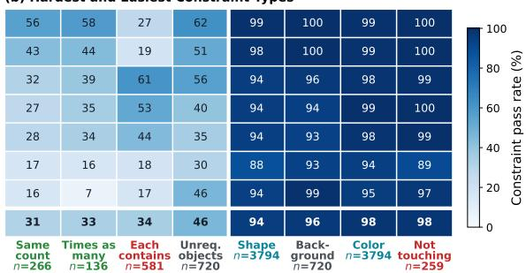  
Figure 3: Pass rates of individual constraint for API models on VVRBENCH-Challenge, by family (left) and for the four constraint types with the lowest and the four with the highest average pass rates among those with at least 100 checks per model (right).

Finding 1. Open-weight generators fail most VVRBENCH tasks, and even the strongest API models lose accuracy sharply as complexity grows.

## 3.2 FAILURES CONCENTRATE IN COUNTING AND OBJECT MATCHING

The binary pass-fail score (Eq. 2) is composed of individual verifier decisions from each of the active constraints in each task. Figure 3 presents the constraint-level pass rate of the API models on VVRBENCH-Challenge. Organized by constraint families (Table 1), 95% of Grounding constraints are satisfied, while only 56% of Topology constraints are rendered, averaged across models. The hardest constraint types concern counts or relations across object groups: same count passes in 31% of checks, times as many in 33%, and each contains , which requires each object of one group to contain a different object of another group, in 34%.

Appendix D.4 gives the pass rate of every constraint type, Appendix D.5 correlates each family to accuracy across all models at matched complexity, and Appendix D.6 shows typical failures in which a model adds objects that the prompt excludes.

Finding 2. Generators satisfy requirements on individual objects and pairs but fail requirements that constrain whole sets of objects.

## 4 RLVVR: VVR FOR DIFFUSION POST-TRAINING

VVR scores images with program verifiers, avoiding error propagation from unreliable learned evaluators, and is not limited to fixed prompt sets, so training can be scaled to any desired data size and difficulty distributions. These properties allow us to improve image generation instruction following by using VVR as a reward in reinforcement learning (RLVVR). In this section, we post-train image generators with RLVVR to answer the following research questions:

RQ1. Does RLVVR teach precise instruction following, and how does the complexity of the training tasks shape what is learned?

RQ2. Do the skills learned from synthetic scenes transfer to natural prompts beyond VVR?

RQ3. Is supervision from synthetic scenes complementary to existing post-training rewards?

## 4.1 EXPERIMENTAL SETUP

Data. We generate two training corpora using the VVR generator (§2.2). VVR-Easy contains tasks that contain at most one constraint family and have complexity of at most 20, and VVR-Matched matches the VVRBENCH distribution (complexity 3–48). Each dataset contains 100K VVR tasks after decontamination from benchmark data (Table 2). For reward-mixture experiments, we train with GenEval2 (Kamath et al., 2025), OCR (Liu et al., 2025a), and a five-reward objective that combines GenEval (Ghosh et al., 2023), GenEval2, OCR, PickScore (Kirstain et al., 2023), and UnifiedReward (Wang et al., 2025). Each of these objectives is trained alone and mixed with VVR-Easy, with equal number of prompts per objective.

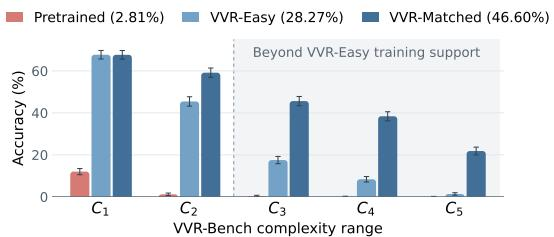  
Figure 4: VVRBENCH accuracy by complexity range. Shaded ranges lie above the complexity of every VVR-Easy training task, and VVR-Easy improves them. Training on harder generated tasks (VVR-Matched) closes more of the gap.

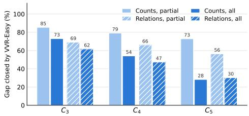  
Figure 5: VVR-Easy closes the gap between pretrained and VVR-Match more effectively on partial scores (individual constraint) than allsatisfy scores (compositionality) on both count and relation constraints.

Training. We train Stable Diffusion 3.5 Medium (Esser et al., 2024; Stability AI, 2024) with Flow-GRPO (Liu et al., 2025a). Reward for each rollout is assigned by the scorer of the task objective that its prompt comes from. We use the VVR dense score $r _ { \mathrm { d e n s e } }$ for VVR prompts (Eq. 3). We name each trained model after its training data. Appendix E reports training details.

Evaluation. We evaluate trained models on VVRBENCH, GenEval, GenEval2, OCR, PickScore, HPSv2.1, CLIPScore, aesthetic score, ImageReward, HPSv3, and UnifiedReward (Appendix E.1).

## 4.2 RQ1: RLVVR TEACHES PRECISE INSTRUCTION FOLLOWING

Training on VVR-Easy raises VVRBENCH accuracy from 2.81% to 28.27% (Figure 4). Every task in $C _ { 3 } – C _ { 5 }$ is more complex than any VVR-Easy task, and on these ranges accuracy still rises by 17.16, 8.31, and 1.35 points. Training on data from the benchmark distribution with VVR-Matched raises accuracy to 46.60% overall and to 45.62%, 38.39%, and 21.82% on $C _ { 3 } – C _ { 5 }$ (Appendix F.1).

We separate how reliably a model satisfies individual constraints from how well it satisfies compositional requirements, using the two kinds of constraints that nearly every complex task contains: counts and relations. We compare the models’ partial scores $q _ { a } ( x , s )$ ) on these constraints with how often they satisfy every count or every relation (Appendix F.2). On tasks outside of its training complexity range, VVR-Easy closes 79% and 64% of the gap between the pretrained model and VVR-Matched in the partial scores of counts and relations, respectively, but only 55% and 46% in how often all counts or all relations in a task are satisfied (Figure 5). Easy tasks thus make individual constraints reliable, and satisfying many constraints in the same image is learned from large scenes.

Finding 3. Training only on easy tasks makes individual constraints reliable, including on harder tasks, and training on large scenes teaches compositionality.

## 4.3 RQ2: SKILLS LEARNED FROM SYNTHETIC SCENES TRANSFER TO NATURAL PROMPTS

Trained only on colored shapes, VVR-Easy improves over the pretrained reference on eight of ten non-VVR metrics, including GenEval by 0.113 and OCR by 0.111 (Table 5). Human annotators confirm the transfer: VVR-Easy is preferred by annotators over the pretrained SD3.5-M on their generations from 160 natural prompts outside VVR with a win rate of 71.6% with 83.8% pairwise agreement (Table 6). Appendix G reports annotation details.

VVR-Easy also scores higher on 6 out of 9 natural prompt benchmarks than the model trained with the GenEval2 reward, whose training prompts name real objects—especially GenEval (0.729 vs. 0.688) and OCR (0.587 vs. 0.501). Notably, the GenEval gain comes from position (+0.150), counting (+0.103), and color attribution (+0.025), all skills that VVR trains, while the single object, two object, and colors categories are comparable to the GenEval2-trained model.

Finding 4. Skills learned from synthetic VVR scenes transfer to natural prompts, especially in position and counting.

Table 5: RLVVR with VVR-Easy and reward mixtures transfers to most benchmarks and metrics.
<table><tr><td>Training reward</td><td colspan="3">VVR GenEval GenEval2</td><td colspan="7">OCR PickScore HPSv2.1 HPSv3 CLIPScore Aesthetic ImageReward UnifiedReward</td></tr><tr><td>Pretrained</td><td>0.028</td><td>0.616</td><td>0.237</td><td>0.476</td><td>0.841</td><td>0.300 7.689</td><td></td><td>0.956 5.517</td><td></td><td>0.929 0.636</td></tr><tr><td>+ VVR-Easy</td><td>0.283</td><td>0.729</td><td>0.268 0.587</td><td>0.849</td><td>0.294</td><td>8.275</td><td>0.979</td><td>5.483</td><td>1.114</td><td>0.641</td></tr><tr><td> $\dot { \Delta }$ </td><td>+0.255</td><td>+0.113 +0.031</td><td>+0.111</td><td>+0.008</td><td>-0.006</td><td>+0.586</td><td>+0.023</td><td>-0.034</td><td>+0.185</td><td>+0.005</td></tr><tr><td>GenEval2</td><td>0.039</td><td>0.688</td><td>0.454 0.501</td><td>0.848</td><td>0.297</td><td>8.289</td><td>0.974</td><td>5.523</td><td>1.110</td><td>0.635</td></tr><tr><td>+ VVR-Easy</td><td>0.218</td><td>0.718</td><td>0.478 0.532</td><td></td><td>0.848 0.302</td><td>8.511</td><td>0.976</td><td>5.533</td><td>1.155</td><td>0.637</td></tr><tr><td> $\Delta$ </td><td>+0.180</td><td>+0.030</td><td>+0.025 +0.030</td><td></td><td>+0.0004</td><td>+0.005 +0.222</td><td>+0.002</td><td>+0.009</td><td>+0.045</td><td>+0.0019</td></tr><tr><td> $_ { \Delta } ^ { + }$  VVR-Matched</td><td>0.335</td><td>0.712</td><td>0.491 0.510</td><td></td><td>0.848</td><td>0.301 8.498</td><td>0.972</td><td>5.516</td><td>1.148</td><td>0.637</td></tr><tr><td></td><td>+0.296</td><td>+0.024</td><td>+0.038 +0.009</td><td>-0.0002</td><td></td><td>+0.004 +0.209</td><td>-0.001</td><td>-0.007</td><td>+0.038</td><td>+0.0012</td></tr><tr><td>OCR</td><td>0.036</td><td>0.625</td><td>0.225</td><td>0.962</td><td>0.844</td><td>0.290 7.601</td><td>0.960</td><td>5.477</td><td>0.994</td><td>0.633</td></tr><tr><td>+ VVR-Easy</td><td>0.247</td><td>0.678</td><td>0.252</td><td>0.941</td><td>0.846</td><td>0.290 7.765</td><td>0.969</td><td>5.488</td><td>1.087</td><td>0.636</td></tr><tr><td> $\Delta$ </td><td>+0.212</td><td>+0.053</td><td>+0.027 -0.021</td><td>+0.0018</td><td></td><td>0.000 +0.164</td><td>+0.009</td><td>+0.012</td><td>+0.092</td><td>+0.0024</td></tr><tr><td>Five-reward</td><td>0.048</td><td>0.739</td><td>0.342</td><td>0.856</td><td>0.850</td><td>0.294 8.137</td><td>0.974</td><td>5.510</td><td>1.125</td><td>0.640</td></tr><tr><td>+ VVR-Easy</td><td>0.158</td><td>0.751</td><td>0.383</td><td>0.826</td><td>0.848</td><td>0.300 8.444</td><td>0.976</td><td>5.541</td><td>1.152</td><td>0.640</td></tr><tr><td>Δ</td><td>+0.110</td><td>+0.012</td><td>+0.041</td><td>-0.030</td><td>-0.0024†</td><td>+0.006 +0.307</td><td>+0.002</td><td>+0.031</td><td>+0.027</td><td>+0.0003</td></tr></table>

Table 6: Human preference win-rate (%) for the RLVVR-trained model over its baseline.
<table><tr><td>VVR win rate vs. baseline</td><td>VVR</td><td>GenEval2</td><td>GenEval</td><td>OCR</td><td>DrawBench</td><td>Outside VVR</td></tr><tr><td>VVR-Easy vs. pretrained</td><td>93.3 [86.7, 98.3]</td><td>78.8 [67.5, 88.8]</td><td>62.9 [50.4, 75.0]</td><td>69.6 [58.3, 80.4]</td><td>75.0 [65.4, 84.2]</td><td>71.6 [65.9, 77.1]</td></tr><tr><td>GenEval2 + VVR-Easy vs. GenEval2</td><td>89.2 [81.7, 95.4]</td><td>62.9 [50.8, 74.6]</td><td>57.5 [45.0, 69.6]</td><td>56.7 [44.6, 68.8]</td><td>57.5 [45.4, 69.2]</td><td>58.6 [52.6, 64.6]</td></tr></table>

## 4.4 RQ3: SUPERVISION FROM SYNTHETIC SCENES COMPLEMENTS EXISTING REWARDS

Mixed with GenEval2, VVR-Easy raises all ten non-VVR metrics in Table 5, including GenEval2 itself (+0.025). The largest metric gains are in GenEval (+0.030), OCR (+0.030), HPSv3 (+0.222), and ImageReward (+0.045). Human annotators prefer the mixture to GenEval2 alone on the 160 non-VVR natural prompts with a win rate of 58.6% (Table 6). Combining with VVR-Matched, the dataset with more complex tasks and diverse constraint combinations, further raises performance and generalization on most natural prompts.

Mixed with OCR and with the five-reward objective, VVR-Easy raises eight of ten metrics each, with the largest gains in GenEval by 0.053 and ImageReward by 0.092 in the OCR mixture, and GenEval2 by 0.041 and HPSv3 by 0.307 in the five-reward mixture. In these two mixtures, native OCR accuracy falls by 0.021 and 0.030, and in the five-reward mixture PickScore falls by 0.002, since each mixture trains on fewer prompts from the original sources.

Finding 5. Adding VVR tasks to existing post-training objectives improves human preference and most non-VVR metrics.

## 5 RELATED WORK

Verifiable rewards. Verifiable rewards score language-model outputs with executable rules, such as exact-answer checks (Guo et al., 2025) and instruction-constraint checks (Zhou et al., 2023; Lambert et al., 2025), and procedural environments generate such tasks at controlled difficulty (Stojanovski et al., 2025; Liu et al., 2025b; Chen et al., 2025a). Johnson et al. (2017) derive visual questions and their answers from generated scenes; VVR derives image-generation prompts and their constraints the same way. For generated SVG and TikZ programs, rewards check the geometry of the rendered program (Li et al., 2026) or compare its rendering with a reference image (Rodriguez et al., 2025; Belouadi et al., 2024); VVR instead verifies generated pixels, with no program or reference image, and accepts any image that satisfies the constraints.

Rewards for text-to-image post-training. Diffusion and flow models are post-trained with policy gradients (Black et al., 2024; Fan et al., 2023), differentiable rewards (Xu et al., 2023; Clark et al., 2024), preference optimization (Wallace et al., 2024), and online reinforcement learning for flow models (Liu et al., 2025a; Xue et al., 2025). Rewards that check the prompt rely on learned models: preference models (Kirstain et al., 2023; Xu et al., 2023; Wu et al., 2023; Wang et al., 2025), or rules applied to the outputs of learned detectors and vision-language models. Liu et al. (2025a) score

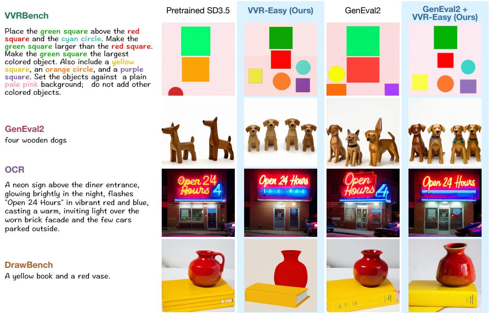  
Figure 6: Example generations from the RLVVR and baseline models from the same prompts and initial seed. On the VVR prompt, the verifier accepts both RLVVR outputs and rejects both baselines. On the DrawBench prompt, VVR-Easy renders the vase as a flat shape without shading, consistent with its lower aesthetic and HPSv2.1 scores; adding GenEval2 to VVR-Easy recovers shading and improves aesthetic and HPSv2.1.

GenEval detections (Ghosh et al., 2023) and OCR outputs, Zhou et al. (2026) combine detectors with a vision-language model, and Huang et al. (2026) answer decomposed questions with a multimodal model. Errors in these learned signals can be exploited during optimization (Zhang et al., 2024). The compressibility reward of Black et al. (2024) needs no learned model but does not depend on the prompt. RLVVR computes a prompt-specific reward from the generated pixels without a learned model, and it can be mixed with these objectives.

Text-to-image evaluation. Text-to-image evaluation uses embedding and question-answering metrics (Hessel et al., 2021; Hu et al., 2023; Cho et al., 2024a; Lin et al., 2024) and prompt-alignment and compositional benchmarks (Saharia et al., 2022; Yu et al., 2022; Ghosh et al., 2023; Huang et al., 2023; Hu et al., 2024), all of which score images with learned models. Kamath et al. (2025) replace the GenEval detector with a vision-language judge because detector scores diverged from human judgments on stronger generators. Wu et al. (2024) and Cho et al. (2024b) use synthetic visual concepts in their prompts but score the outputs with a detector or a VLM. VVRBENCH scores every constraint exactly, with the same program verifiers that provide the RLVVR reward.

## 6 CONCLUSION

In this paper, we introduce Verifiable Visual Rewards (VVR), where open-ended image generation can be scored by deterministic program verifiers to provide both evaluation feedback and post-training signals. VVR tasks can be generated procedurally given any target distribution over constraint types and complexity levels. We release VVRBENCH, 10K verifiable image generation tasks where the model is asked to draw geometric objects with specified color, shape, count, and spatial relations, and show that models struggle with visual instruction following. A VVRBENCH-Challenge set where the strongest frontier image generation model, GPT-Image-2.5-Sunburst, solves only 21.4% of the tasks. We then train image generators with VVR scores as an RL reward (RLVVR) significantly improves instruction following both on VVR tasks and on natural prompts unseen during training. Mixing VVR with existing post-training objectives for image generation, such as GenEval2, leads to further gains on a broad evaluation suite and human preference, motivating its adoption into standard post-training recipes.

## LIMITATIONS AND FUTURE DIRECTIONS

VVRBENCH uses eight colors, three shapes, and plain backgrounds; future work can add more shapes, textures, and object types as new program verifiers. VVR currently covers 2D geometric objects, and future work can extend it to 3D renderings or 2D projections of 3D objects.

VVR is constrained to text-to-image generation; the same constraints could be applied to image editing. New constraints such as motion, velocity, acceleration, are also convertible to program verifiers and can be applied to video generation. VVR outputs with their verifier decisions could be used to evaluate or train learned reward models and VLM judges.

We post-train SD3.5-M with Flow-GRPO; applying RLVVR to other image generators and RL algorithms is left to future work. RLVVR is an RL-Zero recipe: we apply Flow-GRPO directly to the pretrained SD3.5-M. Mid-training on VVR data with supervised fine-tuning or DPO before the RL stage, with different data mixtures, could further improve instruction following in image generation.

RLVVR uses the combined dense reward $r _ { \mathrm { d e n s e } } ,$ but the program verifiers also report which constraints fail. This feedback allows a range of reward designs, for example weighting constraint families differently according to the desired model behavior. The complexity-controlled task generator also allows adaptive curricula for RLVVR.

Several API models incorrectly decline some VVR tasks as contradictory, although every task is satisfiable. Our analysis is constrained to case studies due to the small number of abstentions, but VVR tasks can be used to evaluate, and further train for, correct abstention decisions in image generators, VLM, and even LLMs to improve spatial reasoning.

## AI USE STATEMENT

Generative AI tools were used to assist with code navigation, debugging, analysis scripting, and manuscript polishing. The authors take responsibility for the final content.

## ETHICS STATEMENT

The annotation in this paper labels generated images of synthetic scenes and public benchmark prompts and involves no personal or sensitive data.

## REPRODUCIBILITY STATEMENT

We release all three benchmark splits, the two training corpora, the verifier, the task generator, and the scripts that build every table and figure, together with evaluation prompts, training configurations, and model checkpoints. The appendix records reward formulas, full results tables, and dataset statistics.

## ACKNOWLEDGMENT

This research was developed in part with funding from the Defense Advanced Research Projects Agency’s (DARPA) SciFy program (Agreement No. HR00112520300). The views expressed are those of the author and do not reflect the official policy or position of the Department of Defense or the U.S. Government. This material is based in part upon work supported by the Defense Advanced Research Projects Agency and the Air Force Research Laboratory, contract number(s): FA8650-23- C-7316. Any opinions, findings and conclusions, or recommendations expressed in this material are those of the author(s) and do not necessarily reflect the views of AFRL or DARPA. This research was supported by Coefficient Giving, the University of Washington Population Health Initiative, Amazon Health, the UW+Amazon Science Hub, and the Meta AIM program.

## REFERENCES

Jonas Belouadi, Simone Paolo Ponzetto, and Steffen Eger. DeTikZify: Synthesizing Graphics Programs for Scientific Figures and Sketches with TikZ. In Advances in Neural Information Processing Systems (NeurIPS), 2024. URL https://arxiv.org/abs/2405.15306.

Kevin Black, Michael Janner, Yilun Du, Ilya Kostrikov, and Sergey Levine. Training diffusion models with reinforcement learning. In International Conference on Learning Representations (ICLR), 2024. URL https://arxiv.org/abs/2305.13301.

Black Forest Labs. FLUX. Black Forest Labs GitHub repository, 2024. URL https://github. com/black-forest-labs/flux. FLUX.1 [dev] and [schnell]; citation as given in the official repository.

Black Forest Labs. FLUX.2: Frontier visual intelligence. Black Forest Labs blog post, 2025. URL https://bfl.ai/blog/flux-2. Blog post, November 25, 2025; citation as given in github.com/black-forest-labs/flux2.

Qi Cai, Jingwen Chen, Yang Chen, Yehao Li, Fuchen Long, Yingwei Pan, Zhaofan Qiu, Yiheng Zhang, Fengbin Gao, Peihan Xu, Yimeng Wang, Kai Yu, Wenxuan Chen, Ziwei Feng, Zijian Gong, Jianzhuang Pan, Yi Peng, Rui Tian, Siyu Wang, Bo Zhao, Ting Yao, and Tao Mei. HiDream-I1: A high-efficient image generative foundation model with sparse diffusion transformer, 2025. URL https://arxiv.org/abs/2505.22705.

Jiangjie Chen, Qianyu He, Siyu Yuan, Aili Chen, Zhicheng Cai, Weinan Dai, Hongli Yu, Qiying Yu, Xuefeng Li, Jiaze Chen, Hao Zhou, and Mingxuan Wang. Enigmata: Scaling logical reasoning in large language models with synthetic verifiable puzzles. In Advances in Neural Information Processing Systems (NeurIPS), 2025a. URL https://arxiv.org/abs/2505.19914. arXiv:2505.19914.

Zhaorun Chen, Yichao Du, Zichen Wen, Yiyang Zhou, Chenhang Cui, Zhenzhen Weng, Haoqin Tu, Chaoqi Wang, Zhengwei Tong, Qinglan Huang, Canyu Chen, Qinghao Ye, Zhihong Zhu, Yuqing Zhang, Jiawei Zhou, Zhuokai Zhao, Rafael Rafailov, Chelsea Finn, and Huaxiu Yao. MJ-Bench: Is your multimodal reward model really a good judge for text-to-image generation? In Advances in Neural Information Processing Systems (NeurIPS), Datasets and Benchmarks Track, 2025b. URL https://arxiv.org/abs/2407.04842.

Jaemin Cho, Yushi Hu, Roopal Garg, Peter Anderson, Ranjay Krishna, Jason Baldridge, Mohit Bansal, Jordi Pont-Tuset, and Su Wang. Davidsonian scene graph: Improving reliability in finegrained evaluation for text-to-image generation. In International Conference on Learning Representations (ICLR), 2024a. URL https://arxiv.org/abs/2310.18235.

Jaemin Cho, Linjie Li, Zhengyuan Yang, Zhe Gan, Lijuan Wang, and Mohit Bansal. Diagnostic benchmark and iterative inpainting for layout-guided image generation. In Proceedings of the IEEE/CVF Conference on Computer Vision and Pattern Recognition Workshops (CVPRW), 2024b. URL https://arxiv.org/abs/2304.06671.

Kevin Clark, Paul Vicol, Kevin Swersky, and David J. Fleet. Directly fine-tuning diffusion models on differentiable rewards. In International Conference on Learning Representations (ICLR), 2024. URL https://arxiv.org/abs/2309.17400.

Patrick Esser, Sumith Kulal, Andreas Blattmann, Rahim Entezari, Jonas Muller, Harry Saini, Yam¨ Levi, Dominik Lorenz, Axel Sauer, Frederic Boesel, Dustin Podell, Tim Dockhorn, Zion English, Kyle Lacey, Alex Goodwin, Yannik Marek, and Robin Rombach. Scaling rectified flow transformers for high-resolution image synthesis. In Proceedings ofthe 41st International Conference on Machine Learning (ICML), volume 235 of Proceedings ofMachine Learning Research, 2024. URL https://arxiv.org/abs/2403.03206.

Ying Fan, Olivia Watkins, Yuqing Du, Hao Liu, Moonkyung Ryu, Craig Boutilier, Pieter Abbeel, Mohammad Ghavamzadeh, Kangwook Lee, and Kimin Lee. DPOK: Reinforcement learning for fine-tuning text-to-image diffusion models. In Advances in Neural Information Processing Systems (NeurIPS), 2023. URL https://arxiv.org/abs/2305.16381.

Dhruba Ghosh, Hanna Hajishirzi, and Ludwig Schmidt. GenEval: An object-focused framework for evaluating text-to-image alignment. In Advances in Neural Information Processing Systems (NeurIPS), Datasets and Benchmarks Track, 2023. URL https://arxiv.org/abs/2310. 11513.

Google. Introducing Gemini 2.5 Flash Image, our state-of-the-art image model. Google Developers Blog, 2025. URL https://developers.googleblog.com/en/ introducing-gemini-2-5-flash-image/. Google Developers Blog, August 26, 2025 (“Nano Banana”); model card: https://storage.googleapis.com/ deepmind-media/Model-Cards/Gemini-2-5-Flash-Model-Card.pdf.

Google. Nano Banana 2: Google’s latest AI image generation model. Google blog post, 2026. URL https://blog.google/innovation-and-ai/technology/ai/ nano-banana-2/. Gemini 3.1 Flash Image, launched February 26, 2026; model page https://deepmind.google/models/gemini-image/flash/.

Google DeepMind. Gemini 3 Pro Image model card. Google DeepMind model card, 2025. URL https://storage.googleapis.com/deepmind-media/Model-Cards/ Gemini-3-Pro-Image-Model-Card.pdf. “Nano Banana Pro”; published November 2025.

Google DeepMind. Gemini 3.1 Flash-Lite Image (Nano Banana 2 Lite). Google Deep-Mind model page, 2026. URL https://deepmind.google/models/gemini-image/ flash-lite/. Model ID gemini-3.1-flash-lite-image, released June 30, 2026 (Gemini API release notes); https://ai.google.dev/gemini-api/docs/models/ gemini-3.1-flash-lite-image.

Daya Guo, Dejian Yang, Haowei Zhang, Junxiao Song, Peiyi Wang, Qihao Zhu, Runxin Xu, Ruoyu Zhang, Shirong Ma, Xiao Bi, et al. DeepSeek-R1 incentivizes reasoning in LLMs through reinforcement learning. Nature, 645:633–638, 2025. doi: 10.1038/s41586-025-09422-z. URL https://doi.org/10.1038/s41586-025-09422-z. arXiv:2501.12948 (“DeepSeek-R1: Incentivizing Reasoning Capability in LLMs via Reinforcement Learning”).

Jack Hessel, Ari Holtzman, Maxwell Forbes, Ronan Le Bras, and Yejin Choi. CLIPScore: A reference-free evaluation metric for image captioning. In Proceedings of the 2021 Conference on Empirical Methods in Natural Language Processing (EMNLP), 2021. URL https: //arxiv.org/abs/2104.08718.

Yunqi Hong, Kuei-Chun Kao, Hengguang Zhou, and Cho-Jui Hsieh. Understanding Reward Hacking in Text-to-Image Reinforcement Learning. arXiv preprint arXiv:2601.03468, 2026. URL https://arxiv.org/abs/2601.03468.

Xiwei Hu, Rui Wang, Yixiao Fang, Bin Fu, Pei Cheng, and Gang Yu. ELLA: Equip diffusion models with LLM for enhanced semantic alignment. arXiv preprint arXiv:2403.05135, 2024. URL https://arxiv.org/abs/2403.05135.

Yushi Hu, Benlin Liu, Jungo Kasai, Yizhong Wang, Mari Ostendorf, Ranjay Krishna, and Noah A. Smith. TIFA: Accurate and interpretable text-to-image faithfulness evaluation with question answering. In Proceedings ofthe IEEE/CVF International Conference on Computer Vision (ICCV), 2023. URL https://arxiv.org/abs/2303.11897.

Kaiyi Huang, Kaiyue Sun, Enze Xie, Zhenguo Li, and Xihui Liu. T2I-CompBench: A comprehensive benchmark for open-world compositional text-to-image generation. In Advances in Neural Information Processing Systems (NeurIPS), Datasets and Benchmarks Track, 2023. URL https://arxiv.org/abs/2307.06350v2. arXiv:2307.06350v2.

Runhui Huang, Jie Wu, Rui Yang, Zhe Liu, and Hengshuang Zhao. AlphaGRPO: Unlocking selfreflective multimodal generation in UMMs via decompositional verifiable reward. In International Conference on Machine Learning (ICML), 2026. URL https://arxiv.org/abs/ 2605.12495.

Justin Johnson, Bharath Hariharan, Laurens van der Maaten, Li Fei-Fei, C. Lawrence Zitnick, and Ross Girshick. CLEVR: A diagnostic dataset for compositional language and elementary visual reasoning. In Proceedings of the IEEE Conference on Computer Vision and Pattern Recognition (CVPR), 2017. URL https://arxiv.org/abs/1612.06890.

Ivana Kajic, Olivia Wiles, Isabela Albuquerque, Matthias Bauer, Su Wang, Jordi Pont-Tuset, and´ Aida Nematzadeh. Evaluating numerical reasoning in text-to-image models. In Advances in Neural Information Processing Systems (NeurIPS), Datasets and Benchmarks Track, 2024. URL https://arxiv.org/abs/2406.14774.

Amita Kamath, Kai-Wei Chang, Ranjay Krishna, Luke Zettlemoyer, Yushi Hu, and Marjan Ghazvininejad. GenEval 2: Addressing benchmark drift in text-to-image evaluation. arXiv preprint arXiv:2512.16853, 2025. URL https://arxiv.org/abs/2512.16853.

Kyuyoung Kim, Jongheon Jeong, Minyong An, Mohammad Ghavamzadeh, Krishnamurthy Dvijotham, Jinwoo Shin, and Kimin Lee. Confidence-aware reward optimization for fine-tuning text-to-image models. In International Conference on Learning Representations (ICLR), 2024. URL https://arxiv.org/abs/2404.01863.

Yuval Kirstain, Adam Polyak, Uriel Singer, Shahbuland Matiana, Joe Penna, and Omer Levy. Picka-pic: An open dataset of user preferences for text-to-image generation. In Advances in Neural Information Processing Systems (NeurIPS), 2023. URL https://arxiv.org/abs/2305. 01569.

Nathan Lambert, Jacob Morrison, Valentina Pyatkin, Shengyi Huang, Hamish Ivison, Faeze Brahman, Lester James V. Miranda, Alisa Liu, Nouha Dziri, Shane Lyu, Yuling Gu, Saumya Malik, Victoria Graf, Jena D. Hwang, Jiangjiang Yang, Ronan Le Bras, Oyvind Tafjord, Chris Wilhelm, Luca Soldaini, Noah A. Smith, Yizhong Wang, Pradeep Dasigi, and Hannaneh Hajishirzi. Tulu¨ 3: Pushing frontiers in open language model post-training. In Conference on Language Modeling (COLM), 2025. URL https://arxiv.org/abs/2411.15124. arXiv:2411.15124.

Sifan Li, Yujun Cai, Hongkai Chen, and Yiwei Wang. GeoSVG-RL: Geometry-Aware Reinforcement Learning for Layout-Constrained Text-to-SVG Diagram Generation. arXiv preprint arXiv:2605.25447, 2026. URL https://arxiv.org/abs/2605.25447.

Zhiqiu Lin, Deepak Pathak, Baiqi Li, Jiayao Li, Xide Xia, Graham Neubig, Pengchuan Zhang, and Deva Ramanan. Evaluating text-to-visual generation with image-to-text generation. In European Conference on Computer Vision (ECCV), 2024. URL https://arxiv.org/abs/2404. 01291.

Jie Liu, Gongye Liu, Jiajun Liang, Yangguang Li, Jiaheng Liu, Xintao Wang, Pengfei Wan, Di Zhang, and Wanli Ouyang. Flow-GRPO: Training flow matching models via online RL. In Advances in Neural Information Processing Systems (NeurIPS), 2025a. URL https: //arxiv.org/abs/2505.05470.

Junteng Liu, Yuanxiang Fan, Zhuo Jiang, Han Ding, Yongyi Hu, Chi Zhang, Yiqi Shi, Shitong Weng, Aili Chen, Shiqi Chen, Yunan Huang, Mozhi Zhang, Pengyu Zhao, Junjie Yan, and Junxian He. SynLogic: Synthesizing verifiable reasoning data at scale for learning logical reasoning and beyond. In Advances in Neural Information Processing Systems (NeurIPS), 2025b. URL https://arxiv.org/abs/2505.19641. arXiv:2505.19641.

Yuhang Ma, Yunhao Shui, Xiaoshi Wu, Keqiang Sun, and Hongsheng Li. HPSv3: Towards widespectrum human preference score. In Proceedings ofthe IEEE/CVF International Conference on Computer Vision (ICCV), 2025. URL https://arxiv.org/abs/2508.03789.

OpenAI. GPT-Image-1 Mini. OpenAI API model documentation, 2025. URL https:// developers.openai.com/api/docs/models/gpt-image-1-mini. OpenAI API model documentation. Model ID gpt-image-1-mini, released October 6, 2025 (OpenAI API changelog).

OpenAI. GPT-Image-2. OpenAI API model documentation, 2026a. URL https:// developers.openai.com/api/docs/models/gpt-image-2. OpenAI API model documentation. Model ID gpt-image-2, snapshot gpt-image-2-2026-04-21.

OpenAI. GPT Image 2.5 Sunburst. OpenAI API model documentation, 2026b. URL https:// developers.openai.com/api/docs/models/gpt-image-2.5-sunburst. OpenAI API model documentation. Model ID gpt-image-2.5-sunburst, snapshot gpt-image-2.5-sunburst-2026-09-08; released September 8, 2026 together with gpt-image-2.5-flare.

OpenAI. ChatGPT Images 2.5 system card. OpenAI Deployment Safety Hub, 2026c. URL https://deploymentsafety.openai.com/chatgpt-images-2-5. OpenAI Deployment Safety Hub, published September 8, 2026.

Dustin Podell, Zion English, Kyle Lacey, Andreas Blattmann, Tim Dockhorn, Jonas Muller, Joe¨ Penna, and Robin Rombach. SDXL: Improving latent diffusion models for high-resolution image synthesis. In International Conference on Learning Representations (ICLR), 2024. URL https: //arxiv.org/abs/2307.01952.

Valentina Pyatkin, Saumya Malik, Victoria Graf, Hamish Ivison, Shengyi Huang, Pradeep Dasigi, Nathan Lambert, and Hannaneh Hajishirzi. Generalizing verifiable instruction following. In Advances in Neural Information Processing Systems (NeurIPS), Datasets and Benchmarks Track, 2025. URL https://arxiv.org/abs/2507.02833. arXiv:2507.02833.

Qwen Team. Qwen-Image-2512: Finer details, greater realism. Qwen blog post, 2025. URL https://qwen.ai/blog?id=qwen-image-2512. Blog post, December 2025; model: https://huggingface.co/Qwen/Qwen-Image-2512.

Juan A. Rodriguez, Haotian Zhang, Abhay Puri, Aarash Feizi, Rishav Pramanik, Pascal Wichmann, Arnab Mondal, Mohammad Reza Samsami, Rabiul Awal, Perouz Taslakian, Spandana Gella, Sai Rajeswar, David Vazquez, Christopher Pal, and Marco Pedersoli. Rendering-Aware Reinforcement Learning for Vector Graphics Generation. In Advances in Neural Information Processing Systems (NeurIPS), 2025. URL https://arxiv.org/abs/2505.20793.

Chitwan Saharia, William Chan, Saurabh Saxena, Lala Li, Jay Whang, Emily Denton, Seyed Kamyar Seyed Ghasemipour, Burcu Karagol Ayan, S. Sara Mahdavi, Rapha Gontijo Lopes, Tim Salimans, Jonathan Ho, David J Fleet, and Mohammad Norouzi. Photorealistic text-to-image diffusion models with deep language understanding. In Advances in Neural Information Processing Systems (NeurIPS), 2022. URL https://arxiv.org/abs/2205.11487.

Michael Saxon, Fatima Jahara, Mahsa Khoshnoodi, Yujie Lu, Aditya Sharma, and William Yang Wang. Who evaluates the evaluations? objectively scoring text-to-image prompt coherence metrics with T2IScoreScore (TS2). In Advances in Neural Information Processing Systems (NeurIPS), 2024. URL https://arxiv.org/abs/2404.04251.

Christoph Schuhmann. LAION-aesthetics predictor (improved-aesthetic-predictor). GitHub repository, 2022. URL https://github.com/christophschuhmann/ improved-aesthetic-predictor. See also https://laion.ai/blog/ laion-aesthetics/.

Stability AI. Introducing Stable Diffusion 3.5. Stability AI blog post, 2024. URL https: //stability.ai/news-updates/introducing-stable-diffusion-3-5. Blog post, October 22, 2024 (SD3.5 Large, Large Turbo, Medium).

Zafir Stojanovski, Oliver Stanley, Joe Sharratt, Richard Jones, Abdulhakeem Adefioye, Jean Kaddour, and Andreas Kopf. Reasoning gym: Reasoning environments for reinforcement learning ¨ with verifiable rewards. In Advances in Neural Information Processing Systems (NeurIPS), 2025. URL https://arxiv.org/abs/2505.24760. Spotlight. arXiv:2505.24760.

Tencent Hunyuan Team. HunyuanImage 2.1: An efficient diffusion model for high-resolution (2K) text-to-image generation. Tencent Hunyuan GitHub repository, 2025. URL https://github. com/Tencent-Hunyuan/HunyuanImage-2.1. Citation as given in the official repository; no technical report.

Bram Wallace, Meihua Dang, Rafael Rafailov, Linqi Zhou, Aaron Lou, Senthil Purushwalkam, Stefano Ermon, Caiming Xiong, Shafiq Joty, and Nikhil Naik. Diffusion model alignment using direct preference optimization. In Proceedings ofthe IEEE/CVF Conference on Computer Vision and Pattern Recognition (CVPR), 2024. URL https://arxiv.org/abs/2311.12908.

Yibin Wang, Yuhang Zang, Hao Li, Cheng Jin, and Jiaqi Wang. Unified reward model for multimodal understanding and generation. arXiv preprint arXiv:2503.05236, 2025. URL https: //arxiv.org/abs/2503.05236.

Olivia Wiles, Chuhan Zhang, Isabela Albuquerque, Ivana Kajic, Su Wang, Emanuele Bugliarello,´ Yasumasa Onoe, Pinelopi Papalampidi, Ira Ktena, Chris Knutsen, Cyrus Rashtchian, Anant Nawalgaria, Jordi Pont-Tuset, and Aida Nematzadeh. Revisiting text-to-image evaluation with Gecko: On metrics, prompts, and human ratings. In International Conference on Learning Representations (ICLR), 2025. URL https://arxiv.org/abs/2404.16820.

Chenfei Wu, Jiahao Li, Jingren Zhou, Junyang Lin, Kaiyuan Gao, Kun Yan, Sheng-ming Yin, Shuai Bai, Xiao Xu, Yilei Chen, Yuxiang Chen, Zecheng Tang, Zekai Zhang, Zhengyi Wang, An Yang, Bowen Yu, Chen Cheng, Dayiheng Liu, Deqing Li, Hang Zhang, Hao Meng, Hu Wei, Jingyuan Ni, Kai Chen, Kuan Cao, Liang Peng, Lin Qu, Minggang Wu, Peng Wang, Shuting Yu, Tingkun Wen, Wensen Feng, Xiaoxiao Xu, Yi Wang, Yichang Zhang, Yongqiang Zhu, Yujia Wu, Yuxuan Cai, and Zenan Liu. Qwen-Image technical report, 2025. URL https://arxiv.org/abs/ 2508.02324.

Xiaoshi Wu, Yiming Hao, Keqiang Sun, Yixiong Chen, Feng Zhu, Rui Zhao, and Hongsheng Li. Human preference score v2: A solid benchmark for evaluating human preferences of text-toimage synthesis. arXiv preprint arXiv:2306.09341, 2023. URL https://arxiv.org/abs/ 2306.09341.

Xindi Wu, Dingli Yu, Yangsibo Huang, Olga Russakovsky, and Sanjeev Arora. ConceptMix: A compositional image generation benchmark with controllable difficulty. In Advances in Neural Information Processing Systems (NeurIPS), Datasets and Benchmarks Track, 2024. URL https://arxiv.org/abs/2408.14339.

Enze Xie, Junsong Chen, Junyu Chen, Han Cai, Haotian Tang, Yujun Lin, Zhekai Zhang, Muyang Li, Ligeng Zhu, Yao Lu, and Song Han. SANA: Efficient high-resolution image synthesis with linear diffusion transformers. In International Conference on Learning Representations (ICLR), 2025. URL https://arxiv.org/abs/2410.10629.

Jiazheng Xu, Xiao Liu, Yuchen Wu, Yuxuan Tong, Qinkai Li, Ming Ding, Jie Tang, and Yuxiao Dong. ImageReward: Learning and evaluating human preferences for text-to-image generation. In Advances in Neural Information Processing Systems (NeurIPS), 2023. URL https://arxiv. org/abs/2304.05977.

Zeyue Xue, Jie Wu, Yu Gao, Fangyuan Kong, Lingting Zhu, Mengzhao Chen, Zhiheng Liu, Wei Liu, Qiushan Guo, Weilin Huang, and Ping Luo. DanceGRPO: Unleashing GRPO on visual generation. arXiv preprint arXiv:2505.07818, 2025. URL https://arxiv.org/abs/2505. 07818.

Jiahui Yu, Yuanzhong Xu, Jing Yu Koh, Thang Luong, Gunjan Baid, Zirui Wang, Vijay Vasudevan, Alexander Ku, Yinfei Yang, Burcu Karagol Ayan, Ben Hutchinson, Wei Han, Zarana Parekh, Xin Li, Han Zhang, Jason Baldridge, and Yonghui Wu. Scaling autoregressive models for contentrich text-to-image generation. Transactions on Machine Learning Research (TMLR), 2022. URL https://arxiv.org/abs/2206.10789.

Ziyi Zhang, Sen Zhang, Yibing Zhan, Yong Luo, Yonggang Wen, and Dacheng Tao. Confronting reward overoptimization for diffusion models: A perspective of inductive and primacy biases. In International Conference on Machine Learning (ICML), pp. 60396–60413, 2024. URL https: //arxiv.org/abs/2402.08552.

Jeffrey Zhou, Tianjian Lu, Swaroop Mishra, Siddhartha Brahma, Sujoy Basu, Yi Luan, Denny Zhou, and Le Hou. Instruction-following evaluation for large language models. arXiv preprint arXiv:2311.07911, 2023. URL https://arxiv.org/abs/2311.07911.

Sashuai Zhou, Qiang Zhou, Junpeng Ma, Yue Cao, Ruofan Hu, Ziang Zhang, Xiaoda Yang, Zhibin Wang, Jun Song, Cheng Yu, Bo Zheng, and Zhou Zhao. SpatialReward: Verifiable Spatial Reward Modeling for Fine-Grained Spatial Consistency in Text-to-Image Generation. In IEEE/CVF Conference on Computer Vision and Pattern Recognition (CVPR), 2026. URL https://arxiv.org/abs/2603.22228.

## A TASK REPRESENTATION

This section lists the constraint library of §2.1 and gives a complete example task.

## A.1 CONSTRAINT LIBRARY

Table 7 lists all 46 constraint types and their contributions to structural complexity. Let $L ( n ) =$ $1 + \log _ { 2 } n ; n _ { i }$ is the number of visible instances in object group $i , N _ { l }$ is the number of objects checked by layout constraint l, N<sub>r</sub> is the total number of visible instances in the distinct groups referenced by relation r, and $m _ { r }$ is the number of required one-to-one matches.

<table><tr><td>Family</td><td>Exact constraint types &amp; their supported values</td><td>Contribution to C(s)</td></tr><tr><td>Grounding</td><td>color_attribute: red, orange, yellow, green, cyan, blue, purple, pink shape_attribute: circle, square, triangle color_shape_binding</td><td>L(ni) for the referenced group  $L ( n _ { i } )$  for the referenced group No additional term; the bound group&#x27;s color and shape terms</td></tr><tr><td>Cardinality</td><td>exact_count:1-10 same_count;more_than_count;fewer_than_count times_as_many: factor k ∈ {2, 3, 4, 5}</td><td>already account for it L(ni) for the referenced group L(Nr) L(Nr) + log2 k,</td></tr><tr><td>Spatial</td><td>absolute_regi on: top left, top, top right, left, center, right, bottom left, bottom, bottom right grid_occupancy: cells of a 2 × 2, 2 × 3, or 3 × 3 grid (3 × 4 in VVRBENCH-Challenge)</td><td> $k \in \{ 2 , 3 , 4 , \bar { 5 } \}$  L(Ni) L(Ni)</td></tr><tr><td></td><td></td><td></td></tr><tr><td></td><td></td><td></td></tr><tr><td></td><td></td><td></td></tr><tr><td></td><td>left_of;right_of;above;below; all_left_of†;</td><td>L(Nr)</td></tr><tr><td></td><td>all_right_of†;all_above†;all_below†;leftmost;rightmost;</td><td></td></tr><tr><td></td><td>topmost;bottommost;between;same_row; same_column;</td><td></td></tr><tr><td></td><td>all_same_row†;all_same_column†;not_all_same_row†;</td><td></td></tr><tr><td></td><td>not_all_same_column†;closer_than;farther_than</td><td></td></tr><tr><td></td><td></td><td></td></tr><tr><td>Size</td><td>larger-than; smaller_than;same_size;all_larger_than†;</td><td> $L ( N _ { r } )$ </td></tr><tr><td></td><td>all_smaller_than†;all_same_size†;largest;smallest</td><td></td></tr><tr><td></td><td></td><td></td></tr><tr><td></td><td>not_all_same_size†</td><td> $2 \log _ { 2 } N _ { r }$ </td></tr><tr><td></td><td></td><td></td></tr><tr><td></td><td></td><td></td></tr><tr><td></td><td></td><td></td></tr><tr><td></td><td></td><td></td></tr><tr><td></td><td></td><td></td></tr><tr><td></td><td></td><td></td></tr><tr><td></td><td></td><td></td></tr><tr><td></td><td></td><td></td></tr><tr><td></td><td></td><td></td></tr><tr><td></td><td></td><td></td></tr><tr><td></td><td></td><td></td></tr><tr><td></td><td></td><td></td></tr><tr><td></td><td></td><td></td></tr><tr><td></td><td></td><td></td></tr><tr><td></td><td></td><td></td></tr><tr><td></td><td></td><td></td></tr><tr><td></td><td></td><td></td></tr><tr><td></td><td></td><td></td></tr><tr><td></td><td>touching;not_touching;inside; contains</td><td></td></tr><tr><td></td><td></td><td></td></tr><tr><td></td><td></td><td> $L ( N _ { r } )$ </td></tr><tr><td>Topology</td><td></td><td></td></tr><tr><td></td><td></td><td></td></tr><tr><td></td><td></td><td></td></tr><tr><td></td><td>each_inside†;each_contains†</td><td></td></tr><tr><td></td><td></td><td> $m _ { r }$ </td></tr><tr><td></td><td></td><td></td></tr><tr><td></td><td></td><td></td></tr><tr><td></td><td></td><td></td></tr><tr><td></td><td></td><td></td></tr><tr><td></td><td></td><td></td></tr><tr><td></td><td></td><td></td></tr><tr><td></td><td></td><td></td></tr><tr><td></td><td></td><td></td></tr><tr><td></td><td></td><td></td></tr><tr><td></td><td></td><td></td></tr></table>

Table 7: The exact 46 constraint types, their supported values, and their contributions to structural complexity. <sup>†</sup> marks types that appear only in VVRBENCH-Challenge. Types with the same cost rule share a row, and types without listed values take only object groups as arguments. The background constraint supports white, black, light gray, dark gray, beige, pale pink, and pale cyan. The background and forbidden-content constraints in $\dot { \boldsymbol { B } }$ and $\check { \mathcal { F } }$ apply to every task and do not contribute to $C ( s )$

## A.2 EXAMPLE TASK

This example gives one task in the representation of §2.1 and its prompt; Appendix C.2 gives the verifier code for each of its constraints.

Task. The task contains two object groups and seven constraints:

```javascript
G = {g1, g2},
A = {color attribute(g1; purple), shape attribute(g1; circle), exact count(g1; 1),
= {color attribute(g2; yellow), shape attribute(g2; square), exact count(g2; 1),
below(g1,g2)}.
```

The background constraints are $\beta = \{ \mathrm { b a c k g r o u n d \_ c o l o r }$ (pale pink)}, and the forbiddencontent constraints are F = {no unrequested objects}. For compactness, the implementation stores the color, shape, and count constraints of each group within the group’s record, stores the background constraint as the background color, and applies no unrequested objects to every task, so its forbidden list holds only additional forbidden-content constraints:

```json
{
"background": {"color": "pale pink"},
"objects": [
{"id": "g1", "color": "purple", "shape": "circle", "count": 1},
{"id": "g2", "color": "yellow", "shape": "square", "count": 1}
],
"relations": [{"type": "below", "subject": "g1", "object": "g2"}],
"forbidden": []
}
```

A group with "count mode": "relative" has no exact count constraint; its count is constrained only by relations such as times as many.

Prompt. The templates produce “Place the purple circle below the yellow square. Set the objects against a plain pale pink background; do not add other colored objects.” Each constraint refers to groups by identifier, so the binding of each attribute to its object is unambiguous.

## B TASK GENERATION

This section gives the complete generation procedure of §2.2, its validation steps, a worked example, and the construction of each dataset.

## B.1 PROCEDURE

Algorithm 1 gives the procedure for one dataset. Its first steps implement steps 1–5 of §2.2, and the remaining steps are the validation checks of Appendix B.2.

Algorithm 1 Task generation and validation for one dataset.   
1: initialize an empty task pool Q   
2: for each constructor index do   
3: sample background constraints B, object groups G with colors, shapes, and counts, and   
forbidden-content constraints F   
4: assign each object instance a center and a size to obtain the scene z   
5: A<sup>∗</sup> ← the instantiated constraints whose requirements hold in z   
6: for each active constraint set A $\subseteq A ^ { * }$ selected within the target complexity range do   
7: render the prompt p from (G, B, A, F) and form s = (G, B, A, F, p)   
8: render the reference image x<sup>⋆</sup> of z on the background specified by B   
9: if p or the canonical form of s occurs in Q or in an excluded split then   
10: continue   
11: end if   
12: if $r _ { \mathrm { e x a c t } } ( x ^ { \star } , s ) = 0$ then   
13: continue   
14: end if   
15: change one constraint of s to obtain a counterfactual task s˜   
16: if the changed constraint passes on x<sup>⋆</sup> under s˜ then   
17: continue   
18: end if   
19: add (s, x<sup>⋆</sup>) to Q   
20: end for   
21: end for   
22: select tasks from Q to match the target distribution of the dataset (Appendix B.5)

Scene construction. The frozen constructors represent each object instance by its group identifier, integer center $( u , v )$ , and radius ρ on a $5 1 2 \times 5 1 2$ canvas. The default layout divides the canvas into six boxes arranged in three columns and two rows. For a group of n repeated objects, the constructor uses min $( 5 , \lceil { \sqrt { n } } \rceil )$ columns and fills $\lceil n / \operatorname* { m i n } ( 5 , \lceil \sqrt { n } \rceil ) \rceil$ rows at evenly spaced coordinates within its box. Relation-specific templates replace these default placements with fixed constructions for rows, columns, grids, contact, containment, order, proximity, extrema, and relative size. Seeded sampling selects counts, attributes, and template variants. The constructor then enumerates additional constraints that are true of the stored positions and sizes.

## B.2 VALIDATION

Every retained task passes three checks.

Reference image. The generator renders the scene and requires the released verifier to accept it, which confirms that the pixel rendering preserves every constraint that holds in the scene.

Counterfactual. The generator changes one constraint while holding the reference image fixed and requires the verifier to reject the image under the changed task. For VVRBENCH, the changed constraint is evaluated on its own; for Challenge and the scene-first training candidates, the generator inverts one constraint and removes the other relation and layout constraints that could conflict with the inversion.

Deduplication. Deduplication uses normalized prompts and canonical tasks formed by renaming object identifiers in a fixed order, and it is applied jointly across each dataset and all excluded training and evaluation splits.

For each of the 10,000 VVRBENCH and 720 Challenge tasks, the verifier accepts the reference image and rejects the counterfactual.

## B.3 WORKED EXAMPLE

This example traces one scene through the five steps of §2.2. It is the output of the scene-first generator for enumeration index 53 with the default seed; every value below is produced by the code.

Step 1: scene. The generator samples B = {background color(white)} and three object groups with seven objects in total on a 512 × 512 canvas; F = {no unrequested objects}.

<table><tr><td>Group</td><td>Color</td><td>Shape</td><td>Count</td><td>Centers (radius 9 px)</td></tr><tr><td>g0</td><td>cyan</td><td>circle</td><td>3</td><td>(28, 34), (148, 34), (28, 214)</td></tr><tr><td>g1</td><td>yellow</td><td>square</td><td>2</td><td>(196, 34), (316, 34)</td></tr><tr><td>g2</td><td>pink</td><td>triangle</td><td>2</td><td>(364, 34), (484, 34)</td></tr></table>

Steps 2 and 3: satisfiable constraint set. The generator instantiates each constraint type on the group tuples of its arity and keeps the instantiated constraints that hold in the scene. The resulting set A<sup>∗</sup> contains the nine unary color, shape, and count constraints of the three groups and the following fifteen constraints:

• count comparisons: more than count(g0,g1), more than count(g0,g2),   
same count(g1,g2);

• order: all left of(g0,g1), all left of(g0,g2), all left of(g1,g2);

• alignment: not all same row(g0), not all same column(g0),   
all same row(g1), not all same column(g1), all same row(g2),   
not all same column(g2);

• regions: absolute region(g0; top), absolute region(g1; top),   
absolute region(g2; top).

For each pair of groups, the generator adds the one count comparison that holds and a direction only when the groups are separated by at least 16 px along that axis, a margin wider than the verifier’s 12 px.

Step 4: active constraints. The generator adds at most four constraints from $\ b { A } ^ { * }$ to the unary ones, visiting constraint types in a fixed rotated order and skipping any constraint that would exceed the target complexity range. Every prefix of this sequence whose complexity lies in the target range is a task, so this scene yields four nested tasks. The largest adds all same row $( \mathfrak { g } 2 )$ not all same row $( \mathfrak { g } 0 )$ , not all same column $( \mathfrak { g } 2 )$ ), and same count $( \mathfrak { g } 1 , \mathfrak { g } 2 )$ . Because same count fixes the number of yellow squares relative to the pink triangles, g1 loses its exact count constraint, so $\mathcal { A }$ contains twelve constraints: color and shape for all three groups, exact count $( \mathfrak { g } 0 ; 3 )$ , exact count $( \mathfrak { g } 2 ; 2 )$ ), and the four added constraints. Its structural complexity is

$$
C ( s ) = \underbrace { 3 L ( 3 ) } _ { \mathrm { \normalfont ~ \mathscr { g } 0 } } + \underbrace { 2 L ( 2 ) } _ { \mathrm { \normalfont ~ \mathscr { g } 1 } } + \underbrace { 3 L ( 2 ) } _ { \mathrm { \normalfont ~ \mathscr { g } 2 } } + \underbrace { L ( 2 ) + L ( 3 ) + L ( 2 ) + L ( 4 ) } _ { \mathrm { \normalfont ~ a d d e d \ c o n s t r a i n t s } } = 2 7 . 3 4 ,
$$

with $L ( n ) = 1 + \log _ { 2 } n$

Step 5: prompt. The templates render the four nested tasks with different sentence frames:

• “The image should contain three cyan circles, two yellow squares, and two pink triangles. Arrange all the pink triangles in one row. Use a plain white background and no other colored objects.”

• “Show three cyan circles, two yellow squares, and two pink triangles. Arrange all the pink triangles in one row. Arrange all the cyan circles so they are not all in the same row. Keep the background plain white, with no additional colored objects.”

• “Create an image with three cyan circles, two yellow squares, and two pink triangles. Arrange all the pink triangles in one row. Arrange all the cyan circles so they are not all in the same row. Arrange all the pink triangles so they are not all in the same column. Set the objects against a plain white background; do not add other colored objects.”

• “Draw three cyan circles and two pink triangles. Use the same number of yellow squares and pink triangles. Arrange all the pink triangles in one row. Arrange all the cyan circles so they are not all in the same row. Arrange all the pink triangles so they are not all in the same column. Use a plain white background and no other colored objects.”

The last prompt states no count for the yellow squares, matching the removal of their exact count constraint.

Validation. The generator renders the scene as the reference image in Figure 7, and the released verifier accepts it for all four tasks. The counterfactual of each task replaces all same row $( \mathfrak { g } 2 )$ ) with not all same row $( \mathfrak { g } 2 )$ and removes the other added constraints; the verifier rejects the same image under every counterfactual.

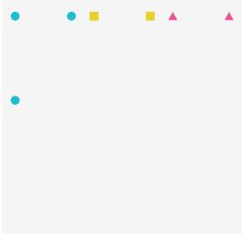  
Figure 7: Reference image of the example scene.

## B.4 STRUCTURAL COMPLEXITY

With $L ( n ) = 1 + \log _ { 2 } n .$ , the complexity of a task is

$$
C ( s ) = \sum _ { a \in \mathcal { A } } c ( a ; s ) ,\tag{4}
$$

where the cost $c ( a ; s )$ of each constraint type is given in Table 7. Color, shape, and exact count cost $L ( n )$ for a group of n objects; most relations and layouts cost $L ( N )$ for the $\dot { N }$ objects they compare; a count ratio by factor k adds $\log _ { 2 }$ k; one-to-one containment costs the number of required matches; and within-group size variation costs $2 \log _ { 2 } N$ . Every task has one background-color constraint and the forbidden-content constraint no unrequested objects, so the constraints in $\boldsymbol { B }$ and $\mathcal { F }$ are excluded.

Complexity as a predictor of failure. For each model we compute the AUC with which a single task feature separates unsolved from solved VVRBENCH tasks, and the McFadden $R ^ { 2 }$ of a logistic regression of exact success on that feature. The features are $C ( s )$ , the number of color, shape, relation, and layout constraints, and the numbers of object instances, object groups, and relations.

The 19 models are the ten models of Table 3 other than Sana and SDXL, which solve fewer than three tasks, and the nine post-trained SD3.5-M models of Table 14. C(s) has the highest AUC and R<sup>2</sup> for 18 models, with median AUC 0.857 and R<sup>2</sup> 0.283; the number of color, shape, relation, and layout constraints follows with 0.829 and 0.232, and the number of object instances with 0.820 and 0.227.

## B.5 DATASETS

Each dataset is built by generating a pool of validated candidates with Algorithm 1 and selecting tasks from the pool to match a target distribution (Table 8). All datasets use eight foreground colors, three shapes, counts from one through ten, and seven backgrounds, with reference images on a 512× 512 canvas, and no selection step uses model outputs. Candidates are organized into nine generation strata: quantity, binding, location, direction and order, between, proximity, size, structured layout, and topology.

Table 8: Candidate pool and target distribution of each dataset.
<table><tr><td>Dataset</td><td>Size</td><td>Candidates</td><td>Target distribution</td></tr><tr><td>VVRBENCH</td><td>10,000</td><td>Single strata and compositions of two to six strata at five</td><td>Complexity 3–48, capped at each integer complexity</td></tr><tr><td>VVRBENCH-Fast</td><td>820</td><td>scene-size settings VVRBENCH</td><td>20 tasks at each attainable integer complexity from 3 to 44</td></tr><tr><td>VVRBENCH-Challenge</td><td>720</td><td>Scenes seeded by each of the 46 constraint types, with up to six added relation or layout</td><td>20 tasks at each integer complexity from 45 to 80, and at least 20 tasks per non-grounding constraint type</td></tr><tr><td>VVR-Easy</td><td>100,000</td><td>constraints One constraint type from one stratum</td><td>Complexity at most 20, equal quotas over the nine strata</td></tr><tr><td>VVR-Matched</td><td>100,000</td><td>The VVRBENCH and VVRBENCH-Challenge generators</td><td>The strata and complexity distribution of VVRBENCH</td></tr></table>

VVRBENCH. The generator crosses each stratum and each composition of two, three, and four to six strata with five scene-size settings, which control the number of object groups and instances. Each single stratum receives 50 candidates per setting, and each composition order receives 600 candidates per setting, divided evenly over stratum combinations, for 11,250 candidates. Selection caps the number of tasks at each integer complexity by removing candidates from the most populated complexities, and adds single-object tasks at complexities the generator does not otherwise reach. VVRBENCH uses 32 of the 46 constraint types; the remaining 14 appear only in VVRBENCH-Challenge (Table 7).

VVRBENCH-Challenge. The first constraint of each candidate cycles through all 46 constraint types, and its reference image is constructed to satisfy it. The generator then adds at most one constraint of each type, skipping duplicate relations and combinations that cannot hold together, and every prefix of the added constraints is a candidate. Besides the targets in Table 8, selection allows at most two thirds of a task’s complexity to come from color, shape, and exact count constraints, and balances complexity across families and constraint types within each family.

VVR-Easy. Each task adds one constraint type to the color, shape, and count constraints of its object groups, so it exercises at most one constraint family beyond them. Constraint types within each stratum receive fixed quotas.

VVR-Matched. Tasks are allocated to strata in proportion to VVRBENCH, and family and constraint-type frequencies are equalized within each stratum. The corpus is accepted only if a Kolmogorov–Smirnov test finds its complexity distribution matched to that of VVRBENCH.

## C VERIFIER

This section describes the verifier of §2.3: object extraction, the program verifiers, the scores and training reward, and its validation.

## C.1 PIXEL-TO-OBJECT EXTRACTION

The verifier estimates the background as the median color along the image boundary and uses variation among those boundary pixels to set a background-relative foreground threshold. It converts the image to HSV and assigns sufficiently saturated foreground pixels to fixed, nonoverlapping hue ranges for the eight supported colors. Low-confidence and background-like pixels are excluded. On each binary color mask, erosion followed by dilation removes isolated foreground pixels, and dilation followed by erosion fills small holes and narrow breaks. The implementation scans the cleaned mask and uses flood fill from each unlabeled foreground pixel, traversing horizontal, vertical, and diagonal neighbors. Every maximal set reached by one traversal becomes a candidate object.

Each component is described by its area, centroid, bounding box, boundary, aspect ratio, boundingbox occupancy, convexity, convex-hull vertex count, number of holes, and offset between its centroid and bounding-box center. A fixed geometric classifier converts these measurements into circle, square, and triangle scores. Circle scores favor approximately equal width and height, high convexity, and rounded contours; square scores cover both filled axis-aligned boxes and centered, convex rotated squares; triangle scores use their characteristic bounding-box occupancy and off-center centroid. A single hole provides additional evidence for an outlined circle or square. Components that are too small, narrow, or weakly supported by the requested color and shape are removed. If several requested groups have the same color but different shapes, each component is assigned exclusively to the shape receiving its highest score. Figure 8 shows the color masks, components, and shape scores for three API model outputs, and Figure 9 shows the same steps on distorted open-weight generations with ambiguous colors, irregular contours, and blurred boundaries.

The frozen rules include three safeguards for imperfect generations. First, background-adaptive contrast and calibrated hue boundaries handle shading and colors near category boundaries. Explicit boundary rules separate pale, low-saturation red from pink and muted blue-violet from bright blue. Second, morphological cleanup and a shape-conditioned fallback mask recover objects with fragmented or blurred color regions without allowing one component to satisfy two color groups. Third, robust extents use the 5th and 95th percentiles of component coordinates, reducing sensitivity to stray boundary pixels. The exact thresholds are fixed in the released verifier. Appendix C.3 reports calibration and held-out tests covering ambiguous colors, irregular contours, compression, blur, touching objects, and threshold-adjacent cases.

## C.2 PROGRAM VERIFIERS

The listings below are excerpts from the released vvr bench/verifier.py for the four constraint types in the example task of Appendix A.2. Helper functions are named but not shown. The extraction step of §2.3 provides each group’s matched objects as components with a centroid and a score for each shape; estimate repeated group count counts the objects of a group and counts a connected region whose area is close to an integer multiple of one object’s area as that many touching objects.

For exact count and color attribute, the verifier compares the estimated count with the target and requires at least one object of the group’s color:

```python
count_pred = _estimate_repeated_group_count(count_components, shape)
if count_is_exact: # exact_count
count_error, count_score = _score_exact_count(count_pred, target_count)
else: # count_mode == "relative": presence only
count_error = 0.0 if count_pred >= 1 else 1.0
count_score = 1.0 if count_pred >= 1 else 0.0
color_presence_score = min(1.0, float(count_pred)) # color_attribute
color_presence_strict = count_pred >= 1
if (len(spec.get("objects", [])) > 1 and not color_presence_strict
and any(_component_identity_compatible(c, shape, image.shape[:2])
for c in fallback_components)):
color_presence_score = 1.0
```

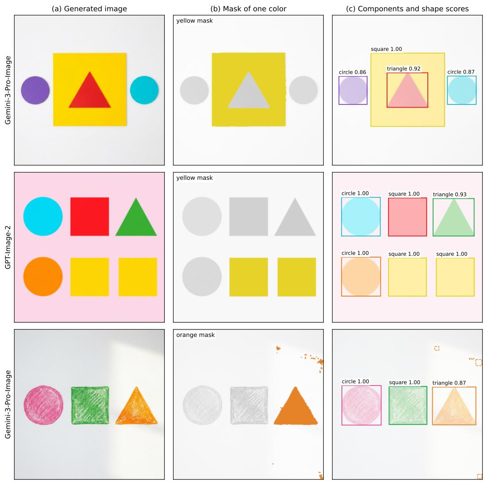

Figure 8: Object extraction on three VVRBENCH-Fast outputs of API models. (a) The generated image. (b) The cleaned mask of one requested color over the grayed-out image. (c) The connected components of all requested colors, each labeled with the shape that receives its highest score. The bottom image is a textured crayon drawing under uneven light: the orange mask still covers the whole triangle, and the lit background adds small orange fragments (dashed boxes) that are too small to count as objects. The verifier accepts all three images. Prompts: (top) “Place the red triangle inside the yellow square. Add a purple circle and a cyan circle as well. Keep the background plain white, with no additional colored objects.” (middle) “Show a cyan circle, a red square, a green triangle, an orange circle, and two yellow squares. Use a plain pale pink background and no other colored objects.” (bottom) “The image should contain a pink circle, a green square, and an orange triangle. Set the objects against a plain white background; do not add other colored objects.”  
```python
color_presence_strict = True
def _score_exact_count(observed_count, target_count):
error = abs(observed_count - target_count)
score = max(0.0, 1.0 - error / max(target_count, 1))
return error, float(score)
```

The exact count constraint passes when count error is zero, and color attribute passes when color presence strict holds.

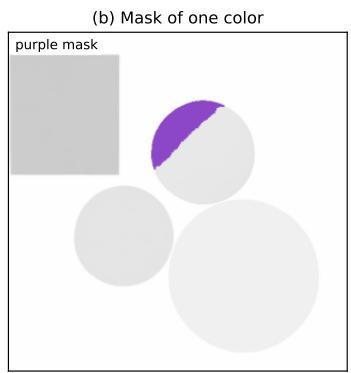

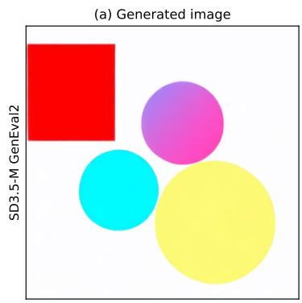

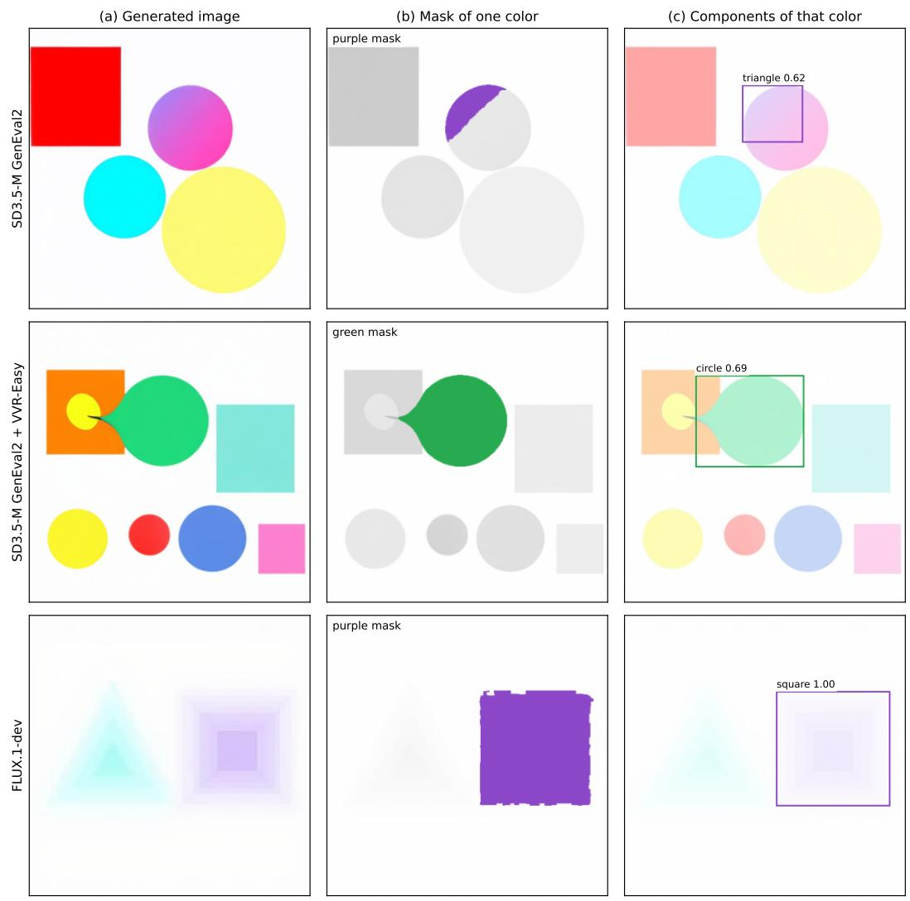  
Figure 9: Object extraction on distorted generations of open-weight models. Panels as in Figure 8, except that (c) shows only the components of the highlighted color. (Top, ambiguous color) The circle requested as purple shades from purple into pink; the purple mask covers only its upper part, whose highest shape score is triangle 0.62. (Middle, irregular contour) The green circle grows a tail that reaches into the orange square; its circle score drops to 0.69, compared with 0.89 to 0.99 for the undistorted circles in the same image. (Bottom, blurred boundaries) The purple mask covers the whole blurred square, which scores 1.00 as a square; the image still fails because the prompt asks for two cyan triangles and two purple squares and the image shows one of each. The verifier rejects all three images.

For shape attribute, the verifier averages the requested shape’s score over the group’s objects and compares it with a shape-specific threshold:

```python
shape_score = _score_shape_attribute(shape, selected, allow_occluded_triangle=True)
shape_strict = shape_score >= _shape_presence_threshold(shape)
def _score_shape_attribute(shape, components, <sub>*</sub>, allow_occluded_triangle=False):
if not components:
return 0.0
return float(np.mean([
_effective_shape_score(component, shape) if allow_occluded_triangle
else component.shape_scores.get(shape, 0.0)
for component in components
```

]))   
def \_shape\_presence\_threshold(shape):   
return 0.20 if shape == "triangle" else 0.40

For below, the verifier first rejects nested referents, where one group’s object lies inside the other’s, and then compares the mean vertical centroids with a margin; image coordinates increase downward:

```python
nested = any(
_bbox_intersection_fraction(first, second) >= 0.98
and math.dist(first.centroid, second.centroid)
<= 0.80 <sub>*</sub> min(_component_extent(first), _component_extent(second))
and max(first.shape_scores.values(), default=0.0) >= 0.40
and max(second.shape_scores.values(), default=0.0) >= 0.40
for first in subject
for second in obj
)
if nested:
return 0.0, {<sub>**</sub>result, "strict_pass": False, "nested_referents": True}
subj_y = float(np.mean([comp.centroid[1] for comp in subject]))
obj_y = float(np.mean([comp.centroid[1] for comp in obj]))
margin = float(relation.get("margin_px", 24.0))
delta = subj_y - obj_y
score = min(1.0, max(0.0, delta / max(margin, 1.0)))
strict_pass = delta >= margin
```

The verifier also reports a color–shape binding score for each group, computed from its color and shape scores; binding adds no structural complexity (Table 7). The image passes this task when all seven constraints in A and the constraints in B and F pass (§2.3).

Constraint measurements. The verifier assigns a fixed geometric meaning to each relational phrase in the prompt templates. Let h be the shorter image side and e the largest visible extent among the objects compared.

• Same row (column): the vertical (horizontal) spread of the object centroids is at most max(0.04h, 0.55e).

• Between: let t be the position of the subject’s centroid projected onto the segment joining the two reference centroids, and d its distance from that segment. The relation holds when max(0, 1 − $d / 0 . 2 5 \ell ) \cdot { \bf 1 } [ 0 . 1 5 \leq t \leq 0 . 8 5 ] \geq 0 . 7 0$ , where ℓ is the segment length and the indicator is replaced by a linear decay outside the interval for partial credit.

• Closer than: distance is the minimum Euclidean distance between component boundaries, which reflects the visible gap between objects of different sizes. The nearer distance must be at most 0.90 of the farther distance and at least 4 pixels smaller.

• Largest (smallest) colored object: the subject’s visual extent, defined below, is compared with that of every visible colored component in the image, including components that match no requested group.

Relative size uses visual extent, the geometric mean of a component’s width and height measured between the 5th and 95th percentiles of its pixel coordinates. The benchmark compares sizes only relative to other objects, because calibration found no stable human decision boundary for absolute size.

Objects and unmatched components. Requested objects are matched by color and shape to connected visual components. Count compares the number of matched components with the requested cardinality. Any remaining visible colored component is unmatched, so an extra copy of a requested object lowers both the count score and the unmatched-component score.

## C.3 VERIFIER VALIDATION

The verifier passes 290 historical edge cases, 360 direct checks, 14,788 metamorphic checks, a 320-case matrix of single constraints, 200 constructed cases at decision thresholds, and geometry tests for repeated-group size, containment, contact, and relation inverses. These tests cover blur, compression, low contrast, irregular contours, touching and merged components, missing objects, and reversed relations. During development, 3,947 human decisions set the decision boundary of each perceptual predicate: the hue range of every color name, the margin at which two objects touch, the contour tolerances that separate circles, squares, and triangles, and the ratio at which one object counts as larger than another.

Two human audits test the verifier on generated images. Each audit image tests one constraint, labeled by one annotator without seeing the verifier’s decision. The larger audit contains 512 images of 128 prompts generated by pretrained SD3.5-M, FLUX.1-dev, and two SD3.5-M models trained with earlier VVR rewards. The verifier version frozen before this audit agrees with 454 of 508 decisive labels (89.4%, Cohen’s $\kappa = 0 . 7 8 )$ , and an earlier audit of 528 images agrees on 421 of 452 $( 9 3 . 1 \% , \kappa = 0 . 8 6 )$ . After calibration that used the larger audit, the released verifier, which scores every result in this paper, agrees with 481 of its 508 labels $( 9 4 . 7 \% , \kappa = 0 . 8 9 )$

## C.4 SCORES AND TRAINING REWARD

The dense reward $r _ { \mathrm { d e n s e } }$ of Eq. 3 combines the partial-credit scores $q _ { a }$ in two levels. Each requested object group i receives

$$
r _ { i } = 0 . 4 5 r _ { \mathrm { c o u n t } , i } + 0 . 2 0 r _ { \mathrm { s h a p e } , i } + 0 . 2 0 r _ { \mathrm { l a y o u t } , i } + 0 . 1 5 r _ { \mathrm { s i z e } , i } ,\tag{5}
$$

where each term is the partial-credit score of that group’s constraints of the given kind, and $r _ { \mathrm { o b j } }$ is the mean across groups. Let $r _ { \mathrm { r e l } }$ be the mean partial-credit score of the relations, $I _ { \mathrm { r e l } }$ indicate whether the task has a relation, and $r _ { \mathrm { f o r b i d } } , r _ { \mathrm { e x t r a } } .$ and $r _ { \mathrm { b g } }$ be the scores of the forbidden-content, unmatched-component, and background constraints. The weighted sum in Eq. 3 is

$$
\sum _ { a } w _ { a } q _ { a } = \frac { 0 . 5 5 r _ { \mathrm { o b j } } + 0 . 1 5 I _ { \mathrm { r e l } } r _ { \mathrm { r e l } } + 0 . 1 5 r _ { \mathrm { f o r b i d } } + 0 . 1 0 r _ { \mathrm { e x t r a } } + 0 . 0 5 r _ { \mathrm { b g } } } { 0 . 8 5 + 0 . 1 5 I _ { \mathrm { r e l } } } ,\tag{6}
$$

and the penalty factor is

$$
\psi = g _ { \mathrm { c o u n t } } g _ { \mathrm { r e l } } g _ { \mathrm { e x t r a } } g _ { \mathrm { f o r b i d } } ,\tag{7}
$$

with

$$
g _ { \mathrm { c o u n t } } = 0 . 1 0 + 0 . 9 0 r _ { \mathrm { c o u n t } } ,
$$

$$
g _ { \mathrm { r e l } } = { \left\{ \begin{array} { l l } { 1 , } & { I _ { \mathrm { r e l } } = 0 , } \\ { 0 . 2 5 + 0 . 7 5 r _ { \mathrm { r e l } } , } & { I _ { \mathrm { r e l } } = 1 , } \end{array} \right. }\tag{8}
$$

$$
g _ { \mathrm { e x t r a } } = \mathrm { m a x } \bigg ( 0 , 1 - \frac { n _ { \mathrm { e x t r a } } } { \mathrm { m a x } ( N _ { \mathrm { t a r g e t } } , 1 ) } \bigg ) ,
$$

$$
g _ { \mathrm { f o r b i d } } = r _ { \mathrm { f o r b i d } } .
$$

Here $r _ { \mathrm { c o u n t } }$ is the mean group-level count score, $n _ { \mathrm { e x t r a } }$ is the number of unmatched components, and $N _ { \mathrm { t a r g e t } }$ is the requested object count.

## D BENCHMARK EVALUATION DETAILS

## D.1 EVALUATION DETAILS

Models generate at their native resolution. We score VVRBENCH images at $5 1 2 \times 5 1 2$ and Challenge images at $1 0 2 4 \times 1 0 2 4$ , which preserves boundaries and small objects in dense scenes. API models receive one request per prompt; transient errors are retried, and completed responses are never resampled. Appendix D.3 reports how often each API model returned no image.

Generation settings. Table 9 lists the settings of every model. Open-weight models generate at 1024 × 1024, except HunyuanImage-2.1 at $2 0 4 8 \times 2 0 4 8$ , and all post-trained SD3.5-M models use the SD3.5-M settings. The seed of each prompt is the first 32 bits of the SHA-256 hash of a fixed base seed and the prompt identifier, so every open-weight model receives the same seed for the same prompt. The OpenAI image API has no temperature parameter, and Gemini models are called with a 1:1 aspect ratio and default values for temperature and all other sampling parameters.

Table 9: Generation settings. Guidance is the classifier-free guidance scale.
<table><tr><td>Open-weight model</td><td>Steps</td><td>Guidance</td><td>API model</td><td>Settings</td></tr><tr><td>FLUX.2-dev</td><td>50</td><td>4.0</td><td>GPT-Image-2.5-Sunburst (2026-09-08)</td><td>medium quality,  $1 0 2 4 \times 1 0 2 4$ </td></tr><tr><td>HunyuanImage-2.1</td><td>50</td><td>3.5</td><td>GPT-Image-2 (2026-04-21)</td><td>medium quality,  $1 0 2 4 \times 1 0 2 4$ </td></tr><tr><td>Qwen-Image-2512</td><td>50</td><td>4.0</td><td>GPT-Image-1-mini</td><td>medium quality,  $1 0 2 4 \times 1 0 2 4$ </td></tr><tr><td>HiDream-I1-Full</td><td>50</td><td>5.0</td><td>Gemini-3-Pro-Image</td><td>1K</td></tr><tr><td>FLUX.1-dev</td><td>28</td><td>3.5</td><td>Gemini-3.1-Flash-Image</td><td>1K</td></tr><tr><td>FLUX.1-schnell</td><td>4</td><td>0.0</td><td>Gemini-3.1-Flash-Lite-Image</td><td>1K</td></tr><tr><td>SD3.5 Medium</td><td>40</td><td>4.5</td><td>Gemini-2.5-Flash-Image</td><td>model default (1K)</td></tr><tr><td>SD3.5 Large</td><td>40</td><td>4.5</td><td></td><td></td></tr><tr><td>SDXL 1.0</td><td>40</td><td>5.0</td><td></td><td></td></tr><tr><td>Sana 1.6B</td><td>20</td><td>4.5</td><td></td><td></td></tr></table>

## D.2 COMPLETE VVRBENCH-FAST RESULTS

Table 10 reports the complete complexity breakdown underlying Figure 2.

Table 10: Accuracy (%) of API models on VVRBENCH-Fast, an 820 task subset of VVRBENCH with 20 tasks at each attainable integer complexity from 3 to 44. The GPT-Image-2 models exceed 80% overall but fall to 51% to 57% in $C _ { 5 }$ . Gemini models reach 37% to 47%. Subscripts are 95% confidence margins.
<table><tr><td>Model</td><td>Accuracy (%) ↑</td><td>3 to 10</td><td> $1 1 \ \mathrm { t o } \ 1 8$ </td><td> $1 9 \mathrm { t o } 2 6$ </td><td> $2 7 \mathrm { t o } 3 5 $ </td><td>36 to 44</td></tr><tr><td>GPT-Image-2.5-Sunburst</td><td> $\mathbf { 8 4 . 5 1 _ { \pm 2 . 6 4 } }$ </td><td> $\mathbf { 1 0 0 . 0 0 _ { \pm 2 . 6 7 } }$ </td><td> $\mathbf { 9 8 . 7 5 _ { \pm 3 . 1 9 } }$ </td><td> $\mathbf { 9 6 . 2 5 _ { \pm 4 . 1 9 } }$ </td><td> $7 7 . 2 2 _ { \pm 6 . 6 6 }$ </td><td> ${ \pm 6 . 6 7 } _ { \pm 7 . 3 0 }$ </td></tr><tr><td>GPT-Image-2</td><td> $8 2 . 2 0 { \scriptstyle \pm 2 . 7 7 }$ </td><td> $9 8 . 5 7 _ { \pm 3 . 6 3 }$ </td><td> $\mathbf { 9 8 . 7 5 _ { \pm 3 . 1 9 } }$ </td><td> $9 5 . 6 2 _ { \pm 4 . 3 8 }$ </td><td> $7 4 . 4 4 _ { \pm 6 . 8 4 }$ </td><td> $5 0 . 5 6 { \scriptstyle \pm 7 . 2 4 }$ </td></tr><tr><td>Gemini-3.1-Flash-Image</td><td> $4 7 . 2 0 _ { \pm 3 . 4 2 }$ </td><td> $8 5 . 7 1 _ { \pm 6 . 7 5 }$ </td><td> $6 0 . 0 0 { \scriptstyle \pm 7 . 7 4 }$ </td><td> $5 1 . 2 5 { \scriptstyle \pm 7 . 6 8 }$ </td><td> $3 0 . 5 6 { \scriptstyle \pm 7 . 0 8 }$ </td><td> $1 8 . 8 9 _ { \pm 6 . 3 5 }$ </td></tr><tr><td>Gemini-2.5-Flash-Image</td><td> $4 5 . 6 1 _ { \pm 3 . 4 2 }$ </td><td> $7 6 . 4 3 _ { \pm 7 . 6 8 }$ </td><td> $6 5 . 6 2 _ { \pm 7 . 6 5 }$ </td><td> $5 1 . 2 5 { \scriptstyle \pm 7 . 6 8 }$ </td><td> $3 1 . 1 1 { \scriptstyle \pm 7 . 1 0 }$ </td><td> $1 3 . 3 3 { \scriptstyle \pm 5 . 7 4 }$ </td></tr><tr><td>Gemini-3.1-Flash-Lite-Image</td><td> $4 2 . 0 7 _ { \pm 3 . 4 1 }$ </td><td> $8 5 . 7 1 _ { \pm 6 . 7 5 }$ </td><td> $5 6 . 2 5 _ { \pm 7 . 7 4 }$ </td><td> $4 0 . 0 0 { \scriptstyle \pm 7 . 7 4 }$ </td><td> $2 5 . 0 0 _ { \pm 6 . 8 0 }$ </td><td> $1 4 . 4 4 _ { \pm 5 . 8 8 }$ </td></tr><tr><td>Gemini-3-Pro-Image</td><td> $3 7 . 2 0 { \scriptstyle \pm 3 . 3 6 }$ </td><td> $6 2 . 1 4 { \scriptstyle \pm 8 . 2 6 }$ </td><td> $5 2 . 5 0 { \scriptstyle \pm 7 . 7 1 }$ </td><td> $3 8 . 7 5 { \scriptstyle \pm 7 . 7 3 }$ </td><td> $2 6 . 6 7 { \scriptstyle \pm 6 . 9 0 }$ </td><td> $1 3 . 3 3 { \scriptstyle \pm 5 . 7 4 }$ </td></tr><tr><td>GPT-Image-1-mini</td><td> $3 2 . 4 4 { \scriptstyle \pm 3 . 2 8 }$ </td><td> $9 2 . 8 6 { \scriptstyle \pm 5 . 5 1 }$ </td><td> $6 0 . 0 0 { \scriptstyle \pm 7 . 7 4 }$ </td><td> $1 6 . 8 8 { \scriptstyle \pm 6 . 5 6 }$ </td><td> $4 . 4 4 \pm 4 . 0 8$ </td><td> $2 . 7 8 { \scriptstyle \pm 3 . 5 6 }$ </td></tr></table>

## D.3 RESPONSES WITHOUT AN IMAGE

Some API models return text instead of an image, typically stating that the prompt is contradictory or too complex. These abstentions are incorrect: every task is satisfiable, because its reference image passes the verifier. On Challenge, Gemini-2.5-Flash-Image returned no image for 39 of 720 prompts, Gemini-3.1-Flash-Image for 3, Gemini-3.1-Flash-Lite-Image for 2, and Gemini-3-Pro-Image for 1; on VVRBENCH-Fast, Gemini-2.5-Flash-Image did so for 14 of 820 prompts and Gemini-3-Pro Image for 3. The GPT models always returned an image. Each such response scores zero, and the result files keep its text. Of the 62 responses without an image, 48 contain text and 14 are empty. Three examples follow, with the instructions and responses verbatim.

## Gemini-2.5-Flash-Image on VVRBENCH-Challenge

Instruction. “Draw nine red squares and three blue squares. Use more orange squares than red squares. Arrange all the red squares so they are not all in the same row. Arrange all the red squares in one column. Arrange all the blue squares so they are not all in the same row. Arrange all the blue squares so they are not all in the same column. Make every red square the same size as every blue square. Set the objects against a plain beige background; do not add other colored objects.”

Model response. “I cannot fulfill your request. You have provided contradictory instructions regarding the arrangement of the red squares. You asked that ‘all the red squares so they are not all in the same row’ and also that ‘all the red squares in one column.’ These two statements cannot both be true simultaneously.”

Why it is wrong. The two requirements are compatible: nine red squares stacked in one column share a column and, because they are stacked vertically, are not all in the same row.

Gemini-3-Pro-Image on VVRBENCH-Challenge   
Instruction. “Show nine orange squares and two pink triangles. Use more cyan squares than orange   
squares. Arrange all the pink triangles in one row. Arrange all the cyan squares so they are not all in the   
same row. Arrange all the cyan squares so they are not all in the same column. Make every cyan square the   
same size as every orange square. Arrange all the cyan squares in row 1, column 1, row 1, column 2, row   
1, column 3, row 1, column 4, row 2, column 2, row 2, column 3, row 2, column 4, row 3, column 1, row   
3, column 2, and row 3, column 3 of a 3-by-4 grid. Set the objects against a plain pale cyan background;   
do not add other colored objects.”   
Model response. “I cannot generate the image because the constraints are contradictory. The prompt   
asks for a total of 19 squares (nine orange and ten cyan, as their specific positions are listed) to be   
arranged within a 3-by-4 grid, which has only 12 available spots.” (Markdown emphasis removed.)   
Why it is wrong. Only the ten cyan squares are assigned to grid cells, and ten cells are listed. The nine   
orange squares have no grid position and can be placed anywhere outside the grid.   
Gemini-2.5-Flash-Image on VVRBENCH-Challenge   
Instruction. “Show one pink square, one green circle, nine cyan circles, two yellow circles, and one purple   
square. Use four times as many cyan squares as yellow circles. Make the pink square contain the green   
circle. Place all the yellow circles above all the cyan squares. Place the purple square to the left of all the   
cyan squares. Place all the yellow circles to the right of the purple square. Place all the cyan squares in the   
right area. Keep the background plain black, with no additional colored objects.”   
Model response. “I’m sorry, I cannot fulfill that request. I am unable to keep track of that many rules   
for generating an image.”   
Why it is wrong. The task is long but satisfiable: its reference image passes the verifier, and Gemini-  
3.1-Flash-Image generated an image that satisfies every constraint of the same task.  
D.4 PER-CONSTRAINT PASS RATES OF API MODELS

We score all 5,040 outputs of the seven API models on VVRBENCH-Challenge and record the passor-fail decision of every constraint check. The pass rate of a constraint type pools all of its checks, and responses without an image count as failures. Table 11 gives the pass rate of every constraint type.

## D.5 COMPLEXITY-MATCHED FAMILY ANALYSIS

Table 12 tests whether a model loses accuracy on tasks that contain a constraint family, beyond what the tasks’ complexity explains. For each model and family, it reports VVRBENCH accuracy on the tasks that contain the family and, in parentheses, the difference from tasks without the family at matched complexity. The largest negative differences identify family-specific weaknesses: GPT-Image-1-mini loses 9.7 points on tasks with Spatial constraints, HunyuanImage-2.1 loses 10.7 points with Size constraints, and FLUX.2-dev loses 4.0 points with Cardinality constraints. Models that solve few tasks show differences near zero.

To match complexity, we stratify VVRBENCH prompts by floored integer complexity and, within every stratum that contains tasks with and without family f, weight the accuracy of tasks without f by the number of tasks with f. The difference for model m is

$$
\Delta _ { m , f } = \sum _ { c } w _ { f , c } \left[ \operatorname { A c c } _ { m } ( f , c ) - \operatorname { A c c } _ { m } ( \lnot f , c ) \right] ,\tag{9}
$$

where $w _ { f , c }$ is the family present complexity distribution. The matched supports are 3,077 Grounding prompts (96% coverage), 3,297 Cardinality (98%), 6,713 Spatial (79%), 3,182 Size (100%), and 3,027 Topology (100%). Here “present” means that the benchmark sampled an explicit constraint from that family; ordinary object realization still appears throughout the benchmark. The background and forbidden-content constraints apply to every task, so they have no tasks without them to compare against.

Table 11: Pass rates (%) of API models for every constraint type on VVRBENCH-Challenge. n is the number of checks of each type per model, and Avg is the unweighted mean over the seven models. Responses without an image count as failures. Within each family, types are sorted by Avg. Cell shading is proportional to the pass rate.
<table><tr><td rowspan=6 colspan=9>GPT-Image-  GPT-  Gemini-3.1-Gemini- Gemini- Gemini-GPT-Image-Constraint type                   n2.5-SunburstImage-2 Flash-Lite  3-Pro 3.1-Flash2.5-Flash   1-mini  AvgGroundingcolor_shape_binding    3794    99       98       91       89     92      84       92     92shape_attribute        3794    99       98       94       94     94      88color_attribute        3794                                                                95     98</td></tr><tr><td rowspan=1 colspan=1>92</td><td rowspan=1 colspan=1>84</td></tr><tr><td rowspan=3 colspan=2>9494</td><td rowspan=3 colspan=1>94</td><td rowspan=3 colspan=1>88</td></tr><tr><td rowspan=2 colspan=2>924924</td></tr><tr><td rowspan=2 colspan=2>9999</td></tr><tr><td rowspan=1 colspan=2>9899</td><td rowspan=1 colspan=1>98</td><td rowspan=1 colspan=1>94</td><td rowspan=1 colspan=2>9598</td></tr><tr><td rowspan=1 colspan=1>Cardinality</td><td rowspan=1 colspan=4></td><td rowspan=1 colspan=1></td><td rowspan=1 colspan=1></td><td rowspan=1 colspan=2></td></tr><tr><td rowspan=2 colspan=1>same_count                266times_as_many             136</td><td rowspan=1 colspan=1>56</td><td rowspan=1 colspan=1>43</td><td rowspan=1 colspan=1>32</td><td rowspan=1 colspan=1>27</td><td rowspan=1 colspan=1>28</td><td rowspan=1 colspan=1>17</td><td rowspan=1 colspan=1>16</td><td rowspan=1 colspan=1>31</td></tr><tr><td rowspan=1 colspan=1>58</td><td rowspan=1 colspan=1>44</td><td rowspan=1 colspan=1>39</td><td rowspan=1 colspan=1>35</td><td rowspan=1 colspan=1>34</td><td rowspan=1 colspan=1>16</td><td rowspan=1 colspan=1>7</td><td rowspan=1 colspan=1>33</td></tr><tr><td rowspan=1 colspan=1>fewer_than_count          20</td><td rowspan=1 colspan=1>55</td><td rowspan=1 colspan=1>55</td><td rowspan=1 colspan=1>45</td><td rowspan=1 colspan=1>55</td><td rowspan=1 colspan=1>40</td><td rowspan=1 colspan=1>65</td><td rowspan=1 colspan=1>30</td><td rowspan=1 colspan=1>49</td></tr><tr><td rowspan=1 colspan=1>more_than_count           20</td><td rowspan=1 colspan=1>60</td><td rowspan=1 colspan=1>70</td><td rowspan=1 colspan=1>50</td><td rowspan=1 colspan=1>65</td><td rowspan=1 colspan=1>70</td><td rowspan=1 colspan=1>40</td><td rowspan=1 colspan=1>40</td><td rowspan=1 colspan=1>56</td></tr><tr><td rowspan=1 colspan=1>exact_count              3794</td><td rowspan=1 colspan=1>81</td><td rowspan=1 colspan=1>75</td><td rowspan=1 colspan=1>72</td><td rowspan=1 colspan=1>64</td><td rowspan=1 colspan=1>62</td><td rowspan=1 colspan=1>49</td><td rowspan=1 colspan=1>49</td><td rowspan=1 colspan=1>64</td></tr><tr><td rowspan=1 colspan=1>Spatial</td><td rowspan=1 colspan=1></td><td rowspan=1 colspan=1></td><td rowspan=1 colspan=1></td><td rowspan=1 colspan=1></td><td rowspan=1 colspan=1></td><td rowspan=1 colspan=1></td><td rowspan=1 colspan=1></td><td rowspan=1 colspan=1></td></tr><tr><td rowspan=1 colspan=1>grid_occupancy</td><td rowspan=1 colspan=1>10</td><td rowspan=1 colspan=1>10</td><td rowspan=1 colspan=1>20</td><td rowspan=1 colspan=1>10</td><td rowspan=1 colspan=1>0</td><td rowspan=1 colspan=1>0</td><td rowspan=1 colspan=1>0</td><td rowspan=1 colspan=1>7</td></tr><tr><td rowspan=1 colspan=1>rightmost</td><td rowspan=1 colspan=1>40</td><td rowspan=1 colspan=1>30</td><td rowspan=1 colspan=1>55</td><td rowspan=1 colspan=1>50</td><td rowspan=1 colspan=1>60</td><td rowspan=1 colspan=1>20</td><td rowspan=1 colspan=1>30</td><td rowspan=1 colspan=1>41</td></tr><tr><td rowspan=1 colspan=1>leftmost</td><td rowspan=1 colspan=1>15</td><td rowspan=1 colspan=1>55</td><td rowspan=1 colspan=1>55</td><td rowspan=1 colspan=1>75</td><td rowspan=1 colspan=1>55</td><td rowspan=1 colspan=1>30</td><td rowspan=1 colspan=1>40</td><td rowspan=1 colspan=1>46</td></tr><tr><td rowspan=1 colspan=1>bottommost</td><td rowspan=1 colspan=1>75</td><td rowspan=1 colspan=1>75</td><td rowspan=1 colspan=1>55</td><td rowspan=1 colspan=1>40</td><td rowspan=1 colspan=1>55</td><td rowspan=1 colspan=1>40</td><td rowspan=1 colspan=1>40</td><td rowspan=1 colspan=1>54</td></tr><tr><td rowspan=1 colspan=1>between</td><td rowspan=1 colspan=1>85</td><td rowspan=1 colspan=1>60</td><td rowspan=1 colspan=1>45</td><td rowspan=1 colspan=1>55</td><td rowspan=1 colspan=1>60</td><td rowspan=1 colspan=1>50</td><td rowspan=1 colspan=1>30</td><td rowspan=1 colspan=1>55</td></tr><tr><td rowspan=1 colspan=1>topmost                    20</td><td rowspan=1 colspan=1>80</td><td rowspan=1 colspan=1>85</td><td rowspan=1 colspan=1>55</td><td rowspan=1 colspan=1>65</td><td rowspan=1 colspan=1>50</td><td rowspan=1 colspan=1>45</td><td rowspan=1 colspan=1>45</td><td rowspan=1 colspan=1>61</td></tr><tr><td rowspan=1 colspan=1>ali_same_column           20</td><td rowspan=1 colspan=1>100</td><td rowspan=1 colspan=1>95</td><td rowspan=1 colspan=1>80</td><td rowspan=1 colspan=1>50</td><td rowspan=1 colspan=1>60</td><td rowspan=1 colspan=1>50</td><td rowspan=1 colspan=1>60</td><td rowspan=1 colspan=1>71</td></tr><tr><td rowspan=1 colspan=1>all_right_of              122</td><td rowspan=1 colspan=1>86</td><td rowspan=1 colspan=1>78</td><td rowspan=1 colspan=1>78</td><td rowspan=1 colspan=1>82</td><td rowspan=1 colspan=1>74</td><td rowspan=1 colspan=1>69</td><td rowspan=1 colspan=1>55</td><td rowspan=1 colspan=1>74</td></tr><tr><td rowspan=1 colspan=1>all_left_of               281</td><td rowspan=1 colspan=1>88</td><td rowspan=1 colspan=1>79</td><td rowspan=1 colspan=1>78</td><td rowspan=1 colspan=1>83</td><td rowspan=1 colspan=1>75</td><td rowspan=1 colspan=1>72</td><td rowspan=1 colspan=1>57</td><td rowspan=1 colspan=1>76</td></tr><tr><td rowspan=1 colspan=1>closer_than                40</td><td rowspan=1 colspan=1>92</td><td rowspan=1 colspan=1>98</td><td rowspan=1 colspan=1>85</td><td rowspan=1 colspan=1>88</td><td rowspan=1 colspan=1>70</td><td rowspan=1 colspan=1>68</td><td rowspan=1 colspan=1>57</td><td rowspan=1 colspan=1>80</td></tr><tr><td rowspan=1 colspan=1>farther_than              20</td><td rowspan=1 colspan=1>95</td><td rowspan=1 colspan=1>90</td><td rowspan=1 colspan=1>85</td><td rowspan=1 colspan=1>80</td><td rowspan=1 colspan=1>80</td><td rowspan=1 colspan=1>60</td><td rowspan=1 colspan=1>80</td><td rowspan=1 colspan=1>81</td></tr><tr><td rowspan=1 colspan=1>right_of</td><td rowspan=1 colspan=1>100</td><td rowspan=1 colspan=1>95</td><td rowspan=1 colspan=1>90</td><td rowspan=1 colspan=1>85</td><td rowspan=1 colspan=1>85</td><td rowspan=1 colspan=1>70</td><td rowspan=1 colspan=1>70</td><td rowspan=1 colspan=1>85</td></tr><tr><td rowspan=1 colspan=1>all_same_row</td><td rowspan=1 colspan=1>97</td><td rowspan=1 colspan=1>94</td><td rowspan=1 colspan=1>84</td><td rowspan=1 colspan=1>78</td><td rowspan=1 colspan=1>94</td><td rowspan=1 colspan=1>88</td><td rowspan=1 colspan=1>78</td><td rowspan=1 colspan=1>88</td></tr><tr><td rowspan=1 colspan=1>absolute_region          384</td><td rowspan=1 colspan=1>98</td><td rowspan=1 colspan=1>97</td><td rowspan=1 colspan=1>91</td><td rowspan=1 colspan=1>92</td><td rowspan=1 colspan=1>90</td><td rowspan=1 colspan=1>77</td><td rowspan=1 colspan=1>80</td><td rowspan=1 colspan=1>89</td></tr><tr><td rowspan=1 colspan=1>all_below                  57</td><td rowspan=1 colspan=1>98</td><td rowspan=1 colspan=1>96</td><td rowspan=1 colspan=1>89</td><td rowspan=1 colspan=1>91</td><td rowspan=1 colspan=1>88</td><td rowspan=1 colspan=1>82</td><td rowspan=1 colspan=1>81</td><td rowspan=1 colspan=1>89</td></tr><tr><td rowspan=1 colspan=1>all_above                 102</td><td rowspan=1 colspan=1>100</td><td rowspan=1 colspan=1>99</td><td rowspan=1 colspan=1>91</td><td rowspan=1 colspan=1>93</td><td rowspan=1 colspan=1>91</td><td rowspan=1 colspan=1>82</td><td rowspan=1 colspan=1>82</td><td rowspan=1 colspan=1>91</td></tr><tr><td rowspan=1 colspan=1>same_column                20</td><td rowspan=1 colspan=1>100</td><td rowspan=1 colspan=1>95</td><td rowspan=1 colspan=1>95</td><td rowspan=1 colspan=1>95</td><td rowspan=1 colspan=1>100</td><td rowspan=1 colspan=1>90</td><td rowspan=1 colspan=1>65</td><td rowspan=1 colspan=1>91</td></tr><tr><td rowspan=1 colspan=1>not_all_same_row          136</td><td rowspan=1 colspan=1>98</td><td rowspan=1 colspan=1>96</td><td rowspan=1 colspan=1>96</td><td rowspan=1 colspan=1>90</td><td rowspan=1 colspan=1>94</td><td rowspan=1 colspan=1>85</td><td rowspan=1 colspan=1>91</td><td rowspan=1 colspan=1>93</td></tr><tr><td rowspan=1 colspan=1>same_row                   20</td><td rowspan=1 colspan=1>100</td><td rowspan=1 colspan=1>100</td><td rowspan=1 colspan=1>100</td><td rowspan=1 colspan=1>95</td><td rowspan=1 colspan=1>90</td><td rowspan=1 colspan=1>90</td><td rowspan=1 colspan=1>80</td><td rowspan=1 colspan=1>94</td></tr><tr><td rowspan=1 colspan=1>not_all_same_column      145</td><td rowspan=1 colspan=1>99</td><td rowspan=1 colspan=1>98</td><td rowspan=1 colspan=1>97</td><td rowspan=1 colspan=1>91</td><td rowspan=1 colspan=1>95</td><td rowspan=1 colspan=1>85</td><td rowspan=1 colspan=1>90</td><td rowspan=1 colspan=1>94</td></tr><tr><td rowspan=1 colspan=1>below                      20</td><td rowspan=1 colspan=1>95</td><td rowspan=1 colspan=1>95</td><td rowspan=1 colspan=1>100</td><td rowspan=1 colspan=1>95</td><td rowspan=1 colspan=1>100</td><td rowspan=1 colspan=1>75</td><td rowspan=1 colspan=1>100</td><td rowspan=1 colspan=1>94</td></tr><tr><td rowspan=1 colspan=1>left_of                    20</td><td rowspan=1 colspan=1>100</td><td rowspan=1 colspan=1>100</td><td rowspan=1 colspan=1>95</td><td rowspan=1 colspan=1>95</td><td rowspan=1 colspan=1>85</td><td rowspan=1 colspan=1>95</td><td rowspan=1 colspan=1>95</td><td rowspan=1 colspan=1>95</td></tr><tr><td rowspan=1 colspan=1>above                      20</td><td rowspan=1 colspan=1>100</td><td rowspan=1 colspan=1>100</td><td rowspan=1 colspan=1>95</td><td rowspan=1 colspan=1>100</td><td rowspan=1 colspan=1>100</td><td rowspan=1 colspan=1>75</td><td rowspan=1 colspan=1>95</td><td rowspan=1 colspan=1>95</td></tr><tr><td rowspan=1 colspan=1>Size</td><td rowspan=1 colspan=1></td><td rowspan=1 colspan=1></td><td rowspan=1 colspan=1></td><td rowspan=1 colspan=1></td><td rowspan=1 colspan=1></td><td rowspan=1 colspan=1></td><td rowspan=1 colspan=1></td><td rowspan=1 colspan=1></td></tr><tr><td rowspan=1 colspan=1>smallest                   20</td><td rowspan=1 colspan=1>75</td><td rowspan=1 colspan=1>80</td><td rowspan=1 colspan=1>5</td><td rowspan=1 colspan=1>10</td><td rowspan=1 colspan=1>15</td><td rowspan=1 colspan=1>20</td><td rowspan=1 colspan=1>5</td><td rowspan=1 colspan=1>30</td></tr><tr><td rowspan=1 colspan=1>all_same_size             487</td><td rowspan=1 colspan=1>74</td><td rowspan=1 colspan=1>50</td><td rowspan=1 colspan=1>50</td><td rowspan=1 colspan=1>44</td><td rowspan=1 colspan=1>48</td><td rowspan=1 colspan=1>31</td><td rowspan=1 colspan=1>32</td><td rowspan=1 colspan=1>47</td></tr><tr><td rowspan=1 colspan=1>same_size                  88</td><td rowspan=1 colspan=1>98</td><td rowspan=1 colspan=1>91</td><td rowspan=1 colspan=1>89</td><td rowspan=1 colspan=1>85</td><td rowspan=1 colspan=1>80</td><td rowspan=1 colspan=1>68</td><td rowspan=1 colspan=1>70</td><td rowspan=1 colspan=1>83</td></tr><tr><td rowspan=1 colspan=1>all_larger_than          264</td><td rowspan=1 colspan=1>99</td><td rowspan=1 colspan=1>96</td><td rowspan=1 colspan=1>88</td><td rowspan=1 colspan=1>83</td><td rowspan=1 colspan=1>80</td><td rowspan=1 colspan=1>70</td><td rowspan=1 colspan=1>92</td><td rowspan=1 colspan=1>87</td></tr><tr><td rowspan=1 colspan=1>all_smailer_than          20</td><td rowspan=1 colspan=1>100</td><td rowspan=1 colspan=1>100</td><td rowspan=1 colspan=1>95</td><td rowspan=1 colspan=1>75</td><td rowspan=1 colspan=1>85</td><td rowspan=1 colspan=1>80</td><td rowspan=1 colspan=1>80</td><td rowspan=1 colspan=1>88</td></tr><tr><td rowspan=1 colspan=1>smaller_than              20</td><td rowspan=1 colspan=1>100</td><td rowspan=1 colspan=1>100</td><td rowspan=1 colspan=1>85</td><td rowspan=1 colspan=1>90</td><td rowspan=1 colspan=1>95</td><td rowspan=1 colspan=1>75</td><td rowspan=1 colspan=1>90</td><td rowspan=1 colspan=1>91</td></tr><tr><td rowspan=1 colspan=1>largest                    20</td><td rowspan=1 colspan=1>100</td><td rowspan=1 colspan=1>100</td><td rowspan=1 colspan=1>85</td><td rowspan=1 colspan=1>100</td><td rowspan=1 colspan=1>90</td><td rowspan=1 colspan=1>75</td><td rowspan=1 colspan=1>90</td><td rowspan=1 colspan=1>91</td></tr><tr><td rowspan=1 colspan=1>larger_than               33</td><td rowspan=1 colspan=1>97</td><td rowspan=1 colspan=1>97</td><td rowspan=1 colspan=1>94</td><td rowspan=1 colspan=1>94</td><td rowspan=1 colspan=1>94</td><td rowspan=1 colspan=1>70</td><td rowspan=1 colspan=1>97</td><td rowspan=1 colspan=1>92</td></tr><tr><td rowspan=1 colspan=1>not_all_same_size         20</td><td rowspan=1 colspan=1>100</td><td rowspan=1 colspan=1>100</td><td rowspan=1 colspan=1>95</td><td rowspan=1 colspan=1>100</td><td rowspan=1 colspan=1>90</td><td rowspan=1 colspan=1>80</td><td rowspan=1 colspan=1>80</td><td rowspan=1 colspan=1>92</td></tr><tr><td rowspan=1 colspan=1>Topology</td><td rowspan=1 colspan=1></td><td rowspan=1 colspan=1></td><td rowspan=1 colspan=1></td><td rowspan=1 colspan=1></td><td rowspan=1 colspan=1></td><td rowspan=1 colspan=1></td><td rowspan=1 colspan=2></td></tr><tr><td rowspan=1 colspan=1>each_contains            581</td><td rowspan=1 colspan=1>27</td><td rowspan=1 colspan=1>19</td><td rowspan=1 colspan=1>61</td><td rowspan=1 colspan=1>53</td><td rowspan=1 colspan=1>44</td><td rowspan=1 colspan=1>18</td><td rowspan=1 colspan=1>17</td><td rowspan=1 colspan=1>34</td></tr><tr><td rowspan=1 colspan=1>touching                  20</td><td rowspan=1 colspan=1>50</td><td rowspan=1 colspan=1>70</td><td rowspan=1 colspan=1>60</td><td rowspan=1 colspan=1>50</td><td rowspan=1 colspan=1>70</td><td rowspan=1 colspan=1>20</td><td rowspan=1 colspan=1>0</td><td rowspan=1 colspan=1>46</td></tr><tr><td rowspan=1 colspan=1>each_inside               138</td><td rowspan=1 colspan=1>92</td><td rowspan=1 colspan=1>83</td><td rowspan=1 colspan=1>62</td><td rowspan=1 colspan=1>60</td><td rowspan=1 colspan=1>54</td><td rowspan=1 colspan=1>38</td><td rowspan=1 colspan=1>47</td><td rowspan=1 colspan=1>62</td></tr><tr><td rowspan=1 colspan=1>contains                   20</td><td rowspan=1 colspan=1>100</td><td rowspan=1 colspan=1>100</td><td rowspan=1 colspan=1>95</td><td rowspan=1 colspan=1>95</td><td rowspan=1 colspan=1>90</td><td rowspan=1 colspan=1>60</td><td rowspan=1 colspan=1>100</td><td rowspan=1 colspan=1>91</td></tr><tr><td rowspan=1 colspan=1>inside                     20</td><td rowspan=1 colspan=1>95</td><td rowspan=1 colspan=1>100</td><td rowspan=1 colspan=1>100</td><td rowspan=1 colspan=1>100</td><td rowspan=1 colspan=1>85</td><td rowspan=1 colspan=1>70</td><td rowspan=1 colspan=2>95     92</td></tr><tr><td rowspan=1 colspan=1>not_touching             259</td><td rowspan=1 colspan=1>100</td><td rowspan=1 colspan=1>100</td><td rowspan=1 colspan=1>99</td><td rowspan=1 colspan=1>100</td><td rowspan=1 colspan=1>99</td><td rowspan=1 colspan=1>89</td><td rowspan=1 colspan=2>97     98</td></tr><tr><td rowspan=1 colspan=1>Background and forbidden content</td><td rowspan=1 colspan=1></td><td rowspan=1 colspan=1></td><td rowspan=1 colspan=1></td><td rowspan=1 colspan=1></td><td rowspan=1 colspan=1></td><td rowspan=1 colspan=1></td><td rowspan=1 colspan=2></td></tr><tr><td rowspan=1 colspan=1>no_unrequested_objects 720</td><td rowspan=1 colspan=1>62</td><td rowspan=1 colspan=1>51</td><td rowspan=1 colspan=1>56</td><td rowspan=1 colspan=1>40</td><td rowspan=1 colspan=1>35</td><td rowspan=1 colspan=1>30</td><td rowspan=1 colspan=2>46     46</td></tr><tr><td rowspan=1 colspan=1>background_color        720</td><td rowspan=1 colspan=1>100</td><td rowspan=1 colspan=1>100</td><td rowspan=1 colspan=1>96</td><td rowspan=1 colspan=3>94      93      93</td><td rowspan=1 colspan=2>99     96</td></tr></table>

Family tags can co-occur. As a sensitivity check, a linear probability model with all five family indicators and integer complexity fixed effects preserves the largest negative profiles. GPT-Image-1-mini Spatial changes from −9.7 to −14.6 points, FLUX.2-dev Cardinality from −4.0 to −5.9, and HunyuanImage-2.1 Size from −10.7 to −12.6. Positive associations for GPT-Image-2 are less stable under this adjustment.

Table 12: VVRBENCH accuracy (%) on prompts that contain each constraint family. In parentheses is the difference from prompts without that family at matched complexity. Models show distinct weaknesses: Spatial for GPT-Image-1-mini (−9.7), Size for HunyuanImage 2.1 (−10.7), and Cardinality for FLUX.2 dev (−4.0).
<table><tr><td rowspan=1 colspan=7>Model          Overall  Grounding  Cardinality     Spatial        Size   Topology</td></tr><tr><td rowspan=1 colspan=2>GPT-Image-2       86.986.8 (+0.5)</td><td rowspan=1 colspan=2>80.0 (+8.0)</td><td rowspan=1 colspan=1>85.4 (−4.8)</td><td rowspan=1 colspan=1>87.6 (+10.0)</td><td rowspan=1 colspan=1>85.6 (+7.7)</td></tr><tr><td rowspan=1 colspan=1>GPT-Image-1-mini   26.426.6 (</td><td rowspan=1 colspan=1>+0.5)</td><td rowspan=1 colspan=2>14.2 (+1.8)</td><td rowspan=1 colspan=1>20.7 (-9.7)</td><td rowspan=1 colspan=1>19.2 (+2.5)</td><td rowspan=1 colspan=1>10.7 (−3.3)</td></tr><tr><td rowspan=1 colspan=1>FLUX.2-dev        19.119.0 (</td><td rowspan=1 colspan=1>−0.5)</td><td rowspan=1 colspan=2>8.5 (−4.0)</td><td rowspan=1 colspan=1>16.3 (+0.3)</td><td rowspan=1 colspan=1>11.7 (−1.4)</td><td rowspan=1 colspan=1>9.1 (−1.2)</td></tr><tr><td rowspan=1 colspan=1>HunyuanImage-2.1   18.819.0 (</td><td rowspan=1 colspan=1>+0.6)</td><td rowspan=1 colspan=2>10.3(+0.0)</td><td rowspan=1 colspan=1>16.5 (−0.4)</td><td rowspan=1 colspan=1>6.5 (−10.7)</td><td rowspan=1 colspan=1>11.5 (−0.7)</td></tr><tr><td rowspan=1 colspan=1>Qwen-Image-2512    5.8 6.7 (</td><td rowspan=1 colspan=1>+1.0)</td><td rowspan=1 colspan=2>2.2 (−0.7)</td><td rowspan=1 colspan=1>4.4 (+0.2)</td><td rowspan=1 colspan=1>2.4 (−1.3)</td><td rowspan=1 colspan=1>3.3 (+1.1)</td></tr><tr><td rowspan=1 colspan=1>HiDream-I1-Full      4.2 5.3 (</td><td rowspan=1 colspan=1>+0.1)</td><td rowspan=1 colspan=2>2.0(+0.1)</td><td rowspan=1 colspan=1>2.6 (−1.8)</td><td rowspan=1 colspan=1>1.6 (−0.5)</td><td rowspan=1 colspan=1>1.5 (+0.0)</td></tr><tr><td rowspan=1 colspan=1>FLUX.1-dev         3.9</td><td rowspan=1 colspan=1>+0.4</td><td rowspan=1 colspan=2>1.8(+0.2)</td><td rowspan=1 colspan=1>2.6 (−0.0)</td><td rowspan=1 colspan=1>1.1 (−0.9)</td><td rowspan=1 colspan=1>1.8 (+0.6)</td></tr><tr><td rowspan=1 colspan=2>FLUX.1-schnell      2.9 3.8 (−0.1)</td><td rowspan=1 colspan=2>1.4 (+0.3)</td><td rowspan=1 colspan=1>1.8 (−0.1)</td><td rowspan=1 colspan=1>0.4 (−1.0</td><td rowspan=1 colspan=1>)  1.0 (+0.3)</td></tr><tr><td rowspan=1 colspan=1>SD3.5 Medium       2.8</td><td rowspan=1 colspan=1>-0.0</td><td rowspan=1 colspan=2>1.3 (+0.0</td><td rowspan=1 colspan=1>)  1.5 (−0.9)</td><td rowspan=1 colspan=1>0.9 (−0.1</td><td rowspan=1 colspan=1>)  0.9 (+0.1)</td></tr><tr><td rowspan=1 colspan=1>SD3.5 Large         2.5 3.5 (</td><td rowspan=1 colspan=1>+0.3)</td><td rowspan=1 colspan=1>1.7</td><td rowspan=1 colspan=1>+0.4</td><td rowspan=1 colspan=1>1.3 (−0.7)</td><td rowspan=1 colspan=1>0.5 (−0.5)</td><td rowspan=1 colspan=1>1.0 (+0.4)</td></tr><tr><td rowspan=1 colspan=1>SDXL 1.0           0.0 0.1 (</td><td rowspan=1 colspan=1>+0.0)</td><td rowspan=1 colspan=1>0.0</td><td rowspan=1 colspan=1>+0.0</td><td rowspan=1 colspan=1>0.0 (+0.0)</td><td rowspan=1 colspan=1>0.0 (+0.0)</td><td rowspan=1 colspan=1>0.0 (+0.0)</td></tr><tr><td rowspan=1 colspan=1>Sana 1.6B           0.0 0.0 (</td><td rowspan=1 colspan=1>+0.0)</td><td rowspan=1 colspan=2>0.0 (+0.0)</td><td rowspan=1 colspan=1>0.0 (+0.0)</td><td rowspan=1 colspan=1>0.0 (+0.0)</td><td rowspan=1 colspan=1>0.0 (+0.0)</td></tr></table>

## D.6 FAILURE EXAMPLES

Figure 10 shows three failed VVRBENCH-Fast outputs of API models that add content the prompt excludes: vases, a bowl, and an apple; a lemon and a mug; and additional squares and shapes around the grid.

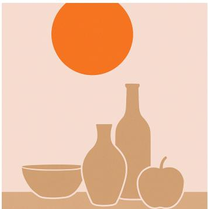  
(a)

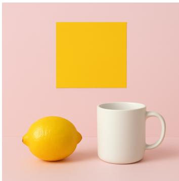  
(b)

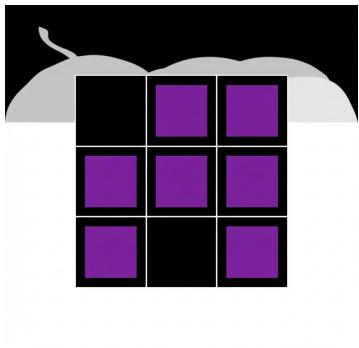  
(c)  
Figure 10: Failed API model outputs on VVRBENCH-Fast. Prompts: (a) “Place an orange circle in the top area. Set the objects against a plain pale pink background; do not add other colored objects.” (b) “Place a yellow square in the top area. Set the objects against a plain pale pink background; do not add other colored objects.” (c) “Arrange three purple squares in these cells of a 3-by-3 grid: top center, top right, and middle right. Set the objects against a plain black background; do not add other colored objects.”

## E TRAINING SETUP

Table 13 reports the settings that define the optimization and reward distribution. The released resolved configurations and data manifests retain the remaining implementation metadata.

Table 13: Reproducible configuration for the final SD3.5 Medium post-training experiments. Reward proportions are fractions of prompt groups in each update; every rollout is scored only by the reward attached to its prompt.
<table><tr><td>Setting</td><td>Value</td></tr><tr><td>Trainable parameters</td><td>LoRA on the eight attention projections add_k, add_q, add_v, add_out, k, q, v, and out; rank 32 and α = 64.</td></tr><tr><td>Generation</td><td>512 × 512 pixels; 25 denoising steps; classifier-free guidance 4.5; Gaussian sampling noise with level 0.7.</td></tr><tr><td>Rollout batch</td><td>32 prompt groups per update, 24 rollouts per prompt, and 768 generated im- ages per update.</td></tr><tr><td>Flow GRPO</td><td>One inner epoch; advantages centered within each prompt group and divided by the standard deviation over the complete rollout batch; advantages clipped to [—5, 5]; policy-ratio clip  $1 0 ^ { - 4 } \colon$  KL coefficient 0.04. The first 24 of the 25</td></tr><tr><td>Optimization</td><td>sampled transitions contribute to the update. AdamW; learning rate  $3 \times 1 0 ^ { - 4 } ; \beta _ { 1 } = 0 . 9 , \beta _ { 2 } = 0 . 9 9 9 ; \epsilon = 1 0 ^ { - 8 } ;$  weight decay  $1 0 ^ { - 4 }$  ; maximum gradient norm 1.0; FP16 mixed precision with TF32</td></tr><tr><td>Training duration</td><td>enabled; exponential moving average. 3,000 optimizer updates, corresponding to 96,000 prompt groups and 2,304,000 generated images.</td></tr><tr><td>VVR objective</td><td>Weights (0.55, 0.15, 0.15, 0.10, 0.05) for object fidelity, relations, forbidden content, unmatched components, and background, respectively, multiplied by</td></tr><tr><td>data</td><td>the penalty factor ψ in Eq. 7. VVR complexity and Complexity follows Eq. 4. VVR-Easy contains 100,000 unique tasks with  $C \ \leq 2 0$  , each drawn from one generation stratum and containing at most one relation. VVR-Matched contains 100,000 unique tasks matched to the benchmark distribution over constraint family, family count, and complexity.</td></tr><tr><td>Training condition</td><td>Prompt-group and reward allocation VVR tasks con- sumed</td></tr><tr><td>VVR-Easy</td><td>100% VVR-Easy 96,000</td></tr><tr><td>VVR-Matched</td><td>100% VVR-Matched 96,000</td></tr><tr><td>GenEval2</td><td>100% GenEval2 0</td></tr><tr><td>GenEval2 + VVR-Easy</td><td>50% GenEval2, 50% VVR-Easy 48,000 50%GenEval2, 50%VVR-Matched 48,000</td></tr><tr><td>GenEval2 + VVR-Matched OCR</td><td>100% OCR 0</td></tr><tr><td>OCR + VVR-Easy</td><td>50% OCR, 50% VVR-Easy 48,000</td></tr><tr><td>Five-reward</td><td>20% each: GenEval, GenEval2, PickScore, OCR, 0 UnifiedReward</td></tr><tr><td>Five-reward + VVR-Easy</td><td>1/6 each: the five rewards at left and VVR-Easy 16,000</td></tr></table>

## E.1 POST-TRAINING EVALUATION

Each model generates one image per prompt with a fixed seed, except on GenEval, which uses four images per prompt.

Training-objective benchmarks. Each reward objective is evaluated on its own held-out benchmark. VVRBENCH accuracy uses the 10,000 VVRBENCH tasks. GenEval (Ghosh et al., 2023) uses its 553 prompts with four images each, for 2,212 images. GenEval2 (Kamath et al., 2025) uses its fixed 80-prompt held-out split. OCR (Liu et al., 2025a) uses 1,018 held-out text-rendering prompts scored by normalized edit accuracy. Each benchmark is reported in its own units.

Preference benchmarks. PickScore (Kirstain et al., 2023) is evaluated on the 500 unique prompts of the Pick-a-Pic v1 validation unique split. HPSv2.1 (Wu et al., 2023) is evaluated on the complete HPDv2 benchmark, 800 prompts in each of four domains (anime, concept art, paintings, and photo), and reported as the unweighted mean of the four domain means.

Cross-domain panel. The remaining metrics use a shared panel of four prompt sets: all 200 Draw-Bench (Saharia et al., 2022) prompts and fixed 1,000-prompt subsets of PartiPrompts (Yu et al., 2022), DPG-Bench (Hu et al., 2024), and T2I-CompBench (Huang et al., 2023). On this panel we report HPSv3 (Ma et al., 2025), which has no canonical prompt benchmark, CLIPScore (Hessel et al., 2021), LAION aesthetic score (Schuhmann, 2022), ImageReward (Xu et al., 2023), and UnifiedReward (Wang et al., 2025). Each metric is averaged within a prompt set and then across the four sets, so the larger sets do not dominate. Only the five-reward objective trains on one of these metrics (UnifiedReward); together they test transfer to prompt distributions outside the training tasks.

## F COMPLETE RLVVR RESULTS

## F.1 VVRBENCH RESULTS BY COMPLEXITY

Table 14 gives the VVRBENCH accuracy of every trained model by complexity range; Figure 4 plots a subset.

Table 14: VVRBENCH accuracy (%) of SD3.5 M after post-training. Training on VVR raises accuracy from 2.81% to 28.27% with Easy tasks and 46.60% with Matched tasks. Matched training gives the largest gains at high complexity. Adding VVR-Easy to GenEval2, OCR, or the five-reward objective raises accuracy by a factor of three to seven. Subscripts are 95% confidence margins.
<table><tr><td>Training reward</td><td>Accuracy (%) ↑</td><td> $C _ { 1 }$ </td><td> $C _ { 2 }$ </td><td> $C _ { 3 }$ </td><td> $C _ { 4 }$ </td><td> $C _ { 5 }$ </td></tr><tr><td>SD3.5-M (pretrained)</td><td> $2 . 8 1 _ { \pm 0 . 3 4 }$ </td><td> $1 2 . 0 1 _ { \pm 1 . 4 7 }$ </td><td> $1 . 1 9 _ { \pm 0 . 5 9 }$ </td><td> $0 . 3 5 { \scriptstyle \pm 0 . 3 7 }$ </td><td> $0 . 0 5 _ { \pm 0 . 2 3 }$ </td><td> $0 . 0 0 { \scriptstyle \pm 0 . 1 9 }$ </td></tr><tr><td>GenEval2</td><td> $3 . 8 7 \pm 0 . 4 0$ </td><td> $1 5 . 4 2 { \scriptstyle \pm 1 . 6 1 }$ </td><td> $2 . 3 9 { \scriptstyle \pm 0 . 7 8 }$ </td><td> $0 . 9 1 \pm 0 . 5 2$ </td><td> $0 . 0 5 { \scriptstyle \pm 0 . 2 3 }$ </td><td> $0 . 0 5 { \scriptstyle \pm 0 . 2 3 }$ </td></tr><tr><td> $\mathrm { G e n E v a l } 2 + \mathrm { V V R - E a s y }$ </td><td> $2 1 . 8 2 { \scriptstyle \pm 0 . 8 2 }$ </td><td> $5 4 . 5 1 { \scriptstyle \pm 2 . 1 5 }$ </td><td> $3 2 . 0 5 _ { \pm 2 . 1 2 }$ </td><td> $1 4 . 0 8 { \scriptstyle \pm 1 . 6 0 }$ </td><td> $6 . 4 1 { \scriptstyle \pm 1 . 1 6 }$ </td><td> $1 . 1 0 { \scriptstyle \pm 0 . 5 6 }$ </td></tr><tr><td>VVR-Easy</td><td> $2 8 . 2 7 _ { \pm 0 . 8 9 }$ </td><td> ${ \bf 6 7 . 7 2 _ { \pm 2 . 0 4 } }$ </td><td> $4 5 . 4 5 _ { \pm 2 . 2 3 }$ </td><td> $1 7 . 5 1 _ { \pm 1 . 7 3 }$ </td><td> $8 . 3 6 _ { \pm 1 . 2 9 }$ </td><td> $1 . 3 5 { \scriptstyle \pm 0 . 6 0 }$ </td></tr><tr><td>VVR-Matched</td><td> $\mathbf { 4 6 . 6 0 _ { \pm 0 . 9 8 } }$ </td><td> $6 7 . 6 8 _ { \pm 2 . 0 4 }$ </td><td> ${ \bf 5 9 . 1 7 _ { \pm 2 . 2 1 } }$ </td><td> ${ \bf 4 5 . 6 2 } _ { \pm 2 . 2 0 }$ </td><td> ${ \bf 3 8 . 3 9 _ { \pm 2 . 1 5 } }$ </td><td>21.82±1.86</td></tr><tr><td> $\mathrm { G e n E v a l 2 } + \mathrm { V V R - M a t c h e d }$ </td><td> $3 3 . 5 0 _ { \pm 0 . 9 3 } ^ { - }$ </td><td> $5 7 . 9 3 _ { \pm 2 . 1 3 }$ </td><td> $4 7 . 2 7 _ { \pm 2 . 2 3 }$ </td><td> $3 2 . 3 4 { \scriptstyle \pm 2 . 0 9 }$ </td><td> $2 0 . 3 2 _ { \pm 1 . 8 2 }$ </td><td> $9 . 2 2 _ { \pm 1 . 3 4 }$ </td></tr><tr><td>OCR</td><td> $3 . 5 8 _ { \pm 0 . 3 8 }$ </td><td> $1 5 . 3 7 _ { \pm 1 . 6 1 }$ </td><td> $1 . 5 1 { \scriptstyle \pm 0 . 6 5 }$ </td><td> $0 . 4 0 _ { \pm 0 . 3 9 }$ </td><td> $0 . 0 5 _ { \pm 0 . 2 3 }$ </td><td> $0 . 0 0 { \scriptstyle \pm 0 . 1 9 }$ </td></tr><tr><td> $\mathrm { O C R } + \mathrm { V V R - E a s y }$ </td><td> $2 4 . 7 4 _ { \pm 0 . 8 6 }$ </td><td> $5 7 . 9 7 _ { \pm 2 . 1 3 }$ </td><td> $3 6 . 7 3 { \scriptstyle \pm 2 . 1 8 }$ </td><td> $1 8 . 4 1 _ { \pm 1 . 7 6 }$ </td><td> $7 . 7 6 { \scriptstyle \pm 1 . 2 6 }$ </td><td> $1 . 9 4 _ { \pm 0 . 7 0 }$ </td></tr><tr><td>Five-reward</td><td> $4 . 8 3 _ { \pm 0 . 4 4 }$ </td><td> $1 9 . 1 6 _ { \pm 1 . 7 5 }$ </td><td> $3 . 1 2 _ { \pm 0 . 8 7 }$ </td><td> $0 . 9 1 _ { \pm 0 . 5 2 }$ </td><td> $0 . 3 0 { \scriptstyle \pm 0 . 3 5 }$ </td><td> $0 . 0 0 { \scriptstyle \pm 0 . 1 9 }$ </td></tr><tr><td>Five-reward + VVR-Easy</td><td> $1 5 . 8 1 _ { \pm 0 . 7 3 }$ </td><td> $4 5 . 0 5 { \scriptstyle \pm 2 . 1 4 }$ </td><td> $2 1 . 7 1 { \scriptstyle \pm 1 . 9 0 }$ </td><td> $7 . 6 5 { \scriptstyle \pm 1 . 2 5 }$ </td><td> $2 . 9 5 { \scriptstyle \pm 0 . 8 4 }$ </td><td> $0 . 7 0 { \scriptstyle \pm 0 . 4 7 }$ </td></tr></table>

## F.2 PARTIAL AND JOINT CONSTRAINT SATISFACTION

For every VVRBENCH task, we compute the mean partial-credit score of its count constraints and of its relations. A count score is one minus the relative count error, averaged over groups, and a relation score is the mean graded score of the task’s relations. From these we report a partial score, the mean graded score, and the fraction of tasks in which every count or every relation is satisfied (Table 15). Relation columns use only the tasks with at least one relation. Figure 5 expresses VVR-Easy’s values as the share of the gap between the pretrained model and VVR-Matched that VVR-Easy closes. In every range from $C _ { 3 }$ to $C _ { 5 }$ , VVR-Easy closes more of the gap in partial scores than in the fraction of tasks with every constraint of a kind satisfied, and the difference grows with complexity.

Table 15: Partial and joint constraint satisfaction on VVRBENCH by complexity range. Partial scores are the mean graded count and relation scores; $ { \mathbf { \hat { \mu } } } ^ { 6 6 }  { \mathrm { a l l } } ^ { 5 } $ is the fraction of tasks in which every count or every relation is satisfied. Relation columns use only tasks with at least one relation.
<table><tr><td colspan="2"></td><td colspan="2">Counts</td><td colspan="2">Relations</td><td rowspan="2">Accuracy (%)</td></tr><tr><td>Range</td><td>Model</td><td>Partial</td><td>All</td><td>Partial</td><td>All</td></tr><tr><td rowspan="3"> $C _ { 1 }$ </td><td>Pretrained</td><td>0.76</td><td>0.46</td><td>0.29</td><td>0.19</td><td>12.01</td></tr><tr><td>VVR-Easy</td><td>0.98</td><td>0.92</td><td>0.80</td><td>0.58</td><td>67.72</td></tr><tr><td>VVR-Matched</td><td>0.98</td><td>0.93</td><td>0.80</td><td>0.57</td><td>67.68</td></tr><tr><td rowspan="3"> $C _ { 2 }$ </td><td>Pretrained</td><td>0.70</td><td>0.17</td><td>0.25</td><td>0.13</td><td>1.19</td></tr><tr><td>VVR-Easy</td><td>0.96</td><td>0.79</td><td>0.75</td><td>0.51</td><td>45.45</td></tr><tr><td>VVR-Matched</td><td>0.97</td><td>0.84</td><td>0.80</td><td>0.53</td><td>59.17</td></tr><tr><td rowspan="3"> $C _ { 3 }$ </td><td>Pretrained</td><td>0.69</td><td>0.10</td><td>0.20</td><td>0.06</td><td>0.35</td></tr><tr><td>VVR-Easy</td><td>0.94</td><td>0.66</td><td>0.59</td><td>0.27</td><td>17.51</td></tr><tr><td>VVR-Matched</td><td>0.98</td><td>0.88</td><td>0.77</td><td>0.41</td><td>45.62</td></tr><tr><td rowspan="3"> $C _ { 4 }$ </td><td>Pretrained</td><td>0.66</td><td>0.06</td><td>0.21</td><td>0.03</td><td>0.05</td></tr><tr><td>VVR-Easy</td><td>0.91</td><td>0.44</td><td>0.61</td><td>0.22</td><td>8.36</td></tr><tr><td>VVR-Matched</td><td>0.98</td><td>0.76</td><td>0.82</td><td>0.42</td><td>38.39</td></tr><tr><td rowspan="3"> $C _ { 5 }$ </td><td>Pretrained</td><td>0.61</td><td>0.02</td><td>0.21</td><td>0.02</td><td>0.00</td></tr><tr><td>VVR-Easy</td><td>0.87</td><td>0.15</td><td>0.57</td><td>0.13</td><td>1.35</td></tr><tr><td>VVR-Matched</td><td>0.97</td><td>0.48</td><td>0.85</td><td>0.41</td><td>21.82</td></tr></table>

## F.3 EXTERNAL TASK, QUALITY, AND ALIGNMENT METRICS

Table 16 extends Table 5 to all nine trained models.

Table 16: Complete final evaluation of the pretrained model and nine post-training conditions. PickScore uses the Pick-a-Pic v1 validation benchmark and HPSv2.1 uses the official four-domain HPDv2 benchmark. HPSv3, CLIPScore, aesthetic score, ImageReward, and UnifiedReward are macro-averaged across the shared cross-domain panel. VVR accuracy, GenEval, GenEval2, and OCR retain their native units. Every HPSv3 value, including the pretrained one, is the mean over the four cross-domain prompt sets. Images of the pretrained model use sampling seed 42; images of trained models use seed 20260912, except for PickScore and HPSv2.1, which use seed 42 for every model.
<table><tr><td>Training reward</td><td>VVR</td><td>GenEval</td><td>GenEval2</td><td>OCR</td><td>PickScore</td><td>HPSv2.1</td><td>HPSv3</td><td>CLIPScore</td><td>Aesthetic</td><td>ImageReward</td><td>UnifiedReward</td></tr><tr><td>Pretrained</td><td>0.028</td><td>0.616</td><td>0.237</td><td>0.476</td><td>0.841</td><td>0.300</td><td>7.689</td><td>0.956</td><td>5.517</td><td>0.929</td><td>0.636</td></tr><tr><td>GenEval2</td><td>0.039</td><td>0.688</td><td>0.454</td><td>0.501</td><td>0.848</td><td>0.297</td><td>8.289</td><td>0.974</td><td>5.523</td><td>1.110</td><td>0.635</td></tr><tr><td>GenEval2 + VVR-Easy</td><td>0.218</td><td>0.718</td><td>0.478</td><td>0.532</td><td>0.848</td><td>0.302</td><td>8.511</td><td>0.976</td><td>5.533</td><td>1.155</td><td>0.637</td></tr><tr><td>VVR-Easy ∆ add VVR-Easy</td><td>0.283</td><td>0.729</td><td>0.268</td><td>0.587</td><td>0.849</td><td>0.294</td><td>8.275</td><td>0.979</td><td>5.483</td><td>1.114</td><td>0.641</td></tr><tr><td></td><td>+0.180</td><td>+0.030</td><td>+0.025</td><td>+0.030</td><td>+0.0004</td><td>+0.005</td><td>+0.222</td><td>+0.002</td><td>+0.009</td><td>+0.045</td><td>+0.002</td></tr><tr><td>VVR-Matched</td><td>0.466</td><td>0.709</td><td>0.360</td><td>0.536</td><td>0.847</td><td>0.291</td><td>7.997</td><td>0.980</td><td>5.472</td><td>1.109</td><td>0.636</td></tr><tr><td>GenEval2 + VVR-Matched ∆ add VVR-Matched</td><td>0.335</td><td>0.712</td><td>0.491</td><td>0.510</td><td>0.848</td><td>0.301</td><td>8.498</td><td>0.972</td><td>5.516</td><td>1.148</td><td>0.637</td></tr><tr><td></td><td>+0.296</td><td>+0.024</td><td>+0.038</td><td>+0.009</td><td>-0.0002</td><td>+0.004</td><td>+0.209</td><td>-0.001</td><td>-0.007</td><td>+0.038</td><td>+0.001</td></tr><tr><td>OCR</td><td>0.036</td><td>0.625</td><td>0.225</td><td>0.962</td><td>0.844</td><td>0.290</td><td>7.601</td><td>0.960</td><td>5.477</td><td>0.994</td><td>0.633</td></tr><tr><td>OCR + VVR-Easy ∆ add VVR-Easy</td><td>0.247</td><td>0.678</td><td>0.252</td><td>0.941</td><td>0.846</td><td>0.290</td><td>7.765</td><td>0.969</td><td>5.488</td><td>1.087</td><td>0.636</td></tr><tr><td></td><td>+0.212</td><td>+0.053</td><td>+0.027</td><td>-0.021</td><td>+0.002</td><td>0.000</td><td>+0.164</td><td>+0.009</td><td>+0.012</td><td>+0.092</td><td>+0.002</td></tr><tr><td>Five-reward</td><td>0.048</td><td>0.739</td><td>0.342</td><td>0.856</td><td>0.850</td><td>0.294</td><td>8.137</td><td>0.974</td><td>5.510</td><td>1.125</td><td>0.640</td></tr><tr><td>Five-reward + VVR-Easy</td><td>0.158</td><td>0.751</td><td>0.383</td><td>0.826</td><td>0.848</td><td>0.300</td><td>8.444</td><td>0.976</td><td>5.541</td><td>1.152</td><td>0.640</td></tr><tr><td>∆ add VVR-Easy</td><td>+0.110</td><td>+0.012</td><td>+0.041</td><td>-0.030</td><td>-0.002</td><td>+0.006</td><td>+0.307</td><td>+0.002</td><td>+0.031</td><td>+0.027</td><td>+0.0003</td></tr></table>

Table 17 gives paired bootstrap intervals for the mixture comparisons. The pretrained model’s evaluation retained only aggregate scores, so comparisons with it have no intervals.

Table 17: Effect of adding VVR to an existing reward, with paired bootstrap 95% intervals over prompts (10,000 resamples; stratified by prompt set for macro-averaged metrics and by domain for HPSv2.1). The GenEval, GenEval2, OCR, HPSv3, and UnifiedReward evaluations retained only aggregate scores, so they have no intervals.
<table><tr><td>Contrast</td><td>PickScore</td><td>HPSv2.1</td><td>CLIPScore</td><td>Aesthetic</td><td>ImageReward</td></tr><tr><td>GenEval2 + VVR-Easy − GenEval2</td><td>+0.0004[-0.0012,0.0021]</td><td>+0.0047 [0.0042, 0.0052]</td><td>+0.0023[-0.0014, 0.0058]</td><td>+0.009 [−0.003, 0.022]</td><td>+0.045 [0.025, 0.066]</td></tr><tr><td>GenEval2 + VVR-Matched — GenEval2</td><td>-0.0002[-0.0019,0.0015]</td><td>+0.0039 [0.0034, 0.0045]</td><td>-0.0011[-0.0044, 0.0021]</td><td>-0.007[−0.020, 0.006]</td><td>+0.038 [0.020, 0.057]</td></tr><tr><td>OCR + VVR-Easy − OCR</td><td>+0.0018[-0.0002,0.0037]</td><td>0.0000 [−0.0007, 0.0006]</td><td>+0.0086 [0.0054, 0.0118]</td><td>+0.012[-0.001,0.025]</td><td>+0.092 [0.071, 0.113]</td></tr><tr><td>Five-reward + VVR-Easy — Five-reward</td><td>-0.0024[-0.0041, -0.0006]</td><td>+0.0060 [0.0054, 0.0066]</td><td>+0.0023[-0.0009, 0.0055]</td><td>+0.031 [0.020, 0.042]</td><td>+0.027 [0.009, 0.046]</td></tr></table>

Matched-complexity GenEval2 mixture. Replacing VVR-Easy with VVR-Matched in the GenEval2 mixture raises VVRBENCH accuracy from 21.82% to 33.50% and GenEval2 from 0.478 to 0.491; accuracy in $C _ { 3 } , C _ { 4 }$ , and $C _ { 5 }$ rises from 14.08%, 6.41%, and 1.10% to 32.34%, 20.32%, and 9.22%. This mixture raises seven of ten non-VVR metrics over GenEval2 alone, with intervals excluding zero for HPSv2.1 (+0.004) and ImageReward (+0.038).

## G HUMAN PREFERENCE STUDY

Three annotators each compare the same 400 image pairs and choose the image they prefer given the prompt, with a tie option. The study contains two comparisons, VVR-Easy against the pretrained model and GenEval2 mixed with VVR-Easy against GenEval2, and each of five prompt suites contributes 40 prompts to each comparison. The 400-prompt study uses 80 unique prompts from each of VVR, GenEval2, GenEval, OCR, and DrawBench. The VVR prompts were drawn, 16 from each of five complexity bins, from a candidate pool of 11,250 tasks that preceded the final benchmark; 74 of them are VVRBENCH tasks, and none appears in VVR-Easy or Challenge. The GenEval sample is balanced across its six task categories. Each prompt appears in one comparison, paired generations share a sampling seed, and model identity and left and right order are hidden during annotation. Each annotator sees the pairs in an independently randomized order and left-right assignment. Win rates average each prompt’s score over the annotators (win 1, tie 0.5, loss 0), and intervals are 95% bootstrap intervals over prompts. Each annotator separately favors the VVR-trained model in every suite of both comparisons. On pairs where both annotators chose an image, the mean pairwise agreement is 83.8% (84.9%, 81.9%, and 84.6% for the three annotator pairs), and Fleiss’ κ among the three annotators, with ties as a third label, is 0.49. Table 18 gives the agreement of each annotator pair.

Table 18: Agreement between annotator pairs on the 400 preference pairs. Labels are decoded to the preferred model before comparison. “Both chose” uses only the pairs on which neither annotator chose a tie; “ties as a label” uses all 400 pairs with tie as a third label, which is also the label set of Cohen’s κ. Fleiss’ κ over the three annotators is 0.49.
<table><tr><td>Annotator pair</td><td>Agreement, both chose (%)</td><td>Agreement, ties as a label (%)</td><td>Cohen&#x27;s κ</td></tr><tr><td>1 vs. 2</td><td>84.9 (298/351)</td><td>76.0 (304/400)</td><td>0.50</td></tr><tr><td>1 vs. 3</td><td>81.9 (276/337)</td><td>72.0 (288/400)</td><td>0.44</td></tr><tr><td>2 vs. 3</td><td>84.6 (312/369)</td><td>78.8 (315/400)</td><td>0.53</td></tr><tr><td>Mean</td><td>83.8</td><td>75.6</td><td>0.49</td></tr></table>