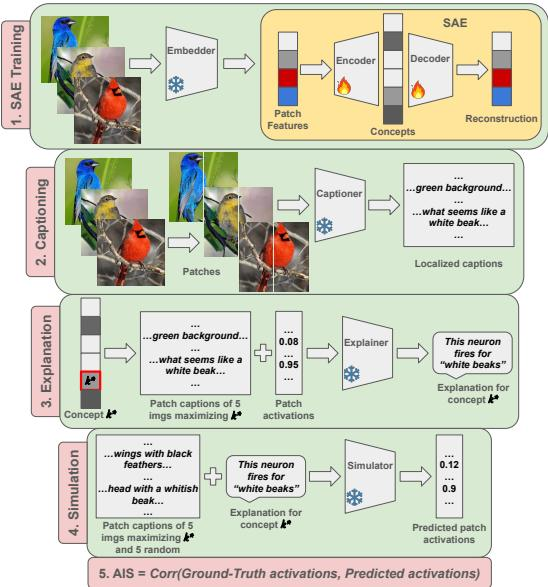
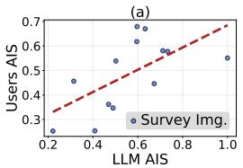
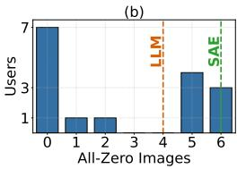
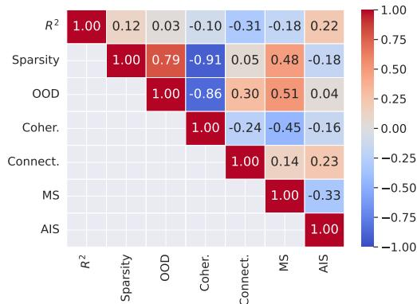
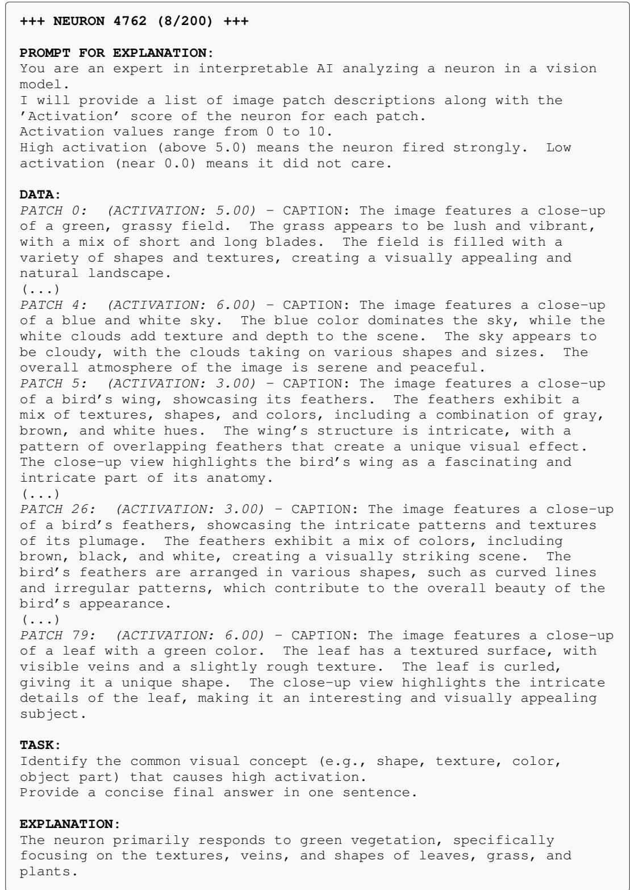
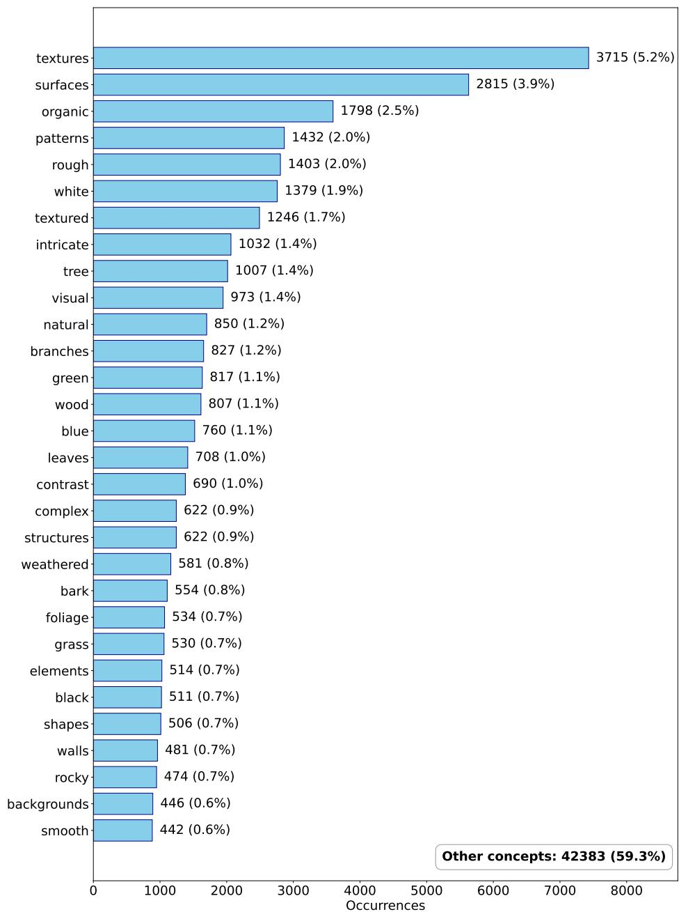
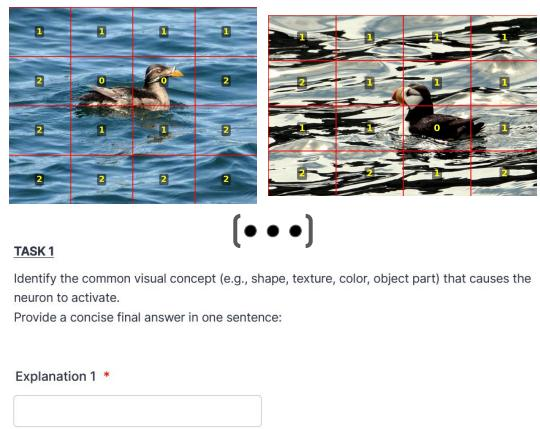
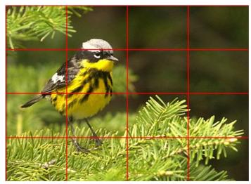
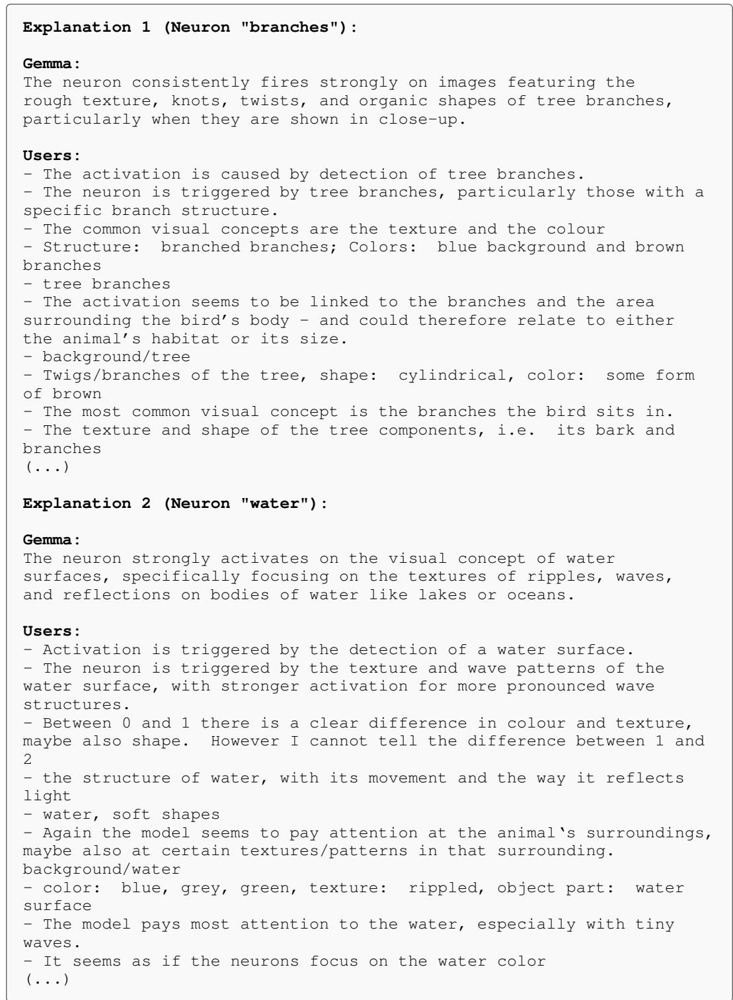

# VERIFYING THE LINEAR REPRESENTATION HYPOTH-ESIS: HOW INTERPRETABLE ARE VISION SAES?

Teodor Chiaburu<sup>1,2∗</sup> Franz Motzkus<sup>3,4</sup> Frank Haußer<sup>5†</sup> Felix Bießmann<sup>5,6†</sup>

<sup>1</sup>Fraunhofer SIT <sup>2</sup>ATHENE National Research Center for Applied Cybersecurity <sup>3</sup>AUMOVIO

<sup>4</sup>University of Bamberg <sup>5</sup>Berlin University of Applied Sciences <sup>6</sup>Einstein Center Digital Future

## ABSTRACT

Vision Sparse Autoencoders (SAEs) have become a popular tool in Mechanistic Interpretability due to their presumed ability to disentangle complex features learned by a model into monosemantic concepts. Despite their growing popularity, evaluating their interpretability remains an active topic of research. The bedrock motivating the adoption of SAEs is the Linear Representation Hypothesis (LRH), which claims that polysemantic features can be projected onto a (near) orthogonal basis of sparse, human-understandable representations. Yet, most current frameworks evaluate proxies such as the sparsity of SAE features or the coherence of the inferred dictionary, implicitly assuming that these reflect alignment with human perception. In this paper, we provide empirical evidence that measuring the interpretability of SAE concepts is more difficult than these proxies suggest. To this end, we adapt the Autointerpretability Score (AIS) - previously shown to align with human judgments in Natural Language Processing - to vision tasks and validate our approach in a dedicated user study. We evaluate SAE concept quality using both standard metrics and our adapted AIS. We find that established interpretability metrics for SAEs correlate neither with one another nor with AIS, indicating that no single reference-free metric, whether grounded in the LRH or not, is sufficient for verifying the interpretability of vision SAEs. We argue these findings support recent calls for more verifiable, ground-truth-anchored design and evaluation of explanation methods. All code and experiments can be found in our anonymized repository: https://anonymous.4open.science/r/XAI\_SAE-0222.

## 1 INTRODUCTION

The field of Mechanistic Interpretability (MI) aims to reverse-engineer the computational submodules of Deep Neural Networks (DNNs) into human-understandable algorithms (Olah et al., 2020). Central to this endeavor is the Linear Representation Hypothesis (LRH) (Park et al., 2024b), which posits that high-level, human-interpretable concepts are encoded as linear combinations of neurons within the model’s activation space. Under this hypothesis, disentangling these features becomes a primary objective for understanding model behavior (Bereska & Gavves, 2024).

However, a significant roadblock to this understanding is the phenomenon of polysemanticity, where individual neurons activate in multiple, semantically distinct contexts. Polysemanticity hinders the identification of concise, univocal explanations for network internals (Huben et al., 2024). Tightly related to this phenomenon is the superposition principle (Elhage et al., 2022), stating that DNNs represent more features than they have physical neurons by assigning them to an overcomplete set of non-orthogonal directions in the high-dimensional activation space. While efficient for compression, superposition renders the native basis of the network fundamentally uninterpretable.

To resolve this, Sparse Autoencoders (SAEs) have recently emerged as a scalable unsupervised method to recover these "ghost" features (Bricken et al., 2023). An SAE comprises an encoder that projects dense model activations into a higher-dimensional, sparse latent space, and a decoder that reconstructs the original signal. By jointly minimizing reconstruction error and enforcing sparsity, SAEs force the model to unpack superimposed features into distinct, monosemantic directions.

Results on how interpretable SAE features actually are remain, yet, inconclusive. While some stud ies (Huben et al., 2024; Gujral et al., 2025; Paulo et al., 2025) present evidence that features learned by SAEs are more interpretable than native neurons, other authors (Li et al., 2025; Korznikov et al., 2026; Hindupur et al., 2025; Paulo & Belrose, 2026; Chanin & Garriga-Alonso, 2026) highlight their instability and fragility. Moreover, it is still debatable, what metrics and tools should be used to verify the interpretability of the SAE concepts and whether they genuinely align with human perception. In vision tasks, SAEs are very often evaluated only in terms of reconstruction error or the structure of the inferred dictionary, e.g. sparsity of the concept vector and orthogonality of the decoder matrix, omitting user studies to check whether the concepts are human-understandable. Some exceptions include e.g. Pach et al. (2026), which validate their Monosemanticity Score (MS) in a human-in-the-loop (HIL) experiment. In Natural Language Processing (NLP), the community has devised the so-called Autointerpretability Score (AIS), which is meant to simulate the human explainer and was shown to correlate with human explanations (Bills et al., 2023). To the best of our knowledge, the literature on vision SAEs was lacking to this day such a measure of interpretability. Appendix A describes other established frameworks for automatically describing neurons in vision models, e.g. CLIP-Dissect (Oikarinen & Weng, 2023) or MILAN (Hernandez et al., 2022). Yet, they either require a set of pre-annotated concepts or generate unlocalized broad explanations.

Our contributions in this work are as follows:

1) By leveraging recent advancements in Large Language Models (LLMs), we propose a recipe for adapting the AIS from NLP to vision SAEs and validate it in a dedicated user survey.

2) We show through extensive experiments that standard interpretability metrics for SAEs (whether derived from the LRH, describing the dictionary structure or specifically designed to measure concept disentanglement outside the dictionary structure) do not correlate. Thereby, we argue that concept alignment with human interpretation is a multi-faceted problem, which cannot be fully described by any single metric.

## 2 RELATED WORK

Vision SAEs and their Evaluation. After wide adoption in NLP for explaining intermediate activations of LLMs, SAEs have gained increasing attention in Computer Vision (CV) as well. While early approaches applied standard "Vanilla" ReLU-based L -constrained SAEs (Bricken et al., 2023) to vision transformer embeddings (Stevens et al., 2025; Olson et al., 2025), recent work has explored more specialized architectures for enforcing sparsity and concept purity. Just to name a few examples: JumpReLU SAEs (Rajamanoharan et al., 2025), TopK SAEs (Gao et al., 2025; Bussmann et al., 2024), Matryoshka (Bussmann et al., 2025), Matching Pursuit (MP-SAE) (Costa et al., 2025), Archetypal (A-SAE) (Fel et al., 2025), Universal SAE (Thasarathan et al., 2025). In their original investigations, these SAE classes were trained to reconstruct "global" image features, e.g. the CLS token in standard transformer architectures such as CLIP (Radford et al., 2021). Other authors (Lim et al., 2025; Stevens et al., 2025) target more localized concept learning and propose training SAEs on patch-level features, which any modern vision encoder extracts when tokenizing the image.

As far as SAE validation is concerned, verifying interpretability and identifying semantics within SAE neurons remains challenging. Although meant as an MI tool, SAEs are oftentimes evaluated solely on indicators only indirectly related to interpretability, such as the reconstruction error, the sparsity of the concepts or the orthogonality of the inferred dictionary. While explanation simplicity is frequently cited as a desideratum (Nauta & Seifert, 2023), trading completeness for sparsity does not strike the right compromise and is known to erode users’ trust in the model’s prediction just as much as an overly complex explanation (Afroogh et al., 2026).

Alternative proxies from the literature include: (i) approaches measuring the effect of SAEs on the downstream task performance (Stevens et al., 2025; Han et al., 2025; Lim et al., 2025) or (ii) similarity-based approaches, e.g. in the explained input space, such as the Monosemanticity Score (Pach et al., 2026) or w.r.t. to an external concept ontology such as WordNet (Olson et al., 2025). In (Fel et al., 2025), the authors look at various similarities in the dictionary learning process, e.g. the OOD score (similarity between the dictionary atoms and the image embeddings on which it was learned), Coherence (self-similarity of the dictionary itself) or Connectivity (self-similarity of the SAE features). We will return to some of these metrics later in section 5.

Recently, more and more researchers in the XAI (Explainable AI) community are advocating for more formalization in the design of the explainers and supervision on ground truth explanations (Haufe et al., 2026; Afroogh et al., 2026; Longo et al., 2024). Fittingly, recent contributions in the SAE literature pick up this direction. For instance, Ding et al. (2025) utilize a pipeline with ground-truth Vision-Language Models (VLMs) and segmentation masks to evaluate how faithfully SAEs reconstruct specific visual concepts. Klotz et al. (2026) evaluate their interpretability against annotated concepts on CUB-200 (Wah et al., 2011) and COCO (Lin et al., 2014). Ding et al. (2025) propose Concept-SAE, which aligns the training process with user-defined concepts.

Autointerpretability for SAEs in Sequence Modelling. The methodology of automated interpretability scoring was first introduced in the context of LLMs. (Huben et al., 2024) established the baseline for this approach using the AIS, originally proposed by Bills et al. (2023). By training SAEs on Pythia-70M (Biderman et al., 2023) embeddings from OpenWebText (Gokaslan et al., 2019), they demonstrated that SAE features exhibit reduced polysemanticity compared to linear baselines like PCA and ICA (Independent Component Analysis), particularly in earlier model layers. Building on this, Paulo et al. (2025) scaled the analysis to millions of features across varied SAE architectures and activation functions trained on RedPajama-v2 (Weber et al., 2024). They also proposed more compute-efficient modifications to the AIS.

The success of SAEs in NLP has extended to other sequence-based domains, such as Protein Language Models (PLMs). Gujral et al. (2025) applied TopK SAEs (Gao et al., 2025) to the protein-level and amino-acid representations of an ESM2 model (Lin et al., 2023), treating protein sequences analogously to text. They validated the biological relevance of the resulting sparse features not only via AIS, but also through post-hoc Gene Ontology (GO) analysis, revealing strong associations between specific neurons and functional annotations in the UniProt database (Consortium, 2020).

## 3 DICTIONARY LEARNING WITH SAES

In this section we introduce the mathematical objects we will be working with throughout this paper and discuss the definition and assumptions of the LRH. In Appendix A we discuss more related work on the origins of sparse coding and dictionary learning.

## 3.1 NOTATION

Patch-level Representations. Let $x \in \mathbb { R } ^ { d }$ denote a flattened RGB-image, where $d = \mathrm { w i d t h }$ height · 3. Across all configurations, we resize our images into square $2 2 4 \times 2 2 4 \times 3$ formats, hence d is constant. We denote the image dataset of size n by $\boldsymbol { X } \in \mathring { \mathbb { R } } ^ { n \times d }$ , where the row $x _ { i } ^ { T }$ is the i-th flattened image, $\forall 1 \leq i \leq n$ . Throughout this paper, vectors are per default column vectors, unless they are transposed; then, they are meant as row vectors.

We extract patch-wise visual features/embeddings from X with an embedder $\varepsilon : \mathbb { R } ^ { d }  \mathbb { R } ^ { s \times p }$ , where s is the number of patches that the embedder splits the image into and $p$ is the dimension of the embedding space (which the SAE will be trained to reconstruct). We describe the patch embeddings block $\bar { \boldsymbol { \varepsilon } ( x _ { i } ) \ } \in \mathbb { R } ^ { s \times p }$ as $E _ { i }$ , which collects all s patch embeddings of image $x _ { i }$ . Stacking all n $E _ { i }$ -blocks together builds the full patch embeddings matrix $E \in \mathbb { R } ^ { ( n s ) \times p }$ , where each row vector $e _ { j } ^ { \bar { T } } \in \mathbb { R } ^ { p }$ is one patch embedding, $\forall 1 \leq j \leq n s$

In our pipeline, the SAE maps each $e _ { j }$ into a (higher-dimensional) latent space $\mathbb { R } ^ { m }$ , to extract sparse representations. Typically, we have $m > p ,$ , which presumes an overcomplete set of sparse features. We note that, similar to (Lim et al., 2025), we will train our SAEs on patch-level embeddings, not on global image-level representations, as is usually the case in the literature. This is necessary for the computation of the AIS later. Image-level features will, however, still play a role in other metrics, as will be discussed in the following sections.

The SAE architecture consists of an encoder and a decoder. The encoder computes the sparse patchlevel codes/concepts<sup>1</sup> $z _ { i } \in \mathbb { R } ^ { m }$ using a learned weight matrix $W _ { e n c } \in \bar { \mathbb { R } ^ { m \times p } }$ , an encoder bias $b _ { e n c } \in \mathbb { R } ^ { m }$ , a pre-decoding bias $b _ { p r e } \in \mathbb { R } ^ { p }$ (usually chosen as the geometric median of the training

set), and a non-linear activation function σ:

$$
z _ { j } = \sigma ( W _ { e n c } ( e _ { j } - b _ { p r e } ) + b _ { e n c } ) ~\tag{1}
$$

We denote by $Z \in \mathbb { R } ^ { ( n s ) \times m }$ the matrix that collects all sparse codes mapped from $E .$ . In this context, $Z _ { i } \in \mathbb { R } ^ { s \times m }$ will be the block of codes corresponding to $E _ { i }$ . Implicitly, each column in $Z$ contains all activations for each SAE neuron; we denote this as the activation $\bar { \mathbf { \chi } } _ { a } ( k ) \mathbf { \chi } _ { \in } \mathbb { R } ^ { n s }$ for the k-th SAE neuron, $\forall 1 \leq k \leq m$ . We warn the reader that various metrics throughout our paper will require (conceptually) either the columns or the rows of particular collections, such as $Z ,$ hence the targeted different symbols to avoid confusion.

The decoder subsequently reconstructs the original embedding vector to produce $\hat { e } _ { j } \in \mathbb { R } ^ { p }$ using a dictionary matrix $\dot { W } _ { d e c } \in \mathbb { R } ^ { p \times m }$ :

$$
e _ { j } \approx \hat { e } _ { j } = W _ { d e c } z _ { j } + b _ { p r e }\tag{2}
$$

In the SAE literature, the transposed decoder matrix $W _ { d e c } ^ { T }$ is usually referred to as the dictionary $\ b { D } \in \mathbb { R } ^ { m \times p }$ , where each row $\bar { d _ { k } ^ { T } } \in \mathbb { R } ^ { p }$ is known as a dictionary atom.

Image-level Representations. As mentioned previously, certain calculations will require global image-level embeddings, codes or activations, not patch-level ones. Therefore, we introduce the following additional objects:

$\tilde { e } _ { i } ~ \in ~ \mathbb { R } ^ { p }$ - the image-level embedding for $x _ { i }$ . It is either delivered automatically by some embedders in the form of the CLS token or we compute it ourselves as $\begin{array} { r } { \tilde { e } _ { i } = \frac { 1 } { s } \sum _ { j = ( i - 1 ) s + 1 } ^ { i s } e _ { j } } \end{array}$ Accordingly, the matrix collecting all these image embeddings is denoted by $\tilde { E } \in \mathbb { R } ^ { n \times p }$

$\tilde { z } _ { i } \in \mathbb { R } ^ { m } \mathrm { ~ . ~ }$ the image-level codes for $x _ { i }$ . We compute them by max-pooling the corresponding patch features: $\tilde { z } _ { i , k } = \operatorname* { m a x } _ { ( i - 1 ) s + 1 \le j \le i s } z _ { j , k }$ . They will be stacked in $\tilde { Z } \in \mathbb { R } ^ { n \times m }$

$\tilde { \boldsymbol { a } } ^ { ( k ) } \in \mathbb { R } ^ { n }$ - the similarly pooled image activations in the k-th SAE neuron (k-th column in $\tilde { Z } )$

## 3.2 LINEAR REPRESENTATION HYPOTHESIS

SAEs have increasingly drawn attention in recent years, especially as MI has gained contour as a subfield within XAI. They promise to offer a straightforward post-hoc solution to the polysemanticity problem addressed in section 1. The viability of SAEs as a solution to this problem is primarily motivated by the LRH, also known as the superposition hypothesis (Bricken et al., 2023; Elhage et al., 2022). In this work, we will lean on the LRH formulation in (Costa et al., 2025): $^ { \prime \prime } l . . . J$ high-dimensional neural representations can be decomposed as superpositions over a large set of approximately orthogonal directions, each aligned with human-interpretable concepts."

In other words, assuming such a near-orthogonal human-interpretable basis exists, the dictionary D learned by an SAE should converge towards it. Without loss of generality, we leave out the constant $b _ { p r e }$ and patch index $j$ from Equation 2 and have: $\begin{array} { r } { \boldsymbol { e } \approx \boldsymbol { \hat { e } } = \boldsymbol { W } _ { d e c } \boldsymbol { z } = \boldsymbol { \bar { D } } ^ { T } \boldsymbol { z } = \sum _ { k = 1 } ^ { m } \boldsymbol { z } _ { k } \cdot \boldsymbol { d } _ { k } } \end{array}$ , with $z _ { k } \in \mathbb { R }$ , under the following assumptions:

1) Overcompleteness: $m \gg p$

2) Near-Orthogonal Dictionary: max $\begin{array} { r } { | d _ { k } ^ { \top } d _ { l } | \leq \delta , \quad \| d _ { k } \| _ { 2 } = 1 , \forall k } \end{array}$ k̸=l

3) K-Sparsity: $\| z \| _ { 0 } \le K \ll m$

The operator $\left\| \cdot \right\| _ { 0 }$ is the $L _ { 0 }$ pseudo-norm (number of non-zero entries). The second condition corresponds to a low-coherence dictionary. While conditions 1-3 are commonly optimized for as structural proxies for a sparse linear decomposition of the entangled concepts in $e \in \mathbb { R } ^ { p } , \mathrm { e . g }$ . in (Bricken et al., 2023; Gao et al., 2025; Fel et al., 2025; Bussmann et al., 2024; 2025), satisfying them offers no theoretical guarantee that the resulting decomposition aligns with human-interpretable concepts, as LRH requires. We argue that the three conditions are at most necessary but not sufficient for LRH: alignment with human perception is only implicitly assumed, not established, by construction. As we will show, measuring this alignment is more difficult and metrics specifically designed to quantify it fail to correlate with proxies such as reconstruction error or orthogonality of the dictionary.

Other authors (Hindupur et al., 2025; Costa et al., 2025; Wattenberg & Viégas, 2024; Park et al., 2024a; Csordás et al., 2024; Engels et al., 2024; 2025) also discuss cases where the ground truth structure of concepts is such that concepts are not linearly separable, heterogeneous (different concepts reside in subspaces of different dimensions) or interact with each other. Bhalla et al. (2026) argue in favor of analyzing concept manifolds instead of individual directions in the SAE activation space. On a broader level, recent work on validating SAEs (Li et al., 2025; Korznikov et al., 2026; Hindupur et al., 2025; Paulo & Belrose, 2026; Chanin & Garriga-Alonso, 2026) pinpoints the fragility of the concepts they learn, their lack of robustness and unreliability, which naturally complements the growing body of literature criticizing the instability and foundational gaps in current explanation methods, e.g. Alvarez-Melis & Jaakkola (2018); Nie et al. (2018); Kindermans et al. (2022); Kim et al. (2019); Adebayo et al. (2018); Jyoti et al. (2022).

## 4 METHODS

This section describes our implementation of the AIS for Vision SAEs, as well as the datasets and models used in our experiments. More SAE training details can be found in Appendix B and the other standard SAE evaluation metrics we took into consideration (reconstruction R<sup>2</sup>, L<sub>0</sub>-sparsity, OOD Score, Coherence, Connectivity and MS) are described in Appendix C.

## 4.1 AIS PROCEDURE

Figure 1 outlines our proposed adaptation scheme of AIS for Vision SAEs. The first step consists of training an SAE to reconstruct the embeddings e ≈ eˆ. Once fully trained, only the encoder module will be used further to generate the sparse codes z.

In a parallel second step, the images are split into patches and each grid patch is annotated by a captioning model. This is where the novelty arises when transferring the AIS method from language to vision. When it comes to text, AIS localizes SAE-learned concepts on the token level, depending on which tokens in a body of text activate a specific neuron in the SAE. For images, this operation is not as straightforward. While modern embedders do split up images into "tokens" (patches), most vision SAEs are trained on full image embeddings, which does not match conceptually with the idea of AIS. Hence, we propose working with patchlevel embeddings and SAE activations here, to allow similar iterations for the AIS as in the textual scenario. The captions are, therefore, meant to translate the image patches into sentences. Note that the captioning grid resolution is a hyperparameter and will highly influence the quality of the downstream explanations.

The third step is the explanation generation. For a subset ${ \hat { K } } ^ { * }$ of relevant SAE neurons (see Appendix D), we select the top 10 images that maximize (by average of patches) each neuron’s activation. Then, an explainer (in form of an LLM) is shown the pairs of captions and normalized<sup>2</sup> patch activation scores for 5 of those

  
Figure 1: AIS Pipeline: (1) Train SAE on patch embeddings. (2) Split images into a grid and caption every grid patch. (3) For a given neuron $\hat { k ^ { * } }$ feed pairs of patch captions and activations from 5 high activating images into the LLM-explainer and prompt it to infer the common concept. (4) In reverse, show the LLM-simulator pairs of patch captions along with the previously inferred explanation (5 from high-activating images, 5 from random images) and prompt it to predict the neuron activations per patch. (5) Compute the AIS of the neuron $k ^ { * }$ as the Pearson correlation between predicted and true patch activations.

images. The explainer is prompted to infer the common explanation/concept for which that particular neuron fires. An example of an explained neuron can be seen in Figure 4 in the Appendix.

In the fourth step, another or the same LLM acts as a simulator. Based on the previously inferred explanation, the other top 5 activating images (namely, their patch captions) and 5 other random images (known as the "top-random" approach (Huben et al., 2024)), the LLM is prompted to predict the SAE activation score for every patch (see an example in Figure 5 in the Appendix).

In the final fifth step, we compute the AIS per explained neuron as the Pearson correlation between the ground truth patch activation scores $A _ { \mathrm { t r u t h } }$ and the simulated ones $\hat { A } _ { \mathrm { p r e d } }$ . The average of all the neuron-wise AIS values gives the Mean AIS as a global measure of interpretability for the SAE.

## 4.2 DATA AND EXPERIMENTS

The pseudocode in algorithm 1 gives an overview of our AIS experiments. We run the experiments described in this paper on the following datasets: CUB-200-2011 (Wah et al., 2011), 5794 samples; a subset of ImageNet (Russakovsky et al., 2015) with 100 classes containing around 200 samples each - we denote it here as ImageNet100 ; and Caltech 101 (Li et al., 2022a), 4572 samples. For CUB, we applied the standard split that comes with downloading the dataset. As for the other two, we applied a fixed-seed stratified split of 0.5- 0.5 into training and validation sets. We extract embeddings from the images in these datasets with various embedders $\varepsilon ,$ namely: DINOv2 (Oquab et al., 2024), ViT (Dosovitskiy et al., 2021) and SigLIP (Zhai et al., 2023). While we conduct experiments on single-object, objectcentric datasets, our approach can readily be applied on other vision benchmarks as well.

As noted above, the captioning grid size is a hyperparameter that influences the quality of the explanations. After several iterations, we settled for a grid size of 4 as a middle ground. Hence, we split each image into a 4 × 4 grid and caption each patch using LLaVa 1.5 (Liu et al., 2023). Example captions can be found in the Appendix. We limit the maximum number

```powershell
Input: Datasets D, Embedders E, SAEs S,
Captioners C, Filtered Index Set $K ^ { * }$
LLM-Explainer and -Simulator
Output: AIS
for d $\in \mathcal { D } , \varepsilon \in \mathcal { E } , s \in \mathcal { S } , \pmb { c } \in \mathcal { C } , k ^ { * } \in K ^ { * }$ do
$/ /$ Captioning
$I _ { \mathrm { t o p } } \gets \mathrm { T o p } 1 0 \mathrm { i m a g e s } \mathrm { m a x i m i z i n g }$
activation of neuron $k ^ { * }$
$C _ { \mathrm { p a t c h e s } } \gets \mathbf { C a p t i o n \ p a t c h e s }$ in $I _ { \mathrm { t o p } }$ with c
$/ \bar { \bigtriangledown }$ LLM Explanation
$P _ { \mathrm { e x p } }  \mathrm { S e l e c t } 5 \mathrm { p a i r s } ( \mathrm { P a t c h } \mathrm { C a p t i o n s } ,$
Activations neuron $k ^ { * } )$ from $I _ { \mathrm { t o p } }$
$C o n c e p t _ { k ^ { * } } \gets \mathrm { L L M } ( P _ { \exp } ,$
"Infer concept")
$/ /$ LLM Simulation
$P _ { \mathrm { s i m } }  \mathrm { S e l e c t } 1 0$ new pairs (Patch
Captions, $C o n c e p t _ { k ^ { * } } ) ; 5$ high activating
$+ 5$ random
$\hat { A } _ { \mathrm { p r e d } }  \mathrm { L L M } ( P _ { \mathrm { s i m } } .$ , "Predict activation")
$\dot { A _ { \mathrm { t r u t h } } } \gets \mathrm { G r o u n d }$ truth activations for $P _ { \mathrm { s i m } }$
$/ /$ Evaluation
$A I S _ { k ^ { * } } \gets \mathrm { C o r r e l a t i o n } ( \hat { A } _ { \mathrm { p r e d } } , A _ { \mathrm { t r u t h } } )$
Average AIS over $| K ^ { * } |$
Algorithm 1: AIS Experiments. ${ \mathcal { D } } = \{ { \mathbf { C U B } } _ { \mathbf { \theta } }$
ImageNet100, Caltech}; E = {DINO, ViT,
SigLIP}; $S \ \mathrm { ~ = ~ \{ V a n i l l a } ~ $ , TopK, MP-SAE};
$\mathcal { C } = \{ \mathrm { L L a V a } \} ; \mathrm { L L M } = \{ \mathrm { G e m m a } \}$
```

of generated caption tokens to 100 and prompt the model as follows:

Directly describe the texture, shapes, and colors visible in this close-up image. Be concise and focus only on visual details.

As explainer and simulator we tested various modern open-weight LLMs that can be run on-premise, namely from the Gemma 3 (Gemma-Team, 2025) and Gemma 4 (Gemma-Team, 2026) families. We decided to use the same model as both explainer and simulator, but note that one can delegate two different models for the two tasks (see e.g. Huben et al. (2024)).

## 5 RESULTS AND DISCUSSION

In this section, we present our findings and discuss their possible interpretations and implications.

1) LLM Explanations Align with Human Judgment. Previous research in NLP has shown through HIL experiments that LLM explanations align well with human judgments (Bills et ${ \mathrm { a l . } }$ 2023). To the best of our knowledge, a similar investigation was missing for vision tasks. To this end, we designed a user survey, in order to verify the soundness of our vision AIS procedure. The design of the experiment is described in Appendix G.

Plot (a) in Figure 2 shows a positive correlation - yet rather imprecisely estimated given the small sample size - between the image-level AIS values achieved by Gemma and survey participants: coefficient $\mathbf { r } = \mathbf { 0 . 6 2 0 } 2$ , at a p-value of 0.0237 and a 95% confidence interval [0.133, 0.866] (via Fisher’s z-transformation). This suggests that the caption-based adaption of AIS is able to describe SAE concept quality similar to how human explainers perceive it. Out of the 20 simulation images used in the survey we excluded 6 degenerate cases (all-zero ground-truth SAE scores) from plot (a) and analyzed them separately in plot (b). The LLM correctly identified 4 of these cases, while 7 out of 16 users also managed to identify all or almost all of them. Upon manual inspection, we confirmed that these users formulated more detailed descriptions of the concepts in the first task than the rest - Figure 8. Qualitatively, this gives reassurance that i) the LLM simulator does not tend to hallucinate activation scores where the concept is absent and ii) users are also able to correctly annotate trivial cases, provided they find a concept specific enough in the explanation task. For a second part of the discussion regarding degenerate cases, see our ablation study in Appendix H.

Table 1 compares the individual AIS on the two neurons for the Gemma Explainer/Simulator against the users. The results indicate that our automated LLM pipeline outperforms human users in extracting explanations and simulating activations, even when the image material is translated into captions and the activation range is more fine-grained. This, along with the random shuffling test in Table 3, is another proof of concept in favor of the caption-based adaptation of the AIS procedure.

After inspecting the users’ explanations for both neurons (Figure 8), we learned that the simulation task was notably more challenging, even though most users successfully identified "branches" and "water" as concepts, similar to Gemma’s explanations. This is also indicated by the fairly high disagreement rate between users (in form of the standard deviations in Table 1). This insight can be used to further optimize the efficiency of the AIS pipeline, e.g. by using a lower-scale LLM for explanation than for simulation (see Huben et al. (2024)).

Table 1: LLM vs Human Explanations. Comparison of AIS scores on two MP SAE neurons for Gemma and human users. AIS LLM and AIS Users (averaged per user) are both computed on the [0, 2] range of scores.
<table><tr><td>Neuron</td><td>AIS LLM</td><td>Mean AIS Users</td></tr><tr><td>2174 (&quot;branches&quot;)</td><td>0.6644</td><td> $0 . 5 0 8 2 \pm 0 . 1 4 8 0$ </td></tr><tr><td>9948  $( " \mathrm { w a t e r " } )$ </td><td>0.8800</td><td> $0 . 6 2 6 3 \pm 0 . 3 0 9 1$ </td></tr></table>



  
Figure 2: (a) LLM-AIS correlates with Human-AIS. Each point represents a nondegenerate survey image (14 in total). All AIS values are computed on the [0, 2] score range. (b) 7/16 users outperform the LLM in recognizing trivial all-zero cases.

2) High Reconstruction - Low Interpretability. Table 2 confirms a trade-off well documented in the SAE and XAI literature (Herm et al., 2023; Crook et al., 2023): A high reconstruction potential does not guarantee the SAE is also interpretable. While all SAE configurations reach a high $\mathrm { \ddot { \it R } ^ { 2 } }$ score on reconstructing the embeddings, all other interpretability metrics indicate that the SAE features are still rather opaque. In particular, all configurations achieve very high OOD, Coherence and Connectivity scores; the only exception here is the Coherence below 0.5 for the Vanilla SAEs. Also immediately visible is the maximum Connectivity for almost all the configurations, giving a first piece of evidence that the SAE concepts remain polysemantic. On the opposite side, AIS and MS are both low and extremely low, respectively, none of them surpassing 0.5. When compared against baselines from the literature: Our vision SAEs trained here on patch-level embeddings achieve a much lower MS range - $[ 4 \times 1 0 ^ { - 4 } , 1 . 0 6 \times 1 0 ^ { - 1 } ]$ - than their counterparts trained on image-level embeddings from the original paper introducing the MS score (Pach et al., 2026) - roughly [0.1, 0.6] for a similar SAE expansion factor as ours on the final embeddings. As for the AIS: Our vision SAEs compare favorably against SAEs explaining LLMs (Huben et al., 2024) and are surpassed by SAEs explaining PLMs (Gujral et al., 2025) (also refer to Table 3). In terms of sparsity-interpretability trade-off: MP-SAEs fall out as achieving comparable results as the other SAEs, while trained on a much lower sparsity regime. This highlights again the argument introduced in section 2: The balance between explanation simplicity (approximated here in the form of sparsity of SAE features) and completeness is difficult to find and describe accurately.

Table 2: High reconstruction - low interpretability. Best results are marked in green, worst results in red. More statistics accompanying the AIS values are collected in Table 4 from the Appendix. In particular, note that Sparsity, as defined in Equation 4 and in the overcomplete library (Fel, 2024), actually measures density (meaning a higher value is denser).
<table><tr><td>SAE</td><td>Embedder</td><td>Dataset</td><td>Sparsity</td><td>R2(↑)</td><td>OOD Score (↓)</td><td>Coherence (↓</td><td>Connectivity (↓)</td><td>Mean MS (↑)</td><td>Mean AIS (↑)</td></tr><tr><td rowspan="9">Vanilla</td><td>DINO</td><td>CUB200 ImageNet100</td><td>0.5012</td><td>0.9706 0.9254</td><td>0.7898 0.7669</td><td>0.3146 0.3146</td><td>1.0000 1.0000</td><td>0.0500 0.0059</td><td>0.3493 0.2801</td></tr><tr><td></td><td></td><td>0.5007</td><td></td><td></td><td></td><td></td><td></td><td></td></tr><tr><td></td><td>Caltech</td><td>0.5009</td><td>0.9511</td><td>0.7781</td><td>0.3146</td><td>1.0000</td><td>0.0124</td><td>0.2049</td></tr><tr><td>ViT</td><td>CUB200</td><td>0.4990</td><td>0.9629</td><td>0.8528</td><td>0.2111</td><td>1.0000</td><td>0.1060</td><td>0.1621</td></tr><tr><td></td><td>ImageNet100</td><td>0.4985</td><td>0.9296</td><td>0.8352</td><td>0.2111</td><td>1.0000</td><td>0.0808</td><td>0.2105</td></tr><tr><td></td><td>Caltech</td><td>0.4980</td><td>0.9322</td><td>0.8444</td><td>0.2111</td><td>1.0000</td><td>0.0825</td><td>0.1510</td></tr><tr><td>SigLIP</td><td>CUB200</td><td>0.5019</td><td>0.9901</td><td>0.8662</td><td>0.2111</td><td>1.0000</td><td>0.0146</td><td>0.3518</td></tr><tr><td></td><td>ImageNet100</td><td>0.5016</td><td>0.9777</td><td>0.8492</td><td>0.2111</td><td>1.0000</td><td>0.0033</td><td>0.3545</td></tr><tr><td></td><td>Caltech</td><td>0.5012</td><td>0.9736</td><td>0.8549</td><td>0.2111</td><td>1.0000</td><td>0.0068</td><td>0.2522</td></tr><tr><td rowspan="9">TopK</td><td>DINO</td><td>CUB200</td><td>0.1965</td><td>0.9596</td><td>0.6541</td><td>0.8750</td><td>1.0000</td><td>0.0221</td><td>0.1619</td></tr><tr><td></td><td>ImageNet100</td><td>0.1999</td><td>0.9180</td><td>0.6529</td><td>0.9509</td><td>1.0000</td><td>0.0026</td><td>0.0820</td></tr><tr><td></td><td>Caltech</td><td>0.1970</td><td>0.9135</td><td>0.6785</td><td>0.7463</td><td>1.0000</td><td>0.0051</td><td>0.0636</td></tr><tr><td>ViT</td><td>CUB200</td><td>0.1993</td><td>0.9521</td><td>0.7201</td><td>1.0000</td><td>0.9972</td><td>0.0580</td><td>0.0226</td></tr><tr><td></td><td>ImageNet100</td><td>0.1995</td><td>0.9188</td><td>0.7303</td><td>0.9221</td><td>1.0000</td><td>0.0489</td><td>0.0505</td></tr><tr><td></td><td>Caltech</td><td>0.1993</td><td>0.9034</td><td>0.7293</td><td>0.9022</td><td>1.0000</td><td>0.0450</td><td>0.0477</td></tr><tr><td>SigLIP</td><td>CUB200</td><td>0.1980</td><td>0.9894</td><td>0.6320</td><td>1.0000</td><td>0.5584</td><td>0.0089</td><td>0.1458</td></tr><tr><td></td><td>ImageNet100</td><td>0.1977</td><td>0.9728</td><td>0.6879</td><td>1.0000</td><td>0.8312</td><td>0.0023</td><td>0.0587</td></tr><tr><td></td><td>Caltech</td><td>0.1977</td><td>0.9660</td><td>0.7226</td><td>1.0000</td><td>0.9738</td><td>0.0046</td><td>0.0779</td></tr><tr><td rowspan="9">MP</td><td>DINO</td><td>CUB200</td><td>0.0081</td><td>0.9858</td><td>0.6836</td><td>0.9600</td><td>1.0000</td><td>0.0090</td><td>0.3476</td></tr><tr><td></td><td>ImageNet100</td><td>0.0081</td><td>0.9792</td><td>0.5944</td><td>0.9530</td><td>1.0000</td><td>0.0010</td><td>0.4332</td></tr><tr><td></td><td>Caltech</td><td>0.0081</td><td>0.9798</td><td>0.6586</td><td>0.9167</td><td>1.0000</td><td>0.0021</td><td>0.3763</td></tr><tr><td>ViT</td><td>CUB200</td><td>0.0081</td><td>0.9265</td><td>0.7573</td><td>0.9531</td><td>1.0000</td><td>0.0152</td><td>0.2817</td></tr><tr><td></td><td>ImageNet100</td><td>0.0081</td><td>0.8909</td><td>0.6894</td><td>0.9280</td><td>1.0000</td><td>0.0101</td><td>0.4222</td></tr><tr><td></td><td>Caltech</td><td>0.0081</td><td>0.9047</td><td>0.7310</td><td>0.8399</td><td>1.0000</td><td>0.0106</td><td>0.3834</td></tr><tr><td>SigLIP</td><td>CUB200</td><td>0.0081</td><td>0.9749</td><td>0.7259</td><td>0.9824</td><td>1.0000</td><td>0.0028</td><td>0.2750</td></tr><tr><td></td><td>ImageNet100</td><td>0.0081</td><td>0.9564</td><td>0.6629</td><td>0.9858</td><td>1.0000</td><td>0.0004</td><td>0.3213</td></tr><tr><td></td><td>Caltech</td><td>0.0081</td><td>0.9494</td><td>0.7019</td><td>0.9914</td><td>1.0000</td><td>0.0011</td><td>0.2764</td></tr></table>

3) Interpretability Metrics Do Not Correlate as Expected. Figure 3 depicts the correlation matrix between the metrics in Table 2. What we learn from it is that standard SAE evaluation metrics (for reconstruction and interpretability) do not correlate more than moderately, except for three cases: (Sparsity - OOD Score), (Sparsity - Coherence) and (OOD Score - Coherence). While the threshold for a "high correlation" is subjective and task-dependent, we consider here ±0.6 to be suitable (Akoglu, 2018).

Note that while Sparsity and Coherence, which are central pieces of the LRH (subsection 3.2), do correlate strongly, the negative relationship of this correlation contradicts the requirements of the LRH, namely sparse near-orthogonal dic-

  
Figure 3: Correlation matrix on the SAE metrics. Except (Sparsity - OOD Score), none of the other pairs correlate as expected.

tionaries. According to these assumptions, one would expect to observe sparse features and lowcoherence dictionaries together. Similarly for OOD Score vs Coherence, where a positive correlation was to be expected. Only Sparsity and OOD Score exhibit an expected high positive correlation. Of particular interest are MS and AIS, which were designed to measure interpretability from outside the dictionary structure. MS and AIS do not appear to correlate w.r.t. each other; w.r.t. the other metrics, none of them are highly correlated.

4) Captioning and Smaller LLMs Integrate Well in AIS. We experimented with various Gemma models as explainers and simulators, on a fixed configuration Vanilla SAE + DINO + CUB (Table 3). While some lower scale Gemma versions struggled as explainers and simulators, some versions of as few as 4B parameters achieved similar AIS values as models of three or six times their size. We run Gemma inference on-premise to generate the explanations and simulate the activations for all versions up to 12B parameters. Gemma4-26b is called in the cloud via Google’s API in the Google AI Studio. Note that our AIS results with much smaller LLM explainers/simulators are comparable to similar AIS experiments from the NLP and PLM literature (Huben et al., 2024; Gujral et al., 2025). For reference: GPT 4 (OpenAI, 2024) is estimated to have 1.8 trillion and Claude 3.5 Sonnet (Anthropic, 2024) 175B parameters. For the investigations here, we computed the AIS on the top 100 SAE features (not 200 as in the other experiments). The baseline results from Gujral et al. (2025) take 200 features into consideration, those from Huben et al. (2024) look at 150, both w.r.t. the final layer embeddings. To check the validity of the LLaVa captions, we run a randomized test on Gemma4-12b. By randomly shuffling the patch captions for every explained neuron, we arrive at a much lower (even negative) AIS.

Vision AIS Limitations. One of the contributions of this paper is the adaptation of the AIS routine from sequence-to-sequence modeling to vision. The central piece of transition is given by the captioning step (algorithm 1, Figure 1). While our experiments indicate that translating patch-level embeddings into text and delegating a lower-scale LLM to simulate a human explainer is a reasonable choice, achieves comparable results to baselines from the SAE literature and aligns with human explanations, several limitations are evident.

The cross-modality introduced into the AIS pipeline (vision embeddings → text captions) may be a form of lossy compression, as it is discarding visual information when captioning the patches. Figure 6 in the Appendix gives an overview of the frequency of the top 20 words/concepts found in the Gemma-generated explanations for all configurations listed in Table 2. Notice that most terms are rather generic, which, in turn, will impact the quality of the simulated activation scores. As mentioned above, the captioner’s performance is highly relevant for the quality of the explanations. Likewise, the performance of the LLM Ex-

Table 3: AIS performance across Gemma model scales, random shuffling control and external references. Results use a fixed configuration (Vanilla SAE + DINO + CUB). Suffixes denote parameter counts in billions. For context, we provide external references from NLP\* (Huben et al., 2024) and PLM\*\* (Gujral et al., 2025), which use much larger models (GPT/Claude).
<table><tr><td>Explainer/Simulator</td><td>Mean AIS</td></tr><tr><td>Control (Random Caption Shuffling)</td><td></td></tr><tr><td>Gemma4-12b</td><td>-0.0136</td></tr><tr><td>Ours (Gemma Scaling Evaluation)</td><td></td></tr><tr><td>Gemma4-2b Gemma3-4b Gemma4-4b</td><td>0.2012 0.2327 0.3278</td></tr><tr><td>Gemma3-12b Gemma4-12b</td><td>0.3313 0.3539</td></tr><tr><td>Gemma4-26b</td><td>0.3269</td></tr><tr><td>External Literature References (Larger Models)</td><td></td></tr><tr><td>*GPT 4&amp;3.5 (Text)</td><td>~0.15</td></tr><tr><td>**Claude 3.5 (Proteins)</td><td>~0.66</td></tr><tr><td>**Claude 3.5 (Amino-acids)</td><td>~0.63</td></tr></table>

plainer and Simulator impacts the AIS. Given this chain of error propagation, it is, hence, not entirely clear to what extent a low AIS can be solely attributed to poor interpretability of SAE concepts.

The grid resolution on which the captioner is applied naturally impacts the level of detail from which the LLM explainer infers the explanation. While meant to equate the tokenization step in the AIS for sequence modeling, a static grid does not include any scene understanding whatsoever. As an alternative, other modern patching and captioning methods may be applied, that combine both steps into one and segment the image into irregular dynamic regions - see Appendix A. Furthermore, latest VLMs would be able to solve the explanation and simulation tasks by directly analyzing the images, without needing captions at all.

## 6 CONCLUSION

In this work, we challenged the LRH on the basis of which SAEs are built. We have shown empirically that standard metrics designed to evaluate the interpretability of SAEs - whether from within or outside the concept dictionary - do not correlate with one another or with the AIS. We proposed an adaption of the AIS for vision models, previously shown in NLP to align with human explanations, and confirmed via a dedicated user study that our caption-based AIS procedure captures explanation quality as perceived by humans.

Our results support a growing line of work in explainability calling for more formalism in explanation methods (Haufe et al., 2026; Afroogh et al., 2026), deeper understanding of XAI metrics (Biessmann & Refiano, 2021), noise and uncertainty in explanations, supervision and ground-truth data for explainers and greater customization to task and audience (Longo et al., 2024; Chiaburu, 2026). For vision SAEs, new results show the benefits of steering the interpretability of SAE features via human-annotated concepts (Klotz et al., 2026) or describing concepts beyond LRH-assumed linear separability (Hindupur et al., 2025).

To conclude, more in-depth studies are needed on the efficiency and interpretability of SAEs, beyond standard LRH assumptions. We believe that, just like with any explanation method, there is no allpurpose SAE design guaranteed to deliver useful explanations across data and models. Task domain knowledge and reality-grounded metrics need to be interwoven into SAE training and evaluation.

## AI USE STATEMENT

In this work, we used generative AI tools for providing feedback on research methodology and experiments and implementing some of the methods. We have not used generative AI tools for developing theoretical models or conceptual frameworks, formulating mathematical claims, providing critical ingredients for proving mathematical claims, proposing or refining hypotheses, assisting with translation, supporting qualitative and thematic data analysis or interpreting results. Generating synthetic data sets, writing of proofs, cleaning and reformatting datasets are not applicable to this work. Additionally, we used generative AI tools for suggesting experimental parameters, debugging software code, analyzing existing literature, brainstorming and identifying gaps in the current literature. We have reviewed all AI-assisted work. LLM-generated code was verified and tested for correctness by 2 authors. The literature review and correctness of the notations and scientific claims were verified by all authors. We take responsibility for the final content of this work, including text, claims or artifacts produced with the aid of generative AI.

## REPRODUCIBILITY STATEMENT

We have attached a link to our anonymized code repository, described our methodological approaches in great detail in the paper and provided references to and details about the data splits we used.

## ACKNOWLEDGMENTS

This research work was supported by the National Research Center for Applied Cybersecurity ATHENE. ATHENE is funded jointly by the German Federal Ministry of Research, Technology and Space and the Hessian Ministry of Science and Research, Arts and Culture.

## REFERENCES

Julius Adebayo, Justin Gilmer, Michael Muelly, Ian Goodfellow, Moritz Hardt, and Been Kim. Sanity Checks for Saliency Maps. In S. Bengio, H. Wallach, H. Larochelle, K. Grauman, N. Cesa-Bianchi, and R. Garnett (eds.), Advances in Neural Information Processing Systems, volume 31. Curran Associates, Inc., 2018. URL https://proceedings.neurips.cc/paper\_ files/paper/2018/file/294a8ed24b1ad22ec2e7efea049b8737-Paper.pdf.

Saleh Afroogh, Syed Ishtiaque Ahmed, Petra Ahrweiler, David Alvarez-Melis, Mansur Maturidi Arief, Emilia Barakova, Falco J. Bargagli-Stoffi, Erdem Biyik, Hanjie Chen, Xiang ’Anthony Chen, Robert Alan Clements, Keeley Crockett, Amit Dhurandhar, Fethiye Irmak Dogan, Mollie Dollinger, Motahhare Eslami, Aldo A Faisal, Arya Farahi, Melanie F. Pradier, Saadia Gabriel, Diego Garcia-Olano, Marzyeh Ghassemi, Shaona Ghosh, Hatice Gunes, Ehsan Hajiramezanali, Stefan Haufe, Biwei Huang, Angel Hwang, Md Tauhidul Islam, Junfeng Jiao, Amir-Hossein Karimi, Saber Kazeminasab, Anastasia Kuzminykh, William La Cava, Brian Y. Lim, Xiaofeng Liu, Mohammad R. K. Mofrad, Alicia Parrish, Maria Perez-Ortiz, Shriti Raj, Swabha Swayamdipta, Salmonn Talebi, Kush R. Varshney, Mihaela Vorvoreanu, Lily Weng, Alice Xiang, Yiming Xu, Ding Zhao, and Jieyu Zhao. Beyond Explainable AI (XAI): An Overdue Paradigm Shift and Post-XAI Research Directions. CoRR, abs/2602.24176, 2026. doi: 10.48550/ARXIV. 2602.24176. URL https://doi.org/10.48550/arXiv.2602.24176.

Haldun Akoglu. User’s Guide to Correlation Coefficients. Turkish Journal of Emergency Medicine, 18:91–93, 08 2018. doi: 10.1016/j.tjem.2018.08.001.

David Alvarez-Melis and Tommi S. Jaakkola. On the Robustness of Interpretability Methods, 2018. URL https://arxiv.org/abs/1806.08049.

Anthropic. Claude 3.5 Sonnet. https://claude.ai, 2024.

David Bau, Bolei Zhou, Aditya Khosla, Aude Oliva, and Antonio Torralba. Network Dissection: Quantifying Interpretability of Deep Visual Representations. In Computer Vision and Pattern Recognition, 2017.

Leonard Bereska and Stratis Gavves. Mechanistic Interpretability for AI Safety - A Review. Transactions on Machine Learning Research, 2024. ISSN 2835-8856. URL https:// openreview.net/forum?id=ePUVetPKu6. Survey Certification, Expert Certification.

Usha Bhalla, Thomas Fel, Can Rager, Sheridan Feucht, Tal Haklay, Daniel Wurgaft, Siddharth Boppana, Matthew Kowal, Vasudev Shyam, Owen Lewis, Thomas McGrath, Jack Merullo, Atticus Geiger, and Ekdeep Singh Lubana. Do sparse autoencoders capture concept manifolds? arXiv preprint arXiv:2604.28119, 2026.

Lorenzo Bianchi, Giacomo Pacini, Fabio Carrara, Nicola Messina, Giuseppe Amato, and Fabrizio Falchi. One Patch to Caption Them All: A Unified Zero-Shot Captioning Framework. In Proceedings ofthe IEEE/CVF Conference on Computer Vision and Pattern Recognition (CVPR), pp. 5532–5542, June 2026.

Stella Biderman, Hailey Schoelkopf, Quentin Gregory Anthony, Herbie Bradley, Kyle O’Brien, Eric Hallahan, Mohammad Aflah Khan, Shivanshu Purohit, Usvsn Sai Prashanth, Edward Raff, Aviya Skowron, Lintang Sutawika, and Oskar Van Der Wal. Pythia: A Suite for Analyzing Large Language Models Across Training and Scaling. In Andreas Krause, Emma Brunskill, Kyunghyun Cho, Barbara Engelhardt, Sivan Sabato, and Jonathan Scarlett (eds.), Proceedings of the 40th International Conference on Machine Learning, volume 202 of Proceedings ofMachine Learning Research, pp. 2397–2430. PMLR, 23–29 Jul 2023. URL https://proceedings. mlr.press/v202/biderman23a.html.

Felix Biessmann and Dionysius Refiano. Quality Metrics for Transparent Machine Learning With and Without Humans In the Loop Are Not Correlated. In Proceedings ofthe ICML Workshop on Theoretical Foundations, Criticism, and Application Trends ofExplainable AI held in conjunction with the 38th International Conference on Machine Learning (ICML), 2021.

Steven Bills, Nick Cammarata, Dan Mossing, Henk Tillman, Leo Gao, Gabriel Goh, Ilya Sutskever, Jan Leike, Jeff Wu, and William Saunders. Language Models Can Explain Neurons in Language Models. https://openaipublic.blob.core.windows.net/ neuron-explainer/paper/index.html, 2023. [Accessed 29-12-2025].

Trenton Bricken, Adly Templeton, Joshua Batson, Brian Chen, Adam Jermyn, Tom Conerly, Nicholas L Turner, Cem Anil, Carson Denison, Amanda Askell, Robert Lasenby, Yifan Wu, Shauna Kravec, Nicholas Schiefer, Tim Maxwell, Nicholas Joseph, Alex Tamkin, Karina Nguyen, Brayden McLean, Josiah E Burke, Tristan Hume, Shan Carter, Tom Henighan, and Chris Olah. Towards Monosemanticity: Decomposing Language Models With Dictionary Learning. https://transformer-circuits.pub/2023/monosemantic-features/ index.html#appendix-automated, 2023. [Accessed 30-12-2025].

Bart Bussmann, Patrick Leask, and Neel Nanda. BatchTopK Sparse Autoencoders. In NeurIPS 2024 Workshop on Scientific Methods for Understanding Deep Learning, 2024. URL https: //openreview.net/forum?id=d4dpOCqybL.

Bart Bussmann, Noa Nabeshima, Adam Karvonen, and Neel Nanda. Learning Multi-Level Features with Matryoshka Sparse Autoencoders. In Proceedings ofthe 42nd International Conference on Machine Learning, ICML’25. JMLR.org, 2025.

Nicolas Carion, Laura Gustafson, Yuan-Ting Hu, Shoubhik Debnath, Ronghang Hu, Didac Suris Coll-Vinent, Chaitanya Ryali, Kalyan Vasudev Alwala, Haitham Khedr, Andrew Huang, Jie Lei, Tengyu Ma, Baishan Guo, Arpit Kalla, Markus Marks, Joseph Greer, Meng Wang, Peize Sun, Roman Rädle, Triantafyllos Afouras, Effrosyni Mavroudi, Katherine Xu, Tsung-Han Wu,

Yu Zhou, Liliane Momeni, RISHI HAZRA, Shuangrui Ding, Sagar Vaze, Francois Porcher, Feng Li, Siyuan Li, Aishwarya Kamath, Ho Kei Cheng, Piotr Dollar, Nikhila Ravi, Kate Saenko, Pengchuan Zhang, and Christoph Feichtenhofer. SAM 3: Segment Anything with Concepts. In The Fourteenth International Conference on Learning Representations, 2026. URL https://openreview.net/forum?id=r35clVtGzw.

David Chanin and Adrià Garriga-Alonso. Sparse but Wrong: Incorrect L0 Leads to Incorrect Features in Sparse Autoencoders, 2026. URL https://openreview.net/forum?id= wUzBBsrdB1.

Teodor Chiaburu. Uncertainty in Explainable Artificial Intelligence. PhD Thesis, Technical University of Berlin, 2026. Available at https://depositonce.tu-berlin.de/items/ b292b4f4-fdb4-403f-bc64-b9b6c025094a.

The UniProt Consortium. UniProt: The Universal Protein Knowledgebase in 2021. Nucleic Acids Research, 49(D1):D480–D489, 11 2020. ISSN 0305-1048. doi: 10.1093/nar/gkaa1100. URL https://doi.org/10.1093/nar/gkaa1100.

Valérie Costa, Thomas Fel, Ekdeep Singh Lubana, Bahareh Tolooshams, and Demba E. Ba. From Flat to Hierarchical: Extracting Sparse Representations with Matching Pursuit. In The Thirtyninth Annual Conference on Neural Information Processing Systems, 2025. URL https:// openreview.net/forum?id=Ll5miDx8KB.

Barnaby Crook, Maximilian Schlüter, and Timo Speith. Revisiting the Performance-Explainability Trade-Off in Explainable Artificial Intelligence (XAI), 2023. URL https://arxiv.org/ abs/2307.14239.

Róbert Csordás, Christopher Potts, Christopher D Manning, and Atticus Geiger. Recurrent Neural Networks Learn to Store and Generate Sequences using Non-Linear Representations. In Yonatan Belinkov, Najoung Kim, Jaap Jumelet, Hosein Mohebbi, Aaron Mueller, and Hanjie Chen (eds.), Proceedings of the 7th BlackboxNLP Workshop: Analyzing and Interpreting Neural Networks for NLP, pp. 248–262, Miami, Florida, US, November 2024. Association for Computational Linguistics. doi: 10.18653/v1/2024.blackboxnlp-1.17. URL https://aclanthology.org/ 2024.blackboxnlp-1.17/.

Wenliang Dai, Junnan Li, Dongxu Li, Anthony Meng Huat Tiong, Junqi Zhao, Weisheng Wang, Boyang Li, Pascale Fung, and Steven Hoi. InstructBLIP: Towards General-Purpose Vision-Language Models with Instruction Tuning. In Proceedings of the 37th International Conference on Neural Information Processing Systems, NIPS ’23, Red Hook, NY, USA, 2023. Curran Associates Inc.

Jianrong Ding, Muxi Chen, Chenchen Zhao, and Qiang Xu. Concept-SAE: Active Causal Probing of Visual Model Behavior, 2025. URL https://arxiv.org/abs/2509.22015.

Alexey Dosovitskiy, Lucas Beyer, Alexander Kolesnikov, Dirk Weissenborn, Xiaohua Zhai, Thomas Unterthiner, Mostafa Dehghani, Matthias Minderer, Georg Heigold, Sylvain Gelly, Jakob Uszkoreit, and Neil Houlsby. An Image is Worth 16x16 Words: Transformers for Image Recognition at Scale. In International Conference on Learning Representations, 2021. URL https: //openreview.net/forum?id=YicbFdNTTy.

Nelson Elhage, Tristan Hume, Catherine Olsson, Nicholas Schiefer, Tom Henighan, Shauna Kravec, Zac Hatfield-Dodds, Robert Lasenby, Dawn Drain, Carol Chen, Roger Grosse, Sam McCandlish, Jared Kaplan, Dario Amodei, Martin Wattenberg, and Christopher Olah. Toy Models of Superposition, 2022. URL https://arxiv.org/abs/2209.10652.

Joshua Engels, Logan Riggs Smith, and Max Tegmark. Decomposing the Dark Matter of Sparse Autoencoders, 2024. URL https://openreview.net/forum?id=5IZfo98rqr.

Joshua Engels, Eric J Michaud, Isaac Liao, Wes Gurnee, and Max Tegmark. Not All Language Model Features Are One-Dimensionally Linear. In The Thirteenth International Conference on Learning Representations, 2025. URL https://openreview.net/forum?id= d63a4AM4hb.

Thomas Fel. Overcomplete. https://github.com/KempnerInstitute/ overcomplete/tree/main, 2024. [Accessed 09-04-2026].

Thomas Fel, Ekdeep Singh Lubana, Jacob S. Prince, Matthew Kowal, Victor Boutin, Isabel Papadimitriou, Binxu Wang, Martin Wattenberg, Demba E. Ba, and Talia Konkle. Archetypal SAE: Adaptive and Stable Dictionary Learning for Concept Extraction in Large Vision Models. In Aarti Singh, Maryam Fazel, Daniel Hsu, Simon Lacoste-Julien, Felix Berkenkamp, Tegan Ma haraj, Kiri Wagstaff, and Jerry Zhu (eds.), Proceedings of the 42nd International Conference on Machine Learning, volume 267 of Proceedings ofMachine Learning Research, pp. 16543–16572. PMLR, 13–19 Jul 2025. URL https://proceedings.mlr.press/v267/fel25a. html.

Leo Gao, Tom Dupre la Tour, Henk Tillman, Gabriel Goh, Rajan Troll, Alec Radford, Ilya Sutskever, Jan Leike, and Jeffrey Wu. Scaling and Evaluating Sparse Autoencoders. In The Thirteenth International Conference on Learning Representations, 2025. URL https://openreview. net/forum?id=tcsZt9ZNKD.

Gemma-Team. Gemma 3 Technical Report, 2025. URL https://arxiv.org/abs/2503. 19786.

Gemma-Team. Gemma 4 Technical Report, 2026. URL https://arxiv.org/abs/2607. 02770.

Aaron Gokaslan, Vanya Cohen, Ellie Pavlick, and Stefanie Tellex. OpenWebText Corpus. http: //Skylion007.github.io/OpenWebTextCorpus, 2019.

Onkar Gujral, Mihir Bafna, Eric Alm, and Bonnie Berger. Sparse Autoencoders Uncover Biologically Interpretable Features in Protein Language Model Representations. Proceedings of the National Academy of Sciences, 122(34):e2506316122, 2025. doi: 10.1073/pnas.2506316122. URL https://www.pnas.org/doi/abs/10.1073/pnas.2506316122.

Sangyu Han, Yearim Kim, and Nojun Kwak. Causal Interpretation of Sparse Autoencoder Features in Vision, 2025. URL https://arxiv.org/abs/2509.00749.

Stefan Haufe, Rick Wilming, Benedict Clark, Rustam Zhumagambetov, Ahcene Boubekki, Jörg Martin, and Danny Panknin. Explainable AI Needs Formalization. npj Artificial Intelligence, 2, 04 2026. doi: 10.1038/s44387-026-00095-1.

James V Haxby, M Ida Gobbini, Maura L Furey, Alumit Ishai, Jan L Schouten, and Pietro Pietrini. Distributed and Overlapping Representations of Faces and Objects in Ventral Temporal Cortex. Science, 293(5539):2425–2430, 2001.

Lukas-Valentin Herm, Kai Heinrich, Jonas Wanner, and Christian Janiesch. Stop Ordering Machine Learning Algorithms by Their Explainability! A User-centered Investigation of Performance and Explainability. International Journal ofInformation Management, 69:102538, April 2023. ISSN 0268-4012. doi: 10.1016/j.ijinfomgt.2022.102538. URL http://dx.doi.org/10.1016/ j.ijinfomgt.2022.102538.

Evan Hernandez, Sarah Schwettmann, David Bau, Teona Bagashvili, Antonio Torralba, and Jacob Andreas. Natural Language Descriptions of Deep Visual Features. In International Conference on Learning Representations, 2022. URL https://arxiv.org/abs/2201.11114.

Sai Sumedh R. Hindupur, Ekdeep S Lubana, Thomas Fel, and Demba Ba. Projecting Assumptions: The Duality Between Sparse Autoencoders and Concept Geometry. In D. Belgrave, C. Zhang, H. Lin, R. Pascanu, P. Koniusz, M. Ghassemi, and N. Chen (eds.), Advances in Neural Information Processing Systems, volume 38, pp. 11649–11699. Curran Associates, Inc., 2025. URL https://proceedings.neurips.cc/paper\_files/paper/2025/ file/110d919b4a711f25962a7cd5961f4955-Paper-Conference.pdf.

Xiaoke Huang, Jianfeng Wang, Yansong Tang, Zheng Zhang, Han Hu, Jiwen Lu, Lijuan Wang, and Zicheng Liu. Segment and Caption Anything. In Proceedings of the IEEE/CVF Conference on Computer Vision and Pattern Recognition, pp. 13405–13417, 2024.

Robert Huben, Hoagy Cunningham, Logan Riggs Smith, Aidan Ewart, and Lee Sharkey. Sparse Autoencoders Find Highly Interpretable Features in Language Models. In The Twelfth International Conference on Learning Representations, 2024. URL https://openreview.net/ forum?id=F76bwRSLeK.

Rodolphe Jenatton, Julien Mairal, Guillaume Obozinski, and Francis Bach. Proximal Methods for Sparse Dictionary Learning. Proceedings of the 27th International Conference on Machine Learning (ICML), pp. 513–520, 2010.

Chuanyang Jin. Self-Supervised Image Captioning with CLIP, 2023. URL https://arxiv. org/abs/2306.15111.

Amlan Jyoti, Karthik Balaji Ganesh, Manoj Gayala, Nandita Lakshmi Tunuguntla, Sandesh Kamath, and Vineeth N Balasubramanian. On the Robustness of Explanations of Deep Neural Network Models: A Survey, 2022. URL https://arxiv.org/abs/2211.04780.

Beomsu Kim, Junghoon Seo, Seunghyeon Jeon, Jamyoung Koo, Jeongyeol Choe, and Taegyun Jeon. Why are Saliency Maps Noisy? Cause of and Solution to Noisy Saliency Maps. In 2019 IEEE/CVF International Conference on Computer Vision Workshop (ICCVW), pp. 4149–4157, 2019. doi: 10.1109/ICCVW.2019.00510.

Pieter-Jan Kindermans, Sara Hooker, Julius Adebayo, Maximilian Alber, Kristof T. Schütt, Sven Dähne, Dumitru Erhan, and Been Kim. The (Un)reliability of Saliency Methods, pp. 267–280. Springer-Verlag, Berlin, Heidelberg, 2022. ISBN 978-3-030-28953-9. URL https://doi. org/10.1007/978-3-030-28954-6\_14.

Jonas Klotz, Cassio Fraga Dantas, Pallavi Jain, Diego Marcos, and Begüm Demir. Evaluating the Interpretability of Sparse Autoencoders with Concept Annotations. In European Conference on Computer Vision (ECCV), 2026.

Anton Korznikov, Andrey V. Galichin, Alexey Dontsov, Oleg Rogov, Ivan Oseledets, and Elena Tutubalina. Sanity Checks for Sparse Autoencoders: Do SAEs Beat Random Baselines? In Mechanistic Interpretability Workshop at ICML 2026, 2026. URL https://openreview. net/forum?id=bEYHoD7fCj.

Vignesh Kothapalli. Neural Collapse: A Review on Modelling Principles and Generalization. Transactions on Machine Learning Research, 2023. ISSN 2835-8856. URL https:// openreview.net/forum?id=QTXocpAP9p.

Gabriel Kreiman, Christof Koch, and Itzhak Fried. Category-Specific Visual Responses of Single Neurons in the Human Medial Temporal Lobe. Nature Neuroscience, 3(9):946–953, 2000.

Aaron J. Li, Suraj Srinivas, Usha Bhalla, and Himabindu Lakkaraju. Interpretability Illusions with Sparse Autoencoders: Evaluating Robustness of Concept Representations, 2025. URL https: //arxiv.org/abs/2505.16004.

Fei-Fei Li, Marco Andreeto, Marc’Aurelio Ranzato, and Pietro Perona. Caltech 101, April 2022a.

Junnan Li, Dongxu Li, Caiming Xiong, and Steven Hoi. BLIP: Bootstrapping Language-Image Pre-training for Unified Vision-Language Understanding and Generation. In Kamalika Chaudhuri, Stefanie Jegelka, Le Song, Csaba Szepesvari, Gang Niu, and Sivan Sabato (eds.), Proceedings of the 39th International Conference on Machine Learning, volume 162 of Proceedings of Machine Learning Research, pp. 12888–12900. PMLR, 17–23 Jul 2022b. URL https: //proceedings.mlr.press/v162/li22n.html.

Long Lian, Yifan Ding, Yunhao Ge, Sifei Liu, Hanzi Mao, Boyi Li, Marco Pavone, Ming-Yu Liu, Trevor Darrell, Adam Yala, and Yin Cui. Describe Anything: Detailed Localized Image and Video Captioning. In Proceedings ofthe IEEE/CVF International Conference on Computer Vision (ICCV), pp. 21766–21777, October 2025.

Hyesu Lim, Jinho Choi, Jaegul Choo, and Steffen Schneider. Sparse Autoencoders Reveal Selective Remapping of Visual Concepts during Adaptation. In The Thirteenth International Conference on Learning Representations, 2025. URL https://openreview.net/forum?id= imT03YXlG2.

Tsung-Yi Lin, Michael Maire, Serge Belongie, James Hays, Pietro Perona, Deva Ramanan, Piotr Dollár, and C. Lawrence Zitnick. Microsoft COCO: Common Objects in Context. In David Fleet, Tomas Pajdla, Bernt Schiele, and Tinne Tuytelaars (eds.), Computer Vision – ECCV 2014, pp. 740–755, Cham, 2014. Springer International Publishing. ISBN 978-3-319-10602-1.

Zeming Lin, Halil Akin, Roshan Rao, Brian Hie, Zhongkai Zhu, Wenting Lu, Nikita Smetanin, Robert Verkuil, Ori Kabeli, Yaniv Shmueli, Allan dos Santos Costa, Maryam Fazel-Zarandi, Tom Sercu, Salvatore Candido, and Alexander Rives. Evolutionary-Scale Prediction of Atomic-Level Protein Structure with a Language Model. Science, 379(6637):1123–1130, 2023. doi: 10.1126/ science.ade2574. URL https://www.science.org/doi/abs/10.1126/science. ade2574.

Haotian Liu, Chunyuan Li, Qingyang Wu, and Yong Jae Lee. Visual Instruction Tuning. In Proceedings of the 37th International Conference on Neural Information Processing Systems, NIPS ’23, Red Hook, NY, USA, 2023. Curran Associates Inc.

Luca Longo, Mario Brcic, Federico Cabitza, Jaesik Choi, Roberto Confalonieri, Javier Del Ser, Riccardo Guidotti, Yoichi Hayashi, Francisco Herrera, Andreas Holzinger, Richard Jiang, Hassan Khosravi, Freddy Lecue, Gianclaudio Malgieri, Andrés Páez, Wojciech Samek, Johannes Schneider, Timo Speith, and Simone Stumpf. Explainable Artificial Intelligence (XAI) 2.0: A Manifesto of Open Challenges and Interdisciplinary Research Directions. Information Fusion, 106:102301, 2024. ISSN 1566-2535. doi: https://doi.org/10.1016/j.inffus.2024.102301. URL https: //www.sciencedirect.com/science/article/pii/S1566253524000794.

S.G. Mallat and Zhifeng Zhang. Matching Pursuits with Time-Frequency Dictionaries. IEEE Transactions on Signal Processing, 41(12):3397–3415, 1993. doi: 10.1109/78.258082.

Swapneel Mishra, Saumya Seth, Shrishti Jain, Vasudev Pant, Jolly Parikh, Rachna Jain, and Sardar M.N. Islam. Image Caption Generation using Vision Transformer and GPT Architecture. In 2024 2nd International Conference on Advancement in Computation and Computer Technologies (InCACCT), pp. 1–6, 2024. doi: 10.1109/InCACCT61598.2024.10551257.

Meike Nauta and Christin Seifert. The Co-12 Recipe for Evaluating Interpretable Part-Prototype Image Classifiers. In Luca Longo (ed.), Explainable Artificial Intelligence, pp. 397–420, Cham, 2023. Springer Nature Switzerland. ISBN 978-3-031-44064-9.

Weili Nie, Yang Zhang, and Ankit Patel. A Theoretical Explanation for Perplexing Behaviors of Backpropagation-based Visualizations. In Jennifer Dy and Andreas Krause (eds.), Proceedings of the 35th International Conference on Machine Learning, volume 80 of Proceedings of Machine Learning Research, pp. 3809–3818. PMLR, 10–15 Jul 2018. URL https://proceedings. mlr.press/v80/nie18a.html.

Kenneth A Norman, Sean M Polyn, Gregory J Detre, and James V Haxby. Neural Population Codes. Neural Computation, 18(7):1493–1518, 2006.

Tuomas Oikarinen and Tsui-Wei Weng. CLIP-Dissect: Automatic Description of Neuron Representations in Deep Vision Networks. International Conference on Learning Representations, 2023.

Chris Olah, Nick Cammarata, Ludwig Schubert, Gabriel Goh, Michael Petrov, and Shan Carter. Zoom In: An Introduction to Circuits. Distill, 2020. doi: 10.23915/distill.00024.001. https://distill.pub/2020/circuits/zoom-in.

Bruno A Olshausen and David J Field. Emergence of Simple-Cell Receptive Field Properties by Learning a Sparse Code for Natural Scenes. Nature, 381(6583):607–609, 1996.

Bruno A Olshausen and David J Field. Sparse Coding with an Overcomplete Basis Set: A Strategy Employed by V1? Vision Research, 37(23):3311–3325, 1997.

Matthew L. Olson, Musashi Hinck, Neale Ratzlaff, Changbai Li, Phillip Howard, Vasudev Lal, and Shao-Yen Tseng. Probing the Representational Power of Sparse Autoencoders in Vision Models. In 2025 IEEE/CVF International Conference on Computer Vision Workshops (ICCVW), pp. 6226–6236, 2025. doi: 10.1109/ICCVW69036.2025.00648.

OpenAI. GPT-4 Technical Report, 2024. URL https://arxiv.org/abs/2303.08774.

Maxime Oquab, Timothée Darcet, Théo Moutakanni, Huy V. Vo, Marc Szafraniec, Vasil Khalidov, Pierre Fernandez, Daniel HAZIZA, Francisco Massa, Alaaeldin El-Nouby, Mido Assran, Nicolas Ballas, Wojciech Galuba, Russell Howes, Po-Yao Huang, Shang-Wen Li, Ishan Misra, Michael Rabbat, Vasu Sharma, Gabriel Synnaeve, Hu Xu, Herve Jegou, Julien Mairal, Patrick Labatut, Armand Joulin, and Piotr Bojanowski. DINOv2: Learning Robust Visual Features without Supervision. Transactions on Machine Learning Research, 2024. ISSN 2835-8856. URL https://openreview.net/forum?id=a68SUt6zFt. Featured Certification.

Mateusz Pach, Shyamgopal Karthik, Quentin Bouniot, Serge Belongie, and Zeynep Akata. Sparse Autoencoders Learn Monosemantic Features in Vision-Language Models. Advances in Neural Information Processing Systems, 38:95706–95742, 2026.

Kiho Park, Yo Joong Choe, Yibo Jiang, and Victor Veitch. The Geometry of Categorical and Hierarchical Concepts in Large Language Models. In ICML 2024 Workshop on Theoretical Foundations ofFoundation Models, 2024a. URL https://openreview.net/forum?id= ydxUTXxdJk.

Kiho Park, Yo Joong Choe, and Victor Veitch. The Linear Representation Hypothesis and the Geometry of Large Language Models. In Proceedings of the 41st International Conference on Machine Learning, ICML’24. JMLR.org, 2024b.

Gonçalo Paulo and Nora Belrose. Sparse Autoencoders Trained on the Same Data Learn Different Features. In The Fourteenth International Conference on Learning Representations, 2026. URL https://openreview.net/forum?id=EjInprGpk9.

Gonçalo Santos Paulo, Alex Troy Mallen, Caden Juang, and Nora Belrose. Automatically Interpreting Millions of Features in Large Language Models. In Forty-second International Conference on Machine Learning, 2025. URL https://openreview.net/forum?id=EemtbhJOXc.

Rodrigo Quian Quiroga, Leila Reddy, Gabriel Kreiman, Christof Koch, and Itzhak Fried. Invariant Visual Representation by Single Neurons in the Human Brain. Nature, 435(7045):1102–1107, 2005.

Alec Radford, Jong Wook Kim, Chris Hallacy, Aditya Ramesh, Gabriel Goh, Sandhini Agarwal, Girish Sastry, Amanda Askell, Pamela Mishkin, Jack Clark, Gretchen Krueger, and Ilya Sutskever. Learning Transferable Visual Models From Natural Language Supervision. In Marina Meila and Tong Zhang (eds.), Proceedings of the 38th International Conference on Machine Learning, volume 139 of Proceedings of Machine Learning Research, pp. 8748–8763. PMLR, 18–24 Jul 2021. URL https://proceedings.mlr.press/v139/radford21a. html.

Senthooran Rajamanoharan, Tom Lieberum, Nicolas Sonnerat, Arthur Conmy, Vikrant Varma, Janos Kramar, and Neel Nanda. Jumping Ahead: Improving Reconstruction Fidelity with JumpReLU Sparse Autoencoders, 2025. URL https://openreview.net/forum?id= mMPaQzgzAN.

Nikhila Ravi, Valentin Gabeur, Yuan-Ting Hu, Ronghang Hu, Chaitanya Ryali, Tengyu Ma, Haitham Khedr, Roman Rädle, Chloe Rolland, Laura Gustafson, Eric Mintun, Junting Pan, Kalyan Vasudev Alwala, Nicolas Carion, Chao-Yuan Wu, Ross Girshick, Piotr Dollar, and Christoph Feichtenhofer. SAM 2: Segment Anything in Images and Videos. In The Thirteenth International Conference on Learning Representations, 2025. URL https://openreview.net/forum? id=Ha6RTeWMd0.

Olga Russakovsky, Jia Deng, Hao Su, Jonathan Krause, Sanjeev Satheesh, Sean Ma, Zhiheng Huang, Andrej Karpathy, Aditya Khosla, Michael Bernstein, Alexander C. Berg, and Li Fei-Fei. ImageNet Large Scale Visual Recognition Challenge. International Journal of Computer Vision (IJCV), 115(3):211–252, 2015. doi: 10.1007/s11263-015-0816-y.

Oriane Siméoni, Huy V. Vo, Maximilian Seitzer, Federico Baldassarre, Maxime Oquab, Cijo Jose, Vasil Khalidov, Marc Szafraniec, Seungeun Yi, Michaël Ramamonjisoa, Francisco Massa, Daniel

Haziza, Luca Wehrstedt, Jianyuan Wang, Timothée Darcet, Théo Moutakanni, Leonel Sentana, Claire Roberts, Andrea Vedaldi, Jamie Tolan, John Brandt, Camille Couprie, Julien Mairal, Hervé Jégou, Patrick Labatut, and Piotr Bojanowski. Dinov3, 2025. URL https://arxiv.org/ abs/2508.10104.

Samuel Stevens, Wei-Lun Chao, Tanya Berger-Wolf, and Yu Su. Interpretable and Testable Vision Features via Sparse Autoencoders, 2025. URL https://arxiv.org/abs/2502.06755.

Harrish Thasarathan, Julian Forsyth, Thomas Fel, Matthew Kowal, and Konstantinos G. Derpanis. Universal Sparse Autoencoders: Interpretable Cross-Model Concept Alignment. In Proceedings of the 42nd International Conference on Machine Learning, ICML’25. JMLR.org, 2025.

Catherine Wah, Steve Branson, Peter Welinder, Pietro Perona, and Serge Belongie. The Caltech-UCSD Birds-200-2011 Dataset. Jul 2011.

Martin Wattenberg and Fernanda Viégas. Relational Composition in Neural Networks: A Survey and Call to Action. In ICML 2024 Workshop on Mechanistic Interpretability, 2024. URL https: //openreview.net/forum?id=zzCEiUIPk9.

Maurice Weber, Daniel Y. Fu, Quentin Anthony, Yonatan Oren, Shane Adams, Anton Alexandrov, Xiaozhong Lyu, Huu Nguyen, Xiaozhe Yao, Virginia Adams, Ben Athiwaratkun, Rahul Chalamala, Kezhen Chen, Max Ryabinin, Tri Dao, Percy Liang, Christopher Ré, Irina Rish, and Ce Zhang. RedPajama: an Open Dataset for Training Large Language Models. In Proceedings of the 38th International Conference on Neural Information Processing Systems, NIPS ’24, Red Hook, NY, USA, 2024. Curran Associates Inc. ISBN 9798331314385.

Omry Yadan. Hydra - A Framework for Elegantly Configuring Complex Applications. Github, 2019. URL https://github.com/facebookresearch/hydra.

Xiaohua Zhai, Basil Mustafa, Alexander Kolesnikov, and Lucas Beyer. Sigmoid Loss for Language Image Pre-Training. In Proceedings of the IEEE/CVF International Conference on Computer Vision (ICCV), pp. 11975–11986, October 2023.

## APPENDIX

## A EXTENDED RELATED WORK

Sparse vs Distributed Coding. The debate between sparse and distributed coding mechanisms has its roots in neuroscience research. On the one hand, the sparse coding hypothesis, often collo quially termed as the "Grandmother Cell" theory, posits that specific neurons exhibit extreme selectivity, firing exclusively in response to high-level, complex stimuli regardless of visual presentation or context. Empirical support for this localized representation stems from single-unit recordings in the human medial temporal lobe (MTL) (Quian Quiroga et al., 2005; Kreiman et al., 2000), which identified concept-specific neurons that fired selectively for specific individuals (such as Jennifer Aniston), places or objects. On the other hand, the distributed coding theory asserts that information is encoded across a population of neurons, not by individual cells. This framework accounts for the brain’s capacity to represent a virtually unlimited array of stimuli using a limited number of neurons. This population-based view is widely supported across sensory and cognitive domains, as demonstrated by functional neuroimaging and electrophysiological studies (Haxby et al., 2001; Norman et al., 2006).

From Overcomplete Basis Functions to SAEs. The modern use of SAEs for MI in neural networks is rooted in foundational principles of overcomplete basis functions, sparse coding and Independent Component Analysis (ICA). The core premise that natural signals can be efficiently rep resented as sparse linear combinations of an overcomplete set of basis vectors was first established in the late 90’s (Olshausen & Field, 1996; 1997). Experiments showed that imposing a sparsity constraint on overcomplete representations yields localized, Gabor-like visual filters analogous to simple cells in the primary visual cortex. This computational paradigm shares strong theoretica links with ICA, as both seek to untangle complex distributions into independent, interpretable components. While ICA explicitly enforces statistical independence among the source components, sparse coding optimizes for structural sparsity where only a small subset of basis elements is active simultaneously. Later formalized into sparse dictionary learning frameworks using optimization algorithms like LASSO and iterative thresholding (Jenatton et al., 2010), these techniques provided a principled approach to learning dictionary matrices and sparse coefficients end-to-end. SAEs directly adapt this dictionary learning paradigm to modern Deep Learning architectures. By introducing an explicit sparsity penalty to the latent bottleneck, e.g. through $L _ { 1 }$ regularization, SAEs force the network to reconstruct dense internal activations through a small combination of monosemantic latent directions.

Localized Image Captioning. In order to strike a bridge between sequence modeling and vision w.r.t. automatic interpretability evaluation, our work introduces a captioning step. Conventional VLMs, such as BLIP (Li et al., 2022b) and ViT-GPT2 (Mishra et al., 2024), are predominantly trained on image-level descriptions such as COCO (Lin et al., 2014), resulting in a significant objectcentric inductive bias that favors holistic descriptions over fine-grained visual textures. While CLIPbased methods (Radford et al., 2021; Jin, 2023) attempt to align visual and textual embeddings, they typically operate at a global scale. Recent instruction-tuned VLMs like InstructBLIP (Dai et al., 2023) and LLaVA (Liu et al., 2023) introduce spatial/context awareness via prompting.

Other recent work has shifted towards detailed localized captioning (DLC) and dense captioning. Frameworks such as Segment and Caption Anything (SCA) (Huang et al., 2024) and the Describe Anything Model (DAM) (Lian et al., 2025) leverage the Segment Anything Model (SAM) (Ravi et al., 2025; Carion et al., 2026) to generate context-aware descriptions for arbitrary regions and masks. Bianchi et al. (2026) propose the Patch-ioner framework, which adopts a patch-centric paradigm to aggregate patch representations into coherent descriptions of non-contiguous areas.

Zero-Shot Automated Vision Neuron Description. Within the rising need for model audition tools, research on MI has developed zero-shot pipelines for assigning natural language descriptions directly to individual neurons in vision networks. As an early attempt, Network Dissection (Bau et al., 2017) measures how closely a neuron’s activations align with concepts from a labeled, predetermined concept set, which ties its descriptions to the coverage and granularity of that fixed annotation vocabulary. MILAN (Hernandez et al., 2022) removes the need for a pre-annotated label set by searching for an open-ended natural language string that maximizes pointwise mutual information with the image regions where a neuron is active. Its descriptions are validated through agreement with human-written descriptions. CLIP-Dissect (Oikarinen & Weng, 2023) instead uses a VLM to score neuron activations against a user-specified concept set without requiring labeled probing data.

## B SAE TRAINING

Training Objective. SAEs are trained jointly to minimize the error between the original patch embeddings e and the reconstructed ones $\bar { \hat { e } } ,$ , while maintaining a sparse latent representation z. For readability, we omit the indexes $i , j$ here. The general training loss is formulated as:

$$
\mathcal { L } = \Vert e - \hat { e } \Vert _ { 2 } ^ { 2 } + \lambda \mathcal { R } ( z ) + \alpha \mathcal { L } _ { a u x }\tag{3}
$$

where:

$\| e - \hat { e } \| _ { 2 } ^ { 2 }$ is the reconstruction Mean Squared Error (MSE), $\mathcal { R } ( z )$ is a penalty function promoting sparsity in the latent activations $( \mathrm { e . g . }$ , via $L _ { 1 }$ or $L _ { 0 }$ mechanisms), with λ as a hyperparameter steering the trade-off between reconstruction fidelity and sparsity (usually set between $1 0 ^ { - 2 }$ and $1 0 ^ { - 3 }$ (Bricken et al., 2023)),

$\mathcal { L } _ { a u x }$ is an auxiliary loss term utilized to recycle inactive or "dead" codes, scaled by a coefficient α (typically chosen as $\frac { 1 } { 3 2 }$ (Gao et al., 2025)).

SAE Architectures. Recent literature has introduced several variants of the SAE architecture, that primarily differ in the σ projection and loss structures. We briefly describe here the ones relevant for our experiments:

• ReLU (Vanilla) SAEs (Bricken et al., 2023): The baseline SAE utilizes a standard ReLU to project the affine transformation of e in Equation 1. To enforce sparsity, it uses an $L _ { 1 }$ penalty, setting $\mathcal { R } ( z ) = \| z \| _ { 1 }$ and $\alpha = 0$

• TopK SAEs (Gao et al., 2025; Bussmann et al., 2024): A standard TopK SAE retains only the K largest activated codes per sample, explicitly zeroing out the rest: $\sigma ( \cdot ) \ = \ \mathrm { T o p K } ( \cdot )$ This replaces the explicit sparsity penalty $( \lambda = 0 )$ , allowing direct control over the $L _ { 0 } { \mathrm { - n o r m } } .$ Because larger SAEs are prone to "dead features" (neurons that completely stop activating over multiple iterations), TopK SAEs often incorporate an auxiliary loss $\mathcal { L } _ { a u x }$ that models reconstruction error using the top $K _ { a u x }$ dead features to encourage them back into the support of z (the set of active neurons).

• MP-SAEs (Costa et al., 2025): The authors of MP-SAE discuss the limits of LRH, given by concepts that are non-linearly accessible or hierarchical. In this respect, they propose unrolling the Matching Pursuit algorithm (Mallat & Zhang, 1993) into a multi-step encoder. MP-SAE shares the same matrix as encoder and decoder : $W _ { e n c } = W _ { d e c } ^ { T } = \dot { D }$ Starting from an initial "residual" $e \mathrm { ~ - ~ } b _ { p r e } ,$ the model iteratively selects the dictionary atom that maximizes the inner-product with the residual. This inner-product is the single sparse feature in z used to update the reconstruction approximation and refine the residual in the current step $t \leq T$ In our nomenclature, this equates to applying a Top-1 σ-projection T times, resulting in a representation z of sparsity $\| \dot { \boldsymbol { z } } \| _ { 0 } \leq T$ . As for the loss, we train MP-SAE with a simple MSE loss $( \lambda = \alpha = 0 ) ^ { 3 }$

Hyperparameters. Following the recommendations from Thasarathan et al. (2025) and Costa et al. (2025), we train the Vanilla and TopK SAE for 30 epochs and the MP-SAE for 10 epochs with a cosine schedule, warming up the learning rate from $1 { \dot { 0 } } ^ { - 6 } 1 0       5 \cdot 1 0 ^ { - 4 }$ for the first 5 epochs, then reducing it back to $1 0 ^ { - 6 }$ by the final epoch. For this, we coupled a LinearLR with a CosineAnnealingLR in a SequentialLR from PyTorch. The optimizer has a fixed weight decay of $1 0 ^ { - 5 }$ . Regarding the layers in the SAEs, the encoder is a linear transformation given by $W _ { e n c }$ in Equation 1, along with Batch Normalization (BN). While this introduces batch-dependent statistics during training, at inference the encoder uses the fixed running mean and variance accumulated over training, so each patch embedding maps deterministically to a fixed latent code at test time. We include BN because, in preliminary trials, omitting it from the encoder consistently degraded MS, OOD Score, Coherence and Connectivity across configurations, suggesting it plays a stabilizing role in training useful dictionaries in our setting.

The dictionary consists solely of the matrix $W _ { d e c } ^ { T }$ and has size $m = 1 6 \cdot 7 6 8 = 1 2 2 8 8$ . We arrive at this number by multiplying the largest embedding dimension p over the vision backbones considered (ViT and SigLIP have 768, DINO has 384) by 16. The expansion factor for DINO is, therefore, 32. For the TopK-SAEs, we chose K in the top-K-projection such that 20% of the latent features remain active. We set the number of iterations $T$ in MP-SAE to 100, which leads to an average sparsity of $\textstyle { \frac { 1 0 0 } { 1 2 2 8 8 } } \approx 0 . 0 0 8 1$ (Table 2).

We apply the SAEs on top of the final embedding layer of the vision backbones, as well as on various intermediate layers (Table 5). Hence, $e _ { j }$ and ${ \tilde { e } } _ { j }$ will refer to the final or any other intermediate embeddings, depending on the context. As we are not interested here in measuring downstream task performance, we did not further train a task-solver head on top of the SAE features.

For the auxiliary loss term in Equation 3 we set $\begin{array} { r } { \alpha = \frac { 1 } { 3 2 } } \end{array}$ , as recommended in Gao et al. (2025), and $K _ { a u x } = \mathrm { { m i n } ( 5 1 2 }$ , #dead codes) and insert this term only for training TopK-SAEs. As for Vanilla SAEs, we are setting the $L _ { 1 }$ coefficient $\lambda = 1 0 ^ { - 5 }$

For carrying out the experiments, we implemented SAE architectures from the overcomplete library (Fel, 2024) and tracked all the different configurations via hydra (Yadan, 2019). For more details, we refer the reader to our repository. Note that some authors, $\mathrm { e . g . }$ . (Bussmann et al., 2024), leave out the explicit term $b _ { p r e }$ from their encoder’s signature, since $- W _ { e n c } b _ { p r e }$ can be merged into a common bias term $b \stackrel { } { = } : b _ { e n c }$ . The encoder implementation in the overcomplete library (Fel, 2024) also leaves it out.

## C OTHER SAE EVALUATION METRICS

$R ^ { 2 }$ Score. This is the standard coefficient of determination, which we report as a measure of the reconstruction quality: 1 means perfect reconstruction $e = { \hat { e } } ,$ 0 means that the reconstruction is as good as the mean.

$L _ { 0 }$ Sparsity. We compute the ratio of non-zero SAE activations as:

$$
{ \mathrm { S p a r s i t y } } = { \frac { 1 } { n s m } } \| Z \| _ { 0 }\tag{4}
$$

Monosemanticity Score. In order to evaluate the purity of SAE neurons globally, we implemented the Monosemanticity Score (MS) (Pach et al., 2026). For each neuron, this score quantifies how similar the images are, that highly activate that neuron. To compute the MS, we first construct a similarity matrix

$$
S : = \tilde { E } \cdot \tilde { E } ^ { T }\tag{5}
$$

based on all the pairwise cosine similarities between L -normalized image embeddings<sup>4</sup> $\tilde { e } _ { i } \in$ $\mathbb { R } ^ { p } , \forall 1 \le i \le n$ of the considered dataset. The min-max normalized image activations $\tilde { a } ^ { ( k ) }$ of the k-th neuron are also cross-multiplied, to yield a relevance matrix $R ^ { ( k ) }$ of the shared neuron activation of each image pair:

$$
R ^ { ( k ) } : = \tilde { a } ^ { ( k ) } ( \tilde { a } ^ { ( k ) } ) ^ { T } .\tag{6}
$$

The MS of the k-th neuron is, therefore, the average pairwise similarity weighted by the relevance scores (excluding the self-similar pairs):

$$
M S ^ { ( k ) } : = \frac { 1 } { n ( n - 1 ) } \sum _ { i } ^ { n } \sum _ { l \ne i } ^ { n } \tilde { a } _ { i } ^ { ( k ) } \tilde { a } _ { l } ^ { ( k ) } ( S ) _ { i , l } ,\tag{7}
$$

To evaluate this metric efficiently at scale without computing an explicit $n \times n$ relevance matrix for each neuron, we reformulate the pairwise summation as a quadratic form. Because the original

formulation explicitly excludes self-similarity pairs $( i ~ = ~ l )$ , we subtract the diagonal elements, where the self-similarity $S _ { i , i } = 1$ and the joint relevance reduces to $( \tilde { a } _ { i } ^ { ( k ) } ) ^ { 2 }$

$$
M S ^ { ( k ) } : = \frac { 1 } { n ( n - 1 ) } \left( ( \tilde { a } ^ { ( k ) } ) ^ { T } S \tilde { a } ^ { ( k ) } - \sum _ { i = 1 } ^ { n } ( \tilde { a } _ { i } ^ { ( k ) } ) ^ { 2 } \right) .\tag{8}
$$

OOD Score. To assess how grounded the learned dictionary is in real data, we compute the Outof-Distribution (OOD) Score (Fel et al., 2025), which measures the deviation of each dictionary atom from the closest patch-level embedding it could represent:

$$
\operatorname { O O D } \operatorname { S c o r e } = 1 - { \frac { 1 } { m } } \sum _ { k = 1 } ^ { m } \operatorname* { m a x } _ { j } \langle d _ { k } , e _ { j } \rangle ,\tag{9}
$$

where both $d _ { k } , e _ { j } \in \mathbb { R } ^ { p }$ are $L _ { 2 } .$ -normalized. A score of 0 indicates that every atom exactly matches an existing activation (pure lookup behavior), while higher values indicate that atoms drift away from the real data manifold. We compute this metric using patch-level embeddings, since this is the feature space the SAE is actually trained to reconstruct; evaluating against image-level embeddings would test dictionary atoms against a distribution the encoder never observes.

Coherence. We measure redundancy within the dictionary via Coherence (Fel et al., 2025), the maximum pairwise cosine similarity between distinct dictionary rows:

$$
\mathrm { C o h e r e n c e } = \operatorname* { m a x } _ { k \neq l } \left| d _ { k } ^ { \top } d _ { l } \right| ,\tag{10}
$$

with each $d _ { k }$ constrained to the unit $L _ { 2 }$ sphere. Low coherence indicates that dictionary atoms span diverse, near-independent directions, which is desirable for disentangled representations; high coherence indicates that some rows encode near-duplicate features, reducing the effective capacity of the learned basis.

Connectivity. To characterize how concepts combine in the learned codes, we measure Connectivity (Fel et al., 2025) as the fraction of distinct image-level concept pairs that co-activate at least once across the dataset:

$$
\mathrm { C o n n e c t i v i t y } = \frac { 1 } { m ^ { 2 } } \lVert \tilde { Z } ^ { \top } \tilde { Z } \rVert _ { 0 } .\tag{11}
$$

A high connectivity score indicates that a broad range of concepts can be meaningfully combined to reconstruct embeddings, while low connectivity indicates a more modular representation in which only a small subset of concepts co-occurs. We note that, as opposed to the original implementation in (Fel et al., 2025), we remove the subtraction from 1, deeming the metric more intuitive this way.

## D MAX FILTER

We decide which SAE features to explain based on the following filter (steps 3 and 4 are inspired by Gujral et al. (2025)):

1. In order to match the captioner’s $4 \times 4$ grid, each $a ^ { ( k ) } \in \mathbb { R } ^ { n s }$ is average-pooled into $\mathbf { a } ^ { ( k ) } \in$ $\mathbb { R } ^ { n \cdot 1 6 }$ . Note that s is not always a multiple of 16 for all considered embedders, but by applying an adaptive average 2D-pooling, we ensure $\mathbf { a } \ 4 \times 4$ pooled grid for consistency.

2. Compute the mean pooled activations per image per neuron for later use in ranking (Step 4): $\begin{array} { r } { \overline { { \mathbf { a } } } _ { i } ^ { ( k ) } = \frac { 1 } { 1 6 } \sum _ { j = 1 6 ( i - 1 ) + 1 } ^ { 1 6 i } \mathbf { a } _ { j } ^ { ( k ) } \in \mathbb { R } } \end{array}$

3. Filter out insufficiently activated SAE features by minimum firing frequency, computed at the level of individual pooled patch activations $\mathbf { a } _ { j } ^ { ( k ) }$ (prior to any per-image averaging):

$$
f ^ { ( k ) } = \frac { 1 } { 1 6 n } \sum _ { j = 1 } ^ { 1 6 n } \mathbb { 1 } \left[ \mathbf { a } _ { j } ^ { ( k ) } > 0 \right] .
$$

$\mathbb { 1 } [ \cdot ]$ denotes the indicator function. We only retain features with $\textstyle f ^ { ( k ) } > { \frac { 2 \cdot 1 0 } { n } }$ , i.e. requiring more than $2 \cdot 1 0 \cdot 1 6 = 3 2 0$ individual patch-level activations to be positive - twice the number of activating patches we would need if 10 images fired across the full $4 \times 4 ~ \mathrm { g r i d }$

4. Rank remaining features by the averaged mean pooled activations across all images $( \overline { { \mathbf { a } } } ^ { ( k ) } =$ $\begin{array} { r } { \frac { 1 } { n } \sum _ { i } \overline { { \mathbf { a } } } _ { i } ^ { ( k ) } ) } \end{array}$ and keep the top 200 for interpreting.

## E EXTRA AIS VALUES

Table 4: Extra AIS values. The p-value stems from testing the null hypothesis that the predicted and ground truth distributions of the neuron activations are uncorrelated; here we report the percent of the neurons that have this p-value less than 0.05. Errors occur whenever the simulator predicts a different number of SAE activations than in the ground truth. NaNs occur whenever $( \hat { A } _ { \mathrm { p r e d } } , A _ { \mathrm { t r u t h } } )$ is a zero-pair. Both cases are not considered in the AIS computation.
<table><tr><td>SAE</td><td>Embedder</td><td>Dataset</td><td>Mean AIS</td><td>Median AIS</td><td>% p &lt; 0.05</td><td>Errors</td><td>NaNs</td></tr><tr><td rowspan="7">Vanilla</td><td>DINO</td><td>CUB200</td><td>0.3493</td><td>0.3477</td><td>80.5</td><td>0</td><td>1</td></tr><tr><td></td><td>ImageNet100 Caltech</td><td>0.2801</td><td>0.2962</td><td>73.5</td><td>0</td><td>1</td></tr><tr><td>ViT</td><td>CUB200</td><td>0.2049 0.1621</td><td>0.1960 0.1699</td><td>66.0 61.0</td><td>0 0</td><td>0 0</td></tr><tr><td></td><td>ImageNet100</td><td>0.2105</td><td>0.1887</td><td>66.0</td><td>0</td><td>2</td></tr><tr><td></td><td>Caltech</td><td>0.1510</td><td>0.1748</td><td>59.5</td><td>0</td><td>0</td></tr><tr><td>SigLIP</td><td>CUB200</td><td>0.3518</td><td>0.3668</td><td>78.5</td><td>0</td><td>0</td></tr><tr><td></td><td>ImageNet100</td><td>0.3545</td><td>0.3774</td><td>81.0</td><td>0</td><td>0</td></tr><tr><td rowspan="6">Top-K</td><td></td><td>Caltech</td><td>0.2522</td><td>0.2670</td><td>73.5</td><td>0</td><td>0</td></tr><tr><td>DINO</td><td>CUB200</td><td>0.1619</td><td>0.1439</td><td>52.5</td><td>0</td><td>1</td></tr><tr><td></td><td>ImageNet100</td><td>0.0820</td><td>0.0803</td><td>38.0</td><td>0</td><td>6</td></tr><tr><td>Caltech ViT</td><td></td><td>0.0636</td><td>0.0563</td><td>36.0</td><td>0</td><td>1</td></tr><tr><td>CUB200</td><td></td><td>0.0226</td><td>0.0035</td><td>43.0</td><td>1</td><td>3</td></tr><tr><td></td><td>ImageNet100</td><td>0.0505</td><td>0.0529</td><td>56.7</td><td>1</td><td>3</td></tr><tr><td rowspan="4">SigLIP</td><td>Caltech</td><td>0.0477</td><td>0.0433</td><td>45.0</td><td>0</td><td></td><td>3</td></tr><tr><td>CUB200</td><td>0.1458</td><td></td><td></td><td></td><td></td><td></td></tr><tr><td>ImageNet100</td><td>0.0587</td><td>0.1310</td><td>50.2</td><td></td><td>1</td><td>2</td></tr><tr><td>Caltech</td><td>0.0779</td><td>0.0559 0.0909</td><td>41.0</td><td></td><td>0</td><td>8 1</td></tr><tr><td rowspan="6">MP</td><td>DINO</td><td>CUB200</td><td>0.3476</td><td>0.3302</td><td>44.5 79.0</td><td>0 0</td><td></td><td>0</td></tr><tr><td></td><td>ImageNet100</td><td>0.4332</td><td>0.4619</td><td>80.0</td><td>0</td><td></td><td>0</td></tr><tr><td></td><td>Caltech</td><td>0.3763</td><td>0.3923</td><td>77.0</td><td></td><td>0</td><td>0</td></tr><tr><td>ViT</td><td>CUB200</td><td>0.2817</td><td>0.2858</td><td>72.5</td><td></td><td>0</td><td>7</td></tr><tr><td></td><td>ImageNet100</td><td>0.4222</td><td>0.4879</td><td>78.0</td><td></td><td>0</td><td>8</td></tr><tr><td></td><td>Caltech</td><td>0.3834</td><td>0.3913</td><td></td><td>78.5</td><td>1</td><td>7</td></tr><tr><td rowspan="4"></td><td>SigLIP</td><td>CUB200</td><td>0.2750</td><td>0.2701</td><td>55.0</td><td>0</td><td></td><td>36</td></tr><tr><td></td><td>ImageNet100</td><td>0.3213</td><td>0.2971</td><td>63.5</td><td></td><td>0</td><td>12</td></tr><tr><td></td><td>Caltech</td><td>0.2764</td><td>0.2838</td><td>57.5</td><td></td><td>0</td><td>33</td></tr><tr><td></td><td></td><td></td><td></td><td></td><td></td><td></td><td></td></tr></table>

We note that the proportion of neurons reaching statistical significance $( \% { \mathfrak { p } } < 0 . 0 5 )$ is closely tied to the underlying strength of the predicted-vs-ground-truth correlation: configurations with markedly lower Mean and Median AIS - most notably Top-K SAEs, which score substantially below Vanilla and MP SAEs across all embedders and datasets - also show the lowest significance rates. Given that significance is computed per neuron over a comparatively small number of held-out images (namely, 10), weaker true correlations are disproportionately likely to fall below the significance threshold even when the simulator captures a genuine, if modest, relationship. We, therefore, interpret the lower significance rates for these configurations as consistent with the comparatively weak AIS scores already observed for Top-K SAEs.

## F EXAMPLES LLM EXPLANATIONS AND SIMULATIONS

Figure 4 and Figure 5 show truncated examples of the prompts and output files generated during the AIS pipeline for a Vanilla SAE on DINO embeddings and CUB data, where Gemma4-12b was both explainer and simulator. Figure 6 gives an overview of the frequency of common concepts in all the LLM-generated explanations.

  
Figure 4: Example of an explanation generated by Gemma4-12b.

+++ NEURON 4762 (8/200) +++   
PROMPT FOR SIMULATION:   
You are an expert in interpretable AI. You have been given a specific   
visual concept that represents what a neuron (or Sparse Autoencoder   
feature) detects in a vision model. Your task is to act as a   
simulator: given a description of a new image patch, predict how   
strongly this neuron will activate based on the provided concept.   
Activation Scale (whole numbers):   
- 10.0: Very strong activation (patch matches the concept perfectly).   
- 5.0 to 10.0: Strong activation (patch matches the concept well).   
- 0.0 to 5.0: Moderate activation (patch partially matches or   
contains the concept)   
- 0.0: No activation (concept entirely absent).   
DATA:   
PATCH 0: CAPTION: The image features a close-up of tall, green grass   
with a mix of light and dark shades. The grass appears to be slightly   
blurred, giving it a soft and natural texture. (...)   
(...)   
PATCH 2: CAPTION: The close-up image features a bird with a brown and   
white color pattern. The bird’s head is prominently visible, and its   
beak is open. (...)   
(...)   
PATCH 37: CAPTION: The image features a close-up of a yellow and   
black bird perched on a branch. The bird’s feathers exhibit a mix of   
yellow and black colors, creating a visually striking pattern. (...)   
(...)   
PATCH 159: CAPTION: The image features a close-up of a body of   
water, possibly a lake or a river. The water appears to be calm and   
reflective, with a blue hue. (...)   
EXPLANATION:   
The neuron primarily responds to green vegetation, specifically   
focusing on the textures, veins, and shapes of leaves, grass, and   
plants.   
TASK:   
Based on the explanation and the captions provided, predict the   
activation score (integer) for each patch.   
STRICT OUTPUT RULES:   
1. Output format: PATCH [ID]: [ACTIVATION]   
2. Do NOT repeat the caption.   
3. Do NOT provide reasoning or extra text.   
AIS Results:   
AIS (Pearson r): 0.7609   
P-value: 1.7208e-31   
Comparison (GT vs Predicted):   
Patch 0: Ground Truth 5.0 | Simulator 9.0   
Patch 1: Ground Truth 5.0 | Simulator 8.0   
Patch 2: Ground Truth 4.0 | Simulator 4.0   
Patch 3: Ground Truth 5.0 | Simulator 9.0   
Patch 4: Ground Truth 5.0 | Simulator 9.0   
Patch 5: Ground Truth 5.0 | Simulator 5.0   
(...)   
Patch 155: Ground Truth 1.0 | Simulator 0.0   
Patch 156: Ground Truth 2.0 | Simulator 0.0   
Patch 157: Ground Truth 1.0 | Simulator 0.0   
Patch 158: Ground Truth 2.0 | Simulator 0.0   
Patch 159: Ground Truth 2.0 | Simulator 0.0  
Figure 5: Example of a neuron simulation done by Gemma4-12b.

  
Figure 6: Frequency of the top 20 concepts/words in all the explanations generated in our AIS experiments (Table 2).

## G USER STUDY

The experiment was approved by our ethics board and included 21 initial participants. Our experiment was anonymous and hosted on the Jotform platform<sup>5</sup>. The subjects were informed at the very beginning that their annotations would solely be used for research purposes. Excerpts from the user interface can be found in Figure 7.

We selected two of the topmost activating MP SAE neurons (trained on DINO embeddings for CUB data): one focusing on (leafless) tree branches, one on bodies of water. Just like in our automated explanation pipeline, the users were first asked to find the concept the neurons were firing for, based on 5 examples of top activating images along with the patch activation scores. The subjects were shown these scores directly on top of the images, not together with patch captions. Also, in order to reduce cognitive load, we mapped the original integer scores from [0, 10] to {0, 1, 2} = {low, medium, high} and restricted the experiment to only two neurons, as this alone took our participants 25 minutes on average to complete. In the simulation task, they were asked to annotate 10 toprandom (5 top activating + 5 random) examples with these scores (16 scores per image). The images in both tasks and neurons were randomly shuffled for every user.

After collecting the survey responses, we removed the samples where the user’s explanations for both neurons were very unspecific or missing, e.g. "I don’t know" or "an object part". This led to a total of 16 valid users, whose annotations were considered for the statistics in section 5. The users responses can be found in our repository. Additionally, 3 (out of 224) user non-zero annotations in the simulation task with zero variance, i.e. all-ones or all-twos, were also removed from the average AIS values per image in Figure 2, as the SAE ground-truth also did not contain any of this kind.

  
(a) Example explanation task (for the "water" neuron)

You will now be shown 10 new images. This time, the activation scores are missing. Your task is to fill in the qrid with the appropriate score (0, 1, or 2), based on the concept you identified in the previous task.  


  
(b) Example simulation task  
Figure 7: Excerpts from the user study interface.

  
Figure 8: Gemma and example user explanations for the two surveyed neurons.

## H ABLATION STUDY: LAYER-WISE MS AND AIS

We looked at the MS and AIS of DINO embeddings on the CUB dataset also on various intermediate layers and compared the interpretability of the Vanilla SAE features w.r.t. to these two metrics to the interpretability of the raw DINO embeddings (Table 5). We apply the same filter described in Appendix D on the raw embeddings. The explanations and simulations are generated with Gemma4-12b. Firstly, we note that the highest MS and AIS values are not in the final embeddings, but on previous layers. This is consistent with other empirical results from the SAE literature, e.g. (Huben et al., 2024; Pach et al., 2026), which suggests that earlier DNN layers encode more monosemantic concepts. Recent work on the phenomenon of neural collapse (Kothapalli, 2023) supports this finding, while newer embedder architectures aim at dealing with this problem (Siméoni et al., 2025).

Table 5: Earlier Layers Are More Interpretable and Raw Embeddings Have a Higher MS Score than SAE Features, but a Lower AIS. The results here are computed on DINO embeddings for the CUB dataset. The left table half is computed with a Vanilla SAE. The AIS explanations and simulations are generated with Gemma4-12b. The NaNs in the right half stem from zero-pairs $( \hat { A } _ { \mathrm { p r e d } } , A _ { \mathrm { t r u t h } } )$ ; these were not included in the AIS computation.
<table><tr><td rowspan="2">Layer</td><td colspan="2">SAE</td><td colspan="2">No SAE</td></tr><tr><td>MS</td><td>AIS</td><td>MS</td><td>AIS</td></tr><tr><td>final</td><td>0.0500</td><td>0.3493</td><td>0.0602</td><td>0.2764 (2 NaNs)</td></tr><tr><td>8</td><td>0.0447</td><td>0.2968</td><td>0.0612</td><td>0.2376 (127 NaNs)</td></tr><tr><td>5</td><td>0.0552</td><td>0.3965</td><td>0.0609</td><td>0.2768 (167 NaNs)</td></tr><tr><td>2</td><td>0.0605</td><td>0.2994</td><td>0.0610</td><td>0.2971 (181 NaNs)</td></tr></table>

Secondly, we observe that input embeddings across all layers have a higher MS score than their corresponding SAE features, yet lower AIS values. This inconsistency between MS and AIS seconds the lack of correlation documented in Figure 3.

Thirdly, notice the increasing frequency of NaNs (Not a Number) towards the earlier layers for the No-SAE case. We verified that all NaNs arise from degenerate pairs $( \hat { A } _ { \mathrm { p r e d } } , A _ { \mathrm { t r u t h } } ) = ( 0 , 0 )$ . On the one hand, this is evidence that the LLM simulator is consistent at the floor of the activation range and does not hallucinate non-zero activations. On the other hand, this on its own would not be sufficient evidence of a well-calibrated simulator, since a naive simulator that always predicts 0 would also pass this test; however, we confirmed that predictions on the non-degenerate pairs show meaningful variance rather than defaulting to zero.