# VideoPhysEdit: Physical Counterfactual Video Editing via Rigid-Body Physical Scene Reconstruction

Conghan Yue, Yuanjie Chen, Yue Han, Ya Gao, Yunyan Xiao, WeiYao Zhang, Zhineng Chen†

Institute of Trustworthy Embodied AI, Fudan University Project Page: videophysedit.github.io

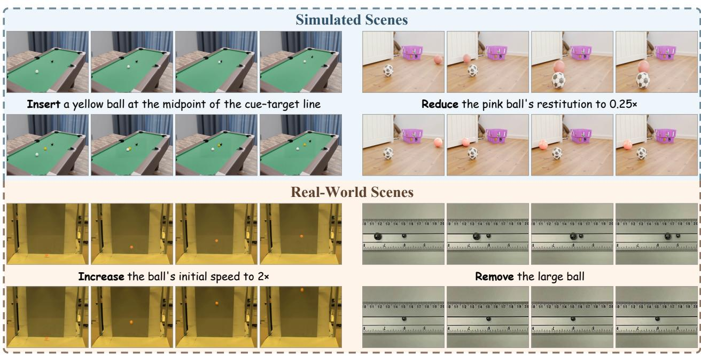  
Figure 1 VideoPhysEdit results in simulated and real-world scenes. Each example shows a source video (top), a physical edit, and its counterfactual video (bottom).

## Abstract

Video editing has advanced substantially in recent years, with methods increasingly accounting for the visual consequences of edits, such as changes to shadows and occlusions. However, the physical consequences of edits, including changes to subsequent motion and interactions, remain less explored. We formulate this problem as physical counterfactual video editing (PCVE), which aims to generate a counterfactual video depicting the resulting motion and interactions given a source video, a physical edit, and its execution frame. PCVE is challenging because it requires understanding scene physics and inferring the downstream motion and interactions induced by a physical intervention, while paired factual and counterfactual data and dedicated evaluation metrics are lacking. We introduce VideoPhysEdit, a new training-free pipeline for PCVE in rigid-body scenes. It makes physical reasoning explicit through a novel physical scene reconstruction method that recovers a scene reproducing the observed motion and interactions under simulation, enabling the pipeline to apply physical edits as interventions and use the resulting trajectories to guide counterfactual video generation. We further construct PCVE-RigidBench, a synthetic benchmark with paired source and counterfactual target videos and physical ground truth, and introduce the Physical Edit Score. VideoPhysEdit achieves substantially higher physical edit accuracy than open-source methods and commercial models while maintaining competitive visual fidelity. Its Physical Edit Score is 0.376, the only positive score among the compared methods. Qualitative comparisons on real videos further show that VideoPhysEdit applies to real-world scenes and better depicts the downstream motion and interactions induced by the edits than the compared methods.

## 1 Introduction

Modern video editing methods support diverse content modifications [16, 23, 38, 44, 58] and increasingly account for visual consequences, such as changes to shadows [30, 35], reflections [29], and occlusions [28]. Yet an edit may also have physical consequences, including changes to subsequent motion and interactions. As illustrated in Figure 1, inserting an object can introduce new collisions, changing restitution can alter rebound motion, and removing an object can eliminate downstream interactions.

Prior work has explored physics-aware video editing, but existing methods typically support only a limited range of edits [42] or rely on predefined physical models or external 3D proxies [5, 20]. To our knowledge, diverse physical interventions and their consequences for subsequent motion and interactions remain less explored as a unified video editing task.

If we treat the scene evolution recorded in the source video as factual, another possible evolution induced by changes to scene composition, object states, or physical parameters constitutes a physical counterfactual. We refer to this problem as physical counterfactual video editing (PCVE). We consider three types of physical edits: inserting or removing an object, modifying an object’s motion state, and altering physical parameters of an object or the scene. Executing such an edit at a specified frame constitutes a physical intervention. Given a source video, a physical edit, and its execution frame, the task is to produce a counterfactual video that preserves the factual history before the intervention and evolves thereafter under the altered physical conditions.

This task presents two main challenges. First, physical counterfactual video editing requires understanding scene physics and inferring the downstream motion and interactions induced by a physical intervention. Generative video editing methods are powerful at synthesizing realistic visual content, but they rely primarily on information encoded in image and video representations, limiting their ability to perform such physical reasoning. Second, paired factual and counterfactual data for supervision and evaluation are not naturally available, and dedicated metrics for physical editing are lacking. A video records only the factual evolution and cannot reveal the counterfactual evolution under an alternative intervention, while conventional video editing metrics do not measure whether the resulting motion and interactions are physically correct.

We introduce VideoPhysEdit, a new training-free pipeline for physical counterfactual video editing in rigid-body scenes. It makes physical reasoning explicit through a novel physical scene reconstruction method that organizes source video observations into stable intervals and transition episodes, combines geometric and rigid-body constraints to initialize object states and physical parameters, and refines them to recover a physical scene whose simulation reproduces the observed motion and interactions. VideoPhysEdit then grounds the physical edit in this scene, applies it as an intervention, and uses the resulting trajectories to guide counterfactual video generation.

To address the lack of paired factual and counterfactual data and dedicated evaluation metrics, we construct PCVE-RigidBench, which provides paired source and counterfactual target videos with physical ground truth, and introduce the Physical Edit Score to measure the reduction in trajectory error against the counterfactual target relative to the unchanged source video. On PCVE-RigidBench, VideoPhysEdit achieves substantially higher physical edit accuracy than open-source methods and commercial models, including Seedance 2.5 [8] and MiniMax H3 [41], while maintaining competitive visual fidelity. Its Physical Edit Score is 0.376, the only positive score among the compared methods, and it reduces trajectory error by 54.0% relative to the strongest competing method. Qualitative comparisons on real videos further show that VideoPhysEdit applies to real-world scenes and better depicts the downstream motion and interactions induced by the edits than the compared methods.

Our contributions are as follows: (1) We formulate PCVE as a unified task for physical interventions and downstream consequences. (2) We introduce VideoPhysEdit, a new training-free pipeline featuring a novel physical scene reconstruction method. (3) We construct PCVE-RigidBench with paired factual and counterfactual data and physical ground truth, and introduce the Physical Edit Score. Extensive quantitative evaluations demonstrate substantial improvements in physical edit accuracy, while qualitative results show applicability to real-world videos.

## 2 Related Work

## 2.1 Physics-Aware Video Editing

Video editing methods typically build on pretrained image or video generative models, combining attention or feature reuse [16, 24, 28, 44, 51, 52, 58] with cross-frame constraints and editable masks or layers [14, 22, 29– 31, 40] to maintain visual quality and temporal consistency. However, these methods primarily target visual content and spatiotemporal structure, rather than the physical changes caused by an edit and their downstream consequences. Although some methods also allow users to specify motion changes [7, 31, 43, 54], they control motion primarily by prescribing target trajectories, rather than enabling edits to upstream factors such as scene composition, object states, or physical parameters.

Physics-aware video editing methods incorporate physical models or reasoning to account for these consequences. Bazin et al. [5] fit a predefined physical simulation to the motion observed in a source video and allow users to edit its physical parameters. Calipso [20] instead performs physical manipulations on external CAD proxies and transfers the results back to video. Both produce physics-based edits but depend on a predefined physical model and additional 3D information, respectively. AutoVFX [21] creates physically grounded visual efects from a reconstructed static 3D scene using programs generated by a large language model, but relies on a multi-view capture of the static scene. VOID [42] is the closest recent method to our setting. It uses a VLM to infer which objects and image regions may be afected by target removal and encodes them as 2D masks that guide a video difusion model to generate the resulting downstream changes. To obtain counterfactual supervision, it constructs paired synthetic removal data using Kubric [17] and HUMOTO [37]. However, VOID specializes in object removal: its intervention representation and paired supervision do not cover object insertion, motion state modification, or physical parameter editing. In contrast, PCVE defines a unified setting for inferring the downstream consequences of diverse physical interventions from motion and interactions observed in a source video.

## 2.2 4D Reconstruction and Physical Modeling

Several lines of work underpin physical scene reconstruction from video. DreamScene4D [12], GFlow [57], Shape of Motion [56], and DyST [50] recover scene geometry and motion. Beyond geometry and motion, PPR [60], NeuPhysics [45], and the work of Gao et al. [15] incorporate physical models to recover physical properties or dynamics from observed motion. These methods recover observed geometry, motion, or latent physical quantities, but do not generally target an executable physical scene model that reproduces multi-object motion and contact through simulation.

Recent work explores constructing simulation-ready scene representations from video. Vid2Sim [9] and MonoPhysics [47] recover appearance, geometry, and physical parameters for deformable object simulation, while MOSIV [34] uses diferentiable simulation to identify material parameters in multi-object systems from multi-view observations. From a monocular video, OVOW [10] recovers an instance-level physical 4D scene with object geometry, motion, support, and contact information, but represents motion using recovered trajectories or vertex deformations instead of an identified dynamical model that reproduces it through simulation. ΔYNAMICS [26] uses a VLM to infer a rigid-body configuration that reproduces the observed motion. However, it is trained on synthetic simulations and assumes a simple ground-plane environment without reconstructing scene-specific support and collision geometry. PhysMind [59] targets physical reasoning, fitting analytic dynamics and latent physical parameters to recovered 3D trajectories to construct an executable world. VideoPhysEdit instead refines the reconstructed physical scene by matching simulated and observed masks, obtaining the geometric and temporal alignment needed for counterfactual video generation.

## 2.3 Physical Video Benchmarks

Recent benchmarks evaluate video generation and editing from complementary perspectives on physical realism and edit fidelity. VideoPhy [3], VideoPhy-2 [4], PhyGenBench [39], T2VPhysBench [19], and PhyWorldBench [18] evaluate physical commonsense or adherence to physical laws in text-to-video generation. FiVE-Bench [32] evaluates instruction following and visual quality in fine-grained video editing, while PVIR [33] focuses on removal-induced visual efects, such as changes in shadows and reflections. CRONOS [6] evaluates video predictions under counterfactual changes in viewpoint, scene, object appearance, or object category while retaining the same physical event type. PCVE-RigidBench instead directly intervenes on scene composition, object states, or physical parameters and evaluates the resulting motion and interactions against counterfactual target videos and physical ground truth.

## 3 Method

## 3.1 Problem Formulation

In this work, we use physical edit to refer to three types of video edits: inserting or removing an object, modifying an object’s motion state, and altering physical parameters of an object or the scene. Given a source video of $T$ frames, $V ^ { \mathrm { s r c } } = \{ I _ { t } \} _ { t = 1 } ^ { T } ,$ let � denote a physical edit specified in natural language and $t _ { e } \in \{ 1 , \ldots , T \}$ its execution frame. We call executing the physical edit � at frame $t _ { e }$ a physical intervention. With these definitions, physical counterfactual video editing aims to generate a counterfactual video

$$
V ^ { \mathrm { c f } } = \{ I _ { t } ^ { \mathrm { c f } } \} _ { t = 1 } ^ { T } = \mathcal { F } ( V ^ { \mathrm { s r c } } , e , t _ { e } ) ,\tag{1}
$$

where $\mathcal { F }$ denotes a physical counterfactual video editing method. The counterfactual video preserves the factual evolution of the source video before $t _ { e }$ and, from frame $t _ { e }$ onward, depicts the physical evolution induced by the intervention.

## 3.2 VideoPhysEdit Overview

Figure 2 presents the VideoPhysEdit pipeline. Its seven numbered modules are referred to as Stages 1–7 in the experiments and appendix. Given a source video, a physical edit, and its execution frame, VideoPhysEdit first identifies and tracks the objects involved in the observed motion and interactions, producing framewise masks with consistent identities. It then organizes the observed motion into stable intervals and transition episodes and reconstructs scene geometry and a 6DoF motion prior in a shared world coordinate system. Using the motion prior, support relations, and rigid-body constraints, it initializes the object states and physical parameters governing motion and contact, and further optimizes the initial states, physical parameters, and collision proxies so that the simulated motion and interactions match the observations (Section 3.3). Finally, it grounds the physical edit in the reconstructed scene, applies it at $t _ { e }$ as a physical intervention, and uses the simulated counterfactual trajectories together with an edited reference image to guide counterfactual video generation (Section 3.4).

## 3.3 Physical Scene Reconstruction

Recovering an executable physical scene from video is ill-posed because the same 2D observations may be explained by diferent combinations of scene geometry, 3D states, and physical parameters. We therefore seek a scene whose simulation reproduces the observed motion and interactions. We denote the physical scene at frame � by

$$
{ \cal S } _ { t } = \left( \mathcal { G } ^ { \mathrm { v i s } } , \mathcal { G } ^ { \mathrm { c o l } } , C , \Theta , { \bf s } _ { t } \right) .\tag{2}
$$

Here, ${ \mathcal { G } } ^ { \mathrm { v i s } }$ and $\boldsymbol { \mathcal { G } } ^ { \mathrm { c o l } }$ denote the visual meshes and collision proxies, respectively, $c$ denotes the camera, and Θ denotes the physical parameters of the objects and the scene. Starting from the initial state $\mathbf { s } _ { 1 }$ at the first video frame, physical simulation produces $\mathbf { s } _ { t }$ , which collects the position, orientation, linear velocity, and angular velocity of every object at frame �.

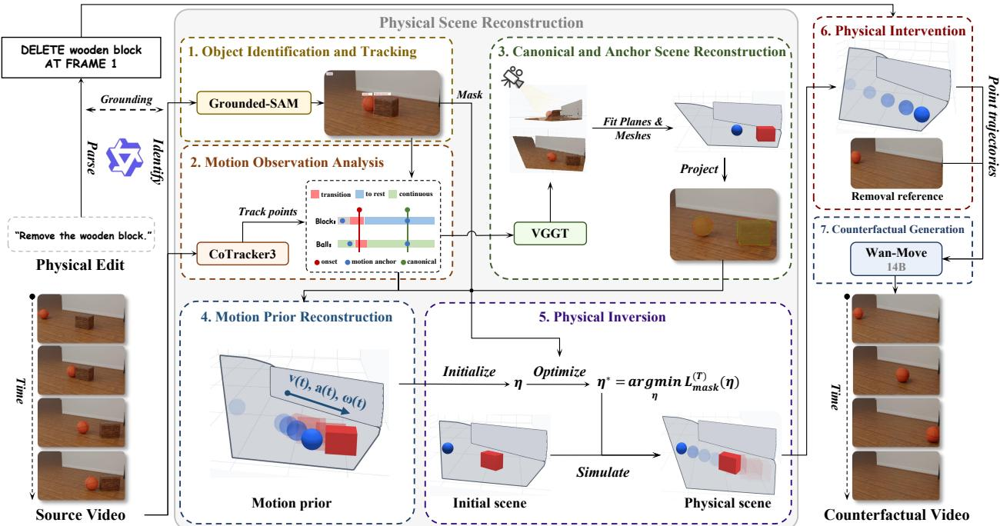  
Figure 2 Overview of VideoPhysEdit. We reconstruct an executable physical scene from the source video, apply the physical intervention, and use the simulated counterfactual trajectories and an edited reference image to guide counterfactual video generation.

Object Identification and Tracking. Given a source video and a physical edit, a vision-language model uses uniformly sampled video frames and the edit description to identify the categories of objects involved in the observed motion and interactions. An open-vocabulary object detector then locates instances of these categories in the first frame, with each instance assigned an object identity �. The detected bounding boxes initialize a video object segmentation model, which propagates per-object masks $M _ { i , t }$ through the video while maintaining consistent identities across frames. These masks provide observations for subsequent scene reconstruction and physical inversion.

Motion Observation Analysis. For each object �, we combine point tracks with its masks $M _ { i , t }$ to estimate 2D position, orientation, and observation reliability. We organize the observed motion into stable intervals explained by simple motion models and transition episodes surrounding changes in motion. To provide reliable references for 3D reconstruction, we select a canonical frame as the reference for the shared world coordinate system and one motion anchor frame for each stable interval. Appendix A.1 provides algorithmic details for motion modeling and frame selection.

Canonical and Anchor Scene Reconstruction. From the canonical frame and nearby frames, we estimate camera parameters and point clouds, recover static scene planes, fit each object with a textured sphere or box visual mesh, and establish a shared world coordinate system. We optimize each object’s scale $\sigma > 0 ,$ , rotation $\mathbf { R } \in { \mathrm { S O } } ( 3 )$ , and translation $\mathbf { t } \in \mathbb { R } ^ { 3 }$ using the placement loss

$$
\begin{array} { r } { \mathcal { L } _ { \mathrm { p l a c e } } = \lambda _ { 3 \mathrm { D } } \mathcal { L } _ { 3 \mathrm { D } } + \lambda _ { \mathrm { I o U } } \mathcal { L } _ { \mathrm { I o U } } + \lambda _ { \mathrm { D i c e } } \mathcal { L } _ { \mathrm { D i c e } } + \mathcal { L } _ { \mathrm { r e g } } + \lambda _ { \mathrm { s u p } } \mathcal { L } _ { \mathrm { s u p } } . } \end{array}\tag{3}
$$

The loss combines 3D correspondence, silhouette alignment via IoU and Dice, initialization regularization, and support consistency. The resulting placements define the canonical scene. We then use the static background to align each motion anchor reconstruction with the canonical scene and estimate object poses at the fixed canonical scale, yielding anchor scenes in this coordinate system. Appendix A.2 describes these reconstruction and placement steps in detail.

Motion Prior Reconstruction. Using the stable intervals, transition episodes, and reconstructed anchor scenes, we lift image observations into the shared world coordinate system and fit each object’s translation and rotation against the source video masks. Simple motion models describe the stable intervals, while boundaryconstrained curves connect them through the transition episodes. The resulting sequence forms the 6DoF motion prior $\widetilde { \mathbf { s } } _ { 1 : T }$ for physical inversion, providing continuous poses while allowing velocity changes at inferred impacts. Appendix A.3 describes how we construct the motion prior.

Physical Inversion. Physical inversion estimates the initial states and physical parameters that make the reconstructed scene reproduce the observed motion and interactions under simulation. We construct collision proxies from the reconstructed geometry and derive rigid-body constraints from the support relations and 6DoF motion prior. Stable intervals constrain force balance, friction, rolling, and energy, while contact events constrain momentum balance, restitution, and friction. We solve these constraints within physically valid parameter ranges, using explicit priors only for quantities that the observations do not determine. This initializes $\eta = ( \Theta , \mathbf { s } _ { 1 } , \mathcal { G } ^ { \mathrm { c o l } } )$ .

With this initialization, we refine � through simulation search, beginning with the initial stable interval and adding the next stable interval or transition episode at each step. For the set $\Omega _ { h }$ of object and frame pairs through frame $h ,$ we define the loss between simulated visible masks $\widehat { M } _ { i , t } ( \eta )$ and observed masks $M _ { i , t }$ as

$$
\mathcal { L } _ { \mathrm { m a s k } } ^ { ( h ) } ( \eta ) = \frac { 1 } { \vert \Omega _ { h } \vert } \sum _ { ( i , t ) \in \Omega _ { h } } \left[ 1 - \mathrm { I o U } \Big ( \widehat { M } _ { i , t } ( \eta ) , M _ { i , t } \Big ) \right] .\tag{4}
$$

At each step, we keep the best simulation and up to two distinct alternatives. After the final step, we compare every saved simulation over all frames and further refine the best one. The optimized variables $\eta ^ { * }$ and resulting state sequence $\mathbf { s } _ { 1 : T , }$ , together with the reconstructed visual meshes and camera, form the executable physical scene used for editing. Appendix A.4 further describes the constraints and simulation search.

## 3.4 Physical Intervention and Counterfactual Video Generation

Physical Intervention. We parse the physical edit instruction into a structured Add, Delete, or Set operation, using templates for quantitative benchmark instructions and a vision-language model for other requests. We bind the instruction’s object references to the persistent identities recovered from the source video and resolve relative quantities and spatial references in the reconstructed scene. At the execution frame $t _ { e } ,$ , we apply the parsed operation to the factual state and simulate the scene’s subsequent evolution to obtain the counterfactual state sequence. We then convert the simulated counterfactual motion into projected point trajectories and prepare an edited reference image at the execution frame, providing motion and appearance controls for counterfactual video generation. The intervention procedure is described in Appendix A.5.

Counterfactual Video Generation. Finally, we use a pretrained video generation model conditioned on the projected point trajectories, edited reference image, and a scene prompt to generate the counterfactual continuation. Further details of video generation are given in Appendix A.6.

## 4 PCVE-RigidBench

To evaluate the downstream consequences of physical edits, we construct PCVE-RigidBench with 20 synthetic rigid-body scenes spanning impacts, rebounds, rolling, sliding, falls, and collision chains. We simulate each source evolution and its counterfactual evolutions in PyBullet and render the resulting videos in Blender. The benchmark contains 129 editing tasks, each pairing a source video and a physical edit with a counterfactual target video and corresponding physical ground truth. The benchmark covers object insertion and removal and changes to initial velocity, mass, friction, or restitution. Each task applies the intervention either at the first frame or partway through the video and provides two descriptions: a quantitative description specifying its execution frame and numerical or spatial change, and a qualitative description giving its direction and coarse timing.

To compare how well generated videos capture physical changes of diferent magnitudes, we introduce Physical Edit Score (PES). PES evaluates only objects present in the source video whose motion or presence changes after the intervention. Let $\mathrm { T E } _ { i } ^ { \mathrm { p r e d } }$ and $\mathrm { T E } _ { i } ^ { \mathrm { n u l l } }$ denote the trajectory errors of the generated and unchanged source videos against the counterfactual target for object �. Summing over these objects,

$$
\mathrm { P E S } = \mathrm { m a x } \left( 1 - \frac { \sum _ { i } \mathrm { T E } _ { i } ^ { \mathrm { p r e d } } } { \sum _ { i } \mathrm { T E } _ { i } ^ { \mathrm { n u l l } } } , - 1 \right) .\tag{5}
$$

A score of one indicates zero scored error relative to the counterfactual target, zero indicates no improvement over the unchanged source, and a negative score indicates worse performance than that baseline. Details are provided in Appendix B.

## 5 Experiments

## 5.1 Experimental Setup

Implementation. VideoPhysEdit uses Qwen3-VL [2] to parse natural language physical edits and identify the referenced objects in the source video. Grounding DINO [36] and SAM 2 [46] provide object observations, CoTracker3 [27] provides point tracks, and VGGT [55] with SuperGlue [49] reconstructs the scene. PyBullet [13] simulates the observed and counterfactual motion. ObjectClear [61] prepares reference images for Delete operations, while Insert Anything [53] and Cube3D [48] provide appearance and geometry for inserted objects. Wan-Move [11] generates the counterfactual video. All pretrained components use released checkpoints. Model variants and generation settings are provided in Appendix C.1.1.

Baselines. We compare VideoPhysEdit with two open-source methods, VACE [25] and Ditto [1], and two commercial models, MiniMax H3 [41] and Seedance 2.5 [8]. Each method receives the same source video and quantitative English edit instruction. For object removal, we additionally compare with VOID [42]. We include the unchanged source video as the No edit baseline. For physical edit accuracy, we report Trajectory Error (TE), Physical Edit Score (PES), and Mask IoU. For visual fidelity, we report PSNR, SSIM, LPIPS, CLIP image similarity, and FVD. Appendix B provides metric definitions and aggregation details.

## 5.2 Main Results on PCVE-RigidBench

Table 1 shows that VideoPhysEdit achieves the best physical edit accuracy among the evaluated methods. It reduces TE by 54.0% relative to the strongest competing method, achieves the highest Mask IoU and PES, and is the only method with a positive PES. For other afected objects, whose motion changes as a consequence of the edit, VideoPhysEdit is again the only method with a positive PES, reaching 0.276, as shown in Appendix Table 9. This shows that the method more accurately depicts the changes in other objects’ motion caused by the edit. For visual fidelity, VideoPhysEdit remains close to Seedance 2.5 in PSNR, SSIM, LPIPS, and CLIP similarity while achieving the best FVD. Together, these results show that VideoPhysEdit produces substantially more accurate physical edits while retaining comparable visual fidelity.

As shown in Figure 3, VideoPhysEdit follows the requested changes in motion and interaction while preserving the source scene. Increasing the large marble’s mass changes the motion of both marbles after impact, and reducing the toy car’s initial speed prevents its later collision with the ball. Edits to projectile velocity and object removal before a collision further demonstrate applicability to real videos. In comparison, the other methods more often retain the source motion or alter the scene appearance.

Table 1 Comparison on PCVE-RigidBench. Bold marks the best result among methods.
<table><tr><td rowspan="2">Method</td><td colspan="3">Physical Edit Accuracy</td><td colspan="5">Visual Fidelity</td></tr><tr><td>PES↑</td><td>TE↓</td><td>Mask IoU↑</td><td>PSNR↑</td><td>SSIM↑</td><td>LPIPS↓</td><td>CLIP↑</td><td>FVD↓</td></tr><tr><td>VACE</td><td>-0.042</td><td>146.26</td><td>0.273</td><td>14.06</td><td>0.728</td><td>0.447</td><td>0.795</td><td>1184.37</td></tr><tr><td>Ditto</td><td>-0.120</td><td>149.94</td><td>0.264</td><td>22.07</td><td>0.812</td><td>0.206</td><td>0.850</td><td>551.14</td></tr><tr><td>MiniMax H3</td><td>-0.096</td><td>152.00</td><td>0.250</td><td>24.87</td><td>0.870</td><td>0.127</td><td>0.906</td><td>246.45</td></tr><tr><td>Seedance 2.5</td><td>-0.087</td><td>144.99</td><td>0.231</td><td>28.85</td><td>0.928</td><td>0.080</td><td>0.932</td><td>246.67</td></tr><tr><td>No edit</td><td>0.000</td><td>143.13</td><td>0.289</td><td>31.23</td><td>0.974</td><td>0.036</td><td>0.957</td><td>249.68</td></tr><tr><td>VideoPhysEdit</td><td>0.376</td><td>66.70</td><td>0.421</td><td>27.51</td><td>0.925</td><td>0.104</td><td>0.929</td><td>182.46</td></tr></table>

Table 2 Results on the object removal tasks. Bold marks the best result among methods.
<table><tr><td rowspan="2">Method</td><td colspan="3">Physical Edit Accuracy</td><td colspan="5">Visual Fidelity</td></tr><tr><td>PES↑</td><td>TE↓</td><td>Mask IoU↑</td><td>PSNR↑</td><td>SSIM↑</td><td>LPIPS↓</td><td>CLIP↑</td><td>FVD↓</td></tr><tr><td>VACE</td><td>-0.001</td><td>140.72</td><td>0.307</td><td>12.34</td><td>0.651</td><td>0.503</td><td>0.762</td><td>1782.50</td></tr><tr><td>Ditto</td><td>-0.041</td><td>153.98</td><td>0.255</td><td>21.13</td><td>0.805</td><td>0.246</td><td>0.790</td><td>892.24</td></tr><tr><td>MiniMax H3</td><td>0.383</td><td>96.24</td><td>0.361</td><td>25.23</td><td>0.889</td><td>0.104</td><td>0.914</td><td>256.52</td></tr><tr><td>Seedance 2.5</td><td>0.290</td><td>106.76</td><td>0.245</td><td>27.86</td><td>0.892</td><td>0.085</td><td>0.927</td><td>272.93</td></tr><tr><td>VOID</td><td>0.394</td><td>84.07</td><td>0.314</td><td>29.22</td><td>0.914</td><td>0.168</td><td>0.862</td><td>262.43</td></tr><tr><td>No edit</td><td>0.000</td><td>140.52</td><td>0.317</td><td>29.86</td><td>0.972</td><td>0.044</td><td>0.941</td><td>350.27</td></tr><tr><td>VideoPhysEdit</td><td>0.633</td><td>52.99</td><td>0.496</td><td>26.31</td><td>0.921</td><td>0.110</td><td>0.926</td><td>230.29</td></tr></table>

We further include VOID, a method designed specifically for object removal, in the comparison on the object removal tasks in PCVE-RigidBench. As shown in Table 2, VideoPhysEdit achieves the best physical edit accuracy. It reduces TE by 37.0% relative to VOID and obtains the highest PES and Mask IoU. VOID obtains the highest PSNR, consistent with its preservation of unafected source regions and restriction of generation to the removed object and regions predicted to change.

Table 3 Accuracy across pipeline stages. Arrows indicate before and after values.
<table><tr><td>Output</td><td>Metric</td><td>Result</td></tr><tr><td>Stage 3 →4</td><td>Mask IoU ↑</td><td>0.883 → 0.887</td></tr><tr><td>Stage 5</td><td>Stage 5 Mask IoU ↑</td><td>0.375 → 0.678</td></tr><tr><td>init. → opt.</td><td>Stage 6 PES ↑</td><td>0.269 → 0.403</td></tr><tr><td rowspan="3">Stage 6 → 7</td><td>PES ↑</td><td> $0 . 3 9 8  0 . 4 1 2$ </td></tr><tr><td>TE↓</td><td> $6 3 . 3 9  6 4 . 7 6$ </td></tr><tr><td>Mask IoU ↑</td><td> $0 . 3 9 1  0 . 4 1 2$ </td></tr></table>

VideoPhysEdit achieves the best SSIM and FVD, while its LPIPS and CLIP similarity remain competitive. Appendix C.6 provides qualitative comparisons with VOID on two PCVE-RigidBench removal tasks and two real collision videos. VideoPhysEdit therefore removes the requested objects more accurately and reproduces their efects on subsequent motion while preserving visual quality.

Taken together, these results show that visually plausible video generation alone does not ensure a successful physical edit. The comparison methods infer the counterfactual evolution directly from the source video and instruction, and their outputs often retain the source motion or miss later efects of the edit. Explicitly describing the downstream consequences in the instruction does not yield consistent improvements (Appendix C.5). This suggests that explicitly grounding the physical intervention in an executable physical scene whose simulation reproduces the observed motion and interactions provides a more reliable basis for physical counterfactual video editing than inferring the intervention’s consequences implicitly.

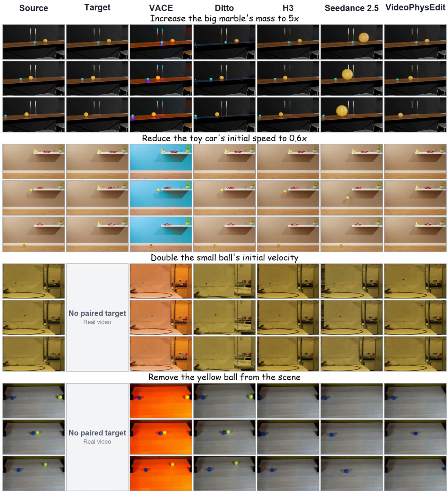  
Figure 3 Qualitative comparison on two synthetic (top) and two real (bottom) videos.

## 5.3 Analysis

We analyze the intermediate outputs to determine how reconstruction accuracy propagates to counterfactual trajectories and the final video. As shown in Table 3, the Stage 3 canonical and motion anchor scenes recover the source scene, and the Stage 4 motion prior maintains this alignment over the complete sequence. Stage 5 then fits one physical rollout to the observed motion. Simulation search and final refinement improve both this factual rollout and the Stage 6 counterfactual trajectories relative to the calibrated initialization. Stage 7 preserves the resulting motion: on matched objects and frames, TE remains nearly unchanged, while PES and Mask IoU improve slightly. These results connect accurate reconstruction of the source video to accurate counterfactual trajectories and show that video generation primarily restores the source appearance.

We further analyze the pipeline’s robustness to incomplete or ambiguous observations. The pipeline resolves uncertainty progressively across stages rather than relying on any single observation. Stage 3 combines object geometry, support relations, and motion anchor frames to recover a consistent scene, while Stages 4 and 5 use evidence across time to reconstruct missing motion and distinguish candidate simulations. Stage 7 then uses adaptive temporal scaling and the interaction ROI to follow fast trajectories and preserve small objects during contact. Together, these mechanisms reduce the influence of missing or ambiguous evidence in any single frame on the final edit. Section C.2.2 provides the complete results and examples.

Appendix C.2.3 examines boundary cases, including two scenes for which the pipeline produces no valid edited videos. Appendix C further reports pipeline analysis, the simulation search ablation, runtime and peak GPU memory, the efect of explicit downstream consequences, and additional visual results on PCVE-RigidBench and real videos.

## 6 Conclusion

In this work, we formulate physical counterfactual video editing as a unified task and introduce VideoPhysEdit, a training-free pipeline that reconstructs an executable physical scene and guides counterfactual video generation using simulated counterfactual trajectories. We also construct PCVE-RigidBench and introduce the Physical Edit Score. VideoPhysEdit achieves substantially higher physical edit accuracy than open-source methods and commercial models, while qualitative comparisons on real videos further show that it applies to real-world scenes and better depicts the downstream motion and interactions induced by the edits than the compared methods. Future work will explore camera motion, richer geometry, and physical models for articulated or actively controlled agents. More broadly, VideoPhysEdit establishes a framework for PCVE in which explicit physical reasoning guides visual generation, enabling video editing to change not only how a scene looks, but also what happens after a physical edit.

## References

[1] Qingyan Bai, Qiuyu Wang, Hao Ouyang, Yue Yu, Hanlin Wang, Wen Wang, Ka Leong Cheng, Shuailei Ma, Yanhong Zeng, Zichen Liu, Yinghao Xu, Yujun Shen, and Qifeng Chen. Scaling instruction-based video editing with a high-quality synthetic dataset. In Proceedings of the IEEE/CVF Conference on Computer Vision and Pattern Recognition (CVPR), pages 37971–37981, June 2026.

[2] Shuai Bai, Yuxuan Cai, Ruizhe Chen, Keqin Chen, Xionghui Chen, Zesen Cheng, Lianghao Deng, Wei Ding, Chang Gao, Chunjiang Ge, Wenbin Ge, Zhifang Guo, Qidong Huang, Jie Huang, Fei Huang, Binyuan Hui, Shutong Jiang, Zhaohai Li, Mingsheng Li, Mei Li, Kaixin Li, Zicheng Lin, Junyang Lin, Xuejing Liu, Jiawei Liu, Chenglong Liu, Yang Liu, Dayiheng Liu, Shixuan Liu, Dunjie Lu, Ruilin Luo, Chenxu Lv, Rui Men, Lingchen Meng, Xuancheng Ren, Xingzhang Ren, Sibo Song, Yuchong Sun, Jun Tang, Jianhong Tu, Jianqiang Wan, Peng Wang, Pengfei Wang, Qiuyue Wang, Yuxuan Wang, Tianbao Xie, Yiheng Xu, Haiyang Xu, Jin Xu, Zhibo Yang, Mingkun Yang, Jianxin Yang, An Yang, Bowen Yu, Fei Zhang, Hang Zhang, Xi Zhang, Bo Zheng, Humen Zhong, Jingren Zhou, Fan Zhou, Jing Zhou, Yuanzhi Zhu, and Ke Zhu. Qwen3-VL technical report. arXiv preprint arXiv:2511.21631, 2025.

[3] Hritik Bansal, Zongyu Lin, Tianyi Xie, Zeshun Zong, Michal Yarom, Yonatan Bitton, Chenfanfu Jiang, Yizhou Sun, Kai-Wei Chang, and Aditya Grover. VideoPhy: Evaluating physical commonsense for video generation. In Y. Yue, A. Garg, N. Peng, F. Sha, and R. Yu, editors, International Conference on Learning Representations, volume 2025, pages 102075–102121, 2025.

[4] Hritik Bansal, Clark Peng, Yonatan Bitton, Roman Goldenberg, Aditya Grover, and Kai-Wei Chang. VideoPhy-2: A challenging action-centric physical commonsense evaluation in video generation. In C. Vondrick, B. Hariharan, C. Rafel, L. Pinto, D. Yang, and A. Faust, editors, International Conference on Learning Representations, volume 2026, pages 118456–118470, 2026.

[5] Jean-Charles Bazin, Claudia Plüss (Kuster), Guo Yu, Tobias Martin, Alec Jacobson, and Markus Gross. Physically based video editing. Computer Graphics Forum, 35(7):421–429, 2016. doi: 10.1111/cgf.13039.

[6] León Begiristain, Olaf Dünkel, and Adam Kortylewski. CRONOS: Benchmarking counterfactual physical consistency in video models, 2026. arXiv:2605.23699.

[7] Ryan Burgert, Charles Herrmann, Forrester Cole, Michael S Ryoo, Neal Wadhwa, Andrey Voynov, and Nataniel Ruiz. MotionV2V: Editing motion in a video. In Proceedings ofthe IEEE/CVF Conference on Computer Vision and Pattern Recognition (CVPR), pages 35988–35997, June 2026.

[8] ByteDance Seed Team. One-take creation, flexible referencing: Introducing Seedance 2.5. ByteDance Seed, July 2026.

[9] Chuhao Chen, Zhiyang Dou, Chen Wang, Yiming Huang, Anjun Chen, Qiao Feng, Jiatao Gu, and Lingjie Liu. Vid2Sim: Generalizable, video-based reconstruction of appearance, geometry and physics for mesh-free simulation. In Proceedings of the IEEE/CVF Conference on Computer Vision and Pattern Recognition (CVPR), pages 26545–26555, June 2025.

[10] Junhao Chen, Boran Zhang, Mingjin Chen, Henghaofan Zhang, Saining Zhang, Congcong Zhu, Hao Zhao, Ruqi Huang, Zhihao Li, and Yufei Wang. One video, one world: Turning monocular video into physical 4D scenes, 2026. arXiv:2606.31388.

[11] Ruihang Chu, Yefei He, Zhekai Chen, Shiwei Zhang, Xiaogang Xu, Bin Xia, Dingdong Wang, Hongwei Yi, Xihui Liu, Hengshuang Zhao, Yu Liu, Yingya Zhang, and Yujiu Yang. Wan-Move: Motion-controllable video generation via latent trajectory guidance. In Advances in Neural Information Processing Systems, volume 38, pages 404–432, 2025. doi: 10.52202/085713-0014.

[12] Wen-Hsuan Chu, Lei Ke, and Katerina Fragkiadaki. DreamScene4D: Dynamic multi-object scene generation from monocular videos. In A. Globerson, L. Mackey, D. Belgrave, A. Fan, U. Paquet, J. Tomczak, and C. Zhang, editors, Advances in Neural Information Processing Systems, volume 37, pages 96181–96206. Curran Associates, Inc., 2024. doi: 10.52202/079017-3048.

[13] Erwin Coumans and Yunfei Bai. PyBullet, a Python module for physics simulation for games, robotics and machine learning. PyBullet project, 2016–2021.

[14] Yang Fu, Yike Zheng, Ziyun Dai, and Henghui Ding. EfectErase: Joint video object removal and insertion for high-quality efect erasing. In Proceedings of the IEEE/CVF Conference on Computer Vision and Pattern Recognition (CVPR), pages 2005–2014, June 2026.

[15] Zhiyuan Gao, Jiageng Mao, Hong-Xing Yu, Haozhe Lou, Emily Yue-ting Jia, Jernej Barbič, Jiajun Wu, and Yue Wang. Seeing the wind from a falling leaf. In Advances in Neural Information Processing Systems, volume 38, Main Conference, pages 48278–48298, 2025.

[16] Michal Geyer, Omer Bar Tal, Shai Bagon, and Tali Dekel. TokenFlow: Consistent difusion features for consistent video editing. In B. Kim, Y. Yue, S. Chaudhuri, K. Fragkiadaki, M. Khan, and Y. Sun, editors, International Conference on Learning Representations, volume 2024, pages 1608–1620, 2024.

[17] Klaus Gref, Francois Belletti, Lucas Beyer, Carl Doersch, Yilun Du, Daniel Duckworth, David J. Fleet, Dan Gnanapragasam, Florian Golemo, Charles Herrmann, Thomas Kipf, Abhijit Kundu, Dmitry Lagun, Issam Laradji, Hsueh-Ti (Derek) Liu, Henning Meyer, Yishu Miao, Derek Nowrouzezahrai, Cengiz Oztireli, Etienne Pot, Noha Radwan, Daniel Rebain, Sara Sabour, Mehdi S. M. Sajjadi, Matan Sela, Vincent Sitzmann, Austin Stone, Deqing Sun, Suhani Vora, Ziyu Wang, Tianhao Wu, Kwang Moo Yi, Fangcheng Zhong, and Andrea Tagliasacchi. Kubric: A scalable dataset generator. In Proceedings of the IEEE/CVF Conference on Computer Vision and Pattern Recognition (CVPR), pages 3749–3761, June 2022.

[18] Jing Gu, Xian Liu, Yu Zeng, Ashwin Nagarajan, Fangrui Zhu, Daniel Hong, Yue Fan, Qianqi Yan, Kaiwen Zhou, Ming-Yu Liu, and Xin Eric Wang. PhyWorldBench: A comprehensive evaluation of physical realism in text-to-video models. In International Conference on Learning Representations, 2026.

[19] Xuyang Guo, Jiayan Huo, Zhenmei Shi, Zhao Song, Jiahao Zhang, and Jiale Zhao. T2VPhysBench: A first-principles benchmark for physical consistency in text-to-video generation, 2025. arXiv:2505.00337.

[20] Nazim Haouchine, Frederick Roy, Hadrien Courtecuisse, Matthias Nießner, and Stephane Cotin. Calipso: physics based image and video editing through CAD model proxies. The Visual Computer, 36(1):211–226, Jan 2020. doi: 10.1007/s00371-018-1600-0.

[21] Hao-Yu Hsu, Chih-Hao Lin, Albert J. Zhai, Hongchi Xia, and Shenlong Wang. AutoVFX: Physically realistic video editing from natural language instructions. In 2025 International Conference on 3D Vision (3DV), page 769–780. IEEE, March 2025. doi: 10.1109/3dv66043.2025.00076.

[22] Yihan Hu, Xuelin Chen, and Xiaodong Cun. EasyOmnimatte: Taming pretrained inpainting difusion models for end-to-end video layered decomposition. In Proceedings ofthe IEEE/CVF Conference on Computer Vision and Pattern Recognition (CVPR), pages 43341–43351, June 2026.

[23] Xijie Huang, Chengming Xu, Donghao Luo, Xiaobin Hu, Peng Tang, Xu Peng, Jiangning Zhang, Chengjie Wang, and Yanwei Fu. FFP-300K: Scaling first-frame propagation for generalizable video editing. In Proceedings ofthe IEEE/CVF Conference on Computer Vision and Pattern Recognition (CVPR), pages 23172–23181, June 2026.

[24] Yi Huang, Wei Xiong, He Zhang, Chaoqi Chen, Jianzhuang Liu, Mingfu Yan, and Shifeng Chen. DIVE: Taming DINO for subject-driven video editing. In Proceedings of the IEEE/CVF International Conference on Computer Vision (ICCV), pages 16004–16014, October 2025.

[25] Zeyinzi Jiang, Zhen Han, Chaojie Mao, Jingfeng Zhang, Yulin Pan, and Yu Liu. VACE: All-in-one video creation and editing. In Proceedings of the IEEE/CVF International Conference on Computer Vision (ICCV), pages 17191–17202, October 2025.

[26] Chia-Hsiang Kao, Cong Phuoc Huynh, Chien-Yi Wang, Noranart Vesdapunt, Stefan Stojanov, Bharath Hariharan, Oleksandr Obiednikov, and Ning Zhou. Dynamics: Language-based representation for inferring rigid-body dynamics from videos. In Proceedings of the IEEE/CVF Conference on Computer Vision and Pattern Recognition (CVPR), pages 42364–42374, June 2026.

[27] Nikita Karaev, Yuri Makarov, Jianyuan Wang, Natalia Neverova, Andrea Vedaldi, and Christian Rupprecht. CoTracker3: Simpler and better point tracking by pseudo-labelling real videos. In Proceedings of the IEEE/CVF International Conference on Computer Vision (ICCV), pages 6013–6022, October 2025.

[28] Juil Koo, Paul Guerrero, Chun-Hao P. Huang, Duygu Ceylan, and Minhyuk Sung. VideoHandles: Editing 3D object compositions in videos using video generative priors. In Proceedings ofthe IEEE/CVF Conference on Computer Vision and Pattern Recognition (CVPR), pages 17692–17701, June 2025.

[29] Saksham Singh Kushwaha, Sayan Nag, Yapeng Tian, and Kuldeep Kulkarni. Object-WIPER: Training-free object and associated efect removal in videos. In Proceedings of the IEEE/CVF Conference on Computer Vision and Pattern Recognition (CVPR), pages 38071–38080, June 2026.

[30] Yao-Chih Lee, Erika Lu, Sarah Rumbley, Michal Geyer, Jia-Bin Huang, Tali Dekel, and Forrester Cole. Generative Omnimatte: Learning to decompose video into layers. In Proceedings of the IEEE/CVF Conference on Computer Vision and Pattern Recognition (CVPR), pages 12522–12532, June 2025.

[31] Yao-Chih Lee, Zhoutong Zhang, Jiahui Huang, Jui-Hsien Wang, Joon-Young Lee, Jia-Bin Huang, Eli Shechtman, and Zhengqi Li. Generative video motion editing with 3D point tracks. In Proceedings of the IEEE/CVF Conference on Computer Vision and Pattern Recognition (CVPR), pages 18306–18318, June 2026.

[32] Minghan Li, Chenxi Xie, Yichen Wu, Lei Zhang, and Mengyu Wang. FiVE-Bench: A fine-grained video editing benchmark for evaluating emerging difusion and rectified flow models. In Proceedings ofthe IEEE/CVF International Conference on Computer Vision (ICCV), pages 16672–16681, October 2025.

[33] Zirui Li, Xinghao Chen, Lingyu Jiang, Dengzhe Hou, Fangzhou Lin, Kazunori Yamada, Xiangbo Gao, and Zhengzhong Tu. Physics-aware video instance removal benchmark, 2026. arXiv:2604.05898.

[34] Chunjiang Liu, Xiaoyuan Wang, Qingran Lin, Albert Xiao, Haoyu Chen, Shizheng Wen, Hao Zhang, Lu Qi, Ming-Hsuan Yang, Laszlo A. Jeni, Min Xu, and Yizhou Zhao. Multi-object system identification from videos. In C. Vondrick, B. Hariharan, C. Rafel, L. Pinto, D. Yang, and A. Faust, editors, International Conference on Learning Representations, volume 2026, pages 66204–66234, 2026.

[35] Shaoteng Liu, Tianyu Wang, Jui-Hsien Wang, Qing Liu, Zhifei Zhang, Joon-Young Lee, Yijun Li, Bei Yu, Zhe Lin, Soo Ye Kim, and Jiaya Jia. Generative video propagation. In Proceedings of the IEEE/CVF Conference on Computer Vision and Pattern Recognition (CVPR), pages 17712–17722, June 2025.

[36] Shilong Liu, Zhaoyang Zeng, Tianhe Ren, Feng Li, Hao Zhang, Jie Yang, Qing Jiang, Chunyuan Li, Jianwei Yang, Hang Su, Jun Zhu, and Lei Zhang. Grounding DINO: Marrying DINO with grounded pre-training for open-set

object detection. In Aleš Leonardis, Elisa Ricci, Stefan Roth, Olga Russakovsky, Torsten Sattler, and Gül Varol, editors, Computer Vision – ECCV 2024, pages 38–55, Cham, 2025. Springer Nature Switzerland.

[37] Jiaxin Lu, Chun-Hao Paul Huang, Uttaran Bhattacharya, Qixing Huang, and Yi Zhou. HUMOTO: A 4D dataset of mocap human object interactions. In Proceedings of the IEEE/CVF International Conference on Computer Vision (ICCV), pages 10886–10897, October 2025.

[38] Jinjie Mai, Chaoyang Wang, Gordon Guocheng Qian, Willi Menapace, Sergey Tulyakov, Bernard Ghanem, Peter Wonka, and Ashkan Mirzaei. EasyV2V: A high-quality instruction-based video editing framework. In Proceedings of the IEEE/CVF Conference on Computer Vision and Pattern Recognition (CVPR), pages 30435–30445, June 2026.

[39] Fanqing Meng, Jiaqi Liao, Xinyu Tan, Quanfeng Lu, Wenqi Shao, Kaipeng Zhang, Yu Cheng, Dianqi Li, and Ping Luo. Towards world simulator: Crafting physical commonsense-based benchmark for video generation. In Aarti Singh, Maryam Fazel, Daniel Hsu, Simon Lacoste-Julien, Felix Berkenkamp, Tegan Maharaj, Kiri Wagstaf, and Jerry Zhu, editors, Proceedings of the 42nd International Conference on Machine Learning, volume 267 of Proceedings ofMachine Learning Research, pages 43781–43806. PMLR, 13–19 Jul 2025.

[40] Chenxuan Miao, Yutong Feng, Jianshu Zeng, Zixiang Gao, Hantang Liu, Yunfeng Yan, Donglian Qi, Xi Chen, Bin Wang, and Hengshuang Zhao. ROSE: Remove objects with side efects in videos. In D. Belgrave, C. Zhang, H. Lin, R. Pascanu, P. Koniusz, M. Ghassemi, and N. Chen, editors, Advances in Neural Information Processing Systems, volume 38, Main Conference, pages 149140–149162. Curran Associates, Inc., 2025. doi: 10.52202/085713-4988.

[41] MiniMax. MiniMax H3: An open model breaking the boundaries between tasks and modalities. MiniMax Research Blog, July 2026.

[42] Saman Motamed, William Harvey, Benjamin Klein, Luc Van Gool, Zhuoning Yuan, and Ta-Ying Cheng. VOID: Video object and interaction deletion. In Paolo Favaro, Zuzana Kukelova, Atsuto Maki, Anna Rohrbach, Konrad Schindler, and Federico Tombari, editors, Computer Vision – ECCV 2026, pages 245–261, Cham, 2026. Springer Nature Switzerland.

[43] Chong Mou, Mingdeng Cao, Xintao Wang, Zhaoyang Zhang, Ying Shan, and Jian Zhang. ReVideo: Remake a video with motion and content control. In A. Globerson, L. Mackey, D. Belgrave, A. Fan, U. Paquet, J. Tomczak, and C. Zhang, editors, Advances in Neural Information Processing Systems, volume 37, pages 18481–18505. Curran Associates, Inc., 2024. doi: 10.52202/079017-0586.

[44] Chenyang Qi, Xiaodong Cun, Yong Zhang, Chenyang Lei, Xintao Wang, Ying Shan, and Qifeng Chen. FateZero: Fusing attentions for zero-shot text-based video editing. In Proceedings of the IEEE/CVF International Conference on Computer Vision (ICCV), pages 15932–15942, October 2023.

[45] Yi-Ling Qiao, Alexander Gao, and Ming Lin. NeuPhysics: Editable neural geometry and physics from monocular videos. In S. Koyejo, S. Mohamed, A. Agarwal, D. Belgrave, K. Cho, and A. Oh, editors, Advances in Neural Information Processing Systems, volume 35, pages 12841–12854. Curran Associates, Inc., 2022. doi: 10.52202/068431-0933.

[46] Nikhila Ravi, Valentin Gabeur, Yuan-Ting Hu, Ronghang Hu, Chaitanya Ryali, Tengyu Ma, Haitham Khedr, Roman Rädle, Chloe Rolland, Laura Gustafson, Eric Mintun, Junting Pan, Kalyan Vasudev Alwala, Nicolas Carion, Chao-Yuan Wu, Ross Girshick, Piotr Dollar, and Christoph Feichtenhofer. SAM 2: Segment anything in images and videos. In Y. Yue, A. Garg, N. Peng, F. Sha, and R. Yu, editors, International Conference on Learning Representations, volume 2025, pages 28085–28128, 2025.

[47] Daniel Rho, Jun Myeong Choi, Matthew Thornton, Biswadip Dey, and Roni Sengupta. MonoPhysics: Estimating geometry, appearance, and physical parameters from monocular videos, 2026. arXiv:2605.30320.

[48] Roblox Foundation AI Team. Cube: A Roblox view of 3D intelligence. arXiv preprint arXiv:2503.15475, 2025.

[49] Paul-Edouard Sarlin, Daniel DeTone, Tomasz Malisiewicz, and Andrew Rabinovich. SuperGlue: Learning feature matching with graph neural networks. In Proceedings of the IEEE/CVF Conference on Computer Vision and Pattern Recognition (CVPR), pages 4938–4947, 2020.

[50] Maximilian Seitzer, Sjoerd van Steenkiste, Thomas Kipf, Klaus Gref, and Mehdi S. M. Sajjadi. DyST: Towards dynamic neural scene representations on real-world videos. In B. Kim, Y. Yue, S. Chaudhuri, K. Fragkiadaki, M. Khan, and Y. Sun, editors, International Conference on Learning Representations, volume 2024, pages 37052–37065, 2024.

[51] Wonyong Seo, Jaeho Moon, Jaehyup Lee, Soo Ye Kim, and Munchurl Kim. PropFly: Learning to propagate via on-the-fly supervision from pre-trained video difusion models. In Proceedings ofthe IEEE/CVF Conference on Computer Vision and Pattern Recognition (CVPR), pages 43228–43238, June 2026.

[52] Tiancheng Shen, Zilong Huang, Xiangtai Li, Zhijie Lin, Jiyang Liu, Yitong Wang, Jiashi Feng, Ming-Hsuan Yang, and Jun Hao Liew. QK-Edit: Revisiting attention-based injection in MM-DiT for image and video editing. In Proceedings ofthe IEEE/CVF International Conference on Computer Vision (ICCV), pages 19043–19053, October 2025.

[53] Wensong Song, Hong Jiang, Zongxin Yang, Zheqiao Cheng, Ruijie Quan, and Yi Yang. Insert Anything: Image insertion via in-context editing in DiT. Proceedings of the AAAI Conference on Artificial Intelligence, 40(11):9097–9105, March 2026. doi: 10.1609/aaai.v40i11.37866.

[54] Shuyuan Tu, Qi Dai, Zihao Zhang, Sicheng Xie, Zhi-Qi Cheng, Chong Luo, Xintong Han, Zuxuan Wu, and Yu-Gang Jiang. MotionFollower: Editing video motion via score-guided difusion. In Proceedings ofthe IEEE/CVF International Conference on Computer Vision (ICCV), pages 12822–12831, October 2025.

[55] Jianyuan Wang, Minghao Chen, Nikita Karaev, Andrea Vedaldi, Christian Rupprecht, and David Novotny. VGGT: Visual geometry grounded transformer. In Proceedings of the IEEE/CVF Conference on Computer Vision and Pattern Recognition (CVPR), pages 5294–5306, 2025.

[56] Qianqian Wang, Vickie Ye, Hang Gao, Weijia Zeng, Jake Austin, Zhengqi Li, and Angjoo Kanazawa. Shape of Motion: 4D reconstruction from a single video. In Proceedings of the IEEE/CVF International Conference on Computer Vision (ICCV), pages 9660–9672, October 2025.

[57] Shizun Wang, Xingyi Yang, Qiuhong Shen, Zhenxiang Jiang, and Xinchao Wang. GFlow: Recovering 4D world from monocular video. Proceedings ofthe AAAI Conference on Artificial Intelligence, 39(8):7862–7870, April 2025. doi: 10.1609/aaai.v39i8.32847.

[58] Yukun Wang, Longguang Wang, Zhiyuan Ma, Qibin Hu, Kai Xu, and Yulan Guo. VideoDirector: Precise video editing via text-to-video models. In Proceedings of the IEEE/CVF Conference on Computer Vision and Pattern Recognition (CVPR), pages 2589–2598, June 2025.

[59] Chen Yang, Shenxiang Zeng, Haoyang Zhao, Zhouyuan Xu, Youquan He, Haoyu Li, Mingyi Deng, Jiansheng Fan, and Chen Wang. PhysMind: From video to executable worlds for training-free physical reasoning, 2026. arXiv:2608.04575.

[60] Gengshan Yang, Shuo Yang, John Z. Zhang, Zachary Manchester, and Deva Ramanan. PPR: Physically plausible reconstruction from monocular videos. In Proceedings ofthe IEEE/CVF International Conference on Computer Vision (ICCV), pages 3914–3924, October 2023.

[61] Jixin Zhao, Zhouxia Wang, Peiqing Yang, and Shangchen Zhou. Precise object and efect removal with adaptive target-aware attention. In Proceedings of the IEEE/CVF Conference on Computer Vision and Pattern Recognition (CVPR), pages 19370–19379, 2026.

## Table of Contents for Appendix

A VideoPhysEdit Algorithmic Details 16   
A.1 Motion Observation Analysis 16   
A.2 Canonical and Anchor Scene Reconstruction 18   
A.3 Motion Prior Reconstruction 19   
A.4 Physical Inversion 22   
A.5 Physical Intervention 25   
A.6 Counterfactual Video Generation 26   
B PCVE-RigidBench Evaluation Protocol 27   
B.1 Tasks and Inputs . 27   
B.2 Object Tracking and Evaluation Groups 27   
B.3 Physical Edit Accuracy 28   
B.4 Visual Fidelity 29   
C Additional Experiments and Analysis 29   
C.1 Evaluation Settings and Benchmark Results . 29   
C.2 Pipeline Analysis 31   
C.3 Ablation Study 38   
C.4 Runtime and Memory 39   
C.5 Efect of Explicit Downstream Consequences 39   
C.6 Additional Qualitative Results 39   
D Limitations and Future Work 46

## A VideoPhysEdit Algorithmic Details

This appendix follows the VideoPhysEdit pipeline and provides algorithmic details for motion observation analysis, canonical and anchor scene reconstruction, motion prior reconstruction, physical inversion, physical intervention, and counterfactual video generation.

## A.1 Motion Observation Analysis

Motion observation analysis identifies stable intervals, transition episodes, the canonical frame, and motion anchor frames from image observations. We index frames by � and normalize image positions by object scale.

## A.1.1 Motion Observations and Reliability

We track points within each object mask and robustly fit an afine map from a reference frame to later frames. The transformed mask centroid provides position, while the linear component provides orientation. Reliability combines fitting residuals, visible point support, spatial coverage, and mask quality. Near an image boundary, if too few points remain shared with the reference frame to fit the afine map, we estimate the object position from points that remain visible throughout a short temporal window. Intervals in which the object is not visible are treated as observation gaps.

## A.1.2 Stable Intervals and Transition Episodes

Using the reliable observations above, we fit two representative position models:

$$
\begin{array} { r l } & { \mathbf { p } ( t ) = \mathbf { p } _ { 0 } + \mathbf { v } _ { 0 } \tau + \frac { 1 } { 2 } \mathbf { a } \tau ^ { 2 } , } \\ & { \mathbf { p } ( t ) = \mathbf { c } _ { 0 } + \mathbf { c } _ { 1 } \cos \theta ( t ) + \mathbf { c } _ { 2 } \sin \theta ( t ) . } \end{array}\tag{6}
$$

Here, $\mathbf { p } ( t ) \in \mathbb { R } ^ { 2 }$ is the projected object position, $t _ { 0 }$ is the interval reference frame, and $\tau = t - t _ { 0 }$ is measured in frames. The first model describes translation with constant acceleration through position p , velocity $\mathbf { v } _ { 0 } ,$ , and acceleration a. The second uses the fitted orientation $\theta ( t )$ and projection coeficients ${ \bf c } _ { 0 } , { \bf c } _ { 1 } , { \bf c } _ { 2 }$ to approximate the projected motion induced by rotation about a fixed axis. We fit orientation as $\begin{array} { r } { \theta ( t ) = \theta _ { 0 } + \dot { \omega _ { 0 } } \tau + \frac { 1 } { 2 } \alpha \tau ^ { 2 } } \end{array}$ where $\theta _ { 0 } , \omega _ { 0 } ,$ � are the reference orientation, angular rate, and angular acceleration. For short intervals with independently supported boundaries, a linear position model captures the observable motion. Smooth stopping introduces a stop frame $t _ { s }$ and $\tau _ { s } ( t ) = \operatorname* { m i n } ( t - t _ { s } , 0 )$ ):

$$
\begin{array} { r l } & { \mathbf { p } ( t ) = \mathbf { p } _ { s } + \mathbf { b } \tau _ { s } ( t ) ^ { 2 } + \mathbf { d } \tau _ { s } ( t ) ^ { 3 } , } \\ & { \theta ( t ) = \theta _ { s } + b _ { \theta } \tau _ { s } ( t ) ^ { 2 } + d _ { \theta } \tau _ { s } ( t ) ^ { 3 } . } \end{array}\tag{7}
$$

The first curve fits translational stopping. For projected rotation that stops, the second curve is fitted to orientation, then position is fitted using (1, cos �, sin �) as in Equation 6. Here $\mathbf { p } _ { s }$ and $\theta _ { s }$ are terminal position and orientation. The remaining coeficients determine the approach to rest. Both stopping curves have zero terminal rate and remain constant after $t _ { s }$ . These image-plane models determine segmentation and motion types; motion prior reconstruction later fits the corresponding 3D models independently.

We segment the fitted observations using scale-normalized position and orientation residuals. Let $D ( b )$ denote the minimum cost of segmenting the first � ordered observations. For a valid interval $[ a , b ]$ , the dynamic program is

$$
D ( b ) = \operatorname* { m i n } _ { a : [ a , b ] \operatorname { v a l i d } } \left[ D ( a - 1 ) + E ( a , b ) + Q ( a , b ) + \lambda _ { \operatorname { s e g } } - B _ { \operatorname { b d r y } } ( a ) \right] ,\tag{8}
$$

with $D ( 0 ) = 0$ . Here � is the fitting error, $Q$ penalizes reliability variation, $\lambda _ { \mathrm { s e g } }$ penalizes a new segment, and $B _ { \mathrm { b d r y } } ( a )$ rewards independently detected motion boundaries. A candidate segment with a stopping model is retained only when the observations support a moving phase followed by deceleration and rest.

Local change detection then refines the segmentation produced by dynamic programming: it compares piecewise quadratic motion with continuous alternatives and records velocity or acceleration changes that exceed residual uncertainty. The resulting change points serve as candidate event onsets. Contour proximity, relative motion, and extrapolated contact geometry associate synchronized responses across objects into candidate interactions with a shared event identity and onset estimate. We estimate stable intervals and transition episodes independently and allow them to overlap, so the fitted stable motion can constrain later transition fitting. We merge compatible stable intervals and label the remaining fragments as transition episodes or unresolved observations according to their evidence.

## A.1.3 Canonical Frame and Motion Anchor Frames

Using the recovered intervals and the observation scores defined below, we select a canonical frame that provides a common reference for geometry and support reconstruction and thereby reduces ambiguity in object depth relative to the scene. Let ℐ be the set of object indices and $v _ { i } ( t )$ indicate that object � has a nonempty mask at frame �. Let $b _ { i } ( t )$ indicate image boundary truncation. The shared candidate set is

$$
{ \mathcal { A } } = \{ t : v _ { i } ( t ) = 1 , b _ { i } ( t ) = 0 { \mathrm { ~ f o r ~ e v e r y ~ } } i \in I \} .\tag{9}
$$

For each observation, let $g _ { i } ( t )$ indicate that it lies outside a transition, and let $s _ { i } ( t ) , d _ { i } ( t )$ , and $c _ { i } ( t )$ measure temporal stability, projected separation, and texture clarity. These scores combine track continuity, mask consistency, object crowding, and local image detail.

For any score $f \in \{ g , s , d , c \}$ , write $f _ { \operatorname* { m i n } } ( t ) = \operatorname* { m i n } _ { i } f _ { i } ( t )$ and $\begin{array} { r } { \bar { f } ( t ) = | \bar { I } | ^ { - 1 } \sum _ { i } f _ { i } ( t ) } \end{array}$ for its minimum and mean across objects. Successive filters act on the candidates retained by their predecessors. Define

$$
\begin{array} { r l } & { \Phi _ { 0 } ( \mathcal { U } , f ) = \{ t \in \mathcal { U } : f ( t ) = f ^ { * } \} , \ } \\ & { \Phi _ { \epsilon } ( \mathcal { U } , f ) = \{ t \in \mathcal { U } : f ( t ) \geq f ^ { * } - \operatorname* { m a x } ( 1 0 ^ { - 6 } , \epsilon | f ^ { * } | ) \} , \quad \epsilon > 0 , } \end{array}\tag{10}
$$

where $f ^ { * } = \operatorname* { m a x } _ { t \in \mathcal { U } } f ( t )$ . Starting from ${ \mathcal { A } } ,$ apply $\Phi _ { 0 }$ to $g _ { \mathrm { m i n } }$ and then ${ \bar { g } } ,$ followed by $\Phi _ { 0 . 0 2 5 }$ to $s _ { \mathrm { m i n } }$ and then �¯. If any object has an observed resting frame, additionally apply $\Phi _ { 0 }$ to $d _ { \mathrm { m i n } }$ and $\bar { d } ,$ then $\Phi _ { 0 . 1 0 }$ to $c _ { \mathrm { m i n } }$ and �¯. Denote the retained set by �′ and define the stationary object count

$$
R ( t ) = \sum _ { i \in I } \mathbf { 1 } [ t \in \mathcal { R } _ { i } ] , \qquad \mathcal { A } ^ { \prime \prime } = \arg \operatorname* { m a x } _ { t \in \mathcal { A } ^ { \prime } } R ( t ) ,\tag{11}
$$

where $\mathcal { R } _ { i }$ is the set of frame indices in the stationary intervals and resting tails of stopping intervals of object �. With no observed rest, $\mathcal { A } ^ { \prime \prime } = \mathcal { A } ^ { \prime }$ . The canonical frame is

$$
t _ { c } = \underset { t \in \mathcal { A } ^ { \prime \prime } } { \arg \operatorname* { m a x } } \big ( d _ { \operatorname* { m i n } } ( t ) , \bar { d } ( t ) , c _ { \operatorname* { m i n } } ( t ) , \bar { c } ( t ) , \bar { s } ( t ) , s _ { \operatorname* { m i n } } ( t ) , - t \big ) .\tag{12}
$$

The final entry −� resolves remaining ties in favor of earlier frames. If � is empty, no shared canonical frame is assigned.

After canonical frame selection, we choose one motion anchor frame for each stable interval. For the �th stable interval $\mathcal { T } _ { i , k }$ of object �, let $\mathcal { V } _ { i , k } = \{ t \in \mathcal { T } _ { i , k } : v _ { i } ( t ) = 1 \}$ and $\mathcal { V } _ { i , k } ^ { \circ } = \{ t \in \mathcal { V } _ { i , k } : b _ { i } ( t ) = 0 \}$ . Use $\mathcal { U } _ { i , k } = \mathcal { V } _ { i , k } ^ { \circ }$ when nonempty, and $\mathcal { U } _ { i , k } = \mathcal { V } _ { i , k }$ otherwise. The motion anchor frame is

$$
t _ { i , k } ^ { a } = \left\{ \begin{array} { l l } { t _ { c } , } & { \mathrm { i f ~ a ~ c a n o n i c a l ~ f r a m e ~ e x i s t s ~ i n ~ \mathcal { T } _ { i , k } , } } \\ { \operatorname { S e l e c t } _ { i } ( \mathcal { U } _ { i , k } ) , } & { \mathrm { o t h e r w i s e , ~ i f ~ \mathcal { U } _ { i , k } \neq \emptyset , } } \\ { \mathrm { u n a s s i g n e d , } } & { \mathrm { o t h e r w i s e . } } \end{array} \right.\tag{13}
$$

The superscript � marks an anchor frame. Here Select� applies the observation scores above to object � alone within $\mathcal { T } _ { i , k }$ . Canonical frame selection instead aggregates these scores across objects and then compares the

number of stationary objects. The selected canonical and motion anchor frames provide the reconstruction inputs used in the next stage, while transition fitting uses the adjacent stable boundaries.

## A.2 Canonical and Anchor Scene Reconstruction

Canonical and anchor scene reconstruction recovers geometry and support relations at the canonical frame, places the objects in the canonical scene, and then reconstructs an anchor scene for each motion anchor frame.

## A.2.1 Canonical Geometry and Support Surfaces

The pretrained 3D reconstruction model estimates camera parameters and point clouds from the canonical frame and nearby frames. Object masks separate foreground points from the static background. Each object’s points are fitted with a sphere or box according to its category, and projecting the source image onto the fitted surface yields a textured visual mesh.

We extract static scene planes from the background point cloud and refine their finite boundaries using image outlines. Geometrically compatible fragments are repeatedly merged, and each merged plane is refitted to the union of its supporting 3D points. These planes establish the shared world coordinate system and provide candidate support surfaces. Upward-facing planar patches on reconstructed objects are also retained as support candidates for other objects, recording which object each patch belongs to. For each object, we select among static planes and other objects’ patches using nonpenetration, contact at the object’s lower surface, and coverage within the plane’s finite boundary. The median signed contact height $h _ { \mathrm { o b s } }$ determines the support height range used in placement.

## A.2.2 Scene Placement

Given the reconstructed geometry and support candidates, we optimize each object’s scale, rotation, and translation using the placement loss in Equation 3. The � coeficients weight their corresponding loss terms. Feature matches between the rendered object and source image initialize the similarity transform through RANSAC and iteratively reweighted least squares. When 3D correspondences are sparse, 2D correspondences, masked scene geometry, and dense object points supplement the pose and scale estimate. The objective terms are defined below.

For � valid correspondences $( \mathbf { x } _ { j } , \mathbf { y } _ { j } )$ between local mesh points and scene points, the geometric loss is

$$
\mathcal { L } _ { \mathrm { 3 D } } = \frac { 1 } { N } \sum _ { j = 1 } ^ { N } \left\| \frac { w _ { j } } { \ell } ( \boldsymbol { \sigma } \mathbf { R } \mathbf { x } _ { j } + \mathbf { t } - \mathbf { y } _ { j } ) \right\| _ { 2 } ^ { 2 } ,\tag{14}
$$

where $w _ { j }$ combines matching score and observation confidence, and ℓ normalizes scene scale. We regularize the pose toward its initialization $\left( \mathbf { R } _ { 0 } , \mathbf { t } _ { 0 } \right)$ :

$$
\mathcal { L } _ { \mathrm { r e g } } = \lambda _ { \mathrm { r e g } } \left( \frac { \| \mathbf { R } - \mathbf { R } _ { 0 } \| _ { F } ^ { 2 } } { 9 } + \frac { \| \mathbf { t } - \mathbf { t } _ { 0 } \| _ { 2 } ^ { 2 } } { 3 \ell ^ { 2 } } \right) .\tag{15}
$$

Here, $\| \cdot \| _ { F }$ denotes the Frobenius norm. The silhouette terms use soft IoU and Dice losses, which compare rendered and source masks after excluding regions occluded by other objects. Geometric and silhouette terms are weighted by observation confidence and visibility.

To incorporate the selected support relation, let $( \mathbf { n } , b )$ define a support plane with unit normal n, and let � be the set of local mesh points. With tolerance � and target clearance $^ { c , }$ set $h _ { - } = - \delta \mathrm { a n d } h _ { + } = \mathrm { m i n } \{ 2 c , \mathrm { m a x } ( 0 , h _ { \mathrm { o b s } } ) + \delta \}$

The minimum signed distance from the object to the plane and the support penalty are

$$
\begin{array} { c } { h = \displaystyle \operatorname* { m i n } _ { x \in \mathcal { X } } [ \bar { \mathbf { n } } ^ { \top } ( \sigma \mathbf { R } x + \mathbf { t } ) + b ] , } \\ { \displaystyle \mathcal { L } _ { \mathrm { s u p } } = \left( \frac { [ h _ { - } - h ] _ { + } + [ h - h _ { + } ] _ { + } } { \operatorname* { m a x } ( h _ { + } - h _ { - } , \epsilon ) } \right) ^ { 2 } , } \end{array}\tag{16}
$$

where $[ z ] _ { + } = \operatorname* { m a x } ( z , 0 )$ and � prevents division by zero. We apply this term to objects with an assigned support.

After minimizing the placement objective, we correct translation along the unit support normal n:

$$
\mathbf { t }  \mathbf { t } + [ \mathrm { c l i p } ( h , h _ { - } , h _ { + } ) - h ] \mathbf { n } ,\tag{17}
$$

where clip clamps the distance to the support height range. We then refine in-plane position, rotation about the support normal, and clearance. For supported boxes, we also evaluate a placement with one face aligned to the support plane and select the final placement by visible-mask IoU.

## A.2.3 Anchor Scene Reconstruction

Using the canonical scene, we reconstruct an anchor scene for each motion anchor frame in the shared world coordinate system. At a motion anchor frame �, let $Z _ { t }$ denote its estimated depth map and $Z _ { \mathrm { c } }$ the canonical background depth map. We calibrate depth scale using static pixels with valid depth and suficient confidence in both frames, excluding object masks:

$$
\gamma _ { t } = \mathop { \mathrm { m e d i a n } } _ { \mathbf { u } \in \mathcal { B } _ { t } ^ { \mathrm { b g } } } \frac { Z _ { \mathrm { c } } ( \mathbf { u } ) } { Z _ { t } ( \mathbf { u } ) } , \qquad \bar { Z } _ { t } = \gamma _ { t } Z _ { t } ,\tag{18}
$$

where $\mathcal { B } _ { t } ^ { \mathrm { b g } }$ contains reliable static background pixels with valid aligned depth in both frames. The calibrated depth $\bar { Z } _ { t }$ is backprojected through the canonical camera into the shared world coordinate system.

At each motion anchor frame, object pose is fitted to the anchor point cloud at the fixed canonical scale, using canonical dimension ratios for unobserved geometry. Appearance is projected from the current image, and motion anchor frames coinciding with the canonical frame reuse its reconstruction. We then reconcile support relations across anchors from the same stable interval. Joint support hypotheses are evaluated against the observed masks and finite support geometry. If the observed stable motion indicates that an object remains supported beyond the image boundary, we extend only support footprints truncated by that boundary. This yields geometrically consistent 3D anchor poses and support relations for motion fitting.

## A.3 Motion Prior Reconstruction

Motion prior reconstruction combines the stable intervals, transition episodes, and image observations with the canonical scene and anchor poses to estimate each object’s motion in the shared world coordinate system. Motion fitting uses the reconstructed object geometry and scale, and $\tau = ( t - t _ { 0 } ) / f$ converts frame indices to seconds at frame rate $f .$ . The resulting motion prior provides kinematic constraints for physical inversion.

## A.3.1 3D Observations and Stable Motion Models

Using the canonical and anchor scenes, we lift image observations into a common 3D reference. Image positions define camera rays, while anchor centers and point cloud tracks provide 3D positions weighted by confidence. When support is confirmed, we intersect the rays with the plane of center motion; otherwise, we fit the motion from the available depth and image evidence. We retain support hypotheses consistent with the recovered motion, including possible rotation about a contact line.

The motion type identified during motion observation analysis selects a stationary, constant-acceleration, or stopping model, which we fit to these 3D observations. A stationary model repeats the reconstructed anchor pose and sets motion derivatives to zero. For continuing motion, position and rotation angle follow

$$
\begin{array} { r l } & { \mathbf { p } ( t ) = \mathbf { p } _ { 0 } + \mathbf { v } _ { 0 } \tau + \frac { 1 } { 2 } \mathbf { a } \tau ^ { 2 } , } \\ & { \theta ( t ) = \theta _ { 0 } + \omega _ { 0 } \tau + \frac { 1 } { 2 } \alpha \tau ^ { 2 } . } \end{array}\tag{19}
$$

Here, $t _ { 0 }$ is the reference frame of the interval, $\mathbf { p } ( t ) \in \mathbb { R } ^ { 3 }$ is the object position, and $\theta ( t )$ describes rotation about a fixed axis. The coeficients p0, v0, �0, �0 give the position, velocity, angle, and angular rate at $t _ { 0 } ,$ while a and � are linear and angular acceleration. Confirmed support constrains center translation to the support tangent plane. For unsupported continuing translation, the acceleration direction is constrained to the canonical gravity direction, with its magnitude estimated from observations.

For the stopping case, let $T _ { s } > 0$ be the fitted stop time in seconds relative to $t _ { 0 } .$ . The model evaluates the quadratic trajectory at $\bar { \tau } = \operatorname* { m i n } ( \tau , T _ { s } )$ and enforces $\mathbf { v } _ { 0 } + \mathbf { a } T _ { s } = \mathbf { 0 }$ . Thus

$$
\begin{array} { r } { \mathbf p ( t ) = \mathbf p _ { 0 } + \mathbf v _ { 0 } \bar { \boldsymbol \tau } + \frac { 1 } { 2 } \mathbf a \bar { \boldsymbol \tau } ^ { 2 } , \qquad \mathbf v ( t ) = \left\{ \mathbf v _ { 0 } + \mathbf a \boldsymbol \tau , \quad \boldsymbol \tau < T _ { s } , \right. } \\ { \mathbf 0 , \qquad \quad \boldsymbol \tau \geq T _ { s } . } \end{array}\tag{20}
$$

Acceleration is zero after the stop, and rotation uses the analogous scalar model with its own stop time. Both stop times are fitted from the 3D observations.

For rotation, the solver compares fixed orientation, rotation about a fixed world axis, and rotation about a support contact line when the geometry provides one. If $\mathbf { R } _ { a }$ is the anchor orientation at $t _ { a }$ and u is the unit rotation axis, the orientation is $\mathbf { R } ( t ) = \mathrm { R o t } ( \mathbf { u } , \theta ( t ) - \theta ( t _ { a } ) ) \mathbf { R } _ { a } ,$ where Rot denotes an axis-angle rotation matrix. In the contact-line model, a pivot o on that line and the reference center $\mathbf { p } _ { a }$ determine the center trajectory,

$$
\mathbf { p } ( t ) = \mathbf { o } + \mathrm { R o t } ( \mathbf { u } , \theta ( t ) - \theta ( t _ { a } ) ) ( \mathbf { p } _ { a } - \mathbf { o } ) .\tag{21}
$$

Linear velocity and acceleration follow by diferentiating this trajectory.

Each model is initialized by a robust fit to the 3D and image observations and refined against the rendered masks under anchor pose and support constraints. Contact axis models also optimize the axis and pivot. We use transition fitting for intervals with insuficient motion observations or fitted motion that conflicts with the inferred support relations.

## A.3.2 Transition Boundaries and Box Symmetry

Transition fitting covers the episodes from motion observation analysis and the intervals reassigned above. Adjacent stable motion models supply boundary position, orientation, linear and angular velocity, and linear acceleration. Because stable intervals and transition episodes may overlap, anchor poses can also fall inside a transition; these anchors add position constraints and, for boxes, orientation candidates.

Box symmetry permits four equivalent orientation representations: the identity and half-turns about the three box axes. If transition boundaries use inconsistent representatives, interpolation introduces unnecessary rotation. We therefore enumerate these orientations and select them jointly across the object’s transition boundaries. Each stable interval forms one node and shares a single symmetry choice across its frames, while a reconstructed anchor inside a transition forms a separate node. Each two-sided transition connects its boundary nodes. For nodes $v , w ,$ , let $C _ { v w } ( k , l )$ sum the discrepancies between boundary orientations under candidate choices $k , l$ over all transitions connecting them. Transitions whose boundaries belong to the same

node contribute a unary cost $U _ { v } ( k )$ . We select

$$
\{ k _ { v } ^ { * } \} = \underset { \{ k _ { v } \} } { \arg \operatorname* { m i n } } \left[ \sum _ { v } U _ { v } ( k _ { v } ) + \sum _ { ( v , w ) \in \mathcal { E } _ { \mathrm { b o x } } } C _ { v w } ( k _ { v } , k _ { w } ) \right] , \qquad k _ { r } = k _ { r } ^ { \mathrm { c u r r e n t } } ,\tag{22}
$$

where $\mathcal { E } _ { \mathrm { b o x } }$ contains connected node pairs and the earliest node � in each component fixes the reference orientation; $k _ { r } ^ { \mathrm { c u r r e n t } }$ is that node’s current orientation representative. Rotation costs use the sign-invariant geodesic angle $2 \operatorname { a r c c o s } ( | \mathbf { q } _ { 1 } ^ { \mathsf { T } } \mathbf { q } _ { 2 } | )$ , where $\mathbf { q } _ { 1 }$ and $\mathbf { q } _ { 2 }$ are unit quaternions representing the compared orientations. After parallel transition constraints are merged, the resulting temporal graph is a forest. We therefore solve Equation 22 exactly by tree dynamic programming, then apply the selected symmetry to every pose in each node.

## A.3.3 Transition Curves and Local Contact Geometry

After resolving equivalent box orientations, we construct curves that satisfy the available transition boundaries. Let $T _ { L R } = ( t _ { R } - t _ { L } ) / f$ be the duration between two supplied boundaries and $\xi = ( t - t _ { L } ) / ( t _ { R } - t _ { L } )$ . A quintic position curve $\begin{array} { r } { \mathbf { b } ( \xi ) \overset { \cdot } { = } \sum _ { m = 0 } ^ { 5 } \mathbf { b } _ { m } \xi ^ { m } } \end{array}$ is determined by

$$
\begin{array} { r l r } & { \mathbf { b } ( 0 ) = \mathbf { p } _ { L } , } & { \mathbf { b } ( 1 ) = \mathbf { p } _ { R } , } \\ & { \mathbf { b } ^ { \prime } ( 0 ) = T _ { L R } \mathbf { v } _ { L } , } & { \mathbf { b } ^ { \prime } ( 1 ) = T _ { L R } \mathbf { v } _ { R } , } \\ & { \mathbf { b } ^ { \prime \prime } ( 0 ) = T _ { L R } ^ { 2 } \mathbf { a } _ { L } , } & { \mathbf { b } ^ { \prime \prime } ( 1 ) = T _ { L R } ^ { 2 } \mathbf { a } _ { R } . } \end{array}\tag{23}
$$

Primes denote derivatives with respect to $\xi ,$ and the subscripts $L , R$ identify the left and right boundaries. Orientation uses a spherical cubic Bezier curve $\mathbf { R } _ { \mathrm { b a s e } } ( \xi )$ whose quaternion controls match the boundary orientations and angular velocities.

When an onset lies strictly between two boundaries, two curves meet at a shared pose while inheriting derivatives from their respective stable boundaries, permitting a velocity jump without a pose discontinuity. Otherwise, one smooth curve spans the interval. With only one boundary, its state defines a second-order Taylor continuation, while the opposite endpoint remains free to fit the observations.

We then add a correction term that vanishes at the available boundaries, allowing the curve to fit observations inside the transition without changing those boundary conditions:

$$
\begin{array} { r l r } & { \mathbf { p } ( t ) = \mathbf { b } ( \xi ) + \psi ( \xi ) \displaystyle \sum _ { j = 1 } ^ { K } \beta _ { j } ( \xi ) \mathbf { c } _ { j } , } & { \xi = \frac { t - t _ { L } } { t _ { R } - t _ { L } } , } \\ & { \beta _ { j } ( \xi ) = \frac { \exp [ - ( \xi - \mu _ { j } ) ^ { 2 } / ( 2 w ^ { 2 } ) ] } { \displaystyle \sum _ { l = 1 } ^ { K } \exp [ - ( \xi - \mu _ { l } ) ^ { 2 } / ( 2 w ^ { 2 } ) ] } , } \\ & { \psi ( \xi ) = \left\{ \begin{array} { l l } { 6 4 \xi ^ { 3 } ( 1 - \xi ) ^ { 3 } , } & { \mathrm { b o t h ~ b o u n d a r i e s ~ a v a i l a b l e } , } \\ { \xi ^ { 3 } , } & { \mathrm { l e f t ~ b o u n d a r y ~ o n l y } , } \\ { ( 1 - \xi ) ^ { 3 } , } & { \mathrm { r i g h t ~ b o u n d a r y ~ o n l y } . } \end{array} \right. } \end{array}\tag{24}
$$

Here $K$ is the number of basis functions, $\mathbf { c } _ { j } \in \mathbb { R } ^ { 3 }$ are fitted position coeficients, and $\mu _ { j }$ and � are the Gaussian centers and shared width. With coeficients $\mathbf { r } _ { j } \in \mathbb { R } ^ { 3 }$ , orientation uses the same basis in axis-angle form:

$$
\rho ( \boldsymbol { \xi } ) = \psi ( \boldsymbol { \xi } ) \sum _ { j = 1 } ^ { K } \beta _ { j } ( \boldsymbol { \xi } ) { \bf r } _ { j } , \qquad { \bf R } ( t ) = \mathrm { E x p } ( [ \rho ( \boldsymbol { \xi } ) ] _ { \times } ) { \bf R } _ { \mathrm { b a s e } } ( \boldsymbol { \xi } ) .\tag{25}
$$

Here $[ \cdot ] _ { \times }$ is the cross-product matrix and Exp is the matrix exponential. The envelope preserves all available boundary conditions. Position coeficients are initialized from camera rays and confidence-weighted 3D observations, while rotation corrections start at zero. Coordinate search fits the coeficients to the visible source masks, combining mask IoU with a penalty on rotational paths longer than the shortest endpoint rotation.

The fitted stable boundaries also provide contact geometry when a supported sphere exhibits a rebound that no reconstructed surface explains. Let v− and $\mathbf { v } ^ { + }$ be the velocities of the adjacent stable intervals extrapolated to the event onset, and let $\mathbf { n } _ { s }$ be the unchanged support normal. The tangential velocity jump determines a local contact normal and restitution estimate:

$$
\begin{array} { r l } & { \Delta { \bf v } _ { \mathrm { t a n } } = \left( \mathrm { I d } _ { 3 } - { \bf n } _ { s } { \bf n } _ { s } ^ { \top } \right) ( { \bf v } ^ { + } - { \bf v } ^ { - } ) , \quad { \bf n } _ { c } = \frac { \Delta { \bf v } _ { \mathrm { t a n } } } { \| \Delta { \bf v } _ { \mathrm { t a n } } \| } , } \\ & { \quad \quad \widehat { \varepsilon } = - \frac { ( { \bf v } ^ { + } ) ^ { \top } { \bf n } _ { c } } { ( { \bf v } ^ { - } ) ^ { \top } { \bf n } _ { c } } . } \end{array}\tag{26}
$$

Here $\mathrm { I d } _ { 3 }$ is the $3 \times 3$ identity matrix. We retain the hypothesis when the pre-event velocity points toward the inferred contact surface, the post-event velocity points away from it, $\widehat { \varepsilon } \in [ 0 , 1 ]$ , and the image motion and other object tracks remain consistent. For sphere center $\pmb { \mathrm { p } } _ { \mathrm { c t r } }$ and radius $r _ { \mathrm { s p h } }$ at the onset, a finite collision patch through $\mathbf { p } _ { \mathrm { c t r } } - r _ { \mathrm { s p h } } \mathbf { n } _ { c }$ records this local contact.

Finally, stable states, anchor poses, and fitted transition states are assembled into one sequence that assigns a single state to every object at every frame. The selected curves provide position, orientation, velocity, and acceleration, with acceleration left undefined at a velocity jump. This sequence forms the motion prior $\widetilde { \mathbf { s } } _ { 1 : T }$ which physical inversion uses together with the stable motion models and contact events.

## A.4 Physical Inversion

Physical inversion converts the motion prior $\widetilde { \mathbf { s } } _ { 1 : T } ,$ support relations, and contact events into a PyBullet scene. We collect the candidate simulation variables as $\eta = \overline { { ( \Theta , \mathbf { s } _ { 1 } , g ^ { \mathrm { c o l } } ) } }$ , where Θ contains gravity, mass and inertia scales, contact materials, and damping, $\mathbf { s } _ { 1 }$ is the initial state, and $\mathcal { G } ^ { \mathrm { c o l } }$ contains collision proxies constructed from the reconstructed geometry. Throughout this section, the superscript ef denotes a simulator coeficient formed for a contact pair. We write (� �) for a contact between object � and support �, and $( i , j )$ for a contact between two objects; both are instances of the generic pair (� �). Velocities, accelerations, and time integrals use seconds, with frame indices converted using the video frame rate $f$

## A.4.1 Parameterization

Observations often identify pairwise contact coeficients rather than individual material factors and constrain masses only up to one scale per connected component of the dynamic contact graph. For a contact pair $( a , b )$ our solver uses the PyBullet parameterization

$$
\begin{array} { r l } & { \mu _ { a b } ^ { \mathrm { e f f } } = \operatorname* { m i n } \{ \mu _ { a } \mu _ { b } , \mu _ { \mathrm { m a x } } \} , \quad \varepsilon _ { a b } ^ { \mathrm { e f f } } = \varepsilon _ { a } \varepsilon _ { b } , } \\ & { \rho _ { a b } ^ { \mathrm { e f f } } = \rho _ { a } \mu _ { b } + \rho _ { b } \mu _ { a } , } \\ & { \mathbf { I } _ { i } ^ { \mathrm { b o d y } } = m _ { i } \kappa _ { I , i } \bar { \mathbf { I } } _ { i } ^ { \mathrm { b o d y } } . } \end{array}\tag{27}
$$

Here, $\mu , \varepsilon ,$ , and $\rho$ denote lateral friction, restitution, and rolling friction factors. For object $i ,$ �� is its mass, $\kappa _ { I , i }$ is its inertia scale, $\bar { \mathbf { I } } _ { i } ^ { \mathrm { b o d y } }$ is the collision proxy’s inertia per unit mass in body coordinates, and $\mathbf { I } _ { i } ^ { \mathrm { b o d y } }$ is the resulting body inertia. The quantity $\mu _ { \mathrm { m a x } }$ is the simulator’s combined friction limit.

## A.4.2 Constraints from Stable Motion

Translational Motion. Using this parameterization, we first derive rigid-body constraints analytically from each stable interval. Let $\mathbf { v } _ { i , t }$ and $\mathbf { a } _ { i , t }$ be the center of mass velocity and acceleration recovered from the motion prior of object $i ,$ and write the gravity vector as ${ \bf g } = g { \bf d } _ { g }$ , where ${ \bf d } _ { g }$ is the unit gravity direction fixed by the reference support plane. To match PyBullet’s damping law, we define $\mathbf { B } ( \mathbf { v } ) = ( 1 + \| \mathbf { v } \| ) \mathbf { v } ,$ , and denote the linear damping coeficient of object � by $d _ { i } ^ { \mathrm { l i n } }$ . The contact force per unit mass required by a recovered translational state is

$$
\mathbf { f } _ { i , t } = \mathbf { a } _ { i , t } - \mathbf { g } + d _ { i } ^ { \mathrm { l i n } } \mathbf { B } ( \mathbf { v } _ { i , t } ) .\tag{28}
$$

For an unsupported stable interval, $\mathbf { f } _ { i , t } ~ = ~ \mathbf { 0 }$ couples gravity, damping, and the initial state through the recovered trajectory. For a stable interval supported by surface � with unit normal n, we decompose $f _ { n } = \mathbf { n } ^ { \top } \mathbf { f } _ { i , t }$ and $\mathbf { f } _ { \mathrm { t a n } } = \mathbf { f } _ { i , t } - f _ { n } \mathbf { n }$ . Unilateral contact and Coulomb friction require

$$
\begin{array} { r l r l r } { f _ { n } \geq 0 , } & { } & { \left\| \mathbf { f } _ { \mathrm { t a n } } \right\| \leq \mu _ { i s } ^ { \mathrm { e f f } } f _ { n } , } & { } & { \mathbf { f } _ { \mathrm { t a n } } = - \mu _ { i s } ^ { \mathrm { e f f } } f _ { n } \widehat { \mathbf { v } } _ { \mathrm { s l i p } } \mathrm { f o r ~ s l i d i n g ~ m o t i o n } , } \end{array}\tag{29}
$$

where $\widehat { \mathbf { v } } _ { \mathrm { s l i p } }$ is the recovered tangential slip direction and $\mu _ { i s } ^ { \mathrm { e f f } }$ is the efective friction between the object and its support. The equality is used for identified sliding. Otherwise, the friction cone defines the feasible region. Observation uncertainty expands these relations into feasible regions, while supported stationary intervals provide contact equilibrium and zero motion constraints.

Rotational Motion. Observable rotation supplies complementary angular constraints. For rotation within an unsupported stable interval, let $\mathbf { I } _ { i , t } ^ { \mathrm { w o r l d } }$ be the inertia tensor in world coordinates at time � and $d _ { i } ^ { \mathrm { a n g } }$ the angular damping coeficient. The angular velocity $\omega _ { i , t }$ and acceleration $\alpha _ { i , t }$ satisfy

$$
\boldsymbol { \alpha } _ { i , t } + ( \mathbf { I } _ { i , t } ^ { \mathrm { w o r l d } } ) ^ { - 1 } \Big [ \boldsymbol { \omega } _ { i , t } \times ( \mathbf { I } _ { i , t } ^ { \mathrm { w o r l d } } \boldsymbol { \omega } _ { i , t } ) \Big ] = - d _ { i } ^ { \mathrm { a n g } } \mathbf { B } ( \boldsymbol { \omega } _ { i , t } ) .\tag{30}
$$

For rotation about a fixed contact axis, the fitted endpoints provide observations for a reduced energy model. Let $t _ { L }$ and $t _ { R }$ be the left and right interval endpoints, with angular speeds $\omega _ { L }$ and $\omega _ { R }$ . Given displacement $\Delta h _ { g }$ along the gravity direction, pivot distance ${ \boldsymbol { r } } _ { p } ,$ proxy inertia $\bar { I } _ { \mathrm { c m } }$ per unit mass about that axis through the center of mass, and inertia scale $\kappa _ { I , i . }$ , we use the following reduced energy model for an interval without external contact work to initialize efective dissipation:

$$
\frac { 1 } { 2 } ( \omega _ { R } ^ { 2 } - \omega _ { L } ^ { 2 } ) + \lambda _ { i } ^ { \mathrm { a x i s } } \int _ { t _ { L } } ^ { t _ { R } } ( 1 + | \omega | ) \omega ^ { 2 } \mathrm { d } t - \frac { g \Delta h _ { g } } { \kappa _ { I , i } \bar { I } _ { \mathrm { c m } } + r _ { p } ^ { 2 } } = 0 .\tag{31}
$$

Here $\lambda _ { i } ^ { \mathrm { a x i s } }$ is an efective dissipation coeficient for fixed axis motion that absorbs inertia weighting and center of mass linear damping in this reduced relation. It initializes dissipation, while simulation search separately calibrates the simulator’s linear and angular damping coeficients. The relation constrains $\lambda _ { i } ^ { \mathrm { a x i s } }$ and the ratio of gravity to pivot inertia.

Rolling Motion. For a rolling object, let r point from its center of mass to the contact point and let ${ \bf v } _ { s }$ be the velocity of the support point. The observable rolling component obeys

$$
\begin{array} { r } { \mathbf { P } _ { \mathrm { r o l l } } \big ( \mathbf { v } _ { i } - \mathbf { v } _ { s } + \boldsymbol { \omega } _ { i } \times \mathbf { r } \big ) = \mathbf { 0 } , } \end{array}\tag{32}
$$

where $\mathbf { P } _ { \mathrm { r o l l } }$ projects onto the rolling directions observable under the proxy symmetry: the full tangent plane for a proxy symmetric about every axis and one direction for a proxy symmetric about a single fixed axis. For a no-slip rolling interval, we also fit its dynamics over the full interval. Let v and a be the tangential velocity and acceleration relative to the support, $r _ { i }$ the rolling radius, $I _ { i , \mathrm { r o l l } }$ the inertia about the observable rolling axis, $k _ { i } = I _ { i , \mathrm { r o l l } } / ( m _ { i } r _ { i } ^ { 2 } )$ the rolling inertia ratio, and $f _ { n }$ the normal load per unit mass. The segment-level rolling dynamics are

$$
\begin{array} { r l } & { ( 1 + k _ { i } ) \mathbf { a } _ { r } = \mathbf { P } _ { \tan } ( \mathbf { g } - \mathbf { a } _ { s } ) - d _ { i } ^ { \mathrm { l i n } } \mathbf { P } _ { \mathrm { t a n } } \mathbf { B } ( \mathbf { v } _ { i } ) } \\ & { \qquad - k _ { i } d _ { i } ^ { \mathrm { a n g } } \left( 1 + \frac { \| \mathbf { v } _ { r } \| } { r _ { i } } \right) \mathbf { v } _ { r } - \frac { \rho _ { i s } ^ { \mathrm { e f f } } f _ { n } } { r _ { i } } \widehat { \mathbf { v } } _ { r } , } \end{array}\tag{33}
$$

where $\mathbf { a } _ { s }$ is the support acceleration, $\mathbf { P } _ { \tan } = \mathrm { I d } _ { 3 } - \mathbf { n } \mathbf { n } ^ { \top }$ is the tangential projection, $\widehat { \mathbf { v } } _ { r } = \mathbf { v } _ { r } / \lVert \mathbf { v } _ { r } \rVert$ is the rolling direction when $\mathbf { v } _ { r } \neq \mathbf { 0 } ,$ , and $\rho _ { i s } ^ { \mathrm { e f f } }$ is the efective rolling friction. We initialize the unobserved spin components from the priors.

## A.4.3 Constraints from Contact Events

The constraints above describe stable motion. We now derive complementary constraints from contact events. For each contact event, we extrapolate the motions on both sides to the same onset time. When the resulting poses describe a common contact configuration, momentum balance, Newton restitution, and the impulse friction cone define an instantaneous impact law. At a contact point with ofset $\mathbf { r } _ { i c }$ from the center of mass, the contact velocity is $\mathbf { v } _ { i c } = \mathbf { v } _ { i } + { \boldsymbol { \omega } } _ { i } \times \mathbf { r } _ { i c }$ , and the impact law reads

$$
\begin{array} { c } { { m _ { i } ( { \bf v } _ { i } ^ { + } - { \bf v } _ { i } ^ { - } ) = \displaystyle \sum _ { c \in \Gamma _ { i } } { \bf J } _ { i c } , } } \\ { { v _ { n } ^ { + } = - \varepsilon _ { i j } ^ { \mathrm { e f f } } v _ { n } ^ { - } , } } \\ { { | | { \bf J } _ { \mathrm { t a n } } | | \leq \mu _ { i j } ^ { \mathrm { e f f } } J _ { n } , \qquad J _ { n } \geq 0 . } } \end{array}\tag{34}
$$

Here, $\Gamma _ { i }$ contains the impulsive contacts of object $i ,$ including concurrent support contacts. $\mathbf { J } _ { i c }$ is the impulse at contact $c ,$ and $J _ { n }$ and $\mathbf { J } _ { \tan }$ are the normal and tangential components of the pair impulse. The quantities $v _ { n } ^ { - }$ and $\boldsymbol { v } _ { n } ^ { + }$ are the relative normal contact velocities, while $\varepsilon _ { i j } ^ { \mathrm { { e f f } } }$ and $\mu _ { i j } ^ { \mathrm { { e f f } } }$ are the efective restitution and friction coeficients.

We handle extended responses and events with incompatible extrapolated poses using a finite response window. We use the response window to estimate restitution when the mass-weighted normal momentum balance holds within observation uncertainty and the friction impulse from the support can be estimated separately. Otherwise, a response window $\dot { \mathcal W }$ with participant set $\mathcal { P }$ supplies the aggregate balance

$$
\sum _ { i \in \mathcal { P } } m _ { i } \left[ \Delta \mathbf { v } _ { i } - \mathbf { g } \Delta t + d _ { i } ^ { \mathrm { l i n } } \int _ { \mathcal { W } } \mathbf { B } ( \mathbf { v } _ { i } ( t ) ) \mathop { } \mathrm { d } t \right] = \sum _ { i \in \mathcal { P } } \mathbf { J } _ { i } ^ { \mathrm { e x t } } ,\tag{35}
$$

where the superscripts pre and post denote the two window boundaries, $\Delta \mathbf { v } _ { i } = \mathbf { v } _ { i } ^ { \mathrm { p o s t } } - \mathbf { v } _ { i } ^ { \mathrm { p r e } }$ , Δ� is the window duration, and ${ \bf J } _ { i } ^ { \mathrm { e x t } }$ is the impulse from supports outside the interacting set. Summing over participants cancels internal impulses and constrains relative masses through the aggregate external impulse. When all participants have observable box orientations and a common support normal, we also impose a necessary angular momentum condition about that normal:

$$
\left. \Delta L _ { \mathbf { n } } \right. \leq \left( \operatorname* { m a x } _ { i \in \mathcal { P } } \mu _ { i s } ^ { \mathrm { e f f } } R _ { i } \right) \left[ J _ { N } + \delta _ { N } \right] _ { + } + \delta _ { H } ,\tag{36}
$$

where $\Delta L _ { \mathbf { n } }$ is the residual change in total angular momentum about a fixed origin, projected onto the common support normal after accounting for gravity and damping. Here, $J _ { N }$ is the total normal support impulse, $R _ { i }$ bounds the support force lever arm for object $i ,$ and $\delta _ { N }$ and $\delta _ { H }$ are the uncertainty margins for normal impulse and angular momentum, respectively.

## A.4.4 Layered Initialization

We next assemble the stable motion and contact event relations into a layered initialization. For each linear parameter block, let z collect its active variables. We fit these relations within the simulator parameter bounds:

$$
\mathbf { z } ^ { * } = \underset { \mathbf { z } } { \arg \operatorname* { m i n } } \| \mathbf { A } \mathbf { z } - \mathbf { y } \| _ { 2 } ^ { 2 } \quad \mathrm { s . t . } \quad \mathbf { C } \mathbf { z } \leq \mathbf { h } , \qquad \mathbf { E } ( \mathbf { z } - \mathbf { z } ^ { ( 0 ) } ) = \mathbf { 0 } .\tag{37}
$$

Here, $( \mathbf { A } , \mathbf { y } )$ encode observation relations weighted by uncertainty, (C, h) encode parameter bounds and the current physical constraints, and $\mathbf { z } ^ { ( 0 ) }$ is the value entering the current solve layer. The matrix E preserves relations fixed by earlier layers through $\mathbf { E } ( \mathbf { z } - \mathbf { z } ^ { ( 0 ) } ) = \mathbf { 0 }$ . Iteratively added separating halfspaces enforce the nonlinear force cone constraints. Within the region near the optimum of the stable motion fit, priors then initialize the remaining quantities in the following order: gravity magnitude, unobserved initial position and linear velocity, proxy inertia under uniform density, unobserved initial angular velocity, one absolute mass scale per connected component of the dynamic contact graph, linear damping, angular damping, unobserved spinning friction, efective contact coeficients, and their factorization into object and surface materials. This initializes the simulation variables $\eta .$

## A.4.5 Calibration and Simulation Search

We first calibrate the initialization using rotation about a fixed axis, supported stable motion, and toppling, and update the support geometry when indicated by these observations. We retain each update only when it reduces the fitting objective for the corresponding motion pattern, maintains visible-mask agreement, and preserves the inferred contact relations. This calibrated initialization starts a simulation search over the initial states, physical parameters, and collision proxies.

Let Ω� contain the evaluated object and frame pairs over the complete video, and define $\Omega _ { h } = \{ ( i , t ) \in \Omega _ { T }$ $t \leq h \}$ . Equation 4 gives the prefix loss for simulated visible masks $\widehat { M } _ { i , t } ( \eta )$ and observed masks $M _ { i , t }$ . Let $h _ { 1 } < \cdots < h _ { K } = T$ be the prefix endpoints induced by successive stable intervals and transition episodes, $\mathcal { B } _ { 0 }$ the singleton containing the calibrated initialization, $\mathcal { Q } _ { k } ( \mathcal { B } _ { k - 1 } )$ the proposals generated by extending the evaluated prefix to $h _ { k }$ , and ℋ the candidates retained across prefixes and evaluated on the complete video. The search follows

$$
\begin{array} { r } { \mathcal { B } _ { k } = \mathrm { R e t a i n } _ { 3 } \mathopen { } \mathclose \bgroup \left( Q _ { k } ( \mathcal { B } _ { k - 1 } ) ; \mathcal { L } _ { \mathrm { m a s k } } ^ { ( h _ { k } ) } \aftergroup \egroup \right) , \qquad \eta ^ { * } = \mathrm { I m p r o v e } _ { T } \mathopen { } \mathclose \bgroup \left( \mathrm { a r g m i n } \mathcal { L } _ { \mathrm { m a s k } } ^ { ( T ) } ( \eta ) \aftergroup \egroup \right) . } \end{array}\tag{38}
$$

Retain3 keeps the best candidate from the preceding prefix after locally optimizing it over the extended prefix, together with up to two distinct alternatives. The calibrated initialization remains in the candidate set for the complete video. Improve performs at most three coordinate sweeps over the selected initial states, physical parameters, and collision proxy dimensions, evaluating each update on the complete video and accepting it only if it reduces the loss. Every candidate is simulated continuously from $\mathbf { s } _ { 1 } ,$ using 12 substeps per video frame, a fixed step $1 / ( 1 2 f )$ for video frame rate $f ,$ , 180 solver iterations, and a zero restitution velocity threshold. Together with the reconstructed visual meshes and camera, the selected simulation variables $\eta ^ { * }$ and their uninterrupted rollout define the executable physical scene used for editing.

## A.5 Physical Intervention

This stage grounds the physical edit in the reconstructed scene, simulates its consequences, and prepares motion and appearance controls for counterfactual video generation.

## A.5.1 Edit Parsing and Counterfactual Rollout

A structured parser converts the edit request into $\widehat { e } = ( a , o , \Delta )$ , where $a \in \{ \mathrm { A d d } , \mathrm { D e l e t e } , \mathrm { S e t } \}$ is the action type, � is the edit target, and Δ gives the requested change. Quantitative benchmark templates are parsed directly. For other requests, Qwen3-VL-4B-Instruct parses the instruction and uses the video frames to resolve references that require visual interpretation. The edit target � resolves to a scene parameter, an inserted object, or an existing object bound to its persistent identity � in the source video. Relative quantities and spatial references are evaluated against the reconstructed physical scene.

Delete removes the selected object. Add resolves the requested location relative to the reconstructed objects, reuses compatible scene geometry when available or generates a new asset, and assigns its collision proxy, initial state, and physical parameters. The inserted object is moved outward along the support normal until it no longer penetrates the support. Set changes a supported physical parameter or scales an existing object’s linear velocity at the execution frame. Starting from the factual state at $t _ { e } ,$ we apply $\widehat { e }$ and simulate the altered scene:

$$
\mathbf { s } _ { t _ { e } : T } ^ { \mathrm { c f } } = \mathrm { R o l l o u t } ( \mathrm { I n t e r v e n e } ( S _ { t _ { e } } , \widehat { e } ) ) ,\tag{39}
$$

where ${ \bf s } _ { t _ { e } : T } ^ { \mathrm { c f } }$ is the counterfactual state sequence. The edited state defines the counterfactual state at frame $t _ { e } ,$ and subsequent contacts and motion follow from the altered scene.

## A.5.2 Motion and Appearance Controls

At the execution frame, overlap between an existing object’s source mask and projected identity map verifies that the intervention remains bound to the same identity and defines its control points; an inserted object uses its projected insertion mask. We share a fixed point budget across the visible objects so that no single object dominates the controls. Each later generation window rebuilds its control points from the object surfaces visible at that window’s first frame. For a control point $q$ on object $i ,$ let $\mathbf { x } _ { q } ^ { i }$ be its position in object coordinates, $\mathbf { p } _ { i , t } ^ { \mathrm { c f } }$ its simulated position, and $\overline { { \mathbf { R } } } _ { i , t } ^ { \mathrm { c f } }$ its appearance orientation. Its image trajectory is

$$
\mathbf { u } _ { q , t } ^ { \mathrm { c f } } = \pi _ { C } \left( \overline { { \mathbf { R } } } _ { i , t } ^ { \mathrm { c f } } \mathbf { x } _ { q } ^ { i } + \mathbf { p } _ { i , t } ^ { \mathrm { c f } } \right) ,\tag{40}
$$

where $\pi _ { C }$ denotes projection through camera $C .$ . Rendered identity and depth maps together with the reconstructed static background determine visibility. We sample static background controls on a sparse regular grid and remove candidates near moving object silhouettes using a margin proportional to object size. This keeps the background controls from competing with object controls near a boundary. For nonspherical objects, $\overline { { \mathbf { R } } } _ { i , t } ^ { \mathrm { c f } }$ is the simulated orientation. For spheres, it remains at the orientation of the current generation window’s first frame, so the controls follow the simulated translation without rotating the observed appearance.

The edited reference image $I _ { t _ { e } } ^ { \mathrm { r e f } }$ specifies appearance at the execution frame. Set reuses the source frame ${ \cal I } _ { t _ { e } } ,$ Delete fills the removed region with an image inpainting model, and Add uses the projected asset to define an insertion mask and repaint the inserted object. Together, the reference image and point trajectories provide appearance and motion controls, respectively.

## A.6 Counterfactual Video Generation

A pretrained video generation model takes the projected point trajectories, edited reference image, and scene prompt as conditions. Adaptive temporal scaling assigns model frames in proportion to projected displacement, interpolates the point trajectories on the expanded timeline, and maps the generated frames back to the source timeline. This changes neither the counterfactual motion nor the duration of the final video. Longer continuations use overlapping windows, with the final valid frame of each window becoming the reference for the next. We assemble the continuation $\widehat { I } _ { t }$ by removing overlaps and padded tails. If the smaller object in a contacting pair has a projected diameter below 48 pixels, a fixed interaction region of interest (ROI) covers the complete interaction throughout the edited sequence. Within each generation window, we enlarge this region and blend the generated result into the full image, while using the full frame in all other cases.

The counterfactual video is composed as

$$
I _ { t } ^ { \mathrm { c f } } = \left\{ \begin{array} { l l } { I _ { t } , } & { t < t _ { e } , } \\ { I _ { t _ { e } } ^ { \mathrm { r e f } } , } & { t = t _ { e } , } \\ { \widehat { I } _ { t } , } & { t > t _ { e } . } \end{array} \right.\tag{41}
$$

Thus the source history is preserved before the intervention, the prepared reference depicts the edited scene at the execution frame, and the generated continuation depicts the simulated physical consequences.

## B PCVE-RigidBench Evaluation Protocol

This appendix defines the PCVE-RigidBench tasks, object tracking used for evaluation, and metrics for physical edit accuracy and visual fidelity. TE and Mask IoU are averaged across measurable objects within each task. Overall and category results for task-level metrics then average the available task scores.

## B.1 Tasks and Inputs

The benchmark contains parameter or velocity modifications, removals, and insertions, with the category distribution reported in Table 4. Of the 129 tasks, 117 apply the intervention at the first frame and 12 partway through the video. Each task pairs a physical edit with a target video and records the execution frame, object transforms, velocities, and physical parameters. All videos contain 96 frames at 24 fps.

Table 4 Task distribution in PCVE-RigidBench.
<table><tr><td>Edit</td><td>Tasks</td></tr><tr><td>Mass</td><td>32</td></tr><tr><td>Friction</td><td>21</td></tr><tr><td>Restitution</td><td>13</td></tr><tr><td>Initial velocity</td><td>26</td></tr><tr><td>Add Delete</td><td>7 30</td></tr><tr><td>Total</td><td>129</td></tr></table>

Quantitative descriptions specify the execution frame and, where applicable, a parameter multiplier or relative insertion position. Qualitative descriptions, released under the vague field, express the direction and coarse timing of the same change. Both are available in English and Chinese, with quantitative English used by default. The editing method receives the description of the physical edit, while target videos and physical ground truth serve as evaluation references. We refer to the video produced by an evaluated method as the prediction. We group the tasks by edited property and execution timing. Figure 4 shows representative parameter and object removal edits.

## B.2 Object Tracking and Evaluation Groups

Motion evaluation uses Grounding DINO [36] (grounding-dino-tiny, box and text thresholds both 0.20) to locate objects from short descriptions of their appearance and SAM2.1 [46] (Hiera-L) to propagate their masks. The prediction, target, and source videos are tracked with the same descriptions, with visually identical objects sharing one description. Tracking both the prediction and the target video yields comparable mask centroids and avoids the discrepancy between a visible centroid and the simulated object origin during rotation. The tracked target centroid serves as the reference for the trajectory metrics.

Physical ground truth provides projected positions, presence, and apparent object scale for correspondence and visibility checks. Let $r _ { i } ^ { \mathrm { p i x } }$ denote the apparent radius of object � in pixels, with a default of 16 pixels when unavailable. The tracking seed is the object’s first visible frame in the source video, or in the target video for an inserted object, as determined from the physical ground truth. At this frame, detected boxes are assigned one to one by Hungarian matching of box centers to projected object origins. Existing objects use source projections, while inserted objects use the target video. Matches farther than 2 max $( r _ { i } ^ { \mathrm { p i x } }$ 12) pixels are rejected.

Evaluation covers objects appearing in either the source or target video, so inserted objects are included. Changes in the physical ground truth identify the directly edited objects. Any remaining object is classified as afected if it disappears from the target or if the maximum distance between its source and target trajectories over jointly visible frames exceeds 0.25 max $( r _ { i } ^ { \mathrm { p i x } }$ 12) pixels, and as unafected otherwise. Motion errors can

Source video  
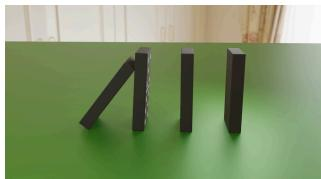

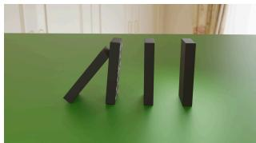

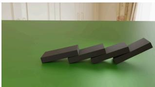  
Increase the second domino's mass to 10 times its original value.

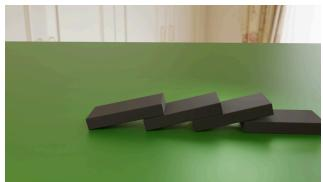

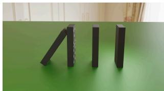

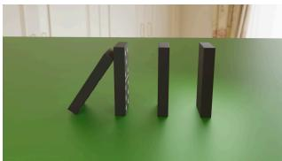

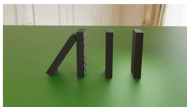  
Remove the second domino.

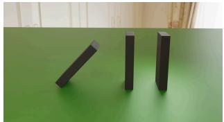

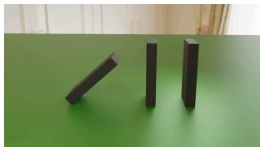

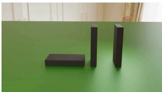

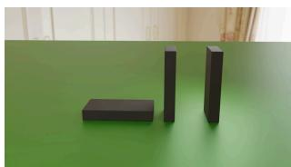  
Remove the first domino at frame 24.

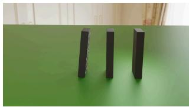

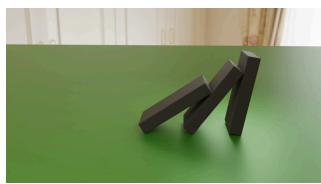

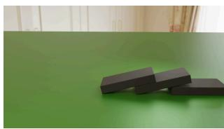  
Frame 23 Frame 24 Frame 48 Frame 72Figure 4 Examples from PCVE-RigidBench. The rows show the source video and three physical interventions at four frames.

therefore be examined separately for directly edited objects, other afected objects, and all measurable objects.   
These groups are used only for stratified analysis and do not determine which objects contribute to PES.

## B.3 Physical Edit Accuracy

## B.3.1 Trajectory Error and Physical Edit Score

For object �, let $\mathbf { u } _ { i , t } ^ { \mathrm { p r e d } }$ and $\mathbf { u } _ { i , t } ^ { \mathrm { r e f } } \in \mathbb { R } ^ { 2 }$ denote the tracked pixel centroids in the prediction and the target video, respectively. A target frame is eligible when the object exists, has a finite tracked centroid, and lies fully inside the image according to its projected position and a margin based on the apparent radius; frames outside the image or clipped by its boundary are excluded. The alignment frame $a _ { i }$ is the first eligible frame at or after the tracking seed that is tracked in both videos. Let ${ \cal N } _ { i }$ contain the eligible frames assigned either a trajectory error or the penalty for a missing track defined below. Given a valid alignment frame, the prediction’s Trajectory Error (TE) is

$$
e _ { i , t } ^ { \mathrm { t r a j } } = \left. ( \mathbf { u } _ { i , t } ^ { \mathrm { p r e d } } - \mathbf { u } _ { i , a _ { i } } ^ { \mathrm { p r e d } } ) - ( \mathbf { u } _ { i , t } ^ { \mathrm { r e f } } - \mathbf { u } _ { i , a _ { i } } ^ { \mathrm { r e f } } ) \right. _ { 2 } , \qquad \mathrm { T E } _ { i } ^ { \mathrm { p r e d } } = \frac { 1 } { | N _ { i } | } \sum _ { t \in N _ { i } } e _ { i , t } ^ { \mathrm { t r a j } } .\tag{42}
$$

Subtracting the two positions at the alignment frame makes TE measure changes in motion rather than a constant placement ofset. Equation 42 defines $e _ { i , t } ^ { \mathrm { t r a j } }$ when both tracks are present. If the prediction track is missing at a scored frame, $e _ { i , t } ^ { \mathrm { t r a j } }$ is instead set to the reference projection’s distance to the nearest image edge. TE uses displacement relative to the alignment frame when at least three eligible frames are jointly tracked. With fewer jointly tracked frames, TE is the mean edge-distance penalty over eligible frames with missing prediction tracks and is unavailable if no such frame exists. We report TE in pixels.

The same pixel error can represent diferent degrees of success when edits induce changes of diferent magnitudes. Moreover, unchanged objects can lower an average trajectory error even when the requested edit is not performed. PES therefore uses the unchanged source video as its baseline. Applying the same comparison of tracked centroids between source and target gives $\mathrm { T E } _ { i } ^ { \mathrm { n u l l } }$ , which is used in Equation 5.

The sums in Equation 5 include scored objects satisfying $\mathrm { T E } _ { i } ^ { \mathrm { n u l l } } \geq \operatorname* { m a x } ( 0 . 0 5 r _ { i } ^ { \mathrm { p i x } } , 1 \mathrm { p i x e l } )$ . This threshold excludes changes below the tracking noise floor. We sum errors before taking the ratio and clamp each task score to a minimum of −1 before aggregation. A value of one indicates zero scored error, zero matches the source baseline, and a negative value is worse than that baseline. The score is unavailable when no scored object satisfies this threshold. Inserted objects have no source trajectory and do not contribute to this ratio. The removal penalties defined below also contribute to PES.

## B.3.2 Mask IoU

For masks $M _ { i , t } ^ { \mathrm { p r e d } }$ and $M _ { i , t } ^ { \mathrm { r e f } }$ tracked in the prediction and the target video, we treat a mask as absent when its area falls outside 0.3 to 3.0 times the median positive mask area for that object in the source video; inserted objects instead use the target video to determine this median. Frames with two absent masks are excluded, while a frame with only one present mask receives zero. Mask IoU averages $| M _ { i , t } ^ { \mathrm { p r e d } } \cap M _ { i , t } ^ { \mathrm { r e f } } | / | M _ { i , t } ^ { \mathrm { p r e d } } \cup M _ { i , t } ^ { \mathrm { r e f } } |$ over the remaining frames. It captures diferences in object position and extent that centroid trajectories do not measure.

## B.3.3 Removal

For removal, correct absence after the execution frame has zero error, while an object that remains visible is penalized by its distance to the nearest image edge. For partway removal, frames before and after the execution frame are evaluated together, so both premature and failed removal are penalized. These errors contribute to TE and PES. Object presence is estimated from tracked positions and mask areas relative to the source.

## B.4 Visual Fidelity

PSNR, SSIM, LPIPS, and CLIP image similarity are averaged over corresponding frames of the prediction and target videos. Each prediction is resized to the target resolution when necessary, and matching frame indices are compared over their common duration, including both the factual prefix and edited continuation when present. LPIPS uses AlexNet features, and CLIP image similarity uses OpenCLIP ViT-B/32 pretrained on LAION-2B (laion2b\_s34b\_b79k). FVD is computed once from the distributions of Kinetics-400 I3D features over the prediction and target video sets.

## C Additional Experiments and Analysis

This appendix reports the evaluation settings and complete benchmark results, followed by pipeline analysis, an ablation of simulation search, runtime and memory, the efect of explicit downstream consequences, and additional qualitative results.

## C.1 Evaluation Settings and Benchmark Results

## C.1.1 VideoPhysEdit Settings

Quantitative benchmark instructions are parsed directly from templates. Qwen3-VL-4B-Instruct identifies relevant object categories and parses other requests, resolving visual references when needed. Grounding DINO Tiny detects objects in the first frame, SAM2.1 Hiera Tiny propagates masks, and the scaled CoTracker3 checkpoint tracks points. VGGT-1B estimates cameras and scene points, and SuperGlue with indoor weights aligns observations across reconstruction frames. PyBullet 3.2.7 performs physical simulation. ObjectClear handles removal, while Insert Anything uses FLUX.1-Fill-dev, FLUX.1-Redux-dev, and its released LoRA weights to prepare inserted appearance; Cube3D-v0.5 supplies geometry when no compatible scene object can be reused. Wan-Move-14B-480P generates 720 × 480 videos with 16 denoising steps and classifier-free guidance scale 1.0. All pretrained components use their released checkpoints without additional training or fine-tuning.

## C.1.2 Baseline Settings

Table 5 lists the output and evaluation settings. All videos are encoded at 24 fps. Metrics computed per frame compare corresponding prediction and target frames over each method’s output duration, capped at the 96-frame benchmark length, after resizing the prediction to the target resolution. VideoPhysEdit stitches Wan-Move windows on the source timeline and covers the complete benchmark duration.

Table 5 Output and evaluation settings.
<table><tr><td colspan="3">Output</td><td colspan="3">Evaluated</td></tr><tr><td>Method</td><td>Resolution</td><td>frames</td><td>frames</td><td>Tasks</td><td>Settings</td></tr><tr><td>VACE</td><td>768×432</td><td>96</td><td>96</td><td>129</td><td>30 steps, CFG 5.0</td></tr><tr><td>Ditto</td><td>832×480</td><td>73</td><td>73</td><td>129</td><td>VACE-14B with Ditto LoRA</td></tr><tr><td>MiniMax H3</td><td>768p</td><td>107</td><td>96</td><td>129</td><td>video editing API</td></tr><tr><td>Seedance 2.5</td><td>720p</td><td>89</td><td>89</td><td>129</td><td>video editing API</td></tr><tr><td>VOID</td><td>672×384</td><td>96</td><td>96</td><td>30</td><td>removal only</td></tr><tr><td>VideoPhysEdit</td><td>720×480</td><td>96</td><td>96</td><td>129</td><td>16 steps, CFG 1.0</td></tr><tr><td>No edit</td><td>1280 × 720</td><td>96</td><td>96</td><td>129</td><td>copies source</td></tr></table>

For the two real video examples in Figure 18, VOID uses Gemini 3.1 Flash-Lite for automatic reasoning about the afected objects, point prompts to identify the removal target, SAM3.1 to segment the afected regions, and the first generation pass.

## C.1.3 Complete Benchmark Results

Table 6 reports results for the generated videos and for the complete benchmark.

Table 6 VideoPhysEdit results on generated videos and the complete benchmark.
<table><tr><td rowspan="2">Evaluation set</td><td rowspan="2">Tasks</td><td colspan="3">Physical Edit Accuracy</td><td colspan="5">Visual Fidelity</td></tr><tr><td>PES↑</td><td></td><td>TE↓ Mask IoU↑</td><td>PSNR↑</td><td>SSIM↑</td><td>LPIPS↓</td><td>CLIP↑</td><td>FVD↓</td></tr><tr><td>Generated videos</td><td>116</td><td>0.418</td><td>63.68</td><td>0.421</td><td>27.47</td><td>0.921</td><td>0.107</td><td>0.928</td><td>198.79</td></tr><tr><td>No edit</td><td>129</td><td>0.000</td><td>143.13</td><td>0.289</td><td>31.23</td><td>0.974</td><td>0.036</td><td>0.957</td><td>249.68</td></tr><tr><td>Complete benchmark</td><td>129</td><td>0.376</td><td>66.70</td><td>0.421</td><td>27.51</td><td>0.925</td><td>0.104</td><td>0.929</td><td>182.46</td></tr></table>

Table 7 reports VideoPhysEdit results by execution timing. PES is positive for interventions applied at the first frame and partway through the video.

Table 7 VideoPhysEdit results by execution timing.
<table><tr><td>Execution timing</td><td>Tasks</td><td>PES↑</td><td>TE↓</td><td>Mask IoU↑</td></tr><tr><td>First frame</td><td>117</td><td>0.356</td><td>68.15</td><td>0.403</td></tr><tr><td>Partway</td><td>12</td><td>0.571</td><td>52.57</td><td>0.602</td></tr></table>

VideoPhysEdit achieves positive PES for Add, Delete, and Set (Table 8). Delete has the highest score, followed by Set and Add. For Add, PES evaluates changes in the existing objects and excludes the inserted object, which has no source trajectory.

Table 8 PES by operation.
<table><tr><td>Method</td><td>Add↑</td><td>Delete↑</td><td>Set↑</td></tr><tr><td>VACE</td><td>-0.007</td><td>-0.001</td><td>-0.058</td></tr><tr><td>Ditto</td><td>-0.157</td><td>-0.041</td><td>-0.144</td></tr><tr><td>MiniMax H3</td><td>-0.521</td><td>0.383</td><td>-0.219</td></tr><tr><td>Seedance 2.5</td><td>-0.145</td><td>0.290</td><td>-0.205</td></tr><tr><td>No edit</td><td>0.000</td><td>0.000</td><td>0.000</td></tr><tr><td>VideoPhysEdit</td><td>0.032</td><td>0.633</td><td>0.318</td></tr></table>

Table 9 reports results for directly edited objects, other afected objects, and all measurable objects. Video-PhysEdit obtains positive PES for the directly edited and other afected groups. For other afected objects, it reduces TE to 72.15 pixels and is the only method with a positive PES. This result directly measures whether an intervention produces the intended downstream motion beyond the edited object itself.

Table 9 Physical edit accuracy by object group.
<table><tr><td rowspan="2">Method</td><td colspan="2">Directly edited</td><td colspan="2">Other affected</td><td colspan="2">All measurable</td></tr><tr><td>PES↑</td><td>TE↓</td><td>PES↑</td><td>TE↓</td><td>PES↑</td><td>TE↓</td></tr><tr><td>VACE</td><td>-0.036</td><td>179.32</td><td>-0.045</td><td>122.79</td><td>-0.042</td><td>146.26</td></tr><tr><td>Ditto</td><td>-0.052</td><td>165.86</td><td>-0.198</td><td>139.13</td><td>-0.120</td><td>149.94</td></tr><tr><td>MiniMax H3</td><td>0.009</td><td>161.44</td><td>-0.156</td><td>140.13</td><td>-0.096</td><td>152.00</td></tr><tr><td>Seedance 2.5</td><td>-0.052</td><td>166.37</td><td>-0.132</td><td>126.88</td><td>-0.087</td><td>144.99</td></tr><tr><td>VideoPhysEdit</td><td>0.451</td><td>70.82</td><td>0.276</td><td>72.15</td><td>0.376</td><td>66.70</td></tr></table>

Table 10 groups results by the edited property, with presence combining Add and Delete. VideoPhysEdit obtains positive PES in every group, with the largest gains for presence and initial velocity. Restitution has the lowest PES. Its efect appears at contact, so an error in collision geometry or timing can change the outgoing velocity even when the requested coeficient is applied correctly.

Table 10 PES by edited property.
<table><tr><td colspan="2"></td><td colspan="2">Initial</td><td colspan="2"></td></tr><tr><td>Method</td><td>Friction↑</td><td>velocity↑</td><td>Mass↑</td><td>Presence↑</td><td>Restitution↑</td></tr><tr><td>VACE</td><td>-0.083</td><td>-0.012</td><td>-0.071</td><td>-0.002</td><td>-0.080</td></tr><tr><td>Ditto</td><td>-0.148</td><td>-0.017</td><td>-0.245</td><td>-0.063</td><td>-0.140</td></tr><tr><td>MiniMax H3</td><td>-0.258</td><td>-0.127</td><td>-0.249</td><td>0.212</td><td>-0.267</td></tr><tr><td>Seedance 2.5</td><td>-0.166</td><td>-0.086</td><td>-0.324</td><td>0.208</td><td>-0.215</td></tr><tr><td>No edit</td><td>0.000</td><td>0.000</td><td>0.000</td><td>0.000</td><td>0.000</td></tr><tr><td>VideoPhysEdit</td><td>0.315</td><td>0.435</td><td>0.307</td><td>0.520</td><td>0.116</td></tr></table>

## C.2 Pipeline Analysis

We evaluate the outputs from canonical and anchor scene reconstruction through counterfactual video generation, then locate representative errors at the stage where they first appear.

## C.2.1 Evaluation of Pipeline Stages

Stages 3 to 5. Table 11 reports Mask IoU for the source scenes with complete physical rollouts. Stage 3 evaluates the reconstructed objects at the canonical and motion anchor frames, while Stages 4 and 5 evaluate the motion prior and physical rollout over the complete sequence.

Figure 5 shows that motion prior reconstruction usually preserves the alignment recovered from the anchor scenes while extending object poses across the full sequence. The largest losses occur during physical inversion in scenes with several contacts, including table\_drop\_collision, dining\_chain, and air\_- hockey\_chain. A small error in contact position or timing changes the outgoing velocity and displaces every subsequent state. Scenes with simpler contact sequences retain close alignment. The main loss after motion prior reconstruction therefore comes from fitting one uninterrupted physical rollout to a sequence of contacts.

Table 11 Mask IoU across reconstructed source scenes.
<table><tr><td colspan="4"></td><td rowspan="2">75th percentile</td></tr><tr><td>Stage</td><td>Mean</td><td>Median</td><td>25th percentile</td></tr><tr><td>Stage 3 canonical and anchor scenes</td><td>0.883</td><td>0.899</td><td>0.832</td><td>0.945</td></tr><tr><td>Stage 4 motion prior</td><td>0.887</td><td>0.908</td><td>0.861</td><td>0.944</td></tr><tr><td>Stage 5 physical rollout</td><td>0.678</td><td>0.733</td><td>0.602</td><td>0.799</td></tr></table>

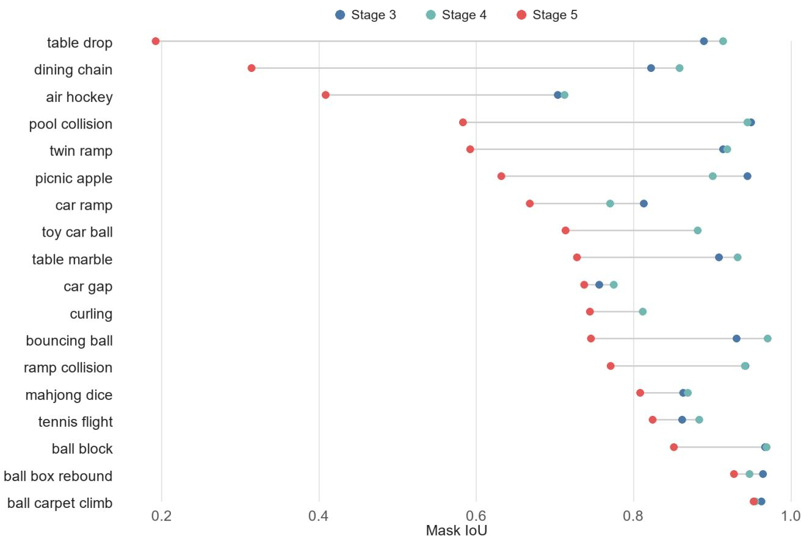  
Figure 5 Mask IoU by scene for Stages 3 to 5. Lines connect results from the same reconstructed scene.

Stages 6 and 7. The final two stages separate counterfactual motion from video appearance. Stage 6 applies the physical intervention and projects the resulting object trajectories into the video. Stage 7 uses these trajectories as motion control to generate the final video with the source appearance. After transforming the Stage 6 projections to source video coordinates, we compare both stages on the same frames for objects whose Stage 1 identities can be reliably matched to benchmark tracks. This paired set difers slightly from the complete evaluation of generated videos in Table 6; all metrics follow the same benchmark definitions.

Table 12 Counterfactual motion before and after video generation.
<table><tr><td>Stage</td><td>PES ↑</td><td>TE↓</td><td>Mask IoU ↑</td></tr><tr><td>Stage 6 projected trajectories</td><td>0.398</td><td>63.39</td><td>0.391</td></tr><tr><td>Stage 7 generated video</td><td>0.412</td><td>64.76</td><td>0.412</td></tr></table>

Table 12 shows that Stage 7 retains the motion produced by Stage 6. TE changes by about 1.4 pixels, while

PES and Mask IoU improve slightly.

These results show that Stage 6 determines the edited motion, while Stage 7 preserves that motion and generates the final video with the source appearance. We next evaluate two controls that help Stage 7 retain the projected trajectories under fast motion and small object contact. Figure 6(a) evaluates adaptive temporal scaling in car\_gap\_jump/edit\_slippery\_wheels. Without temporal scaling, the generated car falls behind the projected trajectory. With temporal scaling, it leaves the image at the target frame and TE falls from 497.19 to 23.10 pixels. Temporal scaling thus enables Wan-Move to follow the fast motion specified by Stage 6.

Figure 6(b) evaluates the interaction ROI when the smaller object in a contacting pair has a diameter of about 13 pixels. With identical point trajectories, full image generation merges the two balls at contact and changes their radius ratio from the simulated value of 0.57 to 1.00. Generation within the interaction ROI preserves a ratio of 0.62.

(a) Adaptive temporal scaling  
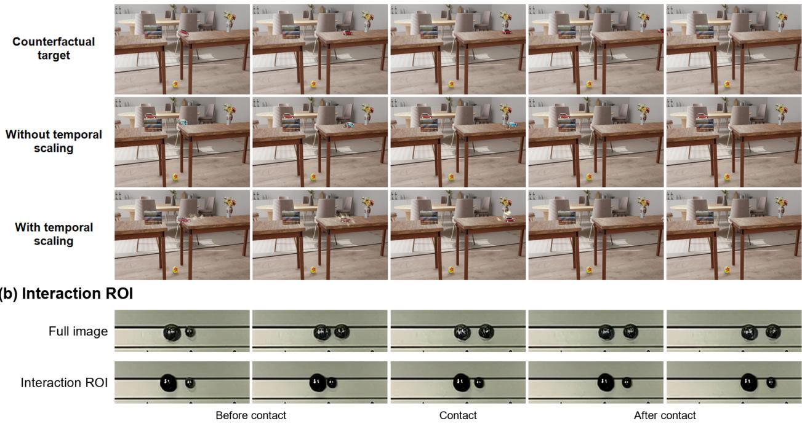  
Figure 6 Adaptive temporal scaling and interaction ROI in Stage 7.  
Figure 7 shows the edited reference image and projected point trajectories for an Add task.

## C.2.2 Robustness to Incomplete and Ambiguous Observations

When observations are incomplete or ambiguous, VideoPhysEdit combines image masks, 3D geometry, support relations, and motion across frames. Stages 2 and 3 use observation confidence and geometric constraints to estimate motion and object placement. Stages 4 and 5 use evidence across time to reconstruct motion and select the physical rollout that best matches the complete sequence. Table 13 summarizes these design choices, followed by examples from canonical frame selection, support plane reconstruction, motion prior reconstruction, and physical inversion.

Stage 3 Mask IoU measures image alignment after optimizing object pose, scale, and support, but similar image alignment can conceal inconsistent depth and scale. In drop\_centered, we change only the canonical frame and compare the resulting 3D scenes. An airborne frame gives a scene Mask IoU of 0.952 but provides no support relation between the ball and the block. After aligning the reconstruction and synthetic ground truth by the block, we normalize each coordinate by the corresponding block dimension. Selecting a stable contact frame gives a similar Mask IoU of 0.969, reduces the normalized 3D ball center error from 2.71 to 0.156, and recovers support relations connecting the floor, block, and ball.

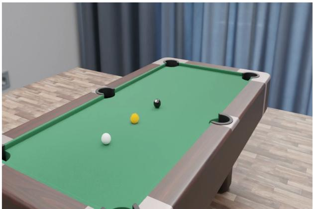

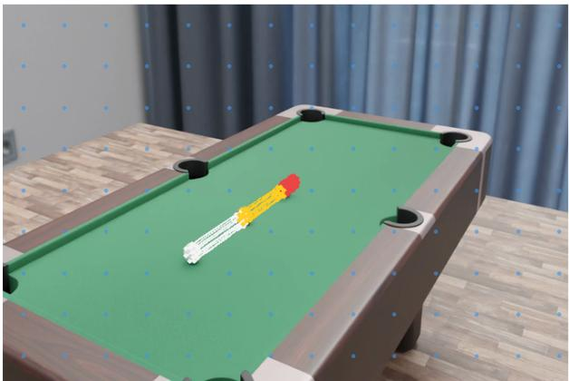

Figure 7 Object insertion and projected point trajectories in Stage 6.  
Table 13 Handling incomplete and ambiguous observations across the pipeline.
<table><tr><td>Stage</td><td>Observation</td><td>Method</td></tr><tr><td>2</td><td>Unreliable or missing masks</td><td>Weight motion estimates by observation confidence and identify stable intervals, transition episodes, and unresolved observations</td></tr><tr><td>3</td><td>Fragmented support planes</td><td>Merge compatible planes, refit their combined 3D points, and refine finite boundaries using image outlines</td></tr><tr><td>3</td><td>Sparse 3D correspondences</td><td>Use 2D correspondences and dense object points to supplement sparse 3D correspondences when fitting pose and scale</td></tr><tr><td>3</td><td>Depth scale across frames</td><td>Align each motion anchor frame to the canonical scene using the static background and keep object scale fixed</td></tr><tr><td>3</td><td>Multiple support assignments</td><td>Check contact, nonpenetration, and support plane boundaries; reconcile support relations across motion anchor frames</td></tr><tr><td>4</td><td>Missing motion observations</td><td>Fit motion models to stable intervals and connect them with transition curves constrained by boundary states</td></tr><tr><td>4</td><td>Equivalent box orientations</td><td>Select the orientation jointly across time</td></tr><tr><td>4</td><td>Rebound without a visible surface</td><td>Add a local collision surface when recovered velocities and restitution support the rebound</td></tr><tr><td>5</td><td>Similar fits on early intervals</td><td>Retain up to three candidate simulations as evaluation extends to later contacts; include the calibrated initialization in final selection</td></tr></table>

The contact relation constrains relative depth and scale, so the objects occupy consistent positions in the shared world coordinate system. This is why canonical frame selection uses contact evidence in addition to image visibility.

When one physical surface is reconstructed as several support planes, objects on that surface can be assigned diferent support planes. Figure 9 shows this case in tennis\_flight, viewed from above. Stage 3 refits the combined background points of P0, P1, and P4 as one plane and transfers the ball’s support relation to the merged P0. This reduces the active planes from six to three: merging removes two duplicate planes, and candidate P5 is excluded from the physical scene. Stage 3 then places the ball against the refitted plane under the same contact and support constraints.

Stage 4 reconstructs motion during gaps in the observations. It fits motion models to stable intervals and connects them with transition curves constrained by boundary states. In picnic\_apple\_ball, the apple is observed in only 31 of 96 frames. Motion on both sides of each gap constrains a continuous motion prior over the complete video, with a Mask IoU of 0.867 on the observed frames (Figure 10(a)).

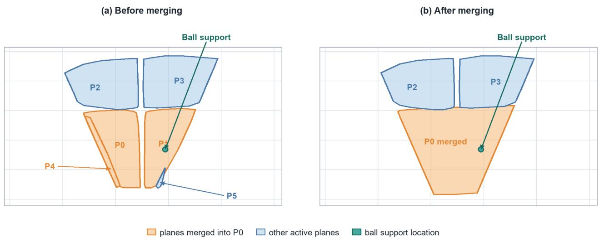  
Normalized 3D center error: 0.156

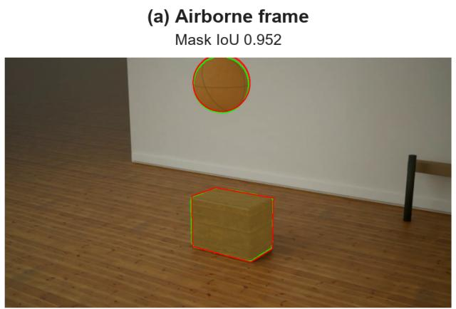

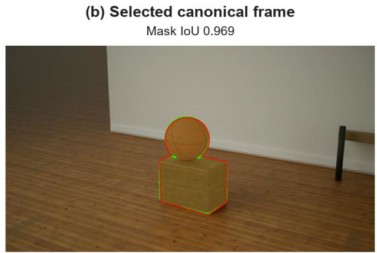  
Orange: reconstruction Blue: aligned 3D ground truth

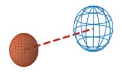

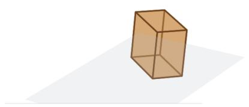

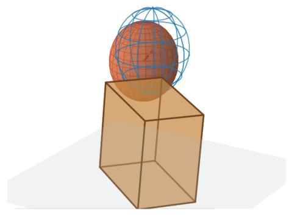  
Figure 8 Canonical frame selection in drop\_centered. In the 3D views, orange shows the reconstruction and blue wireframes show the aligned ground truth. The red dashed line marks the center error.  
Figure 9 Support plane reconstruction in tennis\_flight. Compatible fragments are refitted as one plane while retaining the ball’s support relation.

Stage 5 retains up to three candidate simulations while extending evaluation to later stable intervals and transition episodes. Later observations distinguish candidates that fit the early intervals similarly. In ball\_block, simulation search and final refinement raise Mask IoU from 0.409 to 0.852 (Figure 10(b)). Section C.3 evaluates this search across all reconstructed scenes and counterfactual edits.

(a) Motion prior reconstruction  
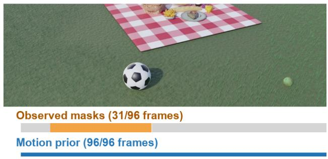

(b) Physical inversion  
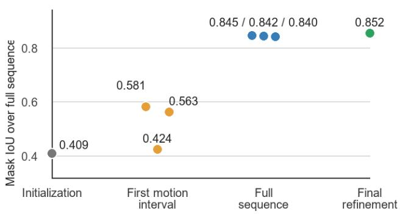  
Figure 10 Motion prior reconstruction and physical inversion. Stage 4 reconstructs motion through missing observations, and Stage 5 improves the physical rollout.

## C.2.3 Error Analysis

The examples follow the pipeline from Stage 3 scene reconstruction to Stage 5 physical inversion and Stage 7 video generation. For two source scenes covering 13 edit tasks, the pipeline produces no valid edited videos, so we use the unchanged source videos as predictions in the complete benchmark evaluation.

Scene reconstruction. Figure 11 compares the input observations, Stage 3 projections, and recovered 3D scenes for two reconstruction errors. In bowling, object segmentation assigns spatially separated pins to one identity, so Stage 3 fits one box to two disconnected mask components. Too few 3D correspondences support the resulting pose, and no support plane can be assigned. Colors in the input masks distinguish detected instances; green and red in the projection panels denote observed and projected masks.

In domino\_chain, the object identities are correct, but repeated appearance leaves too few spatially distributed 3D correspondences. One domino therefore has an incorrect pose and extent despite passing the correspondence checks. Thus, one error begins with object identities and the other with unreliable 3D correspondences, both before motion prior reconstruction and physical inversion.

Physical inversion. Figure 12 traces two Stage 5 errors to the first contact where each rollout departs from the motion prior. White, cyan, red, and yellow denote observed trajectories, the Stage 4 motion prior, the Stage 5 physical rollout, and inferred contacts; the plots show mean Mask IoU across scene objects. In table\_drop\_collision, several contact changes share one response window and their impulses cannot be separated. The physical rollout therefore departs immediately after contact, reducing Mask IoU from 0.914 at Stage 4 to 0.192 at Stage 5.

In air\_hockey\_chain, object 1 departs after contact C1 and propagates the error to object 3 at C2, while object 2 remains aligned. This example shows how an earlier state error changes a later interaction.

Figure 13 shows a third physical inversion error in dining\_chain. Stage 4 recovers the observed trajectories, but three closely spaced contacts are dificult for Stage 5 to reproduce in one physical rollout. In this case, object 1 remains nearly stationary and object 3 departs from the recovered motion after contact. This error arises from resolving a dense contact sequence rather than from missing image observations.

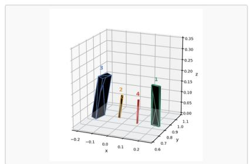  
Observed masks

(a) Bowling  
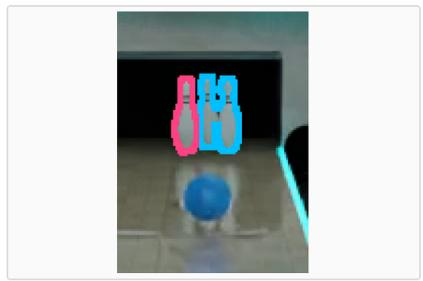  
Stage 3 projected masks Green: observed Red: projected

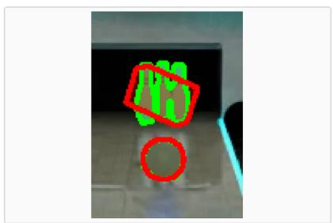  
Reconstructed 3D scene

Mask loU 0.595  
(b) Domino chain  
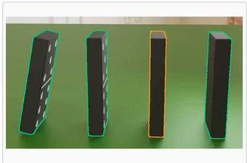

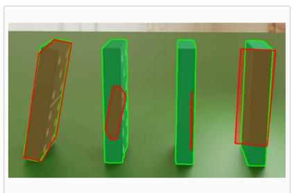  
Mask loU 0.034  
Figure 11 Scene reconstruction errors in bowling and domino\_chain.  
Observed trajectory  
Stage 4 motion prior  
Contact  
Stage 5 physical rollout

(a) Table drop collision  
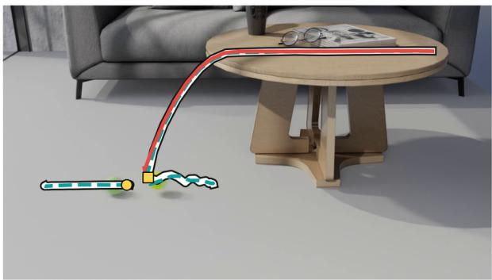

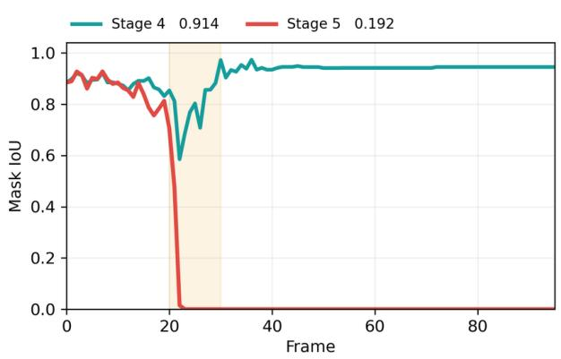

(b) Air hockey chain  
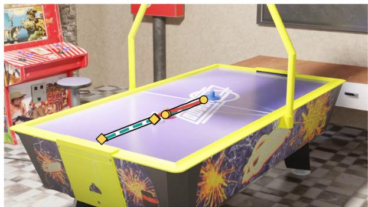

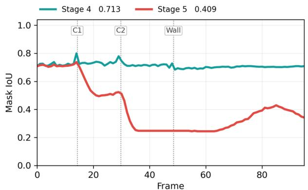  
Figure 12 Physical inversion errors after contact.

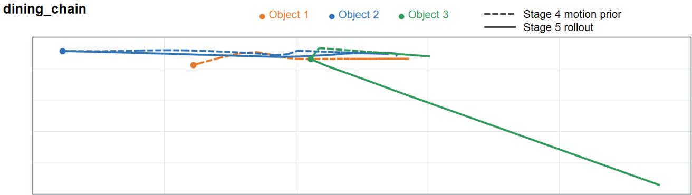  
Figure 13 Physical inversion with closely spaced contacts in dining\_chain.

Video generation. In pool\_collision/edit\_add\_ball\_midway, the Stage 6 placement and trajectories shown in Figure 7 are correct, and the generated video follows the added ball. The existing ball nevertheless deviates from its simulated trajectory after contact, so the error first appears during video generation.

Figure 14 shows a second video generation error in ball\_carpet\_climb/edit\_hard\_push. Stage 6 produces the intended fast trajectory, and its projected control points leave the image. Stage 7 follows the initial motion but continues to depict a distorted object after the trajectory has left the image. Point trajectories constrain visible motion but do not directly enforce object absence after it exits the view. Together with the insertion example above, this case shows that Stage 6 can specify the intended intervention even when Wan-Move does not fully reproduce it in the final video.

ball\_carpet\_climb / edit\_hard\_push  
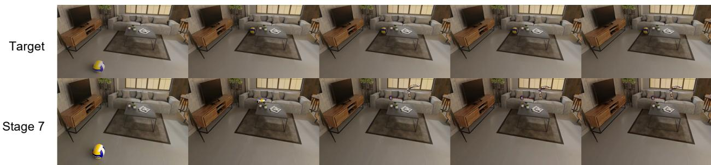  
Figure 14 A video generation error after the Stage 6 trajectory leaves the image.

## C.3 Ablation Study

We evaluate whether simulation search improves the counterfactual trajectories produced by Stage 6. We compare the calibrated initialization with the result after simulation search and final refinement. Both variants use the same edits, Stage 6 operations, matched objects, and evaluation frames; only the Stage 5 physical scene changes. We evaluate Stage 5 on the same reconstructed source scenes as Table 11 and compare Stage 6 on the same objects and frames.

Table 14 Ablation of Stage 5 physical inversion.
<table><tr><td>Variant</td><td>Stage 5 Mask IoU ↑</td><td>Stage 6 PES ↑</td><td>Stage 6 TE↓</td><td>Stage 6 Mask IoU ↑</td></tr><tr><td>Calibrated initialization</td><td>0.375</td><td>0.269</td><td>76.70</td><td>0.324</td></tr><tr><td>Search and refinement</td><td>0.678</td><td>0.403</td><td>62.37</td><td>0.392</td></tr></table>

As shown in Table 14, simulation search and final refinement improve all three Stage 6 metrics and reduce TE by 18.7%. The result shows that a more accurate physical rollout of the source video also yields more accurate counterfactual trajectories after physical intervention.

## C.4 Runtime and Memory

Table 15 reports runtime and peak GPU memory by stage. Stages 1 to 5 run once per source video, whereas Stages 6 and 7 run for each edit. The Stage 7 measurement includes the two overlapping Wan-Move windows used to produce each complete video. Stage 1 time and peak memory come from a separate complete run; times for the other stages are averaged over the benchmark runs. Motion fitting in Stage 4 and physical simulation in Stage 5 run on the CPU. The Set operation in Stage 6 also runs on the CPU, while Add and Delete invoke appearance editing models.

Table 15 Runtime and peak GPU memory by stage.
<table><tr><td>Stage</td><td>Average time (s)</td><td>Peak GPU memory</td></tr><tr><td>1 Object identification and tracking</td><td>32.7</td><td>4.1 GiB</td></tr><tr><td>2 Motion observation analysis</td><td>27.6</td><td>11.9 GiB</td></tr><tr><td>3 Canonical and anchor scene reconstruction</td><td>117.5</td><td>12.0 GiB</td></tr><tr><td>4 Motion prior reconstruction</td><td>70.1</td><td>CPU only</td></tr><tr><td>5 Physical inversion</td><td>246.7</td><td>CPU only</td></tr><tr><td>6 Physical intervention</td><td>22.6</td><td>depends on operation</td></tr><tr><td>7 Counterfactual video generation</td><td>665.5</td><td>39.0 GiB</td></tr></table>

## C.5 Efect of Explicit Downstream Consequences

We test whether describing the expected motion helps baselines perform physical edits. For four PCVE-RigidBench tasks, we append a qualitative description of the target motion and interactions to the original quantitative edit instruction. Each baseline uses the same source video and generation settings for both instructions. VideoPhysEdit uses the original instruction.

Table 16 PES with the original physical edit and with explicit downstream consequences appended. Each cell reports original → explicit consequences. † denotes an invalid track of the evaluated object.
<table><tr><td>Method</td><td>Heavy block</td><td>Grippy car</td><td>Heavy red ball</td><td>Strong push</td></tr><tr><td>Seedance 2.5</td><td>-0.022→-0.060</td><td>0.205→-0.015</td><td>-1.000→-1.000†</td><td>0.001→-0.215</td></tr><tr><td>MiniMax H3</td><td>0.010→-0.006</td><td>0.001 →−0.271†</td><td>-1.000+→−1.000</td><td>0.000→0.026</td></tr><tr><td>VACE</td><td>0.003→0.001</td><td>-0.001→0.005</td><td>0.016→0.008</td><td>-0.001→-0.001</td></tr><tr><td>Ditto</td><td>-0.034→-0.032</td><td>-0.044→-0.046</td><td>-0.390→-0.261</td><td>0.005→0.004</td></tr></table>

Adding the expected consequences does not consistently improve PES across the four tasks (Table 16). VACE and Ditto largely preserve the source motion with either instruction. Seedance 2.5 and MiniMax H3 make more visible changes, but these changes often difer from the target motion. MiniMax H3 stops the car on the ramp in the Grippy car example, although the track of the evaluated object is invalid. Figures 15 and 16 show these outcomes. Describing the expected motion alone is therefore insuficient to obtain the target result consistently in these tasks.

## C.6 Additional Qualitative Results

Figure 17 compares VideoPhysEdit with VACE, Ditto, MiniMax H3, and Seedance 2.5 on four additional PCVE-RigidBench edits. The frames are selected around the execution frame, the first interaction, and the resulting motion. The competing methods often retain a removed object or continue the source motion after the requested parameter change. VideoPhysEdit removes the selected object at the specified frame and changes the subsequent motion after edits to friction and mass while preserving the preceding interaction.

Source Target Seedance 2.5 Seedance 2.5 MiniMax H3 MiniMax H3 VideoPhysEdit Original edit + Consequences Original edit + Consequences Original edit

Set the wooden block's mass to 10x at frame 1.

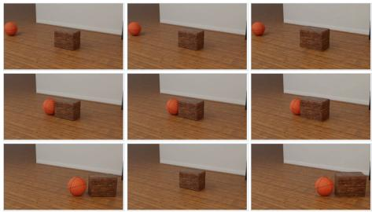  
Set the car-ramp friction to 8x at frame 8. 1

The block barely budges when the ball reaches it, shifting only a little before stopping, and the ball rebounds and rolls back out of the left of the frame.

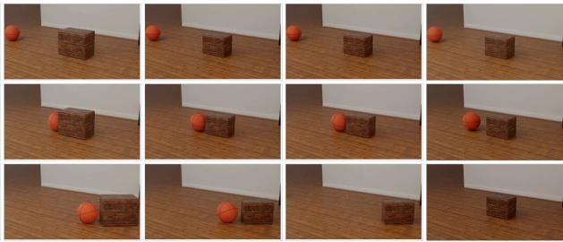  
The car is dragged to a halt on the ramp face part-way up, stays parked there for the rest of the clip, and never clears the top.

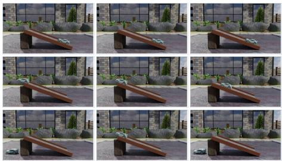  
Set the red ball's mass to 20x at frame 1.

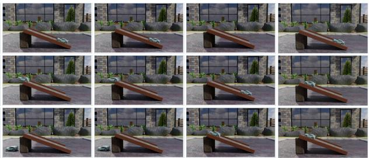

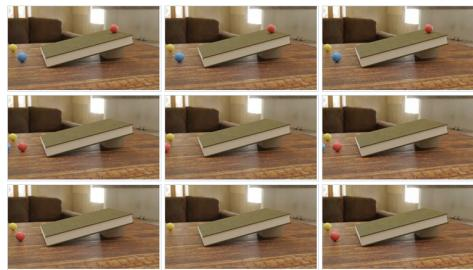  
The red ball ploughs through the blue marble almost without slowing. both roll out of the left of the frame, and the yellow marble is never touched.  
Set the red ball's initial speed to 6x at frame 1.

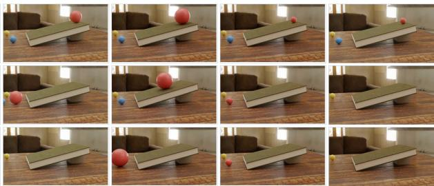  
The ball lands much further along than before, bounces across the room in long flat arcs, and flies out of the right of the frame before the clip ends.

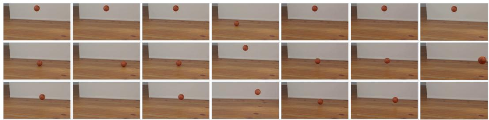  
Figure 15 Efect of explicit downstream consequences on Seedance 2.5 and MiniMax H3. The bold text after each arrow is added to the original edit instruction. Each baseline is evaluated with and without the added text; VideoPhysEdit uses the original instruction. All methods are shown at the same three time points for each task.

Comparison with VOID. The top two examples in Figure 18 compare VideoPhysEdit with VOID and the two commercial models on two removal tasks in PCVE-RigidBench. Removing the wooden block allows the basketball to continue across the floor; removing the apple prevents the subsequent displacement of the soccer ball. VideoPhysEdit follows these changes in the target videos, while VOID removes the selected

Set the wooden block's mass to 10x at frame 1.  
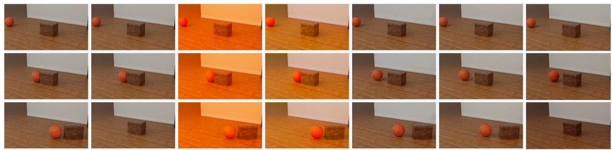

The block barely budges when the ball reaches it, shifting only a little before stopping, and the ball rebounds and rolls back out of the left of the frame.

Set the car-ramp friction to 8x at frame 8. 1  
The car is dragged to a halt on the ramp face part-way up, stays parked there for the rest of the clip, and never clears the top.  
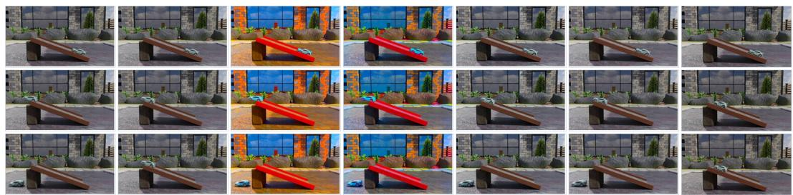

Set the red ball's mass to 20x at frame 1.  
The red ball ploughs through the blue marble almost without slowing, both roll out of the left of the frame, and the yellow marble is never touched.  
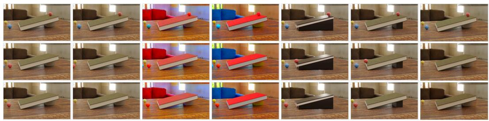  
Set the red ball's initial speed to 6x at frame 1.  
The ball lands much further along than before, bounces across the room in long flat arcs, and flies out of the right of the frame before the clip ends.

  
Figure 16 Efect of explicit downstream consequences on VACE and Ditto. Tasks, time points, and layout match Figure 15.

Before cropping, we restore the source aspect ratio for VideoPhysEdit outputs in the benchmark examples and the VOID output in the ruler example. All other resizing preserves aspect ratio.

  
Figure 17 Additional comparisons on PCVE-RigidBench.

Removal edits in real videos. The bottom two examples in Figure 18 remove a ball from the first frame in two recorded collision scenes. After removal, the remaining ball should continue its initial motion: the blue ball should keep moving to the right in the tabletop scene, while the small ball should remain at rest in the ruler scene. These real videos have no paired counterfactual targets.

In the tabletop scene, VideoPhysEdit removes the yellow ball and lets the blue ball continue to the right.

  
Figure 18 Comparison with VOID on four removal edits applied from the first frame. The top two examples are from PCVE-RigidBench; the bottom two are real videos without paired counterfactual targets. Each row shows the same time point across methods. Crops are fixed within each video and aligned by ruler markings in the last example

VOID also removes the yellow ball, but the blue ball still reverses direction as it does in the source video. MiniMax H3 and Seedance 2.5 show rightward motion after removal, although the blue ball’s position difers from the source before contact.

In the ruler scene, VideoPhysEdit removes the large ball and keeps the small ball at its initial position. VOID removes the large ball, but the small ball still moves. MiniMax H3 removes the large ball but places the small ball farther along the ruler. Seedance 2.5 retains both balls and their collision.

  
Figure 19 Additional comparisons on real videos.

Across the four examples, VideoPhysEdit consistently removes the specified object and produces the expected subsequent motion. VOID removes the object but retains motion from the original interaction or introduces movement in an object that should remain at rest.

  
Figure 20 VideoPhysEdit results for restitution, removal, and insertion edits.

Figure 19 presents further real video comparisons for object removal and changes to initial velocity, friction, and mass. The baseline results frequently preserve the original motion or change the scene appearance. VideoPhysEdit instead removes the selected ball while retaining the remaining motion, slows the can on the incline, keeps the ball on the ramp longer after increasing friction, and changes the collision response when either ball becomes heavier or lighter.

Figures 20 and 21 group additional VideoPhysEdit results by source scene. Each framed group shows the source once and uses the same six frames for every derived edit, which makes changes in motion and interaction directly comparable. The domino and bouncing ball scenes contrast multiple interventions applied to the same observation. The remaining examples cover initial velocity, mass, object removal, and insertion. In the insertion example, the added blue stone appears at the requested midpoint and changes the later interaction between the original stones. Together, the examples show that the same pipeline handles Add, Delete, and Set edits across distinct rigid body interactions.

  
Figure 21 VideoPhysEdit results for initial velocity, mass, gravity, and removal edits.

## D Limitations and Future Work

VideoPhysEdit currently targets rigid-body scenes observed by a static camera. It assumes static planar support surfaces and represents object geometry using sphere or box models. The current formulation therefore does not cover camera motion, nonplanar supports, complex object geometry, or articulated and actively controlled agents such as people and robots. Fixed thresholds in observation filtering, geometric fitting, and motion analysis can also be sensitive to scene scale, object size, and observation quality. Future work will extend scene reconstruction and simulation to moving cameras, richer geometry and collision proxies, and articulated or controlled agents, while adapting thresholds to scene scale and observation confidence.