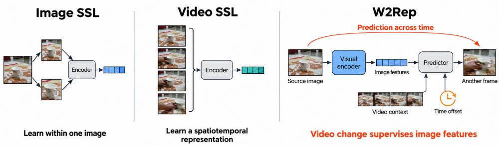
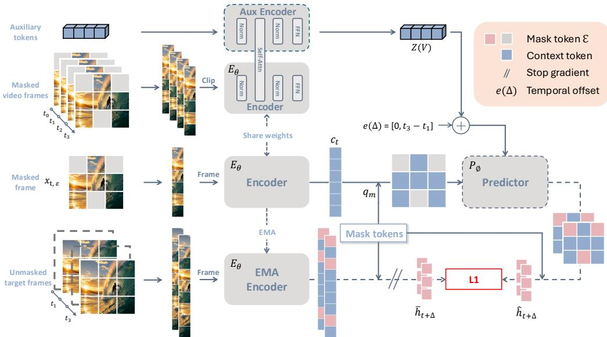
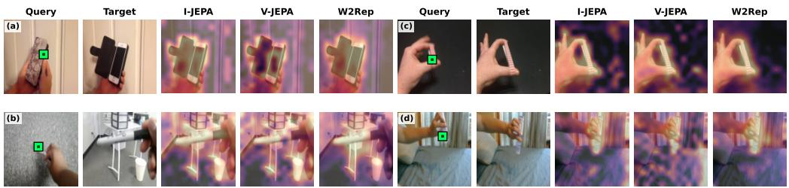
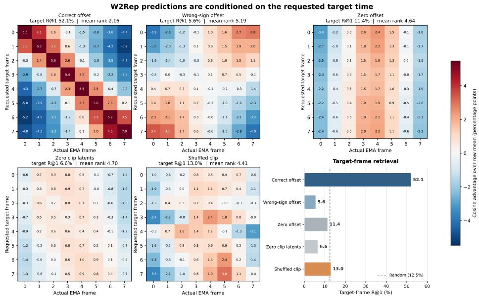
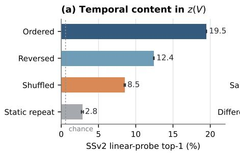
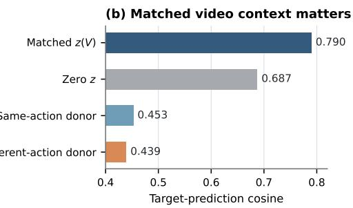
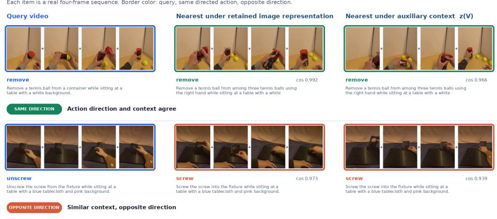

# W2REP: LEARNING VISUAL REPRESENTATIONS BY WATCHING THE WORLD CHANGE

Wen Huang1,\* Hang Guo1,\* Jiarui Yang2 Zheng Liu1 Tao Dai3,† Shu-Tao Xia1

1Tsinghua Shenzhen International Graduate School, Tsinghua University, Shenzhen, China

2Nankai University, Tianjin, China 3Shenzhen University, Shenzhen, China

Equal contribution. †Corresponding author.

huang-w24@mails.tsinghua.edu.cndaitao.edu@gmail.com

## ABSTRACT

Images capture the world at one moment, whereas video reveals how it changes. Image self-supervision learns spatial structure from a single moment, while video methods commonly learn temporal relationships inside a representation computed jointly from several frames. We ask whether watching a scene change can instead improve features available from one image without sacrificing the ability to represent video. We introduce W2REP, a masked feature-prediction framework in which an independently encoded source image participates in prediction at the same or another moment. The predictor is conditioned on visible video context, the queried location, and the signed time interval between source and target. This gives the cross-frame objective two complementary roles: the image path learns features that remain useful across time, while the video path must gather evidence that is missing from the source image. Across model scales and downstream tasks, W2REP improves frozen and fine-tuned recognition under our comparison protocol, while joint video encoding provides further gains over frame-wise aggregation. Controlled experiments show that these gains depend on directly updating the source-image features and on using both video context and temporal displacement. Overall, change across a video can supervise a visual encoder whose representations remain useful at either image or video granularity. Code is available at https://wenooi.github.io/W2Rep.

## 1 INTRODUCTION

Learning visual representations that transfer across tasks and input formats is a central goal of visual pretraining. A useful representation should capture not only what is visible in one image, but also how related observations of the same scene are organized as the world changes. Images provide spatial structure at a single moment; video additionally connects objects, states, and interactions across time. These temporal relations offer supervision that is unavailable from isolated images.

Self-supervised learning has progressively expanded the relationships used to train visual representations. Contrastive learning (Chen et al., 2020; He et al., 2020; Caron et al., 2020) and self-distillation (Grill et al., 2020; Caron et al., 2021) relate augmented views of one image, while masked modeling predicts hidden pixels, tokens, or features from visible image context (Bao et al., 2021; He et al., 2022; Assran et al., 2023). Video methods extend these ideas across space and time, commonly encoding several frames together to learn a spatiotemporal representation (Wei et al., 2022; Tong et al., 2022; Feichtenhofer et al., 2022; Bardes et al., 2024). These approaches have produced strong image and video models, but they differ in whether the encoder is trained to represent one image or an entire clip.

Many existing video objectives are designed primarily to learn representations of clips rather than individual images. Because they process several frames together, the resulting representation can use information from the entire clip. This is valuable for video understanding, but it does not directly answer whether observing a scene change can also improve the representation produced from one image alone. As illustrated in Fig. 1, we study this complementary question: can changes across frames help learn better image representations, while still allowing the model to use multiple frames when video is available?

  
Figure 1: Three training interfaces for visual self-supervision. Image methods learn from different views or masked regions of one image. Video methods commonly encode several frames together. W2REP uses change across a video to train image features. Its video-context path supplies the complementary multi-frame evidence needed for cross-frame prediction, so the same objective also trains the encoder to use video inputs. The retained encoder can later process either an image or a video. The thumbnails show four frames from a single Something-Something V2 video; the illustration is schematic rather than an exhaustive taxonomy.

Our idea is to make an independently encoded source image participate in prediction across time. Because the scene may change from one frame to another, we do not directly match their features, as is commonly done between two augmented views of the same image. Instead, the source image helps predict the features of a queried region at the same or another time. The prediction also uses the queried location, the time interval, and visible evidence from the video. This relates observations in one learned feature space without imposing temporal invariance or defining change through a hand-crafted target such as optical flow or an RGB difference.

W2REP realizes this idea with a visual encoder and a conditional predictor used only during pretraining, as detailed in Fig. 2. The same visual encoder processes the sampled source image and the masked video clip in two separate passes. The first produces image features without seeing neighboring frames; the second summarizes visible context from the clip. Given the source features, clip context, masked spatial queries, and a signed temporal offset, the predictor estimates target features in the source or another frame. Both passes are necessary for cross-frame prediction: the source-image pass must produce features from one image that remain useful for predicting other moments, while the video pass gathers complementary evidence from the surrounding clip. The cross-frame loss therefore trains the same Vision Transformer (ViT) both as an image encoder and as a multi-frame encoder. After pretraining, the predictor and auxiliary tokens are discarded. The retained encoder produces image-level features from one image and can also aggregate evidence jointly when given several frames. We call these features a temporally grounded visual state: they remain available from an image, while the distinctions they preserve are learned from related observations of scenes as they change.

W2REP improves frozen recognition at both ViT-B/16 and ViT-L/16 scales while also producing effective spatiotemporal representations. At ViT-B/16, frozen ImageNet accuracy rises from 28.5% for compute-matched I-JEPA to 34.6%. Across Something-Something V2 (SSv2), UCF101, and Diving48, encoding frames together consistently improves over aggregating independently encoded frames, and full fine-tuning reaches 58.8% on SSv2, compared with 55.2% for step-matched Video-MAE. Ablations show complementary roles for same-frame and cross-frame prediction and verify that both visible clip context and signed temporal displacement affect the prediction. A frozen-predictor diagnostic further retrieves the requested target frame in 52.1% of eight-way comparisons, versus 12.5% at random.

Our contributions are:

• We introduce a masked feature-prediction objective that places an independently computed image representation in both within-frame and cross-frame prediction.

• We realize this objective with one ViT backbone that produces both image and spatiotemporal video representations after its auxiliary prediction components are removed.

• Across two model scales, frozen and fine-tuned evaluations, and controlled temporal diagnostics, we show that this supervision improves image- and video-level recognition and that the predictor uses both ordered clip evidence and signed temporal displacement.

## 2 RELATED WORK

Image representation learning. Image self-supervision learns visual structure through view matching, self-distillation, and masked prediction. SimCLR and MoCo (Chen et al., 2020; He et al., 2020) contrast representations of augmented views; SwAV (Caron et al., 2020) performs online clustering; and BYOL and DINO (Grill et al., 2020; Caron et al., 2021) learn from slowly updated or selfdistilled targets. VICReg (Bardes et al., 2021) instead controls collapse through a feature-statistics objective. BEiT and MAE (Bao et al., 2021; He et al., 2022) predict discrete tokens or pixels, while iBOT and data2vec (Zhou et al., 2021; Baevski et al., 2022) combine masking with learned target representations. I-JEPA (Assran et al., 2023) likewise moves prediction to feature space, matching target-region representations from visible image context. W2REP builds on this latent-prediction principle. Its zero-offset task provides a within-frame completion constraint, while its displaced targets use relations between observations that are unavailable to an image-only objective. This distinction does not imply that image methods cannot learn action-relevant features; it concerns the source of their pretraining supervision.

Masked and predictive video learning. Masked video objectives reconstruct pixels (Tong et al., 2022; Feichtenhofer et al., 2022; Girdhar et al., 2023), predict discrete visual tokens (Wang et al., 2022b), hand-crafted features (Wei et al., 2022), or teacher features (Wang et al., 2023b; Bardes et al., 2024). VideoMAE V2 (Wang et al., 2023a) adds decoder-side masking to scale pixel reconstruction, while V-JEPA (Bardes et al., 2024) uses a spatiotemporal encoder throughout pretraining and downstream clip inference. V-JEPA 2.1 (Mur-Labadia et al., 2026) extends this formulation by supervising visible predictor tokens and multiple encoder depths, which its experiments show is important for dense features. These methods demonstrate the strength of joint clip representations. W2REP addresses a complementary interface: an explicit single-frame source path participates in cross-frame prediction, and the same retained patch encoder can later be called on either one frame or a jointly encoded clip. Its final objective supervises only sampled mask queries at the last target layer, so we do not claim the dense supervision provided by V-JEPA 2.1.

Frame representations from temporal prediction. Several works more directly use change across frames to train image- or frame-compatible representations. Video contrastive objectives align augmented clips (Qian et al., 2021), match short and long temporal views (Wang et al., 2022a), or learn from playback speed (Benaim et al., 2020). Other objectives verify temporal order (Misra et al., 2016) or learn correspondence through temporal cycle consistency and contrastive walks (Wang et al., 2019; Dwibedi et al., 2019; Jabri et al., 2020). Pathak et al. (2017) use motion-based segmentation as pseudo-label supervision for a network that segments objects from a single frame. RSP (Jang et al., 2024) addresses the ambiguity of future-frame prediction with a stochastic pixel-generation model and adds masked image modeling for within-frame information. MC-JEPA (Bardes et al., 2023) jointly learns content features and dense optical flow with one backbone. TDV (Daithankar et al., 2026) predicts an additive next-frame latent update from an RGB temporal difference processed by a separate motion encoder. W2REP predicts masked exponential-moving-average (EMA) features at one zero offset and multiple positive or negative offsets, conditioning on visible context from a masked clip. It requires neither motion-segmentation pseudo-labels, stochastic pixel generation, an optical-flow target, an explicit RGB difference, nor a dedicated temporal-difference encoder.

Compressed temporal variables and latent actions. ToBo (Kim et al., 2026) compresses a reference scene into a single bottleneck token and uses that token with a small number of targetscene patches to reconstruct the subsequent scene. Its bottleneck is trained as a compact scene representation. By contrast, the auxiliary clip latents in W2REP are inferred from the visible context of the masked clip, condition the predictor together with a separately encoded source frame, and are discarded after pretraining. Latent-action world models pursue a different endpoint: for example,

  
Figure 2: Overview of W2REP. The same student visual encoder separately processes a masked source image and a masked video. A predictor combines the resulting source-image features with visible video context, masked spatial queries, and a signed temporal offset to predict features produced by a slowly updated target encoder. After pretraining, only the visual encoder is retained for image or video inference.

Genie (Bruce et al., 2024) learns latent actions for controllable generation. Since W2REP provides neither an action mapping nor a control experiment, we treat its auxiliary latents only as a predictive condition and do not identify them as a bottleneck, a pure temporal variable, or a latent action.

## 3 METHOD

As shown in Fig. 2, W2REP trains image features through masked prediction within an image and across time. We first describe the two encoding passes and exponential-moving-average (EMA) targets (Section 3.1), then the spatial masks and target sampling (Section 3.2), and finally the predictor and training objective (Section 3.3).

## 3.1 ENCODING THE SOURCE IMAGE AND VIDEO CONTEXT

The two encoding passes separate the image representation we want to keep from the video context used only during pretraining. Let E denote the visible spatial locations defined in Section 3.2, and let d denote the encoder feature dimension. The student ViT $E _ { \theta }$ is applied twice to each training example. The source-image pass produces visible image features $c _ { t }$ . The video pass produces patch features $H ^ { V }$ and the final states $z ( V )$ of K auxiliary tokens, each with feature dimension d:

$$
c _ { t } = E _ { \theta } ( x _ { t , \varepsilon } ; \theta ) ,\tag{1}
$$

$$
( H ^ { V } , z ( V ) ) = E _ { \theta } ( V \varepsilon ; z _ { 0 } ) ,
$$

$$
z ( V ) \in \mathbb { R } ^ { K \times d } .\tag{2}
$$

The source pass produces the image features used for prediction. Specifically, $c _ { t }$ contains the visible source-image features, and ∅ means that no auxiliary tokens are used in this pass. The video pass begins with K learned tokens $z _ { \mathrm { 0 } }$ and returns their final states $z ( V )$ . We use $K { = } 1 6$ . Both passes use the same fixed, separable spatiotemporal sinusoidal position encoding. An image is treated as a one-frame sequence at temporal position zero. The auxiliary tokens $z _ { \mathrm { 0 } }$ receive no position encoding. Standard bidirectional attention allows these tokens to gather context from the visible video patches. Only $z ( V )$ is given to the predictor; the video patch output $H ^ { V }$ is not otherwise used.

The video-context path provides the information that is missing from the source image. Cross-frame targets generally cannot be predicted from $c _ { t }$ alone, and $z ( { \bar { V } } )$ is the predictor's only input that contains evidence from the other visible frames. Reducing the cross-frame loss therefore requires $E _ { \theta }$ to aggregate useful multi-frame evidence into $z ( V )$ . The same $z ( V )$ is reused for every target in a training sample, and the video pass is not told which frame is the source, which frames will be targets, or which offsets will be queried. It must consequently summarize context useful across several possible predictions rather than encode a target-specific answer.

This requirement also explains why pretraining benefits video inference even though the prediction targets are frame features. Gradients from every cross-frame prediction pass through $z ( \bar { V } )$ into the masked multi-frame forward of $E _ { \theta } ,$ training its attention layers to collect evidence across the clip. Those same layers process the video patch tokens at downstream time. The auxiliary tokens are no longer needed after pretraining.

Following common joint-embedding practice (Grill et al., 2020; Caron et al., 2021; Assran et al., 2023), the EMA copy of the student encoder provides stable prediction targets. We denote its parameters by θ. For a frame at temporal offset $\Delta$ from the source, it encodes the complete target frame without auxiliary tokens and applies layer normalization (LN):

$$
\bar { h } _ { t + \Delta } = \mathrm { L N } ( E _ { \bar { \theta } } ( x _ { t + \Delta } ; \emptyset ) ) ,\tag{3}
$$

Gradients are stopped at $\bar { h } _ { t + \Delta }$ , and $\bar { \theta }$ is updated as an exponential moving average of $\theta .$

## 3.2 MASKING AND TARGET SAMPLING

A common spatial mask gives every target time the same set of prediction locations. Following I-JEPA-style block sampling (Assran et al., 2023), we sample target blocks with concatenated position list m and select the visible encoder locations E from outside those blocks. Following the tubemasking strategy commonly used in video self-supervised learning (Tong et al., 2022; Bardes et al., 2024), the same $\mathcal { E }$ and m are used in every frame. These shared locations provide consistent spatial queries across time; they do not assume that an object remains at the same location. Target blocks may overlap, so m is a list of queries rather than a partition of the image.

Temporal sampling determines which moments are predicted from each source image. We sample the source index t uniformly and choose $M$ distinct target frames without replacement from the remainder of the video. Their signed time offsets $\{ \Delta _ { i } \} _ { i = 1 } ^ { M }$ include frames before and after the source. We also include $\Delta { = } 0$ for masked completion within the source image, giving $\mathcal { D } = \{ 0 \} \cup \{ \Delta _ { i } \} _ { i = 1 } ^ { M }$ Exact masking and sampling hyperparameters are given in Appendix B.

## 3.3 PREDICTION AND TRAINING OBJECTIVE

Each prediction query specifies both where and when to predict. The spatial queries $q _ { \mathbf { m } }$ use one learned mask-token initialization and two-dimensional position encodings to distinguish locations in m. We denote the predictor by $P _ { \phi }$ . For each target time $\Delta \in \mathcal { D }$ , it computes

$$
z _ { \Delta } = { \bf 1 } [ \Delta \neq 0 ] z ( V ) , \qquad \hat { h } _ { t + \Delta } ^ { \bf m } = P _ { \phi } ( c _ { t } , q _ { \bf m } , z _ { \Delta } , e ( \Delta ) ) ,\tag{4}
$$

Here, 1[·] is the indicator function, and $e ( \Delta )$ is a learned transformation of a sinusoidal encoding (Vaswani et al., 2017) of the signed time offset, whose sign distinguishes frames before and after the source. For $\Delta { = } 0$ , we set $z _ { \Delta }$ to zero so that same-frame completion cannot use video context. The same predictor therefore handles both same-frame and cross-frame prediction.

The predictor keeps location, time, and video evidence as distinct inputs. It projects $c _ { t } .$ adds the source positions, and concatenates the result with $q _ { \mathbf { m } } .$ Each predictor block uses an offset-conditioned cross-attention branch to read $z _ { \Delta }$ , followed by self-attention and a multilayer perceptron (MLP) over the source and query tokens. Only the query-token outputs are projected back to the encoder dimension. Thus, $q _ { \mathbf { m } }$ specifies where to predict, $e ( \Delta )$ specifies when to predict, and $z ( V )$ supplies visible evidence from the video.

Training aligns each prediction with the normalized EMA feature at the requested location and time:

$$
\mathcal { L } _ { \Delta } = \mathrm { S m o o t h L 1 } \left( \hat { h } _ { t + \Delta } ^ { \mathbf { m } } , \mathrm { g a t h e r } ( \bar { h } _ { t + \Delta } , \mathbf { m } ) \right) .\tag{5}
$$

The final objective gives equal weight to same-frame completion and each of the M cross-frame predictions, and adds a weak scale regularizer on $z ( V )$

$$
\mathcal { L } = \frac { 1 } { M + 1 } \sum _ { \Delta \in \mathcal { D } } \mathcal { L } _ { \Delta } + \lambda _ { z } \operatorname* { m e a n } \bigl ( z ( V ) ^ { 2 } \bigr ) , \qquad \lambda _ { z } = 1 0 ^ { - 4 } .\tag{6}
$$

## 4 EXPERIMENTS

Our experiments center on one question: does cross-frame prediction produce a visual encoder that is useful when given either an image or a video? Section 4.1 defines the comparison budgets, downstream tasks, and the two input readouts. Section 4.2 evaluates the resulting representations across tasks and model scales, including end-to-end adaptation. Section 4.3 then isolates the training signals responsible for the observed behavior and examines how the final model uses temporal conditioning. Additional protocols and analyses are provided in the appendix.

## 4.1 EXPERIMENTAL SETUP

Pretraining data and comparison budgets. We pretrain all models from scratch on SSv2 at 224×224 resolution and evaluate only the retained encoder. Two pre-specified controls reflect the methods' different training units. Video-native methods share a 100k-update horizon, global batch 256, and eight-frame, stride-three clips, matching nominal clip/frame exposure and update count. Image- or frame-native methods consume different numbers of frames and model calls per update, so we instead match their total profiled forward multiply-accumulate operations (MACs) to W2REP at each backbone scale. The profiles include all training-time branches, while baselines retain their method-specific objectives and optimization. These family-level controls do not assert identical wall-clock or complete training cost; component-level conclusions come only from the controlled ablations in Section 4.3. Appendix B provides the accounting and an alternative compute-matched VideoMAE comparison.

Tasks and metrics. We evaluate frozen representations on ImageNet-1K classification (Deng et al., 2009; Russakovsky et al., 2015), ADE20K semantic segmentation (Zhou et al., 2017), and action recognition on SSv2 (Goyal et al., 2017), UCF101 (Soomro et al., 2012), and Diving48 (Li et al., 2018). Classification numbers with ± are means over three fixed-schedule probe seeds; ADE20K trains a UPerNet decoder (Xiao et al., 2018) on a frozen backbone. We additionally fine-tune the full encoder on SSv2 under one shared downstream recipe. ViT-B/16 is our primary setting and ViT-L/16 tests scaling.

Image and video readouts. For action recognition, independent-8 averages features from eight separate frame calls, while joint-8 gives the same frames to one spatiotemporal encoder call. The first readout uses the same single-image path that participates in every pretraining example. The second lets the retained ViT process multiple frames together; this patch-only multi-frame input is supported by its attention and position encodings but is not an additional pretraining branch. Detailed schedules, budget accounting, baseline adaptations, and evaluation protocols appear in Appendix B.

## 4.2 FROZEN TRANSFER ACROSS TASKS AND SCALES

Frozen transfer provides the primary test of whether pretraining benefits both image and video readouts. Table 1 evaluates the same encoders first on image-oriented tasks and then through frame-wise and spatiotemporal action readouts. Each row uses one primary pretraining checkpoint.

W2Rep improves image-level transfer. Under the stated comparison protocol, W2REP gives the strongest ImageNet and independent-frame action transfer at both backbone scales. In particular, the independent SSv2 result improves from 8.24% for compute-matched I-JEPA to 12.64% for W2REP at ViT-B.

Cross-frame patch similarity from frame-only features. Figure 3 provides a local view of the retained representation. We select a patch on the manipulated object in one frame and compare its feature with every patch in a later frame, while encoding the two frames independently. Across changes in pose and configuration, W2REP retains spatially coherent similarity over the related object or interaction region. In these examples, its response is also more concentrated on the relevant region and less diffuse over the background than the I-JEPA and V-JEPA maps. The baselines nevertheless preserve useful correspondence in some cases. We treat this pattern as qualitative: the visualization complements the recognition results by showing the local structure of the frame features, rather than establishing a quantitative tracking advantage.

Table 1: Frozen transfer at two backbone scales. ImageNet-1K and action columns report top-1 accuracy (%); ADE20K reports mean intersection-over-union (mIoU). Ind. averages eight independently encoded frames, whereas joint applies space-time attention to the same eight frames. Values with ± average three probe seeds. Bold denotes the best result within each backbone and readout. A dash indicates that the readout is not applicable or was not evaluated.  
(a) Image-oriented transfer
<table><tr><td>Method</td><td>ImageNet-1K</td><td>ADE20K</td></tr><tr><td>ViT-B/16</td><td></td><td></td></tr><tr><td>I-JEPA (Assran et al., 2023)</td><td>28.50±0.12</td><td>20.55</td></tr><tr><td>VideoMAE (Tong et al., 2022) V-JEPA (Bardes et al., 2024)</td><td>26.70±0.10</td><td>25.79</td></tr><tr><td></td><td>24.90±0.09</td><td>21.97</td></tr><tr><td>TDV (Daithankar et al., 2026)</td><td>7.29±0.15</td><td>14.05</td></tr><tr><td>RSP (Jang et al., 2024)</td><td>24.76±0.07</td><td>17.84</td></tr><tr><td>W2REP</td><td>34.60±0.05</td><td>22.21</td></tr><tr><td>ViT-L/16</td><td></td><td></td></tr><tr><td>I-JEPA (Assran et al., 2023)</td><td>31.27±0.07</td><td>21.67</td></tr><tr><td>VideoMAE (Tong et al., 2022)</td><td>30.68±0.11</td><td>27.13</td></tr><tr><td>V-JEPA (Bardes et al., 2024)</td><td>24.16±0.17</td><td>23.91</td></tr><tr><td>W2REP</td><td>35.37±0.12</td><td>23.62</td></tr></table>

(b) Action recognition
<table><tr><td></td><td colspan="2">SSv2</td><td colspan="2">UCF101</td><td colspan="2">Diving48</td></tr><tr><td>Method</td><td>Ind.-8</td><td>Joint-8</td><td>Ind.-8</td><td>Joint-8</td><td>Ind.-8</td><td>Joint-8</td></tr><tr><td>ViT-B/16</td><td></td><td></td><td></td><td></td><td></td><td></td></tr><tr><td>I-JEPA (Assran et al., 2023)</td><td>8.24±0.04</td><td></td><td>47.69±0.30</td><td></td><td>9.02±0.11</td><td></td></tr><tr><td>VideoMAE (Tong et al., 2022)</td><td>8.98±0.04</td><td>24.27±0.07</td><td>46.29±0.15</td><td>53.87±0.19</td><td>8.00±0.11</td><td>10.24±0.33</td></tr><tr><td>V-JEPA (Bardes et al., 2024)</td><td>6.77±0.16</td><td>12.66±0.04</td><td>42.78±0.12</td><td>49.23±0.44</td><td>8.38±0.09</td><td>8.80±0.36</td></tr><tr><td>TDV (Daithankar et al., 2026)</td><td>2.21±0.05</td><td></td><td>20.13±0.37</td><td></td><td>6.70±0.38</td><td></td></tr><tr><td>RSP (Jang et al., 2024)</td><td>10.20±0.05</td><td></td><td>44.85±0.22</td><td></td><td>8.43±0.38</td><td></td></tr><tr><td>W2REP</td><td>12.64±0.03</td><td>25.38±0.10</td><td>51.40±0.28</td><td>56.60±0.38</td><td>10.08±0.26</td><td>11.29±0.25</td></tr><tr><td>ViT-L/16</td><td></td><td></td><td></td><td></td><td></td><td></td></tr><tr><td>I-JEPA (Assran et al., 2023)</td><td>9.44±0.06</td><td></td><td>49.75±0.25</td><td></td><td>10.73±0.08</td><td></td></tr><tr><td>VideoMAE (Tong et al., 2022)</td><td>11.57±0.12</td><td>29.57±0.20</td><td>49.95±0.28</td><td>58.49±0.07</td><td>8.98±0.22</td><td>9.83±0.46</td></tr><tr><td>V-JEPA (Bardes et al., 2024)</td><td>6.68±0.12</td><td>11.87±0.12</td><td>41.51±0.19</td><td>47.49±0.28</td><td>9.07±0.21</td><td>10.54±0.58</td></tr><tr><td>W2REP</td><td>14.30±0.17</td><td>31.91±0.08</td><td>52.74±0.04</td><td>58.94±0.07</td><td>10.88±0.16</td><td>11.81±0.51</td></tr></table>

  
Figure 3: Qualitative cross-frame patch similarity for four SSv2 examples, arranged as (a–b) on the left and (c-d) on the right. Query and target frames are encoded independently, without access to temporal context. The green box marks a 16 × 16 query patch in the source frame. Each heatmap shows the mean-centered cosine similarity between that query and the final-layer target-frame patch features. Colors are normalized within each map using its 5th and 95th similarity percentiles and therefore indicate spatial structure, not similarity magnitudes across models.

Table 2: Controlled ViT-B/16 ablations using a common pretraining seed (42). Recognition columns report frozen top-1 accuracy (%), averaged over three probe seeds; ADE20K reports frozen-backbone mIoU. IN1K denotes ImageNet-1K. A dash indicates that the transfer task was not evaluated.
<table><tr><td>Group</td><td>Configuration</td><td>IN1K</td><td>ADE20K</td><td>SSv2 joint-8</td><td>UCF101 joint-8</td><td>Diving48 joint-8</td></tr><tr><td>Reference</td><td>Final W2REP</td><td>34.60±0.05</td><td>22.21</td><td>25.38±0.10</td><td>56.60±0.38</td><td>11.29±0.25</td></tr><tr><td rowspan="3">Objective</td><td>Cross-frame only</td><td>32.26±0.05</td><td>21.61</td><td>29.77±0.18</td><td>58.15±0.21</td><td>11.54±0.16</td></tr><tr><td>Same-frame only (bundled)</td><td>28.08±0.10</td><td>21.89</td><td>11.21±0.09</td><td>47.83±0.21</td><td>7.99±0.21</td></tr><tr><td>No temporal offset (∆=0)</td><td>30.68±0.06</td><td>20.50</td><td>15.43±0.11</td><td>52.85±0.26</td><td>8.80±0.33</td></tr><tr><td>Gradient path</td><td>Source stop-gradient (cross-frame)</td><td>29.75±0.12</td><td>19.05</td><td>13.99±0.12</td><td>50.59±0.10</td><td>10.41±0.36</td></tr><tr><td>Condition</td><td>Zero z(V)</td><td>26.82±0.10</td><td>20.92</td><td>9.33±0.08</td><td>44.94±0.12</td><td>7.92±0.05</td></tr><tr><td>Regularization</td><td>No z(V) scale penalty</td><td>34.14±0.04</td><td>21.79</td><td>24.01±0.10</td><td>54.11±0.18</td><td>9.27±0.14</td></tr><tr><td rowspan="2">Context access</td><td>Target content excluded from z(V)</td><td>33.01±0.04</td><td>21.72</td><td>23.65±0.11</td><td>54.87±0.23</td><td>10.90±0.18</td></tr><tr><td>Random content excluded from z(V)</td><td>33.38±0.07</td><td>21.69</td><td>22.31±0.12</td><td>52.08±0.18</td><td>8.85±0.14</td></tr><tr><td>Attention</td><td>Asymmetric attention</td><td>34.17±0.05</td><td>22.06</td><td>26.05±0.13</td><td>55.21±0.30</td><td>11.93±0.22</td></tr></table>

Joint encoding adds complementary temporal information. When the same eight frames are encoded together, W2REP improves from 12.64% to 25.38% on SSv2 and from 51.40% to 56.60% on UCF101. The same pattern holds after scaling to ViT-L. This video capability is also trained by the cross-frame objective: predicting another frame requires z(V) to carry evidence gathered from the masked multi-frame input, so the loss backpropagates through the encoder's video pass rather than only through the independently encoded source image. The joint-readout gains are consistent with this mechanism: after the training-time context tokens are removed, the same attention layers can still combine evidence across the input frames.

Scaling transfers, but dense localization remains a boundary. Moving from ViT-B to ViT-L improves every reported W2REP readout. The pattern is less favorable on ADE20K: W2REP rises from 22.21 to 23.62 mIoU, but VideoMAE remains stronger at both scales (25.79 and 27.13). Our evidence therefore supports recognition transfer and scaling, not a general advantage for dense prediction.

End-to-end fine-tuning. The advantage is retained when the full encoder is adapted to SSv2: W2REP reaches 58.77% top-1, compared with 55.16% for VideoMAE under the same 50-epoch fine-tuning recipe. Table 5 and the complete protocol are provided in Appendix B.

## 4.3 ABLATION STUDY

Table 2 tests the prediction objectives, temporal offset, video context, latent regularization, possible target-content leakage, and attention direction. All rows use the same data, architecture, optimizer mask sampler, pretraining budget, and seed. Cross-frame-only retains a zero-weight same-frame forward for compute matching. Same-frame-only replaces displaced targets with the source and removes nonzero z(V) conditioning, so it is a bundled endpoint rather than a loss-only ablation.

Objective and temporal conditioning. Cross-frame-only is strongest on joint action recognition, whereas adding the same-frame task improves ImageNet and ADE20K, indicating a trade-off between the two readouts. Stopping cross-frame gradients at the independently encoded source features substantially reduces ImageNet, ADE20K, and joint action transfer. The gain from cross-frame prediction therefore depends on directly updating the source-image representation, rather than training only the predictor and video-context path. Replacing every temporal offset by zero or removing z(V) lowers every reported task, showing that prediction uses both the requested time and video-dependent context. This control removes direction and distance together; it is not an isolated test of the sign alone.

Regularization, context completeness, and attention. The remaining rows of Table 2 examine three design choices. Removing the scale penalty lowers all five metrics by 0.42–2.49 points supporting its use. For context access, target and matched random exclusion both remove valid clip context. This is consistent with computing the latents once, without target identities, and sharing them across all predictions. Asymmetric attention has mixed effects and is therefore not used. Appendix C provides the detailed analysis and additional controls.

  
Figure 4: Temporal identification from predicted features on 512 SSv2 validation videos. Each row requests one target time; each column compares the prediction with EMA features from one actual frame at the same masked query positions. Cells show cosine similarity relative to the mean of their row, in percentage points, and source-time requests are excluded from the retrieval statistics. Correct temporal conditioning produces a pronounced diagonal and retrieves the requested frame well above the 12.5% random baseline. Perturbing the signed offset, clip order, or clip-dependent latents removes this structure.

We further test temporal conditioning in Fig. 4. With the correct offset, the requested frame is retrieved first in 52.1% of eight-way comparisons, versus 12.5% at random. Wrong-sign, zero-offset, zero-z(V), and shuffled-video interventions yield 5.6–13.0%, showing that predictions depend jointly on the requested displacement and the ordered video evidence.

Content and use of the auxiliary clip latents. We inspect z(V) from the final checkpoint to determine what context it makes available to the predictor. A linear SSv2 head trained on pooled z(V) reaches 19.49% on ordered clips, but 8.53% after shuffling and 2.84% when one frame is repeated. Its nearest neighbor shares the action label in 11.30% of ordered clips, compared with 0.86% at random; static clips retain 7.14%, showing that appearance and scene context also structure the latent space. Replacing the matched z(V) reduces prediction cosine from 0.790 to 0.453 even when the donor has the same action label (0.439 for a different label). Thus z(V) combines temporal and visual context specific to the current video. Appendix E.1 provides the full analysis. Additional protocols and diagnostic results appear in Appendices C-E.

## 5 CONCLUSION

We introduced W2REP, a masked cross-frame prediction objective that uses temporal change to train a visual encoder. The source-image path must produce features that support prediction across time, while the video path must gather the complementary evidence supplied through z(V). The retained ViT therefore supports image-level and spatiotemporal video inference after all auxiliary prediction components are removed. Across the current evaluations, cross-frame, clip-conditioned pretraining improves semantic and action-related transfer, while joint encoding adds further video utility; the advantage also persists under matched end-to-end SSv2 fine-tuning. Retraining controls support the utility of signed temporal offsets and do not indicate privileged access to target content. Finalcheckpoint diagnostics further show that the auxiliary clip latents combine action- and order-sensitive information with appearance and scene context, and that their useful contribution is strongly specific to the observed video. Dense localization remains less competitive than recognition under the current objective. Overall, watching how the world changes can teach an encoder which visual states and interactions matter while leaving a representation that remains useful for either images or videos.

## AI USE STATEMENT

Generative AI tools were used to assist with language editing, code development, experiment orchestration, and consistency checking. The authors reviewed and verified the resulting text, code, analyses, and claims and take full responsibility for the final content of this work.

## REPRODUCIBILITY STATEMENT

The final objective and retained inference interface are specified in Sections 3 and 3.1. Section 4 documents the comparison protocol and downstream evaluations, while the appendices provide implementation details, additional ablations, final-checkpoint temporal controls, and analyses of the auxiliary clip latents. Exact implementation artifacts and experiment configurations will accompany the submission as supplementary material.

## REFERENCES

Mahmoud Assran, Quentin Duval, Ishan Misra, Piotr Bojanowski, Pascal Vincent, Michael Rabbat, Yann LeCun, and Nicolas Ballas. Self-supervised learning from images with a joint-embedding predictive architecture. In 2023 IEEE/CVF Conference on Computer Vision and Pattern Recognition (CVPR), pp. 15619–15629. IEEE, 2023.

Alexei Baevski, Wei-Ning Hsu, Qiantong Xu, Arun Babu, Jiatao Gu, and Michael Auli. Data2vec: A general framework for self-supervised learning in speech, vision and language. In International conference on machine learning, pp. 1298–1312. PMLR, 2022.

Hangbo Bao, Li Dong, Songhao Piao, and Furu Wei. Beit: Bert pre-training of image transformers. arXiv preprint arXiv:2106.08254, 2021.

Adrien Bardes, Jean Ponce, and Yann LeCun. Vicreg: Variance-invariance-covariance regularization for self-supervised learning. arXiv preprint arXiv:2105.04906, 2021.

Adrien Bardes, Jean Ponce, and Yann LeCun. Mc-jepa: A joint-embedding predictive architecture for self-supervised learning of motion and content features. arXiv preprint arXiv:2307.12698, 2023.

Adrien Bardes, Quentin Garrido, Jean Ponce, Xinlei Chen, Michael Rabbat, Yann LeCun, Mahmoud Assran, and Nicolas Ballas. Revisiting feature prediction for learning visual representations from video. arXiv preprint arXiv:2404.08471, 2024.

Sagie Benaim, Ariel Ephrat, Oran Lang, Inbar Mosseri, William T Freeman, Michael Rubinstein, Michal Irani, and Tali Dekel. Speednet: Learning the speediness in videos. In 2020 IEEE/CVF Conference on Computer Vision and Pattern Recognition (CVPR), pp. 9919–9928. IEEE, 2020.

Jake Bruce, Michael D Dennis, Ashley Edwards, Jack Parker-Holder, Yuge Shi, Edward Hughes, Matthew Lai, Aditi Mavalankar, Richie Steigerwald, Chris Apps, et al. Genie: Generative interactive environments. In Forty-first international conference on machine learning, 2024.

Mathilde Caron, Ishan Misra, Julien Mairal, Priya Goyal, Piotr Bojanowski, and Armand Joulin. Unsupervised learning of visual features by contrasting cluster assignments. Advances in neural information processing systems, 33:9912–9924, 2020.

Mathilde Caron, Hugo Touvron, Ishan Misra, Hervé Jégou, Julien Mairal, Piotr Bojanowski, and Armand Joulin. Emerging properties in self-supervised vision transformers. In 2021 IEEE/CVF international conference on computer vision (ICCV), pp. 9630–9640. IEEE, 2021.

Ting Chen, Simon Kornblith, Mohammad Norouzi, and Geoffrey Hinton. A simple framework for contrastive learning of visual representations. In International conference on machine learning, pp. 1597–1607. PmLR, 2020.

Ninad Daithankar, Alexi Gladstone, Yann LeCun, and Heng Ji. You don't need strong assumptions: Visual representation learning via temporal differences. arXiv preprint arXiv:2606.15956, 2026.

Jia Deng, Wei Dong, Richard Socher, Li-Jia Li, Kai Li, and Li Fei-Fei. Imagenet: A large-scale hierarchical image database. In 2009 IEEE conference on computer vision and pattern recognition, pp. 248–255. Ieee, 2009.

Debidatta Dwibedi, Yusuf Aytar, Jonathan Tompson, Pierre Sermanet, and Andrew Zisserman. Temporal cycle-consistency learning. In 2019 IEEE/CVF Conference on Computer Vision and Pattern Recognition (CVPR), pp. 1801–1810. IEEE, 2019.

Christoph Feichtenhofer, Yanghao Li, Kaiming He, et al. Masked autoencoders as spatiotemporal learners. Advances in neural information processing systems, 35:35946–35958, 2022.

Rohit Girdhar, Alaaeldin El-Nouby, Mannat Singh, Kalyan Vasudev Alwala, Armand Joulin, and Ishan Misra. Omnimae: Single model masked pretraining on images and videos. In 2023 IEEE/CVF Conference on Computer Vision and Pattern Recognition (CVPR), pp. 10406–10417. IEEE, 2023.

Raghav Goyal, Samira Ebrahimi Kahou, Vincent Michalski, Joanna Materzynska, Susanne Westphal Heuna Kim, Valentin Haenel, Ingo Fruend, Peter Yianilos, Moritz Mueller-Freitag, et al. The “something something" video database for learning and evaluating visual common sense. In 2017 IEEE international conference on computer vision (ICCV), pp. 5843–5851. IEEE, 2017.

Jean-Bastien Grill, Florian Strub, Florent Altché, Corentin Tallec, Pierre Richemond, Elena Buchatskaya, Carl Doersch, Bernardo Avila Pires, Zhaohan Guo, Mohammad Gheshlaghi Azar, et al. Bootstrap your own latent-a new approach to self-supervised learning. Advances in neural information processing systems, 33:21271–21284, 2020.

Kaiming He, Haoqi Fan, Yuxin Wu, Saining Xie, and Ross Girshick. Momentum contrast for unsupervised visual representation learning. In 2020 IEEE/CVF conference on computer vision and pattern recognition (CVPR), pp. 9726–9735. IEEE, 2020.

Kaiming He, Xinlei Chen, Saining Xie, Yanghao Li, Piotr Dollár, and Ross Girshick. Masked autoencoders are scalable vision learners. In 2022 IEEE/CVF conference on computer vision and pattern recognition (CVPR), pp. 15979–15988. IEEE, 2022.

Allan Jabri, Andrew Owens, and Alexei Efros. Space-time correspondence as a contrastive random walk. Advances in neural information processing systems, 33:19545–19560, 2020.

Huiwon Jang, Dongyoung Kim, Junsu Kim, Jinwoo Shin, Pieter Abbeel, and Younggyo Seo. Visual representation learning with stochastic frame prediction. arXiv preprint arXiv:2406.07398, 2024.

Taekyung Kim, Dongyoon Han, Byeongho Heo, Jeongeun Park, and Sangdoo Yun. Token bottleneck: One token to remember dynamics. Advances in Neural Information Processing Systems, 38: 107455–107479, 2026.

Yingwei Li, Yi Li, and Nuno Vasconcelos. Resound: Towards action recognition without representation bias. In European conference on computer vision, pp. 520–535. Springer, 2018.

Ilya Loshchilov and Frank Hutter. Decoupled weight decay regularization. arXiv preprint arXiv:1711.05101, 2017.

Ishan Misra, C Lawrence Zitnick, and Martial Hebert. Shuffle and learn: unsupervised learning using temporal order verification. In European conference on computer vision, pp. 527–544. Springer, 2016.

Lorenzo Mur-Labadia, Matthew Muckley, Amir Bar, Mido Assran, Koustuv Sinha, Mike Rabbat, Yann LeCun, and Nicolas Ballas. V-jepa 2.1: Unlocking dense features in video self-supervised learning. In European Conference on Computer Vision, pp. 671–689. Springer, 2026.

Deepak Pathak, Ross Girshick, Piotr Dollár, Trevor Darrell, and Bharath Hariharan. Learning features by watching objects move. In 2017 IEEE Conference on Computer Vision and Pattern Recognition (CVPR), pp. 6024–6033. IEEE, 2017.

Rui Qian, Tianjian Meng, Boqing Gong, Ming-Hsuan Yang, Huisheng Wang, Serge Belongie, and Yin Cui. Spatiotemporal contrastive video representation learning. In 2021 IEEE/CVF conference on computer vision and pattern recognition (CVPR), pp. 6960–6970. IEEE, 2021.

Olga Russakovsky, Jia Deng, Hao Su, Jonathan Krause, Sanjeev Satheesh, Sean Ma, Zhiheng Huang, Andrej Karpathy, Aditya Khosla, Michael Bernstein, et al. Imagenet large scale visual recognition challenge. International journal of computer vision, 115(3):211–252, 2015.

Khurram Soomro, Amir Roshan Zamir, and Mubarak Shah. Ucf101: A dataset of 101 human actions classes from videos in the wild. arXiv preprint arXiv:1212.0402, 2012.

Zhan Tong, Yibing Song, Jue Wang, and Limin Wang. Videomae: Masked autoencoders are dataefficient learners for self-supervised video pre-training. Advances in neural information processing systems, 35:10078–10093, 2022.

Ashish Vaswani, Noam Shazeer, Niki Parmar, Jakob Uszkoreit, Llion Jones, Aidan N Gomez, Łukasz Kaiser, and Illia Polosukhin. Attention is all you need. Advances in neural information processing systems, 30, 2017.

Jue Wang, Gedas Bertasius, Du Tran, and Lorenzo Torresani. Long-short temporal contrastive learning of video transformers. In 2022 IEEE/CVF Conference on Computer Vision and Pattern Recognition (CVPR), pp. 13990–14000. IEEE, 2022a.

Limin Wang, Bingkun Huang, Zhiyu Zhao, Zhan Tong, Yinan He, Yi Wang, Yali Wang, and Yu Qiao. Videomae v2: Scaling video masked autoencoders with dual masking. In 2023 IEEE/CVF Conference on Computer Vision and Pattern Recognition (CVPR), pp. 14549–14560. IEEE, 2023a.

Rui Wang, Dongdong Chen, Zuxuan Wu, Yinpeng Chen, Xiyang Dai, Mengchen Liu, Yu-Gang Jiang, Luowei Zhou, and Lu Yuan. Bevt: Bert pretraining of video transformers. In 2022 IEEE/CVF Conference on Computer Vision and Pattern Recognition (CVPR), pp. 14713–14723. IEEE, 2022b.

Rui Wang, Dongdong Chen, Zuxuan Wu, Yinpeng Chen, Xiyang Dai, Mengchen Liu, Lu Yuan, and Yu-Gang Jiang. Masked video distillation: Rethinking masked feature modeling for self-supervised video representation learning. In Proceedings of the IEEE/CVF conference on computer vision and pattern recognition, pp. 6312–6322, 2023b.

Xiaolong Wang, Allan Jabri, and Alexei A Efros. Learning correspondence from the cycle-consistency of time. In 2019 IEEE/CVF Conference on Computer Vision and Pattern Recognition (CVPR), pp. 2561–2571. IEEE, 2019.

Chen Wei, Haoqi Fan, Saining Xie, Chao-Yuan Wu, Alan Yuille, and Christoph Feichtenhofer. Masked feature prediction for self-supervised visual pre-training. In 2022 IEEE/CVF conference on computer vision and pattern recognition (CVPR), pp. 14648–14658. IEEE, 2022.

Tete Xiao, Yingcheng Liu, Bolei Zhou, Yuning Jiang, and Jian Sun. Unified perceptual parsing for scene understanding. In European conference on computer vision, pp. 432–448. Springer, 2018.

Bolei Zhou, Hang Zhao, Xavier Puig, Sanja Fidler, Adela Barriuso, and Antonio Torralba. Scene parsing through ade20k dataset. In 2017 IEEE conference on computer vision and pattern recognition (CVPR), pp. 5122–5130. IEEE, 2017.

Jinghao Zhou, Chen Wei, Huiyu Wang, Wei Shen, Cihang Xie, Alan Yuille, and Tao Kong. ibot: Image bert pre-training with online tokenizer. arXiv preprint arXiv:2111.07832, 2021.

## A DISCUSSION AND LIMITATIONS

Why does one objective benefit both image and video inputs? The two encoder calls assign complementary roles to the cross-frame loss. The independent source-image call must produce features that help predict another moment. At the same time, the masked-video call must construct z(V), which is the predictor's only source of evidence from the other visible frames. A useful z(V) therefore requires the encoder to gather information across the video rather than process its frames as unrelated images. Because both calls use the same ViT, the loss trains one set of attention layers through both the single-frame and multi-frame computations. The auxiliary tokens provide this multi-frame training signal but are not themselves the downstream video representation: after they are removed, the learned ViT can apply the same attention layers to the patch tokens of one image or several frames. The joint over independent gains in Table 1 are consistent with this mechanism, although they do not isolate the individual attention interactions responsible for the gain.

What does prediction across time teach? Prediction across time relates different observations without requiring them to have identical features. Treating frames as unrelated images discards their connection, while directly enforcing temporal invariance can suppress changes in pose, contact, and configuration. W2Rep instead makes a target feature predictable from a source representation, visible video context, spatial query, and temporal offset. Same-frame prediction anchors the representation to spatial evidence, whereas cross-frame prediction asks it to remain useful as the scene changes. We use temporally grounded visual state to describe this outcome: the representation is available from one image, but the distinctions it preserves are shaped by observations across time. The local similarities in Fig. 3 illustrate this behavior but do not constitute an object-tracking result.

What does the auxiliary video context contribute? The diagnostics show that z(V) combines temporal organization with frame-visible context. Reordering a video reduces its action readout, whereas static inputs retain substantial nearest-neighbor structure. Moreover, a latent from the matched video is much more useful for prediction than a donor latent, even when the donor has the same action label. These results indicate that z(V) supplies video-specific evidence about both how the observations are organized and the particular objects, configuration, and scene in which the change occurs.

Limitations and scope. The shared spatial coordinates used for cross-frame queries are a reference system rather than an explicit correspondence mechanism, so object or camera motion may displace relevant content. Dense transfer is also not a demonstrated strength: W2Rep remains below VideoMAE on ADE20K at both scales. Supervising only sampled final-layer masked positions is one possible reason, but our experiments do not isolate it.

## B IMPLEMENTATION AND EVALUATION DETAILS

This section specifies the training budgets, architectures, sampling rules, and downstream protocols used for the results in the main paper.

Pretraining and comparison budgets. The resource controls separate video exposure from arithmetic cost because neither quantity alone characterizes all objectives. All models are pretrained from scratch on the same SSv2 split at 224 resolution and use global batch 256. For video-native methods, the primary protocol fixes a 100k-update training horizon and eight-frame, stride-three clips. Thus W2REP, VideoMAE, and V-JEPA receive the same nominal number of clip samples, frames, and parameter updates. For image- and frame-native methods, equal updates would process different numbers of frames and training-time model calls. I-JEPA, TDV, and RSP are therefore trained until their total profiled forward MACs match the W2REP budget at the corresponding backbone scale. Table 3 summarizes these rules.

Our MAC audit follows one convention for every method. It counts all modules invoked by the optimized pretraining objective, including online encoders, EMA target encoders, predictors, decoders, and auxiliary heads. It excludes the backward pass, optimizer operations, and unsupported elementwise operators, so it should be read as a reproducible forward-MAC accounting rather than a claim of equal wall-clock time or complete training floating-point operations. At ViT-B/16, the reference budget is $3 . 2 2 \times 1 0 ^ { 1 8 }$ forward MACs. External baselines retain their method-specific masking, losses, and optimization schedules; changing these to one common recipe would define a different method rather than only control its resources.

No single protocol can simultaneously equalize both arithmetic cost and data exposure when objectives have substantially different per-update costs. To make this trade-off visible, Table 4 additionally evaluates VideoMAE after matching the ViT-B/16 forward-MAC budget. Because a VideoMAE update is cheaper, this checkpoint receives 799,367 updates and consequently sees more video clips than either primary 100k-horizon row. Additional compute improves VideoMAE, particularly for joint video encoding: it exceeds W2REP on joint SSv2 and UCF101 under this alternative protocol, whereas W2REP retains higher ImageNet and independent-frame SSv2 accuracy. Accordingly, our main claim is representation utility under the declared family-level controls, not compute-normalized dominance over every video objective.

Table 3: Resource controls for the primary cross-method comparison. All methods use the same SSv2 training split, input resolution, and global batch size. The matching rule is fixed by the method's training interface, not by its downstream result.
<table><tr><td>Family</td><td>Methods</td><td>Training unit</td><td>Controlled resource</td></tr><tr><td>Video-native</td><td>W2REP, VideoMAE, V-JEPA</td><td>8-frame clip</td><td>100k horizon; clips, frames, updates</td></tr><tr><td>Image/frame-native</td><td>I-JEPA, TDV, RSP</td><td>image or transition</td><td>total profiled forward MACs</td></tr></table>

Table 4: Sensitivity to the resource-matching axis at ViT-B/16. All entries report frozen top-1 accuracy (%) and average three downstream-head seeds. The primary protocol matches video exposure and the optimization horizon; the additional VideoMAE row instead matches W2REP at $3 . 2 2 \times 1 0 ^ { 1 8 }$ profiled forward MACs.
<table><tr><td>Method</td><td>Resource control</td><td>ImageNet</td><td colspan="2">SSv2</td><td colspan="2">UCF101</td><td colspan="2">Diving48</td></tr><tr><td></td><td></td><td></td><td>Ind.-8</td><td>Joint-8</td><td>Ind.-8</td><td>Joint-8</td><td>Ind.-8</td><td>Joint-8</td></tr><tr><td>VideoMAE</td><td>100k video horizon</td><td>26.70±0.10</td><td>8.98±0.04</td><td>24.27±0.07</td><td>46.29±0.15</td><td>53.87±0.19</td><td>8.00±0.11</td><td>10.24±0.33</td></tr><tr><td>VideoMAE</td><td>Forward-MAC matched</td><td>31.01±0.10</td><td>11.33±0.08</td><td>30.46±0.03</td><td>52.08±0.39</td><td> $5 9 . 5 6 { \pm } 0 . 4 9$ </td><td>9.37±0.03</td><td>11.56±0.21</td></tr><tr><td>W2REP</td><td>100k video horizon</td><td>34.60±0.05</td><td>12.64±0.03</td><td>25.38±0.10</td><td>51.40±0.28</td><td>56.60±0.38</td><td>10.08±0.26</td><td>11.29±0.25</td></tr></table>

W2REP architecture and optimization. The two model scales differ in encoder and predictor depth while sharing the same auxiliary-context design and optimization recipe. ViT-B/16 uses a 12-block, width-768 encoder with 12 heads and a six-block, width-384 predictor with 12 heads. ViT-L/16 uses a 24-block, width-1024 encoder with 16 heads and a 12-block, width-384 predictor with 12 heads. Both use K=16 auxiliary clip latents. We train with AdamW (Loshchilov & Hutter, 2017), global batch size 256, $( \beta _ { 1 } , \beta _ { 2 } ) \stackrel { . } { = } ( \bar { 0 } . 9 , 0 . 9 9 9 )$ , and bfloat16 arithmetic. The learning rate warms from $2 \times 1 0 ^ { - 4 } { \mathrm { t o } } 1 0 ^ { - 3 }$ over 10k updates and then follows cosine decay to $1 0 ^ { - 6 }$ . Weight decay is scheduled from 0.04 to 0.4, gradients are clipped at norm 1.0, and EMA momentum increases linearly from 0.996 to 1.0.

W2REP masking and sampling. W2Rep uses one spatial mask across the video and samples target frames on both sides of a uniformly selected source frame. We sample four target blocks with area scale [0.15, 0.20] and aspect-ratio range [0.75, 1.5]. A large encoder block with area scale [0.85, 1.0] is sampled from the complement of all target blocks, so the visible locations do not overlap the prediction queries. The same spatial mask and geometric augmentation are applied to every frame. Each training sample contains eight RGB frames at stride three. We draw the source index uniformly and sample three target frames without replacement from the remaining frames, allowing both positive and negative time offsets. Accordingly, ∆ is the index difference in this sampled eight-frame sequence, and one unit corresponds to three frames in the original video.

External baselines retain their method-specific masking, losses, EMA, optimization, and frame/tubelet tokenization except for disclosed input adaptations. VideoMAE uses eight frames at stride three, tubelet size two, 90% tube masking, and a four-block decoder; its audit includes the encoder, encoderto-decoder projection, decoder, and pixel head. V-JEPA retains its native latent-prediction objective. RSP-B/16 retains its stochastic future-representation and auxiliary masked-reconstruction objectives, uses its 75% reconstruction mask, and is matched to W2REP-B/16 by profiled forward MACs; its retained image encoder is evaluated with independent-frame readouts. Under the common frozenbackbone ADE20K protocol, its final 160k-iteration decoder obtains 17.84 mIoU, 66.06 overall pixel accuracy (aAcc), and 24.11 mean class accuracy (mAcc). For TDV, we report the frozen EMA frame encoder from the completed two-frame run. Each sample contains one transition, and gradient accumulation gives a global transition batch of 256.

Frozen downstream protocols. Frozen evaluation retains only the encoder and distinguishes separate image calls from joint video encoding. For image-native encoders and W2REP, one image is processed in one T=1 call. VideoMAE and V-JEPA use temporal tubelets of size two, so their image readout repeats the same RGB image once to form a single tubelet. For independent-8, this adaptation is applied in eight separate Transformer calls and the resulting descriptors are averaged; frames from different times never interact inside the encoder. For joint-8, the eight actual RGB frames are processed together as four tubelets. The native positional encoding of each video encoder is evaluated on the resulting token sequence; no pretrained projection or Transformer weight is modified. Independent-8 uniformly samples eight stored RGB frames, encodes them separately, and averages spatially pooled descriptors. Joint-8 sends exactly the same frames through one encoder call before global pooling. The auxiliary tokens are disabled for every standard downstream readout. ViT-B heads use 768-dimensional descriptors and ViT-L heads use 1024-dimensional descriptors.

Table 5: SSv2 full fine-tuning with ViT-B/16. All methods use the same data, augmentations, optimization schedule, and fixed epoch-50 reporting rule. Results are validation accuracy (%) from each method's designated primary checkpoint. I-JEPA encodes frames separately; all other methods encode them together.
<table><tr><td>Method</td><td>Encoding</td><td>Top-1</td><td>Top-5</td><td>Macro Acc.</td></tr><tr><td>I-JEPA</td><td>Ind.-8</td><td>12.23</td><td>28.43</td><td>8.19</td></tr><tr><td>V-JEPA</td><td>Joint-8</td><td>45.48</td><td>70.44</td><td>37.25</td></tr><tr><td>VideoMAE</td><td>Joint-8</td><td>55.16</td><td>79.13</td><td>48.30</td></tr><tr><td>W2REP</td><td>Joint-8</td><td>58.77</td><td>81.84</td><td>51.79</td></tr></table>

Each downstream dataset uses a fixed protocol without validation-based checkpoint selection. ImageNet uses all 1.28M training images and patch-mean frozen features. ADE20K uses a frozenbackbone UPerNet trained for 160k iterations at 512×512; I-JEPA-L, VideoMAE-L, V-JEPA-L, and W2REP-L use this same protocol. SSv2 uses the full 174-class split. UCF101 uses official split 1, a deterministic eight-frame cache, one spatial view, and standardized linear heads trained for 50 epochs. Diving48 uses the cleaned v2 split with 47 active classes and the same frame cache and head schedule. Recognition values with ± average fixed final-epoch heads with seeds 42, 43, 44 rather than selecting a test-set peak. Temporal controls freeze heads trained on ordered descriptors before perturbing validation input; uncertainty uses paired video- or clip-level bootstrap resampling.

SSv2 full fine-tuning. The full-fine-tuning comparison uses one matched downstream recipe for all ViT-B encoders. Each model is initialized from its designated primary pretraining checkpoint and jointly updates the encoder and a linear 174-way classifier for 50 epochs. All methods use AdamW, global batch 256, base learning rate $5 \times 1 0 ^ { - 4 } .$ , five warm-up epochs, cosine decay to $1 0 ^ { - 6 }$ weight decay 0.05, layer-wise learning-rate decay 0.75, and label smoothing 0.1. Training samples one frame from each of eight temporal segments and applies one spatial crop consistently across the clip; validation uses eight uniformly spaced frames and a direct 224×224 resize. We report the fixed epoch-50 checkpoint with no validation-based selection. I-JEPA averages eight independently encoded frames; V-JEPA, VideoMAE, and W2REP jointly encode them. Predictor and auxiliary tokens are absent from the W2REP downstream graph.

## C ADDITIONAL ABLATION RESULTS

This section expands the main ablation study with dense-transfer metrics, pretraining-seed variation and the auxiliary-latent capacity sweep.

## C.1 DENSE-TRANSFER DETAILS

Dense-transfer results test whether the main ablation trends extend beyond recognition. Table 6 expands the ADE20K column of the main ablation table with pixel and class accuracy. The targetexclusion control prevents z(V) from reading visible patches from the sampled target frames; the matched random control removes the same number of non-target frames.

Stopping the cross-frame gradient at the source representation has the largest dense-transfer cost, reinforcing that this loss must directly shape the image features rather than only train the predictor and video-context path. Removing the temporal-offset condition causes the next-largest drop. The scale penalty also improves each task's primary metric, including 0.42 mIoU on ADE20K. It controls the magnitude of the predictor's video condition, although these results do not distinguish an optimization effect from reduced reliance on that branch.

Table 6: ADE20K frozen-backbone transfer for objective and auxiliary-latent controls. All controlled pretraining runs use the common seed 42, and all decoders use their final 160k-iteration checkpoint. ∆ mIoU is measured relative to final W2REP; aAcc and mAcc denote overall pixel accuracy and mean class accuracy, respectively.
<table><tr><td>Configuration</td><td>mIoU</td><td>∆ mIoU</td><td>aAcc</td><td>mAcc</td></tr><tr><td>Final W2REP</td><td>22.21</td><td></td><td>69.44</td><td>29.61</td></tr><tr><td>Cross-frame only</td><td>21.61</td><td>-0.60</td><td>69.02</td><td>28.71</td></tr><tr><td>No temporal offset (∆=0)</td><td>20.50</td><td>-1.71</td><td>68.25</td><td>27.19</td></tr><tr><td>Source stop-gradient (cross-frame)</td><td>19.05</td><td>-3.16</td><td>67.09</td><td>25.54</td></tr><tr><td>No z(V) scale penalty</td><td>21.79</td><td>-0.42</td><td>69.63</td><td>29.10</td></tr><tr><td>Target content excluded from z(V)</td><td>21.72</td><td>-0.49</td><td>69.17</td><td>28.99</td></tr><tr><td>Random content excluded from z(V)</td><td>21.69</td><td>-0.52</td><td>69.11</td><td>28.86</td></tr></table>

Table 7: Auxiliary-latent capacity sweep using the common controlled seed 42 and 100k updates. Values are top-1 accuracy (%), averaged over three downstream heads.
<table><tr><td>K</td><td>IN1K</td><td>SSv2 Ind.-8</td><td>SSv2 Joint-8</td><td>UCF101 Ind.-8</td><td>UCF101 Joint-8</td><td>Diving48 Ind.-8</td><td>Diving48 Joint-8</td></tr><tr><td>4</td><td>32.58±0.12</td><td>12.20±0.05</td><td>25.13±0.07</td><td>48.41±0.12</td><td>54.14±0.12</td><td>10.10±0.36</td><td>11.51±0.41</td></tr><tr><td>16</td><td>34.60±0.05</td><td>12.64±0.03</td><td>25.38±0.10</td><td>51.40±0.28</td><td>56.60±0.38</td><td>10.08±0.26</td><td>11.29±0.25</td></tr><tr><td>64</td><td> $3 4 . 2 4 { \pm } 0 . 0 3$ </td><td>12.25±0.06</td><td>21.25±0.11</td><td>50.16±0.22</td><td>54.94±0.29</td><td>10.47±0.08</td><td>11.12±0.35</td></tr></table>

The context-exclusion controls require a different interpretation. The same auxiliary latents are reused for every target and are computed without target identities or offsets, which encourages a reusable clip summary. Nevertheless, visible target-frame regions are legitimate context for masked prediction, Excluding them therefore makes the conditioning clip incomplete in addition to removing a possible target-specific route.

## C.2 AUXILIARY-LATENT CAPACITY

The sweep in Table 7 favors K=16 as a balanced empirical choice: it gives the strongest ImageNet, SSv2, and UCF101 readouts. K=4 remains close on SSv2 but loses 2.02 points on ImageNet and 2.47 on UCF101 joint-8; K=64 does not improve these readouts and loses 4.14 on SSv2 joint-8. The non-monotonic sweep does not establish an information bottleneck.

## D TEMPORAL CONTROLS

This section tests whether the retained encoder and frozen predictor respond to the temporal order, requested displacement, and video-specific conditioning.

## D.1 FINAL-CHECKPOINT REPRESENTATION SENSITIVITY

The retained joint encoder is evaluated under input-order interventions while its linear heads remain fixed. Table 8 uses the designated 100k-update W2Rep checkpoint. Three epoch-50 linear heads trained on ordered SSv2 joint-8 descriptors are frozen and reused for every condition. The same eight decoded RGB frames from each of the 24,777 validation videos are present in the ordered, reversed, and fixed-shuffled conditions; only their order changes. The static-repeat control repeats sampled frame 4 eight times and therefore removes frame diversity in addition to temporal order.

The fixed-head results show substantial sensitivity to both temporal order and frame diversity. Across 5,000 paired video-level bootstrap replicates, the 95% confidence intervals for orderedminus-reversed, ordered-minus-shuffled, and ordered-minus-static are [11.43, 12.32], [15.91, 16.89], and [20.61, 21.66] points. This establishes order sensitivity of the retained joint encoder and its fixed heads; it is not a retraining ablation and does not measure how much temporal order caused the learned representation.

Table 8: Final-checkpoint SSv2 order sensitivity. Top-1 values are mean and standard deviation over the same three frozen heads. Drops are paired against ordered input at the video level.
<table><tr><td>Encoder input</td><td>Top-1 (%)</td><td>Ordered drop</td></tr><tr><td>Ordered</td><td> $2 5 . 3 8 { \pm } 0 . 1 0$ </td><td></td></tr><tr><td>Reversed</td><td> $1 3 . 5 1 { \pm } 0 . 0 4$ </td><td>11.88</td></tr><tr><td>Fixed shuffled</td><td> $8 . 9 8 { \pm } 0 . 0 6$ </td><td>16.40</td></tr><tr><td>Static repeat</td><td>4.24±0.09</td><td>21.14</td></tr></table>

Table 9: Frozen-predictor interventions on the final checkpoint. Relative increase is measured against the correct-condition Smooth L1 loss.
<table><tr><td>Predictor condition</td><td>Smooth L1 ↓</td><td>Relative increase</td><td>Cosine ↑</td></tr><tr><td>Correct ordered clip + offset</td><td>0.131518</td><td></td><td>0.786827</td></tr><tr><td>Fixed-shuffled clip</td><td>0.148446</td><td>12.87%</td><td>0.740647</td></tr><tr><td>Wrong-sign offset</td><td>0.159054</td><td>20.94%</td><td>0.710809</td></tr><tr><td>Zero offset, keep z(V)</td><td>0.147933</td><td>12.48%</td><td>0.742612</td></tr><tr><td>Zero z(V), keep offset</td><td>0.168696</td><td>28.27%</td><td>0.685907</td></tr></table>

## D.2 FINAL-CHECKPOINT PREDICTOR SENSITIVITY

Frozen-predictor interventions isolate the conditioning variables used for cross-frame prediction. Table 9 evaluates the complete SSv2 validation set. Each video uses the same source frame, three displaced targets, spatial masks, EMA target features, and geometric transform in every condition. The correct condition uses the ordered clip, signed temporal offset, and clip-dependent z(V). Each control changes only the listed predictor condition; in particular, zero offset retains the nonzero z(V) rather than invoking the training-time same-frame rule.

Every intervention reliably increases prediction loss relative to the correct condition. Paired bootstrap intervals for the absolute loss increase over the correct condition are [0.016711, 0.017154] for shuffled clips, [0.027204, 0.027893] for wrong-sign offsets, [0.016193, 0.016637] for zero offsets, and [0.036917, 0.037436] for zero z(V). The trained predictor therefore uses clip order, signed offsets, and clip-dependent conditioning. These are inference-time interventions on one trained model and do not substitute for pretraining separate models under wrong-order or wrong-offset objectives.

## E ANALYSIS OF THE AUXILIARY CLIP LATENTS

This section characterizes the information available through z(V) and tests how that information affects prediction within and beyond the pretraining domain.

## E.1 FINAL-CHECKPOINT CONTENT AND SWAP DIAGNOSTICS

The final-checkpoint diagnostics separate decodable content from the functional effect of matched video context. We analyze the auxiliary clip latents of the designated 100k-update checkpoint on the complete SSv2 train and validation splits. Because the online encoder supplied z(V) to the predictor during pretraining, we inspect that branch rather than the EMA target used for standard downstream probes. Each descriptor averages the K=16 normalized latent tokens produced from a masked eight-frame clip. Clip sampling, spatial masking, and center cropping are fixed deterministically for this analysis.

Decodable content and temporal controls. An ordered linear readout is sensitive to both the set of observed frames and their temporal organization. We train a linear 174-way SSv2 head on ordered training descriptors for a fixed 50 epochs and reuse it unchanged for all validation conditions. Ordered, reversed, and fixed-shuffled inputs contain exactly the same RGB frames; repeated-static input uses sampled frame 4 at all eight positions. As shown in Fig. 5(a), ordered z(V) reaches 19.49±0.02% top-1 and 43.53±0.12% top-5 over three head seeds. The same head reaches 12.43%. 8.53%, and 2.84% after reversal, shuffling, and static repetition. Paired ordered-minus-control top-1 intervals are [6.67, 7.45], [10.53, 11.40], and [16.18, 17.12] points, respectively. Thus the actionrelated information accessible to an ordered linear readout depends on both multiple observations and their temporal organization.

  
Figure 5: Content and functional diagnostics of $z ( V )$ at the final checkpoint. (a) An SSv2 linear head trained on ordered clip latents is evaluated without refitting; accuracy falls when the same frames are reversed or shuffled, and further when one frame is repeated. Error bars show standard deviation over three head seeds. (b) We hold the source, targets, masks, and offsets fixed and change only $z ( V )$ Prediction is strongest with context from the matched video; a donor from another video remains much less useful even when it has the same action label.

Nearest-neighbor geometry remains substantially organized by appearance and scene context. The nearest ordered descriptor shares its SSv2 action label in 11.30% of validation videos, compared with 0.86% for an empirical random video. Reversal and shuffling give 11.13% and 10.24%, while repeated-static input remains at 7.14%. The persistence of structure under static input shows that frame-visible appearance and scene context remain substantial organizing cues. Meanwhile, the pooled descriptor changes with the input: its mean cosine with ordered $z ( V )$ is 0.856 for reversed, 0.858 for shuffled, and 0.670 for static clips. The fixed-head accuracy and nearest-neighbor statistics measure different properties: the former depends on alignment with the learned ordered decision boundary, whereas the latter measures neighborhood structure within each controlled representation space.

Matched-context intervention. Matched video context is substantially more useful to the predictor than a donor selected only by action label. We hold the primary video's source frame, three target frames, spatial masks, EMA targets, and signed offsets fixed and replace only the predictor's $z ( V )$ . The donor is either the next distinct validation video with the same SSv2 action label or a deterministically selected video with a different label. The correct latent gives target-feature cosine 0.790 and Smooth L1 loss 0.130. A same-label donor gives 0.453/0.244, a different-label donor gives 0.439/0.248, and zero z gives 0.687/0.168. The same-label donor is 0.0134 cosine better than the different-label donor (paired 95% interval [0.0121, 0.0146]), revealing a small action-category component. The much larger gap to the correct latent shows that the predictor primarily needs context matched to the particular video—including its current appearance, configuration, and scene—rather than an interchangeable class-level code. An inconsistent donor being worse than zero reflects conflicting conditioning, not intrinsically harmful information in the donor video.

Taken together, these measurements characterize $z ( V )$ as video-specific predictive context that combines action and interaction cues, temporal organization, and the appearance and scene in which the interaction occurs. The static control removes both temporal evolution and multi-frame diversity whereas shuffling is the cleaner order-only intervention. Because the action probe is evaluated on the pretraining dataset, it is a content diagnostic rather than an additional transfer result.

## E.2 QUALITATIVE CROSS-DOMAIN ANALYSIS ON EGODEX

The EgoDex visualization examines whether action direction or recording context dominates frozen nearest-neighbor similarity outside the pretraining domain. This diagnostic uses frozen W2Rep representations but is not an official EgoDex benchmark or an additional transfer claim. For a query episode, we retrieve a different episode from the same coarse action family using either the retained encoder representation or the auxiliary video context $z ( V )$ . Exact-task matches are excluded, and each retrieved episode is displayed as four chronological frames so that action direction can be judged from the sequence rather than inferred from one image.

  
Figure 6: Qualitative nearest-neighbor retrieval on EgoDex with frozen W2REP representations. Each item shows four chronological frames from a real episode. Green borders denote the same directed action as the query, while orange borders denote its inverse. The upper example preserves both action direction and visual context. In the lower example, the near-identical object and recording setup outweigh action direction for both the retained encoder representation and the auxiliary video context z(V).

EgoDex neighbors exhibit both action-compatible and context-dominated similarity. Figure 6 illustrates these behaviors. In the first example, the nearest neighbors match the query's action direction as well as its object and recording context. In the second, both representations retrieve the inverse action because the fixture, viewpoint, and background are nearly identical. The examples suggest that the retained encoder representation and z(V) organize videos by a mixture of interaction and visual context; action direction can be retained, but it need not dominate similarity when the recording setup is highly matched. This is consistent with the role of z(V) as video-specific context for prediction rather than a standalone downstream representation.