# WHAT VISUAL GENERATORS NEED FROM TEACHERS: RETHINKING REPRESENTATION ALIGNMENT

Yongcong Wang1 Hingchin Chen2 Mingyu Fan3 Shuo Jiang4 Teer Zhang5 Yucong Sun5,6 Zijia Wang7,8,9 Yiming Lu10 Chengchao Shen1∗

1Central South University 2The Hong Kong University of Science and Technology

3Tsinghua University 4The Chinese University of Hong Kong, Shenzhen

5SenseTime Research 6Shandong University 7Imperial College London

8University of Oxford 9Dell Technologies 10University of International Relations

ycwang1031@gmail.com, scc.cs@csu.edu.cn

## ABSTRACT

Representation alignment speeds up diffusion transformer training by pulling an intermediate block of the model (student) toward features of a frozen pretrained encoder (teacher). Which teacher layer to align, and for how long, is still set by convention, and each alternative costs a training run. We find that alignment helps where the student cannot linearly recover the teacher’s features, not where it already resembles them. Since a deep teacher layer is largely predictable from the one below, we isolate what each layer adds, its increment, and measure how much of it an unaligned student recovers. The student fills the teacher’s hierarchy from the bottom up and stalls near the top, which we call hierarchy filling: even after 400K steps it recovers almost none of the deepest. The recoverability gap is the unrecovered share of an increment, read from one unaligned checkpoint. In short runs that each align one teacher layer at one block, the gap nearly reproduces their ranking by FID improvement, and CKA, a measure of feature similarity, largely reverses it. Representation Alignment and Recoverability Estimation (RARE) picks the teacher layer with the largest gap before training. During training, it tracks each token’s remaining distance to that layer, the online counterpart of the gap, weights tokens by it, and phases out the loss once the average distance stops falling. With SiT-B/2 on ImageNet 256 × 256, RARE reaches an FID of 18.02 without guidance and 4.46 with it, ahead of seven alignment baselines including REPA, iREPA and HASTE. It also trains in 14% fewer GPU-hours than iREPA. Its FID stays below iREPA’s across model scales, teachers, datasets and backbones.

## 1 INTRODUCTION

Aligning an intermediate block of a diffusion transformer to a frozen visual encoder, as REPA (Yu et al., 2025a) does, has become a standard way to speed up generative training. The recipe REPA set, and most follow-ups inherit, fixes three choices (Figure 1a): the teacher’s deepest layer as the target, a mid-depth student block, and an alignment loss kept on for the whole run. Later work has revisited these choices, and the encoder and the loss besides, but each search trains one run per candidate, and its answer holds for one model and one teacher. What the benefit of alignment depends on is still open. It is not the representation alone: Singh et al. (2026b) find that a DINOv2 feature already serving as the latent still improves training when aligned again at an intermediate block. Whether a signal helps depends on what the student has and has not built where the signal arrives.

The criteria proposed so far do not measure this. They score a property of the teacher’s features, such as linear-probe accuracy in REPA or spatial structure in iREPA (Singh et al., 2026a), how much the loss depends on a student block (Zhang et al., 2026b), the loss of a short run (Xiang et al., 2025), the agreement between alignment and denoising gradients (Wang et al., 2026), or how closely a block already resembles the teacher. None asks what the student lacks, although a signal can only add what the student has not built. We test them on fourteen short training runs, each aligning one teacher layer at one student block (a placement), under identical settings (Section 4.2). None of these criteria orders the runs by their FID improvement, and similarity measures such as CKA (Kornblith et al., 2019) order them in reverse: the more a block already resembles a teacher layer, the less aligning it to that layer helps.

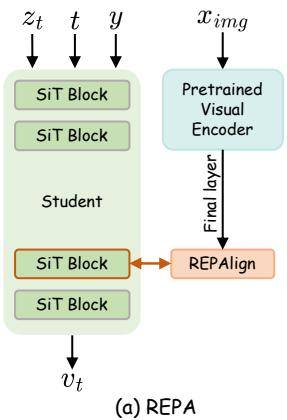

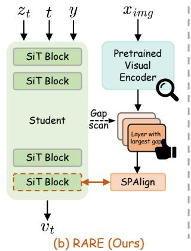

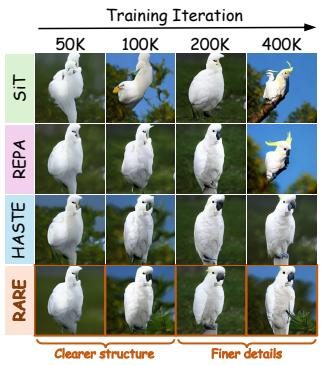  
(c) Generation quality  
Figure 1: Alignment placed by convention and by measurement. (a) REPA alignment (REPAlign) pulls a fixed student block toward the teacher’s deepest layer for the whole run. (b) RARE first reads from a frozen checkpoint how much of each teacher layer the student still lacks, then applies sparse alignment (SPAlign): it aligns only the layer with the largest gap, puts more weight on tokens that are still far from the target, and switches the loss off once this distance stops falling, so alignment covers one layer and only the early part of training. (c) One class and noise draw at four training steps, guidance scale 4.0.

To see why similarity points the wrong way, we isolate what each teacher layer adds beyond the layer below it, its increment, and ask how much of it a frozen student can linearly recover at each block and noise level. The generative objective fills the hierarchy from the bottom up and stalls near the top (Figure 2): shallow increments are recovered early, while the deepest stay at the noise level of the measurement through 400K steps, across model sizes, teachers and image domains. We call this regularity hierarchy filling. It explains the reversal: a block resembles the teacher where the objective has already filled the hierarchy, and the stalled top, where REPA’s default target lies, is where an external signal has something to add.

Measuring the stall gives a placement criterion. The recoverability gap is the share of a teacher increment that the student cannot linearly recover at a given block and noise level, relative to the best readout the measurement achieves anywhere. Read from one checkpoint of the unaligned run, it orders the fourteen runs by their FID improvement (Spearman $\rho = 0 . 9 2 )$ , whereas the slope of the denoising loss toward the same target does not: benefit follows how far the student is from a layer, not how steep the first step is. RARE turns the gap into a training recipe (Figure 1b): it aligns the teacher layer with the largest gap, weights each token by how far its projected feature still is from the target, and switches the loss off once this distance stops falling. Nothing is added at inference.

With SiT-B/2 on ImageNet 256 × 256, RARE reaches an FID of 18.02 without guidance and 4.46 with it, ahead of all seven alignment baselines, in 14% fewer GPU-hours than iREPA, and it improves on iREPA across model scales, teachers, image domains and backbones. In summary:

• We show that the generative objective fills the teacher’s hierarchy from the bottom up: a student trained without alignment linearly recovers what shallow teacher layers add, but almost none of what the deepest layers add (Section 3).

• We propose the recoverability gap, read from one unaligned checkpoint, and show that it orders placements by alignment benefit, while similarity-based criteria order them in reverse (Section 4).

• We introduce RARE, which aligns the layer with the largest gap, weights tokens by their distance to the target and switches the loss off once that distance plateaus; it outperforms REPA, iREPA and HASTE at lower training cost (Sections 5 and 6).

## 2 RELATED WORK

Representations in generative models. Pretrained visual representations now enter the generative pipeline at every stage. At the tokenizer, VA-VAE (Yao et al., 2025) regularizes the latent toward a vision foundation model, RAE (Zheng et al., 2026) replaces the autoencoder with a frozen encoder, and REPA-E (Leng et al., 2025) trains tokenizer and denoiser end to end through an alignment loss. As intermediate supervision, REPA aligns noisy hidden states to clean teacher features, and later work changes the target to relational structure (Xu et al., 2026), to the model’s own deeper layers (Jiang et al., 2026), or to a representation entangled with the latent (Wu et al., 2025). At the output, representation-space distances serve as the training loss (Yang et al., 2026), and perception tasks are posed as image generation (Gabeur et al., 2026). These designs share a premise: the denoising objective learns discriminative features on its own but lags self-supervised encoders (Xiang et $\mathrm { { a l . } }$ 2023; Chen et al., 2025; Li et al., 2024). A representation present somewhere in the system is not necessarily usable at a given computation stage, as RAEv2 shows for diffusion and studies of language models report (Karim et al., 2026; Yuan et al., 2026). We ask which part of a teacher’s hierarchy the student lacks at a given block and noise level.

Choosing the target, block and schedule. Teacher-side studies compare encoders. REPA favors linear-probe accuracy, and iREPA finds across 27 encoders that spatial structure predicts generation quality far better than classification accuracy. RAEv2 reports that the relevant property depends on whether the representation serves as the latent or as the target, and weighted diversity (Li et al., 2026) and spectral energy (Ning et al., 2026) are further candidates. All of them align the deepest layer of the chosen encoder. Student-side studies choose the block and the schedule. Layer sweeps in REPA, U-REPA (Tian et al., 2026) and AHPA (Min et al., 2026) settle on mid-depth blocks, conditioning residuals (Xiang et al., 2025) select the depth by a short run’s loss, and AG-REPA (Zhang et al., 2026b) ranks student layers and timesteps by gate ablation in audio flow matching. HASTE (Wang et al., 2026) stops alignment early, and DyA (Chen et al., 2026) and REED (Wang et al., 2025) propose other schedules. Set-level ablations in HASTE and REGLUE (Petsangourakis et al., 2025) show that adding shallower teacher layers hurts, without isolating one layer at a fixed block. Knowledge distillation chooses teacher layers by curriculum (Zhang et al., 2026a) or unique information (Dissanayake et al., 2024), and for language models the choice matters little (Yu et al., 2025b). These criteria measure a property of the teacher, how much existing computation depends on a block, or how quickly a short run improves. None measures what the student lacks for a specific teacher layer. Section 4.2 scores block-level versions of these criteria, similarity measures and gradient signals against the recoverability gap on the same runs.

## 3 HIERARCHY FILLING

Let x be an image with latent $z _ { \mathrm { 0 } }$ and noisy latent $z _ { t }$ at noise level t. The student is a SiT (Ma et al., 2024) trained by flow matching (Lipman et al., 2022; Liu et al., 2022), with hidden state $H _ { j , t } \in \mathbb { R } ^ { n \times d _ { s } }$ at block $j$ over n tokens. The teacher is a frozen encoder with layer-i patch features $T _ { i } ( x ) \in \mathbb { R } ^ { n \times d }$ , DINOv2-B (Oquab et al., 2023) by default, and $T _ { 0 }$ is its patch embedding. We read a set I of teacher layers and write $i ^ { - }$ for the layer before i in $\mathcal { T } ,$ with $i ^ { - } = 0$ for the first; selection uses $\mathcal { T } = \{ 3 , 6 , 9 , 1 2 \}$ and the profiles below use all twelve layers (Appendix $\mathbf { A } )$ . Every measurement is in fp32 on a frozen checkpoint of the unaligned run of its setting, fitted and evaluated on disjoint subsets of a 20K-image calibration split, with noise levels in three log-SNR bins.

## 3.1 MEASURING WHAT THE STUDENT HAS BUILT

Teacher layers are nested: most of a deep layer is linearly predictable from the layers below it. Asking whether a student lacks layer i therefore mixes what the layer adds with everything it inherits, and cannot say where in the hierarchy the student stops. We measure instead the increment $\Delta T _ { i }$ , the part of layer i that layer $i ^ { - }$ cannot linearly predict. We whiten every layer to $r = 1 2 8$ dimensions, $\widetilde { T } _ { i }$ , and fit a matrix $B _ { i } \in \mathbb { R } ^ { r \times r }$ that predicts $\widetilde { T } _ { i }$ from $\widetilde { T } _ { i } .$ − by cross-validated reduced-rank ridge regression. The increment is the residual of this prediction,

$$
\Delta T _ { i } = c _ { i } \left( \widetilde { T } _ { i } - \widetilde { T } _ { i ^ { - } } B _ { i } \right) D _ { i } ^ { - 1 } ,\tag{1}
$$

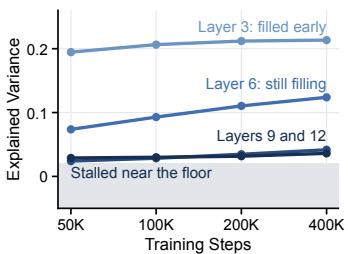  
(a)

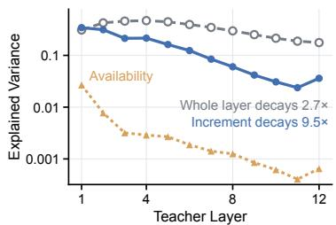  
(b)

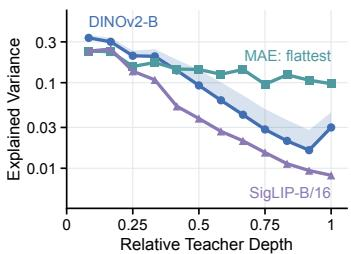  
(c)  
Figure 2: Hierarchy filling. The vertical axis is the held-out explained variance $R ^ { 2 }$ of Eq. 2, the share of a teacher target that a linear readout reconstructs from the frozen student, maximized over blocks and noise levels on the twelve-layer map. Higher means the student already encodes more of that target and leaves less for alignment to add. The grey band lies below $\tau = 0 . 0 2$ , the estimation noise of a held-out $R ^ { 2 }$ . (a) Increments of four teacher layers over training. (b) Whole whitened layer, increment and clean-latent availability at 400K. (c) Three teachers at 100K; the shaded region spans SiT-B/2, SiT-L/2, SiT-XL/2 and Places365 under DINOv2-B.

where the diagonal $D _ { i }$ holds the standard deviation of each residual dimension and the scalar $c _ { i }$ gives $\Delta T _ { i }$ the energy of the whole layer (Appendix A). Whole layers change little with depth, while each increment carries different content (Figure 5).

To test whether the student has built an increment, we fit a linear map from its hidden state to the increment and evaluate it on held-out images. The readout $Q _ { i , j , t } : \mathbb { R } ^ { d _ { s } ^ { * } }  \mathbb { R } ^ { r }$ , one per teacher layer i, block j and noise level t, is a ridge regression applied to every token separately; it only measures and is not the projector used in training. Its score is the held-out explained variance

$$
R _ { i , j , t } ^ { 2 } = 1 - \frac { \sum _ { x } \left. \Delta T _ { i } ( x ) - Q _ { i , j , t } \left( H _ { j , t } ( x ) \right) \right. _ { F } ^ { 2 } } { \sum _ { x } \left. \Delta T _ { i } ( x ) - \mathbf { 1 } \overline { { \Delta T _ { i } } } \right. _ { F } ^ { 2 } } ,\tag{2}
$$

the error relative to predicting the mean token ${ \overline { { \Delta T _ { i } } } } ,$ , summed over held-out images x and tokens: $R ^ { 2 } = 1$ means the block encodes the increment exactly, $R ^ { 2 } \approx 0$ that a linear map finds none of it. The same readout from the clean latent $z _ { 0 }$ gives the availability $A _ { i } ,$ , the share of the increment already linearly present in the input.

## 3.2 THE STUDENT FILLS THE HIERARCHY FROM THE BOTTOM UP

The student builds shallow increments early and deep ones hardly at all (Figure 2a). Through 400K steps the best readout of layer 3 stays near 0.2, while layers 9 and 12 stay below 0.05, close to the readout floor. Whole layers hide this stall, because a deep layer carries shallow content forward (Figure 2b). The stall is neither a readout limit, as 0.18 of the whole layer 12 is recovered, nor an input artifact, as availability is at most 0.03. The profile holds across model scales, on Places365 and under SigLIP, and is flatter under MAE (Figure 2c; Section 6.3). The generative objective thus builds the shallow increments by itself, consistent with evidence that diffusion models acquire higher-level structure late (Favero et al., 2025), and leaves the top unbuilt within our budgets. That top, where REPA’s default target lies, is where a teacher has something to add.

## 4 THE RECOVERABILITY GAP

## 4.1 FROM READOUT TO GAP

Hierarchy filling suggests aligning where the student cannot recover what the teacher adds. Turning a readout into a gap requires a ceiling, and because selection compares teacher layers the ceiling must be shared: normalized by its own best readout, a layer the student recovers nowhere would be scaled by its own estimation noise and look complete. We normalize by the best readout the

Table 1: Placement criteria scored against realized alignment benefit. Spearman rank $\rho$ between each criterion, read from the unaligned run at 10K, 30K and 50K steps, and the gFID benefit of the fourteen branches of Section 4.2; tied values share their mean rank. Stable marks a criterion whose percentile-bootstrap 95% interval excludes zero at all three checkpoints, in either direction.
<table><tr><td rowspan="2">Criterion</td><td rowspan="2">What It Measures</td><td colspan="3">Spearman ρ with Benefit</td><td rowspan="2">Stable</td></tr><tr><td>10K</td><td>30K</td><td>50K</td></tr><tr><td>Recoverability gap N (Ours)</td><td>Unrecovered share of the target</td><td>+0.86</td><td>+0.90</td><td>+0.92</td><td> $\checkmark$ </td></tr><tr><td>Similarity to the Target</td><td></td><td></td><td></td><td></td><td></td></tr><tr><td>Readout  $R ^ { 2 }$ </td><td>Recovered share of the target</td><td>-0.85</td><td>-0.87</td><td>-0.89</td><td></td></tr><tr><td>CKA</td><td>Similarity to the target</td><td>-0.81</td><td>-0.84</td><td>-0.85</td><td></td></tr><tr><td>Gram similarity</td><td>Match of token-to-token relations</td><td>+0.37</td><td>-0.37</td><td>-0.27</td><td>X</td></tr><tr><td>Property of the Student Block</td><td></td><td></td><td></td><td></td><td></td></tr><tr><td>LDS (iREPA)</td><td>Spatial structure of the block</td><td>+0.15</td><td>-0.03</td><td>-0.40</td><td>X</td></tr><tr><td>Linear probing (REPA)</td><td>Class separability of the block</td><td>-0.40</td><td>-0.01</td><td>-0.11</td><td>X</td></tr><tr><td>Gate ablation (AG-REPA)</td><td>Loss increase if the block is removed</td><td>+0.31</td><td>+0.31</td><td>+0.43</td><td>X</td></tr><tr><td>First-Order Signal</td><td></td><td></td><td></td><td></td><td></td></tr><tr><td>Gradient cosine (HASTE)</td><td>Alignment-flow gradient agreement</td><td>-0.91</td><td>-0.93</td><td>-0.49</td><td></td></tr><tr><td>First-order utility U</td><td>Flow-loss slope toward the target</td><td>-0.34</td><td>+0.00</td><td>-0.04</td><td>x</td></tr><tr><td> $N \cdot [ U ] _ { + }$  (fixed in advance)</td><td>Gap times positive slope</td><td>-0.34</td><td>-0.28</td><td>-0.25</td><td>X</td></tr></table>

measurement achieves anywhere:

$$
R _ { * } ^ { 2 } = \operatorname* { m a x } \Big \{ \tau , \operatorname* { m a x } _ { i ^ { \prime } \in \mathcal { Z } } A _ { i ^ { \prime } } , \operatorname* { m a x } _ { i ^ { \prime } \in \mathcal { Z } , j ^ { \prime } , t ^ { \prime } } R _ { i ^ { \prime } , j ^ { \prime } , t ^ { \prime } } ^ { 2 } \Big \} ,\tag{3}
$$

$$
N _ { i , j , t } = \mathrm { c l i p } _ { [ 0 , 1 ] } \bigg ( 1 - \frac { R _ { i , j , t } ^ { 2 } } { R _ { * } ^ { 2 } } \bigg ) .\tag{4}
$$

where $\mathrm { c l i p } _ { [ a , b ] } ( u ) = \operatorname* { m i n } \{ \operatorname* { m a x } \{ u , a \} , b \}$ . The floor $\tau = 0 . 0 2$ is the estimation noise of a held-out $R ^ { 2 } ;$ ; a layer whose best readout stays below it cannot be located and is excluded from selection (Appendix A). In terms of usable information (Xu et al., 2020), N is the share of an increment that the student’s state does not carry under a linear readout family. Averaged over noise levels, N forms a map over teacher layers and student blocks, and selection takes the teacher layer of its argmax.

## 4.2 WHICH CRITERIA PREDICT ALIGNMENT BENEFIT?

A criterion is useful only if it ranks candidate placements in the order of their benefit. We test this on fourteen diagnostic branches that fork the unaligned SiT-B/2 at 10K steps and train 50K further steps, each aligning one whitened target at one block under a shared projector, loss weight and budget: increments of all four layers at several blocks, plus content and function-class controls (Appendix B). Benefit is the improvement over the unaligned branch in $g F I D ,$ , an FID on 10K samples with labels and noise shared across branches. Duplicated branches bound the seed spread at 0.58 gFID, so we treat separations above about 1.5 gFID as reliable. The published REPA configuration, +19.87 $\mathrm { g F I D }$ , is a positive control. Since a criterion is used to choose among placements, what matters is the order, not the scale of its values. We therefore score each criterion by the Spearman rank correlation $\rho ,$ the standard correlation between two rankings: $\rho = + 1$ if the criterion orders the branches as their benefit, −1 if exactly in reverse, and about 0 if it carries no ordering information.

Only the gap ranks placements stably in the right direction (Table 1, Figure 3a), and the shared ceiling carries this signal: with each layer normalized by its own best readout, the same quantity ranks placements at −0.39. Readout $R ^ { \check { 2 } }$ mirrors the gap by construction; the independent evidence is CKA (Kornblith et al., 2019), which ranks placements in reverse (Figure 3b), as hierarchy filling predicts: a block resembles the teacher where the objective has filled the hierarchy. The gradient cosine is negative for the same reason, since the two gradients agree most where the flow objective already moves the student toward the target. Properties of the student block keep no stable sign, and neither does the short-run signal, the branches’ own held-out flow loss $( \rho = - 0 . 0 4 )$

The gap orders placements along the teacher axis (Figure 3c), and two simpler readings of this order fail. If any clean, sample-specific target helped as a regularizer, targets of equal dimension and energy at the same block would not spread over 19 gFID, and the content control, the lowest-gap target, would not degrade generation by 2.0 gFID. Nor is the gap a proxy for depth: within layer 3, where depth is fixed, it still orders the seven branches $( \rho = + 0 . 8 6 $ , 95% interval [0.32, 1]), and at the top, layer 9 beats layer 12 on both seeds, by 1.4 and 1.8 gFID. The gap does not resolve that last difference: the two layers differ by 0.009 in gap, less than the 0.025 spread of a single cell across noise levels. Its argmax, layer 12 at block 6, thus lands on the best plateau rather than the best cell, and both plateau cells exceed the published REPA configuration (+21.3 and +22.7 against +19.9 gFID). The same ordering explains why adding shallower teacher layers hurts (Wang et al., 2026; Petsangourakis et al., 2025).

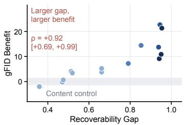  
(a)

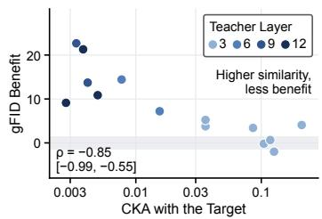  
(b)

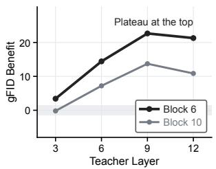  
(c)  
Figure 3: The gap predicts alignment benefit; similarity predicts it in reverse. (a, b) Benefit of the fourteen branches against the gap and against CKA, on a logarithmic axis, on the 50K map, colored by teacher layer, with Spearman $\rho$ and its 95% interval; the grey band marks benefits within 1.5 gFID of zero. (c) Benefit along the teacher axis at blocks 6 and 10.

The gap does not choose the block. For layer 12 it varies by less than 0.02 across blocks, while benefit more than doubles from block 2 to block 6 (Figure 6b): the gap tells whether the student has a layer’s content, not where to supply it.

Distance, not slope. An alternative to the distance to a layer is the slope toward $\mathbf { i t } ,$ the logic of HASTE’s gradient angle. Its finest-grained form, the first-order utility U, the relative flow-loss reduction per unit step of the hidden state toward the target (Appendix D), does not rank placements, and the product $N \cdot [ \dot { U } ] _ { + }$ , fixed in advance, erases the signal of N (Table 1); four controls attribute this to U rather than to its estimator. Benefit over many steps follows the distance to the target, not the local slope: a slope may signal when to stop aligning, as in HASTE, but not where to align.

## 5 RARE: ALIGNING WHERE THE GAP IS

RARE takes the teacher layer from the gap, follows the gap’s training-time counterpart, the alignment residual, across tokens and training steps, and keeps the student block of the baselines.

Target. RARE aligns the teacher layer with the largest gap, $i ^ { \star }$ , fixed from the map before alignment. On ImageNet with SiT-B/2 this is layer 12, the layer REPA and iREPA align by default; on Places365 it is layer 9. The training target is the whitened layer $\widetilde { T } _ { i }$ ⋆ rather than its increment. The increment locates the stall, but layers 9 and 12 form one plateau of the gap (Section 4.2), and the whitened layer carries both increments. It beats the increment in every setting we test (Tables 3 and 7).

Depth. Since the gap does not separate blocks, RARE inserts the target at the block of the released REPA and iREPA configurations, $j _ { \mathrm { b } } = 4$ on SiT-B/2 and $j _ { \mathrm { b } } = 8$ on SiT-L/2 and SiT-XL/2, so every comparison with them is placement-matched. Block 6, where the selected cell lies, is an ablation.

Release. The gap is read on frozen checkpoints. During training RARE tracks the alignment residual defined below and releases the loss once it stops falling: past that point alignment constrains the student without closing the gap further, the capacity cost HASTE identifies.

During alignment the loss is

$$
\mathcal { L } = \mathcal { L } _ { \mathrm { { f l o w } } } - \lambda ( s ) \frac { 1 } { n } \sum _ { k = 1 } ^ { n } w _ { k } \cos _ { k } , \qquad \cos _ { k } = \cos \big ( P ( H _ { j _ { \mathrm { b } } , t } ) _ { k } , \ \mathrm { s n } ( \widetilde { T } _ { i ^ { \star } } ) _ { k } \big ) ,\tag{5}
$$

the sparse alignment loss (SPAlign in Figure 1), sparse because it acts on one teacher layer, concentrates on the tokens that still miss their target, and is active only until the release. Here s is the training step, $P$ is the convolutional projector of iREPA and sn its spatial normalization $( \mathsf { A p - }$ pendix E); the target uses the frozen calibration statistics $( W _ { i ^ { \star } } , \mu _ { i ^ { \star } } )$ , and the projector is discarded after training. Let $\eta _ { k } = \textstyle { \frac { 1 } { 2 } } ( 1 - \cos _ { k } )$ be the alignment residual of token k, the part of the target its projected state still misses. The token weights follow the residual:

$$
\tilde { w } _ { k } = \mathrm { c l i p } _ { [ w _ { \mathrm { m i n } } , w _ { \mathrm { m a x } } ] } \left( \frac { \mathrm { s g } ( \eta _ { k } ) } { \frac { 1 } { n } \sum _ { k ^ { \prime } } \mathrm { s g } ( \eta _ { k ^ { \prime } } ) } \right) , \qquad w _ { k } = \frac { \tilde { w } _ { k } } { \frac { 1 } { n } \sum _ { k ^ { \prime } } \tilde { w } _ { k ^ { \prime } } } ,\tag{6}
$$

where sg is the stop-gradient, so the weights only reallocate the alignment gradient across tokens. A token’s raw weight is its residual relative to the mean residual; the bounds $w _ { \mathrm { m i n } } = 1 / 4$ and $w _ { \mathrm { m a x } } = 4$ are hyperparameters that keep a token that already matches the target in the loss and stop a few outlier tokens from dominating it. The schedule stops spending once the residual plateaus. Let $\hat { g } _ { s }$ and $\bar { g } _ { s }$ be exponential moving averages of the mean residual with decays 0.999 and 0.99995, and let $s _ { 0 }$ be the first step after a warm-up of S steps at which the fast average stops improving on the slow one, $( \bar { g } _ { s } - \hat { g } _ { s } ) / \bar { \bar { g } } _ { s } < \delta = 2 \%$ . With the cosine ramp $\begin{array} { r } { \phi ( s ; a ) = \frac { 1 } { 2 } \big ( 1 + \cos ( \bar { \pi } \mathrm { c l i p } _ { [ 0 , 1 ] } \frac { s - \bar { a } } { S } ) \big ) } \end{array}$ where S is one eighth of the training budget (50K steps in 400K-step runs), and $\phi ( s ; s _ { 0 } ) = 1$ before the plateau is detected,

$$
\lambda ( s ) = \lambda _ { 0 } \operatorname * { m i n } \big \{ \phi ( s ; s _ { 0 } ) , \phi ( s ; s _ { \mathrm { h } } - S ) \big \} , \qquad \lambda _ { 0 } = 1 , \quad s _ { \mathrm { h } } = 2 5 0 \mathrm { K } ,\tag{7}
$$

so the loss reaches zero within S steps of the plateau, and by the 250K horizon of HASTE at the latest. On ImageNet the plateau is detected at step 104K and the loss reaches zero at 154K.

## 6 EXPERIMENTS

In this section, we conduct experiments to answer the following research questions:

• RQ1: Does placing alignment by the gap improve on existing methods on ImageNet-256?

• RQ2: How much do the target, block, token weights and release of RARE each contribute?

• RQ3: How does alignment change training speed and the gap at the layer it targets?

• RQ4: Does the recipe transfer across model scale, teacher, image domain and backbone?

• RQ5: What do selecting the layer and training with RARE cost?

## 6.1 EXPERIMENTAL SETUP

Data and models. ImageNet-1K at 256 × 256 (Deng et al., 2009) is the main benchmark, and Places365-Standard (Zhou et al., 2018) changes the image distribution under the same classconditional pipeline. The student is SiT-B/2, with SiT-L/2 and SiT-XL/2 for the scale study, and the tokenizer is the SD-VAE of Rombach et al. (2022). The teachers are DINOv2-B, MAE-B/16 (He et al., 2022) and SigLIP-B/16 (Zhai et al., 2023), three ViT-B encoders with twelve layers and the same 16 × 16 patch grid, pre-trained by self-distillation, pixel reconstruction and language supervision (Radford et al., 2021).

Baselines. The baselines are the unaligned SiT, REPA, iREPA and HASTE in their published configurations, and four objectives that change what is aligned: token-relation structure (sREPA), the model’s own deeper EMA layer (SRA), a frozen VAE prior with a timestep router (AHPA), and a latent affinity without any encoder (SPARE, Hong et al. 2026).

Training and evaluation. All runs share one initialization and seed and train with batch size 256, AdamW at a constant learning rate of $1 0 ^ { - 4 }$ , fp16 and EMA decay 0.9999 on eight V100 GPUs. ImageNet and Places365 runs train for 400K steps, about 80 epochs; the scale, teacher and MM-DiT studies stop at a 100K endpoint fixed in advance. We follow the ADM protocol (Dhariwal & Nichol, 2021): 50K samples from a 250-step Euler–Maruyama SDE sampler, scored by FID (Heusel et al., 2017), sFID, Inception Score (Salimans et al., 2016), precision and recall (Kynka¨anniemi et al.,¨ 2019), and CMMD (Jayasumana et al., 2024), which does not use Inception features; Places365 adds KID (Binkowski et al., 2018). All methods share class labels, initial noise and sampler noise.´ Unguided results are the main comparison, and at the endpoint we also report classifier-free guidance (CFG) of scale 1.65 on the interval [0, 0.72]. Sample figures keep class and noise fixed within each column and use guidance 4.0 for visualization. Unless a table says otherwise, the setting is SiT-B/2 with DINOv2-B on ImageNet-256, the best value is in bold and the second best underlined.

Table 2: ImageNet-256 with SiT-B/2 at 400K steps. L12 is DINOv2-B’s last layer, aligned raw (768 dimensions) unless marked whitened (128 dimensions); attn. is HASTE’s attention-map term.
<table><tr><td rowspan="2">Method</td><td colspan="2">Alignment</td><td rowspan="2">FID↓ sFID↓</td><td rowspan="2"></td><td rowspan="2">IS↑ Prec.↑ Rec.↑ CMMD↓</td><td rowspan="2"></td><td rowspan="2"></td></tr><tr><td>Target</td><td>Block</td></tr><tr><td colspan="8">Without Guidance</td></tr><tr><td>SiT (Ma et al., 2024) (ECCV’24)</td><td></td><td></td><td>35.15</td><td>6.60</td><td>41.94</td><td>0.526 0.633</td><td>1.279</td></tr><tr><td>REPA (Yu et al., 2025a) (ICLR&#x27;25)</td><td>L12</td><td>4</td><td>22.39</td><td>6.62</td><td>65.62</td><td>0.594 0.648</td><td>1.067</td></tr><tr><td>iREPA (Singh et al., 2026a) (ICLR&#x27;26)</td><td>L12</td><td>4</td><td>20.40</td><td>6.90</td><td>72.61</td><td>0.602 0.650</td><td>1.054</td></tr><tr><td>HASTE (Wang et al., 2026) (NeurIPS&#x27;25)</td><td>L12 + attn.</td><td>8</td><td>18.99</td><td>6.52</td><td>74.13</td><td>0.624 0.638</td><td>0.984</td></tr><tr><td>sREPA (Xu et al., 2026) (arXiv&#x27;26)</td><td>L12 + Gram</td><td>4</td><td>21.64</td><td>6.77</td><td>68.83</td><td>0.596 0.645</td><td>1.060</td></tr><tr><td>SRA (Jiang et al., 2026) (ICLR&#x27;26)</td><td>Self (EMA)</td><td>4</td><td>28.84</td><td>6.15</td><td>51.35</td><td>0.5630.645</td><td>1.146</td></tr><tr><td>AHPA (Min et al., 2026) (arXiv&#x27;26)</td><td>VAE prior</td><td>3</td><td>37.52</td><td>6.81</td><td>40.09</td><td>0.5100.637</td><td>1.327</td></tr><tr><td>SPARE (Hong et al., 2026) (arXiv&#x27;26)</td><td>Latent affinity</td><td>4</td><td>31.36</td><td>6.35</td><td>46.81</td><td>0.548 0.643</td><td>1.202</td></tr><tr><td>RARE (Ours)</td><td>L12, whitened 4</td><td></td><td>18.02</td><td>6.35</td><td>77.44</td><td>0.626 0.640</td><td>0.970</td></tr><tr><td colspan="8">With Guidance (scale 1.65 on [0, 0.72])</td></tr><tr><td>SiT</td><td></td><td></td><td>14.33</td><td>5.23</td><td>96.93</td><td>0.689 0.559</td><td>0.994</td></tr><tr><td>REPA</td><td>L12</td><td>4</td><td>6.69</td><td>5.26 155.45</td><td></td><td>0.737 0.590</td><td>0.828</td></tr><tr><td>iREPA</td><td>L12</td><td>4</td><td>5.48</td><td></td><td>5.39172.89</td><td>0.7480.588</td><td>0.809</td></tr><tr><td>HASTE</td><td>L12 + attn.</td><td>8</td><td>5.00</td><td></td><td>5.28 176.12</td><td>0.767 0.577</td><td>0.760</td></tr><tr><td>sREPA</td><td>L12 + Gram</td><td>4</td><td>6.12</td><td></td><td>5.34 162.26</td><td>0.742 0.589</td><td>0.819</td></tr><tr><td>SRA</td><td>Self (EMA)</td><td>4</td><td>10.47</td><td></td><td>4.94116.29</td><td>0.726 0.554</td><td>0.883</td></tr><tr><td>AHPA</td><td>VAE prior</td><td>3</td><td>15.84</td><td>5.40</td><td>91.27</td><td>0.6740.565</td><td>1.038</td></tr><tr><td>SPARE</td><td>Latent affinity</td><td>4</td><td>11.97</td><td>5.07</td><td>108.62</td><td>0.710 0.556</td><td>0.931</td></tr><tr><td>RARE (Ours)</td><td>L12, whitened 4</td><td></td><td>4.46</td><td></td><td>5.09 182.00</td><td>0.781 0.566</td><td>0.732</td></tr></table>

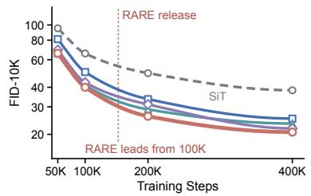  
(a)

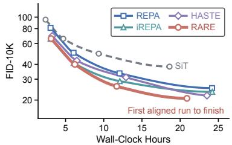  
(b)

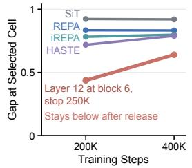  
(c)  
Figure 4: Training dynamics. (a, b) FID-10K without guidance on a logarithmic axis against steps, mapped by $( s / 1 0 0 \mathrm { K } ) ^ { 1 . 2 }$ to spread the early checkpoints, and against wall-clock hours; markers are measured checkpoints. (c) Gap at the selected cell (layer 12, block 6; twelve-layer map) at 200K and 400K, including the run that aligns this cell until 250K (Table 3, row 4).

With one training seed per run, FID differences below about 1.5, the separation the seed spread of Section 4.2 supports, are read for their direction only.

## 6.2 COMPARISON ON IMAGENET-256 (RQ1–RQ3)

Main comparison (RQ1). RARE has the best FID, IS, precision and CMMD with and without guidance (Table 2), ahead of iREPA by 2.38 FID without guidance. The contrast between the baseline groups is as informative: the three methods that replace the pretrained teacher with a signal already in the system, SRA, SPARE and AHPA, trail every teacher-based method, and AHPA does not improve on the unaligned SiT, as expected if alignment supplies content the student lacks.

Ablation (RQ2). Table 3 changes one decision at a time, except rows 5 and 6, which change the token weights and the release together. Two results carry the design. The 128-dimensional whitened layer ties iREPA’s 768-dimensional target (row 1), so one sixth of the dimensions keeps what alignment needs. Releasing the loss is the largest single gain, 1.54 FID over keeping it on (rows 2 and 4). Block 6 and the increment target each raise FID (rows 1 to 3), and residual-proportional weights with a ramped release lower it (rows 5 and 6). The measured release trails the hand-set ramp by 0.17 FID at 400K but stops 96K steps earlier and leads by 2.97 FID-10K at 200K (rows 6 and 7).

Table 3: Ablation of RARE’s decisions at 400K steps. All rows align layer 12, whitened or as its increment, with RARE’s projector and loss weight. wk: token weights (Eq. 6); Measured: release of Eq. 7; Ramp: hand-set. Row 7 is RARE.
<table><tr><td rowspan="2">#</td><td rowspan="2">Target</td><td rowspan="2">Block</td><td rowspan="2"> $w _ { k }$ </td><td rowspan="2">Schedule</td><td colspan="2">FID-50K↓</td></tr><tr><td>no CFG</td><td>CFG</td></tr><tr><td>1</td><td>Whitened</td><td>4</td><td>X</td><td>Always on</td><td>20.40</td><td>5.48</td></tr><tr><td>2</td><td>Whitened</td><td>6</td><td>X</td><td>Always on</td><td>20.86</td><td>5.85</td></tr><tr><td>3</td><td>Increment</td><td>6</td><td>X</td><td>Always on</td><td>21.79</td><td>6.42</td></tr><tr><td>4</td><td>Whitened</td><td>6</td><td>X</td><td>Stop at 250K</td><td>19.32</td><td>4.90</td></tr><tr><td>5</td><td>Whitened</td><td>4</td><td>X</td><td>Stop at 250K</td><td>18.83</td><td>4.77</td></tr><tr><td>6</td><td>Whitened</td><td>4</td><td>√</td><td>Ramp 200K→250K</td><td>17.85</td><td>4.45</td></tr><tr><td>7</td><td>Whitened</td><td>4</td><td></td><td>Measured</td><td>18.02</td><td>4.46</td></tr></table>

Training dynamics (RQ3). RARE also leads during training (Figure 4a,b): it has the lowest FID-10K from 100K steps on and finishes 400K steps in 20.9 hours against 24.2 for iREPA. The gap at the selected cell shows what alignment does to the student (Figure 4c). The run that aligns this cell lowers its gap from 0.92 to 0.44 by 200K steps, below the 0.72 to 0.83 of REPA, iREPA and HASTE, which align layer 12 at blocks 4 and 8. At 400K, 150K steps after the release, the gap has risen only to 0.64: releasing the loss keeps most of what alignment filled. The closure concentrates on the aligned layer, 0.49 of the gap at layer 12 against at most 0.27 elsewhere on the map (Figure 7). In samples, only RARE renders the peacock’s open train at 400K (Figure 9), and along the sampler the aligned models fix the object earlier rather than sharpening the last steps (Figure 12).

## 6.3 TRANSFER ACROSS SCALE, TEACHER AND DOMAIN (RQ4)

ImageNet runs keep the recipe of SiT-B/2, and on Places365 RARE aligns layer 9, the layer its map selects. RARE has a lower FID than iREPA in all six settings of Table 4, most clearly with MAE (6.14 FID); Table 6 reports all metrics and Figure 11 shows Places365 samples. The whitened layer also beats the increment in every setting, by 1.86 to 5.33 FID, even when the increment is aligned at the cell its own map selects (Table 7).

Other backbones. The ordering holds when the generative objective or the architecture changes. On DiT-B/2 with ϵ-prediction and a DDPM sampler, and on MM-DiT-B/2, whose image and class tokens keep separate weights and share one attention, RARE has the lowest FID with and without guidance (Tables 8 and 9); without guidance it reaches

Table 4: Transfer. Unguided FID-50K except the CFG row; RARE aligns layer 9 on Places365. Bold: better of iREPA and RARE.
<table><tr><td rowspan="2">Setting</td><td colspan="2">FID↓</td></tr><tr><td>SiT iREPA</td><td>RARE</td></tr><tr><td></td><td>(a) Scale, DINOv2-B, 100K Steps</td><td>36.66</td></tr><tr><td>SiT-B/2 SiT-L/2</td><td>62.59 37.70 47.19 19.94</td><td>18.93</td></tr><tr><td>SiT-XL/2</td><td>42.45 16.52</td><td>16.07</td></tr><tr><td>(b) Teacher, SiT-B/2,</td><td>100K Steps</td><td></td></tr><tr><td>MAE-B/16</td><td>62.59 49.95</td><td>43.81</td></tr><tr><td>SigLIP-B/16 (c) Places365, SiT-B/2,</td><td>62.59 40.60 , 400K Steps</td><td>39.86</td></tr><tr><td>no CFG</td><td>11.40 7.71</td><td>7.33</td></tr><tr><td>CFG</td><td>6.79 4.98</td><td>4.54</td></tr></table>

20.54 and 32.98 against 21.76 and 34.28 for HASTE, the strongest baseline.

Teacher. The teacher comparison agrees with a prediction of hierarchy filling: a teacher whose hierarchy the student fills more completely leaves less for alignment to add. Under MAE the largest gap along the teacher axis is 0.82, against 0.96 for DINOv2 and 0.95 for SigLIP, and MAE gives the smallest improvement over the unaligned SiT, 18.78 FID against 25.93 and 22.73.

## 6.4 TRAINING AND SELECTION COST (RQ5)

RARE trains at 0.188 seconds per step against 0.218 for iREPA and reaches 400K steps in 167 GPUhours, 14% fewer than iREPA and 11% fewer than HASTE, because its target has 128 dimensions and its loss is released before the midpoint (Table 5). Selecting the layer costs one map of a 50K-step unaligned checkpoint, 0.15 to 0.35 GPU-hours, plus 19 GPU-hours to train that checkpoint if it is not already available. Training every candidate cell to 100K steps instead costs 836 GPU-hours, and its best cell leads the map’s choice by 1.37 gFID (Figure 8).

## 7 CONCLUSION, LIMITATIONS AND FUTURE WORK

Representation alignment helps where the student cannot linearly recover the teacher’s features, not where it already resembles them. The generative objective fills the hierarchy bottom-up and stalls near the top; the gap it leaves ranks placements by benefit. RARE takes its target from the gap and its schedule from the alignment residual, and beats REPA, iREPA and HASTE at lower training cost.

The four-layer map does not separate its top two layers, so its argmax trails the best cell by 1.4 to 1.8 gFID, and it neither chooses the student block nor predicts the size of a benefit. The evidence covers SiT-B/L/XL, DiT-B/2 and MM-DiT-B/2 with three ViT-B teachers on ImageNet and Places365, one seed per setting and 100K endpoints in the scale, teacher and MM-DiT studies. The same measurement could guide other models that inject a pretrained representation, such as tokenizers on frozen encoders and unified understanding-and-generation models, before any aligned run is trained.

## AI USE STATEMENT

We used generative AI tools to assist with figure preparation and to edit and proofread the manuscript.

## ETHICS STATEMENT

This work trains class-conditional image generators on ImageNet-1K and Places365-Standard and measures them against publicly released pretrained encoders. Both datasets are standard public research corpora; no human subjects were involved and no new data were collected. The method lowers the training cost of an existing class of generative models without extending what they can produce, so it inherits the known risks of image synthesis rather than adding one.

## REPRODUCIBILITY STATEMENT

Section 6.1 gives the datasets, backbones, tokenizer, optimizer, batch size, precision, hardware, budget and the paired sampling protocol under which every number is scored. Sections 3 to 5 and Appendix A define the decomposition, the recoverability gap and the alignment loss with the constants they use: the rank $r \ = \ 1 2 8$ , the variance floor $\gamma = 0 . 1$ , the readout floor $\tau = 0 . 0 2 .$ the token-weight bounds $w _ { \mathrm { m i n } } = 1 / 4$ and $w _ { \mathrm { m a x } } = 4$ , the plateau tolerance $\delta \ : = \ : 2 \%$ , the loss weight $\lambda _ { 0 } = 1$ and the release ramp of one eighth of the training budget. Every map is computed in fp32 from one frozen checkpoint of the unaligned baseline of its own setting, on a 20K-image calibration split with disjoint fit, development and evaluation subsets. Appendices A to E give the decomposition constants, the diagnostic branches, the estimation protocol and controls of the firstorder utility, and the projector of RARE.

## REFERENCES

Mikołaj Binkowski, Danica J Sutherland, Michael Arbel, and Arthur Gretton. Demystifying mmd ´ gans. arXiv preprint arXiv:1801.01401, 2018.

Qing Chen, Hengyu Zhang, Xingjiao Wu, Daoguo Dong, and Liang He. Accelerating diffusion transformer with dynamic alignment. In International Conference on Artificial Neural Networks, pp. 181–192. Springer, 2026.

Xinlei Chen, Zhuang Liu, Saining Xie, and Kaiming He. Deconstructing denoising diffusion models for self-supervised learning. In International Conference on Learning Representations, volume 2025, pp. 55458–55472, 2025.

Jia Deng, Wei Dong, Richard Socher, Li-Jia Li, Kai Li, and Li Fei-Fei. Imagenet: A large-scale hierarchical image database. In 2009 IEEE Conference on Computer Vision and Pattern Recognition, pp. 248–255, 2009. doi: 10.1109/CVPR.2009.5206848.

Prafulla Dhariwal and Alexander Nichol. Diffusion models beat gans on image synthesis. Advances in neural information processing systems, 34:8780–8794, 2021.

Pasan Dissanayake, Faisal Hamman, Barproda Halder, Ilia Sucholutsky, Qiuyi Zhang, and Sanghamitra Dutta. Quantifying knowledge distillation using partial information decomposition. arXiv preprint arXiv:2411.07483, 2024.

Patrick Esser, Sumith Kulal, Andreas Blattmann, Rahim Entezari, Jonas Muller, Harry Saini, Yam¨ Levi, Dominik Lorenz, Axel Sauer, Frederic Boesel, Dustin Podell, Tim Dockhorn, Zion English, Kyle Lacey, Alex Goodwin, Yannik Marek, and Robin Rombach. Scaling rectified flow transformers for high-resolution image synthesis. In Proceedings of the 41st International Conference on Machine Learning, pp. 12606–12633, 2024.

Alessandro Favero, Antonio Sclocchi, Francesco Cagnetta, Pascal Frossard, and Matthieu Wyart. How compositional generalization and creativity improve as diffusion models are trained. arXiv preprint arXiv:2502.12089, 2025.

Valentin Gabeur, Shangbang Long, Songyou Peng, Paul Voigtlaender, Shuyang Sun, Yanan Bao, Karen Truong, Zhicheng Wang, Wenlei Zhou, Jonathan T Barron, et al. Image generators are generalist vision learners. arXiv preprint arXiv:2604.20329, 2026.

Kaiming He, Xinlei Chen, Saining Xie, Yanghao Li, Piotr Dollar, and Ross Girshick. Masked au-´ toencoders are scalable vision learners. In Proceedings ofthe IEEE/CVF Conference on Computer Vision and Pattern Recognition (CVPR), pp. 16000–16009, June 2022.

Martin Heusel, Hubert Ramsauer, Thomas Unterthiner, Bernhard Nessler, and Sepp Hochreiter. Gans trained by a two time-scale update rule converge to a local nash equilibrium. Advances in neural information processing systems, 30, 2017.

Zong-Wei Hong, Jinglun Li, Shen Zhang, Yuhan Liu, Linze Li, and Yao Tang. Spare: Structural parameter-free affinity regularization for flow matching. arXiv preprint arXiv:2608.01990, 2026.

Sadeep Jayasumana, Srikumar Ramalingam, Andreas Veit, Daniel Glasner, Ayan Chakrabarti, and Sanjiv Kumar. Rethinking fid: Towards a better evaluation metric for image generation. In 2024 IEEE/CVF Conference on Computer Vision and Pattern Recognition (CVPR), pp. 9307–9315. IEEE, 2024.

Dengyang Jiang, Mengmeng Wang, Liuzhuozheng Li, Lei Zhang, Haoyu Wang, Wei Wei, Guang Dai, Yanning Zhang, and Jingdong Wang. Representation alignment for diffusion transformers without external components. In The Fourteenth International Conference on Learning Representations, 2026.

Ahmed Karim, Fatima Sheaib, Zein Khamis, Maggie Chlon, Jad Awada, and Leon Chlon. Attention deficits in language models: Causal explanations for procedural hallucinations. arXiv preprint arXiv:2602.19239, 2026.

Simon Kornblith, Mohammad Norouzi, Honglak Lee, and Geoffrey Hinton. Similarity of neural network representations revisited. In International conference on machine learning, pp. 3519– 3529. PMlR, 2019.

Tuomas Kynka¨anniemi, Tero Karras, Samuli Laine, Jaakko Lehtinen, and Timo Aila. Improved ¨ precision and recall metric for assessing generative models. Advances in neural information processing systems, 32, 2019.

Xingjian Leng, Jaskirat Singh, Yunzhong Hou, Zhenchang Xing, Saining Xie, and Liang Zheng. Repa-e: Unlocking vae for end-to-end tuning with latent diffusion transformers. In 2025 IEEE/CVF International Conference on Computer Vision (ICCV), pp. 18262–18272. IEEE, 2025.

Binglei Li, Mengping Yang, Zhiyu Tan, Xiaomeng Yang, Zhizhong Huang, Junping Zhang, and Hao Li. Diversedit++: Quantifying, analyzing, and promoting representation diversity in diffusion transformers. arXiv preprint arXiv:2608.03082, 2026.

Tianhong Li, Dina Katabi, and Kaiming He. Return of unconditional generation: A self-supervised representation generation method. Advances in Neural Information Processing Systems, 37: 125441–125468, 2024.

Yaron Lipman, Ricky TQ Chen, Heli Ben-Hamu, Maximilian Nickel, and Matt Le. Flow matching for generative modeling. arXiv preprint arXiv:2210.02747, 2022.

Xingchao Liu, Chengyue Gong, and Qiang Liu. Flow straight and fast: Learning to generate and transfer data with rectified flow. arXiv preprint arXiv:2209.03003, 2022.

Nanye Ma, Mark Goldstein, Michael S Albergo, Nicholas M Boffi, Eric Vanden-Eijnden, and Saining Xie. SiT: Exploring flow and diffusion-based generative models with scalable interpolant transformers. In European Conference on Computer Vision, pp. 23–40. Springer, 2024.

Ruibin Min, Yexin Liu, Aimin Pan, Changsheng Lu, Jiafei Wu, Kelu Yao, Xiaogang Xu, and Harry Yang. Ahpa: Adaptive hierarchical prior alignment for diffusion transformers. arXiv preprint arXiv:2605.03317, 2026.

Mang Ning, Mingxiao Li, Le Zhang, Lanmiao Liu, Matthew B Blaschko, Albert Ali Salah, and Itir Onal Ertugrul. Spectrum matching: a unified perspective for superior diffusability in latent diffusion. arXiv preprint arXiv:2603.14645, 2026.

Maxime Oquab, Timothee Darcet, Th´ eo Moutakanni, Huy Vo, Marc Szafraniec, Vasil Khalidov,´ Pierre Fernandez, Daniel Haziza, Francisco Massa, Alaaeldin El-Nouby, et al. Dinov2: Learning robust visual features without supervision. arXiv preprint arXiv:2304.07193, 2023.

William Peebles and Saining Xie. Scalable diffusion models with transformers. In 2023 IEEE/CVF International Conference on Computer Vision (ICCV), pp. 4172–4182. IEEE, 2023.

Giorgos Petsangourakis, Christos Sgouropoulos, Bill Psomas, Theodoros Giannakopoulos, Giorgos Sfikas, and Ioannis Kakogeorgiou. Reglue your latents with global and local semantics for entangled diffusion. arXiv preprint arXiv:2512.16636, 2025.

Alec Radford, Jong Wook Kim, Chris Hallacy, Aditya Ramesh, Gabriel Goh, Sandhini Agarwal, Girish Sastry, Amanda Askell, Pamela Mishkin, Jack Clark, et al. Learning transferable visual models from natural language supervision. In International conference on machine learning, pp. 8748–8763. PmLR, 2021.

Robin Rombach, Andreas Blattmann, Dominik Lorenz, Patrick Esser, and Bjorn Ommer. High-¨ resolution image synthesis with latent diffusion models. In 2022 IEEE/CVF conference on computer vision and pattern recognition (CVPR), pp. 10674–10685. ieee, 2022.

Tim Salimans, Ian Goodfellow, Wojciech Zaremba, Vicki Cheung, Alec Radford, and Xi Chen. Improved techniques for training gans. Advances in neural information processing systems, 29, 2016.

Jaskirat Singh, Xingjian Leng, Zongze Wu, Liang Zheng, Richard Zhang, Eli Shechtman, and Saining Xie. What matters for representation alignment: Global information or spatial structure? In The Fourteenth International Conference on Learning Representations, 2026a.

Jaskirat Singh, Boyang Zheng, Zongze Wu, Richard Zhang, Eli Shechtman, and Saining Xie. Improved baselines with representation autoencoders. arXiv preprint arXiv:2605.18324, 2026b.

Yuchuan Tian, Hanting Chen, Mengyu Zheng, Yuchen Liang, Chao Xu, and Yunhe Wang. U-repa: Aligning diffusion u-nets to vits. Advances in Neural Information Processing Systems, 38:11003– 11024, 2026.

Chenyu Wang, Cai Zhou, Sharut Gupta, Johnson Lin, Stefanie Jegelka, Stephen Bates, and Tommi Jaakkola. Learning diffusion models with flexible representation guidance. Advances in Neural Information Processing Systems, 38:131176–131222, 2025.

Ziqiao Wang, Wangbo Zhao, Yuhao Zhou, Zekai Li, Zhiyuan Liang, Mingjia Shi, Xuanlei Zhao, Pengfei Zhou, Kaipeng Zhang, Zhangyang Wang, et al. Repa works until it doesn’t: Earlystopped, holistic alignment supercharges diffusion training. Advances in Neural Information Processing Systems, 38:136854–136887, 2026.

Ge Wu, Shen Zhang, Ruijing Shi, Shanghua Gao, Zhenyuan Chen, Lei Wang, Zhaowei Chen, Hongcheng Gao, Yao Tang, Ming-Ming Cheng, et al. Representation entanglement for generation: Training diffusion transformers is much easier than you think. Advances in Neural Information Processing Systems, 38:7714–7743, 2025.

Weilai Xiang, Hongyu Yang, Di Huang, and Yunhong Wang. Denoising diffusion autoencoders are unified self-supervised learners. In 2023 IEEE/CVF International Conference on Computer Vision (ICCV), pp. 15756–15766. IEEE, 2023.

Weilai Xiang, Hongyu Yang, Di Huang, and Yunhong Wang. Ddae++: enhancing diffusion models towards unified generative and discriminative learning. arXiv prepint arXiv:2505.10999, 2025.

Shaodong Xu, Zhendong Wang, Litong Gong, Zexian Li, Wengang Zhou, Tiezheng Ge, and Houqiang Li. Beyond point-wise matching: Structural representation alignment for accelerat ing diffusion transformers. arXiv preprint arXiv:2605.16949, 2026.

Yilun Xu, Shengjia Zhao, Jiaming Song, Russell Stewart, and Stefano Ermon. A theory of usable information under computational constraints. arXiv preprint arXiv:2002.10689, 2020.

Jiawei Yang, Zhengyang Geng, Xuan Ju, Yonglong Tian, and Yue Wang. Representation frechet loss´ for visual generation. arXiv:2604.28190, 2026. URL https://arxiv.org/abs/2604. 28190.

Jingfeng Yao, Bin Yang, and Xinggang Wang. Reconstruction vs. generation: Taming optimization dilemma in latent diffusion models. In 2025 IEEE/CVF Conference on Computer Vision and Pattern Recognition (CVPR), pp. 15703–15712. IEEE, 2025.

Sihyun Yu, Sangkyung Kwak, Huiwon Jang, Jongheon Jeong, Jonathan Huang, Jinwoo Shin, and Saining Xie. Representation alignment for generation: Training diffusion transformers is easier than you think. In The Thirteenth International Conference on Learning Representations, 2025a.

Zony Yu, Yuqiao Wen, and Lili Mou. Revisiting intermediate-layer matching in knowledge distillation: Layer-selection strategy doesn’t matter (much). In Proceedings of the 14th International Joint Conference on Natural Language Processing and the 4th Conference of the Asia-Pacific Chapter of the Association for Computational Linguistics, pp. 1686–1694, 2025b.

Aojie Yuan, Zhiyuan Julian Su, Haiyue Zhang, Yi Nian, and Yue Zhao. Hidden error awareness in chain-of-thought reasoning: The signal is diagnostic, not causal. arXiv preprint arXiv:2605.09502, 2026.

Xiaohua Zhai, Basil Mustafa, Alexander Kolesnikov, and Lucas Beyer. Sigmoid loss for language image pre-training. In Proceedings of the IEEE/CVF International Conference on Computer Vision (ICCV), pp. 11975–11986, October 2023.

Jiaqi Zhang, Ashton Lee, Anthony Wong, John Zou, Sami BuGhanem, and Randall Balestriero. Leap: Layer-skipping efficiency via adaptive progression for vision transformer distillation. arXiv preprint arXiv:2606.19483, 2026a.

Pengfei Zhang, Tianxin Xie, Minghao Yang, and Li Liu. Ag-repa: Causal layer selection for representation alignment in audio flow matching. arXiv preprint arXiv:2603.01006, 2026b.

Boyang Zheng, Nanye Ma, Shengbang Tong, and Saining Xie. Diffusion transformers with representation autoencoders. In International Conference on Learning Representations, volume 2026, pp. 35791–35820, 2026.

Bolei Zhou, Agata Lapedriza, Aditya Khosla, Aude Oliva, and Antonio Torralba. Places: A 10 mil lion image database for scene recognition. IEEE Transactions on Pattern Analysis and Machine Intelligence, 40(6):1452–1464, 2018. doi: 10.1109/TPAMI.2017.2723009.

## PART I THE RECOVERABILITY GAP

## A MEASUREMENT DETAILS AND VISUALIZATION

This section gives the measurement details of Sections 3 and 4: the layer sets, the constants of Eq. 1, the readout floor and ceiling, and a view of the increments.

Layer sets. Selection and criterion scoring read $\mathcal { T } = \{ 3 , 6 , 9 , 1 2 \}$ . The profiles of Figure 2, the map of Figure 6 and the gaps of aligned runs read all twelve layers; their increments are defined against different predecessors and are never compared with the four-layer ones. The calibration split has disjoint fit, development and evaluation subsets, and the measurement never updates the student.

Decomposition. Each layer is whitened to $r = 1 2 8$ dimensions with its own mean $\mu _ { i }$ and matrix $W _ { i }$ , estimated on the fit subset, so that every layer enters the readout with the same dimension and unit variance per direction:

$$
\widetilde { T } _ { i } = \big ( T _ { i } - \mathbf { 1 } \mu _ { i } ^ { \intercal } \big ) W _ { i } \in \mathbb { R } ^ { n \times r } .\tag{8}
$$

With $\widehat { T } _ { i } = \widetilde { T } _ { i ^ { - } } B _ { i }$ the prediction of layer i from layer $i ^ { - }$ , its inherited part, the two normalizers of Eq. 1 are

$$
D _ { i } = \operatorname { d i a g } \big ( \operatorname* { m a x } ( \sigma _ { i , 1 } , \gamma ) , \ldots , \operatorname* { m a x } ( \sigma _ { i , r } , \gamma ) \big ) , \qquad c _ { i } = \frac { \| \widetilde { T } _ { i } \| _ { F } } { \big \| ( \widetilde { T } _ { i } - \widehat { T } _ { i } ) D _ { i } ^ { - 1 } \big \| _ { F } } ,\tag{9}
$$

where $\sigma _ { i , d }$ is the residual standard deviation of dimension d. The variance floor $\gamma = 0 . 1$ keeps residual dimensions that the predecessor almost fully explains from inflating regression noise. The scale $c _ { i }$ gives every increment the energy of its whole layer; it leaves $R ^ { 2 ^ {  } }$ unchanged but makes increments and whole layers energy-matched targets when they are aligned in Section 4.2.

Readout and ceiling. The readouts $Q _ { i , j , t }$ of Eq. 2 use one ridge strength throughout; the sums run over held-out images and noise draws. Including the availability in the ceiling of $\operatorname { E q . }$ 3 keeps it at least at what the clean latent offers; on our maps it never binds. The null of a held-out $R ^ { 2 }$ lies near zero, and $\tau = 0 . 0 2$ is its estimation noise. A layer whose best readout stays below τ is flagged absent: its gap is 1 when criteria are scored, and it is excluded from selection. The conclusions of Section 4.2 are unchanged for $\tau \in \{ 0 . 0 1 , 0 . 0 2 \}$

Visualization. Figure 5 renders the whole whitened layers and their increments for three images: removing what a layer inherits from the layer below leaves qualitatively different content at each depth, which the readouts of Section 3.2 measure one layer at a time.

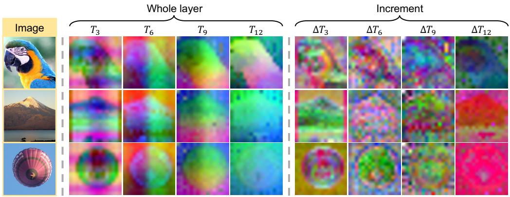  
Figure 5: Whole teacher layers are near-copies of one another; their increments are not. Top three principal components of each feature map as RGB, fitted jointly in a shared rank-128 basis. Left: the whole whitened layer separates object from background at every depth and changes mainly in hue. Right: the increments carry different content at each depth, from edges and texture at layer 3 to coarse, low-frequency regions at layer 12.

## B DIAGNOSTIC BRANCHES

The fourteen branches behind Table 1 and Figure 3 each fork the unaligned SiT-B/2 at 10K steps and train 50K further steps with one whitened target at one block. They align the increments of layers 6 and 9 at blocks 6 and 10, of layer 12 at blocks 2, 6 and 10, and of layer 3 at blocks 4, 6, 8 and 10. At layer 3 they also align the whole whitened layer, the inherited part $\widehat { T } _ { 3 }$ as a content control, and the increment through a 1 × 1 projector as a function-class control. Each branch is scored on the map of its own target form. Three branches duplicated with a second training seed under paired sampling differ by 0.022, 0.158 and 0.580 gFID, which sets the 1.5 gFID separation used throughout.

## C THE RECOVERABILITY GAP MAP AND ITS TWO AXES

Section 4.2 reads the map along two axes. Along the teacher axis the gap rises with depth; at block 6 the four-layer gaps of layers 3, 6, 9 and 12 are 0.52, 0.85, 0.94 and 0.95, against benefits of +3.4, +14.4, +22.7 and +21.3 gFID. Along the block axis the gap of layer 12 stays within 0.02, while aligning it at blocks 2, 6 and 10 gains 9.1, 21.3 and 10.9 gFID (Figure 6b), which is why Section 5 takes the insertion block from the baselines. Figure 6a shows the full twelve-layer map of the unaligned SiT-B/2 at 50K steps. This map defines each increment against the adjacent layer, so its cells are not compared with the four-layer map used for selection. Figure 6c repeats the correlations of Table 1 with their bootstrap intervals.

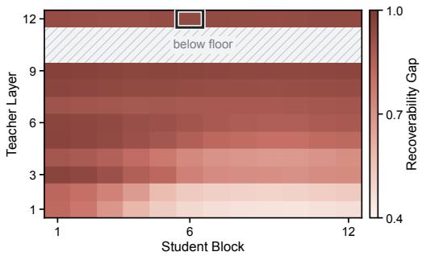  
(a)

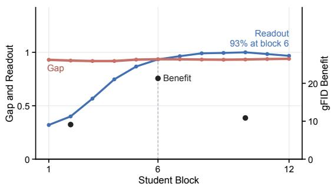  
(b)

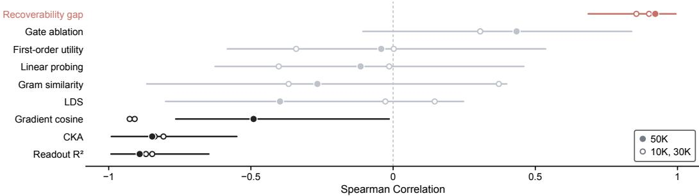  
(c)  
Figure 6: The recoverability gap map and its two axes. (a) Gap of the unaligned SiT-B/2 at 50K on all twelve teacher layers; hatched layers fall below the readout floor, and the box marks the cell the four-layer map selects. (b) Along the block axis, the gap of layer 12, the readout of the shallowest increment, and the benefit of aligning layer 12 at blocks 2, 6 and 10. (c) Spearman $\rho$ of the nine single criteria at 50K with bootstrap 95% intervals, and at 10K and 30K.

## D FIRST-ORDER UTILITY: DEFINITION, PROTOCOL AND CONTROLS

Section 4.2 tests a slope-based criterion, the first-order utility U, against the gap. This section defines U, describes its estimator and lists the four controls cited there.

Definition. Let $\mathcal { L } _ { \mathrm { a l i g n } } ( H ) = \| Q _ { i , j , t } ( H ) - \Delta T _ { i } \| _ { F } ^ { 2 }$ , let ˆd be $- \nabla _ { H } \mathcal { L } _ { \mathrm { a l i g n } }$ at $H _ { j , t }$ scaled to unit root mean square, and let ${ \dot { \mathcal { L } } } _ { \mathrm { f l o w } } ( H )$ be the flow loss when H replaces the hidden state at block $j$ of the

frozen student. The first-order utility

$$
U _ { i , j , t } = - \frac { \mathrm { R M S } ( H _ { j , t } ) } { \mathcal { L } _ { \mathrm { f l o w } } ( H _ { j , t } ) } \left. \frac { \mathrm { d } } { \mathrm { d } \epsilon } \mathcal { L } _ { \mathrm { f l o w } } \left( H _ { j , t } + \epsilon \hat { d } \right) \right. _ { \epsilon = 0 }\tag{10}
$$

is the relative loss reduction per unit relative step, the hidden-state analogue of the gradient angle of HASTE.

Protocol. U is estimated in fp32 by symmetric central differences, with two partial forward passes per cell and step size, so that the second-order term $- \textstyle { \frac { 1 } { 2 } } \epsilon \mathrm { R M S } ^ { 2 } \hat { d } ^ { \top } \nabla ^ { 2 } \mathcal { L } \hat { d } / \mathcal { L }$ of a one-sided difference does not enter; one-sided estimates turn whole regions with a weak first-order signal negative. The readout $Q$ is fitted on the fit split, and $\hat { d }$ and $U$ are evaluated on a disjoint evaluation split, so that readout overfitting cannot enter the intervention direction. Each cell uses at least four noise realizations over several batches. Only cells whose bootstrap sign is stable, with a 95% interval that excludes zero, are reported (59 of 60), and the conclusions hold for relative step sizes $\epsilon \in \lbrace 0 . 0 2 , 0 . 0 5 , 0 . 1 0 \rbrace$

Controls. (i) The realizability control takes one alignment gradient step on the last linear layer of block $j ,$ with every other parameter frozen, and measures the flow-loss change on the same batch by central differences in parameter space; it agrees with U in sign on 7 of 8 increment cells and on 8 of 8 whole-layer cells. (ii) The function-class control retrains the placement selected by $N \cdot [ U ] _ { + } ,$ layer 3 at block 4, with the projector reduced from the $3 \times 3$ convolution of iREPA to the $1 \times 1$ linear map of the readout, everything else unchanged; its benefit rises from $+ 3 . 7 8 \mathrm { t o } + 5 . 2 2 \mathrm { g F I D }$ , still 16 gFID below the gap’s choice. The perturbation controls, (iii) a norm-matched random direction and (iv) a batch-shuffled teacher target, both give $U \approx 0$

## PART II RARE

## E RARE IMPLEMENTATION DETAILS

The projector $P$ in Eq. 5 is the convolutional projector of iREPA, with $3 \times 3$ kernels and 2048 hidden channels, and adds 0.9M parameters that are discarded after training. The spatial normalization sn subtracts a fraction $\alpha = 0 . 6$ of the token mean and divides by the token standard deviation.

## PART III EXPERIMENTS

## F WHERE ALIGNMENT CLOSES THE GAP

Section 6.2 reports that alignment closes the gap mainly at the layer it targets: by 0.49 at layer 12, against at most 0.27 elsewhere on the map. Figure 7 shows the gap closed by the run that aligns the selected cell until 250K (Table 3, row 4), relative to the unaligned run.

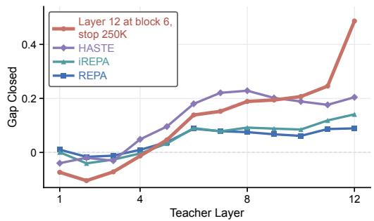  
(a)

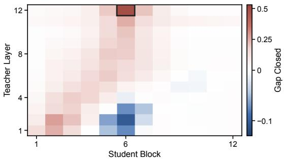  
(b)  
Figure 7: Alignment closes the gap where it is applied. Gap closed relative to the unaligned run at 200K steps. (a) Along the teacher layers at block 6, for the run that aligns layer 12 at block 6 and for REPA, iREPA and HASTE. (b) Over the whole map for the first run; the box marks the selected cell.

## G TRAINING AND SELECTION COST

Table 5 details the training cost that Section 6.4 summarizes for the runs of Table 2, and Figure 8 compares the cell the map selects with an exhaustive sweep that trains all twenty cells of the fourlayer map to 100K steps.

Table 5: Training and inference cost of the runs of Table 2. Every method discards its projector after training, so inference costs the same as for the unaligned model. Marks rank the aligned methods only.
<table><tr><td rowspan="3"></td><td>Unaligned</td><td colspan="4">Aligned</td></tr><tr><td>SiT</td><td>REPA</td><td>iREPA</td><td>HASTE</td><td>RARE</td></tr><tr><td>Parameters (M)↓</td><td>130.3</td><td>137.6</td><td>135.6</td><td>137.6</td><td>131.2</td></tr><tr><td>Peak Memory (GiB/GPU)↓</td><td>6.22</td><td>6.94</td><td>6.79</td><td>8.39</td><td>8.17</td></tr><tr><td>Step Time (s)↓</td><td>0.168</td><td>0.218</td><td>0.218</td><td>0.212</td><td>0.188</td></tr><tr><td>Training Cost (GPU-h to 400K)↓</td><td>148.9</td><td>193.5</td><td>193.6</td><td>188.0</td><td>167.1</td></tr><tr><td>Inference Overhead</td><td>0</td><td>0</td><td>0</td><td>0</td><td>0</td></tr></table>

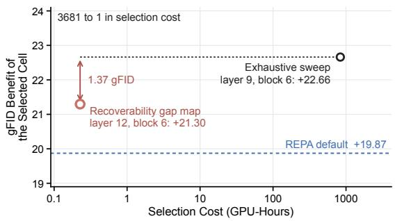  
Figure 8: The map’s cell comes within 1.37 gFID of the sweep’s best at a fraction of its cost. Realized gFID benefit of the cell each procedure picks against the GPU-hours spent picking it. Diagnosing once is 3681× cheaper than the sweep on selection alone, and 19.9× cheaper once the training of the selected cell is counted on both sides.

## H TRANSFER: FULL RESULTS AND INCREMENT TARGETS

Table 6 reports all metrics of the transfer study summarized in Table 4 (Section 6.3). Table 7 compares the whole whitened target with the increment target in every setting; the increment arm aligns the cell its own map selects, and the whole whitened layer has the lower FID everywhere.

Table 6: Transfer, all metrics. (a, b) are unguided; ∆FID is the improvement over the unaligned SiT of the same setting. RARE aligns layer 9 on Places365. The better of iREPA and RARE is in bold.
<table><tr><td>Setting</td><td>Method</td><td>FID↓ sFID↓</td><td>IS↑</td><td>Prec.↑</td><td>Rec.↑</td><td>CMMD↓</td><td>∆FID↑</td></tr><tr><td colspan="8">(a) Model Scale, DINOv2-B Teacher, 100K Steps</td></tr><tr><td>SiT-B/2</td><td>SiT</td><td>62.59</td><td>7.15</td><td>20.78</td><td>0.395</td><td>0.567</td><td>1.703</td><td></td></tr><tr><td></td><td>iREPA RARE</td><td>37.70 36.66</td><td>6.95 7.32</td><td>40.19 40.04</td><td>0.514 0.531</td><td>0.618 0.616</td><td>1.408 1.359</td><td>24.89 25.93</td></tr><tr><td>SiT-L/2</td><td>SiT</td><td>47.19</td><td>6.30</td><td>27.65</td><td>0.482</td><td>0.586</td><td>1.355</td><td></td></tr><tr><td></td><td>iREPA</td><td>19.94</td><td>5.71</td><td>67.80</td><td>0.630</td><td>0.612</td><td>0.933</td><td>27.25</td></tr><tr><td></td><td>RARE</td><td>18.93</td><td>5.58</td><td>68.17</td><td>0.644</td><td>0.624</td><td>0.881</td><td>28.26</td></tr><tr><td>SiT-XL/2</td><td>SiT</td><td>42.45</td><td>6.44</td><td>30.63</td><td>0.512</td><td>0.589</td><td></td><td></td></tr><tr><td></td><td>iREPA</td><td></td><td>5.76</td><td>77.95</td><td>0.662</td><td></td><td>1.257</td><td></td></tr><tr><td></td><td>RARE</td><td>16.52 16.07</td><td>5.55</td><td>76.79</td><td>0.663</td><td>0.606 0.617</td><td>0.837 0.804</td><td>25.93 26.38</td></tr><tr><td colspan="8">(b) Teacher, SiT-B/2, 100K Steps</td><td></td></tr><tr><td>None</td><td>SiT</td><td>62.59</td><td>7.15</td><td>20.78</td><td>0.395</td><td>0.567</td><td>1.703</td><td></td></tr><tr><td>MAE-B/16</td><td>iREPA</td><td>49.95</td><td>6.70</td><td>26.93</td><td>0.463</td><td>0.586</td><td>1.496</td><td>12.64</td></tr><tr><td></td><td>RARE</td><td>43.81</td><td>7.21</td><td>30.85</td><td>0.495</td><td>0.594</td><td>1.401</td><td>18.78</td></tr><tr><td>SigLIP-B/16</td><td>iREPA</td><td>40.60</td><td>7.02</td><td>36.50</td><td>0.496</td><td>0.619</td><td>1.445</td><td>21.99</td></tr><tr><td></td><td>RARE</td><td>39.86</td><td>8.03</td><td>37.91</td><td>0.505</td><td>0.605</td><td>1.476</td><td>22.73</td></tr><tr><td colspan="9"></td></tr><tr><td>Method FID↓</td><td colspan="6">Without Guidance</td><td>With Guidance</td><td></td><td></td></tr><tr><td></td><td colspan="6"> $\overline { { { \bf K I D } \times 1 0 ^ { 3 } \downarrow } }$  Prec.↑ Rec.↑</td><td> $\overline { { { \bf K I D } \times 1 0 ^ { 3 } \downarrow } }$  Prec.↑</td><td>Rec.↑</td></tr><tr><td></td><td colspan="6">(c) Image Domain, Places365-Standard, SiT-B/2, 400K Steps</td><td></td><td></td></tr><tr><td>SiT</td><td>11.40  $7 . 8 9 \pm 0 . 9 1$ </td><td></td><td>0.565</td><td>0.535</td><td>6.79</td><td> $3 . 0 6 \pm 0 . 4 6$ </td><td>0.626</td><td>0.524</td></tr><tr><td>iREPA</td><td>7.71</td><td> $4 . 5 0 \pm 0 . 6 4$ </td><td>0.608</td><td>0.565</td><td>4.98</td><td> $1 . 8 3 \pm 0 . 3 1$ </td><td>0.652</td><td>0.556</td></tr><tr><td>RARE</td><td>7.33  $\mathbf { 4 . 3 8 \pm 0 . 6 3 }$ </td><td></td><td>0.606</td><td>0.563</td><td>4.54</td><td> ${ \bf 1 . 5 1 \pm 0 . 2 7 }$ </td><td>0.666</td><td>0.547</td></tr></table>

Table 7: Whitened layer against increment target. FID-50K without guidance, 100K steps on ImageNet and 400K on Places365. Each increment arm uses the cell its own map selects, with the same projector and loss weight. The better target is in bold.
<table><tr><td rowspan="2">Setting</td><td colspan="3">Whitened Layer</td><td colspan="3">Increment</td></tr><tr><td>Layer</td><td>Block</td><td>FID↓</td><td>Layer</td><td>Block</td><td>FID↓</td></tr><tr><td>SiT-B/2, ImageNet</td><td>Layer 12</td><td>4</td><td>36.66</td><td>Layer 12</td><td>6</td><td>39.21</td></tr><tr><td>SiT-L/2, ImageNet</td><td>Layer 12</td><td>8</td><td>18.93</td><td>Layer 9</td><td>4</td><td>24.26</td></tr><tr><td>SiT-XL/2, ImageNet</td><td>Layer 12</td><td>8</td><td>16.07</td><td>Layer 9</td><td>5</td><td>20.15</td></tr><tr><td>SiT-B/2, Places365</td><td>Layer 9</td><td>4</td><td>7.33</td><td>Layer 9</td><td>2</td><td>9.19</td></tr></table>

## I OTHER BACKBONES

The two backbones of Section 6.3 each change one part of the setup: DiT the generative objective and its sampler, MM-DiT the conditioning architecture.

DiT. DiT (Peebles & Xie, 2023) replaces flow matching with ϵ-prediction and an ADM linear-beta DDPM sampler. Every aligned method keeps its published target and depth; only the generative objective and the sampler change. All aligned methods improve on the unaligned DiT, in the same order as in Table 2, and RARE has the lowest FID with and without guidance (Table 8).

MM-DiT. MM-DiT keeps one set of weights per modality and joins them with a single attention softmax (Esser et al., 2024). We instantiate it at the shape of DiT-B/2, with twelve blocks, 768 channels, twelve heads and patch size 2; the class embedding enters twice, pooled into the adaLN vector and expanded into four learned context tokens that share attention with the 256 image tokens. Duplicating the transformer per modality makes the backbone larger than DiT-B/2, 250.4M against 130.5M parameters, so we do not compare absolute FID across tables. The generative objective stays the flow matching of Table 2, so this comparison isolates the conditioning architecture, and alignment reads only the image tokens (Table 9).

Table 8: DiT-B/2 with ϵ-prediction and a 250-step DDPM sampler, 400K steps. Notation as in Table 2.
<table><tr><td rowspan="2">Method</td><td colspan="2">Alignment</td><td rowspan="2">FID↓</td><td rowspan="2">sFID↓</td><td rowspan="2">IS↑</td><td rowspan="2">Prec.↑</td><td rowspan="2">Rec.↑</td><td rowspan="2">CMMD↓</td></tr><tr><td>Target</td><td>Block</td></tr><tr><td colspan="8">Without Guidance</td></tr><tr><td>DiT</td><td>一</td><td>一</td><td>40.50</td><td>6.26</td><td>35.05</td><td>0.502</td><td>0.631</td><td>1.341</td></tr><tr><td>REPA</td><td>L12</td><td>4</td><td>30.05</td><td>6.35</td><td>49.86</td><td>0.556</td><td>0.650</td><td>1.203</td></tr><tr><td>iREPA</td><td>L12</td><td>4</td><td>24.16</td><td>6.36</td><td>63.68</td><td>0.586</td><td>0.643</td><td></td></tr><tr><td>HASTE</td><td>L12 + attn.</td><td>8</td><td>21.76</td><td>6.26</td><td>65.55</td><td>0.612</td><td>0.629</td><td>1.030</td></tr><tr><td>sREPA</td><td>L12 + Gram</td><td>4</td><td>27.61</td><td>6.27</td><td>54.90</td><td>0.568</td><td>0.651</td><td>1.167</td></tr><tr><td>RARE (Ours)</td><td>L12, whitened</td><td>4</td><td>20.54</td><td>6.00</td><td>68.14</td><td>0.619</td><td>0.631</td><td>0.995</td></tr><tr><td>With Guidance (scale 1.65 on [0, 0.72])</td><td></td><td></td><td></td><td></td><td></td><td></td><td></td><td></td></tr><tr><td colspan="8"></td></tr><tr><td>DiT</td><td></td><td></td><td>13.23</td><td>5.04</td><td>101.05</td><td>0.736</td><td>0.495</td><td>0.910</td></tr><tr><td>REPA</td><td>L12</td><td>4</td><td>7.45</td><td>5.14</td><td>153.65</td><td>0.773</td><td>0.505</td><td>0.817</td></tr><tr><td>iREPA</td><td>L12</td><td>4</td><td>5.06</td><td>5.24</td><td>195.60</td><td>0.806</td><td>0.500</td><td>0.769</td></tr><tr><td>HASTE</td><td>L12 + attn.</td><td>8</td><td>4.90</td><td>5.16</td><td>197.91</td><td>0.833</td><td>0.470</td><td>0.680</td></tr><tr><td>sREPA</td><td>L12 + Gram</td><td>4</td><td>6.22</td><td>5.19</td><td>170.43</td><td>0.790</td><td>0.506</td><td>0.785</td></tr><tr><td>RARE (Ours)</td><td>L12, whitened</td><td>4</td><td>4.67</td><td>5.02</td><td>205.32</td><td>0.847</td><td>0.465</td><td>0.641</td></tr></table>

Table 9: MM-DiT-B/2 with flow matching, 100K steps. Notation as in Table 2. A tie for best leaves no second best.
<table><tr><td rowspan="2">Method</td><td colspan="2">Alignment</td><td rowspan="2">FID↓</td><td rowspan="2">sFID↓</td><td rowspan="2">IS↑</td><td rowspan="2">Prec.↑</td><td rowspan="2">Rec.↑</td><td rowspan="2">CMMD↓</td></tr><tr><td>Target</td><td>Block</td></tr><tr><td colspan="8">Without Guidance</td></tr><tr><td>MM-DiT</td><td></td><td></td><td>56.19</td><td>7.45</td><td>25.88</td><td>0.419</td><td>0.593</td><td>1.688</td></tr><tr><td>REPA</td><td>L12</td><td>4</td><td>42.79</td><td>7.04</td><td>35.11</td><td>0.481</td><td>0.620</td><td>1.467</td></tr><tr><td>iREPA</td><td>L12</td><td>4</td><td>35.34</td><td>6.79</td><td>44.17</td><td>0.518</td><td>0.630</td><td>1.378</td></tr><tr><td>HASTE</td><td>L12 + attn.</td><td>8</td><td>34.28</td><td>7.38</td><td>45.10</td><td>0.537</td><td>0.628</td><td>1.332</td></tr><tr><td>RARE (Ours)</td><td>L12, whitened</td><td>4</td><td>32.98</td><td>7.07</td><td>47.48</td><td>0.537</td><td>0.615</td><td>1.313</td></tr><tr><td colspan="8">With Guidance (scale 1.65 on [0, 0.72])</td></tr><tr><td>MM-DiT</td><td></td><td></td><td>33.34</td><td>6.27</td><td>48.45</td><td>0.534</td><td>0.559</td><td>1.440</td></tr><tr><td>REPA</td><td>L12</td><td>4</td><td>22.48</td><td>5.94</td><td>71.79</td><td>0.605</td><td>0.583</td><td>1.234</td></tr><tr><td>iREPA</td><td>L12</td><td>4</td><td>15.59</td><td>5.72</td><td>97.31</td><td>0.650</td><td>0.577</td><td>1.136</td></tr><tr><td>HASTE</td><td>L12 + attn.</td><td>8</td><td>16.54</td><td>6.31</td><td>96.38</td><td>0.644</td><td>0.588</td><td>1.127</td></tr><tr><td>RARE (Ours)</td><td>L12, whitened</td><td>4</td><td>13.76</td><td>6.01</td><td>105.83</td><td>0.679</td><td>0.562</td><td>1.071</td></tr></table>

## J QUALITATIVE RESULTS

The samples below accompany Sections 6.2 and 6.3. Figure 9 compares the four methods at 400K steps, Figure 10 follows REPA and RARE over training, Figure 11 shows Places365 samples, and Figure 12 follows one column through the sampler.

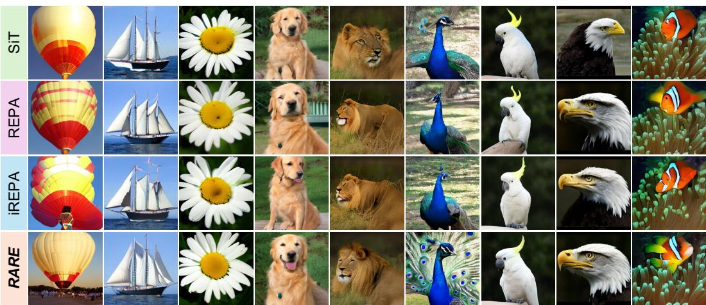  
Figure 9: ImageNet-256 samples at 400K steps. Each column shares one class, initial noise and sampler noise across the rows, so differences within a column come from the model; guidance 4.0.

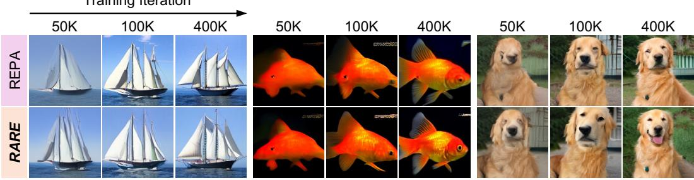  
Figure 10: REPA and RARE over training. Three classes at 50K, 100K and 400K steps; guidance 4.0.

  
Figure 11: Places365-Standard at 400K steps. SiT, iREPA and RARE on shared columns; guidance 4.0.

Denoising process  
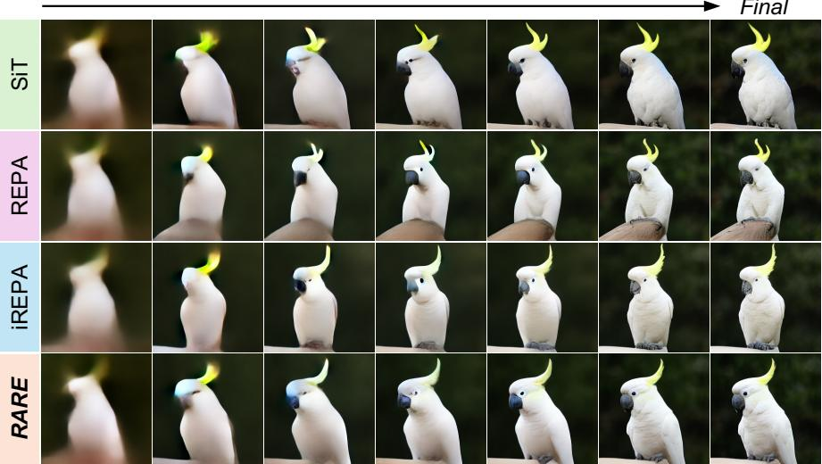  
Figure 12: One column through the sampler. Decoded prediction of the clean latent at seven points of the 250-step SDE; guidance 4.0. The rows share the noise and the first snapshot and separate at the second, where the three aligned rows already resolve the eye and the beak.