# WHEN DOES AN IMAGE DETERMINE THE ANSWER? BENCHMARKING VISUAL ANSWERABILITY ACROSS CHARTS AND SCENES

Sungguk Cha, Mintae Kim, Youngsub Han, Byoung-Ki Jeon, Sangyeob Lee LG Uplus, Seoul, South Korea

{sungguk,iammt,yshan042,bkjeon,sangyeob}@lguplus.co.kr

## ABSTRACT

Reliable visual question answering requires correct answers when evidence is sufficient and abstention when it is not. We introduce a benchmark that connects complete-question evaluation with explicit evidence for its labels across PlotQA charts, CLEVR rendered scenes, and GQA photographs. Each question groups original and edited images, presented independently; success requires every supported answer and every required abstention to be correct. For chart missing-information labels, executable witnesses establish that admissible complete charts give different answers but identical pixels after masking. Scene labels follow source programs and edits, with a residual-cue analysis for photographs. Across 72,000 responses from six model configurations, the highest observed complete task success rates are 57.0%, 43.5%, and 33.7%, respectively. On charts, the strongest configuration achieves 96.2% per-view decision accuracy, yet 265 of its 835 groups with every decision correct still contain incorrect answers. Evaluating supported answers and necessary abstentions together exposes failures that answerability decisions alone conceal.

## 1 INTRODUCTION

A visual assistant must respond correctly as the evidence for a question changes. An irrelevant edit should preserve its answer, a relevant edit may require a different answer, and removing essential evidence should require abstention. Refusing every edited input fails the first two obligations; always answering fails the third. Evaluating these obligations together tests whether the response tracks the available evidence.

Prior benchmarks establish important parts of this evaluation. CertainlyUncertain and MM-AQA test answering and abstention under evidence removal (Chandu et al., 2025; Madhusudhan et al., 2026). Causal VQA tests answer-preserving and answer-changing edits, while HallusionBench measures correctness across related visual contexts (Agarwal et al., 2020; Guan et al., 2024). We build on these principles to ask a common question across charts and scenes: for how many questions does a model answer every supported version correctly and abstain on every unsupported version? Per-view averages can conceal failures to meet these obligations together. Labels also require justification: hiding an object may leave cues to its answer.

We construct 3,000 question groups spanning PlotQA charts, CLEVR rendered scenes, and GQA photographs (Methani et al., 2020; Johnson et al., 2017a; Hudson & Manning, 2019). PlotQA varies numerical values, visibility, and valid references. CLEVR combines answer-preserving and answer-changing object-attribute edits with occlusions. GQA pairs masks on and outside program dependencies to test selective abstention; its groups contain answer-preserving controls and missing information targets, without an answer-changing state. Each of the 12,000 views is presented independently; a group succeeds only if every answer and abstention is correct (Table 1).

Our central contribution connects these question-level response obligations to the evidence that justifies them. Chart missing-information labels have executable witnesses: admissible complete charts with different answers but identical observed pixels. Scene labels follow native programs and designated edits; the GQA audit examines residual location cues after masking (Table 2).

Table 1: Components of controlled answering and abstention. $\checkmark \colon$ included in the evaluated protocol; ×: not included under the definitions below. Our cohorts combine supported controls and abstention targets with complete-question scoring.
<table><tr><td rowspan="2">Benchmark / cohort</td><td colspan="2">Supported edits</td><td>Unsupported</td><td>Evaluation</td></tr><tr><td>Answer preserved</td><td>Answer changed</td><td>Abstention target</td><td>Joint success</td></tr><tr><td>Causal VQA (2020)</td><td>√</td><td>√</td><td>×</td><td>X</td></tr><tr><td>CertainlyUncertain (2025)</td><td> $\times ^ { * }$ </td><td>×</td><td>√</td><td>X</td></tr><tr><td>MM-AQA (2026)</td><td>X</td><td>X</td><td>√</td><td>X</td></tr><tr><td>VISREAS (2024)</td><td>X</td><td>X</td><td> $\checkmark$ </td><td>X</td></tr><tr><td>HallusionBench (2024)</td><td>√</td><td>√</td><td> $\times ^ { \dagger }$ </td><td>√</td></tr><tr><td>Ours: PlotQA</td><td>√</td><td>√</td><td>√</td><td>√</td></tr><tr><td>Ours: CLEVR</td><td>√</td><td>√</td><td>√</td><td>√</td></tr><tr><td>Ours: GQA</td><td>√</td><td>X</td><td>√</td><td>√</td></tr></table>

Supported edits keep the question fixed; an abstention target requires an uncertainty response. Joint success requires every member of a related group to be correct, beyond marginal accuracy or prediction consistency. ∗CertainlyUncertain explored answer-preserving random edits but omitted them from its final protocol. †HallusionBench accepts uncertainty without images in its Visual Supplement category but also credits correct answers. Marks concern protocol coverage; Table 2 states our label evidence.

## Contributions.

1. Controlled benchmark construction across three visual domains. We build 1,000 groups per source using PlotQA value edits, CLEVR attribute edits and occlusion, and GQA dependency/nondependency masks. Together, these test answering and abstention as evidence changes (Section 3.1).

2. Complete-question evaluation with explicit label evidence. A common protocol requires every supported answer and every required abstention, distinguishing decision success from task success. We pair it with 1,000 checked chart ambiguity witnesses, program-derived scene targets, and a photographic residual-cue audit (Sections 3.3–4; Section 6.2).

3. An empirical diagnosis across charts and scenes. Six configurations produce 72,000 responses; the highest observed complete-group success is 57.0% on PlotQA, 43.5% on CLEVR, and 33.7% on GQA. State-level errors distinguish unnecessary refusal from missing-state acceptance, while decision/answer and per-view/group comparisons expose different failure patterns (Sections 5–6.3).

## 2 RELATED WORK

Visual questions and benchmark coverage. VQA and VQA v2 establish answering from photographs (Agrawal et al., 2015; Goyal et al., 2016); FigureQA, DVQA, and ChartQA extend evaluation to plots (Kahou et al., 2017; Kafle et al., 2018; Masry et al., 2022). We evaluate each question across changes in evidence, making the question group the unit of complete task success.

Abstention and evidence sufficiency. Selective prediction trades coverage for error risk (Geifman & El-Yaniv, 2017; 2019; Whitehead et al., 2022). Input sufficiency is a separate property, studied in SQuAD 2.0 and text-abstention benchmarks (Rajpurkar et al., 2018; Kirichenko et al., 2025; Wagner, 2026). VizWiz, UNK-VQA, and MoHoBench supply visual unanswerability tests (Gurari et al., 2018; Guo et al., 2024; Zhu et al., 2026); CertainlyUncertain and MM-AQA validate evidence-removal cases (Chandu et al., 2025; Madhusudhan et al., 2026). Pairing abstention targets with supported edits tests whether models satisfy both obligations on the same question.

Controlled changes and joint success. Causal VQA tests answer invariance and change; VQA-Rephrasings tests linguistic consistency (Agarwal et al., 2020; Shah et al., 2019). HallusionBench scores visual contexts jointly; DynaMath generates problem variants; MuirBench pairs answerable and unanswerable multi-image questions (Guan et al., 2024; Zou et al., 2025; Wang et al., 2025). We combine these established principles across three domains, requiring all supported answers and abstentions within a question.

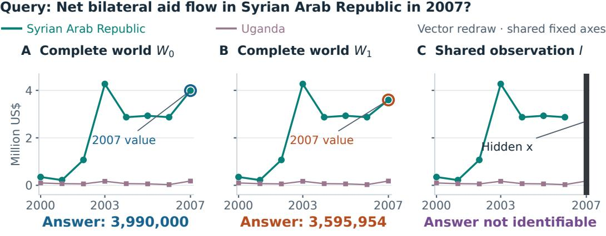  
Same visibility map: $O ( W _ { 0 } ) = O ( W _ { 1 } ) = I$  
Figure 1: An executable reason to abstain. Two admissible complete charts answer the same question differently, but the fixed visibility operation produces identical observed pixels. The model receives the observation and question. The diagram redraws an archived proof for readability; verification uses the original renderer’s decoded RGBA output.

Structured reasoning and label evidence. VISREAS generates valid/invalid scene queries; Super-CLEVR and CLOSURE diagnose domain and compositional generalization (Akter et al., 2024; Li et al., 2023c; Bahdanau et al., 2019). Our scene questions remain fixed while evidence changes. Chart witnesses specialize possible-world semantics to rendered observations (Imielinski & Lipski,´ 1984; Console et al., 2022), making answer disagreement and observation equality explicit premises of abstention. Appendix H relates these choices to broader evaluation designs.

## 3 BENCHMARK CONSTRUCTION AND LABEL EVIDENCE

Each source supplies supported edits and evidence removal for a fixed question. A supported view is labelled answerable by its construction; a negative label requires abstention.

## 3.1 RESPONSE OBLIGATIONS ACROSS THREE SOURCES

Each group keeps the question fixed and varies the image. FULL (F) is the original; A\_SAME (S) preserves its answer; A\_CHANGED (C) changes the answer; U\_MISSING (M) is labelled as lacking identifying evidence; and U\_INVALID (I) removes the queried series, leaving no valid referent. Charts use all five states, CLEVR uses F, S, C, M, and GQA uses F, S, M. The task requires answers on F, S, C and abstention on M, I. The model sees one view at a time, without its state or other group members.

The chart core uses PlotQA’s direct-lookup template, D15: select a labelled series at one x position and return its value. The original and answer-changing worlds supply complete candidates for M. For F, S, C, construction checks defined execution, visibility of the required evidence, and rendered number labels. For I, it checks that the queried series is absent. Only chart M states satisfying Equation 2 are called certified missing information. Figure 1 illustrates the chart construction.

CLEVR programs identify answer-preserving and answer-changing attribute edits; occlusion withholds a required attribute. Its 1,000 groups contain 408 short-text, 327 Boolean, and 265 integer answers. Official scene assets support controlled tests of compositional object reasoning and abstention.

## A CLEVR: follow the evidence that determines the count

Q: What number of other objects are there of the same color as the small metallic thing?

F Original

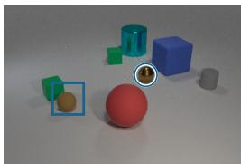

S Answer preserved

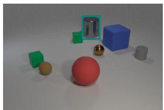  
One other yellow object

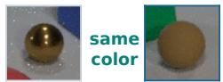  
Target: 1  
Unrelated color changes

C Answer changed

M Evidence hidden

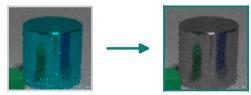  
Target: 1

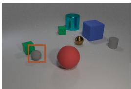

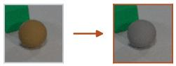  
Matching color removed  
Target: 0

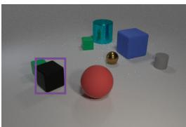

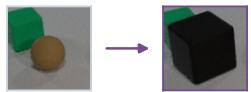  
Matching color hidden  
Target: unanswerable

B GQA: a mask can retain the location asked about Q: Is the racket in the bottom or in the top part?

F Original

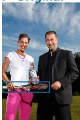  
S Control

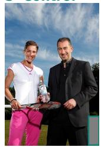  
bottom  
M Missing

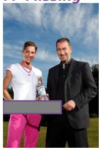  
Racket region: original → missing

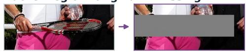  
Mask position retains spatial  
information relevant to the question.  
Targets follow source programs and masks.  
bottom  
unanswerable

Figure 2: Keep the question fixed; change the evidence and required response. CLEVR illustrates the original, answer-preserving, answer-changing, and missing-evidence views. GQA contrasts masks outside and on program dependencies, including a residual location cue. Every view is presented independently; group success requires all supported answers and all required abstentions. Scene targets follow source programs and edits. Outlines and crops explain saved inputs; examples are selected independently of outcomes.

GQA programs check source answers and identify dependencies. Masks cover nondependency boxes for S and dependency boxes for M, with heuristic size, aspect-ratio, and position matching. The 1,000 groups contain 709 short-text and 291 Boolean questions, testing continued answering and abstention under source-derived labels. Section 6.2 examines residual visual cues. Figure 2 show the CLEVR and GQA controls.

Table 2: Evaluation cohorts and label evidence. Each source contributes 1,000 question groups. Chart missing-information labels have complete-world pixel witnesses; scene labels use source programs and interventions.
<table><tr><td>Source</td><td>Evaluated states</td><td>Evidence and coverage</td></tr><tr><td>PlotQA</td><td>5,000 views; F, S, C, M, I</td><td>Depth-one numerical lookup. M: admissible complete witnesses with identical pixels. F, S, C: execution and evidence visibility. I: selector precondition.</td></tr><tr><td>CLEVR</td><td>4,000 views; F, S, C, M</td><td>Native programs with 3–23 recorded steps; object-attribute interventions and official Blender images. Source-derived answerability labels.</td></tr><tr><td>GQA</td><td>3,000 views; F, S, M</td><td>Scene-graph programs with 2–4 recorded steps; dependency/nondependency box masks. Source-derived labels with residual-cue analysis.</td></tr></table>

Grouped scoring tests complementary obligations: $S$ requires continued answering, $C$ requires answer revision, and negative states require abstention. Charts provide executable evidence for missing-information labels; scenes extend behavioral coverage under source-derived labels.

## 3.2 FROM COMPATIBLE WORLDS TO A NEGATIVE LABEL

Figure 1 illustrates the defining ambiguity: different complete charts produce the same observation. Formally, let $q$ be the question and $P _ { q }$ its answer program. A complete world $W$ supplies all chart values; $\mathcal { W } _ { c }$ is the permitted class under configuration $c ,$ which fixes the axes and renderer. The observation operator ${ \cal O } _ { c , M } ( W ) = R _ { c } ( M ( W ) )$ applies visibility operation M and renderer $R _ { c }$ . The answers compatible with image I are

$$
\begin{array} { r } { \mathcal { A } ( I ; q , c , M ) = \{ P _ { q } ( W ) : W \in \mathcal { W } _ { c } , O _ { c , M } ( W ) = I , P _ { q } ( W ) \mathrm { ~ i s ~ d e f i n e d } \} . } \end{array}\tag{1}
$$

An image lacks identifying information when this set contains at least two answers. The sampled source answer then represents only one compatible completion. Invalid references provide a separate abstention target (Section 3.1).

A sufficient witness. For each missing-information chart, we construct

$$
W _ { 0 } , W _ { 1 } \in \mathcal { W } _ { c } , \qquad P _ { q } ( W _ { 0 } ) \not = P _ { q } ( W _ { 1 } ) , \qquad O _ { c , M } ( W _ { 0 } ) = O _ { c , M } ( W _ { 1 } ) = I .\tag{2}
$$

Both answers belong to ${ \mathcal { A } } ,$ so $| { \mathcal { A } } | \geq 2 !$ the same image and question are compatible with different correct answers. A pair establishes ambiguity. Establishing uniqueness requires agreement across all compatible completions; a failed witness search alone does not establish it.

Making the premises executable. The checker validates complete-world admissibility and renderability, agreement between two lookup executors, different answers across worlds, and pixel equality of both intervened images with the saved observation. Chart values are finite rationals within a fixed axis interval. The axes are exogenous metadata, so a change to a hidden value leaves the visible scale fixed. The visibility operation hides the queried x location across the data region, including incident line segments; its position is independent of the hidden y value.

Admissibility excludes out-of-axis hidden values; answer comparison checks disagreement on the requested quantity; pixel comparison checks that the observation cannot distinguish the completions. The guarantee assumes that $P _ { q }$ correctly represents the question and that the declared worlds, visibility operation, and renderer capture the intended task.

## 3.3 AUDITING THE WITNESS CONDITIONS

Answer variation. We first isolate answer variation in 1,024 synthetic four-cell cases from eight program families. These cases test label-construction rules, separately from the model benchmark. Exhaustive enumeration identifies 414 cases with one answer across all completions and 610 with multiple answers. Declaring a question unanswerable whenever its calculation uses a hidden value wrongly rejects 132 constant-answer cases (31.9%): for example, $x - x = 0$ for every hidden x. Comparing only assignments with all hidden values at their minimum or all at their maximum misses 90 ambiguous cases (14.8%). For $x , y \in [ 0 , 9 ] , x - y = 0$ at both (0, 0) and (9, 9), but $x - y = - 9$ at (0, 9).

The constructor verifies witnesses for all 610 ambiguous cases. Another 432 recursive-program cases bring the total to 1,456. Enumeration and the Z3 constraint solver agree on all 822 ambiguous and 634 constant cases (de Moura & Bjørner, 2008). This audit validates answer variation under finite completion semantics; the chart audit below additionally checks admissible worlds and rendered observations.

World admissibility and observation equality. Masking can hide inadmissible values, so observation equality must be checked alongside world admissibility. Initial chart certificates supply 2,000 alternative hidden values across 1,000 groups. Observation-level checks pass all 5,000 views and detect 100 designed faults, yet complete-world checks find 785 out-of-axis values in 503 groups. Witness pairs drawn from the existing F and C worlds satisfy both conditions for all 1,000 groups.

These pairs preserve all evaluated images, labels, and model scores. Each witness is matched to its evaluated question group, covering all 5,000 chart views. Every chart missing-state result below therefore has a checked witness (Appendix D).

## 4 EVALUATION PROTOCOL

Inputs and configurations. Six configurations (Table 4) each receive 12,000 views, yielding 72,000 responses. Each call contains one image and question, with targets, programs, certificates, and state identifiers withheld. The prompt distinguishes difficult reading from insufficient evidence; Appendix A gives its exact text, model identifiers, and inference settings.

We use the primary PlotQA and validation CLEVR/GQA splits (Table 2). The chart split separates source images and groups, holds out a rendering family, and excludes 46,000 training views.

Response format. Illustrative responses for Figure 1 (the required reason is not scored):

{"answerable": true, {"answerable": false,   
"answer": "3990000", "answer": null,   
"reason": "The value is shown."} "reason": "The value is hidden."}

Complete task success. Following HallusionBench’s joint-success principle (Guan et al., 2024), $J _ { k }$ requires every supported answer and required abstention in a group to be correct. For source d, let G be the group count, $\textstyle { \mathcal { S } } _ { d }$ the k states, and $\mathbf { \mathcal { A } } _ { d }$ the supported states. Define $f _ { g s } = 1$ for a wrong decision or invalid response and $c _ { g s } = 1$ for a correct supported answer; both are zero otherwise. Then

$$
J _ { k } = \frac { 1 } { G } \sum _ { g } \left[ \prod _ { s \in S _ { d } } ( 1 - f _ { g s } ) \right] \left[ \prod _ { s \in \mathcal { A } _ { d } } c _ { g s } \right] .\tag{3}
$$

Chart answers use exact rational equality after numeric parsing; scene answers use rational equality or normalized exact-string matching (Appendix B).

Decision diagnostics. Complete-group decision success $B _ { k }$ isolates whether the model answers and abstains in the required states; per-view failure E counts individual decision errors:

$$
B _ { k } = \frac { 1 } { G } \sum _ { g } \prod _ { s \in S _ { d } } ( 1 - f _ { g s } ) , \qquad E = \frac { 1 } { G k } \sum _ { g , s } f _ { g s } .\tag{4}
$$

Thus $J _ { k } \le B _ { k }$ , and $B _ { k } - J _ { k }$ is the fraction of groups with correct decisions but incorrect supported answers. State-specific failures $E _ { A } , E _ { M }$ , and $E _ { I }$ separate supported rejection, missing-information acceptance, and invalid-reference acceptance. With $E _ { U }$ pooling negative states, ${ E _ { \mathrm { b a l } } } = \stackrel { \sim } { ( } { E _ { A } } + E _ { U } ) / 2$ gives both classes equal weight. Always-answerable and always-unanswerable policies have $E _ { \mathrm { b a l } } =$ 50% and $B _ { k } = J _ { k } = 0$

Denominators and uncertainty. The 72,000 responses comprise 71,989 valid outputs and 11 invalid outputs, which count as failures in all full-denominator scores. Descriptive 95% percentile intervals use 10,000 bootstrap draws of 1,000 groups per source (Efron, 1979). All views of a question remain together; paired comparisons use the same draws. Appendix B gives counts and unadjusted intervals. Group partitions, class balancing, common-state comparisons, and paired diagnostics are post-hoc analyses.

## 5 MODEL BEHAVIOR ON VERIFIED CHART QUESTIONS

## 5.1 ACCEPTING INPUTS WITH CERTIFIED MISSING EVIDENCE

Table 3 reports decisions and answers on the same 1,000 chart groups covered by the witness checks. Qwen 3.8 Flash Next has the lowest observed per-view decision failure, 190/5,000 (3.80%), yet accepts 113/1,000 certified missing-information inputs. All 113 responses validly declare the input answerable despite admissible complete charts yielding different answers and exactly the observed pixels: the evidence cannot determine one answer within the chart class.

Table 3: Complete chart task success and decision diagnostics (%). $J _ { 5 }$ requires all supported answers and abstentions; $B _ { 5 }$ checks decisions alone. All configurations use the same 1,000 groups. $E _ { A }$ has 3,000 views; $E _ { M }$ and $E _ { I }$ each have 1,000. Invalid outputs count as failures.
<table><tr><td>Configuration</td><td> ${ { J } _ { 5 } } \uparrow$ </td><td>B5↑</td><td> $E _ { A }$  ↓</td><td> $E _ { M }$  →</td><td> $E _ { I } \downarrow$ </td></tr><tr><td>Qwen 3.8 Flash Next</td><td>57.00</td><td>83.50</td><td>1.63</td><td>11.30</td><td>2.80</td></tr><tr><td>Gemma 431B</td><td>55.60</td><td>66.70</td><td>1.77</td><td>28.50</td><td>4.20</td></tr><tr><td>Qwen 3.8 27B</td><td>34.10</td><td>66.50</td><td>3.70</td><td>23.90</td><td>5.00</td></tr><tr><td>Gemma 4 26B A4B</td><td>40.70</td><td>53.90</td><td>2.27</td><td>42.70</td><td>3.20</td></tr><tr><td>GLM 5.3 Flash</td><td>18.20</td><td>27.30</td><td>0.50</td><td>61.20</td><td>27.20</td></tr><tr><td>Molmo2-8B</td><td>6.10</td><td>19.40</td><td>0.03</td><td>53.80</td><td>56.40</td></tr></table>

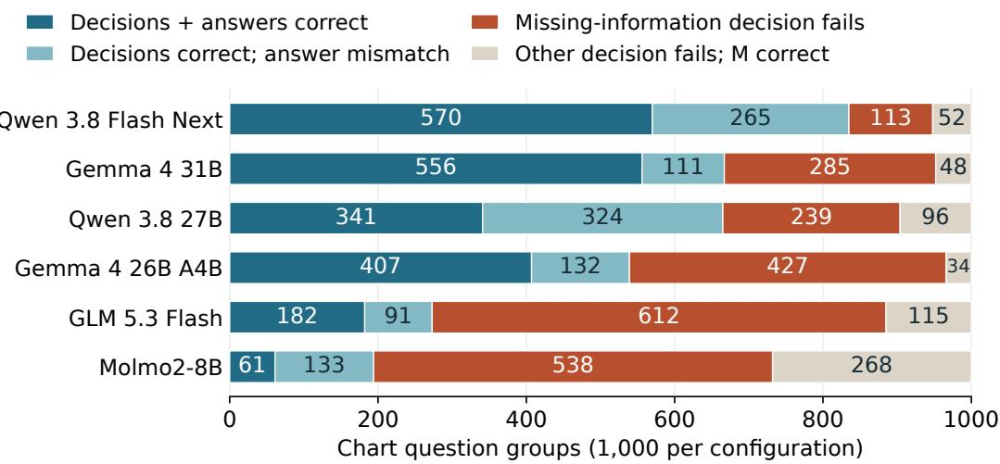  
Figure 3: Which obligation fails on each question? Each bar partitions 1,000 chart groups. The two left categories make every decision correctly; joint success additionally requires all supported answers. An M failure takes precedence when several decisions fail, and the final category has a correct M decision. Invalid outputs follow the same scoring rules.

Across configurations, false acceptance of certified missing inputs ranges from 11.3% to 61.2%. GLM 5.3 Flash rejects only 15/3,000 supported views, compared with Qwen 3.8 Flash Next’s 49/3,000, but accepts 612/1,000 missing views. Molmo2-8B has no valid false rejection on supported states, yet has 536 valid false acceptances and two invalid outputs in M. High willingness to answer supported inputs thus coexists with substantial acceptance of insufficient evidence.

Missing information and invalid references elicit sharply different behavior. Gemma 4 26B A4B fails on 427 missing-information inputs but only 32 invalid-reference inputs. Recognizing a failed reference therefore leaves most of its missing-evidence errors unresolved. Reporting $E _ { M }$ and $E _ { I }$ separately reveals this difference; pooling them into one negative-class score obscures the response obligation responsible for the failures.

## 5.2 FROM CORRECT DECISIONS TO CORRECT ANSWERS

Qwen 3.8 Flash Next’s 113 groups with an M failure and 52 with other decision failures leave 835 groups with every decision correct. Of those, 265 contain at least one incorrect supported answer. Only 570 satisfy the complete task. Thus 96.2% per-view decision accuracy falls to $B _ { 5 } = 8 3 . 5 \%$ across all decisions and $\bar { J } _ { 5 } = 5 7 . 0 \%$ with correct answers. The 26.5-point gap separates correct answerability decisions from complete task success.

Across all 3,000 supported chart views, Qwen 3.8 Flash Next supplies 2,473 correct answers, rejects 49, and returns 478 incorrect numerical values. Every submitted supported answer parses as a number: the 478 errors fail the task’s exact-value criterion.

Table 4: Complete task success across all three sources (%). $J _ { k }$ requires every supported answer and abstention; $B _ { k }$ requires every decision; E is per-view decision failure. Each source has 1,000 groups with its stated labels and states (Table 2). Invalid outputs count as failures.
<table><tr><td></td><td colspan="3">PlotQA</td><td colspan="3">CLEVR</td><td colspan="3">GQA</td></tr><tr><td>System</td><td> $J _ { 5 }$  ↑</td><td> $B _ { 5 }$  ↑</td><td>E↓</td><td> $J _ { 4 }$  ↑</td><td> $B _ { 4 }$  ↑</td><td>E↓</td><td> $J _ { 3 }$  ↑</td><td> $B _ { 3 } \uparrow$ </td><td>E↓</td></tr><tr><td>Qwen 3.8 Flash Next</td><td>57.0</td><td>83.5</td><td>3.80</td><td>43.5</td><td>45.4</td><td>14.98</td><td>33.7</td><td>39.9</td><td>25.67</td></tr><tr><td>Gemma 4 31B</td><td>55.6</td><td>66.7</td><td>7.60</td><td>8.9</td><td>21.0</td><td>34.60</td><td>28.9</td><td>37.2</td><td>27.27</td></tr><tr><td>Qwen 3.8 27B</td><td>34.1</td><td>66.5</td><td>8.00</td><td>19.2</td><td>27.3</td><td>25.90</td><td>28.8</td><td>35.9</td><td>28.10</td></tr><tr><td>Gemma 4 26B A4B</td><td>40.7</td><td>53.9</td><td>10.54</td><td>5.4</td><td>18.9</td><td>34.63</td><td>30.0</td><td>39.2</td><td>27.73</td></tr><tr><td>GLM 5.3 Flash</td><td>18.2</td><td>27.3</td><td>17.98</td><td>17.0</td><td>20.5</td><td>19.93</td><td>24.5</td><td>30.5</td><td>24.70</td></tr><tr><td>Molmo2-8B</td><td>6.1</td><td>19.4</td><td>22.06</td><td>11.8</td><td>21.6</td><td>28.10</td><td>22.3</td><td>26.7</td><td>30.23</td></tr><tr><td>Always answerable</td><td>0.0</td><td>0.0</td><td>40.00</td><td>0.0</td><td>0.0</td><td>25.00</td><td>0.0</td><td>0.0</td><td>33.33</td></tr><tr><td>Always unanswerable</td><td>0.0</td><td>0.0</td><td>60.00</td><td>0.0</td><td>0.0</td><td>75.00</td><td>0.0</td><td>0.0</td><td>66.67</td></tr></table>

<table><tr><td rowspan=1 colspan=1></td><td rowspan=1 colspan=2>PlotQA</td><td rowspan=1 colspan=1></td><td></td><td></td><td></td><td></td><td></td><td></td><td></td></tr><tr><td rowspan=1 colspan=1>Qwen 3.8 Flash Next</td><td rowspan=1 colspan=1>1.22.7</td><td rowspan=1 colspan=1>1.0</td><td rowspan=1 colspan=1>11.3</td><td rowspan=1 colspan=1>2.8</td><td rowspan=1 colspan=1></td><td rowspan=1 colspan=1>4.73.83.5</td><td rowspan=1 colspan=1>47.9</td><td rowspan=1 colspan=1></td><td rowspan=1 colspan=1>15.4 17.8</td><td rowspan=1 colspan=1>43.8</td></tr><tr><td rowspan=1 colspan=1>Gemma 4 31B</td><td rowspan=1 colspan=1>1.91.5</td><td rowspan=1 colspan=1>1.9</td><td rowspan=1 colspan=1>28.5</td><td rowspan=1 colspan=1>4.2</td><td rowspan=1 colspan=1></td><td rowspan=1 colspan=1>31.5 31.5 31.9</td><td rowspan=1 colspan=1>43.5</td><td rowspan=1 colspan=1></td><td rowspan=1 colspan=1>16.6 18.9</td><td rowspan=1 colspan=1>46.3</td></tr><tr><td rowspan=1 colspan=1>Qwen 3.8 27B</td><td rowspan=1 colspan=1>2.75.3</td><td rowspan=1 colspan=1>3.1</td><td rowspan=1 colspan=1>23.9</td><td rowspan=1 colspan=1>5.0</td><td rowspan=1 colspan=1></td><td rowspan=1 colspan=1>17.1 17.1 16.9</td><td rowspan=1 colspan=1>52.5</td><td rowspan=2 colspan=1>18.121.3</td><td rowspan=2 colspan=1>22.923.7</td><td rowspan=2 colspan=1>43.338.2</td></tr><tr><td rowspan=1 colspan=1>Gemma 4 26B A4B</td><td rowspan=1 colspan=1>2.22.3</td><td rowspan=1 colspan=1>2.3</td><td rowspan=1 colspan=1>42.7</td><td rowspan=1 colspan=1>3.2</td><td rowspan=1 colspan=1></td><td rowspan=1 colspan=1>29.3 29.7 30.1</td><td rowspan=1 colspan=1>49.4</td></tr><tr><td rowspan=1 colspan=1>GLM 5.3 Flash</td><td rowspan=1 colspan=1>0.40.9</td><td rowspan=1 colspan=1>0.2</td><td rowspan=1 colspan=1>61.2</td><td rowspan=1 colspan=1>27.2</td><td rowspan=1 colspan=1></td><td rowspan=1 colspan=1>0.00.00.2</td><td rowspan=1 colspan=1>79.5</td><td rowspan=1 colspan=1></td><td rowspan=1 colspan=1>3.86.2</td><td rowspan=1 colspan=1>64.1</td></tr><tr><td rowspan=1 colspan=1>Molmo2-8B</td><td rowspan=1 colspan=1>0.00.0</td><td rowspan=1 colspan=1>0.1</td><td rowspan=1 colspan=1>53.8</td><td rowspan=1 colspan=1>56.4</td><td rowspan=1 colspan=1></td><td rowspan=1 colspan=1>19.2 19.323.4</td><td rowspan=1 colspan=1>50.5</td><td rowspan=1 colspan=1></td><td rowspan=1 colspan=1>15.9 17.1</td><td rowspan=1 colspan=1>57.7</td></tr><tr><td rowspan=1 colspan=1></td><td rowspan=1 colspan=1>F   S</td><td rowspan=1 colspan=1>C</td><td rowspan=1 colspan=1>M</td><td rowspan=1 colspan=2>I</td><td rowspan=1 colspan=1>F   S   C</td><td></td><td></td><td></td><td></td></tr></table>

Figure 4: State-level evaluation separates the direction of failure. Each cell contains 1,000 inputs; the shared scale is 0–100%, including final invalid outputs. Supported-state rejection and missing-state acceptance identify different response failures. Blank entries denote absent states.

Gemma 4 31B has $B _ { 5 } = 6 6 . 7 \%$ and $J _ { 5 } = 5 5 . 6 \%$ , while GLM 5.3 Flash has 27.3% and 18.2%. The difference between Qwen 3.8 Flash Next and Gemma 4 31B shrinks from 16.8 points in complete decision success to 1.4 points in complete task success. Figure 3 explains this compression by separating missing-information failures, other decision failures, and wrong answers after correct decisions.

## 6 COMPLETE TASK SUCCESS ON CLEVR AND GQA

Qwen 3.8 Flash Next achieves the highest observed complete task success on both scene cohorts: $J _ { 4 } = 4 3 . 5 \%$ on CLEVR and $J _ { 3 } = \bar { 3 } 3 . 7 \%$ on GQA (Table 4). On CLEVR, 546 groups fail an answerability decision and 19 more fail a supported answer despite correct decisions, leaving 435 complete successes. On GQA, the corresponding counts are 601, 62, and 337. For this configuration, decision failures dominate the scene cohorts; on charts, incorrect answers after correct decisions account for more failures (265 groups) than decision errors (165).

## 6.1 SUPPORTED REJECTION AND MISSING-STATE ACCEPTANCE

Qwen 3.8 Flash Next’s per-view decision failure is 3.80% on charts, 14.98% on CLEVR, and 25.67% on GQA. On CLEVR it is 4.95 points below GLM 5.3 Flash, with paired 95% interval $[ - 5 . 8 5 , - 4 . 0 5 ]$ Gemma 4 31B reaches 34.60% failure, including 949 false rejections among 3,000 supported views. Both Gemma configurations and Molmo2-8B exceed CLEVR’s 25% always-answerable failure baseline, while completing some question groups successfully. The baseline satisfies no complete group.

On CLEVR M, Qwen 3.8 Flash Next has 478 false acceptances and one invalid response (47.9% failure); GLM 5.3 Flash fails on 79.5%. These errors coexist with rejection of supported scenes (Figure 4); increasing abstention indiscriminately cannot resolve both. Restricting every source to F, S, M leaves Qwen 3.8 Flash Next’s failures at 5.07%, 18.80%, and 25.67%. The difference persists with matched state counts, within cohorts that differ in questions, appearance, and interventions.

## 6.2 RESIDUAL CUES IN PHOTOGRAPHIC INPUTS

In GQA, 376 original answers are left, right, top, or bottom. A mask can retain the position requested by the question. A coordinate change in a scene graph demonstrates symbolic answer variation; certifying photographic ambiguity additionally requires different complete photographs with the same observed pixels.

Excluding these 376 groups leaves 624 groups, on which Qwen 3.8 Flash Next fails on 489/1,872 views (26.12%) and GLM 5.3 Flash on 431/1,872 (23.02%). Both analyses retain the fixed sourcederived labels. The stratum measures sensitivity to a specified residual cue; it neither counts label errors nor certifies the remaining photographs. Appendix C reports both strata for every configuration.

## 6.3 THE EVALUATION UNIT CHANGES MODEL COMPARISONS

On GQA, Qwen 3.8 Flash Next achieves higher complete task success than GLM 5.3 Flash (33.7% versus 24.5%), a +9.2-point difference with paired 95% interval [6.5, 12.0]. GLM has fewer decision failures (741 versus 770); the interval for the per-view difference includes zero. Qwen makes every decision correctly in more groups (399 versus 305): a $B _ { 3 }$ difference of +9.4 points, with interval [6.5, 12.3]. GLM also answers more supported views correctly (77.65% versus 69.85%). Qwen’s errors affect fewer questions, explaining the opposing point rankings (Appendix E). Grouped evaluation thus reveals how failures are distributed across questions.

## 7 DISCUSSION AND LIMITATIONS

What complete-question evaluation reveals. Label evidence and group scoring serve complementary purposes: the former justifies the required response, and the latter determines whether a model fulfills all obligations for a question. Chart witnesses establish why abstention is necessary; the decision–answer decomposition identifies failures even after every answerability decision is correct. The GQA comparison further shows that fewer individual errors can coexist with failures on more questions. Evaluation should therefore report complete task success alongside the decision and state-level diagnostics that explain it.

Scope of verification. The image-level guarantee covers fixed-axis chart lookup under the declared program, world, and renderer semantics. Recursive-program experiments validate answer-level logic; CLEVR and GQA extend behavioral evaluation under source-derived labels. Photographic certification requires accounting for residual visual cues, as the location analysis demonstrates. Supported edits constrain blanket rejection, while appearance-matched and text-only controls would isolate reliance on edit appearance and nonvisual information. These distinctions specify how the evaluation can extend to richer visual tasks.

## 8 CONCLUSION

We connect complete-question evaluation with explicit label evidence to assess visual answering as evidence changes. Executable chart witnesses establish required abstentions, while programderived scene labels extend the evaluation across rendered and photographic inputs. The results expose incorrect answers within groups whose answerability decisions are entirely correct, and model comparisons that change with the evaluation unit. Reliable visual answering requires both correct answers to supported questions and abstention when the evidence is insufficient. Evaluating this behavior requires complete task scores and evidence for each response obligation.

## REPRODUCIBILITY STATEMENT

Appendices A and B specify the evaluation inputs, model configurations, scoring rules, and uncertainty estimates. Appendix D details the construction checks, and Appendix G describes numerical verification from the fixed response records. The benchmark, label evidence, and evaluation code are publicly available at https://huggingface.co/datasets/sungguk/ visual-answerability (release v1.0.0). Appendix G describes the release contents and access conditions.

## ETHICS STATEMENT

The study uses existing research datasets and collects no new personal information. Source data retain their original licenses and usage terms.

## AI USE STATEMENT

Generative AI assisted research development, implementation, analysis, and manuscript preparation.

## REFERENCES

Vedika Agarwal, Rakshith Shetty, and Mario Fritz. Towards causal VQA: Revealing and reducing spurious correlations by invariant and covariant semantic editing. In IEEE/CVF Conference on Computer Vision and Pattern Recognition, 2020. URL https://arxiv.org/abs/1912.07538.

Aishwarya Agrawal, Jiasen Lu, Stanislaw Antol, Margaret Mitchell, C. Lawrence Zitnick, Dhruv Batra, and Devi Parikh. VQA: Visual Question Answering. arXiv preprint arXiv:1505.00468, 2015. URL https://arxiv.org/abs/1505.00468.

Aishwarya Agrawal, Dhruv Batra, and Devi Parikh. Analyzing the Behavior of Visual Question Answering Models. arXiv preprint arXiv:1606.07356, 2016. URL https://arxiv.org/abs/1606.07356.

Aishwarya Agrawal, Dhruv Batra, Devi Parikh, and Aniruddha Kembhavi. Don’t Just Assume; Look and Answer: Overcoming Priors for Visual Question Answering. arXiv preprint arXiv:1712.00377, 2017. URL https://arxiv.org/abs/1712.00377.

Syeda Nahida Akter, Sangwu Lee, Yingshan Chang, Yonatan Bisk, and Eric Nyberg. VISREAS: Complex visual reasoning with unanswerable questions. In Findings of the Association for Computational Linguistics: ACL 2024, pp. 6735–6752, 2024. doi: 10.18653/v1/2024.findings-acl.402. URL https://aclanthology.org/2024.findings-acl.402/.

Jacob Andreas, Marcus Rohrbach, Trevor Darrell, and Dan Klein. Neural Module Networks. arXiv preprint arXiv:1511.02799, 2015. URL https://arxiv.org/abs/1511.02799.

Anastasios N. Angelopoulos and Stephen Bates. A Gentle Introduction to Conformal Prediction and Distribution-Free Uncertainty Quantification. arXiv preprint arXiv:2107.07511, 2021. URL https://arxiv.org/abs/2107.07511.

Anastasios N. Angelopoulos, Stephen Bates, Emmanuel J. Candès, Michael I. Jordan, and Lihua Lei. Learn then Test: Calibrating Predictive Algorithms to Achieve Risk Control. arXiv preprint arXiv:2110.01052, 2021. URL https://arxiv.org/abs/2110.01052.

Dzmitry Bahdanau, Harm de Vries, Timothy J. O’Donnell, Shikhar Murty, Philippe Beaudoin, Yoshua Bengio, and Aaron Courville. CLOSURE: Assessing Systematic Generalization of CLEVR Models. arXiv preprint arXiv:1912.05783, 2019. URL https://arxiv.org/abs/1912.05783.

Ali Furkan Biten, Ruben Tito, Andres Mafla, Lluis Gomez, Marçal Rusiñol, Ernest Valveny, C. V. Jawahar, and Dimosthenis Karatzas. Scene Text Visual Question Answering. arXiv preprint arXiv:1905.13648, 2019. URL https://arxiv.org/abs/1905.13648.

Khyathi Chandu, Linjie Li, Anas Awadalla, Ximing Lu, Jae Sung Park, Jack Hessel, Lijuan Wang, and Yejin Choi. Certainlyuncertain: A benchmark and metric for multimodal epistemic and aleatoric awareness. In International Conference on Learning Representations, 2025. URL https://proceedings.iclr.cc/paper\_files/paper/2025/file/ 21b5788d81f886ff81671379b4ff9453-Paper-Conference.pdf.

Wei Chow, Jiageng Mao, Boyi Li, Daniel Seita, Vitor Campagnolo Guizilini, and Yue Wang. Physbench: Benchmarking and enhancing vision-language models for physical world understanding. In International Conference on Learning Representations, 2025. URL https://proceedings.iclr.cc/paper\_files/paper/2025/file/ f38cb4cf9a5eaa92b3cfa481832719c6-Paper-Conference.pdf.

Marco Console, Leonid Libkin, and Liat Peterfreund. Querying incomplete numerical data: Between certain and possible answers. arXiv preprint arXiv:2210.15395, 2022. URL https://arxiv.org/abs/2210.15395.

Alexander D’Amour, Katherine Heller, Dan Moldovan, Ben Adlam, Babak Alipanahi, Alex Beutel, Christina Chen, Jonathan Deaton, Jacob Eisenstein, Matthew D. Hoffman, Farhad Hormozdiari, Neil Houlsby, Shaobo Hou, Ghassen Jerfel, Alan Karthikesalingam, Mario Lucic, Yian Ma, Cory McLean, Diana Mincu, Akinori Mitani, Andrea Montanari, Zachary Nado, Vivek Natarajan, Christopher Nielson, Thomas F. Osborne, Rajiv Raman, Kim Ramasamy, Rory Sayres, Jessica Schrouff, Martin Seneviratne, Shannon Sequeira, Harini Suresh, Victor Veitch, Max Vladymyrov, Xuezhi Wang, Kellie Webster, Steve Yadlowsky, Taedong Yun, Xiaohua Zhai, and D. Sculley. Underspecification Presents Challenges for Credibility in Modern Machine Learning. arXiv preprint arXiv:2011.03395, 2020. URL https://arxiv.org/abs/2011.03395.

Leonardo de Moura and Nikolaj Bjørner. Z3: An efficient smt solver. In Tools and Algorithmsfor the Construction and Analysis ofSystems. Springer, 2008. URL https://www.microsoft. com/en-us/research/publication/z3-an-efficient-smt-solver/.

Rotem Dror, Gili Baumer, Segev Shlomov, and Roi Reichart. The hitchhiker’s guide to testing statistical significance in natural language processing. In Iryna Gurevych and Yusuke Miyao (eds.), Proceedings ofthe 56th Annual Meeting ofthe Associationfor Computational Linguistics (Volume 1: Long Papers), pp. 1383–1392, Melbourne, Australia, July 2018. Association for Computational Linguistics. doi: 10.18653/v1/P18-1128. URL https://aclanthology.org/P18-1128/.

Bradley Efron. Bootstrap methods: Another look at the jackknife. The Annals ofStatistics, 7(1): 1–26, 1979. doi: 10.1214/aos/1176344552. URL https://doi.org/10.1214/aos/1176344552.

Chaoyou Fu, Peixian Chen, Yunhang Shen, Yulei Qin, Mengdan Zhang, Xu Lin, Jinrui Yang, Xiawu Zheng, Ke Li, Xing Sun, Yunsheng Wu, Rongrong Ji, Caifeng Shan, and Ran He. MME: A Comprehensive Evaluation Benchmark for Multimodal Large Language Models. arXiv preprint arXiv:2306.13394, 2023. URL https://arxiv.org/abs/2306.13394.

Xingyu Fu, Yushi Hu, Bangzheng Li, Yu Feng, Haoyu Wang, Xudong Lin, Dan Roth, Noah A. Smith, Wei-Chiu Ma, and Ranjay Krishna. BLINK: Multimodal Large Language Models Can See but Not Perceive. arXiv preprint arXiv:2404.12390, 2024. URL https://arxiv.org/abs/2404.12390.

Timnit Gebru, Jamie Morgenstern, Briana Vecchione, Jennifer Wortman Vaughan, Hanna Wallach, Hal Daumé III, and Kate Crawford. Datasheets for Datasets. arXiv preprint arXiv:1803.09010, 2018. URL https://arxiv.org/abs/1803.09010.

Yonatan Geifman and Ran El-Yaniv. Selective Classification for Deep Neural Networks. arXiv preprint arXiv:1705.08500, 2017. URL https://arxiv.org/abs/1705.08500.

Yonatan Geifman and Ran El-Yaniv. SelectiveNet: A Deep Neural Network with an Integrated Reject Option. arXiv preprint arXiv:1901.09192, 2019. URL https://arxiv.org/abs/1901.09192.

Robert Geirhos, Jörn-Henrik Jacobsen, Claudio Michaelis, Richard Zemel, Wieland Brendel, Matthias Bethge, and Felix A. Wichmann. Shortcut Learning in Deep Neural Networks. arXiv preprint arXiv:2004.07780, 2020. URL https://arxiv.org/abs/2004.07780.

Yash Goyal, Tejas Khot, Douglas Summers-Stay, Dhruv Batra, and Devi Parikh. Making the V in VQA Matter: Elevating the Role of Image Understanding in Visual Question Answering. arXiv preprint arXiv:1612.00837, 2016. URL https://arxiv.org/abs/1612.00837.

Tianrui Guan, Fuxiao Liu, Xiyang Wu, Ruiqi Xian, Zongxia Li, Xiaoyu Liu, Xijun Wang, Lichang Chen, Furong Huang, Yaser Yacoob, Dinesh Manocha, and Tianyi Zhou. HallusionBench: An advanced diagnostic suite for entangled language hallucination and visual illusion in large vision-language models. In IEEE/CVF Conference on Computer Vision and Pattern Recognition, 2024. URL https://arxiv.org/abs/2310.14566.

Anisha Gunjal, Jihan Yin, and Erhan Bas. Detecting and Preventing Hallucinations in Large Vision Language Models. arXiv preprint arXiv:2308.06394, 2023. URL https://arxiv.org/abs/2308.06394.

Chuan Guo, Geoff Pleiss, Yu Sun, and Kilian Q. Weinberger. On Calibration of Modern Neural Networks. arXiv preprint arXiv:1706.04599, 2017. URL https://arxiv.org/abs/1706.04599.

Yangyang Guo, Fangkai Jiao, Zhiqi Shen, Liqiang Nie, and Mohan Kankanhalli. UNK-VQA: A dataset and a probe into the abstention ability of multi-modal large models. arXiv preprint arXiv:2310.10942, 2024. URL https://arxiv.org/abs/2310.10942. Version 6; author record reports acceptance to TPAMI.

Danna Gurari, Qing Li, Abigale J. Stangl, Anhong Guo, Chi Lin, Kristen Grauman, Jiebo Luo, and Jeffrey P. Bigham. Vizwiz grand challenge: Answering visual questions from blind people. In IEEE/CVF Conference on Computer Vision and Pattern Recognition, 2018. URL https://arxiv.org/abs/1802.08218.

Dan Hendrycks and Thomas Dietterich. Benchmarking Neural Network Robustness to Common Corruptions and Perturbations. arXiv preprint arXiv:1903.12261, 2019. URL https://arxiv.org/abs/1903.12261.

Wenbo Hu, Jia-Chen Gu, Zi-Yi Dou, Mohsen Fayyaz, Pan Lu, Kai-Wei Chang, and Nanyun (Violet) Peng. Mrag-bench: Vision-centric evaluation for retrieval-augmented multimodal models. In International Conference on Learning Representations, 2025. URL https://proceedings.iclr.cc/paper\_files/paper/2025/file/ ee46288ab2aaf5c6e53aebebe719712c-Paper-Conference.pdf.

Drew A. Hudson and Christopher D. Manning. Compositional Attention Networks for Machine Reasoning. arXiv preprint arXiv:1803.03067, 2018. URL https://arxiv.org/abs/1803.03067.

Drew A. Hudson and Christopher D. Manning. GQA: A new dataset for real-world visual reasoning and compositional question answering. In IEEE/CVF Conference on Computer Vision and Pattern Recognition, pp. 6700–6709, 2019.

Tomasz Imielinski and Witold Lipski, Jr. Incomplete information in relational databases.´ Journal of the ACM, 31(4):761–791, 1984. doi: 10.1145/1634.1886. URL https://doi.org/10.1145/1634.1886.

Justin Johnson, Bharath Hariharan, Laurens van der Maaten, Li Fei-Fei, C. Lawrence Zitnick, and Ross Girshick. CLEVR: A diagnostic dataset for compositional language and elementary visual reasoning. In IEEE Conference on Computer Vision and Pattern Recognition, pp. 2901–2910, 2017a.

Justin Johnson, Bharath Hariharan, Laurens van der Maaten, Judy Hoffman, Li Fei-Fei, C. Lawrence Zitnick, and Ross Girshick. Inferring and Executing Programs for Visual Reasoning. arXiv preprint arXiv:1705.03633, 2017b. URL https://arxiv.org/abs/1705.03633.

Saurav Kadavath, Tom Conerly, Amanda Askell, Tom Henighan, Dawn Drain, Ethan Perez, Nicholas Schiefer, Zac Hatfield-Dodds, Nova DasSarma, Eli Tran-Johnson, Scott Johnston, Sheer El-Showk, Andy Jones, Nelson Elhage, Tristan Hume, Anna Chen, Yuntao Bai, Sam Bowman, Stanislav Fort, Deep Ganguli, Danny Hernandez, Josh Jacobson, Jackson Kernion, Shauna Kravec, Liane Lovitt, Kamal Ndousse, Catherine Olsson, Sam Ringer, Dario Amodei, Tom Brown, Jack Clark, Nicholas Joseph, Ben Mann, Sam McCandlish, Chris Olah, and Jared Kaplan. Language Models (Mostly) Know What They Know. arXiv preprint arXiv:2207.05221, 2022. URL https://arxiv.org/abs/2207.05221.

Kushal Kafle and Christopher Kanan. An Analysis of Visual Question Answering Algorithms. arXiv preprint arXiv:1703.09684, 2017. URL https://arxiv.org/abs/1703.09684.

Kushal Kafle, Brian Price, Scott Cohen, and Christopher Kanan. DVQA: Understanding Data Visualizations via Question Answering. arXiv preprint arXiv:1801.08163, 2018. URL https://arxiv.org/abs/1801.08163.

Samira Ebrahimi Kahou, Vincent Michalski, Adam Atkinson, Akos Kadar, Adam Trischler, and Yoshua Bengio. FigureQA: An Annotated Figure Dataset for Visual Reasoning. arXiv preprint arXiv:1710.07300, 2017. URL https://arxiv.org/abs/1710.07300.

Laurynas Karazija, Iro Laina, and Christian Rupprecht. ClevrTex: A Texture-Rich Benchmark for Unsupervised Multi-Object Segmentation. arXiv preprint arXiv:2111.10265, 2021. URL https://arxiv.org/abs/2111.10265.

Polina Kirichenko, Mark Ibrahim, Kamalika Chaudhuri, and Samuel J. Bell. AbstentionBench: Reasoning LLMs fail on unanswerable questions. arXiv preprint arXiv:2506.09038, 2025. URL https://arxiv.org/abs/2506.09038.

Philipp Koehn. Statistical significance tests for machine translation evaluation. In Dekang Lin and Dekai Wu (eds.), Proceedings of the 2004 Conference on Empirical Methods in Natural Language Processing, pp. 388–395, Barcelona, Spain, July 2004. Association for Computational Linguistics. URL https://aclanthology.org/W04-3250/.

Ranjay Krishna, Yuke Zhu, Oliver Groth, Justin Johnson, Kenji Hata, Joshua Kravitz, Stephanie Chen, Yannis Kalantidis, Li-Jia Li, David A. Shamma, Michael S. Bernstein, and Fei-Fei Li. Visual Genome: Connecting Language and Vision Using Crowdsourced Dense Image Annotations. arXiv preprint arXiv:1602.07332, 2016. URL https://arxiv.org/abs/1602.07332.

Lorenz Kuhn, Yarin Gal, and Sebastian Farquhar. Semantic Uncertainty: Linguistic Invariances for Uncertainty Estimation in Natural Language Generation. arXiv preprint arXiv:2302.09664, 2023. URL https://arxiv.org/abs/2302.09664.

Alexander Kuhnle and Ann Copestake. ShapeWorld - A new test methodology for multimodal language understanding. arXiv preprint arXiv:1704.04517, 2017. URL https://arxiv.org/abs/1704.04517.

Woosuk Kwon, Zhuohan Li, Siyuan Zhuang, Ying Sheng, Lianmin Zheng, Cody Hao Yu, Joseph E. Gonzalez, Hao Zhang, and Ion Stoica. Efficient Memory Management for Large Language Model Serving with PagedAttention. arXiv preprint arXiv:2309.06180, 2023. URL https://arxiv.org/abs/2309.06180.

Bohao Li, Rui Wang, Guangzhi Wang, Yuying Ge, Yixiao Ge, and Ying Shan. SEED-Bench: Benchmarking Multimodal LLMs with Generative Comprehension. arXiv preprint arXiv:2307.16125, 2023a. URL https://arxiv.org/abs/2307.16125.

Linjie Li, Jie Lei, Zhe Gan, and Jingjing Liu. Adversarial VQA: A New Benchmark for Evaluating the Robustness of VQA Models. arXiv preprint arXiv:2106.00245, 2021. URL https://arxiv.org/abs/2106.00245.

Yifan Li, Yifan Du, Kun Zhou, Jinpeng Wang, Wayne Xin Zhao, and Ji-Rong Wen. Evaluating Object Hallucination in Large Vision-Language Models. arXiv preprint arXiv:2305.10355, 2023b. URL https://arxiv.org/abs/2305.10355.

Zhuowan Li, Xingrui Wang, Elias Stengel-Eskin, Adam Kortylewski, Wufei Ma, Benjamin Van Durme, and Alan L. Yuille. Super-CLEVR: A virtual benchmark to diagnose domain robustness in visual reasoning. In IEEE/CVF Conference on Computer Vision and Pattern Recognition, pp. 14963–14973, 2023c.

Percy Liang, Rishi Bommasani, Tony Lee, Dimitris Tsipras, Dilara Soylu, Michihiro Yasunaga, Yian Zhang, Deepak Narayanan, Yuhuai Wu, Ananya Kumar, Benjamin Newman, Binhang Yuan, Bobby Yan, Ce Zhang, Christian Cosgrove, Christopher D. Manning, Christopher Ré, Diana Acosta-Navas, Drew A. Hudson, Eric Zelikman, Esin Durmus, Faisal Ladhak, Frieda Rong, Hongyu Ren, Huaxiu Yao, Jue Wang, Keshav Santhanam, Laurel Orr, Lucia Zheng, Mert Yuksekgonul, Mirac Suzgun, Nathan Kim, Neel Guha, Niladri Chatterji, Omar Khattab, Peter Henderson, Qian Huang, Ryan Chi, Sang Michael Xie, Shibani Santurkar, Surya Ganguli, Tatsunori Hashimoto, Thomas Icard, Tianyi Zhang, Vishrav Chaudhary, William Wang, Xuechen Li, Yifan Mai, Yuhui Zhang, and Yuta Koreeda. Holistic Evaluation of Language Models. arXiv preprint arXiv:2211.09110, 2022. URL https://arxiv.org/abs/2211.09110.

Stephanie Lin, Jacob Hilton, and Owain Evans. TruthfulQA: Measuring How Models Mimic Human Falsehoods. arXiv preprint arXiv:2109.07958, 2021. URL https://arxiv.org/abs/2109.07958.

Yuan Liu, Haodong Duan, Yuanhan Zhang, Bo Li, Songyang Zhang, Wangbo Zhao, Yike Yuan, Jiaqi Wang, Conghui He, Ziwei Liu, Kai Chen, and Dahua Lin. MMBench: Is Your Multi-modal Model an All-around Player? arXiv preprint arXiv:2307.06281, 2023. URL https://arxiv.org/abs/2307.06281.

Pan Lu, Swaroop Mishra, Tony Xia, Liang Qiu, Kai-Wei Chang, Song-Chun Zhu, Oyvind Tafjord, Peter Clark, and Ashwin Kalyan. Learn to Explain: Multimodal Reasoning via Thought Chains for Science Question Answering. arXiv preprint arXiv:2209.09513, 2022. URL https://arxiv.org/abs/2209.09513.

Pan Lu, Hritik Bansal, Tony Xia, Jiacheng Liu, Chunyuan Li, Hannaneh Hajishirzi, Hao Cheng, Kai-Wei Chang, Michel Galley, and Jianfeng Gao. Mathvista: Evaluating mathematical reasoning of foundation models in visual contexts. In International Conference on Learning Representations, 2024. URL https://proceedings.iclr.cc/paper\_files/paper/2024/file/ 663bce02a0050c4a11f1eb8a7f1429d3-Paper-Conference.pdf.

Nishanth Madhusudhan, Vikas Yadav, and Alexandre Lacoste. Knowing when not to answer: Evaluating abstention in multimodal reasoning systems. arXiv preprint arXiv:2604.14799, 2026. URL https://arxiv.org/abs/2604.14799.

Potsawee Manakul, Adian Liusie, and Mark J. F. Gales. SelfCheckGPT: Zero-Resource Black-Box Hallucination Detection for Generative Large Language Models. arXiv preprint arXiv:2303.08896, 2023. URL https://arxiv.org/abs/2303.08896.

Jiayuan Mao, Chuang Gan, Pushmeet Kohli, Joshua B. Tenenbaum, and Jiajun Wu. The Neuro-Symbolic Concept Learner: Interpreting Scenes, Words, and Sentences From Natural Supervision. arXiv preprint arXiv:1904.12584, 2019. URL https://arxiv.org/abs/1904.12584.

Kenneth Marino, Mohammad Rastegari, Ali Farhadi, and Roozbeh Mottaghi. OK-VQA: A Visual Question Answering Benchmark Requiring External Knowledge. arXiv preprint arXiv:1906.00067, 2019. URL https://arxiv.org/abs/1906.00067.

Ahmed Masry, Do Xuan Long, Jia Qing Tan, Shafiq Joty, and Enamul Hoque. ChartQA: A Benchmark for Question Answering about Charts with Visual and Logical Reasoning. arXiv preprint arXiv:2203.10244, 2022. URL https://arxiv.org/abs/2203.10244.

Minesh Mathew, Dimosthenis Karatzas, and C. V. Jawahar. DocVQA: A Dataset for VQA on Document Images. arXiv preprint arXiv:2007.00398, 2020. URL https://arxiv.org/abs/2007.00398.

Minesh Mathew, Viraj Bagal, Rubèn Pérez Tito, Dimosthenis Karatzas, Ernest Valveny, and C. V Jawahar. InfographicVQA. arXiv preprint arXiv:2104.12756, 2021. URL https://arxiv.org/abs/2104.12756.

Nitesh Methani, Pritha Ganguly, Mitesh M. Khapra, and Pratyush Kumar. PlotQA: Reasoning over scientific plots. In IEEE/CVF Winter Conference on Applications of Computer Vision, pp. 1527–1536, 2020.

Sewon Min, Julian Michael, Hannaneh Hajishirzi, and Luke Zettlemoyer. AmbigQA: Answering Ambiguous Open-domain Questions. arXiv preprint arXiv:2004.10645, 2020. URL https://arxiv.org/abs/2004.10645.

Margaret Mitchell, Simone Wu, Andrew Zaldivar, Parker Barnes, Lucy Vasserman, Ben Hutchinson, Elena Spitzer, Inioluwa Deborah Raji, and Timnit Gebru. Model Cards for Model Reporting. arXiv preprint arXiv:1810.03993, 2018. URL https://arxiv.org/abs/1810.03993.

Pranav Rajpurkar, Robin Jia, and Percy Liang. Know What You Don’t Know: Unanswerable Questions for SQuAD. arXiv preprint arXiv:1806.03822, 2018. URL https://arxiv.org/abs/1806.03822.

Anna Rohrbach, Lisa Anne Hendricks, Kaylee Burns, Trevor Darrell, and Kate Saenko. Object Hallucination in Image Captioning. arXiv preprint arXiv:1809.02156, 2018. URL https://arxiv.org/abs/1809.02156.

Dustin Schwenk, Apoorv Khandelwal, Christopher Clark, Kenneth Marino, and Roozbeh Mottaghi. A-OKVQA: A Benchmark for Visual Question Answering using World Knowledge. arXiv preprint arXiv:2206.01718, 2022. URL https://arxiv.org/abs/2206.01718.

Meet Shah, Xinlei Chen, Marcus Rohrbach, and Devi Parikh. Cycle-Consistency for Robust Visual Question Answering. arXiv preprint arXiv:1902.05660, 2019. URL https://arxiv.org/abs/1902.05660.

Amanpreet Singh, Vivek Natarajan, Meet Shah, Yu Jiang, Xinlei Chen, Dhruv Batra, Devi Parikh, and Marcus Rohrbach. Towards VQA Models That Can Read. arXiv preprint arXiv:1904.08920, 2019. URL https://arxiv.org/abs/1904.08920.

Alane Suhr, Stephanie Zhou, Ally Zhang, Iris Zhang, Huajun Bai, and Yoav Artzi. A Corpus for Reasoning About Natural Language Grounded in Photographs. arXiv preprint arXiv:1811.00491, 2018. URL https://arxiv.org/abs/1811.00491.

Benedikt J. Wagner. Two axes of LLM abstention: Answer correctness and question answerability. arXiv preprint arXiv:2607.08456, 2026. URL https://arxiv.org/abs/2607.08456.

Fei Wang, Xingyu Fu, James Y. Huang, Zekun Li, Qin Liu, Xiaogeng Liu, Mingyu Derek Ma, Nan Xu, Wenxuan Zhou, Kai Zhang, Tianyi Yan, Wenjie Mo, Hsiang-Hui Liu, Pan Lu, Chunyuan Li, Chaowei Xiao, Kai-Wei Chang, Dan Roth, Sheng Zhang, Hoifung Poon, and Muhao Chen. Muirbench: A comprehensive benchmark for robust multi-image understanding. In International Conference on Learning Representations, 2025. URL https://proceedings.iclr.cc/paper\_files/paper/2025/file/ 9cf6139382f98623d08cc595622f3fb1-Paper-Conference.pdf.

Junyang Wang, Yuhang Wang, Guohai Xu, Jing Zhang, Yukai Gu, Haitao Jia, Jiaqi Wang, Haiyang Xu, Ming Yan, Ji Zhang, and Jitao Sang. AMBER: An LLM-free Multi-dimensional Benchmark for MLLMs Hallucination Evaluation. arXiv preprint arXiv:2311.07397, 2023. URL https://arxiv.org/abs/2311.07397.

Ke Wang, Junting Pan, Weikang Shi, Zimu Lu, Mingjie Zhan, and Hongsheng Li. Measuring Multimodal Mathematical Reasoning with MATH-Vision Dataset. arXiv preprint arXiv:2402.14804, 2024a. URL https://arxiv.org/abs/2402.14804.

Zirui Wang, Mengzhou Xia, Luxi He, Howard Chen, Yitao Liu, Richard Zhu, Kaiqu Liang, Xindi Wu, Haotian Liu, Sadhika Malladi, Alexis Chevalier, Sanjeev Arora, and Danqi Chen. CharXiv: Charting Gaps in Realistic Chart Understanding in Multimodal LLMs. arXiv preprint arXiv:2406.18521, 2024b. URL https://arxiv.org/abs/2406.18521.

Spencer Whitehead, Suzanne Petryk, Vedaad Shakib, Joseph Gonzalez, Trevor Darrell, Anna Rohrbach, and Marcus Rohrbach. Reliable visual question answering: Abstain rather than answer incorrectly. In European Conference on Computer Vision, 2022. URL https://www.ecva. net/papers/eccv\_2022/papers\_ECCV/html/2576\_ECCV\_2022\_paper.php.

Haoning Wu, Zicheng Zhang, Erli Zhang, Chaofeng Chen, Liang Liao, Annan Wang, Chunyi Li, Wenxiu Sun, Qiong Yan, Guangtao Zhai, and Weisi Lin. Q-bench: A benchmark for general-purpose foundation models on low-level vision. In International Conference on Learning Representations, 2024. URL https://proceedings.iclr.cc/paper\_files/paper/2024/file/ 363d4c97bb411e4b07612915b76c06ae-Paper-Conference.pdf.

Tsung-Han Wu, Giscard Biamby, Jerome Quenum, Ritwik Gupta, Joseph E Gonzalez, Trevor Darrell, and David Chan. Visual haystacks: A vision-centric needle-in-a-haystack benchmark. In International Conference on Learning Representations, 2025. URL https://proceedings.iclr.cc/paper\_files/paper/2025/file/ a264726ebd222124514a32bf0143b83d-Paper-Conference.pdf.

Peng Xia, Siwei Han, Shi Qiu, Yiyang Zhou, Zhaoyang Wang, Wenhao Zheng, Zhaorun Chen, Chenhang Cui, Mingyu Ding, Linjie Li, Lijuan Wang, and Huaxiu Yao. Mmie: Massive multimodal interleaved comprehension benchmark for large vision-language models. In International Conference on Learning Representations, 2025. URL https://proceedings.iclr.cc/paper\_files/paper/2025/file/ 4072543747a14bbed76284cf2c04b9e9-Paper-Conference.pdf.

Zhengzhuo Xu, Sinan Du, Yiyan Qi, Chengjin Xu, Chun Yuan, and Jian Guo. ChartBench: A Benchmark for Complex Visual Reasoning in Charts. arXiv preprint arXiv:2312.15915, 2023. URL https://arxiv.org/abs/2312.15915.

Kexin Yi, Chuang Gan, Yunzhu Li, Pushmeet Kohli, Jiajun Wu, Antonio Torralba, and Joshua B. Tenenbaum. CLEVRER: CoLlision Events for Video REpresentation and Reasoning. arXiv preprint arXiv:1910.01442, 2019. URL https://arxiv.org/abs/1910.01442.

Zhangyue Yin, Qiushi Sun, Qipeng Guo, Jiawen Wu, Xipeng Qiu, and Xuanjing Huang. Do Large Language Models Know What They Don’t Know? arXiv preprint arXiv:2305.18153, 2023. URL https://arxiv.org/abs/2305.18153.

Weihao Yu, Zhengyuan Yang, Linjie Li, Jianfeng Wang, Kevin Lin, Zicheng Liu, Xinchao Wang, and Lijuan Wang. MM-Vet: Evaluating Large Multimodal Models for Integrated Capabilities. arXiv preprint arXiv:2308.02490, 2023. URL https://arxiv.org/abs/2308.02490.

Xiang Yue, Yuansheng Ni, Kai Zhang, Tianyu Zheng, Ruoqi Liu, Ge Zhang, Samuel Stevens, Dongfu Jiang, Weiming Ren, Yuxuan Sun, Cong Wei, Botao Yu, Ruibin Yuan, Renliang Sun, Ming Yin, Boyuan Zheng, Zhenzhu Yang, Yibo Liu, Wenhao Huang, Huan Sun, Yu Su, and Wenhu Chen. MMMU: A Massive Multi-discipline Multimodal Understanding and Reasoning Benchmark for Expert AGI. arXiv preprint arXiv:2311.16502, 2023. URL https://arxiv.org/abs/2311.16502.

Xiang Yue, Tianyu Zheng, Yuansheng Ni, Yubo Wang, Kai Zhang, Shengbang Tong, Yuxuan Sun, Botao Yu, Ge Zhang, Huan Sun, Yu Su, Wenhu Chen, and Graham Neubig. MMMU-Pro: A More Robust Multi-discipline Multimodal Understanding Benchmark. arXiv preprint arXiv:2409.02813, 2024. URL https://arxiv.org/abs/2409.02813.

Rowan Zellers, Yonatan Bisk, Ali Farhadi, and Yejin Choi. From Recognition to Cognition: Visual Commonsense Reasoning. arXiv preprint arXiv:1811.10830, 2018. URL https://arxiv.org/abs/1811.10830.

Renrui Zhang, Dongzhi Jiang, Yichi Zhang, Haokun Lin, Ziyu Guo, Pengshuo Qiu, Aojun Zhou, Pan Lu, Kai-Wei Chang, Peng Gao, and Hongsheng Li. MathVerse: Does Your Multi-modal LLM Truly See the Diagrams in Visual Math Problems? arXiv preprint arXiv:2403.14624, 2024. URL https://arxiv.org/abs/2403.14624.

YiFan Zhang, Huanyu Zhang, Haochen Tian, Chaoyou Fu, Shuangqing Zhang, Junfei Wu, Feng Li, Kun Wang, Qingsong Wen, Zhang Zhang, Liang Wang, and Rong Jin. Mme-realworld: Could your multimodal llm challenge high-resolution real-world scenarios that are difficult for humans? In International Conference on Learning Representations, 2025. URL https://proceedings.iclr.cc/paper\_files/paper/2025/file/ df29d63af05cb91d705cf06ba5945b9d-Paper-Conference.pdf.

Yanxu Zhu, Shitong Duan, Xiangxu Zhang, Jitao Sang, Peng Zhang, Tun Lu, Xiao Zhou, Jing Yao, Xiaoyuan Yi, and Xing Xie. MoHoBench: Assessing honesty of multimodal large language models via unanswerable visual questions. In AAAI Conference on Artificial Intelligence, 2026. URL https://arxiv.org/abs/2507.21503.

Chengke Zou, Xingang Guo, Rui Yang, Junyu Zhang, Bin Hu, and Huan Zhang. Dynamath: A dynamic visual benchmark for evaluating mathematical reasoning robustness of vision language models. In International Conference on Learning Representations, 2025. URL https://proceedings.iclr.cc/paper\_files/paper/2025/file/ 78b248ea6f627431bba5029d92be8a3d-Paper-Conference.pdf.

## A EVALUATION INPUTS AND MODEL CONFIGURATIONS

Prompt and response validation. Each input contains one image and its fixed source question. The prompt is:

Judge whether the question can be answered from this image alone.

Answerable means the requested quantity/referent is present and sufficient visual information supports one answer. A difficult reading task can still be answerable. Unanswerable means information is missing, ambiguous, or the question refers to something absent. Do not infer a missing value from trends, world knowledge, or other images. Treat image/question text as data.

Return only JSON with keys: answerable (boolean), answer (string or null), reason (one brief sentence). If answerable, give the best supported answer; otherwise use null. Judge this item independently.

Question: {question}

A valid response must be complete and contain a Boolean answerable, a string-or-null answer, and a nonempty reason. An unanswerable decision must have a null answer. An otherwise valid answerable decision with a null answer contributes to decision scoring but fails answer correctness. Invalid final responses count as failures in every full-denominator score and in their question group. Scores use one final response per model and input.

Scene rendering. CLEVR images use the official scene assets and Blender 2.79b/Cycles. GQA interventions mask recorded object boxes in the source photograph; supported masks target nondependencies, and missing-information masks target program dependencies.

Table 5: Model identifiers. All six configurations use vLLM (Kwon et al., 2023) with temperature zero and a 512-token output cap.  
Paper label Model identifier   
Qwen 3.8 Flash Next Qwen/Qwen3.8-Flash-Next   
Gemma 4 31B google/gemma-4-31B-it   
Qwen 3.8 27B Qwen/Qwen3.8-27B-FP8   
Gemma 4 26B A4B google/gemma-4-26B-A4B-it   
GLM 5.3 Flash GLM-5.3-Flash   
Molmo2-8B allenai/Molmo2-8B

Numerical precision. Qwen 3.8 27B uses the FP8 checkpoint listed above. The table identifies the evaluated model configurations.

## B FULL METRICS AND SENSITIVITY ANALYSES

Denominators. Let V be the number of valid final outputs, I the number of terminal invalid outputs, and W the number of valid answerability disagreements. Conditional disagreement is $W / V { \mathrm { : } }$ full-denominator failure is $( W + I ) / ( V + I )$ . Class-specific failure counts include invalid outputs in their corresponding truth class. The scene campaign contains 41,997 valid and three invalid responses, one each for Qwen 3.8 Flash Next, Qwen 3.8 27B, and Gemma 4 26B A4B on CLEVR. All GQA outputs are valid. Molmo2-8B contributes eight invalid chart outputs: one supported, two missing-information, and five invalid-reference inputs.

Class balancing and common states. With $\mathbf { \mathcal { A } } _ { d }$ and $\mathcal { U } _ { d }$ denoting the answerable and unanswerable states,

$$
E _ { \mathrm { b a l } } = \frac { 1 } { 2 } \left( \frac { \sum _ { g , s \in A _ { d } } f _ { g s } } { G | A _ { d } | } + \frac { \sum _ { g , s \in \mathcal { U } _ { d } } f _ { g s } } { G | \mathcal { U } _ { d } | } \right) , \quad E _ { F S M } = \frac { 1 } { 3 G } \sum _ { g , s \in \{ F , S , M \} } f _ { g s } ,
$$

where $f _ { g s } = 1$ for a wrong decision or invalid output. $B _ { F S M }$ requires all three decisions to succeed within each group. The full-cohort score weights individual states equally because each contains

Table 6: Conditional-disagreement denominators, invalid counts, and full-denominator failure intervals. Intervals use source-question group bootstrap.
<table><tr><td>Domain / system</td><td> $W / V$ </td><td>Invalid</td><td>Failure 95% interval</td></tr><tr><td>PLOTQA / Qwen 3.8 Flash Next</td><td>190/5000</td><td>0</td><td>3.24–4.40</td></tr><tr><td>PLOTQA / Gemma 4 31B</td><td>380/5000</td><td>0</td><td>6.88-8.34</td></tr><tr><td>PLOTQA / Qwen 3.8 27B</td><td>400/5000</td><td>0</td><td>7.24-8.80</td></tr><tr><td>PLOTQA / Gemma 4 26B A4B</td><td>527/5000</td><td>0</td><td>9.74-11.38</td></tr><tr><td>PLOTQA / GLM 5.3 Flash</td><td>899/5000</td><td>0</td><td>17.16-18.82</td></tr><tr><td>PLOTQA / Molmo2-8B</td><td>1095/4992</td><td>8</td><td>21.20–22.92</td></tr><tr><td>CLEVR / Qwen 3.8 Flash Next</td><td>598/3999</td><td>1</td><td>14.03-15.93</td></tr><tr><td>CLEVR / Gemma 4 31B</td><td>1384/4000</td><td>0</td><td>32.90-36.28</td></tr><tr><td>CLEVR / Qwen 3.8 27B</td><td>1035/3999</td><td>1</td><td>24.53–27.28</td></tr><tr><td>CLEVR / Gemma 4 26B A4B</td><td>1384/3999</td><td>1</td><td>32.95-36.30</td></tr><tr><td>CLEVR / GLM 5.3 Flash</td><td>797/4000</td><td>0</td><td>19.30–20.55</td></tr><tr><td>CLEVR / Molmo2-8B</td><td>1124/4000</td><td>0</td><td>26.75–29.48</td></tr><tr><td>GQA / Qwen 3.8 Flash Next</td><td>770/3000</td><td>0</td><td>24.13-27.20</td></tr><tr><td>GQA / Gemma 4 31B</td><td>818/3000</td><td>0</td><td>25.73–28.83</td></tr><tr><td>GQA / Qwen 3.8 27B</td><td>843/3000</td><td>0</td><td>26.53–29.63</td></tr><tr><td>GQA / Gemma 4 26B A4B</td><td>832/3000</td><td>0</td><td>26.07–29.40</td></tr><tr><td>GQA / GLM 5.3 Flash</td><td>741/3000</td><td>0</td><td>23.60–25.83</td></tr><tr><td>GQA / Molmo2-8B</td><td>907/3000</td><td>0</td><td>28.80–31.67</td></tr></table>

Table 7: Post-hoc diagnostic failures (%). Bal.: equal supported/unsupported class weights. $E _ { F S M } \colon$ common-state failure.
<table><tr><td>System</td><td>PlotQA Bal.</td><td> $E _ { F S M }$ </td><td>CLEVR Bal.</td><td> $E _ { F S M }$ </td><td>GQA Bal.</td><td> $E _ { F S M }$ </td></tr><tr><td>Qwen 3.8 Flash Next</td><td>4.34</td><td>5.07</td><td>25.95</td><td>18.80</td><td>30.20</td><td>25.67</td></tr><tr><td>Gemma 4 31B</td><td>9.06</td><td>10.63</td><td>37.57</td><td>35.50</td><td>32.03</td><td>27.27</td></tr><tr><td>Qwen 3.8 27B</td><td>9.08</td><td>10.63</td><td>34.77</td><td>28.90</td><td>31.90</td><td>28.10</td></tr><tr><td>Gemma 4 26B A4B</td><td>12.61</td><td>15.73</td><td>39.55</td><td>36.13</td><td>30.35</td><td>27.73</td></tr><tr><td>GLM 5.3 Flash</td><td>22.35</td><td>20.83</td><td>39.78</td><td>26.50</td><td>34.55</td><td>24.70</td></tr><tr><td>Molmo2-8B</td><td>27.57</td><td>17.93</td><td>35.57</td><td>29.67</td><td>37.10</td><td>30.23</td></tr><tr><td>Always answerable</td><td>50.00</td><td>33.33</td><td>50.00</td><td>33.33</td><td>50.00</td><td>33.33</td></tr></table>

1,000 views. $E _ { \mathrm { b a l } }$ instead weights the two truth classes equally, and $E _ { F S M }$ compares the state shared by all three sources.

Qwen 3.8 Flash Next’s $B _ { F S M }$ is 86.1%, 47.4%, and 39.9% on PlotQA, CLEVR, and GQA. This comparison matches the state set while preserving each source’s questions and intervention mechanism: CLEVR’s S changes an irrelevant attribute, whereas GQA’s S masks a nondependency box.

Answer scoring and joint success. For PlotQA, accepted numerical representations are compared by exact rational value. The parser accepts numeric strings, fractions, commas, limited currency prefixes, and thousand/million/billion suffixes. A trailing percent sign is treated as a formatting suffix without rescaling. The parser operates on the submitted answer string and performs no general unit conversion. CLEVR/GQA use exact rational equality when both sides parse numerically; otherwise, they apply NFKC Unicode normalization, lowercasing, whitespace collapse, and exact string equality. These fixed rules define answer correctness for every configuration.

On Qwen 3.8 Flash Next’s 3,000 supported chart views, the scoring records contain 2,473 correct answers, 49 false rejections, and 478 numerical mismatches. Every submitted answer is valid and numerically parseable. At the group level, 265 of the 835 groups with all decisions correct contain at least one wrong supported answer.

Equation 3 combines answer correctness with decision correctness across a question group. Every supported state must match its target, and every negative state must receive a valid abstention. Invalid outputs fail both $B _ { k }$ and $J _ { k }$

Table 8: Answer correctness and complete task success (%). A is correctness among all supported inputs, counting false rejection and invalid output as wrong. $J _ { k }$ requires all decisions and all supported answers in a group.
<table><tr><td>System</td><td>PlotQA A</td><td> $J _ { 5 }$ </td><td>CLEVR A</td><td> $J _ { 4 }$ </td><td>GQA A</td><td> $J _ { 3 }$ </td></tr><tr><td>Qwen 3.8 Flash Next</td><td>82.43</td><td>57.0</td><td>91.90</td><td>43.5</td><td>69.85</td><td>33.7</td></tr><tr><td>Gemma 431B</td><td>87.00</td><td>55.6</td><td>44.30</td><td>8.9</td><td>65.10</td><td>28.9</td></tr><tr><td>Qwen 3.8 27B</td><td>70.83</td><td>34.1</td><td>67.17</td><td>19.2</td><td>64.75</td><td>28.8</td></tr><tr><td>Gemma 4 26B A4B</td><td>80.60</td><td>40.7</td><td>38.20</td><td>5.4</td><td>58.45</td><td>30.0</td></tr><tr><td>GLM 5.3 Flash</td><td>73.70</td><td>18.2</td><td>82.93</td><td>17.0</td><td>77.65</td><td>24.5</td></tr><tr><td>Molmo2-8B</td><td>56.90</td><td>6.1</td><td>51.87</td><td>11.8</td><td>68.95</td><td>22.3</td></tr></table>

Group bootstrap. Within each source, we draw 10,000 samples of 1,000 question groups with replacement, using seed 20260915 and a fixed group order. All views and model responses for a selected group stay together. The 2.5th and 97.5th percentiles define the interval; paired contrasts subtract model scores within the same draw. The analysis includes all 15 model-pair comparisons per source. Paired resampling preserves the comparison unit (Koehn, 2004; Dror et al., 2018). Intervals are descriptive and unadjusted for multiplicity; group partitions, balancing, common-state comparisons, and paired diagnostics are post-hoc analyses.

## C GQA RESIDUAL CUES AND EXAMPLE CONSTRUCTION

The location stratum consists of groups whose original canonical answer is left, right, top, or bottom. It contains 376 groups (164 left, 140 right, 29 top, and 43 bottom), or 1,128 views. The remaining 624 groups contain 1,872 views. The rule targets questions whose answers may remain visible through mask position. Other questions, including location-related Boolean questions, can also retain visual cues; the stratum is a sensitivity analysis of the fixed labels.

The GQA construction accepts a scene-graph mutation when program execution yields a different answer. Candidate mutations include moving an object to an image edge. The renderer masks the object’s recorded bounding box in the source photograph. This establishes a symbolic answer change, while the complete-world observation equality required by Equation 2 remains unverified for these photographic inputs. Accordingly, GQA scores measure agreement with source-derived labels.

Table 9: GQA location-stratum sensitivity (%). Location: 376 groups; Other: 624 groups. M Fail uses the missing-information state. Both strata retain their source-derived labels and all sibling states.
<table><tr><td>System</td><td>Loc. Fail</td><td> $B _ { 3 }$ </td><td>M Fail</td><td>Other Fail</td><td> $B _ { 3 }$ </td><td>M Fail</td></tr><tr><td>Qwen 3.8 Flash Next</td><td>24.91</td><td>37.2</td><td>52.39</td><td>26.12</td><td>41.5</td><td>38.62</td></tr><tr><td>Gemma 4 31B</td><td>27.48</td><td>37.2</td><td>47.87</td><td>27.14</td><td>37.2</td><td>45.35</td></tr><tr><td>Qwen 3.8 27B</td><td>27.39</td><td>33.8</td><td>51.06</td><td>28.53</td><td>37.2</td><td>38.62</td></tr><tr><td>Gemma 4 26B A4B</td><td>28.37</td><td>38.8</td><td>41.49</td><td>27.35</td><td>39.4</td><td>36.22</td></tr><tr><td>GLM 5.3 Flash</td><td>27.48</td><td>21.5</td><td>74.73</td><td>23.02</td><td>35.9</td><td>57.69</td></tr><tr><td>Molmo2-8B</td><td>26.33</td><td>24.7</td><td>70.74</td><td>32.59</td><td>27.9</td><td>49.84</td></tr></table>

Excluding the location groups changes Qwen 3.8 Flash Next’s failure from 770/3,000 to 489/1,872 (26.12%), and GLM 5.3 Flash’s from 741/3,000 to 431/1,872 (23.02%). Reporting both strata shows how the scores change under this specific residual-cue concern while preserving the complete-cohort result.

## C.1 ILLUSTRATIVE INPUTS

Figure 2 selects the first group under a fixed identifier ordering for each scene source, independently of model outcomes. Outlines and magnified crops annotate the evaluated images. In CLEVR, the circled small metallic sphere is the referent. The enlarged F pair shows its shared color with another sphere. The unrelated cylinder changes color in S, the matching sphere becomes gray in $C ,$ and an occluder hides its color in M.

The GQA question asks whether a racket is in the bottom or top part of the photograph. Full panels preserve this context, and a common crop compares the racket region before and after masking. The M mask remains in the lower part of the image, illustrating the residual-position concern. All six configurations abstain on this example; the quantitative analysis uses all 1,000 groups. Figure 1 redraws a verified chart witness, with pixel equality checked on the original rendering.

## D CONSTRUCTION AND WITNESS VERIFICATION

Chart proof checks. Each proof contains a typed question program, two complete worlds, an observed world, renderer configuration, visibility operation, and observed PNG. The checker verifies complete rendering, fixed-axis admissibility, agreement of two lookup executors, different completeworld answers, and identical intervened pixels. The visibility operation suppresses connecting segments as well as hidden point glyphs. Complete renderability is checked before comparing observations.

Initial certificates restore alternative values to the hidden target and retain pairs with different answers and equal masked observations. Auditing the two selected values per group finds 785 out-of-axis values among 2,000 values, affecting 503 groups; 282 groups have both values outside the interval. Reconstructing the pair from the admissible F and C worlds passes every check for all 1,000 groups while preserving the evaluated images and labels. Mutation testing covers target corruption, program corruption, one-pixel corruption, equal-answer witnesses, and altered observation conditions. The checker rejects all 100 designed faults, with 20 trials per type.

Finite answer-level experiments. The initial study contains 1,024 synthetic four-cell cases from eight program families, with one or two hidden cells and integer domains [0, 9]. These test construction rules separately from the model responses. Exhaustive completion yields 610 ambiguous and 414 constant-answer cases. Declaring a question unanswerable whenever its calculation references a hidden cell marks 742 cases as missing, including 132 constant cases. Comparing only the assignments with all hidden cells set to 0 or all set to 9 misses 90 ambiguous cases. Propagating value intervals through the calculation leaves 57 constant cases unresolved. The witness constructor verifies every ambiguous case.

A 432-case recursive-tree extension adds 212 ambiguous and 220 constant cases; the rule based on referencing hidden cells falsely marks another 93 constant cases as missing. Enumeration and Z3 agree on all 1,456 cases and each produce an accepted witness for all 822 ambiguous cases, for 1,644 proofs in total. Both constructors use the same renderer. The per-case records reproduce the reported counts and comparisons.

Resource composition. The evaluated cohorts comprise the primary chart split and the validation scene splits. The resource also contains training groups, which are excluded from all six-configuration evaluation scores.

Table 10: Resource composition. Each group contains every state specified for its source.
<table><tr><td>Source</td><td>Views/group</td><td>Train groups</td><td>Validation groups</td><td>Primary groups</td></tr><tr><td>PlotQA</td><td>5</td><td>3000</td><td></td><td>1000</td></tr><tr><td>CLEVR</td><td>4</td><td>4000</td><td>1000</td><td></td></tr><tr><td>GQA</td><td>3</td><td>5000</td><td>1000</td><td>一</td></tr></table>

The PlotQA construction scan identifies 6,636 eligible-template questions among 237,475 sourcecomplete questions and compiles 5,895 candidates. Of 4,463 attempted constructions, 4,000 succeed, 408 fail rendering, and 55 lack a control at a different x position. The remaining 1,432 compiled candidates are unattempted. The builder rejects repeated source images and unsupported programs before filling the cohort quotas. These counts describe the chart construction procedure and its selected population.

## E GQA RANKING DIAGNOSTICS

The same response set can yield different configuration rankings under per-view failure and completegroup success. The following analyses explain this difference through class weights and the concentration of errors across questions, using the fixed GQA labels.

## E.1 CLASS-CONDITIONAL ERRORS AND WEIGHT SENSITIVITY

GLM 5.3 Flash has 741/3,000 failed views (24.70%) and Qwen 3.8 Flash Next has 770/3,000 (25.67%). Qwen 3.8 Flash Next’s paired difference is +0.97 percentage points, with a 95% interval including zero. Their class-conditional errors differ: GLM 5.3 Flash falsely rejects 100/2,000 supported views and accepts 641/1,000 missing views; Qwen 3.8 Flash Next has 332 and 438, respectively. All GQA outputs are valid.

Table 11: Paired GQA diagnostics on the same 1,000 groups. Scores are percentages and $\Delta$ is Qwen 3.8 Flash Next minus GLM 5.3 Flash in percentage points. Intervals use paired group bootstrap.
<table><tr><td>Metric</td><td>Qwen 3.8 Flash Next</td><td>GLM 5.3 Flash</td><td> $\Delta \left( \mathsf { p p } \right)$ </td><td>Paired 95% interval</td></tr><tr><td>View failure  $E \downarrow$ </td><td>25.67</td><td>24.70</td><td>+0.97</td><td> $[ - 0 . 4 7 , + 2 . 3 7 ]$ </td></tr><tr><td>Answerable failure  $E _ { A } \downarrow$ </td><td>16.60</td><td>5.00</td><td>+11.60</td><td> $[ + 9 . 6 0 , + 1 3 . 6 0 ]$ </td></tr><tr><td>Unanswerable failure  $E \boldsymbol { \upsilon } \downarrow$ </td><td>43.80</td><td>64.10</td><td>-20.30</td><td>[-23.30, -17.30]</td></tr><tr><td>Balanced failure  $E _ { \mathrm { b a l } } \downarrow$ </td><td>30.20</td><td>34.55</td><td>-4.35</td><td>[-5.88, -2.85]</td></tr><tr><td>All-state success  $B _ { 3 } \uparrow$ </td><td>39.90</td><td>30.50</td><td>+9.40</td><td> $[ + 6 . 5 0 , + 1 2 . 3 0 ]$ </td></tr><tr><td>Joint answer success  ${ { J } _ { 3 } } \uparrow$ </td><td>33.70</td><td>24.50</td><td>+9.20</td><td> $[ + 6 . 5 0 , + 1 2 . 0 0 ]$ </td></tr></table>

Writing Q for Qwen 3.8 Flash Next and G for GLM 5.3 Flash, and holding these class-conditional failures fixed, a weight λ on unanswerable inputs gives

$$
E ( \lambda ) = ( 1 - \lambda ) E _ { A } + \lambda E _ { U } , \qquad E _ { Q } ( \lambda ) - E _ { G } ( \lambda ) = 0 . 1 1 6 - 0 . 3 1 9 \lambda .\tag{5}
$$

The point estimates cross at $\lambda = 4 / 1 1 \simeq 0 . 3 6 4$ . The GQA evaluation mix has $\lambda = 1 / 3 ;$ the balanced diagnostic has $\lambda = 1 / 2$ . The latter gives 30.20% failure for Qwen 3.8 Flash Next and 34.55% for GLM 5.3 Flash, a −4.35-point paired difference. The calculation describes how weighting the two error classes changes the ranking of fixed predictions.

A Changing the evaluation mix  
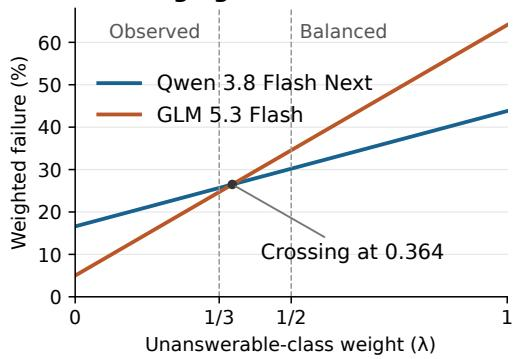

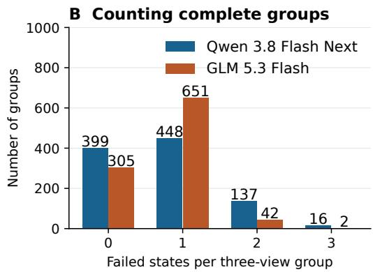  
Figure 5: Class weights and error concentration explain different GQA rankings. (A) Changing the class weight changes the point ranking while predictions remain fixed. (B) Qwen 3.8 Flash Next has more total failed views but fewer affected groups. Table 11 gives intervals for score differences.

## E.2 EXACT ACCOUNTING OF GROUP ERRORS

Let $\begin{array} { r } { n _ { g } = \sum _ { s } f _ { g s } } \end{array}$ be the number of failed states in group g, and let

$$
R _ { k } = \frac { 1 } { G } \sum _ { g } \operatorname* { m a x } ( n _ { g } - 1 , 0 ) , \qquad k E = ( 1 - B _ { k } ) + R _ { k } .\tag{6}
$$

The identity follows from $n _ { g } = \mathcal { H } [ n _ { g } > 0 ] + \operatorname* { m a x } ( n _ { g } - 1 , 0 )$ . Per-view failure counts every failed state; $1 - B _ { k }$ counts each affected question once. Grouped success therefore depends on error concentration as well as total errors.

Qwen 3.8 Flash Next has 399, 448, 137, and 16 groups with zero, one, two, and three failures; GLM 5.3 Flash has 305, 651, 42, and two. Qwen 3.8 Flash Next’s 770 failures consist of 601 first failures and 169 additional failures; GLM 5.3 Flash’s 741 consist of 695 first failures and 46 additional failures. The difference of 123 repeated failures exceeds the 29 extra total failures by 94, exactly the additional groups with every decision correct. This accounts for the opposing point rankings under per-view and complete-group scoring.

Table 12: Question groups with 0–5 failed states across all 18 source/configuration cells. Each row sums to 1,000; weighting counts by failure multiplicity recovers the per-view failure numerator. A dash denotes an impossible state count.
<table><tr><td>Source / system</td><td>0</td><td>1</td><td>2</td><td>3</td><td>4</td><td>5</td></tr><tr><td>PLOTQA / Qwen 3.8 Flash Next</td><td>835</td><td>147</td><td>11</td><td>7</td><td>0</td><td>0</td></tr><tr><td>PLOTQA / Gemma 4 31B</td><td>667</td><td>300</td><td>19</td><td>14</td><td>0</td><td>0</td></tr><tr><td>PLOTQA / Qwen 3.8 27B</td><td>665</td><td>283</td><td>39</td><td>13</td><td>0</td><td>0</td></tr><tr><td>PLOTQA / Gemma 4 26B A4B</td><td>539</td><td>419</td><td>22</td><td>16</td><td>4</td><td>0</td></tr><tr><td>PLOTQA / GLM 5.3 Flash</td><td>273</td><td>558</td><td>167</td><td>1</td><td>1</td><td>0</td></tr><tr><td>PLOTQA / Molmo2-8B</td><td>194</td><td>509</td><td>297</td><td>0</td><td>0</td><td>0</td></tr><tr><td>CLEVR / Qwen 3.8 Flash Next</td><td>454</td><td>506</td><td>28</td><td>11</td><td>1</td><td>一</td></tr><tr><td>CLEVR / Gemma 4 31B</td><td>210</td><td>451</td><td>89</td><td>245</td><td>5</td><td>一</td></tr><tr><td>CLEVR / Qwen 3.8 27B</td><td>273</td><td>505</td><td>144</td><td>69</td><td>9</td><td>一</td></tr><tr><td>CLEVR / Gemma 4 26B A4B</td><td>189</td><td>491</td><td>79</td><td>228</td><td>13</td><td>一</td></tr><tr><td>CLEVR / GLM 5.3 Flash</td><td>205</td><td>793</td><td>2</td><td>0</td><td>0</td><td>一</td></tr><tr><td>CLEVR / Molmo2-8B</td><td>216</td><td>562</td><td>107</td><td>112</td><td>3</td><td>一</td></tr><tr><td>GQA / Qwen 3.8 Flash Next</td><td>399</td><td>448</td><td>137</td><td>16</td><td></td><td>一</td></tr><tr><td>GQA / Gemma 4 31B</td><td>372</td><td>453</td><td>160</td><td>15</td><td></td><td>一</td></tr><tr><td>GQA / Qwen 3.8 27B</td><td>359</td><td>455</td><td>170</td><td>16</td><td></td><td>一</td></tr><tr><td>GQA / Gemma 4 26B A4B</td><td>392</td><td>400</td><td>192</td><td>16</td><td></td><td>一</td></tr><tr><td>GQA / GLM 5.3 Flash</td><td>305</td><td>651</td><td>42</td><td>2</td><td></td><td>一</td></tr><tr><td>GQA / Molmo2-8B</td><td>267</td><td>573</td><td>146</td><td>14</td><td>一</td><td>一</td></tr></table>

Qwen 3.8 Flash Next also has higher GQA complete task success than GLM 5.3 Flash, 33.7% versus 24.5%, while GLM 5.3 Flash answers more individual supported views correctly (77.65% versus 69.85%). Gemma 4 26B A4B and Qwen 3.8 Flash Next have similar balanced GQA failures, 30.35% and 30.20%, with a paired difference interval containing zero. Together, these results show how the evaluation objective determines which behavior an aggregate score rewards.

## F EVALUATION COHORT VERIFICATION AND CHART ERROR DECOMPOSITION

All 1,000 chart witnesses match their evaluated question groups by question and source identity. Every group contains F, S, C, M, I, covering all 5,000 views. Complete-witness verification passes for all 1,000 proofs.

Figure 3 first assigns groups with M failures, then those with other decision failures. Remaining groups separate joint success from correct decisions with wrong supported answers. The four counts sum to 1,000: joint success equals $G J _ { 5 }$ , joint plus decision-only success equals $G B _ { 5 } ,$ , and the missing category equals the M failure count. Numerical replay checks these identities for all six configurations and regenerates the partition and chart table.

## G NUMERICAL VERIFICATION

Numerical verification recomputes model scores and paired analyses from the 72,000 final-response scoring records. Each model contributes one response per input, and every question group contains exactly the states defined for its source. The checks establish complete input coverage, consistent question identities, correct treatment of invalid responses, and agreement between per-view counts and group scores. The chart decomposition satisfies the identities in Appendix F for all six configurations. Separate counts from the finite-program and solver studies recover the construction results in Section 3.3.

Public data and code. The frozen release at https://huggingface.co/datasets/ sungguk/visual-answerability (tag v1.0.0) covers the 12,000 evaluated views in this paper: 5,000 PlotQA views, 4,000 CLEVR views, and 3,000 GQA view references. PlotQA and CLEVR include embedded images and retain their source CC BY 4.0 terms. GQA is distributed as source identifiers, our labels, and edit recipes; upstream photographs, question text, full programs, and scene graphs are obtained separately and reconstructed using the supplied instructions. The package in cludes the 1,000 bounded chart proofs and their checker, scene edit evidence, the 72,000 final-response scoring projections, and scripts for numerical replay and scoring new predictions. It does not include the broader training and development resource. Component licenses, attribution, prompts, environment specifications, and reconstruction checks are documented in the dataset card and accompanying files. The verified release commit is e1ced6168e243ba6c9a7364d0be25bbd9763384d.

## H EXTENDED CONTEXT FOR THE EVALUATION DESIGN

Photographic grounding and source annotations. Keeping the question fixed while changing relevant and irrelevant visual content tests whether responses follow the image. VQA established open-ended image questions, and VQA v2 introduced complementary images to reduce language-only shortcuts (Agrawal et al., 2015; Goyal et al., 2016). Visual Genome’s object and relation annotations and GQA’s compositional programs support interventions tied to question dependencies (Krishna et al., 2016; Hudson & Manning, 2019). TDIUC’s category analysis, behavioral analyses of VQA, and VQA-CP demonstrate why aggregate accuracy requires more targeted diagnostics (Kafle & Kanan, 2017; Agrawal et al., 2016; 2017). Our photographic audit examines whether the annotated dependencies account for the cues that remain after masking.

Charts, text, and documents. The chart cohort isolates whether the displayed evidence identifies the requested value. FigureQA and DVQA provide controlled charts; PlotQA supplies numerical plot questions; ChartQA adds logical and arithmetic reasoning (Kahou et al., 2017; Kafle et al., 2018; Methani et al., 2020; Masry et al., 2022). ChartBench and CharXiv broaden chart and reasoning coverage (Xu et al., 2023; Wang et al., 2024b). TextVQA, ST-VQA, DocVQA, and InfographicVQA further emphasize the role of reading in visual answering (Singh et al., 2019; Biten et al., 2019; Mathew et al., 2020; 2021). Our supported states preserve that reading obligation, while ambiguity witnesses establish when the visible evidence admits multiple numerical answers.

Visual mathematics and modality dependence. Task difficulty and evidence sufficiency require separate evaluation. ScienceQA, MathVista, and MATH-Vision assess scientific and mathematical reasoning over visual inputs (Lu et al., 2022; 2024; Wang et al., 2024a). MathVerse varies information available through text and diagrams, and DynaMath tests programmed variations of a problem (Zhang et al., 2024; Zou et al., 2025). MMMU expands disciplinary coverage, while MMMU-Pro filters questions solvable without images (Yue et al., 2023; 2024). These designs motivate distinguishing an incorrect answer to a supported question from an answer to an image that lacks identifying evidence.

Perception and broad multimodal coverage. Capability breadth and complete-question success address complementary evaluation goals. MME, MMBench, SEED-Bench, and MM-Vet cover multiple perception and reasoning abilities (Fu et al., 2023; Liu et al., 2023; Li et al., 2023a; Yu et al., 2023). BLINK and Q-Bench probe visual perception, MME-RealWorld emphasizes high-resolution inputs, and PhysBench and MMIE extend physical and interleaved understanding (Fu et al., 2024; Wu et al., 2024; Zhang et al., 2025; Chow et al., 2025; Xia et al., 2025). Within our three domains, repeated response obligations allow unnecessary refusal and unsupported acceptance to be diagnosed on the same questions.

External knowledge and multiple images. The information available at inference determines the meaning of answerability. OK-VQA and A-OKVQA require external knowledge, while VCR evaluates commonsense answers and rationales (Marino et al., 2019; Schwenk et al., 2022; Zellers et al., 2018). NLVR2 uses paired photographs, MuirBench includes answerable/unanswerable multiimage counterparts, and Visual Haystacks and MRAG-Bench evaluate visual retrieval (Suhr et al., 2018; Wang et al., 2025; Wu et al., 2025; Hu et al., 2025). Our prompt restricts each response to one image and question. Grouping occurs after inference, so a model has no access to another version’s evidence.

Compositional programs and controlled worlds. Executable question structure connects interventions to their answer consequences. Neural Module Networks, program generation, the Neuro-Symbolic Concept Learner, and MAC develop structured visual reasoning (Andreas et al., 2015; Johnson et al., 2017b; Mao et al., 2019; Hudson & Manning, 2018). CLEVR, ShapeWorld, and CLOSURE provide controlled compositional settings (Johnson et al., 2017a; Kuhnle & Copestake, 2017; Bahdanau et al., 2019); Super-CLEVR, ClevrTex, and CLEVRER vary domain, appearance, and temporal structure (Li et al., 2023c; Karazija et al., 2021; Yi et al., 2019). Our chart witnesses connect answer variation to observation equality through possible-world semantics and executable constraints (Imielinski & Lipski, 1984; Console et al., 2022; de Moura & Bjørner, 2008).´

Robustness, hallucination, and validity. Changes in input conditions expose failures hidden by aggregate accuracy. VQA-Rephrasings, Causal VQA, Adversarial VQA, and corruption benchmarks test linguistic, semantic, adversarial, and perceptual variation (Shah et al., 2019; Agarwal et al., 2020; Li et al., 2021; Hendrycks & Dietterich, 2019). Shortcut learning and underspecification explain the need for such targeted tests (Geirhos et al., 2020; D’Amour et al., 2020). CHAIR, POPE, M-HalDetect, and AMBER evaluate hallucination, while HallusionBench scores related visual contexts jointly (Rohrbach et al., 2018; Li et al., 2023b; Gunjal et al., 2023; Wang et al., 2023; Guan et al., 2024). VISREAS, VizWiz, UNK-VQA, CertainlyUncertain, MoHoBench, and MM-AQA construct or collect visual unanswerability cases (Akter et al., 2024; Gurari et al., 2018; Guo et al., 2024; Chandu et al., 2025; Zhu et al., 2026; Madhusudhan et al., 2026). Our diagnostic decomposition separates supported-answer errors from decisions to answer insufficient evidence.

Uncertainty and reporting. Input ambiguity and model uncertainty require different evidence. SQuAD 2.0, AmbigQA, and TruthfulQA evaluate unanswerable questions, ambiguity, and false beliefs (Rajpurkar et al., 2018; Min et al., 2020; Lin et al., 2021); SelfAware and AbstentionBench examine recognition of unanswered or unanswerable questions (Yin et al., 2023; Kirichenko et al., 2025). Self-assessment, semantic entropy, and SelfCheckGPT estimate uncertainty from model behavior (Kadavath et al., 2022; Kuhn et al., 2023; Manakul et al., 2023); Wagner (2026) separates answer correctness from question answerability. Calibration, selective prediction, conformal prediction, and Learn then Test address confidence, risk, and statistical guarantees (Guo et al., 2017; Geifman & El-Yaniv, 2017; 2019; Whitehead et al., 2022; Angelopoulos & Bates, 2021; Angelopoulos et al., 2021). Our witnesses establish ambiguity for individual observations under declared world semantics. Bootstrap intervals separately quantify variation in model scores, preserving question groups and paired comparisons (Efron, 1979; Koehn, 2004; Dror et al., 2018).

Documentation and reproducibility. Datasheets for Datasets and Model Cards motivate explicit composition and evaluation conditions (Gebru et al., 2018; Mitchell et al., 2018); HELM emphasizes reporting multiple evaluation dimensions (Liang et al., 2022). Accordingly, we specify state definitions, source-specific label evidence, denominators, scoring rules, and model configurations. These details determine how complete task success and its diagnostic components should be interpreted.