# WHO Is LEFT OF WHOM? TRACING SPATIAL EVIDENCE AND ROLE BINDING IN RELATIVE-POSITION REASONING

Yingjin Song, Denis Paperno & Albert Gatt

Utrecht University

Utrecht, The Netherlands

{y.song5, d.paperno, a.gatt}@uu.nl

## ABSTRACT

High instance-level accuracy can mask inconsistencies in spatial reasoning when objects exchange positions or their roles are reversed in the query. The internal representations supporting relative-position reasoning remain poorly understood. We investigate two complementary components of this process: tracking object locations in the input and representing their query roles. Across three VLMs with visual or textual inputs and their language-model backbones, activation patching reveals a staged progression from early-layer source representations through intermediate-layer query-object representations to late-layer answer states. Targeted interventions further establish causal links along this progression: manipulating source-side representations shifts location information at query-object mentions and ultimately alters relation predictions. Beyond object-location information, we also identify a stable query-side direction associated with the roles of the two objects in the comparison. Steering along directions estimated on synthetic scenes generalizes to natural-image benchmarks, improving accuracy and both forms of paired consistency in most settings without retraining. Our findings reveal complementary components of relational reasoning across visual and textual settings and show how targeted interventions can improve the consistency of models' behavior.

## 1 INTRODUCTION

Spatial reasoning is a fundamental capability for models operating in visual, linguistic and embodied environments (Du et al., 2024; Zhang et al., 2026; Hong et al., 2026). VLMs infer relations from visual layouts and object configurations (Hudson & Manning, 2019; Liu et al., 2023; Yin et al., 2025; Yang et al., 2025; Cheng et al., 2025), whereas text-only Large Language Models (LLMs) construct spatial structure from linguistic descriptions of object positions, paths, and relations (Weston et al., 2016; Mirzaee et al., 2021; Shi et al., 2022; Jiang et al., 2026). Much of the progress in spatial reasoning is measured through benchmarks, where accuracy is the primary evaluation metric. However, we also need to understand the representations underlying this task, and to assess the extent to which such representations support consistent and robust reasoning.

In principle, answering the question “Is X to the left or right of Y?" (Figure 1A) requires at least two computations: (i) recovering the positions of the queried objects and (ii) assigning them to the correct relational roles: the target (object being localized) and reference (object with respect to which it is localized).¹ A model's response should then flip correspondingly under two perturbations (Figure 1B): (i) object-location swap, where objects exchange positions while the query roles remain fixed; and (ii) target/reference role reversal, where the scene remains unchanged but the query roles of target and reference are exchanged. A model may answer a single query correctly yet fail under either perturbation. Since each perturbation targets one of the two computations, these paired tests motivate our mechanistic study of how models represent object locations and target/reference roles.

Our starting point is recent work identifying content-independent location components in VLMs: Kang et al. (2026) show that object-word activations carry spatial IDs whose manipulation shifts spatial beliefs, while Cui et al. (2026) identify a dominant global signal in visual tokens and a secondary pathway in the language backbone. We characterize such components using location IDs: position-specific prototypes estimated separately at source-object tokens and at query-object mentions (at query mentions, they correspond to the spatial IDs of Kang et al. (2026)). We extend this line of work in three directions. First, prior analyses use image inputs. We test whether location IDs also arise when the scene is described in text, both in the VLM and in its LLM backbone. Second, we link the two sites: we hypothesize that location information represented at source tokens becomes available at the corresponding object mentions in the query, and test this source-to-query transfer in visual and textual inputs alike. Third, since exchanging target and reference roles reverses the answer for the same locations, we estimate a role direction and test its causal role in relation prediction.

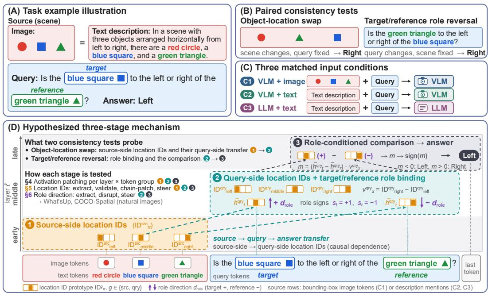  
Figure 1: Overview of the task and mechanistic analysis. (A) A scene, given as an image or an equivalent text description (the source), and a query about the position of a target object relative to a reference object. (B) Object-location swaps and target/reference reversals, both reversing the correct answer. (C) Matched input conditions: VLM + image, VLM + text and LLM + text. (D) Hypothesized mechanism: source representations influence query-side location information, while target/reference roles condition its use in relation prediction. We test this account through activation patching and targeted interventions, and evaluate role-direction steering on natural images.

We study three input conditions (Figure 1C): a VLM receiving an image and query (VLM+image) or an equivalent textual scene description and query (VLM+text), and its LLM backbone receiving the same textual input (LLM+text). This design allows us to examine differences associated with input modality and multimodal training. We first evaluate model behavior using paired object-location-swap and target/reference-role-reversal tests. As outlined in Figure 1D, we then use activation patching to localize task-relevant information across layers and semantic token groups, extract location IDs, and test their causal effects through source-to-query patching and steering. We evaluate target/reference role directions through both destructive interventions and positive steering.

Contributions. First, through paired object-location-swap and target/reference-reversal consistency tests across the three input settings, we show that high instance-level accuracy does not guarantee relational consistency. Second, across visual and textual scene inputs, we characterize location representations at source and query tokens, show that source patching alters query-side location information and answer preferences, and establish that steering query-object states with location-ID differences changes relation predictions. Third, we identify a stable target/reference role direction, whose disruption degrades role-sensitive predictions. Steering along directions estimated on synthetic scenes improves accuracy and paired consistency on What'sUp (Kamath et al., 2023) and COCO-Spatial (Lin et al., 2014) in most settings without retraining

## 2 RELATED WORK

Mechanistic interpretability studies how neural networks represent information and generate outputs (Saphra & Wiegreffe, 2024). In language models, probing, logit lens, activation patching, sparse autoencoders and steering have been widely used to localize task-relevant representations and test their causal roles (Belinkov, 2022; Marks & Tegmark, 2024; nostalgebraist, 2020; Geva et al., 2022; Zhang & Nanda, 2024; Cunningham et al., 2023; Subramani et al., 2022; Turner et al., 2023). These tools have recently been adapted to VLMs to analyze visual retrieval, cross-modal integration and attention specialization (Gandelsman et al., 2024; Neo et al., 2025; Jiang et al., 2025; Krojer et al., 2026; Huo et al., 2024; Huang et al., 2024; ?; Palit et al., 2023; Basu et al., 2024; Golovanevsky et al., 2025; Wang et al., 2025a). Building on these studies, we trace how source-side spatial evidence is propagated to query-side location IDs and how these representations interact with target/reference role binding to support relative-position judgments.

Spatial reasoning has been widely studied in VLMs using synthetic scenes and human-annotated natural and medical images (Kamath et al., 2023; Yuksekgonul et al., 2023; Liu et al., 2023; Chen et al., 2024; Ma et al., 2025; Wolf et al., 2025; Gholami et al., 2026; Jia et al., 2026), revealing limited robustness and substantial room for improvement. Diagnostic studies attribute these limitations to misallocated visual attention (Chen et al., 2025b), modality imbalance (Qi et al., 2025) and the loss of fine-grained spatial details in deep visual features (Chen et al., 2025a). Closer to our work, mechanistic analyses of image-conditioned VLMs find spatial IDs bound to object words (Kang et al., 2026), spatial information carried mainly by visual tokens (Cui et al., 2026) and, concurrently, a query-token-mediated pathway for spatial relations (Salazar et al., 2026). Spatial reasoning in text-only LLMs has been less explored, with prior work mainly testing whether models infer object positions, paths and relative relations from language (Weston et al., 2016; Mirzaee et al., 2021; Shi et al., 2022; Jiang et al., 2026; Guo et al., 2026). Our work connects these lines: we trace location representations in VLMs and their LLM backbones under visual and textual input, link source- and query-side location IDs, and identify a separate target/reference role direction.

## 3 TASK SETUP AND BEHAVIOURAL BENCHMARKING

Task setup. We study relative-position reasoning with inputs $x = ( S , q ( t , r ) )$ , where S is a scene and $q ( t , r )$ asks for the position of a target object t relative to a reference object r along a specified spatial axis. Each query concerns two objects in the scene; we also experiment with scenes involving a third, distractor object. We evaluate the three matched input conditions in Figure 1C: VLM+image, VLM+text and LLM+text, using images or textual descriptions of the same scenes.

Paired perturbations. We construct two transformations which reverse the ground-truth relation (e.g. from left to right; cf. Figure 1B) while keeping the queried axis and the order of the answer options fixed. $\tau _ { \mathrm { l o c } } ( x ) = ( S ^ { t  r } , q ( t , r ) )$ is an object-location swap, which exchanges the positions of the two queried objects while keeping the query fixed. In three-object scenes, the distractor remains unchanged. For text inputs, the scene description is updated to express the swapped layout. $\tau _ { \mathrm { r o l e } } ( x ) = ( S , q ( r , t ) )$ is a target/reference role reversal, where the source remains unchanged while the two objects exchange their roles in the query.

Benchmarking setup. We evaluate ten VLMs and their LLM backbones on Synthetic, comprising two- and three-object 2D scenes, and What'sUp subsets A and B (Kamath et al., 2023). We choose What'sUp because its controlled photographs vary spatial relations while preserving object identities, enabling matched location-swap tests on real-world images. Accuracy is evaluated on original queries and each paired-consistency score requires both answers to match their respective ground truths. Data construction and evaluation details appear in Appendix A and Appendix B.

Benchmarking results. Figure 2 shows that VLM+image leads on all three metrics for every model on both benchmarks; five models achieve perfect accuracy and paired consistency on Synthetic.

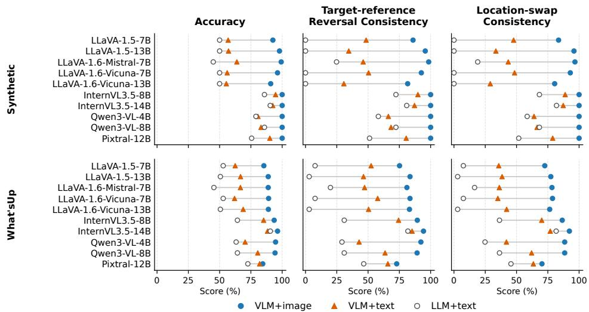  
Figure 2: Benchmarking results for the three conditions: VLM+image, VLM+text and LLM+text. Numerical results are provided in Table 6.

VLM+text generally outperforms LLM+text, with exceptions for Qwen3-VL-8B on all Synthetic metrics and InternVL3.5-14B on What'sUp accuracy and location-swap consistency. On What'sUp, paired errors remain despite strong original-query accuracy: LLaVA-1.6-Mistral in VLM+image achieves 88.85% accuracy, compared with 81.03% target-reference reversal consistency and 78.31% location-swap consistency. The paired tests also expose fixed-answer behavior: on Synthetic, the Vicuna backbones of LLaVA-1.5 and LLaVA-1.6-Vicuna obtain 50% accuracy by nearly always answering left or above, yet score 0% on both consistency metrics. These results motivate examining how models represent and use object locations and query roles across paired inputs.

## 4 LOCALIZING SOURCE, QUERY AND ANSWER-STAGE REPRESENTATIONS

Why activation patching. Building on the behavioral tests in §3, we use activation patching to localize representations that influence answer preferences under object-location swaps and target/reference role reversals. For each clean-corrupt pair, we replace the residual-stream states of a token group g at layer l in the corrupt run with the corresponding clean states and measure recovery of the clean-answer preference (Zhang & Nanda, 2024). Comparing the two perturbations reveals where these interventions affect predictions when object locations or query roles change. Our hypothesis (cf. Figure 1D) is that, under location swap, effective patching sites shift with depth from source tokens to query-object mentions and then to the final token. We restrict this analysis to pairs in which both runs favor their respective correct answers. This provides a clear clean-corrupt contrast for localizing representations that support correct relative-position judgments.

Experimental Setup. We use the three input conditions in Figure 1C. Following §3, we select 1lava-v1.6-mistral-7b (Liu et al., 2024), InternVL3.5-8B-Instruct (Wang et al., 2025b) and pixtral-12b (Mistral AI team, 2024b), and their corresponding LLM backbones: Mistral-7B-Instruct (Jiang et al., 2023), Qwen3-8B (Team, 2025) and Mistral-Nemo-Instruct-2407 (Mistral AI team, 2024a).² Patched groups follow the three stages: (i) source tokens carrying scene evidence (all visual tokens; the visual tokens inside the bounding boxes of t and r; or the visual tokens in the row/column in which t/r are located; for text inputs, the description spans naming the objects and those stating their arrangement), (ii) query tokens (the joint target+reference mention span, or the two relation option words); and (ii) the last token before answer generation. V0 denotes the multimodal state before the first LM layer. Table 7 lists them in full. We retain clean-corrupt pairs for which the clean run favors $a _ { \mathrm { c l e a n } }$ , the corrupt run favors $a _ { \mathrm { c o r r u p t } } .$ , and the margin gap is at least 0.25. Sample counts before and after screening are reported in Appendix F, together with the inclusion criteria for the experiments in §§5–6.

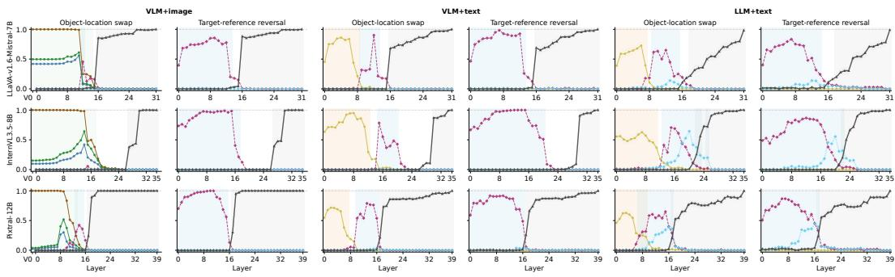  
source: all visual tokens  source: object bbox pairs source: object strip pairs source: desc all objects-- query: target + reference object query: relation option wordslast token  
Figure 3: Layerwise activation patching clean-answer recovery rate across input conditions, token sources, corruption types and models in the 3-object synthetic dataset.

For each clean-corrupt pair, we cache residual-stream activations from the forward runs on the clean and corrupt inputs, denoted by $x _ { \mathrm { c l e a n } }$ and $x _ { \mathrm { { c o r r u p t } } } .$ respectively. At layer l and semantic token group g, full-vector patching constructs a patched run $x _ { \mathrm { p a t c h } } ^ { \mathrm { c l e a n } , ( \ell , g ) }$ by rerunning the corrupted input with the corresponding residual-stream activations from the clean run: $H _ { g } ^ { ( \ell ) } ( x _ { \mathrm { p a t c h } } ^ { \mathrm { c l e a n } , ( \ell , g ) } ) \gets H _ { g } ^ { ( \ell ) } ( x _ { \mathrm { c l e a n } } )$ . For any run x, we define the clean-over-corrupt answer margin as $M ( x ) \stackrel { \textstyle - } { = } \mathrm { l o g i t } _ { x } ( a _ { \mathrm { c l e a n } } ) - \mathrm { l o g i t } _ { x } ( a _ { \mathrm { c o r r u p t } } )$ where $\mathrm { l o g i t } _ { x } ( a )$ is the logit assigned to answer a under run x. We compute the fraction of examples for which the patched run restores the preference for the clean answer with Clean-Answer Recovery Rate $\mathrm { C A R R } _ { \ell , g } = \mathbb { E } \left[ \mathbf { 1 } \{ M ( x _ { \mathrm { p a t c h } } ^ { \mathrm { c l e a n } , ( \ell , g ) } ) > 0 \} \right] .$ 3

Results. Figure 3 shows layer-dependent patching patterns in the 3-object scene dataset.4 Under location swap, recovery shifts from source tokens in early-to-middle layers to query-object tokens in middle layers and the final token in late layers. Under target-reference reversal, query-object and late-layer final-token patches dominate recovery. Source recovery remains near zero as expected, since source tokens precede the query and have identical states across the pair under causal attention.

The most recoverable groups further depend on the input condition. In VLM+image, location-swap recovery is dominated by visual tokens: patching all visual tokens nearly fully restores the clean answer, while localized visual patches are weaker, with object-strip tokens outperforming object bounding-box tokens. In the two text-input conditions, recovery shifts to textual source and query groups. Under location swap, scene-description object mentions are the strongest source-side text group, peaking at about 0.95 in VLM+text and 0.73 in LLM+text. Under target-reference reversal, jointly patching the target and reference query spans produces strong clean-answer recovery.

Comparing VLM+text and LLM+text reveals differences in patching effects across token groups. VLM+text generally shows higher recovery from scene-description and query-object patches, whereas patches at relation-option tokens have larger effects in LLM+text. We next examine what location information is represented at source and query-object tokens and whether interventions on these representations affect relation predictions.

## 5 EXTRACTING AND INTERVENING ON OBJECT-CENTERED LOCATION IDS

Recent work shows that image-conditioned VLMs encode object locations in object-centered spatial representations, tied to either source-side visual tokens or query-side object tokens (Kang et al., 2026;

(E)  
(A)  
Table 1: Effects of source patching on query-side location information and answer preferences. Cells report all-layer mean corrupt-directed score shifts and corrupt-answer flip rates after patching corrupt-run source states into the clean run $( \Delta m ^ {  \mathrm { c o r r } } ~ ,$ flip %).
<table><tr><td>Setting</td><td>Patch group</td><td>LLaVA ∆m/ flip</td><td>InternVL ∆m/ flip</td><td>Pixtral ∆m/ flip</td></tr><tr><td>VLM + image</td><td>All visual</td><td>1.718 / 62.9%</td><td>21.660 / 69.1%</td><td>3.877 / 51.2%</td></tr><tr><td> $\mathrm { V L M } + \mathrm { i m a g e }$ </td><td>Object+strip</td><td>0.881 / 34.0%</td><td>9.691 / 11.6%</td><td>1.477 / 5.1%</td></tr><tr><td> $\mathrm { V L M } + \mathrm { t e x t }$ </td><td>All objects</td><td>0.493 / 17.7%</td><td>7.912 / 24.3%</td><td>0.783 / 13.7%</td></tr><tr><td> $\mathrm { L L M + t e x t }$ </td><td>All objects</td><td>0.416 / 20.0%</td><td>3.586 / 15.6%</td><td>0.701 / 10.3%</td></tr></table>

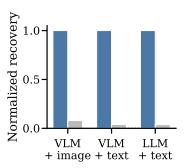

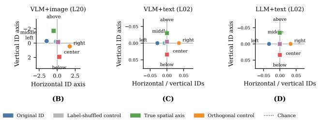

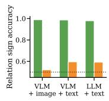  
Figure 4: Location IDs in LLaVA-1.6-Mistral-7B on three-object scenes: (A) held-out location prediction with shuffled-label controls; (B-D) prototype visualization along axes defined by endpoint-ID contrasts; and (E) query-side relation-sign prediction with orthogonal-axis controls.

Cui et al., 2026). We extend this work, comparing matched image and textual sources, analyzing both VLMs and their LLM backbones, and tracing a causal source-query-prediction pathway.

Location ID extraction. We extract location IDs at two sites, $g \in \{ \mathrm { s r c } , \mathrm { q r y } \}$ , which are per-object subsets of the source/query token groups in Table 7. For example i, object o, layer l, let $h _ { i , o , \ell } ^ { g ^ { \star } }$ denote the residual-stream state of o pooled over its tokens at site $g \colon$ for $g = \operatorname { s r c } .$ , image tokens inside its bounding box (image inputs) or the description span naming it (text inputs); for $g = \mathrm { { q r y } }$ , the query span mentioning it as target or reference. Each object has an attribute label $\rho _ { i , o } \ ( \mathrm { e . g . } ,$ "red circle", “blue square") and a location label $\pi _ { i , o } \colon$ left/right or above/below in two-object scenes, and left/middle/right or above/center/below in three-object scenes. For image inputs, $\pi _ { i , o }$ is the object's location in the visual scene. For text inputs, $\pi _ { i , o }$ denotes the position implied by the description instead of the order of mention. A query mention inherits its source object's label, so both sites share the label.

To extract location-related components while controlling for object attributes, we center each object state by subtracting the mean activation for objects with the same attribute. Let $\mu _ { \rho , \ell } ^ { g }$ denote the mean activation for attribute $\rho$ at site g and layer l. We define the centered object state as $\bar { h } _ { i , o , \ell } ^ { g } =$ $h _ { i , o , \ell } ^ { g } - \mu _ { \rho _ { i , o } , \ell } ^ { g }$ . The location ID of label π at site g and layer l is the prototype obtained by averaging the attribute-centered states of objects assigned that location label: $\mathrm { I D } _ { \pi , \ell } ^ { g } = \mathbb { E } \Big [ \bar { h } _ { i , o , \ell } ^ { g } \mid \pi _ { i , o } = \pi \Big ]$ Spatial axes are defined as contrasts between location IDs at opposite ends of each axis, e.g. $\begin{array} { r l r } { v _ { x , \ell } ^ { \dot { g } } = \mathrm { I D } _ { \mathrm { r i g h t } , \ell } ^ { g } - \mathrm { I D } _ { \mathrm { l e f t } , \ell } ^ { g } , } & { { } } & { v _ { y , \ell } ^ { g } = \mathrm { I D } _ { \mathrm { a b o v e } , \ell } ^ { g } - \mathrm { I D } _ { \mathrm { b e l o w } , \ell } ^ { g } } \end{array}$ . Source-side and query-side IDs are estimated independently and need not coincide as vectors; they are linked by the shared label π and, as tested below, by the causal dependence of query-side states on source-side states.

The extracted IDs support held-out location prediction and query-side relational comparison, outperforming the shuffled-label and orthogonal-axis controls, respectively (Figure 4A,E). Figure 4B-D illustrates prototype geometry along axes defined by endpoint-ID contrasts. Full results are provided in Appendix D.

Source-to-query transfer. We test whether changing source representations affects downstream location information at query-object mentions and answer preferences. At layer l, we replace the activations of source group g in the clean run with the corresponding corrupt-run activations: $\begin{array} { r } { H _ { g } ^ { ( \ell ) } ( x _ { \mathrm { p a t c h } } ^ { \mathrm { c o r r u p t } , ( \ell , g ) } ) \gets H _ { g } ^ { ( \bar { \ell } ) } ( x _ { \mathrm { c o r r u p t } } ) . \mathrm { L e t } m _ { i } ( x ; \ell ^ { \prime } ) = \langle \bar { h } _ { i , t , \ell ^ { \prime } } ^ { \mathrm { q r y } } - \bar { h } _ { i , r , \ell ^ { \prime } } ^ { \bar { \mathrm { q r y } } } , v _ { . , \ell ^ { \prime } } ^ { \bar { \mathrm { q r y } } } \rangle } \end{array}$ denote the query-side location-comparison score for example i: the target-minus-reference difference of the centered queryobject states in run $x ,$ projected onto the query-side axis of the queried dimension at a downstream layer $\ell ^ { \prime } > \ell .$

We first define the corruption direction as $s _ { i } ^ { \mathrm { c o r r u p t } } ~ = ~ \mathrm { s g n } ( m _ { i } ( x _ { \mathrm { c o r r u p t } } ; \ell ^ { \prime } ) - m _ { i } ( x _ { \mathrm { c l e a n } } ; \ell ^ { \prime } ) )$ The corrupt-directed query-side location-comparison score shift is then $\begin{array} { r l } { \Delta m _ { i } ^ {  \mathrm { c o r r u p t } } } & { { } = } \end{array}$ $\left[ m _ { i } \Bigl ( x _ { \mathrm { p a t c h } } ^ { \mathrm { c o r r u p t } , ( \ell , g ) } ; \ell ^ { \prime } \Bigr ) - m _ { i } \bigl ( x _ { \mathrm { c l e a n } } ; \ell ^ { \prime } \bigr ) \right] s _ { i } ^ { \mathrm { c o r r u p t } }$ . Using the clean-over-corrupt margin $M ( x )$ , the corrupt-answer flip rate is $\mathrm { C A F R } _ { \ell , g } = \bar { \mathbb { E } } _ { i } \left[ \mathbf { 1 } \{ M ( x _ { \mathrm { p a t c h } } ^ { \mathrm { c o r r u p t } , ( \ell , g ) } ) < 0 \} \right]$

Table 1 shows that patching corrupted source states into clean runs alters query-side location information and answer preferences. Full visual-token patching yields the largest corrupt-directed score shifts and corrupt-answer flip rates, with weaker effects from localized bbox+strip patches. Description-side object patches also shift scores and induce answer flips in both text-input conditions. We next intervene directly on query-side location representations to test their causal contribution to relation predictions.

Query-side location-ID steering. To test whether query-side location information causally affects relation predictions, we intervene on the residual-stream states at the target and reference mentions while keeping the input unchanged. For each example, let $\pi _ { t }$ and $\pi _ { r }$ denote the source-scene spatial labels of the queried target and reference objects on the relevant axis. We construct a targetreference spatial-label swap intervention by setting $\pi _ { t } ^ { \prime } = \pi _ { r }$ and $\pi _ { r } ^ { \prime } = \pi _ { t }$ , while keeping the target and reference roles unchanged. At layer $\ell ,$ we add the corresponding query-side ID difference to every token in the query-object span: $h _ { k } ^ { ( \ell ) } \gets h _ { k } ^ { ( \ell ) } + \alpha \left( \mathrm { I D } _ { \pi _ { o } ^ { \prime } , \ell } ^ { \mathrm { q r y } } - \mathrm { I D } _ { \pi _ { o } , \ell } ^ { \mathrm { q r y } } \right) , \qquad k \in \mathrm { s p a n } ( o ) , \ o \in $ {target, re ference}. Here k indexes token positions, span(o) denotes the query-token span of object $^ { O , }$ and α is the steering strength.

We quantify steering by the fraction of examples whose preference changes to the swap-implied answer. As shown in Figure 5, the true query-side ID difference produces the strongest and most consistent belief flips. In the VLM+image setting, peak flip rates reach 75.0%, 93.8% and 87.5%, respectively. The effect remains strong in the VLM+text setting (53.6%, 87.0% and 82.3%), and persists in the LLM+text setting (47.4%, 65.1% and 46.4%). The flips concentrate in middle layers and are substantially weaker under norm-matched random directions, shuffled-ID directions, and orthogonal controls, indicating that the effect depends on the location-ID alignment of the query-object steering direction. Queryside location IDs thus specify where each queried object is, but the answer also depends on which object is being localized: the same two location IDs yield opposite answers when the target and reference roles are exchanged.

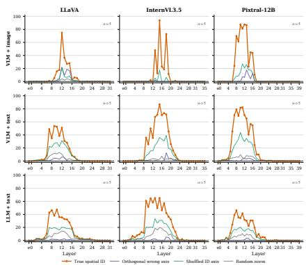  
Figure 5: Layer-wise query-side location-ID steering measured by belief-swap rate.

## 6 TARGET-REFERENCE ROLE DIRECTION STEERING

Relative-position reasoning additionally depends on assigning the queried objects target and reference roles, which we call role binding. We test whether roles are associated with a stable direction in query-object hidden states and whether interventions along that direction affect relation predictions.

Role-contrast geometry. We estimate a role direction by contrasting the query-side hidden states of the same object when it serves as the target vs the reference. We use target-first (TF) and referencefirst (RF) query templates⁵, which place the target and reference in opposite mention orders while preserving the roles and the queried relation. Let C contain training occurrences $( p , o )$ where $p$ indexes a matched role-reversal pair and object o appears once as the queried target and once as the queried reference across the two queries in the pair, within each template. For each $( p , o ) \in { \mathcal { C } }$ , we define the joint object-level role contrast as $\begin{array} { r } { d _ { p , o } ^ { ( \ell ) } = \frac { 1 } { 2 } \sum _ { t \in \{ \mathrm { T F } , \mathrm { R F } \} } \left( h _ { p , o , t , \mathrm { t a r g e t } } ^ { ( \ell ) } - h _ { p , o , t , \mathrm { r e f e r e n c e } } ^ { ( \ell ) } \right) } \end{array}$

Here $h _ { p , o , t , \mathrm { t a r g e t } } ^ { ( \ell ) }$ and $h _ { p , o , t , \mathrm { r e f e r e n c e } } ^ { ( \ell ) }$ are the queryobject hidden states of the same object $^ { O , }$ pooled over its query-token span, when it is queried as the target and as the reference, respectively, under template $t \in \{ T F , R F \}$ . Averaging these joint objectlevel contrasts gives the joint role direction: $d _ { \mathrm { r o l e } } ^ { ( \ell ) } =$ $\frac { 1 } { | { \mathcal { C } } | } \sum _ { ( p , o ) \in { \mathcal { C } } } d _ { p , o } ^ { ( \ell ) }$ . We measure the alignment of heldout joint contrasts with the estimated role direction using the mean cosine $\mathbb { E } _ { ( p , o ) \in \mathcal { E } } \left[ \cos \left( d _ { p , o } ^ { ( \ell ) } , d _ { \mathrm { r o l e } } ^ { ( \ell ) } \right) \right]$ and quantify their concentration using the norm ratio $\frac { \biggl | \biggl | \mathbb { E } _ { ( p , o ) \in \mathcal { E } } \Bigl [ d _ { p , o } ^ { ( \ell ) } \Bigr ] \biggr | } { \mathbb { E } _ { ( p , o ) \in \mathcal { E } } \left[ \biggl | \left| d _ { p , o } ^ { ( \ell ) } \right| \biggr | \right] }$ . A high mean cosine indicates that held-out joint contrasts align with the estimated role direction, while a high norm ratio indicates that averaging preserves a large fraction of their mean individual norm. Both metrics remain high across models and conditions in Figure 6, suggesting that the joint target/reference role contrast forms a stable hidden-state direction.

Role-direction intervention. We test the causal contribution of the role direction by applying destructive updates to all tokens in the query-object spans at a single layer: $h _ { \mathrm { t a r g e t } } ^ { ( \ell ) } ~  ~ \bar { h } _ { \mathrm { t a r g e t } } ^ { ( \ell ) } ~ -$ $\alpha d _ { \mathrm { r o l e } } ^ { ( \ell ) } , \qquad h _ { \mathrm { r e f e r e n c e } } ^ { ( \ell ) } \ \gets \ h _ { \mathrm { r e f e r e n c e } } ^ { ( \ell ) } + \alpha d _ { \mathrm { r o l e } } ^ { ( \ell ) } .$ For each setting, we evaluate 128 held-out scene groups under both TF and RF templates. The full-layer sweep uses the unnormalized direction at the prespecified strength $\alpha \ = \ 1$ , corresponding to one estimated role-contrast vector. We also compare $\alpha \in \{ 0 . 5 , 1 , 1 . 5 \}$ , averaging separate single-layer interventions within fixed layer bands.

Figure 6: Joint TF/RF role-contrast geometry across layers. High held-out mean cosine and norm ratio indicate that the joint object-level contrasts share a stable direction.  
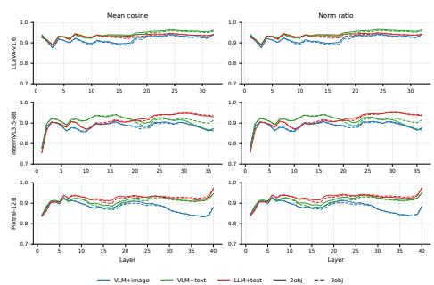

We measure the intervention-induced change $\Delta M$ in the candidate-answer margin $M ( x ) = { \mathrm { s c o r e } } _ { x } ( a ^ { + } ) -$ $\mathrm { s c o r e } _ { x } ( a ^ { - } )$ , where $a ^ { + }$ and $a ^ { - }$ are the correct and role-reversed answers, and report $D = \Delta M _ { \mathrm { r o l e } } \mathrm { ~ - ~ }$ $\Delta M _ { \mathrm { o r t h } }$ . Here, $\Delta M _ { \mathrm { o r t h } }$ averages five separately evaluated, norm-matched orthogonal random controls; negative D indicates stronger disruption along the joint direction. The strongest negative gaps concentrate in early-to-middle layers (Figure 7). Within the fixed bands, the plotted gaps become more negative with increasing α under both TF and RF templates (Figure 15). These effects support a strengthdependent causal contribution of the joint role-related direction under both mention orders.

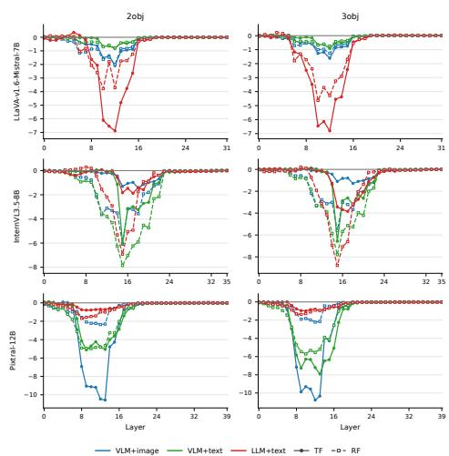  
Figure 7: Layer-wise joint role-direction intervention at $\alpha = 1$ . Curves show the mean gap $\Delta M _ { \mathrm { r o l e } } ~ - ~ \Delta M _ { \mathrm { o r t h } }$ . Negative values indicate stronger disruption along the joint role direction.

Table 2: Activation steering on What'sUp-A using the joint target/reference role direction estimated on synthetic data. Bold indicates improvements with 95% confidence intervals excluding zero.
<table><tr><td>Model</td><td>Condition</td><td>Accuracy</td><td>Target-Reference Reversal Consistency</td><td>Location-Swap Consistency</td></tr><tr><td>LLaVA-1.6</td><td>VLM+image</td><td>82.2 → 84.0 (+1.8)</td><td>70.6 → 73.9 (+3.3)</td><td>66.3 → 67.5 (+1.3)</td></tr><tr><td>LLaVA-1.6</td><td>VLM+text</td><td>66.3 → 65.1 (−1.2)</td><td>52.2 → 54.9 (+2.7)</td><td>39.7 → 39.2 (−0.5)</td></tr><tr><td>LLaVA-1.6</td><td>LLM+text</td><td>63.8 → 67.1 (+3.3)</td><td>38.6 → 43.9 (+5.3)</td><td>33.5 → 38.2 (+4.7)</td></tr><tr><td>InternVL3.5</td><td>VLM+image</td><td>97.3 → 97.4 (+0.1)</td><td>96.1 → 96.6 (+0.5)</td><td>94.2 → 94.2 (+0.0)</td></tr><tr><td>InternVL3.5</td><td>VLM+text</td><td>87.1 → 89.7 (+2.6)</td><td>78.7 → 80.9 (+2.2)</td><td>74.1 → 77.8 (+3.7)</td></tr><tr><td>InternVL3.5</td><td>LLM+text</td><td>70.8 → 73.2 (+2.4)</td><td>46.9 → 50.3 (+3.3)</td><td>45.3 → 49.7 (+4.4)</td></tr><tr><td>Pixtral</td><td>VLM+image</td><td>83.5 → 85.0 (+1.6)</td><td>69.1 → 72.3 (+3.2)</td><td>67.3 → 70.5 (+3.2)</td></tr><tr><td>Pixtral</td><td>VLM+text</td><td>77.0 → 81.9 (+4.9)</td><td>57.8 → 65.7 (+7.8)</td><td>54.7 → 64.1 (+9.4)</td></tr><tr><td>Pixtral</td><td>LLM+text</td><td> $7 4 . 5  7 8 . 7 ( + 4 . 2 )$ </td><td>50.0 → 58.8 (+8.8)</td><td>49.6 → 58.0 (+8.3)</td></tr></table>

Role-direction steering. We test whether amplifying the query-specified role signal along the joint direction estimated on synthetic two-object data improves spatial reasoning on What'sUp-A and COCO-spatial.6 We apply the unnormalized direction to query-object tokens: $h _ { k } ^ { ( \ell ) } \gets$ $h _ { k } ^ { ( \ell ) } + \alpha s _ { o } d _ { \mathrm { r o l e } } ^ { ( \ell ) } , \qquad k \in \mathrm { s p a n } ( o )$ , where $s _ { o } = + 1$ for the target and —1 for the reference. We retain the layers previously selected for the joint direction on synthetic validation data and select $\alpha \in \{ 0 , 0 . 2 5 , 0 . 5 , 1 , 1 . 5 \}$ for the joint direction on 128 disjoint synthetic two-object validation scene groups. Selection maximizes original-query generation accuracy, averaged equally over TF/RF templates and scene-description variants. The resulting layer/strength configurations (Table 9) are frozen before What'sUp and COCO-Spatial evaluation and model parameters remain unchanged.

Table 2 reports results pooled over TF and RF queries on What'sUp-A. Joint role-direction steering improves target-reference reversal consistency in all nine settings, with 95% confidence intervals excluding zero in eight. Accuracy and location-swap consistency also improve in most settings. The largest gains occur in Pixtral's text-input conditions: VLM+text gains 4.9% in accuracy, 7.8% in reversal consistency, and 9.4% in location-swap consistency. LLaVA-1.6 VLM+text shows a more selective effect, improving reversal consistency despite small declines in the other metrics. Applying the same directions, layers and strengths to COCO-Spatial without retuning also improves reversal consistency in all nine settings and accuracy in most (Table 10). Together, these results show that directions estimated on synthetic scenes can improve accuracy and paired consistency on natural-scene benchmarks without retraining.

## 7 CONCLUSION

We study the internal mechanisms of relative-position reasoning across matched VLM+image, VLM+text and LLM+text settings. Our behavioral results show that high instance-level accuracy can coexist with inconsistent predictions under object-location swaps and target/reference role reversals. Mechanistically, our analyses support an account in which models compare location information at query-object mentions according to the objects’ target/reference roles. Activation patching reveals a staged progression from early-layer source representations through intermediatelayer query-object representations to late-layer answer states. Source-side interventions alter queryside location information and shift answer preferences, while steering query-object states with location-ID differences changes relation predictions. We further identify a stable query-side direction associated with target/reference roles, whose disruption reduces correct-answer preference relative to matched orthogonal controls. Together, these results establish the causal relevance of both objectlocation information and query-role representations, supporting their complementary contributions to relative-position reasoning.

These findings extend evidence for causally relevant object-location representations from imageconditioned VLMs to textual scene inputs in both VLMs and their LLM backbones. Beyond the controlled mechanistic analyses, steering along role directions estimated on synthetic scenes improves accuracy and paired consistency on natural-image benchmarks in most settings without retraining. A broader lesson is that paired behavioral tests become more informative when combined with mechanistic interventions that clarify how models represent and use spatial information, ultimately guiding future efforts to improve the consistency and robustness of relational reasoning.

## AI USE STATEMENT

Generative AI tools were used to support code development and debugging, identify relevant literature and assist with manuscript writing and revision, particularly to improve wording and clarity. All AI-assisted code, references and text were reviewed and verified by the authors. The authors take full responsibility for the final content of this paper.

## REPRODUCIBILITY STATEMENT

Data construction procedures and dataset statistics are provided in Appendix A, and model checkpoints and benchmark composition are listed in Appendix B. The corresponding experimental sections specify the activation-patching and steering procedures and the evaluation metrics. Appendix F documents the software environment, numerical precision, decoding settings, random-seed controls, and compute resources. Code, experiment configurations and synthetic datasets will be released upon publication.

## ETHICS STATEMENT

This work studies spatial reasoning mechanisms in VLMs and LLMs using controlled synthetic data and existing benchmarks. We do not collect human-subject data, personal information or sensitive attributes. Our goal is to understand the internal mechanisms underlying spatially consistent predictions, which matter for downstream systems such as robotics or assistive technologies. Activation steering could be misused to manipulate model behavior, but we use it only as an analysis tool for understanding representations and robustness.

## LIMITATIONS

To enable matched consistency tests and precise causal interventions, we study relative-position judgments (i.e., left, right, above, below) in controlled two- and three-object scenes, with objects at fixed grid positions and templated queries. The role direction estimated on these scenes nevertheless transfers to natural-image benchmarks without retraining. Extending the analysis to depth, distance and multi-object relations, freer layouts and open-ended phrasings is a natural next step. Following standard practice for activation patching, our localization analyses use correctly answered pairs and thus characterize how correct judgments are implemented. Steering on full benchmarks already links the role direction to naturally occurring errors, and attributing individual errors to specific components is left for future work. Our mechanistic analyses cover three open 7B–12B models from different families; larger, MoE and proprietary models remain to be examined. Finally, role-direction steering offers an initial analysis-oriented intervention that improves paired consistency without retraining. Future work can evaluate whether related interventions can be turned into more general post-training methods and whether they transfer to broader capabilities and out-of-distribution spatial tasks.

## REFERENCES

Samyadeep Basu, Martin Grayson, Cecily Morrison, Besmira Nushi, Soheil Feizi, and Daniela Massiceti. Understanding information storage and transfer in multi-modal large language models. Advances in Neural Information Processing Systems, 37:7400–7426, 2024.

Yonatan Belinkov. Probing classifiers: Promises, shortcomings, and advances. Computational Linguistics, 48(1):207–219, 2022.

Boyuan Chen, Zhuo Xu, Sean Kirmani, Brain Ichter, Dorsa Sadigh, Leonidas Guibas, and Fei Xia. Spatialvlm: Endowing vision-language models with spatial reasoning capabilities. In Proceedings of the IEEE/CVF Conference on Computer Vision and Pattern Recognition (CVPR), pp. 14455– 14465, June 2024.

Haoran Chen, Junyan Lin, Xinghao Chen, Yue Fan, Jianfeng Dong, Xin Jin, Hui Su, Jinlan Fu, and Xiaoyu Shen. Multimodal language models see better when they look shallower. In Christos Christodoulopoulos, Tanmoy Chakraborty, Carolyn Rose, and Violet Peng (eds.), Proceedings of the 2025 Conference on Empirical Methods in Natural Language Processing, pp. 6677–6695, Suzhou, China, November 2025a. Association for Computational Linguistics. ISBN 979-8- 89176-332-6. doi: 10.18653/v1/2025.emnlp-main.339. URL https://aclanthology.org/2025. emnlp-main.339/.

Shiqi Chen, Tongyao Zhu, Ruochen Zhou, Jinghan Zhang, Siyang Gao, Juan Carlos Niebles, Mor Geva, Junxian He, Jiajun Wu, and Manling Li. Why is spatial reasoning hard for vlms? an attention mechanism perspective on focus areas. In International Conference on Machine Learning, pp. 9910–9932. PMLR, 2025b.

Zixu Cheng, Jian Hu, Ziquan Liu, Chenyang Si, Wei Li, and Shaogang Gong. V-star: Benchmarking video-llms on video spatio-temporal reasoning, 2025. URL https://arxiv.org/abs/2503. 11495.

Kelly Cui, Nikhil Prakash, Ayush Raina, David Bau, Antonio Torralba, and Tamar Rott Shaham. The dual mechanisms of spatial reasoning in vision–language models. In The First Workshop on Efficient Spatial Reasoning, 2026. URL https://openreview.net/forum?id=Ueb38N1aF3.

Hoagy Cunningham, Aidan Ewart, Logan Riggs, Robert Huben, and Lee Sharkey. Sparse autoencoders find highly interpretable features in language models. arXiv preprint arXiv:2309.08600, 2023.

Mengfei Du, Binhao Wu, Zejun Li, Xuan-Jing Huang, and Zhongyu Wei. Embspatial-bench: Benchmarking spatial understanding for embodied tasks with large vision-language models. In Proceedings of the 62nd Annual Meeting of the Association for Computational Linguistics (Volume 2: Short Papers), pp. 346–355, 2024.

Yossi Gandelsman, Alexei Efros, and Jacob Steinhardt. Interpreting clip's image representation via text-based decomposition. In International Conference on Learning Representations, volume 2024, pp. 18395–18416, 2024.

Mor Geva, Avi Caciularu, Kevin Wang, and Yoav Goldberg. Transformer feed-forward layers build predictions by promoting concepts in the vocabulary space. In Yoav Goldberg, Zornitsa Kozareva, and Yue Zhang (eds.), Proceedings of the 2022 Conference on Empirical Methods in Natural Language Processing, pp. 30–45, Abu Dhabi, United Arab Emirates, December 2022 Association for Computational Linguistics. doi: 10.18653/v1/2022.emnlp-main.3. URL https: //aclanthology.org/2022.emnlp-main.3/.

Mohsen Gholami, Ahmad Rezaei, Zhou Weimin, Sitong Mao, Shunbo Zhou, Yong Zhang, and Mohammad Akbari. Spatial reasoning with vision-language models in ego-centric multi-view scenes. In The Fourteenth International Conference on Learning Representations, 2026. URL https://openreview.net/forum?id=fqehqG4WvL.

Michal Golovanevsky, William Rudman, Vedant Palit, Carsten Eickhoff, and Ritambhara Singh. What do vlms notice? a mechanistic interpretability pipeline for gaussian-noise-free text-image corruption and evaluation. In Proceedings of the 2025 Conference of the Nations of the Americas Chapter of the Association for Computational Linguistics: Human Language Technologies (Volume 1: Long Papers), pp. 11462–11482, 2025.

Zhongbin Guo, Zhen Yang, Yushan Li, Xinyue Zhang, Wenyu Gao, Jiacheng Wang, Chengzhi Li, Xiangrui Liu, and Ping Jian. Can LLMs see without pixels? benchmarking spatial intelligence from textual descriptions. In Maria Liakata, Viviane P. Moreira, Jiajun Zhang, and David Jurgens (eds.), Findings of the Association for Computational Linguistics: ACL 2026, pp. 1852–1897, San Diego, California, United States, July 2026. Association for Computational Linguistics. ISBN

979-8-89176-395-1. doi: 10.18653/v1/2026.findings-acl.90. URL https://aclanthology.org/ 2026.findings-acl.90/.

Yining Hong, Jiageng Liu, Han Yin, Manling Li, Leonidas Guibas, Fei-Fei Li, Jiajun Wu, and Yejin Choi. ESI-Bench: Towards embodied spatial intelligence that closes the perception-action loop. arXiv preprint, 2026. URL https://esi-bench.github.io/.

Kaichen Huang, Jiahao Huo, Yibo Yan, Kun Wang, Yutao Yue, and Xuming Hu. Miner: Mining the underlying pattern of modality-specific neurons in multimodal large language models. arXiv preprint arXiv:2410.04819, 2024.

Drew A Hudson and Christopher D Manning. Gqa: A new dataset for real-world visual reasoning and compositional question answering. In Proceedings of the IEEE/CVF conference on computer vision and pattern recognition, pp. 6700–6709, 2019.

Jiahao Huo, Yibo Yan, Boren Hu, Yutao Yue, and Xuming Hu. MMNeuron: Discovering neuronlevel domain-specific interpretation in multimodal large language model. In Yaser Al-Onaizan, Mohit Bansal, and Yun-Nung Chen (eds.), Proceedings of the 2024 Conference on Empirical Methods in Natural Language Processing, pp. 6801–6816, Miami, Florida, USA, November 2024. Association for Computational Linguistics. doi: 10.18653/v1/2024.emnlp-main.387. URL https://aclanthology.org/2024.emnlp-main.387/.

Mengdi Jia, Zekun Qi, Shaochen Zhang, Wenyao Zhang, Xinqiang Yu, Jiawei He, He Wang, and Li Yi. Omnispatial: Towards comprehensive spatial reasoning benchmark for vision language models. In International Conference on Learning Representations, volume 2026, pp. 35634–35670, 2026.

Albert Q. Jiang, Alexandre Sablayrolles, Arthur Mensch, Chris Bamford, Devendra Singh Chaplot, Diego de las Casas, Florian Bressand, Gianna Lengyel, Guillaume Lample, Lucile Saulnier, Lélio Renard Lavaud, Marie-Anne Lachaux, Pierre Stock, Teven Le Scao, Thibaut Lavril, Thomas Wang, Timothée Lacroix, and William El Sayed. Mistral 7b, 2023. URL https: //arxiv. org/ abs/2310.06825.

Nick Jiang, Anish Kachinthaya, Suzanne Petryk, and Yossi Gandelsman. Interpreting and editing vision-language representations to mitigate hallucinations. In Y. Yue, A. Garg, N. Peng, F. Sha, and R. Yu (eds.), International Conference on Learning Representations, volume 2025, pp. 63582–63605,2025. URL https://proceedings.iclr.cc/paper\_files/paper/2025/file/ 9f14fb9acd243c13c95d4a490d1684ce-Paper-Conference.pdf.

Peiyao Jiang, Zequn Qin, and Xi Li. Spatialtext: A pure-text cognitive benchmark for spatial understanding in large language models. arXiv preprint arXiv:2603.03002, 2026.

Amita Kamath, Jack Hessel, and Kai-Wei Chang. What's "up" with vision-language models? investigating their struggle with spatial reasoning. In Houda Bouamor, Juan Pino, and Kalika Bali (eds.), Proceedings of the 2023 Conference on Empirical Methods in Natural Language Processing, pp. 9161–9175, Singapore, December 2023. Association for Computational Linguistics. doi: 10. 18653/v1/2023.emnlp-main.568. URL https://aclanthology.org/2023.emnlp-main.568/.

Raphi Kang, Hongqiao Chen, Georgia Gkioxari, and Pietro Perona. Linear mechanisms for spatiotemporal reasoning in vision language models. In The Fourteenth International Conference on LearningRepresentations, 2026. URL https://openreview.net/forum?id=2zXRGiorSu.

Benno Krojer, Shravan Nayak, Oscar Mañas, Vaibhav Adlakha, Desmond Elliott, Siva Reddy, and Marius Mosbach. Latentlens: Revealing highly interpretable visual tokens in llms. arXiv preprint arXiv:2602.00462, 2026.

Tsung-Yi Lin, Michael Maire, Serge Belongie, James Hays, Pietro Perona, Deva Ramanan, Piotr Dollár, and C. Lawrence Zitnick. Microsoft coco: Common objects in context. In European Conference on Computer Vision (ECCV), pp. 740–755. Springer, 2014. doi: 10.1007/978-3-319-10602-1\_48.

Fangyu Liu, Guy Emerson, and Nigel Collier. Visual spatial reasoning. Transactions of the Association for Computational Linguistics, 11:635–651, 2023. doi: 10.1162/tacl\_a\_00566. URL https: //aclanthology.org/2023.tacl-1.37/.

Haotian Liu, Chunyuan Li, Yuheng Li, Bo Li, Yuanhan Zhang, Sheng Shen, and Yong Jae Lee. Llava-next: Improved reasoning, ocr, and world knowledge, january 2024. URL https://llava-vl. github. io/blog/2024-01-30-llava-next, 2024.

Wufei Ma, Haoyu Chen, Guofeng Zhang, Yu-Cheng Chou, Jieneng Chen, Celso de Melo, and Alan Yuille. 3dsrbench: A comprehensive 3d spatial reasoning benchmark. In Proceedings of the IEEE/CVF International Conference on Computer Vision, pp. 6924–6934, 2025.

Samuel Marks and Max Tegmark. The geometry of truth: Emergent linear structure in large language model representations of true/false datasets. In First Conference on Language Modeling, 2024. URL https://openreview.net/forum?id=aajyHYjjsk.

Roshanak Mirzaee, Hossein Rajaby Faghihi, Qiang Ning, and Parisa Kordjamshidi. Spartqa: A textual question answering benchmark for spatial reasoning. In Proceedings of the 2021 Conference of the North American Chapter of the Association for Computational Linguistics: Human Language Technologies, pp. 4582–4598, 2021.

Mistral AI team. Mistral nemo. https://mistral.ai/news/mistral-nemo/, July 2024a. Blog post, accessed June 16, 2026.

Mistral AI team. Announcing pixtral 12b. https://mistral.ai/news/pixtral-12b/, September 2024b. Blog post, accessed June 16, 2026.

Clement Neo, Luke Ong, Philip Torr, Mor Geva, David Krueger, and Fazl Barez. Towards interpreting visual information processing in vision-language models. In International Conference on Learning Representations, volume 2025, pp. 57172–57189, 2025.

nostalgebraist. interpreting GPT: the logit lens. https://www.lesswrong.com/posts/ AcKRB8wDpdaN6v6ru/interpreting-gpt-the-logit-lens, August 2020. LessWrong post.

Vedant Palit, Rohan Pandey, Aryaman Arora, and Paul Pu Liang. Towards vision-language mechanistic interpretability: A causal tracing tool for BLIP. In IEEE/CVF International Conference on Computer Vision, ICCV 2023 - Workshops, Paris, France, October 2-6, 2023, pp. 2848–2853. IEEE, 2023. doi: 10.1109/ICCVW60793.2023.00307. URL https://doi.org/10.1109/ICCVW60793. 2023.00307.

Jianing Qi, Jiawei Liu, Hao Tang, and Zhigang Zhu. Beyond semantics: Rediscovering spatial awareness in vision-language models. arXiv preprint arXiv:2503.17349, 2025.

Israfel Salazar, Stella Frank, Dan Oneata, Desmond Elliott, and Constanza Fierro. Pathways of visual information flow in vision-language models, 2026. URL https://arxiv.org/abs/2607.03358.

Naomi Saphra and Sarah Wiegreffe. Mechanistic? In Yonatan Belinkov, Najoung Kim, Jaap Jumelet Hosein Mohebbi, Aaron Mueller, and Hanjie Chen (eds.), Proceedings of the 7th BlackboxNLP Workshop: Analyzing and Interpreting Neural Networks for NLP, pp. 480–498, Miami, Florida, US, November 2024. Association for Computational Linguistics. doi: 10.18653/v1/2024.blackboxnlp-1. 30. URL https://aclanthology.org/2024.blackboxnlp-1.30/.

Zhengxiang Shi, Qiang Zhang, and Aldo Lipani. Stepgame: A new benchmark for robust multihop spatial reasoning in texts. In Proceedings of the AAAI conference on artificial intelligence, volume 36, pp. 11321–11329, 2022.

Nishant Subramani, Nivedita Suresh, and Matthew E Peters. Extracting latent steering vectors from pretrained language models. In Findings of the Association for Computational Linguistics: ACL 2022, pp. 566–581, 2022.

Leonard Talmy. Toward a cognitive semantics, volume 1: Concept structuring systems, volume 1. MIT press, 2003.

Qwen Team. Qwen3 technical report, 2025. URL https://arxiv.org/abs/2505.09388.

Alexander Matt Turner, Lisa Thiergart, Gavin Leech, David Udell, Juan J Vazquez, Ulisse Mini, and Monte MacDiarmid. Steering language models with activation engineering. arXiv preprint arXiv:2308.10248, 2023.

Qidong Wang, Junjie Hu, and Ming Jiang. V-SEAM: Visual semantic editing and attention modulating for causal interpretability of vision-language models. In Christos Christodoulopoulos, Tanmoy Chakraborty, Carolyn Rose, and Violet Peng (eds.), Proceedings of the 2025 Conference on Empirical Methods in Natural Language Processing, pp. 17396–17420, Suzhou, China, November 2025a. Association for Computational Linguistics. ISBN 979-8-89176-332-6. doi: 10.18653/v1/ 2025.emnlp-main.880. URL https://aclanthology.org/2025.emnlp-main.880/.

Weiyun Wang, Zhangwei Gao, Lixin Gu, Hengjun Pu, Long Cui, Xingguang Wei, Zhaoyang Liu, Linglin Jing, Shenglong Ye, Jie Shao, et al. Internvl3. 5: Advancing open-source multimodal models in versatility, reasoning, and efficiency. arXiv preprint arXiv:2508.18265, 2025b.

Jason Weston, Antoine Bordes, Sumit Chopra, and Tomás Mikolov. Towards ai-complete question answering: A set of prerequisite toy tasks. In Yoshua Bengio and Yann LeCun (eds.), 4th International Conference on Learning Representations, ICLR 2016, San Juan, Puerto Rico, May 2-4, 2016, Conference Track Proceedings, 2016. URL http://arxiv.org/abs/1502.05698.

Daniel Wolf, Heiko Hillenhagen, Billurvan Taskin, Alex Bäuerle, Meinrad Beer, Michael Götz, and Timo Ropinski. Your other Left! Vision-Language Models Fail to Identify Relative Positions in Medical Images . In proceedings of Medical Image Computing and Computer Assisted Intervention – MICCAI 2025, volume LNCS 15964. Springer Nature Switzerland, September 2025.

Jihan Yang, Shusheng Yang, Anjali W. Gupta, Rilyn Han, Li Fei-Fei, and Saining Xie. Thinking in space: How multimodal large language models see, remember, and recall spaces. In Proceedings of the IEEE/CVF Conference on Computer Vision and Pattern Recognition (CVPR), pp. 10632–10643, June 2025.

Baiqiao Yin, Qineng Wang, Pingyue Zhang, Jianshu Zhang, Kangrui Wang, Zihan Wang, Jieyu Zhang, Keshigeyan Chandrasegaran, Han Liu, Ranjay Krishna, Saining Xie, Manling Li, Jiajun Wu, and Li Fei-Fei. Spatial mental modeling from limited views. In NeurIPS 2025 Workshop on Bridging Language, Agent, and World Models for Reasoning and Planning, 2025. URL https://openreview.net/forum?id=HB1lcu0rmi.

Mert Yuksekgonul, Federico Bianchi, Pratyusha Kalluri, Dan Jurafsky, and James Zou. When and why vision-language models behave like bags-of-words, and what to do about it? In The Eleventh International Conference on Learning Representations, 2023. URL https://openreview.net/ forum?id=KRLUvxh8uaX.

Fred Zhang and Neel Nanda. Towards best practices of activation patching in language models: Metrics and methods. In The Twelfth International Conference on Learning Representations, 2024. URL https://openreview.net/forum?id=Hf17y6u9BC

Pingyue Zhang, Zihan Huang, Yue Wang, Jieyu Zhang, Letian Xue, Zihan Wang, Qineng Wang, Keshigeyan Chandrasegaran, Ruohan Zhang, Yejin Choi, Ranjay Krishna, Jiajun Wu, Li Fei-Fei, and Manling Li. Theory of space: Can foundation models construct spatial beliefs through active exploration? In The Fourteenth International Conference on Learning Representations, 2026. URL https://openreview.net/forum?id=8iPwqr6Adk.

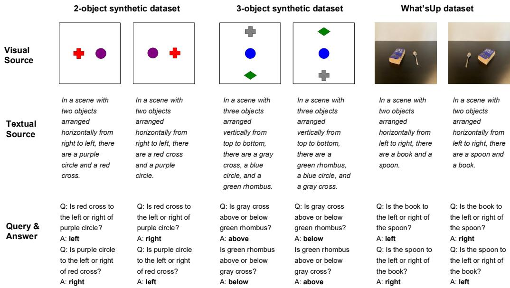  
Figure 8: Example data used in our experiments

## A DETAILS OF DATA CONSTRUCTION

Figure 8 shows representative examples from synthetic and natural-image datasets under visual and textual source conditions. For each scene, we construct reciprocal questions by swapping the target and reference objects, enabling analysis of whether models consistently update their answers when the underlying spatial relation is reversed.

We construct two controlled synthetic spatial-reasoning datasets: a two-object dataset and a threeobject dataset. Each image is rendered on a 336 × 336 white canvas, with objects placed at fixed anchor points on a 3 × 3 grid. Objects are defined as color-shape conjunctions. We use six colors, red, blue, green, yellow, purple, and gray, and six shapes, circle, square, triangle, cross, ellipse, and rhombus, yielding 36 distinct object types.

The three-object dataset is our primary setting. Each image contains three collinearly arranged objects placed on one of the three rows or one of the three columns. For each three-object scene, we generate six directed pairwise questions, covering all ordered relations among the three objects. Each question mentions only the queried target object and reference object, while the third object remains an unmentioned spectator. The model is required to answer with exactly one word from above, below, left, and right. We balance relation labels, horizontal versus vertical axes, and row/column layouts. The statistics of the synthetic datasets are displayed in Table 3.

Textual descriptions are generated by deterministic rules. For each scene, we generate a description of the object arrangement, such as “In a scene with three objects arranged horizontally from left to right, there are a red circle, a blue square, and a green triangle." We further generate two ordered scene descriptions that list the objects along the queried spatial axis in opposite directions: top-to-bottom and bottom-to-top for vertical layouts, and left-to-right and right-to-left for horizontal layouts. These textual descriptions preserve object identity and spatial structure while expressing scene information linguistically, enabling text-only and cross-modal control conditions.

## B BENCHMARKING MODELS, DATA AND NUMERICAL RESULTS

The details of the VLMs and their corresponding LLM backbones are displayed in Table 4.

Table 5 reports TF evaluation counts. Original images denotes distinct underlying scene images, including those represented by descriptions in the text conditions. A scene family groups images linked by location swaps and their query and description variants. Accuracy uses original queries;

Table 3: Statistics of the synthetic datasets used for mechanistic analyses. A scene denotes a unique rendered image, and a question denotes one directed target-reference query. “Each relation" reports the number of questions for each of {left, right, above, below}. Each two-object scene contains two reciprocal questions and therefore one target-reference pair. Each three-object scene contains all six directed questions among its three objects, corresponding to three reciprocal target-reference pairs.
<table><tr><td>Dataset</td><td>Split</td><td></td><td></td><td>Scenes Questions Horizontal Vertical</td><td></td><td>Each relation</td><td>Reciprocal pairs</td></tr><tr><td rowspan="4">Synthetic 2-object</td><td>Train</td><td>1,512</td><td>3,024</td><td>1,512</td><td>1,512</td><td>756</td><td>1,512</td></tr><tr><td>Validation</td><td>324</td><td>648</td><td>324</td><td>324</td><td>162</td><td>324</td></tr><tr><td>Test</td><td>648</td><td>1,296</td><td>648</td><td>648</td><td>324</td><td>648</td></tr><tr><td>Total</td><td>2,484</td><td>4,968</td><td>2,484</td><td>2,484</td><td>1,242</td><td>2,484</td></tr><tr><td rowspan="4">Synthetic 3-object</td><td>Train</td><td>504</td><td>3,024</td><td>1,512</td><td>1,512</td><td>756</td><td>1,512</td></tr><tr><td>Validation</td><td>108</td><td>648</td><td>324</td><td>324</td><td>162</td><td>324</td></tr><tr><td>Test</td><td>216</td><td>1,296</td><td>648</td><td>648</td><td>324</td><td>648</td></tr><tr><td>Total</td><td>828</td><td>4,968</td><td>2,484</td><td>2,484</td><td>1,242</td><td>2,484</td></tr></table>

Table 4: Architectures of benchmarked models. Layers denotes the number of transformer blocks in the language backbone.
<table><tr><td>VLM</td><td>Arch. type</td><td>LLM backbone</td><td>Layers</td></tr><tr><td>LLaVA-v1.5-7B</td><td>Projector-concat</td><td>Vicuna v1.5 (7B)</td><td>32</td></tr><tr><td>LLaVA-v1.5-13B</td><td>Projector-concat</td><td>Vicuna v1.5 (13B)</td><td>40</td></tr><tr><td>LLaVA-v1.6-Mistral-7B</td><td>Projector-concat</td><td>Mistral (7B)</td><td>32</td></tr><tr><td>LLaVA-v1.6-Vicuna-7B</td><td>Projector-concat</td><td>Vicuna v1.5 (7B)</td><td>32</td></tr><tr><td>LLaVA-v1.6-Vicuna-13B</td><td>Projector-concat</td><td>Vicuna v1.5 (13B)</td><td>40</td></tr><tr><td>Pixtral-12B</td><td>Projector-concat</td><td>Mistral (12B)</td><td>40</td></tr><tr><td>Qwen3-VL-4B</td><td>Embed-concat</td><td>Qwen3 (4B)</td><td>36</td></tr><tr><td>Qwen3-VL-8B</td><td>Embed-concat</td><td>Qwen3 (8B)</td><td>36</td></tr><tr><td>InternVL3.5-8B</td><td>ViT-MLP-LLM</td><td>Qwen3 (8B)</td><td>36</td></tr><tr><td>InternVL3.5-14B</td><td>ViT-MLP-LLM</td><td>Qwen3 (14B)</td><td>40</td></tr></table>

reversal consistency uses pairs of original queries; location-swap consistency pairs each original query with its swapped counterpart. Synthetic text conditions include two description variants per scene.

The equivalent numerical results of Figure 2 are displayed in Table 6.

## C ADDITIONAL ACTIVATION PATCHING RESULTS

In Figure 10, rows correspond to models and columns group the three input settings, VLM+image, VLM+text, and LLM+text, under two counterfactual corruptions: object-location swap and targetreference reversal. The x-axis denotes the patched layer, with V0 indicating the multimodal state before the language model. For each layer and token group, we patch clean residual activations into the corrupted run and report the fraction of examples for which the clean-answer margin is restored. Visual source tokens dominate recovery for VLM+image under object-location swaps, whereas the joint target-reference query span is most effective under target-reference reversal. In text-based settings, recovery is distributed across description object/location spans and query object spans, while late-layer final-token patching recovers the answer across models.

The intervention setup in Figure 11 is the same as in Figure 10, but the y-axis reports normalized recovery of the clean-over-corrupt answer margin. Values closer to one indicate stronger recovery toward the clean computation. The score-based results mirror the restoration-rate patterns: visual source representations provide the strongest causal signal for VLM+image under object-location swaps, joint target-reference query states are critical for target-reference reversal, and late final-token states encode the downstream answer decision.

Table 5: Evaluation counts for Figure 2 and Table 6. Counts are per evaluated model; text conditions pool the available description variants.
<table><tr><td>Dataset</td><td>Condition</td><td>Original images</td><td>Scene families</td><td>queries</td><td>Original Reversal pairs</td><td>Swap anchors</td></tr><tr><td rowspan="3">Synthetic 2-object</td><td>VLM+image</td><td>128</td><td>128</td><td>256</td><td>128</td><td>256</td></tr><tr><td>VLM+text</td><td>128</td><td>128</td><td>512</td><td>256</td><td>512</td></tr><tr><td>LLM+text</td><td>128</td><td>128</td><td>512</td><td>256</td><td>512</td></tr><tr><td rowspan="3">Synthetic 3-object</td><td>VLM+image</td><td>128</td><td>128</td><td>256</td><td>128</td><td>256</td></tr><tr><td>VLM+text</td><td>128</td><td>128</td><td>512</td><td>256</td><td>512</td></tr><tr><td>LLM+text</td><td>128</td><td>128</td><td>512</td><td>256</td><td>512</td></tr><tr><td rowspan="3">What&#x27;sUp-A</td><td>VLM+image</td><td>180</td><td>132</td><td>360</td><td>180</td><td>360</td></tr><tr><td>VLM+text</td><td>180</td><td>136</td><td>360</td><td>180</td><td>360</td></tr><tr><td>LLM+text</td><td>180</td><td>134</td><td>360</td><td>180</td><td>360</td></tr><tr><td rowspan="3">What&#x27;sUp-B</td><td>VLM+image</td><td>204</td><td>154</td><td>408</td><td>204</td><td>408</td></tr><tr><td>VLM+text</td><td>204</td><td>151</td><td>408</td><td>204</td><td>408</td></tr><tr><td>LLM+text</td><td>204</td><td>155</td><td>408</td><td>204</td><td>408</td></tr></table>

Table 6: Numerical benchmarking results for VLM+image, VLM+text, and the corresponding LLM+text backbone. Synthetic includes the two- and three-object 2D sets, and What'sUp includes subsets A and B.
<table><tr><td rowspan="2">Model</td><td colspan="3">Accuracy</td><td colspan="3">Target-reference reversal consistency</td><td colspan="3">Location-swap consistency</td></tr><tr><td>VLM+ image</td><td>VLM+ text</td><td>LLM+ text</td><td>image</td><td>VLM+ VLM+ LLM+ text</td><td>text</td><td>VLM+ VLM+ LLM+ image</td><td>text</td><td>text</td></tr><tr><td colspan="10">(a) Synthetic</td></tr><tr><td>LLaVA-1.5-7B</td><td>92.58</td><td>56.84</td><td>50.00</td><td>85.94</td><td>48.44</td><td>0.00</td><td>83.59</td><td>47.66</td><td>0.00</td></tr><tr><td>LLaVA-1.5-13B</td><td>97.85</td><td>57.13</td><td>50.00</td><td>95.70</td><td>34.57</td><td>0.00</td><td>95.90</td><td>33.50</td><td>0.00</td></tr><tr><td>LLaVA-1.6-Mistral-7B</td><td>99.22</td><td>63.77</td><td>44.92</td><td>98.44</td><td>46.09</td><td>24.80</td><td>96.68</td><td>43.36</td><td>18.95</td></tr><tr><td>LLaVA-1.6-Vicuna-7B</td><td>96.29</td><td>56.05</td><td>50.00</td><td>92.58</td><td>50.39</td><td>0.00</td><td>92.97</td><td>48.44</td><td>0.00</td></tr><tr><td>LLaVA-1.6-Vicuna-13B</td><td>90.82</td><td>55.37</td><td>50.00</td><td>81.64</td><td>30.66</td><td>0.00</td><td>80.47</td><td>29.00</td><td>0.00</td></tr><tr><td>InternVL3.5-8B</td><td>100.00</td><td>94.73</td><td>85.84</td><td>100.00</td><td>89.84</td><td>72.27</td><td>100.00</td><td>88.87</td><td>68.26</td></tr><tr><td>InternVL3.5-14B</td><td>100.00</td><td>92.48</td><td>90.43</td><td>100.00</td><td>87.11</td><td>80.86</td><td>100.00</td><td>87.30</td><td>81.93</td></tr><tr><td>Qwen3-VL-4B</td><td>100.00</td><td>80.66</td><td>79.00</td><td>100.00</td><td>66.21</td><td>58.20</td><td>100.00</td><td>63.96</td><td>58.50</td></tr><tr><td>Qwen3-VL-8B</td><td>100.00</td><td>83.11</td><td>85.84</td><td>100.00</td><td>68.36</td><td>72.27</td><td>100.00</td><td>66.41</td><td>68.26</td></tr><tr><td>Pixtral-12B</td><td>100.00</td><td>90.14</td><td>75.59</td><td>100.00</td><td>80.47</td><td>51.17</td><td>100.00</td><td>78.91</td><td>51.76</td></tr><tr><td colspan="10">(b) What&#x27;sUp</td></tr><tr><td>LLaVA-1.5-7B</td><td>85.35</td><td>62.46</td><td>52.86</td><td>75.15</td><td>52.43</td><td>7.63</td><td>72.57</td><td>35.77</td><td>7.51</td></tr><tr><td>LLaVA-1.5-13B</td><td>88.85</td><td>66.73</td><td>50.61</td><td>83.53</td><td>46.34</td><td>2.94</td><td>77.39</td><td>38.45</td><td>2.94</td></tr><tr><td>LLaVA-1.6-Mistral-7B</td><td>88.85</td><td>66.63</td><td>45.43</td><td>81.03</td><td>47.21</td><td>19.92</td><td>78.31</td><td>36.24</td><td>16.45</td></tr><tr><td>LLaVA-1.6-Vicuna-7B</td><td>89.15</td><td>61.95</td><td>52.86</td><td>83.51</td><td>57.66</td><td>7.63</td><td>78.75</td><td>35.07</td><td>7.51</td></tr><tr><td>LLaVA-1.6-Vicuna-13B</td><td>88.97</td><td>68.84</td><td>50.61</td><td>83.09</td><td>50.39</td><td>2.94</td><td>76.50</td><td>42.09</td><td>2.94</td></tr><tr><td>InternVL3.5-8B</td><td>93.60</td><td>85.18</td><td>64.22</td><td>89.36</td><td>74.36</td><td>30.95</td><td>86.53</td><td>70.11</td><td>36.36</td></tr><tr><td>InternVL3.5-14B</td><td>96.32</td><td>88.33</td><td>90.52</td><td>94.30</td><td>85.18</td><td>81.81</td><td>92.23</td><td>76.95</td><td>81.65</td></tr><tr><td>Qwen3-VL-4B</td><td>94.72</td><td>70.39</td><td>63.20</td><td>92.22</td><td>42.81</td><td>29.12</td><td>88.49</td><td>41.90</td><td>24.81</td></tr><tr><td>Qwen3-VL-8B</td><td>94.31</td><td>80.48</td><td>64.22</td><td>89.17</td><td>63.58</td><td>30.95</td><td>88.49</td><td>62.04</td><td>36.36</td></tr><tr><td>Pixtral-12B</td><td>84.49</td><td>81.99</td><td>72.56</td><td>72.88</td><td>65.82</td><td>46.50</td><td>70.33</td><td>63.43</td><td>45.53</td></tr></table>

VLM+text includes a white blank image. Synthetic uses 256 scene families; What'sUp uses 286/287/289 for VLM+image/VLM+text/LLM+text. Models sharing a language backbone share LLM+text results.

Table 7: Token groups patched in all experiments in section 4. t means target object and r means reference object.
<table><tr><td>Stage</td><td>Legend label</td><td>Tokens</td></tr><tr><td>source</td><td>all visual tokens</td><td>every image token (C1 only)</td></tr><tr><td>source</td><td>object bbox pairs</td><td>image tokens inside the bounding boxes of t and r</td></tr><tr><td>source</td><td>object strip pairs</td><td>image tokens in the row (or column) strips through t and r</td></tr><tr><td>source</td><td>desc objects</td><td>description spans naming t and r (C2, C3)</td></tr><tr><td>source</td><td>desc locations</td><td>description spans stating the arrangement (C2, C3)</td></tr><tr><td>query</td><td>target + reference object</td><td>the query spans mentioning t and r, patched jointly</td></tr><tr><td>query</td><td>relation option words</td><td>the two relation words offered in the query</td></tr><tr><td>final</td><td>last token</td><td>the final input position before answer generation</td></tr></table>

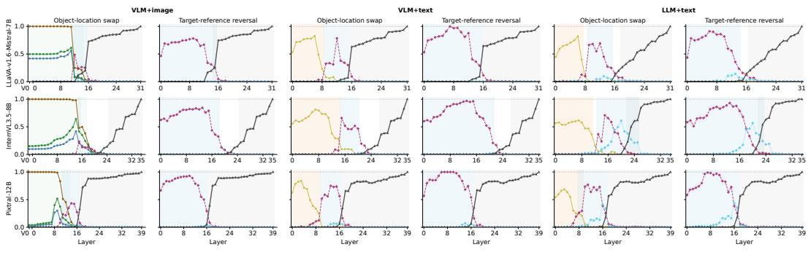  
source: all visual tokenssource: object bbox pairssource: object strip pairssource: desc all objectsquery: target + reference objectquery: relation option words last token  
Figure 9: Layer-wise activation patching continuous restore score across input conditions, token sources, corruption types and models in 3-object synthetic dataset.

Figure 9 uses the same interventions as in Figure 3 to measure normalized recovery of the clean answer margin after patching each token group at each layer. The margin-based results confirm that distractors do not remove the main causal structure: source-side visual tokens dominate VLM+image recovery for object-location swaps, query-side target-reference representations drive recovery for target-reference reversal, and late final-token states recover the final answer decision across models and input settings.

## D LOCATION ID VALIDATION RESULTS

We summarize the held-out recovery of extracted location IDs across three models and three input conditions in Figure 12. For both 2-object and 3-object location IDs, source-side and query-side IDs (g = src and g = qry, labeled “source object" and “query object" in the figure) yield high best-layer recovery across LLaVA-1.6, InternVL3.5 and Pixtral-12B, while label-shuffled controls remain substantially lower. This supports that the extracted IDs reflect genuine object-position binding rather than artifacts of object identity or token statistics.

We visualize the geometry of the extracted location ID prototypes by projecting them onto the spatial axes induced by the IDs themselves. In the 2-object location-ID setting, left/right and above/below prototypes separate along the corresponding horizontal and vertical directions across all three models. In the 3-object location-ID setting, the prototypes form an ordered geometry: left/middle/right and above/center/below are arranged consistently with the ordering of their underlying spatial positions. These results in Figure 13 show that the extracted IDs are not only decodable by a classifier, but also organized in a geometrically meaningful space.

We further test whether location information at query-object mentions supports relational comparison. For each model and input setting, we project the difference between the two query-object states onto the extracted query-side spatial axis vqry and use the sign of this projection to predict their relative direction. As shown in Figure 14, the extracted axes achieve consistently high relation sign accuracy under VLM+image, VLM+text and LLM+text settings, while matched orthogonal control axes remain close to chance. This suggests that the extracted IDs are not merely decodable position labels, but define axes along which object-level location information is directly comparable.

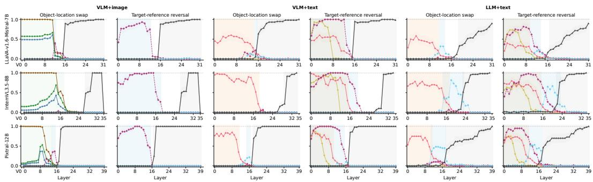  
source: all visual tokenssource: object bbox pairssource: object strip pairssource: desc objectssource: desc locationsquery: target + reference objectquery: relation option words last token

Figure 10: Layer-wise activation patching clean-answer recovery rate across input conditions, token sources, corruption types and models in 2-object synthetic dataset.  
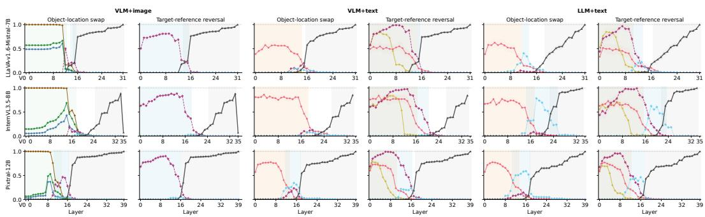  
source: all visual tokenssource: object bbox pairssource: object strip pairs source: desc objectssource: desc locations-query: target + reference objectquery: relation option wordslast token  
Figure 11: Layer-wise activation patching continuous restore score across input conditions, token sources, corruption types and models in 2-object synthetic dataset.

## E ROLE DIRECTION INTERVENTION RESULTS

Intervention-strength curves. To complement the layer-wise role-direction intervention results in the main text, we report intervention-strength curves within the selected layer bands. As shown in Figure 15, increasing the steering strength (α) generally makes the role-specific margin gap more negative relative to the orthogonal control. This strength-dependent effect supports the claim that the extracted target/reference role direction is causally involved in role-sensitive answer selection.

Steering configurations. Table 9 lists the intervention layers and strengths used for What'sUp and COCO-spatial evaluation. Layers follow the previously selected synthetic-validation policy, while strengths are selected on separate synthetic two-object validation data.

Synthetic held-out steering results. We also evaluate whether role-direction steering improves prediction on synthetic held-out examples, using directions and hyperparameters selected only on synthetic validation data. Table 8 shows that steering often improves target-reference reversal and location-swap consistency, especially in text-based conditions where the baseline is lower and there is more room for improvement. In contrast, VLM+image results are frequently saturated, leaving little room for additional gains. These results provide an in-domain counterpart to the What'sUp transfer results in the main text and show that the same role-direction intervention can improve paired consistency without updating model parameters.

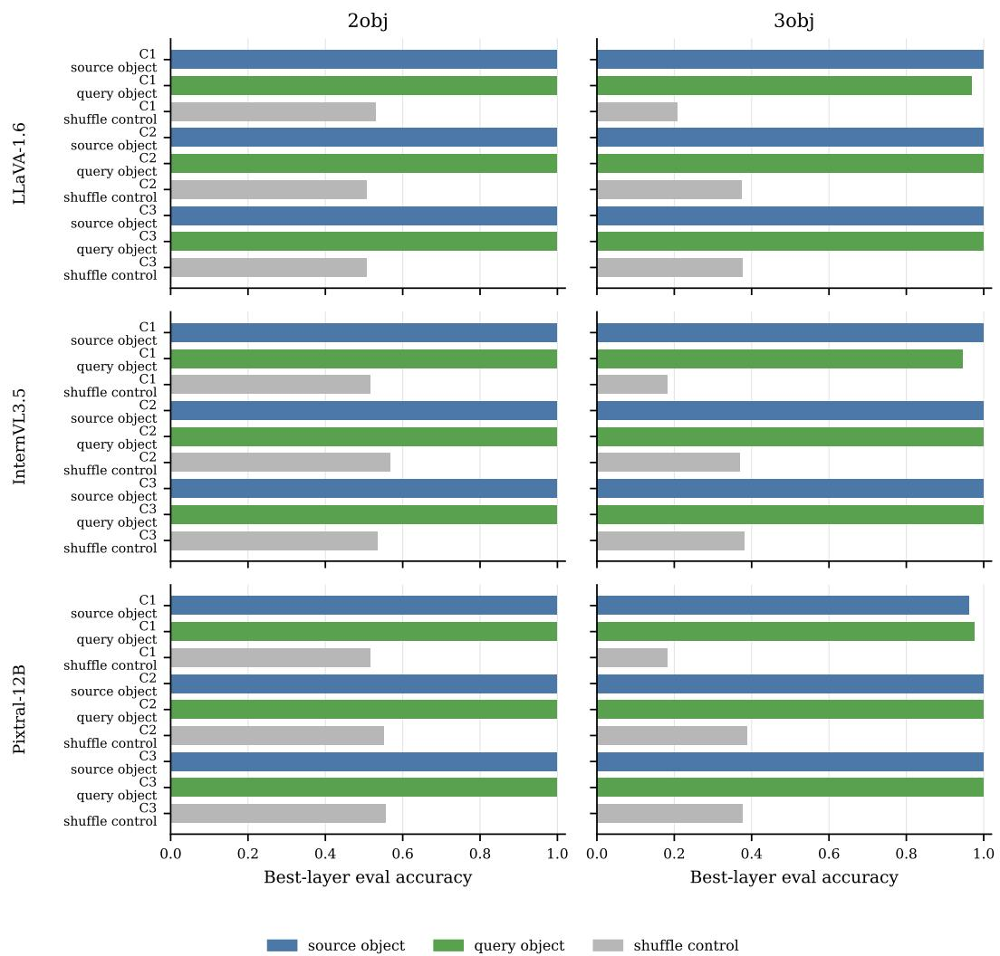  
Figure 12: Held-out recovery and shuffle controls for extracted location IDs.

COCO-spatial steering results. To evaluate the transfer of role-direction steering to natural images, we conduct experiments on the two-object subset of COCO-Spatial, comprising 440 annotated object pairs across 295 images. For each model, we reuse the joint target/reference role direction, intervention layer, and steering strength determined on synthetic data, without retuning them on COCO-Spatial. We compare baseline and steered responses using accuracy on the original query and target-reference reversal consistency, which requires both the original and reversed questions to be answered correctly. The results are displayed in Table 10.

GQA-spatial steering results. We further evaluate the transfer of role-direction steering on the left/right subset of the two-object GQA-Spatial benchmark, comprising 264 spatial-relation annotations across 233 images. For each model, we reuse the joint target/reference role direction, intervention layer, and steering strength determined on synthetic data, without retuning them on GQA-Spatial. We compare baseline and steered responses using accuracy on the original query and target-reference reversal consistency, which requires both the original and reversed questions to be answered correctly. The results are displayed in Table 11.

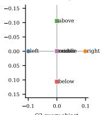

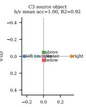

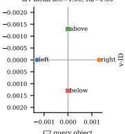

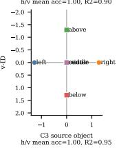

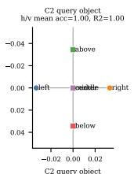

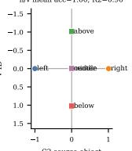

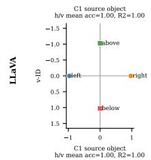

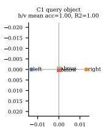

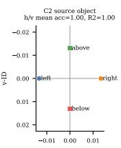

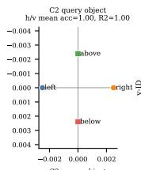

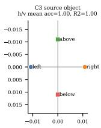

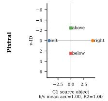

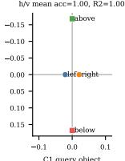

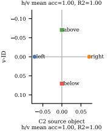

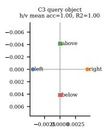

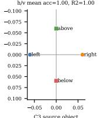

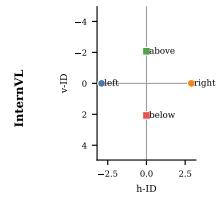

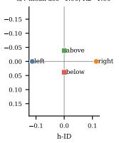

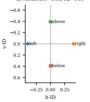

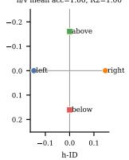  
(a) 2-object location IDs.

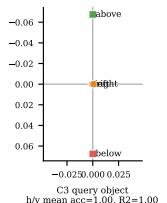

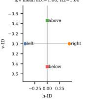

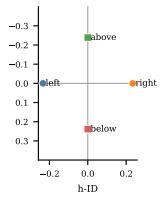

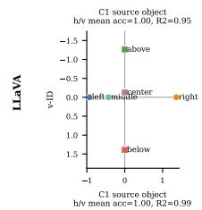

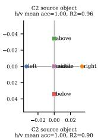

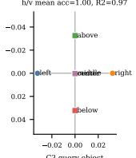

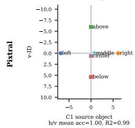

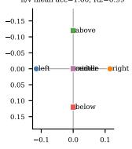

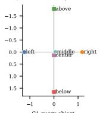

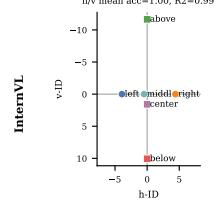

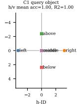

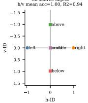

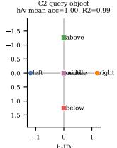  
(b) 3-object location IDs.

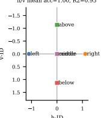

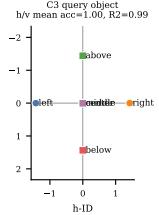

Figure 13: Location-ID prototypes projected onto axes defined by endpoint-ID contrasts. Three-object plots additionally show the positions of middle-location prototypes relative to the endpoints.

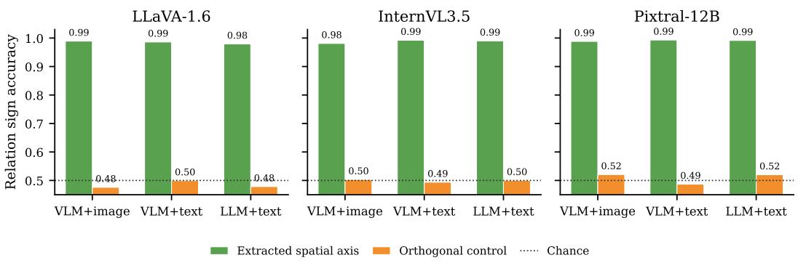  
Figure 14: Query-side location information supports relational comparison across models. For each model and input setting, we project the difference between the two query-object states onto the extracted query-side spatial axis and evaluate whether the projection sign predicts their relative direction. Extracted axes achieve high relation sign accuracy, whereas matched orthogonal control axes remain close to chance.

Table 8: Activation steering on synthetic held-out data using the joint role direction $r = ( d _ { \mathrm { T F } } +$ $d _ { \mathrm { R F } } ) / 2$ estimated on synthetic training data.
<table><tr><td>Data</td><td>Model</td><td>Condition</td><td>Accuracy</td><td>Target-Reference Reversal Consistency</td><td>Location-Swap Consistency</td></tr><tr><td>2obj</td><td>LLaVA</td><td>VLM+image</td><td>99.8 → 100.0 (+0.2)</td><td>99.6 → 100.0 (+0.4)</td><td>99.4 → 100.0 (+0.6)</td></tr><tr><td>2obj</td><td>LLaVA</td><td>VLM+text</td><td>58.6 → 60.4 (+1.9)</td><td>42.0 → 46.3 (+4.3)</td><td>40.8 → 45.4 (+4.6)</td></tr><tr><td>2obj</td><td>LLaVA</td><td>LLM+text</td><td>55.3 → 59.8 (+4.5)</td><td>36.5 → 38.1 (+1.6)</td><td>31.3 → 34.4 (+3.1)</td></tr><tr><td>2obj</td><td>InternVL</td><td>VLM+image</td><td>100.0 → 100.0 (+0.0)</td><td>100.0 → 100.0 (+0.0)</td><td>100.0 → 100.0 (+0.0)</td></tr><tr><td>2obj</td><td>InternVL</td><td>VLM+text</td><td>90.1 → 93.3 (+3.1)</td><td>85.2 → 88.9 (+3.7)</td><td>81.1 → 85.5 (+4.5)</td></tr><tr><td>2obj</td><td>InternVL</td><td>LLM+text</td><td>76.1 → 77.4 (+1.4)</td><td>52.7 → 55.9 (+3.1)</td><td>50.6 → 52.9 (+2.3)</td></tr><tr><td>2obj</td><td>Pixtral</td><td>VLM+image</td><td>100.0 → 100.0 (+0.0)</td><td>100.0 → 100.0 (+0.0)</td><td>100.0 → 100.0 (+0.0)</td></tr><tr><td>2obj</td><td>Pixtral</td><td>VLM+text</td><td>90.0 → 90.4 (+0.4)</td><td>80.3 → 82.4 (+2.1)</td><td>78.9 → 80.6 (+1.7)</td></tr><tr><td>2obj</td><td>Pixtral</td><td>LLM+text</td><td>82.5 → 85.8 (+3.3)</td><td>65.0 → 71.7 (+6.6)</td><td>65.5 → 69.8 (+4.3)</td></tr><tr><td>3obj</td><td>LLaVA</td><td>VLM+image</td><td>98.0 → 99.0 (+1.0)</td><td>96.1 → 98.0 (+2.0)</td><td>93.6 → 96.1 (+2.5)</td></tr><tr><td>3obj</td><td>LLaVA</td><td>VLM+text</td><td>73.6 → 75.8 (+2.1)</td><td>60.5 → 63.9 (+3.3)</td><td>57.2 → 60.7 (+3.5)</td></tr><tr><td>3obj</td><td>LLaVA</td><td>LLM+text</td><td>55.0 → 63.5 (+8.5)</td><td>32.0 → 39.5 (+7.4)</td><td>28.6 → 32.9 (+4.3)</td></tr><tr><td>3obj</td><td>InternVL</td><td>VLM+image</td><td>99.8 → 100.0 (+0.2)</td><td>99.6 → 100.0 (+0.4)</td><td>99.8 → 100.0 (+0.2)</td></tr><tr><td>3obj</td><td>InternVL</td><td>VLM+text</td><td>96.7 → 97.0 (+0.3)</td><td>93.8 → 94.1 (+0.4)</td><td>93.1 → 94.7 (+1.7)</td></tr><tr><td>3obj</td><td>InternVL</td><td>LLM+text</td><td>83.1 → 82.6 (−0.5)</td><td>66.6 → 66.0 (−0.6)</td><td>62.7 → 61.9 (−0.8)</td></tr><tr><td>3obj</td><td>Pixtral</td><td>VLM+image</td><td>100.0 → 100.0 (+0.0)</td><td>100.0 → 100.0 (+0.0)</td><td>100.0 → 100.0 (+0.0)</td></tr><tr><td>3obj</td><td>Pixtral</td><td>VLM+text</td><td>88.1 → 90.1 (+2.1)</td><td>78.1 → 82.0 (+3.9)</td><td>76.8 → 81.4 (+4.7)</td></tr><tr><td>3obj</td><td>Pixtral</td><td>LLM+text</td><td>72.6 → 76.6 (+4.0)</td><td>45.1 → 53.1 (+8.0)</td><td>44.2 → 52.1 (+7.8)</td></tr></table>

Table 9: Intervention configurations estimated on synthetic 2-object data for What'sUp and COCOspatial steering. Each cell represents selected layer number/α value.
<table><tr><td>Model</td><td>VLM+image</td><td>VLM+text</td><td>LLM+text</td></tr><tr><td>LLaVA-1.6</td><td>10/1.5</td><td>10/1.5</td><td>6/1.5</td></tr><tr><td>InternVL3.5</td><td>12/1.0</td><td>15/1.5</td><td>14/1.0</td></tr><tr><td>Pixtral</td><td>9/1.5</td><td>8/1.5</td><td>6/1.0</td></tr></table>

  
Figure 15: Intervention-strength curves in the selected layer bands. The y-axis uses the same direction-specific margin gap as in Figure 7.

Table 10: Activation steering results of the joint target/reference role direction on COCO-Spatial. Bold changes indicate improvements with 95% confidence intervals excluding zero. Location-swap consistency is unavailable because the evaluated subset does not contain paired original and locationswapped scenes.
<table><tr><td>Model</td><td>Condition</td><td>Accuracy</td><td>Target-Reference Reversal Consistency</td><td>Location-Swap Consistency</td></tr><tr><td>LLaVA-1.6</td><td>VLM+image</td><td>93.2 → 94.5 (+1.4)</td><td>87.7 → 91.1 (+3.4)</td><td>N/A</td></tr><tr><td>LLaVA-1.6</td><td>VLM+text</td><td>69.9 → 69.2 (−0.7)</td><td>45.1 → 48.0 (+2.8)</td><td>N/A</td></tr><tr><td>LLaVA-1.6</td><td>LLM+text</td><td>64.0 → 66.9 (+3.0)</td><td>36.9 → 39.2 (+2.3)</td><td>N/A</td></tr><tr><td>InternVL3.5</td><td>VLM+image</td><td>97.0 → 97.0 (+0.0)</td><td>93.9 → 94.8 (+0.9)</td><td>N/A</td></tr><tr><td>InternVL3.5</td><td>VLM+text</td><td>88.1 → 93.0 (+4.9)</td><td>82.0 → 89.4 (+7.4)</td><td>N/A</td></tr><tr><td>InternVL3.5</td><td>LLM+text</td><td>71.5 → 76.5 (+5.0)</td><td>49.2 → 62.4 (+13.2)</td><td>N/A</td></tr><tr><td>Pixtral</td><td>VLM+image</td><td>90.2 → 91.8 (+1.6)</td><td>81.4 → 83.6 (+2.3)</td><td>N/A</td></tr><tr><td>Pixtral</td><td>VLM+text</td><td>85.2 → 85.1 (−0.1)</td><td>68.4 → 71.7 (+3.3)</td><td>N/A</td></tr><tr><td>Pixtral</td><td>LLM+text</td><td>76.3 → 78.2 (+1.9)</td><td>49.5 → 52.8 (+3.3)</td><td>N/A</td></tr></table>

Table 11: Activation steering results of the joint target/reference role direction on the left/right subset of GQA-Spatial. Bold changes indicate improvements with 95% confidence intervals excluding zero.
<table><tr><td>Model</td><td>Condition</td><td>Accuracy</td><td>Target-Reference Reversal Consistency</td><td>Location-Swap Consistency</td></tr><tr><td>LLaVA-1.6</td><td>VLM+image</td><td> $9 3 . 6  9 5 . 8 ( + 2 . 3 )$ </td><td> $9 0 . 9  9 3 . 9 ~ ( + \bf { 3 . 0 } )$ </td><td>N/A</td></tr><tr><td>LLaVA-1.6</td><td>VLM+text</td><td> $5 7 . 6 \to 5 8 . 0 ( + 0 . 4 )$ </td><td> $4 9 . 8  4 9 . 6 ~ ( - 0 . 2 )$ </td><td>N/A</td></tr><tr><td>LLaVA-1.6</td><td>LLM+text</td><td>44.5 → 48.5 (+4.0)</td><td>13.1 → 19.1 (+6.1)</td><td>N/A</td></tr><tr><td>InternVL3.5</td><td>VLM+image</td><td>98.1 → 98.5 (+0.4)</td><td>97.7 → 97.7 (+0.0)</td><td>N/A</td></tr><tr><td>InternVL3.5</td><td>VLM+text</td><td>81.6 → 88.1 (+6.4)</td><td>71.8 → 83.1 (+11.4)</td><td>N/A</td></tr><tr><td>InternVL3.5</td><td>LLM+text</td><td>72.2 → 77.7 (+5.5)</td><td>48.3 → 66.1 (+17.8)</td><td>N/A</td></tr><tr><td>Pixtral</td><td>VLM+image</td><td>95.8 → 96.2 (+0.4)</td><td>92.8 → 93.9 (+1.1)</td><td>N/A</td></tr><tr><td>Pixtral</td><td>VLM+text</td><td>75.6 → 78.0 (+2.5)</td><td>53.4 → 59.8 (+6.4)</td><td>N/A</td></tr><tr><td>Pixtral</td><td>LLM+text</td><td>58.0 → 60.2 (+2.3)</td><td>21.8 → 25.6 (+3.8)</td><td>N/A</td></tr></table>

## F IMPLEMENTATION DETAILS AND COMPUTE RESOURCES

Hardware. Model inference and GPU-based interventions were run on a shared cluster using one single NVIDIA A100-SXM4 GPU with 40 GB of device memory. Analyses operating on cached activations, including location-ID estimation, were also scheduled as separate CPU jobs.

Software and intervention implementation. The evaluation environment used Python 3.13.1, PyTorch 2.9.1 with CUDA 12.8, Hugging Face Transformers 4.57.6, and Accelerate 1.12.0. Activation extraction, activation patching, location-ID interventions, and role-direction steering were implemented using custom PyTorch forward and forward-pre hooks. During autoregressive generation, interventions on prompt-token representations were applied during prefill. Pretrained model parameters remained frozen throughout these experiments.

Numerical precision. Models were evaluated without weight quantization. LLaVA models, Vicuna backbones, and Mistral-7B used FP16 in the aligned evaluation and intervention pipeline. Pixtral-12B, Mistral-Nemo-12B, InternVL3.5, and the Qwen3/Qwen3-VL models used BF16.

Inputs and decoding. We used greedy decoding with sampling disabled. The aligned behavioral benchmark and the main constructive role-direction steering evaluations used a maximum of eight new tokens. In the VLM+text condition, the model received a textual scene description together with a blank white image. Generated-answer correctness was evaluated from the decoded response. Candidate-answer scores were evaluated separately: single-token labels were scored at the final prompt position, while multi-token labels, where required, were scored using teacher-forced sequence log-likelihoods.

Random-direction controls. For the main role-direction experiments, random-control results were averaged over five seeds, {42, 43, 44, 45, 46}. Control directions were orthogonal to the corresponding role direction and matched in norm, using the same intervention sites and strengths. The seeds controlled the construction of random directions, and answer generation remained greedy.

Uncertainty estimates. We estimate pointwise 95% confidence intervals for steered-minus-baseline metric differences using a paired cluster bootstrap with 2,000 replicates. We use random seed 20260816 for What'sUp and 20260821 for COCO-Spatial and GQA-Spatial. The resampling unit is the scene family for What'sUp and the original image for COCO-Spatial and GQA-Spatial. Queries and variants within each unit share the same resampling multiplicity, with baseline and steered outcomes kept paired. Each replicate preserves the original metric definitions and aggregation weights. Intervals are defined by the 2.5th and 97.5th percentiles of the resulting differences.