# WM-VLM: Probing Internal World Models for Interleaved Visual-Textual Reasoning

Yuheng Zha1,2,†, Yilei Wang1, Qiyue Gao1, Junrong Chen1, Yujia Wu1, Zhengfeng Lai2, Zhengzhong Liu2, Eric P. Xing2,3

1UC San Diego, 2Institute of Foundation Models, MBZUAI, 3Carnegie Mellon University †Work done while interning at IFM

Humans often solve spatial problems by mentally simulating visual transformations. In contrast, conventional vision-language models (VLMs) reason primarily through language. We investigate whether VLMs can solve spatial problems by reasoning with both text and generated visual states. To this end, we introduce WM-VLM, which equips a pretrained VLM with a lightweight world model branch for generating intermediate visual states. Our two-stage training first teaches the model to generate the next visual state and then to use that state for reasoning. We programmatically construct spatial reasoning tasks with verifiable intermediate visual states. These tasks allow us to evaluate how well the model generates visual states and how much it relies on them to answer the question. On 2D and 3D mental rotation tasks, WM-VLM consistently outperforms the supervised fine-tuned backbone, with gains of up to 39.25 percentage points. Ablations suggest that these gains depend on the generated visual states, as removing or corrupting them sharply reduces performance. Together, these results suggest that internal world models ofer a promising path toward VLMs that reason in both language and visual space.

Date: September 29, 2026 Correspondence: Yuheng Zha <yzha@ucsd.edu>

## 1 Introduction

Spatial reasoning is a fundamental human ability that often involves mentally simulating visual transformations (Kosslyn et al., 1978; Shepard and Metzler, 1971). For example, to determine whether turning right would bring them closer to a chair, people can mentally simulate the turn and its visual outcome. However, prior work has documented persistent weaknesses in the spatial reasoning capabilities of VLMs (Kamath et al., 2023; Stogiannidis et al., 2025; Zhang et al., 2026b; Yang et al., 2025a; Góral et al., 2024). One possible limitation is that conventional VLMs perform intermediate reasoning primarily through text, even for visually grounded problems. Although recent reasoning VLMs perform well on mathematical and chart-based tasks (Huang et al., 2026; Yang et al., 2025b; Chen et al., 2025; Zha et al., 2026; Masry et al., 2025), many of these tasks can be solved primarily through language. Reasoning through text alone may fail to preserve the visual information needed to solve spatial problems.

Recent work seeks to enable VLMs to reason in both visual and textual spaces. Some methods use cropped or highlighted images as intermediate visual cues (Li et al., 2026a; Liu et al., 2026; Li et al., 2026b; Zhang et al., 2026a; Gao et al., 2025). These methods manipulate existing visual inputs rather than predict new visual states. Other methods interleave textual reasoning with generated visual states (Gu et al., 2026; Li et al., 2025; Yang et al., 2026b; Wang et al., 2026; Hu et al., 2026), but they are often evaluated on planning tasks, where state prediction and action planning jointly determine performance. A separate line of work uses VLMs as reasoning policies that query external world models to generate imagined observations (Yang et al., 2026a; Yu et al., 2026; Zhu et al., 2026). Although efective, these approaches delegate visual state prediction to a separate model, leaving open whether a VLM itself can learn to predict intermediate visual states that improve its spatial reasoning.

Motivated by work that frames visual generation as a form of world modeling (Wu et al., 2026; Jin et al., 2026), we study whether an internal world model can improve spatial reasoning in VLMs. Standard VLM training typically supervises only text outputs, providing no direct objective for predicting intermediate visual states. To address this limitation, we introduce WM-VLM, a VLM equipped with an internal world model. Inspired by Mixture-of-Transformers (Liang et al., 2024), WM-VLM incorporates a shallow generation branch that supports its internal world modeling capability. Accurately generating visual states, however, does not necessarily mean that the model can use them for reasoning. We therefore adopt a two-stage training strategy: the model first learns to generate intermediate visual states and then learns to reason with its own predictions. We train the model with both vision-language understanding and visual-state generation objectives. To isolate world modeling from action planning, we programmatically construct two controlled diagnostic datasets, Tetris-2D and Tetris-3D. Both datasets provide explicit, verifiable intermediate states, allowing us to separately evaluate visual-state prediction and downstream reasoning.

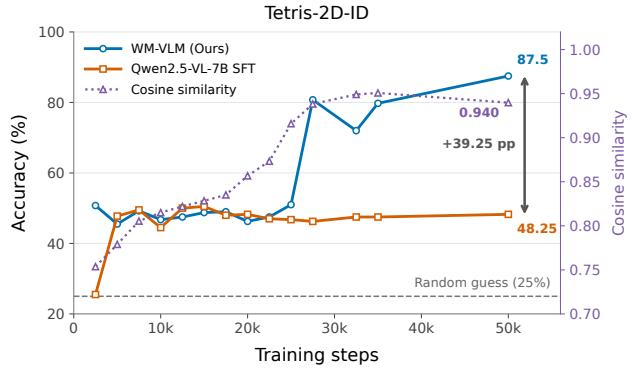

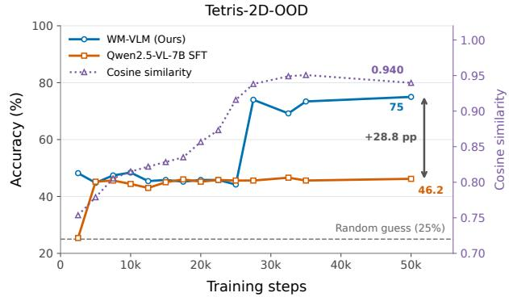  
Figure 1 The internal world model module and training objective positively contributes to solving spatial-related problems, which finally helps outperform the finetuned base VLM. WM-VLM exhibits a sudden performance transition at around step 25k, then plateaued, yielding a 39.25 points gain on ID set and 28.8 points gain on OOD set. We train WM-VLM with the middle-layer configuration and evaluate each checkpoint on Tetris-2D-ID (left) and Tetris-2D-OOD (right) splits. Training step indicates the training steps taken in Stage 1. All data points are obtained following an additional Stage 2 training. Each panel compares the accuracy of WM-VLM and Qwen2.5-VL-7B SFT (left axis). We also show the cosine similarity between the generated visual states and ground truth embedding during training (right axis, in purple). The dashed horizontal line indicates random-guess accuracy (25%).

Our experiments show that WM-VLM outperforms the fine-tuned backbone by 16.30–39.25 percentage points across Tetris-2D and Tetris-3D. Replacing or corrupting its generated visual states substantially reduces performance, indicating that the model actively uses these states for reasoning. Training analyses further reveal that generated visual states become useful only after reaching suficient quality, and that joint training from scratch fails under the tested setting. Moreover, a lightweight four-layer generation branch performs comparably to its full-depth counterpart. Together, these results suggest that efective visual reasoning requires not only generating informative visual states but also learning to use them. More broadly, our controlled study provides evidence that internal world modeling can enable VLMs to reason across visual and textual spaces, a capability that supports spatial reasoning and could ultimately serve as a foundation for embodied agents.

## 2 Related Work

Visual Reasoning with VLMs Vision-language models are first trained to reason in textual space, where model generates long chain-of-thought textual reasoning to solve a problem (Huang et al., 2026; Yang et al., 2025b; Chen et al., 2025; Zha et al., 2026; Masry et al., 2025). Previous work usually evaluate their model on STEM, charts or common sense related benchmarks, e.g., MathVista (Lu et al., 2024), MMMU (Yue et al., 2024), ChartQA (Masry et al., 2022). However, not all vision-related tasks are well suited to textual reasoning. Prior work suggests that visuospatial tasks involving transformation, localization, or state tracking benefit more from visual intermediates or pixel-space operations than from purely textual reasoning (Larkin and Simon, 1987; Hu et al., 2024; Su et al., 2026).

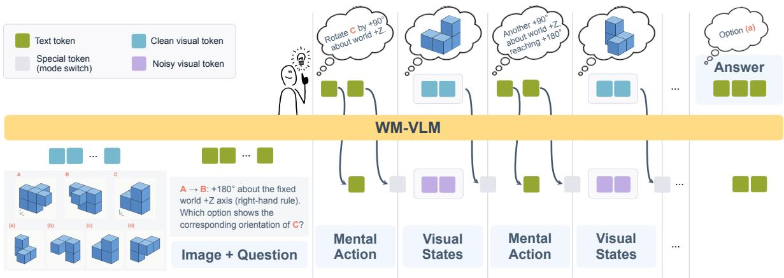  
Figure 2 WM-VLM performs interleaved visual-textual reasoning by alternating between textual mental actions and generated visual states, before producing the final answer.

Interleaved Visual-Textual Reasoning Prior work represents intermediate visual states in several forms and generates them through diferent mechanisms. Visual Sketchpad (Hu et al., 2024) and Pixel Reasoner (Su et al., 2026) use external tools to edit input images (e.g., by zooming or cropping), treating the resulting images as intermediate states. MindJourney (Yang et al., 2026a) and DreamPlan (Jia et al., 2026) invoke external world models to simulate future scenarios. Other methods use unified models, such as Anole (Chern et al., 2024) and BAGEL (Deng et al., 2025), to generate intermediate reasoning images (Chern et al., 2025; Gu et al., 2026). Mirage (Yang et al., 2026b), LVR (Li et al., 2026a), and Monet (Wang et al., 2026) train base VLMs to produce continuous visual latents, whereas LatentUM (Jin et al., 2026) produces discrete visual tokens. Recent analyses, however, question whether models with interleaved visual-textual reasoning causally depend on these visual intermediates. Viveiros et al. (2026) find that removing or corrupting latent visual tokens often has little efect, attributing this behavior to redundant intermediate supervision that enables latent bypass, inference-time representation collapse, and a substantial oracle-generation gap.

## 3 Method

## 3.1 Task Generation

To study internal world models in interleaved visual-textual reasoning, we require datasets to meet three criteria. First, solving each task should require predicting a new visual state. Second, each example should include a question, an input image, an interleaved sequence of textual actions and visual states, and a final answer. Third, both the intermediate states and the final answer should be verifiable. However, datasets with all three properties remain scarce.

Following Viveiros et al. (2026), we programmatically construct 2D and 3D spatial-reasoning datasets that satisfy these criteria. Each example contains an interleaved visual-textual reasoning trace in which intermediate visual states are needed to answer a verifiable multiple-choice question.

Each sample $s ^ { ( i ) }$ in the dataset D is represented as

$$
s ^ { ( i ) } = \left( Q ^ { ( i ) } , I _ { q } ^ { ( i ) } , R ^ { ( i ) } , A ^ { ( i ) } \right) ,\tag{1}
$$

where $Q ^ { ( i ) }$ is the initial question and $I _ { q } ^ { ( i ) }$ is the corresponding question image. The reasoning trace is denoted as $R ^ { ( i ) } = \left( ( T _ { 1 } , I _ { 1 } ) ^ { ( i ) } , ( T _ { 2 } , I _ { 2 } ) ^ { ( i ) } , . . . , ( T _ { n } , I _ { n } ) ^ { ( i ) } , T _ { n + 1 } ^ { ( i ) } \right)$ , where $T _ { 1 }$ is the first mental action on the original state of the image $I _ { q } ^ { ( i ) }$ , and $I _ { 1 }$ is the resulted visual state after applying the mental action $T _ { 1 } , I _ { j }$ is the resulted visual state after applying the mental action $T _ { j }$ on the previous visual state $I _ { j - 1 } , \mathrm { w h e r e } j > 1$ . The textual summary of the interleaved visual and textual reasoning is denoted as $T _ { n + 1 } ^ { ( i ) }$ . The final answer is denoted as $A ^ { ( i ) }$

## 3.2 Interleaved Visual-Textual Reasoning with World Model

We formulate interleaved visual-textual reasoning as a Markov process (Figure 2). Let E denote the vision encoder, with $z _ { q } = E ( I _ { q } )$ and $z _ { j } = E ( I _ { j } )$ denoting the continuous visual embeddings of the initial image and the intermediate reasoning images, respectively. Before step j, the reasoning state $H _ { j }$ contains the question and the complete interleaved history, with $H _ { 1 } = ( Q , z _ { q } ) ;$

$$
H _ { j } = \left( Q , z _ { q } , ( T _ { 1 } , z _ { 1 } ) , \dots , ( T _ { j - 1 } , z _ { j - 1 } ) \right) .\tag{2}
$$

At each step, the policy model $\pi _ { \theta }$ generates a piece of text including the mental action $T _ { j } .$ . An internal world model $p _ { \theta } ^ { \mathrm { w m } }$ then predicts the resulting visual state in the embedding space:

$$
T _ { j } \sim \pi _ { \boldsymbol \theta } ( \cdot \mid H _ { j } ) , \quad \hat { z } _ { j } \sim p _ { \boldsymbol \theta } ^ { \mathrm { w m } } ( \cdot \mid H _ { j } , T _ { j } ) .\tag{3}
$$

During training, $E \big ( I _ { j } \big )$ provides the target embedding; during inference, the internal world model generates the embedding directly. The reasoning state is then updated as

$$
H _ { j + 1 } = H _ { j } \oplus ( T _ { j } , \hat { z _ { j } } ) ,\tag{4}
$$

where $\oplus$ denotes sequence concatenation. Thus, subsequent textual reasonings (including mental actions) are conditioned on the predicted visual outcomes of earlier steps. The model performs reasoning in this way after n steps. Then the model generates the textual summary $T _ { n + 1 }$ and the final answer A from the accumulated reasoning state.

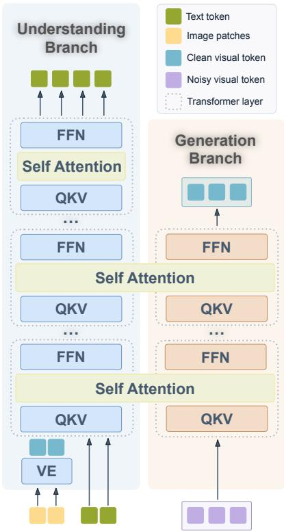  
Figure 3 Architecture of WM-VLM, instantiated with our light Mixture-of-Transformers (light MoT) design. The understanding branch, comprising the vision encoder and language decoder, is initialized from a pretrained VLM. The shallow generation branch contains k layers, each paired with a corresponding layer in a consecutive k-layer block of the understanding branch. Text and clean visual tokens are routed to the understanding branch, whereas noisy visual tokens are routed to the generation branch. All tokens interact through global self-attention.

## 3.3 VLM with An Internal World Model

We use the Mixture-of-Transformer (MoT) architecture (Liang et al., 2024) that accomodates both visual understanding and world modeling capabilities. Our model contains an understanding branch and a generation branch. The understanding branch is initialized with a pre-trained vision-language model (e.g., Qwen2.5-VL) and the generation branch weights are intialized from the corresponding understanding branch layer.

Each token $x _ { i }$ is routed according to its modality $m _ { i } ,$ where $m _ { i } \in \{$ {text, clean image, noisy image}. Text and clean image tokens are routed to the understanding branch, whereas noisy image tokens are routed to the generation branch. Clean image tokens comprise the encoded question-image tokens and the visual tokens generated by the generation branch. The generation branch transforms noisy image tokens into clean image tokens.

In practice, text and clean image tokens share one set of parameters, whereas noisy image tokens are processed by a separate parameter set in the generation branch. After generation, each noisy image token is replaced by its corresponding clean image token. Attention is computed globally across tokens from both branches.

To improve training eficiency, we introduce a light MoT architecture (Figure 3) that retains the full understanding branch but uses a shallow generation branch. We align its k generation layers with k consecutive layers of the understanding branch. Generation tokens are processed only in these aligned layers, where the model applies global attention across tokens from both branches.We set $\dot { k } = 4$ by default.

## 3.4 Two-stage Training

Training proceeds in two stages. In the first stage, the generation branch learns to predict the next visual state conditioned on a mental action. In the second stage, the VLM learns to use the generated visual latents for downstream reasoning.

In Stage 1, we freeze the entire understanding branch, including the vision encoder and language decoder, and train only the generation branch. In Stage 2, we keep the vision encoder frozen and jointly train the language decoder and generation branch.

We optimize the generation branch with a rectified flow objective (Liu et al., 2023) and the understanding branch with a cross-entropy objective:

$$
\mathcal { L } = \alpha \mathcal { L } _ { \mathrm { f l o w } } + \beta \mathcal { L } _ { \mathrm { C E } } ,\tag{5}
$$

where α and $\beta$ balance the two scalar loss terms.

Specifically, given a clean target latent $z ^ { ( 1 ) }$ and conditioning information $c ,$ we construct an interpolated latent $z ^ { \bar { ( t ) } } = ( 1 - \dot { t } ) \epsilon + t z ^ { ( 1 ) }$ , where $\epsilon \sim \mathcal { N } ( 0 , I )$ and $t \in [ 0 , 1 ]$ . Thus, $t = 0$ corresponds to noise and $t = 1$ to the clean target latent. For visual latents, parenthesized superscripts denote flow time, while subscripts denote reasoning-step indices. The generation branch predicts the velocity along this path, yielding the rectified flow objective:

$$
\begin{array} { r } { \mathcal { L } _ { \mathrm { f l o w } } = \mathbb { E } _ { z ^ { ( 1 ) } , c , t , \epsilon } \left[ \left\| v _ { \theta } ^ { \mathrm { g e n } } ( z ^ { ( t ) } , t ; c ) - ( z ^ { ( 1 ) } - \epsilon ) \right\| _ { 2 } ^ { 2 } \right] , } \end{array}\tag{6}
$$

where $v _ { \theta } ^ { \mathrm { g e n } }$ denotes the velocity field predicted by the generation branch. Here, $z ^ { ( 1 ) }$ is the visual embedding obtained by passing the intermediate reasoning image through the vision encoder, and the conditioning information c includes the question and previous reasoning steps. In our experiments, we set $\alpha = 1 , \beta = 0$ in Stage 1, and $\alpha = 0 , \beta = 1$ in Stage 2.

At inference time, we generate $\hat { z } _ { j }$ by integrating the learned velocity field conditioned on $c _ { j } = ( H _ { j } , T _ { j } )$ . We then append $\hat { z } _ { j }$ and $T _ { j }$ to the reasoning history to condition subsequent steps. We provide the numerical integration procedure in Appendix A.2.

## 4 Experiments

## 4.1 Implementation Details

## 4.1.1 Data Construction

We use programs to generate the interleaved visual-textual reasoning dataset. It guarantees that each sample has at least one intermediate reasoning image that is essential for answering the final question. Specifically, following Viveiros et al. (2026), we intialize 2D and 3D shapes with random number of atomic squares and cubes, respectively. We then apply a series of rotation to create diferent views of these shapes. Each question first presents two views of the same reference shape that illustrate a rotation. The model is then shown a new shape and asked to identify the view produced by applying the same rotation. A model capable of mental rotation should solve the task with only a short reasoning chain. We name the 2D rotation dataset as Tetris-2D and the 3D rotation dataset as Tetris-3D. Tetris-2D contains 4k training samples, 400 in-distribution (ID) and 500 out-of-distribution (OOD) test cases, respectively. Tetris-3D contains 16k training samples. Because 3D rotation is more complex and harder than 2D rotation. We include 400 easy in-domain samples (Tetris-3D-SC-ID), where the same cube shape and count appear in the training data. Additional 400 hard in-domain samples (Tetris-3D-C-ID) include seen cube count but unseen cube shapes. The 500 OOD test cases include cube shapes or counts that never appear in the training data. More details of building Tetris-2D and Tetris-3D are shown in Appendix B.1. We also train on ThinkMorph-SpatialNavigation (Gu et al., 2026), which combines state prediction with planning. Given a map, a starting point, and a destination, the model must find a path that avoids ice holes. At each step, it generates a visual state representing the agent’s current position and plans the next move. Following Gu et al. (2026), we use the maze navigation task in the VSP benchmark (Wu et al., 2024) as our testbed.

Table 1 Performance comparison of methods with diferent reasoning types and training objectives. All models in this table are fine-tuned on Tetris-2D or Tetris-3D, except Qwen2.5-VL-7B-Inst. Results are accuracy (%); ∆ denotes the absolute improvement of WM-VLM over Qwen2.5-VL-7B-Instruct SFT in percentage points. AR, FM, CE, and MSE denote autoregressive, flow matching, cross-entropy, and mean squared error, respectively. \*Fine-tuned BAGEL (ThinkMorph) fails to emit images and generate answers on Tetris-3D, resulting in 0% accuracy.
<table><tr><td rowspan="2">Method</td><td rowspan="2">Visual Reasoning Type</td><td rowspan="2">Objective</td><td colspan="2">Tetris-2D</td><td colspan="3">Tetris-3D</td></tr><tr><td>ID</td><td>OOD</td><td>SC-ID</td><td>C-ID</td><td>OOD</td></tr><tr><td rowspan="2">Qwen2.5-VL-7B-Inst. + SFT</td><td rowspan="2">(Text only) (Text only)</td><td>AR-CE</td><td>22.00</td><td>23.80</td><td>21.25</td><td>23.00</td><td>21.40</td></tr><tr><td>AR-CE</td><td>48.25</td><td>46.20</td><td>71.75</td><td>44.50</td><td>55.50</td></tr><tr><td rowspan="2">LatentUM Mirage</td><td rowspan="2">Discrete Visual Tokens Continuous Visual Tokens</td><td>AR-CE</td><td>29.25</td><td>23.00</td><td>58.50</td><td>37.75</td><td>39.00</td></tr><tr><td>AR-Cosine</td><td>47.75</td><td>43.00</td><td>66.25</td><td>46.50</td><td>49.80</td></tr><tr><td rowspan="2">ThinkMorph</td><td rowspan="2">Generated Image</td><td>FM-MSE</td><td>22.50</td><td>21.60</td><td>0.00*</td><td>0.00*</td><td>0.00*</td></tr><tr><td>FM-MSE</td><td>87.50</td><td>75.00</td><td>91.00</td><td>66.25</td><td>71.80</td></tr><tr><td>WM-VLM (Ours) ∆+SFT→Ours</td><td>Continuous Visual Tokens 1</td><td>1</td><td>+39.25</td><td>+28.80</td><td>+19.25</td><td>+21.75</td><td>+16.30</td></tr></table>

## 4.1.2 Model and Training Details

We use the light MoT architecture introduced in Section 3.3. The understanding branch in light MoT is intialized with Qwen2.5-VL-7B-Instruct (Bai et al., 2025). For each dataset, we start with freezing the understanding branch and only train the generation branch until convergence. Then we unfreeze the understanding branch and jointly train both branches. We use an online training setting in which the understanding branch receives visual tokens generated by the generation branch rather than ground truth tokens. We keep the vision encoder frozen during the entire training. Hyperparameters are shown in Table 8, in the appendix.

For baselines, we first compare WM-VLM with a supervised fine-tuned Qwen2.5-VL-7B-Instruct model (Qwen2.5-VL-7B-Instruct SFT), as it provides the most direct comparison. For fairness, we optimize Qwen2.5- VL with the same steps as WM-VLM. Qwen2.5-VL is a VLM trained with a standard autoregressive (AR) objective and optimized using cross-entropy (CE) loss. Next, we include LatentUM (Jin et al., 2026), which generates discrete visual tokens autoregressively. We use their pre-trained model (LatentUM-Base1) and conduct continual training for learning the world model and training the reasoning capability. We also include Mirage (Yang et al., 2026b), which generates continuous visual tokens autoregressively. We reuse their two-stage training approach on our datasets. Finally, we include ThinkMorph (Gu et al., 2026), which generates image pixels and is trained with a flow-matching loss. ThinkMorph is built on the unified model BAGEL, which has already been trained on large-scale interleaved visual-textual data. Following Gu et al.

(2026), we simply finetune BAGEL on each of the datasets and then do evaluation. All experiments use 8 H200 GPUs if not otherwise specified.

## 4.2 Results and Analysis

Vision-language models learn from image-text data using a next-token prediction objective, which does not take full advantage of the rich supervision provided by visual inputs. Consequently, VLMs fail to learn efective internal world models that can predict future visual states conditioned on the current state and mental action.

Table 2 Relationship between visual-token retrieval quality and answer accuracy. Cosine denotes the average cosine similarity between the generated and ground truth visual embeddings. Retrieval top-1 denotes the percentage of times the correct ground truth embedding is retrieved. Accuracy-✓ is the accuracy when the retrieval is correct, while Accuracy-✗ is the accuracy when the retrieval is wrong. ∆ denotes the absolute change relative to standard accuracy. The ϕ coeficient is computed between two binary indicators: whether the correct ground-truth embedding is retrieved and whether the final answer is correct.
<table><tr><td>Metric</td><td>Tetris-2D-ID</td><td>Tetris-2D-OOD</td><td>Tetris-3D-SC-ID</td><td>Tetris-3D-C-ID</td><td>Tetris-3D-OOD</td></tr><tr><td>Cosine</td><td>0.9347</td><td>0.7523</td><td>0.8511</td><td>0.7921</td><td>0.7746</td></tr><tr><td>Retrieval top-1</td><td>96.50</td><td>53.00</td><td>65.75</td><td>20.75</td><td>13.40</td></tr><tr><td>Standard aċcuracy</td><td>87.50</td><td>75.00</td><td>91.00</td><td>66.25</td><td>71.80</td></tr><tr><td rowspan="2">Accuracy-√ ∆</td><td>89.38</td><td>79.25</td><td>99.24</td><td>92.77</td><td>86.57</td></tr><tr><td>+1.88</td><td>+4.25</td><td>+8.24</td><td>+26.52</td><td>+14.77</td></tr><tr><td>Accuracy-x</td><td>35.71</td><td>70.21</td><td>75.18</td><td>59.31</td><td>69.52</td></tr><tr><td>Δ</td><td>-51.79</td><td>-4.79</td><td>-15.82</td><td>-6.94</td><td>-2.28</td></tr><tr><td>φ correlation</td><td>0.298</td><td>0.104</td><td>0.399</td><td>0.287</td><td>0.129</td></tr></table>

We run a comparative study to show that adding a world modeling objective is essential. Starting with Tetris-2D, we first train the generation branch in WM-VLM with the flow matching loss, enabling its world modeling capability (Stage 1). Then we train both the understanding and generation branch to unlock the interleaved visual-textual reasoning capability (Stage 2). We evaluate the final checkpoint on both Tetris-2D-ID and Tetris-2D-OOD.

World modeling objective boosts performance on task requires imagination. Training dynamics and evaluation results are shown in Figure 1 and Table 1, respectively. Figure 1 shows a clear performance transition at around 25k training steps. Meanwhile, the cosine similarity between the generated visual states and the ground-truth embedding also increases more rapidly around the same steps. Our assumption is that the model is only able to benefit from the world model once its generation capability exceeds a certain threshold. Qwen2.5-VL-7B-Instruct SFT demonstrates similar training dynamics before step 25k and exhibits downstream performance comparable to WM-VLM. However, its performance plateaus after step 25k, while WM-VLM enters the transition and ultimately outperforms Qwen2.5-VL-7B-Instruct SFT by 39.25 points on Tetris-2D-ID and 28.8 points on Tetris-2D-OOD.

Similar performance gains are observed on the harder Tetris-3D evaluation sets, where WM-VLM outperforms Qwen2.5-VL-7B-Instruct SFT by 19.25 points on Tetris-3D-SC-ID, 21.75 points on Tetris-3D-C-ID, and 16.3 points on Tetris-3D-OOD. These results show that adding a world modeling objective is essential for solving spatial reasoning tasks that require imagination. WM-VLM also outperforms other visual latent reasoning and interleaved visual-textual reasoning methods on Tetris-2D and Tetris-3D.

Do generated visual tokens improve reasoning? The model may learn shortcuts that allow it to answer questions without relying on the generated visual tokens. To test this possibility, we conduct a retrieval experiment to evaluate the contribution of these tokens. As we have all the intermediate reasoning images in the eval set, we first encode these images to obtain the ground truth visual embeddings. Then, we get the WM-VLM’s generated visual embeddings, and compute the cosine similarity between the generated and ground truth embeddings. We select the top-1 retrieved ground truth embedding for each generated embedding. As shown

Table 3 Ablations on alternating generated image pixels on Tetris-2D. We report accuracy (%). ∆ denotes the change relative to standard inference with generated pixels.  
Table 4 Ablations on alternating generated visual tokens onTetris-2D. Results are accuracy (%); ∆ denotes the change relative to evaluation with the default setup.
<table><tr><td>Metric</td><td>all-white pixel</td><td>shuffle 19×19patches</td><td>Default</td></tr><tr><td>Tetris-2D-ID ∆</td><td>49.25</td><td>48.25</td><td>47.25</td></tr><tr><td>Tetris-2D-OOD</td><td>+2.00 46.60</td><td>+1.00</td><td>一</td></tr><tr><td></td><td></td><td>46.20</td><td>46.20</td></tr><tr><td>Δ</td><td>+0.40</td><td>0.00</td><td>一</td></tr></table>

<table><tr><td>Metric</td><td>all-zero embedding</td><td>randomized tokens</td><td>shuffle visual tokens</td><td>Default</td></tr><tr><td rowspan="2">Tetris-2D-ID ∆</td><td>14.00</td><td>23.50</td><td>81.50</td><td>87.50</td></tr><tr><td>-73.50</td><td>-64.00</td><td>-6.00</td><td></td></tr><tr><td>Tetris-2D-OOD</td><td>15.40</td><td>20.80</td><td>72.60</td><td>75.00</td></tr><tr><td rowspan="2">∆</td><td>-59.60</td><td>-54.20</td><td>-2.40</td><td></td></tr><tr><td></td><td></td><td></td><td></td></tr></table>

Table 5 Ablations on alternating generated visual tokens on Tetris-3D. Results are accuracy (%); ∆ denotes the change relative to evaluation with the default setup.
<table><tr><td>Metric</td><td>all-zero embedding</td><td>randomized tokens</td><td>shuffle visual tokens</td><td>default</td></tr><tr><td rowspan="2">Tetris-3D-SC-ID ∆</td><td>15.50</td><td>23.25</td><td>81.00</td><td rowspan="2">91.00</td></tr><tr><td>-75.50</td><td>-67.75</td><td>-10.00</td></tr><tr><td>Tetris-3D-C-ID</td><td>16.00</td><td>25.00</td><td>60.25</td><td>66.25</td></tr><tr><td rowspan="2">Δ Tetris-3D-OOD</td><td>-50.25</td><td>-41.25</td><td>-6.00</td><td rowspan="2"></td></tr><tr><td>14.40</td><td>20.40</td><td>64.20</td></tr><tr><td rowspan="2">∆</td><td>-57.40</td><td>-51.40</td><td>-7.60</td><td rowspan="2">71.80 一</td></tr><tr><td></td><td></td><td></td></tr></table>

in Table 2, higher retrieval rate leads to higher answer accuracy. Correlation analysis shows that the retrieval quality is positively correlated with the answer accuracy.  
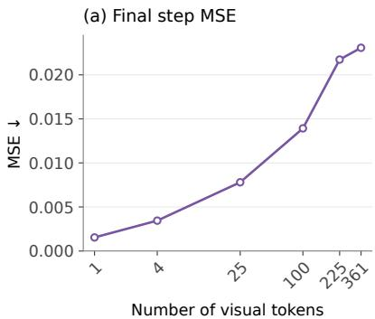

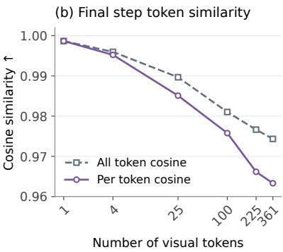

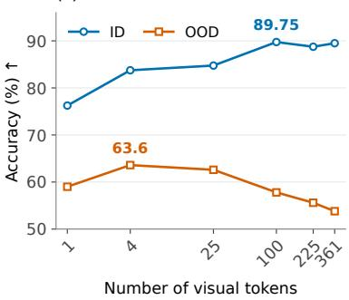  
Figure 4 Efect of visual-token count on model performance. We report final-step MSE, training-time token similarity, and performance on Tetris-2D-ID and Tetris-2D-OOD. MSE compares the generated and ground-truth visual embeddings. Alltoken cosine is computed after concatenating all tokens in each block, whereas per-token cosine averages the similarities between corresponding generated and ground-truth tokens.

Further, we manipulate the generated visual states to see how it afects the final performance. We conduct three types of manipulation: (1) replace the generated visual tokens with all-zero embeddings, (2) replace the generated visual tokens with randomized embeddings, and (3) shufle the generated visual tokens. As shown in Table 4 and 5, replacing the visual tokens with all-zero embeddings or randomized embeddings leads to a significant drop in accuracy. This indicates that the generated visual tokens are non-trivial and essential for assisting the model to answer the final question. It is expected that shufling the visual tokens has a smaller impact, because visual tokens do bi-directional attention with each other in the generation branch. They already have positional information and shufling tokens does not change that.

Does the number of visual tokens affect model performance? As the size of the reasoning images in the dataset is 512×512, the default number of visual tokens is 361 (19×19) in our experiments. We conduct an ablation study to see how the number of visual tokens afects model performance. We change the number of visual tokens by simply resizing the reasoning images. As shown in Figure 4, fewer visual tokens leads to lower MSE and higher cosine similarity. However, the final answer accuracy does not show the same trend. ID performance increases as the number of visual tokens increases, while OOD performance peaks at 4 $( 2 \times 2 )$ visual tokens.

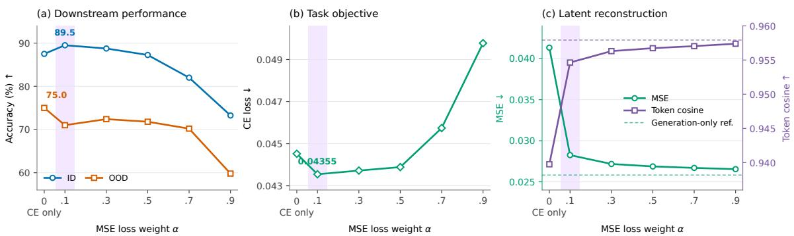  
Figure 5 Efect of the ratio between cross-entropy and flow-matching losses on model performance.

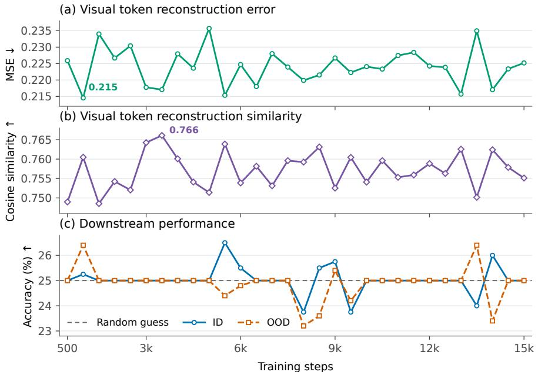  
Figure 6 Training curves for joint training with loss ratio $\alpha = 0 . 1$ and $\beta = 0 . 9 .$

What is the optimal loss ratio in Stage 2? By default, we only use the cross-entropy loss in Stage $2 \left( \alpha = 0 , \beta = 1 \right)$ to optimize both the understanding and generation branches. To see how the ratio between the cross-entropy and flow-matching losses afects model performance, we conduct an ablation study by varying α and $\beta .$ Starting from the same checkpoint in Stage 1, we train the model with diferent loss ratios in Stage 2. We set $\alpha \stackrel {  } { = } \{ 0 . 1 , 0 . 3 , 0 . 5 , 0 . 7 , 0 . 9 \}$ , with $\beta = 1 - \alpha$ . As shown in Figure 5, larger weight of the flow-matching loss in Stage 2 improves the generated visual token quality. But the improved visual token quality does not necessarily lead to better downstream performance. We observe that the best overall performance is achieved when $\alpha = 0 . 1$ and $\beta = 0 . 9$ , showing cross-entropy dominating the final downstream reasoning capability.

Is two-stage training necessary? Our two-stage training strategy first trains the model to predict visual tokens and then teaches it to reason using these tokens. A natural alternative is to train both branches jointly from scratch using a weighted combination of the two training objectives. To evaluate this alternative, we perform single-stage training with $\alpha = 0 . 1$ and $\beta = 0 . 9 .$ , the loss weights that yield the best performance in our preceding experiments. As shown in Figure 6, the accuracy of the single-stage model remains near random chance throughout training. In contrast, Qwen2.5-VL-7B-Instruct SFT and WM-VLM both achieve over 40% accuracy within a comparable number of training steps. These results suggest that, under our training setup, jointly learning visual-token prediction and visual-token-based reasoning from scratch is inefective. The staged curriculum is critical because the model must first learn a representation of the visual world before it can reason efectively with the generated visual tokens.

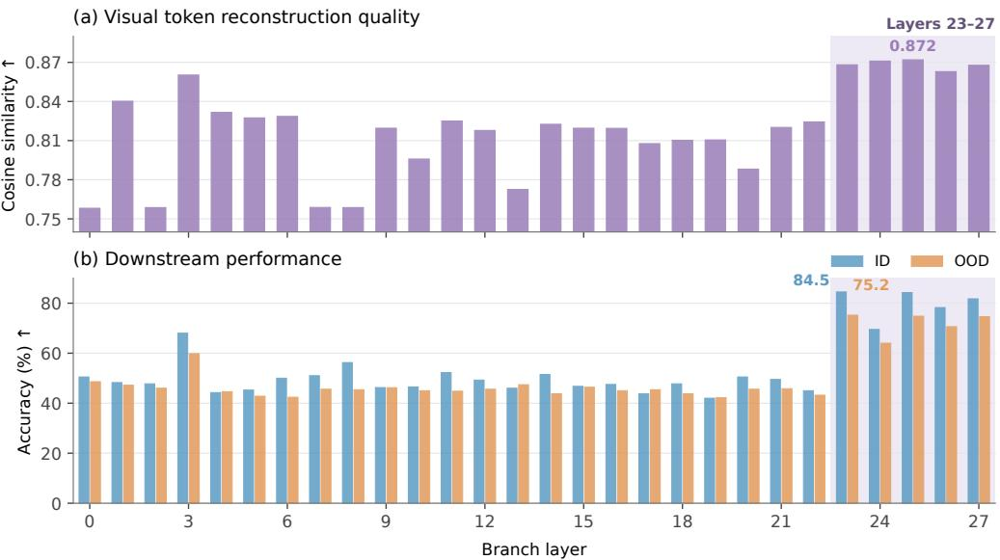  
Figure 7 Layer-wise analysis of visual latent quality and downstream performance in the VLM.

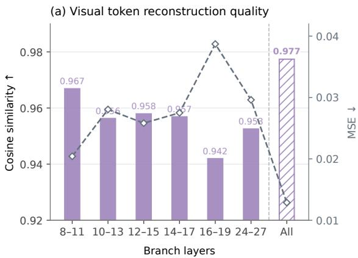

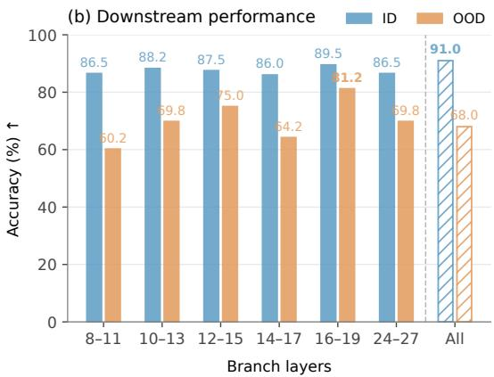  
Figure 8 Efect of the layer-window selection on model performance. For example, "8-11" means the generation branch is connected to the understanding branch from layer 8 to layer 11.

How many generation layers are needed, and where should they be placed? The light MoT architecture (Figure 3) allows the generation branch to contain any number of layers and to align with any consecutive block of layers in the understanding branch. We study if alternating the number of generation layers and their placement afects model performance. First, we intialize WM-VLM with 1-layer generation branch and train it on Tetris-2D. The results are shown in Figure 7, where aligning generation layer with the top-most (23-27)layers in the understanding branch, the model achieves the best performance. Aligning with other layers shows lower performance, except layer-3, where there is a performance spike. Next, we scan the understanding branch with a 4-layer generation branch. As shown in Figure 8, when the number of generation layers increases, the performance gap between diferent placements becomes smaller. We attribute this to the increased model capacity that can mitigate the informational loss from diferent understanding branches. On the other hand, using the same number of generation layers with understanding layers (the original MoT setting) does not show significant performance gain.

Which one is the better reasoning medium? By default, we use the generated visual tokens, which is aligned with the vision encoder output, as the reasoning medium. But it is also possible to use the generated pixels to represent the intermediate reasoning state. We conduct an ablation study by simply adding an MLP on top of the generated visual tokens to reconstruct the pixels. We train the pixel-generation model with the pixel MSE loss, with the same optimizing steps as WM-VLM. Experiments result in Table 3 and 4 show that given the same compute budget, reasoning with the generated visual tokens yields better performance than the pixels.

## 5 Conclusion

To enable VLMs to reason about space through visual imagination, we introduce WM-VLM, a VLM equipped with an internal world model. We construct datasets with verifiable intermediate visual states and use them to study how world modeling afects interleaved visual-textual reasoning. Our experiments show that WM-VLM improves spatial reasoning performance and relies on its generated visual tokens to produce final answers. Ablations identify the number of visual tokens, the balance between cross-entropy and flow-matching losses, and two-stage training as important design choices. More broadly, internal world models may enable VLMs to reason jointly in language and visual space.

## References

Shuai Bai, Keqin Chen, Xuejing Liu, Jialin Wang, Wenbin Ge, Sibo Song, Kai Dang, Peng Wang, Shijie Wang, Jun Tang, Humen Zhong, Yuanzhi Zhu, Ming-Hsuan Yang, Zhaohai Li, Jianqiang Wan, Pengfei Wang, Wei Ding, Zheren Fu, Yiheng Xu, Jiabo Ye, Xi Zhang, Tianbao Xie, Zesen Cheng, Hang Zhang, Zhibo Yang, Haiyang Xu, and Junyang Lin. Qwen2.5-vl technical report. CoRR, abs/2502.13923, 2025. doi: 10.48550/ARXIV.2502.13923. https://doi.org/10.48550/ arXiv.2502.13923.

Lei Chen, Xuanle Zhao, Zhixiong Zeng, Jing Huang, Yufeng Zhong, and Lin Ma. Chart-r1: Chain-of-thought supervision and reinforcement for advanced chart reasoner. CoRR, abs/2507.15509, 2025. doi: 10.48550/ARXIV.2507.15509. https://doi.org/10.48550/arXiv.2507.15509.

Ethan Chern, Jiadi Su, Yan Ma, and Pengfei Liu. Anole: An open, autoregressive, native large multimodal models for interleaved image-text generation. arXiv preprint arXiv:2407.06135, 2024.

Ethan Chern, Zhulin Hu, Stefi Chern, Siqi Kou, Jiadi Su, Yan Ma, Zhijie Deng, and Pengfei Liu. Thinking with generated images. CoRR, abs/2505.22525, 2025. doi: 10.48550/ARXIV.2505.22525. https://doi.org/10.48550/arXiv.2505.22525.

Chaorui Deng, Deyao Zhu, Kunchang Li, Chenhui Gou, Feng Li, Zeyu Wang, Shu Zhong, Weihao Yu, Xiaonan Nie, Ziang Song, et al. Emerging properties in unified multimodal pretraining. arXiv preprint arXiv:2505.14683, 2025.

Jun Gao, Yongqi Li, Ziqiang Cao, and Wenjie Li. Interleaved-modal chain-of-thought. In 2025 IEEE/CVF Conference on Computer Vision and Pattern Recognition (CVPR), pages 19520–19529. IEEE, 2025.

Gracjan Góral, Alicja Ziarko, Michal Nauman, and Maciej Wolczyk. Seeing through their eyes: Evaluating visual perspective taking in vision language models. CoRR, abs/2409.12969, 2024. doi: 10.48550/ARXIV.2409.12969. https: //doi.org/10.48550/arXiv.2409.12969.

Jiawei Gu, Yunzhuo Hao, Huichen Wang, Linjie Li, Michael Qizhe Shieh, Yejin Choi, Ranjay Krishna, and Yu Cheng. Thinkmorph: Emergent properties in multimodal interleaved chain-of-thought reasoning. In International Conference on Learning Representations, volume 2026, pages 141405–141447, 2026.

Yushi Hu, Weijia Shi, Xingyu Fu, Dan Roth, Mari Ostendorf, Luke Zettlemoyer, Noah A Smith, and Ranjay Krishna. Visual sketchpad: Sketching as a visual chain of thought for multimodal language models. Advances in Neural Information Processing Systems, 37:139348–139379, 2024.

Zican Hu, Xuyang Hu, Yiming Liu, Zuwei Long, Wei Liu, Yunzhuo Hao, Jiawei Gu, Linjie Li, Yu Cheng, Zhenhong Sun, Weibo Gu, Xing Sun, and Zhi Wang. Bridging interleaved multi-modal reasoning as a unified decision process. CoRR, abs/2607.03748, 2026. doi: 10.48550/ARXIV.2607.03748. https://doi.org/10.48550/arXiv.2607.03748

Wenxuan Huang, Bohan Jia, Shaosheng Cao, Zheyu Ye, Zhe Xu, Yao Hu, Shaohui Lin, et al. Vision-r1: Incentivizing reasoning capability in multimodal large language models. In International Conference on Learning Representations, volume 2026, pages 63794–63812, 2026.

Emily Yue-Ting Jia, Weiduo Yuan, Tianheng Shi, Vitor Guizilini, Jiageng Mao, and Yue Wang. Dreamplan: Eficient reinforcement fine-tuning of vision-language planners via video world models. arXiv preprint arXiv:2603.16860, 2026.

Jiachun Jin, Zetong Zhou, Xiao Yang, Hao Zhang, Pengfei Liu, Jun Zhu, and Zhijie Deng. Latentum: Unleashing the potential of interleaved cross-modal reasoning via a latent-space unified model. arXiv preprint arXiv:2604.02097, 2026.

Amita Kamath, Jack Hessel, and Kai-Wei Chang. What’s "up" with vision-language models? investigating their struggle with spatial reasoning. In Houda Bouamor, Juan Pino, and Kalika Bali, editors, Proceedings of the 2023 Conference on Empirical Methods in Natural Language Processing, EMNLP 2023, Singapore, December 6-10, 2023, pages 9161–9175. Association for Computational Linguistics, 2023. doi: 10.18653/V1/2023.EMNLP-MAIN.568. https://doi.org/10. 18653/v1/2023.emnlp-main.568.

Stephen M. Kosslyn, Thomas M. Ball, and Brian J. Reiser. Visual images preserve metric spatial information: Evidence from studies of image scanning. Journal of Experimental Psychology: Human Perception and Performance, 4(1):47–60, 1978. doi: 10.1037/0096-1523.4.1.47.

Jill H Larkin and Herbert A Simon. Why a diagram is (sometimes) worth ten thousand words. Cognitive science, 11(1): 65–100, 1987.

Bangzheng Li, Ximeng Sun, Jiang Liu, Ze Wang, Jialian Wu, Xiaodong Yu, Emad Barsoum, Muhao Chen, and Zicheng Liu. Latent visual reasoning. In International Conference on Learning Representations, volume 2026, pages 148076–148090, 2026a.

Chengzu Li, Wenshan Wu, Huanyu Zhang, Yan Xia, Shaoguang Mao, Li Dong, Ivan Vulic, and Furu Wei. Imagine while reasoning in space: Multimodal visualization-of-thought. In Aarti Singh, Maryam Fazel, Daniel Hsu, Simon Lacoste-Julien, Felix Berkenkamp, Tegan Maharaj, Kiri Wagstaf, and Jerry Zhu, editors, Forty-second International Conference on Machine Learning, ICML 2025, Vancouver, BC, Canada, July 13-19, 2025, volume 267 of Proceedings ofMachine Learning Research. PMLR / OpenReview.net, 2025. https://proceedings.mlr.press/v267/li25cz.html

Kelvin Li, Chuyi Shang, Leonid Karlinsky, Rogerio Feris, Trevor Darrell, and Roei Herzig. Latent implicit visual reasoning. In Proceedings ofthe IEEE/CVF Conference on Computer Vision and Pattern Recognition, pages 33457–33466, 2026b.

Weixin Liang, Lili Yu, Liang Luo, Srinivasan Iyer, Ning Dong, Chunting Zhou, Gargi Ghosh, Mike Lewis, Wen-tau Yih, Luke Zettlemoyer, et al. Mixture-of-transformers: A sparse and scalable architecture for multi-modal foundation models. arXiv preprint arXiv:2411.04996, 2024.

Chengzhi Liu, Yuzhe Yang, Yue Fan, Qingyue Wei, Sheng Liu, and Xin Eric Wang. Reasoning within the mind: Dynamic multimodal interleaving in latent space. In Proceedings of the IEEE/CVF Conference on Computer Vision and Pattern Recognition, pages 9225–9236, 2026.

Xingchao Liu, Chengyue Gong, and Qiang Liu. Flow straight and fast: Learning to generate and transfer data with rectified flow. In The Eleventh International Conference on Learning Representations, ICLR 2023, Kigali, Rwanda, May 1-5, 2023. OpenReview.net, 2023. https://openreview.net/forum?id=XVjTT1nw5z.

Pan Lu, Hritik Bansal, Tony Xia, Jiacheng Liu, Chunyuan Li, Hannaneh Hajishirzi, Hao Cheng, Kai-Wei Chang, Michel Galley, and Jianfeng Gao. Mathvista: Evaluating mathematical reasoning of foundation models in visual contexts. In International Conference on Learning Representations, volume 2024, pages 23439–23554, 2024.

Ahmed Masry, Jia Qing Tan, Shafiq Joty, Enamul Hoque, et al. Chartqa: A benchmark for question answering about charts with visual and logical reasoning. In Findings ofthe associationfor computational linguistics: ACL 2022, pages 2263–2279, 2022.

Ahmed Masry, Abhay Puri, Masoud Hashemi, Juan A. Rodríguez, Megh Thakkar, Khyati Mahajan, Vikas Yadav, Sathwik Tejaswi Madhusudhan, Alexandre Piché, Dzmitry Bahdanau, Christopher Pal, David Vázquez, Enamul Hoque, Perouz Taslakian, Sai Rajeswar, and Spandana Gella. Bigcharts-r1: Enhanced chart reasoning with visual reinforcement finetuning. CoRR, abs/2508.09804, 2025. doi: 10.48550/ARXIV.2508.09804. https://doi.org/10.48550/arXiv.2508.09804.

Roger N. Shepard and Jacqueline Metzler. Mental rotation of three-dimensional objects. Science, 171(3972):701–703, 1971. doi: 10.1126/science.171.3972.701.

Ilias Stogiannidis, Steven McDonagh, and Sotirios A. Tsaftaris. Mind the gap: Benchmarking spatial reasoning in visionlanguage models. CoRR, abs/2503.19707, 2025. doi: 10.48550/ARXIV.2503.19707. https://doi.org/10.48550/arXiv. 2503.19707.

Alex Su, Haozhe Wang, Weiming Ren, Fangzhen Lin, and Wenhu Chen. Pixel reasoner: Incentivizing pixel space reasoning via curiosity-driven reinforcement learning. Advances in Neural Information Processing Systems, 38:8222–8251, 2026.

André G Viveiros, Nuno Gonçalves, André FT Martins, and Matthias Lindemann. What’s holding back latent visual reasoning? arXiv preprint arXiv:2605.18445, 2026.

Qixun Wang, Yang Shi, Yifei Wang, Yuanxing Zhang, Pengfei Wan, Kun Gai, Xianghua Ying, and Yisen Wang. Monet: Reasoning in latent visual space beyond image and language. In Proceedings of the IEEE/CVF Conference on Computer Vision and Pattern Recognition, pages 12030–12040, 2026.

Jialong Wu, Xiaoying Zhang, Hongyi Yuan, Xiangcheng Zhang, Tianhao Huang, Changjing He, Chaoyi Deng, Renrui Zhang, Youbin Wu, and Mingsheng Long. Visual generation unlocks human-like reasoning through multimodal world models. arXiv preprint arXiv:2601.19834, 2026.

Qiucheng Wu, Handong Zhao, Michael Saxon, Trung Bui, William Yang Wang, Yang Zhang, and Shiyu Chang. Vsp: Assessing the dual challenges of perception and reasoning in spatial planning tasks for vlms. arXiv preprint arXiv:2407.01863, 2024.

Jihan Yang, Shusheng Yang, Anjali W. Gupta, Rilyn Han, Li Fei-Fei, and Saining Xie. Thinking in space: How multimodal large language models see, remember, and recall spaces. In IEEE/CVF Conference on Computer Vision and Pattern Recog nition, CVPR 2025, Nashville, TN, USA, June 11-15, 2025, pages 10632–10643. Computer Vision Foundation / IEEE, 2025a. doi: 10.1109/CVPR52734.2025.00994. https://openaccess.thecvf.com/content/CVPR2025/html/Yang\_Thinking\_ in\_Space\_How\_Multimodal\_Large\_Language\_Models\_See\_Remember\_CVPR\_2025\_paper.html.

Yi Yang, Xiaoxuan He, Hongkun Pan, Xiyan Jiang, Yan Deng, Xingtao Yang, Haoyu Lu, Dacheng Yin, Fengyun Rao, Minfeng Zhu, Bo Zhang, and Wei Chen. R1-onevision: Advancing generalized multimodal reasoning through crossmodal formalization. In IEEE/CVF International Conference on Computer Vision, ICCV 2025, Honolulu, HI, USA, October 19-25, 2025, pages 2376–2385. IEEE, 2025b. doi: 10.1109/ICCV51701.2025.00229. https://doi.org/10.1109/ICCV51701. 2025.00229.

Yuncong Yang, Jiageng Liu, Zheyuan Zhang, Siyuan Zhou, Reuben Tan, Jianwei Yang, Yilun Du, and Chuang Gan. Mindjourney: Test-time scaling with world models for spatial reasoning. Advances in Neural Information Processing Systems, 38:109855–109885, 2026a.

Zeyuan Yang, Xueyang Yu, Delin Chen, Maohao Shen, and Chuang Gan. Machine mental imagery: Empower multimodal reasoning with latent visual tokens. In Proceedings of the IEEE/CVF Conference on Computer Vision and Pattern Recognition, pages 33510–33520, 2026b.

Shoubin Yu, Yue Zhang, Zun Wang, Jaehong Yoon, Huaxiu Yao, Mingyu Ding, and Mohit Bansal. When and how much to imagine: Adaptive test-time scaling with world models for visual spatial reasoning. arXiv preprint arXiv:2602.08236, 2026.

Xiang Yue, Yuansheng Ni, Kai Zhang, Tianyu Zheng, Ruoqi Liu, Ge Zhang, Samuel Stevens, Dongfu Jiang, Weiming Ren, Yuxuan Sun, et al. Mmmu: A massive multi-discipline multimodal understanding and reasoning benchmark for expert agi. In Proceedings ofthe IEEE/CVF conference on computer vision and pattern recognition, pages 9556–9567, 2024.

Yuheng Zha, Kun Zhou, Yujia Wu, Yushu Wang, Jie Feng, Zhi Xu, Shibo Hao, Zhengzhong Liu, Eric P Xing, and Zhiting Hu. Vision-g1: Towards general reasoning vision-language models via reinforcement learning. In Proceedings of the AAAI Conference on Artificial Intelligence, volume 40, pages 28131–28139, 2026.

Xin Zhang, Qiqi Tao, Jiawei Du, Moyun Liu, and Joey Tianyi Zhou. Visual latents know more than they say: Unsilencing latent reasoning in mllms. arXiv preprint arXiv:2605.02735, 2026a.

Yuyou Zhang, Radu Corcodel, Chiori Hori, Anoop Cherian, and Ding Zhao. Spinbench: Perspective and rotation as a lens on spatial reasoning in vlms. In International Conference on Learning Representations, volume 2026, pages 70072–70141, 2026b.

Chenming Zhu, Jingli Lin, Yilin Long, Peizhou Cao, Tai Wang, Jiangmiao Pang, and Xihui Liu. Thinking with imagination: Agentic visual spatial reasoning with world simulators. arXiv preprint arXiv:2606.06476, 2026.

## Appendix

## A Implementation Details

## A.1 VLM with an internal world model

In WM-VLM, each token’s query, key, and value are computed as follows:

$$
Q _ { i } = x _ { i } W _ { Q } ^ { m _ { i } } , \quad K _ { i } = x _ { i } W _ { K } ^ { m _ { i } } , \quad V _ { i } = x _ { i } W _ { V } ^ { m _ { i } } ,\tag{7}
$$

where $W _ { Q } ^ { m _ { i } } , W _ { K } ^ { m _ { i } }$ , and $W _ { V } ^ { m _ { i } }$ are the learnable weight matrices for the query, key, and value projections of modality $m _ { i } ,$ respectively.

The attention output $a _ { i }$ for token $x _ { i }$ in a transformer layer is:

$$
a _ { i } = \left[ \mathrm { s o f t m a x } \left( \frac { Q K ^ { \top } } { \sqrt { d _ { k } } } \right) V \right] _ { i } W _ { O } ^ { m _ { i } } ,\tag{8}
$$

where $W _ { O } ^ { m _ { i } }$ is the learnable weight matrix for the output projection of modality $m _ { i }$

## A.2 Rectified Flow Sampling

At inference time, we generate the estimated visual state $\hat { z } _ { j }$ conditioned on $c _ { j } = ( H _ { j } , T _ { j } )$ by integrating the predicted velocity field from noise $( t = 0 )$ to the clean latent (t = 1). Specifically, we initialize $\tilde { z } _ { j } ^ { ( 0 ) } \sim \mathcal { N } ( 0 , I )$ and use K Euler steps with $t _ { k } = k / K \mathrm { : }$

$$
\tilde { z } _ { j } ^ { ( t _ { k + 1 } ) } = \tilde { z } _ { j } ^ { ( t _ { k } ) } + \frac { 1 } { K } v _ { \theta } ^ { \mathrm { g e n } } \Bigl ( \tilde { z } _ { j } ^ { ( t _ { k } ) } , t _ { k } ; c _ { j } \Bigr ) , \qquad k = 0 , \ldots , K - 1 .\tag{9}
$$

The final estimate is $\hat { z } _ { j } = \tilde { z } _ { j } ^ { ( 1 ) }$ , which is appended to the reasoning history together with $T _ { j }$ to condition subsequent reasoning steps. Here, K denotes the number of Euler steps, while t denotes the continuous flow time.

## A.3 Training Hyperparameters

We present the training hyperparameters in Table 8. All training tasks are conducted on 8 H200 GPUs.

## B Data Construction

## B.1 Building Tetris-2D and Tetris-3D

We use programs to generate the interleaved visual-textual reasoning dataset. Detailed algorithm is shown in Algorithm 1. The 2D rotation dataset is constructed in a similar way, except that we use squares instead of cubes.

## B.2 Data Samples

Figure 9 shows representative training examples from Tetris-2D and Tetris-3D. Each example contains a question image, textual mental actions, visual states produced by those actions, and a final textual answer. Tetris-2D stores one visual state after the complete rotation sequence, whereas Tetris-3D stores a visual state after each atomic rotation.

(a) Tetris-2D  
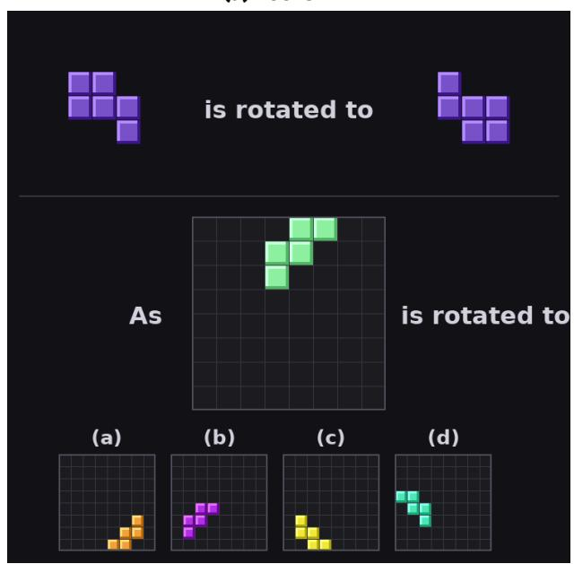  
T1, T2: Rotate the query shape 90◦ clockwise twice. ↓

(b) Tetris-3D  
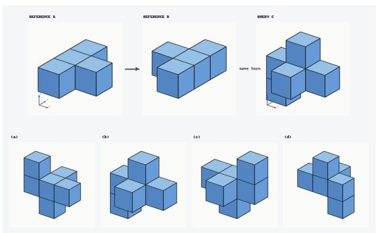

T : Rotate +90◦ about the world +Z axis. ↓  
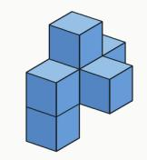

  
Final visual state Compare with the options. Answer: (a)

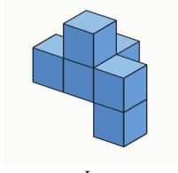  
Compare with the options. Answer: (d)  
Figure 9 Representative samples from Tetris-2D and Tetris-3D. Text denotes mental rotation actions and images denote their resulting visual states. The 2D example stores the final state after two $9 0 ^ { \circ }$ rotations, while the 3D example explicitly interleaves each $9 0 ^ { \circ }$ rotation with its corresponding visual state.

Algorithm 1 Construction of the Tetris-3D Dataset   
Require: Cube counts $\{ 4 , 5 , 6 , 7 \}$ , rotation axes $\{ X , Y , Z \}$ , rotation angles $\{ 9 0 ^ { \circ } , 1 8 0 ^ { \circ } , 2 7 0 ^ { \circ } \}$   
Ensure: Training set $\mathcal { D } _ { \mathrm { t r a i n } }$ and evaluation sets $\mathcal { D } _ { \mathrm { I D } } , \mathcal { D } _ { \mathrm { O O D } }$   
1: $s  \emptyset$   
2: for n $\iota \in \{ 4 , 5 , 6 , 7 \}$ do   
3: Enumerate all connected shapes consisting of n cubes   
4: Remove shapes equivalent under proper 3D rotations   
5: Add the remaining canonical shapes to S   
6: end for   
7: Split S into seen shapes $\mathcal { S } _ { \mathrm { s e e n } }$ and held-out shapes ${ \mathcal { S } } _ { \mathrm { O O D } }$ ▷ Mirror-related shapes stay in the same split   
8: $\bar { \mathcal { Q } } _ { \mathrm { s e e n } }  \emptyset , \mathcal { Q } _ { \mathrm { O O D } }  \emptyset$   
9: for each shape $S \in { \mathcal { S } }$ do   
10: for each distinct initial orientation P of S do   
11: for $a \in \{ X , Y , Z \}$ and $\theta \in \{ 9 0 ^ { \circ } , 1 8 0 ^ { \circ } , 2 7 0 ^ { \circ } \}$ do   
12: Compute the rotated orientation $P ^ { \prime } = \overset { \cdot } { R } ( a , \theta ) P$   
13: if $P ^ { \prime } \neq P$ then   
14: Add $\left( S , P , a , \theta , P ^ { \prime } \right)$ to the corresponding seen or OOD configuration pool   
15: end if   
16: end for   
17: end for   
18: end for   
19: Split the seen configuration pool into disjoint training and ID-evaluation pools   
20: for each selected configuration $( S _ { C } , P _ { C } , a , \overbar { \theta } , P _ { C } ^ { \prime } )$ do   
21: Select a reference shape $S _ { A }$ with a diferent cube count   
22: Rotate $S _ { A }$ by the same $( a , \theta )$ to produce Reference B   
23: Use $P _ { C } ^ { \prime }$ as the correct answer   
24: Sample three distinct rotated poses of $S _ { C }$ as distractors   
25: Randomize the position of the four answer options   
26: Render Reference A, Reference B, Query C, and the four options   
27: end for   
28: Construct $\mathcal { D } _ { \mathrm { t r a i n } }$ from training configurations   
29: Construct $\mathcal { D } _ { \mathrm { I D } }$ from unseen configurations of seen shapes   
30: Construct $\mathcal { D } _ { \mathrm { O O D } }$ from held-out shapes

## B.3 Comparison between Different VLMs

We test diferent VLMs with diferent reasoning types on 2D mental rotation tasks. The results are shown in Table 6. We observe that stronger VLMs, i.e., with strong textual reasoning capabilities, can first convert the 2D or 3D shape into coordinates. They perform textual reasoning to rotate these coordinates and get the answer. We point out that this is not the general and scalable visual reasoning approach because language is lossy.

## C Additional Experiment Results

Initialization is not decisive. In our main experiments, generation branch is initialized with the same weights as the understanding branch. To weigh the factor of the intialization method, we conduct an ablation study by initializing the generation branch with random weights. As shown in Figure 11, in all three layer placement settings, neither initialization method shows a clear advantage over the other. This indicates that the initialization method is not decisive for the final performance.

Experiments on visual planning tasks. We further evaluate our model on visual planning tasks, which require predicting a sequence of actions to reach a goal state. We train on ThinkMorph-SN and evaluate on VSP-Nav. As shown in Table 7, our model, which generates continuous visual tokens as intermediate thoughts, shows competitive performance compared with baselines. BAGEL generates images as intermediate thoughts and achieves the best performance, likely because it was pre-trained on large-scale interleaved data. In contrast, on the Tetris tasks, where BAGEL appears not to benefit from similar pre-training data, it underperforms our model and even collapses during training.

Table 6 Evaluation results of VLMs on the test sets of Tetris-2D, Tetris-3D, and VSP-Nav under diferent reasoning-input settings. Think Mode is the model’s built-in capability from their pre-training. Qwen2.5-VL-7B-Instruct and Qwen3-VL-8B-Instruct do not support think mode by default. Qwen3.5-9B, Qwen3.6-27B, and Qwen3.7-40B support think mode. We test these models in both modes. ✗ indicates the think mode is disabled; ✓ indicates the think mode is enabled. Q denotes the question input, RT denotes reasoning text, and I denotes intermediate reasoning images. When testing with the Q + RT setting, we replace the intermediate reasoning images with token "[IMAGINATION]".
<table><tr><td rowspan="2">Model</td><td rowspan="2">Think Mode Eval Setting</td><td rowspan="2"></td><td colspan="2">Tetris-2D</td><td colspan="2">Tetris-3D</td><td rowspan="2">VSP-Nav</td></tr><tr><td>ID</td><td>OOD</td><td>ID</td><td>OOD</td></tr><tr><td rowspan="3">Qwen2.5-VL-7B-Instruct</td><td rowspan="3">X</td><td>Question only</td><td>22.00</td><td>23.80</td><td>23.00</td><td>21.40</td><td>6.50</td></tr><tr><td>Q + RT</td><td>23.50</td><td>23.20</td><td>20.25</td><td>21.00</td><td>21.50</td></tr><tr><td>Q + RT + I</td><td>26.25</td><td>26.20</td><td>60.50</td><td>59.60</td><td>24.83</td></tr><tr><td rowspan="3">Qwen3-VL-8B-Instruct</td><td rowspan="3">X</td><td>Question only</td><td>23.00</td><td>21.80</td><td>9.00</td><td>9.20</td><td>1.33</td></tr><tr><td>Q + RT</td><td>20.50</td><td>21.00</td><td>7.00</td><td>7.40</td><td>0.67</td></tr><tr><td>Q + RT + I</td><td>33.75</td><td>38.40</td><td>53.00</td><td>46.60</td><td>0.50</td></tr><tr><td rowspan="6">Qwen3.5-9B</td><td rowspan="3">X</td><td>Question only</td><td>29.25</td><td>24.20</td><td>18.50</td><td>19.20</td><td>0.17</td></tr><tr><td>Q + RT</td><td>27.25</td><td>23.00</td><td>23.25</td><td>21.40</td><td>3.00</td></tr><tr><td>Q + RT + I</td><td>30.50</td><td>29.80</td><td>58.50</td><td>61.80</td><td>42.50</td></tr><tr><td rowspan="3">√</td><td>Question only</td><td>42.50</td><td>41.80</td><td>22.25</td><td>23.80</td><td>61.00</td></tr><tr><td>Q + RT</td><td>43.75</td><td>40.00</td><td>24.00</td><td>28.00</td><td>81.00</td></tr><tr><td>Q + RT + I</td><td>44.50</td><td>41.20</td><td>40.50</td><td>46.80</td><td>75.67</td></tr><tr><td rowspan="6">Qwen3.6-27B</td><td rowspan="3">x</td><td>Question only</td><td>43.50</td><td>45.60</td><td>18.25</td><td>21.60</td><td>0.00</td></tr><tr><td>Q + RT</td><td>48.25</td><td>46.20</td><td>12.00</td><td>12.20</td><td>15.33</td></tr><tr><td>Q + RT + I</td><td>28.50</td><td>31.20</td><td>66.00</td><td>68.40</td><td>2.83</td></tr><tr><td rowspan="3">√</td><td>Question only</td><td>56.00</td><td>47.80</td><td>25.25</td><td>26.60</td><td>71.17</td></tr><tr><td>Q + RT</td><td>60.50</td><td>46.00</td><td>26.00</td><td>21.80</td><td>91.83</td></tr><tr><td>Q + RT + I</td><td>55.50</td><td>51.60</td><td>63.75</td><td>66.00</td><td>95.33</td></tr><tr><td rowspan="6">Qwen3.8-27B</td><td rowspan="3">X</td><td>Question only</td><td>67.00</td><td>64.20</td><td>29.25</td><td>26.40</td><td>16.00</td></tr><tr><td>Q + RT</td><td>65.00</td><td>63.20</td><td>27.50</td><td>27.40</td><td>48.00</td></tr><tr><td>Q + RT + I</td><td>61.25</td><td>60.60</td><td>53.75</td><td>55.00</td><td>95.67</td></tr><tr><td rowspan="3">√</td><td>Question only</td><td>93.50</td><td>85.40</td><td>39.00</td><td>32.20</td><td>88.00</td></tr><tr><td>Q + RT</td><td>93.00</td><td>88.60</td><td>32.00</td><td>32.40</td><td>99.67</td></tr><tr><td>Q + RT + I</td><td>87.50</td><td>84.00</td><td>85.75</td><td>87.80</td><td>99.83</td></tr></table>

Table 7 Maze-navigation results across diferent training datasets and grid sizes. Accuracy and per-grid-size results are reported in percent.
<table><tr><td>Training Data</td><td>Method</td><td>WM Objective Accuracy</td><td></td><td>3×3</td><td>4×4</td><td>5×5</td><td>6×6</td><td>7×7</td><td>8×8</td></tr><tr><td>Proprietary interleaved data</td><td>ThinkMorph</td><td></td><td></td><td></td><td></td><td></td><td></td><td></td><td></td></tr><tr><td>+ ThinkMorph-SN 1</td><td>(BAGEL)</td><td>√</td><td>82.50</td><td>93</td><td>95</td><td>94</td><td>78</td><td>74</td><td>61</td></tr><tr><td></td><td>Qwen2.5-VL-7B-Inst.</td><td>x</td><td>6.50</td><td>23</td><td>4</td><td>5</td><td>3</td><td>2</td><td>2</td></tr><tr><td rowspan="4">ThinkMorph-SN</td><td>Qwen2.5-VL-7B-Inst. SFT</td><td>x</td><td>43.17</td><td>79</td><td>65</td><td>50</td><td>34</td><td>17</td><td>14</td></tr><tr><td>LatentUM</td><td>√</td><td>52.00</td><td>90</td><td>75</td><td>59</td><td>42</td><td>24</td><td>22</td></tr><tr><td>Mirage</td><td>√</td><td>42.50</td><td>79</td><td>58</td><td>56</td><td>29</td><td>21</td><td>12</td></tr><tr><td>WM-VLM (Ours)</td><td>√</td><td>50.00</td><td>98</td><td>83</td><td>63</td><td>31</td><td>18</td><td>7</td></tr></table>

(a) Visual token reconstruction quality  
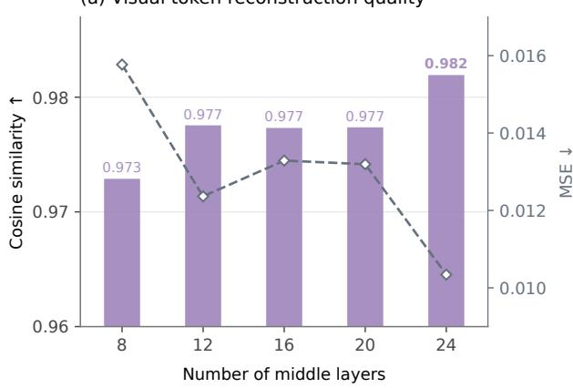

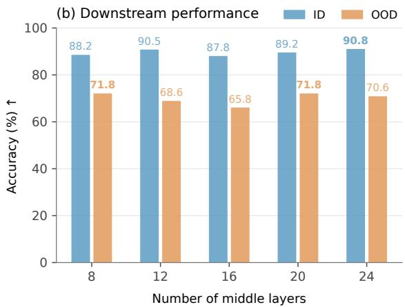  
Figure 10 Efect of the number of middle layers on model performance.

Table 8 Hyperparameters for the two-stage training procedure on Tetris-2D.
<table><tr><td>Hyperparameter</td><td>Stage 1</td><td>Stage 2</td></tr><tr><td>Initialization</td><td>Qwen2.5-VL-7B-Instruct</td><td>Stage 1 checkpoint</td></tr><tr><td>Learning rate</td><td>1e-4</td><td>1e-5</td></tr><tr><td>Optimizer</td><td>AdamW</td><td>AdamW</td></tr><tr><td>LR scheduler</td><td>Constant</td><td>Cosine</td></tr><tr><td>Warmup ratio</td><td>0</td><td>0.03</td></tr><tr><td>Weight decay</td><td>0</td><td>0.01</td></tr><tr><td>Per-device batch size</td><td>1</td><td>1</td></tr><tr><td>GPU Model</td><td>H200</td><td>H200</td></tr><tr><td>Number of GPUs</td><td>8</td><td>8</td></tr><tr><td>Gradient accumulation steps</td><td>1</td><td>1</td></tr><tr><td>Effective global batch size</td><td>8</td><td>8</td></tr><tr><td>Precision</td><td>BF16</td><td>BF16</td></tr><tr><td>Flow/MSE loss weight</td><td>1</td><td>0</td></tr><tr><td>Pixel loss weight</td><td>0</td><td>0</td></tr><tr><td>CE loss weight</td><td>0</td><td>1</td></tr><tr><td>Loss formula</td><td>1.0 × flow MSE</td><td> $1 . 0 \times \mathrm { C E }$ </td></tr><tr><td>VLM backbone</td><td>Frozen</td><td>Trainable</td></tr><tr><td>Vision encoder</td><td>Frozen</td><td>Frozen</td></tr><tr><td>Latent-generation branch</td><td>Trainable</td><td>Trainable</td></tr><tr><td>Trainable parameters</td><td>0.959B</td><td>8.572B</td></tr><tr><td>Frozen parameters</td><td>8.289B</td><td>0.677B</td></tr><tr><td>Total parameters</td><td>9.248B</td><td>9.248B</td></tr><tr><td>Trainable ratio</td><td>10.37%</td><td>92.68%</td></tr></table>

Additional results on generation layers. We further vary the number of generation layers from 8 to 24. As shown in Figure 10, increasing the generation-branch depth generally improves visual-state reconstruction quality, but does not consistently improve downstream accuracy. This suggests that better reconstruction alone does not necessarily translate into better reasoning performance.

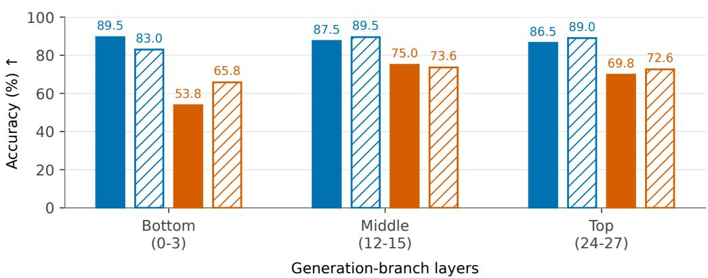  
Figure 11 Efect of generation-branch initialization on downstream performance across diferent insertion depths.

## D Future Work

Our training paradigm also supports pretraining a VLM with an internal world model, provided that an interleaved visual-textual reasoning dataset is available. However, existing interleaved datasets are primarily derived from static sources, such as webpages. Ideally, such a dataset would instead capture embodied experience, in which every physical action is paired with its resulting visual observation. Complete trajectories, including the initial instruction and observation, interleaved actions and observations, and final outcome, could be collected from either real-world robots or simulated embodied agents. A VLM pretrained on these trajectories could learn to mentally simulate the consequences of actions, potentially improving spatial reasoning and agentic planning. We leave the construction of such a dataset and the exploration of this training paradigm to future work.