# WorldAttention: An Efficient Attention Architecture for Interactive Video World Models

Zeyu Zhang1∗, Jinyuan Mao2∗, Dakai An3∗, Wangbo Zhao3, Hanfeng Lu3, Jiasheng Tang1,4†, Yinghao Yu5, Wei Wang3, Bohan Zhuang1,2†

1DAMO Academy, Alibaba Group 2Zhejiang University

3Hong Kong University of Science and Technology 4Hupan Lab 5TRE, Alibaba Group ∗Equal contribution, †Corresponding authors.

Leveraging the paradigm of autoregressive difusion, text-conditioned interactive video world models aim to simulate temporally coherent environments guided by textual instructions. While enabling lowlatency, long-duration generation is pivotal for embodied AI and simulation-based planning, current frameworks primarily rely on sliding-window mechanisms to bound computational complexity. However, this approach inherently sacrifices historical context, undermining the long-range interactive capabilities. Conversely, maintaining a full-history cache remains computationally prohibitive and memory-intensive: the quadratic complexity of attention leads to excessive computational overhead, while the linear growth of the KV cache inevitably leads to GPU memory saturation. To overcome these limitations, we propose WorldAttention, a system-oriented attention architecture that achieves high eficiency through the co-design of specialized attention kernels and hierarchical KV cache management. First, we introduce Hybrid Sparse Attention (HSA), which integrates linear global attention supplemented with head-adaptive sparse attention. Additionally, we design a Hierarchical KV Cache (HKV) that organizes historical KV pairs into semantically indexed pages across multi-tier memory, enabling finegrained retrieval and controlled GPU residency. These two designs are supported by tailored kernels to efectively translate their theoretical eficiency into real-world performance. Extensive experiments on VBench-Long and InterVBench demonstrate that WorldAttention consistently surpasses prior state-of-the-art methods, achieving subject consistency scores of 0.9472 on VBench-Long and 0.9668 on InterVBench, respectively. Our system-oriented kernel customization for HSA brings a 14.02× speedup over FlashAttention-3, and a 2.21× end-to-end speed up together with HKV. At inference, WorldAttention sustains 22.0 FPS on a single NVIDIA H100.

Date: September 29, 2026 Website: https://alibaba-damo-academy.github.io/WorldAttention Code: https://github.com/alibaba-damo-academy/WorldAttention Email: jiasheng.tjs@alibaba-inc.com, bohan.zhuang@gmail.com

## 1 Introduction

Text-conditioned interactive video world models [42, 29] aim to generate dynamic, coherent video environments that respond to user prompts over time. A key challenge unique to this setting is interactive prompt switching: user inputs can abruptly shift semantic focus and require recalling fine-grained visual details from previous memory. This fundamentally distinguishes interactive generation from standard long video modeling, as the model must maintain long-range identity, scene consistency, and causal coherence across the entire history. As a result, the KV cache must preserve the full history to support interaction recall. However, this creates a fundamental tension between memory preservation and system eficiency: while preserving long-range memory is necessary for interaction, the KV cache grows linearly with sequence length and quickly exceeds GPU memory capacity, limiting scalability for long-horizon interactive generation.

Existing KV cache strategies make diferent trade-ofs between memory eficiency and recall ability. (1) Sliding-window KV cache [7, 12, 29, 5, 33] retains only recent tokens, which reduces GPU memory usage but permanently discards earlier visual context. When a user prompt references a scene from tens of seconds earlier, the required visual details are irretrievably lost, making sliding-window caching functionally inadequate for interactive generation. (2) Sparse retrieval KV cache [42], in contrast, preserves all KV cache to support interactive recall. However, retaining the full history immediately introduces severe storage pressure, as the KV cache grows linearly with video length and quickly exceeds GPU memory capacity. This creates a hard constraint: full-history KV must be maintained for interaction, but must be eficiently managed, necessitating an eficient attention architecture for both attention re-design and hierarchical caching mechanism.

To address these challenges, we propose WorldAttention, an eficient attention architecture with tailored kernels that aims at memory management and computation complexity in interactive video generation, as shown in Figure 1. First, to enable full-history restoration under limited GPU memory, we introduce Hierarchical KV Cache (HKV), which implements a fine-grained page-level storage and retrieval mechanism across multi-tier memory (GPU, CPU, and NVMe). This allows the system to maintain a vast historical context while minimizing GPU memory residency. However, the retrieved KV pages still contain a large number of tokens, leading to significant redundant computation during decoding. To address this, we further introduce Hybrid Sparse Attention (HSA), which performs dual-branch sparse attention within retrieved pages via head-adaptive sparsity. Finally, hierarchical retrieval and sparse execution introduce non-contiguous memory access patterns, which severely degrade hardware eficiency. To resolve this, we adapt the attention kernel with KV layout, reorganizing retrieved pages into contiguous bufers and enabling eficient parallel execution. Extensive experiments demonstrate that WorldAttention consistently outperforms prior state-ofthe-art methods, achieving subject consistency scores of 0.9472 on VBench-Long and 0.9668 on InterVBench, which shows the improvement of our method on interactive video generation over long horizons, while significantly reducing memory and computation overhead.

Our contributions are summarized as follows:

• We propose WorldAttention, an eficient attention architecture specifically designed for interactive long video generation to systematically overcome the constraints of quadratic attention computation and growing memory footprint.

• We introduce a system-oriented co-design that integrates Hierarchical KV Cache (HKV) for paged storage and retrieval with Hybrid Sparse Attention (HSA) to reduce computation redundancy. Our system-oriented kernel integration for HSA brings a 14.02× speedup over FlashAttention-3, and a 2.21× end-to-end speed up together with HKV.

• We demonstrate through comprehensive evaluations that our method achieves state-of-the-art performance, enabling scalable, coherent, and high-fidelity interactive video generation over minute-long horizons.

## 2 Related Work

KV Cache in video world models. In video generation, related formulations adopt chunk-wise difusion with causal conditioning to interpolate between pure difusion (e.g. DiT-style bidirectional attention without KV caching) and AR (variable-length decoding with KV caching but weaker visual fidelity and limited parallelism). Representation methods with a sliding-window KV cache include MAGI-1 [21], Self Forcing [12], Self-Forcing++ [7], Rolling Forcing [16], Deep Forcing [33], StreamDifusionV2 [9], PAVDM [27], LongLive [29], CausVid [35], SkyReels-V2 [5], and Infinity-RoPE [32], etc, which condition each new chunk on past chunks via a sliding-window KV cache to extend temporal horizons while retaining difusion denoising quality within each chunk. Another paradigm, the sparse retrieval KV cache [42], introduces a semantic sparse KV cache that retrieves the most relevant chunk-level prompts, efectively maintaining long-horizon memory during interactive generation. However, the continuously growing KV cache and the relatively coarse retrieva granularity become new bottlenecks. To overcome these limitations, WorldAttention proposes a hierarchical KV cache management framework with page-level sparse retrieval, further improving eficiency and generation quality.

Sparse and linear attention in video generation. Recent advances in video generation increasingly rely on structured sparsity and linearized attention to improve eficiency. Sparse attention methods reduce quadratic complexity by pruning token interactions. Sliding Tile Attention [41, 15] introduces tiled sparse patterns to model spatial-temporal correlations, while SpargeAttn [38] progressively prunes tokens based on importance scores. DiTFastAttn [36] dynamically filters irrelevant patches to accelerate computation, and Sparse VideoGen [25, 30] leverages sparsely sampled motion priors to reduce temporal redundancy. More recent structured block-sparse designs, such as VSA [40], align sparsity with GPU execution to achieve practical speedups. Linear attention methods approximate global attention with low-rank or kernel-based projections to achieve O(L) complexity. Representative approaches include LinFormer [23], Gated Linear Attention [31], and Tiled Flash Linear Attention [2]. Moreover, hybrid sparse-linear formulations such as SEA [14] and Sparse Linear Attention (SLA) [37], which combine coarse global modeling with local sparse refinement. While these approaches demonstrate the efectiveness of structured sparsity and linearization for scaling video transformers, they are often designed primarily for inference-time acceleration, lack adaptation to chunk-wise long-horizon video generation, and do not explicitly co-design attention structure with KV management and hardware-aware kernel execution.

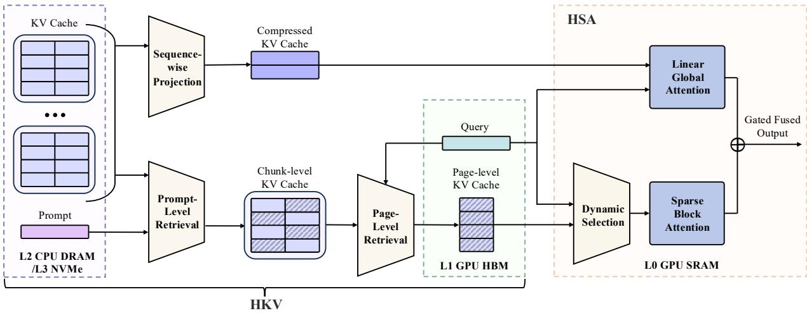  
Figure 1 Overall architecture of WorldAttention. We propose a system-oriented co-design using Hierarchical KV Cache (HKV) for coarse-to-fine memory retrieval, and Hybrid Sparse Attention (HSA) for eficient dual-branch attention computation.

## 3 Method

## 3.1 Overview

Figure 1 illustrates the overall pipeline of WorldAttention for interactive long video generation. Given an initial text prompt, the video is generated chunk by chunk under an autoregressive difusion framework. At each decoding step, the current prompt and latent chunk produce query tokens, while historical chunks provide cached keys and values (KV) for long-range conditioning. Unlike standard long video generation, interactive generation allows user prompts to change across chunks, requiring the model to retrieve relevant historical context from earlier video segments. To support this, we maintain a global KV cache over all past chunks and dynamically select relevant KV entries during decoding. WorldAttention is the core attention module that operates on the retrieved KV cache. It consists of three components: (1) a Hierarchical KV Cache (HKV) that organizes and retrieves KV entries across memory tiers, (2) a Hybrid Sparse Attention (HSA) that performs eficient attention over the retrieved KV tokens, and (3) a customized kernel integration with memory-layout optimization that enables eficient execution.

## 3.2 Hierarchical KV Cache

KV cache in interactive long video generation faces two significant challenges: First, existing designs lack cross-tier data migration, forcing all KV cache to remain in GPU memory and causing memory usage to grow with video length. Second, retrieval is typically performed at the chunk level, loading entire chunks even though only a small subset of tokens is relevant, leading to redundancy and imprecise retrieval. These issues stem from a mismatch between memory organization and attention usage: relevant context is often localized, while KV cache is managed at coarse chunk granularity.

Therefore, we introduce a page-level KV abstraction, which partitions each chunk into semantically coherent KV pages P, where each page contains 8 video frames, as shown in Figure 7. This enables fine-grained retrieval and eficient cross-tier memory management, forming the foundation of our Hierarchical KV Cache (HKV).

Cache hierarchy and dataflow. The hierarchical cache organizes KV cache into multiple storage tiers: L0 (Accelerator-Managed): a GPU SRAM serves as the high-speed on-chip memory used for computing Q, K, and V in FlashAttention-Style. L1 (Device-Managed): a GPU HBM stores the retrieved KV pages from the KV bank, along with chunk indices composed of prompt embeddings and page indices constructed from the keys K. L2 (Host-Managed): a CPU DRAM contains KV chunks that are not retrieved during the generation of the current chunk. L3: an NVMe stores all KV chunks, serving as the final fallback for historical context. This design aligns access frequency with hardware bandwidth, allowing retrieved KV pages to remain in GPU memory, while less frequently accessed KV chunks are automatically ofloaded to the larger and lower-cost CPU memory. This enables more accurate historical guidance for the current chunk generation.

Global KV bank initialization. All historical KV pairs produced by HSA are first written into a unified KV bank, denoted as $\boldsymbol { B } = \{ \mathcal { C } _ { 1 } , \mathcal { C } _ { 2 } , \ldots , \mathcal { C } _ { M } \}$ , where each $\mathcal { C } _ { m }$ corresponds to a KV chunk generated from a video segment. Each chunk $\mathcal { C } _ { m }$ is further partitioned into fixed-size KV pages,

$$
\mathcal { C } _ { m } = \{ \mathcal { P } _ { m , 1 } , . . . , \mathcal { P } _ { m , J } \} , \qquad \mathcal { P } _ { m , j } = \left( \mathbf { K } _ { m , j } , \mathbf { V } _ { m , j } \right) ,\tag{1}
$$

where each page contains KV pairs of 8 consecutive frames.

Stage 1: prompt-level retrieval. When generating the current chunk $t ,$ we first retrieve the top-1 KV chunk by computing cosine similarity between the current prompt embedding and previous-chunk prompt embeddings in the KV Bank. The Top-1 KV chunk will be used for Stage 2 retrieval.

Stage 2: page-level retrieval. We compute the similarity score between the average query $\bar { Q } \in \mathbb { R } ^ { d _ { k } }$ of the current chunk and the average key $\bar { K } _ { m , j } \in \mathbb { R } ^ { d _ { k } }$ of each KV page from the retrieved chunks in Stage 1: $\begin{array} { r } { \alpha _ { m , j } = \frac { \bar { Q } ^ { \top } \bar { K } _ { m , j } } { \sqrt { d _ { k } } } } \end{array}$

Based on these scores, we select the top- $K _ { p }$ pages across all candidate chunks to form $\mathcal { P } _ { \mathrm { s e l } }$ . In practice, we set $K _ { p } = 4$ to bound retrieval overhead. Since each page contains 8 frames and each frame contains 1560 tokens, the retrieved KV cache contains $4 \times 8 \times 1 5 6 0 = 4 9 { , } 9 2 0$ tokens.

Active KV construction. The final active KV cache is constructed by concatenating the retrieved KV pages:

$$
K _ { \mathrm { a c t i v e } } = \mathrm { C o n c a t } \big \{ \mathbf { K } _ { m , j } ~ | ~ \mathcal { P } _ { m , j } \in \mathscr { P } _ { \mathrm { s e l } } \big \} , \qquad \mathcal { V } _ { \mathrm { a c t i v e } } = \mathrm { C o n c a t } \big \{ \mathbf { V } _ { m , j } ~ | ~ \mathcal { P } _ { m , j } \in \mathscr { P } _ { \mathrm { s e l } } \big \} .\tag{2}
$$

These KV pairs are materialized in L1 (GPU HBM) to guide attention computation of the current chunk.

To manage memory eficiently, KV pages that are not selected by the retrieval stage are automatically migrated to lower memory tiers. When the GPU memory (L1) exceeds its capacity, inactive KV pages are ofloaded to CPU memory (L2). If the L2 capacity is further exceeded, the least recently used pages are migrated to the NVMe storage tier (L3). The NVMe tier maintains a full backup of all historical KV pages, ensuring that any page can be restored when needed. As illustrated in Fig. 4, while the total KV cache grows, the GPU memory (L1) occupancy remains bounded by ofloading inactive pages to the CPU memory (L2).

## 3.3 Hybrid Sparse Attention

Although HKV retrieves relevant pages, they still harbor significant spatial-temporal redundancy. To achieve finer compute allocation, we propose Hybrid Sparse Attention (HSA), a dual-branch sparse attention mechanism that integrates global structure modeling, fine-grained block sparsity, and head-adaptive sparsity control. HSA is designed to reduce attention complexity while preserving expressiveness across disparate attention patterns.

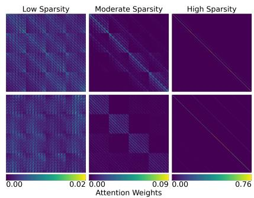  
Figure 2 Visualization of sparsity patterns across diferent attention heads.

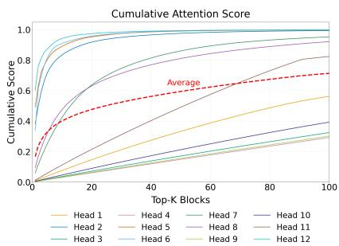  
Figure 3 Head-wise cumulative attention distribution over Top-K selected blocks.

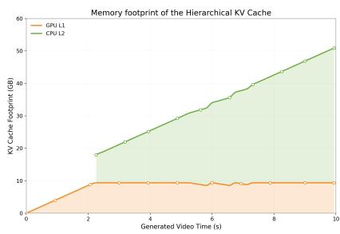  
Figure 4 Memory footprint analysis of HKV.

HSA targets video DiTs where a latent volume of shape $( T , H , W )$ is flattened into a sequence of length $L = T H W$ . It decomposes attention into a linear branch that captures long-range dependencies with linear complexity, a sparse branch that performs block-sparse attention over selected regions, and introduces head-level dynamic sparsity for per-head compute allocation.

Linear branch: linear global attention. The linear branch applies a sequence-wise projection to reduce the efective attention dimension along the sequential axis following [23]. Keys and Values are projected into a lower-dimensional latent space before attention computation, reducing the complexity from $\mathcal { O } ( L ^ { 2 } )$ to $\mathcal { O } ( L r )$ which is linear in L when the projection rank $r \ll L$ is fixed. This branch produces a dense but low-rank approximation of global attention, enabling eficient propagation of long-range context without sacrificing coverage.

Concretely, for each head h, we introduce two learned projection matrices $\mathbf { E } _ { K } ^ { ( h ) } \in \mathbb { R } ^ { L \times r }$ and $\mathbf { E } _ { V } ^ { ( h ) } \in \mathbb { R } ^ { L \times r }$ 2 where $r \ll L$ is a fixed projection rank (shared across samples). We form compressed keys/values

$$
\widetilde { \mathbf { K } } ^ { ( h ) } = \left( \mathbf { E } _ { K } ^ { ( h ) } \right) ^ { \top } \mathbf { K } ^ { ( h ) } , \quad \widetilde { \mathbf { K } } ^ { ( h ) } \in \mathbb { R } ^ { r \times d _ { k } } , \quad \widetilde { \mathbf { V } } ^ { ( h ) } = \left( \mathbf { E } _ { V } ^ { ( h ) } \right) ^ { \top } \mathbf { V } ^ { ( h ) } , \quad \widetilde { \mathbf { V } } ^ { ( h ) } \in \mathbb { R } ^ { r \times d _ { k } } .\tag{3}
$$

The linear-branch output is then computed via $\begin{array} { r } { \mathbf { O } _ { \mathrm { l i n } } ^ { ( h ) } = \mathrm { S o f t m a x } \left( \frac { \mathbf { Q } ^ { ( h ) } \left( \widetilde { \mathbf { K } } ^ { ( h ) } \right) ^ { \top } } { \sqrt { d _ { k } } } \right) \widetilde { \mathbf { V } } ^ { ( h ) } \in \mathbb { R } ^ { L \times d _ { k } } . } \end{array}$

This reduces attention complexity from $\mathcal { O } ( L ^ { 2 } d _ { k } )$ to $\mathcal { O } ( L r d _ { k } )$

Sparse branch: dynamic block-sparse attention. The sparse branch performs attention at the original token resolution but restricts computation to a sparse set of selected blocks.

We first partition tokens within the retrieved pages into blocks of size B and construct a pooled attention map for coarse block selection. Attention is then computed only within the selected blocks using a block-sparse kernel:

$$
{ \bf O } _ { \mathrm { s p } } ^ { ( h ) } = \mathrm { S D P A } _ { \mathrm { b l o c k } } \big ( { \bf Q } ^ { ( h ) } , { \bf K } ^ { ( h ) } , { \bf V } ^ { ( h ) } ; { \mathcal S } ^ { ( h ) } \big ) ,\tag{4}
$$

where $S ^ { ( h ) }$ denotes the set of selected block connections for head h.

Head-level sparsity adaptation. Instead of using a fixed sparsity pattern shared across all heads, we allow each attention head dynamically to determine its own sparsity level based on its attention distribution. This is motivated by the observation that diferent heads capture heterogeneous patterns: some focus on localized interactions, while others encode broader contextual dependencies. As shown in Figure 2, attention patterns of each head vary from dense global correlations to localized diagonal structures, suggesting a uniform sparsity strategy is suboptimal. Moreover, as shown in Figure 3, diferent heads exhibit diferent accumulation rates, indicating that attention sparsity is head-dependent and motivating our adaptive approach.

Concretely, for each head, we select the minimal set of blocks whose cumulative attention mass exceeds a threshold $\tau _ { h }$ , allowing diferent heads to operate at diferent sparsity levels and allocate computation adaptively. This head-level adaptation provides finer granularity than layer-level or global sparsity schemes, enabling eficient computation while preserving diverse attention patterns. The complete algorithmic procedure are provided in Appendix F.

Inter- and intra-chunk sparse granularity. Following the hardware-aware block-sparse preliminaries in Appendix A.1.3, the tile size B is preferably a multiple of 16 to align with Hopper MMA / WGMMA computation units. This constraint ensures eficient tensor core utilization and avoids degradation in arithmetic intensity. We distinguish between inter-chunk and intra-chunk sparse granularity. For retrieved historical KV pages that serve as auxiliary context, we adopt a coarser partition with $B _ { \mathrm { i n t e r } } = 1 2 8$ and $\left( C _ { t } , C _ { h } , C _ { w } \right) = \left( 4 , 8 , 4 \right)$ to reduce scheduling overhead and improve memory throughput. In contrast, tokens within the current chunk are critical for accurate generation, so we employ a finer partition $B _ { \mathrm { i n t r a } } = 6 4$ with $\left( C _ { t } , C _ { h } , C _ { w } \right) = \left( 4 , 4 , 4 \right)$ to enable more precise token interactions. Both configurations satisfy hardware-friendly divisibility and are executed through the same block-sparse kernel interface, balancing computational eficiency and attention precision.

Gated fusion of two branches. The outputs of the two branches are combined via a learned gating mechanism applied at the attention-head level. We combine the two branches using head-specific multiplicative gates applied at the SDPA outputs (without bounding activation). For each head h, we predict gates from the hidden states with two learnable weights $\mathbf { W } _ { \mathrm { l i n } } ^ { ( h ) } , \bar { \mathbf { W } } _ { \mathrm { s p } } ^ { ( h ) }$ , and fuse outputs:

$$
\mathbf { G } _ { \mathrm { l i n } } ^ { ( h ) } = \mathbf { X } \mathbf { W } _ { \mathrm { l i n } } ^ { ( h ) } , \qquad \mathbf { G } _ { \mathrm { s p } } ^ { ( h ) } = \mathbf { X } \mathbf { W } _ { \mathrm { s p } } ^ { ( h ) } , \qquad \mathbf { O } ^ { ( h ) } = \mathbf { O } _ { \mathrm { l i n } } ^ { ( h ) } \odot \mathbf { G } _ { \mathrm { l i n } } ^ { ( h ) } + \mathbf { O } _ { \mathrm { s p } } ^ { ( h ) } \odot \mathbf { G } _ { \mathrm { s p } } ^ { ( h ) } .\tag{5}
$$

We also apply a sigmoid activation to the gates [17], introducing non-linearity and enabling query-dependent modulation of the two attention branches. This gating mechanism allows the model to dynamically balance the contributions of the linear and sparse branches at both the head and token levels, improving stability and expressiveness. The linear branch ensures global information flow, the sparse branch enables high-resolution modeling where necessary.

## 4 Experiments

## 4.1 Benchmarks and Metrics

We compare our method with state-of-the-art baselines on VBench-Long [13]. Because the standard VBench Long protocol is not directly applicable (only 30s), we use the prompts curated by LongLive [29], a custom set of 160 interactive 60-second videos, each comprising six successive 10-second prompts. To showcase our capability in interactive long video generation, we further extend our evaluation to InterVBench [42, 20], which contains 1,000 videos with chunk-level annotations every 2–3 seconds in each video. For metric details, see Appendix B.

## 4.2 Implementation Details

To ensure a fair comparison, we follow the training strategy in Self-Forcing [12] and LongLive [29]. We build WorldAttention upon Wan2.1-T2V-1.3B [22], which generates 5-second clips at 16 FPS with a resolution of 480p (832 × 480). We first adapt the pretrained model into a 4-step causal-attention model using a self-forcing DMD pipeline [12, 34] on the VidProM dataset [24]. We then use the student model and a Wan2.1-T2V-14B teacher model to perform interactive long tuning on switch prompts with 60s length. The switch prompts are constructed following LongLive [29], where Qwen2-72B-Instruct [1] generates follow-up prompts conditioned on each original VidProM prompt. During training, each iteration extends the model’s own rollout by generating successive 5s clips until reaching a maximum length of 60s. Each training sample contains exactly one prompt switch, with the switch time uniformly sampled between 5s and 55s. The full training process takes approximately 30 hours on 32 NVIDIA H100 GPUs, supported by 192 CPU cores and 960 GB of CPU memory. We employ AdamW and stepwise decay schedule for all stages of training. The initial learning rate is $1 \times 1 0 ^ { - 4 }$ , then reduced to $5 \times 1 0 ^ { - 5 }$ , with the weight decay set to $1 \times 1 0 ^ { - 4 }$

Table 1 Comparison of different methods on VBench-Long [13]. We extended VBench-Long to 60 seconds following LongLive [29].
<table><tr><td rowspan=1 colspan=1>Method</td><td rowspan=1 colspan=1>Subject↑Consistency</td><td rowspan=1 colspan=1>Background↑Consistency</td><td rowspan=1 colspan=1>Motion↑Smoothness</td><td rowspan=1 colspan=1>Dynamic↑Degree</td><td rowspan=1 colspan=1>Aesthetic↑Quality</td><td rowspan=1 colspan=1>Image↑Quality</td></tr><tr><td rowspan=1 colspan=1>MAGI-1 [21]</td><td rowspan=1 colspan=1>0.8320</td><td rowspan=1 colspan=1>0.8931</td><td rowspan=1 colspan=1>0.9740</td><td rowspan=1 colspan=1>0.5537</td><td rowspan=1 colspan=1>0.5010</td><td rowspan=1 colspan=1>0.6120</td></tr><tr><td rowspan=1 colspan=1>Self Forcing [12]</td><td rowspan=1 colspan=1>0.8211</td><td rowspan=1 colspan=1>0.9050</td><td rowspan=1 colspan=1>0.9799</td><td rowspan=1 colspan=1>0.6015</td><td rowspan=1 colspan=1>0.5130</td><td rowspan=1 colspan=1>0.6218</td></tr><tr><td rowspan=1 colspan=1>PAVDM [27]</td><td rowspan=1 colspan=1>0.8415</td><td rowspan=1 colspan=1>0.9273</td><td rowspan=1 colspan=1>0.9769</td><td rowspan=1 colspan=1>0.6537</td><td rowspan=1 colspan=1>0.4970</td><td rowspan=1 colspan=1>0.6280</td></tr><tr><td rowspan=1 colspan=1>FramePack [39]</td><td rowspan=1 colspan=1>0.9019</td><td rowspan=1 colspan=1>0.9450</td><td rowspan=1 colspan=1>0.9805</td><td rowspan=1 colspan=1>0.5715</td><td rowspan=1 colspan=1>0.5044</td><td rowspan=1 colspan=1>0.6381</td></tr><tr><td rowspan=1 colspan=1>NOVA [8]</td><td rowspan=1 colspan=1>0.7750</td><td rowspan=1 colspan=1>0.8806</td><td rowspan=1 colspan=1>0.9894</td><td rowspan=1 colspan=1>0.1200</td><td rowspan=1 colspan=1>0.4753</td><td rowspan=1 colspan=1>0.4497</td></tr><tr><td rowspan=1 colspan=1>CausVid [35]</td><td rowspan=1 colspan=1>0.8675</td><td rowspan=1 colspan=1>0.8985</td><td rowspan=1 colspan=1>0.9847</td><td rowspan=1 colspan=1>0.5200</td><td rowspan=1 colspan=1>0.6288</td><td rowspan=1 colspan=1>0.6747</td></tr><tr><td rowspan=1 colspan=1>Self-Forcing++ [7]</td><td rowspan=1 colspan=1>0.9165</td><td rowspan=1 colspan=1>0.9092</td><td rowspan=1 colspan=1>0.9803</td><td rowspan=1 colspan=1>0.5865</td><td rowspan=1 colspan=1>0.5482</td><td rowspan=1 colspan=1>0.6453</td></tr><tr><td rowspan=1 colspan=1>Deep Forcing [33]</td><td rowspan=1 colspan=1>0.9285</td><td rowspan=1 colspan=1>0.9136</td><td rowspan=1 colspan=1>0.9819</td><td rowspan=1 colspan=1>0.7035</td><td rowspan=1 colspan=1>0.6041</td><td rowspan=1 colspan=1>0.6455</td></tr><tr><td rowspan=1 colspan=1>StreamDiffusionV2 [9]</td><td rowspan=1 colspan=1>0.9036</td><td rowspan=1 colspan=1>0.9051</td><td rowspan=1 colspan=1>0.9745</td><td rowspan=1 colspan=1>0.4552</td><td rowspan=1 colspan=1>0.5547</td><td rowspan=1 colspan=1>0.5528</td></tr><tr><td rowspan=1 colspan=1>SkyReels-V2-DF-1.3B [5]</td><td rowspan=1 colspan=1>0.9391</td><td rowspan=1 colspan=1>0.9580</td><td rowspan=1 colspan=1>0.9838</td><td rowspan=1 colspan=1>0.6529</td><td rowspan=1 colspan=1>0.5320</td><td rowspan=1 colspan=1>0.6315</td></tr><tr><td rowspan=1 colspan=1>LCT (MMDiT-3B) [10]</td><td rowspan=1 colspan=1>0.9380</td><td rowspan=1 colspan=1>0.9623</td><td rowspan=1 colspan=1>0.9816</td><td rowspan=1 colspan=1>0.6875</td><td rowspan=1 colspan=1>0.5200</td><td rowspan=1 colspan=1>0.6345</td></tr><tr><td rowspan=2 colspan=1>MoC [4]Infinity-RoPE [32]</td><td rowspan=1 colspan=1>0.9398</td><td rowspan=1 colspan=1>0.9670</td><td rowspan=1 colspan=1>0.9851</td><td rowspan=1 colspan=1>0.7500</td><td rowspan=1 colspan=1>0.5547</td><td rowspan=1 colspan=1>0.6396</td></tr><tr><td rowspan=1 colspan=1>0.9352</td><td rowspan=1 colspan=1>0.9395</td><td rowspan=1 colspan=1>0.9710</td><td rowspan=1 colspan=1>0.5395</td><td rowspan=1 colspan=1>0.6045</td><td rowspan=1 colspan=1>0.6475</td></tr><tr><td rowspan=1 colspan=1>BIFE [42]</td><td rowspan=1 colspan=1>0.9410</td><td rowspan=1 colspan=1>0.9650</td><td rowspan=1 colspan=1>0.9870</td><td rowspan=1 colspan=1>0.7720</td><td rowspan=1 colspan=1>0.5839</td><td rowspan=1 colspan=1>0.6527</td></tr><tr><td rowspan=1 colspan=1>LongLive [29]</td><td rowspan=1 colspan=1>0.9403</td><td rowspan=1 colspan=1>0.9495</td><td rowspan=1 colspan=1>0.9845</td><td rowspan=1 colspan=1>0.7321</td><td rowspan=1 colspan=1>0.5795</td><td rowspan=1 colspan=1>0.6483</td></tr><tr><td rowspan=1 colspan=1>Rolling Forcing [16]</td><td rowspan=1 colspan=1>0.9409</td><td rowspan=1 colspan=1>0.9447</td><td rowspan=1 colspan=1>0.9865</td><td rowspan=1 colspan=1>0.3600</td><td rowspan=1 colspan=1>0.6350</td><td rowspan=1 colspan=1>0.7242</td></tr><tr><td rowspan=1 colspan=1>WorldAttention (Ours)</td><td rowspan=1 colspan=1>0.9472</td><td rowspan=1 colspan=1>0.9691</td><td rowspan=1 colspan=1>0.9915</td><td rowspan=1 colspan=1>0.7758</td><td rowspan=1 colspan=1>0.6344</td><td rowspan=1 colspan=1>0.7259</td></tr></table>

Table 2 Interactive long video evaluation on VBench-Long [13]. Quality scores are reported on the full 60s sequence. CLIP scores are reported on 10s video segments with identical semantics (↑ higher is better).

<table><tr><td rowspan="2">Method</td><td rowspan="2">Quality Score ↑</td><td colspan="6">CLIP Score ↑</td></tr><tr><td>0-10s</td><td>10-20s</td><td>20-30s</td><td>30-40s</td><td>40-50s</td><td>50-60s</td></tr><tr><td>SkyReels-V2</td><td>80.49</td><td>20.96</td><td>22.51</td><td>25.78</td><td>18.45</td><td>19.57</td><td>19.61</td></tr><tr><td>Self-Forcing</td><td>82.46</td><td>28.46</td><td>24.89</td><td>23.53</td><td>22.96</td><td>23.07</td><td>23.19</td></tr><tr><td>BIFE</td><td>84.38</td><td>28.60</td><td>25.95</td><td>23.69</td><td>24.41</td><td>22.85</td><td>24.10</td></tr><tr><td>LongLive</td><td>83.95</td><td>28.85</td><td>25.68</td><td>24.64</td><td>24.23</td><td>24.32</td><td>24.32</td></tr><tr><td>WorldAttention (Ours)</td><td>85.53</td><td>29.04</td><td>25.99</td><td>25.80</td><td>24.72</td><td>24.25</td><td>25.01</td></tr></table>

## 4.3 Main Results

VBench-Long. As shown in Table 1, WorldAttention achieves the best performance across nearly all metrics on VBench-Long. In particular, it consistently improves subject consistency, background consistency, motion smoothness, and dynamic degree, while also achieving the highest image quality. For semantic alignment, we split each video at prompt boundaries and compute CLIP-based [18] semantic scores for each segment. As reported in Table 2, WorldAttention demonstrates strong prompt adherence, smooth transitions across prompt changes, and high long-range consistency, while maintaining high generation throughput. These gains stem from our unified design for long-horizon interactive generation. First, HKV preserves full-history context while enabling accurate retrieval, which significantly improves subject and background consistency by preventing identity drift over long rollouts. Second, HSA’s dual-branch design keeps global context with its linear branch and captures local details with its sparse branch. This combination improves motion smoothness, preserves important details, and enhances long-range semantic consistency, leading to better visual quality.

InterVBench. For results on InterVBench, please refer to Table 12 in Appendix E.

Table 3 Single-prompt 30s long video evaluation on VBench-Long [13].
<table><tr><td>Model</td><td>Quality Score ↑</td><td>Throughput (FPS) ↑</td></tr><tr><td>SkyReels-V2</td><td>80.77</td><td>0.49</td></tr><tr><td>FramePack</td><td>83.61</td><td>0.92</td></tr><tr><td>Self-Forcing</td><td>83.82</td><td>17.0</td></tr><tr><td>BIFE</td><td>85.18</td><td>18.0</td></tr><tr><td>LongLive (re-cache 12 frames)</td><td>85.44</td><td>20.7</td></tr><tr><td>LongLive (re-cache 32 frames)</td><td>85.82</td><td>6.70</td></tr><tr><td>WorldAttention (Ours)</td><td>86.55</td><td>22.0</td></tr></table>

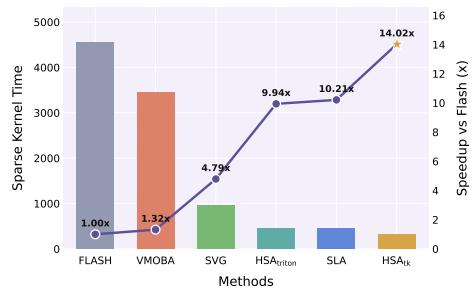  
Figure 5 Attention kernel speedup.

Table 4 Comparison of different modification on HSA. We report VBench-Long [13] metrics following $[ 1 0 , 4 ] .$
<table><tr><td rowspan=1 colspan=1>Method</td><td rowspan=1 colspan=1>SubjectConsistency↑</td><td rowspan=1 colspan=1>Background←Consistency</td><td rowspan=1 colspan=1>Motion↑Smoothness</td><td rowspan=1 colspan=1>Dynamic↑Degree</td><td rowspan=1 colspan=1>Aesthetic↑Quality</td><td rowspan=1 colspan=3>Image $\mathrm { Q u a l i t y } ^ { \uparrow }$ </td></tr><tr><td rowspan=1 colspan=1>Linear Only</td><td rowspan=1 colspan=1>0.9021</td><td rowspan=1 colspan=1>0.9365</td><td rowspan=1 colspan=1>0.9747</td><td rowspan=1 colspan=1>0.5825</td><td rowspan=1 colspan=1>0.5632</td><td rowspan=1 colspan=3>0.6490</td></tr><tr><td rowspan=1 colspan=1>Sparse Only:</td><td rowspan=1 colspan=1></td><td rowspan=1 colspan=1></td><td rowspan=1 colspan=1></td><td rowspan=1 colspan=1></td><td rowspan=1 colspan=4></td></tr><tr><td rowspan=2 colspan=1> $\tau _ { \mathrm { m a x } } = 0 . 7 5 , \tau _ { \mathrm { m i n } } = 0 . 3 5$  $\tau _ { \mathrm { m a x } } = 1 . 0 0 , \tau _ { \mathrm { m i n } } = 0 . 1 0$  $\tau _ { \mathrm { m a x } } = 1 . 0 0 , \tau _ { \mathrm { m i n } } = 0 . 3 5$ </td><td rowspan=2 colspan=1>0.87360.92540.9365</td><td rowspan=1 colspan=1>0.88450.9424</td><td rowspan=1 colspan=1>0.97350.9880</td><td rowspan=1 colspan=1>0.60530.6621</td><td rowspan=1 colspan=1>0.63420.6293</td><td rowspan=1 colspan=3>0.70420.7035</td></tr><tr><td rowspan=1 colspan=1>0.9486</td><td rowspan=1 colspan=1>0.9894</td><td rowspan=1 colspan=1>0.6945</td><td rowspan=1 colspan=1>0.6046</td><td rowspan=1 colspan=3>0.6995</td></tr><tr><td rowspan=2 colspan=1>Sparse and Linear: $\tau _ { \mathrm { m a x } } = 0 . 7 5 , \tau _ { \mathrm { m i n } } = 0 . 3 5$ </td><td rowspan=1 colspan=8></td></tr><tr><td rowspan=1 colspan=1>0.9300</td><td rowspan=1 colspan=1>0.9270</td><td rowspan=1 colspan=1>0.9863</td><td rowspan=1 colspan=1>0.7520</td><td rowspan=1 colspan=1>0.6201</td><td rowspan=1 colspan=2></td><td rowspan=1 colspan=1></td><td rowspan=1 colspan=1>0.7015</td></tr><tr><td rowspan=1 colspan=1> $\tau _ { \mathrm { m a x } } = 1 . 0 0 , \tau _ { \mathrm { m i n } } = 0 . 1 0$ </td><td rowspan=1 colspan=1>0.9415</td><td rowspan=1 colspan=1>0.9593</td><td rowspan=1 colspan=1>0.9914</td><td rowspan=1 colspan=1>0.7507</td><td rowspan=1 colspan=1>0.6287</td><td rowspan=1 colspan=3>0.7148</td></tr><tr><td rowspan=1 colspan=1> $\tau _ { \mathrm { m a x } } = 1 . 0 0 , \tau _ { \mathrm { m i n } } = 0 . 3 5$ </td><td rowspan=1 colspan=1>0.9472</td><td rowspan=1 colspan=1>0.9691</td><td rowspan=1 colspan=1>0.9915</td><td rowspan=1 colspan=1>0.7758</td><td rowspan=1 colspan=1>0.6344</td><td rowspan=1 colspan=3>0.7259</td></tr></table>

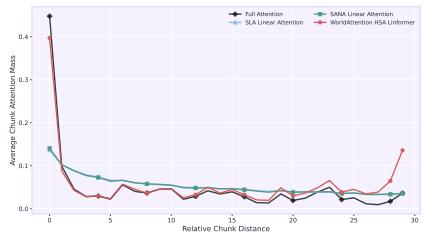  
(a) Global attention mass.

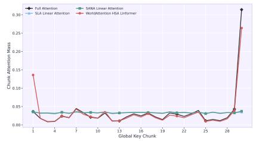  
(b) Distribution of last chunk.

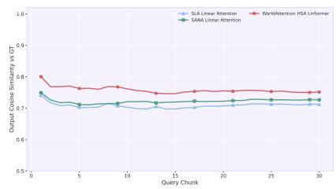  
(c) Output cosine similarity.  
Figure 6 Comparison of our linear branch with SLA [37], SANA-Video [6], and full attention.

## 4.4 Efficiency

We follow LongLive [29] to compare eficiency on the single-prompt 30s long video evaluation on VBench-Long [13]. The results in Table 3 shows that WorldAttention achieves the highest quality score of 86.55 while also attaining the fastest throughput of 22.0 FPS, outperforming all previous methods in both generation quality and end-to-end inference eficiency.

We also evaluate the speedup of our kernels in sparse branch attention computation. Our customized kernels $H S A _ { \mathsf { t r i t o n } }$ and $H S A _ { \mathbf { t k } }$ , which denote the sparse attention kernels implemented in Triton and ThunderKittens, achieve significantly higher speedups compared to the FlashAttention-3 baseline, as shown in Fig. 5. When accumulating the runtime across the video generation, $H S A _ { \mathbf { t k } }$ delivers a peak speedup of 14.02x, validating our system-oriented co-design of sparse attention.

## 4.5 Ablation Studies

Hybrid sparse attention. Table 4 compares diferent design choices for HSA on VBench-Long. Using only the linear branch yields strong subject and background consistency but produces weaker motion dynamics and visual quality. Sparse attention alone improves dynamic degree and aesthetic quality, while its performance depends on the sparsity thresholds $( \tau _ { \mathrm { m a x } } , \tau _ { \mathrm { m i n } } )$ . Combining sparse and linear branches consistently improves performance across most metrics, indicating that the two branches provide complementary modeling capacity.

Table 5 Ablation of HKV: interactive long video evaluation on VBench-Long [13]. Quality scores are reported on the full 60s sequence. CLIP scores are reported on 10s video segments with identical semantics (↑ higher is better).
<table><tr><td rowspan="2">Method</td><td rowspan="2"></td><td rowspan="2">Throughput (FPS) ↑ Quality Score ↑</td><td colspan="6">CLIP Score ↑</td></tr><tr><td>0-10s</td><td>10-20s</td><td>20-30s</td><td>30-40s</td><td>40-50s</td><td>50–60s</td></tr><tr><td>Sliding Window</td><td>22.1</td><td>82.52</td><td>25.46</td><td>22.74</td><td>21.49</td><td>19.94</td><td>18.45</td><td>17.59</td></tr><tr><td>Sliding Window (re-cache 12 frames)</td><td>20.8</td><td>84.05</td><td>28.40</td><td>24.89</td><td>24.07</td><td>23.19</td><td>22.95</td><td>23.64</td></tr><tr><td>Sliding Window (re-cache 32 frames)</td><td>7.10</td><td>84.82</td><td>28.52</td><td>24.45</td><td>25.26</td><td>24.05</td><td>23.71</td><td>24.47</td></tr><tr><td>HKV  $( P _ { s i z e } = 2 , K _ { p } = 1 6 )$ </td><td>21.9</td><td>85.38</td><td>29.01</td><td>25.51</td><td>25.37</td><td>24.69</td><td>24.19</td><td>24.93</td></tr><tr><td>HKV  $( P _ { s i z e } = 4 , K _ { p } = 8 )$ </td><td>21.9</td><td>84.93</td><td>24.81</td><td>26.09</td><td>25.63</td><td>24.64</td><td>24.07</td><td>24.10</td></tr><tr><td>HKV  $( P _ { s i z e } = 8 , K _ { p } = 2 )$ </td><td>24.0</td><td>83.05</td><td>27.48</td><td>25.08</td><td>25.12</td><td>24.10</td><td>23.99</td><td>24.28</td></tr><tr><td>HKV  $( P _ { s i z e } = 8 , K _ { p } = 4 )$ </td><td>22.0</td><td>85.53</td><td>29.04</td><td>25.99</td><td>25.80</td><td>24.72</td><td>24.25</td><td>25.01</td></tr></table>

Table 6 Comparison of hierarchical KV retrieval with alternative page-selection strategies under the same active KV budget of four pages (49,920 tokens). Quality is evaluated on the full 60-second VBench-Long sequence; CLIP scores are evaluated on aligned 10-second segments

<table><tr><td>Method</td><td>Throughput (FPS) ↑</td><td>Quality ↑</td><td>CLIPScore 0-10s</td><td>CLIPScore 10-20s</td><td>CLIPScore 20-30s</td><td>CLIPScore 30-40s</td><td>CLIPScore 40-50s</td><td>CLIPScore 50-60s</td></tr><tr><td>Page-only retrieval over all history</td><td>19.8</td><td>85.21</td><td>28.97</td><td>25.84</td><td>25.60</td><td>24.58</td><td>24.06</td><td>24.78</td></tr><tr><td>Prompt-only chunk retrieval</td><td>21.9</td><td>84.79</td><td>28.76</td><td>25.48</td><td>25.12</td><td>24.10</td><td>23.74</td><td>24.05</td></tr><tr><td>Chunk-level retrieval</td><td>22.3</td><td>84.48</td><td>28.41</td><td>25.21</td><td>24.86</td><td>23.88</td><td>23.45</td><td>23.70</td></tr><tr><td>Recent-page retrieval</td><td>22.1</td><td>83.74</td><td>27.93</td><td>24.72</td><td>23.92</td><td>22.91</td><td>22.05</td><td>21.48</td></tr><tr><td>Random-page retrieval</td><td>21.4</td><td>82.86</td><td>26.85</td><td>23.71</td><td>22.64</td><td>21.46</td><td>20.63</td><td>20.12</td></tr><tr><td>Mismatched-page retrieval</td><td>22.0</td><td>80.96</td><td>25.92</td><td>22.46</td><td>20.91</td><td>19.27</td><td>18.14</td><td>17.36</td></tr><tr><td>HKV (Ours)</td><td>22.0</td><td>85.53</td><td>29.04</td><td>25.99</td><td>25.80</td><td>24.72</td><td>24.25</td><td>25.01</td></tr></table>

In particular, the configuration $( \tau _ { \mathrm { m a x } } = 1 . 0 0 , \tau _ { \mathrm { m i n } } = 0 . 3 5 )$ achieves the best overall results, reaching the highest scores in subject consistency, background consistency, motion smoothness, aesthetic quality, and image quality while maintaining strong motion dynamics. Moreover, we compare our linear branch with SLA [37], SANA-Video [6], and full attention within the WorldAttention architecture. As shown in Fig. 6a, our linear branch accurately recovers the long-range attention mass of full attention and, as shown in Fig. 6b, maintains consistent distribution patterns across specific chunks. Fig. 6c shows that our linear branch achieves superior output embedding similarity to the full-attention baseline. For more analysis on linear attention, see Appendix G.

Hierarchical KV cache. Table 5 presents an ablation study of the proposed HKV on interactive longvideo generation. Sliding-window caching shows clear degradation in CLIP scores over time due to limited temporal context. Re-caching more frames improves semantic consistency but significantly reduces throughput, highlighting the eficiency–quality trade-of. In contrast, HKV maintains high throughput while improving both the overall quality score and segment-wise CLIP scores. Among diferent configurations, HKV with $( P _ { s i z e } = 8 , K _ { p } = 4 )$ achieves the best overall performance, delivering the highest quality score and the strongest long-horizon semantic consistency while preserving competitive inference speed.

Ablation of Retrieval Design. We use hierarchical retrieval because the two stages solve diferent problems: (1) page-only retrieval must compare against every page in the growing history, causing retrieval cost to increase with video length; and (2) prompt-only chunk retrieval is cheap but too coarse, as it loads an entire chunk even when only a few pages are relevant. HKV first uses prompt similarity to eficiently narrow the search space, and then applies query–key similarity to select only the relevant pages. This design provides both scalable retrieval and fine-grained context selection. To further clarify this analysis, we compare HKV with simpler alternatives on interactive long-video generation with VBench-Long. Quality scores are evaluated on the full 60-second sequence, whereas CLIP scores are reported on 10-second video segments with identical semantics. As shown in Table 6, under the same four-page active KV budget, HKV achieves a quality score of 85.53, compared with 83.74 for recent-page retrieval, 82.86 for random-page retrieval, and 80.96 for mismatched-page retrieval. The advantage is more pronounced in the 50–60s segment, where HKV achieves a CLIP score of 25.01, compared with 21.48, 20.12, and 17.36, respectively. Since these methods difer only in their page-selection strategy, the results indicate that the query–key score retrieves meaningful visual memory rather than arbitrary, merely recent, or deliberately mismatched pages.

Table 7 Ablation of the number of prompt-level candidate chunks under the same active KV budget of four pages.
<table><tr><td>Method</td><td>Throughput (FPS) ↑</td><td>Quality ↑</td><td>CLIPScore 0-10s</td><td>CLIPScore 10-20s</td><td>CLIPScore 20-30s</td><td>CLIPScore 30-40s</td><td>CLIPScore 40-50s</td><td>CLIPScore 50-60s</td></tr><tr><td>Top-4 chunks, 1 page per chunk</td><td>20.4</td><td>84.91</td><td>28.72</td><td>25.42</td><td>25.21</td><td>24.18</td><td>23.77</td><td>24.13</td></tr><tr><td>Top-2 chunks, 2 pages per chunk</td><td>21.2</td><td>85.31</td><td>28.93</td><td>25.78</td><td>25.57</td><td>24.55</td><td>24.09</td><td>24.72</td></tr><tr><td>Top-1 chunk, 4 pages (Ours)</td><td>22.0</td><td>85.53</td><td>29.04</td><td>25.99</td><td>25.80</td><td>24.72</td><td>24.25</td><td>25.01</td></tr></table>

Table 8 Robustness of hierarchical retrieval to semantically similar historical chunks. All settings use the same active KV budget of four pages (49,920 tokens).
<table><tr><td>Setting</td><td>Throughput (FPS) ↑</td><td>Quality ↑</td><td>CLIPScore 0-10s</td><td>CLIPScore 10-20s</td><td>CLIPScore 20-30s</td><td>CLIPScore 30-40s</td><td>CLIPScore 40-50s</td><td>CLIPScore 50-60s</td></tr><tr><td>No manually constructed similar chunks</td><td>22.0</td><td>85.53</td><td>29.04</td><td>25.99</td><td>25.80</td><td>24.72</td><td>24.25</td><td>25.01</td></tr><tr><td>2 manually constructed similar chunks</td><td>21.9</td><td>85.36</td><td>28.96</td><td>25.91</td><td>25.69</td><td>24.60</td><td>24.13</td><td>24.88</td></tr><tr><td>3 manually constructed similar chunks</td><td>21.9</td><td>85.18</td><td>28.87</td><td>25.80</td><td>25.56</td><td>24.47</td><td>24.01</td><td>24.74</td></tr></table>

Ablation of Prompt-Level Candidate Chunks. Top-k chunk retrieval could be more robust for genuinely multi-event prompts. However, under our current setting, retrieving more chunks dilutes the fixed page budget and introduces more irrelevant context. Since each evaluation sample mainly targets one semantic chunk, Top-1 provides the best balance between retrieval precision and eficiency. To study this design, we compare diferent numbers of prompt-level candidate chunks under the same active KV budget of four pages (49,920 tokens). Specifically, Top-1 retrieves four pages from one chunk, Top-2 retrieves two pages from each chunk, and Top-4 retrieves one page from each chunk. The results are reported in Table 7. We conduct the experiment as an interactive long-video evaluation on VBench-Long. Quality scores are reported on the full 60-second sequence, whereas CLIP scores are reported on 10-second video segments with identical semantics. Top-4 retrieval covers more semantic chunks, but allocating only one page to each chunk provides insuficient fine-grained visual information and increases retrieval overhead. Top-2 retrieval improves candidate diversity, but splitting the page budget across two chunks can introduce less relevant context and reduce within-chunk visual coverage. In contrast, Top-1 retrieval (ours) concentrates the fixed KV budget on the most relevant semantic chunk, enabling more complete fine-grained retrieval while maintaining the highest throughput.

Robustness to Semantically Similar Historical Chunks. Semantically similar historical prompts present a challenging retrieval setting. However, similar prompt embeddings do not necessarily cause retrieval failure, as the two stages operate at complementary levels: prompt-level retrieval identifies the most relevant semantic chunk, while page-level query–key similarity selects fine-grained visual evidence within that chunk. To evaluate this robustness, we construct a challenging subset of 200 prompts in which multiple historical chunks have high prompt similarity to the current prompt. Under the same active KV budget of four pages, Table 8 shows only a small performance drop as the number of semantically similar chunks increases. In particular, quality decreases from 85.53 with no manually constructed similar chunks to 85.18 with three such chunks, while the CLIP score for the 50–60s segment remains 24.74. These results indicate that the two-stage retrieval mechanism remains robust under semantic ambiguity.

Kernel speedup. Despite the substantial kernel-level acceleration, the sparse attention kernel itself contributes only a small fraction of the overall runtime. Table 10 shows the execution breakdown of HSA during decoding. The sparse block attention kernel accounts for only 1.86% of total latency, while preprocessing steps such as KV cache reorganization and contiguous memory copies dominate the execution time. This observation suggests that kernel optimization alone cannot fully address the eficiency bottleneck of long-context video generation. Instead, system-level co-design of sparse attention and KV cache management is necessary to achieve substantial end-to-end speedup.

End-to-End Eficiency. We also conducted an end-to-end ablation study on minute-long video generation. Even though our customized kernels exclusively accelerate the denoising stage, they still translate into highly competitive overall speedups. As Table 9 shows, integrating HKV and HSA into the baseline progressively yields 1.15× and 1.91× speedups by reducing I/O and theoretical FLOPs. Finally, our system-oriented kernel customization achieve a 2.21× overall end-to-end speedup, confirming that hardware-algorithm co-design is essential for scalable long-video generation.

Table 9 End-to-end ablation study of WorldAttention.
<table><tr><td>System Configuration</td><td>E2E Speedup</td></tr><tr><td>Baseline (FA-3 + Naive KV)</td><td>1.00×</td></tr><tr><td>+ Hierarchical KV Cache (HKV)</td><td>1.15×</td></tr><tr><td>+ Hybrid Sparse Attention (HSA)</td><td>1.91×</td></tr><tr><td>+ Kernel Customization</td><td>2.21×</td></tr></table>

Table 10 Execution time breakdown of HSA.
<table><tr><td>Stage</td><td>Time (µs)</td><td>Ratio</td></tr><tr><td>Linear branch</td><td>251.934</td><td>39.78%</td></tr><tr><td>Dynamic selection</td><td>83.359</td><td>13.16%</td></tr><tr><td>Index mapping (pre-kernel)</td><td>79.135</td><td>12.50%</td></tr><tr><td>KV contiguous copy</td><td>196.254</td><td>31.00%</td></tr><tr><td>Sparse block attention kernel</td><td>11.776</td><td>1.86%</td></tr><tr><td>Fusion</td><td>10.784</td><td>1.70%</td></tr><tr><td>Total</td><td>633.242</td><td>100%</td></tr></table>

Eficiency Across Hardware, Model Scales, and Generation Settings. We further evaluate the end-to-end eficiency gains of WorldAttention on the latest NVIDIA B200 GPU, which also supports our kernels, across diferent model scales, resolutions, and a longer 90-second generation horizon. The results are reported in Table 11. These results show that WorldAttention maintains consistent end-to-end eficiency

Table 11 End-to-end speedup across GPU platforms, model scales, resolutions, and generation horizons.
<table><tr><td>System configuration</td><td>H100, 1.3B 480p, 60s</td><td>B200, 1.3B 480p, 60s</td><td>B200, 1.3B 480p, 90s</td><td>B200, 14B 720p, 60s</td></tr><tr><td>Baseline (FA-3)</td><td>1.00×</td><td>1.00×</td><td>1.00×</td><td>1.00×</td></tr><tr><td>+ HKV</td><td>1.15×</td><td>1.12×</td><td>1.21×</td><td>1.16×</td></tr><tr><td>+ HSA</td><td>1.91×</td><td>1.79×</td><td>2.04×</td><td>2.13×</td></tr><tr><td>+ Kernel Customization</td><td>2.21×</td><td>2.06×</td><td>2.35×</td><td>2.46×</td></tr></table>

gains on B200 across model scales, resolutions, and generation horizons. The benefits become more pronounced for longer sequences and larger models, where KV management and attention computation account for a greater fraction of inference cost.

## 5 Conclusion

In this paper, we introduce WorldAttention, a system-oriented framework for eficient text-conditioned interactive video world models. We present Hybrid Sparse Attention (HSA), which combines linear global attention with head-adaptive block sparsity to reduce quadratic attention complexity while preserving expressive token interactions. Furthermore, we develop a Hierarchical KV Cache (HKV) to alleviate the memory pressure of extended sequences, utilizing a multi-tier paging strategy that dynamically balances context with restricted GPU resources. Through the integration of attention structure, memory management, and hardware-aligned kernels, WorldAttention transforms sparse attention and KV retrieval into an eficient execution pipeline for long-horizon video generation. Extensive experiments on VBench-Long and InterVBench demonstrate that our approach achieves superior temporal consistency, prompt alignment, and generation quality while significantly improving decoding eficiency.

## References

[1] Jinze Bai, Shuai Bai, Yunfei Chu, Zeyu Cui, Kai Dang, Xiaodong Deng, Yang Fan, Wenbin Ge, Yu Han, Fei Huang, et al. Qwen technical report. arXiv preprint arXiv:2309.16609, 2023.

[2] Maximilian Beck, Korbinian Pöppel, Phillip Lippe, and Sepp Hochreiter. Tiled flash linear attention: More eficient linear rnn and xlstm kernels. arXiv preprint arXiv:2503.14376, 2025.

[3] ByteDance Seed et al. Scaling linear attention with sparse state expansion. arXiv preprint arXiv:2507.16577, 2025.

[4] Shengqu Cai, Ceyuan Yang, Lvmin Zhang, Yuwei Guo, Junfei Xiao, Ziyan Yang, Yinghao Xu, Zhenheng

Yang, Alan Yuille, Leonidas Guibas, et al. Mixture of contexts for long video generation. arXiv preprint arXiv:2508.21058, 2025.

[5] Guibin Chen, Dixuan Lin, Jiangping Yang, Chunze Lin, Junchen Zhu, Mingyuan Fan, Hao Zhang, Sheng Chen, Zheng Chen, Chengcheng Ma, et al. Skyreels-v2: Infinite-length film generative model. arXiv preprint arXiv:2504.13074, 2025.

[6] Junsong Chen, Yuyang Zhao, Jincheng Yu, Ruihang Chu, Junyu Chen, Shuai Yang, Xianbang Wang, Yicheng Pan, Daquan Zhou, Huan Ling, et al. Sana-video: Eficient video generation with block linear difusion transformer. arXiv preprint arXiv:2509.24695, 2025.

[7] Justin Cui, Jie Wu, Ming Li, Tao Yang, Xiaojie Li, Rui Wang, Andrew Bai, Yuanhao Ban, and Cho-Jui Hsieh. Self-forcing++: Towards minute-scale high-quality video generation. In The Fourteenth International Conference on Learning Representations, 2026.

[8] Haoge Deng, Ting Pan, Haiwen Diao, Zhengxiong Luo, Yufeng Cui, Huchuan Lu, Shiguang Shan, Yonggang Qi, and Xinlong Wang. Autoregressive video generation without vector quantization. arXiv preprint arXiv:2412.14169, 2024.

[9] Tianrui Feng, Zhi Li, Shuo Yang, Haocheng Xi, Muyang Li, Xiuyu Li, Lvmin Zhang, Keting Yang, Kelly Peng, Song Han, et al. Streamdifusionv2: A streaming system for dynamic and interactive video generation. arXiv preprint arXiv:2511.07399, 2025.

[10] Yuwei Guo, Ceyuan Yang, Ziyan Yang, Zhibei Ma, Zhijie Lin, Zhenheng Yang, Dahua Lin, and Lu Jiang. Long context tuning for video generation. arXiv preprint arXiv:2503.10589, 2025.

[11] Yefei He, Feng Chen, Jing Liu, Wenqi Shao, Hong Zhou, Kaipeng Zhang, and Bohan Zhuang. Zipvl: Accelerating vision-language models through dynamic token sparsity. In Proceedings of the IEEE/CVF International Conference on Computer Vision, pages 20477–20486, 2025.

[12] Xun Huang, Zhengqi Li, Guande He, Mingyuan Zhou, and Eli Shechtman. Self forcing: Bridging the train-test gap in autoregressive video difusion. arXiv preprint arXiv:2506.08009, 2025.

[13] Ziqi Huang, Yinan He, Jiashuo Yu, Fan Zhang, Chenyang Si, Yuming Jiang, Yuanhan Zhang, Tianxing Wu, Qingyang Jin, Nattapol Chanpaisit, et al. Vbench: Comprehensive benchmark suite for video generative models. In Proceedings of the IEEE/CVF Conference on Computer Vision and Pattern Recognition, pages 21807–21818, 2024.

[14] Heejun Lee, Jina Kim, Jefrey Willette, and Sung Ju Hwang. Sea: Sparse linear attention with estimated attention mask. arXiv preprint arXiv:2310.01777, 2023.

[15] Akide Liu, Zeyu Zhang, Zhexin Li, Xuehai Bai, Yizeng Han, Jiasheng Tang, Yuanjie Xing, Jichao Wu, Mingyang Yang, Weihua Chen, et al. Fpsattention: Training-aware fp8 and sparsity co-design for fast video difusion. arXiv preprint arXiv:2506.04648, 2025.

[16] Kunhao Liu, Wenbo Hu, Jiale Xu, Ying Shan, and Shijian Lu. Rolling forcing: Autoregressive long video difusion in real time. arXiv preprint arXiv:2509.25161, 2025.

[17] Zihan Qiu, Zekun Wang, Bo Zheng, Zeyu Huang, Kaiyue Wen, Songlin Yang, Rui Men, Le Yu, Fei Huang, Suozhi Huang, et al. Gated attention for large language models: Non-linearity, sparsity, and attention-sink-free. arXiv preprint arXiv:2505.06708, 2025.

[18] Alec Radford, Jong Wook Kim, Chris Hallacy, Aditya Ramesh, Gabriel Goh, Sandhini Agarwal, Girish Sastry, Amanda Askell, Pamela Mishkin, Jack Clark, et al. Learning transferable visual models from natural language supervision. In International conference on machine learning, pages 8748–8763. PmLR, 2021.

[19] Jay Shah, Ganesh Bikshandi, Ying Zhang, Vijay Thakkar, Pradeep Ramani, and Tri Dao. Flashattention-3: Fast and accurate attention with asynchrony and low-precision. Advances in Neural Information Processing Systems, 37:68658–68685, 2024.

[20] Inferix Team, Tianyu Feng, Yizeng Han, Jiahao He, Yuanyu He, Xi Lin, Teng Liu, Hanfeng Lu, Jiasheng Tang, Wei Wang, et al. Inferix: A block-difusion based next-generation inference engine for world simulation. arXiv preprint arXiv:2511.20714, 2025.

[21] Hansi Teng, Hongyu Jia, Lei Sun, Lingzhi Li, Maolin Li, Mingqiu Tang, Shuai Han, Tianning Zhang, WQ Zhang, Weifeng Luo, et al. Magi-1: Autoregressive video generation at scale. arXiv preprint arXiv:2505.13211, 2025.

[22] Team Wan, Ang Wang, Baole Ai, Bin Wen, Chaojie Mao, Chen-Wei Xie, Di Chen, Feiwu Yu, Haiming Zhao, Jianxiao Yang, et al. Wan: Open and advanced large-scale video generative models. arXiv preprint arXiv:2503.20314, 2025.

[23] Sinong Wang, Belinda Z Li, Madian Khabsa, Han Fang, and Hao Ma. Linformer: Self-attention with linear complexity. arXiv preprint arXiv:2006.04768, 2020.

[24] Wenhao Wang and Yi Yang. Vidprom: A million-scale real prompt-gallery dataset for text-to-video difusion models. Advances in Neural Information Processing Systems, 37:65618–65642, 2024.

[25] Haocheng Xi, Shuo Yang, Yilong Zhao, Chenfeng Xu, Muyang Li, Xiuyu Li, Yujun Lin, Han Cai, Jintao Zhang, Dacheng Li, et al. Sparse videogen: Accelerating video difusion transformers with spatial-temporal sparsity. arXiv preprint arXiv:2502.01776, 2025.

[26] Kaicheng Xiao, Haotian Li, Liran Dong, and Guoliang Xing. Ram-net: Expressive linear attention with selectively addressable memory. arXiv preprint arXiv:2602.11958, 2026.

[27] Desai Xie, Zhan Xu, Yicong Hong, Hao Tan, Difan Liu, Feng Liu, Arie Kaufman, and Yang Zhou. Progressive autoregressive video difusion models. In Proceedings of the Computer Vision and Pattern Recognition Conference, pages 6322–6332, 2025.

[28] Ruyi Xu, Guangxuan Xiao, Haofeng Huang, Junxian Guo, and Song Han. Xattention: Block sparse attention with antidiagonal scoring. arXiv preprint arXiv:2503.16428, 2025.

[29] Shuai Yang, Wei Huang, Ruihang Chu, Yicheng Xiao, Yuyang Zhao, Xianbang Wang, Muyang Li, Enze Xie, Yingcong Chen, Yao Lu, et al. Longlive: Real-time interactive long video generation. arXiv preprint arXiv:2509.22622, 2025.

[30] Shuo Yang, Haocheng Xi, Yilong Zhao, Muyang Li, Jintao Zhang, Han Cai, Yujun Lin, Xiuyu Li, Chenfeng Xu, Kelly Peng, et al. Sparse videogen2: Accelerate video generation with sparse attention via semantic-aware permutation. arXiv preprint arXiv:2505.18875, 2025.

[31] Songlin Yang, Bailin Wang, Yikang Shen, Rameswar Panda, and Yoon Kim. Gated linear attention transformers with hardware-eficient training. arXiv preprint arXiv:2312.06635, 2023.

[32] Hidir Yesiltepe, Tuna Han Salih Meral, Adil Kaan Akan, Kaan Oktay, and Pinar Yanardag. Infinity-rope: Action-controllable infinite video generation emerges from autoregressive self-rollout. arXiv preprint arXiv:2511.20649, 2025.

[33] Jung Yi, Wooseok Jang, Paul Hyunbin Cho, Jisu Nam, Heeji Yoon, and Seungryong Kim. Deep forcing: Training-free long video generation with deep sink and participative compression. arXiv preprint arXiv:2512.05081, 2025.

[34] Tianwei Yin, Michaël Gharbi, Richard Zhang, Eli Shechtman, Fredo Durand, William T Freeman, and Taesung Park. One-step difusion with distribution matching distillation. In Proceedings of the IEEE/CVF conference on computer vision and pattern recognition, pages 6613–6623, 2024.

[35] Tianwei Yin, Qiang Zhang, Richard Zhang, William T Freeman, Fredo Durand, Eli Shechtman, and Xun Huang. From slow bidirectional to fast autoregressive video difusion models. 2025.

[36] Zhihang Yuan, Hanling Zhang, Lu Pu, Xuefei Ning, Linfeng Zhang, Tianchen Zhao, Shengen Yan, Guohao Dai, and Yu Wang. Ditfastattn: Attention compression for difusion transformer models. Advances in Neural Information Processing Systems, 37:1196–1219, 2024.

[37] Jintao Zhang, Haoxu Wang, Kai Jiang, Shuo Yang, Kaiwen Zheng, Haocheng Xi, Ziteng Wang, Hongzhou Zhu, Min Zhao, Ion Stoica, et al. Sla: Beyond sparsity in difusion transformers via fine-tunable sparse-linear attention. arXiv preprint arXiv:2509.24006, 2025.

[38] Jintao Zhang, Chendong Xiang, Haofeng Huang, Jia Wei, Haocheng Xi, Jun Zhu, and Jianfei Chen. Spargeattention: Accurate and training-free sparse attention accelerating any model inference. arXiv preprint arXiv:2502.18137, 2025.

[39] Lvmin Zhang and Maneesh Agrawala. Packing input frame context in next-frame prediction models for video generation. arXiv preprint arXiv:2504.12626, 2025.

[40] Peiyuan Zhang, Yongqi Chen, Haofeng Huang, Will Lin, Zhengzhong Liu, Ion Stoica, Eric Xing, and Hao Zhang. Vsa: Faster video difusion with trainable sparse attention. arXiv preprint arXiv:2505.13389, 2025.

[41] Peiyuan Zhang, Yongqi Chen, Runlong Su, Hangliang Ding, Ion Stoica, Zhengzhong Liu, and Hao Zhang. Fast video generation with sliding tile attention. arXiv preprint arXiv:2502.04507, 2025.

[42] Zeyu Zhang, Shuning Chang, Yuanyu He, Jinyuan Mao, Yizeng Han, Jiasheng Tang, Fan Wang, and Bohan Zhuang. Bife: Better interaction, fewer errors for minute-long video generation. arXiv preprint arXiv:2511.22973, 2025.

[43] Zeyu Zhang, Yiran Wang, Danning Li, Dong Gong, Ian Reid, and Richard Hartley. Flashmo: Geometric interpolants and frequency-aware sparsity for scalable eficient motion generation. In The Thirty-ninth Annual Conference on Neural Information Processing Systems, 2025.

## A Preliminaries

## A.1 Block Sparse Attention

## A.1.1 3D Full Attention

Modern video Difusion Transformers (DiTs) typically rely on 3D full attention to model dependencies across the entire video volume. Given a video latent tensor of shape $( T , H , W )$ , the latent is flattened into a 1D token sequence of length $L = T H W$ . Each token at spatial-temporal location $( t , h , w )$ is mapped to a unique index n in the flattened sequence via:

$$
n = t H W + h W + w .
$$

Full attention is then applied over this sequence, allowing every token to attend to all others.

Formally, for a single attention head, let Q, K, $\mathbf { V } \in \mathbb { R } ^ { L \times d }$ denote the query, key, and value matrices, and let $\mathbf { M } \in \{ - \infty , 0 \} ^ { L \times L }$ be an attention mask that specifies permissible token interactions. The attention output is computed as

$$
\mathbf { S } = { \frac { \mathbf { Q } \mathbf { K } ^ { \top } } { \sqrt { d _ { k } } } } , \quad \mathbf { A } = \operatorname { S o f t m a x } ( \mathbf { S } + \mathbf { M } ) , \quad \mathbf { O } = \mathbf { A } \mathbf { V } .\tag{6}
$$

In $f u l l$ attention, all entries of M are zero, resulting in quadratic complexity with respect to the sequence length.

## A.1.2 Sparse Attention

Empirical studies [11] have shown that attention score matrix A is inherently sparse, with most entries close to zero. This observation motivates selectively preserving only the high-magnitude regions of A, referred to as critical tokens, while discarding the rest. A key design challenge is determining how much computation should be devoted to identifying these tokens.

Computing full attention scores yields the most accurate selection but largely eliminates computational savings, as sparsity only benefits the AV stage. In contrast, fixed sparsity patterns introduce no additional prediction overhead, but often fail to capture semantically important long-range interactions. A promising middle ground is to employ a lightweight, trainable, coarse-grained attention mechanism that estimates the locations of critical tokens without explicitly computing the full attention matrix. The central challenge lies in achieving an efective balance between selection accuracy and computational overhead in practical DiT architectures.

Sparse attention [43] reduces computation by setting a subset of entries in M to $- \infty .$ , thereby skipping the corresponding interactions in both $\mathbf { \bar { Q } K } ^ { \top }$ and AV. While this strategy reduces theoretical FLOPs, unstructured sparsity is poorly matched to modern GPU architectures, which are optimized for dense matrix operations and thus fail to realize practical speedups.

## A.1.3 Block Sparse Attention

Block-sparse attention [25, 30, 28] addresses this limitation by enforcing structured sparsity aligned with hardware execution. A block in GPU refer to a submatrix that a GPU threadblock loads into SRAM when performing matrix multiplication. Specifically, the attention mask M is partitioned into blocks $( B _ { q } , B _ { k } )$ where all entries within a block share the same mask value. Technically, $( B _ { q } , B _ { k } )$ need not be square and may take diferent values for $B _ { q }$ and $B _ { k }$ . For simplicity, we assume square blocks with $B = B _ { q } = B _ { k }$ . This design enables each block to be processed as a dense block or skipped entirely, allowing eficient execution within GPU streaming multiprocessors (SM).

The block size B plays a critical role in balancing expressiveness and eficiency. Smaller blocks permit finer-grained attention patterns but reduce hardware utilization, whereas larger blocks improve throughput at the cost of coarser attention resolution. In practice, modest sacrifices in raw speed are often acceptable when they lead to meaningful gains in generation quality. Moreover, the FlashAttention-3 [19] kernel can support relatively small block sizes. However, it is optimized for Hopper GPUs. On Hopper, MMA and WGMMA instructions use $1 6 \times 1 6$ (or their compositions) as the fundamental computation units. As a result, the block size B is preferably divisible by 16.

Given a video latent tensor of shape $( T , H , W )$ , block-sparse attention partitions the volume into a set of contiguous 3D cubes, each of size $\left( C _ { t } , C _ { h } , C _ { w } \right)$ . The algorithm and its kernel implementation are co-designed such that each cube is mapped to a single execution block on a GPU SM. The resulting block size is

$$
B = C _ { t } \times C _ { h } \times C _ { w } ,
$$

corresponding to the number of tokens within one cube.

We assume that $( T , H , W )$ is an integer multiple of $\left( C _ { t } , C _ { h } , C _ { w } \right)$ , and define the number of cubes along each dimension as

$$
\left( N _ { t } , N _ { h } , N _ { w } \right) = \left( \frac { T } { C _ { t } } , \frac { H } { C _ { h } } , \frac { W } { C _ { w } } \right) .
$$

When flattening the 3D latent into a one-dimensional sequence, a token located at $( t , h , w )$ is assigned an index n according to

$$
\begin{array} { r l } & { n = \left( \left\lfloor \frac { t } { C _ { t } } \right\rfloor N _ { h } N _ { w } + \left\lfloor \frac { h } { C _ { h } } \right\rfloor N _ { w } + \left\lfloor \frac { w } { C _ { w } } \right\rfloor \right) B } \\ & { \qquad + \left( t \bmod C _ { t } \right) C _ { h } C _ { w } + ( h \bmod C _ { h } ) C _ { w } + ( w \bmod C _ { w } ) . } \end{array}
$$

This indexing scheme guarantees that every contiguous group of B tokens in the flattened sequence is assigned to the same GPU block and corresponds to a spatially and temporally contiguous region in the original video volume, namely a $\left( C _ { t } , C _ { h } , C _ { w } \right)$ cube. As a result, block-level sparsity in attention directly translates to skipping or executing entire GPU blocks, enabling eficient hardware-aligned sparse computation.

## A.1.4 Global and Local Context in Sparse Attention

Restricting attention connectivity inevitably limits the receptive field, which can impair the modeling of global context. One strategy to mitigate this issue is to augment sparse attention with a lightweight global module that captures coarse, long-range information [37, 14, 40]. Alternatively, incorporating local inductive biases, motivated by the success of locality priors in convolutional networks, can enhance fine-grained feature learning [41].

## A.2 Semantic Sparse KV Cache

Long-horizon video generation requires conditioning on historical context through KV caches. A naive strategy stores all previous key–value states, causing rapidly growing memory usage and redundant attention computation. To address this issue, BIFE introduces a semantic sparse KV cache that selectively stores informative tokens from past chunks [42].

Given a chunk $c ,$ the difusion transformer produces query, key, and value tensors $Q , K , V$ . The attention scores are computed as

$$
A = \mathrm { S o f t m a x } \biggl ( \frac { Q K ^ { \top } } { \sqrt { d } } \biggr ) .\tag{7}
$$

Token importance is obtained by aggregating attention scores across heads, producing an importance vector m. Only the top-k tokens with highest importance are retained,

$$
I _ { \mathrm { k e e p } } = \mathrm { T o p K } ( m ) ,\tag{8}
$$

which forms the sparse cache

$$
( K ^ { \mathrm { s p a r s e } } , V ^ { \mathrm { s p a r s e } } ) .\tag{9}
$$

This token selection mechanism is related to dynamic token sparsification approaches used for eficient vision transformers and multimodal models [11].

During generation, sparse KV entries from previous chunks are stored in a global memory bank. Relevant context is retrieved using semantic similarity between prompt embeddings. Let $E _ { c }$ denote the embedding of the current prompt and $E _ { i }$ denote the embedding of a past chunk i. Their similarity is computed as

$$
s _ { i } = \cos ( E _ { c } , E _ { i } ) .\tag{10}
$$

The top-l most similar chunks are selected, and their sparse KV states are combined with the most recent chunks to construct the final context

$$
( K ^ { * } , V ^ { * } ) = \operatorname { C o n c a t } \bigl ( ( K _ { c - 1 } , V _ { c - 1 } ) , ( K _ { i _ { 1 } } ^ { \mathrm { s p a r s e } } , V _ { i _ { 1 } } ^ { \mathrm { s p a r s e } } ) , \dots \bigr ) .\tag{11}
$$

This semantic sparse KV cache significantly reduces memory consumption while improving long-range coherence by retrieving semantically relevant historical context. However, the sparse KV entries from all previous chunks must still be stored, causing the cache size to grow with sequence length. This limitation motivates the hierarchical KV management strategy proposed in WorldAttention.

## B Metrics

For VBench-Long [13], we follow prior minute-long video generation works [10, 4], we additionally adopt five complementary metrics from VBench [13] to comprehensively evaluate long-horizon generation quality. These metrics cover both visual fidelity and temporal consistency: (1) Imaging Quality, which measures frame-level technical fidelity by quantifying distortions such as over-exposure, noise, and blur; (2) Motion Smoothness, which evaluates the continuity and physical plausibility of frame-to-frame transitions; (3) Aesthetic Quality, which assesses visual appeal, including composition, color harmony, and photorealism; (4) Background Consistency, which measures the stability of the scene background over time; and (5) Subject Consistency, which evaluates whether a subject’s appearance remains temporally coherent throughout the video. For InterVBench [42, 20], we follow the metric termed Video Drift Error (VDE) to quantify quality changes over time. VDE divides a long video into multiple segments and measures temporal drift for specific attributes, where lower scores indicate better stability. Based on this formulation, we design five drift-aware metrics tailored for long-horizon generation: (1) VDE Clarity, which measures temporal drift in image sharpness, penalizing progressive blur; (2) VDE Motion, which evaluates drift in motion smoothness, capturing jitter or freezing artifacts; (3) VDE Aesthetic, which measures degradation in visual appeal over time; (4) VDE Background, which quantifies instability or flickering in scene background; and (5) VDE Subject, which tracks identity drift to assess whether the subject remains consistently recognizable throughout the sequence.

## C Limitation and Future Work

Although WorldAttention demonstrates strong performance for text-conditioned interactive video generation, the current framework primarily focuses on textual prompts as the control signal. This design limits the ability to model richer forms of interaction and control that are common in real-world scenarios. Future work can extend the framework to incorporate additional conditioning modalities, such as action signals, control trajectories, or embodied interaction cues. Integrating action-conditioned generation would enable the model to function as a video world model, supporting controllable environment simulation and decision-driven video prediction.

## D Kernel Customization

To realize the eficiency benefits of Hybrid Sparse Attention (HSA) and Hierarchical KV cache (HKV), we integrate attention kernels customized from VSA[40] with an optimized KV memory layout to minimize data movement and maximize GPU utilization.

For HSA, sparse attention is implemented with two kernels corresponding to the global linear branch and the local sparse branch. The sparse branch attends to token blocks selected by head-adaptive sparsity, while the linear branch captures long-range dependencies with linear complexity.

For HKV, cached KV states are organized into semantically grouped pages in a hierarchical layout. During decoding, a lightweight retrieval stage selects relevant KV pages, which are mapped to contiguous memory before attention computation, enabling consolidated access and eficient kernel execution.

## E Results on InterVBench

Table 12 Comparison of different methods on InterVBench. We report InterVBench results on five VDE metrics and five complementary metrics from VBench [13].
<table><tr><td rowspan=1 colspan=1>Method</td><td rowspan=1 colspan=1>VDE↓Subject</td><td rowspan=1 colspan=1>VDEBackground</td><td rowspan=1 colspan=1>VDE↓Motion</td><td rowspan=1 colspan=1>VDEAesthetic</td><td rowspan=1 colspan=1>VDEClarityY</td></tr><tr><td rowspan=1 colspan=1>MAGI-1</td><td rowspan=1 colspan=1>0.3090</td><td rowspan=1 colspan=1>0.5000</td><td rowspan=1 colspan=1>0.0243</td><td rowspan=1 colspan=1>3.8286</td><td rowspan=1 colspan=1>2.7225</td></tr><tr><td rowspan=1 colspan=1>Self Forcing</td><td rowspan=1 colspan=1>0.3716</td><td rowspan=1 colspan=1>1.6108</td><td rowspan=1 colspan=1>0.1549</td><td rowspan=1 colspan=1>3.4683</td><td rowspan=1 colspan=1>3.0798</td></tr><tr><td rowspan=1 colspan=1>PAVDM</td><td rowspan=1 colspan=1>1.8292</td><td rowspan=1 colspan=1>0.9323</td><td rowspan=1 colspan=1>0.0461</td><td rowspan=1 colspan=1>2.8957</td><td rowspan=1 colspan=1>1.9503</td></tr><tr><td rowspan=1 colspan=1>FramePack</td><td rowspan=1 colspan=1>4.3984</td><td rowspan=1 colspan=1>5.9421</td><td rowspan=1 colspan=1>0.0387</td><td rowspan=1 colspan=1>1.4751</td><td rowspan=1 colspan=1>4.2513</td></tr><tr><td rowspan=1 colspan=1>SkyReels-V2-DF-1.3B</td><td rowspan=1 colspan=1>0.1085</td><td rowspan=1 colspan=1>0.3179</td><td rowspan=1 colspan=1>0.0195</td><td rowspan=1 colspan=1>1.2083</td><td rowspan=1 colspan=1>0.9365</td></tr><tr><td rowspan=1 colspan=1>LongLive</td><td rowspan=1 colspan=1>0.0825</td><td rowspan=1 colspan=1>0.3016</td><td rowspan=1 colspan=1>0.0104</td><td rowspan=1 colspan=1>1.1452</td><td rowspan=1 colspan=1>0.8529</td></tr><tr><td rowspan=1 colspan=1>BIFE</td><td rowspan=1 colspan=1>0.0844</td><td rowspan=1 colspan=1>0.2945</td><td rowspan=1 colspan=1>0.0119</td><td rowspan=1 colspan=1>0.9618</td><td rowspan=1 colspan=1>0.7551</td></tr><tr><td rowspan=1 colspan=1>WorldAttention (Ours)</td><td rowspan=1 colspan=1>0.0792</td><td rowspan=1 colspan=1>0.2850</td><td rowspan=1 colspan=1>0.0095</td><td rowspan=1 colspan=1>0.9462</td><td rowspan=1 colspan=1>0.7390</td></tr><tr><td rowspan=1 colspan=1>Method</td><td rowspan=1 colspan=1>Subject↑Consistency</td><td rowspan=1 colspan=1>Background↑Consistency</td><td rowspan=1 colspan=1>Motion↑Smoothness</td><td rowspan=1 colspan=1>Aesthetic↑Quality</td><td rowspan=1 colspan=1>Image↑Quality</td></tr><tr><td rowspan=1 colspan=1>MAGI-1</td><td rowspan=1 colspan=1>0.8992</td><td rowspan=1 colspan=1>0.9078</td><td rowspan=1 colspan=1>0.9947</td><td rowspan=1 colspan=1>0.6508</td><td rowspan=2 colspan=1>0.66620.6805</td></tr><tr><td rowspan=1 colspan=1>Self Forcing</td><td rowspan=1 colspan=1>0.8481</td><td rowspan=1 colspan=1>0.8203</td><td rowspan=1 colspan=1>0.9947</td><td rowspan=1 colspan=1>0.6283</td></tr><tr><td rowspan=1 colspan=1>PAVDM</td><td rowspan=1 colspan=1>0.8640</td><td rowspan=1 colspan=1>0.8924</td><td rowspan=1 colspan=1>0.9926</td><td rowspan=1 colspan=1>0.5267</td><td rowspan=3 colspan=1>0.65670.69720.6835</td></tr><tr><td rowspan=1 colspan=1>FramePack</td><td rowspan=1 colspan=1>0.9001</td><td rowspan=1 colspan=1>0.8791</td><td rowspan=1 colspan=1>0.9949</td><td rowspan=1 colspan=1>0.6043</td></tr><tr><td rowspan=1 colspan=1>SkyReels-V2-DF-1.3B</td><td rowspan=1 colspan=1>0.9418</td><td rowspan=1 colspan=1>0.9579</td><td rowspan=1 colspan=1>0.9931</td><td rowspan=1 colspan=1>0.6035</td></tr><tr><td rowspan=1 colspan=1>LongLive</td><td rowspan=1 colspan=1>0.9610</td><td rowspan=1 colspan=1>0.9552</td><td rowspan=1 colspan=1>0.9968</td><td rowspan=1 colspan=1>0.6595</td><td rowspan=1 colspan=1>0.6960</td></tr><tr><td rowspan=1 colspan=1>BIFE</td><td rowspan=1 colspan=1>0.9597</td><td rowspan=1 colspan=1>0.9588</td><td rowspan=1 colspan=1>0.9956</td><td rowspan=1 colspan=1>0.6047</td><td rowspan=1 colspan=1>0.6852</td></tr><tr><td rowspan=1 colspan=1>WorldAttention (Ours)</td><td rowspan=1 colspan=1>0.9668</td><td rowspan=1 colspan=1>0.9614</td><td rowspan=1 colspan=1>0.9972</td><td rowspan=1 colspan=1>0.6397</td><td rowspan=1 colspan=1>0.6965</td></tr></table>

InterVBench. We further evaluate WorldAttention under the chunk-level long-video generation setting of InterVBench, which contains 200 test videos longer than 50 seconds with fine-grained annotations. Following the standard evaluation protocol, we report five VDE-based drift metrics together with five complementary VBench metrics to assess both temporal robustness and perceptual quality. As shown in Table 12, WorldAttention achieves state-of-the-art performance across the majority of metrics, demonstrating improved long-horizon stability and overall generation quality compared to prior methods.

## F Sparse Branch

Unlike fixed Top-K block selection, HSA introduces head-adaptive sparsity. Each attention head independently determines its sparsity level based on the observed distribution of its attention scores. Specifically, for each head, we sort blocks by attention score in descending order and select the minimal set whose cumulative attention exceeds a predefined threshold. This yields a spectrum of sparsity patterns across heads: some heads become highly sparse and focus on local interactions, others are moderately sparse and capture structured dependencies, while a few retain low sparsity to preserve broader context. Such head-level adaptation ofers finer granularity than layer-level or global sparsity schemes.

Fixed Top-K block selection is replaced by a cumulative attention score criterion per head. For the i-th query block and h-th head, the block attention weights are denoted by $\mathbf { p } _ { i , : } ^ { ( h ) } \in \mathbb { R } ^ { N }$ , representing the i-th row of $\mathbf { P } ^ { ( h ) }$ Let $\sigma _ { i } ^ { ( h ) }$ be a permutation that sorts blocks by descending attention weight:

$$
\mathbf { p } _ { i , \sigma _ { i } ^ { ( h ) } ( 1 ) } ^ { ( h ) } \geq \mathbf { p } _ { i , \sigma _ { i } ^ { ( h ) } ( 2 ) } ^ { ( h ) } \geq \cdots \geq \mathbf { p } _ { i , \sigma _ { i } ^ { ( h ) } ( N ) } ^ { ( h ) } .
$$

Given a head-specific coverage threshold $\tau _ { h } \in ( 0 , 1 ]$ , we choose the minimal number of blocks

$$
K _ { i } ^ { ( h ) } = \operatorname* { m i n } \Big \{ k : \ \sum _ { m = 1 } ^ { k } \mathbf { p } _ { i , \sigma _ { i } ^ { ( h ) } ( m ) } ^ { ( h ) } \geq \tau _ { h } \Big \} .
$$

The selected key-block set for (i, h) is then

$$
\begin{array} { r } { S ^ { ( h ) } ( i ) = \Big \{ \sigma _ { i } ^ { ( h ) } ( 1 ) , \dots , \sigma _ { i } ^ { ( h ) } ( K _ { i } ^ { ( h ) } ) \Big \} . } \end{array}
$$

Finally, the sparse branch uses

$$
S ^ { ( h ) } = \bigcup _ { i = 1 } ^ { N } \{ ( i , j ) : j \in S ^ { ( h ) } ( i ) \} ,
$$

which directly specifies the set of blocks executed by the block-sparse attention kernel.

To determine the head-specific threshold $\tau _ { h } .$ , we quantify the sparsity of the attention distribution using the Gini coeficient. Using the block attention weights $\mathbf { p } _ { i , : } ^ { ( h ) }$ and descending permutation $\sigma _ { i } ^ { ( h ) }$ , the Gini coeficient $\mathcal { G } ^ { ( h ) }$ for the h-th head is calculated across all query blocks:

$$
\mathcal { G } ^ { ( h ) } = \mathbb { E } _ { i } \left[ \frac { 1 } { N } \sum _ { m = 1 } ^ { N } ( N - 2 m + 1 ) \cdot \mathbf { p } _ { i , \sigma _ { i } ^ { ( h ) } ( m ) } ^ { ( h ) } \right] .\tag{12}
$$

Here, $\mathcal { G } ^ { ( h ) }$ serves as a scalar proxy of sparsity, taking higher values for peaked distributions and lower values for uniform ones. We then map this metric to the coverage threshold $\tau _ { h }$ via:

$$
\tau _ { h } = \tau _ { \operatorname* { m i n } } + \mathcal { G } ^ { ( h ) } \cdot ( \tau _ { \operatorname* { m a x } } - \tau _ { \operatorname* { m i n } } ) ,\tag{13}
$$

where $\tau _ { \mathrm { m i n } }$ and $\tau _ { \mathrm { m a x } }$ are hyperparameters that bound the cumulative mass.

This adaptive scaling dynamically determines the number of selected blocks per head: higher $\tau _ { h }$ selects more blocks for high-sparsity heads, while lower $\tau _ { h }$ limits block selection for low-sparsity heads, maintaining computational eficiency.

## G Linear Branch

Many eficient architectures, such as SLA [37], adopt linear attention to reduce computational complexity. Their core mechanism relies on continuously compressing unbounded historical information into a fixedsize hidden state matrix. However, recent studies [3, 26] show that this forced compression introduces a fundamental capacity bottleneck, inevitably leading to memory superposition and attention dilution. To overcome this limitation, we employ Linformer with an explicit structured spatial downsampling paradigm. To handle dynamically growing sequences with fixed-size projection matrices $\mathbf { E } _ { K } , \mathbf { E } _ { V } \in \mathbb { R } ^ { L \times r }$ , we partition the retrieved KV tokens into fixed-length segments of size L. Each segment is projected independently and then concatenated to form the final compressed context. By performing low-rank projection and concatenation on the historical KV cache at the chunk/page level, this mechanism not only aligns with the low-rank property of attention matrices in long sequences [23], but more importantly, preserves exact spatiotemporal physical anchors and relative positional topologies for long-range information.

This theoretical analysis is empirically validated in our experiments. As illustrated in Fig. 6(a) and (b), standard linear attention exhibits severe feature oversmoothing over long sequences, failing to maintain the attention peaks present in full attention at the initial frame and within local contexts. This shows that implicit state accumulation fails to accurately localize and extract key visual cues in long-video interactions. In contrast, Linformer accurately recovers the long-range attention mass highly consistent with full attention, capturing the peak distributions of key contexts both globally and in the case of the last chunk. This precise restoration directly translates into a significant advantage in representational capacity: as shown in Fig. 6(c), Linformer consistently outperforms standard linear attention by a large margin in terms of output cosine similarity relative to the full attention baseline. This fully demonstrates that in long-range interactive scenarios, Linformer can achieve high-fidelity extraction of fine-grained visual features with near-linear complexity.

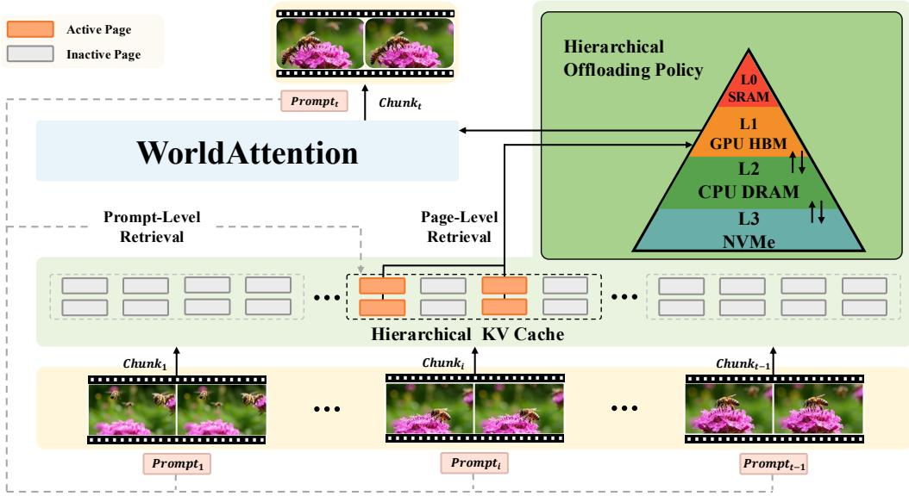  
Figure 7 Overview of the WorldAttention architecture featuring a three-tier hierarchical KV cache and a two-stage (prompt-level and page-level) retrieval mechanism for eficient long-video generation.

## H Visualization

Figures 8, 9, 10, 11, 12, and 13 present qualitative comparisons on an interactive long-video generation example. Compared with existing approaches, WorldAttention maintains stronger subject consistency, smoother motion transitions, and more stable scene structure across the entire sequence.

00s  
10s  
20s  
30s  
40s  
50s  
60s  
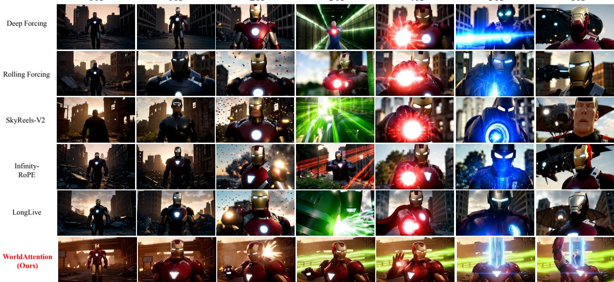  
Figure 8 An interactive long-video generation example.

## "captions": [

"Iron Man walks through a war-torn, crumbling urban ruin at dusk, then stops and stands still. Wide shot to medium close-up (00s - 09s).",

"A hail of bullets tears in. Iron Man raises his arm, rounds and shells streak past. Wide shot to medium close-up (10s - 19s).",

"Emerald-green beams sweep down the street. Wide shot to medium close-up (20s - 29s).",

"Iron Man aims and fires tight, pulsed red repulsor blasts from his palm. Wide shot to medium close-up (30s - 39s).",

"The chest arc reactor unleashes a colossal blue beam. Wide shot to medium close-up $( 4 0 \mathrm { s } \ - 4 9 \mathrm { s } ) . ^ { \prime \prime }$

"A dark alien craft enters from the left and cruises across. Iron Man raises his arm again while looking up at the alien craft. Wide shot to medium close-up (50s - 59s)."]

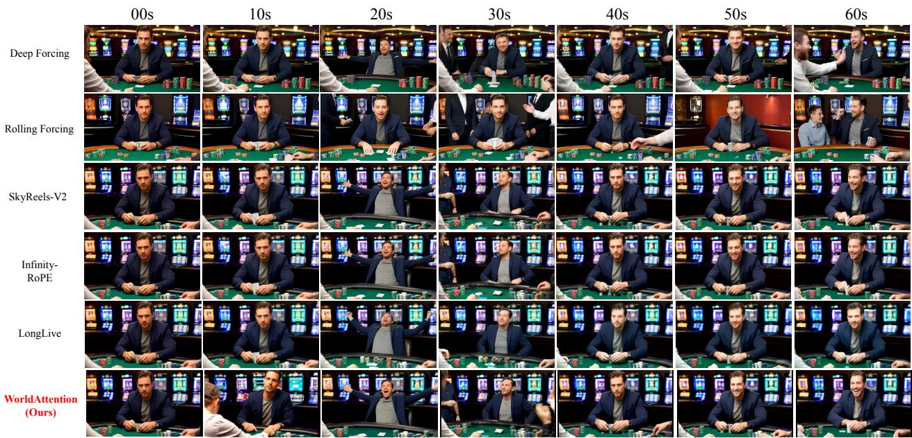  
Figure 9 An interactive long-video generation example.

## "captions": [

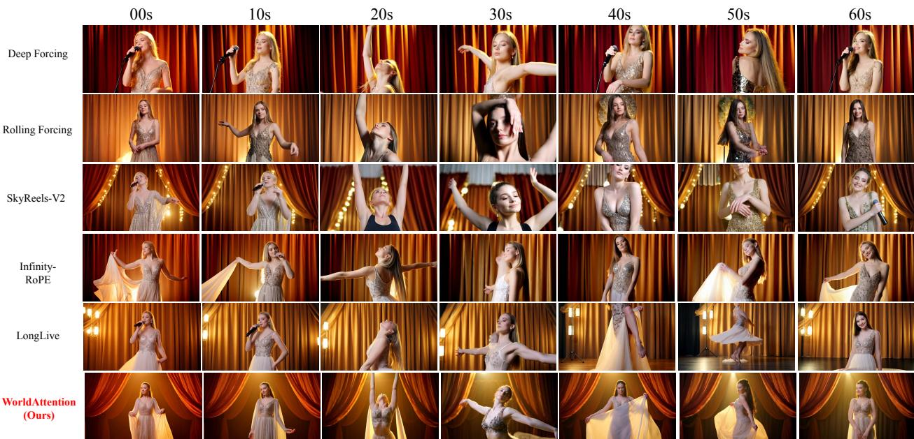  
Figure 10 An interactive long-video generation example.

## "captions": [

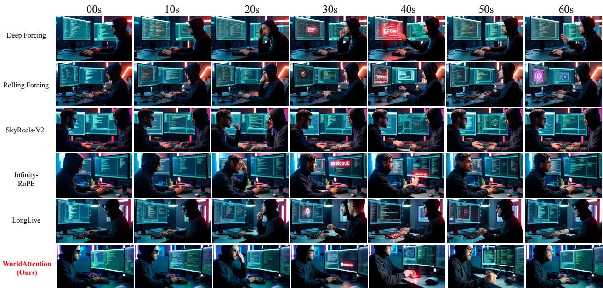  
Figure 11 An interactive long-video generation example.

## "captions": [

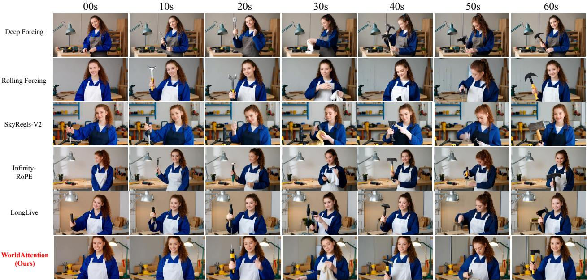  
Figure 12 An interactive long-video generation example.

## "captions": [

"A young white woman in a blue work coat and white apron, with a curly brown ponytail, lifts a tool from a tidy, well-lit workbench and smiles to the camera in greeting. Medium close-up, static shot (00s - 09s).",

"At the same tidy workbench, the same young woman in the blue work coat and white apron tightens a screw with the tool, then shows the result to the camera with a satisfied nod. Medium close-up, static shot (10s - 19s).",

"The same woman wipes her hands on a rag and gestures proudly toward the finished piece on the neat workbench, still framed in the same bright workshop setting. Medium close-up, static shot (20s - 29s).",

"Still smiling, the same young woman picks up a small hammer from the tidy workbench to demonstrate the next step, her curly brown ponytail visible above the white apron. Medium close-up, static shot (30s - 39s).",

"The same woman gently taps a nail into wood with steady, careful strikes. Her curly brown ponytail sways slightly as she works at the clean, well-lit workbench. Medium close-up, static shot (40s - 49s).",

"Leaning closer to the camera with bright eyes, the same young woman ofers a proud, friendly smile while the small hammer rests in her hand beside the finished piece. Medium close-up, static shot (50s - 59s)."]

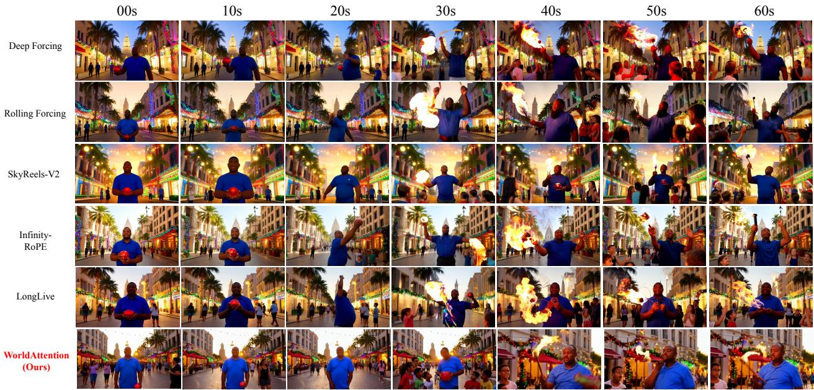  
Figure 13 An interactive long-video generation example.

## "captions": [

"A realistic vibrant Christmas street scene in Rio de Janeiro with colorful holiday lights, festive decorations, palm trees, tall buildings, and locals dressed in summer clothes. At the center, a slightly overweight Black man in a blue shirt holds a small red ball. Christ the Redeemer peeks in the distance, and a warm golden glow fills the scene. Wide shot to medium close-up (00s - 09s).",

"The same vibrant Christmas street in Rio de Janeiro remains full of colorful lights, festive decor, palm trees, tall buildings, and locals in summer wear. The same slightly overweight Black man in a blue shirt tosses the small red ball into the air, drawing a small crowd of kids and adults around him. Christ the Redeemer is still visible in the distance under the warm golden glow. Wide shot to medium close-up (10s - 19s).",

"The same performer in the blue shirt switches from the red ball to long ribbon streamers on the lively Christmas street. He twirls colorful ribbons through the warm golden air as kids and adults gather closer, cheering amid holiday lights, festive decorations, palm trees, and tall buildings, with Christ the Redeemer still peeking in the distance. Wide shot to medium close-up (20s - 29s).",

"The same slightly overweight Black man in the blue shirt now performs with a flaming torch on the vibrant Christmas street. The crowd’s excitement surges as the torch flame flickers against colorful holiday lights and festive decor, with palm trees, tall buildings, summer-dressed locals, and Christ the Redeemer in the distance. Wide shot to medium close-up (30s - 39s).",

"The same street performer balances the flaming torch carefully on his chin while standing at the center of the Christmas street. Children press closer with wide-eyed wonder as adults cheer behind them, surrounded by colorful lights, festive decorations, palm trees, tall buildings, and the warm golden glow of Rio with Christ the Redeemer in the distance. Wide shot to medium close-up (40s - 49s).",

"The same slightly overweight Black man in the blue shirt twirls the flaming torch between his fingers as applause rolls through the audience. Kids and adults cheer on the vibrant Christmas street, framed by colorful holiday lights, festive decor, palm trees, tall buildings, summer clothes, a warm golden glow, and Christ the Redeemer peeking in the distance. Wide shot to medium close-up (50s - 59s)."]