# XFlow: A Workflow Model for Instruction-Guided Lesion Segmentation in Chest X-rays

Geon Choi1, Hangyul Yoon1, Hyunki Park2, Sang Hoon Seo3 and Edward Choi1 1KAIST, 2Korea University Guro Hospital, 3Samsung Medical Center

Existin text- uided se mentation models in the medical domain cover onl a narrow set of anatomical structures and lesions in chest X-rays (CXRs), and most of them assume that the queried target is always present in the image. Instruction-guided lesion segmentation (ILS) was introduced to overcome these limitations by segmenting diverse lesion types from simple user instructions while also recognizing when the queried lesion is absent, and ROSALIA was ro osed as the first model for this task. However, the masks roduced b ROSALIA remain of limited quality, often carrying scattered noise. Moreover, ROSALIA predicts the mask in a single shot, which difers fundamentally from how radiologists perceive and delineate lesions in practice. A radiologist first surveys the entire thorax, then localizes the approximate region of abnormality, and only then refines the lesion contour. Motivated by this coarse-to-fine, multi-level perception process, we present XFlow, a workflow model for ILS that combines box-based localization with multi-turn point refinement. XFlow detects the lungs, decides whether the ueried findin is resent in each of them, and rom ts a fine-tuned SAM with the lesion box for an initial mask. It then corrects that mask through point prompts until its boundary follows the lesion, leaving every intermediate decision visible. Our experiments show that XFlow achieves the best segmentation quality on both internal and external evaluation. Notably, it surpasses ROSALIA in segmentation quality even when the two are trained on the same lesion annotations. Code and model weights will be made publicly available.

## 1. Introduction

Medical imaging plays a crucial role in modern medicine as a primary source of visual evidence. Among the available modalities, chest X-ray (CXR) is the most widely used examination for rapidly assessing a patient’s overall condition (Broder, 2011). Compared with other modalities such as CT or MRI, however, CXR ofers limited spatial resolution and projects three-dimensional anatomy onto a single plane, so that multiple structures overlap within the same region. Accurate interpretation therefore demands substantial radiological expertise. In routine clinical practice, however, radiologists must read a large volume of studies each day and are often expected to interpret an individual case within minutes. Among the required reading tasks, lesion segmentation requires pixel-level judgment rather than a mere image-level impression, and this step consumes the largest share of a radiologist’s reading time.

A text-guided segmentation model could ease this burden, yet existing medical models cover only a limited range of anatomical structures and lesion types in CXRs (Huang et al., 2024; Li et al., 2023), since collecting large-scale, high-quality annotations from radiologists across diverse findings is time-intensive. Moreover, most assume the queried target is present in the image, whereas radiologists must first determine whether a lesion exists at all. To address these limitations, Choi et al. (2026c) introduced instruction-guided lesion segmentation (ILS), which segments diverse CXR lesions from simple instructions while also recognizing when the queried lesion is absent. Along with the task, they released MIMIC-ILS, a large-scale lesion segmentation dataset (Choi et al., 2026b), and proposed ROSALIA, the first vision-language model (VLM) for ILS. That work, however, centers on the dataset, and ROSALIA’s masks remain of limited quality, often carrying scattered noise.

We attribute these failures to ROSALIA’s architecture: it adopts LISA (Lai et al., 2024), which couples a VLM with the Segment Anything Model (SAM) (Kirillov et al., 2023) for referring image segmentation (RIS) in the general domain, and fine-tunes it on MIMIC-ILS without further modification. Like ROSALIA, most text-guided segmentation models in the medical domain couple a VLM with a segmentation module and predict the mask in a single shot (Zhao et al., 2024; Huang et al., 2025). Such a design ofers the user no view of how the mask was reached, and it is overly simplistic for lesion segmentation, which demands clinical expertise.

Recent work such as IBISAgent (Jiang et al., 2026) moves beyond a single shot by having a VLM place point prompts on SAM over multiple turns, yet it relies on points alone, carving the mask at a fine-grained level from the start and thus requiring many steps to complete it. Radiologists in fact proceed through several levels of perception in sequence to delineate a lesion. They first survey the whole thorax to form a global impression, then narrow their attention to the approximate region where an abnormality is likely to reside, and only at the last stage refine the exact boundary at a fine-grained level. Single-shot models collapse these levels into one step, and point-only refinement covers only the last.

Stage 1: Initial Segmentation  
Stage 1: Initial Segmentation  
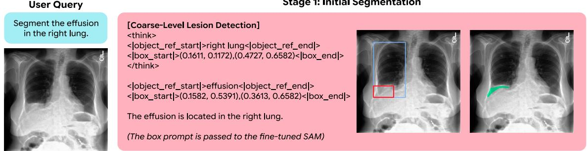

Stage 2: Segmentation Revision  
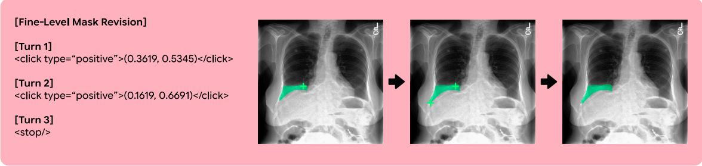

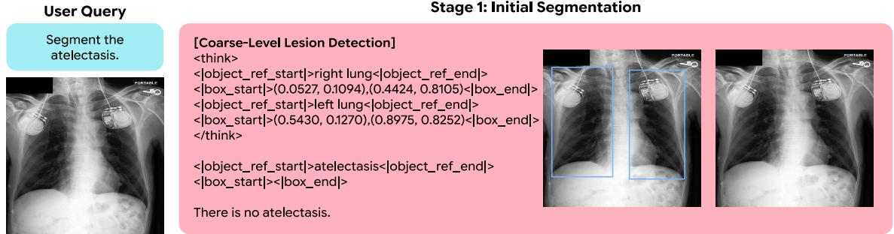  
Figure 1: Overview of XFlow. (Top) In Stage 1, XFlow grounds the lung regions, localizes the finding as a bounding box, and prompts a fine-tuned SAM with that box to obtain an initial mask. In Stage 2, it inspects the mask and issues positive or negative point prompts that expand or shrink the predicted region, repeating this until the mask is satisfactory. (Bottom) If the queried finding is absent, XFlow terminates at Stage 1 without producing a mask.

Following this observation, we develop XFlow, a workflow model for ILS in CXRs. XFlow performs segmen- tation as a sequence of two stages that separate coarse-level from fine-level perception (Figure 1). In the initial segmentation stage, the model reads the cardiopulmonary field and first detects the lungs, then examines each of them in turn to decide whether the queried finding is there, and draws a box around the lesion, which it hands to a fine-tuned SAM as a prompt to obtain the first mask. The subsequent segmentation revision stage inspects that mask and corrects it through point prompts to the SAM, step by step, until the boundary follows the lesion. Every intermediate decision is written out explicitly, so the user can trace how the final mask was reached.

In our experiments, XFlow outperforms all compared models in segmentation quality on both internal and external evaluation, and an ablation study shows that each stage of the workflow, together with its training scheme, contributes to the gain. Trained on the same MIMIC-ILS cases as ROSALIA, XFlow improves segmentation by a clear margin, indicating that the gain does not come from additional lesion annotations.

Our contributions are summarized as follows:

• We present XFlow, a workflow model for CXR lesion segmentation, which decomposes the task into two

stages following the order in which radiologists read an image.

• Trained on the same lesion annotations as ROSALIA, XFlow outperforms it by a clear margin on both internal and external evaluation, and an ablation shows that each component of the decomposition contributes to the gain.

• In a blinded reader study with three medical experts, masks from XFlow are ranked close to the ground truth and are preferred over those of ROSALIA about twice as often.

## 2. Related Works

Segmentation with VLMs and SAM. To segment a target described in free-form text, general-domain work couples a VLM with SAM, and the resulting models difer mainly in how the VLM communicates with the segmenter. LISA (Lai et al., 2024) feeds the hidden state of a special [SEG] token to the SAM decoder, whereas later models have the VLM emit geometric prompts that SAM consumes directly. Seg-Zero (Liu et al., 2025) predicts a box and points together and prompts SAM with them in a single step, while SegAgent (Zhu et al., 2025) relies on point clicks alone, placing them over multiple turns in imitation of a human annotator. In the medical domain, IBISAgent (Jiang et al., 2026) follows the latter design, with a VLM issuing point prompts across turns.

Both designs, however, have limitations. A single-step prompt cannot correct the mask once it is produced, while a point-only procedure forgoes the box and must carve out the mask click by click, taking IBISAgent 8.69 steps on average. Moreover, IBISAgent is supervised on individual revision steps, and although it later applies RL to its point prompts, it still optimizes each turn in isolation, so the policy never learns how its clicks should work together across the trajectory. XFlow combines the two designs, first localizing the lesion with a box and then refining its boundary through successive point prompts within at most four steps, and trains the revision policy with a reward defined over the entire multi-turn trajectory.

Instruction-Guided Lesion Segmentation in Chest X-rays. Earlier models for text-guided lesion segmentation in CXRs are confined to a single target, largely because annotated data is scarce (Huang et al., 2024; Li et al., 2023). CheXlocalize (Saporta et al., 2022) provides radiologist-drawn masks for CXR findings, but it is far too small to train on. To overcome this, MIMIC-ILS introduced a large-scale lesion segmentation dataset built throu h an automated framework to ether with ROSALIA a LISA-based model trained on it (Choi et al., $2 0 2 6 \mathrm { c } , \mathrm { b } )$ . ROSALIA accepts a text instruction such as “Segment the opacity” and covers seven clinically important findings, namely cardiomegaly, pneumonia, atelectasis, opacity, consolidation, edema, and efusion. Its masks, however, are often imprecise, and because it predicts them in one shot, it neither follows the coarse-to-fine workflow of a radiologist nor shows the user how the final delineation was reached. XFlow addresses both: it covers the same findin s throu h this workflow, and because ever intermediate decision is written out in text, each of them remains inspectable by the user.

## 3. Task Formulation

We address instruction-guided lesion segmentation (ILS), the task introduced in MIMIC-ILS. An instruction $Q = ( c , \ell )$ names a target lesion � and a location ℓ at which to look, where ℓ ranges from the whole thorax (“Segment the pleural efusion.”) through one lung (“. . . in the left lung.”) to a specific zone (“. . . in the left lung base.”). Given a chest X-ray � and such an instruction, a model � returns a binary mask over the image,

$$
M ^ { \mathrm { p r e d } } = f ( I , Q ) , \qquad M ^ { \mathrm { p r e d } } \in \{ 0 , 1 \} ^ { H \times W } ,\tag{3.1}
$$

covering the region the instruction refers to.

ILS is a medical counterpart of referring image segmentation (RIS), with one diference that follows from how the queries arise. In RIS, the referring expression describes an object the image is known to contain, so the target mask is nonempty by construction, whereas a radiologist is as often asked whether a finding is there at all. When � is absent from $\ell ,$ the ground truth is the empty mask, $M ^ { \mathrm { G T } } = \mathbf { 0 }$ . Whatever the instruction specifies, then, the model must arrive at its own verdict on the region in question rather than take the instruction as evidence that something is there.

## 4. XFlow

## 4.1. Architecture Overview

Notation. XFlow and a single promptable segmenter $F _ { \mathrm { s e g } } ,$ built on SAM and shared by both. The two policies interact with $F _ { \mathrm { s e g } }$ through its geometric prompts (boxes and points) rather than predicting the mask directly, and are applied in sequence.

Every region the model refers to is represented as a grounded box $\boldsymbol { g } ^ { \mathbf { \Theta } } = \left( \boldsymbol { e } , \boldsymbol { b } \right)$ , where � is a referring expression naming the region (e.g., right lung, pneumonia) and $b = ( x _ { 1 } , y _ { 1 } , x _ { 2 } , y _ { 2 } ) \in [ 0 , 1 ] ^ { 4 }$ is its bounding box in normalized image coordinates. We denote by ℒ and ℬ the sets of grounded boxes for the lungs and for the lesion, respectively.

Stage 1: Initial segmentation. The first policy $\pi _ { \mathrm { i n i t } }$ follows the order in which a radiologist reads the image. It first grounds the lung regions to establish the anatomical context in which the lesion should be sought, then judges whether the queried lesion is present, and only then localizes it. These three decisions are emitted as a single sequence,

$$
( { \mathcal { L } } , { \mathcal { B } } ) \sim \pi _ { \operatorname { i n i t } } ( \cdot \mid I , Q ) ,\tag{4.1}
$$

where the lung boxes $\mathcal { L }$ precede the lesion boxes $B .$ The scope of $\mathcal { L }$ follows the instruction. A query about the thorax as a whole grounds both lungs, $| { \mathcal { L } } | = 2$ , whereas a query restricted to one side grounds only that lung, $| \mathcal { L } | = 1$ . When the lesion is absent, the policy emits no lesion box, $B = \varnothing$ , and the instruction is answered with an empty mask. Otherwise each lesion box prompts the segmenter separately, yielding a set of initial masks

$$
\mathcal { M } _ { 0 } = \{ F _ { \mathrm { s e g } } ( I , b ) \mid b \in \mathcal { B } \} .\tag{4.2}
$$

Stage 2: Segmentation revision. Each mask in $\mathcal { M } _ { 0 }$ is revised independently, and the union of the revised masks forms the final prediction. Below we describe the procedure for one such mask, denoted $M _ { 0 }$ . The second policy $\pi _ { \mathrm { r e v } }$ refines $M _ { 0 }$ over at most $T = 4$ steps. At step $t ,$ it observes the image overlaid with the current mask and the point prompts issued so far, denoted $o _ { t } ,$ together with the history of preceding steps $P _ { < t } ,$ and produces an action $a _ { t }$

$$
a _ { t } \sim \pi _ { \mathrm { r e v } } ( \cdot \mid I , Q , o _ { t } , P _ { < t } ) .\tag{4.3}
$$

The action space consists of point prompting and termination. A point prompt is a pair $\left( { { s _ { t } } , { p _ { t } } } \right)$ with polarity $s _ { t } \in \{ + 1 , - 1 \}$ and relative coordinate $p _ { t } \in [ 0 , 1 ] ^ { 2 }$ , where a positive point expands and a negative point shrinks the predicted region. Since the box prompt confines the region the segmenter can cover, we enlarge it to the smallest box enclosing both $b _ { t - 1 }$ and $p _ { t }$ whenever a positive point falls outside $\mathrm { i t } ,$ and leave it unchanged otherwise, with $b _ { 0 }$ set to the box that produced $M _ { 0 }$ . Executing the prompt yields the next mask

$$
M _ { t } = F _ { \mathrm { s e g } } ( I , b _ { t } , \{ ( s _ { i } , p _ { i } ) \} _ { i \leq t } , M _ { t - 1 } ) ,\tag{4.4}
$$

which is rendered as the observation $o _ { t + 1 }$ and appended to the trajectory. The loop terminates when the policy judges the mask to be suficient or when $t = T$ . Because the entire revision proceeds within a single context, every step is conditioned on the full history of the preceding ones. Applying this procedure to every mask in $\mathcal { M } _ { 0 }$ and taking the union of the results gives the final prediction $M ^ { \mathrm { p r e d } }$

## 4.2. Training Data

Training XFlow involves three components. The segmenter $F _ { \mathrm { s e g } }$ is fine-tuned for CXR lesions, and each of the two policies is trained through supervised fine-tuning (SFT) followed by reinforcement learning (RL). All three are trained on data constructed automatically from MIMIC-ILS (Choi et al., 2026c,b), since every field is obtained from the masks and metadata the dataset already provides, so building it requires no additional human annotation. We divide MIMIC-ILS into disjoint splits for SFT and RL $( D _ { \mathrm { { S F T } } }$ and $D _ { \mathrm { R L } } )$ , both of which are also disjoint from the evaluation split $D _ { \mathrm { e v a l } }$ . For RL and evaluation we draw both sets from the cases that medical experts in the CheXpercept study (Choi et al., 2026a) identified as the most reliable within MIMIC-ILS in terms of mask quality.

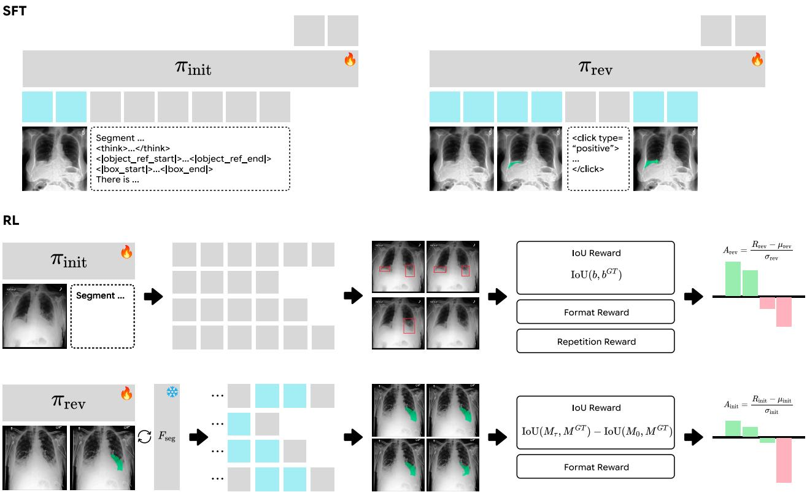  
Figure 2: Training the two policies. We first apply SFT to $\pi _ { \mathrm { i n i t } }$ and $\pi _ { \mathrm { r e v } }$ on automatically constructed initial segmentation and segmentation revision scenarios, and then train each policy further with GRPO. $A _ { \mathrm { i n i t } }$ and $A _ { \mathrm { { r e v } } }$ are the advantages obtained by normalizing $R _ { \mathrm { i n i t } }$ and $R _ { \mathrm { r e v } }$ within each group of sampled generations. Text tokens are shown in gray and image tokens in light blue.

## 4.3. SAM Training

Within XFlow, $F _ { \mathrm { s e g } }$ is invoked by the policies, so the segmenter must be able to respond to prompts that point at lesions. Neither the original SAM nor its medical variants such as MedSAM are trained on CXR lesions, so we obtain $F _ { \mathrm { s e g } }$ by fine-tuning SAM3 (Carion et al., 2026) on the SFT split $D _ { \mathrm { S F T } }$ . From each ground-truth mask $M ^ { \mathrm { G T } }$ we derive the prompts used during training, sampling a box � that encloses the annotated region together with points $( s , p )$ drawn from inside and outside it, so that the prompt configuration seen during training matches the one the policies produce at inference time.

## 4.4. VLM Training

The two policies are trained separately, and executed in sequence at inference time. SFT alone optimizes only the token-level likelihood of the target sequence. The model learns to imitate the format of the target sequence, but receives no direct feedback on whether the decisions it contains are correct. We therefore continue with RL in both stages, using rewards that measure the quality of the outcome. Throughout, $F _ { \mathrm { s e g } }$ is kept frozen, so the policies learn to steer a fixed segmenter. Prompt templates and example SFT targets are deferred to Appendix A.3.

## 4.4.1. Initial Segmentation Policy

Each SFT example for $\pi _ { \mathrm { i n i t } }$ pairs an image and an instruction with the sequence of decisions the stage requires, the lung boxes, the presence decision, and the lesion boxes, written out in the format shown in Figure 1. Lung boxes are obtained by running an of-the-shelf lung segmentation model (Seibold et al., 2023; Cosarinsky et al., 2025), while the presence label and the lesion boxes are derived directly from MIMIC-ILS.

The RL reward combines a localization term with two auxiliary terms,

$$
R _ { \mathrm { i n i t } } = R _ { \mathrm { b o x } } + R _ { \mathrm { f o r m a t } } + R _ { \mathrm { r e p } } , \qquad R _ { \mathrm { b o x } } = \mathrm { I o U } ( b , b ^ { \mathrm { G T } } ) .\tag{4.5}
$$

For a negative case, $R _ { \mathrm { b o x } }$ is instead binary and depends only on whether the model emits $B = \varnothing .$ . The other two terms act on the form of the output rather than its content. $R _ { \mathrm { f o r m a t } }$ checks that the generated text follows the expected structure, so that the grounded boxes can be parsed from it, and $R _ { \mathrm { r e p } }$ penalizes emitting the same box more than once.

## 4.4.2. Segmentation Revision Policy

SFT examples for $\pi _ { \mathrm { r e v } }$ are revision trajectories constructed by simulating the process the policy will later perform. We perturb the ground-truth box $b ^ { \mathrm { G T } }$ and feed it to $F _ { \mathrm { s e g } } ,$ which yields an imperfect mask �˜ . Starting from $\tilde { M } ;$ , we place clicks following the simulated-user protocol standard in interactive segmentation (Xu et al., $2 0 1 6 ;$ Sofiiuk et al., 2022; Kirillov et al., 2023), which selects at each step the point that brings the resulting mask closest to $M ^ { \mathrm { G T } }$ . One trajectory is thus

$$
\big ( M _ { 0 } , a _ { 1 } , M _ { 1 } , a _ { 2 } , . . . \big ) , \qquad M _ { 0 } = \tilde { M } ,\tag{4.6}
$$

where a point prompt $\left( { { s _ { t } } , { p _ { t } } } \right)$ turns $M _ { t - 1 }$ into $M _ { t } ,$ , and the trajectory ends either at the step limit or when the policy issues the termination action. Each $M _ { t }$ enters the example as the observation $o _ { t + 1 }$ , rendered by overlaying the mask and the points issued so far on $I ,$ exactly as at inference time.

The RL reward pairs the gain in IoU over the trajectory the model itself produces with the same format term as before,

$$
R _ { \mathrm { r e v } } = R _ { \mathrm { g a i n } } + R _ { \mathrm { f o r m a t } } , \qquad R _ { \mathrm { g a i n } } = \mathrm { I o U } ( M _ { \tau } , M ^ { \mathrm { G T } } ) - \mathrm { I o U } ( M _ { 0 } , M ^ { \mathrm { G T } } ) ,\tag{4.7}
$$

where � is the step at which the policy terminates and $M _ { 0 } = \tilde { M }$ is the mask the trajectory starts from. Rewarding the net gain lets the model stop as soon as further revision would no longer help.

## 5. Experiments

## 5.1. Implementation Details

$F _ { \mathrm { s e g } }$ is built on SAM3, fine-tuned with the image encoder unfrozen. Both policies are built on MedGemma- 1.5-4B-it (Sellergren et al., 2026) and trained on eight A100-80GB GPUs with LoRA (Hu et al., 2021) (�=128, �=256) on all linear layers and the vision tower unfrozen, at an efective batch size of 256 for $\pi _ { \mathrm { i n i t } }$ and 64 for $\pi _ { \mathrm { r e v } }$ during supervised fine-tuning. RL then uses GRPO (Shao et al., 2024) with 8 generations per prompt at temperature 1.0, and the rollouts of $\pi _ { \mathrm { r e v } }$ run with $F _ { \mathrm { s e g } }$ in the loop for at most four clicks per episode. Before that, $\pi _ { \mathrm { r e v } }$ is warm-started from $\pi _ { \mathrm { i n i t } }$ at its SFT checkpoint, so that it inherits grounding ability without also inheriting a habit of always committing to a box. The remaining hyperparameters are given in the Appendix A.4.

## 5.2. Experimental Setup

Evaluation set. As described in Sec. 4.2, evaluation is carried out on part of the CheXpercept subset of MIMIC-ILS, the cases whose masks physicians judged most reliable. This portion is disjoint from all training data, so that every evaluation image is unseen. Even within this subset, human error may remain, so we apply an additional filter. We obtain further evidence on whether a lesion is present and where it lies from two more sources, Chest ImaGenome (Wu et al., 2021b,a) and an LLM parse of the radiology report accompanying the X-ray, and rebuild the evaluation set from the cases on which all of them agree. The resulting set queries the same studies at three levels of location specificity: chest, naming the finding alone (“Segment the edema.”; 382 positives, 444 negatives); lung, adding the side (“. . . in the left lung.”; 429, 1,050); and zone, naming the regions directly $\binom { \ast } { \cdot \cdot }$ . in the left mid zone and left lung base.”; 330, 3,286). Appendices A.2 and B give the agreement criteria and the per-finding counts.

We additionally evaluate on CheXlocalize (Saporta et al., 2022), an external dataset whose images come from CheXpert (Irvin et al., 2019) and whose masks are drawn from scratch by radiologists. We use the 775 positive and 1,643 negative cases over the six findings that CheXlocalize shares with the set of lesions XFlow can segment, and query them at the chest level only (e.g., “Segment the consolidation”). CheXlocalize also provides segmentations drawn by a second, independent pair of radiologists, which we score through the same pipeline as the models and report as a human benchmark.

Table 1: Comparison with prior models. On CheXpercept the three question levels are averaged with equal weight, and on CheXlocalize every case is queried at the chest level. The radiologists behind the human benchmark were told which findin to draw, so F1 is not defined for them. The best score amon the models is shown in bold and the second best is underlined.
<table><tr><td rowspan="2">Model</td><td colspan="3">CheXpercept</td><td rowspan="2"></td><td colspan="3">CheXlocalize</td></tr><tr><td>gIoU</td><td>cIoU</td><td>F1</td><td>gIoU</td><td>cIoU</td><td>F1</td></tr><tr><td>Human benchmark</td><td></td><td></td><td></td><td></td><td>0.314</td><td>0.339</td><td></td></tr><tr><td>LISA-7B</td><td>0.014</td><td>0.024</td><td>0.401</td><td></td><td>0.082</td><td>0.119</td><td>0.491</td></tr><tr><td>PixelLM-7B</td><td>0.031</td><td>0.032</td><td></td><td>0.416</td><td>0.125</td><td>0.125</td><td>0.485</td></tr><tr><td>Text4Seg</td><td>0.035</td><td>0.038</td><td>0.402</td><td></td><td>0.119</td><td>0.132</td><td>0.475</td></tr><tr><td>IMIS-Net</td><td>0.080</td><td>0.087</td><td></td><td>0.413</td><td>0.005</td><td>0.007</td><td>0.423</td></tr><tr><td>IBISAgent-7B†</td><td>0.135</td><td>0.131</td><td>0.416</td><td></td><td>0.081</td><td>0.082</td><td>0.484</td></tr><tr><td>BiomedParse</td><td>0.257</td><td>0.254</td><td>0.413</td><td></td><td>0.105</td><td>0.108</td><td>0.483</td></tr><tr><td>RecLMIS</td><td>0.302</td><td>0.305</td><td>0.419</td><td></td><td>0.138</td><td>0.143</td><td>0.488</td></tr><tr><td>ROSALIA</td><td>0.621</td><td>0.688</td><td>0.945</td><td></td><td>0.233</td><td>0.289</td><td>0.634</td></tr><tr><td>XFlow (ours)</td><td>0.703</td><td>0.731</td><td></td><td>0.961</td><td>0.283</td><td>0.331</td><td>0.632</td></tr></table>

Baselines and metrics. We compare our model against two groups of models. The first consists of generaldomain models, LISA (Lai et al., 2024), PixelLM (Ren et al., 2024), and Text4Seg (Lan et al., 2025), which take a free-form instruction and return a mask. The second covers models develo ed for the medical domain BiomedParse (Zhao et al., 2024), RecLMIS (Huang et al., 2024), IMIS-Net (Cheng et al., 2025) and IBIS-Agent (Jiang et al., 2026)†. We also evaluate fine-tuned ROSALIA (Choi et al., 2026c) on the same MIMIC-ILS cases (�SFT and $D _ { \mathrm { R L } } )$ . We report gIoU, the mean per-sample IoU, and cIoU, the ratio of total intersection to total union. F1 measures how well a model separates positive from negative cases, treating a returned mask as positive and an empty output as negative.

## 5.3. Main Results

Comparison with prior models. XFlow records the highest gIoU and cIoU of all models we compare against, on both CheXpercept and CheXlocalize. The margin is largest over the baselines outside the ROSALIA family, but it also holds over ROSALIA, the only prior model trained for this task. For a fair comparison, we retrain ROSALIA on exactly the cases XFlow uses, so that both models receive the same lesion supervision and the gain cannot be attributed to additional annotations. XFlow raises IoU on CheX erce t from 0.621 to 0.703 and F1 from 0.945 to 0.961. The same pattern holds on CheXlocalize, where gIoU rises from 0.233 to 0.283 and cIoU from 0.289 to 0.331, approaching the human benchmark at 0.314 and 0.339, while F1 remains on par (0.632 vs. 0.634). Since these masks were drawn independently by radiologists, the gain carries over to an annotation protocol our training data never saw.

Efect of each stage and its training phase. We examine how much SFT and RL contribute to each stage (Table 2). Each addition improves or maintains gIoU and consistently improves cIoU on both benchmarks. Most of the gain comes from Stage 1. SFT alone reaches a gIoU of 0.668 on CheXpercept, above ROSALIA’s 0.621, though its F1 of 0.932 falls short of ROSALIA’s 0.945. RL raises gIoU to 0.693 and F1 to 0.961, suggesting that the outcome-based reward sharpens the presence decision and box placement that SFT only imitates. Stage 2 adds a further 0.010 IoU on CheX erce t and 0.003 on CheXlocalize, as it onl makes local corrections and can neither recover a lesion Stage 1 missed nor change a presence decision.

## 5.4. Qualitative Results

Figure 3 shows how the predicted masks difer across models. Apart from the ROSALIA family, the baselines do not follow the instruction in any meaningful sense and have little ability to delineate a lesion, returning regions that bear no relation to the finding that was asked for. ROSALIA responds to the instruction but its masks are imprecise. It misses small lesions entirely, and where it does respond, the predicted boundary fails to track the lesion contour and is accompanied by scattered spurious fragments. XFlow, by contrast, recovers even small lesions lying close to the heart, and its boundaries follow the ground truth closely with far fewer stray regions. Additional qualitative examples are provided in Appendix B.2.

Table 2: Contribution of each stage and training. Every component is added on top of the one before it. Stage 2 refines boxes Stage 1 has already emitted and never changes a presence decision, so it inherits Stage 1’s F1. ROSALIA is shown for reference and columns are as in Table 1. The best score is shown in bold and the second best is underlined.
<table><tr><td rowspan="2">Model</td><td colspan="2">Stage 1</td><td colspan="2">Stage 2</td><td colspan="3">CheXpercept</td><td colspan="3">CheXlocalize</td></tr><tr><td>SFT</td><td>RL</td><td>SFT</td><td>RL</td><td>gIoU</td><td>cIoU</td><td>F1</td><td>gIoU</td><td>cIoU</td><td>F1</td></tr><tr><td>ROSALIA</td><td></td><td></td><td></td><td></td><td>0.621</td><td>0.688</td><td>0.945</td><td>0.233</td><td>0.289</td><td>0.634</td></tr><tr><td rowspan="4">XFlow</td><td>V</td><td></td><td></td><td></td><td>0.668</td><td>0.709</td><td>0.932</td><td>0.268</td><td>0.325</td><td>0.631</td></tr><tr><td>√</td><td>√</td><td></td><td></td><td>0.693</td><td>0.718</td><td>0.961</td><td>0.280</td><td>0.327</td><td>0.632</td></tr><tr><td>√</td><td>√</td><td>√</td><td></td><td>0.699</td><td>0.726</td><td>0.961</td><td>0.280</td><td>0.329</td><td>0.632</td></tr><tr><td>√</td><td>√</td><td>√</td><td>√</td><td>0.703</td><td>0.731</td><td>0.961</td><td>0.283</td><td>0.331</td><td>0.632</td></tr></table>

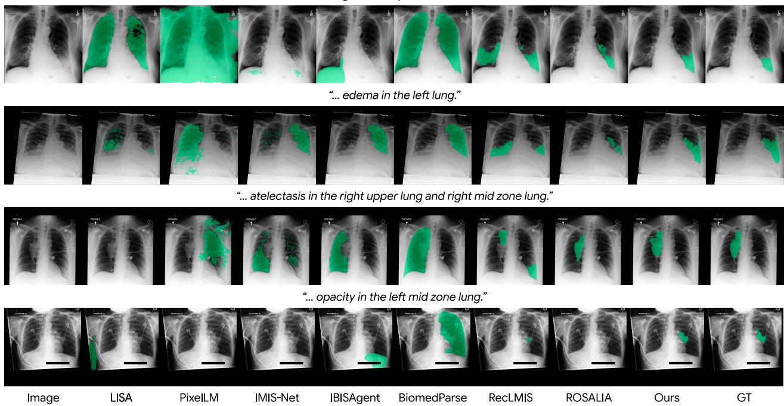  
Figure 3: Qualitative comparison of XFlow against baseline models.

## 6. Further Analyses

## 6.1. Mask Noise

Physicians tend to delineate a finding as a single smooth, continuous region unless it appears in clearly separate locations. XFlow’s masks are visibly closer to this than ROSALIA’s, yet IoU cannot capture the diference. We therefore count connected components relative to the GT mask for the same case,

$$
\Delta C = C ( M ^ { \mathrm { p r e d } } ) - C ( M ^ { \mathrm { G T } } ) ,\tag{6.1}
$$

where $C ( \cdot )$ is the number of connected components in a mask. ∆� thus measures how many more components a model produces than the GT. A positive value means the prediction breaks the finding into excess fragments, and a negative value means it yields fewer components than the GT. Additionally, we count specks, which we define as components smaller than 0.1% of the image area. As shown in Table 3, ROSALIA produces 5.63 more components than the GT on average, whereas XFlow produces 1.71. Most of this excess consists of specks, as ROSALIA leaves 5.57 specks per case against XFlow’s 1.69. Of these, 3.43 and 1.06, respectively, touch no part of the GT. These s ecks account for 2.6% of ROSALIA’s mask area but onl 0.14% of XFlow’s. XFlow therefore produces fewer small mask fragments that do not belong to the lesion.

Table 3: Mask fragmentation analysis over all 1,141 positive cases in the CheXpercept evaluation set. Δ� and specks are defined in Section 6.1. Outside GT counts the specks that do not overlap the GT mask, and Mask area is the fraction of the predicted mask area occupied by specks.
<table><tr><td rowspan="2">Model</td><td rowspan="2">∆C</td><td colspan="3">Specks</td></tr><tr><td>count ↓</td><td>outside GT ↓</td><td>mask area % ↓</td></tr><tr><td>GT</td><td></td><td>0.01</td><td></td><td>0.01</td></tr><tr><td>XFlow (ours)</td><td>+1.71</td><td>1.69</td><td>1.06</td><td>0.14</td></tr><tr><td>ROSALIA</td><td>+5.63</td><td>5.57</td><td>3.43</td><td>2.60</td></tr></table>

Table 4: Expert preference study. Three medical experts ranked three blinded masks on 95 balanced positive cases, giving 285 completed rankings. Log-strengths come from two tie-aware extensions of the Bradley–Terry model, Davidson and Rao–Kupper, which difer in how they treat a tie but agree here. Values are centred to sum to zero, with 95% bootstrap intervals over cases, and a diference of � means the stron er of the two masks is referred $e ^ { d }$ times as often when the reader does not tie.

<table><tr><td rowspan="2">Model</td><td colspan="2">Log-strength ↑</td><td rowspan="2">Mean rank ↓</td></tr><tr><td>Davidson</td><td>Rao-Kupper</td></tr><tr><td>GT</td><td>0.326 [0.17, 0.48]</td><td>0.294 [0.16, 0.44]</td><td>1.79</td></tr><tr><td>XFlow (ours)</td><td>0.185 [0.01, 0.38]</td><td>0.170 [0.01, 0.33]</td><td>1.88</td></tr><tr><td>ROSALIA</td><td>-0.511 [−0.72, −0.33]</td><td>-0.464 [−0.64, −0.30]</td><td>2.33</td></tr></table>

## 6.2. Expert Preference Study

We additionally ran a reader study in which medical experts ranked the mask quality of the ground truth, XFlow, and ROSALIA, which we include as the previous state of the art. For every case the reader saw the three masks in a counterbalanced random order, without an indication of their source, and ranked them b how well each delineated the queried finding, with ties allowed when two masks looked comparable. Three physicians each reviewed the same 95 cases, drawn so that every finding and question level is equally represented. Cardiomegaly contributes five cases at the chest level, and each of the remainin six findin s contributes five cases at each of the three levels (e.g., “Segment the atelectasis”, “... in the right lung”, and “... in the right lung base”).

Table 4 reports the result. We fit two tie-aware extensions of the Bradley–Terry model (Bradley and Terry, 1952), Davidson (Davidson, 1970) and Rao–Kupper (Rao and Kupper, 1967), which difer in how they treat a tie, and report the log-strength each assigns to the three masks. XFlow sits close to the ground truth, a diference of 0.141 under Davidson, so that a reader who separates the two prefers the ground truth 1.15 times as often, and their intervals overlap over most of their range. ROSALIA falls well short of both XFlow is preferred over it 2.01 times as often, a diference of 0.696, and the ground truth by more still, with ROSALIA’s interval overlapping neither of theirs. More details on the human study are provided in Appendix C.

## 7. Conclusion

We introduced XFlow, a workflow model for CXR lesion segmentation. XFlow mirrors the way a radiologist reads an image, separating coarse localization from fine-grained delineation and carrying them out in sequence rather than mapping an image to a mask in one step. XFlow substantially outperforms prior models and surpasses ROSALIA, the previous state of the art, even when the two are trained on the same lesion annotations. In future work, the intermediate steps and masks XFlow produces could serve as a foundation for other CXR tasks.

## References

Ralph Allan Bradley and Milton E. Terry. Rank analysis of incomplete block designs: I. the method of paired comparisons. Biometrika, 39:324, 1952. URL https://api.semanticscholar.org/CorpusID: 125209808.

Joshua Broder. Imaging the chest: the chest radiograph. Diagnostic imaging for the emergency physician, page 185, 2011.

Nicolas Carion, Laura Gustafson, Yuan-Ting Hu, Shoubhik Debnath, Ronghang Hu, Didac Suris Coll-Vinent, Chaitanya Ryali, Kalyan Vasudev Alwala, Haitham Khedr, Andrew Huang, et al. Sam 3: Segment anything with concepts. In International conference on learning representations, volume 2026, pages 138846–138923, 2026.

Junlong Cheng, Bin Fu, Jin Ye, Guoan Wang, Tianbin Li, Haoyu Wang, Ruoyu Li, He Yao, Junren Cheng, JingWen Li, et al. Interactive medical image segmentation: A benchmark dataset and baseline. In Proceedings of the IEEE/CVF Conference on Computer Vision and Pattern Recognition, pages 20841–20851, 2025.

Geon Choi, Hangyul Yoon, Nalee Kim, Jeong Yun Jang, Hyunju Shin, Hyunki Park, Sang Hoon Seo, and Edward Choi. Chexpercept: A benchmark for evaluating expert-level lesion perception in chest x-rays. arXiv preprint arXiv:2606.21020, 2026a.

Geon Choi, Hangyul Yoon, Hyunju Shin, Hyunki Park, Sang Hoon Seo, Eunho Yang, and Edward Choi. MIMIC-CXR-Ext-ILS: Lesion Segmentation Masks and Instruction-Answer Pairs for Chest X-rays. PhysioNet, March 2026b. doi: 10.13026/8ejy-4t06. URL https://doi.org/10.13026/8ejy-4t06. Version 1.0.0.

Geon Choi, Hangyul Yoon, Hyunju Shin, Hyunki Park, Sang Hoon Seo, Eunho Yang, and Edward Choi. Instruction-guided lesion segmentation for chest x-rays with automatically generated large-scale dataset. In Proceedings of the IEEE/CVF Conference on Computer Vision and Pattern Recognition, pages 1482–1492, 2026c.

Matias Cosarinsky, Nicolas Gaggion, Rodrigo Echeveste, and Enzo Ferrante. Chexmask-u: Quantifying uncertainty in landmark-based anatomical segmentation for x-ray images. arXiv preprint arXiv:2512.10715, 2025.

Roger R. Davidson. On extending the bradley-terry model to accommodate ties in paired comparison experiments. Journal of the American Statistical Association, 65:317–328, 1970. URL https://api. semanticscholar.org/CorpusID:121759206.

Edward J Hu, Yelong Shen, Phillip Wallis, Zeyuan Allen-Zhu, Yuanzhi Li, Shean Wang, Lu Wang, and Weizhu Chen. Lora: Low-rank adaptation of large language models. arXiv preprint arXiv:2106.09685, 2021.

Xiaoshuang Huang, Hongxiang Li, Meng Cao, Long Chen, Chenyu You, and Dong An. Cross-modal conditioned reconstruction for language-guided medical image segmentation. IEEE Transactions on Medical Imaging, 44 (4):1821–1835, 2024.

Xiaoshuang Huang, Lingdong Shen, Jia Liu, Fangxin Shang, Hongxiang Li, Haifeng Huang, and Yehui Yang. Towards a multimodal large language model with pixel-level insight for biomedicine. In Proceedings of the AAAI Conference on Artificial Intelligence, volume 39, pages 3779–3787, 2025.

Jeremy Irvin, Pranav Rajpurkar, Michael Ko, Yifan Yu, Silviana Ciurea-Ilcus, Chris Chute, Henrik Marklund, Behzad Haghgoo, Robyn Ball, Katie Shpanskaya, et al. Chexpert: A large chest radiograph dataset with uncertainty labels and expert comparison. In Proceedings of the AAAI conference on artificial intelligence, volume 33, pages 590–597, 2019.

Yankai Jiang, Qiaoru Li, Binlu Xu, Haoran Sun, Chao Ding, Junting Dong, Yuxiang Cai, Xuhong Zhang, and Jianwei Yin. Ibisagent: Reinforcing pixel-level visual reasoning in mllms for universal biomedical object referring and segmentation. arXiv preprint arXiv:2601.03054, 2026.

Alexander Kirillov, Eric Mintun, Nikhila Ravi, Hanzi Mao, Chloe Rolland, Laura Gustafson, Tete Xiao, Spencer Whitehead, Alexander C Berg, Wan-Yen Lo, et al. Segment anything. In 2023 IEEE/CVF international conference on computer vision (ICCV), pages 3992–4003. IEEE, 2023.

Xin Lai, Zhuotao Tian, Yukang Chen, Yanwei Li, Yuhui Yuan, Shu Liu, and Jiaya Jia. Lisa: Reasoning segmentation via large language model. In 2024 IEEE/CVF Conference on Computer Vision and Pattern Recognition (CVPR), pages 9579–9589. IEEE, 2024.

Mengcheng Lan, Chaofeng Chen, Yue Zhou, Jiaxing Xu, Yiping Ke, Xinjiang Wang, Litong Feng, and Wei Zhang. Text4seg: Reimagining image segmentation as text generation. In International Conference on Learning Representations, volume 2025, pages 1634–1661, 2025.

Zihan Li, Yunxiang Li, Qingde Li, Puyang Wang, Dazhou Guo, Le Lu, Dakai Jin, You Zhang, and Qingqi Hong. Lvit: language meets vision transformer in medical image segmentation. IEEE transactions on medical imaging, 43(1):96–107, 2023.

Yuqi Liu, Bohao Peng, Zhisheng Zhong, Zihao Yue, Fanbin Lu, Bei Yu, and Jiaya Jia. Seg-zero: Reasoning-chain guided segmentation via cognitive reinforcement. arXiv preprint arXiv:2503.06520, 2025.

Jun Ma, Zongxin Yang, Sumin Kim, Bihui Chen, Mohammed Baharoon, Adibvafa Fallahpour, Reza Asakereh, Hongwei Lyu, and Bo Wang. Medsam2: Segment anything in 3d medical images and videos. arXiv preprint arXiv:2504.03600, 2025.

P. V. Rao and L. L. Kupper. Ties in paired-comparison experiments: A generalization of the bradley-terry model. Journal of the American Statistical Association, 62(317):194–204, 1967. doi: 10.1080/01621459.1967. 10482901. URL https://www.tandfonline.com/doi/abs/10.1080/01621459.1967.10482901.

Zhongwei Ren, Zhicheng Huang, Yunchao Wei, Yao Zhao, Dongmei Fu, Jiashi Feng, and Xiaojie Jin. Pixellm: Pixel reasoning with large multimodal model. In 2024 IEEE/CVF Conference on Computer Vision and Pattern Recognition (CVPR), pages 26364–26373. IEEE, 2024.

Adriel Saporta, Xiaotong Gui, Ashwin Agrawal, Anuj Pareek, Steven QH Truong, Chanh DT Nguyen, Van-Doan Ngo, Jayne Seekins, Francis G Blankenberg, Andrew Y Ng, et al. Benchmarking saliency methods for chest x-ray interpretation. Nature Machine Intelligence, 4(10):867–878, 2022.

Constantin Seibold, Alexander Jaus, Matthias A Fink, Moon Kim, Simon Reiß, Ken Herrmann, Jens Kleesiek, and Rainer Stiefelhagen. Accurate fine-grained segmentation of human anatomy in radiographs via volumetric pseudo-labeling. arXiv preprint arXiv:2306.03934, 2023.

Andrew Sellergren, Chufan Gao, Fereshteh Mahvar, Timo Kohlberger, Fayaz Jamil, Madeleine Traverse, Al- berto Tono, Bashir Sadjad, Lin Yang, Charles Lau, et al. Medgemma 1.5 technical report. arXiv preprint arXiv:2604.05081, 2026.

Zhihong Shao, Peiyi Wang, Qihao Zhu, Runxin Xu, Junxiao Song, Xiao Bi, Haowei Zhang, Mingchuan Zhang, YK Li, Yang Wu, et al. Deepseekmath: Pushing the limits of mathematical reasoning in open language models. arXiv preprint arXiv:2402.03300, 2024.

Konstantin Sofiiuk, Ilya A Petrov, and Anton Konushin. Reviving iterative training with mask guidance for interactive segmentation. In 2022 IEEE international conference on image processing (ICIP), pages 3141–3145. IEEE, 2022.

Joy Wu, Nkechinyere Agu, Ismini Lourentzou, Arjun Sharma, Joseph Paguio, Jasper Seth Yao, Edward Christo-pher Dee, William Mitchell, Satyananda Kashyap, Andrea Giovannini, Leo Anthony Celi, Tanveer Syeda- Mahmood, and Mehdi Moradi. Chest ImaGenome Dataset. PhysioNet, Jul 2021a. doi: 10.13026/wv01- 230. URL https://doi.org/10.13026/wv01-y230. Version 1.0.0.

Joy T Wu, Nkechinyere N Agu, Ismini Lourentzou, Arjun Sharma, Joseph A Paguio, Jasper S Yao, Edward C Dee, William Mitchell, Satyananda Kashyap, Andrea Giovannini, et al. Chest imagenome dataset for clinical reasoning. arXiv preprint arXiv:2108.00316, 2021b.

Ning Xu, Brian Price, Scott Cohen, Jimei Yang, and Thomas S Huang. Deep interactive object selection. In Proceedings of the IEEE conference on computer vision and pattern recognition, pages 373–381, 2016.

Theodore Zhao, Yu Gu, Jianwei Yang, Naoto Usuyama, Ho Hin Lee, Tristan Naumann, Jianfeng Gao, Angela Crabtree, Jacob Abel, Christine Moung-Wen, et al. Biomedparse: a biomedical foundation model for image parsing of everything everywhere all at once. arXiv preprint arXiv:2405.12971, 2024.

Muzhi Zhu, Yuzhuo Tian, Hao Chen, Chunluan Zhou, Qingpei Guo, Yang Liu, Ming Yang, and Chunhua Shen. Segagent: Exploring pixel understanding capabilities in mllms by imitating human annotator trajectories. In 2025 IEEE/CVF Conference on Computer Vision and Pattern Recognition (CVPR), pages 3686–3696. IEEE, 2025.

## A. Training

## A.1. Data Curation

Every split is built from two sources. MIMIC-ILS (Choi et al., 2026c,b) supplies the images, the lesion masks and the report-derived labels, and CheXpercept (Choi et al., 2026a) supplies the subset of those cases whose masks medical experts reviewed and judged reliable. MIMIC-ILS is large enough to train on, while CheXpercept is small and trustworthy enough to reinforce against and to score on. We therefore hold all 2,100 CheXpercept radiographs out of the supervised split and divide them in half, one half for RL and one for evaluation. What follows describes the splits themselves. Each stage builds its own prompts, boxes and masks from the studies its split contains, so one study gives rise to many samples, and a question asked at three levels of location specificity gives rise to three.

Table 5: How the splits divide the two sources. CheXpercept is a curated subset of the MIMIC-ILS training split, so holding it out leaves the supervised split disjoint from the other two by construction. Counts are radiographs; MIMIC-ILS carries one frontal radiograph per study, so they are also study counts.
<table><tr><td>Split Drawn from</td><td></td><td>Radiographs Selection</td><td></td></tr><tr><td> $D _ { \mathrm { S F T } }$ </td><td>MIMIC-ILS train \ CheXpercept MIMIC-ILS val</td><td>185,488 1,508</td><td>everything the review did not cover MIMIC-ILS&#x27;s own split, unchanged</td></tr><tr><td> $D _ { \mathrm { R L } }$   $D _ { \mathrm { e v a l } }$ </td><td>MIMIC-ILS train ∩ CheXpercept MIMIC-ILS train ∩ CheXpercept</td><td>1,296 560</td><td>70% of the agreed set, by patient the remaining 30%</td></tr><tr><td colspan="2">MIMIC-ILS train, before the exclusion CheXpercept, all of it inside MIMIC-ILS train of which the three sources agree on</td><td>187,588 2,100 1,856</td><td></td></tr></table>

$D _ { \mathbf { S F T } } .$ . The MIMIC-ILS training split with the CheXpercept radiographs removed, together with MIMIC-ILS’s own validation split. CheXpercept was drawn entirely from the training split, all $2 , 1 0 0$ of its radiographs sitting there and none in validation or test, so removing them leaves 185,488 of the original 187,588 and leaves the 1,508 validation radiographs untouched.

$D _ { \mathbf { R L } }$ and $D _ { \mathbf { e v a l } }$ . Both come from CheXpercept, and both are filtered by the three-source agreement of Section $\mathtt { A . 2 }$ before being divided, which leaves 1,856 of the 2,100 radiographs.

The division is by patient rather than by radiograph. Those 1,856 radiographs come from 1,526 patients, and 226 of them contribute more than one, covering 556 radiographs in all, so a split on radiograph identity would put the same chest on both sides. Patients are assigned greedily to whichever side is furthest below its quota on the scarcest stratum that patient carries, because matching the overall target ratios is not enough on its own: the evaluation’s power to test per-side discrimination rests on the 85 unilateral (radiograph, finding) pairs and on the per-finding positives, both of which a ratio-matched split can strand almost entirely on one side. The result is 1,296 radiographs for $D _ { \mathrm { { R I } } }$ and 560 for $D _ { \mathrm { e v a l } }$ , with no patient in both.

## A.2. Three-Source Agreement

CheXpercept’s labels can be wrong, and an evaluation set inherits whatever it gets wrong, so we check each of them against two further sources and keep only what all three support. All three record both whether a finding is present and where it is, which is what makes the check possible; they difer in how they record it.

• CheXpercept gives the list of zones a finding occupies.

• The radiology report gives free text, which we parse with MedGemma into a present or absent call per finding and region.

• Chest ImaGenome gives a yes or no per finding and region in its silver scene graphs.

Each is then reduced to the same verdict, present or absent for one (radiograph, finding, region). A triple is admitted only when the three verdicts are identical, and takes that verdict as its label; anything else, including a missing source, is dropped. 1,856 of the 2,100 radiographs keep at least one admitted triple, and those are the radiographs $D _ { \mathrm { R L } }$ and $D _ { \mathrm { e v a l } }$ are drawn from.

## A.3. Building the Training Examples

Every example is automatically generated from what a split already carries, the radiograph, the lesion mask and the report-derived label. Table 6 reports how many examples this yields for each stage and phase.

Table 6: Examples built from each split. The unit difers by stage: $\pi _ { \mathrm { i n i t } }$ is trained one instruction at a time, while one $\pi _ { \mathrm { r e v } }$ example is a whole revision trajectory of up to four turns.
<table><tr><td>Stage</td><td> $\mathtt { S p l i t }$ </td><td>Unit</td><td>Examples</td></tr><tr><td> $\pi _ { \mathrm { i n i t } }$  SFT</td><td> $D _ { \mathrm { S F T } }$ </td><td>instruction</td><td>1,031,506 train / 8,246 val</td></tr><tr><td> $\pi _ { \mathrm { i n i t } }$  RL</td><td> $D _ { \mathrm { R L } }$ </td><td>instruction</td><td>13,488 (2,605 positive, 10,883 negative)</td></tr><tr><td> $\pi _ { \mathrm { r e v } }$  SFT</td><td> $D _ { \mathrm { S F T } }$ </td><td>trajectory</td><td>469,011 train / 4,423 val</td></tr><tr><td> $\pi _ { \mathrm { r e v } }$  RL</td><td> $D _ { \mathrm { R L } }$ </td><td>starting state</td><td> $^ \mathrm { 5 8 , 3 2 0 }$ </td></tr></table>

Initial segmentation. A training example for this stage runs from a chest X-ray and a user question to the bounding boxes the model is to emit. Questions are generated by filling templates with the (finding, region) labels that accompany each image in $D _ { \mathrm { S F T } } ,$ which keeps the phrasing varied while the underlying query stays grounded in the annotation. The target answer begins with the lungs. We obtain their boxes by running CXAS and CheXmask-U to extract lung masks and taking the tightest box around each. Which lungs appear follows the question, so a question about the thorax as a whole grounds both lungs and a question restricted to one side grounds only that one. The lesion boxes follow immediately, derived from the MIMIC-ILS mask for the queried finding.

Every element of the answer is wrapped in markers such as <think> and <|box\_start|> so that it can be parsed from the generated text. Figure 4 gives the full example. RL needs only the prompt side of this, since the model generates its own answer and is scored on the outcome rather than on matching a target.

Segmentation revision. An SFT example for this stage is a conversation that begins with the X-ray, the initial mask overlaid on it, and the same user question as in the first stage. The trajectory then alternates between the two sides of the interaction. The model issues a point prompt, that prompt is run through $F _ { \mathrm { s e g } } ,$ , and the resulting mask is overlaid on the X-ray to form the next observation, which comes back as the following turn. Figure 5 gives the full example. Here too RL needs only the prompt side, with the trajectory produced by the model itself.

Since no model is run while the data is built the initial mask has to be s nthesized. We erturb the ground-truth lesion box at random to obtain an imperfect box and pass it with the image through $F _ { \mathrm { s e g } } ,$ which yields a mask that stands in for what the first stage would supply. The gap between this mask and $\breve { M } ^ { \mathrm { G T } }$ then defines the false-negative region the model has missed and the false-positive region it has over-segmented, and we pick the click that best repairs it following the standard oracle of interactive segmentation (Sofiiuk et al., 2022).

The oracle takes the distance transform of each region and clicks the deepest point of whichever is larger, a positive click if the missed region dominates and a negative one otherwise, since the deepest point leaves the widest margin for error. Prompting $F _ { \mathrm { s e g } }$ with that click gives an improved mask, from which the next click is computed in turn, and the alternating masks and clicks form the trajectory. The distance transform labels every pixel of a region with its distance to the nearest pixel outside it, so its maximum is the point furthest from the region’s boundary.

Algorithm 1 states the procedure as it is run for one ground-truth component, the components of a finding being revised independently. Two guards keep a trajectory usable and are omitted from the pseudocode for readability. A click of a given polarity may not land within 25 pixels of an earlier click of the same polarity, and a trajectory that clicked without improving its mask is discarded rather than demonstrated.

Algorithm 1 Construction of one revision trajectory.   
Require: image �, ground-truth component �, segmenter $F _ { \mathrm { s e g } }$ , click budget $T = 4 ,$ stop threshold $\tau = 0 . 7 0$   
1: � ← Perturb(Box(�)) ◁ stands in for a first-stage box   
2: $M  F _ { \mathrm { s e g } } ( I , b ) ; \quad P  \emptyset ; \quad \mathcal { T }  \emptyset$   
3: for $t = 0$ to � do   
4: if $t = T$ or $\mathrm { I o U } ( M , G ) \ge \tau$ then   
5: append $( M , < \tt s t o p / > )$ to $\tau ;$ break   
6: end if   
7: � i ← DistanceTransform $( G \backslash M )$ ◁ what the mask has missed   
8: $D _ { \mathrm { o v e r } }$ ← DistanceTransform $( M \setminus G )$ ◁ what it has over-segmented   
9: if max $D _ { \mathrm { m i s s } } \geq$ max $D _ { \mathrm { o v e r } }$ then   
10: $( s , p ) \gets$ (positive, arg max $D _ { \mathrm { m i s s } } )$   
11: else   
12: $( s , p ) \gets$ (negative, arg max $D _ { \mathrm { o v e r } } )$   
13: end if   
14: append $\left( M , \left( s , p \right) \right)$ to $\tau$ ◁ one turn: the observation, then the action taken on it   
15: $P  P \cup \{ ( s , p ) \}$   
16: grow � to contain the positive clicks in �   
17: $\bar { M }  F _ { \mathrm { s e g } } ( I , b , P , M )$   
18: end for   
19: return �

## A.4. Training Details

Table 7 lists the hyperparameters used to train the three components of XFlow, the segmenter $F _ { \mathrm { s e g } }$ and the two policies $\pi _ { \mathrm { i n i t } }$ and $\pi _ { \mathrm { r e v } } .$

Table 7: Hyperparameters. Each policy is trained in two phases, and the RL phase starts from the SFT checkpoint of the same policy. A dash marks a setting that does not apply to that column. Efective batch size is per-device batch × gradient accumulation × 8 GPUs, counted in samples for SFT and in generated completions for GRPO.

<table><tr><td rowspan="2"></td><td rowspan="2"> $F _ { \mathrm { s e g } }$ </td><td colspan="2"> $\pi _ { \mathrm { i n i t } }$ </td><td colspan="2"> $\pi _ { \mathrm { r e v } }$ </td></tr><tr><td>SFT</td><td>RL</td><td>SFT</td><td>RL</td></tr><tr><td>Initialized from Adapted weights LoRA  $r \not / \alpha$ </td><td>SAM3 all</td><td>MedGemma LoRA + ViT 128 / 256</td><td>πinit SFT LoRA 128 / 256</td><td> $\pi _ { \mathrm { i n i t } } \ : S \mathrm { F T }$  LoRA + ViT 128 / 256</td><td>πrev SFT LoRA 128 / 256</td></tr><tr><td>Optimizer</td><td colspan="4"></td></tr><tr><td>Learning rate</td><td> $1 \times 1 0 ^ { - 4 }$ </td><td> $1 \times 1 0 ^ { - 5 }$ </td><td>AdamW, bf16  $1 \times 1 0 ^ { - 5 }$ </td><td> $1 \times 1 0 ^ { - 5 }$ </td><td> $1 \times 1 0 ^ { - 6 }$ </td></tr><tr><td>Encoder rate Layer decay</td><td>0.6× 0.9</td><td>0.3×</td><td></td><td>0.3×</td><td></td></tr><tr><td>Weight decay</td><td>0.1</td><td>0</td><td>0</td><td>0</td><td>0</td></tr><tr><td>Gradient clip</td><td>0.1</td><td>1.0</td><td>1.0</td><td>1.0</td><td>1.0</td></tr><tr><td>Effective batch</td><td>16</td><td>256</td><td>32</td><td>64</td><td>64</td></tr><tr><td>Epochs</td><td>5</td><td>15</td><td>10</td><td>10</td><td>10</td></tr><tr><td>Generations / prompt</td><td></td><td></td><td></td><td></td><td></td></tr><tr><td>Temperature / top-p</td><td></td><td></td><td>8</td><td></td><td>8</td></tr><tr><td>KL coefficient β</td><td></td><td></td><td>1.0 / 1.0 0.1</td><td></td><td>1.0 / 0.95 0.02</td></tr></table>

$F _ { \mathrm { s e g } }$ is trained at $1 0 2 4 \times 1 0 2 4$ with the SAM 2 loss, 20 · $\mathcal { L } _ { \mathrm { f o c a l } } + \mathcal { L } _ { \mathrm { d i c e } } + \mathcal { L } _ { \mathrm { I o U } } ,$ , taking three mask hypotheses per prompt and supervising only the one with the lowest loss. The encoder is unfrozen throughout at 0.6× the decoder rate with a layer-wise decay of 0.9 along the trunk, which follows MedSAM2 (Ma et al., 2025).

Both policies apply LoRA to every linear layer, but the two phases difer in what else moves. During SFT the vision tower is unfrozen at 0.3× the base rate, since the boxes and clicks the policies emit are image coordinates and the tower has never seen a chest radiograph. During RL the adapters are restricted to the language layers and the tower is left alone.

## B. Evaluation

## B.1. Evaluation Set Construction

The evaluation set is built from $D _ { \mathrm { e v a l } } ,$ the 560 radiographs held out in Section A.3. Every triple the three sources agreed on becomes one question, asked at whichever levels of location specificity apply to ${ \mathrm { i t } } ,$ so one radiograph contributes several rows and the same finding appears at more than one level. Table 8 gives the distribution.

Table 8: Distribution of the evaluation set. A positive row carries a mask and is scored by IoU against it; a negative row is answered correctly only with an empty mask. Cardiomegaly appears at the chest level alone, being a mediastinal finding for which the side- and zone-level questions do not arise.
<table><tr><td rowspan="2">Finding</td><td colspan="2">Chest</td><td colspan="2">Lung</td><td colspan="2">Zone</td></tr><tr><td>positive</td><td>negative</td><td>positive</td><td>negative</td><td>positive</td><td>negative</td></tr><tr><td>Atelectasis</td><td>61</td><td>77</td><td>65</td><td>204</td><td>60</td><td>644</td></tr><tr><td>Cardiomegaly</td><td>57</td><td>25</td><td>一</td><td>一</td><td>一</td><td>一</td></tr><tr><td>Consolidation</td><td>49</td><td>102</td><td>62</td><td>254</td><td>57</td><td>772</td></tr><tr><td>Edema</td><td>58</td><td>103</td><td>110</td><td>253</td><td>40</td><td>760</td></tr><tr><td>Effusion</td><td>60</td><td>23</td><td>61</td><td>53</td><td>61</td><td>220</td></tr><tr><td>Opacity</td><td>60</td><td>14</td><td>89</td><td>38</td><td>72</td><td>134</td></tr><tr><td>Pneumonia</td><td>37</td><td>100</td><td>42</td><td>248</td><td>40</td><td>756</td></tr><tr><td>Total</td><td>382</td><td>444</td><td>429</td><td>1,050</td><td>330</td><td>3,286</td></tr></table>

Negatives outnumber positives further at each level because the question grows more specific while the finding does not move: a consolidation confined to the right lung base is absent from the left lung, and absent from every other zone of the right one. The zone level therefore holds 68.7% of all the negatives against the chest level’s 9.3%, which is why the three levels are averaged with equal weight rather than pooled. Pooling would report a model on how well it declines the zone-level questions and would barely register what it gives up when a question names no location at all.

## B.2. Additional Qualitative Examples

Figure 6 shows further comparisons of the predicted masks across models, following the layout of Figure 3.

## C. Human Study

## C.1. Labeling Process

For each case we prepared a panel showing the X-ray alongside the ground-truth mask and the predictions of ROSALIA and XFlow, each overlaid on the image, and gave it to the readers together with an annotation sheet. Cases were drawn at random from the positives on which a ground-truth mask exists and both models returned a mask. The three masks appear as A, B and C in a random order, with no indication of their source, and the reader ranks them. The review panel and the annotation sheet are shown in Figure 7.

## C.2. Expert Profiles

The three readers are board-certified radiation oncologists with 8, 4, and 4 years of clinical experience, respectively.

## C.3. Preference Modeling

Each case ives one rankin of the three masks with ties allowed which we read as three airwise outcomes each either a strict preference or a tie. Writing $\pi _ { i } > 0$ for the strength of mask �, the Bradley–Terry model (Bradley and Terry, 1952) gives

$$
P ( i \succ j ) = \frac { \pi _ { i } } { \pi _ { i } + \pi _ { j } } ,\tag{C.1}
$$

and has no outcome left for a tie. Scoring a tie as half a win for each side would make it usable, but that discards exactly what the tie reports, that the reader could not separate the two, and enters one observation as two. We therefore fit two models that give the tie a probability of its own, and report both.

Davidson. A tie is treated as a third outcome alongside the two wins, so that each comparison resolves into one of three possibilities,

$$
P ( i \sim j ) = \frac { \pi _ { i } } { D } , \qquad P ( i \sim j ) = \frac { \nu \sqrt { \pi _ { i } \pi _ { j } } } { D } , \qquad D = \pi _ { i } + \pi _ { j } + \nu \sqrt { \pi _ { i } \pi _ { j } } ,\tag{C.2}
$$

where $\nu \geq 0$ governs how often ties occur, its reciprocal serving as an index of how finely the reader discrimi- nates (Davidson, 1970). The tie term is proportional to the geometric mean of the two strengths, so for a given ratio $\pi _ { i } / \pi _ { j }$ a tie is most likely when the pair is evenly matched, which is the behaviour a reader shows. Setting $\nu = 0$ recovers Bradley–Terry.

Rao–Kupper. A tie instead arises when neither mask is far enough ahead to be declared the winner, with a threshold $\theta \geq 1$ setting how large a gap the reader needs before committing (Rao and Kupper, 1967),

$$
P ( i \succ j ) = \frac { \pi _ { i } } { \pi _ { i } + \theta \pi _ { j } } , \qquad P ( i \sim j ) = \frac { \pi _ { i } \pi _ { j } ( \theta ^ { 2 } - 1 ) } { ( \pi _ { i } + \theta \pi _ { j } ) ( \pi _ { j } + \theta \pi _ { i } ) } ,\tag{C.3}
$$

which again reduces to Bradley–Terry at $\theta = 1$ . Unlike Davidson’s, this tie probability is not symmetric in the two strengths, so the two models place ties diferently across the pairs.

Fitting and reporting. Both are fit by maximum likelihood over all 855 pairwise outcomes at once, with � and � estimated jointly with the strengths rather than set in advance. Against an observed tie rate of 9.9% this gives $\nu = 0 . 2 3 2$ and $\theta = 1 . 2 4 1$ . We report $\beta _ { i } = \log \pi _ { i ; }$ , centred so that $\begin{array} { r l r } { \sum _ { i } \beta _ { i } = 0 } & { { } } & { } \end{array}$ , so a diference $\beta _ { i } - \beta _ { j } = d$ means that among the comparisons a reader did not tie, mask � was preferred $e ^ { d }$ times as often as mask �. Intervals come from 2,000 bootstrap resamples over cases rather than over comparisons, because the three comparisons a case contributes come from one ranking and are not independent.

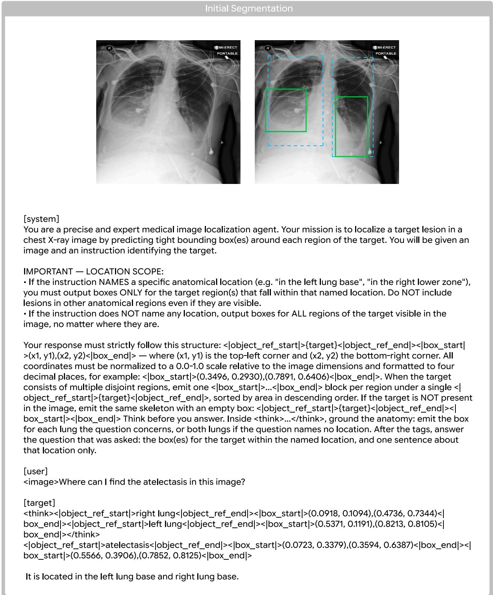  
Figure 4: Example of SFT data for initial segmentation. The image shown at the top is what the <image> placeholder stands for; the box overlay is drawn here for illustration and is not part of the input.

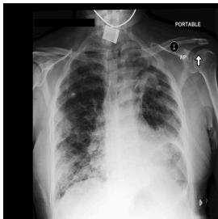

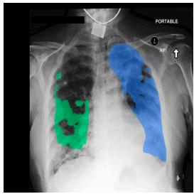

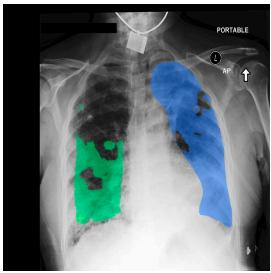

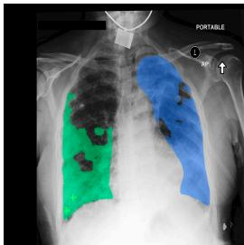

[system]

You are a precise and expert medical image localization agent refining an existing segmentation of a chest Xray.

You are given the original image and an overlay of the current segmentation. OVERLAY COLORS:

• GREEN — the region you are refining. This is the only region you may change.

• BLUE — other lesion regions in the same image. They are being handled separately. Ignore them; never click on them.

IMPORTANT — WHAT TO DO:

• Compare the GREEN region against the lesion you can see in the X-ray.

• If GREEN covers area that is NOT lesion, emit a NEGATIVE click there.

• If the lesion extends beyond GREEN, emit a POSITIVE click on the part that was missed.

• If GREEN already matches the lesion, emit <stop/> and change nothing.

Stay on the GREEN region: click on it or just outside its edge, never across the image.

DO NOT REPEAT YOURSELF:

• Your earlier clicks are drawn on the overlay — a green + where you clicked positive, a red x where you clicked negative.

• Never place the same kind of click at a spot you already used. It was already applied; repeating it changes almost nothing.

• Each turn, look at what your last click DID to the GREEN region, and move to a different part of the boundary that is still wrong.

Coordinates are normalized to [0, 1] as (x, y).

Answer with exactly one action and nothing else.

[user]

<image><image>Outline the edema.

[target]

<click type="positive">(0.2881, 0.8024)</click>

[user] <image>

[target] <click type="positive">(0.2619, 0.8571)</click>

[user] <image>

[target] <stop/>

Figure 5: Example of SFT data for segmentation revision. The images shown at the top are what the <image> placeholders stand for.

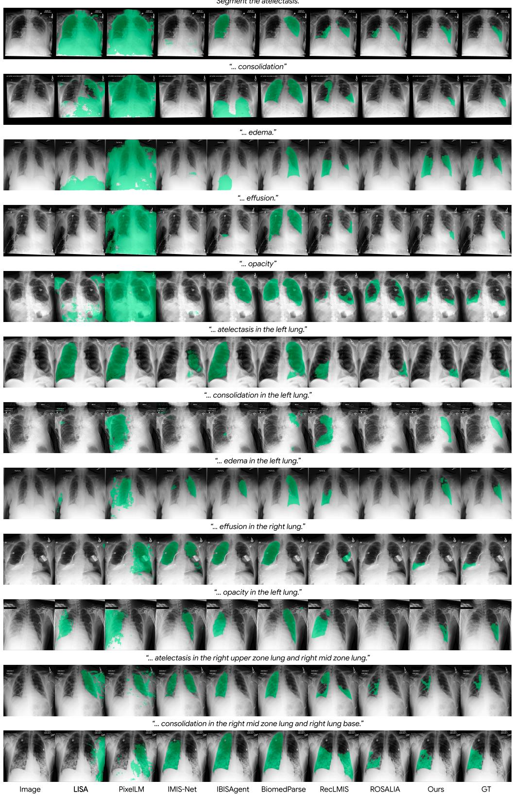  
Figure 6: Additional qualitative comparisons across models. The layout follows Figure 3.

Segment the consolidation in the left lung.

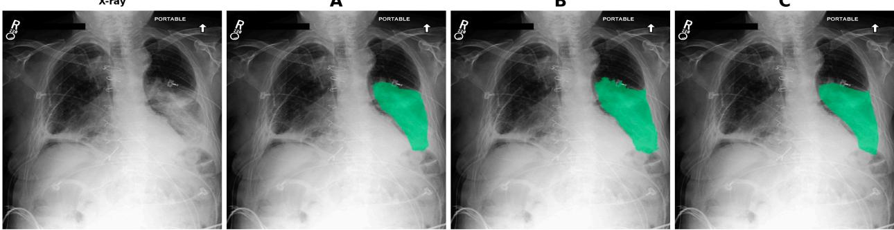

reader\_sheetsxLsx☆

File Edit View Insert Format Data Tools Gemini Help

A1

<table><tr><td rowspan=1 colspan=1></td><td rowspan=1 colspan=1>A</td><td rowspan=1 colspan=1>B</td><td rowspan=1 colspan=4>C</td><td rowspan=1 colspan=1>D</td><td rowspan=1 colspan=1>E</td><td rowspan=1 colspan=1>F</td><td rowspan=1 colspan=1>G</td><td rowspan=1 colspan=1>H</td></tr><tr><td rowspan=1 colspan=1>1</td><td rowspan=1 colspan=1>Seq</td><td rowspan=1 colspan=5>Image                      Question</td><td rowspan=1 colspan=3>Rank A Rank B Rank C</td><td rowspan=1 colspan=1>Check</td><td rowspan=1 colspan=1>Notes</td></tr><tr><td rowspan=1 colspan=1>2</td><td rowspan=1 colspan=1>1 0</td><td rowspan=1 colspan=1>01.png</td><td rowspan=1 colspan=4>Segment the consolidation in the left lung.</td><td rowspan=1 colspan=3>3     1</td><td rowspan=1 colspan=1></td><td rowspan=1 colspan=1></td></tr><tr><td rowspan=1 colspan=1>3</td><td rowspan=1 colspan=1>2 0</td><td rowspan=1 colspan=1>02.png</td><td rowspan=1 colspan=4>Segment the effusion in the right lung base.</td><td rowspan=1 colspan=3>3</td><td rowspan=1 colspan=1></td><td rowspan=1 colspan=1></td></tr><tr><td rowspan=1 colspan=1>4</td><td rowspan=1 colspan=1>3 0</td><td rowspan=1 colspan=1>03.png</td><td rowspan=1 colspan=4>Segment the effusion in the right lung.</td><td rowspan=1 colspan=3>2</td><td rowspan=1 colspan=1></td><td rowspan=1 colspan=1></td></tr><tr><td rowspan=1 colspan=1>5</td><td rowspan=1 colspan=1>4 0</td><td rowspan=1 colspan=1>04.png</td><td rowspan=1 colspan=4>Segment the edema in the left mid zone lung and left lungbase.</td><td rowspan=1 colspan=3>3     1     2</td><td rowspan=1 colspan=1></td><td rowspan=1 colspan=1></td></tr><tr><td rowspan=1 colspan=1>6</td><td rowspan=1 colspan=1>5 0</td><td rowspan=1 colspan=1>05.png</td><td rowspan=1 colspan=4>Segment the opacity.</td><td rowspan=1 colspan=3>2.3     1     3</td><td rowspan=1 colspan=1></td><td rowspan=1 colspan=1></td></tr><tr><td rowspan=1 colspan=1>7</td><td rowspan=1 colspan=1>6 0</td><td rowspan=1 colspan=1>06.png</td><td rowspan=1 colspan=4>Segment the edema.</td><td rowspan=1 colspan=3>1     2</td><td rowspan=1 colspan=1></td><td rowspan=1 colspan=1></td></tr><tr><td rowspan=1 colspan=1>8</td><td rowspan=1 colspan=1>7 0</td><td rowspan=1 colspan=1>07.png</td><td rowspan=1 colspan=4>Segment the pneumonia.</td><td rowspan=1 colspan=3>1    2     3</td><td rowspan=1 colspan=1></td><td rowspan=1 colspan=1></td></tr><tr><td rowspan=2 colspan=1>9</td><td rowspan=1 colspan=1></td><td rowspan=2 colspan=1>8 008.png</td><td rowspan=2 colspan=4>Segment the pneumonia in the right mid zone lung andright lung base.</td><td rowspan=2 colspan=3>3    1     2</td><td rowspan=1 colspan=1></td><td rowspan=1 colspan=1></td></tr><tr><td rowspan=1 colspan=1>8</td><td rowspan=1 colspan=1></td><td rowspan=1 colspan=1></td></tr><tr><td rowspan=2 colspan=1>10</td><td rowspan=1 colspan=1></td><td rowspan=1 colspan=1></td><td rowspan=2 colspan=4>Segment the edema in the right mid zone lung and rightlung base.</td><td rowspan=2 colspan=3>2     1</td><td rowspan=2 colspan=1></td><td rowspan=2 colspan=1></td></tr><tr><td rowspan=1 colspan=1>9</td><td rowspan=1 colspan=1>9 009.png</td></tr><tr><td rowspan=1 colspan=1>11</td><td rowspan=1 colspan=1>10 0</td><td rowspan=1 colspan=1>10.png</td><td rowspan=1 colspan=4>Segment the atelectasis in the right lung</td><td rowspan=1 colspan=3>1     3</td><td rowspan=1 colspan=1></td><td rowspan=1 colspan=1></td></tr><tr><td rowspan=1 colspan=1>12</td><td rowspan=1 colspan=1>11 0</td><td rowspan=1 colspan=1>11.png</td><td rowspan=1 colspan=4>Segment the edema.</td><td rowspan=1 colspan=3>1     2</td><td rowspan=1 colspan=1></td><td rowspan=1 colspan=1></td></tr><tr><td rowspan=1 colspan=1>13</td><td rowspan=1 colspan=1>12 0</td><td rowspan=1 colspan=1>12.png</td><td rowspan=1 colspan=4>Segment the edema in the left lung.</td><td rowspan=1 colspan=3>3     1</td><td rowspan=1 colspan=1></td><td rowspan=1 colspan=1></td></tr><tr><td rowspan=1 colspan=1>14</td><td rowspan=1 colspan=1>13 0</td><td rowspan=1 colspan=1>13.png</td><td rowspan=1 colspan=4>Segment the consolidation.</td><td rowspan=1 colspan=3>1     2</td><td rowspan=1 colspan=1></td><td rowspan=1 colspan=1></td></tr><tr><td rowspan=1 colspan=1>15</td><td rowspan=1 colspan=1>14 0</td><td rowspan=1 colspan=1>14.png</td><td rowspan=1 colspan=4>Segment the atelectasis.</td><td rowspan=1 colspan=3>1     2</td><td rowspan=1 colspan=1></td><td rowspan=1 colspan=1></td></tr><tr><td rowspan=1 colspan=1>16</td><td rowspan=1 colspan=1>15 0</td><td rowspan=1 colspan=1>15.png</td><td rowspan=1 colspan=4>Segment the opacity.</td><td rowspan=1 colspan=3>1</td><td rowspan=1 colspan=1></td><td rowspan=1 colspan=1></td></tr><tr><td rowspan=1 colspan=1>17</td><td rowspan=1 colspan=1>16 0</td><td rowspan=1 colspan=1>16.png</td><td rowspan=1 colspan=4>Segment the consolidation in the left lung.</td><td rowspan=1 colspan=3>1</td><td rowspan=1 colspan=1></td><td rowspan=1 colspan=1></td></tr><tr><td rowspan=1 colspan=1>18</td><td rowspan=1 colspan=1>17 0</td><td rowspan=1 colspan=1>17.png</td><td rowspan=1 colspan=4>Segment the atelectasis in the left lung base.</td><td rowspan=1 colspan=3>1     1     3</td><td rowspan=1 colspan=1></td><td rowspan=1 colspan=1></td></tr><tr><td rowspan=2 colspan=1>19</td><td rowspan=1 colspan=1></td><td rowspan=1 colspan=1></td><td rowspan=2 colspan=4>Segment the opacity in the right mid zone lung and right</td><td rowspan=2 colspan=4>1     3     2</td><td rowspan=1 colspan=1></td></tr><tr><td rowspan=1 colspan=1>18 0</td><td rowspan=1 colspan=1>18.png</td><td rowspan=1 colspan=3></td><td></td></tr><tr><td rowspan=1 colspan=1>20</td><td rowspan=1 colspan=1>19 0</td><td rowspan=1 colspan=1>19.png</td><td rowspan=1 colspan=2>Segment the effusion in the left lung base.</td><td rowspan=1 colspan=2></td><td rowspan=1 colspan=4>3     1     1</td><td rowspan=1 colspan=1></td></tr></table>

Figure 7: Review panel and annotation sheet.