# SoL-Refiner: Speed-of-Light One-Step Refinement for High-Resolution Video

Haozhe Liu\*, Tian Ye\*, Shuchen Xue\*, Yitong Li, Junsong Chen, Haopeng Li Jincheng Yu, Duomin Wang, Ruihua Zhang, Lei Zhu, Song Han, Enze Xie

NVIDIA Equal contribution. Code Project Page

High-resolution video generation is expensive, as its cost grows rapidly with the number of spatiotemporal tokens. A practical alternative first generates a lower-resolution video and then applies a refiner, but conventional multi-step refinement introduces a second sampling bottleneck. We present SoL-Refiner, a one-step video refiner that transforms low-resolution model outputs into 4K videos with a single denoising step. Our three-stage recipe combines highresolution continual training, reinforcement learning (RL) post-training, and a final one-step distillation. We introduce Refiner-Bench, a video refinement benchmark constructed from the outputs of different video generators, and use a shared-input protocol to compare refiners at approximately 2K output resolution. At 2K, the one-step SoL-Refiner outperforms all external refiners on the VBench and UniPercept averages, while at 3840×2176 it improves both metrics over the three-step LTX-2.3 Refiner. With the complete acceleration stack, SoL-Refiner achieves an 8.91× speedup in refinement latency over the same baseline in our 2K latency setting.

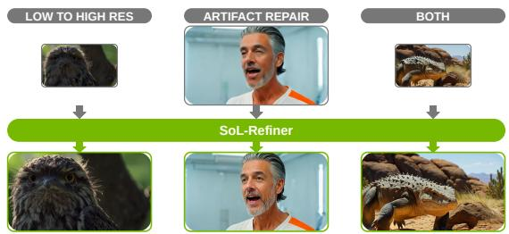

(a) Resolution enhancement, artifact mitigation, and both.  
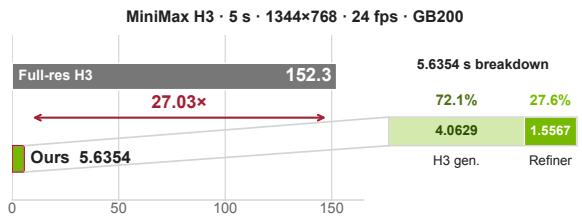

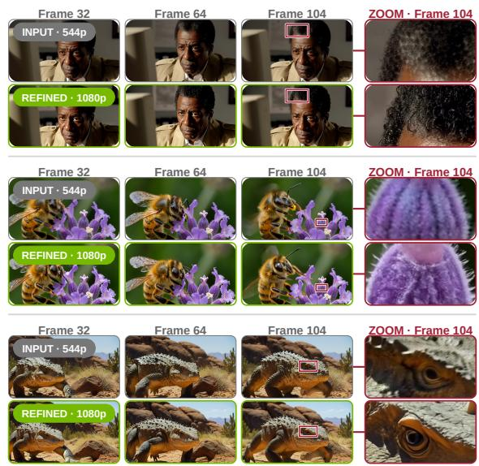  
(b) Full-resolution H3 versus distilled two-stage E2E latency.  
(c) Qualitative visualization with magnified details.  
Figure 1 | Overview of SoL-Refiner. (a) SoL-Refiner improves video resolution and visual quality while repairing artifacts in generated videos. (b) For a 5-second, 1344×768, 24-fps video, the published full-resolution 50-step SGLang MiniMax H3 baseline [1] takes 152.3 s on one GB200, whereas distilled four-step 896×512 MiniMax H3 generation followed by the one-step SoL-Refiner takes 5.64 s using one GPU per stage (27.03×). The two-stage pipeline spends 4.06 s in H3 generation and 1.56 s in Refiner service. (c) Qualitative examples show how SoL-Refiner improves low-resolution videos generated by MiniMax H3.

## 1. Introduction

Video generation has advanced toward higher visual fidelity and output resolution, but at substantial inference cost [2, 3, 4, 5]. Larger models increase the cost of each denoising step [5, 6], while higher resolutions lengthen the spatiotemporal token sequence and raise the cost of every step. Smaller models and lower-resolution sampling reduce this burden [7, 8, 9], but can compromise fine texture and local detail [4].

A two-stage design addresses this trade-off by separating low-resolution content generation from high-resolution detail refinement [10, 11, 12]. The base model establishes motion, composition, and scene content at low resolution, while the refiner enhances textures and local details at the target resolution. The base stage can also use more aggressive acceleration, and the refiner repairs the resulting artifacts. Existing refiners, however, often require multiple targetresolution denoising steps, creating a second sampling bottleneck [10, 13]. Many refiners are also developed for a particular base generator, and their transfer to outputs from other generators is rarely evaluated.

We introduce SoL-Refiner, a one-step video refiner that transforms low-resolution inputs into high-resolution videos with improved local detail (Figures 1a and 1c). It can refine outputs from different base generators without modifying or retraining the base models. Starting from a pretrained LTX-2.3 checkpoint, training follows three stages: high-resolution continual training on paired videos, reinforcement learning (RL) post-training with frame-based reward models, and one-step distillation. We further reduce encoding, decoding, and denoising latency with a tiny autoencoder (TAE) [14] and Sol-Engine [15]. Within the refinement stage alone, the complete acceleration stack achieves an 8.91× speedup over the three-step LTX-2.3 Refiner in our 2K latency setting. Paired with a four-step MiniMax H3 base model, the full two-stage pipeline is 27× faster than direct full-resolution H3 generation (Figure 1b).

Our contributions are threefold:

• We introduce SoL-Refiner, a video refiner that upsamples and refines low-resolution outputs from multiple base generators in a single denoising step.

• We develop a three-stage training recipe that establishes high-resolution refinement through continual training, improves perceptual quality through RL post-training with frame-based rewards, and distills the resulting multistep refiner into a one-step model.

• We introduce Refiner-Bench, a video refinement benchmark constructed from the outputs of different video generators, and use a shared-input protocol to compare refiners. At 2K resolution, SoL-Refiner outperforms the evaluated external refiners on average VBench and UniPercept scores, and improves over the three-step LTX-2.3 Refiner from 720p to 4K.

## 2. Related Work

Generated Video Refinement. SoL-Refiner targets synthesis artifacts in AI-generated videos, including distorted local structures and inconsistent textures. Resolution enlargement is optional: refinement can improve a generated video at its existing resolution or accompany upsampling (Figures 1a and 1c). Prior work also addresses generated video quality. VEnhancer combines spatial and temporal super-resolution with video enhancement [16]. Ultra Flash trains on degradations tailored to generated videos and combines reward-enhanced one-step distillation with cascaded streaming preference optimization [17]. Its design centers on high-resolution streaming generation. Our focus is the refinement of generator outputs, including artifact correction without spatial enlargement, and we assess transfer across base generators.

Cascaded Generation. Cascaded generators use a low-resolution stage for content and motion, followed by highresolution processing. Imagen Video interleaves spatial and temporal super-resolution models [2]; FlashVideo learns a few-step flow-matching detail model [4]; and LUVE combines latent upsampling with high-resolution experts [18]. The released LTX-2.3 and LingBot-Video pipelines use three-step and eight-step refiners, respectively [10, 13, 19]. SoL-Refiner can serve as the refinement stage in such a cascade, using one denoising step to improve the base video. We evaluate released refiners on shared inputs from multiple generators to separate their refinement performance from the choice of upstream generator.

Video Restoration and SR. Diffusion-based restoration provides relevant priors and training methods for refinement. Upscale-A-Video uses recurrent latent propagation for temporally consistent upscaling [20], and SeedVR supports variable video lengths and resolutions through shifted-window attention [21]. One-step methods reduce repeated denoising: DOVE uses staged latent-pixel training [22], UltraVSR uses a degradation-aware schedule and distillation [23], and SeedVR2 uses adversarial post-training [24]. FlashVSR combines one-step distillation with causal sparse attention and a lightweight decoder [25]. We include SeedVR2 as a one-step restoration baseline in our evaluation. Our task concerns defects introduced during video synthesis; recovering spatial resolution is one application of the refiner, rather than its defining objective.

Distillation and Rewards. Our training builds on distribution matching and reward-based post-training. DMD2 combines teacher distribution matching with adversarial supervision [26], SF-V uses adversarial training for singleforward video generation [27], and ImageReward introduces Reward Feedback Learning [28]. In Ultra Flash, perceptual rewards directly supervise the student during one-step distillation [17]. We instead apply frame-based rewards to the multi-step refiner before distilling it through a few-step intermediate student. Distillation combines the teacher’s distribution supervision with implicit distribution alignment [29] and a projected DiT discriminator, drawing on projected adversarial supervision in PiD [30].

## 3. Preliminaries

Latent Video Diffusion. An encoder maps an �-frame video $x \ \in \ \mathbb { R } ^ { F \times H \times W \times 3 } \ \mathrm { t o } \ \mathrm { a }$ clean latent $z _ { 0 }$ with $L$ ≈ $F H W / ( s _ { t } s _ { h } ^ { 2 } )$ spatiotemporal tokens, where $s _ { t }$ and $s _ { h }$ are temporal and spatial compression factors. At timestep �, the noisy latent is

$$
z _ { t } = \alpha _ { t } z _ { 0 } + \sigma _ { t } \epsilon , \qquad \epsilon \sim \mathcal { N } ( 0 , I ) ,\tag{1}
$$

where $\alpha _ { t }$ and $\sigma _ { t }$ control the signal and noise levels. Sampling conditioned on text � requires repeated denoising network function evaluations (NFEs), each processing the full latent sequence. Denoising cost grows with the NFE count, model size, and token count.

Two-Stage Generation. We generate a low-resolution video with a base generator $G _ { \phi }$ and refine it with a high-capacity model $R _ { \theta }$ :

$$
x _ { \mathrm { l o w } } = G _ { \phi } ( c ) , \qquad \hat { x } _ { \mathrm { h i g h } } = R _ { \theta } ( x _ { \mathrm { l o w } } ) .\tag{2}
$$

Only $N _ { R }$ refiner NFEs process target-resolution tokens. We target $N _ { R } = 1$ , recovering fine detail while preserving the source content and motion.

## 4. Method

SoL-Refiner maps a lower-resolution video $x _ { \mathrm { l o w } }$ from a supported base generator to a target-resolution output, recovering local detail while preserving source content and motion. We train the refiner in three stages (Figure 2): continual training learns the refinement mapping, RL post-training optimizes frame-based image-quality and preference signals, and distillation compresses the multi-step model into one denoising step.

## 4.1. Stage I: Continual Training

Paired Training Data. Continual training uses paired conditioning and target videos to learn the refinement mapping. Each example contains a low-fidelity video $x _ { \mathrm { c o n d } }$ and a high-fidelity target $x _ { \mathrm { { t a r g e t } } }$ with aligned content and motion. Our primary source of paired training data is an internal real-video dataset. We construct these pairs through data augmentation, retaining each real video as $x _ { \mathrm { t a r g e t } }$ and applying spatial downsampling followed by upsampling to obtain its low-fidelity counterpart $x _ { \mathrm { c o n d } }$ . We also use a small set of synthetic pairs only for initial warm-up. For these pairs, a supported base generator produces the low-resolution conditioning video $x _ { \mathrm { c o n d } }$ , which the LTX-2.3 Refiner refines into the corresponding high-fidelity target $x _ { \mathrm { t a r g e t } }$ . The video encoder maps each pair to $z _ { \ell } = \mathcal { E } ( x _ { \mathrm { c o n d } } )$ and $z _ { h } = \mathcal { E } ( x _ { \mathrm { t a r g e t } } )$

Truncated-� Flow Matching. Given $\left( z _ { \ell } , z _ { h } \right)$ , we construct a noisy source endpoint from the low-fidelity latent:

$$
z _ { 1 } = ( 1 - \sigma _ { \mathrm { s t a r t } } ) z _ { \ell } + \sigma _ { \mathrm { s t a r t } } \epsilon , \qquad \epsilon \sim \mathcal { N } ( 0 , I ) ,\tag{3}
$$

where $\sigma _ { \mathrm { s t a r t } } = 0 . 9 1$ . We sample $\sigma _ { t }$ from a shifted-logit-normal distribution truncated to $( 0 , \sigma _ { \mathrm { s t a r t } } ]$ and define

$$
\lambda _ { t } = \frac { \sigma _ { t } } { \sigma _ { \mathrm { s t a r t } } } , \qquad z _ { t } = ( 1 - \lambda _ { t } ) z _ { h } + \lambda _ { t } z _ { 1 } .\tag{4}
$$

The resulting states lie on the segment from the clean target $z _ { h }$ to the noisy source $z _ { 1 }$ . Parameterizing this path by $\sigma _ { t }$ gives the target velocity

$$
v ^ { \star } = \frac { \partial z _ { t } } { \partial \sigma _ { t } } = \frac { z _ { 1 } - z _ { h } } { \sigma _ { \mathrm { s t a r t } } } .\tag{5}
$$

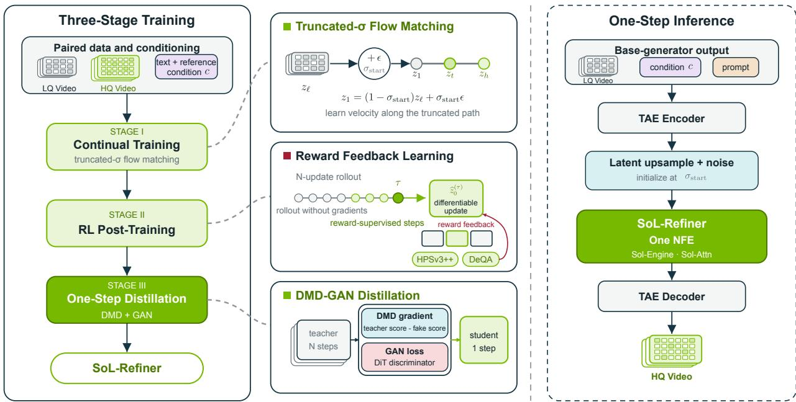  
Figure 2 | Training and inference pipeline of SoL-Refiner. Left, paired LQ/HQ videos and text/reference conditioning support continual training, RL post-training, and DMD-GAN distillation. Middle, the insets detail the truncated-� flow path, reward feedback after a no-gradient rollout, and the DMD gradient and DiT discriminator that compress a multi-step teacher into a one-step student. Right, a tiny autoencoder (TAE) [14] replaces the full video variational autoencoder (VAE) to reduce encoding and decoding cost; latent upsampling and noise initialize the one-step refiner, and Sol Video Inference Engine (Sol-Engine) [15] executes one refiner NFE.

We train the refiner with the flow-matching objective [31, 32]:

$$
\begin{array} { r } { \mathcal { L } _ { \mathrm { r e f } } = \mathbb { E } _ { ( z _ { \ell } , z _ { h } , c ) , \sigma _ { t } , \epsilon } \left[ \left\| v _ { \boldsymbol { \theta } } ( z _ { t } , \sigma _ { t } , c ) - \boldsymbol { v } ^ { \star } \right\| _ { 2 } ^ { 2 } \right] , } \end{array}\tag{6}
$$

where � collects the conditioning signals. The truncated path retains information from $z _ { \ell }$ at its noisiest endpoint, directing the learned vector field toward refinement rather than reconstruction from pure noise

Conditioning and Initialization. The conditioning set � contains text and reference-image features. Reference-image tokens are concatenated with the video sequence but excluded from $\mathcal { L } _ { \mathrm { r e f } }$ , allowing them to guide refinement without becoming reconstruction targets. We initialize the refiner from a pretrained high-capacity video diffusion model. The resulting multi-step refiner initializes Stage II.

## 4.2. Stage II: RL Post-Training

The Stage I flow-matching objective does not directly optimize perceptual quality or human preference. We therefore post-train the multi-step refiner using Reward Feedback Learning (ReFL) [28]. Starting from a noisy low-fidelity latent, we first construct a truncated denoising schedule containing � effective Euler updates. Since clean-latent predictions at early, high-noise states are insufficiently reliable for reward models, we restrict reward supervision to a set of later updates, $\mathcal { T } _ { \mathrm { l a t e } } = \{ k , \ldots , N \}$ , and uniformly sample $\tau \sim \mathcal { U } ( \mathcal { T } _ { \mathrm { l a t e } } )$

The updates preceding � are rolled out using the current policy without retaining gradients. At the selected state $( z _ { \tau } , \sigma _ { \tau } )$ the refiner performs a differentiable conditional forward pass and directly estimates the clean latent by taking an Euler step from $\sigma _ { \tau }$ to zero:

$$
\begin{array} { r } { \widehat { z } _ { 0 } ^ { ( \tau ) } = z _ { \tau } - \sigma _ { \tau } v _ { \theta } ( z _ { \tau } , \sigma _ { \tau } , c ) . } \end{array}\tag{7}
$$

Rewards are evaluated on frames decoded from $\widehat { z } _ { 0 } ^ { ( \tau ) }$ and backpropagated only through the selected update. During training, we partition the decoded video into three equally sized temporal segments and uniformly sample one frame from each of the first, middle, and final thirds. Let $\mathcal { T } _ { 1 } , \mathcal { T } _ { 2 }$ , and $\mathcal { T } _ { 3 }$ denote these temporal segments. The reward frame set

is

$$
\mathcal { F } = \{ f _ { 1 } , f _ { 2 } , f _ { 3 } \} , \qquad f _ { j } \sim \mathcal { U } ( \mathbb { Z } _ { j } ) .\tag{8}
$$

We score the sampled frames using two complementary reward models. HPSv3++ [33] measures prompt-conditioned human preference and perceptual quality, while DeQA [34] evaluates degradation-aware visual quality.

$$
\mathcal { R } = \frac { 1 } { 3 | \mathcal { F } | } \sum _ { i \in \mathcal { F } } \operatorname* { m i n } ( h _ { i } , 1 0 ) + \frac { 2 } { 3 | \mathcal { F } | } \sum _ { i \in \mathcal { F } } \operatorname* { m i n } ( d _ { i } , 4 . 5 ) ,\tag{9}
$$

where the coefficients correspond to normalized HPSv3++ and DeQA weights of 0.2 and 0.4, respectively. The upper clipping limits the influence of outlier scores and reduces reward exploitation.

In our final training configuration, the truncated training schedule contains $N = 1 2$ effective updates and we sample � uniformly from $\{ 6 , \ldots , 1 2 \}$ . Evaluation uses the full 23-update schedule.

## 4.3. Stage III: Distillation and Acceleration

Stage III progressively compresses the Stage II refiner. A few-step stage first learns a three-step student and its fake-score model. The one-step stage then initializes from this student and adds adversarial supervision while retaining the distribution-matching objective.

Few-Step Distillation. We use distribution matching distillation (DMD) [26] with three model roles: a trainable student generator $G _ { \theta }$ , a frozen real-score teacher $T _ { \ast }$ , and a trainable fake-score model $F _ { \phi }$ . We initialize all three models from the Stage II checkpoint and freeze �. We reuse the noisy source $z _ { 1 }$ and interpolation path in Eqs. (3) and (4), with $\sigma _ { \mathrm { s t a r t } } = 0 . 9 1$ for few-step distillation. We sample the generator noise level $\sigma _ { g }$ from {0.91, 0.73, 0.42} and denote the corresponding interpolated state by $z _ { g }$ . The student predicts the clean target latent:

$$
{ \widehat { z } } _ { h } = G _ { \theta } ( z _ { g } , \sigma _ { g } , c ) .\tag{10}
$$

For score evaluation, we replace the clean endpoint $z _ { h }$ in Eq. (4) with $\widehat { z } _ { h }$ and sample $\sigma _ { s } \in [ 0 . 4 2 , \sigma _ { \mathrm { s t a r t } } ]$ . We query � and $F _ { \phi }$ on the resulting shared state $z _ { s }$ . Let $\widehat { z } _ { \mathrm { r e a l } }$ and $\widehat { z } _ { \mathrm { f a k e } }$ denote their clean-latent predictions. We normalize their difference and apply it through a surrogate regression loss:

$$
g _ { \mathrm { D M D } } = \frac { \widehat { z } _ { \mathrm { f a k e } } - \widehat { z } _ { \mathrm { r e a l } } } { \operatorname* { m e a n } \left( \left| \widehat { z } _ { h } - \widehat { z } _ { \mathrm { r e a l } } \right| \right) + \varepsilon _ { g } } , \qquad \mathcal { L } _ { \mathrm { D M D } } = \frac { 1 } { 2 } \left\| \widehat { z } _ { h } - \mathrm { s g } \left( \widehat { z } _ { h } - g _ { \mathrm { D M D } } \right) \right\| _ { 2 } ^ { 2 } ,\tag{11}
$$

where sg stops gradients and ${ \varepsilon } _ { g } > 0$ stabilizes the normalization. The fake-score model learns the student distribution from detached generator samples using the native flow-matching target, while $G _ { \theta }$ receives an update every five fake-score updates. After each generator update, implicit distribution alignment (IDA) [29] moves the fake-score parameters toward the generator,

$$
\phi  \beta \phi + ( 1 - \beta ) \theta , \qquad \beta = 0 . 9 7 .\tag{12}
$$

We maintain an exponential moving average (EMA) of $G _ { \theta }$ and use the resulting three-step checkpoint to initialize one-step distillation.

One-Step Distillation. We initialize the one-step generator from the three-step student and initialize both score models from the Stage II teacher. We set $\sigma _ { \mathrm { s t a r t } } = 0 . 7 3$ and fix $\sigma _ { g } = \sigma _ { \mathrm { s t a r t } }$ , matching the one-step inference schedule [0.73, 0]. For score evaluation, we sample $\sigma _ { s } \sim \mathcal { U } ( \sigma _ { \operatorname* { m i n } } , \sigma _ { \operatorname* { m a x } } )$ , where $0 < \sigma _ { \mathrm { m i n } } < \sigma _ { \mathrm { m a x } } < \sigma _ { \mathrm { s t a r t } }$ . Fake-score training samples noise levels from the same uniform distribution. The generator input is therefore the noisy source $z _ { 1 }$ from Eq. (3), and each training sample requires one generator evaluation:

$$
\widehat { z } _ { h } ^ { ( 1 ) } = G _ { \theta _ { 1 } } \left( z _ { 1 } , \sigma _ { \mathrm { s t a r t } } , c \right) .\tag{13}
$$

The one-step generator retains $\mathcal { L } _ { \mathrm { D M D } }$ and adds a projected DiT discriminator for direct supervision from high-quality latents [26, 30]. We reuse the frozen real-score DiT as the feature extractor and attach a separate lightweight discriminator. It pools token features from blocks {21, 34, 47} with noise- and text-conditioned query heads, then maps the pooled features to one real-or-fake logit. This separation prevents the adversarial objective from changing the fake-score model used by the DMD gradient.

For each adversarial update, we sample a noise level $\sigma _ { a }$ and construct real and fake states along the same low-qualityconditioned bridge. The states share the low-quality endpoint, Gaussian noise, and $\sigma _ { a } .$ , while their clean endpoints are $z _ { h }$ and $\widehat { z } _ { h } ^ { ( 1 ) }$ . We combine $\mathcal { L } _ { \mathrm { D M D } }$ with a non-saturating generator loss and train the discriminator with the corresponding logistic real/fake loss.

We stabilize the discriminator with approximate R1 (aR1) regularization [35]:

$$
\mathcal { L } _ { \mathrm { a R 1 } } = \Vert D ( z _ { a } ) - D ( z _ { a } + \delta ) \Vert _ { 2 } ^ { 2 } ,\tag{14}
$$

where $z _ { a }$ is the real bridge state and � is a small Gaussian perturbation. Without regularization, the discriminator can separate real and fake bridge states too quickly, giving the one-step generator an unstable adversarial signal. Exact R1 requires second-order gradients through the DiT feature extractor, so aR1 approximates local smoothness by matching logits on a real state and its perturbation. We freeze the DiT feature extractor and alternate discriminator, fake-score, and generator updates, applying IDA after each generator update.

## 4.4. Inference Optimization

We accelerate refinement with Sol-Engine [15], which combines kernel fusion with sparse attention based on Sol-Attn [36] to reduce denoising computation. A tiny autoencoder (TAE) [14] replaces the full VAE to reduce video encoding and decoding latency. For multi-step refinement, Sol-Engine additionally reuses cached intermediate results across denoising steps. Figure 6 reports the latency gains for the multi-step refiner and the one-step pipeline.

## 5. Experiments

We evaluate SoL-Refiner on Refiner-Bench, which contains 150 videos. Sec. 5.1 compares it with existing models across metrics and resolutions and evaluates acceleration across base generators. The H3 comparison in Figure 1b compares normal full-resolution MiniMax H3 generation with distilled low-resolution H3 followed by one-step refinement with SoL-Refiner. Sec. 5.2 analyzes the effect of each training stage and the latency gain from each component. More details about Refiner-Bench are in Appendix B.

## 5.1. Main Results

We compare SoL-Refiner with LingBot Stage-2 Refiner [13, 19], LTX-2.3 Refiner [10], LTX-2.0 Refiner [10], and SEEDVR2 [24] on Refiner-Bench. All 150 aligned videos are resized to 1024×576. Outputs are 1920×1088 for LingBot and 2048×1152 for the other refiners. VBench [37] averages subject consistency (SC), background consistency (BC), motion smoothness (MS), dynamic degree (DD), aesthetic quality (AQ), and imaging quality (IQ), while UniPercept [38] averages IAA, IQA, and ISTA. With one refinement step, SoL-Refiner outperforms all evaluated external refiners on VBench AQ, IQ, and AVG and UniPercept AVG, including SEEDVR2 under the same step budget (Tables 1 and 2). Its VBench and UniPercept averages are 0.81048 and 60.4150, respectively. Our 23-step variant achieves higher scores on these metrics.

We initialize SoL-Refiner from LTX-2.3 and therefore compare it with the official three-step LTX-2.3 Refiner as the direct baseline. Figure 3 shows higher VBench and UniPercept scores at 720p, 2K, and 4K. At 4K, SoL-Refiner improves VBench AVG and UniPercept AVG over this baseline by 3.86% and 22.79%, respectively. In the 2K latency setting, the one-step model with TAE and Sol-Engine achieves an 8.91× speedup in refinement latency (panel (b) of Figure 6).

Acceleration across Base Generators. We first run WAN-5B, WAN-1.3B, and Cosmos-Nano [39] at low resolution, then use the one-step SoL-Refiner for upsampling and refinement. This moves multi-step generation to a smaller grid and uses only one denoising step at target resolution, thereby accelerating inference. As shown in Figure 4, the pipeline reduces latency by 54.7%, 71.1%, and 64.4%, respectively, while improving mean VBench and UniPercept over direct high-resolution generation. Exact values are reported in Appendix C.

## 5.2. Ablation Studies

Training Recipe. The training-recipe ablation evaluates continual training, RL post-training, and one-step DMD-GAN distillation. As shown in Table 3, RL post-training gives the highest VBench and UniPercept averages. After distillation, the one-step model remains above the continual-training baseline on both averages.

Table 1 | VBench results on Refiner-Bench under a shared-input protocol. All methods receive the same 1024×576 resized inputs. Resolution denotes the evaluated video resolution. SC, BC, MS, DD, AQ, and IQ denote subject consistency, background consistency, motion smoothness, dynamic degree, aesthetic quality, and imaging quality. Δ is the AVG difference from the resized input. Best results are in bold; second-best results are underlined.
<table><tr><td rowspan="2">Method</td><td rowspan="2">Eval. Res.</td><td rowspan="2"># Steps</td><td colspan="7">VBench↑</td><td rowspan="2">∆↑</td></tr><tr><td>SC</td><td>BC</td><td>MS</td><td>DD</td><td>AQ</td><td>IQ</td><td>AVG</td></tr><tr><td>Resized Input</td><td> $1 0 2 4 \times 5 7 6$ </td><td>一</td><td>0.91805</td><td>0.95261</td><td>0.98354</td><td>0.70000</td><td>0.60621</td><td>0.63158</td><td>0.79866</td><td>0.00000</td></tr><tr><td>LingBot Stage-2 Refiner</td><td> $1 9 2 0 \times 1 0 8 8$ </td><td>8</td><td>0.91715</td><td>0.95354</td><td>0.98398</td><td>0.74000</td><td>0.57762</td><td>0.63792</td><td>0.80170</td><td>0.00304</td></tr><tr><td>LTX-2.3 Refiner</td><td> $2 0 4 8 \times 1 1 5 2$ </td><td>3</td><td>0.93004</td><td>0.95354</td><td>0.98873</td><td>0.70000</td><td>0.59541</td><td>0.65553</td><td>0.80388</td><td>0.00522</td></tr><tr><td>LTX-2.0 Refiner</td><td> $2 0 4 8 \times 1 1 5 2$ </td><td>3</td><td>0.93036</td><td>0.95909</td><td>0.98656</td><td>0.72000</td><td>0.60679</td><td>0.64497</td><td>0.80796</td><td>0.00930</td></tr><tr><td>SEEDVR2</td><td> $2 0 4 8 \times 1 1 5 2$ </td><td>1</td><td>0.91804</td><td>0.94783</td><td>0.97723</td><td>0.71333</td><td>0.60129</td><td>0.66337</td><td>0.80351</td><td>0.00485</td></tr><tr><td>SoL-Refiner (Multi-Step)</td><td>2048×1152</td><td>23</td><td>0.92988</td><td>0.94935</td><td>0.98027</td><td>0.72000</td><td>0.62344</td><td>0.69851</td><td>0.81691</td><td>0.01825</td></tr><tr><td>SoL-Refiner (One-Step)</td><td>2048×1152</td><td>1</td><td>0.92191</td><td>0.94591</td><td>0.98054</td><td>0.71333</td><td>0.60921</td><td>0.69196</td><td>0.81048</td><td>0.01182</td></tr></table>

Table 2 | UniPercept results on Refiner-Bench under a shared-input protocol. All methods receive the same $1 0 2 4 \times 5 7 6$ resized inputs. Resolution denotes the evaluated video resolution. Best results are in bold; second-best results are underlined.
<table><tr><td rowspan="2">Method</td><td rowspan="2">Eval. Res.</td><td rowspan="2"># Steps</td><td colspan="4">UniPercept↑</td></tr><tr><td>IAA</td><td>IQA</td><td>ISTA</td><td>AVG</td></tr><tr><td>Resized Input</td><td> $1 0 2 4 \times 5 7 6$ </td><td>1</td><td>59.3540</td><td>60.8943</td><td>42.0890</td><td>54.1124</td></tr><tr><td>LingBot Stage-2 Refiner</td><td> $1 9 2 0 \times 1 0 8 8$ </td><td>8</td><td>58.9189</td><td>58.0827</td><td>42.1403</td><td>53.0473</td></tr><tr><td>LTX-2.3 Refiner</td><td> $2 0 4 8 \times 1 1 5 2$ </td><td>3</td><td>61.2239</td><td>61.9438</td><td>45.2052</td><td>56.1243</td></tr><tr><td>LTX-2.0 Refiner</td><td> $2 0 4 8 \times 1 1 5 2$ </td><td>3</td><td>60.5074</td><td>60.4902</td><td>42.3823</td><td>54.4600</td></tr><tr><td>SEEDVR2</td><td> $2 0 4 8 \times 1 1 5 2$ </td><td>1</td><td>62.5692</td><td>64.4827</td><td>43.4057</td><td>56.8192</td></tr><tr><td>SoL-Refiner (Multi-Step)</td><td> $2 0 4 8 \times 1 1 5 2$ </td><td>23</td><td>66.7284</td><td>72.3977</td><td>44.8249</td><td>61.3170</td></tr><tr><td>SoL-Refiner (One-Step)</td><td>2048×1152</td><td>1</td><td>65.7322</td><td>70.6682</td><td>44.8445</td><td>60.4150</td></tr></table>

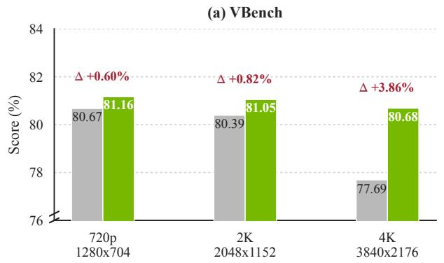

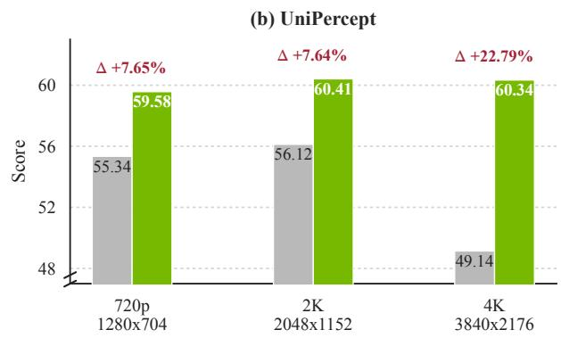  
Figure 3 | Performance on Refiner-Bench across output resolutions. We compare the three-step LTX-2.3 Refiner with the one-step SoL-Refiner using VBench AVG (left) and UniPercept AVG (right). Red Δ labels report the relative improvement over LTX-2.3 Refiner. VBench scores are shown on a 0–100 scale. Both vertical axes use truncated ranges for readability. Higher is better.

Table 3 | Ablation of the three-stage training recipe on Refiner-Bench. We report VBench and UniPercept scores after each stage. Best results are in bold; second-best results are underlined.
<table><tr><td rowspan="2">Training Stage</td><td colspan="7">VBench↑</td><td colspan="4">UniPercept↑</td></tr><tr><td>SC</td><td>BC</td><td>MS</td><td>DD</td><td>AQ</td><td>IQ</td><td>AVG</td><td>IAA</td><td>IQA</td><td>ISTA</td><td>AVG</td></tr><tr><td>Stage 1: Continual (Multi-Step)</td><td>0.92756</td><td>0.95361</td><td>0.98201</td><td>0.72000</td><td>0.60526</td><td>0.66484</td><td>0.80888</td><td>63.0807</td><td>64.5693</td><td>42.3359</td><td>56.6620</td></tr><tr><td>Stage 2: Post-Training (Multi-Step)</td><td>0.92988</td><td>0.94935</td><td>0.98027</td><td>0.72000</td><td>0.62344</td><td>0.69851</td><td>0.81691</td><td>66.7284</td><td>72.3977</td><td>44.8249</td><td>61.3170</td></tr><tr><td>Stage 3: DMD-GAN (One-Step)</td><td>0.92191</td><td>0.94591</td><td>0.98054</td><td>0.71333</td><td>0.60921</td><td>0.69196</td><td>0.81048</td><td>65.7322</td><td>70.6682</td><td>44.8445</td><td>60.4150</td></tr></table>

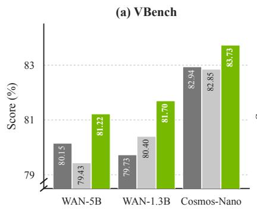

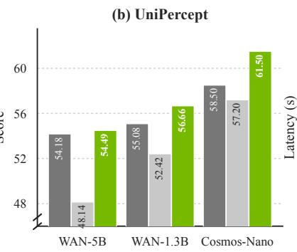  
Direct high-res Stage 1 Stage 2: SoL-Refiner

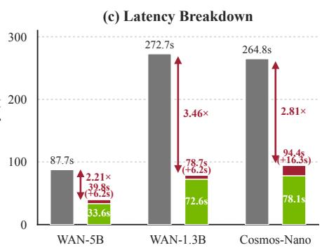  
Figure 4 | Quality and acceleration across base generators. (a,b) VBench and UniPercept averages for direct highresolution generation, low-resolution generation, and low-resolution generation followed by SoL-Refiner. (c) End-to-end latency on one H100 GPU, split into base generation and refinement; speedups are relative to direct high-resolution generation. WAN uses 81 frames, 50 generation steps, and 832×480 → 1280×704 refinement; WAN-1.3B’s direct baseline is 1280×720. Cosmos-Nano uses 189 frames, 35 generation steps, and 480p→1280×720 refinement.

Reward Learning. We ablate the regularization recipe and the use of multiple reward models. Table 4 shows that removing either design lowers the VBench average. In the selected video in Figure 5, RL post-training produces cleaner facial contours and details across four aligned frames. Appendix D provides two additional cases.

Table 4 | Reward-learning ablation on Refiner-Bench. We report VBench scores. The “w/o multiple reward models” variant uses only HPSv3++. Best results are in bold; second-best results are underlined.
<table><tr><td>Configuration</td><td colspan="7">VBench↑</td></tr><tr><td></td><td>SC</td><td>BC</td><td>MS</td><td>DD</td><td>AQ</td><td>IQ</td><td>AVG</td></tr><tr><td>w/o regularization recipe</td><td>0.94438</td><td>0.95297</td><td>0.98074</td><td>0.62667</td><td>0.64757</td><td>0.71044</td><td>0.81046</td></tr><tr><td>w/o multiple reward models</td><td>0.93553</td><td>0.94765</td><td>0.98443</td><td>0.70000</td><td>0.62616</td><td>0.69111</td><td>0.81415</td></tr><tr><td>Ours</td><td>0.92988</td><td>0.94935</td><td>0.98027</td><td>0.72000</td><td>0.62344</td><td>0.69851</td><td>0.81691</td></tr></table>

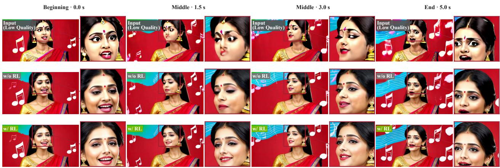  
Figure 5 | Qualitative effect of RL post-training. The rows show the low-quality input, the refiner without RL post-training, and the same refiner with RL post-training. Four aligned frames span 0.0 to 5.0 seconds. Each complete frame is followed by a magnified crop from the red box. In this selected example, RL post-training produces cleaner facial contours and sharper eyes, mouth, and jewelry across time.

Distillation Ablation. DMD-R jointly optimizes the RL and DMD objectives, whereas RL then DMD applies RL post-training before DMD. We evaluate both strategies in Table 5. RL then DMD gives the higher VBench average. We therefore use RL then DMD in all other experiments.

Table 5 | Distillation ablation on Refiner-Bench. We compare DMD-R with RL followed by DMD using VBench. Best results are in bold; second-best results are underlined.
<table><tr><td rowspan="2">Configuration</td><td colspan="7">VBench↑</td></tr><tr><td>SC</td><td>BC</td><td>MS</td><td>DD</td><td>AQ</td><td>IQ</td><td>AVG</td></tr><tr><td>DMD-R</td><td>0.91385</td><td>0.93886</td><td>0.97779</td><td>0.66000</td><td>0.61929</td><td>0.69608</td><td>0.80098</td></tr><tr><td>RL then DMD</td><td>0.92191</td><td>0.94591</td><td>0.98054</td><td>0.71333</td><td>0.60921</td><td>0.69196</td><td>0.81048</td></tr></table>

Latency Analysis. We measure refinement latency on one H100 GPU and separate the contribution of each inference component. Panel (a) of Figure 6 compares the multi-step base model with Sol-Engine across four resolution and frame-count settings, where Sol-Engine gives 2.38×–3.26× speedups. Panel (b) starts from the three-step LTX-2.3 Refiner and adds one-step distillation, TAE, and Sol-Engine in sequence. These changes give adjacent speedups of 1.82×, 2.37×, and 2.06× and reduce refinement latency from 57.461 to 6.447 seconds. The final configuration is 8.91× faster than the baseline, showing that one-step distillation and system acceleration provide complementary gains. Appendix Table 6 reports the exact latency and VBench values.

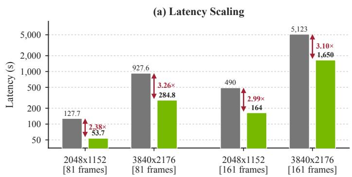

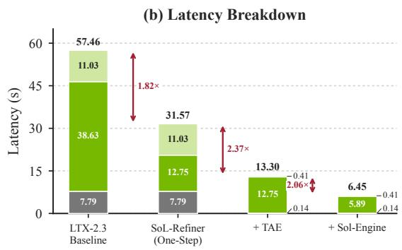  
Figure 6 | Latency analysis. Panel (a) compares Base (Multi-Step) with the same pipeline using Sol-Engine on one H100 GPU. The four groups report 2048×1152 and 3840×2176 outputs with 81 or 161 frames at 16 fps. Panel (b) reports component latency for 2048×1152 outputs with 241 frames at 24 fps. Each stacked bar shows VAE encoding, denoising, and VAE decoding. The first bar is the three-step LTX-2.3 Refiner baseline. The second bar is the one-step SoL-Refiner, and the final two bars add TAE and Sol-Engine. Red arrows report the speedup between adjacent configurations. The final configuration reduces refinement latency from 57.461 to 6.447 seconds, an 8.91× speedup over the baseline. Lower latency is better.

DGX Spark Deployment. On a single NVIDIA DGX Spark (GB10), we evaluate SoL-H3, a two-stage pipeline following H3 Super Acceleration [1], with H3 generation at 384p (Stage 1) and refinement to 768p (Stage 2). Using SoL-Refiner in Stage 2, with Stage 1 unchanged, reduces end-to-end latency from 56.17 to 39.67 seconds (29.4%), a 9.43× speedup over direct four-step H3 generation at 768p (Figure 7).

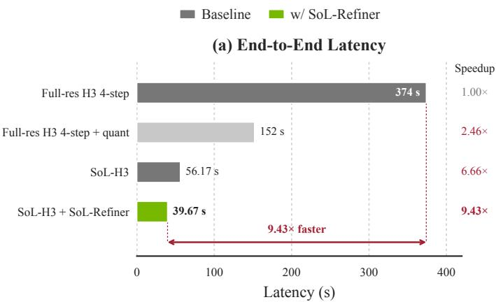

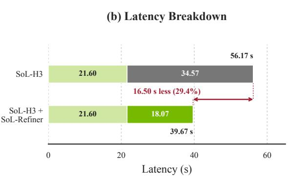  
Figure 7 | H3 acceleration on a single NVIDIA DGX Spark (GB10). (a) End-to-end latency for full-resolution four-step H3, its quantized variant, SoL-H3, and SoL-H3 with SoL-Refiner. Full-res denotes direct 768p generation; both SoL-H3 configurations generate at 384p and refine to 768p. Speedups use the 374-second full-resolution four-step baseline. (b) Stage-wise latency for the two SoL-H3 configurations. Stage 1 takes 21.60 seconds in both; Stage 2 decreases from 34.57 to 18.07 seconds with SoL-Refiner. The red annotation in panel (b) reports the 16.50-second reduction in total latency (29.4% relative to SoL-H3). The panels use separate linear scales.

## 6. Conclusion

SoL-Refiner makes high-resolution video generation more efficient by moving most denoising computation to a lower-resolution base generator and reserving one target-resolution step for refinement. Continual training learns the lowto-high-quality mapping, reward feedback learning improves perceptual quality, and staged DMD-GAN distillation with a projected DiT discriminator compresses refinement to one step. On Refiner-Bench, the one-step model outperforms external refiners in average VBench and UniPercept scores. In our 2K latency setting, the one-step refiner with TAE and Sol-Engine reduces refinement latency from 57.461 to 6.447 seconds, an 8.91× speedup over the three-step LTX-2.3 Refiner.

## References

[1] Yitong Li, Junsong Chen, Haozhe Liu, Haopeng Li, Yuze Ma, Yongchang Liu, Song Han, and Enze Xie. MiniMax H3 Super Acceleration: Fast Draft Generation and High-Resolution Refinement, Powered by Sol Engine. NVIDIA SANA Team technical blog, August 2026. URL https://nvlabs.github.io/Sana/Sol-Engine/H3-Super-Acceleration/. Published 2026-08-17; accessed 2026-08-25.

[2] Jonathan Ho, William Chan, Chitwan Saharia, Jay Whang, Ruiqi Gao, Alexey Gritsenko, Diederik P. Kingma, Ben Poole, Mohammad Norouzi, David J. Fleet, and Tim Salimans. Imagen video: High definition video generation with diffusion models, 2022. URL https://arxiv.org/abs/2210.02303.

[3] Yu Gao, Haoyuan Guo, Tuyen Hoang, Weilin Huang, Lu Jiang, Fangyuan Kong, Huixia Li, Jiashi Li, Liang Li, Xiaojie Li, et al. Seedance 1.0: Exploring the boundaries of video generation models. arXiv preprint arXiv:2506.09113, 2025.

[4] Shilong Zhang, Wenbo Li, Shoufa Chen, Chongjian Ge, Peize Sun, Yifu Zhang, Yi Jiang, Zehuan Yuan, Bingyue Peng, and Ping Luo. Flashvideo: Flowing fidelity to detail for efficient high-resolution video generation. Proceedings of the AAAI Conference on Artificial Intelligence, 40(15):12735–12743, 2026. doi: 10.1609/aaai.v40i15.38270. URL https: //doi.org/10.1609/aaai.v40i15.38270.

[5] Weijie Kong, Qi Tian, Zijian Zhang, Rox Min, Zuozhuo Dai, Jin Zhou, Jiangfeng Xiong, Xin Li, Bo Wu, Jianwei Zhang, et al. Hunyuanvideo: A systematic framework for large video generative models. arXiv preprint arXiv:2412.03603, 2024.

[6] MiniMax. MiniMax H3. Official model repository and model card, July 2026. URL https://github.com/ MiniMax-AI/MiniMax-H3. Accessed 2026-08-20.

[7] Junsong Chen, Yuyang Zhao, Jincheng Yu, Ruihang Chu, Junyu Chen, Shuai Yang, Xianbang Wang, Yicheng Pan, Daquan Zhou, Huan Ling, Haozhe Liu, Hongwei Yi, Hao Zhang, Muyang Li, Yukang Chen, Han Cai, Sanja Fidler, Ping Luo, Song Han, and Enze Xie. SANA-video: Efficient video generation with block linear diffusion transformer. In International Conference on Learning Representations, 2026. URL https://openreview.net/forum?id=mzAchylAtf.

[8] Team Wan, Ang Wang, Baole Ai, Bin Wen, Chaojie Mao, Chen-Wei Xie, Di Chen, Feiwu Yu, Haiming Zhao, Jianxiao Yang, Jianyuan Zeng, Jiayu Wang, Jingfeng Zhang, Jingren Zhou, Jinkai Wang, Jixuan Chen, Kai Zhu, Kang Zhao, Keyu Yan, Lianghua Huang, Mengyang Feng, Ningyi Zhang, Pandeng Li, Pingyu Wu, Ruihang Chu, Ruili Feng, Shiwei Zhang, Siyang Sun, Tao Fang, Tianxing Wang, Tianyi Gui, Tingyu Weng, Tong Shen, Wei Lin, Wei Wang, Wei Wang, Wenmeng Zhou, Wente Wang, Wenting Shen, Wenyuan Yu, Xianzhong Shi, Xiaoming Huang, Xin Xu, Yan Kou, Yangyu Lv, Yifei Li, Yijing Liu, Yiming Wang, Yingya Zhang, Yitong Huang, Yong Li, You Wu, Yu Liu, Yulin Pan, Yun Zheng, Yuntao Hong, Yupeng Shi, Yutong Feng, Zeyinzi Jiang, Zhen Han, Zhi-Fan Wu, and Ziyu Liu. Wan: Open and advanced large-scale video generative models, 2025. URL https://arxiv.org/abs/2503.20314.

[9] Mohsen Ghafoorian, Denis Korzhenkov, Adil Karjauv, Ioannis Lelekas, Noor Fathima, Spyridon Stasis, Hanno Ackermann, Boris van Breugel, Markus Nagel, Fatih Porikli, et al. Mobilewan: Closing the quality gap for mobile video diffusion. arXiv preprint arXiv:2607.06173, 2026.

[10] Yoav HaCohen, Benny Brazowski, Nisan Chiprut, Yaki Bitterman, Andrew Kvochko, Avishai Berkowitz, Daniel Shalem, Daphna Lifschitz, Dudu Moshe, Eitan Porat, Eitan Richardson, Guy Shiran, Itay Chachy, Jonathan Chetboun, Michael Finkelson, Michael Kupchick, Nir Zabari, Nitzan Guetta, Noa Kotler, Ofir Bibi, Ori Gordon, Poriya Panet, Roi Benita, Shahar Armon, Victor Kulikov, Yaron Inger, Yonatan Shiftan, Zeev Melumian, and Zeev Farbman. LTX-2: Efficient joint audio-visual foundation model, 2026. URL https://arxiv.org/abs/2601.03233.

[11] Haozhe Liu, Shikun Liu, Zijian Zhou, Mengmeng Xu, Yanping Xie, Xiao Han, Juan C Pérez, Ding Liu, Kumara Kahatapitiya, Menglin Jia, et al. Mardini: Masked autoregressive diffusion for video generation at scale. arXiv preprint arXiv:2410.20280, 2024.

[12] Haoyi Zhu, Haozhe Liu, Yuyang Zhao, Tian Ye, Junsong Chen, Jincheng Yu, Tong He, Song Han, and Enze Xie. Sana-wm: Efficient minute-scale world modeling with hybrid linear diffusion transformer. arXiv preprint arXiv:2605.15178, 2026.

[13] Shuailei Ma, Jiaqi Liao, Xinyang Wang, Jingjing Wang, Chaoran Feng, Zijing Hu, Chong Bao, Zichen Xi, Yuqi Gan, Weisen Wang, Yanhong Zeng, Qin Zhao, Zifan Shi, Wei Wu, Hao Ouyang, Qiuyu Wang, Shangzhan Zhang, Jiahao Shao, Yipengjing Sun, Liangxiao Hu, Lunke Pan, Nan Xue, Kecheng Zheng, Yinghao Xu, Xing Zhu, Yujun Shen, and Ka Leong Cheng. Scaling mixture-of-experts video pretraining for embodied intelligence, 2026. URL https://arxiv.org/abs/2607.07675.

[14] Ollin Boer Bohan. TAEHV: Tiny autoencoder for hunyuan video. GitHub repository, 2025. URL https://github.com/ madebyollin/taehv. Accessed 2026-09-03.

[15] Yitong Li, Junsong Chen, Haopeng Li, Haozhe Liu, Jincheng Yu, Ligeng Zhu, Ping Luo, Song Han, and Enze Xie. Sol video inference engine: Agent-native full-stack acceleration framework for efficient video generation, 2026. URL https: //arxiv.org/abs/2606.23743.

[16] Jingwen He, Tianfan Xue, Dongyang Liu, Xinqi Lin, Peng Gao, Dahua Lin, Yu Qiao, Wanli Ouyang, and Ziwei Liu. VEnhancer: Generative space-time enhancement for video generation, 2024. URL https://arxiv.org/abs/2407.07667.

[17] Luxury, Jie Huang, Zihao Fan, Xiaoxiao Ma, Jun-hao Zhuang, Yuming Li, Zeyue Xue, Siming Fu, Haoran Li, Mingchen Zhong, Guohui Zhang, Shichen Ma, Yijun Liu, Jiaqi Shi, Yanwen Ma, Yaofeng Su, Haoyu Wang, Yaowei Li, Songchun Zhang, Weiyang Jin, Yuxuan Bian, Shiyi Zhang, Haojun Xu, Shuai Lu, Xin Han, Wei Tang, Haoyang Huang, and Nan Duan. Ultra flash: Scaling real-time streaming video generation to high resolutions, 2026. URL https://arxiv.org/abs/2606.09150.

[18] Chen Zhao, Jiawei Chen, Hongyu Li, Zhuoliang Kang, Shilin Lu, Xiaoming Wei, Kai Zhang, Jian Yang, and Ying Tai. LUVE: Latent-cascaded ultra-high-resolution video generation with dual frequency experts, 2026. URL https://arxiv.org/ abs/2602.11564.

[19] Robbyant Team. LingBot-Video: Official inference repository. GitHub repository, 2026. URL https://github.com/ robbyant/lingbot-video. Accessed 2026-08-11.

[20] Shangchen Zhou, Peiqing Yang, Jianyi Wang, Yihang Luo, and Chen Change Loy. Upscale-a-video: Temporal-consistent diffusion model for real-world video super-resolution, 2023. URL https://arxiv.org/abs/2312.06640.

[21] Jianyi Wang, Zhijie Lin, Meng Wei, Yang Zhao, Ceyuan Yang, Fei Xiao, Chen Change Loy, and Lu Jiang. SeedVR: Seeding infinity in diffusion transformer towards generic video restoration, 2025. URL https://arxiv.org/abs/2501.01320.

[22] Zheng Chen, Zichen Zou, Kewei Zhang, Xiongfei Su, Xin Yuan, Yong Guo, and Yulun Zhang. DOVE: Efficient one-step diffusion model for real-world video super-resolution, 2025. URL https://arxiv.org/abs/2505.16239.

[23] Yong Liu, Jinshan Pan, Yinchuan Li, Qingji Dong, Chao Zhu, Yu Guo, and Fei Wang. UltraVSR: Achieving ultra-realistic video super-resolution with efficient one-step diffusion space, 2025. URL https://arxiv.org/abs/2505.19958.

[24] Jianyi Wang, Shanchuan Lin, Zhijie Lin, Yuxi Ren, Meng Wei, Zongsheng Yue, Shangchen Zhou, Hao Chen, Yang Zhao, Ceyuan Yang, Xuefeng Xiao, Chen Change Loy, and Lu Jiang. SeedVR2: One-step video restoration via diffusion adversarial post-training, 2025. URL https://arxiv.org/abs/2506.05301.

[25] Junhao Zhuang, Shi Guo, Xin Cai, Xiaohui Li, Yihao Liu, Chun Yuan, and Tianfan Xue. FlashVSR: Towards real-time diffusion-based streaming video super-resolution, 2025. URL https://arxiv.org/abs/2510.12747.

[26] Tianwei Yin, Michaël Gharbi, Taesung Park, Richard Zhang, Eli Shechtman, Fredo Durand, and William T. Freeman. Improved distribution matching distillation for fast image synthesis, 2024. URL https://arxiv.org/abs/2405.14867.

[27] Zhixing Zhang, Yanyu Li, Yushu Wu, Yanwu Xu, Anil Kag, Ivan Skorokhodov, Willi Menapace, Aliaksandr Siarohin, Junli Cao, Dimitris Metaxas, Sergey Tulyakov, and Jian Ren. SF-V: Single forward video generation model, 2024. URL https://arxiv.org/abs/2406.04324.

[28] Jiazheng Xu, Xiao Liu, Yuchen Wu, Yuxuan Tong, Qinkai Li, Ming Ding, Jie Tang, and Yuxiao Dong. Imagereward: Learning and evaluating human preferences for text-to-image generation. Advances in Neural Information Processing Systems, 36: 15903–15935, 2023.

[29] Xingtong Ge, Xin Zhang, Tongda Xu, Yi Zhang, Xinjie Zhang, Yan Wang, and Jun Zhang. SenseFlow: Scaling distribution matching for flow-based text-to-image distillation, 2025. URL https://arxiv.org/abs/2506.00523.

[30] Yifan Lu, Qi Wu, Jay Zhangjie Wu, Zian Wang, Huan Ling, Sanja Fidler, and Xuanchi Ren. PiD: Fast and high-resolution latent decoding with pixel diffusion, 2026. URL https://arxiv.org/abs/2605.23902.

[31] Yaron Lipman, Ricky TQ Chen, Heli Ben-Hamu, Maximilian Nickel, and Matt Le. Flow matching for generative modeling. arXiv preprint arXiv:2210.02747, 2022.

[32] Xingchao Liu, Chengyue Gong, and Qiang Liu. Flow straight and fast: Learning to generate and transfer data with rectified flow. arXiv preprint arXiv:2209.03003, 2022.

[33] Yijun Liu, Jie Huang, Zeyue Xue, Yuming Li, Ruizhe He, Haoran Li, Shijia Ge, and Siming Fu. Hpsv3++: Scaling reward models across the full spectrum of diffusion model capabilities. arXiv preprint arXiv:2606.14657, 2026.

[34] Zhiyuan You, Xin Cai, Jinjin Gu, Tianfan Xue, and Chao Dong. Teaching large language models to regress accurate image quality scores using score distribution. In 2025 IEEE/CVF Conference on Computer Vision and Pattern Recognition (CVPR), pages 14483–14494. IEEE, 2025.

[35] Shanchuan Lin, Xin Xia, Yuxi Ren, Ceyuan Yang, Xuefeng Xiao, and Lu Jiang. Diffusion adversarial post-training for one-step video generation, 2025. URL https://arxiv.org/abs/2501.08316.

[36] Haopeng Li, Yitong Li, Junsong Chen, Tian Ye, Haozhe Liu, Jincheng Yu, Duomin Wang, Ruihua Zhang, Zeke Xie, Enze Xie, and Song Han. Sol-attn: Accelerating video generation inference via on-the-fly attention sparsification, 2026. URL https://arxiv.org/abs/2607.24027.

[37] Ziqi Huang, Yinan He, Jiashuo Yu, Fan Zhang, Chenyang Si, Yuming Jiang, Yuanhan Zhang, Tianxing Wu, Qingyang Jin, Nattapol Chanpaisit, et al. VBench: Comprehensive benchmark suite for video generative models. In 2024 IEEE/CVF Conference on Computer Vision and Pattern Recognition (CVPR), pages 21807–21818. IEEE, 2024.

[38] Shuo Cao, Jiayang Li, Xiaohui Li, Yuandong Pu, Kaiwen Zhu, Yuanting Gao, Siqi Luo, Yi Xin, Qi Qin, Yu Zhou, et al. UniPercept: Towards unified perceptual-level image understanding across aesthetics, quality, structure, and texture. arXiv preprint arXiv:2512.21675, 2025.

[39] NVIDIA Cosmos Team. Cosmos 3: Omnimodal world models for physical ai. arXiv preprint arXiv:2606.02800, 2026.

## A. Latency and Quality Comparison

Table 6 reports the exact latency and VBench values summarized in Figure 6.

## B. Refiner-Bench Composition and Evaluation Details

Refiner-Bench contains 50 videos from each of WAN 2.1 1.3B [8], SANA-Video 2B [7], and LTX-2 Stage 1 [10]. WAN and SANA-Video provide out-of-distribution inputs, while LTX-2 Stage 1 provides in-distribution inputs. The benchmark spans 12 content groups, three motion levels, and six camera-motion types. Each sample has one contentgroup, motion-level, and camera-motion label, and every content group includes samples from all three generators.

Table 6 | Latency and quality comparison. Measurements use one H100 GPU. VBench metrics are evaluated on the corresponding 81-frame videos. Latency is reported in seconds per sample.
<table><tr><td colspan="2">Resolution Configuration</td><td rowspan="2">GPU</td><td colspan="7">VBench↑</td><td colspan="2">Latency (s)↓</td></tr><tr><td></td><td></td><td>SC</td><td>BC</td><td>MS</td><td>DD</td><td>AQ</td><td>IQ</td><td>AVG</td><td>81 frames</td><td>161 frames</td></tr><tr><td rowspan="2">2K</td><td>Base (Multi-Step) H100</td><td></td><td>0.9082</td><td>0.9364</td><td>0.9813</td><td>0.7067</td><td>0.5618</td><td>0.6713</td><td>0.7943</td><td>127.7</td><td>490</td></tr><tr><td>w/ Sol-Engine</td><td>H100</td><td>0.9092</td><td>0.9365</td><td>0.9813</td><td>0.7200</td><td>0.5550</td><td>0.6601</td><td>0.7937</td><td>53.7</td><td>164</td></tr><tr><td rowspan="2">4K</td><td>Base (Multi-Step) H100</td><td></td><td>0.9037</td><td>0.9367</td><td>0.9806</td><td>0.7267</td><td>0.5547</td><td>0.6719</td><td>0.7957</td><td>927.6</td><td>5123</td></tr><tr><td>w/ Sol-Engine</td><td>H100</td><td>0.9043</td><td>0.9386</td><td>0.9817</td><td>0.7267</td><td>0.5511</td><td>0.6591</td><td>0.7936</td><td>284.8</td><td>1650</td></tr></table>

Source Preparation. The native generator outputs are cropped to valid aligned sizes, then resized to a common 1024×576 input for the main 2K benchmark. Table 7 records each stage. The resolution study instead uses a half-scale input for each target, including 1920×1088 for the 4K setting.

Table 7 | Source preparation for the main 2K Refiner-Bench setting. Native and aligned resolutions are generatorspecific, while every aligned video is resized to the shared 1024×576 refiner input.
<table><tr><td>Source Generator</td><td>Videos</td><td>Native Res.</td><td>Aligned Crop</td><td>Main Refiner Input</td></tr><tr><td>WAN 2.1 1.3B</td><td>50</td><td>832×480</td><td>832× 448</td><td>1024×576</td></tr><tr><td>SANA-Video 2B</td><td>50</td><td>1280×736</td><td>1280×704</td><td>1024×576</td></tr><tr><td>LTX-2 Stage 1</td><td>50</td><td>768×512</td><td>768×512</td><td>1024×576</td></tr></table>

Compared Refiners. We compare SoL-Refiner with LingBot Stage-2 Refiner [13, 19], LTX-2.3 Refiner [10], LTX-2.0 Refiner [10], SEEDVR2 [24], and our multi-step model. This set covers one-step and multi-step refinement methods.

Evaluation Protocol and Metrics. In the main comparison, all methods receive the same 150 aligned inputs resized to 1024×576. LingBot Stage-2 Refiner produces 1920×1088 outputs, while the other refiners produce 2048×1152 outputs. We report VBench [37] subject consistency, background consistency, motion smoothness, dynamic degree, aesthetic quality, imaging quality, and their mean. We also report UniPercept [38] IAA, IQA, ISTA, and their mean. UniPercept uses eight uniformly sampled frames per video.

Content Groups. Refiner-Bench covers people, animals, natural scenes, built environments, objects, and stylized content. Table 8 lists all groups and their main visual challenges.

Table 8 | Content groups in Refiner-Bench. The descriptions summarize the main visual challenges represented by each group.

<table><tr><td>Content Group</td><td>Videos</td><td>Main Visual Challenges</td></tr><tr><td>Human daily activity</td><td>18</td><td>Hands, object interaction, water, and reflections</td></tr><tr><td>Animals</td><td>15</td><td>Fur, articulated motion, fast motion, and water</td></tr><tr><td>Nature and landscape</td><td>15</td><td>Water, weather, foliage, and particles</td></tr><tr><td>Sports and dance</td><td>15</td><td>Fast articulated motion, hands, and fine body geometry</td></tr><tr><td>Cinematic portraits</td><td>12</td><td>Faces, skin, hair, hands, and low-light detail</td></tr><tr><td>Urban and architecture</td><td>12</td><td>Structural lines, repeated geometry, and reflections</td></tr><tr><td>Vehicles and machines</td><td>12</td><td>Rigid motion, mechanical parts, dust, and reflections</td></tr><tr><td>Multi-subject interaction</td><td>11</td><td>Identity consistency, hand interaction, and occlusion</td></tr><tr><td>Camera-motion stress</td><td>10</td><td>Viewpoint change, complex geometry, and reflections</td></tr><tr><td>Fantasy, sci-fi, and stylized Food and cooking</td><td>10 10</td><td>Glow, transparency, unusual materials, and visual effects</td></tr><tr><td>Product and object close-up</td><td>10</td><td>Liquids, steam, smoke, and hands</td></tr><tr><td></td><td></td><td>Fine geometry, reflections, and micro-motion</td></tr></table>

Motion Levels. Refiner-Bench contains 50 low-motion, 64 medium-motion, and 36 high-motion videos. These labels provide a coarse summary of scene-motion complexity. Camera behavior is recorded separately.

Camera Motions. The camera labels are dolly (34), orbit (30), pan (29), handheld (22), tilt (19), and static (16). Static clips use a fixed viewpoint. Pan and tilt rotate the view horizontally and vertically. Dolly translates the camera through the scene, while orbit moves the viewpoint around a subject. Handheld clips contain irregular local camera movement.

## C. Detailed Base-Generator Results

Table 9 reports the quality means and latency values summarized in Figure 4. Tables 10 and 11 provide the complete metric breakdowns.

Table 9 | Detailed quality and latency results across base generators. VBench is reported on a 0–100 scale. Latency and SoL-Refiner overhead are measured in seconds per sample on one H100 GPU. The overhead is the red Stage-2 segment in Figure 4.
<table><tr><td>Generator</td><td>Configuration</td><td>Resolution</td><td>VBench↑</td><td>UniPercept↑</td><td>Latency↓</td><td>Overhead↓</td></tr><tr><td></td><td>Direct high-res</td><td>1280×704</td><td>80.15</td><td>54.18</td><td>87.70</td><td>一</td></tr><tr><td>WAN-5B</td><td>Low-res base</td><td>832×480</td><td>79.43</td><td>48.14</td><td>33.59</td><td>一</td></tr><tr><td></td><td>Low-res + SoL-Refiner 1280×704</td><td></td><td>81.22</td><td>54.49</td><td>39.75</td><td>6.16</td></tr><tr><td></td><td>Direct high-res</td><td>1280×720</td><td>79.73</td><td>55.08</td><td>272.69</td><td>1</td></tr><tr><td>WAN-1.3B</td><td>Low-res base</td><td>832×480</td><td>80.40</td><td>52.42</td><td>72.55</td><td>一</td></tr><tr><td></td><td>Low-res + SoL-Refiner 1280 × 704</td><td></td><td>81.70</td><td>56.66</td><td>78.71</td><td>6.16</td></tr><tr><td></td><td>Direct high-res</td><td>1280×720</td><td>82.94</td><td>58.50</td><td>264.78</td><td>一</td></tr><tr><td></td><td>Cosmos-Nano Low-res base</td><td>480p</td><td>82.85</td><td>57.20</td><td>78.07</td><td>一</td></tr><tr><td></td><td>Low-res + SoL-Refiner</td><td>720p</td><td>83.73</td><td>61.50</td><td>94.38</td><td>16.31</td></tr></table>

Table 10 | Detailed VBench results across base generators. SC, BC, MS, DD, AQ, and IQ denote subject consistency, background consistency, motion smoothness, dynamic degree, aesthetic quality, and imaging quality. All metrics are reported on their original 0–1 scale.
<table><tr><td>Generator</td><td>Configuration</td><td>SC↑</td><td>BC↑</td><td>MS↑</td><td>DD↑</td><td>AQ↑</td><td>IQ↑</td><td>AVG↑</td></tr><tr><td></td><td>Direct high-res</td><td>0.92258</td><td>0.95235</td><td>0.98199</td><td>0.71333</td><td>0.58522</td><td>0.65348</td><td>0.80149</td></tr><tr><td>WAN-5B</td><td>Low-res base</td><td>0.90244</td><td>0.92967</td><td>0.96584</td><td>0.82000</td><td>0.53374</td><td>0.61434</td><td>0.79434</td></tr><tr><td></td><td>Low-res + SoL-Refiner</td><td>0.90250</td><td>0.94432</td><td>0.96426</td><td>0.82000</td><td>0.56545</td><td>0.67668</td><td>0.81220</td></tr><tr><td></td><td>Direct high-res</td><td>0.92994</td><td>0.95195</td><td>0.97886</td><td>0.71333</td><td>0.57893</td><td>0.63057</td><td>0.79727</td></tr><tr><td>WAN-1.3B</td><td>Low-res base</td><td>0.92382</td><td>0.94247</td><td>0.97691</td><td>0.78000</td><td>0.57314</td><td>0.62767</td><td>0.80400</td></tr><tr><td></td><td>Low-res + SoL-Refiner</td><td>0.92213</td><td>0.95378</td><td>0.97583</td><td>0.79333</td><td>0.59331</td><td>0.66346</td><td>0.81697</td></tr><tr><td></td><td>Direct high-res</td><td>0.86547</td><td>0.92167</td><td>0.98619</td><td>0.92667</td><td>0.59915</td><td>0.67715</td><td>0.82938</td></tr><tr><td></td><td>Cosmos-Nano Low-res base</td><td>0.87199</td><td>0.91853</td><td>0.98841</td><td>0.93333</td><td>0.59479</td><td>0.66395</td><td>0.82850</td></tr><tr><td></td><td>Low-res + SoL-Refiner</td><td>0.87203</td><td>0.93118</td><td>0.98339</td><td>0.92000</td><td>0.60469</td><td>0.71251</td><td>0.83730</td></tr></table>

Table 11 | Detailed UniPercept results across base generators. IAA, IQA, and ISTA denote Image Aesthetics Assessment, Image Quality Assessment, and Image Structure and Texture Assessment, respectively.
<table><tr><td>Generator</td><td>Configuration</td><td>IAA↑</td><td>IQA↑</td><td>ISTA↑</td><td>AVG↑</td></tr><tr><td rowspan="3">WAN-5B</td><td>Direct high-res</td><td>60.6266</td><td>61.3029</td><td>40.5970</td><td>54.1755</td></tr><tr><td>Low-res base</td><td>52.4973</td><td>53.1629</td><td>38.7562</td><td>48.1388</td></tr><tr><td>Low-res + SoL-Refiner</td><td>59.1759</td><td>64.2542</td><td>40.0342</td><td>54.4881</td></tr><tr><td rowspan="3">WAN-1.3B</td><td>Direct high-res</td><td>62.5408</td><td>62.5327</td><td>40.1709</td><td>55.0815</td></tr><tr><td>Low-res base</td><td>59.1791</td><td>58.7869</td><td>39.2797</td><td>52.4152</td></tr><tr><td>Low-res + SoL-Refiner</td><td>63.1862</td><td>66.1531</td><td>40.6515</td><td>56.6636</td></tr><tr><td rowspan="3">Cosmos-Nano</td><td>Direct high-res</td><td>63.0820</td><td>64.5257</td><td>47.8925</td><td>58.5001</td></tr><tr><td>Low-res base</td><td>62.1208</td><td>63.1083</td><td>46.3756</td><td>57.2016</td></tr><tr><td>Low-res + SoL-Refiner</td><td>65.5842</td><td>71.1243</td><td>47.8062</td><td>61.5049</td></tr></table>

## D. Additional RL Post-Training Comparisons

Figure 8 provides two additional selected examples of the effect of RL post-training. The frame indices and crop coordinates are aligned across all three rows in both panels.

Middle · 1.5 s  
End · 5.0 s  
Beginning · 0.0 s  
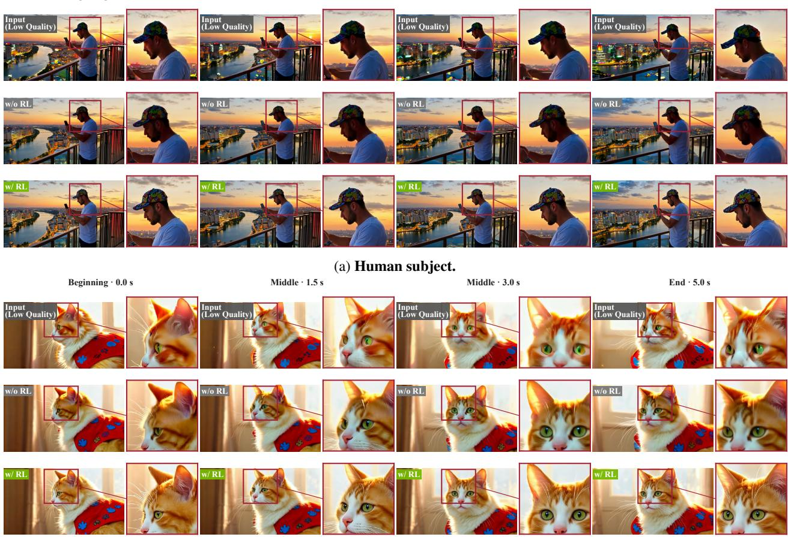  
(b) Animal subject.  
Figure 8 | Additional qualitative effects of RL post-training. Panels (a) and (b) show selected human and animal examples. Each panel compares the low-quality input, the refiner without RL post-training, and the same refiner with RL post-training at four aligned frames from 0.0 to 5.0 seconds. Each complete frame is followed by a magnified crop from the red box. RL post-training sharpens the side profile and cap edges in panel (a), and improves the eyes, facial contours, and fur texture in panel (b).

## E. Limitations

On Refiner-Bench, the 23-step model achieves higher VBench and UniPercept averages than the one-step model. Our refinement objective targets local visual detail while preserving the base video’s content and motion. Correcting large semantic, geometric, or motion errors is not an explicit training objective. Stage II evaluates three sampled frames per video using image-quality and preference reward models. These frame-based rewards do not directly measure longrange temporal consistency. Refiner-Bench covers AI-generated videos from several base generators; camera-captured degradations and broader video editing tasks remain outside this study.