# TAEC: TRAJECTORY-AWARE EVIDENCE COORDINA-TION FOR MULTI-STEP VISUAL RAG

Yalun Wu<sup>1</sup>, Bingzhou Wang<sup>2</sup>, Boyang Wang, Peiying Wang, Shaojie He, Yunhan Wang<sup>3</sup>, Shaozu Yuan, Jiawei Wang<sup>1</sup>

<sup>1</sup>NExT++ Lab, National University of Singapore

<sup>2</sup>University of Science and Technology of China

<sup>3</sup>Beihang University

## ABSTRACT

Multi-step visual retrieval-augmented generation (RAG) answers complex questions by repeatedly retrieving visual evidence, updating an intermediate state, and deciding whether to continue searching or answer. Yet retrieving relevant evidence does not ensure its effective use throughout the reasoning trajectory. As multi-step reasoning progresses, redundant sources occupy context capacity needed for missing evidence, observations tied to resolved requirements or unproductive searches linger in context, and visual sources are revisited with insufficient detail for finegrained reading. We term this loss of usable evidence over a reasoning trajectory trajectory-level evidence utilization degradation. To address it, we propose Trajectory-Aware Evidence Coordination (TAEC), a training-free framework that coordinates evidence use around unresolved answer requirements. TAEC tracks these requirements in a shared trajectory state to guide which evidence enters the context, how accumulated memory is retained, and at what level of detail visual evidence is examined. Under a unified evaluation protocol on Vi-DoSeek, SlideVQA, and MMLongBench-Doc, TAEC achieves the best overall performance against leading training-free visual RAG baselines, with the highest average accuracy across multiple proprietary vision-language models. These results demonstrate that aligning evidence with evolving reasoning needs improves evidence use throughout multi-step visual RAG.

## 1 INTRODUCTION

Retrieval-augmented generation (RAG) has expanded beyond text-only knowledge sources to external multimodal memories containing both images and text (Chen et al., 2022). Advances in vision-language retrieval now allow visual RAG systems to retrieve natural images or rendered document pages from external collections and answer questions using their visual and textual content (Faysse et al., 2025; Yu et al., 2025; Cho et al., 2024; Suri et al., 2025). For complex questions, however, a single retrieval pass may not provide sufficient evidence: answering may require successive searches, query reformulation, and fine-grained visual inspection. Recent systems therefore extend the retrieve-then-read paradigm to multi-step interaction between a vision-language model and a visual collection (Wang et al., 2025a;b; Shen et al., 2026; Wang et al., 2026a). Starting from the input question, the model retrieves and examines candidate sources, updates its reasoning state, and formulates follow-up queries when evidence is insufficient. This cycle continues until the model produces an answer or exhausts its interaction budget.

In addition to deciding what to retrieve next, multi-step visual RAG must manage both incoming evidence and accumulated observations under limited context and visual-processing capacity. Existing work supports this process through several complementary mechanisms. Methods select useful pages or fragments from retrieval results (Wang et al., 2026b;c; Zhang et al., 2026; Peng et al., 2025) and initiate further retrieval when the available evidence is insufficient (Jiang et al., 2023; Asai et al., 2024; Wang et al., 2025a;b; Aghajani Asl et al., 2025; Li et al., 2026; Chou et al., 2026). Accumulated history is organised into summaries or memory graphs (Wang et al., 2026a; Zuo et al., 2026; Xiong et al., 2026), or compressed to reduce its context footprint (Jiang et al., 2024; Packer et al.,

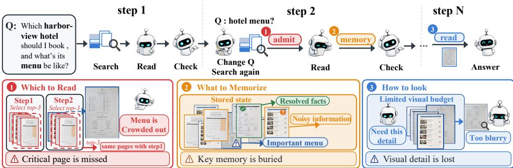  
Figure 1: Trajectory-level evidence utilization degradation in multi-step visual RAG.

2023). Visual inspection mechanisms enable fine-grained reading through region-level zooming (Bai et al., 2025; Tran et al., 2026), and importance-based policies determine which historical items to retain and how much visual detail to preserve (Shen et al., 2026). Recent agentic systems are increasingly integrating several of these mechanisms within a single pipeline (Wang et al., 2025a;b; Shen et al., 2026; Wang et al., 2026a).

Despite these advances, existing multi-step visual RAG systems can still suffer from reduced answer accuracy over long reasoning trajectories due to ineffective use of retrieved evidence. Our analysis of ReAct (Yao et al., 2023) on ViDoSeek shows that annotated evidence is retrieved in 74.6% of trajectories involving multiple searches. As the number of searches increases, answer accuracy on these trajectories declines from 91.7% for two searches to 63.8% for six to eight and 52.0% for nine or more. The proportion of all questions answered incorrectly despite evidence retrieval correspondingly rises from 7.9% to 22.8% and 28.3%. These results reveal a gap between retrieving relevant evidence and using it effectively over a reasoning trajectory. Accumulated observations can interfere with the use of retained evidence, while query reformulation and context updates may exclude evidence still needed to answer the original question. These processes can reduce the availability or usability of relevant evidence across reasoning steps, a phenomenon we term trajectory-level evidence utilization degradation.

An insightful guiding principle comes from how human analysts manage evidence. They prioritise sources that address unresolved questions, distinguish established conclusions from observation that still require investigation, and revisit relevant visual material when closer inspection is needed. The common principle is to allocate limited processing resources according to what remains unresolved, rather than treating all previously relevant information as equally useful. Applying this principle to multi-step visual RAG requires coordinating three decisions. First, newly retrieved sources may be relevant to the question yet add little beyond the evidence already available, consuming context space needed for missing evidence. Second, observations tied to resolved subproblems or unproductive search branches may persist in context and compete with information needed for subsequent reasoning. Third, retained visual sources may be presented at a level of detail insufficient for the model’s current information needs. These challenges concern which evidence enters the context, how accumulated memory is retained, and at what level of detail visual evidence is examined. Because all three depend on the evolving reasoning state, they should be coordinated around a shared account of unresolved answer requirements.

To address this challenge, we propose Trajectory-Aware Evidence Coordination (TAEC), a training-free coordination layer for multi-step visual RAG. TAEC maintains a shared trajectory state that tracks unresolved answer requirements and is updated as evidence accumulates. Three components use this state to coordinate evidence processing. Evidence Admission selects newly retrieved evidence according to its incremental contribution to unresolved requirements. Adaptive Memory Exposure adjusts how long accumulated memory remains exposed and in what form, based on its current role in the trajectory. Visual Detail Allocation distributes the visual-processing budget according to the level of detail still required from each retained image. By grounding these decisions in the same trajectory state, TAEC coordinates input, memory, and visual resources around what the model still needs to answer the question. Search planning, visual interpretation, state integration, stopping decisions, and answer generation remain the responsibility of the acting model.

We evaluate TAEC against single-pass, iterative, and multi-agent retrieval baselines on ViDoSeek, SlideVQA, and MMLongBench-Doc. The comparisons follow a unified protocol with a common retriever, a shared set of backbone models, the same judge, and matched interaction budgets. TAEC achieves the best overall performance against leading training-free visual RAG baselines, with the highest average accuracy. Further analyses show larger gains over ReAct on questions with longer ReAct trajectories, highlighting the value of requirement-aware evidence coordination in sustaining effective evidence use throughout multi-step reasoning.

The main contributions of this paper are summarized as follows:

• We identify and empirically validate trajectory-level evidence utilization degradation: relevant evidence can remain available without adequately supporting the model’s evolving reasoning requirements.

• We introduce TAEC, a training-free framework that aligns evidence admission, memory exposure and visual detail allocation through a shared state of unresolved answer requirements, so that the evidence placed before the acting model keeps matching what its reasoning still needs as the trajectory grows.

• We evaluate TAEC against single-pass, iterative, and multi-agent retrieval baselines on three benchmarks under a unified protocol. TAEC achieves the highest average accuracy in comparisons with leading training-free visual RAG methods. Component ablations and trajectory-level analyses examine the contributions of the three mechanisms and their effectiveness over extended reasoning trajectories.

## 2 RELATED WORK

Visual and multi-step multimodal RAG. Multimodal RAG extends retrieval-augmented generation beyond text-only sources to include images (Chen et al., 2022). For visually rich documents, ColPali (Faysse et al., 2025) learns multi-vector representations of rendered pages, and VisRAG (Yu et al., 2025) performs retrieval and generation directly over document images. M3DocRAG (Cho et al., 2024) supports multi-page and multi-document question answering, while VisDoMRAG (Suri et al., 2025) combines visual and textual RAG pipelines. Multi-step systems extend this paradigm through iterative retrieval and reasoning. ViDoRAG (Wang et al., 2025a) employs a multi-agent workflow, and VRAG-RL (Wang et al., 2025b) learns retrieval and visual-perception actions through reinforcement learning.

Adaptive retrieval and evidence selection. Adaptive RAG methods regulate when and how ad ditional information is retrieved. Self-RAG (Asai et al., 2024) and FLARE (Jiang et al., 2023) use self-reflection and generation confidence, respectively, to guide retrieval. Adaptive-RAG (Jeong et al., 2024) selects retrieval strategies according to question complexity, and DeepRAG (Guan et al., 2026) combines iterative query decomposition with adaptive retrieval decisions. CRAG (Yan et al., 2024) evaluates retrieval quality to guide corrective actions. Evidence sufficiency and information gaps also guide further queries and planning in S2G-RAG (Li et al., 2026), FAIR-RAG (Aghajani Asl et al., 2025), and GDP-RAG (Chou et al., 2026). Beyond retrieval decisions, GRO-RAG (Chen et al., 2026) combines relevance- and redundancy-aware source selection with gradient-based document reranking. AdaGReS (Peng et al., 2025) balances relevance and redundancy when selecting chunks under a token budget.

Context and memory management. Effective evidence use depends on how information is retained and presented, and can be affected by its position in long contexts (Liu et al., 2024). LongLLMLingua (Jiang et al., 2024) compresses prompts, while MemGPT (Packer et al., 2023) manages information across memory tiers. Recent agentic visual RAG systems incorporate these concerns into multi-step reasoning. VISOR (Shen et al., 2026) preserves accumulated findings in a structured evidence space and reconstructs context through a sliding window and repeated reminders of the original query. VimRAG (Wang et al., 2026a) uses semantic priority, graph dependencies, and temporal decay to select visual memories and allocate their resolution. MAGE-RAG (Zuo et al., 2026) constructs query-specific evidence subgraphs under explicit budgets. TAEC focuses on the criteria governing evidence admission, memory exposure, and visual detail allocation. New sources are selected according to requirement coverage and redundancy, while historical observations are presented according to their resolution status and branch outcomes. Visual allocation additionally considers estimated detail demand and context pressure alongside memory relevance. These mechanisms form a training-free coordination layer around the acting model.

## 3 TRAJECTORY-AWARE EVIDENCE COORDINATION

In multi-step retrieval, each step in a text or vision-language agent may build on a subset of earlier observations. These dependencies can be represented as a directed acyclic graph, whose nodes represent searches and their associated observations and whose edges indicate dependencies on earlier findings (Jiang et al., 2023; Asai et al., 2024; Guan et al., 2026; Li et al., 2026; Wang et al., 2025a;b; Shen et al., 2026; Wang et al., 2026a). TAEC operates on this trajectory graph, denoted by $G _ { t }$ at step t, with each memory item indexed by its originating node. The observations and dependencies recorded in the graph provide the basis for assessing requirement resolution, tracing supporting evidence, and identifying abandoned branches.

## 3.1 UNIFIED FORMULATION

Let $q$ denote the input question, $\mathcal { P } _ { t }$ the visual candidates retrieved at step $t , G _ { t }$ the trajectory graph accumulated so far, and $M _ { t }$ the cross-step multimodal memory. The information needed to answer q is represented by a compact requirement set $\mathcal { U } = \{ ( u , w _ { u } ) \}$ , where u denotes an answer requirement and $w _ { u }$ its importance. Let $\bar { w } _ { u , t }$ denote the weight requirement u carries at step $t ,$ reflecting how far it is already supported by the evidence in context. The resulting requirement state ${ \mathcal U } _ { t } = \{ ( \bar { u } , \bar { w } _ { u , t } ) \}$ emphasises unresolved requirements. All three TAEC components use this shared state as a common basis for their decisions.

At each step, the acting model receives newly admitted sources, rendered historical observations, and retained visual memories. Admission determines which sources enter the context, while memory exposure and visual allocation affect the availability and interpretability of accumulated evidence. These decisions jointly shape the evidence presented to the model under limited processing budgets. The corresponding configuration is expressed as

$$
\mathcal { C } _ { t } = \left( S _ { t } , ~ \left\{ E _ { m , t } \right\} _ { m \in M _ { t } } , ~ \left\{ p _ { i , t } \right\} _ { i \in V _ { t } } \right) , \qquad | S _ { t } | \le K , \quad \mathrm { c t x } ( E _ { t } ) \le L _ { t } , \quad \sum _ { i \in V _ { t } } p _ { i , t } \le B _ { t } ,\tag{1}
$$

where $S _ { t } \subseteq \mathcal { P } _ { t }$ is the set of newly admitted sources and $E _ { m , t }$ specifies the exposure of historical memory m. The set $V _ { t }$ contains retained historical images, with $p _ { i , t }$ <sub>t</sub> denoting the visual capacity assigned to image i. Here, $E _ { t } ~ = ~ \{ E _ { m , t } \} _ { m \in { \cal M } _ { t } }$ , and $\mathrm { c t x } ( E _ { t } )$ denotes the context length of the rendered memory. The budgets $K , L _ { t } ,$ and $B _ { t }$ constrain the number of admitted sources, the memory context length, and the total visual capacity for retained images, respectively.

Figure 2 illustrates one step of this process. The acting model remains responsible for search planning, visual interpretation, state integration, stopping decisions, and answer generation. Implementation details and hyperparameter settings are provided in Appendix A.

## 3.2 EVIDENCE ADMISSION

Evidence Admission selects newly retrieved sources for inclusion in the context. Retrieval relevance measures how closely a candidate matches the query but does not account for information already covered by selected sources. Consequently, several highly ranked sources may occupy input capacity with redundant information.

For candidate $i ,$ let $b _ { i }$ denote its retrieval relevance and $a _ { i u }$ its support for requirement u. Let $C _ { u } ( S )$ denote the coverage of requirement u provided by a selected set $S ,$ , and sim $( i , j )$ the redundancy between candidates i and $j$ . The admission objective is formulated as

$$
S _ { t } ^ { * } = \arg \operatorname* { m a x } _ { S \subseteq \mathcal { P } _ { t } } \left[ \alpha _ { A } \sum _ { \left( u , \bar { w } _ { u , t } \right) \in \mathcal { U } _ { t } } \bar { w } _ { u , t } C _ { u } ( S ) + \beta _ { A } \sum _ { i \in S } b _ { i } - \eta _ { A } \sum _ { \stackrel { i , j \in S } { i < j } } \sin ( i , j ) \right] .\tag{2}
$$

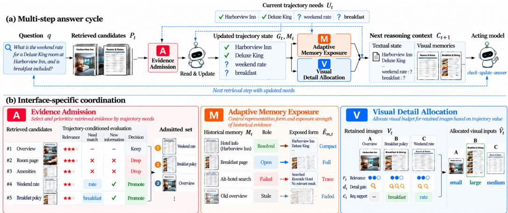  
Figure 2: Overview of Trajectory-Aware Evidence Coordination. At each step, the shared requirement state guides evidence admission, memory exposure, and visual detail allocation.

The three terms reward coverage of unresolved requirements and retrieval relevance while penalising redundancy among selected sources. Their relative contributions are controlled by $\alpha _ { A } , \beta _ { A }$ , and $\eta _ { A } .$ respectively. A greedy procedure approximates the solution, retaining the top-ranked retrieval result as an anchor to preserve the strongest retrieval signal.

## 3.3 ADAPTIVE MEMORY EXPOSURE

Adaptive Memory Exposure determines how accumulated observations are retained and presented. Some observations continue to support unresolved requirements, while others concern resolved questions, duplicate existing information, or originate from unproductive searches. TAEC therefore adjusts both memory persistence and the representation of observations as reasoning progresses.

Existing work manages information through hierarchical organisation, graph-based evidence selection, and energy-based memory prioritisation (Packer et al., 2023; Sarthi et al., 2024; Edge et al., 2024; Dai et al., 2026; Zuo et al., 2026; Wang et al., 2026a). TAEC uses the relevance scores maintained by the memory backend and introduces an exposure rule that combines granularity-dependent persistence with observation rendering conditioned on the current trajectory role. For a historical memory item m, let $g _ { m }$ denote its information granularity, $\Delta t _ { m }$ its age, $h _ { m }$ its stored observation, and $s _ { m , t }$ its current role in the reasoning trajectory. TAEC defines its exposure as

$$
E _ { m , t } = \left( e ^ { - \lambda _ { g m } \Delta t _ { m } } , \mathcal { R } ( h _ { m } , s _ { m , t } ) \right) .\tag{3}
$$

The first component modulates memory persistence through $\lambda _ { g _ { m } }$ , allowing the decay rate to vary with information granularity.

The second component controls how textual observations are presented to the acting model. The rendering function R preserves active or uncertain observations in full, condenses resolved observations into concise statements of established facts, and represents failed branches with brief terminal traces. The presentation thus adapts to the reasoning state while the stored trajectory remains unchanged. The role $s _ { m , t }$ captures resolution status, branch outcome, recency, and repeated exposure.

## 3.4 VISUAL DETAIL ALLOCATION

Visual Detail Allocation determines the level of detail available when retained images are read. Retaining a relevant image does not ensure that its content can be reliably interpreted, particularly as visual memories compete with a growing reasoning context. The benefit of additional visual detail also varies across images. TAEC therefore separates image relevance from the visual capacity assigned to each retained image.

Let V<sub>t</sub> denote the set of historical images selected by the underlying memory policy, and let ${ r } _ { i , t }$ denote the trajectory relevance of image i. Let $d _ { i , t }$ denote the estimated benefit of finer visual inspection and $c _ { i , t }$ the image’s support for requirements relevant to the current step.

TAEC allocates visual capacity according to

$$
p _ { i , t } = B _ { t } \left[ \kappa \frac { r _ { i , t } } { \sum _ { j \in V _ { t } } r _ { j , t } } + ( 1 - \kappa ) \frac { \exp ( \tau _ { V } r _ { i , t } d _ { i , t } c _ { i , t } ) } { \sum _ { j \in V _ { t } } \exp ( \tau _ { V } r _ { j , t } d _ { j , t } c _ { j , t } ) } \right] , \qquad i \in V _ { t } .\tag{4}
$$

The first term preserves the memory backend’s allocation in proportion to historical relevance. Its budget share is controlled by $\kappa \in [ 0 , 1 ]$ , with $\kappa = 1$ recovering this rule exactly. The second term uses image relevance, estimated detail benefit, and requirement support to allocate the remaining budget share, with $\tau _ { V }$ controlling allocation concentration. It favours images whose additional visual detail is expected to support current reasoning. The total budget $B _ { t }$ adapts to context pressure after memory exposure, reflecting the context actually presented to the acting model.

## 4 EXPERIMENTS

We analyse evidence use across multi-step trajectories and evaluate TAEC through baseline comparisons, component ablations, and cost measurements.

## 4.1 EXPERIMENT SETTING

Protocol. We evaluate on three benchmarks with different evidence distributions and reasoning requirements. ViDoSeek (Wang et al., 2025a) covers single- and multi-hop question answering over page images. SlideVQA (Tanaka et al., 2023) focuses on slide decks, with most questions answerable from a single slide. MMLongBench-Doc (Ma et al., 2024) requires locating relevant evidence within long documents; we evaluate on its 847 questions annotated as answerable. We use four proprietary vision-language models as acting models: Gemini-3.5-Flash, Kimi-K3, GPT-5.6-Sol and GPT-4o-mini, spanning different deployment tiers. All models remain frozen, and no TAEC component is trained. For comparisons within each table, all systems use the same read-only retrieval index, the same limit on pages admitted per search, and the same interaction and visual budgets. Outputs are evaluated together in a single batch by GPT-4.1 using a fixed judging prompt. Appendix B provides details of the index, budgets, judge, acting-model selection and inference settings, and the source of each reported result.

Systems. We compare TAEC with representative retrieval baselines and leading training-free agentic RAG systems. Vanilla performs a single retrieval followed by answer generation. Re-Act (Yao et al., 2023) follows a think–search–observe loop and retains all retrieved images in the context. ViDoRAG (Wang et al., 2025a) is a leading training-free multi-agent framework with publicly available code. DAG agent uses the underlying trajectory graph without the three TAEC components. TAEC augments this framework with evidence admission, adaptive memory exposure and visual detail allocation. We additionally compare against M3RAG (Du & Li, 2026) using our reimplementation, as its code is not publicly available; this comparison is reported in Appendix D.

Metrics. We report answer accuracy throughout. To analyse evidence availability and use, we additionally report coverage, the proportion of questions for which at least one annotated evidence page (a gold page) enters the context at any point during the trajectory. We define use as answer accuracy on this subset. Appendix M details the decomposition used for comparisons across systems.

## 4.2 EVIDENCE UTILISATION OVER LONG TRAJECTORIES

We analyse ReAct trajectories on ViDoSeek with Gemini-3.5-Flash, where all retrieved images remain in the context as reasoning proceeds.

Among trajectories that retrieve a gold page, answer accuracy decreases as the number of searches increases (solid line in Figure 3). The orange bar segments show the proportion of all questions in each group for which a gold page is retrieved but the final answer is incorrect. Table 2 reports the complete breakdown.

To examine this pattern when evidence is available from the first step, we restrict the analysis to questions whose gold page appears among the first five retrieved pages (dashed line). Accuracy is 96.0% for trajectories ending after one search and 39.2% for those involving nine or more searches.

A controlled intervention on the DAG agent further examines the effect of context growth while holding the questions and retrieved pages fixed. Adding 32K neutral text tokens reduces accuracy by 5.2 percentage points, with the gold pages retained and their visual presentation unchanged (Appendix G). Together, these findings indicate that evidence availability alone does not ensure effective use, motivating trajectory-level evidence coordination.

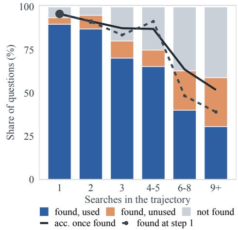  
Figure 3: ReAct on ViDoSeek with Gemini-3.5-Flash, grouped by the number of searches. Marker area is proportional to the number of questions in each group.

## 4.3 MAIN RESULTS

Table 1 compares methods using the same retriever, interaction budget, and judge on identical question sets. Among the methods in this table, TAEC achieves the highest accuracy in all twelve settings. With Gemini-3.5-Flash, it outperforms ViDoRAG (Wang et al., 2025a), a leading trainingfree multi-agent framework with publicly available code, by 7.8, 11.1 and 18.6 percentage points on ViDoSeek, SlideVQA and MMLongBench-Doc, respectively. Its corresponding gains over our adapted implementation of M3RAG (Du & Li, 2026) are 5.0, 2.1 and 2.5 percentage points. Across all four acting models, TAEC leads in ten of the twelve comparisons, with both exceptions on MMLongBench-Doc (Appendix D).

Table 1: Accuracy (%). Bold and underlining mark the best and second-best results per column; Avg. is the mean across twelve settings. MMLongBench-Doc uses 847 answerable questions; fullset results appear in Appendix E.1. Supplementary results for M3RAG, RL-trained agents, and open-weight backbones appear in Appendices D, J.3, and J, respectively.
<table><tr><td></td><td colspan="4">ViDoSeek</td><td colspan="4">SlideVQA</td><td colspan="4">MMLongBench-Doc</td><td></td></tr><tr><td>System</td><td>Gemini</td><td>Kimi</td><td>GPT-5.6</td><td>4o-mini</td><td>Gemini</td><td>Kimi</td><td>GPT-5.6</td><td>40-mini</td><td>Gemini</td><td>Kimi</td><td>GPT-5.6</td><td>4o-mini</td><td>Avg.</td></tr><tr><td>Vanilla</td><td>76.7</td><td>81.8</td><td>82.0</td><td>59.2</td><td>79.6</td><td>78.0</td><td>79.3</td><td>61.9</td><td>40.1</td><td>31.8</td><td>38.1</td><td>15.6</td><td>60.3</td></tr><tr><td>ReAct</td><td>79.5</td><td>82.1</td><td>82.1</td><td>56.1</td><td>77.2</td><td>82.0</td><td>81.0</td><td>59.3</td><td>42.4</td><td>36.5</td><td>39.1</td><td>15.2</td><td>61.0</td></tr><tr><td>ViDoRAG</td><td>79.7</td><td>80.8</td><td>81.3</td><td>65.8</td><td>72.5</td><td>74.5</td><td>78.3</td><td>58.7</td><td>31.5</td><td>37.2</td><td>37.8</td><td>14.1</td><td>59.4</td></tr><tr><td>DAG agent</td><td>80.1</td><td>84.8</td><td>84.1</td><td>65.7</td><td>76.7</td><td>80.9</td><td>77.7</td><td>56.6</td><td>44.5</td><td>43.9</td><td>38.3</td><td>14.3</td><td>62.3</td></tr><tr><td>TAEC</td><td>87.5</td><td>88.1</td><td>87.0</td><td>71.0</td><td>83.6</td><td>83.8</td><td>82.2</td><td>62.0</td><td>50.1</td><td>45.8</td><td>42.6</td><td>17.7</td><td>66.8</td></tr></table>

Three further observations emerge. With Gemini-3.5-Flash, TAEC’s gains over Vanilla vary across benchmarks: 4.0 percentage points on SlideVQA, compared with 10.0 on MMLongBench-Doc and 10.8 on ViDoSeek. ReAct underperforms Vanilla in four of the twelve settings, showing that iterative retrieval alone does not consistently improve accuracy. Gains from coordination also vary across acting models. Gemini-3.5-Flash benefits more than Kimi-K3 and GPT-5.6-Sol despite their similar accuracy on single-search questions with a gold page available (Appendix I). For Gemini-3.5-Flash, adding the three components to the DAG agent improves accuracy by 7.4, 6.9 and 5.6 percentage points on ViDoSeek, SlideVQA and MMLongBench-Doc, respectively.

## 4.4 COMPONENT ABLATION

We add each component individually and all three jointly to the DAG agent, evaluating their contributions on all three benchmarks with Gemini-3.5-Flash. Figure 4 summarises the results, with detailed values in Table 7.

Each component improves accuracy over the DAG agent on all three benchmarks, achieving approximately 41%–88% of TAEC’s gain. The full system achieves the highest accuracy throughout. Admission yields the largest individual gains on Vi-DoSeek and MMLongBench-Doc, achieving 6.2 of the full 7.4 percentage-point gain and 3.7 of 5.6, respectively. This pattern is consistent with the importance of page selection: most ViDoSeek questions are answered after one search, while MMLongBench-Doc requires locating evidence within long documents. Memory exposure and visual allocation mainly act on subsequent reasoning steps. On SlideVQA, the three individual configurations differ by at most 0.5 percentage points, and each achieves more than 80% of the full gain.

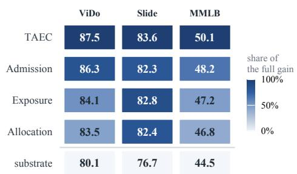  
Figure 4: Component ablation with Gemini-3.5-Flash. Values show accuracy (%); colour indicates gains over the DAG agent, normalised by TAEC’s gain on each benchmark.

## 4.5 ANALYSIS

Trajectory depth. Figure 5(a) groups questions by the number of searches performed by ReAct, using identical question subsets for all systems (Table 3, Appendix C). TAEC’s advantage over ReAct is larger in groups with more searches. In the group with at least four searches, ReAct achieves 46.2%, 27.4% and 18.2% accuracy on ViDoSeek, SlideVQA and MMLongBench-Doc, respectively, compared with 74.3%, 54.0% and 31.8% for TAEC. ReAct ranks last among the four systems in each of these groups.

Coverage and use. Figure 5(b) decomposes TAEC’s accuracy gains over the DAG agent on the fixed subsets where ReAct performs multiple searches. The gains are 14.0, 13.9 and 5.6 percentage points on ViDoSeek, SlideVQA and MMLongBench-Doc, respectively. The largest positive contributions come from questions for which only TAEC retrieves a gold page: 14.8, 8.8 and 3.8 percentage points. On the 115 such questions in ViDoSeek, accuracy is 22% for the DAG agent and 86% for TAEC. Questions for which both systems retrieve a gold page contribute −0.6, 5.0 and 1.9 percentage points, respectively. Within these shared subsets, TAEC is 8.8 and 5.0 percentage points higher on SlideVQA and MMLongBench-Doc, and level on ViDoSeek, where the two differ by three of 339 questions. These groups are defined by ReAct’s search count; TAEC itself answers 93.5% of ViDoSeek questions after one search. Appendix M provides the full four-group decomposition and explains why post-hit accuracy cannot be compared directly across systems.

Context composition. All systems use the same limit on pages admitted per search. Figure 5(c) compares the mean numbers of admitted and distinct pages per question. On ViDoSeek, only 46.3% of ReAct’s admitted pages are distinct, so more than half of its page inputs are repeats. The DAG agent reduces repetition by tracking previously retrieved pages. With TAEC, distinct pages account for 99.6%, 99.3% and 95.2% of page admissions on ViDoSeek, SlideVQA and MMLongBench-Doc, respectively.

Retrieval effort. On the fixed subsets where ReAct performs multiple searches, TAEC achieves higher coverage with fewer searches. Across the three benchmarks, ReAct averages 3.00–6.00 searches per question, compared with 1.28–2.58 for TAEC. On ViDoSeek, coverage increases from 74.6% with ReAct to 90.8% with TAEC, with the same ordering on the other two benchmarks. The DAG agent achieves coverage of 68.4%, 59.3% and 40.2% on the corresponding subsets (Table 4, Appendix C).

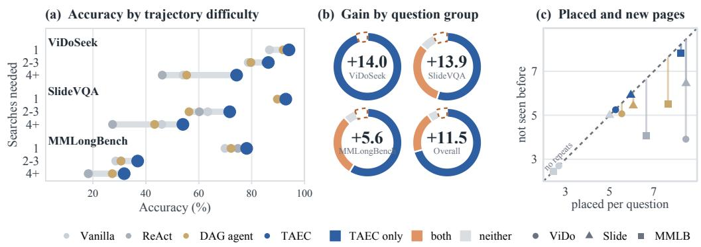  
Figure 5: Analysis with Gemini-3.5-Flash (Table 1). (a) Accuracy by ReAct search count (Table 3). (b) TAEC’s accuracy gain over the DAG agent, decomposed by coverage group on questions with multiple ReAct searches. Centres show net gains (percentage points); hollow sectors indicate negative contributions. (c) Mean admitted and distinct pages per question. MMLongBench-Doc coverage uses answerable questions with annotated evidence pages.

## 4.6 EFFICIENCY

By reducing redundant inputs and repeated evidence transmission, TAEC can lower interaction over head. On ViDoSeek with Gemini-3.5-Flash, it transmits an average of 0.61 MB of context per question, compared with 0.87 MB for the DAG agent and 3.73 MB for ReAct. It also requires fewer model calls than both and reduces cumulative image transmissions from 92.8 per question for ReAct to 14.7 (Table 6, Appendix C). These savings accompany higher answer accuracy.

Additional analyses examine alternative retrievers (Appendix K), search depth (Appendix L), and performance across backbones, including open-weight and RL-trained models (Appendices I and J). Further baseline comparisons and an audit of the evaluation protocol are reported in Appendices D and N, respectively.

## 4.7 LIMITATIONS

TAEC coordinates the evidence presented to the acting model, which remains responsible for assessing evidence sufficiency and controlling the reasoning trajectory. Its effectiveness therefore depends on the model’s existing agentic capabilities (Appendix I). As a training-free evidence coordination layer, TAEC cannot fully compensate for deficiencies in these capabilities; policy training remains a complementary direction for improving the acting model. With Qwen2.5-VL-7B, single-pass retrieval outperforms the evaluated multi-step configurations on SlideVQA (Appendix J). With the smaller Qwen3-VL-4B, TAEC outperforms single-pass retrieval, indicating that this limitation is not universal among small or open-weight models. The main comparisons are limited to a single retriever family, with alternative retrievers examined in Appendix K. All three benchmarks consist of English document collections.

## 5 CONCLUSION

We identify trajectory-level evidence utilization degradation in multi-step visual RAG and propose TAEC, a training-free framework that tracks unresolved answer requirements to coordinate evidence admission, memory exposure, and visual detail allocation. On ViDoSeek, SlideVQA, and MMLongBench-Doc, TAEC achieves the highest average accuracy against leading training-free baselines across multiple proprietary vision-language models. The gains are more pronounced on longer trajectories, supporting requirement-aware evidence coordination as an effective approach to sustaining evidence use in multi-step visual RAG.

## REFERENCES

Mohammad Aghajani Asl, Majid Asgari-Bidhendi, and Behrooz Minaei-Bidgoli. FAIR-RAG: Faithful adaptive iterative refinement for retrieval-augmented generation, 2025. URL https: //arxiv.org/abs/2510.22344. arXiv preprint arXiv:2510.22344.

Akari Asai, Zeqiu Wu, Yizhong Wang, Avirup Sil, and Hannaneh Hajishirzi. Self-RAG: Learning to retrieve, generate, and critique through self-reflection. In International Conference on Learning Representations, 2024.

Tianyi Bai, Zengjie Hu, Fupeng Sun, Jiantao Qiu, Yizhen Jiang, Guangxin He, Bohan Zeng, Conghui He, Binhang Yuan, and Wentao Zhang. Multi-step visual reasoning with visual tokens scaling and verification, 2025. URL https://arxiv.org/abs/2506.07235. arXiv preprint arXiv:2506.07235.

Siyuan Chen, Hang Ding, Xiaoyu Kang, and Jiechao Gao. GRO-RAG: Gradient-aware re-rank optimization for multi-source retrieval-augmented generation. In International Conference on Learning Representations, 2026.

Wenhu Chen, Hexiang Hu, Xi Chen, Pat Verga, and William Cohen. MuRAG: Multimodal retrieval-augmented generator for open question answering over images and text. In Proceedings of the 2022 Conference on Empirical Methods in Natural Language Processing, pp. 5558–5570, Abu Dhabi, United Arab Emirates, 2022. Association for Computational Linguistics. doi: 10.18653/v1/2022.emnlp-main.375. URL https://aclanthology.org/2022. emnlp-main.375/.

Jaemin Cho, Debanjan Mahata, Ozan Irsoy, Yujie He, and Mohit Bansal. M3DocRAG: Multi-modal retrieval is what you need for multi-page multi-document understanding, 2024. URL https: //arxiv.org/abs/2411.04952.

Wei-Chieh Chou, Xuanjun Chen, Jian-Ren Lin, Claire Lin, Hung-yi Lee, and Jyh-Shing Roger Jang. Only ask what you don’t know: Grounded delta planning for efficient multi-step RAG, 2026.

Sijun Dai, Qiang Huang, Xiaoxing You, and Jun Yu. MG<sup>2</sup>-RAG: Multi-granularity graph for multimodal retrieval-augmented generation, 2026. URL https://arxiv.org/abs/2604. 04969. arXiv preprint arXiv:2604.04969v2.

Haizhou Du and Wenhao Li. M3RAG: Orchestrating multi-agent reasoning for multi-hop, multimodal understanding. In MultiMedia Modeling (MMM 2026), volume 16412 of Lecture Notes in Computer Science, pp. 364–378. Springer, 2026. doi: 10.1007/978-981-95-6950-2\ 26.

Darren Edge, Ha Trinh, Newman Cheng, Joshua Bradley, Alex Chao, Apurva Mody, Steven Truitt, Dasha Metropolitansky, Robert Osazuwa Ness, and Jonathan Larson. From local to global: A graph RAG approach to query-focused summarization. arXiv preprint arXiv:2404.16130, 2024.

Manuel Faysse, Hugues Sibille, Tony Wu, Bilel Omrani, Gautier Viaud, Celine Hudelot, and Pierre Colombo. ColPali: Efficient document retrieval with vision language models. In International Conference on Learning Representations, 2025.

Xinyan Guan, Jiali Zeng, Fandong Meng, Chunlei Xin, Yaojie Lu, Hongyu Lin, Xianpei Han, Le Sun, and Jie Zhou. DeepRAG: Thinking to retrieve step by step for large language models. In International Conference on Learning Representations, 2026.

Soyeong Jeong, Jinheon Baek, Sukmin Cho, Sung Ju Hwang, and Jong Park. Adaptive-RAG: Learning to adapt retrieval-augmented large language models through question complexity. In Proceedings of the 2024 Conference of the North American Chapter of the Association for Computational Linguistics: Human Language Technologies (Volume 1: Long Papers), pp. 7036–7050. Association for Computational Linguistics, 2024. doi: 10.18653/v1/2024.naacl-long.389.

Huiqiang Jiang, Qianhui Wu, Xufang Luo, Dongsheng Li, Chin-Yew Lin, Yuqing Yang, and Lili Qiu. LongLLMLingua: Accelerating and enhancing LLMs in long context scenarios via prompt compression. In Proceedings of the 62nd Annual Meeting of the Association for Computational Linguistics (Volume 1: Long Papers), pp. 1658–1677. Association for Computational Linguistics, 2024. doi: 10.18653/v1/2024.acl-long.91.

Zhengbao Jiang, Frank F. Xu, Luyu Gao, Zhiqing Sun, Qian Liu, Jane Dwivedi-Yu, Yiming Yang, Jamie Callan, and Graham Neubig. Active retrieval augmented generation. In Proceedings of the 2023 Conference on Empirical Methods in Natural Language Processing. Association for Computational Linguistics, 2023. doi: 10.18653/v1/2023.emnlp-main.495. URL https:// aclanthology.org/2023.emnlp-main.495/.

Minghan Li, Junjie Zou, Xinxuan Lv, Chao Zhang, and Guodong Zhou. S2G-RAG: Structured sufficiency and gap judging for iterative retrieval-augmented QA. In Proceedings of the 64th Annual Meeting of the Association for Computational Linguistics (Volume 1: Long Papers), pp. 25846–25862, San Diego, California, United States, July 2026. Association for Computational Linguistics. doi: 10.18653/v1/2026.acl-long.1185. URL https://aclanthology.org/ 2026.acl-long.1185/.

Nelson F. Liu, Kevin Lin, John Hewitt, Ashwin Paranjape, Michele Bevilacqua, Fabio Petroni, and Percy Liang. Lost in the middle: How language models use long contexts. Transactions of the Associationfor Computational Linguistics, 12:157–173, 2024. doi: 10.1162/tacl\ a\ 00638. URL https://aclanthology.org/2024.tacl-1.9/.

Yubo Ma, Yuhang Zang, Liangyu Chen, Meiqi Chen, Yizhu Jiao, Xinze Li, Xinyuan Lu, Ziyu Liu, Yan Ma, Xiaoyi Dong, Pan Zhang, Liangming Pan, Yu-Gang Jiang, Jiaqi Wang, Yixin Cao, and Aixin Sun. MMLongBench-Doc: Benchmarking long-context document understanding with visualizations. In Advances in Neural Information Processing Systems (NeurIPS), Datasets and Benchmarks Track, 2024. URL https://arxiv.org/abs/2407.01523. arXiv:2407.01523.

Charles Packer, Sarah Wooders, Kevin Lin, Vivian Fang, Shishir G. Patil, Ion Stoica, and Joseph E. Gonzalez. MemGPT: Towards LLMs as operating systems. arXiv preprint arXiv:2310.08560, 2023.

Chao Peng, Bin Wang, Zhilei Long, and Jinfang Sheng. AdaGReS: Adaptive greedy context selection via redundancy-aware scoring for token-budgeted RAG, 2025.

Parth Sarthi, Salman Abdullah, Aditi Tuli, Shubh Khanna, Anna Goldie, and Christopher D. Manning. RAPTOR: Recursive abstractive processing for tree-organized retrieval. In International Conference on Learning Representations, 2024.

Yucheng Shen, Jiulong Wu, Jizhou Huang, Dawei Yin, Lingyong Yan, and Min Cao. VISOR: Agentic visual retrieval-augmented generation via iterative search and over-horizon reasoning. In Proceedings of the 34th ACM International Conference on Multimedia, 2026. URL https: //arxiv.org/abs/2604.09508. arXiv:2604.09508.

Manan Suri, Puneet Mathur, Franck Dernoncourt, Kanika Goswami, Ryan A. Rossi, and Dinesh Manocha. VisDoM: Multi-document QA with visually rich elements using multimodal retrievalaugmented generation. In Proceedings of the 2025 Conference of the Nations of the Americas Chapter of the Association for Computational Linguistics: Human Language Technologies (Volume 1: Long Papers), pp. 6088–6109. Association for Computational Linguistics, 2025. doi: 10.18653/v1/2025.naacl-long.310.

Ryota Tanaka, Kyosuke Nishida, Masaaki Yoshida, and Satoshi Sekine. SlideVQA: A dataset for document visual question answering on multiple images. In Proceedings ofthe AAAI Conference on Artificial Intelligence, 2023.

Oanh N. Tran, Thanh Quoc Hung Le, Oscar Chew, Kuan-Hao Huang, and Khoa D. Doan. Look before you zoom: Adaptive routing for the resolution-context trade-off in visual RAG, 2026.

Qiuchen Wang, Ruixue Ding, Zehui Chen, Weiqi Wu, Shihang Wang, Pengjun Xie, and Feng Zhao. ViDoRAG: Visual document retrieval-augmented generation via dynamic iterative reasoning agents. In Proceedings of the 2025 Conference on Empirical Methods in Natural Language Processing, pp. 9113–9134, Suzhou, China, 2025a. Association for Computational Linguistics. doi: 10.18653/v1/2025.emnlp-main.464. URL https://aclanthology.org/ 2025.emnlp-main.464/.

Qiuchen Wang, Ruixue Ding, Yu Zeng, Zehui Chen, Lin Chen, Shihang Wang, Pengjun Xie, Fei Huang, and Feng Zhao. VRAG-RL: Empower vision-perception-based RAG for visually rich information understanding via iterative reasoning with reinforcement learning. In Advances in Neural Information Processing Systems, 2025b.

Qiuchen Wang, Shihang Wang, Yu Zeng, Qiang Zhang, Fanrui Zhang, Zhuoning Guo, Bosi Zhang, Wenxuan Huang, Lin Chen, Zehui Chen, Pengjun Xie, and Ruixue Ding. VimRAG: Navigating massive visual context in retrieval-augmented generation via multimodal memory graph, 2026a. URL https://arxiv.org/abs/2602.12735.

Xihang Wang, Zihan Wang, Chengkai Huang, Cao Liu, Ke Zeng, and Quan Z. Sheng. Purifying multimodal retrieval: Fragment-level evidence selection for RAG. In ACM SIGIR Conference on Research and Development in Information Retrieval, 2026b.

Xihang Wang, Zihan Wang, Chengkai Huang, Quan Z. Sheng, and Lina Yao. MEG-RAG: Quantifying multi-modal evidence grounding for evidence selection in RAG. In Proceedings ofthe 49th International ACM SIGIR Conference on Research and Development in Information Retrieval, SIGIR ’26, Melbourne, VIC, Australia, July 2026c. Association for Computing Machinery. doi: 10.1145/3805712.3809947.

Junyu Xiong, Yonghui Wang, Rongjian Gu, Chenyu Liu, Bing Yin, Wengang Zhou, and Houqiang Li. HIEVI-RAG: Hierarchical evidence-driven reasoning for long document understanding, 2026. URL https://arxiv.org/abs/2607.04625.

Shi-Qi Yan, Jia-Chen Gu, Yun Zhu, and Zhen-Hua Ling. Corrective retrieval augmented generation. arXiv preprint arXiv:2401.15884, 2024.

Shunyu Yao, Jeffrey Zhao, Dian Yu, Nan Du, Izhak Shafran, Karthik Narasimhan, and Yuan Cao. ReAct: Synergizing reasoning and acting in language models. In International Conference on Learning Representations, 2023.

Shi Yu, Chaoyue Tang, Bokai Xu, Junbo Cui, Junhao Ran, Yukun Yan, Zhenghao Liu, Shuo Wang, Xu Han, Zhiyuan Liu, and Maosong Sun. VisRAG: Vision-based retrieval-augmented generation on multi-modality documents. In International Conference on Learning Representations, 2025.

Tao Zhang, Ziqi Zhang, Zongyang Ma, Yuxin Yang, Bing Li, Chunfeng Yuan, Kang Rong, Fengyun Rao, Jing Lyu, and Weiming Hu. MMAgent-R<sup>2</sup>: Learning to rerank and reject for agentic mRAG, 2026. URL https://arxiv.org/abs/2607.07383.

Yilong Zuo, Xunkai Li, Jing Yuan, Qiangqiang Dai, Hongchao Qin, and Ronghua Li. MAGE-RAG: Multigranular adaptive graph evidence for agentic multimodal RAG in long-document QA, 2026. URL https://arxiv.org/abs/2606.15906.

## A IMPLEMENTATION DETAILS

This section documents the substrate and the three components as they run in the evaluated code, and maps the panels of Figure 2 onto that code. Simplifications relative to the formulation in Section 3 are noted where they occur. Every coefficient, decay rate and threshold below is the default of the released implementation, unchanged across all benchmarks, backbones and retrievers; the exact values are in the released code rather than restated here.

## A.1 SUBSTRATE: THE DAG AGENT

The trajectory graph. The trajectory is built by the acting model itself, one node per action. A search node records the query the model issued, the identifiers of the earlier nodes it declared this search to follow from, and, once the model has read the returned pages, the summary it wrote about them and the pages it marked for retention. An answer node terminates a path and records the final answer and the nodes it rests on. Edges are therefore claims of dependence made by the model at the moment it acts: a search issued to refine an earlier finding names that finding as its parent, while a search that opens an independent line names the root, so sibling subtrees correspond to independent lines of inquiry and a chain corresponds to one line being pursued. Every visual memory is stored under the node that admitted it, so the graph indexes both what was concluded and where the evidence for it came from, and a node’s position in the graph, its depth, its number of children and whether its subtree ever reached an answer, is read by later steps when they assess how much a memory still contributes.

Tool interface and loop. The acting model sees three tools. add search node $( \mathrm { \ i d } ,$ parent ids, query) issues one retrieval call and returns the admitted pages as images, each preceded by a Picture k label, together with a fixed instruction to summarise. summarize and memorize(summarize, memorize) returns a one-to-threesentence summary and an optional list of useful pictures, each with a self-reported priority score in $\{ 1 , \ldots , 5 \bar { ) }$ . add answer node(parent ids, answer) ends the trajectory. Each search must be followed by a summarise call before the next search is accepted; after every summarise the prompt is rebuilt from scratch. The prompt contains the system instruction, the question with any runtime hints, the full action graph serialised as JSON (node ids, parents, queries, summaries), and a multimodal memory block of re-presented images. Retrieval returns five candidates per query; pages already shown earlier in the trajectory are removed from new results. The loop runs for at most 20 model calls; if the model has not called the answer tool, a final call with a forced-answer instruction is issued, and if that still yields no tool call, a plain-text question is asked over the same context.

Energy-based memory. Every picture the model marked useful is stored with its node id, granularity (page or region) and priority. Before each call, the memory is scored with a graph energy of the form used by graph-structured agent memories (Packer et al., 2023; Sarthi et al., 2024; Edge et al., 2024; Dai et al., 2026; Zuo et al., 2026; Wang et al., 2026a),

$$
\Omega _ { i } = \left( \frac { p _ { i } } { 5 } \right) \left( 1 + \mathrm { o u t d e g } ( m _ { i } ) \right) e ^ { - \lambda _ { g _ { i } } \Delta t _ { i } } + \gamma \sum _ { c \in \mathrm { c h i l d r e n } ( m _ { i } ) } \bar { \Omega } _ { c } ,\tag{5}
$$

where $m _ { i }$ is the node that admitted image i, $\Delta t _ { i }$ its age in nodes, γ the child-feedback weight, and $\lambda _ { g }$ a granularity-dependent decay rate that is zero for entity-level text and largest for whole pages. The highest-energy images are re-presented under the memory pixel budget of Appendix B, and that budget is scaled up as the textual prompt grows. Three properties of this instantiation belong to the components of Section 3 rather than to the backend: the decay rate $\lambda _ { g }$ is granularity-dependent rather than global, the priority $p _ { i }$ is the measured information gain of an image rather than a selfreported score, and the total budget follows context pressure instead of being fixed. Two runtime hints are derived from summaries by keyword cues: a summary with a failure cue (“not found”, “unclear”, and their Chinese equivalents) marks its query as a dead end, and the next prompt carries a typed hint (no result / partial / unclear) naming that query; a summary with a high-confidence cue and a number sets an early-stop flag that asks the model to answer next. These cues are also what adaptive memory exposure reads (below). Images are JPEG re-encoded at most 300K pixels and at most 38 KB each. DAG agent is the same agent reduced to this structure. It reasons over the same trajectory graph and writes the same summaries, and it re-presents its memories with uniform relevance, at a visual budget that does not move with context pressure, over candidate pages ranked by the retriever alone; the trajectory’s branch outcomes stay in the graph and are not turned into signals that shape later prompts.

## A.2 REQUIREMENT STATE $\mathcal { U } _ { t }$

In the evaluated configuration the requirement set is extracted once per question by a single call to GPT-4.1-mini at temperature 0 (“extract 2–4 information slot keywords needed to answer the question”), cached, and truncated to four slots with uniform weight. Coverage $C _ { u } ( S )$ is updated inside the admission greedy as slots become covered by admitted pages. In the runs reported here the slot weights stay uniform; the variant in which the acting model reports resolution status at every summarise call is implemented behind VRAG AGENT SEMANTIC STATE and is not enabled. Memory exposure takes its resolution signal from the summary cues of Appendix A.1, and admission propagates its slot-coverage score into the detail term of visual allocation. This is one call per question in addition to the acting model’s own calls.

## A.3 EVIDENCE ADMISSION

Admission replaces the retriever’s top-5 with a greedy selection over an over-sampled pool of $5 \times 5 =$ 25 candidates (capped at 50). For candidate i with retriever score $b _ { i }$ (min–max normalised within the pool) and page caption cap :

• slot support $\begin{array} { r } { a _ { i } \ = \ \frac { 1 } { | \mathcal { U } | } \sum _ { u \in \mathcal { U } } { \mathcal { k } } ^ { \angle } [ u \ \subseteq \ \mathrm { c a p } _ { i } ] } \end{array}$ , the fraction of slot keywords that occur as substrings in the caption;

• redundancy sim $( i , S ) = \operatorname* { m a x } _ { j \in S }$ Jaccard $\left( \operatorname { t o k } _ { i } , \operatorname { t o k } _ { j } \right)$ ) over caption tokens (CJK characters plus Latin words and numbers).

The retriever’s top-1 is always kept as an anchor. The remaining slots are filled greedily by the marginal gain of equation $2 , a _ { i }$ standing in for the coverage term and $b _ { i }$ for the relevance term. The admitted set is then passed through the substrate’s seen-page filter and rendered at the standard perimage resolution. Slot scores are recorded as metadata on each admitted image and are propagated to visual detail allocation (VRAG UEP PROPAGATE SLOT SCORE) in the runs reported here. Captions are the VLM-generated page captions described in Appendix B. No image is cropped in the main runs.

## A.4 ADAPTIVE MEMORY EXPOSURE

The persistence term of equation 3 is the granularity-specific decay $e ^ { - \lambda _ { g } \Delta t }$ of equation 5. The representation term R is applied to the action-graph JSON at prompt-build time and never modifies the stored graph. The root node and the most recent nodes are always rendered in full. Every older node is classified from its summary by the confidence cues: resolved if a confidence cue is present and no failure cue is; failed if a failure cue is present or the node’s query is in the dead-end list; active otherwise. Resolved nodes are rendered as one canonical sentence, the first sentence of the summary carrying a confidence cue; failed nodes are rendered as a short terminal trace naming the abandoned query; active nodes are rendered in full.

## A.5 VISUAL DETAIL ALLOCATION

Allocation runs only where historical images are re-presented; images retrieved at the current step are read immediately after admission and are not part of $V _ { t }$

Allocation acts only when historical images are re-presented, which in the main runs means trajectories with at least two searches (three graph nodes); shorter trajectories fall through to the substrate’s allocation. Its inputs are the memory energies $r _ { i } = \Omega _ { i }$ <sub>i</sub> from equation 5, a detail proxy $d _ { i } ,$ , and requirement support $c _ { i }$ . In the evaluated runs $d _ { i }$ is maximal for region crops and, for pages, the caption length normalised across the corpus, with the admission slot score folded into $\mathrm { i t } ; c _ { i }$ is 1 throughout, so the requirement signal reaches this component through $d _ { i }$ rather than through $c _ { i }$ . The budget follows the same pressure-scaled form as the substrate ${ \bf \cdot } _ { \bf s } ,$ with an earlier onset. Which images are shown is decided by $r _ { i }$ alone (top-5); only their pixel shares change. Within each granularity group, image i receives $p _ { i } = B _ { t } ^ { g } \big [ \kappa r _ { i } / \sum _ { j } r _ { j } + ( 1 - \kappa )$ softma $\iota _ { j } ( \tau r _ { j } d _ { j } c _ { j } ) _ { i } ]$ , equation 4 restricted to the group and clipped to the per-image resolution limits; when region crops are present they receive the larger share of $B _ { t }$ . The no pressure ablation fixes $B _ { t } = B _ { 0 } ;$ ; the no detail ablation sets $\dot { d } _ { i } = 1$

## A.6 COMPOSITION AND COST

The three components override three disjoint methods of the substrate class (retrieval handling, prompt construction, memory rendering) and are composed by multiple inheritance in the order $\mathbf { A } \to \mathbf { M } \to \mathbf { V } ;$ the single-component variants of Table $7$ enable one of them at a time. TAEC adds exactly one model call per question (slot extraction) and no calls per step; all other computation is string matching and arithmetic on the stored graph.

## A.7 READING THE OVERVIEW FIGURE

Panel (a) of Figure 2 is one iteration of the loop above: retrieval returns $\mathcal { P } _ { t }$ (25 over-sampled candidates), admission reduces them to $S _ { t }$ (five pages), the acting model reads them and calls summarise, producing the node that updates $G _ { t }$ and $M _ { t } ;$ before the next call, memory exposure renders $G _ { t }$ and visual allocation budgets the re-presented images of $M _ { t }$ . Panel (b), left, shows the admission objective: the greedy keeps the top retrieval result, then prefers pages whose captions cover uncovered slots and penalises caption overlap with already-admitted pages. Panel (b), middle, shows the four rendering actions (full, compact, trace, faded): full and compact are the active and resolved rules, trace is the retired rule, andfaded is the page-level decay acting on the image side. Panel (b), right, shows the budget split among retained images; in the evaluated runs the “supports current needs” row is constant $( c _ { i } = 1 )$ and the “detail gain” row is the caption-length proxy combined with the slot-coverage score admission passes on.

## A.8 BASELINES

Vanilla retrieves once with the question, shows the five pages at 300K pixels each and asks for the answer in one call. ReAct exposes search(query) and answer(response); every observation (the five retrieved pages and their captions) stays in the message history; the t-th call therefore carries all 5t images. Under a budget B the pixels of all images in context are split uniformly, min(300K, B/n) each, re-encoded at every call; B=0 means no cap. A repeated query returns a notice instead of results. The same 20-call ceiling, forced-answer call and plain-text fallback apply. ViDoRAG is run from its public implementation against the shared index with the same backbone and judge.

## B EXPERIMENTAL DETAILS

This section records the full protocol behind Section 4; the implementation of the systems themselves is in Appendix A.

Datasets. ViDoSeek (Wang et al., 2025a) contains 1,142 questions over 290 PDF documents rendered as page images, each question annotated with exactly one evidence page, which we call its gold page; 645 questions are single-hop and 497 multi-hop, and by source type 730 target twodimensional layouts, 175 tables, 157 charts and 80 running text. SlideVQA (Tanaka et al., 2023) is the 2,215-question test split over slide decks. MMLongBench-Doc is 1,091 questions over long documents, the longest of the three and the one that most often needs evidence from more than one page. We use the released questions and reference answers of all three unchanged. On MMLongBench-Doc every table of the main text scores the 847 questions whose reference answer is not Not answerable; Appendix E.1 gives the full set.

Retrieval indices. All systems in a table share one retriever behind an HTTP contract that returns page identifiers and scores only, so that the agent code is identical across retrievers. The main index is a dense Qwen3-VL-Embedding-2B FAISS index over a pooled corpus of 36,233 pages drawn from several document benchmarks; pooling makes retrieval harder than the per-benchmark pools used in prior work, and it is the same pool for every system and every backbone. SlideVQA is served from its own index of the same type. Two further retrievers appear only in the control of Appendix K: a ColQwen2.5-v0.1 (Faysse et al., 2025) late-interaction index over the ViDoSeek pages, and a BM25Okapi index over one text string per page. Every system places at most five pages in the context per search; evidence admission selects those five from an over-sampled pool of the same index (Appendix A.3). Page captions, used by evidence admission for slot matching and by visual detail allocation as a detail proxy, are VLM-generated captions produced by us and held fixed across all runs; their file hash is recorded in every run manifest.

Retriever fingerprint. Because a search URL does not identify a retriever, every run computes a behavioural fingerprint at start-up: eight fixed probe queries (annual revenue table; organizational chart; experimental results comparison; project timeline schedule; a Chinese safety-procedure phrase; 2024; conclusion andfuture work; figure caption) are sent with k=5, the returned page file names are concatenated in rank order and hashed to a 16-hex-digit string. The search services run read-only, expose a version endpoint with the index identity and page count, and a run refuses to start if its expected fingerprint does not match. Tables in the paper never mix rows with different fingerprints.

Choice of acting models. The four proprietary backbones of Table 1 are one model from each of the deployment tiers at which a multi-step visual RAG system is run. Gemini-3.5-Flash is a fast, low-cost tier model of the kind such systems are usually deployed on. Kimi-K3 is a large model with an extended reasoning budget. GPT-5.6-Sol is its vendor’s current general-purpose model over the period of these experiments. GPT-4o-mini is a small proprietary model, and stands for the lower end of the same market. Appendix J extends the reading to open weights served locally. The tiers fix the selection; what the four turn out to span once they run on one substrate is the subject of Appendix I.

Backbones and calls. Every proprietary backbone is called through an OpenAI-compatible chat endpoint with native tool calling, temperature 0.3, extended thinking disabled, and no system-side caching; the acting model is the only thing that changes between the columns of a table. The model identifier used for each run is recorded in the run manifest released with the code. Qwen2.5-VL-7B/3B are served locally with vLLM under the same tool interface. Each API key runs at most three concurrent questions behind a token bucket; a rate-limit response backs off and retries the question, and any other failure is recorded in the result row rather than retried silently.

Budgets. At most 20 model calls per question; a question not answered within the budget receives a forced-answer call and, failing that, a plain-text fallback, and is scored on whatever it returns. Freshly retrieved images are sent at most 300K pixels, re-presented memory images share a 600Kpixel budget, and every image is JPEG-encoded at quality 75 and capped at 38 KB. For ReAct under a visual budget B, all images in the message history are re-encoded at every call at min(300K, B/n) pixels each, where n is the number of images in context.

Judging. Every reported accuracy is produced by GPT-4.1 at temperature 0 acting as a binary judge over the question, the reference answer and the generated answer, with one fixed prompt for all systems, backbones and benchmarks, and all numbers in the paper come from a single judging batch. The prompt presents the three fields, asks whether the generated answer is correct, notes that it may carry information beyond the reference, and requires the verdict as True or False inside a tag. It states no rule beyond that, so nothing in it can favour one system’s answer style, and the judge is not tuned per system; every row in this paper is comparable to every other, including across backbones and benchmarks.

These benchmarks were not released with a metric of this kind, and the reason recent work has moved away from theirs is worth recording. SlideVQA (Tanaka et al., 2023) is scored by exact match and F1, and MMLongBench-Doc (Ma et al., 2024) by a rule-based calculator over short answers that GPT-4o extracts from the response, matching exactly or by ANLS. Neither survives free-form agent output, which carries the answer inside a sentence. Agentic visual RAG work therefore scores the answer with a model: ViDoRAG (Wang et al., 2025a) grades against the reference on a five-point scale with GPT-4o and counts four or above as correct, while VRAG-RL (Wang et al., 2025b) and VISOR (Shen et al., 2026) take a binary verdict and report its mean as accuracy, the latter with Qwen-max-latest. We follow that binary form and differ in the judge model. VISOR re-scores with a second judge and reports that the substitution moves overall accuracy by less than 0.3 points, so the choice of judge model is not where these comparisons are settled. One consequence should be stated plainly: our MMLongBench-Doc numbers are not that benchmark’s official generalized accuracy, and are comparable within this paper rather than against values reported under the rule-based protocol. The prompt is given verbatim below; the three braced fields are the only substitutions.

Judge prompt   
You are an expert evaluation system for a question answering   
chatbot.   
You are given the following information:   
- the query   
- a generated answer   
- a reference answer   
Your task is to evaluate the correctness of the generated answer.

```markdown
## Query
{query}
## Reference Answer
{reference_answer}
## Generated Answer
{generated_answer}
Your response should be formatted as following:
<judge>True or False</judge>
If the generated answer is correct, please set "judge" to True.
Otherwise, please set "judge" to False.
Please note that the generated answer may contain additional
information beyond the reference answer.
```

Metrics. Accuracy is the mean judge verdict over all questions of a benchmark, so every system is scored on the same denominator. A question on which a system returns no answer, because its pipeline fails, times out or ends without a response, stays in that denominator and counts as incorrect. ViDoRAG’s released evaluation instead drops such questions. We keep them, because a denominator that excludes a system’s own failures differs from system to system and rewards a pipeline for failing on the questions it would have answered wrongly, the same selection effect that makes post-hit accuracy incomparable across systems (Appendix M). Trajectory hit rate is the fraction of questions whose gold page enters the context at any point in the trajectory: the union, over the searches of a trajectory, of the pages the system placed before the acting model after its own selection and deduplication. Post-hit accuracy is accuracy on the hit subset. Searches counts completed retrieval calls. Context cost sums, over all model calls of a question including the forcedanswer call, the base64 image bytes actually transmitted; images and model calls are counted the same way. Wall-clock time is per question, including retrieval and judge-free.

Analyses. Difficulty buckets in Table 3 are defined by the number of searches issued by uncon strained ReAct on the same question, so all systems face identical question sets per bucket. The matched subsets of Table 4 are defined by the unmanaged agent alone, by whether it stopped after one search or kept searching, so every system in a subset answers the same questions. Their four outcome shares are taken over the questions that carry a reference page, since a question without one cannot be scored for whether its gold page arrived; on MMLongBench-Doc that is 532 of the 541 questions in the subset. Figure 9(a) uses a second, joint definition, given there. The search-depth table (Appendix L) is computed from the recorded trajectories: a question counts at depth k when it was answered using at most k searches and answered correctly; no runs are repeated.

Provenance. Every result row stores the code fingerprint, the retriever fingerprint, the complete environment, the query string sent at every search, and the context statistics above; every batch writes a manifest with the judge model, the index identity and page count, and the caption file hash. API runs were executed on a workstation; the 7B/3B models and the ColQwen2.5 service ran on a single-GPU server.

## C FULL TABLES AND FIGURES FOR THE MAIN TEXT

This section holds the numbers behind the figures of the main text, so that each can be read without the figure. Table 2 is Figure 3, the outcome shares and the confound-free subset by trajectory depth. Table 3 is Figure 5(a), accuracy by difficulty bucket. Table 4 is the matched subsets of Section 4.5, Table 5 the coverage and use decomposition, Table 6 the cost measurements and Table 7 the component ablation of Figure 4; and Figure 6 collects two studies whose tables are named in its caption.

(a) Closed-source backbones  
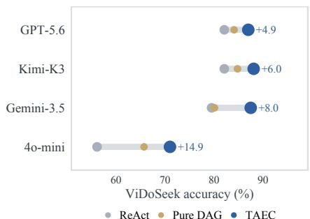

(b) Where the gold page goes  
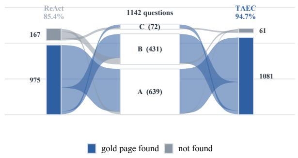  
Figure 6: Two appendix studies whose numbers are in the tables named below. (a) Closed-source backbones, ReAct → TAEC with DAG agent marked, sorted by ReAct accuracy (Table 1); the acting models are GPT-4o-mini, Gemini-3.5-Flash, Kimi-K3 and GPT-5.6-Sol. (b) Matched subsets as a flow: the same 1,142 ViDoSeek questions in the centre, grouped by the behaviour of the two systems (A: both stopped after one search; B: ReAct kept searching while TAEC stopped; C: the remainder), with ribbons carrying each group into “gold page found” or “not found” under ReAct on the left and TAEC on the right.

Table 2: ReAct, unconstrained, ViDoSeek, Gemini-3.5-Flash, grouped by the number of searches the agent issued. “Found, unused” is the share of questions whose gold page reached the context and whose answer is still wrong. Right: the subset whose gold page was already among the first five retrieved pages.
<table><tr><td></td><td colspan="4">All questions</td><td colspan="2"></td><td colspan="2">Gold page found at step 1</td></tr><tr><td>Searches</td><td>n</td><td>Hit</td><td>Post-hit</td><td>Acc.</td><td>Found, unused</td><td>n</td><td>Acc.</td></tr><tr><td>1</td><td>642</td><td>93.8</td><td>96.0</td><td>93.6</td><td>3.7</td><td>602</td><td>96.0</td></tr><tr><td>2</td><td>126</td><td>95.2</td><td>91.7</td><td>89.7</td><td>7.9</td><td>117</td><td>91.5</td></tr><tr><td>3</td><td>71</td><td>80.3</td><td>87.7</td><td>77.5</td><td>9.9</td><td>37</td><td>83.8</td></tr><tr><td>4-5</td><td>84</td><td>75.0</td><td>87.3</td><td>67.9</td><td>9.5</td><td>24</td><td>91.7</td></tr><tr><td>6-8</td><td>92</td><td>63.0</td><td>63.8</td><td>41.3</td><td>22.8</td><td>33</td><td>48.5</td></tr><tr><td>9+</td><td>127</td><td>59.1</td><td>52.0</td><td>35.4</td><td>28.3</td><td>51</td><td>39.2</td></tr></table>

Table 3: ViDoSeek accuracy by question difficulty, Gemini-3.5-Flash. Difficulty is the number of searches unconstrained ReAct issued on that question, so all four systems face the same questions in each row.
<table><tr><td>Searches needed</td><td>n</td><td>Vanilla</td><td>ReAct</td><td>DAG agent</td><td>TAEC</td></tr><tr><td>1</td><td>642</td><td>86.7</td><td>93.6</td><td>91.9</td><td>94.1</td></tr><tr><td>2-3</td><td>197</td><td>78.7</td><td>85.3</td><td>79.7</td><td>86.3</td></tr><tr><td>4-5</td><td>84</td><td>69.0</td><td>67.9</td><td>63.1</td><td>81.0</td></tr><tr><td>6+</td><td>219</td><td>48.4</td><td>37.9</td><td>52.5</td><td>71.7</td></tr></table>

Table 4: The questions on which ReAct kept searching, Gemini-3.5-Flash. The subset is defined by that agent alone, so all five systems answer the same questions: 500 on ViDoSeek, 765 on SlideVQA and 541 on MMLongBench-Doc. Coverage and the four shares are taken over the questions in the subset that carry a reference page, which on MMLongBench-Doc is 532 of the 541. Coverage is the sum of the first two shares. ViDoRAG records no search count, and its coverage is taken over the pages its pipeline records for the question.
<table><tr><td colspan="5"></td><td colspan="4">What became of the gold page (%)</td></tr><tr><td>Benchmark</td><td>System</td><td>Searches</td><td>Coverage</td><td>Found, used</td><td>Found, unused</td><td>Missed, right</td><td></td><td>Missed, wrong</td></tr><tr><td rowspan="5">ViDoSeek</td><td>Vanilla</td><td>1.00</td><td>75.0</td><td>58.8</td><td>16.2</td><td>5.0</td><td></td><td>20.0</td></tr><tr><td>ReAct</td><td>6.00</td><td>74.6</td><td>58.2</td><td></td><td>16.4</td><td>3.4</td><td>22.0</td></tr><tr><td>ViDoRAG</td><td></td><td>76.0</td><td></td><td>61.0</td><td>15.0</td><td>4.4</td><td>19.6</td></tr><tr><td>Pure DAG</td><td>1.27</td><td>68.4</td><td>57.6</td><td></td><td>10.8</td><td>7.4</td><td>24.2</td></tr><tr><td>TAEC</td><td>1.28</td><td>90.8</td><td>76.6</td><td>14.2</td><td></td><td>2.4</td><td>6.8</td></tr><tr><td rowspan="5">SlideVQA</td><td>Vanilla</td><td>1.00</td><td>63.9</td><td>48.2</td><td>15.7</td><td>9.4</td><td></td><td>26.7</td></tr><tr><td>ReAct</td><td>3.00</td><td>63.0</td><td>46.5</td><td></td><td>16.5</td><td>2.9</td><td>34.1</td></tr><tr><td>ViDoRAG</td><td></td><td>57.9</td><td>38.6</td><td></td><td>19.3</td><td>7.7</td><td>34.4</td></tr><tr><td>Pure DAG</td><td>1.49</td><td>59.3</td><td>42.1</td><td></td><td>17.3</td><td>9.9</td><td>30.7</td></tr><tr><td>TAEC</td><td>1.76</td><td>71.0</td><td>57.9</td><td></td><td>13.1</td><td>8.0</td><td>21.0</td></tr><tr><td rowspan="5">MMLongBench-Doc</td><td>Vanilla</td><td>1.00</td><td>32.1</td><td>15.8 21.6</td><td>16.4</td><td>7.5</td><td></td><td>60.3</td></tr><tr><td>ReAct</td><td>3.56</td><td>42.3</td><td></td><td></td><td>20.7</td><td>2.6</td><td>55.1</td></tr><tr><td>ViDoRAG</td><td></td><td>34.6</td><td>11.1</td><td>23.5</td><td></td><td>5.1</td><td>60.3</td></tr><tr><td>Pure DAG</td><td>1.89</td><td>40.2</td><td>22.2</td><td>18.0</td><td></td><td>6.8</td><td>53.0</td></tr><tr><td>TAEC</td><td>2.58</td><td>46.2</td><td>28.8</td><td>17.5</td><td></td><td>5.8</td><td>47.9</td></tr></table>

Table 5: Accuracy decomposed into coverage and evidence use per system, ViDoSeek, Gemini-3.5- Flash. Post-hit accuracy conditions on a quantity each system changes, so it is reported here for completeness and is not compared across rows; the like-for-like comparison is Figure 9.
<table><tr><td>System</td><td>Hit rate</td><td>Post-hit acc.</td><td>Acc. on misses</td><td>Acc.</td></tr><tr><td>Vanilla</td><td>86.6</td><td>84.9</td><td>23.5</td><td>76.7</td></tr><tr><td>ReAct</td><td>85.4</td><td>89.1</td><td>23.4</td><td>79.5</td></tr><tr><td>DAG agent</td><td>84.4</td><td>90.1</td><td>25.8</td><td>80.1</td></tr><tr><td>TAEC</td><td>94.7</td><td>90.6</td><td>31.7</td><td>87.5</td></tr></table>

Table 6: Cost per question, ViDoSeek, Gemini-3.5-Flash, same protocol as Table 1. Cost is what a run actually transmits: images and context are summed over every model call of a question, so a page re-sent on a later call is counted again, and the last column is the largest single call. Wall-clock time is not reported; it is set by concurrency and rate limits rather than by the method.
<table><tr><td>System</td><td>Model calls</td><td>Images</td><td>Context (MB)</td><td>Peak call (MB)</td></tr><tr><td>Vanilla</td><td>1.00</td><td>4.9</td><td>0.22</td><td>0.22</td></tr><tr><td>ReAct</td><td>5.34</td><td>92.8</td><td>3.73</td><td>0.57</td></tr><tr><td>DAG agent</td><td>4.94</td><td>20.0</td><td>0.87</td><td>0.23</td></tr><tr><td>TAEC</td><td>2.91</td><td>14.7</td><td>0.61</td><td>0.22</td></tr></table>

Table 7: Component ablation behind Figure 4, Gemini-3.5-Flash; the substrate and TAEC rows are those of Table 1, and $\Delta$ is against the substrate.
<table><tr><td>Configuration</td><td>Components A M V</td><td colspan="2">ViDoSeek Acc.  $\Delta$ </td><td colspan="2">SlideVQA  $\operatorname { A c c } .$ </td><td colspan="2">MMLongBench-Doc  $\operatorname { A c c } .$   $\Delta$ </td></tr><tr><td>DAG agent (substrate)</td><td></td><td></td><td>80.1</td><td>76.7</td><td></td><td>44.5</td><td></td></tr><tr><td>+ Admission</td><td>√</td><td></td><td>86.3 +6.2</td><td>82.3</td><td>+5.6</td><td>48.2</td><td>+3.7</td></tr><tr><td>+ Exposure</td><td>√</td><td>84.1</td><td>+4.0</td><td>82.8</td><td>+6.1</td><td>47.2</td><td>+2.7</td></tr><tr><td>+ Allocation</td><td></td><td>√</td><td>83.5 +3.4</td><td>82.4</td><td>+5.7</td><td>46.8</td><td>+2.3</td></tr><tr><td>TAEC (A+M+V)</td><td>√ √</td><td>√</td><td>87.5</td><td>+7.4</td><td>83.6</td><td>+6.9 50.1</td><td>+5.6</td></tr></table>

(a) Accuracy reached within a search budget  
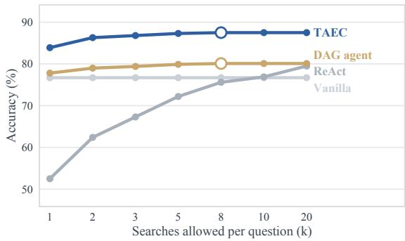

(b) Accuracy against context transmitted  
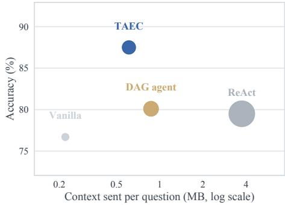  
Figure 7: What a trajectory spends and what the spending buys, ViDoSeek, Gemini-3.5-Flash. (a) The accuracy a system reaches when a question is allowed at most $k$ searches, the numbers of Table 19; a ring marks the smallest budget at which a system already holds all the accuracy it will reach. The substrate and TAEC are saturated by eight searches, while the unmanaged agent is still gaining at twenty and reaches neither. (b) Accuracy against the context a question transmits, the numbers of Table $^ { 6 , }$ with point area proportional to the images sent. TAEC answers eight points above the unmanaged agent while sending a sixth of the context and a sixth of the images.

## D M3RAG, REIMPLEMENTED

M3RAG (Du & Li, 2026) is a published training-free method for visual document questions. A planner decomposes the question into a graph of sub-questions, a seeker retrieves pages for each and re-reads the region that carries the evidence, an answerer drafts a response, and a verifier accepts it or asks for the plan to be continued, refined or rebuilt, for at most seven rounds. The authors release no code, and four of the method’s mechanisms rely on model access that the proprietary acting models do not provide. What we run is therefore M3RAG adapted to closed backbones rather than the published system: the planner and verifier run on the acting model rather than on a separate 7B model, the verifier’s confidence is read from a stated verdict rather than from token probabilities, region re-reading uses a bounding box the model reports rather than patch-embedding selection, and evidence ranking uses model-assigned relevance rather than a shared embedding space. Several settings the paper leaves open are ours as well. We therefore report this adapted implementation here rather than in Table 1, run against the same index, budgets and judge as every system there.

Each of the four is replaced by the closest equivalent available. The planner and verifier, which the paper runs on a separate Mistral-7B, run on the acting model. The verifier’s confidence, defined from token probabilities, is read from a verdict and a confidence the model states. Region re-reading, which selects 144 visual tokens by patch embedding, asks the model for the bounding box of the evidence and crops it at the pixel budget of 144 tokens. Evidence ranking in a shared embedding space uses the relevance the model assigns when it describes each item. The settings the paper states are kept: five candidate pages per query, 144-token regions and seven rounds. For those it leaves open we use at most six sub-questions, an evidence pool of eight, a confidence threshold of 0.5, and replanning after two rounds in which confidence moves by less than 0.05.

Table 8: Gemini-3.5-Flash. The other five rows are those of Table 1; best and second best per column.
<table><tr><td>System</td><td>ViDoSeek</td><td>SlideVQA</td><td>MMLongBench-Doc</td></tr><tr><td>Vanilla</td><td>76.7</td><td>79.6</td><td>40.1</td></tr><tr><td>ReAct</td><td>79.5</td><td>77.2</td><td>42.4</td></tr><tr><td>ViDoRAG</td><td>79.7</td><td>72.5</td><td>31.5</td></tr><tr><td>M3RAG (reimplemented)</td><td>82.5</td><td>81.5</td><td>47.6</td></tr><tr><td>DAG agent</td><td>80.1</td><td>76.7</td><td>44.5</td></tr><tr><td>TAEC</td><td>87.5</td><td>83.6</td><td>50.1</td></tr></table>

On Gemini-3.5-Flash M3RAG is the strongest baseline on all three benchmarks, ahead of both the substrate and ViDoRAG. TAEC leads it by 5.0, 2.1 and 2.5 points.

Table 9: M3RAG against TAEC on the four acting models of Table 1, under the same index, budgets and judge, and on the full benchmark in every cell. MMLongBench-Doc is scored on the 847 answerable questions, as in Table 1.
<table><tr><td></td><td colspan="2">ViDoSeek</td><td colspan="2">SlideVQA</td><td colspan="2">MMLongBench-Doc</td></tr><tr><td>Backbone</td><td>M3RAG</td><td>TAEC</td><td>M3RAG</td><td>TAEC</td><td>M3RAG</td><td>TAEC</td></tr><tr><td>Gemini-3.5-Flash</td><td>82.5</td><td>87.5</td><td>81.5</td><td>83.6</td><td>47.6</td><td>50.1</td></tr><tr><td>Kimi-K3</td><td>80.7</td><td>88.1</td><td>81.5</td><td>83.8</td><td>44.5</td><td>45.8</td></tr><tr><td>GPT-5.6-Sol</td><td>78.4</td><td>87.0</td><td>77.3</td><td>82.2</td><td>44.3</td><td>42.6</td></tr><tr><td>GPT-4o-mini</td><td>49.6</td><td>71.0</td><td>44.9</td><td>62.0</td><td>18.7</td><td>17.7</td></tr></table>

Table 9 extends the comparison to the other three acting models and repeats Gemini-3.5-Flash for reference. TAEC is ahead in ten of the twelve comparisons, by 1.3 to 21.4 points, and behind on MMLongBench-Doc with GPT-5.6-Sol and GPT-4o-mini, by 1.7 and 1.0.

The two exceptions are not the same result. MMLongBench-Doc annotates 244 of its 1,091 questions as unanswerable, and Table 1 scores the 847 that carry an answer. Declining an unanswerable question is a capability none of the three components addresses, and M3RAG’s verifier supplies it unevenly: on those 244 it is correct on 44.3% with GPT-5.6-Sol against 16.8% with Gemini-3.5-Flash, where TAEC scores 31.4% and 35.8%. Scored over all 1,091 questions (Table 11), the GPT-4o-mini result therefore reverses and TAEC leads by 1.1 points, while the GPT-5.6-Sol deficit widens to 4.2; on the other two backbones TAEC leads by 6.2 and 0.9. The GPT-5.6-Sol deficit is thus a deficit on answerable questions and not an artefact of the question set. The main evaluation uses the benchmark’s annotated answerable subset; Appendix E.1 additionally reports results on the full set.

## E RESULTS BY QUESTION TYPE

Table 10 breaks the main table down by the question types the benchmarks annotate. Two observations follow from it, both on Gemini-3.5-Flash, where every cell is filled.

The gain is not confined to multi-hop questions. On ViDoSeek, TAEC improves over the substrate by 9.2 points on single-hop questions (77.8 → 87.0) and by 5.0 on multi-hop ones (83.1 → 88.1). Single-hop questions are those a single well-chosen page answers, and they are where admitting the right page is most consequential; multi-hop questions start from a higher base because several pages are retrieved anyway. The same ordering holds on Kimi-K3 and GPT-4omini. The components therefore contribute not only the ability to carry a long trajectory, but also the ability to spend the first retrieval well.

The gain is largest where the evidence is structured. On MMLongBench-Doc the improvement over the substrate is +10.4 on text evidence (41.8 → 52.2), +9.4 on charts (55.1 → 64.5) and +4.2 on tables (69.2 → 73.4), but only +3.3 on figure evidence (34.6 → 37.9). Figure questions are the ones whose answer depends on reading a picture rather than on which pages are present, so coordination has less to act on; every system is weakest there.

## E.1 MMLONGBENCH-DOC WITH ITS UNANSWERABLE QUESTIONS

A quarter of MMLongBench-Doc is annotated Not answerable: the question is posed over a document that does not contain the answer, and a system is correct when it declines. That is a judgement about the absence of evidence, and none of the three components acts on it; they decide what enters the context, what stays there and how finely it is drawn. The tables of the main text therefore score the 847 questions the benchmark annotates as answerable. The subset is the benchmark’s own label rather than a threshold of ours, and its evidence-source counts reproduce the published ones exactly. Table 11 gives the full set of 1,091 questions.

On the full set, TAEC leads on three backbones, while M3RAG leads by 4.2 percentage points with GPT-5.6-Sol. The margin over the substrate is narrower here, 1.2, 1.7, 0.6 and 1.4 points, because on an unanswerable question the correct response is to decline, which none of the components is designed to encourage.

Table 10: Accuracy by question type, same runs and judging batch as Table 1. ViDoSeek is split by hop count; MMLongBench-Doc by the modality of the evidence, counting the questions annotated with exactly one evidence source, so questions drawing on several modalities and the layout-only ones enter only “All”, which is taken over the 847 answerable questions; SlideVQA carries no question-type annotation. Best per column within each backbone block in bold. † our reimplemen tation, for the reasons given in Appendix D.
<table><tr><td rowspan="2">Backbone</td><td rowspan="2">System</td><td colspan="3">ViDoSeek</td><td>SlideVQA</td><td colspan="5">MMLongBench-Doc</td></tr><tr><td></td><td>Single Multi</td><td>All</td><td>All</td><td>|Text Table</td><td></td><td></td><td>Chart Figure</td><td>All</td></tr><tr><td rowspan="6">Gemini-3.5-Flash</td><td>Vanilla</td><td>71.8</td><td>83.1</td><td>76.7</td><td>79.6</td><td>41.0</td><td>49.7</td><td>55.1</td><td>35.2</td><td>40.1</td></tr><tr><td>ReAct</td><td>76.3</td><td>83.7</td><td>79.5</td><td>77.2</td><td>42.5</td><td>60.1</td><td>60.7</td><td>29.1</td><td>42.4</td></tr><tr><td>ViDoRAG</td><td>77.2</td><td>82.9</td><td>79.7</td><td>72.5</td><td>36.6</td><td>34.3</td><td>40.2</td><td>29.1</td><td>31.5</td></tr><tr><td>M3RAG†</td><td>81.4</td><td>83.9</td><td>82.5</td><td>81.5</td><td>50.0</td><td>67.8</td><td>61.7</td><td>33.5</td><td>47.6</td></tr><tr><td>DAG agent</td><td>77.8</td><td>83.1</td><td>80.1</td><td>76.7</td><td>41.8</td><td>69.2</td><td>55.1</td><td>34.6</td><td>44.5</td></tr><tr><td>TAEC</td><td>87.0</td><td>88.1</td><td>87.5</td><td>83.6</td><td>52.2</td><td>73.4</td><td>64.5</td><td>37.9</td><td>50.1</td></tr><tr><td rowspan="6">Kimi-K3</td><td>Vanilla</td><td>81.7</td><td>81.9</td><td>81.8</td><td>78.0</td><td>34.3</td><td>39.2</td><td>44.9</td><td>28.0</td><td>31.8</td></tr><tr><td>ReAct</td><td>82.3</td><td>81.9</td><td>82.1</td><td>82.0</td><td>38.8</td><td>45.5</td><td>46.7</td><td>29.7</td><td>36.5</td></tr><tr><td>ViDoRAG</td><td>77.8</td><td>84.7</td><td>80.8</td><td>74.5</td><td>37.3</td><td>46.9</td><td>52.3</td><td>30.8</td><td>37.2</td></tr><tr><td>M3RAG†</td><td>80.9</td><td>80.5</td><td>80.7</td><td>81.5</td><td>44.8</td><td>60.1</td><td>56.1</td><td>36.3</td><td>44.5</td></tr><tr><td>DAG agent</td><td>85.4</td><td>83.9</td><td>84.8</td><td>80.9</td><td>45.5</td><td>53.1</td><td>60.7</td><td>36.3</td><td>43.9</td></tr><tr><td>TAEC</td><td>89.8</td><td>85.9</td><td>88.1</td><td>83.8</td><td>47.8</td><td>56.6</td><td>61.7</td><td>36.3</td><td>45.8</td></tr><tr><td rowspan="6">GPT-5.6-Sol</td><td>Vanilla</td><td>80.9</td><td>83.5</td><td>82.0</td><td>79.3</td><td>39.6</td><td>48.3</td><td>46.7</td><td>34.6</td><td>38.1</td></tr><tr><td>ReAct</td><td>80.9</td><td>83.7</td><td>82.1</td><td>81.0</td><td>41.8</td><td>42.0</td><td>52.3</td><td>33.5</td><td>39.1</td></tr><tr><td>ViDoRAG</td><td>78.0</td><td>85.5</td><td>81.3</td><td>78.3</td><td>35.8</td><td>51.0</td><td>57.9</td><td>28.0</td><td>37.8</td></tr><tr><td>M3RAG†</td><td>77.4</td><td>79.7</td><td>78.4</td><td>77.3</td><td>40.3</td><td>64.3</td><td>57.9</td><td>34.6</td><td>44.3</td></tr><tr><td>DAG agent</td><td>82.6</td><td>85.9</td><td>84.1</td><td>77.7</td><td>43.3</td><td>40.6</td><td>55.1</td><td>32.4</td><td>38.3</td></tr><tr><td>TAEC</td><td>87.8</td><td>85.9</td><td>87.0</td><td>82.2</td><td>47.0</td><td>49.0</td><td>54.2</td><td>36.8</td><td>42.6</td></tr><tr><td rowspan="6">GPT-4o-mini</td><td>Vanilla</td><td>56.4</td><td>62.8</td><td>59.2</td><td>61.9</td><td>16.4</td><td>14.0</td><td>18.7</td><td>19.8</td><td>15.6</td></tr><tr><td>ReAct</td><td>51.6</td><td>62.0</td><td>56.1</td><td>59.3</td><td>17.2</td><td>13.3</td><td>15.0</td><td>18.1</td><td>15.2</td></tr><tr><td>ViDoRAG</td><td>60.9</td><td>72.2</td><td>65.8</td><td>58.7</td><td>12.7</td><td>11.9</td><td>20.6</td><td>17.0</td><td>14.1</td></tr><tr><td>M3RAG†</td><td>48.4</td><td>51.3</td><td>49.6</td><td>44.9</td><td>23.1</td><td>24.5</td><td>18.7</td><td>18.7</td><td>18.7</td></tr><tr><td>DAG agent</td><td>63.7</td><td>68.2</td><td>65.7</td><td>56.6</td><td>18.7</td><td>9.8</td><td>15.9</td><td>18.7</td><td>14.3</td></tr><tr><td>TAEC</td><td>71.6</td><td>70.2</td><td>71.0</td><td>62.0</td><td>22.4</td><td>12.6</td><td>19.6</td><td>20.9</td><td>17.7</td></tr></table>

Table 11: MMLongBench-Doc over all 1,091 questions, including the 244 annotated unanswerable, same runs and judging batch as Table 1. Best per column in bold. † our reimplementation, for the reasons given in Appendix D.
<table><tr><td>System</td><td>Gemini-3.5-Flash</td><td>Kimi-K3</td><td>GPT-5.6-Sol</td><td>GPT-4o-mini</td></tr><tr><td>Vanilla</td><td>36.8</td><td>32.3</td><td>31.5</td><td>22.5</td></tr><tr><td>ReAct</td><td>33.3</td><td>32.4</td><td>33.5</td><td>16.9</td></tr><tr><td>ViDoRAG</td><td>28.0</td><td>33.8</td><td>34.7</td><td>15.6</td></tr><tr><td>M3RAG†</td><td>40.7</td><td>42.0</td><td>44.3</td><td>24.1</td></tr><tr><td>DAG agent</td><td>45.7</td><td>41.2</td><td>39.5</td><td>23.8</td></tr><tr><td>TAEC</td><td>46.9</td><td>42.9</td><td>40.1</td><td>25.2</td></tr></table>

## F A TRAJECTORY IN DETAIL

A single question illustrates the role of the requirement state inside the loop. It asks what percentage of kidney transplant patients were male, and the answer, 57%, sits on page 7 of a national renal replacement registry report. Under the same retriever and the same budget, no baseline ever retrieves that page, and no single retrieval could have: the page is never in a top-3 result for any query any system issues, and the first search, which is the question itself for every system but ReAct, returns the same three pages to all of them. Vanilla states that the retrieved pages do not give the breakdown and then estimates 60% anyway; ReAct issues five searches and returns nothing; the DAG agent reaches a different page of the same report, its summary, and reads 55% off it, which is the figure for all patients rather than for the transplant group. The pages the three trajectories retrieve separate them along the same axis on which the systems differ. ReAct’s five searches are five distinct rewrites, and they pull fourteen pages that are only five distinct ones: holding no record of the pages it has already retrieved, which the graph-based systems carry, its rewrites keep returning the page the retriever ranks first for the question’s own wording. The DAG agent holds that record and repeats nothing, three searches for six distinct pages, but with no record of what is still unresolved its queries wander inside the report and stop at the summary. TAEC holds both. Its five searches pull fourteen distinct pages; it admits 25 of the 48 candidates it sees across four admission calls scored on the four open requirements, admitting candidates whose requirement coverage averages 0.35 against 0.25 in the pool they are drawn from; it carries five memories under an age-decayed exposure that compresses the one it has verified as resolved, so that five of the fourteen pages are still visible as images when the answer is written, and spends 687K pixels over those five. Page 7 arrives eleventh, on a query written from the slots that are still open, and the answer cites the transplant group of 461 patients. The search count is matched with ReAct, so what separates them is not how much they search but what each search is written against. This is the coverage group of Figure 5(b) at the scale of a single question.

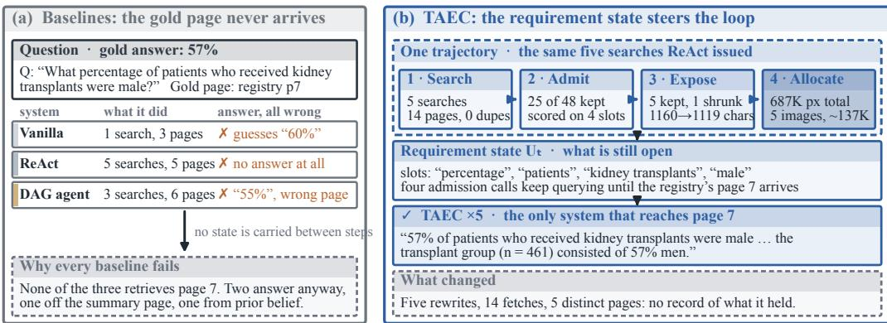  
Figure 8: One ViDoSeek question, Kimi-K3, from the runs behind Table 1. The answer is on page 7 of a national renal registry report, and TAEC is the only system that retrieves it. (a) the three baselines: none reaches the page, and two answer anyway. (b) the TAEC trajectory, the same five searches ReAct issued: admission keeps 25 of the 48 candidates it sees across four calls scored on requirement coverage; exposure ranks the five memories it carries by an energy that decays with their age and compresses the one it has verified as resolved, so the carried graph is sent at 1119 characters rather than 1160; allocation spends 687K pixels over the five images exposure keeps visible; and the requirement state carried across turns provides the basis for the next query.

## G CONTEXT PRESSURE WITH RETRIEVAL HELD FIXED

Section 4.2 reads accuracy against the depth a trajectory reaches, and depth and difficulty move together there. This study separates them. Retrieval is run once and then frozen: every configuration answers the same questions from the same retrieved pages, with the annotated evidence page present in the context throughout. The only quantity that varies is the amount of neutral text placed alongside it, drawn from documents unrelated to the question and carrying no evidence bearing on it.

Table 12: The substrate on ViDoSeek, Gemini-3.5-Flash, with retrieval frozen and the gold page in the context in every column.
<table><tr><td>Neutral tokens added</td><td>0</td><td>16K</td><td>32K</td></tr><tr><td>Accuracy</td><td>78.8</td><td>74.8</td><td>73.6</td></tr></table>

Accuracy falls by 4.0 points over the first 16K tokens and by 5.2 over 32K. Nothing about the evidence changes across the row: the same pages are in the context, rendered the same way, and the question is the same. What changes is how much else the model reads before it reaches them.

This is the half of the diagnosis that the depth reading cannot supply. A system that searches more also retrieves more, so an accuracy decline with depth admits a retrieval explanation; here retrieval is held constant by construction and the decline survives. The evidence a question needs can be present and still be read less reliably, which is the condition the three components are introduced to manage.

## H WHERE THE MULTI-STEP BASELINES LOSE

Table 1 has four columns in which ReAct scores below single-pass retrieval. Table 13 locates the loss. Each benchmark is split by the number of searches ReAct issued on that question, an index of its own behaviour, and single-pass retrieval is scored on the same two question sets, so the two systems always answer the same questions.

Table 13: ReAct against single-pass retrieval on the same questions, split by the depth ReAct chose. ∆ is ReAct minus Vanilla. The rows are the four cells of Table 1 where ReAct falls below single-pass retrieval, together with three where it does not: Gemini-3.5-Flash on ViDoSeek and MMLongBench-Doc, and Kimi-K3 on SlideVQA.
<table><tr><td rowspan="2">Benchmark</td><td rowspan="2">Backbone</td><td colspan="4">ReAct stopped after one search</td><td colspan="4">ReAct searched again</td></tr><tr><td>n</td><td>ReAct Vanilla</td><td></td><td>∆</td><td>n</td><td>ReAct Vanilla</td><td></td><td>∆</td></tr><tr><td rowspan="2">ViDoSeek</td><td>Gemini-3.5-Flash</td><td>642</td><td>93.5</td><td>86.8</td><td>+6.7</td><td>500</td><td>61.6</td><td>63.8</td><td>-2.2</td></tr><tr><td>GPT-4o-mini</td><td>910</td><td>62.2</td><td>63.8</td><td>-1.6</td><td>232</td><td>32.3</td><td>40.9</td><td>-8.6</td></tr><tr><td rowspan="3">SlideVQA</td><td>Gemini-3.5-Flash</td><td>1450</td><td>91.8</td><td>91.2</td><td>+0.6</td><td>765</td><td>49.4</td><td>57.6</td><td>-8.2</td></tr><tr><td>Kimi-K3</td><td>1762</td><td>88.6</td><td>86.2</td><td>+2.4</td><td>453</td><td>56.3</td><td>46.1</td><td>+10.2</td></tr><tr><td>GPT-4o-mini</td><td>1827</td><td>62.6</td><td>65.7</td><td>-3.1</td><td>388</td><td>44.1</td><td>44.3</td><td>-0.3</td></tr><tr><td rowspan="2">MMLongBench-Doc</td><td>Gemini-3.5-Flash</td><td>306</td><td>74.8</td><td>69.9</td><td>+4.9</td><td>541</td><td>24.0</td><td>23.3</td><td>+0.7</td></tr><tr><td>GPT-4o-mini</td><td>583</td><td>18.2</td><td>19.4</td><td>-1.2</td><td>264</td><td>8.7</td><td>7.2</td><td>+1.5</td></tr></table>

Two readings follow. First, the large deficits are a property of the deeper half. Where ReAct answered after one search it is within a few points of single-pass retrieval and often above it, which is expected, since on those questions the two systems do nearly the same thing. Where it searched again it loses 8.6 points on ViDoSeek with GPT-4o-mini and 8.2 on SlideVQA with Gemini-3.5- Flash, so the additional searches neither recovered evidence the first one missed nor left the rest of the question untouched. The cost measurements of Table 6 give the mechanism a size: ReAct re-sends its observation history on every call and reaches 93 images per question, and accuracy falls with the number of images in context even when the gold page is already among them.

Second, the sign is not a property of the method alone. On Kimi-K3 the same loop gains 10.2 points on the deeper half of SlideVQA. What separates the rows is whether the acting model both issues useful follow-up searches and still reads what accumulates; GPT-4o-mini fails the second condition on ViDoSeek and SlideVQA, and the open-weight backbones of Appendix J fail the first as well. An unmanaged trajectory therefore leaves the outcome to the acting model, which is the variance the substrate and the components are introduced to remove.

## I HOW THE ACTING MODEL DETERMINES THE SIZE OF THE GAIN

Two abilities of an acting model govern how much the components add to it, and the substrate separates them. Every substrate row runs one body of code, one retriever and one budget, so a difference between its columns is an ability of the model alone.

The first is perceptual: converting a page placed in front of it into an answer. It is measured as accuracy on the questions the model answered after a single search whose gold page was in the context. The second is agentic: judging, at each step of a trajectory, whether what has been accumulated answers the question (Jiang et al., 2023; Asai et al., 2024). That judgement is what a multi-step system asks of the acting model at every turn, and the trajectory it produces is where the judgement becomes observable. It fails in two directions. A model commits to an answer on evidence that doe not support it, which appears as a trajectory ended with no gold page in the context. A model fails to recognise evidence that already answers the question, which appears as a further search on a question a single retrieval had answered. Table 14 reports the perceptual ability and both directions of the agentic one, together with the accuracy gaps of Table 1, each averaged over the three benchmarks.

Table 14: Each column describes one acting model, averaged over the three benchmarks of Table 1. The first block is measured on the substrate, where the four columns differ in nothing but the model. Reads a retrieved gold page is accuracy on the single-search questions whose gold page reached the context. The two agentic rows are the two directions in which a sufficiency judgement fails: commits without a gold page is the share of all questions answered after one search with no gold page in the context, and over-searches an answered question is the share of the questions whose gold page a single retrieval already reached on which the system issued a further search.
<table><tr><td></td><td>Gemini-3.5-Flash</td><td>Kimi-K3</td><td>GPT-5.6-Sol</td><td>GPT-4o-mini</td></tr><tr><td>Perceptual ability, on the substrate Reads a retrieved gold page</td><td>85.0</td><td>85.3</td><td>82.5</td><td>64.2</td></tr><tr><td>Agentic ability, on the substrate Commits without a gold page</td><td>22.6</td><td>12.2</td><td>14.8</td><td>9.5</td></tr><tr><td>Over-searches an answered question</td><td>6.0</td><td>15.5</td><td>12.8</td><td>47.9</td></tr><tr><td>Searches per question</td><td>1.33</td><td>1.72</td><td>1.62</td><td>3.10</td></tr><tr><td>Agentic ability, under coordination</td><td></td><td></td><td></td><td></td></tr><tr><td>Commits without a gold page</td><td>9.2</td><td>9.3</td><td>8.2</td><td>6.5</td></tr><tr><td>Over-searches an answered question</td><td>6.0</td><td>6.1</td><td>6.6</td><td>40.0</td></tr><tr><td>Searches per question</td><td>1.54</td><td>1.72</td><td>1.84</td><td>2.42</td></tr><tr><td></td><td></td><td></td><td></td><td></td></tr><tr><td>Accuracy against the row below on the trajectory axis</td><td></td><td></td><td></td><td></td></tr><tr><td>Single-pass accuracy</td><td>65.5</td><td>63.9</td><td>66.5</td><td>45.6</td></tr><tr><td>ReAct — Vanilla</td><td>+0.9</td><td>+3.0</td><td>+0.9</td><td>-2.0</td></tr><tr><td>DAG agent – Vanilla</td><td>+1.6</td><td>+6.0</td><td>+0.2</td><td>0.0</td></tr><tr><td>TAEC – Vanilla</td><td>+8.3</td><td>+8.7</td><td>+4.1</td><td>+4.7</td></tr><tr><td>TAEC – DAG agent</td><td>+6.6</td><td>+2.7</td><td>+3.9</td><td>+4.7</td></tr></table>

The three strongest backbones read at one level and judge sufficiency at three different ones. Perceptual accuracy is 85.0, 85.3 and 82.5, so what separates their columns is the agentic ability alone, and each errs in its own direction. Gemini-3.5-Flash commits early on 22.6% of questions and oversearches an answerable one on 6.0%; Kimi-K3 reverses both figures, at 12.2 and 15.5; GPT-5.6-Sol lies between them at 14.8 and 12.8.

Coordination narrows both directions to a common level: premature commitment falls to 9.2, 9.3 and 8.2, and unrecognised sufficiency to 6.0, 6.1 and 6.6. Two quantities that span 10.4 and 9.5 points across these backbones close to about one point each. The components leave the judgement itself with the acting model and change the evidence it is made on, which is why the accuracy they add orders as the size of the repair rather than as the capability of the model: +6.6 on Gemini-3.5- Flash, whose larger error falls furthest, and +3.9 and +2.7 on GPT-5.6-Sol and Kimi-K3, which begin closer to that level.

GPT-4o-mini is limited in both abilities at once, and shows what each limit costs. It reads a retrieved gold page twenty points below the others, at 64.2, which bounds what any improvement in presentation can buy. Its sufficiency judgement is also the one that responds least to the evidence it is made on: it searches again on 47.9% of the questions a single retrieval had already answered, three times the rate of any backbone above, and coordination moves that to 40.0 against falls to near 6 elsewhere. The components still add 4.7 points to it, drawn from the admission of evidence rather than from the course of the trajectory.

Coordination also lengthens the trajectory, on Gemini-3.5-Flash from 1.33 searches to 1.54, and the evidence gain holds at a matched length. Among the questions each system answered after a single search, a gold page is in the context for 96.4% of them under coordination against 85.9% on the substrate on ViDoSeek, and 92.7% against 80.4% on SlideVQA, with no more pages in context in either case.

A model that reads well and whose sufficiency judgement errs towards committing early is the case a coordination layer is for, and Gemini-3.5-Flash is the clearest instance of it among the four. The open-weight backbone of Appendix J extends the direction GPT-4o-mini already marks. On Qwen2.5-VL-7B that judgement is close to detached from the evidence: the unmanaged loop costs 28.8 points on ViDoSeek and 23.2 on SlideVQA, it answers 24.2% of ViDoSeek questions without searching at all, and under coordination it continues searching on 58.1% of questions where Gemini 3.5-Flash continues on 6.2%. The components add 2.4 points to the substrate there, and single-pass retrieval remains the strongest configuration for every multi-step system on it.

The two abilities bound the gain from two sides. Perception sets what an improved presentation of evidence can be worth, and the sufficiency judgement sets how much of that worth a trajectory keeps. These components govern the evidence on which that judgement is made, and the judgement stays with the acting model.

Three further patterns hold across the cells themselves. Among the methods of Table 1, TAEC is ahead in every cell. The margin over single-pass retrieval is largest on ViDoSeek and MMLongBench-Doc, the two benchmarks whose questions most often need more than one search, and smallest on SlideVQA, whose questions are usually answered from one slide. The spread of the ViDoRAG row across backbones is of the same order, which is consistent with a multi-agent workflow that also carries its retrieved pages forward.

## J OPEN-WEIGHT BACKBONES

Every number in the main text uses a proprietary API backbone. This appendix repeats the protocol on two open-weight ones, both to report results that others can reproduce without an API and to give the limitation stated in the conclusion its evidence. The finding is that the components require an acting model able to run its own trajectory, and that this is a different property from reading a page well.

Deployment. Qwen2.5-VL-7B-Instruct is served locally with vLLM on two NVIDIA A100-80GB GPUs, tensor parallel 2, native tool calling, at most ten images per prompt; the retrieval service runs on the same machine. Every other setting, including the retriever, the judge, the step and visual budgets and the prompts, is identical to the main protocol (Section 4.1). The RL-trained VRAG-RL checkpoint and Qwen3-VL-4B-Instruct are served the same way.

## J.1 RESULTS ON OPEN-WEIGHT BACKBONES

Table 15: Accuracy on open-weight backbones, all rows judged with the prompt of Table 1 and run under the same harness; as in Table 1, MMLongBench-Doc is scored on its 847 answerable questions. ViDoRAG was run on Qwen3-VL-4B only. The VRAG-RL row uses the released checkpoint as the acting model in our harness; its own loop does not transfer to our tool interface, which accounts for the value in the ReAct column. † our reimplementation, for the reasons given in Appendix D; its planner and verifier run on the acting model, which is what the Qwen2.5-VL-7B row reflects.
<table><tr><td>Backbone</td><td>Benchmark</td><td>Vanilla</td><td>ReAct</td><td>ViDoRAG</td><td>M3RAG†</td><td>DAG agent</td><td>TAEC</td></tr><tr><td rowspan="2">Qwen2.5-VL-7B</td><td>ViDoSeek</td><td>67.9</td><td>39.1</td><td></td><td>22.1</td><td>63.9</td><td>66.3</td></tr><tr><td>SlideVQA</td><td>57.0</td><td>33.8</td><td></td><td></td><td>55.3</td><td>55.4</td></tr><tr><td rowspan="3">Qwen3-VL-4B</td><td>ViDoSeek</td><td>68.1</td><td>63.4</td><td>70.2</td><td>58.1</td><td>68.0</td><td>71.5</td></tr><tr><td>SlideVQA</td><td>58.3</td><td>59.0</td><td>62.8</td><td>51.5</td><td>60.5</td><td>60.4</td></tr><tr><td>MMLongBench-Doc</td><td>15.0</td><td>15.8</td><td>4.7</td><td>14.5</td><td>14.8</td><td>16.1</td></tr><tr><td>VRAG-RL 7B (RL)</td><td>ViDoSeek</td><td></td><td>12.7</td><td></td><td></td><td>58.0</td><td>58.7</td></tr></table>

Two readings, and they point in opposite directions. The components do add to the substrate here, by 2.4 points on ViDoSeek and 0.7 on the RL-tuned checkpoint, so the operators themselves are not inert on a small model. But single-pass retrieval is the strongest configuration on both benchmarks, and the reason is visible in how the trajectories run rather than in how the pages are read. As ReAct, this backbone answers 24.2% of ViDoSeek questions without issuing a retrieval at all, against under

1% for every proprietary backbone in Table 1; under TAEC it continues searching on 58.1% of questions, where Gemini-3.5-Flash continues on 6.2%.

The newer and smaller Qwen3-VL-4B behaves differently. TAEC is the strongest configuration on ViDoSeek and MMLongBench-Doc; on SlideVQA ViDoRAG leads, and TAEC is one question behind the substrate. The model seldom continues searching: under TAEC it answers 97.4% of Vi-DoSeek questions after one search, 84.8% of SlideVQA and 62.2% of MMLongBench-Doc. What the components change on this backbone is therefore mainly which pages the first search admits, and the gain is largest on the benchmark where that search decides the most, ViDoSeek.

Table 16 prices that. It keeps only the questions a single search already answered in the sense that matters, those whose annotated page single-pass retrieval retrieved, and groups them by how many searches TAEC then issued. Single-pass accuracy is almost flat down the table, so the groups are of comparable difficulty; ours falls with every additional search.

Table 16: Qwen2.5-VL-7B on the 989 ViDoSeek questions whose annotated page single-pass retrieval reached, grouped by the number of searches TAEC issued on them. The evidence was present after one search in every row.
<table><tr><td>Searches TAEC issued</td><td>n</td><td>Vanilla</td><td>TAEC</td><td>Δ</td></tr><tr><td>1</td><td>442</td><td>80.3</td><td>78.7</td><td>-1.6</td></tr><tr><td>2</td><td>139</td><td>76.3</td><td>71.2</td><td>-5.1</td></tr><tr><td>3-4</td><td>178</td><td>76.4</td><td>65.7</td><td>-10.7</td></tr><tr><td>5+</td><td>230</td><td>69.6</td><td>62.2</td><td>-7.4</td></tr></table>

The evidence was in the context after the first search in all four rows, and the trajectory kept going. That is a decision the components do not make: admission, exposure and allocation shape what the acting model is shown, and stopping is left to the model. On a backbone that stops when it should, the same three components are worth 6.1 points over single-pass retrieval on the corresponding subset; on this one the trajectory spends what they win.

## J.2 TRAJECTORY DEPTH AND COMPONENT FOOTPRINT ON AN OPEN-WEIGHT BACKBONE

The room to recover is larger here and the recovery does not follow: averaged over the benchmarks the components add 0.4 points against 2.7 to 6.6 on the closed-source backbones of Table 14, because a model that answers a quarter of questions without searching is not in a position to use a better-managed trajectory.

## J.3 COMPARISON WITH RL-TRAINED SYSTEMS

TAEC is training-free and is compared in the main text only against training-free systems. The recent RL-trained visual RAG agents, VRAG-RL (Wang et al., 2025b), VISOR (Shen et al., 2026) and VimRAG (Wang et al., 2026a), train a 3B–8B policy to search, crop and answer, and report on Qwen2.5-VL-7B. They differ from TAEC in what is being improved: RL changes the policy that decides what to search and when to stop; TAEC changes what the policy is shown, how its memory is exposed and where its pixels go, and leaves the policy fixed. The two therefore act on the two abilities Appendix I separates, steering a trajectory and reading what accumulates, and this backbone is the one whose first ability fails. Table 17 places both on it.

Two observations. First, the RL systems’ gains come from a trained search policy, and against the strongest training-free system in the table they range from 2.6 points behind to 5.5 ahead, at a training cost TAEC does not pay. Second, composition is possible here but small: on the released checkpoint the coordination layer adds 0.7 points over the same checkpoint on the bare substrate. The reading that fits the rest of this appendix is that training the search policy addresses one of the two abilities a coordination layer needs from its acting model and leaves the other where it was. The checkpoint is a 7B model throughout, and what it reads off a page does not change when its policy is trained; a layer that improves how evidence is presented can only be worth what the model can then read. We report the figure as the composition we measured on the one public checkpoint available, not as the size of the effect in general.

Table 17: Qwen2.5-VL-7B on ViDoSeek. Published rows are taken from the VISOR table and use its judge, retriever and page collection; ours use the protocol of Table 1. The two blocks are indicative of what each line of work reports on this backbone and are not comparable cell by cell. The bottom block uses the released VRAG-RL checkpoint as the acting model in our harness; its own ReAct-style loop does not transfer to our tool interface, which accounts for the low value in the first row.
<table><tr><td>System</td><td>Training</td><td>ViDoSeek</td><td>Source</td></tr><tr><td>Vanilla</td><td>none</td><td>32.9</td><td>Shen et al. (2026)</td></tr><tr><td>ReAct</td><td>none</td><td>33.9</td><td>Shen et al. (2026)</td></tr><tr><td>ReAct</td><td>none</td><td>39.1</td><td>ours</td></tr><tr><td>ViDoRAG</td><td>none</td><td>69.0</td><td>Shen et al. (2026)</td></tr><tr><td>M3RAG</td><td>none</td><td>69.4</td><td>Shen et al. (2026)</td></tr><tr><td>TAEC</td><td>none</td><td>66.3</td><td>ours</td></tr><tr><td>VRAG-RL</td><td>RL</td><td>66.8</td><td>Shen et al. (2026)</td></tr><tr><td>EVisRAG</td><td>RL</td><td>69.8</td><td>Shen et al. (2026)</td></tr><tr><td>VISOR</td><td>RL</td><td>74.9</td><td>Shen et al. (2026)</td></tr><tr><td>VRAG-RL checkpoint as ReAct</td><td>RL</td><td>12.7</td><td>ours</td></tr><tr><td>VRAG-RL checkpoint on substrate</td><td>RL</td><td>58.0</td><td>ours</td></tr><tr><td>VRAG-RL checkpoint + TAEC</td><td> $\mathrm { R L + T A E C }$ </td><td>58.7</td><td>ours</td></tr></table>

Third, what the table does not establish. The two blocks are produced by different judges, retrievers and page collections, so no row in one is an estimate of what the other would score under its conditions, and we make no claim that coordination is worth less than a trained search policy. The backbone the RL literature reports on is the one backbone in this paper whose trajectory control fails, and on it the quantity a coordination layer improves has little left to act through: by Table 16 the trajectory has already spent what the components win before the answer is generated. A comparison drawn here would measure the value of training that control, which is not in question, rather than the value of coordinating evidence, which is what the rest of the paper measures on backbones where control holds. The two approaches are addressed to different halves of the same problem, and this backbone is not the setting in which to weigh one against the other.

## K RETRIEVER CONTROL

Every table in the paper holds the retriever fixed, which leaves open whether the components depend on the one we chose. Table 18 repeats three systems on retrievers of different strength and kind: the dense index of the main protocol, a BM25 index over page text, and a hybrid that adds link structure to the dense scores.

Table 18: The same three systems on retrievers of different strength, ViDoSeek, Gemini-3.5-Flash, same judging batch as the main tables. The last column is TAEC minus the stronger baseline in the row.
<table><tr><td>Retriever</td><td>Vanilla</td><td>DAG agent</td><td>TAEC</td><td> $\Delta$ </td></tr><tr><td>Dense (main)</td><td>76.7</td><td>80.1</td><td>87.5</td><td> $+ 7 . 4$ </td></tr><tr><td>BM25 over page text</td><td>72.8</td><td>80.2</td><td>80.7</td><td> $+ 0 . 5$ </td></tr><tr><td>Hybrid (dense + link structure)</td><td>82.7</td><td>78.5</td><td>87.1</td><td> $+ 4 . 4$ </td></tr></table>

TAEC leads on all three, and the ordering of the baselines changes with the retriever while the ordering of TAEC against them does not. The size of the lead does change, and it tracks how much the retriever leaves for selection to do. The dense index of the main protocol leaves the most, and the lead is 7.4 points. BM25 leaves the least: it matches page captions lexically, so it cannot reach the semantic variants that requirement-driven rewriting produces, and the density of gold pages in its candidate pool is low enough that choosing among them for coverage has little to amplify, which leaves 0.5. On the hybrid index single-pass retrieval is itself 6.0 points stronger than on the dense one, so less of the question is left above what one query already returns; both trajectory systems sit slightly below their dense values there and TAEC keeps a 4.4 point lead. What transfers across the three is that coordination is worth having; what depends on the retriever is how much of a pool it has to work with.

## L SEARCH DEPTH

The main protocol allows at most 20 model calls per question. Table 19 reads the recorded trajectories as a cumulative curve: for each k it reports the accuracy a system has already attained using at most k searches, so the rows show how early each system realises its final accuracy rather than how it would behave under an imposed limit.

At small k a value combines two things, how accurately a system reads and how early it decides to stop, and the questions it has stopped on are the ones it judged answerable after a single search. Vanilla is the only column free of this, since it always issues exactly one search and its value is its full accuracy. The controlled comparison of what depth contributes is in Section 4.5, where questions are stratified by an external measure of difficulty so that every system faces the same questions in each bucket; the table here is about saturation.

Table 19: Accuracy attained within k searches, ViDoSeek, Gemini-3.5-Flash, same runs and judging batch as Table 1. A question counts when the system answered it using at most k searches and answered it correctly. The table reads the multi-step range, from two searches upward, where the components are active. No TAEC trajectory exceeds eight searches and no substrate trajectory exceeds seven, so both are saturated from eight on, while ReAct continues to gain up to nineteen and is still two and a half points short at ten.

<table><tr><td>Searches used ≤ k</td><td>Vanilla</td><td>ReAct</td><td>DAG agent</td><td>TAEC</td></tr><tr><td>2</td><td>76.7</td><td>62.4</td><td>79.0</td><td>86.3</td></tr><tr><td>3</td><td>76.7</td><td>67.3</td><td>79.4</td><td>86.8</td></tr><tr><td>5</td><td>76.7</td><td>72.2</td><td>79.9</td><td>87.3</td></tr><tr><td>8</td><td>76.7</td><td>75.6</td><td>80.1</td><td>87.5</td></tr><tr><td>10</td><td>76.7</td><td>76.9</td><td>80.1</td><td>87.5</td></tr><tr><td>20</td><td>76.7</td><td>79.5</td><td>80.1</td><td>87.5</td></tr></table>

## M WHY POST-HIT ACCURACY CANNOT BE COMPARED ACROSS SYSTEMS

Post-hit accuracy, the accuracy on the questions for which a system retrieved a gold page, is the natural way to ask whether a system uses the evidence it finds. It cannot be compared between two systems, because its denominator is exactly what the method changes: the system that retrieves more admits the harder questions into its own denominator and is penalised for doing so. On ViDoSeek the substrate scores 90.1 on its own hits and the full system 90.6 on its own, a gap of less than a point, while their accuracies differ by 7.4; the quantity is almost uninformative about the mechanism because the two denominators are different sets of questions.

The fix is to group questions by what both systems retrieved and compare inside a group, where the two systems answer identical questions. The four groups are disjoint, and each one’s difference weighted by its size sums exactly to the difference in accuracy, so the decomposition is an identity rather than an approximation. Figure 9 gives all four groups on all three benchmarks, computed from the per-question records of the runs behind Table 1; Figure 5(b) carries the two that the gain comes from.

Two things follow that the main-text view cannot show. Coverage is close to nested: the two systems retrieve differently on 118, 131 and 62 questions, of which 115, 110 and 47 are the ones only TAEC retrieves, so coordination almost never loses a page the substrate found, and the reverse groups are small enough to be noise, three questions on ViDoSeek. And a retrieval miss is not an automatic loss: with no gold page in context the substrate still answers 28, 23 and 9 percent of those questions correctly and TAEC 28, 28 and 10, which is the floor any coverage number has to be read against.

<table><tr><td rowspan=2 colspan=4>(a)Contribution by group and benchmarkViDoSeek       SlideVQA    MMLongBenchTAEC only</td></tr><tr><td rowspan=1 colspan=1></td><td rowspan=1 colspan=1></td><td rowspan=1 colspan=1></td></tr><tr><td rowspan=1 colspan=1>both</td><td rowspan=1 colspan=1>85→84n = 339</td><td rowspan=1 colspan=1>71→80n = 433</td><td rowspan=1 colspan=1>56→61n = 199</td></tr><tr><td rowspan=1 colspan=1>substrate only</td><td rowspan=1 colspan=1>33→0n=3</td><td rowspan=1 colspan=1>62→24n=21</td><td rowspan=1 colspan=1>40→27n = 15</td></tr><tr><td rowspan=1 colspan=1>neither</td><td rowspan=1 colspan=1>28→28n=43</td><td rowspan=1 colspan=1>23→28n=201</td><td rowspan=1 colspan=1>9→10n=271</td></tr></table>

(b) Group accuracy against the substrate  
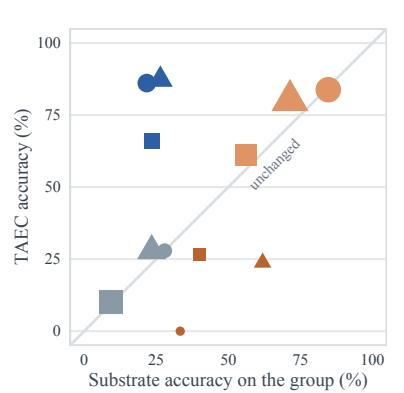  
TAEC only both substrate only neither ViDoSeek SlideVQA MMLongBench  
Figure 9: The four-group decomposition, all three benchmarks, Gemini-3.5-Flash. (a) One cell per group and benchmark: the substrate’s accuracy and TAEC’s on that group, and its size; fill is the group’s contribution to the accuracy difference. (b) The same twelve groups against the identity line, point area ∝ group size.

## N PROTOCOL DIFFERENCES BEHIND THE BASELINE GAP

Three differences between this protocol and those of the papers we compare against affect how the numbers should be read. All of them apply to every row of a table alike, so comparisons within a table remain like-for-like; across papers they mean our values are not directly comparable to published ones.

Table 20: Protocol differences between this paper and the works we compare against, and how each affects the numbers. Rows from different retriever fingerprints are never placed in one table.
<table><tr><td>Difference</td><td>Effect on the reported numbers</td></tr><tr><td>Retrieval index and pages placed per search held common to every system</td><td>Published numbers come from per-system indices of different strength; ours are read against one pooled in- dex of 36,233 pages</td></tr><tr><td>One judge and one prompt for ev- ery row</td><td>ViDoRAG grades on a five-point scale with GPT-4o and counts four or above; an in-run 7B judge scores the</td></tr><tr><td>Answers scored as returned</td><td>same predictions 37.9 where GPT-4.1 scores 80.1 A trajectory that terminates without an answer is scored on a plain-text fallback rather than as zero, which is worth 8.5 points to ReAct</td></tr></table>

We list these because a reader comparing against published numbers on these benchmarks will meet the same pitfalls, and because three of them were ours. The retriever finding is the most consequential: the search URL is not an identifier of the retriever, and without a behavioural fingerprint two runs a week apart can differ by more than any method effect in this paper.