# TEXTURE SPACE MATERIAL DIFFUSION

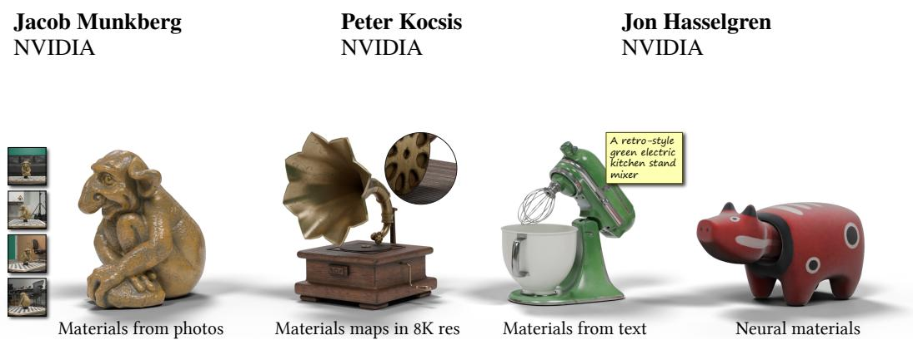  
Figure 1: Our texture space diffusion model generates PBR materials from image- or text conditioning, scales to 8K material maps and generalizes to neural material representations.

## ABSTRACT

We present a method for generating high quality materials for 3D objects entirely in texture space. We finetune a video diffusion transformer for text-guided material generation, multi-view material generation, and material upscaling. Our key insight is to use the known projection from image space to texture space, enabling the diffusion process to generalize across arbitrary geometries and texture parameterizations. This approach also avoids the view consistency issues inherent in video and multi-view diffusion models. Because texture space is two dimensional, we can reuse the strong priors of pretrained video diffusion models. We apply our method to high quality material reconstruction from posed photos captured under unknown lighting, as well as to text- and image guided material generation. Our method can scale to high resolutions (8K), 100+ input views, and neural material representations. In quantitative and qualitative evaluations we show state-of-theart results for material generation and reconstruction.

## 1 INTRODUCTION

In this work, we focus on the task of generating realistic materials for 3D objects from text descriptions and/or photographs. A common way of representing realistic materials for a 3D object is storing the spatially varying material parameters in texture maps. This is the standard approach for materials in 3D graphics systems, e.g., Blender and Unreal Engine. However, authoring detailed materials on complex 3D assets is a labor-intensive task.

Recent advances in generative modeling have made it increasingly practical to synthesize 3D geometry and appearance from text or images. Existing approaches broadly fall into two categories: image-space and object-space models.

Image-space methods (Poole et al., 2023; Deng et al., 2024; Zhang et al., 2024d; Youwang et al., 2024; Munkberg et al., 2025; Hasselgren et al., 2026) build on image or video generative models to produce multiple views of an object, from which geometry and materials are reconstructed using optimization through differentiable rendering. They are mainly limited by view consistency: the same surface point may be predicted differently across generated views, often leading to reduced details, suppressed specular highlights or blurred textures.

Object-space methods (Xiang et al., 2026; He et al., 2025; Wu et al., 2025; Yu et al., 2024; Li et al., 2026a;b) instead rely on three-dimensional representations such as sparse voxel grids or triplanes. Because features are attached to fixed locations, these methods avoid view-consistency issues. However, sparse 3D representations are memory- and compute-intensive, require specialized complex architectures, and are trained from scratch on synthetic data rather than leveraging the priors of large video foundation models, which may lead to lower visual quality.

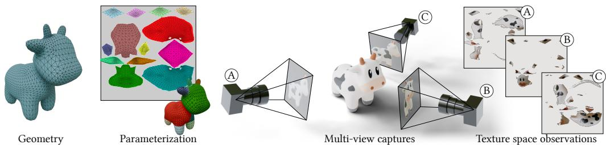  
Figure 2: Texture Space Observations. We leverage known geometry with a non-overlapping texture parameterization. Given camera poses and geometry, we project each view back into texture space, which results in partially covered texture space observations. By formulating our diffusion process in the 2D texture space domain, we can leverage powerful image- and video diffusion model priors to synthesize high quality materials.

In this work, inspired by TEXGen (Yu et al., 2024), we explore the texture space domain for high quality material generation. Texture space is two-dimensional, allowing us to easily adapt existing image and video models, and is view consistent by design. In Figure 2, we illustrate the concept of texture mapping, and the projection from views back into texture space. Our main target application is material estimation for a known, scanned, object with uncontrolled lighting. Each view is projected into a shared UV atlas, and a generative video model is conditioned on the shaded texture space views, generating output frames with the physically-based rendering (PBR) material parameters: (basecolor, height, roughness, metalness).

We show that our method can be made robust to inconsistencies in both input views and geometry, making it a versatile component in larger content-generation pipelines. The input views can include high quality photos from a controlled setup, phone captures, or even views generated by a (e.g. depth-conditioned) video model. The geometry can be an accurate scan, or a coarser extraction from recent image-conditioned models (Li et al., 2026b; Xiang et al., 2026; Team et al., 2026).

We complement our multi-view to material model with a generative upscaler trained on UV-atlases of material parameters, which, combined with inference time augmentation, can be used to scale to both higher resolution (8K) and more input views (100+) than used in training. Finally, we show that text-conditioned and single-image conditioned material generations are feasible in texture space by finetuning a diffusion transformer model with a novel 3D-aware rotary positional embedding which encodes the (per-texel) world space position and frame ID. Our main contributions are:

• To our knowledge, the first diffusion framework that generates complete PBR materials entirely in texture space, combining a view-consistent 2D representation with pretrained image and video priors.

• We show that full texture-space generation enables robust material reconstruction under unknown lighting from single or multiple views.

• Training-free noise rolling and coverage-aware expert aggregation scale inference to 8K textures and over 100 input views.

## 2 RELATED WORK

Image and Video Diffusion. Image diffusion models generate samples through iterative denoising (Sohl-Dickstein et al., 2015; Ho et al., 2020; Dhariwal & Nichol, 2021). Video diffusion models (Blattmann et al., 2023b;a; Hong et al., 2023; Yang et al., 2025b; NVIDIA, 2025; Wan et al., 2025) extend this concept to the temporal domain. Diffusion transformers (DiTs) (Peebles & Xie, 2023) have become a common architecture due to their performance and flexible finetuning opportunities. In this work, we build upon the DiT-based Wan 2.1 model (Wan et al., 2025) and use its temporal representation to process multi-view observations and produce multiple modalities.

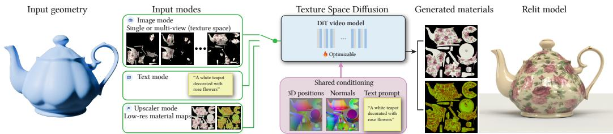  
Figure 3: Method Overview. Our pipeline leverages diffusion transformers in texture space to synthesize high quality materials. We support multiple input modalities: 1) one or more views projected into texture space, which can be photographs, rendered images, or frames generated by diffusion models 2) a text prompt describing the material 3) low-resolution material maps. In all cases, we condition the model on world space positions, normals and a text prompt. Our finetuned DiT successfully demodulates the (unknown) lighting, and creates clean albedo, roughness, and metallicity maps with high frequency details. The materials can be directly applied in standard content creation tools.

Diffusion-based 3D Asset Generation. Many methods build on image diffusion models with score distillation sampling (SDS) to produce complete 3D assets (Poole et al., 2023; Zhu et al., 2024a; Wang et al., 2023; Zhu et al., 2024a). SDS-based methods require slow optimization, prompting the development of methods that reconstruct in a single forward pass using a pretrained transformer (Li et al., 2024; Zhang et al., 2024a).

A common limitation of image models is the lack of view consistency, which may show up as blur in the extracted textures. Multi-view diffusion models e.g., MVDream (Shi et al., 2024) address this by jointly generating images from several canonical viewpoints. SV3D (Voleti et al., 2024) and Hi3D (Yang et al., 2024) further improve on this aspect by finetuning video diffusion models for object rotations, and extract 3D models from the generated views. However, these approaches have limited resolution and do not provide Physically Based Rendering (PBR) materials.

Another direction is to apply the generative process in 3D space, which is view-consistent by design. 3DTopia-XL (Chen et al., 2025b) and Trellis (Xiang et al., 2025; 2026) encode the 3D shape, textures, and materials in volumetric primitives anchored and jointly generates shape and PBR materials. Recently, LSRM (Li et al., 2026b) leverages sparse attention to extend this approach to higher resolutions. These methods target complete asset generation, whereas we focus on PBR materials.

Material Reconstruction. Material reconstruction is commonly formulated as an inverserendering problem from dense set of inputs. Differentiable rasterization (Laine et al., 2020) has been successfully applied to photogrammetry (Munkberg et al., 2022). Differentiable path tracing (Zhang et al., 2020; Jakob et al., 2022) accurately simulates global illumination effects, and has higher potential reconstruction quality (Hasselgren et al., 2022), but introduces Monte-Carlo noise in the training process, which makes gradient-based optimization more challenging. Volumetric scene representations such as NeRFs (Mildenhall et al., 2020) and Gaussian splatting (Kerbl et al., 2023) provide a smoother optimization landscape with impressive novel-view synthesis quality, but disentangling shape, materials, and lighting is non-trivial.

A closely related line of research is intrinsic decomposition of images, including per-pixel material parameter estimation from sparse set of inputs. To account for the decomposition ambiguity, recent methods use image or video diffusion models to generate materials (Kocsis et al., 2024; Chen et al., 2024; Zeng et al., 2024b; Zhu et al., 2024b; Liang et al., 2025; Ying et al., 2025; Zeng et al., 2026; Luo et al., 2026) and potentially combine with optimization-based inverse rendering (Kocsis et al., 2026; Munkberg et al., 2025).

Recent works leverage diffusion models for generating more expressive neural materials on 2D patches (Raghavan et al., 2025; Xue et al., 2026), on 3D geometry (Yu et al., 2026) or to extract neural materials from images (Youwang et al., 2026). These methods are operating in image-space, while we propose to directly generate in texture space. While we focus on PBR materials in this paper, neural materials are an exciting future direction, and we include a proof-of-concept example.

Diffusion-based Material Generation. Earlier approaches formulate the task of material generation as retrieval or interpolation of a database of known high-quality materials or material graphs, and learn to project the input (image or text) onto the known representation (Zhang et al., 2024c; Ceylan et al., 2024; Fang et al., 2024). These methods are limited by the expressiveness of their material databases, but are well-regularized.

Hybrid approaches combine image diffusion models with material distillation using inpainting, or coarse-to-fine texture refinement (Richardson et al., 2023; Chen et al., 2023; Zeng et al., 2024a; Youwang et ${ \mathrm { a l . } } ,$ , 2024; Hadadan et al., 2025). Recent methods fine-tune the diffusion model to condition on geometry or lighting (Zhang et al., 2024d; Deng et al., 2024) or even to directly generate the intrinsic properties from text or known geometry (Kocsis et al., 2025; Munkberg et al., 2025; Hasselgren et al., 2026). CLAY’s (Zhang et al., 2024b) material generation model uses a finetuned multi-view image diffusion model (Shi et al., 2024) conditioned on normal maps. The material model generates four canonical views of the PBR texture maps, which are then projected into texture space. Several recent methods (Huang et al., 2025; Feng et al., 2025; Boss et al., 2025; He et al., 2025; Shao et al., 2025; Yang et al., 2025a; Engelhardt et al., 2025; Seed, 2025) extend this approach with additional input conditioning (normal, depth and/or world space positions). However, these methods operate in image space, potentially leading to texture seams and limited resolution.

TEXGen (Yu et al., 2024) shows that it is possible to directly generate in texture space. To provide geometry information, they interleave convolutions in texture space with attention layers on point clouds to outpaint diffuse textures. Inspired by this, we formulate the generation process entirely in texture space that can generate complete PBR materials.

## 3 METHOD

Our texture space diffusion method, as shown in Figure 3, predicts physically-based rendering (PBR) material textures (Burley, 2012; Karis, 2013) from posed views. We assume a given 3D model with a valid texture parameterization (but no textures) as input, alongside a text prompt describing the material. Our approach is multi-modal, and can predict materials from: 1) one or multiple posed views, 2) a text prompt, or 3) low-resolution material maps.

Given known camera parameters and geometry, we project the views into texture space and formulate the diffusion process in texture space, leveraging pre-trained 2D diffusion priors (e.g., a video diffusion model). One can see our approach as a texture completion task, conditioned on world space positions, normals, and a text prompt. Our finetuned model outputs two images, representing the PBR material maps in texture space, one for base color and the other encoding a height map, roughness, and metallicity combined into an RGB image. We use the height map only for surface normal perturbation (bump mapping), but it could also be used for displacement mapping.

## 3.1 ARCHITECTURE

Our input tensor, ${ \mathbf { I } } ,$ consists of texture-space views for N frames, alongside the world space positions and normals, also in texture space. We finetune a recent Diffusion Transformer (DiT) video model, Wan2.1-1.3B (Wan et al., 2025), to generate complete PBR material maps.

The model comprises a VAE encoder-decoder pair, (E, D), and a transformer-based denoising function, $\mathbf { f } _ { \theta } .$ . First, the input tensor, I, is encoded into a latent tensor, ${ \bf z } ^ { \bf I } = \mathcal { E } ( { \bf I } )$ . Similarly, the shared conditions, C, (texture space world space positions, and world space normals) are encoded into a latent tensor ${ \bf z ^ { c } }$ . The target latent variable, $\mathbf { z } _ { \mathrm { 0 } } ^ { \mathrm { \bar { m a t } } }$ , is constructed by encoding the reference base color, and HRM (height, roughness, metallicity) using the $\mathcal { E }$ encoder. Noise, ϵ, is introduced to our latent, $\mathbf { z } _ { \mathrm { 0 } } ^ { \mathrm { m a t } }$ , representing the material parameters, to produce $\mathbf { z } _ { \tau } ^ { \mathbf { m a t } }$

We use the flow matching training objective, in which the forward process is defined as a linear interpolation between the clean data and noise: ${ \bf z } _ { \tau } ^ { \mathrm { m a t } } = ( 1 - \tau ) { \bf z } _ { 0 } ^ { \mathrm { m a t } } + \tau \epsilon$ . In flow matching, $\mathbf { f } _ { \theta }$ is trained to predict the target velocity field, where ”velocity” is formulated as $v = \epsilon - \mathbf { z } _ { 0 } ^ { \mathbf { m a t } }$

The model parameters, $\theta ,$ of the diffusion model, $\mathbf { f } _ { \theta } ,$ are optimized by minimizing the objective function:

$$
\begin{array} { r } { \mathcal { L } ( \boldsymbol { \theta } ) = \mathbb { E } _ { \mathbf { z } _ { 0 } ^ { \mathrm { m a t } } \sim p _ { \mathrm { d a t a } } , \epsilon \sim \mathcal { N } ( 0 , \sigma ^ { 2 } I ) } \left. \mathbf { f } _ { \boldsymbol { \theta } } ( [ \mathbf { z } _ { \tau } ^ { \mathrm { m a t } } , \mathbf { z } ^ { \mathrm { I } } , \mathbf { z } ^ { \mathrm { c } } ] ; \mathbf { c } _ { \mathrm { p r o m p t } } , \tau ) - ( \epsilon - \mathbf { z } _ { 0 } ^ { \mathrm { m a t } } ) \right. _ { 2 } ^ { 2 } , } \end{array}\tag{1}
$$

where [·] denotes concatenation along the temporal dimension and $\bf { c } _ { \mathrm { { p r o m p t } } }$ is the encoded text prompt (encoded using T5-XXL (Raffel et al., 2023)). We learn unique token type encodings (Zeng et al., 2026) for each of ${ \bf z } _ { \tau } ^ { \mathbf { m a t } } , { \bf z } ^ { \mathbf { I } } , { \bf z } ^ { \mathbf { c } }$ . The target latent, input frames, and conditions comprise a sequence of latent frames, and the DiT can learn to attend to each frame in this sequence.

We finetune all DiT layers for 15k iterations on 32 A100 GPUs, using gradient accumulation over 4 steps, which results in an effective batch size of 128, and progressively increase the training resolu tion from $5 1 2 ^ { 2 }  1 0 2 4 ^ { 2 }  2 0 4 8 ^ { 2 }$

Multi-view to material generation The task is to merge a set of sparse texture space (shaded) views into dense, fully covered texture space material maps. The model needs to learn how to demodulate lighting from the texture space views, merge the observations, and hallucinate plausible detail in regions with missing coverage. Here, I consists of $N = 1 7$ texture space views, with spatial resolution $\bar { \boldsymbol { H } } \times \boldsymbol { W }$ . These are encoded using E into a latent tensor, $\mathbf { z } ^ { \mathbf { I } }$

Our training data consists of path traced views of 3D models. However, real captures and current video diffusion models come with view-inconsistencies. To make our model more robust, we augment the training data with random corruptions of the input views. First, we create a version of the dataset where we add Gaussian noise to the views and denoise them with FLUX.1-dev (Labs, 2024) img2img (using strength $\in [ 0 , 0 . 3 ]$ , guidance scale $\in [ 0 , 3 . 0 ]$ and 20 denoising steps). Secondly, we add Gaussian blur with randomized $\sigma \in [ 0 , 1 5 ]$ to the input views during training. These augmentations encourage our material extraction model to be robust to imperfections, while still producing high frequency details.

Single-view to material generation In this setting, we only have a single observation of the materials in a shaded view, which we project into texture space. The model, guided by the texture space sparse input and conditions, needs to demodulate lighting and inpaint plausible details in missing regions. Here I consists of a single, sparse texture space view. To improve consistency of the generated material, inspired by RomanTex (Feng et al., 2025), we introduce a novel 3D-aware rotary positional embedding (RoPE), combining the frame ID and world space position. To our knowledge, we are the first to apply a 3D-aware RoPE in texture space. Encoding world space positions directly in RoPE supplies a stronger or more direct geometric bias than G-buffer conditioning alone, improving attention in spatially adjacent surface regions that are distant in texture space. In our supplemental material, we ablate the impact of this 3D-aware RoPE.

Text to material generation The text to material model is near identical to the single-view model. We replace I with a binary UV coverage mask, indicating which parts of texture space are populated or empty, and use the same 3D-aware RoPE.

Texture space upscaling and refinement To increase the resolution of the generated material maps, we propose a texture-space generative refinement model. This model is primarily useful to complement the multi-view to material generation method of Section 3.1. The upscaler model is similar to the single-view to material model, but with the single frame replaced with two low resolution PBR material maps (with full coverage). In training, the low resolution PBR material guides are generated by first downscaling then upscaling the reference materials with area weighted or nearest neighbor filtering (randomly selected) using the scaling factors: 2,4,8, and 16.

Neural materials The above methods can be extended to handle neural material representations by replacing the target latent variable, $\pmb { z } _ { 0 } ^ { \mathrm { m a t } }$ (which consists of encoded PBR material maps), with VAEencoded neural material textures. As a proof of concept, we apply the dataset and neural material representation of Yu et al. (2026) to our generative image-conditioned model. Neural representations can be used to encode more complex appearances, such as the fuzzy material shown in our result in the right column of Figure 1.

## 3.2 TRAINING DATASET

Our dataset consists of 120k videos of object-centric renderings of 3D models from TexVerse (Zhang et al., 2025). For each object, we render a video with 17 frames at a resolution of 2048×2048, using a path tracer with three bounces, black background and Blender AgX tonemapping. For lighting, we use 697 light probes from Poly Haven (Poly Haven), one randomly selected for each object. Each frame is projected into texture space following Figure 2. We automatically generate captions using Qwen2.5-VL-7B (Qwen Team, 2024). We also rasterize intrinsic conditioning guides (world space positions and world space normals) directly in texture space and store them alongside reference base color, roughness, metallicity and height textures. The height map is not available for most assets, and we reconstruct it from the normal map using standard conversion tools.

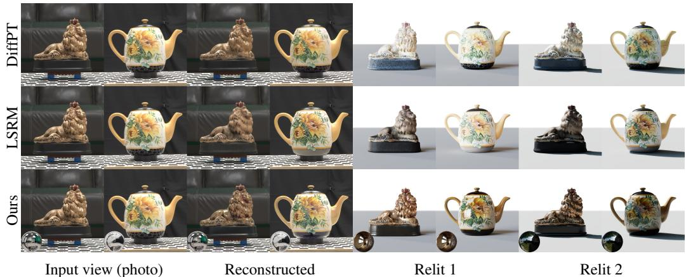  
Figure 4: Reconstruction - Real-World. Material reconstructions from multi-view observations (photographs with known poses) on two examples from the DTC dataset (Dong et al., 2025). For optimization-based differentiable path tracing (DiffPT) and our method, we leverage known geometry, while LSRM jointly reconstructs geometry and materials. In the right part we show the reconstructed materials under two novel lighting conditions.

## 3.3 INFERENCE SCALING

Scaling transformer models to higher resolution or more input views is challenging due to attention cost. We show that inference-time methods can enable scaling beyond the training domain.

Increasing texture resolution Our high-resolution inference uses progressive noise rolling, inspired by Bar-Tal et al. (2023); Vecchio et al. (2024). We first run inference on the original 2K resolution. We upscale the resulting image to 8K, add a small amount of noise, and resume denoising from that point. In each diffusion step, we split all model inputs $( \mathbf { z } _ { \tau } ^ { \mathbf { m a t } } , \mathbf { z } ^ { \mathbf { I } } , \mathbf { z } ^ { \mathbf { c } } )$ into non-overlapping 2K crops, evaluate $\mathbf { f } _ { \theta }$ on each crop, and stitch the result together. We hide seams by applying a random spatial roll in each diffusion step, thus randomly offsetting the crops. We apply noise rolling in the upscaling step for best runtime performance.

More input views To use more input observations, we evaluate them batch-wise and propose a fusing strategy. We split the input views into overlapping batches. In each denoising step, we predict the flow for all batches, given the same noisy latents, referred to as expert predictions. To aggregate the predictions, we compute per-texel coverage scores for all experts. These coverage maps can act as an uncertainty-measure, i.e. more views observe a texel, the more certain the prediction should be. For each texel, we keep the top-2 expert predictions and use their coverage-weighted average. This retains redundancy, while avoiding the oversmoothing that would result from averaging all experts.

## 4 EXPERIMENTS

We evaluate our method against the state-of-the-art in multi-view to material reconstruction and text/image conditioned material generation. Additionally, we ablate robustness to view- and geometry inconsistencies, and our inference-time methods for increasing the number of input views and resolution. For quantitative results we use a synthetic dataset of 32 held out 3D models from the BlenderVault dataset (Litman et al., 2025).

Table 1: Multi-view to materials. Comparison on synthetic materials and posed real photographs. Synthetic metrics are averaged over 32 extracted materials rendered from eight views. For the relighting metrics, we render each view with eight different HDR probes. Real metrics are averaged over eight examples from the DTC dataset (Dong et al., 2025). Materials are reconstructed from 17 views in 2K resolution. We compare against DiffPT (Hasselgren et al., 2022) and LSRM (Li et al., 2026b). DiffPT overfits (reconstruction w/ single lighting) but fails to generalize (relighting).
<table><tr><td rowspan="2">Geom.</td><td rowspan="2">Method</td><td colspan="3">Real recon (136 img)</td><td colspan="3">Synthetic recon (256 img)</td><td colspan="3">Synthetic relight (2k img)</td></tr><tr><td>PSNR↑</td><td>SSIM↑</td><td>LPIPS↓</td><td>PSNR↑</td><td>SSIM↑</td><td>LPIPS↓</td><td>PSNR↑</td><td>SSIM↑</td><td>LPIPS↓</td></tr><tr><td>Known (ref.)</td><td>DiffPT Ours</td><td>30.67 29.03</td><td>0.959 0.947</td><td>0.0307 0.0331</td><td>27.50 31.24</td><td>0.929 0.960</td><td>0.0739 0.0370</td><td>24.90 30.46</td><td>0.903 0.950</td><td>0.0911 0.0401</td></tr><tr><td>Recon. (LSRM)</td><td>LSRM Ours (LSRM geo)</td><td>27.75 27.01</td><td>0.933 0.936</td><td>0.0388 0.0423</td><td>22.82 24.10</td><td>0.872 0.890</td><td>0.1210 0.0896</td><td>21.82 23.71</td><td>0.862 0.885</td><td>0.1241 0.0927</td></tr></table>

## 4.1 MULTI-VIEW TO MATERIALS

We evaluate our multi-view material reconstruction model on two test sets: 1) A fully controlled synthetic test set with 32 examples 2) Eight real multi-view captures from the DTC (Dong et al., 2025) dataset. For the synthetic set, we render each 3D model with extracted materials from eight viewpoints with the original lighting and in eight novel lighting conditions. For the DTC examples, we use the original lighting in rendering. Error metrics are computed as averages over all images.

To account for any tonemapping bias of the baselines, we fit a parametric camera response function (CRF), following Lin et al. (2025), for each series based on ground truth renderings under the original lighting condition. Material estimation under unknown lighting is fundamentally ambiguous as observed intensity depends jointly on illumination intensity and material reflectance. Consequently, the different methods produce materials with different systematic bias in the material parameters, which can be largely reduced with CRF adjustment. For completeness, we include series without CRF adjustments in our supplementary material.

In Table 1 we report metrics for multi-view reconstruction for synthetic and real examples. As baselines, we include DiffPT (Hasselgren et al., 2022), an optimization-based approach through differentiable path tracing, and LSRM (Li et al., 2026b), a large reconstruction model for geometry and material estimation. In the left part, we report metrics for renderings of the reconstructed materials with the original lighting. We note that our method (with reference geometry) has the highest scores on all metrics for the synthetic set. For the real (DTC) examples, the optimization-based approach, DiffPT, which overfits to this configuration, has slightly better metrics. In the right column, we evaluate the reconstructed materials across eight novel lighting configurations. The scores indicate that DiffPT fails to properly disentangle lighting and material information, as also shown in Figure 4. LSRM has slightly lower scores, but solves the more challenging task of jointly reconstructing the geometry and materials. We include a series with our method using LSRM geometry, which improves slightly over LSRM across all metrics in the multi-illumination setting.

To ablate robustness to imperfect views, we leverage a pre-trained video model (Wan2.2-VACE-Fun-A14B) (Jiang et al., 2025) to generate a 360 degree orbit of the 3D object, conditioned on a single image and a depth video. Here, we use a smaller test set of 17 objects, as the depth-conditioned video model struggles to generate plausible orbits for rotationally symmetrical objects. In Figure 5, we observe that our method robustly handles view imperfections, and can produce plausible materials from views synthesized by a video model.

In Figure 8, we show one example of the impact of our inference augmentations, which allows us to scale the material maps to 8K resolution while leveraging more input views. More results are shown in the supplement.

## 4.2 GENERATIVE MATERIALS

Generative material models hallucinate material parameters from text or from a shaded example image. In Table 2 (left) we evaluate our image conditioned method against Trellis.2 (Xiang et al., 2026), Hunyuan3D 2.1 (Tencent Hunyuan3D Team, 2025), and VideoMatGen (Hasselgren et al.,

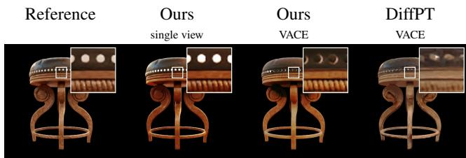

<table><tr><td>Metrics 1088 views</td><td>Ours single view</td><td>Ours VACE</td><td>DiffPT VACE</td></tr><tr><td>PSNR↑</td><td>29.81</td><td>27.07</td><td>23.37</td></tr><tr><td>SSIM↑</td><td>0.960</td><td>0.946</td><td>0.907</td></tr><tr><td>LPIPS↓</td><td>0.0364</td><td>0.0509</td><td>0.0762</td></tr><tr><td>CLIP-FID↓</td><td>1.97</td><td>3.06</td><td>5.29</td></tr><tr><td>CMMD↓</td><td>0.027</td><td>0.036</td><td>0.132</td></tr></table>

Figure 5: Reconstruction - Generated Frames. Material reconstructions from imperfect views, with views synthesized by an off-the-shelf depth-conditioned video model: Wan2.2-VACE-Fun-A14B (Jiang et al., 2025). Compared to an optimization-based approach, our method robustly reconstructs materials also from the inconsistent views from the video model.

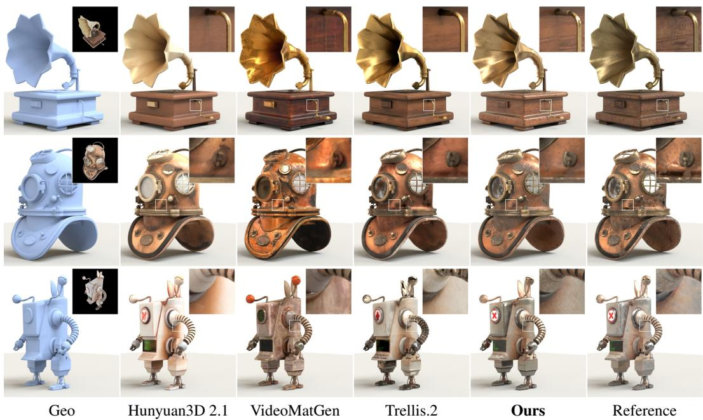  
Figure 6: Generation - Single-View. Materials from our generative method, conditioned on a single image and text description. The visualized view is rotated slightly from the conditioning view (leftmost insets). We use reference geometry and the same conditioning view for all methods.

2026). In all cases, we run the pipelines with known geometry, only extracting the materials. This mode is directly supported by their respective code releases. We evaluate text to material generation in Table 2 (right). Here we compare against VideoMat (Munkberg et al., 2025) and VideoMatGen which have native support for text to material.

Figure 6 shows visual examples of single-view to material generations from our synthetic test set. Our method is robust over a large variety of objects and lighting conditions, producing semantically meaningful results over all test objects. In Figure 7 we compare against TEXGen (Yu et al., 2024) on the single-view to diffuse texture generation task. Please refer to the supplemental material for comprehensive visual examples and quantitative results of text-guided material generation.

## 5 LIMITATIONS AND FUTURE WORK

Our implementation is currently not optimized. Inference is costly, in particular for the multi-view model: 130 s for the 17-view model @2K on a GB300 GPU (see supplement). Recent video model acceleration and distillation techniques offer promising directions for improving efficiency.

Table 2: Material generation. Left: single-view to material generation. Right: text-guided material generation. All metrics evaluated on 32 scenes × 8 views × 8 probes.
<table><tr><td colspan="4">Single-view to material</td><td colspan="4">Text to material</td></tr><tr><td>Method</td><td>CLIP-FID (↓) CMMD (↓) LPIPS (↓) |Method</td><td></td><td></td><td></td><td>CLIP-FID (↓) CMMD (↓) LPIPS (↓)</td><td></td><td></td></tr><tr><td>Hunyuan3D 2.1</td><td>3.419</td><td>0.0437</td><td>0.0520</td><td></td><td></td><td></td><td></td></tr><tr><td>VideoMatGen</td><td>2.973</td><td>0.0236</td><td>0.0527</td><td>VideoMatGen</td><td>4.725</td><td>0.0330</td><td>0.0639</td></tr><tr><td>Trellis.2</td><td>2.227</td><td>0.0184</td><td>0.0395</td><td>VideoMat</td><td>4.376 3.338</td><td>0.0247 0.0230</td><td>0.0652 0.0542</td></tr><tr><td>Ours</td><td>1.520</td><td>0.0081</td><td>0.0325</td><td>Ours</td><td></td><td></td><td></td></tr><tr><td></td><td></td><td></td><td></td><td></td><td></td><td></td><td></td></tr><tr><td></td><td></td><td></td><td></td><td></td><td></td><td></td><td></td></tr><tr><td></td><td></td><td></td><td>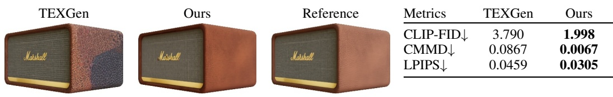</td><td></td><td></td><td></td><td></td></tr><tr><td></td><td></td><td></td><td></td><td></td><td></td><td></td><td></td></tr><tr><td></td><td></td><td></td><td></td><td></td><td></td><td></td><td></td></tr></table>

Figure 7: TEXGen. TEXGen (Yu et al., 2024) only produces albedo textures. Metrics for diffuseonly renderings from 32 scenes × 8 views × 8 probes from single-view guidance.

Capturing specular appearance is challenging, and while our approach improves over previous work in this aspect, careful data curation can likely help. We are also excited about looking closer at neural material representations, which accurately model specular appearance (Yu et al., 2026).

Wan-2.1 (Wan et al., 2025) operates on patches of 16 × 16, which is the smallest granularity for attention and RoPE. Consequently, in patches with multiple overlapping texture atlas segments our model lacks the information to distinguish them. Although higher texture resolutions mitigate this issue, patch-aware texture unwrapping, or pixel-space diffusion models are promising directions for future work.

## 6 CONCLUSION

We show that texture space diffusion models can be powerful tools for material reconstruction and generation, achieving on par or higher quality compared to the state of the art. Operating in texture space ignores the common problems of view consistency or data sparsity, making our method both simple and scalable.

## ACKNOWLEDGMENTS

We thank Kim Youwang, Zhengqin Li, Nicholas Sharp, Steve Marschner, Zheng Zeng, Andrea Weidlich, Blaire Yu, and Milos Ha ˇ san for helpful discussions, feedback, and sharing code. We also ˇ thank Aaron Lefohn and Chris Wyman for supporting this research.

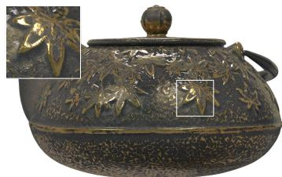  
17 views – 2K  
28.42dB / 0.919 / 0.0668

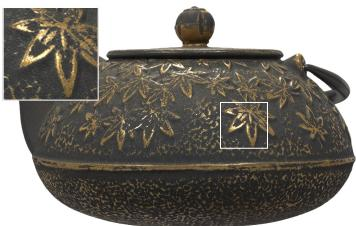  
117 views – 8K

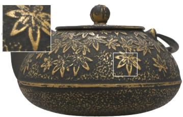  
28.34dB / 0.917 / 0.0639  
Reference  
PSNR ↑ / SSIM ↑ / LPIPS ↓  
Figure 8: Ablation – Inference Scaling. With our inference augmentations, we can scale our results to 8K texture resolution and increase the number of input views from 17 to 117. This enables capturing high-frequency details and accurate specular predictions. We provide average metrics over the first four samples of the real dataset, showing preserved fidelity with slightly improved LPIPS.

## REFERENCES

Yunpeng Bai, Haoxiang Li, and Qixing Huang. Positional encoding field. In International Conference on Learning Representations (ICLR), 2026. 18

Omer Bar-Tal, Lior Yariv, Yaron Lipman, and Tali Dekel. Multidiffusion: Fusing diffusion paths for controlled image generation. In Andreas Krause, Emma Brunskill, Kyunghyun Cho, Barbara Engelhardt, Sivan Sabato, and Jonathan Scarlett (eds.), International Conference on Machine Learning (ICML), 2023. 6, 21

Andreas Blattmann, Tim Dockhorn, Sumith Kulal, Daniel Mendelevitch, Maciej Kilian, Dominik Lorenz, Yam Levi, Zion English, Vikram Voleti, Adam Letts, Varun Jampani, and Robin Rombach. Stable video diffusion: Scaling latent video diffusion models to large datasets. arXiv:2311.15127, 2023a. 2

Andreas Blattmann, Robin Rombach, Huan Ling, Tim Dockhorn, Seung Wook Kim, Sanja Fidler, and Karsten Kreis. Align your latents: High-resolution video synthesis with latent diffusion models. In IEEE Conference on Computer Vision and Pattern Recognition (CVPR), 2023b. 2

Mark Boss, Zixuan Huang, Aaryaman Vasishta, and Varun Jampani. SF3D: Stable fast 3D mesh reconstruction with uv-unwrapping and illumination disentanglement. In IEEE Conference on Computer Vision and Pattern Recognition (CVPR), 2025. 4

Brent Burley. Physically-based shading at Disney. In ACM SIGGRAPH, pp. 1–7, 2012. 4

Duygu Ceylan, Valentin Deschaintre, Thibault Groueix, Rosalie Martin, Chun-Hao Huang, Romain Rouffet, Vladimir Kim, and Gaetan Lassagne. MatAtlas: Text-driven Consistent Geometry Tex-¨ turing and Material Assignment. arXiv preprint arXiv:2404.02899, 2024. 4

Dave Zhenyu Chen, Yawar Siddiqui, Hsin-Ying Lee, Sergey Tulyakov, and Matthias Nießner. Text2tex: Text-driven texture synthesis via diffusion models. In IEEE International Conference on Computer Vision (ICCV), 2023. 4

Xi Chen, Sida Peng, Dongchen Yang, Yuan Liu, Bowen Pan, Chengfei Lv, and Xiaowei Zhou. IntrinsicAnything: learning diffusion priors for inverse rendering under unknown illumination. In European Conference on Computer Vision (ECCV), 2024. 3

Yujin Chen, Yinyu Nie, Benjamin Ummenhofer, Reiner Birkl, Michael Paulitsch, and Matthias Nießner. Pbr-sr: Mesh pbr texture super resolution from 2d image priors. In Advances in Neural Information Processing Systems (NeurIPS), 2025a. 22

Zhaoxi Chen, Jiaxiang Tang, Yuhao Dong, Ziang Cao, Fangzhou Hong, Yushi Lan, Tengfei Wang, Haozhe Xie, Tong Wu, Shunsuke Saito, Liang Pan, Dahua Lin, and Ziwei Liu. 3DTopia-XL: Scaling High-quality 3D Asset Generation via Primitive Diffusion. In IEEE Conference on Computer Vision and Pattern Recognition (CVPR), 2025b. 3

Kangle Deng, Timothy Omernick, Alexander Weiss, Deva Ramanan, Jun-Yan Zhu, Tinghui Zhou, and Maneesh Agrawala. FlashTex: fast relightable mesh texturing with LightControlNet. In European Conference on Computer Vision (ECCV), 2024. 1, 4

Prafulla Dhariwal and Alexander Quinn Nichol. Diffusion models beat GANs on image synthesis. In Advances in Neural Information Processing Systems (NeurIPS), 2021. 2

Zhao Dong, Ka Chen, Zhaoyang Lv, Hong-Xing Yu, Yunzhi Zhang, Cheng Zhang, Yufeng Zhu, Stephen Tian, Zhengqin Li, Geordie Moffatt, Sean Christofferson, James Fort, Xiaqing Pan, Mingfei Yan, Jiajun Wu, Carl Yuheng Ren, and Richard Newcombe. Digital twin catalog: A large-scale photorealistic 3d object digital twin dataset. In IEEE Conference on Computer Vision and Pattern Recognition (CVPR), 2025. 6, 7, 17, 19, 20, 21, 22

Andreas Engelhardt, Mark Boss, Vikram Voleti, Chun-Han Yao, Hendrik P. Lensch, and Varun Jampani. Svim3d: Stable video material diffusion for single image 3d generation. In IEEE International Conference on Computer Vision (ICCV), 2025. 4

Ye Fang, Zeyi Sun, Tong Wu, Jiaqi Wang, Ziwei Liu, Gordon Wetzstein, and Dahua Lin. Make-it-Real: Unleashing Large Multimodal Model for Painting 3D Objects with Realistic Materials. In Advances in Neural Information Processing Systems (NeurIPS), 2024. 4

Yifei Feng, Mingxin Yang, Shuhui Yang, Sheng Zhang, Jiaao Yu, Zibo Zhao, Yuhong Liu, Jie Jiang, and Chunchao Guo. RomanTex: Decoupling 3D-aware Rotary Positional Embedded Multi-Attention Network for Texture Synthesis. In IEEE International Conference on Computer Vision (ICCV), 2025. 4, 5, 18

Michael D. Grossberg and Shree K. Nayar. Modeling the space of camera response functions. IEEE Transactions on Pattern Analysis and Machine Intelligence (TPAMI), 26(10):1272–1282, 2004. doi: 10.1109/TPAMI.2004.88. URL https://doi.org/10.1109/TPAMI.2004.88. 16

Saeed Hadadan, Benedikt Bitterli, Tizian Zeltner, Jan Novak, Fabrice Rousselle, Jacob Munkberg,´ Jon Hasselgren, Bartlomiej Wronski, and Matthias Zwicker. Generative detail enhancement for physically based materials. In ACM SIGGRAPH Conference Proceedings, 2025. 4

Jon Hasselgren, Nikolai Hofmann, and Jacob Munkberg. Shape, light, and material decomposition from images using Monte Carlo rendering and denoising. In Advances in Neural Information Processing Systems (NeurIPS), 2022. 3, 7, 19

Jon Hasselgren, Milos Haˇ san, Zheng Zeng, and Jacob Munkberg. VideoMatGen: PBR Materialsˇ through Joint Generative Modeling. In IEEE Conference on Computer Vision and Pattern Recognition Findings (CVPRF), 2026. 1, 4, 7, 25

Zebin He, Mingxin Yang, Shuhui Yang, Yixuan Tang, Tao Wang, Kaihao Zhang, Guanying Chen, Yuhong Liu, Jie Jiang, Chunchao Guo, and Wenhan Luo. MaterialMVP: Illumination-Invariant Material Generation via Multi-view PBR Diffusion. In IEEE International Conference on Com puter Vision (ICCV), 2025. 1, 4

Jonathan Ho, Ajay Jain, and Pieter Abbeel. Denoising diffusion probabilistic models. In Advances in Neural Information Processing Systems (NeurIPS), 2020. 2

Wenyi Hong, Ming Ding, Wendi Zheng, Xinghan Liu, and Jie Tang. CogVideo: Large-scale Pretraining for Text-to-Video Generation via Transformers. In International Conference on Learning Representations (ICLR), 2023. 2

Xin Huang, Tengfei Wang, Ziwei Liu, and Qing Wang. Material anything: Generating materials for any 3d object via diffusion. In IEEE Conference on Computer Vision and Pattern Recognition (CVPR), 2025. 4

Wenzel Jakob, Sebastien Speierer, Nicolas Roussel, Merlin Nimier-David, Delio Vicini, Tizian Zelt-´ ner, Baptiste Nicolet, Miguel Crespo, Vincent Leroy, and Ziyi Zhang. Mitsuba 3 renderer, 2022. https://mitsuba-renderer.org. 3

Zeyinzi Jiang, Zhen Han, Chaojie Mao, Jingfeng Zhang, Yulin Pan, and Yu Liu. VACE: All-in-One Video Creation and Editing. In IEEE International Conference on Computer Vision (ICCV), 2025. 7, 8

Brian Karis. Real shading in Unreal Engine 4. ACM SIGGRAPH Course on Physically Based Shading Theory and Practice, 4(3):1, 2013. 4

Bernhard Kerbl, Georgios Kopanas, Thomas Leimkuhler, and George Drettakis. 3D Gaussian splat-¨ ting for real-time radiance field rendering. ACM Transactions on Graphics, 42(4), July 2023. 3

Peter Kocsis, Vincent Sitzmann, and Matthias Nießner. Intrinsic image diffusion for indoor singleview material estimation. In IEEE Conference on Computer Vision and Pattern Recognition (CVPR), 2024. 3

Peter Kocsis, Lukas Hollein, and Matthias Nießner. Intrinsix: High-quality pbr generation using¨ image priors. In Advances in Neural Information Processing Systems (NeurIPS), 2025. 4

Peter Kocsis, Lukas Hollein, and Matthias Nießner. Intrinsic image fusion for multi-view 3d material¨ reconstruction. In IEEE Conference on Computer Vision and Pattern Recognition (CVPR), 2026. 3

Krzysztof Kolasinski. Awesomebump. GitHub repository, 2015. URL´ https://github.com/ kmkolasinski/AwesomeBump. 18

Zhengfei Kuang, Yunzhi Zhang, Hong-Xing Yu, Samir Agarwala, Shangzhe Wu, and Jiajun Wu. Stanford-orb: a real-world 3d object inverse rendering benchmark. In Advances in Neural Information Processing Systems Datasets and Benchmarks Track, 2023. 19

Black Forest Labs. Flux. https://github.com/black-forest-labs/flux, 2024. 5

Samuli Laine, Janne Hellsten, Tero Karras, Yeongho Seol, Jaakko Lehtinen, and Timo Aila. Modular primitives for high-performance differentiable rendering. ACM Transactions on Graphics, 39(6), 2020. 3

Dong-Yang Li, Wang Zhao, Yuxin Chen, Wenbo Hu, Meng-Hao Guo, Fang-Lue Zhang, Ying Shan, and Shi-Min Hu. Pixal3d: Pixel-aligned 3d generation from images. In ACM SIGGRAPH Conference Proceedings, 2026a. 1

Jiahao Li, Hao Tan, Kai Zhang, Zexiang Xu, Fujun Luan, Yinghao Xu, Yicong Hong, Kalyan Sunkavalli, Greg Shakhnarovich, and Sai Bi. Instant3d: Fast text-to-3d with sparse-view generation and large reconstruction model. In International Conference on Learning Representations (ICLR), 2024. 3

Zhengqin Li, Cheng Zhang, Jakob Engel, and Zhao Dong. Lsrm: High-fidelity object-centric reconstruction via scaled context windows. In European Conference on Computer Vision (ECCV), 2026b. 1, 2, 3, 7, 17, 19

Ruofan Liang, Zan Gojcic, Huan Ling, Jacob Munkberg, Jon Hasselgren, Zhi-Hao Lin, Jun Gao, Alexander Keller, Nandita Vijaykumar, Sanja Fidler, and Zian Wang. DiffusionRenderer: Neural Inverse and Forward Rendering with Video Diffusion Models. In IEEE Conference on Computer Vision and Pattern Recognition (CVPR), 2025. 3

Chih-Hao Lin, Jia-Bin Huang, Zhengqin Li, Zhao Dong, Christian Richardt, Tuotuo Li, Michael Zollhofer, Johannes Kopf, Shenlong Wang, and Changil Kim. IRIS: Inverse rendering of indoor¨ scenes from low dynamic range images. In IEEE Conference on Computer Vision and Pattern Recognition (CVPR), 2025. 7, 16

Yehonathan Litman, Or Patashnik, Kangle Deng, Aviral Agrawal, Rushikesh Zawar, Fernando De la Torre, and Shubham Tulsiani. MaterialFusion: Enhancing Inverse Rendering with Material Diffusion Priors. In International Conference on 3D Vision (3DV), 2025. 6

Yu-Lun Liu, Wei-Sheng Lai, Yu-Sheng Chen, Yi-Lung Kao, Ming-Hsuan Yang, Yung-Yu Chuang, and Jia-Bin Huang. Single-image HDR reconstruction by learning to reverse the camera pipeline. In IEEE Conference on Computer Vision and Pattern Recognition (CVPR), 2020. 16

Di Luo, Shuhui Yang, Mingxin Yang, Jiawei Lu, Yixuan Tang, Xintong Han, Zhuo Chen, Beibei Wang, and Chunchao Guo. MatPedia: A Universal Generative Foundation for High-Fidelity Material Synthesis. In IEEE Conference on Computer Vision and Pattern Recognition (CVPR), 2026. 3

Ben Mildenhall, Pratul P. Srinivasan, Matthew Tancik, Jonathan T. Barron, Ravi Ramamoorthi, and Ren Ng. NeRF: Representing Scenes as Neural Radiance Fields for View Synthesis. In European Conference on Computer Vision (ECCV), 2020. 3

Jacob Munkberg, Jon Hasselgren, Tianchang Shen, Jun Gao, Wenzheng Chen, Alex Evans, Thomas Muller, and Sanja Fidler. Extracting Triangular 3D Models, Materials, and Lighting From Images.¨ In IEEE Conference on Computer Vision and Pattern Recognition (CVPR), 2022. 3

Jacob Munkberg, Zian Wang, Ruofan Liang, Tianchang Shen, and Jon Hasselgren. VideoMat: Extracting PBR Materials from Video Diffusion Models. In Eurographics Symposium on Rendering - CGF Track, 2025. 1, 3, 4, 8, 25

NVIDIA. Cosmos World Foundation Model Platform for Physical AI. arXiv preprint arXiv:2501.03575, 2025. 2

William Peebles and Saining Xie. Scalable diffusion models with transformers. In IEEE International Conference on Computer Vision (ICCV), 2023. 2

Poly Haven. Poly haven asset repository. https://polyhaven.com/. 6

Ben Poole, Ajay Jain, Jonathan T. Barron, and Ben Mildenhall. DreamFusion: Text-to-3D using 2D Diffusion. In International Conference on Learning Representations (ICLR), 2023. 1, 3

Yvain Queau, Jean-Denis Durou, and Jean-Franc¸ois Aujol. Normal integration: A survey.´ Journal of Mathematical Imaging and Vision, 60(4):576–593, 2018. doi: 10.1007/s10851-017-0773-x. 18

Qwen Team. Qwen2.5 technical report. arXiv preprint arXiv:2412.15115, 2024. 6

Colin Raffel, Noam Shazeer, Adam Roberts, Katherine Lee, Sharan Narang, Michael Matena, Yanqi Zhou, Wei Li, and Peter J. Liu. Exploring the limits of transfer learning with a unified text-to-text transformer, 2023. URL https://arxiv.org/abs/1910.10683. 5

Nithin Raghavan, Krishna Mullia, Alexander Trevithick, Fujun Luan, Milos Ha ˇ san, and Ravi Ra-ˇ mamoorthi. Generative Neural Materials. ACM SIGGRAPH Conference Proceedings, 43:11, 2025. doi: 10.1145/3721238.3730746. 3

Elad Richardson, Gal Metzer, Yuval Alaluf, Raja Giryes, and Daniel Cohen-Or. TEXTure: Textguided texturing of 3d shapes. In ACM SIGGRAPH Conference Proceedings, 2023. 4

ByteDance Seed. Seed3D 1.0: From Images to High-Fidelity Simulation-Ready 3D Assets, 2025. URL https://seed3d.github.io/Seed3D/report.pdf. 4

Mingqi Shao, Feng Xiong, Zhaoxu Sun, and Mu Xu. MVPainter: Accurate and Detailed 3D Texture Generation via Multi-View Diffusion with Geometric Control. arXiv preprint arXiv:2505.12635, 2025. URL https://arxiv.org/abs/2505.12635. 4

Yichun Shi, Peng Wang, Jianglong Ye, Long Mai, Kejie Li, and Xiao Yang. MVDream: Multi-view Diffusion for 3D Generation. In International Conference on Learning Representations (ICLR), 2024. 3, 4

Jascha Sohl-Dickstein, Eric Weiss, Niru Maheswaranathan, and Surya Ganguli. Deep unsupervised learning using nonequilibrium thermodynamics. In International Conference on Machine Learn ing (ICML), 2015. 2

SAM 3D Team, Xingyu Chen, Fu-Jen Chu, Pierre Gleize, Kevin J Liang, Alexander Sax, Hao Tang, Weiyao Wang, Michelle Guo, Thibaut Hardin, Xiang Li, Aohan Lin, Jiawei Liu, Ziqi Ma, Anushka Sagar, Bowen Song, Xiaodong Wang, Jianing Yang, Bowen Zhang, Piotr Dollar, Geor-´ gia Gkioxari, Matt Feiszli, and Jitendra Malik. SAM 3D: 3Dfy Anything in Images. In IEEE Conference on Computer Vision and Pattern Recognition (CVPR), 2026. 2

Tencent Hunyuan3D Team. Hunyuan3D 2.1: From Images to High-Fidelity 3D Assets with Production-Ready PBR Material. arXiv preprint, arxiv:2506.15442, 2025. 7, 21

Giuseppe Vecchio, Rosalie Martin, Arthur Roullier, Adrien Kaiser, Romain Rouffet, Valentin Deschaintre, and Tamy Boubekeur. Controlmat: A controlled generative approach to material capture. ACM Transactions on Graphics, 43(5):164:1–164:17, 2024. doi: 10.1145/3688830. URL https://doi.org/10.1145/3688830. 6, 21

Vikram Voleti, Chun-Han Yao, Mark Boss, Adam Letts, David Pankratz, Dmitrii Tochilkin, Christian Laforte, Robin Rombach, and Varun Jampani. SV3D: Novel multi-view synthesis and 3D generation from a single image using latent video diffusion. In European Conference on Computer Vision (ECCV), 2024. 3

Team Wan, Ang Wang, Baole Ai, Bin Wen, Chaojie Mao, Chen-Wei Xie, Di Chen, Feiwu Yu, Haiming Zhao, Jianxiao Yang, et al. Wan: Open and advanced large-scale video generative models. arXiv preprint arXiv:2503.20314, 2025. 2, 4, 9

Xintao Wang, Ke Yu, Shixiang Wu, Jinjin Gu, Yihao Liu, Chao Dong, Yu Qiao, and Chen Change Loy. ESRGAN: Enhanced super-resolution generative adversarial networks. In European Conference on Computer Vision Workshops (ECCVW), 2018. 21, 22

Zhengyi Wang, Cheng Lu, Yikai Wang, Fan Bao, Chongxuan Li, Hang Su, and Jun Zhu. Prolific-Dreamer: High-Fidelity and Diverse Text-to-3D Generation with Variational Score Distillation. In Advances in Neural Information Processing Systems (NeurIPS), 2023. 3

Shuang Wu, Youtian Lin, Feihu Zhang, Yifei Zeng, Yikang Yang, Yajie Bao, Jiachen Qian, Siyu Zhu, Philip Torr, Xun Cao, and Yao Yao. Direct3d-s2: Gigascale 3d generation made easy with spatial sparse attention. In Advances in Neural Information Processing Systems (NeurIPS), 2025. 1

Jianfeng Xiang, Zelong Lv, Sicheng Xu, Yu Deng, Ruicheng Wang, Bowen Zhang, Dong Chen, Xin Tong, and Jiaolong Yang. Structured 3D Latents for Scalable and Versatile 3D Generation. In IEEE Conference on Computer Vision and Pattern Recognition (CVPR), 2025. 3

Jianfeng Xiang, Xiaoxue Chen, Sicheng Xu, Ruicheng Wang, Zelong Lv, Yu Deng, Hongyuan Zhu, Yue Dong, Hao Zhao, Nicholas Jing Yuan, and Jiaolong Yang. Native and Compact Structured Latents for 3D Generation. In IEEE Conference on Computer Vision and Pattern Recognition (CVPR), 2026. 1, 2, 3, 7

Bowen Xue, Saeed Hadadan, Zheng Zeng, Fabrice Rousselle, Zahra Montazeri, and Milos Ha ˇ san. ˇ VideoNeuMat: Neural Material Extraction from Generative Video Models. In ACM SIGGRAPH Conference Proceedings, 2026. 3

Haibo Yang, Yang Chen, Yingwei Pan, Ting Yao, Zhineng Chen, Chong-Wah Ngo, and Tao Mei. Hi3D: Pursuing High-Resolution Image-to-3D Generation with Video Diffusion Models. In ACM International Conference on Multimedia (MM), 2024. 3

Jiayu Yang, Taizhang Shang, Weixuan Sun, Xibin Song, Ziang Chen, Senbo Wang, Shenzhou Chen, Weizhe Liu, Hongdong Li, and Pan Ji. Pandora3D: A Comprehensive Framework for High-Quality 3D Shape and Texture Generation. arXiv preprint arXiv:2502.14247, 2025a. 4

Zhuoyi Yang, Jiayan Teng, Wendi Zheng, Ming Ding, Shiyu Huang, Jiazheng Xu, Yuanming Yang, Wenyi Hong, Xiaohan Zhang, Guanyu Feng, Da Yin, Xiaotao Gu, Yuxuan Zhang, Weihan Wang, Yean Cheng, Ting Liu, Bin Xu, Yuxiao Dong, and Jie Tang. CogVideoX: Text-to-Video Diffusion Models with An Expert Transformer. In International Conference on Learning Representations (ICLR), 2025b. 2

Zhi Ying, Boxiang Rong, Jingyu Wang, and Maoyuan Xu. Chord: Chain of Rendering Decomposition for PBR Material Estimation from Generated Texture Images. In ACM SIGGRAPH Asia Conference Proceedings, 2025. 3

Kim Youwang, Tae-Hyun Oh, and Gerard Pons-Moll. Paint-it: Text-to-Texture Synthesis via Deep Convolutional Texture Map Optimization and Physically-Based Rendering. In IEEE Conference on Computer Vision and Pattern Recognition (CVPR), 2024. 1, 4

Kim Youwang, Jon Hasselgren, Peter Kocsis, Andrea Weidlich, Tae-Hyun Oh, and Jacob Munkberg. Extracting Neural Materials from Multi-view Images. arXiv preprint, arxiv:2606.26715, 2026. 3

Xin Yu, Ze Yuan, Yuan-Chen Guo, Ying-Tian Liu, Jianhui Liu, Yangguang Li, Yan-Pei Cao, Ding Liang, and Xiaojuan Qi. TEXGen: a Generative Diffusion Model for Mesh Textures. ACM Transactions on Graphics, 43(6), 2024. 1, 2, 4, 8, 9, 20

Yunchen Yu, Jacob Munkberg, Jon Hasselgren, Chris Cummings, Steve Marschner, and Andrea Weidlich. Toward richer material generation via procedural data enhancement. In ACM SIGGRAPH Conference Proceedings, 2026. 3, 5, 9

Xianfang Zeng, Xin Chen, Zhongqi Qi, Wen Liu, Zibo Zhao, Zhibin Wang, Bin Fu, Yong Liu, and Gang Yu. Paint3d: Paint anything 3d with lighting-less texture diffusion models. In IEEE Conference on Computer Vision and Pattern Recognition (CVPR), 2024a. 4

Zheng Zeng, Valentin Deschaintre, Iliyan Georgiev, Yannick Hold-Geoffroy, Yiwei Hu, Fujun Luan, Ling-Qi Yan, and Milos Haˇ san. RGBˇ ↔X: image decomposition and synthesis using material- and lighting-aware diffusion models. In ACM SIGGRAPH Conference Proceedings, 2024b. 3

Zheng Zeng, Marco Salvi, Lifan Wu, Jan Novak, Daqi Lin, Saeed Hadadan, Yichen Sheng, Robert ´ Pottorff, Shiqiu Liu, Ravi Ramamoorthi, Ling-Qi Yan, and Milos Haˇ san. RGBX-Next: Towardsˇ Realistic Generative Rendering from G-Buffers. arXiv preprint arXiv:2608.13929, 2026. 3, 5

Cheng Zhang, Bailey Miller, Kai Yan, Ioannis Gkioulekas, and Shuang Zhao. Path-space differentiable rendering. ACM Trans. Graph., 39(4):143:1–143:19, 2020. 3

Kai Zhang, Fujun Luan, Qianqian Wang, Kavita Bala, and Noah Snavely. PhySG: Inverse rendering with spherical Gaussians for physics-based material editing and relighting. In IEEE Conference on Computer Vision and Pattern Recognition (CVPR), 2021. 19

Kai Zhang, Sai Bi, Hao Tan, Yuanbo Xiangli, Nanxuan Zhao, Kalyan Sunkavalli, and Zexiang Xu. GS-LRM: Large Reconstruction Model for 3D Gaussian Splatting. In European Conference on Computer Vision (ECCV), 2024a. 3

Longwen Zhang, Ziyu Wang, Qixuan Zhang, Qiwei Qiu, Anqi Pang, Haoran Jiang, Wei Yang, Lan Xu, and Jingyi Yu. CLAY: A Controllable Large-scale Generative Model for Creating High quality 3D Assets. ACM Transactions on Graphics, 43(4):1–20, 2024b. 4

Shangzhan Zhang, Sida Peng, Tao Xu, Yuanbo Yang, Tianrun Chen, Nan Xue, Yujun Shen, Hujun Bao, Ruizhen Hu, and Xiaowei Zhou. MaPa: Text-driven Photorealistic Material Painting for 3D Shapes. In ACM SIGGRAPH Conference Proceedings, 2024c. 4

Yibo Zhang, Li Zhang, Rui Ma, and Nan Cao. TexVerse: A Universe of 3D Objects with High-Resolution Textures. arXiv preprint arXiv:2508.10868, 2025. 5

Yuqing Zhang, Yuan Liu, Zhiyu Xie, Lei Yang, Zhongyuan Liu, Mengzhou Yang, Runze Zhang, Qilong Kou, Cheng Lin, Wenping Wang, and Xiaogang Jin. DreamMat: High-quality PBR Material Generation with Geometry- and Light-aware Diffusion Models. ACM Transactions on Graphics, 43(4), 2024d. 1, 4

Junzhe Zhu, Peiye Zhuang, and Sanmi Koyejo. HiFA: High-fidelity Text-to-3D Generation with Advanced Diffusion Guidance. In International Conference on Learning Representations (ICLR), 2024a. 3

Shenhao Zhu, Lingteng Qiu, Xiaodong Gu, Zhengyi Zhao, Chao Xu, Yuxiao He, Zhe Li, Xiaoguang Han, Yao Yao, Xun Cao, Siyu Zhu, Weihao Yuan, Zilong Dong, and Hao Zhu. Mcmat: Multiviewconsistent and physically accurate pbr material generation, 2024b. 3

# TEXTURE SPACE MATERIAL DIFFUSION — SUPPLEMENTARY MATERIAL —

## CONTENTS

A Implementation details 16   
A.1 CRF adjustment 16   
A.2 Inference scaling 17   
A.3 Diffusion transformer model 17   
A.4 3D-aware RoPE 18   
A.5 Material height map 18   
B Evaluation protocol 19   
C Additional evaluations 20   
C.1 Multi-view to materials - evaluations on material vomponents . 20   
C.2 Casual captures 20   
C.3 Comparison against TEXGen (on diffuse textures) 20   
C.4 DTC material reconstruction results . 21   
C.5 Upscaler 21   
C.6 Impact of 3D-aware RoPE . 23

## A IMPLEMENTATION DETAILS

## A.1 CRF ADJUSTMENT

Appearance decomposition is a highly ambiguous task, making quantitative evaluations challenging. To account for the ambiguity, we fit a parametric camera response function (CRF) and exposure value for all the multi-view methods presented in the paper. We parametrize the response function using Grossberg & Nayar (2004) and fit it with a rerendering loss (Liu et al., 2020). Specifically, for all the available views, we render the object in HDR using the original lighting condition and the predicted materials. Then, we start an alternating optimization between exposure and CRF fitting, giving a total of 10 trainable parameters (1 exposure and 3 curve parameters for each color channel). We apply the exposure, then the learned CRF to tonemap the image and compare against the original image using L1 loss. We tune the exposure for 25 steps, then the CRF parameters for 200 steps and alternate for 20 cycles using learning rate of 0.01. Following IRIS (Lin et al., 2025), we apply a monotonicity regularizer with weight of 0.1.

After the fitting, we save the converged parameters and apply them to tonemap all the renderings, including relightings. We visualize the effect of CRF adjustment in Figure S1 and provide full quantitative results without CRF adjustment in Table S1.

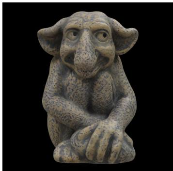  
w/o CRF

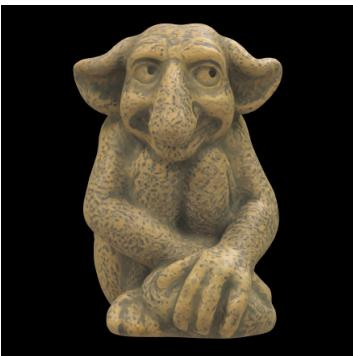  
w/ CRF

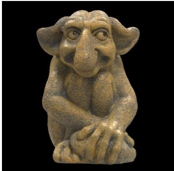  
Reference  
Figure S1: Effect of CRF. We show the effect of the CRF adjustment on the LSRM (Li et al., 2026b) prediction of the Gargoyle sample from the DTC dataset (Dong et al., 2025). Even though the material patterns are mostly captured properly by the baseline, color is shifted due to unknown lighting condition and potential training bias. CRF adjustment helps to rule out this bias and provide a more fair comparison.

Table S1: Results Without CRF Adjustment. We provide quantitative results for Table 1 without adjusting the CRF. The tendency is the same, however some metrics become heavily biased due to the decomposition ambiguity.
<table><tr><td rowspan="2">Geom. Method</td><td rowspan="2"></td><td colspan="3">Real recon (136 img)</td><td colspan="3">Synthetic recon (256 img)</td><td colspan="3">Synthetic relight (2k img)</td></tr><tr><td>PSNR↑</td><td>SSIM↑</td><td>LPIPS↓</td><td>PSNR↑</td><td>SSIM↑</td><td>LPIPS↓</td><td>PSNR↑</td><td>SSIM↑</td><td>LPIPS↓</td></tr><tr><td>Known (ref.)</td><td>DiffPT</td><td>27.01</td><td>0.959</td><td>0.0308</td><td>21.99</td><td>0.908</td><td>0.0854</td><td>21.14</td><td>0.903</td><td>0.0911</td></tr><tr><td>Recon. (LSRM)</td><td>Ours LSRM</td><td>22.66 24.56 22.22</td><td>0.930 0.926</td><td>0.0430 0.0445</td><td>30.17 20.08</td><td>0.958 0.848</td><td>0.0327 0.1296</td><td>29.89 19.80</td><td>0.954 0.847</td><td>0.0350 0.1330</td></tr></table>

## A.2 INFERENCE SCALING

As described in the main text, we are combining our proposed super-resolution model with noise rolling. The super-resolution model is trained on 512×512 input and 2048×2048 output resolution, giving 4× upscaling. To scale this further to handle 2048 × 2048 inputs, we apply progressive noise rolling. First, we generate the texture in native 2048×2048 resolution, then upsample it with nearest neighbor interpolation. We add noise according to timestep 0.2 and denoise with 50 steps using noise rolling. In Table S2 we report the runtime cost and peak VRAM usage for these generations.

Table S2: Runtime cost. Runtime cost and Peak VRAM usage. Scores are averages over four examples from the DTC dataset, measured on an NVIDIA GB300 GPU.
<table><tr><td>Method</td><td>Resolution</td><td>2K recon</td><td>8K super-res</td><td>Projection</td><td>Combined time</td><td>Peak VRAM</td></tr><tr><td>17-view</td><td>2K</td><td>130 s</td><td>一</td><td>一</td><td>2 min 10 s</td><td>22 GiB</td></tr><tr><td>117-view</td><td>2K</td><td>2610 s</td><td></td><td></td><td>43 min 30 s</td><td>48 GiB</td></tr><tr><td>17-view</td><td>8K</td><td>130 s</td><td>267 s</td><td>10 s</td><td>6 min 47 s</td><td>22 GiB</td></tr><tr><td>117-view</td><td>8K</td><td>2610 s</td><td>279 s</td><td>10 s</td><td>48 min 19 s</td><td>48 GiB</td></tr></table>

## A.3 DIFFUSION TRANSFORMER MODEL

Our input tensor, I, consists of texture-space views for N frames, alongside the world space positions and normals, also in texture space. World space positions and normals are quantized to 8 bits per channel and normalized to the [-1,1] range before the VAE encoding, E. The target latent variable, $\mathbf { z } _ { \mathrm { 0 } } ^ { \mathrm { m a t } }$ , is constructed by encoding the reference base color, and HRM (height, roughness, metallicity)

as two RGB images using the $\mathcal { E }$ encoder, then concatenating the encoded images along the temporal dimension.

## A.4 3D-AWARE ROPE

A rotary positional embedding (RoPE) which incorporates 3D positions was introduced in Roman-Tex (Feng et al., 2025), which replaces a 2D RoPE encoding of pixel xy-coordinates by a 3D-aware RoPE which encodes the 3D world space position. Positional Encoding Field (Bai et al., 2026) proposes another 3D RoPE variant, combining pixel xy-coordinates and depth. The motivation is to improve view consistencies in multi-view generation.

In this paper, we adapt a variant of this for our texture space diffusion framework, and modify the RoPE (combining pixel xy-coordinates, $\mathbf { p } _ { u v }$ and frame id $f _ { \mathrm { i d } } )$ of Wan 2.1 to a 3D-aware RoPE encoding (combining a 3D world space position and frame id: $\mathbf { p } _ { x y z } + f _ { \mathrm { i d } } )$ to inject stronger geometry guidance in our single-view and text-to-material generation pipelines.

The 3D position input for our RoPE is obtained by using the texture space view of the world space positions (normalized to [0,1]) downsampled 16× spatially to match the spatial token size (8× reduction from VAE encoding and 2× more from the DiT’s patchification). We downsample via masked pooling:

```python
import torch.nn.functional as F
2
3 def downscale_masked_pool(col, mask, eps=1e-8): # weighted sum per tile
4 col_sum = F.avg_pool2d(col <sub>*</sub> mask, kernel_size=16, stride=16)
5 mask_sum = F.avg_pool2d(mask, kernel_size=16, stride=16)
6 return col_sum / mask_sum.clamp_min(eps)
```

In the Wan2.1 1.3B version we are using, the attention head dimension is 128. RoPE allocates frequencies to each input, and the standard split is (44,42,42) for $( f _ { \mathrm { i d } } , p _ { u } , p _ { v } )$ . In our 3D-aware variant, we allocate the frequencies as (44,28,28,28) for $( f _ { \mathrm { i d } } , p _ { x } , p _ { y } , p _ { z } )$ . Each normalized world-position component is clamped to [0,1] and scaled over the full 1024-entry frequency table. We use the frequency table from Wan unmodified. We interpolate between neighboring complex frequency entries and renormalize the result to unit magnitude. The same spatial world-position map is expanded over all frames and applied to both output and conditioning tokens. Frame identity still comes from the frame component.

During training, the standard and 3D-aware RoPE variants are linearly blended over the first 2,000 steps.

## A.5 MATERIAL HEIGHT MAP

We predict material height maps to support surface details through surface normal perturbations, or bump mapping. The height map representation is convenient as it can be packed as an $( r , g , b )$ triplet with roughness and metallicity at no extra runtime cost, but extracted normals will depend on a user-adjustable height scale parameter. We follow the workflow of the AwesomeBump (Kolasinski´ , 2015) normal map library and use a height scale of α = 1 throughout the evaluation. Assuming pixel coordinates with y increasing upward, and a height field texture, $h ( x , y )$ , we compute the normal as:

$$
\hat { \mathbf { n } } ( x , y ) = \mathrm { n o r m a l i z e } \left( \alpha \left[ h ( x , y ) - h ( x + 1 , y ) \right] , \alpha \left[ h ( x , y ) - h ( x , y + 1 ) \right] , 1 \right)\tag{a}
$$

We similarly extract height maps from normal maps when generating our dataset, as most objects specify normal maps rather than height. This is considerably more complex and requires solving a Poisson equation (Queau et al. ´ , 2018):

$$
\nabla ^ { 2 } h = - \frac { 1 } { \alpha } \left[ \frac { \partial } { \partial x } \left( \frac { n _ { x } } { n _ { z } } \right) + \frac { \partial } { \partial y } \left( \frac { n _ { y } } { n _ { z } } \right) \right] .\tag{b}
$$

Since the normal maps are not necessarily integrable, an exact height reconstruction may not exist. We use the approximate iterative solver of AwesomeBump, which is fast and did not introduce objectionable artifacts in the height map. Defining $s _ { x } = n _ { x } / ( \alpha n _ { z } )$ and $s _ { y } = n _ { y } / ( \alpha n _ { z } )$ , we iteratively

Table S3: Material components. We compute metrics on g-buffer renderings for 32 scenes $\times \ 1 7$ views from multi-view guidance in our BlenderVault test set. We report scale-invariant PSNR for the base color renderings, and standard PSNR scores for base color, roughness, and metallicity g-buffer renderings.
<table><tr><td>Method</td><td colspan="2">Base color siPSNR (↑) PSNR (↑)</td><td>Roughness Metallicity PSNR (↑)</td><td>PSNR (↑)</td></tr><tr><td>Ours</td><td>29.19</td><td>27.00</td><td>24.32</td><td>18.24</td></tr><tr><td>DiffPT (Hasselgren et al., 2022)</td><td>25.08</td><td>20.21</td><td>17.98</td><td>13.23</td></tr><tr><td>LSRM (Li et al., 2026b)</td><td>23.17</td><td>15.46</td><td>13.18</td><td>14.73</td></tr></table>

update the height field (50 iterations) using:

$$
\begin{array} { l } { { h ^ { ( k + 1 ) } ( x , y ) = \displaystyle \frac { 1 } { 4 } \Big [ h ^ { ( k ) } ( x + 1 , y ) + h ^ { ( k ) } ( x - 1 , y ) + h ^ { ( k ) } ( x , y + 1 ) + h ^ { ( k ) } ( x , y - 1 ) \Big ] } } \\ { { \qquad + \displaystyle \frac { 1 } { 8 } \Big [ s _ { x } ( x + 1 , y ) - s _ { x } ( x - 1 , y ) + s _ { y } ( x , y + 1 ) - s _ { y } ( x , y - 1 ) \Big ] . } } \end{array}\tag{c}
$$

## B EVALUATION PROTOCOL

We evaluate our method using standard image-quality and perceptual metrics. For reconstruction tasks, including material extraction from multi-view captures, we report PSNR, SSIM, and LPIPS. For generative tasks, such as text-to-material and single-view material generation, we report distribution-based metrics CLIP-FID and CMMD, following common practice.

All metrics are computed on rendered images with a black background. For reconstruction tasks, we use a rendering resolution of 1024 × 1024 pixels to adequately capture high-resolution textures. We use a rendering resolution of $5 1 2 \times 5 1 2$ pixels for the distribution-based metrics, as they rely on CLIP which is limited in resolution (336×336 pixels for CMMD, utilizing the ViT-L/14@336px vision model and 224×224 pixels for CLIP-FID). We apply no image processing other than tonemapping, using either the ACES tonemapper or CRF adjustments as indicated.

Notably, the black background makes scores dependent on scene scale. For synthetic benchmarks, we use a camera path where the object bounding sphere is maximized but guaranteed to fit on screen. For the DTC (Dong et al., 2025) dataset, we pick representative views of a revolution where the object is large on screen.

Our protocol differs from the Stanford-ORB methodology (Kuang et al., 2023) adopted by DTC (Dong et al., 2025) and LSRM (Li et al., 2026b). The Stanford-ORB protocol uses a lower resolution of 512 × 512 pixels and erodes the reference image mask by 5 × 5 pixels, inserting black background in both reference and rendered image in the eroded regions. Furthermore, they use two variants of PSNR, one (PSNR-L) applied to srgb-remapped clipped (to [0, 1]) linear color values, and another (PSNR-H) applied to linear values which are clipped to [0, 4]. In both cases, the images are normalized using a mean color normalization approach (Zhang et al., 2021). The set of evaluation views are also different. As a consistency check, we evaluated the LSRM materials using the Stanford-ORB metrics pipeline and obtained scores comparable to those reported in the original paper.

Material Generation. For the single-view to material and text to material experiments, we run all algorithms with known reference geometry. Like our method, VideoMat and VideoMatGen require known geometry, and the released code of Trellis.2 (their “PBR Texture Generation mode”) and Hunyuan3D 2.1 (the Hunyuan3DPaintPipeline), both support PBR material generation with known geometry. We use the same conditioning image for all algorithms.

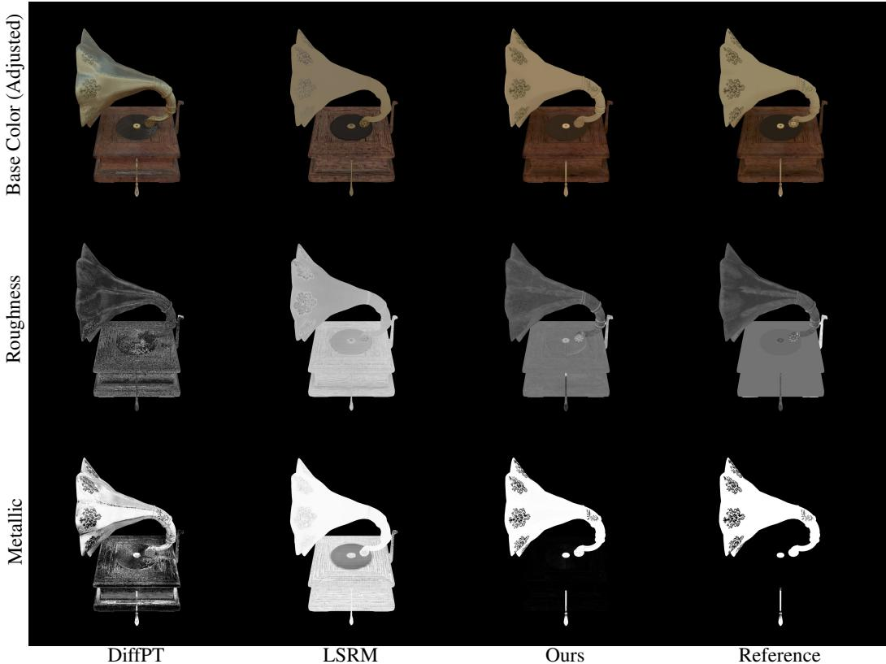  
Figure S2: Material components.

## C ADDITIONAL EVALUATIONS

## C.1 MULTI-VIEW TO MATERIALS - EVALUATIONS ON MATERIAL VOMPONENTS

In Table S3 and Figure S2 we evaluate the quality of the individual material components. As the geometry and hence UV-space is different for LSRM, we compute metrics on g-buffer renderings of the material maps on 17 views of each of the 32 scenes. To compensate for intensity shifts in the reconstructed base color, we additionally report a scale-invariant siPSNR score for that component: given a prediction x and a corresponding reference y, we normalize the prediction according to ${ \hat { x } } = x \cdot { \bar { y } } / { \bar { x } }$ , where x¯ represents a tuple with the averages over each image channel.

## C.2 CASUAL CAPTURES

In Figure S3 we show material reconstruction from casually captured photographs from the DTC (Dong et al., 2025) dataset. Similar to the high quality DTC results from the main paper, we use the high quality geometry from the DTC dataset, but the footage used for material reconstruction comes from a lower quality handheld camera video stream with less accurate poses. We randomly sample 17 frames (using temporal stratified random sampling) from the video stream.

## C.3 COMPARISON AGAINST TEXGEN (ON DIFFUSE TEXTURES)

TEXGen (Yu et al., 2024) introduced generative diffuse material creation in texture space, guided by an additional 3D structure to capture object-space locality. Our approach generates full materials using texture space diffusion from finetuned 2D diffusion priors. For a fair comparison, we compute metrics for our method and TEXGen in the single-image to material setting for diffuse-only renderings in Figure 7 and show a few example generated albedo maps in Figure S4. Note that our method solves a more complex task: predicting full PBR materials from a shaded view, while

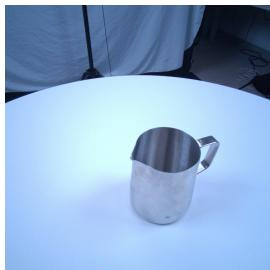

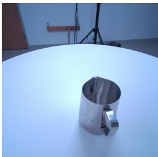

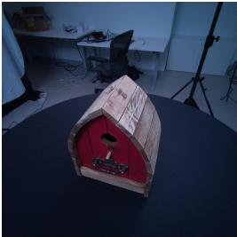

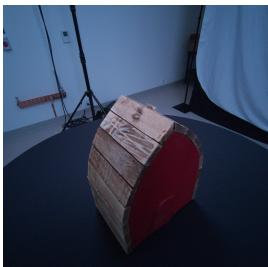

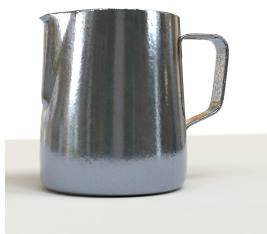

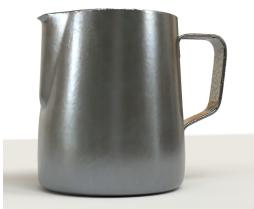

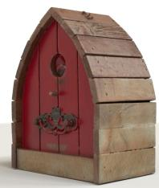

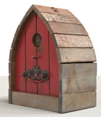  
Figure S3: Material generations from casually captured photographs, using 17 views from the DTC dataset Dong et al. (2025). We expect known camera poses and geometry in this test. Top: Input views (two selected views per example). Bottom: Our extracted materials (two seeds per example) re-rendered in novel lighting in Blender.

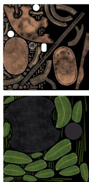  
Ref

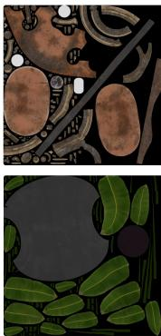  
Our

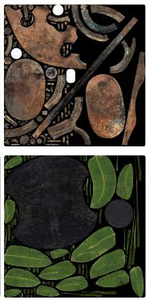  
TEXGen

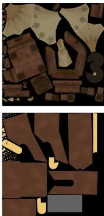  
Ref

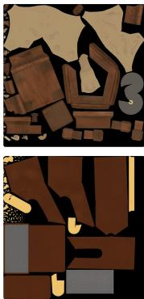  
Our

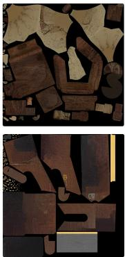  
TEXGen

Figure S4: Generated basecolor textures from single-view guidance. Overall, our method generates more consistent albedo maps than TEXGen, demodulates lighting from the conditional view (TEX Gen uses a demodulated conditional view), and outputs full PBR materials (not shown here).

TEXGen predicts only albedo maps from a demodulated view. Our method produces more coherent materials and we score higher in all metrics computed on the evaluation set of 2048 relit views.

## C.4 DTC MATERIAL RECONSTRUCTION RESULTS

In Figure S5 we show further real world results from the DTC dataset. While our method scores slightly lower on view reconstruction than differentiable rendering (DiffPT) we note that the texture details are more consistent and sharper.

## C.5 UPSCALER

Our upscaler network mainly serves as a tool that we use along with noise rolling (Bar-Tal et al., 2023; Vecchio et al., 2024) for higher resolution results, and is designed similarly to previous work. Current generative pipelines typically use ESRGAN (Wang et al., 2018) to either directly upscale material parameter textures (Tencent Hunyuan3D Team, 2025), or to upscale rendered images and rely on differentiable rendering tricks to propagate the results to the material parameters, one notable example is PBR-SR (Chen et al., 2025a). We report quantitative results in Table S4, as expected our upscaler performs on par with previous work, with differences mainly being due to training dataset and our method being intended for texture space use. Notably PBR-SR (Chen et al., 2025a) performs better on roughness and metallicity parameters, which is due to their expensive multi-view differentiable rendering optimization step.

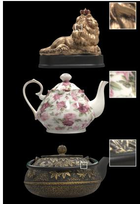  
Input view (photo)

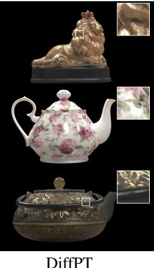

  
Our

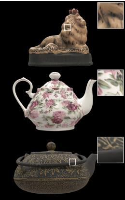  
LSRM  
Figure S5: Reconstruction - Real-World. Material reconstructions from multi-view observations (photographs with known poses) on three examples from the DTC dataset (Dong et al., 2025). For optimization-based differentiable path tracing (DiffPT) and our method, we leverage known geometry, while LSRM jointly reconstructs geometry and materials.

Table S4: Texture upscaler. Results for 4× texture upscaling comparing our method with popular alternatives. Results are quality metric averages for all textures in our synthetic dataset (32 objects).
<table><tr><td>Method</td><td colspan="2">Basecolor</td><td colspan="2">(Rgh, Met) PSNR (↑) LPIPS (↓) PSNR (↑) LPIPS (↓)</td></tr><tr><td>Our</td><td>34.7</td><td></td><td>38.0</td><td>0.025</td></tr><tr><td>PBR-SR (Chen et al., 2025a)</td><td>30.9</td><td>0.061 0.151</td><td>40.6</td><td>0.030</td></tr><tr><td></td><td></td><td></td><td></td><td>0.041</td></tr><tr><td>ESRGAN (Wang et al., 2018)</td><td>32.6</td><td>0.146</td><td>37.9</td><td></td></tr></table>

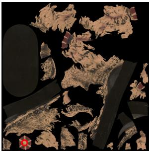  
Texture space

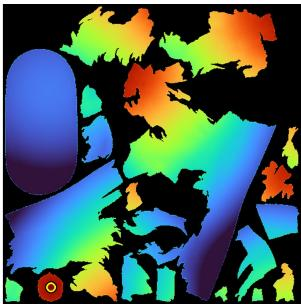  
World space distance

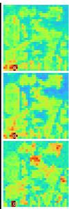  
ℓ<sub>3</sub>

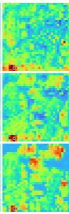  
ℓ<sub>9</sub>

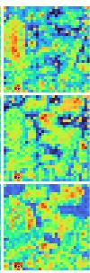  
ℓ<sub>15</sub>

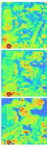  
ℓ<sub>21</sub>

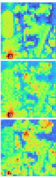  
ℓ<sub>27</sub>  
Figure S6: Attention visualization. We visualize the attention activations for a query point (red circle) for three variants: Top: The RoPE of Wan 2.1, combining pixel xy-coordinates, $\mathbf { p } _ { u v } ,$ , and the frame id $f _ { \mathrm { i d } }$ . Middle: The Wan 2.1 RoPE and G-buffer world position and normal guides, $G _ { \mathrm { b u f } }$ Bottom: Our 3D-aware RoPE $+ \ G _ { \mathrm { b u f } }$ . We show the attention activations for five layers. We note that our 3D-aware RoPE has stronger activations at similar 3D locations.

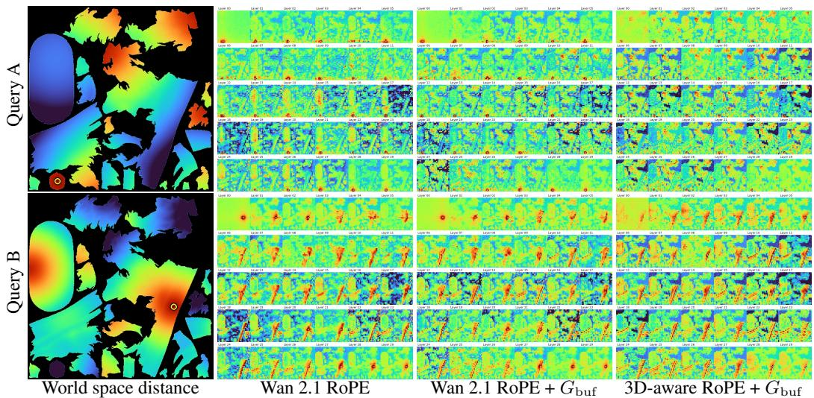  
Figure S7: Attention visualization. We show the attention activations for all layers for two query points on the lion king DTC example. The RoPE of Wan 2.1 combines pixel xy-coordinates, $\mathbf { p } _ { u v } ,$ and the frame id $f _ { \mathrm { i d } }$ . We add a G-buffer wpos and normals, $G _ { \mathrm { b u f } }$ , as conditions (middle column). In the rightmost column, we show our 3D-aware $\mathrm { R o P E } + G _ { \mathrm { b u f } } .$ . Please zoom on the PDF image to see details. For reference, the left column shows the world space distance between two points in texture space. Note that our embedding attends strongly to points closer in world space over all layers of the network.

Table S5: RoPE embedding ablation. We ablate our proposed 3D-aware rotary positional embedding against the standard Wan 2.1 RoPE on the text to material pipeline in Figure 2 of the main paper, evaluated on the same 32 scenes $\times 8$ views × 8 probes with material textures generated at a resolution of $5 1 2 \times 5 1 2$ texels.
<table><tr><td>RoPE</td><td>Inputs</td><td> $G _ { \mathrm { b u f } }$ </td><td>CLIP-FID↓</td><td>CMMD↓</td><td>LPIPS↓</td></tr><tr><td>Wan 2.1</td><td> $\mathbf { p } _ { u v } + f _ { \mathrm { i d } }$ </td><td>X</td><td>4.036</td><td>0.0405</td><td>0.1005</td></tr><tr><td>Wan 2.1</td><td> $\mathbf { p } _ { u v } + f _ { \mathrm { i d } }$ </td><td>√</td><td>3.677</td><td>0.0289</td><td>0.0971</td></tr><tr><td>3D-aware</td><td> $\mathbf { p } _ { x y z } + f _ { \mathrm { i d } }$ </td><td>1</td><td>3.561</td><td>0.0237</td><td>0.0957</td></tr></table>

## C.6 IMPACT OF 3D-AWARE ROPE

We ablate our 3D-aware RoPE, combining a 3D world space position and frame id: $\mathbf { p } _ { x y z } + f _ { \mathrm { i d } }$ against the standard Wan 2.1 RoPE (combining pixel xy-coordinates, $\mathbf { p } _ { u v }$ and $f _ { \mathrm { i d } } )$ on the text to material application, where the impact is largest. We ablate against both the standard Wan 2.1 RoPE, and Wan 2.1 $\mathsf { R o P E } { + } G _ { \mathrm { b u f } }$ where the world space position and normals are provided as VAE encoded guide images. In Figure S6 we show attention maps for a particular query point at selected layers at diffusion denoising step 15 (out of 50). As expected, our 3D-aware RoPE attends more strongly to local regions in world space, even if they are distant in texture space. In Figure S7, we show the attention maps for all layers, and note that this behavior is apparent through all layers of the network. The Wan 2.1 $\mathrm { R o P E } { + } G _ { \mathrm { b u f } }$ variant shows similar behavior but only in the middle layers of the network. Table S5 ablates the RoPE variants on text to material generation for our full synthetic dataset. Our 3D-aware RoPE shows a small but consistent improvement in quantitative metrics. This ablation uses the same model architecture and parameter count as the main experiments, but generates material textures at $5 1 2 \times 5 1 2$ rather than 2048 × 2048 resolution, which is why the results do not completely match the main evaluation in Table 2. Figure S8 shows an additional example scene from our synthetic dataset, where we run the same text to material generation with four different seeds. The Wan 2.1 RoPE results show higher variance, with the model struggling to separate geometric components in texture space.

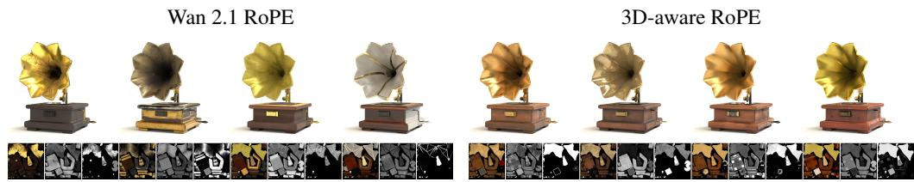  
Figure S8: Stability. Impact of RoPE embedding on a single text to material example with varying random seed. As can be seen, the 3D-aware RoPE encoding better captures the global structure of the object, and produces more consistent materials. The small insets show the base color, roughness, and metallicity maps for each generation.

Text to Material. In Figure S9 we show examples of materials generated from text conditioning only. Even though our method operates in disjoint texture space, the 3D RoPE encoding provides enough information to generate semantically meaningful materials. Texture space discontinuities also often coincide with material borders (e.g. the “Marshall” text) which can sometimes benefit our model over the image space alternatives.

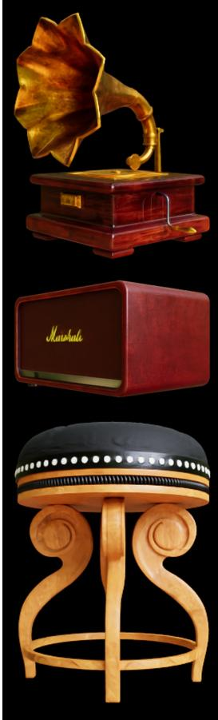  
VideoMatGen

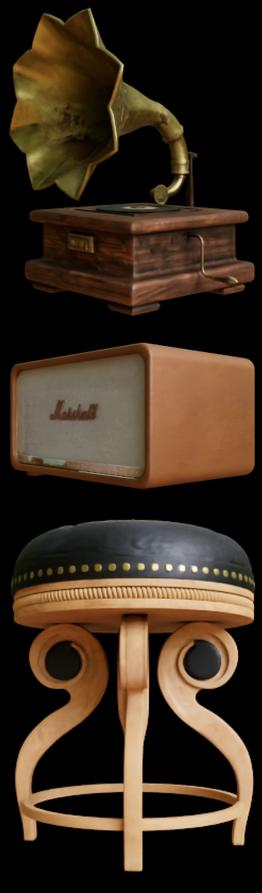  
VideoMat

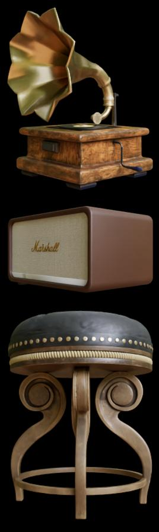  
Our

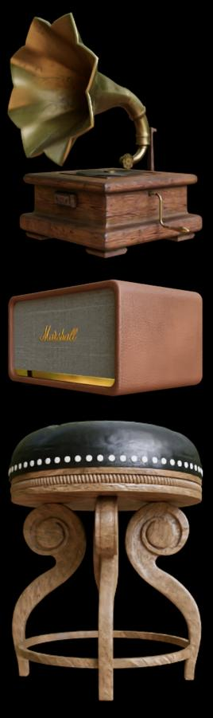  
Reference

Figure S9: Generation - Text to material. Materials from our generative method, conditioned on a text prompt and the input geometry (the UV mask, world space positions, and surface normals). We compare against VideoMat (Munkberg et al., 2025) and VideoMatGen (Hasselgren et al., 2026). Without any image guidance, our model still produces semantically meaningful materials for all examples.