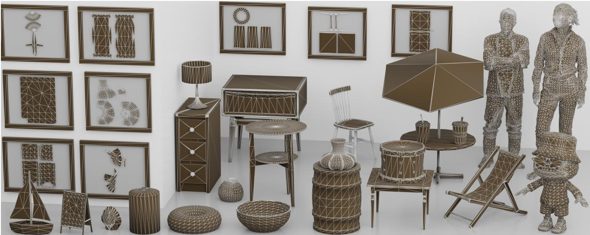
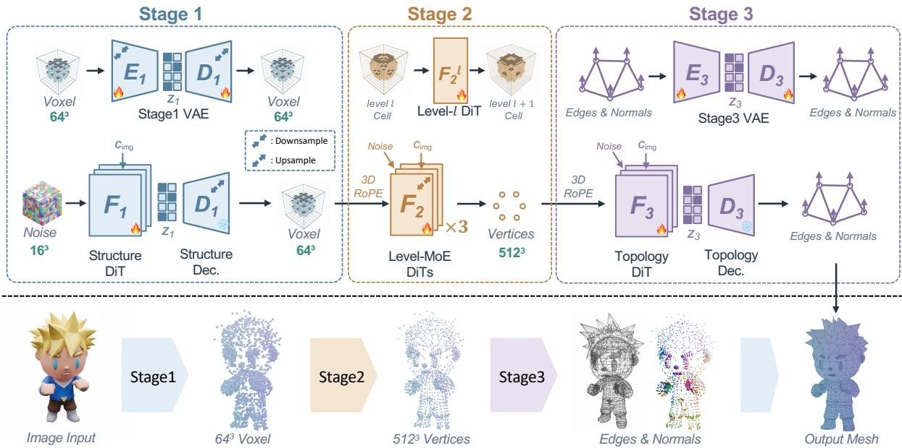
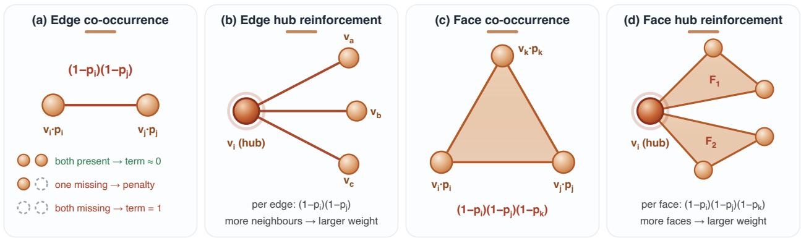
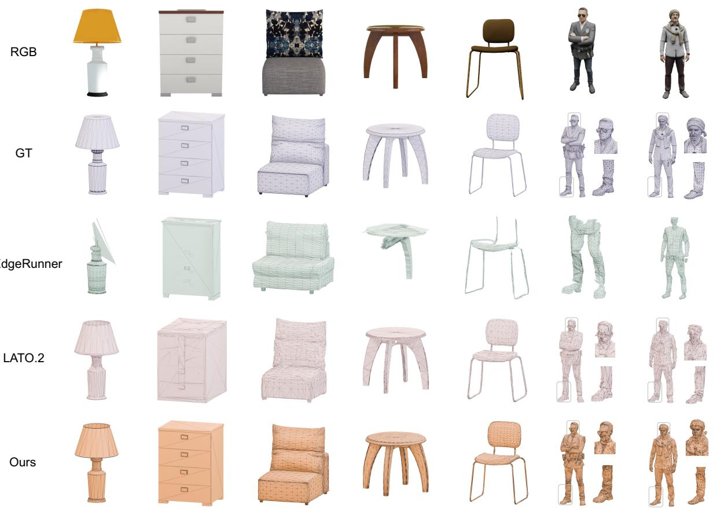
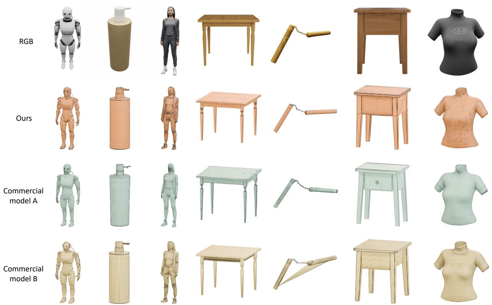
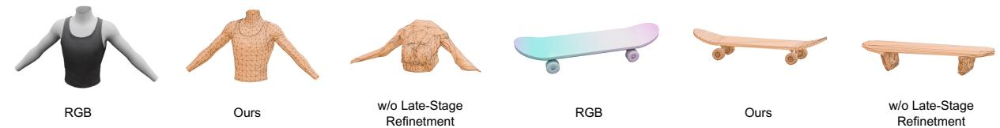

# TaoFlowForge: Progressive Native Mesh Generation via Cascaded Flow Matching

Xianze Fang\*, Qiyuan Feng\*, Dongfang Sun, Yan Zhang, Xiuchao Wu, Jingnan Gao, Jiangjing Lyu†, Chengfei Lyu†, Gang Yu

Taobao3D Team, Alibaba Group

∗These authors contributed equally, †Project Leaders

  
Figure 1 Native meshes generated by TaoFlowForge across categories (furniture, characters, props), rendered with their predicted topology. The framed images show the UV unwrappings of several meshes in the figure, also revealing the quality of their topology. Best viewed with zoom-in.

## Abstract

3D content generation technology has significantly advanced the work of designers, as well as the 3D printing and gaming industries. However, it remains dificult to produce lightweight, editable, and topologically clean artistic content that is directly production-ready. To achieve this, we present TaoFlowForge, an artistic mesh foundation model that generates productionready meshes. Specifically, TaoFlowForge decomposes the mesh generation process into vertices generation and their connectivity prediction, i.e., edges. We formulate vertices generation as a two-stage coarse-to-fine process and incorporate several efective loss functions to further enhance its performance. In the connectivity prediction stage, we propose a simple yet efective method for estimating the connectivity afinity between vertices and additionally predict per-vertex normals, which determines the correct orientation of faces. Besides, we construct a large-scale dataset combining hand-crafted 3D assets with public high-quality topology datasets. Based on this, a carefully designed data curation pipeline is employed to filter the raw dataset, retaining only high-quality topology data for model training. Our model is trained on the combined dataset and tested on both out-of-distribution hand-crafted set of 3D assets and public datasets. Under image-conditioned generation, TaoFlowForge outperforms autoregressive methods and achieves

state-of-the-art results among open-source mesh topology generators. We will release all the code and weights together with a portion of our test dataset.

Date: September 30, 2026

Project Page: https://alibaba.github.io/Taobao3D/blog/taoflowforge/

## 1 Introduction

Triangle meshes are the fundamental basis of modern 3D production pipelines, including rigging, animation, and rendering engines. Image-conditioned 3D mesh generation models can greatly simplify the workflows for artists and designers in these domains. However, not all generated triangle meshes are ready for industrial deployment. Models based on SDF representations [2, 6, 9, 17, 18, 35, 36, 38, 41, 42, 46] typically produce meshes with excessively high face counts and topologically irregular structures, which poses three major challenges: (1) UV unwrapping on complex topologies bottlenecks the entire pipeline; (2) heavy storage overhead hinders real-time on-device rendering; and (3) irregular mesh topology complicates downstream rigging and animation. These issues are especially pronounced on large-scale e-commerce platforms such as Taobao, where 3D assets serve as the interactive content of immersive VR shopping (such as the Vision Pro release of Taobao) and of on-device product display and AR placement on mobile devices.

Recent work has explored the direct generation of mesh topology, bypassing the intermediate SDF representation, in order to produce meshes with a reasonable face count and clean topology. For example, methods like DeepMesh [44], BPT [34], and [3, 19, 21, 26, 30] directly generate the discrete vertex and face sets (V, F) in a sequential manner. These autoregressive methods typically rely on a tokenizer to map meshes into a one-dimensional token space, where generation is formulated as a next-token prediction process. The generated token sequence is then converted back into a mesh using a detokenizer. Such methods are often computationally ineficient at inference time. More importantly, encoding meshes as one-dimensional token sequences discards the intrinsic structural information present in native 3D representations, which frequently results in unstable generation performance. In contrast to these methods, Nexus [32], LATO [45] and LATO.2 [20] directly generate 3D primitives with difusion models [24], achieving higher-quality topology generation. However, these methods still sufer from unstable vertex generation quality or the lack of explicit orientation prediction for generated faces. In addition to the methodological shortcomings of existing research, the shortage of appropriate training data constitutes another major challenge. 3D datasets are inherently limited and scattered across diverse sources, while only a relatively small portion satisfies the quality requirements for clean topology. As a result, obtaining suficient high-quality topological data for model training remains dificult.

To bridge this gap, we propose TaoFlowForge, a foundation model for native production-ready 3D content generation. Concretely, we decompose the pipeline into three stages. In the first stage, a latent-space DiT [24] generates coarse vertices of an object in a low-resolution canonical space. Then, a mixture-of-experts(MoE) model in the original space refines and directly upsamples these primitives to high-fidelity vertex sets. The two-stage coarse-to-fine design (we call it late-stage refinement) for vertex generation enables the vertices to maintain a globally correct structure while producing finer geometric details. Finally, in stage 3, a DiT is used to generate per-vertex features, from which a decoder predicts both the connectivity between vertices and the normal of each vertex, thereby reconstructing the final mesh with correct face normal directions.

Besides the generation architecture, we also construct a large-scale training dataset from Taobao 3D assets and publicly available datasets. A rigorous curation pipeline retains only meshes with high-quality topology. Training on this diverse dataset enables TaoFlowForge to generalise across a broad range of object categories. Our evaluations show that TaoFlowForge achieves state-of-the-art performance among open-source methods and remains competitive with proprietary commercial methods.

In summary, our core comtributions are as follows:

• A novel framework TaoFlowForge that generates product-ready 3D meshes through a cascaded late-stage

refinement procedure, ensuring structural stability and high fidelity at the same time.

• Topology-aware losses designed for vertex generation, including boundary-aware weighted binary crossentropy to address class imbalance, degree-aware regularization to reinforce structurally important vertices and coplanarity constraints to preserve face structure.

• A joint prediction algorithm that simultaneously predicts vertex connectivity and face normals, enabling accurate face recovery with correct orientation and improving topology prediction accuracy.

## 2 Related Work

Field-based mesh generation 3D content generation has evolved from object-specific optimization with pretrained 2D difusion priors [25, 33] to feed-forward reconstruction models [11, 29, 40]. Field-based methods decode implicit shapes from compact latents, with advances in vector sets [41], sharp-edge-aware autoencoding [2], triplane difusion [35], and hybrid representations [6, 17, 42, 46]. TRELLIS [38] introduces sparse spatial structures that concentrate computation near object surfaces, followed by related sparse and structured approaches [9, 18, 36, 37]. However, the extracted meshes are often dense and topologically unstructured, motivating native-mesh methods that directly generate vertices and faces using autoregressive or difusion models.

Autoregressive native mesh generation Autoregressive methods directly generate the discrete vertex and face sets in a sequential manner. [21] generates vertices followed by faces expressed as vertex-index sequences. [26] generates indices into a learned vocabulary embeddings. [3] uses pointcloud features to condition artist-mesh generation on a target shape. [44] further explores preference alignment for autoregressive mesh generation through Direct Preference Optimization (DPO). To reduce sequence redundancy, [4] reuses shared edges between consecutive adjacent triangles. [30], [34] further reduces the coordinate-token costs by improving the tokenizer. Complementary to token compression, [7] combines an hourglass architecture, truncate-sequence training, and sliding-window inference to support up to 64K faces. [31] assigns one transformer token per face, retaining autoregressive coordinate prediction within each face through a CausalMLP head. [13] restricts autoregressive generation to vertices, then predicts vertex-pair connectivity in parallel and recovers faces from mutually connected triplets. These autoregressive methods share two fundamental limitations. Firstly, their sequential decoding makes inference latency scale with sequence length. Secondly, serializing mesh topology into one-dimensional token sequences discards the intrinsic spatial information in 3D assets, which frequently leads to unstable generation as geometric complexity increases.

Difusion-based native mesh generation Difusion and flow-matching methods update mesh representations within each sampling step. [1] applies discrete difusion to quantized triangle soups, recovering coordinates from categorical noise. [8] encodes meshes into continuous face-level Variational Autoencoder(VAE) [14] tokens and generates them with a difusion transformer conditioned on the target face count. Both represent meshes through triangle faces rather than a separately generated vertex set and its connectivity. [16] jointly encodes vertex positions, normals, and adjacency into continuous MeshVAE latents modeled by a difusion transformer. [45] uses a two-stage pipeline to generate coarse structure voxels and predicts edges between vertex pairs using a connection head. [32] generates vertices through a difusion model conditioned on preceding octree levels, followed by per-vertex topology latents prediction that recovers edges and faces. These works mark a significant advance over autoregressive methods by generating mesh directly in 3D space, thereby preserving the native spatial structure of meshes and achieving better generation performance. However, it still remains challenges in generating a stable mesh structure and consistent vertex connectivity. LATO.2 lacks explicit face orientation prediction, resulting in inconsistent face normals and require post-correction. Nexus relies on hierarchical octree difusion for vertex generation, where errors accumulate across octree levels, leading to an unstable mesh structure potentially. In this work, we try to address these limitations through our method.

## 3 Method

As a preliminary, a triangle mesh is conventionally represented as a set of vertices V and faces F. In our implementation, each face is defined by three edges in the set of edges E with a normal orientation n. For topology generation, the vertices V are quantized to grid center points at a given resolution, which reduces the search space and improves generation quality.

  
Figure 2 Overview of our proposed TaoFlowForge: Stage 1: Coarse-quantized vertices are generated at $6 4 ^ { 3 }$ resolution. Stage 2: Vertex positions are progressively refined from $6 4 ^ { 3 }$ to $5 1 2 ^ { 3 }$ . Stage 3: Based on the generated vertices, we predict the final vertex connectivity to form mesh faces. Here, E and D denote the encoder and decoder, respectively, and F denotes the flow matching model in each stage, conditioned on image features $c _ { \mathrm { i m g } }$

Based on the $( \mathcal { V } , \mathcal { E } , \mathcal { F } )$ data structure, TaoFlowForge generates product-ready 3D content through three cascaded image-conditioned stages (Fig. 2). Specifically, stage 1 adapts a difusion generation model to produce a coarse $6 4 ^ { 3 }$ occupancy voxel as the coarse-quantized vertex positions. Then, stage 2 operates directly in the generated $6 4 ^ { 3 }$ occupancy voxel, applying flow matching (FM) in normalized target spaces, where three level-specific experts are used to progressively refine the field to $5 1 2 ^ { 3 }$ resolution in a late-stage manner, yielding the final vertices Vˆ. Finally, stage 3 generates the per-vertex features through a difusion model in the latent space. A topology decoder then predicts both the edge set $\hat { \mathcal { E } }$ and face normals, yielding the final faces $\hat { \mathcal { F } }$ with correct orientations. All three stages are conditioned on image features $c _ { i m g }$ extracted by DINOv3 [27].

## 3.1 Stage 1: Prior Adaptation for Coarse Structure

Given an input image, TaoFlowForge first generates coarse-quantized vertex positions for the target. Concretely, let $\mathbf { O } _ { 6 4 } \in \{ 0 , 1 \}$ }1×64×64×64 denote the coarse occupancy voxel grid at 643 resolution, which is then compressed $6 4 ^ { 3 }$ by a VAE encoder $E _ { 1 }$ to $\mathbf { z } _ { 1 } \in \mathbb { R } ^ { d _ { 1 } \times 1 6 \times 1 6 \times 1 6 }$ . First, the sparse-structure encoder $E _ { 1 }$ predicts the mean $\pmb { \mu } _ { 1 }$ and standard deviation $\pmb { \sigma } _ { 1 }$ of a diagonal Gaussian, defining the approximate posterior $q _ { 1 } ( \mathbf { z _ { 1 } } \mid \mathbf { O } _ { 6 4 } )$ over the latent $\mathbf { z _ { 1 } }$ . Correspondingly, the mirrored decoder $D _ { 1 }$ maps $\mathbf { z _ { 1 } }$ back to $\mathrm { ~ a ~ } 6 4 ^ { 3 }$ field of occupancy logits. The compress process in encoder and mapping process in decoder correspond to the downsampling and upsampling process in Figure. 2, respectively. The encoder process and the approximate posterior can be formulated as

$$
( \pmb { \mu } _ { 1 } , \pmb { \sigma } _ { 1 } ) = E _ { 1 } ( \mathbf { O } _ { 6 4 } ) , \qquad q _ { 1 } ( \mathbf { z _ { 1 \rho } } | \mathbf { O } _ { 6 4 } ) = \mathcal { N } \big ( \pmb { \mu } _ { 1 } , \mathrm { d i a g } ( \pmb { \sigma } _ { 1 } ^ { 2 } ) \big ) .\tag{1}
$$

Based on the latent $\mathbf { z _ { 1 } }$ compressed by the VAE, a flow matching(FM) model is trained to accomplish the generation of coarse-quantized vertices from $c _ { i m g }$ . The DiT is trained to predict the deterministic posterior mean $\pmb { \mu } _ { 1 } ( \mathbf { O } _ { 6 4 } )$ from the encoder $E _ { 1 }$ , standardized channel-wise. With the sampled noise $\mathbf { z } _ { 1 } ^ { 0 } \sim \mathcal { N } ( 0 , I )$ and timestep $t \in ( 0 , 1 )$ , we use the linear interpolation path $\mathbf { z } _ { 1 } ^ { t } = ( 1 - t ) \mathbf { z } _ { 1 } ^ { 0 } + t \mathbf { z } _ { 1 }$ . Its conditional velocity is constant along the path, giving the objective.

$$
\mathcal { L } _ { \mathrm { S 1 . D i T } } = \mathbb { E } \Big [ \big \| v _ { \theta } ( { \mathbf { z } } _ { 1 } ^ { t } , t , c _ { \mathrm { i m g } } ) - ( { \mathbf { z } } _ { 1 } - { \mathbf { z } } _ { 1 } ^ { 0 } ) \big \| _ { 2 } ^ { 2 } \Big ] .\tag{2}
$$

At inference, the learned velocity field is initialized from Gaussian noise. The resulting latent is then denormalized and decoded by the decoder $D _ { 1 }$ . Thresholding the decoder logits yields the coarse $6 4 ^ { 3 }$ occupancy voxel, serving as the coarse-quantized vertex positions. Since our stage 1 adopts the same architecture as the first stage of Trellis.2 [37], we are able to initialize it from the corresponding pretrained checkpoint and fine-tune it directly. This enables us to efectively leverage its learned prior for predicting the coarse object structure from images, while also substantially accelerating our training process.

## 3.2 Stage 2: Normalized Raw-Space Refinement with Level-MoE

Based on the coarse-quantized vertices, stage 2 aims to refine vertex positions through a multi-resolution refiner. Unlike stage 1, it operates directly in the uncompressed occupancy space without using a VAE. For each active parent cell $^ { g , }$ the model incorporates its spatial location through Rotary Positional Encoding (RoPE) and predicts a binary vector $\mathbf { y } ^ { ( g ) } \in \left\{ 0 , 1 \right\} ^ { 8 }$ to indicate which of the eight child cells are occupied.

Normalized Raw-Space. As the full child-occupancy target $\mathbf { y } ^ { R }$ at resolution R is binary, its statistics shift sharply with resolution, placing the raw target at a very diferent scale from the Gaussian FM source. Let $\rho _ { R } = \mathbb { E } [ y ^ { ( g ) } ] \in ( 0 , 1 )$ be the occupied fraction at resolution $R ,$ estimated once over the training set. We whiten each level with its own Bernoulli statistics,

$$
\widetilde { \mathbf { y } } ^ { R } = \frac { \mathbf { y } ^ { R } - \rho _ { R } } { \sqrt { \rho _ { R } ( 1 - \rho _ { R } ) } } ,\tag{3}
$$

where the mean $\rho _ { R }$ centres the target and the Bernoulli standard deviation $\sqrt { \rho _ { R } ( 1 - \rho _ { R } ) }$ rescales it, so that $\widetilde { \mathbf { y } } ^ { ( \ell ) }$ has zero mean and unit variance and shares the first two moments of the standard Gaussian source. With a source draw $\epsilon \sim \mathcal { N } ( 0 , I )$ we form the linear FM path

$$
{ \bf x } _ { t } ^ { R } = ( 1 - t ) \epsilon + t \widetilde { { \bf y } } ^ { R } , \qquad \epsilon \sim \mathcal { N } ( 0 , I ) ,\tag{4}
$$

whose timestep $t \in ( 0 , 1 )$ interpolates from pure noise at $t = 0$ to the whitened target at $t = 1$ . The resolution R expert $f _ { R }$ consumes the interpolated state $\mathbf { x } _ { t } ^ { R }$ , the time t, and the DINOv3 image condition ${ \mathrm { c } } _ { \mathrm { i m g } } ,$ and outputs eight raw occupancy logits $\mathbf { a } _ { R } = f _ { R } ( \mathbf { x } _ { t } ^ { R } , t , c _ { \mathrm { i m g } } ) \in \mathbb { R } ^ { 8 }$ , one per child cell; their sigmoid $\hat { \mathbf { y } } ^ { R } = \sigma ( \mathbf { a } _ { R } )$ gives the predicted child-occupancy probabilities. At inference we whiten this prediction with Eq. (3) and integrate, in normalized space, the endpoint-induced velocity

$$
v _ { \theta _ { R } } ( \mathbf { x } _ { t } ^ { R } , t ) = \frac { \widetilde { \dot { \mathbf { y } } } ^ { R } - \mathbf { x } _ { t } ^ { R } } { 1 - t } , \qquad t < 1 ,\tag{5}
$$

where $\widetilde { \widehat { \mathbf { y } } } ^ { R }$ is the whitened prediction and the guard $t < 1$ avoids the endpoint singularity; the integrated state is mapped back to occupancy space and thresholded to recover the occupied children.

Level-indexed mixture of experts. Within the hierarchical DiT framework, each refinement level increases the vertex resolution by a factor of two. As the resolution increases, the occupied fraction $\rho _ { R }$ decreases monotonically, yielding progressively sparser and statistically distinct occupancy distributions across levels. We therefore assign a dedicated expert to each resolution, allowing it to specialize in its own occupancy statistics. The experts operate in cascade order, with occupied cells output from one level becoming the input for the next, as shown in Figure. 2. The final level expert provide the refined $5 1 2 ^ { 3 }$ vertex coordinates Vˆ.

Training objectives. Every expert is supervised by comparing its predicted child-occupancy probabilities against the binary target $\mathbf { y } ^ { R }$ . The primary term is a weighted binary cross-entropy that addresses the strong imbalance quantified above. We define $p _ { c } = \sigma ( a _ { c } )$ as the predicted occupancy of child cell $^ { c , }$ with $y _ { c } \in \{ 0 , 1 \}$ as its ground-truth label. The binary training objective can be defined as

$$
\mathcal { L } _ { \mathrm { b c e } } = \frac { \sum _ { c } w _ { c } \cos \mathbf { e } _ { c } } { \sum _ { c } w _ { c } } , \qquad \mathbf { c } \mathbf { e } _ { c } = - \left[ \alpha y _ { c } \log p _ { c } + \left( 1 - y _ { c } \right) \log \left( 1 - p _ { c } \right) \right] ,\tag{6}
$$

  
Figure 3 Topology-aware co-occurrence priors of stage 2. Two soft-OR co-occupancy penalties complement per-cell cross-entropy with mesh connectivity constraints. Edge and face priors activate only when all connected vertices are jointly predicted empty, reinforcing structurally important high-degree vertices through accumulated constraints.

where the positive-class weight $\alpha > 1$ raises recall on the rare occupied cells, and the spatial weight $w _ { c }$ reshapes the negatives: $w _ { c } = 1$ on occupied cells, $w _ { c } = w _ { \mathrm { n e a r } }$ on empty cells lying within a radius r of some occupied cell, which is the thin surface band where false positives concentrate, and $w _ { c } = w _ { \mathrm { f a r } }$ on the remaining bulk-empty cells, with $w _ { \mathrm { n e a r } } > w _ { \mathrm { f a r } }$

Because this term scores every cell independently, it constrains neither vertex connectivity nor agreement across a shared edge or face, so we add two geometry-aware priors on the same probabilities (Figure. 3). Let E collect the child-cell pairs containing the two endpoints of each ground-truth edge, and $\mathcal { F }$ collect the child-cell triples containing the three vertices of each ground-truth face. The edge endpoint prior

$$
\mathcal { L } _ { \mathrm { e d g e } } = \frac { 1 } { \vert \mathcal { E } \vert } \sum _ { ( i , j ) \in \mathcal { E } } ( 1 - p _ { i } ) ( 1 - p _ { j } )\tag{7}
$$

is a soft-OR co-occupancy penalty: it vanishes as soon as either endpoint is confidently occupied and grows only when both endpoints of a true edge are jointly predicted empty, injecting mesh connectivity as an occupancy prior over the per-cell independent cross-entropy, as shown in the first panel of Figure 3. Furthermore, the objective can be rewritten as:

$$
\mathcal { L } _ { \mathrm { e d g e } } = \frac { 1 } { \vert \mathcal { E } \vert } \sum _ { i \in \mathcal { V } } ( \sum _ { j \in N ( i ) } ( 1 - p _ { j } ) ) ( 1 - p _ { i } )\tag{8}
$$

where N(i) represents the neighborhood of vertex i. In this formulation, vertices with more neighbors are assigned larger weights, enhancing the supervision of key points as shown in the second panel of Figure. 3. The face prior carries the same soft-OR logic to the three corners of a ground-truth face, as shown in the last two panel of Figure. 3,

$$
\begin{array} { r l } & { \mathcal { L } _ { \mathrm { f a c e } } = \displaystyle \frac { 1 } { | \mathcal { F } | } \sum _ { ( i , j , k ) \in \mathcal { F } } ( 1 - p _ { i } ) ( 1 - p _ { j } ) ( 1 - p _ { k } ) , } \\ & { \quad \quad \quad = \displaystyle \frac { 1 } { | \mathcal { F } | } \sum _ { i \in \mathcal { V } } ( \sum _ { \{ ( j , k ) | ( i , j , k ) \in \mathcal { F } \} } ( 1 - p _ { j } ) ( 1 - p _ { k } ) ) ( 1 - p _ { i } ) } \end{array}
$$

In summary, the full stage 2 objective, in expectation over resolution R and flow time $t ,$ combines the weighted cross-entropy with the three priors,

$$
\mathcal { L } _ { \mathrm { S 2 } } = \mathbb { E } _ { R , t } [ \mathcal { L } _ { \mathrm { b c e } } + \lambda _ { \mathrm { e } } \mathcal { L } _ { \mathrm { e d g e } } + \lambda _ { \mathrm { f } } \mathcal { L } _ { \mathrm { f a c e } } ] ,\tag{9}
$$

whose per-term weights $\lambda _ { \mathrm { e } } , \lambda _ { \mathrm { f } } \geq 0$ are set per resolution to balance the priors against the cross-entropy.

## 3.3 Stage 3: Per-Vertex Topology Generation

Given the vertex set $\hat { \mathcal { V } }$ from stage 2, stage 3 directly predicts vertex connectivity (i.e. edges $\mathcal { E } )$ and per-vertex normal orientations as shown in Figure. 2. It combines a topology VAE with a latent flow matching model. The VAE learns a continuous feature for each vertex, with vertex connectivity and vertex normal encoded. During the DiT inference stage, the vertex coordinates associated with voxel centers quantized at a certain resolution in stage 2 are incorporated into the latent features using rotary positional encoding (RoPE).

Topology VAE. Unlike the occupancy VAE inherited in stage 1, this VAE performs no spatial compression: it attaches exactly one latent code to each vertex, so the number of latents always equals the vertex count $V = | \hat { \mathcal { V } } |$ . It encodes two key pieces of information: how the vertex connects to others, as well as the surface normal at that vertex. The vertex coordinates, already determined by stage 2, are not re-encoded.

The connectivity head determines whether an edge exists between each pair of vertices. A naive design would compare the two endpoint features $( \mathbf { f } _ { i } , \mathbf { f } _ { j } )$ by a symmetric similarity, such as the inner product $\langle W \mathbf { f } _ { i } , W \mathbf { f } _ { j } \rangle$ under a single shared projection. However, this inner product inside one embedding space favours transitive connectivity: once A is similar to B and $B$ to $C ,$ the score of $( A , C )$ is pushed up as well, which can produce numerous false connections in mesh adjacency prediction. We instead project each vertex into two distinct subspaces before matching. Writing $\mathbf { h } _ { i } \in \mathbb { R } ^ { d }$ for the feature of vertex $i ,$ a shared edge MLP maps it to $\mathbf { f } _ { i } = g _ { e } ( \mathbf { h } _ { i } ) \in \mathbb { R } ^ { d _ { e } }$ , and two independent bias-free projections form source $W _ { s }$ and destination $W _ { d }$ embeddings,

$$
\begin{array} { r } { \mathbf { s } _ { i } = W _ { s } \mathbf { f } _ { i } , \qquad \mathbf { d } _ { i } = W _ { d } \mathbf { f } _ { i } , \qquad W _ { s } , W _ { d } \in \mathbb { R } ^ { d _ { e } \times d _ { e } } . } \end{array}\tag{10}
$$

Because mesh edges are undirected, we symmetrise by:

$$
a _ { i j } = { \frac { Q _ { i j } + Q _ { j i } } { 2 } } = { \frac { { \bf s } _ { i } ^ { \top } { \bf d } _ { j } + { \bf s } _ { j } ^ { \top } { \bf d } _ { i } } { 2 } } + b .\tag{11}
$$

$a _ { i j } = a _ { j i }$ is the logit judging whether there is an edge between vertex i and $j .$ The complete $V \times V$ logit matrix is produced in parallel by batched matrix multiplication. At training, the connectivity term $\mathcal { L } _ { \mathrm { e d g e } }$ is a class-balanced binary cross-entropy over the valid upper-triangular logits. At inference, thresholding these probabilities defines the edge set $\hat { \hat { \mathcal { E } } } .$ Triangular faces are then recovered as the closed three-cycles of this edge graph,

$$
\hat { \mathcal { F } } = \{ ( i , j , k ) : i < j < k , ( i , j ) , ( j , k ) , ( k , i ) \in \hat { \mathcal { E } } \} .\tag{12}
$$

The recovered edge graph fixes which triangles exist but leaves their orientation undefined. Unlike some methods such as LATO.2 [20] adapting post-process to recover face orientation, we instead let the network emit orientation directly. Specifically, we use a normal head in decoder which runs in parallel and regresses a unit normal $\hat { \mathbf { n } } _ { i }$ for each vertex from the same feature $\mathbf { f } _ { i } .$ , supervised by a cosine term $\mathcal { L } _ { \mathrm { n o r m a l } }$ against the ground-truth vertex normals. For a recovered face $( i , j , k )$ with positions $\mathbf { v } _ { i } , \mathbf { v } _ { j } , \mathbf { v } _ { k }$ and geometric normal ${ \bf g } _ { i j k } = \left( { \bf v } _ { j } - { \bf v } _ { i } \right) \times \left( { \bf v } _ { k } - { \bf v } _ { i } \right)$ , the winding is kept when it agrees with the predicted vertex normals and two vertices are swapped otherwise,

$$
( i , j , k ) \mapsto \left\{ { \begin{array} { l l } { ( i , j , k ) , } & { \mathbf { g } _ { i j k } \cdot \left( { \hat { \mathbf { n } } } _ { i } + { \hat { \mathbf { n } } } _ { j } + { \hat { \mathbf { n } } } _ { k } \right) \geq 0 , } \\ { ( i , k , j ) , } & { { \mathrm { o t h e r w i s e } } . } \end{array} } \right.\tag{13}
$$

The two heads share the decoder and are optimised together with a Gaussian regulariser ${ \mathcal { L } } _ { \mathrm { K I } }$ on the per-vertex posteriors, giving the topology VAE objective

$$
\mathcal { L } _ { \mathrm { S 3 } _ { \mathrm { - } } \mathrm { V A E } } = \mathcal { L } _ { \mathrm { e d g e } } + \lambda _ { n } \mathcal { L } _ { \mathrm { n o r m a l } } + \lambda _ { r } \mathcal { L } _ { \mathrm { K L } } ,\tag{14}
$$

in which per-term weights $\lambda _ { n } , \lambda _ { r } \geq 0$ are set to balance the losses.

Position-aware latent FM. The per-vertex latent target $\mathbf { z } _ { 3 }$ is standardised with dataset statistics and paired with Gaussian noise ${ \bf z } _ { 3 } ^ { 0 }$ . Vertex coordinates from stage 2, quantized at the final resolution level, are injected into every DiT block via three-dimensional RoPE, where each token is assigned the coordinate of its corresponding vertex. The DiT therefore predicts one topology feature per known vertex while retaining its native spatial location. Conditioned on the DINOv3 image feature $c _ { i m g } ,$ it is trained with the velocity objective

$$
\mathcal { L } _ { \mathrm { S 3 . D i T } } = \mathbb { E } \left[ \left\| v _ { \psi } ( \mathbf { z } _ { 3 } ^ { t } , t , \hat { \mathcal { V } } , c _ { \mathrm { i m g } } ) - ( \mathbf { z } _ { 3 } - \mathbf { z } _ { 3 } ^ { 0 } ) \right\| _ { 2 } ^ { 2 } \right] , \qquad \mathbf { z } _ { 3 } ^ { t } = ( 1 - t ) \mathbf { z } _ { 3 } ^ { 0 } + t \mathbf { z } _ { 3 } .\tag{15}
$$

The generated latents are denormalized before topology decoding.

## 3.4 Training Data

Data sources. TaoFlowForge is trained on a large and intentionally heterogeneous mesh dataset drawn from three complementary sources: 1. Taobao in-house 3D dataset, dominated by everyday indoor commodities and character models. 2. Manually crafted in-house dataset, which densifies the categories our catalogue covers only sparsely. 3. Public open-source dataset, including Objaverse [5] and TexVerse [43]. The scale and diversity of our training dataset are essential for topological generalization and explain why TaoFlowForge transfers well to in-the-wild product imagery. For every asset, we render a full 360◦ ring of surrounding views with a physically based renderer, providing the paired image-mesh supervision for training. Although most of these meshes already have clean, well-structured topology, the raw collection still contains many low-quality, noisy samples that must be filtered out before they are usable for topology supervision.

Data curation. A carefully designed multi-stage curation pipeline is adopted to filter the raw dataset. We first bucket all assets by face count and sample the buckets as evenly as possible during training, so that neither low-poly nor dense meshes dominate the gradient and the model observes the full spectrum of mesh complexity. We then screen the entire dataset with a suite of classical topology statistics, including the fraction of non-manifold faces, the distribution of vertex degrees (the number of edges incident to each vertex), and the spatial uniformity of the vertex layout, keeping only assets whose connectivity is regular enough to supply a learnable edge-flow signal. Beyond these hand-crafted criteria, we further build a VLM-based agent that inspects the rendered views of each surviving asset and prunes the residual low-quality cases that the numeric filters overlook, progressively refining the corpus down to the artist-grade topology on which TaoFlowForge is trained. The final curated dataset consists of roughly 800,000 meshes.

## 4 Experiments

## 4.1 Implementation Details

Test Set For evaluation we use the public Toys4K [28] test split together with TE-388, a dataset of 388 manually crafted examples spanning indoor, outdoor, and character categories, which we will release later.

Architecture details. Stage 1 couples an occupancy VAE (3D convolutional encoder-decoder compressing $6 4 ^ { 3 }  1 6 ^ { 3 } \times 8 )$ with a 30-block latent flow DiT (≈1.3B parameters) that cross-attends to frozen DINOv3 tokens. Stage 2 operates in raw occupancy space without a VAE, employing three parameter-independent 28-block transformer experts for the $6 4 ^ { 3 } \mathrm {  1 2 8 ^ { 3 } , 1 2 8 ^ { 3 } \mathrm {  2 5 6 ^ { 3 } } }$ , and $2 5 6 ^ { 3 } {  } 5 1 2 ^ { 3 }$ transitions, with targets standardized per level. Stage 3 pairs a per-vertex topology VAE (VecSet-style encoder pooling into 2048 latent tokens, bilinear decoder predicting pairwise connectivity and normals) with a 32-layer latent flow DiT that injects vertex coordinates via voxel RoPE. All stages cross-attend to DINOv3 tokens for image conditioning.

Evaluation metrics. We assess geometry with two surface distances, semantics with two image-shape alignment scores, and rendering fidelity with two Fr´echet feature distances. Chamfer Distance (CD) is computed between dense point samples of the generated and ground-truth surfaces and reflects mean surface deviation.Hausdorf Distance (HD) is taken on the same point samples as the maximum of the two directional worst-case distances.ULIP-I [39] measures whether the generated shape matches the conditioning image in a joint embedding space. Uni3D-I [47] follows the same image-to-shape alignment protocol with 10,000 points and the larger Uni3D point encoder aligned to an EVA-CLIP image tower; higher is better. FD-Inception [10] is a distribution-level Fr´echet distance over multi-view renders of the generated and reference meshes under a shared untextured shading protocol. FD-DINOv2 applies the same Fr´echet distance to features from a DINOv2 ViT-L/14 [23] encoder (1024-dimensional class token).

## 4.2 Image Conditioned Mesh Generation

TaoFlowForge is conditioned on a single product image: patch tokens from a frozen DINOv3 [27] backbone are routed into every DiT block through cross-attention. This image-only interface runs no 3D encoder at inference and matches our production deployment, and we use it for every result reported in this section.

Baselines. We compare TaoFlowForge against two representative open-source image-conditioned mesh generators: LATO.2 [20], a difusion-based generator, and EdgeRunner [30], an autoregressive generator. These two cover the dominant paradigms for native mesh generation, and both take the same single-image input as TaoFlowForge, so the comparison is matched in input information. We evaluate on the public Toys4K [28] benchmark and on TE-388, our proposed test set of 338 manually crafted meshes spanning indoor, outdoor, and character categories. For each baseline we use the publicly released checkpoint and follow its recommended inference protocol.

Quantitative comparison. Table. 1 reports all six metrics defined in Sec. 4.1 on Toys4K and TE-388: Chamfer (CD) and Hausdorf (HD) distances for geometric accuracy, ULIP-I and Uni3D-I for image-to-shape semantic alignment, and FD-Inception and FD-DINOv2 for distribution-level rendering fidelity. All three methods are evaluated under an identical single-image protocol, so they difer only in their generative formulation.

Table 1 Quantitative comparison on Toys4K and TE-388 under single-image conditioning.
<table><tr><td>Method</td><td>CD↓</td><td>HD↓</td><td>ULIP-I ↑</td><td>Uni3D-I ↑</td><td>FD-Incep. ↓</td><td>FD-DINOv2 ↓</td></tr><tr><td>Toys4K</td><td></td><td></td><td></td><td></td><td></td><td></td></tr><tr><td>LATO.2 [20]</td><td>0.1553</td><td>0.3663</td><td>0.1674</td><td>0.3330</td><td>78.9649</td><td>616.4222</td></tr><tr><td>EdgeRunner [30]</td><td>0.3264</td><td>0.6145</td><td>0.1514</td><td>0.2347</td><td>30.9466</td><td>339.7754</td></tr><tr><td>TaoFlowForge (Ours)</td><td>0.0655</td><td>0.2451</td><td>0.1923</td><td>0.3509</td><td>18.1812</td><td>197.7314</td></tr><tr><td>TE-388</td><td></td><td></td><td></td><td></td><td></td><td></td></tr><tr><td>LATO.2 [20]</td><td>0.0991</td><td>0.2990</td><td>0.1509</td><td>0.2978</td><td>119.9100</td><td>931.6500</td></tr><tr><td>EdgeRunner [30]</td><td>0.3990</td><td>0.7102</td><td>0.1261</td><td>0.1878</td><td>67.0844</td><td>651.5899</td></tr><tr><td>TaoFlowForge (Ours)</td><td>0.0415</td><td>0.2075</td><td>0.1829</td><td>0.3106</td><td>43.2544</td><td>363.7326</td></tr></table>

Qualitative comparison. As illustrated in Figure. 4, the two baselines exhibit characteristic failure modes. EdgeRunner, an autoregressive generator, tends to output smoothed convex hulls with irregular triangulation and often drops thin or topologically isolated structures: limbs go missing, hair collapses into a single shell, and intricate facial features are washed out into approximate blobs. LATO2, a difusion generator over topologypreserving latents, recovers global shape well; in side-by-side comparison TaoFlowForge produces cleaner local triangulation and better preserves thin, branchy parts. TaoFlowForge recovers these structures because (i) its cascaded occupancy vertex stage is sparse but not isotropic and naturally accommodates thin extrusions, and (ii) its closed-form connection head does not impose a manifold assumption, so two thin components that meet at a single vertex remain valid in the latent edge space. Similarly, as shown in Figure. 5, we further compare TaoFlowForge against two leading proprietary commercial models. TaoFlowForge remains highly competitive with these commercial models in terms of overall geometry quality, fine-structure preservation, and topological fidelity.

Gallery for more results. Figure. 7 presents additional image-conditioned generation results. It can be seen that our method yields meshes with strong global structural stability and fine geometric details, and generalizes efectively across a wide range of categories.

  
Figure 4 Qualitative comparison with open-source polygon-based 3D mesh generation models. Given an image as input, our model generates the finest and most complete 3D meshes.

Table 2 Ablation of stage 2 normalisation and topology-aware losses.
<table><tr><td>Stage 2 variant</td><td>CD↓</td><td>HD↓</td><td>ULIP-I ↑</td><td>Uni3D-I ↑</td><td>FD-Incep. ↓</td><td>FD-DINOv2 ↓</td></tr><tr><td>w/o. Geometry-aware Losses</td><td>0.0771</td><td>0.2734</td><td>0.1515</td><td>0.2501</td><td>52.6284</td><td>423.8286</td></tr><tr><td>w/o. Normalised Target</td><td>0.0576</td><td>0.2529</td><td>0.1647</td><td>0.2897</td><td>47.2389</td><td>390.2450</td></tr><tr><td>Ours</td><td>0.0415</td><td>0.2075</td><td>0.1829</td><td>0.3106</td><td>43.2544</td><td>363.7326</td></tr></table>

## 4.3 Ablation Studies

We evaluate two design questions in our vertex generation pipeline. The first study quantifies the efects of stage 2 level normalization and geometry-aware losses on TE-388. The second study qualitatively examines whether combining stage 1 and stage 2 as late-stage progressive refinement improves structural stability.

Stage 2 normalisation and geometry-aware losses. We compare three matched stage 2 variants while keeping stage 1, stage 3, training data, and inference settings fixed. The first uses level-wise Bernoulli normalization with only weighted BCE. The second predicts unnormalized raw occupancy with geometry-aware losses added. The full model combines normalization with all geometry-aware terms in Eq. (9). As shown in Table. 2, model performance drops when the geometry-aware losses or the normalization strategy is removed.

Late-stage progressive refinement. We compare the full stage 1 to stage 2 cascade with a matched single-stage variant that attempts to generate the final 5123 vertex support directly. As illustrated in Figure. 6, replacing the late-stage refinement strategy with direct continuous upsampling degrades both the overall skateboard geometry and the fidelity of the wheel details. The progressive model is expected to preserve the global layout established by stage 1 while stage 2 adds fine vertices within that support, yielding more stable structures than direct high-resolution generation.

  
Figure 5 Qualitative comparison with commercial polygon-based 3D mesh generation models. Given an image, our model generates more detailed and stable meshes with better alignment.

  
Figure 6 Qualitative ablation of late-stage progressive refinement, comparing continuous vertex generation with the late-stage refinement on structurally challenging examples.

## 5 Conclusion

We present a progressive native mesh generation framework developed as the foundation model of the Taobao 3D pipeline. In the future, TaoFlowForge can be applied to more general generation pipelines, such as serving as a component of large-scale multimodal models [22], generating 3D scenes based on scene graphs [12], or producing UV-space textures based on the unwrapping results [15] of our methods.

# input OTOR+[ output input output input output input output

Figure 7 Additional image conditioned results. Our method generates meshes with both strong global structural stability and high-fidelity local details.Best viewed with zoom-in.

## References

[1] Antonio Alliegro, Yawar Siddiqui, Tatiana Tommasi, and Matthias Nießner. Polydif: Generating 3d polygonal meshes with difusion models. CoRR, abs/2312.11417, 2023. doi: 10.48550/ARXIV.2312.11417. URL https: //doi.org/10.48550/arXiv.2312.11417.

[2] Rui Chen, Jianfeng Zhang, Yixun Liang, Guan Luo, Weiyu Li, Jiarui Liu, Xiu Li, Xiaoxiao Long, Jiashi Feng, and Ping Tan. Dora: Sampling and benchmarking for 3d shape variational auto-encoders. In IEEE/CVF Conference on Computer Vision and Pattern Recognition, CVPR 2025, Nashville, TN, USA, June 11-15, 2025, pages 16251–16261. Computer Vision Foundation / IEEE, 2025. doi: 10. 1109/CVPR52734.2025.01515. URL https://openaccess.thecvf.com/content/CVPR2025/html/Chen\_Dora\_ Sampling\_and\_Benchmarking\_for\_3D\_Shape\_Variational\_Auto-Encoders\_CVPR\_2025\_paper.html.

[3] Yiwen Chen, Tong He, Di Huang, Weicai Ye, Sijin Chen, Jiaxiang Tang, Zhongang Cai, Lei Yang, Gang Yu, Guosheng Lin, and Chi Zhang. Meshanything: Artist-created mesh generation with autoregressive transformers. In The Thirteenth International Conference on Learning Representations, ICLR 2025, Singapore, April 24-28, 2025. OpenReview.net, 2025. URL https://openreview.net/forum?id=KGZAs8VcOM.

[4] Yiwen Chen, Yikai Wang, Yihao Luo, Zhengyi Wang, Zilong Chen, Jun Zhu, Chi Zhang, and Guosheng Lin. Meshanything V2: artist-created mesh generation with adjacent mesh tokenization. In IEEE/CVF International Conference on Computer Vision, ICCV 2025, Honolulu, HI, USA, October 19-25, 2025, pages 13922–13931. IEEE, 2025. doi: 10.1109/ICCV51701.2025.01292. URL https://doi.org/10.1109/ICCV51701.2025.01292.

[5] Matt Deitke, Dustin Schwenk, Jordi Salvador, Luca Weihs, Oscar Michel, Eli VanderBilt, Ludwig Schmidt, Kiana Ehsani, Aniruddha Kembhavi, and Ali Farhadi. Objaverse: A universe of annotated 3d objects. In IEEE/CVF Conference on Computer Vision and Pattern Recognition, CVPR 2023, Vancouver, BC, Canada, June 17-24, 2023, pages 13142–13153. IEEE, 2023. doi: 10.1109/CVPR52729.2023.01263. URL https://doi.org/10.1109/ CVPR52729.2023.01263.

[6] Jingyu Guo, Sensen Gao, Jia-Wang Bian, Wanhu Sun, Heliang Zheng, Rongfei Jia, and Mingming Gong. Hyper3d: Eficient 3d representation via hybrid triplane and octree feature for enhanced 3d shape variational auto-encoders. CoRR, abs/2503.10403, 2025. doi: 10.48550/ARXIV.2503.10403. URL https://doi.org/10.48550/arXiv.2503. 10403.

[7] Zekun Hao, David W. Romero, Tsung-Yi Lin, and Ming-Yu Liu. Meshtron: High-fidelity, artist-like 3d mesh generation at scale. CoRR, abs/2412.09548, 2024. doi: 10.48550/ARXIV.2412.09548. URL https://doi.org/10. 48550/arXiv.2412.09548.

[8] Xianglong He, Junyi Chen, Di Huang, Zexiang Liu, Xiaoshui Huang, Wanli Ouyang, Chun Yuan, and Yangguang Li. Meshcraft: Exploring eficient and controllable mesh generation with flow-based dits. CoRR, abs/2503.23022, 2025. doi: 10.48550/ARXIV.2503.23022. URL https://doi.org/10.48550/arXiv.2503.23022.

[9] Xianglong He, Zi-Xin Zou, Chia-Hao Chen, Yuan-Chen Guo, Ding Liang, Chun Yuan, Wanli Ouyang, Yan-Pei Cao, and Yangguang Li. Sparseflex: High-resolution and arbitrary-topology 3d shape modeling. In IEEE/CVF International Conference on Computer Vision, ICCV 2025, Honolulu, HI, USA, October 19-25, 2025, pages 14822–14833. IEEE, 2025. doi: 10.1109/ICCV51701.2025.01375. URL https://doi.org/10.1109/ICCV51701. 2025.01375.

[10] Martin Heusel, Hubert Ramsauer, Thomas Unterthiner, Bernhard Nessler, and Sepp Hochreiter. Gans trained by a two time-scale update rule converge to a local nash equilibrium. In Isabelle Guyon, Ulrike von Luxburg, Samy Bengio, Hanna M. Wallach, Rob Fergus, S. V. N. Vishwanathan, and Roman Garnett, editors, Advances in Neural Information Processing Systems 30: Annual Conference on Neural Information Processing Systems 2017, December 4-9, 2017, Long Beach, CA, USA, pages 6626–6637, 2017. URL https://proceedings.neurips.cc/ paper/2017/hash/8a1d694707eb0fefe65871369074926d-Abstract.html.

[11] Yicong Hong, Kai Zhang, Jiuxiang Gu, Sai Bi, Yang Zhou, Difan Liu, Feng Liu, Kalyan Sunkavalli, Trung Bui, and Hao Tan. LRM: large reconstruction model for single image to 3d. In The Twelfth International Conference on Learning Representations, ICLR 2024, Vienna, Austria, May 7-11, 2024. OpenReview.net, 2024. URL https://openreview.net/forum?id=sllU8vvsFF.

[12] Justin Johnson, Agrim Gupta, and Li Fei-Fei. Image generation from scene graphs. In 2018 IEEE Conference on Computer Vision and Pattern Recognition, CVPR 2018, Salt Lake City, UT, USA, June 18-22, 2018, pages 1219– 1228. Computer Vision Foundation / IEEE Computer Society, 2018. doi: 10.1109/CVPR.2018.00133. URL http:// openaccess.thecvf.com/content\_cvpr\_2018/html/Johnson\_Image\_Generation\_From\_CVPR\_2018\_paper.html.

[13] Jeonghwan Kim, Yushi Lan, Armando Fortes, Yongwei Chen, and Xingang Pan. FASTMESH: eficient artistic mesh generation via component decoupling. In International Conference on 3D Visio, 3DV 2026, Vancouver, BC, Canada, March 20-23, 2026, pages 1478–1488. IEEE, 2026. doi: 10.1109/3DV69130.2026.00141. URL https://doi.org/10.1109/3DV69130.2026.00141.

[14] Diederik P. Kingma and Max Welling. Auto-encoding variational bayes. In Yoshua Bengio and Yann LeCun, editors, 2nd International Conference on Learning Representations, ICLR 2014, Banf, AB, Canada, April 14-16, 2014, Conference Track Proceedings, 2014. URL http://arxiv.org/abs/1312.6114.

[15] Bruno L´evy, Sylvain Petitjean, Nicolas Ray, and J´erˆome Maillot. Least squares conformal maps for automatic texture atlas generation. ACM Trans. Graph., 21(3):362–371, 2002. doi: 10.1145/566654.566590. URL https: //doi.org/10.1145/566654.566590.

[16] Weiyu Li, Antoine Toisoul, Tom Monnier, Roman Shapovalov, Rakesh Ranjan, Ping Tan, and Andrea Vedaldi. Meshflow: Eficient artistic mesh generation via meshvae and flow-based difusion transformer. CoRR, abs/2606.04621, 2026. doi: 10.48550/ARXIV.2606.04621. URL https://doi.org/10.48550/arXiv.2606.04621.

[17] Yangguang Li, Zi-Xin Zou, Zexiang Liu, Dehu Wang, Yuan Liang, Zhipeng Yu, Xingchao Liu, Yuan-Chen Guo, Ding Liang, Wanli Ouyang, and Yan-Pei Cao. Triposg: High-fidelity 3d shape synthesis using largescale rectified flow models. CoRR, abs/2502.06608, 2025. doi: 10.48550/ARXIV.2502.06608. URL https: //doi.org/10.48550/arXiv.2502.06608.

[18] Zhihao Li, Yufei Wang, Heliang Zheng, Yihao Luo, and Bihan Wen. Sparc3d: Sparse representation and construction for high-resolution 3d shapes modeling. In Danielle Belgrave, Cheng Zhang, Laura N. Montoya, Hsuan-Tien Lin, Razvan Pascanu, Piotr Koniusz, Marzyeh Ghassemi, Nancy Chen, Iv´an Vladimir Meza Ru´ız, and Arturo Loaiza-Bonilla, editors, Advances in Neural Information Processing Systems 38: Annual Conference on Neural Information Processing Systems 2025, NeurIPS 2025, San Diego, CA, USA, December 2-7, 2025 / Mexico City, Mexico, November 30 - December 5, 2025, 2025. URL http://papers.nips.cc/paper\_files/paper/2025/ hash/abe731f5242ea6d582f859164b6bbd3c-Abstract-Conference.html.

[19] Stefan Lionar, Jiabin Liang, and Gim Hee Lee. Treemeshgpt: Artistic mesh generation with autoregressive tree sequencing. In IEEE/CVF Conference on Computer Vision and Pattern Recognition, CVPR 2025, Nashville, TN, USA, June 11-15, 2025, pages 26608–26617. Computer Vision Foundation / IEEE, 2025. doi: 10.1109/CVPR52734. 2025.02478. URL https://openaccess.thecvf.com/content/CVPR2025/html/Lionar\_TreeMeshGPT\_Artistic\_ Mesh\_Generation\_with\_Autoregressive\_Tree\_Sequencing\_CVPR\_2025\_paper.html.

[20] Hang Long, Tianhao Zhao, Junkai Lin, Youjia Zhang, Huipeng Guo, Rendong Liang, Jiale Xu, Jozef Hladk´y, Matthias Nießner, Yuanming Hu, and Wei Yang. LATO.2: factorized 3d mesh generation with vertex and topology flow. CoRR, abs/2607.10623, 2026. doi: 10.48550/ARXIV.2607.10623. URL https://doi.org/10.48550/arXiv. 2607.10623.

[21] Charlie Nash, Yaroslav Ganin, S. M. Ali Eslami, and Peter W. Battaglia. Polygen: An autoregressive generative model of 3d meshes. In Proceedings of the 37th International Conference on Machine Learning, ICML 2020, 13-18 July 2020, Virtual Event, volume 119 of Proceedings of Machine Learning Research, pages 7220–7229. PMLR, 2020. URL http://proceedings.mlr.press/v119/nash20a.html.

[22] OpenAI. Gpt-6 (astra/sol/luna). https://www.openai.com, 2026. Version/Model family released in 2026.

[23] Maxime Oquab, Timoth´ee Darcet, Th´eo Moutakanni, Huy V. Vo, Marc Szafraniec, Vasil Khalidov, Pierre Fernandez, Daniel Haziza, Francisco Massa, Alaaeldin El-Nouby, Mido Assran, Nicolas Ballas, Wojciech Galuba, Russell Howes, Po-Yao Huang, Shang-Wen Li, Ishan Misra, Michael Rabbat, Vasu Sharma, Gabriel Synnaeve, Hu Xu, Herv´e J´egou, Julien Mairal, Patrick Labatut, Armand Joulin, and Piotr Bojanowski. Dinov2: Learning robust visual features without supervision. Trans. Mach. Learn. Res., 2024, 2024. URL https://openreview. net/forum?id=a68SUt6zFt.

[24] William Peebles and Saining Xie. Scalable difusion models with transformers. In IEEE/CVF International Conference on Computer Vision, ICCV 2023, Paris, France, October 1-6, 2023, pages 4172–4182. IEEE, 2023. doi: 10.1109/ICCV51070.2023.00387. URL https://doi.org/10.1109/ICCV51070.2023.00387.

[25] Ben Poole, Ajay Jain, Jonathan T. Barron, and Ben Mildenhall. Dreamfusion: Text-to-3d using 2d difusion. In The Eleventh International Conference on Learning Representations, ICLR 2023, Kigali, Rwanda, May 1-5, 2023. OpenReview.net, 2023. URL https://openreview.net/forum?id=FjNys5c7VyY.

[26] Yawar Siddiqui, Antonio Alliegro, Alexey Artemov, Tatiana Tommasi, Daniele Sirigatti, Vladislav Rosov, Angela Dai, and Matthias Nießner. Meshgpt: Generating triangle meshes with decoder-only transformers. In IEEE/CVF

Conference on Computer Vision and Pattern Recognition, CVPR 2024, Seattle, WA, USA, June 16-22, 2024, pages 19615–19625. IEEE, 2024. doi: 10.1109/CVPR52733.2024.01855. URL https://doi.org/10.1109/CVPR52733. 2024.01855.

[27] Oriane Sim´eoni, Huy V. Vo, Maximilian Seitzer, Federico Baldassarre, Maxime Oquab, Cijo Jose, Vasil Khalidov, Marc Szafraniec, Seung Eun Yi, Micha¨el Ramamonjisoa, Francisco Massa, Daniel Haziza, Luca Wehrstedt, Jianyuan Wang, Timoth´ee Darcet, Th´eo Moutakanni, Leonel Sentana, Claire Roberts, Andrea Vedaldi, Jamie Tolan, John Brandt, Camille Couprie, Julien Mairal, Herv´e J´egou, Patrick Labatut, and Piotr Bojanowski. Dinov3. Trans. Mach. Learn. Res., 2026, 2026. URL https://openreview.net/forum?id=2NlGyqNjns.

[28] Stefan Stojanov, Anh Thai, and James M. Rehg. Using shape to categorize: Low-shot learning with an explicit shape bias. In IEEE Conference on Computer Vision and Pattern Recognition, CVPR 2021, virtual, June 19-25, 2021, pages 1798–1808. Computer Vision Foundation / IEEE, 2021. doi: 10.1109 CVPR46437.2021.00184. URL https://openaccess.thecvf.com/content/CVPR2021/html/Stojanov\_Using\_ Shape\_To\_Categorize\_Low-Shot\_Learning\_With\_an\_Explicit\_Shape\_CVPR\_2021\_paper.html.

[29] Jiaxiang Tang, Zhaoxi Chen, Xiaokang Chen, Tengfei Wang, Gang Zeng, and Ziwei Liu. LGM: large multi-view gaussian model for high-resolution 3d content creation. In Ales Leonardis, Elisa Ricci, Stefan Roth, Olga Russakovsky, Torsten Sattler, and G¨ul Varol, editors, Computer Vision - ECCV 2024 - 18th European Conference, Milan, Italy, September 29-October 4, 2024, Proceedings, Part IV, volume 15062 of Lecture Notes in Computer Science, pages 1–18. Springer, 2024. doi: 10.1007/978-3-031-73235-5\ 1. URL https://doi.org/10.1007/ 978-3-031-73235-5\_1.

[30] Jiaxiang Tang, Zhaoshuo Li, Zekun Hao, Xian Liu, Gang Zeng, Ming-Yu Liu, and Qinsheng Zhang. Edgerunner: Auto-regressive auto-encoder for artistic mesh generation. In The Thirteenth International Conference on Learning Representations, ICLR 2025, Singapore, April 24-28, 2025. OpenReview.net, 2025. URL https: //openreview.net/forum?id=81cta3WQVI.

[31] Hanxiao Wang, Yuan-Chen Guo, Ying-Tian Liu, Zi-Xin Zou, Biao Zhang, Weize Quan, Ding Liang, Yan-Pei Cao, and Dong-Ming Yan. FACE: A face-based autoregressive representation for high-fidelity and eficient mesh generation. CoRR, abs/2603.01515, 2026. doi: 10.48550/ARXIV.2603.01515. URL https://doi.org/10.48550 arXiv.2603.01515.

[32] Hanxiao Wang, Ying-Tian Liu, Yuan-Chen Guo, Qi-Yuan Feng, Zi-Xin Zou, Ding Liang, Biao Zhang, and Yan-Pei Cao. Nexus: Native mesh generation with difusion. ACM Trans. Graph., 45(4):71:1–71:14, 2026. doi: 10.1145/3811344. URL https://doi.org/10.1145/3811344.

[33] Zhengyi Wang, Cheng Lu, Yikai Wang, Fan Bao, Chongxuan Li, Hang Su, and Jun Zhu. Prolificdreamer: High-fidelity and diverse text-to-3d generation with variational score distillation. In Alice Oh, Tristan Naumann, Amir Globerson, Kate Saenko, Moritz Hardt, and Sergey Levine, editors, Advances in Neural Information Processing Systems 36: Annual Conference on Neural Information Processing Systems 2023, NeurIPS 2023, New Orleans, LA, USA, December 10 - 16, 2023, 2023. URL http://papers.nips.cc/paper\_files/paper/2023/ hash/1a87980b9853e84dfb295855b425c262-Abstract-Conference.html.

[34] Haohan Weng, Zibo Zhao, Biwen Lei, Xianghui Yang, Jian Liu, Zeqiang Lai, Zhuo Chen, Yuhong Liu, Jie Jiang, Chunchao Guo, Tong Zhang, Shenghua Gao, and C. L. Philip Chen. Scaling mesh generation via compressive tokenization. In IEEE/CVF Conference on Computer Vision and Pattern Recognition, CVPR 2025, Nashville, TN, USA, June 11-15, 2025, pages 11093–11103. Computer Vision Foundation / IEEE, 2025. doi: 10.1109/CVPR52734.2025.01036. URL https://openaccess.thecvf.com/content/CVPR2025/html/Weng\_ Scaling\_Mesh\_Generation\_via\_Compressive\_Tokenization\_CVPR\_2025\_paper.html.

[35] Shuang Wu, Youtian Lin, Yifei Zeng, Feihu Zhang, Jingxi Xu, Philip Torr, Xun Cao, and Yao Yao. Direct3d: Scalable image-to-3d generation via 3d latent difusion transformer. In Amir Globersons, Lester Mackey, Danielle Belgrave, Angela Fan, Ulrich Paquet, Jakub M. Tomczak, and Cheng Zhang, editors, Advances in Neural Information Processing Systems 37: Annual Conference on Neural Information Processing Systems 2024, NeurIPS 2024, Vancouver, BC, Canada, December 10 - 15, 2024, 2024. URL http://papers.nips.cc/paper\_files/ paper/2024/hash/dc970c91c0a82c6e4cb3c4af7bff5388-Abstract-Conference.html.

[36] Shuang Wu, Youtian Lin, Feihu Zhang, Yifei Zeng, Yikang Yang, Yajie Bao, Jiachen Qian, Siyu Zhu, Xun Cao, Philip H. S. Torr, and Yao Yao. Direct3d-s2: Gigascale 3d generation made easy with spatial sparse attention. In Danielle Belgrave, Cheng Zhang, Laura N. Montoya, Hsuan-Tien Lin, Razvan Pascanu, Piotr Koniusz, Marzyeh Ghassemi, Nancy Chen, Iv´an Vladimir Meza Ru´ız, and Arturo Loaiza-Bonilla, editors, Advances in Neural Information Processing Systems 38: Annual Conference on Neural Information

Processing Systems 2025, NeurIPS 2025, San Diego, CA, USA, December 2-7, 2025 / Mexico City, Mexico, November 30 - December 5, 2025, 2025. URL http://papers.nips.cc/paper\_files/paper/2025/hash/ f9666a092153f281b5116cd1f64b5c91-Abstract-Conference.html.

[37] Jianfeng Xiang, Xiaoxue Chen, Sicheng Xu, Ruicheng Wang, Zelong Lv, Yu Deng, Hongyuan Zhu, Yue Dong, Hao Zhao, Nicholas Jing Yuan, and Jiaolong Yang. Native and compact structured latents for 3d generation. CoRR, abs/2512.14692, 2025. doi: 10.48550/ARXIV.2512.14692. URL https://doi.org/10.48550/arXiv.2512.14692.

[38] Jianfeng Xiang, Zelong Lv, Sicheng Xu, Yu Deng, Ruicheng Wang, Bowen Zhang, Dong Chen, Xin Tong, and Jiaolong Yang. Structured 3d latents for scalable and versatile 3d generation. In IEEE/CVF Conference on Computer Vision and Pattern Recognition, CVPR 2025, Nashville, TN, USA, June 11-15, 2025, pages 21469–21480. Computer Vision Foundation / IEEE, 2025. doi: 10.1109/CVPR52734.2025. 02000. URL https://openaccess.thecvf.com/content/CVPR2025/html/Xiang\_Structured\_3D\_Latents\_for\_ Scalable\_and\_Versatile\_3D\_Generation\_CVPR\_2025\_paper.html.

[39] Le Xue, Mingfei Gao, Chen Xing, Roberto Mart´ın-Mart´ın, Jiajun Wu, Caiming Xiong, Ran Xu, Juan Carlos Niebles, and Silvio Savarese. ULIP: learning a unified representation of language, images, and point clouds for 3d understanding. In IEEE/CVF Conference on Computer Vision and Pattern Recognition, CVPR 2023, Vancouver, BC, Canada, June 17-24, 2023, pages 1179–1189. IEEE, 2023. doi: 10.1109/CVPR52729.2023.00120. URL https://doi.org/10.1109/CVPR52729.2023.00120.

[40] Xianghui Yang, Huiwen Shi, Bowen Zhang, Fan Yang, Jiacheng Wang, Hongxu Zhao, Xinhai Liu, Xinzhou Wang, Qingxiang Lin, Jiaao Yu, Lifu Wang, Jing Xu, Zebin He, Zhuo Chen, Sicong Liu, Junta Wu, Yihang Lian, Shaoxiong Yang, Yuhong Liu, Yong Yang, Di Wang, Jie Jiang, and Chunchao Guo. Hunyuan3d 1.0: A unified framework for text-to-3d and image-to-3d generation, 2025. URL https://arxiv.org/abs/2411.02293.

[41] Biao Zhang, Jiapeng Tang, Matthias Nießner, and Peter Wonka. 3dshape2vecset: A 3d shape representation for neural fields and generative difusion models. ACM Trans. Graph., 42(4):92:1–92:16, 2023. doi: 10.1145/3592442. URL https://doi.org/10.1145/3592442.

[42] Longwen Zhang, Ziyu Wang, Qixuan Zhang, Qiwei Qiu, Anqi Pang, Haoran Jiang, Wei Yang, Lan Xu, and Jingyi Yu. CLAY: A controllable large-scale generative model for creating high-quality 3d assets. ACM Trans. Graph., 43(4):120:1–120:20, 2024. doi: 10.1145/3658146. URL https://doi.org/10.1145/3658146.

[43] Yibo Zhang, Li Zhang, Rui Ma, and Nan Cao. Texverse: A universe of 3d objects with high-resolution textures. CoRR, abs/2508.10868, 2025. doi: 10.48550/ARXIV.2508.10868. URL https://doi.org/10.48550/arXiv.2508. 10868.

[44] Ruowen Zhao, Junliang Ye, Zhengyi Wang, Guangce Liu, Yiwen Chen, Yikai Wang, and Jun Zhu. Deepmesh: Auto-regressive artist-mesh creation with reinforcement learning. In IEEE/CVF International Conference on Computer Vision, ICCV 2025, Honolulu, HI, USA, October 19-25, 2025, pages 10612–10623. IEEE, 2025. doi: 10.1109/ICCV51701.2025.00988. URL https://doi.org/10.1109/ICCV51701.2025.00988.

[45] Tianhao Zhao, Youjia Zhang, Hang Long, Jinshen Zhang, Wenbing Li, Yang Yang, Gongbo Zhang, Jozef Hladk´y, Matthias Nießner, and Wei Yang. LATO: 3d mesh flow matching with structured topology preserving latents. CoRR, abs/2603.06357, 2026. doi: 10.48550/ARXIV.2603.06357. URL https://doi.org/10.48550/arXiv.2603.06357.

[46] Zibo Zhao, Zeqiang Lai, Qingxiang Lin, Yunfei Zhao, Haolin Liu, Shuhui Yang, Yifei Feng, Mingxin Yang, Sheng Zhang, Xianghui Yang, Huiwen Shi, Sicong Liu, Junta Wu, Yihang Lian, Fan Yang, Ruining Tang, Zebin He, Xinzhou Wang, Jian Liu, Xuhui Zuo, Zhuo Chen, Biwen Lei, Haohan Weng, Jing Xu, Yiling Zhu, Xinhai Liu, Lixin Xu, Changrong Hu, Shaoxiong Yang, Song Zhang, Yang Liu, Tianyu Huang, Lifu Wang, Jihong Zhang, Meng Chen, Liang Dong, Yiwen Jia, Yulin Cai, Jiaao Yu, Yixuan Tang, Hao Zhang, Zheng Ye, Peng He, Runzhou Wu, Chao Zhang, Yonghao Tan, Jie Xiao, Yangyu Tao, Jianchen Zhu, Jinbao Xue, Kai Liu, Chongqing Zhao, Xinming Wu, Zhichao Hu, Lei Qin, Jianbing Peng, Zhan Li, Minghui Chen, Xipeng Zhang, Lin Niu, Paige Wang, Yingkai Wang, Haozhao Kuang, Zhongyi Fan, Xu Zheng, Weihao Zhuang, YingPing He, Tian Liu, Yong Yang, Di Wang, Yuhong Liu, Jie Jiang, Jingwei Huang, and Chunchao Guo. Hunyuan3d 2.0: Scaling difusion models for high resolution textured 3d assets generation. 2026. URL https://arxiv.org/abs/2501.12202.

[47] Junsheng Zhou, Jinsheng Wang, Baorui Ma, Yu-Shen Liu, Tiejun Huang, and Xinlong Wang. Uni3d: Exploring unified 3d representation at scale. In The Twelfth International Conference on Learning Representations, ICLR 2024, Vienna, Austria, May 7-11, 2024. OpenReview.net, 2024. URL https://openreview.net/forum?id= wcaE4Dfgt8.