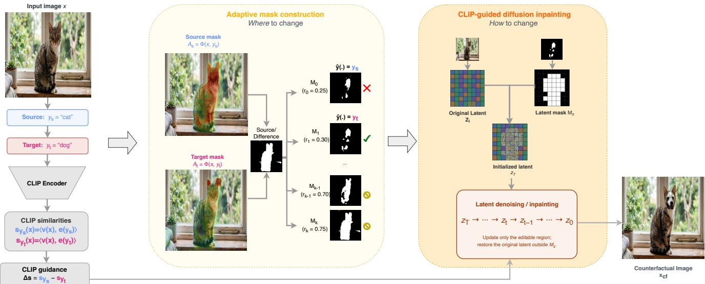
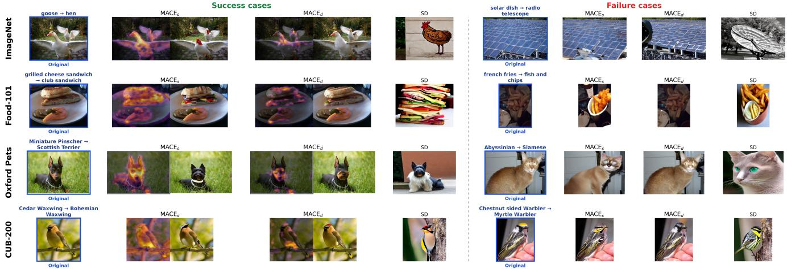
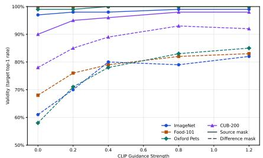
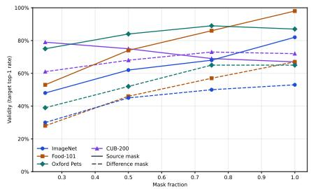
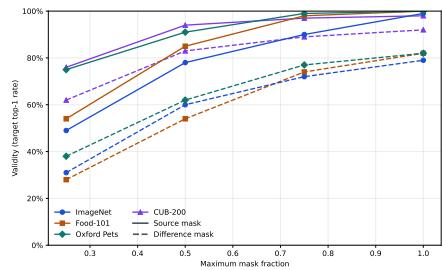
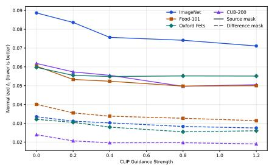
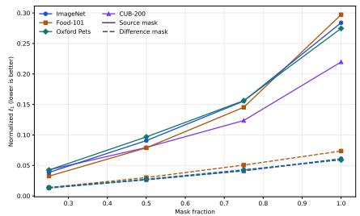
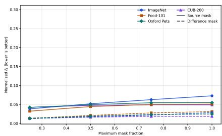

# Targeted Visual Counterfactual Explanations for Contrastive Vision–Language Models

Van Bach Nguyen Jorg Schl ¨ otterer Christin Seifert ¨ Marburg University, Germany

## Abstract

Current explanation methods for contrastive vision– language models such as CLIP mainly identify important regions without showing how to change the input in order to get a target prediction. We introduce Mask-guided Adaptive Counterfactual Explanations (MACE), a targeted visual counterfactual method designed specifically for CLIP zero-shot classification. MACE constructs an editable region from either source attribution or source–target attribution differences and expands the mask only when needed to reach a specified target class. A latent diffusion inpainting model then modifies the selected region, while a frozen CLIP model provides modification guidance and anchors the remaining image content to the original input. We evaluate MACE on ImageNet, Food-101, Oxford Pets, and CUB-200. The source-mask variant achieves the highest target top-1 success rate across all four datasets, while the difference-mask variant produces the smallest pixellevel and perceptual changes and the best realism scores. Both variants improve proximity and realism over a Stable Diffusion-only baseline using the same generative backbone. These results show that adaptive mask-guided editing produces effective CLIP counterfactuals. They further reveal a tradeoff between counterfactual validity and source-image preservation. The source code is available at https://anonymous.4open.science/r/MACE-04BC/.

## 1. Introduction

CLIP [28] is widely used for zero-shot classification [22, 26, 31], retrieval [27, 30, 39], and multimodal applications ranging from safety inspection [25, 34] to decision support [45]. However, CLIP explanations remain dominated by attention and gradient maps, which highlight relevant regions without showing how the input must change to alter the prediction [19, 21, 44]. Counterfactual explanations address this limitation by identifying a small, meaningful change that produces a different model outcome [35].

Existing visual counterfactual methods mainly target conventional classifiers and optimize class logits or probabilities [1, 5, 10]. CLIP-guided editing methods instead optimize alignment with a target prompt [9, 40], but prompt alignment does not ensure that the target becomes the top prediction within the full zero-shot class set. These methods also do not necessarily produce the smallest localized edit responsible for the decision change.

We therefore propose Mask-guided Adaptive Counterfactual Explanations (MACE) (overview in Fig. 1), a method for targeted visual counterfactual explanations of CLIP zero-shot predictions. To our knowledge, MACE is the first image-level counterfactual method designed specifically for this setting. It uses CLIP attribution to localize editable regions and CLIP-guided diffusion inpainting to generate target features while preserving the remaining image. We consider two variants: a source-attribution mask and a source–target difference mask. Starting from a small editable region, MACE expands the mask only when needed and selects the smallest mask that changes the zero-shot prediction.

Across ImageNet, Food-101, Oxford Pets, and CUB-200, the source-mask variant achieves the highest validity, while the difference-mask variant produces the smallest image changes and the best realism scores. Both variants improve proximity and realism over a Stable Diffusiononly baseline with the same generative backbone. We also examine how CLIP guidance strength, mask fraction, and adaptive mask expansion affect counterfactual generation in MACE. In summary, our main contributions are:

• We introduce MACE, the first image-level counterfactual method designed specifically for CLIP zero-shot classification. MACE combines adaptive attribution masks, localized diffusion inpainting, and CLIP decision guidance.

• We evaluate two mask variants on four datasets and show consistent gains in validity, proximity, and realism over full-image diffusion editing.

• We show how CLIP guidance strength, mask fraction, and adaptive mask expansion affect counterfactual generation, providing practical insights for other diffusionbased editing methods.

## 2. Related Work

Our work connects visual counterfactual explanations with vision–language model interpretability. We review visual counterfactual generation, CLIP explainability, CLIPguided image editing, and counterfactual learning for vision–language models, and then explain how our method differs from these research areas.

## 2.1. Visual Counterfactual Explanations

Visual counterfactual explanations identify how an image should be modified to obtain a desired target prediction while preserving its original content. Early work by Goyal et al. [10] constructs counterfactuals by replacing discriminative regions of a query image with regions from a distractor image belonging to the target class. Later approaches [5, 33] improve sparsity, semantic consistency, and visual realism through localized optimization or generative priors.

Diffusion-based methods further constrain counterfactuals to the natural-image manifold. DiME [15] and DVCE [1] guide the diffusion process using classifier objectives and similarity regularization, producing realistic prediction-changing edits. Recent approaches [16, 32, 41] improve spatial control or reduce access requirements through object-aware editing, region-constrained generation, and black-box optimization. However, these methods are primarily designed for conventional CNN classifiers.

## 2.2. CLIP Explainability

CLIP [28] has mainly been interpreted using attribution, localization, and concept-based explanations. CLIP Surgery [19] shows that directly applying conventional CAM-style methods to CLIP can produce noisy or contradictory maps and proposes feature-level modifications for more faithful localization. Other methods explain CLIP predictions through multimodal information bottlenecks, sparse concept decompositions, or gradient-based attribution [3, 37, 44].

These approaches identify image regions or concepts that contribute to image–text similarity, but they remain observational. They do not determine whether modifying the highlighted evidence is sufficient to change CLIP’s zeroshot prediction.

## 2.3. CLIP-Guided Image Editing

A related line of work uses CLIP as a semantic supervision signal for image manipulation. StyleCLIP [24] and StyleGAN-NADA [9] optimize latent directions or generator parameters so that synthesized images align with target text descriptions. DiffusionCLIP [17] extends this paradigm to diffusion models, enabling text-driven edits of real images while preserving their visual identity.

CF-CLIP [40] addresses limitations of direct CLIP optimization by introducing contrastive objectives that encourage more localized and semantically accurate edits . Nevertheless, these methods primarily optimize alignment with open-ended text prompts. They do not explicitly seek the smallest modification required to change the prediction of a CLIP classifier.

## 2.4. Counterfactual Learning for Vision–Language Models

Counterfactuals have also been used during vision– language model training. Counterfactual Prompt Learning [11] constructs sparse feature-space counterfactuals to improve prompt generalization , while COMO [18] and CF-VLM [42] generate multimodal counterfactual examples as hard negatives to improve compositional understanding and sensitivity to semantic changes. These methods modify the training process or representation space, but they do not provide image-level explanations for individual predictions of an already trained model.

## 2.5. Positioning of Our Work

We study visual counterfactual explanations for CLIP-based zero-shot classification. Our method operates directly in CLIP’s joint image–text embedding space and generates an explicit counterfactual image. It addresses the question: What minimal, semantically meaningful visual change is sufficient for CLIP to predict the target class instead of the source class?

## 3. Problem Formulation

We consider targeted visual counterfactual explanations for CLIP-based zero-shot image classification. Let $\mathcal { X } \subseteq$ $[ 0 , 1 ] ^ { H \times W \times 3 }$ denote the image space, where each image $x \in \chi$ has three color channels and spatial resolution $H \times W$ . Let C be the set of semantic classes and $\tau$ the space of textual prompts. CLIP [28] consists of an image encoder $F _ { \mathrm { I } }$ and a text encoder $F _ { \mathrm { T } }$

For each class $c \in { \mathcal { C } }$ , we define a text prompt $t _ { c } \in \mathcal { T }$ and compute normalized embeddings

$$
{ \pmb v } ( { \pmb x } ) = \frac { F _ { I } ( { \pmb x } ) } { \Vert F _ { I } ( { \pmb x } ) \Vert _ { 2 } } , \qquad { \pmb e } ( t _ { c } ) = \frac { F _ { T } ( t _ { c } ) } { \Vert F _ { T } ( t _ { c } ) \Vert _ { 2 } } ,
$$

for any image $x \in \mathcal { X }$ . The zero-shot CLIP classifier scores each class using cosine similarity

$$
s _ { c } ( x ) = \langle \pmb { v } ( x ) , \pmb { e } ( t _ { c } ) \rangle
$$

and predicts

$$
{ \hat { y } } ( x ) = \arg \operatorname* { m a x } _ { c \in { \mathcal { C } } } s _ { c } ( x ) .\tag{1}
$$

Given an input image $x \in \mathcal { X } ,$ let $y _ { s } ~ = ~ { \hat { y } } ( x )$ denote its source prediction and let $y _ { t } \in \mathcal { C } \setminus \{ y _ { s } \}$ be a desired target class. Following standard counterfactual desiderata [10, 35], our objective is to generate a counterfactual image $x _ { \mathrm { c f } }$ that is classified as $y _ { t } ,$ , remains close to the original image $x ,$ and constitutes a visually realistic image.

  
Figure 1. Overview of MACE. Given a source image and a target class, CLIP attribution identifies regions that support the source prediction or favor the source over the target. Starting with the top 25% of attribution values $( M _ { 0 } , r _ { 0 } = 0 . 2 5 )$ , MACE progressively expands the resulting editable mask in 5% steps until a candidate reaches the target class and then uses CLIP-guided latent diffusion to inpaint only the selected region while preserving the remaining image content.

Let d : $\mathcal { X } \times \mathcal { X } \xrightarrow { } \mathbb { R } ^ { + }$ be a distance measure on images, and let $\mathcal { X } _ { \mathrm { r e a l } } \subseteq \mathcal { X }$ denote the set of visually realistic images. The realistic targeted counterfactuals form the feasible set

$$
\mathcal { F } _ { \mathrm { r e a l } } ( x , y _ { t } ) = \{ x ^ { \prime } \in \mathcal { X } _ { \mathrm { r e a l } } \mid \hat { y } ( x ^ { \prime } ) = y _ { t } \} .\tag{2}
$$

The targeted counterfactual explanation $x _ { \mathrm { c f } } ^ { * }$ is then the solution of

$$
x _ { \mathrm { c f } } ^ { * } = \arg \operatorname* { m i n } _ { x ^ { \prime } \in \mathcal { F } _ { \mathrm { r e a l } } ( x , y _ { t } ) } d ( x , x ^ { \prime } ) .\tag{3}
$$

## 4. Method

Mask-guided Adaptive Counterfactual Explanations (MACE), illustrated in Figure 1, first determines where to edit and then how to edit to get the target class. It constructs a mask from CLIP attribution and expands it only when a strongly localized intervention fails. A latent diffusion model then inpaints the masked region under CLIP guidance while preserving the remaining image.

## 4.1. Adaptive Mask Construction

We define a label-conditioned attribution operator as

$$
\Phi ( x , s _ { y } ) \to A _ { y } \in \mathbb { R } ^ { H \times W }\tag{4}
$$

where $A _ { y } ( p )$ measures the contribution of spatial location p to the CLIP score $s _ { y } ( x )$ . We consider two relevance scores:

$$
\begin{array} { r l r } & { R _ { \mathrm { s r c } } = A _ { s } , \quad } & { R _ { \mathrm { d i f f } } = \mathrm { R e L U } ( A _ { s } - A _ { t } ) , } \\ & { \mathbf { \delta } \mathbf { \delta } \mathbf { A } _ { s } = \Phi ( \boldsymbol { x } , \boldsymbol { s } _ { y _ { s } } ) , } & { A _ { t } = \Phi ( \boldsymbol { x } , \boldsymbol { s } _ { y _ { t } } ) . } \end{array}
$$

The source score identifies evidence supporting the current prediction, whereas the difference score selects evidence that supports the source more strongly than the target. We write R for the selected score.

For adaptation step k, we convert R into a binary mask $M _ { k } = \mathcal { G } ( \bar { R } ; \lambda _ { k } ) \in \mathbf { \bar { \{ 0 , 1 \} } } ^ { H \times W }$ , where $M _ { k } ( p ) = 1$ denotes an editable location, $M _ { k } ( p ) = 0 :$ a protected location, and $\lambda _ { k }$ the thresholding and spatial-refinement parameters. Thus, the support of $M _ { k }$ defines the editable region. In our experiments, $\mathcal { G }$ selects the top $r _ { k } \in ( 0 , 1 ]$ fraction of relevance values:

$$
M _ { k } ( p ) = \mathbb { I } \left[ R ( p ) \geq Q _ { 1 - r _ { k } } ( R ) \right]
$$

where I[·] is the indicator function and $Q _ { 1 - r _ { k } } ( R )$ is the $( 1 - r _ { k } )$ -quantile of R. Increasing $r _ { k }$ , with optional dilation, produces progressively less restrictive masks.

Adaptive mask selection. A mask with a small editable region favors preservation but may not permit the target transition. We therefore generate candidates using an expanding sequence

$$
M _ { 0 } \subseteq M _ { 1 } \subseteq \cdot \cdot \cdot \subseteq M _ { K } ,
$$

where K is the maximum adaptation index. Applying the generation procedure below with $M = M _ { k }$ produces candidate $x _ { \mathrm { c f } } ^ { ( k ) }$ . We accept the first candidate satisfying

$$
\hat { y } \Big ( x _ { \mathrm { c f } } ^ { ( k ) } \Big ) = y _ { t } ,
$$

thereby selecting the smallest successful mask. If all attempts fail, we choose the candidate with the largest targetversus-strongest-competitor margin:

$$
k ^ { \star } = \arg \operatorname* { m a x } _ { k } \left[ s _ { y _ { t } } \Big ( x _ { \mathrm { c f } } ^ { ( k ) } \Big ) - \operatorname* { m a x } _ { c \in \mathcal { C } \backslash \{ y _ { t } \} } s _ { c } \Big ( x _ { \mathrm { c f } } ^ { ( k ) } \Big ) \right] .
$$

The mask schedule and refinement parameters are given in Section 5.3.

## 4.2. CLIP-Guided Diffusion Inpainting

For a candidate mask M, we use a pretrained latent diffusion inpainting model [29] with VAE encoder $E$ and decoder D. Let $\mathbf { \Psi } ^ { z } \mathbf { \Psi } ^ { = } \mathbf { \Psi } ^ { E ( x ) } \in \mathbb { R } ^ { h \times w \times C _ { z } }$ be the input latent, where $h \times w$ and $C _ { z }$ are its spatial resolution and number of channels. We project M to $\widetilde { M } = \mathcal { P } _ { h , w } ( M )$ and broadcast it across channels to obtain the latent mask $M _ { z }$ , which has the same shape as $z _ { I }$ . Values one and zero in $M _ { z }$ identify editable and protected latent locations, respectively. Using the standard diffusion forward process [14, 29], we construct the forward-noised reference trajectory

$$
z _ { I } ^ { ( t ) } = \sqrt { \bar { \alpha } _ { t } } z _ { I } + \sqrt { 1 - \bar { \alpha } _ { t } } \varepsilon _ { I } , \qquad \varepsilon _ { I } \sim \mathcal { N } ( 0 , I ) ,
$$

where $t \in \{ 0 , \ldots , T \}$ is the diffusion timestep, $\alpha _ { t } = 1 - \beta _ { t }$ $\begin{array} { r } { \bar { \alpha } _ { t } = \prod _ { s = 1 } ^ { t } \alpha _ { s } , } \end{array}$ , and $\langle \beta _ { t } \} _ { t = 1 } ^ { T }$ is the variance schedule. The standard Gaussian noise $\varepsilon _ { I }$ is sampled once and reused across timesteps. Reverse diffusion begins with independent noise inside the mask and the noised input outside it:

$$
z _ { T } = M _ { z } \odot \varepsilon + ( 1 - M _ { z } ) \odot z _ { I } ^ { ( T ) } , \qquad \varepsilon \sim \mathcal { N } ( 0 , I ) ,
$$

where $\odot$ denotes element-wise multiplication and ε is independent of $\varepsilon _ { I }$ . Hereafter, $z _ { t }$ denotes the evolving counterfactual latent at reverse timestep t.

At timestep t, the denoiser is conditioned on the target prompt, the projected mask $\widetilde { M }$ , and the masked-image latent $z _ { \mathrm { m a s k e d } } = E ( ( 1 - M ) \odot x )$

$$
\widehat { \varepsilon } _ { t } = \varepsilon _ { \theta } \left( \mathrm { c o n c a t } _ { \mathrm { c h } } ( z _ { t } , \widetilde { M } , z _ { \mathrm { m a s k e d } } ) , t , \boldsymbol { h } _ { y _ { t } } \right) ,
$$

where conca $\mathrm { \mathbf { t } } _ { \mathrm { c h } }$ concatenates tensors along the channel dimension, $\varepsilon _ { \theta }$ is the pretrained denoiser, and $h _ { y _ { t } }$ is the diffusion model’s conditioning embedding of the target prompt $t _ { y _ { t } }$ defined in Section 3.

CLIP-based semantic guidance. Text conditioning alone does not ensure that the generated image is classified as the target. Following universal guidance [2], we decode the predicted clean latent:

$$
\widehat { x } _ { 0 } ^ { ( t ) } = D \bigg ( \frac { z _ { t } - \sqrt { 1 - \bar { \alpha } _ { t } } \widehat { \varepsilon } _ { t } } { \sqrt { \bar { \alpha } _ { t } } } \bigg ) .
$$

Guidance is evaluated on a composite that uses this estimate inside the mask and the original image elsewhere:

$$
\widetilde { x } ^ { ( t ) } = M \odot \widehat { x } _ { 0 } ^ { ( t ) } + ( 1 - M ) \odot x .
$$

We minimize the source–target score difference

$$
\mathcal { L } _ { \mathrm { C L I P } } ^ { ( t ) } = s _ { y _ { s } } \Big ( \widetilde { { \boldsymbol x } } ^ { ( t ) } \Big ) - s _ { y _ { t } } \Big ( \widetilde { { \boldsymbol x } } ^ { ( t ) } \Big )
$$

and restrict its gradient to editable latent locations:

$$
z _ { t } ^ { \mathrm { g } } = z _ { t } - \eta _ { t } M _ { z } \odot \nabla _ { z _ { t } } { \mathcal { L } } _ { \mathrm { C L I P } } ^ { ( t ) } ,
$$

where $\eta _ { t } \geq 0$ is the guidance step size. After a scheduler step $\bar { z } _ { t - 1 } =  { S } _ { t } ( z _ { t } ^ { \mathrm { g } } ,  { \widehat { \varepsilon } } _ { t } )$ , we restore the protected latent locations using the corresponding reference latent. Here, $S _ { t }$ denotes one reverse-diffusion scheduler step and $\bar { z } _ { t - 1 }$ its provisional output:

$$
z _ { t - 1 } = M _ { z } \odot \bar { z } _ { t - 1 } + ( 1 - M _ { z } ) \odot z _ { I } ^ { ( t - 1 ) } .
$$

Thus, only editable latent locations evolve under diffusion and CLIP guidance, while the protected locations follow the noised input trajectory [20]. The final counterfactual is $x _ { \mathrm { c f } } = D ( z _ { 0 } )$ .

## 5. Experimental Setup

To describe the experimental protocol used to evaluate MACE, we first introduce the datasets and source–target pair selection procedure, then define the metrics used to assess validity, proximity, and realism. Finally, we provide the implementation and configuration details and describe the controlled diffusion baseline used for comparison.

## 5.1. Datasets

We evaluate on ImageNet-1k [8], Food-101 [6], Oxford-IIIT Pet [23], and CUB-200-2011 [36], using the ImageNet validation split and the official test splits of the other three datasets. We include only images for which zeroshot CLIP predicts the ground-truth class as top-1 when scoring against the full dataset vocabulary using class-name prompts. For each selected image, the highest-scoring nonsource class is used as the target. Because the source class is ranked first, this target corresponds to CLIP rank 2.

For ImageNet, we score at most 20 validation images from each class and select the first eligible image. If none of the 20 images is eligible, that class is omitted. This produces 934 source–target pairs. For Food-101, we score 20 images and select a maximum of 10 eligible per class, producing 1,003 pairs. For Oxford-IIIT Pet, we score the full test split and select a maximum of 35 per class, producing 1,194 pairs. For CUB-200-2011, we score all 5,794 test images against 200 bird classes and select a maximum of 10 correctly classified images per class. This produces 1,595 pairs from 186 source classes. Ablations use a separate 100- instance subset with one example from each of 100 source classes.

In total, the main evaluation contains 4,726 counterfactual tasks across the four datasets. All generated counterfactuals are evaluated using the common protocol described below.

## 5.2. Evaluation Metrics

We evaluate validity, proximity, and realism using the notation introduced in Section 3. In particular, x denotes the original image, $x _ { \mathrm { c f } }$ the generated counterfactual, and ys and $y _ { t }$ the source and target classes, respectively.

Validity (target top-1 success rate) A counterfactual is valid if the zero-shot classifier in Equation (1) predicts the target class:

$$
\hat { y } ( x _ { \mathrm { c f } } ) = y _ { t } .
$$

We report the fraction of valid counterfactuals as the target top-1 success rate. Higher values are better.

Proximity For images scaled to [0, 1], with $D = 3 H W$ we measure proximity using the normalized $\ell _ { p }$ distance:

$$
\ell _ { p } ^ { \mathrm { n o r m } } ( \boldsymbol { x } , \boldsymbol { x } _ { \mathrm { c f } } ) = D ^ { - 1 / p } \| \boldsymbol { x } _ { \mathrm { c f } } - \boldsymbol { x } \| _ { p } , \qquad p \geq 1 .
$$

This includes normalized $\ell _ { 1 }$ and $\ell _ { 2 }$ distances for p = 1 and $p = 2$ . We additionally report LPIPS [1, 43] and SSIM [38]. Lower $\ell _ { p }$ and LPIPS indicate smaller changes, while higher SSIM indicates greater structural similarity. We compute these metrics both over all counterfactuals and over valid counterfactuals only.

Realism We use Frechet Inception Distance (FID) [´ 12] and Kernel Inception Distance (KID) [4] between generated counterfactuals and real reference images in Inceptionv3 feature space. FID compares feature means and covariances [12], while KID uses an unbiased kernel-based maximum mean discrepancy estimator [4]. Lower values are better. All methods use the same reference-set construction.

We resize all generated counterfactuals to the original image resolution before computing the quantitative metrics. This prevents the generative model’s output resolution from biasing the evaluation.

## 5.3. Implementation and Configuration

We use OpenAI CLIP ViT-B/16 [28] for guidance and evaluation, and to select source images that CLIP initially classifies correctly. Counterfactuals are generated with Stable Diffusion inpainting [29]1

We use CAV [7] as label-conditioned attribution operator in Eq. (4) to generate mask initially includes the top 25% of attribution values. If the target is not ranked first, we increase this fraction by 5% for at most 20 attempts. We keep the smallest successful mask, if none succeeds, we select the candidate with the largest target-versus-strongestalternative margin.

## 5.4. Baseline

Because existing visual counterfactual methods [10, 16, 32, 41] are designed mainly for supervised classifiers and require nontrivial adaptation to CLIP, we use a controlled Stable Diffusion baseline with the same generative backbone as our method.

Stable Diffusion-only uses the same Stable Diffusion v1.5 inpainting checkpoint1, resolution, denoising steps, classifier-free guidance scale [13], seed, and target prompt, but edits the full image using only diffusion text conditioning. It uses no attribution mask or external CLIP guidance and sets inpainting strength to 1.0. The baseline is evaluated on the same source images, targets, prompts, and evaluation pipeline as our method.

## 6. Results

We evaluate MACE through quantitative and qualitative comparisons with the Stable Diffusion-only baseline. We first examine validity, proximity, and realism across four datasets, and then analyze representative examples to illustrate the behavior, tradeoffs, and failure modes of the two mask variants.

## 6.1. Quantitative Comparison

Table 1 compares the two MACE mask variants with the Stable Diffusion-only baseline: $\mathbf { M A C E } _ { \mathrm { s } }$ uses the sourceattribution mask, whereas $\mathbf { M A C E _ { d } }$ uses the source–target difference mask. We evaluate validity using the target top-1 success rate, proximity using normalized $\ell _ { 1 }$ and $\ell _ { 2 }$ distances, LPIPS, and SSIM, and realism using FID and KID. For a fair comparison, all proximity metrics are computed on the same set of successful counterfactual examples across methods.

MACE generates valid and realistic counterfactuals with small changes. Despite using the same generative backbone and target prompt as the baseline, MACEs achieves the highest validity across all four datasets. $\mathbf { M A C E _ { d } }$ achieves the lowest normalized $\ell _ { 1 }$ and $\ell _ { 2 }$ distances and LPIPS, the highest SSIM, and the best FID and KID on every dataset. Both MACE variants outperform Stable Diffusion-only on all proximity and realism metrics. Lower $\ell _ { 1 }$ and $\ell _ { 2 }$ distances indicate better pixel-level preservation, lower LPIPS indicates greater perceptual similarity, and higher SSIM indicates better structural preservation. Together, these results show the benefit of mask-guided editing with CLIP guidance over full-image diffusion editing.

<table><tr><td>Dataset</td><td>Method/Variant</td><td>Validity ↑</td><td> $\ell _ { 1 } ^ { \mathrm { n o r m } } \downarrow$ </td><td> $\ell _ { 2 } ^ { \mathrm { n o r m } } \downarrow$ </td><td>LPIPS ↓</td><td>SSIM ↑</td><td> $\mathrm { F I D \downarrow }$ </td><td>KID↓</td></tr><tr><td rowspan="3">ImageNet</td><td>MACEs</td><td>0.9700</td><td>0.0742</td><td>0.1603</td><td>0.2526</td><td>0.6948</td><td>49.7978</td><td>0.0035</td></tr><tr><td> $\mathbf { M A C E _ { d } }$ </td><td>0.7805</td><td>0.0407</td><td>0.1059</td><td>0.1517</td><td>0.7940</td><td>44.8410</td><td>0.0007</td></tr><tr><td>Stable Diffusion</td><td>0.7195</td><td>0.3346</td><td>0.4066</td><td>0.8397</td><td>0.1301</td><td>84.1666</td><td>0.0051</td></tr><tr><td rowspan="3">Food-101</td><td>MACEs</td><td>0.9990</td><td>0.0554</td><td>0.1249</td><td>0.2177</td><td>0.7322</td><td>23.5741</td><td>0.0018</td></tr><tr><td> $\mathbf { M A C E _ { d } }$ </td><td>0.8744</td><td>0.0402</td><td>0.1003</td><td>0.1674</td><td>0.7914</td><td>22.3334</td><td>0.0015</td></tr><tr><td>Stable Diffusion</td><td>0.9701</td><td>0.3437</td><td>0.4218</td><td>0.8219</td><td>0.1728</td><td>151.4007</td><td>0.0308</td></tr><tr><td rowspan="3">Oxford Pets</td><td>MACEs</td><td>0.9925</td><td>0.0615</td><td>0.1453</td><td>0.1997</td><td>0.7425</td><td>33.6534</td><td>0.0055</td></tr><tr><td> $\mathbf { M A C E _ { d } }$ </td><td>0.7730</td><td>0.0361</td><td>0.0974</td><td>0.1310</td><td>0.8064</td><td>25.4120</td><td>0.0023</td></tr><tr><td>Stable Diffusion</td><td>0.8970</td><td>0.3207</td><td>0.3930</td><td>0.8312</td><td>0.1702</td><td>126.1483</td><td>0.0179</td></tr><tr><td rowspan="3">CUB-200</td><td>MACEs</td><td>0.9455</td><td>0.0586</td><td>0.1420</td><td>0.2145</td><td>0.7559</td><td>14.6959</td><td>0.0042</td></tr><tr><td> $\mathbf { M A C E _ { d } }$ </td><td>0.8696</td><td>0.0302</td><td>0.0874</td><td>0.1156</td><td>0.8463</td><td>9.0566</td><td>0.0014</td></tr><tr><td>Stable Diffusion</td><td>0.5034</td><td>0.2804</td><td>0.3416</td><td>0.8411</td><td>0.1785</td><td>51.2375</td><td>0.0103</td></tr></table>

Table 1. Quantitative comparison on ImageNet, Food-101, Oxford Pets, and CUB-200. We report validity as the target top-1 success rate, followed by proximity and realism metrics. Stable Diffusion-only is the baseline. Lower values are better for FID, KID, and distance metrics, whereas higher values are better for validity and SSIM. Bold and underlined values indicate the best and second-best results, respectively, within each dataset and metric column.

Difference masking improves proximity and realism over source masking. Because the proximity metrics are computed on the same set of valid counterfactuals, the consistent gains of $\mathbf { M A C E _ { d } }$ over $\mathbf { M A C E _ { s } }$ show that the difference mask keeps the output closer to the source image. Its lower FID and KID also indicate better realism. These gains come at the cost of lower validity, revealing a validity– proximity tradeoff. By focusing edits on regions where source evidence exceeds target evidence, $\mathbf { M A C E _ { d } }$ may also provide a more concise explanation of the changes needed to reach the target class.

MACE performs consistently across diverse datasets. MACE performs strongly on general object recognition with ImageNet, food recognition with Food-101, finegrained pet classification with Oxford Pets, and fine-grained bird classification with CUB-200. This consistency suggests that the method generalizes across class vocabularies and levels of visual granularity. In contrast, Stable Diffusion-only achieves high validity on Food-101 and Oxford Pets but performs worse on ImageNet and especially CUB-200. Text-conditioned full-image generation may capture broad target characteristics more easily than the subtle, localized cues needed to distinguish visually similar bird species.

## 6.2. Qualitative Results

Figure 2 qualitatively compares the results of the two MACE variants with the Stable Diffusion-only baseline. Additional qualitative results are provided in Sec. A.4 of the supplementary material.

MACE preserves source content through localized edits. MACE generally preserves the identity, pose, background, and composition of the source image while adding target-specific features. For example, in the grilled cheese sandwich → club sandwich transition, both MACE variants modify the filling while keeping the plate and surrounding objects fixed. Similarly, for Miniature Pinscher → Scottish Terrier, MACE introduces Terrier-specific facial and fur characteristics while maintaining the original pose, scale, and grassy background. In contrast, Stable Diffusion-only often regenerates the full image, changing the object appearance, viewpoint, and background together.

The $\mathbf { M A C E } _ { \mathrm { d } }$ mask isolates key cues but can be too restrictive. The two masks also produce visibly different edit sizes. MACE often changes a broader discriminative region, whereas $\mathbf { M A C E _ { d } }$ focuses on smaller source-specific cues. In the Cedar Waxwing → Bohemian Waxwing example, $\mathbf { M A C E _ { d } }$ mainly changes the crown color, while $\mathbf { M A C E } _ { \mathrm { s } }$ modifies a larger part of the head. This pattern matches the quantitative tradeoff between the higher validity of $\mathbf { M A C E } _ { \mathrm { s } }$ and the better proximity of $\mathbf { M A C E _ { d } }$

  
Figure 2. Qualitative comparison across ImageNet, Food-101, Oxford Pets, and CUB-200. Each row contains one success case on the lef and one failure case on the right. For each success case, we show the source image and target class, the editable masks and counterfactuals produced by MACEs and MACEd, and the Stable Diffusion-only (SD) result. All methods reach the target class in these examples. For each failure case, we show the source image followed by the outputs of all three methods. None reaches the target class, except in the Food-101 example, where only MACEs succeeds.

Mask size affects both where and how the image is edited. Although the difference mask is often contained within the source mask, the generated content in their shared region may differ. Each mask starts an independent inpainting process and provides different spatial context to the diffusion model.

Failures reflect limited masks, persistent source evidence, and missing fine-grained cues. The failure cases show three main limitations. First, MACEd may use a mask that is too small to add enough target evidence, as in French fries → fish and chips and Abyssinian → Siamese. MACE succeeds in the Food-101 example because its larger mask allows it to add visible fish. Second, strong source evidence may remain after editing. For solar dish → radio telescope, both MACE variants preserve the dominant dish structure, and CLIP may view the two classes as visually similar. For Abyssinian → Siamese, MACE adds blue eyes and darker facial features, but the original coat and body still support the source class. Third, fine-grained edits may look plausible but miss the exact cues needed for the target class, as seen in CUB-200. Stable Diffusion-only also fails in these cases despite making larger changes because it may generate the wrong object or class, such as fries instead of fish, a generic cat instead of a Siamese, or an off-target bird. These cases motivate larger maximum masks, stronger class-specific guidance, and prompts that describe the target’s key visual features.

## 7. Ablation studies

We study how CLIP guidance strength and mask fraction affect validity and proximity. We use 100 examples from each dataset and vary one parameter at a time while keeping the remaining configuration fixed.

Stronger CLIP guidance improves validity, while masksize effects vary by dataset. Figure 3a shows that stronger CLIP guidance generally improves validity across datasets and mask types, with the largest gains for the difference mask. The effect of a fixed mask fraction is more datasetdependent. Figure 3b shows that larger masks strongly improve validity on Food-101, whereas the source mask on CUB-200 does not improve monotonically. Because each mask fraction produces an independent candidate rather than extending the same output, a larger mask does not always result in higher validity.

CLIP guidance improves measured proximity, while larger fixed masks cause larger edits. Figure 4 shows how CLIP guidance strength and mask size affect pixellevel proximity. Increasing the guidance strength generally lowers the normalized $\ell _ { 1 }$ distance, with most of the improvement around a scale of 0.4 and little improvement thereafter. However, qualitative examples in Sec. A.3 of the supplementary material show that stronger guidance can introduce visible artifacts that $\ell _ { 1 }$ does not capture. Increasing the fixed mask fraction causes larger pixel changes, especially for the source mask, while the difference mask remains more conservative. The remaining proximity metrics show similar trends and are reported in Sec. A.1 of the supplementary material.

Adaptive mask expansion improves validity while preserving proximity. The varying effect of mask size motivates adaptive expansion, which evaluates progressively larger masks and returns the first successful candidate. To measure its benefit, we compare the fixed mask fractions in Figures 3b and 4b with adaptive expansion up to the same maximum fractions in Figures 3c and 4c. Adaptive expansion improves validity for both mask types across datasets, with larger gains at higher maximum fractions, while maintaining much lower normalized $\ell _ { 1 }$ distances than fixed masks at the same fractions. Results for the remaining proximity metrics are reported in Sec. A.2 of the supplementary material. By stopping at a smaller successful mask, the adaptive procedure increases the chance of finding a valid counterfactual without requiring the full edit budget.

  
(a) Effect of CLIP guidance scale on validity.

  
(b) Effect of mask fraction on validity.

  
(c) Effect of adaptive mask expansion on validity.

Figure 3. Validity ablations across all four datasets. Solid and dashed lines show the source and difference masks, respectively. Panels (a) and (b) vary the CLIP guidance scale and fixed mask fraction, respectively, while panel (c) reports validity when each mask is adaptively expanded up to the indicated maximum fraction.  
  
(a) Effect of CLIP guidance strength on normalized $\ell _ { 1 }$ distance.

  
(b) Effect of fixed mask fraction on normalized ℓ distance.

  
(c) Effect of adaptive mask expansion on normalized $\ell _ { 1 }$ distance.  
Figure 4. Proximity ablations measured by normalized $\ell _ { 1 }$ distance, where lower values indicate smaller image changes. Solid and dashed lines show the source and difference masks, respectively. Panels (a) and (b) vary the CLIP guidance scale and fixed mask fraction, while (c) adaptively expands each mask up to the indicated maximum fraction.

## 8. Conclusion

We introduced MACE, a method for generating targeted visual counterfactual explanations for CLIP zero-shot classification. MACE combines class-conditioned attribution, adaptive mask expansion, and CLIP-guided diffusion inpainting to change the model’s prediction to a target label while preserving image content outside the editable region. Experiments on ImageNet, Food-101, Oxford Pets, and CUB-200 demonstrate the value of coupling localized editing with explicit decision guidance. The source-attribution variant achieves the highest validity across all four datasets, whereas the source–target difference variant consistently produces smaller pixel and perceptual changes and better realism scores. Both variants improve proximity and realism over full-image Stable Diffusion editing. These results establish adaptive masking as an effective mechanism for balancing validity against source-image preservation.

Several directions remain for future work. First, MACE currently optimizes the pairwise source–target score difference, which encourages the target class to outrank the source class but does not explicitly require it to outrank every class in the zero-shot label set. Future work could instead use a multiclass or margin-based objective that directly targets top-1 prediction. Second, because different CLIP guidance strengths and mask fractions produce distinct generations rather than incremental extensions of the same output, jointly optimizing these parameters could improve the balance between validity and preservation. Finally, future studies could apply MACE to data augmentation and robustness.

## References

[1] Maximilian Augustin, Valentyn Boreiko, Francesco Croce, and Matthias Hein. Diffusion visual counterfactual explanations. In Advances in Neural Information Processing Systems

(NeurIPS). Curran Associates, Inc., 2022. 1, 2, 5

[2] Arpit Bansal, Hong-Min Chu, Avi Schwarzschild, Soumyadip Sengupta, Micah Goldblum, Jonas Geiping, and Tom Goldstein. Universal guidance for diffusion models. In Proceedings of the Twelfth International Conference on Learning Representations (ICLR), 2024. 4

[3] Usha Bhalla, Alex Oesterling, Suraj Srinivas, Flavio P. Calmon, and Himabindu Lakkaraju. Interpreting CLIP with sparse linear concept embeddings (SpLiCE). In Advances in Neural Information Processing Systems (NeurIPS). Curran Associates, Inc., 2024. 2

[4] Mikołaj Binkowski, Danica J. Sutherland, Michael Arbel,´ and Arthur Gretton. Demystifying MMD GANs. In Proceedings of the 6th International Conference on Learning Representations (ICLR). OpenReview, 2018. 5

[5] Valentyn Boreiko, Maximilian Augustin, Francesco Croce, Philipp Berens, and Matthias Hein. Sparse visual counterfactual explanations in image space. In Pattern Recognition: 44th DAGM German Conference, DAGM GCPR 2022, Proceedings, pages 133–148. Springer, 2022. 1, 2

[6] Lukas Bossard, Matthieu Guillaumin, and Luc Van Gool. Food-101 – mining discriminative components with random forests. In European Conference on Computer Vision, pages 446–461. Springer, 2014. 4

[7] Pengxu Chen, Huazhong Liu, Jihong Ding, Xinghao Huang, Shaojun Zou, and Laurence Tianruo Yang. Class activation values: Lucid and faithful visual interpretations for clipbased text-image retrievals. In Proceedings of the 48th International ACM SIGIR Conference on Research and Development in Information Retrieval, pages 844–853, 2025. 5

[8] Jia Deng, Wei Dong, Richard Socher, Li-Jia Li, Kai Li, and Li Fei-Fei. Imagenet: A large-scale hierarchical image database. In 2009 IEEE Conference on Computer Vision and Pattern Recognition, pages 248–255. IEEE, 2009. 4

[9] Rinon Gal, Or Patashnik, Haggai Maron, Amit Bermano, Gal Chechik, and Daniel Cohen-Or. StyleGAN-NADA: CLIPguided domain adaptation of image generators. ACM Transactions on Graphics, 41(4):141:1–141:13, 2022. Presented at ACM SIGGRAPH 2022. 1, 2

[10] Yash Goyal, Ziyan Wu, Jan Ernst, Dhruv Batra, Devi Parikh, and Stefan Lee. Counterfactual visual explanations. In Proceedings of the 36th International Conference on Machine Learning (ICML), pages 2376–2384. PMLR, 2019. 1, 2, 3, 5

[11] Xuehai He, Diji Yang, Weixi Feng, Tsu-Jui Fu, Arjun Akula, Varun Jampani, Pradyumna Narayana, Sugato Basu, William Yang Wang, and Xin Wang. CPL: Counterfactual prompt learning for vision and language models. In Proceedings of the 2022 Conference on Empirical Methods in Natural Language Processing (EMNLP), pages 3407–3418. Association for Computational Linguistics, 2022. 2

[12] Martin Heusel, Hubert Ramsauer, Thomas Unterthiner, Bernhard Nessler, and Sepp Hochreiter. GANs trained by a two time-scale update rule converge to a local nash equilibrium. In Advances in Neural Information Processing Systems (NeurIPS). Curran Associates, Inc., 2017. 5

[13] Jonathan Ho and Tim Salimans. Classifier-free diffusion guidance. arXiv preprint arXiv:2207.12598, 2022. 5

[14] Jonathan Ho, Ajay Jain, and Pieter Abbeel. Denoising diffusion probabilistic models. In Advances in Neural Informa tion Processing Systems (NeurIPS), pages 6840–6851, 2020. 4

[15] Guillaume Jeanneret, Lo¨ıc Simon, and Fred´ eric Jurie. Dif-´ fusion models for counterfactual explanations. In Computer Vision – ACCV 2022, pages 219–237, Cham, 2023. Springer Nature Switzerland. 2

[16] Guillaume Jeanneret, Lo¨ıc Simon, and Fred´ eric Jurie. Text-´ to-image models for counterfactual explanations: A blackbox approach. In Proceedings of the IEEE/CVF Winter Conference on Applications of Computer Vision (WACV), pages 4757–4767. IEEE/CVF, 2024. 2, 5

[17] Gwanghyun Kim, Taesung Kwon, and Jong Chul Ye. DiffusionCLIP: Text-guided diffusion models for robust image manipulation. In Proceedings of the IEEE/CVF Conference on Computer Vision and Pattern Recognition (CVPR), pages 2426–2435. IEEE/CVF, 2022. 2

[18] Chengen Lai, Shengli Song, Sitong Yan, and Guangneng Hu. Improving vision and language concepts understanding with multimodal counterfactual samples. In Computer Vision – ECCV 2024: 18th European Conference on Computer Vision, Proceedings. Springer, 2024. 2

[19] Yi Li, Hualiang Wang, Yiqun Duan, Jiheng Zhang, and Xi aomeng Li. A closer look at the explainability of con trastive language-image pre-training. Pattern Recognition, 162:111409, 2025. 1, 2

[20] Andreas Lugmayr, Martin Danelljan, Andres Romero, Fisher Yu, Radu Timofte, and Luc Van Gool. Repaint: Inpainting using denoising diffusion probabilistic models. In Proceedings of the IEEE/CVF Conference on Computer Vision and Pattern Recognition (CVPR), pages 11461–11471, 2022. 4

[21] Tung Luu, Nam Le, Duc Le, and Bac Le. From visual ex planations to counterfactual explanations with latent diffusion. In Proceedings of the IEEE/CVF Winter Conference on Applications of Computer Vision (WACV), pages 420–429. IEEE/CVF, 2025. 1

[22] Segol´ ene Martin, Yunshi Huang, Fereshteh Shakeri, Jean-\` Christophe Pesquet, and Ismail Ben Ayed. Transductive zero-shot and few-shot CLIP. In Proceedings of the IEEE/CVF Conference on Computer Vision and Pattern Recognition (CVPR), pages 28816–28826. IEEE/CVF, 2024. 1

[23] Omkar M. Parkhi, Andrea Vedaldi, Andrew Zisserman, and C. V. Jawahar. Cats and dogs. In 2012 IEEE Conference on Computer Vision and Pattern Recognition, pages 3498– 3505. IEEE, 2012. 4

[24] Or Patashnik, Zongze Wu, Eli Shechtman, Daniel Cohen-Or, and Dani Lischinski. StyleCLIP: Text-driven manipulation of StyleGAN imagery. In Proceedings ofthe IEEE/CVF International Conference on Computer Vision (ICCV), pages 2085–2094. IEEE/CVF, 2021. 2

[25] Samuele Poppi, Tobia Poppi, Federico Cocchi, Marcella Cornia, Lorenzo Baraldi, and Rita Cucchiara. Safe-CLIP: Removing NSFW concepts from vision-and-language models. In Computer Vision – ECCV 2024: 18th European Con ference on Computer Vision, Proceedings, pages 340–356. Springer, 2024. 1

[26] Qi Qian and Juhua Hu. Online zero-shot classification with CLIP. In Computer Vision – ECCV 2024: 18th European Conference on Computer Vision, Proceedings, pages 462– 477. Springer, 2024. 1

[27] Xugong Qin, Peng Zhang, Jun Jie Ou Yang, Gangyan Zeng, Yubo Li, Yuanyuan Wang, Wanqian Zhang, and Pengwen Dai. CLIP is almost all you need: Towards parameterefficient scene text retrieval without OCR. In Proceedings of the IEEE/CVF Conference on Computer Vision and Pattern Recognition (CVPR), pages 24873–24883. IEEE/CVF, 2025. 1

[28] Alec Radford, Jong Wook Kim, Chris Hallacy, Aditya Ramesh, Gabriel Goh, Sandhini Agarwal, Girish Sastry, Amanda Askell, Pamela Mishkin, Jack Clark, Gretchen Krueger, and Ilya Sutskever. Learning transferable visual models from natural language supervision. In Proceedings of the 38th International Conference on Machine Learning (ICML), pages 8748–8763. PMLR, 2021. 1, 2, 5

[29] Robin Rombach, Andreas Blattmann, Dominik Lorenz, Patrick Esser, and Bjorn Ommer. High-resolution image¨ synthesis with latent diffusion models. In Proceedings of the IEEE/CVF Conference on Computer Vision and Pattern Recognition (CVPR), pages 10684–10695, 2022. 4, 5

[30] Aneeshan Sain, Ayan Kumar Bhunia, Pinaki Nath Chowdhury, Subhadeep Koley, Tao Xiang, and Yi-Zhe Song. CLIP for all things zero-shot sketch-based image retrieval, finegrained or not. In Proceedings ofthe IEEE/CVF Conference on Computer Vision and Pattern Recognition (CVPR), pages 2765–2775. IEEE/CVF, 2023. 1

[31] Fawaz Sammani and Nikos Deligiannis. Interpreting and analysing CLIP’s zero-shot image classification via mutual knowledge. In Advances in Neural Information Processing Systems (NeurIPS), pages 39597–39631. Curran Associates, Inc., 2024. 1

[32] Bartlomiej Sobieski, Jakub Grzywaczewski, Bartlomiej Sadlej, Matthew Tivnan, and Przemyslaw Biecek. Rethinking visual counterfactual explanations through region constraint. In Proceedings of the 13th International Conference on Learning Representations (ICLR). ICLR, 2025. 2, 5

[33] Jayaraman J. Thiagarajan, Vivek Sivaraman Narayanaswamy, Deepta Rajan, Jia Liang, Akshay Chaudhari, and Andreas Spanias. Designing counterfactual generators using deep model inversion. In Advances in Neural Information Processing Systems (NeurIPS). Curran Associates, Inc., 2021. 2

[34] Wei-Lun Tsai, Phuong-Linh Le, Wang-Fat Ho, Nai-Wen Chi, Jacob J. Lin, Shuai Tang, and Shang-Hsien Hsieh. Construction safety inspection with contrastive language-image pretraining (CLIP) image captioning and attention. Automation in Construction, 169:105863, 2025. 1

[35] Sandra Wachter, Brent Mittelstadt, and Chris Russell. Counterfactual explanations without opening the black box: Automated decisions and the GDPR. Harvard Journal of Law & Technology, 31(2):841–887, 2017. 1, 3

[36] Catherine Wah, Steve Branson, Peter Welinder, Pietro Perona, and Serge Belongie. The caltech-ucsd birds-200-2011 dataset. Technical Report CNS-TR-2011-001, California Institute of Technology, 2011. 4

[37] Ying Wang, Tim G. J. Rudner, and Andrew Gordon Wilson. Visual explanations of image-text representations via multimodal information bottleneck attribution. In Advances in Neural Information Processing Systems (NeurIPS). Curran Associates, Inc., 2023. 2

[38] Zhou Wang, Alan C. Bovik, Hamid R. Sheikh, and Eero P. Simoncelli. Image quality assessment: From error visibility to structural similarity. IEEE Transactions on Image Pro cessing, 13(4):600–612, 2004. 5

[39] Chen-Wei Xie, Siyang Sun, Xiong Xiong, Yun Zheng, Deli Zhao, and Jingren Zhou. RA-CLIP: Retrieval-augmented contrastive language-image pre-training. In Proceedings of the IEEE/CVF Conference on Computer Vision and Pattern Recognition (CVPR), pages 19265–19274. IEEE/CVF, 2023. 1

[40] Yingchen Yu, Fangneng Zhan, Rongliang Wu, Jiahui Zhang, Shijian Lu, Miaomiao Cui, Xuansong Xie, Xian-Sheng Hua, and Chunyan Miao. Towards counterfactual image manipu lation via CLIP. In Proceedings of the 30th ACM International Conference on Multimedia (ACM MM), pages 3637– 3645. Association for Computing Machinery, 2022. 1, 2

[41] Mehdi Zemni, Mickael Chen,¨ Eloi Zablocki, H´ edi Ben-´ Younes, Patrick Perez, and Matthieu Cord. OCTET: Object-´ aware counterfactual explanations. In Proceedings of the IEEE/CVF Conference on Computer Vision and Pattern Recognition (CVPR), pages 15062–15071. IEEE/CVF, 2023. 2, 5

[42] Jusheng Zhang, Kaitong Cai, Yijia Fan, Jian Wang, and Keze Wang. CF-VLM: Counterfactual vision-language finetuning. In Advances in Neural Information Processing Systems (NeurIPS). Curran Associates, Inc., 2025. 2

[43] Richard Zhang, Phillip Isola, Alexei A. Efros, Eli Shechtman, and Oliver Wang. The unreasonable effectiveness of deep features as a perceptual metric. In Proceedings of the IEEE Conference on Computer Vision and Pattern Recognition (CVPR), pages 586–595. IEEE/CVF, 2018. 5

[44] Chenyang Zhao, Kun Wang, Xingyu Zeng, Rui Zhao, and Antoni B. Chan. Gradient-based visual explanation for transformer-based CLIP. In Proceedings of the 41st International Conference on Machine Learning (ICML), pages 61072–61091. PMLR, 2024. 1, 2

[45] Zihao Zhao, Yuxiao Liu, Han Wu, Mei Wang, Yonghao Li, Sheng Wang, Lin Teng, Disheng Liu, Zhiming Cui, Qian Wang, and Dinggang Shen. CLIP in medical imaging: A survey. Medical Image Analysis, 102:103551, 2025. 1