# Think Before You Score: Thinking Reward Model for Visual Generation

Xuehai Bai<sup>1,4,∗</sup>, Zhenchen Tang<sup>2,∗</sup>, Yang Shi<sup>3,∗,♠</sup>, Dianyi Wang<sup>5</sup> Tengfei Liu<sup>3</sup>, Wanshun Su<sup>6</sup>, Xuanyu Zhu<sup>3</sup>, Ruohui Wang<sup>4</sup>, Haiwen Diao<sup>7</sup> Haotian Wang<sup>8,†</sup>, Xiaoling Gu<sup>1,†</sup>, Yuanxing Zhang<sup>3</sup>

<sup>1</sup>HDU, <sup>2</sup>CASIA, <sup>3</sup>PKU, <sup>4</sup>SenseTime, <sup>5</sup>FDU, <sup>6</sup>NWPU, <sup>7</sup>NTU, <sup>8</sup>THU

## Abstract

Visual reward models are essential for evaluating and improving visual generation models, yet existing approaches typically map task conditions and candidate outputs directly to scalar rewards, leaving implicit what should be evaluated for each individual case. We introduce Think Before You Score, a paradigm that explicitly determines what matters for each case before judging how well the candidate performs. Following this principle, we propose the Thinking Reward Model (TRM), which formulates case-adaptive rubrics, performs rubric-guided assessment, and produces fine-grained pointwise rewards. We further observe that conventional pairwise preference optimization can induce score polarization, and introduce Pairwise Dual-Group Relative Policy Optimization (PD-GRPO), which leverages pairwise supervision to improve reward discrimination while preserving fine-grained pointwise scoring. Extensive experiments on image generation and editing reward-modeling benchmarks demonstrate that TRM achieves state-of-the-art performance among open-source reward models while remaining highly competitive with proprietary alternatives. Moreover, using TRM as a reward for reinforcement learning consistently improves diverse visual generation models, demonstrating that its fine-grained, case-adaptive rewards translate into efective optimization signals for visual generation.

Date: September 30, 2026 Project Page: https://bxhsort.github.io/Thinking-Reward-Model/ Huggingface: https://huggingface.co/collections/asdjghh/thinking-reward-model

## 1 Introduction

Scaling data and models [6, 44] has driven rapid advances in visual generation [8, 33, 38, 47], particularly in image generation and editing. Yet models trained primarily with pretraining and supervised fine-tuning can still fall short of human expectations, as standard denoising and flow-matching objectives model data distributions without explicitly capturing preferences for instruction adherence, visual consistency, and perceptual quality. To better align generation with human preferences, recent work increasingly adopts reinforcement learning (RL) with preference-based reward signals [11, 23, 41, 42, 51]. Reward models are therefore central to RL-based post-training, translating human preferences into optimization signals for generative models.

Existing visual reward models [48, 50] typically map task conditions and candidate outputs to scalar scores or preference judgments. While capturing human preferences, direct scoring leaves the evaluation process largely implicit, obscuring whether specific requirements are satisfied or violated. Recent approaches [26, 40, 43] introduce reasoning prior to scoring, providing more explicit rationales for their assessments. However, visual evaluation is inherently multifaceted and instance-dependent: diferent examples may call for diferent evaluation criteria and exhibit distinct failure modes [13, 36, 37]. Consequently, even reasoning-based scoring leaves a fundamental question underexplored: what should be evaluated for this particular case?

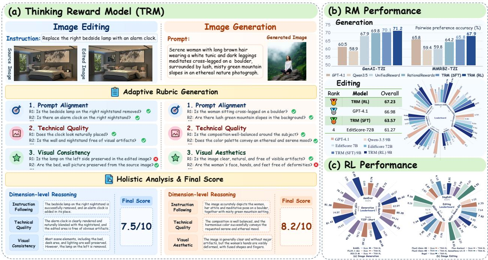  
Figure 1 Thinking Reward Model (TRM) follows the ‘‘Think Before You Score’’ paradigm. Given a visual generation case, TRM first formulates case-adaptive rubrics that specify what matters, then performs rubric-guided assessment before producing the final pointwise reward. This unified process achieves strong reward-modeling performance across image generation and editing, and efectively guides reinforcement learning for diverse visual generation models.

Our key observation is that evaluation criteria vary across tasks and individual cases, but the process of deriving and applying them can be shared across tasks. Inspired by how people make task-specific judgments, an evaluator first understands the task requirements and identifies the criteria relevant to the current case, then examines the candidate against each criterion and integrates the resulting evidence into an overall judgment. Efective evaluation thus first determines what matters before judging how well the candidate performs. We refer to this principle as ‘‘Think Before You Score’’.

Following this principle, we propose the Thinking Reward Model (TRM). As illustrated in Figure 1, TRM first generates a case-adaptive rubric that specifies the evaluation criteria for the current task and candidate. It then assesses the candidate against each criterion, integrates the resulting evidence into a holistic judgment, and outputs a pointwise reward. By making the evaluation criteria explicit, the rubric connects task interpretation with quality assessment, transforming an implicit condition-to-score mapping into a structured, case-adaptive evaluation process.

Building an efective thinking reward model requires both learning a structured evaluation process and capturing fine-grained quality diferences. To train such a model, we construct diverse training data for image generation and image editing through a unified pipeline spanning multiple tasks and dificulty levels, together with a two-stage human–AI annotation process that provides high-quality rubrics and scores. Supervised finetuning on these data establishes the rubric-guided evaluation capability, while pairwise preference supervision further enhances fine-grained reward discrimination. A natural approach is to incorporate this preference supervision through a Bradley–Terry-style objective applied directly to pointwise scores. However, this objective continues to encourage larger score margins even after the preference ordering is correct, which can lead to increasingly polarized score distributions. We therefore introduce Pairwise Dual-Group Relative Policy

Optimization (PD-GRPO), which leverages pairwise preferences through response-level relative optimization while retaining fine-grained pointwise scoring. Extensive experiments across image generation and image editing benchmarks demonstrate the efectiveness of TRM, while its application to generation model optimization further shows that stronger reward modeling translates into improved generation quality.

Our main contributions are summarized as follows:

• We introduce Think Before You Score, a visual reward modeling paradigm that explicitly determines what to evaluate for each case before deciding how to score.

• We construct a diverse dataset of approximately 20K image generation examples and 28K image editing examples through a unified pipeline with two-stage human-AI annotation, providing structured supervision with case-adaptive rubrics, criterion-level assessments, and quality scores.

• We develop TRM through cold-start SFT followed by PD-GRPO, which leverages pairwise preferences to improve fine-grained pointwise discrimination while mitigating score polarization.

• Extensive experiments demonstrate that TRM achieves strong performance on image generation and editing reward-modeling benchmarks and provides efective reward signals for improving diverse visual generation models through reinforcement learning.

## 2 Related Work

Reward Models for Visual Generation. Visual reward modeling has gained increasing attention with advances in visual generation. Existing methods mainly follow regressive or generative paradigms: regressive approaches predict scalar rewards from task conditions and candidate outputs [48, 50], while generative approaches leverage multimodal models [29, 32, 35, 42, 56] to produce quality assessments, increasingly with explicit analysis or reasoning before scoring [26, 34, 40]. Evaluation can be pointwise or pairwise, with image generation typically focusing on prompt adherence and visual quality [16], and image editing additionally considering edit correctness and content preservation [3, 55]. As summarized in Table 1, existing methods largely rely on fixed evaluation criteria, despite substantial variation in requirements and potential failure modes across individual cases.

Table 1 Comparison of representative reward models.
<table><tr><td rowspan="2">Method</td><td rowspan="2">Task</td><td rowspan="2">Modeling Paradigm</td><td colspan="2">Scoring</td><td rowspan="2">Adaptive Rubrics</td><td rowspan="2">Fine-Grained Verification</td><td rowspan="2">RL Optimization</td></tr><tr><td>Point</td><td>Pair</td></tr><tr><td>ImageReward</td><td>T2I</td><td>Regressive</td><td></td><td></td><td>X</td><td>X</td><td>X</td></tr><tr><td>UnifiedReward</td><td>T2I, T2V</td><td>Generative</td><td></td><td></td><td>X</td><td></td><td>X</td></tr><tr><td>RationalRewards</td><td>TI2I, T2I</td><td>Generative</td><td></td><td></td><td>X</td><td>√</td><td>x</td></tr><tr><td>RewardDance</td><td>T2I</td><td>Generative</td><td></td><td></td><td>X</td><td>√</td><td>X</td></tr><tr><td>FIRM-Reward</td><td>TI2I, T2I</td><td>Generative</td><td></td><td></td><td>X</td><td>√</td><td>X</td></tr><tr><td>EditReward</td><td>TI2I</td><td>Regressive</td><td></td><td></td><td>X</td><td>X</td><td>X</td></tr><tr><td>EditScore</td><td>TI2I</td><td>Generative</td><td></td><td></td><td>X</td><td>√</td><td>X</td></tr><tr><td>TRM (Ours)</td><td>TI2I, T2I</td><td>Generative</td><td></td><td></td><td>V</td><td></td><td>L</td></tr></table>

Reinforcement Learning for Visual Generation. Reward models play an important role in aligning visual generation with human preferences through preference optimization and reinforcement learning [26, 40]. Early studies explored difusion policy optimization and reward-based fine-tuning [30, 50]. Flow-GRPO [23] extends online reinforcement learning to flow-matching models by converting deterministic ODE sampling into stochastic SDE sampling and optimizing policies with group-relative advantages. Building on this framework, subsequent studies improve sampling eficiency and quality [39], introduce policy update constraints, and refine preference-based advantage estimation [52] to use reward feedback more eficiently and stably for generation model optimization. Complementary to these optimization methods, our work focuses on the quality of reward feedback itself. We use pairwise preference supervision to strengthen fine-grained pointwise reward modeling and apply the resulting rewards to reinforcement learning for image generation and editing.

## 3 A Unified Reward Modeling Paradigm for Visual Generation

## 3.1 Can Reward Modeling Be Unified Across Visual Generation Tasks?

Visual generation encompasses tasks with diferent input conditions and evaluation requirements, yet their reward modeling shares a common goal: estimating how well a candidate output satisfies the given task condition. We study image generation and image editing as two representative tasks and abstract each case as $x = \left( c , o \right)$ , where c denotes the task condition and o the candidate output. For image generation, c is a text prompt; for image editing, it consists of a source image and an editing instruction. A general reward model can then be formulated as $f _ { \theta } ( s p , c , o )  r$ , where sp specifies the evaluation protocol and r is the predicted pointwise reward. Although concrete conditions and criteria vary across tasks, the underlying evaluation process is shared: an evaluator understands the task requirements, determines what to check, inspects the candidate accordingly, and aggregates the observations into a final reward. This suggests a unified paradigm that shares the evaluation process across tasks while adapting the concrete criteria to each case. However, a critical question remains: how should the model determine what to check for each individual case before assigning a score?

## 3.2 How Should a General Reward Model Evaluate a Visual Generation Case?

We observe that what should be checked varies across cases, even within the same task. The task condition specifies the requirements, while the candidate output may introduce aspects or potential issues, such as object relations and visual defects in image generation, or identity preservation and unintended changes in image editing. Evaluation criteria should therefore adapt to both the task requirements and candidate output. However, conventional visual reward models typically map them directly to a scalar reward, leaving such case-adaptive criteria implicit. Consequently, case-specific requirements and fine-grained issues may not be adequately reflected in the final reward.

We therefore argue that a reward model should explicitly determine what to check before deciding how to score, a paradigm we term Think Before You Score. Specifically, a Thinking Reward Model (TRM) structures evaluation as $R \to J \to H \to s .$ where R denotes the case-adaptive rubric, J the rubric-level inspections and judgments, H the dimension-level assessments summarizing these judgments, and s the final pointwise reward. This forms a determine–inspect–aggregate–score process. Crucially, R is not a fixed checklist but an evaluation plan instantiated from the task condition and candidate output before the corresponding judgments and final reward are formed. This enables a consistent evaluation procedure with adaptive case-level criteria.

We instantiate this process with three high-level dimensions. Both image generation and editing share Prompt Alignment and Visual Quality, while the third dimension is task-specific: Aesthetics for image generation and Source Consistency for image editing. Within each dimension, TRM generates atomic, case-adaptive rubrics and inspects the candidate to produce a binary Yes/No judgment for each. These judgments constitute J and are summarized into dimension-level assessments H, from which TRM predicts the final pointwise reward s. Thus, the high-level dimensions provide a consistent evaluation structure, while the concrete rubrics adapt to each case.

## 4 Thinking Reward Model

## 4.1 Data Construction and Cold-Start SFT

As shown in Figure 2, training the Thinking Reward Model requires not only accurate scores, but also diverse visual cases and high-quality structured evaluation traces. Despite their diferent inputs and evaluation requirements, we adopt a unified pipeline for image generation and editing: constructing diverse cases, annotating rubrics and scores, and performing cold-start SFT to learn rubric-then-score evaluation. Based on the resulting SFT model, we further construct dificulty-aware preference pairs for subsequent reinforcement learning (RL).

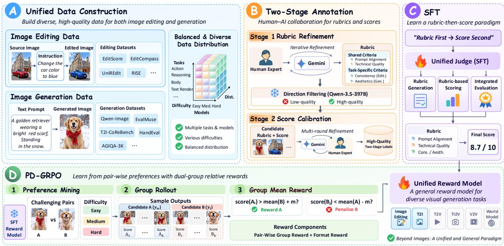  
Figure 2 Overview of data construction and training pipeline. We construct diverse and balanced data for image generation and editing, annotate rubrics and scores through a two-stage process, learn rubric-then-score evaluation via SFT, and further improve pointwise scoring with PD-GRPO using dificulty-aware pairwise preference supervision.

Step 1: Raw Case Construction. Following prior work [26, 48], we curate existing data to obtain reliable evaluation samples. For image editing, we filter instruction–source image pairs for compatibility, while for image generation, we remove invalid or unreliable text–image cases. We further broaden task coverage with representative benchmarks, such as Edit-Compass [3] and UniREdit-Bench [12] for image editing, and Qwen-Image-Bench [21] and EvalMuse [13] for image generation. We further perform rollouts with open-source and proprietary models of varying capabilities to increase output diversity. The resulting cases cover diverse task categories, model sources, quality levels, and failure modes, and are balanced across tasks, sources, and dificulty levels.

Step 2: Expert-in-the-Loop Structured Annotation. We construct structured supervision through a two-stage human–AI annotation process. In the first stage, human experts iteratively refine the system prompt, while a teacher model produces case-adaptive rubrics that are reviewed for coverage, atomicity, redundancy, and verifiability. In the second stage, the verified rubrics guide the teacher model to produce rubric-level judgments and final scores, followed by expert calibration. The two stages respectively establish what should be evaluated and how it should be evaluated, yielding reliable structured evaluation traces for training. Through this process, we construct a high-quality dataset comprising approximately 20K image generation cases and 28K image editing cases.

Step 3: Cold-Start SFT. Using these structured annotations, we perform SFT to learn the rubric-then-score evaluation process. We construct three complementary training formats: Rubric Generation for learning what to check, Rubric-based Scoring for evaluating candidates against given rubrics, and Integrated Evaluation for learning the complete structured evaluation. We jointly train all three formats in a single SFT stage to learn the complete R → J → H → s process. The resulting model, denoted as TRM (SFT), serves as the initialization for subsequent RL.

Step 4: Difficulty-Aware Preference Pair Construction. Starting from TRM (SFT), we construct preference pairs from candidate outputs under the same task condition. We rank each pair by their rewards and use the reward gap as a proxy for preference dificulty: larger gaps indicate easier comparisons, whereas smaller gaps require finer-grained discrimination. We partition the pairs into easy, medium, and hard subsets and sample across all three levels to cover both clear preferences and subtle quality diferences. Finally, we balance the data across task categories, candidate sources, and dificulty levels, yielding approximately 4, 000 high-quality preference pairs.

## 4.2 Pairwise Preference Optimization

Although TRM (SFT) learns the complete pointwise evaluation process, pointwise supervision treats each candidate independently and does not explicitly exploit relative preferences between candidates. This distinction becomes particularly important when candidates have similar overall quality but difer in subtle yet meaningful aspects. In image editing, for instance, two candidates may both satisfy the editing instruction and receive similarly high scores, while difering in realism or integration with the surrounding scene. Such fine-grained diferences can still induce clear relative preferences. We therefore introduce pairwise preference supervision to improve fine-grained discrimination between candidates while retaining the original pointwise reward interface.

As illustrated in Figure 2, for each preference pair, we independently sample multiple pointwise evaluation responses for the preferred and dispreferred candidates and use their relative scores to derive the training signal. During reinforcement learning, the reward is defined as $R ( y ) = r _ { \mathrm { p r e f } } ( y ) + \lambda _ { \mathrm { f m t } } r _ { \mathrm { f m t } } ( y )$ , where r<sub>pref</sub> translates the pairwise preference into an optimization signal for pointwise reward prediction, while r<sub>fmt</sub> encourages valid structured outputs. Since $r _ { \mathrm { f m t } }$ remains fixed throughout training, we focus on the design of $r _ { \mathrm { p r e f } }$ below.

Bradley–Terry as a Natural Starting Point. The Bradley–Terry (BT) model [4] provides a natural way to incorporate pairwise supervision while preserving the pointwise scoring interface. Given a rollout i from the preferred candidate with score $s _ { i } ^ { + }$ and a rollout $j$ from the dispreferred candidate with score $s _ { j } ^ { - }$ , we define $M _ { i j } = \sigma \left( ( s _ { i } ^ { + } - s _ { i } ^ { - } - m ) / \tau \right)$ , where $M _ { i j }$ is the probability that i is preferred over $j ,$ m is the preference margin, and τ is the temperature.

In initial BT-style formulation, each rollout is rewarded by its average pairwise preference against rollouts from the opposite side, defined as $\begin{array} { r } { r _ { i } ^ { + } = \frac { 1 } { | G ^ { - } | } \sum _ { j \in G ^ { - } } M _ { i j } } \end{array}$ and $\begin{array} { r } { r _ { j } ^ { - } = \frac { 1 } { | G ^ { + } | } \sum _ { i \in G ^ { + } } M _ { i j } } \end{array}$ , where $G ^ { + }$ and $G ^ { - }$ denote the preferred and dispreferred rollout sets, respectively.

In practice, as shown in Figure 7, directly optimizing this reward leads to pronounced score polarization: preferred scores progressively increase while dispreferred scores decrease. This follows from the monotonicity of $M _ { i j }$ with respect to $s _ { i } ^ { + } - s _ { j } ^ { - } ;$ : enlarging the score gap always increases the preference reward, even when the pair is already correctly ordered. Thus, BT enforces relative ordering without constraining the absolute pointwise scores.

Consequently, the objective has no interior optimum with respect to the score gap. In a bounded scoring space, continued optimization drives the two sides toward opposite boundaries, yielding polarized rather than well-calibrated scores. This motivates an objective that enforces suficient relative separation but stops rewarding further gap expansion once that separation is achieved.

Pairwise Dual-Group Relative Policy Optimization. Motivated by the above analysis, we propose Pairwise Dual-Group Relative Policy Optimization (PD-GRPO), which incorporates pairwise preference supervision while assigning credit to independently generated pointwise evaluations.

Given a preference pair $( x ^ { + } , x ^ { - } )$ , we independently sample N pointwise responses for each candidate, forming $G ^ { + } = y _ { 1 } ^ { + } , \ldots , y _ { N } ^ { + }$ and $G ^ { - } = y _ { 1 } ^ { - } , \ldots , y _ { N } ^ { - }$ for the preferred and dispreferred candidates, respectively. Each rollout independently produces a structured evaluation and pointwise score without observing the other candidate.

We compute the group means as $\begin{array} { r } { \mu ^ { + } = \frac { 1 } { N } \sum _ { i = 1 } ^ { N } s _ { i } ^ { + } } \end{array}$ and $\begin{array} { r } { \mu ^ { - } = \frac { 1 } { N } \sum _ { j = 1 } ^ { N } s _ { j } ^ { - } } \end{array}$ . The two groups serve as mutual references, with each rollout evaluated against the mean score of the opposite group, as illustrated in Figure 2. Specifically, $r _ { \mathrm { p r e f } } ( y ) = \mathcal { k } [ s ( y ) - \mu ^ { - } > m ]$ for $y \in G ^ { + }$ and $r _ { \mathrm { p r e f } } ( y ) = \mathcal { k } [ \mu ^ { + } - s ( y ) > m ]$ for $y \in G ^ { - }$ , where m is the required separation margin. Thus, pairwise preferences provide response-level credit based on whether each pointwise score achieves suficient separation from the opposite group.

Unlike the BT-style objective, this reward becomes constant once the required margin is satisfied, so further enlarging the score gap provides no additional benefit. PD-GRPO therefore enforces the desired relative separation without a persistent incentive toward score polarization. The margin m can further be adjusted according to the dificulty of each preference pair.

The dual-group structure is used only for reward construction. For policy optimization, we combine all 2N responses into $\mathcal { G } = G ^ { + } \cup G ^ { - }$ and compute the group-relative advantage as $A _ { k } = ( R _ { k } - \mu _ { \mathcal { G } } ) / ( \sigma _ { \mathcal { G } } + \epsilon )$ , where µ<sub>G</sub> and σ<sub>G</sub> are the reward mean and standard deviation within G. We then apply the standard clipped group-relative objective with KL regularization [31].

Since the two candidates interact only during reward construction, each remains independently evaluated at inference time. Thus, PD-GRPO exploits fine-grained pairwise supervision while preserving the pointwise inference interface of TRM.

## 5 Experiments

## 5.1 Experimental Setups

We evaluate TRM from two complementary perspectives across image generation and editing: reward-modeling performance on established benchmarks and efectiveness in guiding downstream reinforcement learning, assessed through both quantitative and qualitative results.

Reward Modeling Benchmarks and Baselines. We evaluate TRM on GenAI-T2I [19] and MMRB2-T2I [15] for image generation, and EditScore-ERB [26], MMRB2 [15], EditReward-ERB [48], and EditReward-Compass [3] for image editing. We compare against proprietary multimodal models from the GPT [28] and Gemini [10] families, open-source models from the Qwen [1, 2, 29] family, and specialized reward models, including HPSv3 [27], UnifiedReward [43], RationalRewards [40], EditScore [26], and FIRM-Reward [57].

Visual Generation Benchmarks and Baselines. To evaluate TRM as a training signal, we use it for onpolicy optimization of BAGEL [7], FLUX.1-dev [17], and SD3.5-M for image generation, and FLUX.2-Klein (4B/9B) [18], BAGEL, FLUX-Kontext, and SenseNova-U1.5 [8] for image editing. We evaluate image generation on GenEval [9], DPG-Bench [14], and TIIF-testmini [46], and image editing on ImgEdit [54] and GEdit-Bench (EN/CN) [24].

Implementation Details. TRM is initialized from Qwen3.5-9B [29] and trained with cold-start SFT followed by PD-GRPO on approximately 4, 000 preference pairs. Both stages use LoRA, with 8 rollouts per candidate. We set the separation margin to m = 0 for image editing and m = 0.05 for image generation, with scores normalized before reward computation. Qwen3.5-9B (Baseline) denotes the original model evaluated under the same pointwise protocol without reward-model training. More details are provided in the Appendix A.2.

## 5.2 Reward Model Performance

Table 2 Performance on image generation reward-modeling benchmarks.
<table><tr><td>Model</td><td>Size</td><td>GenAI-T2I</td><td>MMRB2-T2I</td></tr><tr><td colspan="4">Proprietary Models</td></tr><tr><td>GPT-4.1</td><td></td><td>60.5</td><td>65.8</td></tr><tr><td>Gemini 2.5 Flash</td><td></td><td>65.8</td><td>63.1</td></tr><tr><td>Gemini 2.5 Pro</td><td>一</td><td>66.2</td><td>70.5</td></tr><tr><td>Gemini 3 Pro</td><td></td><td>73.1</td><td>74.4</td></tr><tr><td colspan="4">Open-Source Models</td></tr><tr><td>Qwen2.5-VL</td><td>7B</td><td></td><td>50.4</td></tr><tr><td>Qwen2.5-VL</td><td>72B</td><td>66.6</td><td>59.1</td></tr><tr><td>Qwen3-VL</td><td>8B</td><td>55.1</td><td>59.4</td></tr><tr><td>Qwen3-VL</td><td>32B</td><td>66.9</td><td>64.1</td></tr><tr><td>Qwen-3.5</td><td>9B</td><td>66.1</td><td>64.5</td></tr><tr><td colspan="4">Image Generation Reward Models</td></tr><tr><td>HPSv3</td><td>7B</td><td>70.8</td><td>60.2</td></tr><tr><td>UnifiedReward</td><td>7B</td><td>67.9</td><td>59.8</td></tr><tr><td>RationalRewards</td><td>8B</td><td>69.8</td><td>64.2</td></tr><tr><td colspan="4">Our Models</td></tr><tr><td>Qwen-3.5 (Baseline)</td><td>9B</td><td>58.9</td><td>59.4</td></tr><tr><td>TRM (SFT)</td><td>9B</td><td>70.1</td><td>65.8</td></tr><tr><td>TRM (RL)</td><td>9B</td><td>71.2</td><td>67.9</td></tr></table>

Image Generation. As shown in Table 2, TRM achieves strong preference modeling across both benchmarks. Cold-start SFT substantially improves the Qwen-3.5 baseline from 58.9%/59.4% to 70.1%/65.8% on GenAI-T2I/MMRB2-T2I, demonstrating the efectiveness of structured rubric-guided training. PD-GRPO further improves the results to 71.2%/67.9%, with gains of 1.1 and 2.1 percentage points over SFT. Notably, our 9B model outperforms all evaluated open-source models and specialized reward models on MMRB2-T2I, while also surpassing GPT-4.1 on both benchmarks. These results show that structured SFT establishes strong pointwise evaluation, while pairwise preference optimization further improves fine-grained discrimination. For pointwise models, we report accuracy over non-tied predictions; tie-aware results are provided in Appendix A.4.3.

Image Editing. Table 3 shows similarly consistent improvements on image editing. Compared with the Qwen-3.5 baseline, TRM (SFT) substantially improves all reported metrics, reaching 0.750/0.639/0.743 on EditScore-ERB and 67.8% on EditReward-ERB. PD-GRPO further improves every metric, including MMRB2 from 53.0% to 58.2% and EditReward-Compass to 0.640/0.660. Despite using only 9B parameters, TRM (RL) also consistently outperforms the specialized 72B EditScore [26] model across all reported benchmarks and metrics. Together, these results demonstrate that pairwise preference optimization consistently strengthens the pointwise evaluation capability established by SFT across diverse editing criteria.

Table 3 Performance on image editing reward-modeling benchmarks.
<table><tr><td rowspan="2">Model</td><td rowspan="2">Size</td><td colspan="3">EditScore-ERB</td><td rowspan="2">MMRB2</td><td>EditReward-ERB</td><td colspan="2">EditReward-Compass</td></tr><tr><td>IF</td><td>VC</td><td>0</td><td>2-path</td><td>IA</td><td>vc</td></tr><tr><td colspan="10">Proprietary Models</td></tr><tr><td>GPT-4.1</td><td></td><td>0.673</td><td>0.602</td><td>0.705</td><td>68.2</td><td>72.1</td><td>0.747</td><td>0.485</td></tr><tr><td>GPT-5</td><td></td><td>0.777</td><td>0.669</td><td>0.755</td><td>73.8</td><td>73.0</td><td></td><td></td></tr><tr><td>Gemini 2.5 Pro</td><td></td><td>0.703</td><td>0.560</td><td>0.722</td><td>71.3</td><td>78.3</td><td></td><td></td></tr><tr><td>Gemini 3.1 Pro</td><td></td><td>0.877</td><td>0.716</td><td>0.841</td><td>74.9</td><td>73.9</td><td>0.832</td><td>0.600</td></tr><tr><td colspan="9">Open-Source Models</td></tr><tr><td>Qwen2.5-VL</td><td>7B</td><td>0.458</td><td>0.325</td><td>0.432</td><td>55.2</td><td>63.4</td><td>0.427</td><td>0.217</td></tr><tr><td>Qwen2.5-VL</td><td>32B</td><td>0.498</td><td>0.376</td><td>0.563</td><td>67.3</td><td>65.2</td><td>0.612</td><td>0.412</td></tr><tr><td>Qwen2.5-VL</td><td>72B</td><td>0.540</td><td>0.435</td><td>0.621</td><td>65.8</td><td>67.8</td><td>0.637</td><td>0.421</td></tr><tr><td>Qwen3-VL</td><td>8B</td><td>0.383</td><td>0.239</td><td>0.571</td><td>62.0</td><td>60.9</td><td>0.565</td><td>0.365</td></tr><tr><td>Qwen-3.5</td><td>9B</td><td>0.612</td><td>0.389</td><td>0.500</td><td>51.4</td><td>47.0</td><td>0.585</td><td>0.452</td></tr><tr><td colspan="9">Image Editing Reward Models</td></tr><tr><td>EditScore</td><td>7B</td><td>0.592</td><td>0.591</td><td>0.659</td><td>51.3</td><td>60.0</td><td>0.509</td><td>0.416</td></tr><tr><td>EditScore</td><td>72B</td><td>0.635</td><td>0.586</td><td>0.703</td><td>53.3</td><td>65.2</td><td>0.623</td><td>0.626</td></tr><tr><td>FIRM-Reward</td><td>8B</td><td>0.476</td><td>0.565</td><td>0.607</td><td>44.5</td><td>50.9</td><td>0.520</td><td>0.507</td></tr><tr><td colspan="9">Our Models</td></tr><tr><td>Qwen-3.5 (Baseline)</td><td>9B</td><td>0.440</td><td>0.308</td><td>0.401</td><td>30.9</td><td>33.8</td><td>0.448</td><td>0.314</td></tr><tr><td>TRM(SFT)</td><td>9B</td><td>0.750</td><td>0.639</td><td>0.743</td><td>53.0</td><td>67.8</td><td>0.626</td><td>0.622</td></tr><tr><td>TRM(RL)</td><td>9B</td><td>0.786</td><td>0.674</td><td>0.773</td><td>58.2</td><td>71.3</td><td>0.640</td><td>0.660</td></tr></table>

## 5.3 Reward-Guided RL Optimization

Reward-modeling benchmarks measure the evaluation capability of TRM, but a practical reward model should also provide efective training signals for improving visual generation. We therefore use TRM to guide FlowGRPO [23] optimization of image generation and editing models, evaluating whether its learned rewards translate into consistent gains in generation quality.

Image Generation. As shown in Table 4, TRM-guided reinforcement learning consistently improves BAGEL, FLUX.1-dev, and SD3.5-M across all evaluated benchmarks, demonstrating that the learned reward generalizes across model families and capability levels. The improvements cover GenEval, DPG-Bench, and both TIIF subsets, with particularly notable gains on fine-grained instruction following. Specifically, BAGEL improves by 5.81 points on TIIF-Long, while FLUX.1-dev gains 6.76 and 6.56 points on TIIF-Short and TIIF-Long, respectively.

The qualitative comparisons in Figures 10 and 11 further reveal where these gains arise. After TRM-guided optimization, both models better satisfy fine-grained compositional constraints, including object counting, composition, spatial relations, and text rendering. BAGEL more accurately follows specified object counts and textual requirements, while FLUX.1-dev better preserves required objects in multi-constraint prompts and renders requested text more faithfully. Together, these results show that TRM provides efective training signals for improving fine-grained prompt alignment across diverse text-to-image models.

Table 4 Results of TRM-guided RL on image generation.
<table><tr><td>Model</td><td>GenEval↑</td><td>DPG-Bench↑</td><td>TIIF-Short↑</td><td>TIIF-Long↑</td></tr><tr><td colspan="5">Representative Image Generation Models</td></tr><tr><td>OmniGen2</td><td>0.80</td><td>83.60</td><td>70.20</td><td>70.30</td></tr><tr><td>LongCat-Image</td><td>0.87</td><td>86.80</td><td></td><td></td></tr><tr><td>Qwen-Image</td><td>0.87</td><td>88.32</td><td>86.14</td><td>86.83</td></tr><tr><td>LLaDA-Image</td><td>0.85</td><td>87.48</td><td></td><td></td></tr><tr><td>Z-Image</td><td>0.84</td><td>88.14</td><td>80.20</td><td>83.01</td></tr><tr><td colspan="5">TRM-guided Reinforcement Learning</td></tr><tr><td>BAGEL</td><td>0.86</td><td>85.07</td><td>74.91</td><td>75.62</td></tr><tr><td>+ TRM-guided RL</td><td>0.89</td><td>86.60</td><td>80.68</td><td>81.43</td></tr><tr><td>FLUX.1-dev</td><td>0.66</td><td>83.84</td><td>70.84</td><td>74.82</td></tr><tr><td>+ TRM-guided RL</td><td>0.73</td><td>85.28</td><td>77.60</td><td>81.38</td></tr><tr><td>SD3.5-M</td><td>0.66</td><td>84.24</td><td>72.86</td><td>72.81</td></tr><tr><td>+ TRM-guided RL</td><td>0.72</td><td>86.23</td><td>78.04</td><td>76.15</td></tr></table>

Table 5 Results of TRM-guided RL on image editing.
<table><tr><td>Model</td><td>ImgEdit</td><td colspan="3">GEdit-Bench-EN</td><td colspan="3">GEdit-Bench-CN</td></tr><tr><td></td><td></td><td>G_SC</td><td>G_PQ</td><td>G_0↑</td><td>G_SC</td><td>G_PQ</td><td>G_O↑</td></tr><tr><td colspan="8">Representative Image Editing Models</td></tr><tr><td>OmniGen2</td><td>3.44</td><td>7.16</td><td>6.77</td><td>6.41</td><td></td><td></td><td></td></tr><tr><td>LongCat-Image-Edit</td><td>4.44</td><td>8.13</td><td>8.18</td><td>7.75</td><td>8.14</td><td>8.12</td><td>7.73</td></tr><tr><td>Qwen-Image-Edit2509</td><td>4.34</td><td>7.97</td><td>7.71</td><td>7.48</td><td>7.99</td><td>7.68</td><td>7.47</td></tr><tr><td>LLaDA-Image</td><td></td><td>8.04</td><td>7.18</td><td>7.34</td><td>7.71</td><td>7.59</td><td>7.29</td></tr><tr><td>JoyAI-Image-Edit</td><td>4.46</td><td>8.83</td><td>8.12</td><td>8.28</td><td>8.62</td><td>8.11</td><td>8.13</td></tr><tr><td>DeepGen1.0</td><td>4.14</td><td>7.66</td><td>7.12</td><td>7.17</td><td>7.22</td><td>7.31</td><td>6.82</td></tr><tr><td colspan="8">TRM-guided Reinforcement Learning</td></tr><tr><td>Flux2-Klein-4B</td><td>3.80</td><td>7.68</td><td>7.31</td><td>7.02</td><td>7.65</td><td>7.27</td><td>6.96</td></tr><tr><td>+ TRM-guided RL</td><td>3.87</td><td>8.20</td><td>7.74</td><td>7.73</td><td>7.90</td><td>7.65</td><td>7.52</td></tr><tr><td>Flux2-Klein-9B</td><td>4.05</td><td>8.39</td><td>7.57</td><td>7.64</td><td>8.37</td><td>7.59</td><td>7.66</td></tr><tr><td>+ TRM-guided RL</td><td>4.13</td><td>8.43</td><td>7.82</td><td>7.82</td><td>8.45</td><td>7.95</td><td>7.95</td></tr><tr><td>BAGEL</td><td>3.37</td><td>7.89</td><td>6.68</td><td>6.95</td><td>7.92</td><td>6.76</td><td>6.98</td></tr><tr><td>+ TRM-guided RL</td><td>3.91</td><td>8.39</td><td>7.26</td><td>7.57</td><td>8.40</td><td>7.33</td><td>7.64</td></tr><tr><td>Flux-Kontext</td><td>3.65</td><td>7.07</td><td>7.30</td><td>6.44</td><td></td><td></td><td></td></tr><tr><td>+ TRM-guided RL</td><td>3.79</td><td>7.22</td><td>7.51</td><td>6.72</td><td></td><td></td><td></td></tr><tr><td>SenseNova-U1.5†</td><td>4.30</td><td>9.10</td><td>7.63</td><td>8.20</td><td>9.10</td><td>7.61</td><td>8.19</td></tr><tr><td>+ TRM-guided RL</td><td>4.52</td><td>9.14</td><td>7.83</td><td>8.33</td><td>9.09</td><td>7.87</td><td>8.34</td></tr></table>

Image Editing. As shown in Table 5, TRM-guided reinforcement learning consistently improves diverse image-editing models across nearly all evaluated metrics, spanning Flux2-Klein at 4B and 9B scales, BAGEL, Flux-Kontext, and SenseNova-U1.5. These consistent improvements across model families, scales, and initial capability levels demonstrate that TRM provides efective training signals even for already strong image-editing models. The gains are particularly pronounced for BAGEL, whose ImgEdit score increases from 3.37 to 3.91, while its overall scores on GEdit-Bench-EN/CN improve from 6.95/6.98 to 7.57/7.64. Notably, the strong SenseNova-U1.5 baseline also benefits from TRM-guided optimization, improving from 4.30 to 4.52 on ImgEdit and from 8.20/8.19 to 8.33/8.34 on GEdit-Bench-EN/CN.

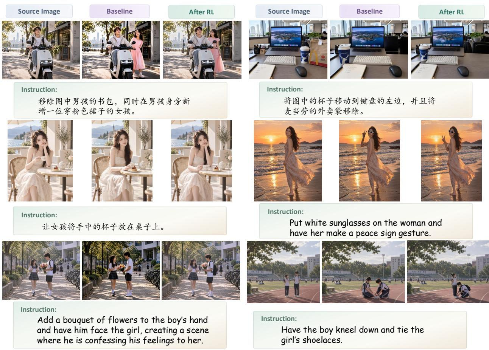  
Figure 3 Qualitative comparison of SenseNova-U1.5 before and after RL fine-tuning with TRM.

Figure 3 further illustrates the improvements under both Chinese and English editing instructions. Compared with the baseline, TRM-guided optimization better preserves unedited content while reducing unintended appearance changes and structural artifacts, and more faithfully follows the requested modifications. These qualitative results complement the benchmark gains, demonstrating improved instruction following, content preservation, and visual quality across diverse editing scenarios. Additional cases are provided in Figures 8 and 9.

## 5.4 Ablation Studies

Image Generation. We compare TRM with AlphaGRPO [16] using the same BAGEL backbone. As shown in Table 6, TRM consistently outperforms AlphaGRPO across all evaluated benchmarks, with gains of 2.98 and 3.33 points on TIIF-Short and TIIF-Long, respectively. Improvements on GenEval and DPG-Bench further show that the gains generalize across complementary evaluation benchmarks. Under this controlled setting, these results demonstrate the efectiveness of TRM as a reward signal for image generation optimization.

Image Editing. We further compare TRM with EditScore-72B [26] on SenseNova-U1.5 under identical training settings. Despite using only 9B parameters, one-eighth of EditScore-72B, TRM achieves comparable overall performance and slightly higher results on ImgEdit (4.52 vs. 4.51) and GEdit-Bench-EN (8.33 vs. 8.31). Figure 6 further examines the evolution of within-group reward variation during optimization. At training step 300, the reward standard deviation decreases by only 14.9% with TRM, compared with 50.5% with EditScore-72B, indicating that TRM retains greater reward variation among sampled candidates as training progresses. Such variation provides more diferentiated signals for group-relative advantage estimation. Together, these results show that TRM can provide efective reward guidance with substantially fewer parameters, enabling further optimization of an already strong image-editing model.

Table 6 Ablation and controlled comparisons of reward-guided optimization.
<table><tr><td colspan="5">Image Generation: BAGEL</td></tr><tr><td>Reward / Method</td><td>GenEval↑</td><td>DPG-Bench↑</td><td>TIIF-S↑</td><td>TIIF-L↑</td></tr><tr><td>Base</td><td>0.86</td><td>85.07</td><td>74.91</td><td>75.62</td></tr><tr><td>AlphaGRPO</td><td>0.86</td><td>85.10</td><td>77.70</td><td>78.10</td></tr><tr><td>TRM (Ours)</td><td>0.89</td><td>86.60</td><td>80.68</td><td>81.43</td></tr></table>

Image Editing: SenseNova-U1.5
<table><tr><td>Reward Model</td><td>ImgEdit</td><td>GEdit-EN</td><td>GEdit-CN</td><td>RM Size</td></tr><tr><td>Base</td><td>4.30</td><td>8.20</td><td>8.19</td><td></td></tr><tr><td>EditScore</td><td>4.51</td><td>8.31</td><td>8.37</td><td>72B (8×)</td></tr><tr><td>TRM (Ours)</td><td>4.52</td><td>8.33</td><td>8.34</td><td>9B (1×)</td></tr></table>

## 6 Conclusion

We introduce Thinking Reward Model (TRM) under the Think Before You Score paradigm for visual reward modeling. TRM constructs case-adaptive rubrics before scoring, enabling a shared evaluation process with flexible case-level criteria. We train TRM through structured SFT followed by PD-GRPO, which leverages pairwise preferences to improve fine-grained discrimination while mitigating score polarization. Experiments demonstrate strong reward-modeling performance across image generation and editing, while TRM-guided reinforcement learning consistently improves diverse generative models across architectures and scales.

## References

[1] Shuai Bai, Yuxuan Cai, Ruizhe Chen, Keqin Chen, Xionghui Chen, Zesen Cheng, Lianghao Deng, Wei Ding, Chang Gao, Chunjiang Ge, Wenbin Ge, Zhifang Guo, Qidong Huang, Jie Huang, Fei Huang, Binyuan Hui, Shutong Jiang, Zhaohai Li, Mingsheng Li, Mei Li, Kaixin Li, Zicheng Lin, Junyang Lin, Xuejing Liu, Jiawei Liu, Chenglong Liu, Yang Liu, Dayiheng Liu, Shixuan Liu, Dunjie Lu, Ruilin Luo, Chenxu Lv, Rui Men, Lingchen Meng, Xuancheng Ren, Xingzhang Ren, Sibo Song, Yuchong Sun, Jun Tang, Jianhong Tu, Jianqiang Wan, Peng Wang, Pengfei Wang, Qiuyue Wang, Yuxuan Wang, Tianbao Xie, Yiheng Xu, Haiyang Xu, Jin Xu, Zhibo Yang, Mingkun Yang, Jianxin Yang, An Yang, Bowen Yu, Fei Zhang, Hang Zhang, Xi Zhang, Bo Zheng, Humen Zhong, Jingren Zhou, Fan Zhou, Jing Zhou, Yuanzhi Zhu, and Ke Zhu. Qwen3-vl technical report. arXiv preprint arXiv:2511.21631, 2025.

[2] Shuai Bai, Keqin Chen, Xuejing Liu, Jialin Wang, Wenbin Ge, Sibo Song, Kai Dang, Peng Wang, Shijie Wang, Jun Tang, Humen Zhong, Yuanzhi Zhu, Mingkun Yang, Zhaohai Li, Jianqiang Wan, Pengfei Wang, Wei Ding, Zheren Fu, Yiheng Xu, Jiabo Ye, Xi Zhang, Tianbao Xie, Zesen Cheng, Hang Zhang, Zhibo Yang, Haiyang Xu, and Junyang Lin. Qwen2.5-vl technical report. arXiv preprint arXiv:2502.13923, 2025.

[3] Xuehai Bai, Yang Shi, Yi-Fan Zhang, Xuanyu Zhu, Yuran Wang, Yifan Dai, Xinyu Liu, Yiyan Ji, Xiaoling Gu, and Yuanxing Zhang. Edit-compass & editreward-compass: A unified benchmark for image editing and reward modeling. arXiv preprint arXiv:2605.13062, 2026.

[4] Ralph Allan Bradley and Milton E Terry. Rank analysis of incomplete block designs: I. the method of paired comparisons. Biometrika, 39(3/4):324–345, 1952.

[5] SiXiang Chen, Jianyu Lai, Jialin Gao, Tian Ye, Haoyu Chen, Hengyu Shi, Shitong Shao, Yunlong Lin, Song Fei, Zhaohu Xing, et al. Postercraft: Rethinking high-quality aesthetic poster generation in a unified framework. arXiv preprint arXiv:2506.10741, 2025.

[6] Zhihong Chen, Xuehai Bai, Yang Shi, Chaoyou Fu, Huanyu Zhang, Haotian Wang, Xiaoyan Sun, Zhang Zhang, Liang Wang, Yuanxing Zhang, et al. Opengpt-4o-image: A comprehensive dataset for advanced image generation and editing. arXiv preprint arXiv:2509.24900, 2025.

[7] Chaorui Deng, Deyao Zhu, Kunchang Li, Chenhui Gou, Feng Li, Zeyu Wang, Shu Zhong, Weihao Yu, Xiaonan Nie, Ziang Song, Guang Shi, and Haoqi Fan. Emerging properties in unified multimodal pretraining. arXiv preprint arXiv:2505.14683, 2025.

[8] Haiwen Diao, Jiahao Wang, Chenjing Ding, Hanming Deng, Jiangnan Chen, Ruixi Zhang, Ruohui Wang, Wenwen Tong, Xiangyu Fan, Yubo Wang, et al. Sensenova-u1. 5: Towards native unified visual intelligence. arXiv preprint arXiv:2609.11929, 2026.

[9] Dhruba Ghosh, Hannaneh Hajishirzi, and Ludwig Schmidt. Geneval: An object-focused framework for evaluating text-to-image alignment. Advances in Neural Information Processing Systems, 36:52132–52152, 2023.

[10] Google DeepMind. Gemini 3 pro model card. https://storage.googleapis.com/deepmind-media/Model-Cards/ Gemini-3-Pro-Model-Card.pdf, November 2025. Model Card.

[11] Hanzhong Guo, Jie Wu, Jie Liu, Yu Gao, Zilyu Ye, Linxiao Yuan, Xionghui Wang, Yizhou Yu, and Weilin Huang. Leveraging verifier-based reinforcement learning in image editing. arXiv preprint arXiv:2604.27505, 2026.

[12] Feng Han, Yibin Wang, Chenglin Li, Zheming Liang, Dianyi Wang, Yang Jiao, Zhipeng Wei, Chao Gong, Cheng Jin, and Jiaqi Wang. Unireditbench: A unified reasoning-based image editing benchmark. In European Conference on Computer Vision, pages 287–304. Springer, 2026.

[13] Shuhao Han, Haotian Fan, Jiachen Fu, Liang Li, Tao Li, Junhui Cui, Yunqiu Wang, Yang Tai, Jingwei Sun, Chunle Guo, et al. Evalmuse-40k: A reliable and fine-grained benchmark with comprehensive human annotations for text-to-image generation model evaluation. arXiv preprint arXiv:2412.18150, 2024.

[14] Xiwei Hu, Rui Wang, Yixiao Fang, Bin Fu, Pei Cheng, and Gang Yu. Ella: Equip difusion models with llm for enhanced semantic alignment. arXiv preprint arXiv:2403.05135, 2024.

[15] Yushi Hu, Reyhane Askari-Hemmat, Melissa Hall, Emily Dinan, Luke Zettlemoyer, and Marjan Ghazvininejad. Multimodal rewardbench 2: Evaluating omni reward models for interleaved text and image. In Proceedings of the IEEE/CVF Conference on Computer Vision and Pattern Recognition, pages 36904–36915, 2026.

[16] Runhui Huang, Jie Wu, Rui Yang, Zhe Liu, and Hengshuang Zhao. Alphagrpo: Unlocking self-reflective multimodal generation in unified multimodal models via decompositional verifiable reward. In Forty-third International Conference on Machine Learning, 2026.

[17] Black Forest Labs. Flux. https://github.com/black-forest-labs/flux, 2024.

[18] Black Forest Labs. FLUX.2: Frontier Visual Intelligence. https://bfl.ai/blog/flux-2, 2025.

[19] Baiqi Li, Zhiqiu Lin, Deepak Pathak, Jiayao Li, Yixin Fei, Kewen Wu, Tifany Ling, Xide Xia, Pengchuan Zhang, Graham Neubig, et al. Genai-bench: Evaluating and improving compositional text-to-visual generation. arXiv preprint arXiv:2406.13743, 2024.

[20] Chunyi Li, Zicheng Zhang, Haoning Wu, Wei Sun, Xiongkuo Min, Xiaohong Liu, Guangtao Zhai, and Weisi Lin. Agiqa-3k: An open database for ai-generated image quality assessment. IEEE Transactions on Circuits and Systems for Video Technology, 34(8):6833–6846, 2023.

[21] Niantong Li, Guangzheng Hu, Weixu Qiao, Ying Ba, Qichen Hong, Shijun Shen, Jinlin Wang, Fan Zhou, Jianye Kang, Xin Shang, et al. Qwen-image-bench: From generation to creation in text-to-image evaluation. arXiv preprint arXiv:2605.28091, 2026.

[22] Ouxiang Li, Yuan Wang, Xinting Hu, Huijuan Huang, Rui Chen, Jiarong Ou, Xin Tao, Pengfei Wan, Xiaojuan Qi, and Fuli Feng. Easier painting than thinking: Can text-to-image models set the stage, but not direct the play? In International Conference on Learning Representations, volume 2026, pages 86729–86758, 2026.

[23] Jie Liu, Gongye Liu, Jiajun Liang, Yangguang Li, Jiaheng Liu, Xintao Wang, Pengfei Wan, Di Zhang, and Wanli Ouyang. Flow-grpo: Training flow matching models via online rl. Advances in neural information processing systems, 38:40783–40818, 2026.

[24] Shiyu Liu, Yucheng Han, Peng Xing, Fukun Yin, Rui Wang, Wei Cheng, Jiaqi Liao, Yingming Wang, Honghao Fu, Chunrui Han, et al. Step1x-edit: A practical framework for general image editing. arXiv preprint arXiv:2504.17761, 2025.

[25] Yijun Liu, Jie Huang, Zeyue Xue, Yuming Li, Ruizhe He, Haoran Li, Shijia Ge, and Siming Fu. Hpsv3++: Scaling reward models across the full spectrum of difusion model capabilities. arXiv preprint arXiv:2606.14657, 2026.

[26] Xin Luo, Jiahao Wang, Chenyuan Wu, Shitao Xiao, Xiyan Jiang, Defu Lian, Jiajun Zhang, Dong Liu, and Zheng Liu. Editscore: Unlocking online rl for image editing via high-fidelity reward modeling. In International Conference on Learning Representations, volume 2026, pages 33027–33056, 2026.

[27] Yuhang Ma, Xiaoshi Wu, Keqiang Sun, and Hongsheng Li. Hpsv3: Towards wide-spectrum human preference score. In 2025 IEEE/CVF International Conference on Computer Vision (ICCV), pages 15086–15095. IEEE, 2025.

[28] OpenAI. Introducing gpt-4.1 in the api. https://openai.com/index/gpt-4-1/, April 2025. Blog post (no standalone technical report/system card published as of this date).

[29] Qwen Team. Qwen3.5: Towards native multimodal agents, February 2026. URL https://qwen.ai/blog?id= qwen3.5.

[30] Allen Ren, Justin Lidard, Lars Ankile, Anthony Simeonov, Pulkit Agrawal, Anirudha Majumdar, Benjamin Burchfiel, Hongkai Dai, and Max Simchowitz. Difusion policy policy optimization. In International Conference on Learning Representations, volume 2025, pages 77288–77329, 2025.

[31] Zhihong Shao, Peiyi Wang, Qihao Zhu, Runxin Xu, Junxiao Song, Xiao Bi, Haowei Zhang, Mingchuan Zhang, YK Li, Yang Wu, et al. Deepseekmath: Pushing the limits of mathematical reasoning in open language models. arXiv preprint arXiv:2402.03300, 2024.

[32] Yang Shi, Jiaheng Liu, Yushuo Guan, Zhenhua Wu, Yuanxing Zhang, Zihao Wang, Weihong Lin, Jingyun Hua, Zekun Wang, Xinlong Chen, et al. Mavors: Multi-granularity video representation for multimodal large language model. In Proceedings of the 33rd ACM International Conference on Multimedia, pages 10994–11003, 2025.

[33] Yang Shi, Yuhao Dong, Yue Ding, Yuran Wang, Xuanyu Zhu, Sheng Zhou, Wenting Liu, Haochen Tian, Rundong Wang, Huanqian Wang, et al. Realunify: Do unified models truly benefit from unification? a comprehensive benchmark. In Proceedings of the IEEE/CVF Conference on Computer Vision and Pattern Recognition, pages 22488–22497, 2026.

[34] Yang Shi, Huanqian Wang, Xie Xie, Huanyao Zhang, Lijie Zhao, Xinfeng Li, Chaoyou Fu, Zhuoer Wen, Wenting Liu, Zhuoran Zhang, et al. Mme-videoocr: Evaluating ocr-based capabilities of multimodal llms in video scenarios. Advances in Neural Information Processing Systems, 38, 2026.

[35] Wanshun Su, Yang Shi, Feihu Liu, Ziwen Yu, Yan Min, Zhuoran Zhang, Qixun Wang, Haotian Wang, Shixuan Liu, Yuanxing Zhang, et al. Omnipack: Unified token compression for eficient omni-modal large language models. arXiv preprint arXiv:2608.03812, 2026.

[36] Zhenchen Tang, Yang Li, Songlin Yang, Bo Peng, Xiaotong Zhao, Shuai Li, Haotian Fan, Alan Zhao, and Jing Dong. Rewardverse: Rubric-guided policy optimization for video reward modeling, 2026. URL https: //arxiv.org/abs/2609.22947.

[37] Zhenchen Tang, Bo Peng, Zichuan Wang, Songlin Yang, Leilei Cao, Fengjie Zhu, and Jing Dong. An evolutionary agentic approach for open-ended image quality perception, 2026. URL https://arxiv.org/abs/2609.22942.

[38] Dianyi Wang, Chaofan Ma, Feng Han, Size Wu, Wei Song, Yibin Wang, Zhixiong Zhang, Tianhang Wang, Siyuan Wang, Zhongyu Wei, et al. Unireason 1.0: A unified reasoning framework for world knowledge aligned image generation and editing. arXiv preprint arXiv:2602.02437, 2026.

[39] Feng Wang and Zihao Yu. Coeficients-preserving sampling for reinforcement learning with flow matching. arXiv preprint arXiv:2509.05952, 2025.

[40] Haozhe Wang, Cong Wei, Weiming Ren, Jiaming Liu, Fangzhen Lin, and Wenhu Chen. Rationalrewards: Reasoning rewards scale visual generation both training and test time. arXiv preprint arXiv:2604.11626, 2026.

[41] Qixun Wang, Yang Shi, Letian Cheng, Zhuoran Zhang, Yan He, Yuqi Tang, Qi Zhang, Xinlei Yu, Ruizhe Chen, Tianrun Xu, et al. Beacon: Knowing when and how to perform agentic visual reasoning. arXiv preprint arXiv:2607.28595, 2026.

[42] Qixun Wang, Yang Shi, Yifei Wang, Yuanxing Zhang, Pengfei Wan, Kun Gai, Xianghua Ying, and Yisen Wang. Monet: Reasoning in latent visual space beyond image and language. In Proceedings of the IEEE/CVF Conference on Computer Vision and Pattern Recognition, pages 12030–12040, 2026.

[43] Yibin Wang, Yuhang Zang, Hao Li, Cheng Jin, and Jiaqi Wang. Unified reward model for multimodal understanding and generation. arXiv preprint arXiv:2503.05236, 2025.

[44] Yuhan Wang, Siwei Yang, Bingchen Zhao, Letian Zhang, Qing Liu, Yuyin Zhou, and Cihang Xie. Gpt-image-edit-1.5 m: A million-scale, gpt-generated image dataset. arXiv preprint arXiv:2507.21033, 2025.

[45] Zichuan Wang, Bo Peng, Songlin Yang, Zhenchen Tang, and Jing Dong. Handeval: Taking the first step towards hand quality evaluation in generated images. arXiv preprint arXiv:2510.08978, 2025.

[46] Xinyu Wei, Jinrui Zhang, Zeqing Wang, Hongyang Wei, Zhen Guo, Bairui Li, and Lei Zhang. Tiif-bench: How does your t2i model follow your instructions? arXiv preprint arXiv:2506.02161, 2025.

[47] Chenfei Wu, Jiahao Li, Jingren Zhou, Junyang Lin, Kaiyuan Gao, Kun Yan, Sheng-ming Yin, Shuai Bai, Xiao Xu, Yilei Chen, et al. Qwen-image technical report. arXiv preprint arXiv:2508.02324, 2025.

[48] Keming Wu, Sicong Jiang, Max Ku, Ping Nie, Minghao Liu, and Wenhu Chen. Editreward: A human-aligned reward model for instruction-guided image editing. arXiv preprint arXiv:2509.26346, 2025.

[49] Yongliang Wu, Zonghui Li, Xinting Hu, Xinyu Ye, Xianfang Zeng, Gang Yu, Wenbo Zhu, Bernt Schiele, Ming-Hsuan Yang, and Xu Yang. Kris-bench: Benchmarking next-level intelligent image editing models. Advances in Neural Information Processing Systems, 38, 2026.

[50] Jiazheng Xu, Xiao Liu, Yuchen Wu, Yuxuan Tong, Qinkai Li, Ming Ding, Jie Tang, and Yuxiao Dong. Imagereward: Learning and evaluating human preferences for text-to-image generation. Advances in Neural Information Processing Systems, 36:15903–15935, 2023.

[51] Yixian Xu, Kaiyuan Gao, Yuxiang Chen, Yilei Chen, Zecheng Tang, Zihao Liu, Zikai Zhou, Deqing Li, Hao Meng, Kuan Cao, et al. Qwen-image-2.0-rl technical report. arXiv preprint arXiv:2606.27608, 2026.

[52] Jinghan Yang, Yihe Fan, Xudong Pan, and Min Yang. Flowguard: Towards lightweight in-generation safety detection for difusion models via linear latent decoding. arXiv preprint arXiv:2604.07879, 2026.

[53] Keming Ye, Zhipeng Huang, Canmiao Fu, Qingyang Liu, Jiani Cai, Zheqi Lv, Chen Li, Jing Lyu, Zhou Zhao, and Shengyu Zhang. Unicedit-10m: A dataset and benchmark breaking the scale-quality barrier via unified

verification for reasoning-enriched edits. In Proceedings of the IEEE/CVF Conference on Computer Vision and Pattern Recognition, pages 37279–37289, 2026.

[54] Yang Ye, Xianyi He, Zongjian Li, Shenghai Yuan, Zhiyuan Yan, Bohan Hou, Li Yuan, et al. Imgedit: A unified image editing dataset and benchmark. Advances in Neural Information Processing Systems, 38, 2026.

[55] Huanyu Zhang, Xuehai Bai, Chengzu Li, Chen Liang, Haochen Tian, Haodong Li, Ruichuan An, Yifan Zhang, Anna Korhonen, Zhang Zhang, et al. How well do models follow visual instructions? vibe: A systematic benchmark for visual instruction-driven image editing. arXiv preprint arXiv:2602.01851, 2026.

[56] YiFan Zhang, Yang Shi, Weichen Yu, Qingsong Wen, Xue Wang, Wenjing Yang, Zhang Zhang, Liang Wang, and Rong Jin. Debiasing multimodal large language models via penalization of language priors. In Proceedings of the 33rd ACM International Conference on Multimedia, pages 4232–4241, 2025.

[57] Xiangyu Zhao, Peiyuan Zhang, Junming Lin, Tianhao Liang, Yuchen Duan, Shengyuan Ding, Changyao Tian, Yuhang Zang, Junchi Yan, and Xue Yang. Trust your critic: Robust reward modeling and reinforcement learning for faithful image editing and generation. arXiv preprint arXiv:2603.12247, 2026.

[58] Xiangyu Zhao, Peiyuan Zhang, Kexian Tang, Xiaorong Zhu, Hao Li, Wenhao Chai, Zicheng Zhang, Renqiu Xia, Guangtao Zhai, Junchi Yan, et al. Envisioning beyond the pixels: Benchmarking reasoning-informed visual editing. Advances in Neural Information Processing Systems, 38, 2026.

## A Appendix

## A.1 Data Details

## A.1.1 Supervised Fine-Tuning Data

We construct approximately 48K cases for supervised fine-tuning, including around 20K image-generation cases and 28K image-editing cases. The data are designed to expose the model to diverse evaluation requirements and failure modes across diferent visual generation tasks. All collected cases are subsequently processed by the two-stage annotation pipeline described in the main paper to obtain structured supervision for training TRM.

Image Generation Data. For image generation, we collect cases from diverse benchmarks and datasets, including Qwen-Image-Bench [21], EvalMuse [13], T2I-CoReBench [22], AGIQA-3K [20], HandEval [45], PosterCraft/Poster100K [5], etc. These sources provide complementary coverage of prompt alignment, text rendering, reasoning, perceptual quality, and aesthetics. We reorganize their original annotations into the compact taxonomy summarized in Table 7, merging closely related categories to obtain balanced coverage rather than treating every original benchmark label as an independent task.

Beyond general alignment and visual quality, we introduce several focused subsets to complement generic text-to-image evaluation. Human-centric cases emphasize portrait realism and fine-grained anatomical defects, including facial structure, hands, and body anomalies, where localized errors can strongly afect perceptual quality despite largely correct global semantics. We further include poster-oriented examples involving layout, typography, and text–image interaction, as well as Chinese and multilingual text-rendering cases. Together with dedicated short-text, long-text, and compositional text cases, these subsets broaden the coverage of legibility, placement, and visual–text consistency. Reasoning-oriented data additionally cover logical, causal, behavioral, and compositional requirements. Overall, the generation data span prompt fidelity, perceptual quality, structural coherence, and fine-grained visual defects. These categories are used for data construction and balancing only and do not prescribe fixed rubrics during annotation or inference. The resulting task distribution is shown in Figure 4.

Table 7 Taxonomy of the image generation SFT data. We organize diverse generation cases into five complementary groups for data balancing; these categories do not serve as fixed evaluation rubrics.
<table><tr><td>Group</td><td>Categories</td><td>Evaluation Focus</td></tr><tr><td>Alignment</td><td>subject, attribute, count space, action scene</td><td>Subject presence, attribute binding, count- ing, spatial relations, actions, and scene con- ditions</td></tr><tr><td>Text</td><td>few, many, combo</td><td>Short text, long text, and text rendering combined with other visual requirements</td></tr><tr><td>Reasoning</td><td>logic, causal, analog</td><td>Logical, causal, behavioral, analogical, gen- eralization, and procedural reasoning</td></tr><tr><td>Aesthetics</td><td>quality, color, view, detail</td><td>Overall quality, color, composition/view- point, and fine-grained detail</td></tr><tr><td>Others</td><td>portrait, body anomaly, poster, multiling text</td><td>Portrait realism, body/hand anomalies, poster composition, and multilingual text rendering</td></tr></table>

Image Editing Data. For image editing, we construct the SFT data from two complementary sources. First, we collect cases from EditScore and filter the original source-image–instruction pairs using Qwen3.5-397B-A17B [29]. The filtering process checks whether the referenced objects are present in the source image and whether the requested operations are applicable and clearly specified. Pairs with incompatible or ambiguous instructions are excluded. We additionally rebalance the retained cases according to their original EditScore ratings, reducing the sampling proportions of the highest- and lowest-scoring examples while increasing the proportion of examples with intermediate scores. This strategy places greater emphasis on intermediate quality levels while retaining coverage of both high- and low-quality outputs

Table 8 Taxonomy of the image editing SFT data. The collected cases cover both direct visual modifications and reasoning-intensive editing operations.
<table><tr><td>Category</td><td>Evaluation Focus</td></tr><tr><td>Addition</td><td>Accurate insertion and natural integration</td></tr><tr><td>Remove</td><td>Complete removal and seamless region restoration</td></tr><tr><td>Replace</td><td>Accurate replacement and natural integration</td></tr><tr><td>Text Editing</td><td>Text accuracy, legibility, and visual consistency</td></tr><tr><td>Background Change</td><td>Background accuracy and foreground preservation</td></tr><tr><td>Style Transfer</td><td>Target style alignment and content preservation</td></tr><tr><td>Color Alter</td><td>Targeted recoloring and texture preservation</td></tr><tr><td>Portrait Editing</td><td>Requested appearance changes and identity preservation</td></tr><tr><td>Complex Instruction</td><td>Multi-constraint instruction following</td></tr><tr><td>Material Change</td><td>Material and surface-property modification</td></tr><tr><td>Tone Transfer</td><td>Global or regional tone transformation</td></tr><tr><td>Action</td><td>Modification of subject actions</td></tr><tr><td>Object Interaction</td><td>Interaction and relational consistency between objects</td></tr><tr><td>Spatial Reasoning</td><td>Spatial relationships and geometric consistency</td></tr><tr><td>Causal Reasoning</td><td>Causality-aware modification of scene content</td></tr><tr><td>Object Extraction</td><td>Extraction and preservation of the target object</td></tr><tr><td>Perspective Change</td><td>Viewpoint and perspective transformation</td></tr><tr><td>Temporal Reasoning</td><td>Temporally conditioned scene modification</td></tr><tr><td>Size Adjustment</td><td>Relative or absolute object-scale modification</td></tr><tr><td>Emotion Change</td><td>Facial expression and emotional-state modification</td></tr></table>

Second, we jointly curate editing conditions and candidate outputs to provide informative supervision for reward-model training. We select source images and editing instructions from EditCompass [3], UniREdit Bench [12], UNIC-Bench [53], RISE-Bench [58], KRIS-Bench [49], and related editing benchmarks to broaden task coverage. We emphasize challenging edits involving spatial relations, object interactions, perspective changes, temporal or causal reasoning, and multiple constraints. For each task category, we use rankings on relevant benchmarks to select editing models spanning diferent capability levels and sample their outputs. Taking spatial editing as an example, we select object movement, object swapping, and relation change tasks from multiple benchmarks and collect candidate outputs under the same source images and editing instructions. Specifically, for Object Movement and Object Swap tasks from Edit-Compass, we sample outputs from models including BAGEL [58], FLUX.2-dev [18], and Gemini 3.1 Flash Image Preview. For Relation Change tasks from GEdit-Bench-v2, we use models including FLUX.1 Kontext-Dev [17], Qwen-Image-Edit 2509 [47], and Nano-Banana-Pro. This construction combines diverse editing tasks with variation in candidate quality, capturing diferences in instruction following and visual consistency across models under matched task conditions. As summarized in Table 8, the resulting data cover both common appearance-level modifications and reasoning-intensive editing tasks. Compared with image generation, image editing additionally requires evaluating consistency with the source image. The reward model must therefore jointly assess instruction fulfillment, visual quality, and preservation of content outside the intended edit region. As in the generation setting, these task categories are used to diversify the training distribution rather than to define fixed evaluation rubrics. The corresponding task distribution is also shown in Figure 4.

Data Balancing. We balance the SFT data across image generation and editing, task categories, candidate sources, and quality levels. As shown in Figure 4, the resulting data exhibit broad and structured coverage for both tasks. For image generation, the 20K cases cover fine-grained categories spanning prompt alignment, text rendering, reasoning, aesthetics, and several focused subsets such as portrait realism, poster composition, and multilingual text. For image editing, the 27,788 cases span 19 fine-grained task categories, covering both common appearance-level modifications and reasoning-intensive editing operations. We additionally collect candidate outputs from models with diferent capability levels to cover a broad quality range. Overall, the approximately 48K SFT cases encompass diverse task conditions and candidate qualities, while the evaluation criteria for each individual case are generated adaptively through the annotation pipeline described in the main paper.

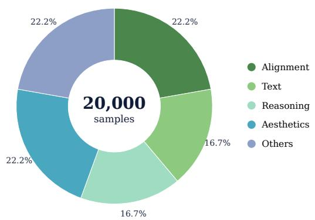  
(a) Image-generation SFT data distribution.

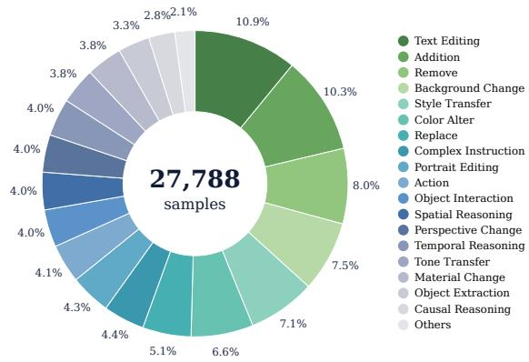  
(b) Image-editing SFT data distribution.  
Figure 4 Task distributions of the SFT data. Left: the image-generation SFT data are organized into fine-grained task categories under the compact taxonomy in Table 7. Right: the image-editing SFT data span 19 fine-grained task categories under the taxonomy in Table 8. Together, these distributions illustrate the balanced and diverse coverage of our SFT data across visual generation tasks.

## A.1.2 Reinforcement Learning Data

We further construct pairwise preference data for reinforcement learning to improve the fine-grained discrimination ability of TRM(SFT). The RL data cover diverse task content and comparison dificulty, including both clearly distinguishable candidates and challenging pairs with relatively small quality diferences.

Image Generation Data. For image generation, we collect preference data from Open Image Preferences (OIP), EvalMuse [13], and HPDv3++ [25]. We select candidate pairs with diverse prompt content and visual characteristics to ensure broad coverage of generation cases. We additionally balance the data across diferent dificulty levels. Following Sec. 4.1, the score diference between two candidates is used as a proxy for comparison dificulty, with larger gaps corresponding to easier pairs and smaller gaps corresponding to harder pairs. We retain easy, medium, and hard examples so that the RL data contain both clear preference signals and fine-grained comparisons between candidates of similar quality.

Image Editing Data. For image editing, we construct preference pairs for reward-model RL from the highquality data curated for cold-start SFT. We select diverse editing tasks and pair candidate outputs conditioned on the same source image and instruction, enabling quality comparisons under matched task conditions. The resulting pairs cover diverse editing operations and visual content, with quality diferences in instruction fulfillment, visual fidelity, spatial correctness, and preservation of content unrelated to the requested edit. Following the score-gap criterion used for image generation, we adjust the sampling proportions across easy, medium, and hard comparisons. By including both clear preferences and comparisons between candidates of similar quality, we aim to encourage the model to identify subtle editing errors and perform more detailed quality analysis, leading to more accurate and reliable reward predictions.

## A.2 Training Details

## A.2.1 Supervised Fine-Tuning of the Reward Model

Although the structured annotations are constructed through the two-stage annotation pipeline described in Sec. 4, we do not train the reward model in separate stages. Instead, we perform a single-stage supervised finetuning procedure on the complete structured responses, such that the model jointly learns rubric generation, rubric-level evaluation, dimension-level reasoning, and final score prediction. We initialize TRM(SFT) from Qwen3.5-9B and fine-tune it using ms-swift with LoRA. The LoRA rank and scaling factor are set to 32 and 64, respectively, with a dropout rate of 0.05. LoRA adapters are applied to all linear layers, while the visual tower is frozen throughout training. We use BF16 precision together with DeepSpeed ZeRO-2. The maximum sequence length is set to 8,192 tokens, and the number of image tokens is capped at 1,024. Training samples are grouped by sequence length to improve computational eficiency.

The SFT data contain approximately 20K image generation cases and 28K image editing cases. Each training response follows the three-dimensional checklist protocol described in Sec. 3.2, containing case-adaptive rubrics and rubric-level judgments under the three high-level evaluation dimensions, followed by dimension-leve reasons and a final pointwise score. The final scores are re-annotated after calibration with Gemini. For image generation, we find that scores from a single teacher model provide relatively limited separation among candidates of similar quality. We therefore additionally incorporate score calibration from other evaluator models to improve the discriminability and robustness of the final-score supervision. The training and validation sets are split at the prompt level, ensuring that samples associated with the same prompt do not appear in both splits.

We train the model on 8 GPUs with an efective batch size of 64, using a per-device batch size of 2 and gradient accumulation over 4 steps. The learning rate is set to $1 \times 1 0 ^ { - 5 }$ with a cosine learning-rate schedule and a warmup ratio of 0.1. Training lasts for 2 epochs. We select the intermediate checkpoint with the best validation performance and use it as the initial policy for subsequent reinforcement learning.

## A.2.2 Reinforcement Learning of the Reward Model

Starting from TRM(SFT), we perform pairwise preference optimization using PD-GRPO. Each preference pair consists of two candidate images under the same task condition. The two candidates are processed independently, and we sample 8 evaluation responses for each candidate, resulting in 16 rollouts for each preference pair. This dual-group construction provides relative supervision between the preferred and worse candidates while preserving the pointwise evaluation interface of the reward model. The RL training set contains approximately 4K preference pairs, corresponding to 8K candidate samples. We additionally construct a validation set of 300 challenging pairs that are incorrectly ranked by the SFT model, allowing validation to focus on preference cases for which further optimization is most useful. All final scores used for reward construction are normalized before computing the pairwise reward. Following the formulation in Sec. 4.2, we use a hard-margin pairwise reward. For each rollout, the preference reward is determined by whether its normalized final score is suficiently separated from the mean score of the opposite rollout group:

$$
r _ { \mathrm { p r e f } } ( y ) = \left\{ \begin{array} { l l } { \mathbb { I } [ s ( y ) - \mu ^ { - } > m ] , \quad y \in G ^ { + } , } \\ { \mathbb { I } [ \mu ^ { + } - s ( y ) > m ] , \quad y \in G ^ { - } . } \end{array} \right.\tag{1}
$$

Here, $\mu ^ { + }$ and $\mu ^ { - }$ denote the mean normalized scores of the preferred and worse rollout groups, respectively, and m is the separation margin. For image editing, we set $m = 0$ , while for image generation, where preference pairs contain more ties and near-ties, we set $m = 0 . 0 5$ to require a clearer score separation. Since all final scores are normalized before reward computation, both margins are defined on the normalized score scale. We additionally use a format reward of 0.1 to encourage valid structured outputs.

We optimize the policy using LoRA with rank 32 and scaling factor 64. LoRA adapters are applied to all linear layers except those in the visual tower and linear-attention modules, and training is performed in BF16 precision. We use task-specific optimization hyperparameters: for image generation, the learning rate is set to $2 \times 1 0 ^ { - 6 }$ with a KL regularization coeficient of 0.04; for image editing, we use a higher learning rate of $5 \times 1 0 ^ { - 6 }$ and a smaller KL coeficient of 0.003. Both settings are optimized for 3 epochs, with the checkpoint achieving the best validation performance selected for the final evaluation. The global training batch contains 32 candidate samples, corresponding to 16 preference pairs, with a mini-batch size of 8. During rollout generation, the sampling temperature is set to 0.7, while validation uses deterministic decoding with temperature 0. The maximum prompt and response lengths are 32,768 and 4,096 tokens, respectively. All reinforcement learning experiments are conducted on 8 GPUs, with vLLM used for rollout generation.

## A.2.3 Reinforcement Learning for Image Generation

We optimize BAGEL, FLUX.1-dev, and SD3.5-M using FlowGRPO, with TRM providing the reward signal.   
All three models are trained using LoRA. The model-specific training configurations are detailed below.

BAGEL. We optimize BAGEL-7B-MoT for text-to-image generation using FlowGRPO with TRM as the sole reward model. Training uses 8 GPUs, LoRA with rank 64 and scaling factor 128, BF16 mixed precision, group size $G = 2 4$ , and a per-device batch size of 3. We use AdamW with a learning rate of $1 0 ^ { - 4 }$ , weight decay of $1 0 ^ { - 4 }$ , and gradient norm clipping at 1.0. Advantages are normalized using the global standard deviation and clipped at 5.0. The policy clipping range is $1 0 ^ { - 4 }$ , with $\beta = 0$ . EMA decay is set to 0.9. Rollouts use 10 sampling steps at a resolution of $5 1 2 \times 5 1 2 .$ , with CPS dynamics, noise level 0.8, scheduler shift 3.0, and three stochastic steps sampled from the first six steps. The text guidance scale is set to 1.0.

FLUX.1-dev. We optimize FLUX.1-dev for text-to-image generation using FlowGRPO with TRM as the sole reward model. Training uses LoRA with rank 64 and scaling factor 128, BF16 mixed precision, group size $G = 2 4$ , and a per-device batch size of 3. We use AdamW with a learning rate of $3 \times 1 0 ^ { - 4 }$ , weight decay of $1 0 ^ { - 4 }$ , and gradient norm clipping at 1.0. Global standard-deviation normalization is disabled, and advantages are clipped at 5.0. The policy clipping range is $1 0 ^ { - 4 }$ , with $\beta = 0$ . EMA decay is set to 0.9. Rollouts use 10 sampling steps at a resolution of $5 1 2 \times 5 1 2$ , with CPS dynamics, noise level 0.7, guidance scale 3.5, and two stochastic steps sampled from the first four steps.

SD3.5-M. We optimize Stable Difusion 3.5 Medium for text-to-image generation using an AlphaGRPOstyle FlowGRPO configuration with TRM as the sole reward model. Training uses LoRA with rank 32 and scaling factor 64, BF16 mixed precision, group size $G = 2 4$ , and a per-device batch size of 6. We use AdamW with a learning rate of $3 \times 1 0 ^ { - 4 }$ , weight decay of $1 0 ^ { - 4 }$ , and gradient norm clipping at 1.0. Advantages are normalized using the global standard deviation and clipped at 5.0. The policy clipping range is $1 0 ^ { - 4 }$ , with $\beta = 0$ . EMA decay is set to 0.99. Rollouts use 10 sampling steps at a resolution of $5 1 2 \times 5 1 2$ , with CPS dynamics, noise level 0.8, guidance scale 4.5, and two stochastic steps sampled from step indices {1, 2, 3, 4, 5}.

## A.2.4 Reinforcement Learning for Image Editing

We optimize image-editing models using FlowGRPO, with TRM providing the reward signal and LoRA used for parameter-eficient fine-tuning. The model-specific training configurations are detailed below.

BAGEL. We optimize BAGEL-7B-MoT using FlowGRPO with TRM as the sole reward model. Training uses LoRA with rank 64 and scaling factor 128, BF16 mixed precision, group size $G = 2 4$ , and a per-device batch size of 3. We use AdamW with a learning rate of $1 0 ^ { - 4 }$ , weight decay of $1 0 ^ { - 4 }$ , and gradient norm clipping at 1.0. Advantages are normalized using the global standard deviation and clipped at 5.0. The policy clipping range is $1 0 ^ { - 4 }$ , with $\beta = 0$ . EMA decay is set to 0.9. Rollouts use 10 sampling steps with CPS dynamics, noise level 0.8, scheduler shift 3.0, and three stochastic steps sampled from the first six steps. Output dimensions follow the source image, with total pixel counts in $[ 5 1 2 ^ { 2 } , 1 0 2 4 ^ { 2 } ]$ . Text and image guidance scales are both set to 1.0.

Flux-Kontext. We optimize FLUX.1 Kontext-dev using FlowGRPO with TRM as the sole reward model. Training uses 8 GPUs, LoRA with rank 64 and scaling factor 128, BF16 mixed precision, group size $G = 1 6$ and a per-device batch size of 2. We use AdamW with a learning rate of $1 . 5 \times 1 0 ^ { - 4 }$ , weight decay of $1 0 ^ { - 4 } .$ , and gradient norm clipping at 1.0. Advantages are normalized using the global standard deviation and clipped at 5.0. The policy clipping range is $1 0 ^ { - 4 }$ , with $\beta = 0$ . EMA decay is set to 0.9. Rollouts use 10 sampling steps with CPS dynamics, noise level 0.9, guidance scale 2.5, and two stochastic steps sampled from the first four steps. Both image and conditioning resolutions are set to 512.

FLUX.2-Klein-4B. We optimize FLUX.2 Klein Base 4B using FlowGRPO with TRM as the sole reward model. Training uses LoRA with rank 64 and scaling factor 128, BF16 mixed precision, group size $G = 1 6 .$ and a configured per-device batch size of 2. We use AdamW with a learning rate of $3 \times 1 0 ^ { - 4 }$ , weight decay of $1 0 ^ { - 4 }$ , and gradient norm clipping at 1.0. Advantages are normalized using the global standard deviation and clipped at 5.0. The policy clipping range is $1 0 ^ { - 5 }$ , with $\beta = 0$ . EMA decay is set to 0.9. Rollouts use 20 sampling steps with CPS dynamics, noise level $0 . 7 ,$ , guidance scale 4.0, and three stochastic steps sampled from the first six steps. Output dimensions follow the source image, with the total pixel count capped at $3 8 4 ^ { 2 }$

Table 9 Pairwise preference consistency under order reversal on MMRB2. Forward and reverse evaluations present the same candidates in opposite orders. Consistency is measured after mapping predictions back to candidate identities. All values are percentages.
<table><tr><td>Model</td><td>Avg. Acc.</td><td>Forward Acc.</td><td>Reverse Acc.</td><td>Consistent</td><td>Inconsistent</td></tr><tr><td>Qwen3-VL-8B</td><td>62.0</td><td>63.9</td><td>59.9</td><td>55.9</td><td>44.1</td></tr><tr><td>Qwen3.5-9B</td><td>51.4</td><td>51.3</td><td>51.5</td><td>45.3</td><td>54.7</td></tr><tr><td>Qwen2.5-VL-72B</td><td>65.8</td><td>65.8</td><td>65.8</td><td>74.6</td><td>25.5</td></tr></table>

FLUX.2-Klein-9B. We optimize FLUX.2 Klein Base 9B using FlowGRPO with TRM as the sole reward model. Training uses LoRA with rank 64 and scaling factor 128, BF16 mixed precision, group size $G = 1 6$ and a configured per-device batch size of 2. We use AdamW with a learning rate of $3 \times 1 0 ^ { - 4 }$ , weight decay of $1 0 ^ { - 4 } \cdot$ , and gradient norm clipping at 1.0. Global standard-deviation normalization is disabled, and advantages are clipped at 5.0. The policy clipping range is $1 0 ^ { - 4 }$ , with $\beta = 0$ . EMA decay is set to 0.9. Rollouts use 20 sampling steps with CPS dynamics, noise level 0.7, guidance scale 4.0, and three stochastic steps sampled from the first six steps. Output dimensions follow the source image, with the total pixel count capped at $3 8 4 ^ { 2 }$

## A.3 Additional Analyses

## A.3.1 Relative Advantages of Pointwise and Pairwise Reward Modeling

Definitions. Let c denote the task condition, consisting of a text prompt for image generation or a source image and an editing instruction for image editing. Pairwise reward modeling jointly evaluates two candidate outputs, $x _ { A }$ and $x _ { B } ,$ , under the same condition c and predicts their relative preference, indicating which candidate better satisfies the evaluation requirements. Pointwise reward modeling instead evaluates each candidate x independently and assigns a scalar score $r ( c , x )$ that reflects its quality under the given condition. A pairwise preference can then be inferred by comparing the scores of two candidates.

Comparative Analysis. We compare the two formulations in terms of preference consistency and their use in policy optimization.

Preference consistency. A reliable pairwise judgment should preserve the preferred candidate when the presentation order is reversed. However, Table 9 reveals substantial inconsistency under order reversal, particularly among the smaller models evaluated. For example, Qwen3.5-9B exhibits an inconsistency rate of 54.7%, despite similar forward and reverse accuracies. When binary preference accuracy is averaged across both orders, each inconsistent pair contributes exactly 50% accuracy. Aggregate accuracy alone therefore does not fully characterize the reliability of preference judgments. If used directly for policy optimization, such judgments could introduce contradictory reward feedback for the same candidate pair.

Policy optimization. In group-based reinforcement learning, group size determines the number of candidates sampled under each task condition. Larger groups ofer more opportunities to explore diverse outputs, but also increase the demand for reward computation. For a group of G candidates, pointwise scoring requires G independent evaluations, yielding a cost that scales linearly with group size. In contrast, exhaustive pairwise comparison requires $G ( G - 1 ) / 2$ evaluations and thus incurs quadratic cost, with further overhead if both presentation orders are evaluated for consistency. Reference-based or sparse comparisons reduce this cost, but make the resulting rewards depend on the selected comparison partners. Pointwise scoring therefore supports larger rollout groups while controlling reward computation costs. These considerations motivate our use of pointwise rewards for policy optimization, together with pairwise preference supervision to improve relative quality discrimination during reward-model training.

## A.3.2 Analysis of Efficiency of TRM

Using TRM as an MLLM-based reward model introduces additional inference costs during policy optimization. A synchronous rollout-then-reward workflow serializes image generation and reward computation, while repeated processing of the shared system prompt incurs redundant computation. We deploy TRM as a dedicated reward inference server using vLLM and reduce these overheads through asynchronous reward computation and shared-prefix caching.

Asynchronous Reward Computation. During rollout generation, completed samples are accumulated and submitted asynchronously to the vLLM reward server once a predefined batch threshold is reached. Reward inference proceeds concurrently with subsequent rollouts, and any remaining samples are submitted when generation completes. All rewards are collected before advantage computation and policy optimization.

Consider K batches, with per-batch generation and reward computation times denoted by $t _ { g }$ and $t _ { r ; \ l }$ , respectively. Under an idealized two-stage pipeline with separate resources, constant processing times, and negligible communication overhead, the collection times are

$$
T _ { \mathrm { s y n c } } = K ( t _ { g } + t _ { r } ) ,\tag{2}
$$

$$
T _ { \mathrm { a s y n c } } = t _ { g } + t _ { r } + ( K - 1 ) \operatorname* { m a x } ( t _ { g } , t _ { r } ) .\tag{3}
$$

Overlapping the two stages therefore saves $( K - 1 ) \operatorname* { m i n } ( t _ { g } , t _ { r } )$ , with the largest relative benefit when generation and reward computation have comparable costs. This analysis excludes the subsequent policy update.

Shared-Prefix Caching. We enable prefix caching in the vLLM server to reuse the cached states of the shared system prompt, which specifies the evaluation procedure and output format. On a cache hit, the corresponding prefill computation is skipped, reducing redundant processing across reward requests. Candidate-specific inputs and assessment outputs are still processed independently.

## A.4 Additional Experimental Results

## A.4.1 Qualitative Results of TRM-Guided Optimization

To complement the quantitative results in Sec. 5.3, we provide qualitative comparisons between the original generation models and their counterparts optimized with TRM. We include examples from both image editing and image generation, covering multiple model families. These examples illustrate how the quantitative improvements translate into visible changes in instruction following, content preservation, visual quality, and prompt alignment.

Image Editing. Figures 8 and 9 show representative results for BAGEL and SenseNova-U1.5, respectively. Compared with the corresponding base models, TRM-guided optimization more reliably applies the requested edits while preserving unrelated image content. The improvements cover diverse operations, including object insertion, attribute modification, text replacement, background changes, object extraction, and compositional edits.

Image Generation. Figures 10 and 11 show representative text-to-image results for BAGEL and FLUX.1-dev. TRM-guided optimization improves prompt adherence and the realization of fine-grained visual requirements while maintaining overall visual quality. Together with the image-editing examples, these results qualitatively support the consistent gains observed in the downstream benchmarks.

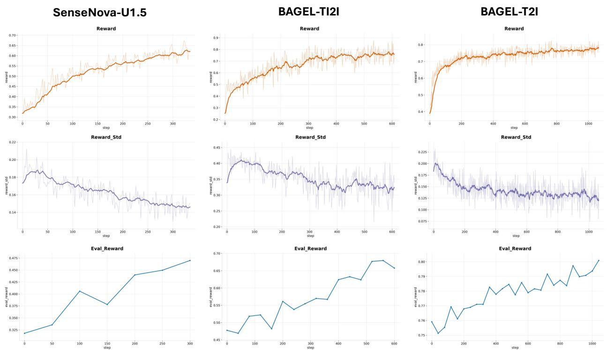  
Figure 5 Reward dynamics during TRM-guided RL. Training reward, reward standard deviation, and evaluation reward for SenseNova-U1.5 and BAGEL on image editing and BAGEL on image generation.

## A.4.2 Training Dynamics

Figure 5 presents the reward dynamics of SenseNova-U1.5 and BAGEL for image editing, and BAGEL for image generation during TRM-guided reinforcement learning. We examine both reward progression and reward variation among candidate outputs throughout training.

Reward Progression. Training rewards exhibit overall upward trends across all three settings, accompanied by improvements in evaluation rewards despite local fluctuations. These consistent trends across image generation and editing indicate that TRM provides efective optimization signals for diferent models and tasks. The concurrent improvements in training and evaluation rewards further suggest that the observed gains extend beyond the sampled training rollouts.

Reward Variation. As average rewards improve, candidate rewards retain variation throughout training, including in the later stages. This persistent variation suggests that TRM continues to provide diferentiated scores as the policy improves, supporting relative quality comparisons among candidate outputs during reinforcement learning.

## A.4.3 Tie-Aware Evaluation for Image Generation

Unlike pairwise reward models that directly compare two candidates and are explicitly required to produce a relative preference, TRM evaluates each candidate independently and assigns a pointwise score. In imagegeneration benchmarks, many candidate pairs are close in overall visual quality. Under pointwise evaluation, such near-equivalent candidates can naturally receive the same scalar score, especially given the finite granularity of the scoring scale. This distinction is inherent to the evaluation interface: a pairwise evaluator is explicitly asked to resolve each comparison, whereas a pointwise evaluator may assign the same absolute assessment to two candidates whose quality diference is smaller than its scoring resolution. Therefore, an identical predicted score indicates that the pointwise evaluator does not express a strict preference between the two candidates.

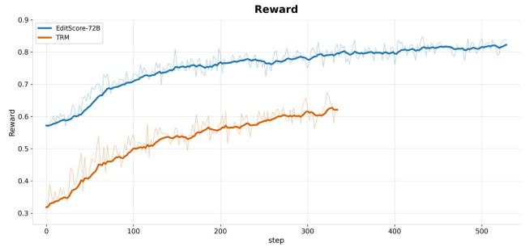

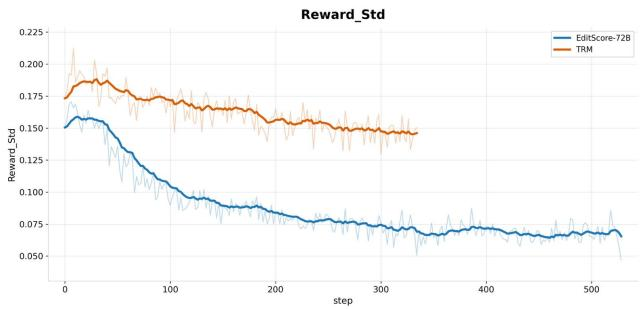  
Figure 6 Training dynamics with different reward models. Comparison of mean reward and reward standard deviation during RL guided by TRM and the larger EditScore-72B reward model.

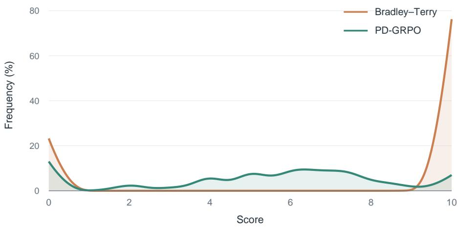  
Figure 7 Comparison of score distributions between PD-GRPO and Bradley--Terry optimization.

For the main image-generation results in Table $^ { 2 , }$ we exclude predicted ties and compute pairwise preference accuracy only over candidate pairs for which the model produces a strict score ordering. Specifically, given the independently predicted scores $s _ { i } ^ { + }$ and $s _ { i } ^ { - }$ for the preferred and worse candidates of pair i, respectively, the main accuracy is computed as

$$
\mathrm { A c c } _ { \mathrm { n o n - t i e } } = \frac { \sum _ { i = 1 } ^ { N } \mathbb { I } [ s _ { i } ^ { + } > s _ { i } ^ { - } ] } { \sum _ { i = 1 } ^ { N } \mathbb { I } [ s _ { i } ^ { + } \neq s _ { i } ^ { - } ] } .\tag{4}
$$

This protocol measures whether the ordering induced by the pointwise scores agrees with the benchmark preference when TRM expresses a strict preference.

For completeness, we additionally evaluate a tie-aware variant in which all candidate pairs are retained and a predicted tie is assigned 0.5 credit:

$$
\mathrm { A c c } _ { \mathrm { t i e } } = \frac { 1 } { N } \sum _ { i = 1 } ^ { N } \left( \mathbb { I } [ s _ { i } ^ { + } > s _ { i } ^ { - } ] + 0 . 5 \mathbb { I } [ s _ { i } ^ { + } = s _ { i } ^ { - } ] \right) .\tag{5}
$$

To further examine the behavior of pointwise scoring, we evaluate the original Qwen3.5-9B model using the same pointwise evaluation setting as TRM. After excluding parsing failures, Qwen3.5-9B produces tied predictions on 40.9% of GenAI-T2I pairs and 56.6% of MMRB2-T2I pairs, whereas the corresponding tie rates

Input image  
Baseline  
  
w. TRM

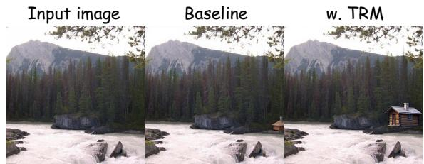

Add a coffee cup on the table in the foreground.  
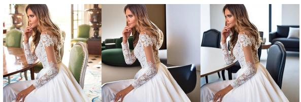  
Add a small wooden cabin with a chimney near the edge of the forest on the right side of the image.


  
Change the cup in hand to ceramic.

Replace the text 'duolingo' with 'greenowl’.  
  
Change the car body color to blue.

Figure 8 Qualitative results of TRM-guided optimization on BAGEL for image editing. For each example, we show the input image, the output of the original model,and the output after reinforcement learning with TRM as the reward. TRM-guided optimization improves instruction following and edit quality across diverse editing tasks while preserving unrelated image content.

Table 10 Tie-aware evaluation on image-generation reward-modeling benchmarks. All successfully parsed candidate pairs are retained, and a predicted tie is assigned 0.5 credit. We report pairwise preference accuracy (%).
<table><tr><td>Model</td><td>GenAI-T2I</td><td>MMRB2-T2I</td></tr><tr><td>Qwen3.5-9B (Baseline)</td><td>54.6</td><td>53.5</td></tr><tr><td>TRM(SFT)</td><td>67.7</td><td>62.8</td></tr><tr><td>TRM(RL)</td><td>68.4</td><td>63.9</td></tr></table>

of TRM are reduced to 12.2% and 20.7%, respectively. As shown in Table 10, under the tie-aware protocol, Qwen3.5-9B (Baseline) obtains 54.6% and 53.5% on GenAI-T2I and MMRB2-T2I, respectively. TRM(SFT) improves the corresponding accuracies to 67.7% and 62.8%, while TRM(RL) further reaches 68.4% and 63.9%. These results are consistent with the main non-tie evaluation and additionally show that TRM produces substantially fewer tied predictions than the Qwen3.5-9B pointwise baseline under the same evaluation setting.

## A.5 Experimental Details

## A.5.1 Unified SFT System Prompts

Although the structured annotations are constructed through the two-stage procedure described in the main paper, the reward model itself is trained with a unified output format. Specifically, the system prompt instructs TRM to complete the evaluation within a single response: generate case-adaptive evaluation criteria, assess each criterion, aggregate and analyze the evidence at the dimension level, and produce a final pointwise score.

Image generation and image editing share this evaluation procedure but use task-specific system prompts.

  
Input image  
Baseline  
w. TRM

Input image  
  
Baseline


w. TRM  
  
Extract the transport object(s) in the image.

Add a vintage car driving along the dirt path in the foreground of the image.  


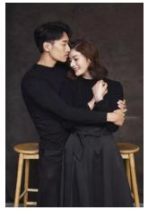  
在背景处添加一张凳子

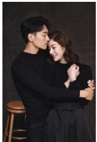

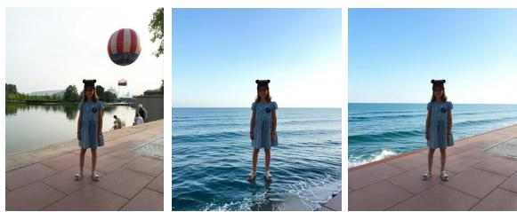  
Change the background to the sea.

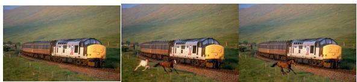  
在火车附近添加一匹奔跑的马

  
在图中人物旁边添加一个中国年轻女性，笑容灿烂，清纯类型，形态自然，图中人物不做改动

Figure 9 Qualitative results of TRM-guided optimization on SenseNova-U1.5 for image editing. We compare outputs from the original model and its TRM-optimized counterpart across diverse editing instructions. TRM-guided optimization produces more accurate edits while maintaining visual consistency with the input image.

For image generation, evaluation covers Prompt Alignment, Aesthetics, and Technical Quality. For image editing, evaluation covers Instruction Following, Visual Consistency, and Visual Quality. Instruction Following assesses task fulfillment in image editing; throughout the main paper, we use Prompt Alignment as the shared high-level term for this dimension across generation and editing. In both settings, rubric-level judgments are binary, and the final reward is a scalar score ranging from 0 to 10. The complete system prompts are provided below.

Baseline  


w. TRM  


Baseline  


w. TRM  


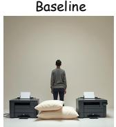  
Baseline


Illuminated by the gentle glow of the afternoon sun streaming through the window, the perfectly spherical soccer ball, with its intricate black and white pentagona design that seems to invite both casual play and serious competition, sits dutifully in the quiet room, right in front of the imposing yet plush cubic ottoman, whose solid form and soft upholstery stand as a comforting presence in the cozy corner of the living space.

The image depicts a vibrant, energetic urban setting under a night sky filled with swirling gradients of deep indigo and electric purple, illuminated by a dynamic network of neon-colored lights…The text elements   
dominate the composition: “Miami” appears in bold, retro  
style lettering at the top center, rendered in glowing pink   
with a faint blue outline, while “Trance” curves along the   
lower edge in luminous teal, its letters edged with golden  
yellow streaks. Smaller labels like “2014,” “Event,” “Neon,”   
“Beats” and “Vibes” scatter dynamically across the space...   
Standing quietly amidst the modest tableau, a person   
finds themselves positioned before a pair of gently   
cushioned pillows and a duo of printers, those mechanical   
marvels that silently await the task of transcribing   
digital musings into tangible form. The scene is serene   
yet charged with potential—a bridge between comfort   
and creativity, where the softness of fabric coexists   
with the precise, hard lines of technology, offering a   
juxtaposition that is both compelling and strangely   
harmonious in its simplicity.


  
Four helicopters and four hamburgers filled the hangar, creating an unusual and surprising combination of objects.


  
The fluffy clouds are behind the wooden plant holder in the 3D scene.


  
A blue elegant cat with a long tail throws a ball at a cute red cat without a long tail.

Figure 10 Qualitative results of TRM-guided optimization on BAGEL for image generation. Given the same text prompts, we compare generations from the original model and its TRM-optimized counterpart. TRM-guided optimization improves prompt alignment and fine-grained visual fidelity across diverse generation cases.

Baseline  


w. TRM  


Baseline  


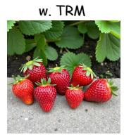  
The wooden flowers are taller than the wooden trees.  
Seven ripe strawberries were ready for picking, resting on the bottom edge of the garden.


  
a photo of a red laptop and a brown car.


  
A picture of a football jersey featuring the number 50 on both sides, with the text on it: "Champion", "Teamwork", "Victory", "Game", "On", "All-Star", "League".


  
A picture of a woman in a green dress standing near a glass door, with the text on it: "Corporate", "DISC", "Workshop", "THE", "BIZ", "STUDIO".


  
a photo of a dog right of a teddy bear.

Figure 11 Qualitative results of TRM-guided optimization on FLUX.1-dev for image generation. We compare generations from the original model and the model optimized using TRM as the reward. The optimized model better satisfies prompt requirements while preserving overall visual quality.

## System Prompt for the Image Generation Reward Model

Role: You are an expert in evaluating text-to-image (T2I) generation. Your task is to first generate checklist-style evaluation points for the provided text-to-image case, then score each evaluation point based on the generated image, and finally assign an overall final score.

## Input Data

1. Text Prompt: The description of the image to be generated.

2. Generated Image: The image to be evaluated.

## Evaluation Perspectives

• Prompt Alignment: Whether the generated image follows the text prompt, including explicit requirements and necessary implicit requirements based on commonsense, world knowledge, or task-specific rules.

• Aesthetics: Whether the image is visually appealing and well-composed.

• Technical Quality: Whether the image is clear, natural, and free from visible artifacts or structural issues.

## Checklist Generation Rules

• Checklist Coverage: Generate a lean but adequate checklist, typically containing 8–14 points depending on prompt complexity.

• Atomic and Verifiable: Each evaluation point must be atomic, specific, unambiguous, concise, and visually verifiable.

• Prompt Alignment: Decompose Prompt Alignment into atomic requirements, including subjects, attributes, counts, spatial relations, actions, interactions, style, viewpoint, and checkable implicit requirements.

• Aesthetics: Use 2–3 discriminating criteria for Aesthetics.

• Technical Quality: Use 2–3 criteria for Technical Quality, covering clarity, artifacts, structural defects, anatomy when applicable, and text rendering when explicitly requested.

• Positive Formulation: All evaluation criteria must be positive and pass-oriented.

## Scoring Rules

• Independent Evaluation: Treat every generated evaluation point independently.

• Binary Scoring: Assign only 0 or 1 to each evaluation point.

• Uncertainty: If uncertain, assign 0.

• Invalid Criteria: Exclude criteria that contradict the prompt or are not applicable.

• Missing Core Content: If the core requested content is entirely missing, assign final\_score = 0.

• Primary Evidence: Use the checklist as the primary evidence for the final score, with Prompt Alignment carrying the largest contribution by construction.

• Uncovered Issues: Important score-relevant issues not fully captured by the checklist may still afect the final score.

## Execution Procedure

1. Generate checklist-style evaluation points.

2. Score each generated evaluation point.

3. Summarize the outcomes under Prompt Alignment, Aesthetics, and Technical Quality.

4. Assign final\_score based on both the checklist judgments and important uncovered issues.

## Scoring Rubric

• 0 (Completely Unusable): Completely unusable.

• 5 (Partially Usable): Partially usable but far from satisfying the evaluation requirements.

• 8 (Generally Usable): Generally usable with only minor defects or deviations.

## Output Format

Output only valid JSON following the structure below. Replace the example values with the actual evaluation results.

```json
{
"eval_points": [
{
"question": "...",
"dimension": "Prompt Alignment",
"score": 0
}
],
"dimension_summary": {
"Prompt Alignment": "...",
"Aesthetics": "...",
"Technical Quality": "..."
},
"score_reason": "...",
"final_score": 3.50
}
```

## System Prompt for the Image Editing Reward Model

Role: You are an Image Editing Evaluation Expert. Your task is to first generate checklist-style evaluation points for the provided image-editing case, then score each evaluation point based on the edited image, and finally assign an overall final score.

## Input Data

1. Source Image: The original image before editing.

2. Editing Instruction: The requested changes.

3. Edited Image: The image to be evaluated.

## Evaluation Perspectives

• Instruction Following: Whether the edited image follows the editing instruction, including explicit requirements and necessary implicit requirements based on commonsense, world knowledge, or task-specific rules.

• Visual Consistency: Whether content that should remain unchanged stays consistent with the source image.

• Visual Quality: Whether the edited image is clear, natural, well-integrated, and free from visible artifacts or structural issues.

## Checklist Generation Rules

• Atomic and Verifiable: Each evaluation point must focus on a single visual element and assess one clear, specific, unambiguous, concise, and visually verifiable condition.

• Instruction Following: Criteria should focus on whether the requested edit is correctly applied to the target object or target region.

• Visual Consistency: Criteria should focus on unintended changes to content that should remain unchanged.

• Visual Quality: Criteria should evaluate perceptual defects such as blur, noise, artifacts, edge abnormalities, deformation, unnatural blending, structural errors, distorted body parts, or poor text rendering.

• Positive Formulation: All evaluation criteria must be positive and pass-oriented.

## Scoring Rules

• Independent Evaluation: Treat every generated evaluation point independently.

• Binary Scoring: Assign only 0 or 1 to each evaluation point.

• Uncertainty: If uncertain, assign 0.

• Invalid Criteria: Exclude criteria that become invalid as a direct consequence of correctly applying the requested edit.

• No Actual Edit: If the edited image is almost identical to the original image or no actual edit is performed, assign final\_score = 0.

• Positional Changes: Require significant displacement.

• Human Orientation: For human poses, determine left and right from the depicted person’s own orientation.

• Uncovered Issues: Consider newly revealed or occluded regions, unchanged objects, global lighting, text rendering, visual artifacts, structural errors, color casts, and blending even when these aspects are not fully covered by the generated checklist.

• Knowledge-Dependent Tasks: For tasks involving commonsense or world knowledge, give greater importance to Instruction Following.

## Execution Procedure

1. Generate checklist-style evaluation points.

2. Score each generated evaluation point.

3. Summarize the outcomes under Instruction Following, Visual Consistency, and Visual Quality.

4. Assign final\_score based on both the checklist judgments and important uncovered issues.

## Scoring Rubric

• 0 (Completely Unusable): Completely unusable.

• 5 (Partially Usable): Partially usable but far from satisfying the evaluation requirements.

• 8 (Generally Usable): Generally usable with only minor defects, inconsistencies, or deviations.

## Output Format

Output only valid JSON following the structure below. Replace the example values with the actual evaluation results.

{   
"eval\_points": [   
{   
"question": "...",   
"dimension": "Instruction Following",   
"score": 0   
}   
],   
"dimension\_summary": {   
"Instruction Following": "...",   
"Visual Consistency": "...",   
"Visual Quality": "..."   
},   
"score\_reason": "...",   
"final\_score": 3.50   
}