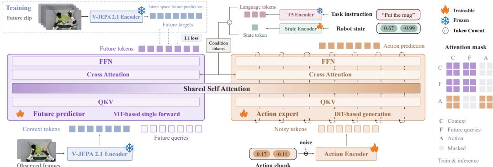
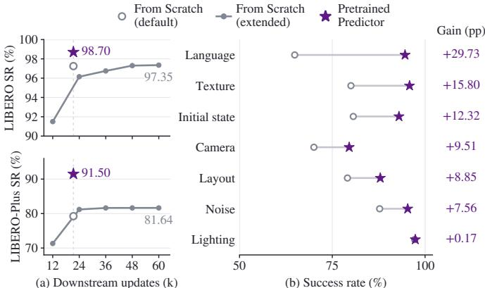
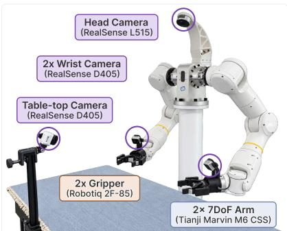
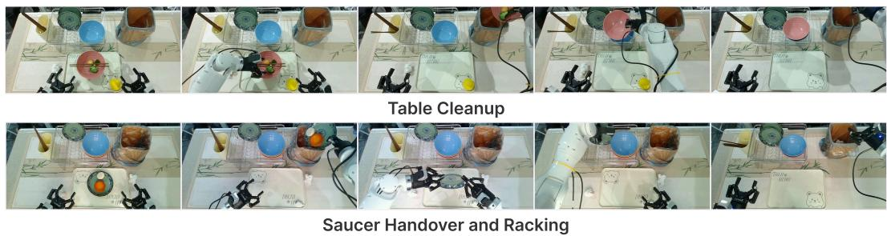
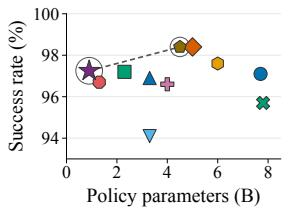
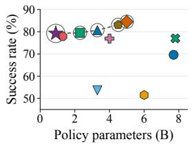
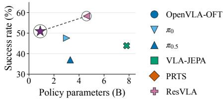
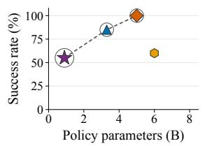
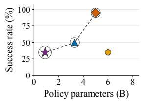

# V-JEPA POLICY: BUILDING EFFECTIVE WORLD-ACTION MODELS ON PREDICTIVE VISUAL LATENTS

Yang Zhang1, Jiangyuan Zhao2, Chenyou Fan3, Jiayu Hu4, Xiu Yuan5, Chenjia Bai6,7, Xiu Li1∗

1Tsinghua University, 2Shanghai Jiao Tong University, 3Fudan University,

4University of Science and Technology of China, 5Washington University in St. Louis,

6The Institute of Artificial Intelligence, China Telecom (TeleAI), 7γ-Robotics

z-yang21@mails.tsinghua.edu.cn, li.xiu@sz.tsinghua.edu.cn

## ABSTRACT

World-action models (WAMs) couple future visual-state prediction with action generation. By adapting video generators or image-editing models pretrained at scale, a prominent line of recent WAMs inherits both predictive knowledge and the models in which it was learned. We ask whether a predictive visual latent space induced by large-scale predictive pretraining can instead provide a sufficient foundation for effective WAM learning without inheriting a complete pretrained visual generative model. To answer this question, we introduce V-JEPA Policy, a simple framework that builds a WAM on the latent space of a frozen V-JEPA 2.1 encoder. An instruction-conditioned future-latent predictor and a flowmatching action expert are jointly learned from scratch in a single downstream stage, with the predictor’s future-informed context key–value states conditioning action generation. With 0.9B total parameters, of which 0.6B are trainable, V-JEPA Policy achieves competitive performance with representative WAM and vision-language-action baselines across LIBERO, LIBERO-Plus, and RoboCasa-GR1. Comparing visual foundations under the same downstream framework and training budget identifies V-JEPA latents as more effective than the discriminative, reconstructive, and video-understanding-oriented alternatives, particularly under distribution shifts. Beyond task-specific learning, the same latent space supports acquiring transferable future-modeling knowledge from diverse in-thewild instruction-annotated videos. Pretraining the predictor on DROID video– instruction pairs without action labels and adapting it into a WAM within our framework yields substantial gains in downstream control and out-of-distribution generalization. Together, these findings establish predictive visual latents as a foundation for learning effective WAMs, supporting both direct learning from task-specific demonstrations and the transfer of future-modeling knowledge acquired through predictor pretraining on broader in-the-wild videos. Our code is available at https://github.com/breez3young/VJEPA-Policy.

## 1 INTRODUCTION

Advanced physical intelligence should endow robots with the capability not only to understand the current scene but also to anticipate how it may change through interaction. World-action models (WAMs) have thus emerged as a promising paradigm for instantiating this principle by coupling action generation with future visual-state prediction, demonstrating strong task performance and improved generalization to unfamiliar tasks and environments (Zhu et al., 2025; Pai et al., 2025; Liang et al., 2025; Kim et al., 2026; Ye et al., 2026; Bi et al., 2026; Li et al., 2026; Zhang et al., 2026a). They highlight the value of predictive knowledge for general-purpose robot control.

A prominent line of work acquires this capability by adapting visual generative models pretrained at scale for effective WAM learning. Video-generation models provide priors over motion and scene evolution learned from large-scale video data (Pai et al., 2025; Kim et al., 2026; Yuan et al.,

2026), while image-editing models provide priors over instruction-conditioned visual transformations, mapping a current observation directly to a task-specified target visual state without generating intermediate frames (Black Forest Labs, 2025; Wu et al., 2025; Zhang et al., 2026c). Despite these different formulations, both approaches transfer knowledge about how visual states change together with the generative backbone in which that knowledge was learned. This raises a natural question:

Does effective WAM learning require inheriting a complete pretrained visual generative model, or can a predictive visual latent space learned at scale provide a sufficientfoundation?

To answer this question, we introduce V-JEPA Policy, a framework that builds a WAM on the predictive latent space of a frozen V-JEPA 2.1 encoder (Bardes et al., 2024; Assran et al., 2025; Mur-Labadia et al., 2026). We jointly learn an instruction-conditioned future-latent predictor and a flowmatching action expert directly from task-specific demonstrations. The predictor follows the vision transformer architecture of the V-JEPA predictor, augmented with cross-attention for instruction conditioning, and combines observed latent tokens with learnable queries at future positions to forecast future visual latents in a single forward pass. Inspired by recent foundation policies (Black et al., 2024; 2025; Ye et al., 2026; Zhang et al., 2026b), our framework adopts a Mixture-of-Transformers (MoT) architecture with shared attention to combine the future predictor and the action expert. Context and future queries interact through bidirectional attention, and the resulting layer-wise context key–value states condition the action expert, allowing future modeling to directly shape action generation. V-JEPA’s large-scale video predictive self-supervised pretraining provides a visual latent space suited to this construction. With the visual encoder kept frozen and both trainable modules learned from scratch in a single downstream stage, our design directly tests whether a predictive visual latent space learned at scale can provide a sufficient foundation for effective WAM learning without inheriting a complete pretrained visual generator.

Beyond learning from task-specific demonstrations, we further investigate whether the same latent space can efficiently absorb general future-modeling knowledge from broad in-the-wild videos and transfer it to downstream control. Task-specific demonstrations cover only a limited range of be haviors and visual transitions. We therefore pretrain only the instruction-conditioned future-latent predictor on diverse DROID video–instruction pairs, using future-prediction supervision without action labels while keeping the V-JEPA encoder frozen (Khazatsky et al., 2024). We then transfer the predictor to downstream V-JEPA Policy training, where a freshly initialized flow-matching action expert is learned under the same joint objective and downstream budget. The latent space is thus tested not only as a foundation for direct WAM learning but also as a reliable substrate for acquiring and transferring more general future-modeling knowledge underlying in-the-wild videos.

We extensively evaluate V-JEPA Policy on both standard and distribution-shifted simulation benchmarks spanning settings from single-arm manipulation to whole-body control, as well as on a realworld dual-arm platform. Beyond comparisons with baselines, we also systematically analyze the framework through controlled studies of its visual foundation and encoder scale, context-future interaction and future-modeling supervision, training-compute scaling, and action-free predictor pretraining and transfer. With 0.9B total parameters, of which only 0.6B are trainable, the one-stage model reaches 97.25% on LIBERO (Liu et al., 2023a), 79.25% on LIBERO-Plus (Fei et al., 2025), 50.92% on RoboCasa-GR1 tasks (Bjorck et al., 2025; Nasiriany et al., 2024), and 45% on two real-world multi-stage bimanual coordination tasks while remaining competitive with representative WAM and VLA baselines. Under the fixed downstream framework and training budget, the V-JEPA predictive latent outperforms the discriminative (Oquab et al., 2024; Simeoni et al.´ , 2026), reconstructive (Wan et al., 2025), and video-understanding-oriented alternatives (Yan et al., 2026), with the performance gaps widening under distribution shifts. Extending downstream training compute on the same task demonstrations yields diminishing returns in generalization. Predictor-only pretraining on DROID video–instruction pairs without action label supervision instead raises LIBERO-Plus success rate from 79.25% to 91.50% at the default smaller downstream budget, remarkably surpassing the 81.64% success rate achieved by extended training. The same pretraining also raises the average real-world success rate from 45% to 80%, demonstrating the effectiveness of predictor pretraining beyond simulation. These results show that a future-latent predictor can acquire knowledge about physical world evolution from diverse in-the-wild videos and transfer it to downstream control within the same latent space.

We highlight the main contributions as follows:

• We introduce V-JEPA Policy, a WAM built on the predictive latent space of a frozen V-JEPA encoder. By jointly learning an instruction-conditioned future-latent predictor and a flow-matching action expert from scratch in a single downstream stage, it enables effective WAM learning without inheriting a complete pretrained visual generative model.

• We conduct extensive cross-benchmark evaluations and controlled analyses of V-JEPA Policy. In particular, matched visual-substrate comparisons under a shared downstream framework and training budget show that V-JEPA’s predictive visual latents yield stronger performance, with more significant gains under distribution shifts.

• We demonstrate that predictor-only pretraining on DROID video–instruction pairs without action supervision transfers future-modeling knowledge within the same latent space, substantially improving generalization performance on LIBERO-Plus at the same downstream budget.

## 2 PRELIMINARIES

V-JEPA. The V-JEPA family of models learns visual representations through self-supervised prediction in feature space, encouraging the modeling of predictable spatiotemporal structure and dynamics rather than pixel-level generation (LeCun et al., 2022; Bardes et al., 2024; Assran et al., 2025; Mur-Labadia et al., 2026). Let $y$ denote an unmasked video, x a masked view of the same video, and M the set of masked spatiotemporal patch positions. A context encoder $E _ { \theta }$ maps the visible patches in the masked video x to context tokens, while the exponential moving average $E _ { \bar { \theta } }$ of the context encoder computes target representations from the complete video $y .$ The predictor $P _ { \phi }$ jointly processes the context tokens and learnable mask tokens $\Delta _ { y }$ specifying the masked positions. Both networks are vision transformers (ViTs) (Dosovitskiy et al., 2020) with 3D rotary position embeddings (RoPE) (Su et al., 2024). They are jointly trained with the latent mask-denoising objective:

$$
\mathcal { L } _ { \mathrm { p r e d i c t } } = \frac { 1 } { | M | } \sum _ { i \in M } \left. P _ { \phi } \big ( E _ { \theta } ( x ) , \Delta _ { y } \big ) _ { i } - \mathrm { s g } \left( E _ { \bar { \theta } } ( y ) _ { i } \right) \right. _ { 1 } ,\tag{1}
$$

where sg denotes stop-gradient and $\bar { \theta }$ tracks an exponential moving average of the encoder parameters θ. These mechanisms are used to prevent representation collapse during joint learning. V-JEPA 2.1 further improves dense visual representations through context-token supervision and deep selfsupervision (Mur-Labadia et al., 2026). We use its frozen encoder to define the visual latent space of V-JEPA Policy. Within this space, we adapt the V-JEPA 2 predictor architecture to forecast future latents from observed context by assigning mask tokens to future positions (Sec. 3).

Problem formulation. We study language-conditioned robotic manipulation through imitation learning from a demonstration dataset D. At time t, the robot receives RGB observations $o _ { t } ~ =$ $( \mathbf { I } _ { t } ^ { 1 } , \ldots , \mathbf { I } _ { t } ^ { n } )$ from n camera views, its proprioceptive state $\mathbf { q } _ { t } \in \mathbb { R } ^ { d _ { s } }$ , and a task instruction ℓ. Here, ${ \bf { I } } _ { t } ^ { v }$ denotes the visual observation from camera v. We learn a policy $\pi ( \mathbf { a } _ { t } ~ \mid ~ o _ { t } , \mathbf { q } _ { t } , \ell )$ to imitate demonstrated action chunks $\mathbf { a } _ { t } = ( a _ { t } , \dots , a _ { t + H - 1 } ) \in \mathbb { R } ^ { H \times d _ { a } }$ , where H is the action horizon and $d _ { a }$ is the action dimension. World-action models extend this formulation by coupling action generation with prediction of future visual states. Let

$$
\mathbf { o } _ { t } ^ { + } = { \bigl ( } o _ { t + \delta _ { 1 } } , \ldots , o _ { t + \delta _ { K } } { \bigr ) } , \qquad 0 < \delta _ { 1 } < \cdot \cdot \cdot < \delta _ { K } ,\tag{2}
$$

denote K future observations from the same camera views, sampled at temporal offsets $\delta _ { 1 } , \ldots , \delta _ { K }$ Each training example $( o _ { t } , \mathbf { q } _ { t } , \ell , \mathbf { o } _ { t } ^ { + } , \mathbf { a } _ { t } )$ pairs the observed context with future observations and actions from the same demonstration. In our V-JEPA Policy, the latent representations of $\mathbf { o } _ { t } ^ { + }$ serve as prediction targets, and future prediction is learned jointly with action generation. At inference, the policy is conditioned on $o _ { t } , \mathbf { q } _ { t }$ , and ℓ.

## 3 METHODOLOGY

In this section, we first describe future-latent prediction (Sec. 3.1) and its coupling with action generation (Sec. 3.2). We then present joint training and inference (Sec. 3.3). Figure 1 provides an overview of the framework.

## 3.1 INSTRUCTION-CONDITIONED LATENT PREDICTION

A fixed visual space. We use the frozen V-JEPA 2.1 encoder to encode the observed context and define the future latent targets (Mur-Labadia et al., 2026). To match the encoder’s temporal tubelet size of two, we form a minimal two-frame observed context for each camera view by pairing the current frame with an earlier observation. During training, we combine this context with the corresponding future observations ${ \mathbf o } _ { t } ^ { + }$ to form a complete video clip. Following the construction of context and target representations in V-JEPA (Assran et al., 2025), we designate its future tubelet positions as the masked region. The context path thus removes tokens at future positions before the Transformer blocks of the encoder, and encodes only observed tokens. The target path instead processes the complete unmasked clip with the same frozen encoder. We normalize its output tokens across the feature dimension and select the future positions as prediction targets. We independently encode each camera view and concatenate their context representations and future targets across views to form $\mathbf { Z } _ { t } ^ { c }$ and $ { \mathbf { Z } } _ { t } ^ { + }$ , respectively.

  
Figure 1: Overview of V-JEPA Policy. A frozen V-JEPA 2.1 encoder defines the visual latent space. The future predictor jointly processes context tokens and learnable future queries in a single forward pass, providing layer-wise, future-informed context key–value states to a flow-matching action expert. Both modules receive language and proprioceptive conditioning and are jointly trained from scratch with future-latent regression and action flow matching.

Future-query prediction. The predictor $P _ { \phi }$ follows the V-JEPA 2 predictor architecture (Assran et al., 2025) and is trained from scratch to predict the future latent targets. We project $\mathbf { Z } _ { t } ^ { c }$ to the predictor’s hidden dimension and concatenate the result with future-query tokens $\Delta _ { t } ^ { + }$ . These query tokens repeat a single learnable mask embedding at all future target positions. Bidirectional selfattention jointly updates both groups, allowing context states to incorporate information from the evolving future-query representations. To distinguish token positions, we utilize 3D rotary position embeddings (RoPE) based on temporal, height, and width coordinates in the visual latent grid (Su et al., 2024). Context tokens retain the positions of the observed input, while future-query tokens use the positions of their prediction targets. Within each attention head, we compute attention from the query, key, and value Q, K, and $\mathbf { V }$ as

$$
\mathrm { A t t n } _ { \mathrm { { 3 D } } } ( \mathbf { Q } , \mathbf { K } , \mathbf { V } ) = \mathrm { s o f t m a x } \big ( \mathcal { R } _ { \mathrm { 3 D } } ( \mathbf { Q } ) \mathcal { R } _ { \mathrm { 3 D } } ( \mathbf { K } ) ^ { \top } / \sqrt { d _ { h } } \big ) \mathbf { V } ,\tag{3}
$$

where $d _ { h }$ denotes the head dimension, and $\mathcal { R } _ { \mathrm { 3 D } }$ applies rotary transformations according to each token’s spatiotemporal coordinates. Coordinates are local to each camera view. Learnable view embeddings are added to both context tokens and future queries to distinguish their associated cameras.

Instruction and state conditioning. Future prediction is conditioned on the task instruction ℓ and current robot state $\mathbf { q } _ { t }$ . We encode the task instruction ℓ with a frozen T5 encoder (Raffel et al., 2020) and concatenate the resulting text tokens with one state token projected from q to form a conditioning sequence. Following the conditioning layout of Wan (Wan et al., 2025), each predictor block applies visual self-attention (Eq. 3), cross-attention to this sequence, and a feed-forward network. Both context tokens and future queries therefore receive instruction and proprioceptive state information. The final future-query states are normalized and projected back to the encoder feature dimension, yielding the future latent predictions in a single forward pass:

$$
\hat { \mathbf { Z } } _ { t } ^ { + } = P _ { \phi } \big ( \mathbf { Z } _ { t } ^ { c } , \Delta _ { t } ^ { + } \mid \ell , \mathbf { q } _ { t } \big ) .
$$

## 3.2 COUPLING PREDICTION AND ACTION

(4)

A future-informed context interface. We connect future prediction to action generation through the predictor’s layer-wise context states rather than its final future-latent predictions. Through bidirectional interactions with future queries in the predictor, context states at deeper layers incorporate the evolving future-query representations. At predictor layer $j ,$ let $\mathbf { K } _ { c } ^ { ( j ) }$ and $\mathbf { V } _ { c } ^ { ( j ) }$ denote the key and value projections of the normalized block input at context positions, before its self-attention update. The resulting layer-wise interface is $\mathcal { C } _ { \phi } = \{ ( \mathcal { R } _ { \mathrm { 3 D } } ( \mathbf { K } _ { c } ^ { ( j ) } ) , \mathbf { V } _ { c } ^ { ( j ) } ) \} _ { j = 1 } ^ { L }$ , where L is the number of layers. To maintain the spatiotemporal position information of the context tubelets when conditioning the action expert, we preserve the 3D RoPE transformation applied to the keys as in Eq. 3 while the values remain unrotated. This interface contains only keys and values at context positions.

Flow-matching action generation. Conditioned on $\mathcal { C } _ { \phi } .$ , the instruction ℓ, and proprioceptive state $\mathbf { q } _ { t }$ , a diffusion-transformer-based action expert $v _ { \psi }$ models continuous action chunks using conditional flow matching (Peebles & Xie, 2023; Liu et al., 2023b; Lipman et al., 2023; 2024). Given a demonstration chunk $\mathbf { a } _ { t }$ , Gaussian noise $\mathbf { \epsilon } \gets \mathcal { N } ( \mathbf { 0 } , \mathbf { I } )$ , and flow time $\tau \in [ 0 , 1 ]$ ], we construct

$$
\mathbf { a } _ { t } ^ { \tau } = ( 1 - \tau ) \mathbf { \epsilon } + \tau \mathbf { a } _ { t } .\tag{5}
$$

The expert embeds $\mathbf { a } _ { t } ^ { \tau }$ into action tokens with learnable sequence-position embeddings. Following recent foundation policy architectures (Black et al., 2025; Ye et al., 2026; Zhang et al., 2026b), the predictor and expert form a Mixture-of-Transformers (MoT) architecture with separate parameters, the same number of layers, and compatible attention-head dimensions. Within each attention head at layer $j ,$ queries projected from action tokens attend jointly to the corresponding context positions and the action tokens, and compute the output as follows:

$$
\mathbf { O } _ { a } ^ { ( j ) } = \mathrm { s o f t m a x } \big ( \mathbf { Q } _ { a } ^ { ( j ) } [ \mathcal { R } _ { \mathrm { 3 D } } ( \mathbf { K } _ { c } ^ { ( j ) } ) ; \mathbf { K } _ { a } ^ { ( j ) } ] ^ { \top } / \sqrt { d _ { h } } \big ) [ \mathbf { V } _ { c } ^ { ( j ) } ; \mathbf { V } _ { a } ^ { ( j ) } ] ,\tag{6}
$$

where $\mathbf { Q } _ { a } ^ { ( j ) } , \mathbf { K } _ { a } ^ { ( j ) }$ , and $\mathbf { V } _ { a } ^ { ( j ) }$ are the action-token query, key, and value projections, $[ \cdot ; \cdot ]$ denotes token concatenation, and $d _ { h }$ is the attention-head dimension. In contrast, predictor tokens cannot attend to action tokens. Both the predictor and action expert are conditioned on the instruction ℓ and proprioceptive state $\mathbf { q } _ { t }$ through cross-attention. Each module projects the T5 instruction embeddings and proprioceptive state into its own hidden space. The output head predicts the conditional velocity $v _ { \psi } ( \mathbf { a } _ { t } ^ { \tau } , \tau ; \mathcal { C } _ { \phi } , \ell , \mathbf { q } _ { t } )$ , with ${ \mathbf a } _ { t } - \epsilon$ as the flow-matching target.

## 3.3 JOINT TRAINING AND INFERENCE

Joint objective. For direct learning from task-specific demonstrations, we jointly train the predictor and action expert from scratch on these demonstrations in a single stage while keeping the visual and text encoders frozen. We adapt the V-JEPA mask-denoising objective in Eq. 1 to instructionconditioned future prediction, with masked positions corresponding to future tubelets and targets provided by the frozen visual encoder, written as:

$$
\mathcal { L } _ { \mathrm { f u t u r e } } = \mathbb { E } _ { \mathcal { D } } \left. P _ { \phi } \big ( \mathbf { Z } _ { t } ^ { c } , \Delta _ { t } ^ { + } \mid \ell , \mathbf { q } _ { t } \big ) - \mathbf { Z } _ { t } ^ { + } \right. _ { 1 } .\tag{7}
$$

For action generation, we optimize the flow-matching objective (Lipman et al., 2023)

$$
\mathcal { L } _ { \mathrm { a c t i o n } } = \mathbb { E } _ { ( o _ { t } , \mathbf { o } _ { t } ^ { + } , \mathbf { q } _ { t } , \ell , \mathbf { a } _ { t } ) \sim \mathcal { D } } \left\| v _ { \psi } ( \mathbf { a } _ { t } ^ { \tau } , \tau ; \mathcal { C } _ { \phi } , \ell , \mathbf { q } _ { t } ) - ( \mathbf { a } _ { t } - \epsilon ) \right\| _ { 2 } ^ { 2 } .\tag{8}
$$

We jointly optimize both objectives to directly learn a WAM on the frozen visual space of V-JEPA:

$$
\begin{array} { r } { \mathcal { L } ( \phi , \psi ) = \mathcal { L } _ { \mathrm { a c t i o n } } + \lambda _ { \mathrm { f u t u r e } } \mathcal { L } _ { \mathrm { f u t u r e } } , } \end{array}\tag{9}
$$

with $\lambda _ { \mathrm { f u t u r e } } = 1$ . The action loss also backpropagates through $\mathcal { C } _ { \phi }$ into the predictor, so its context states are jointly shaped by the supervision of both the future prediction and the action generation.

Inference. We follow an imagine-then-act procedure. At each decision step, a single predictor pass constructs the future-informed context interface $\mathcal { C } _ { \phi }$ . We cache this interface and integrate $v _ { \psi }$ from Gaussian noise at $\tau = 0$ to a clean predicted action chunk at $\tau = 1$ using 10 Euler steps, evaluating only the action expert at each step.

## 4 RELATED WORK

JEPA. Joint-embedding predictive architectures learn visual representations by predicting target embeddings from partial observations, progressing from image representation learning to video prediction and dense video features (Assran et al., 2023; Bardes et al., 2024; Assran et al., 2025; Mur-Labadia et al., 2026). For robot control, DINO-WM (Zhou et al., 2024) and action-conditioned V-JEPA 2 (Assran et al., 2025) learn dynamics in pretrained feature spaces for planning. VLA-JEPA (Sun et al., 2026) integrates latent prediction with a pretrained vision-language backbone, while JEPA-WAM (Lin et al., 2026) uses a Qwen-initialized predictor with an additional vision– language alignment stage before robot-policy training. Our default framework instead jointly learns the future predictor and action expert from scratch using a frozen predictive visual encoder in a single downstream stage. We further study how this latent space supports acquiring transferable future-modeling knowledge through predictor-only pretraining on in-the-wild action-free data.

World-action models. Recent WAMs acquire predictive priors by adapting pretrained video generators or image-editing models for control (Liang et al., 2025; Kim et al., 2026; Ye et al., 2026; Yuan et al., 2026; Zhang et al., 2026c). Joint video-action modeling studies explore how visual prediction should interact with action learning (Wu et al., 2024; Zhu et al., 2025). FastWAM further shows that future co-training can improve policy representations even when future imagination is removed at deployment (Yuan et al., 2026). These approaches establish several ways to use predictive knowledge while retaining pretrained generative backbones. Our study examines the inherited visual foundation: whether the latent space learned through predictive pretraining can support effective WAM learning without inheriting a complete visual generator.

## 5 EXPERIMENTS

We evaluate V-JEPA Policy across simulation benchmarks and real-world manipulation to investigate four central questions: (Q1. Viability) Can effective WAMs be learned directly on frozen predictive visual latents without inheriting a visual generator? (Q2. Visual Foundation) How does the choice of pretrained visual latent space affect downstream performance and generalization? (Q3. Knowledge Transfer) Can the same latent space support acquiring transferable future-modeling knowledge from broader video–language experience? (Q4. Efficiency) How does V-JEPA Policy compare with representative WAMs in inference efficiency?

## 5.1 EXPERIMENTAL SETUP

Evaluation benchmarks. We evaluate V-JEPA Policy across three simulated benchmarks and a real-world dual-arm setup: (1) LIBERO (Liu et al., 2023a) for in-distribution multi-task imitation across four suites (Spatial, Object, Goal, Long-Horizon); (2) LIBERO-Plus (Fei et al., 2025) for out-of-distribution robustness across seven controlled shift axes (viewpoint, initial state, language, lighting, texture, noise, layout); (3) RoboCasa-GR1 (Bjorck et al., 2025; Nasiriany et al., 2024) for humanoid manipulation across 24 tasks, extending evaluation to a distinct robot embodiment; and (4) a TianJi Marvin dual-arm platform for real-world manipulation. We report success rates throughout, with evaluation protocols detailed in Appendix A.1.

Implementation details. By default, V-JEPA Policy uses a frozen V-JEPA 2.1 ViT-L visual encoder and a frozen T5-XXL text encoder. In the default regime, we jointly train the predictor and action expert from scratch on downstream demonstrations. We train for 10 epochs on LIBERO. On RoboCasa-GR1, we use 50k optimizer steps with a batch size of 256. The visual encoder, predictor, and action expert contain approximately 0.3B, 0.5B, and 0.1B parameters, respectively, totaling 0.9B parameters, of which 0.6B parameters are trainable. Visual-foundation comparisons and futureprediction ablations in Sec. 5.3 use a shared downstream training recipe unless stated otherwise. Network configurations and benchmark-specific training settings are detailed in Appendix A.2.

<table><tr><td rowspan="2">Method</td><td rowspan="2">Params. Action (B)</td><td rowspan="2">P.T.</td><td rowspan="2"></td><td colspan="3">LIBERO</td><td colspan="9"></td></tr><tr><td></td><td>Avg. Spatial Object Goal Long</td><td></td><td></td><td>Avg.</td><td></td><td></td><td></td><td></td><td></td><td>Cam. Init. Lang. Light Texture Noise Layout</td><td></td></tr><tr><td>OpenVLA-OFT (Kim et al., 2025)</td><td>7.7</td><td>√</td><td>97.1</td><td>97.6</td><td>98.4</td><td>97.9</td><td>94.5</td><td>69.6</td><td></td><td>56.4 31.9</td><td>79.5</td><td>88.7</td><td>93.3</td><td>75.8</td><td>74.2</td></tr><tr><td>π0 (Black et al., 2024)</td><td>3.3</td><td>√</td><td>94.1</td><td>96.8</td><td>98.8</td><td>95.8</td><td>85.2</td><td>53.6</td><td>13.8</td><td>6.0</td><td>58.8</td><td>85.0</td><td>81.4</td><td>79.0</td><td>68.9</td></tr><tr><td>π0.5 (Black et al., 2025)</td><td>3.3</td><td>√</td><td>96.9</td><td>98.8</td><td>98.2</td><td>98.0</td><td>92.4</td><td>80.7</td><td></td><td>64.0 58.0</td><td>88.5</td><td>96.6</td><td>81.4</td><td>87.5</td><td>85.9</td></tr><tr><td>VLA-JEPA (Sun et al., 2026)</td><td>2.3</td><td>√</td><td>97.2</td><td>96.2</td><td>99.6</td><td>97.2</td><td>95.8</td><td>79.5</td><td>63.3</td><td>67.1</td><td>85.4</td><td>95.6</td><td>93.6</td><td>66.3</td><td>85.1</td></tr><tr><td>PRTS (Zhang et al., 2026b)</td><td>5</td><td>√</td><td>98.4</td><td>98.8</td><td>99.8</td><td>98.4</td><td>96.6</td><td>84.5</td><td>72.5</td><td>75.0</td><td>90.6</td><td>94.8</td><td>94.9</td><td>87.0</td><td>83.1</td></tr><tr><td>ResVLA (Zhong et al., 2026)</td><td>4</td><td>x</td><td>|96.6</td><td>96.0</td><td>100.0</td><td>97.4</td><td>92.8</td><td>76.9</td><td></td><td>53.2 57.5</td><td>88.2</td><td>94.5</td><td>96.3</td><td>81.8</td><td>78.3</td></tr><tr><td>StarVLA-π (Community, 2026)</td><td>7.8</td><td>x</td><td>95.7</td><td>98.8</td><td>99.6</td><td>95.8</td><td>88.4</td><td>77.0</td><td>64.3</td><td>57.2</td><td>82.8</td><td>94.2</td><td>94.0</td><td>79.6</td><td>78.2</td></tr><tr><td>FastWAM (Yuan et al., 2026)</td><td>6</td><td>x</td><td>97.6</td><td>98.2</td><td>100.0</td><td>97.0</td><td>95.2</td><td>51.5</td><td>16.4 44.5</td><td></td><td>68.9</td><td>78.2</td><td>53.7</td><td>37.7</td><td>60.7</td></tr><tr><td>ImageWAM (Zhang et al., 2026c)</td><td>4.5</td><td>x</td><td>98.4</td><td>97.2</td><td>99.2</td><td>98.8</td><td>98.4</td><td>83.1</td><td>80.8 50.3</td><td></td><td>91.4</td><td>98.1</td><td>85.5</td><td>93.8</td><td>80.5</td></tr><tr><td>JEPA-WAM (Lin et al., 2026)</td><td>1.3</td><td>x</td><td>96.7</td><td>95.6</td><td>99.4</td><td>97.2</td><td>94.6</td><td>77.9†</td><td>79.2</td><td>59.2</td><td>68.2</td><td>93.3</td><td>94.6</td><td>83.6</td><td>76.1</td></tr><tr><td>V-JEPA Policy (From Scratch)</td><td>0.9</td><td>x</td><td>|97.3</td><td>97.2</td><td>98.0</td><td>97.0</td><td>96.8</td><td>79.3</td><td>70.0</td><td>80.7</td><td>64.9</td><td>97.2</td><td>80.0</td><td>87.8</td><td>79.1</td></tr><tr><td>V-JEPA Policy (Pretrained Predictor)</td><td>0.9</td><td>x</td><td>98.7</td><td>98.0</td><td>99.2</td><td></td><td>98.8 98.8</td><td>91.5</td><td>79.6</td><td>93.0</td><td>94.6</td><td>97.4</td><td>95.8</td><td>95.3</td><td>87.9</td></tr></table>

Table 1: In-distribution performance on LIBERO and generalization performance under distribution shifts on LIBERO-Plus. All scores are success rates (%). Bold and underline indicate the best and second-best reported scores in each column, including ties. Action P.T. denotes additional action-supervised embodied policy pretraining. Cam., Init., and Lang. denote camera viewpoint, robot initial state, and language instruction perturbation axes, respectively. † Micro-average estimated from the reported, rounded per-axis success rates of JEPA-WAM, weighted by the official LIBERO-Plus test-set sizes.

## 5.2 LEARNING WAMS WITHOUT A PRETRAINED VISUAL GENERATOR

We evaluate whether effective WAMs can be learned directly on frozen predictive visual latents by jointly training the future predictor and action expert from scratch on downstream demonstrations. Here we also report a variant initialized with a predictor pretrained on DROID video–instruction pairs without action labels, whose pretraining protocol and transfer benefits are examined in Sec. 5.4. Neither variant uses action-supervised policy pretraining.

Results on LIBERO and LIBERO-Plus. Table 1 summarizes the results on LIBERO and LIBERO-Plus. We train on LIBERO for 10 epochs, intentionally matching the number of downstream training epochs used by FastWAM and ImageWAM. V-JEPA Policy achieves a 97.3% average success rate, remaining close to the larger generator-based WAMs and competitive with representative VLAs, which introduce additional embodied policy pre-training with action labels. This performance is obtained with only 0.9B policy parameters and no action-supervised policy pretraining.

The same policy also generalizes beyond the original LIBERO evaluation distribution. Without additional fine-tuning on perturbed demonstrations, it reaches a 79.3% overall success rate on LIBERO-Plus, substantially outperforming FastWAM and remaining competitive with action-pretrained VLA baselines. ImageWAM retains a higher aggregate success rate, but the results show that competitive robustness can also be learned on frozen predictive visual latents without inheriting a complete pretrained visual generative model.

Results on RoboCasa-GR1. The same architecture and joint training objective also extend effectively to humanoid manipulation. Across 24 RoboCasa-GR1 Tabletop tasks, V-JEPA Policy achieves 50.92% success, exceeding StarVLA-π and the action-pretrained GR00T N1.6 and

Table 2: RoboCasa-GR1 Tabletop tasks.
<table><tr><td>Method</td><td></td><td>Params. Action P.T. Success (%)</td><td></td></tr><tr><td>ABot-M0 (Yang et al., 2026)</td><td>4.6</td><td>√</td><td>58.30</td></tr><tr><td>GR00T N1.6 (NVIDIA et al., 2025)</td><td>3</td><td>√</td><td>47.60</td></tr><tr><td>π0.5 (Black et al., 2025)</td><td>3.3</td><td>V</td><td>37.00</td></tr><tr><td>StarVLA-π (Community, 2026)</td><td>7.8</td><td>x</td><td>43.90</td></tr><tr><td>V-JEPA Policy (From Scratch)</td><td>0.9</td><td>X</td><td>50.92</td></tr><tr><td>V-JEPA Policy (Pretrained Predictor)</td><td>0.9</td><td>x</td><td>55.58</td></tr></table>

π , while remaining below ABot-M0 (Table 2). Together with its smaller parameter count, this result supports the effectiveness of the predictive visual foundation beyond 7-DoF robotic-arm settings and demonstrates non-trivial control in high-DoF humanoid manipulation.
<table><tr><td>Task</td><td>V-JEPA Policy (From scratch)</td><td>V-JEPA Policy (Predictor pretrained)</td><td>FastWAM (Yuan et al., 2026)</td><td>π0.5 (Black et al., 2025)</td><td>PRTS (Zhang et al., 2026b)</td></tr><tr><td>Table Cleanup</td><td>11/20 (55%)</td><td>15/20 (75%)</td><td>12/20 (60%)</td><td>17/20 (85%)</td><td>20/20 (100%)</td></tr><tr><td>Saucer Racking</td><td>7/20 (35%)</td><td>17/20 (85%)</td><td>7/20 (35%)</td><td>10/20 (50%)</td><td>19/20 (95%)</td></tr></table>

Table 3: Real-world dual-arm success rates over 20 trials per task. Task descriptions, evaluation protocols and detailed fine-tuning schedules are provided in Appendix B.

Results on real-world manipulation. Finally, we test whether V-JEPA Policy remains physically feasible under real-world dynamics. On a four-view TianJi Marvin dual-arm platform, we evaluate five methods across two multi-stage manipulation tasks—Table Cleanup and Saucer Racking. As reported in Table 3, the scratch policy succeeds on both physical tasks (55% and 35%), roughly matching generative FASTWAM (60% and 35%) without requiring any visual generative pretraining. Initializing with an instruction-conditioned future-latent predictor pretrained on in-the-wild videos further elevates performance to 75% and 85%.

Considering parameter count and performance jointly, the base from-scratch policy lies on the empirical Pareto frontier of the comparison across the evaluated benchmarks and real-world tasks. We provide a visualization in Appendix G. These results show that a frozen predictive visual latent space provides a sufficient foundation for learning an effective WAM from downstream demonstrations, with the future predictor and action expert trained jointly from scratch.

## 5.3 THE VISUAL FOUNDATION FOR WAM LEARNING

To answer Q2, we investigate whether the choice of pretrained visual latent space influences WAM learning when the downstream prediction-control interface remains unchanged. We therefore com pare frozen visual encoders while keeping the predictor and action-expert backbones, downstream demonstrations, and optimization budget fixed. To ensure a controlled comparison across heterogeneous visual foundations, we use the same raw video segments and align the resulting latent structures across encoders. Each encoder receives inputs sampled according to its native patch size and temporal compression ratio, while the resulting context latents and future prediction targets are matched in spatial grid size and temporal token length. The corresponding action chunks and labels remain identical across encoders. Encoder-specific projection layers only accommodate differences in latent feature dimensions without modifying the shared downstream WAM architecture.

Comparing visual foundations. Across discriminative, reconstructive, video-understandingoriented, and predictive representations, all evaluated encoders support downstream WAM learning, but predictive visual latents achieve the strongest overall performance under the shared recipe. V-JEPA 2.1 ViT-L reaches 97.25% on LIBERO and 79.25% on LIBERO-Plus, with the advantage becoming substantially larger under distribution shifts. Compared with the strongest discrimina tive baseline DINOv2, the margin increases from 2.35 points in-distribution to 12.23 points under shifts. The comparison further reveals different generalization capabilities across representation families. Discriminative and video-understanding-oriented representations remain competitive on appearance-related variations, reflecting their strong sensitivity to visual semantics. In contrast, reconstructive latents exhibit substantially weaker robustness under LIBERO-Plus shifts, possibly because reconstruction objectives prioritize preserving appearance-level details that are less aligned with the object-centric and temporal abstractions required for robust control. Overall, these results suggest that predictive visual latents provide a more compatible foundation for robust WAM learning under a unified downstream interface.

<table><tr><td rowspan="2">Visual encoder</td><td rowspan="2"></td><td colspan="2">LIBERO</td><td colspan="2">LIBERO-Plus</td></tr><tr><td>Param.</td><td>Avg. Spatial Object Goal Long</td><td>Avg. Cam. Init. Lang. Light Tex. Noise Layout</td><td></td></tr><tr><td>Discriminative visual foundations</td><td></td><td></td><td></td><td></td><td></td></tr><tr><td>DINOv2 ViT-L/14 (Oquab et al., 2024)</td><td>304M</td><td>94.90 97.20</td><td>98.40</td><td>93.40 90.60|67.02 39.02 71.87 54.20 95.0187.64 62.96</td><td>73.11</td></tr><tr><td>DINOv3 ViT-L/16 (Siméoni et al., 2026)</td><td>303M</td><td>93.35 95.00</td><td>98.00 92.20 88.20</td><td>64.28 28.52 63.3549.77 94.83 82.8173.39</td><td>71.80</td></tr><tr><td>Reconstructive visual foundations</td><td></td><td></td><td></td><td></td><td></td></tr><tr><td>WAN2.2 VAE (Wan et al., 2025)</td><td>150M</td><td>92.60 94.40</td><td>97.40 96.20 82.40|</td><td>46.4335.77 57.2945.4132.0510.1356.53</td><td>73.38</td></tr><tr><td>Video-understanding-oriented visual foundations</td><td></td><td></td><td></td><td></td><td></td></tr><tr><td>InternVideo3 (Yan et al., 2026)</td><td>416M</td><td>93.10 94.40</td><td>97.80</td><td>96.40 83.80|68.62 60.73 72.13 43.7988.44 90.71 64.96 71.80</td><td></td></tr><tr><td>Predictive visual foundations</td><td></td><td></td><td></td><td></td><td></td></tr><tr><td>V-JEPA 2ViT-L (Assran et al., 2025)</td><td>304M</td><td>96.90 97.60</td><td>98.80 96.40 94.80</td><td>74.15 52.9182.7759.5396.5889.7869.71</td><td>79.21</td></tr><tr><td>V-JEPA 2ViT-G (Assran et al., 2025)</td><td>1.01B</td><td>97.85 98.60</td><td>99.20 97.00 96.80</td><td>76.0857.85 80.65 59.08 97.37 89.03 80.07</td><td>78.43</td></tr><tr><td>V-JEPA 2.1ViT-L (Mur-Labadia et al., 2026)</td><td>304M</td><td>97.25 97.20</td><td>98.00 97.00 96.80</td><td>79.25 70.0480.65 64.87 97.20 80.02 87.76</td><td>79.08</td></tr><tr><td>V-JEPA 2.1ViT-G (Mur-Labadia et al., 2026)</td><td>1.01B</td><td>97.70 98.60</td><td>99.60 97.80 94.80</td><td>78.37 61.79 78.52 59.99 96.41 89.7889.76</td><td>80.66</td></tr></table>

Table 4: Visual foundations, encoder generations, and model scales under a shared downstream recipe. All benchmark entries are success rates (%). Bold and underline indicate the best and second-best reported scores in each column, including ties. Param. gives the approximate frozen visual-encoder size.

Predictive representation quality and scale. Within predictive visual foundations (Table 4), we further examine how representation quality and encoder capacity affect downstream WAM learning. Upgrading from V-JEPA 2 to V-JEPA 2.1 consistently improves LIBERO-Plus robustness across both ViT-L and ViT-G scales, with larger gains under distribution shifts. In contrast, increasing encoder size from ViT-L to ViT-G primarily benefits in-distribution performance, while providing limited or even negative gains under LIBERO-Plus shifts. Notably, V-JEPA 2.1 ViT-L achieves the strongest LIBERO-Plus performance despite using a smaller backbone than ViT-G. These results suggest that improvements in predictive representation learning are a more reliable path toward robust WAMs than scaling visual capacity alone with fixed downstream data.

Role of future prediction. We further isolate the role of explicit future-latent supervision from the contribution of the future-query pathway. With the visual foundation and downstream recipe fixed, we compare the full model against two ablations: a context-only variant that removes future queries, and a no-future-loss variant that retains the same future-query pathway but removes futurelatent supervision. Both ablations degrade performance on LIBERO and LIBERO-Plus, with the nofuture-loss variant failing to recover the full model despite preserving the future-query architecture. This indicates that the gains do not arise merely from expanding the predictor pathway, but from explicitly learning future visual representations that are coupled to downstream action generation. Detailed configurations and numerical results are provided in Appendix D.

## 5.4 ACQUIRING AND TRANSFERRING FUTURE-MODELING KNOWLEDGE

To investigate whether the same predictive latent space supports acquiring transferable futuremodeling knowledge, we pretrain only the instruction-conditioned predictor on DROID video– instruction pairs (Khazatsky et al., 2024) using future-latent supervision. The visual encoder remains frozen, and pretraining involves neither action labels nor an action expert. We use the result ing weights to initialize the predictor for downstream joint training alongside a randomly initialized action expert.

Transfer across benchmarks and distribution shifts. Under matched downstream protocols, predictor-only pretraining improves success across all three simulated benchmarks and both realworld tasks (Table 5). The improvement is modest on in-distribution LIBERO but substantially larger on LIBERO-Plus, where success rises from 79.25% to 91.50% without fine-tuning on perturbed demonstrations. Improvements are observed across all seven perturbation axes, with the largest gains under language, texture, and robot initial state shifts (Figure 2(b)). Positive transfer to RoboCasa-GR1 and physical bimanual manipulation further indicates that future-modeling knowledge acquired without action supervision remains useful across robot embodiments.

<table><tr><td>Benchmark</td><td>From Scratch</td><td>Pretrained Predictor</td></tr><tr><td>Simulation</td><td></td><td></td></tr><tr><td>LIBERO</td><td>97.25</td><td>98.70</td></tr><tr><td>LIBERO-Plus</td><td>79.25</td><td>91.50</td></tr><tr><td>RoboCasa-GR1</td><td>50.92</td><td>55.58</td></tr><tr><td>Real-world tasks</td><td></td><td></td></tr><tr><td>Table Cleanup</td><td>55</td><td>75</td></tr><tr><td>Saucer Racking</td><td>35</td><td>85</td></tr></table>

  
Table 5: Predictor-only pretraining improves downstream control. We report SR with predictors initialized from scratch or pretrained on DROID video–instruction pairs without action supervision. Within each benchmark, only predictor initialization differs, with fixed downstream data, training protocols, and budgets.  
Figure 2: Predictor pretraining improves control and robustness beyond longer downstream training. (a) Success rates on LIBERO and LIBERO-Plus along an extended scratch run (gray curves), compared with scratch (open circles) and pretrained predictor (purple stars) results at the default budget of 10-epoch downstream updates. (b) Under the default budget, pretraining improves success across all seven LIBERO-Plus perturbation axes, most strongly under language shifts. Gains are reported in percentage points (pp).

Transfer beyond downstream optimization. To test whether longer downstream training can recover the transfer gains, we extend a scratch run to 60k optimizer updates while keeping the model, dataset, and batch size fixed (Figure 2(a)). Performance improves initially but shows diminishing gains later on both LIBERO and LIBERO-Plus, remaining below the performance obtained with pretrained initialization. On LIBERO-Plus, pretrained initialization achieves 91.50% success rate (SR) after 10-epoch downstream updates, compared with 81.64% after 60k updates from scratch. Thus, additional task-specific optimization does not recover the gains from predictor pretraining along the evaluated training trajectory.

Together, these results demonstrate that a frozen predictive latent space not only supports direct WAM learning, but also provides a reusable substrate for acquiring and transferring future-modeling knowledge from broader video–language experience.

## 5.5 DEPLOYMENT EFFICIENCY

To address Q4, we compare the deployment efficiency of V-JEPA Policy with those of FastWAM, a representative WAM, and other baselines. A key design choice of V-JEPA POLICY is to perform future

Table 6: Action-prediction core profile on an RTX 4090.
<table><tr><td>Method</td><td>Mean Latency (ms) P95 (ms)</td><td></td><td>Peak VRAM (GiB)</td></tr><tr><td>PRTS</td><td>115.89</td><td>118.99</td><td>9.96</td></tr><tr><td>π0.5</td><td>159.42</td><td>164.46</td><td>8.87</td></tr><tr><td>FastWAM</td><td>202.51</td><td>210.72</td><td>12.74</td></tr><tr><td>V-JEPA Policy</td><td>178.17</td><td>186.81</td><td>4.66</td></tr></table>

prediction in latent space: a single predictor forward pass produces the future-informed context interface used by the action expert, avoiding iterative visual generation at deployment. We benchmark the action-prediction core under a matched three-view setting on an NVIDIA RTX 4090 with batch size 1, excluding sensor I/O and motor execution latency (as detailed in Appendix F).

As shown in Table 6, V-JEPA Policy achieves a substantially smaller memory footprint among the evaluated WAMs, requiring only 4.66 GiB peak VRAM. Compared with FastWAM, which also avoids pixel-space decoding during deployment but retains a large visual generative backbone, V-JEPA Policy reduces peak memory usage by 63.4% and achieves lower inference latency (178.17 ms vs. 202.51 ms). These results show that predictive latent WAMs can preserve future-conditioned action generation while avoiding the deployment overhead associated with large generative visua models.

## 6 CONCLUSION

We showed that effective WAM learning can build on the latent space of a frozen predictive visual encoder without inheriting a complete pretrained visual generator. V-JEPA Policy instantiates this approach by jointly training a future predictor and an action expert from scratch, coupled through future-informed context states. The resulting compact policy achieves competitive simulation performance and supports real-world bimanual manipulation. Controlled encoder comparisons favor predictive visual latents, particularly under distribution shifts. Predictor-only pretraining on DROID video–instruction pairs without using action labels further improves downstream control and robustness, with LIBERO-Plus gains that extended scratch training does not recover within the evaluated budget. Together, these findings support predictive visual latents as a sufficient foundation for learning WAMs directly from task-specific demonstrations and acquiring transferable future-modeling knowledge from broader video experience.

## REFERENCES

Mahmoud Assran, Quentin Duval, Ishan Misra, Piotr Bojanowski, Pascal Vincent, Michael Rabbat, Yann LeCun, and Nicolas Ballas. Self-supervised learning from images with a joint-embedding predictive architecture. In 2023 IEEE/CVF Conference on Computer Vision and Pattern Recognition (CVPR), pp. 15619–15629. IEEE, 2023.

Mido Assran, Adrien Bardes, David Fan, Quentin Garrido, Russell Howes, Matthew Muckley, Ammar Rizvi, Claire Roberts, Koustuv Sinha, Artem Zholus, et al. V-jepa 2: Self-supervised video models enable understanding, prediction and planning. arXiv preprint arXiv:2506.09985, 2025.

Adrien Bardes, Quentin Garrido, Jean Ponce, Xinlei Chen, Michael Rabbat, Yann LeCun, Mahmoud Assran, and Nicolas Ballas. Revisiting feature prediction for learning visual representations from video. arXiv preprint arXiv:2404.08471, 2024.

Hongzhe Bi, Hengkai Tan, Shenghao Xie, Zeyuan Wang, Shuhe Huang, Haitian Liu, Ruowen Zhao, Yao Feng, Chendong Xiang, Yinze Rong, et al. Motus: A unified latent action world model. In Proceedings of the IEEE/CVF Conference on Computer Vision and Pattern Recognition, pp. 35101–35113, 2026.

Johan Bjorck, Fernando Castaneda, Nikita Cherniadev, Xingye Da, Runyu Ding, Linxi Fan,˜ Yu Fang, Dieter Fox, Fengyuan Hu, Spencer Huang, et al. Gr00t n1: An open foundation model for generalist humanoid robots. arXiv preprint arXiv:2503.14734, 2025.

Kevin Black, Noah Brown, Danny Driess, Adnan Esmail, Michael Equi, Chelsea Finn, Niccolo Fusai, Lachy Groom, Karol Hausman, Brian Ichter, et al. π0: A vision-language-action flow model for general robot control. arXiv preprint arXiv:2410.24164, 2024.

Kevin Black, Noah Brown, James Darpinian, Karan Dhabalia, Danny Driess, Adnan Esmail, Michael Robert Equi, Chelsea Finn, Niccolo Fusai, Manuel Y. Galliker, Dibya Ghosh, Lachy Groom, Karol Hausman, brian ichter, Szymon Jakubczak, Tim Jones, Liyiming Ke, Devin LeBlanc, Sergey Levine, Adrian Li-Bell, Mohith Mothukuri, Suraj Nair, Karl Pertsch, Allen Z. Ren, Lucy Xiaoyang Shi, Laura Smith, Jost Tobias Springenberg, Kyle Stachowicz, James Tanner, Quan Vuong, Homer Walke, Anna Walling, Haohuan Wang, Lili Yu, and Ury Zhilinsky. π : a vision-language-action model with open-world generalization. In 9th Annual Conference on Robot Learning, 2025. URL https://openreview.net/forum?id=vlhoswksBO.

Black Forest Labs. FLUX.2: Analyzing and enhancing the latent space of FLUX – representation comparison, 2025. URL https://bfl.ai/research/ representation-comparison.

StarVLA Community. Starvla: A lego-like codebase for vision-language-action model developing. arXiv preprint arXiv:2604.05014, 2026.

Alexey Dosovitskiy, Lucas Beyer, Alexander Kolesnikov, Dirk Weissenborn, Xiaohua Zhai, Thomas Unterthiner, Mostafa Dehghani, Matthias Minderer, Georg Heigold, Sylvain Gelly, et al. An image is worth 16x16 words: Transformers for image recognition at scale. arXiv preprint arXiv:2010.11929, 2020.

Senyu Fei, Siyin Wang, Junhao Shi, Zihao Dai, Jikun Cai, Pengfang Qian, Li Ji, Xinzhe He, Shiduo Zhang, Zhaoye Fei, et al. Libero-plus: In-depth robustness analysis of vision-language-action models. arXiv preprint arXiv:2510.13626, 2025.

Alexander Khazatsky, Karl Pertsch, Suraj Nair, Ashwin Balakrishna, Sudeep Dasari, Siddharth Karamcheti, Soroush Nasiriany, Mohan Kumar Srirama, Lawrence Yunliang Chen, Kirsty Ellis, et al. DROID: A Large-Scale In-The-Wild Robot Manipulation Dataset. In Proceedings of Robotics: Science and Systems, Delft, Netherlands, July 2024. doi: 10.15607/RSS.2024.XX.120.

Moo Jin Kim, Chelsea Finn, and Percy Liang. Fine-tuning vision-language-action models: Optimizing speed and success. arXiv preprint arXiv:2502.19645, 2025.

Moo Jin Kim, Yihuai Gao, Tsung-Yi Lin, Yen-Chen Lin, Yunhao Ge, Grace Lam, Percy Liang, Shuran Song, Ming-Yu Liu, Chelsea Finn, and Jinwei Gu. Cosmos policy: Fine-tuning video models for visuomotor control and planning. In The Fourteenth International Conference on Learning Representations, 2026. URL https://openreview.net/forum?id=wPEIStHxYH.

Yann LeCun et al. A path towards autonomous machine intelligence version 0.9. 2, 2022-06-27. Open Review, 62(1):1–62, 2022.

Lin Li, Qihang Zhang, Yiming Luo, Shuai Yang, Ruilin Wang, Fei Han, Mingrui Yu, Zelin Gao, Nan Xue, Xing Zhu, et al. Causal world modeling for robot control. arXiv preprint arXiv:2601.21998, 2026.

Junbang Liang, Pavel Tokmakov, Ruoshi Liu, Sruthi Sudhakar, Paarth Shah, Rares Ambrus, and Carl Vondrick. Video generators are robot policies. arXiv preprint arXiv:2508.00795, 2025.

Yihan Lin, Jiawei He, Shifeng Bao, Chen Zhao, Yang Li, Xiaobo Wang, Yan Wang, Cheng Chi, and Jing Zhang. Jepa-wam: Learning vision-language-action policies with joint-embedding world modeling. arXiv preprint arXiv:2608.09381, 2026.

Yaron Lipman, Ricky T. Q. Chen, Heli Ben-Hamu, Maximilian Nickel, and Matthew Le. Flow matching for generative modeling. In The Eleventh International Conference on Learning Representations, 2023. URL https://openreview.net/forum?id=PqvMRDCJT9t.

Yaron Lipman, Marton Havasi, Peter Holderrieth, Neta Shaul, Matt Le, Brian Karrer, Ricky TQ Chen, David Lopez-Paz, Heli Ben-Hamu, and Itai Gat. Flow matching guide and code. arXiv preprint arXiv:2412.06264, 2024.

Bo Liu, Yifeng Zhu, Chongkai Gao, Yihao Feng, Qiang Liu, Yuke Zhu, and Peter Stone. Libero: Benchmarking knowledge transfer for lifelong robot learning. arXiv preprint arXiv:2306.03310, 2023a.

Xingchao Liu, Chengyue Gong, and qiang liu. Flow straight and fast: Learning to generate and transfer data with rectified flow. In The Eleventh International Conference on Learning Representations, 2023b. URL https://openreview.net/forum?id=XVjTT1nw5z.

Lorenzo Mur-Labadia, Matthew Muckley, Amir Bar, Mido Assran, Koustuv Sinha, Mike Rabbat, Yann LeCun, Nicolas Ballas, and Adrien Bardes. V-jepa 2.1: Unlocking dense features in video self-supervised learning. arXiv preprint arXiv:2603.14482, 2026.

Soroush Nasiriany, Abhiram Maddukuri, Lance Zhang, Adeet Parikh, Aaron Lo, Abhishek Joshi, Ajay Mandlekar, and Yuke Zhu. Robocasa: Large-scale simulation of everyday tasks for generalist robots. In Robotics: Science and Systems (RSS), 2024.

NVIDIA, Johan Bjorck, Nikita Cherniadev Fernando Castaneda, Xingye Da, Runyu Ding,˜ Linxi ”Jim” Fan, Yu Fang, Dieter Fox, Fengyuan Hu, Spencer Huang, Joel Jang, Zhenyu Jiang, Jan Kautz, Kaushil Kundalia, Lawrence Lao, Zhiqi Li, Zongyu Lin, Kevin Lin, Guilin Liu, Edith Llontop, Loic Magne, Ajay Mandlekar, Avnish Narayan, Soroush Nasiriany, Scott Reed, You Liang Tan, Guanzhi Wang, Zu Wang, Jing Wang, Qi Wang, Jiannan Xiang, Yuqi Xie, Yinzhen Xu, Zhenjia Xu, Seonghyeon Ye, Zhiding Yu, Ao Zhang, Hao Zhang, Yizhou Zhao, Ruijie Zheng, and Yuke Zhu. GR00T N1: An open foundation model for generalist humanoid robots. In ArXiv Preprint, March 2025.

Maxime Oquab, Timothee Darcet, Th´ eo Moutakanni, Huy V. Vo, Marc Szafraniec, Vasil Khali-´ dov, Pierre Fernandez, Daniel HAZIZA, Francisco Massa, Alaaeldin El-Nouby, Mido Assran, Nicolas Ballas, Wojciech Galuba, Russell Howes, Po-Yao Huang, Shang-Wen Li, Ishan Misra, Michael Rabbat, Vasu Sharma, Gabriel Synnaeve, Hu Xu, Herve Jegou, Julien Mairal, Patrick Labatut, Armand Joulin, and Piotr Bojanowski. DINOv2: Learning robust visual features without supervision. Transactions on Machine Learning Research, 2024. ISSN 2835-8856. URL https://openreview.net/forum?id=a68SUt6zFt. Featured Certification.

Jonas Pai, Liam Achenbach, Victoriano Montesinos, Benedek Forrai, Oier Mees, and Elvis Nava. mimic-video: Video-action models for generalizable robot control beyond vlas. arXiv preprint arXiv:2512.15692, 2025.

William Peebles and Saining Xie. Scalable diffusion models with transformers. In Proceedings of the IEEE/CVF International Conference on Computer Vision (ICCV), pp. 4195–4205, October 2023.

Colin Raffel, Noam Shazeer, Adam Roberts, Katherine Lee, Sharan Narang, Michael Matena, Yanqi Zhou, Wei Li, and Peter J Liu. Exploring the limits of transfer learning with a unified text-to-text transformer. Journal ofmachine learning research, 21(140):1–67, 2020.

Oriane Simeoni, Huy V. Vo, Maximilian Seitzer, Federico Baldassarre, Maxime Oquab, Cijo Jose,´ Vasil Khalidov, Marc Szafraniec, Seung Eun Yi, Michael Ramamonjisoa, Francisco Massa, Daniel HAZIZA, Luca Wehrstedt, Jianyuan Wang, Timothee Darcet, Th´ eo Moutakanni, Leonel´ Sentana, Claire Roberts, Andrea Vedaldi, Jamie Tolan, John Brandt, Camille Couprie, Julien Mairal, Herve Jegou, Patrick Labatut, and Piotr Bojanowski. DINOv3. Transactions on Machine Learning Research, 2026. ISSN 2835-8856. URL https://openreview.net/forum? id=2NlGyqNjns. Featured Certification.

Jianlin Su, Murtadha Ahmed, Yu Lu, Shengfeng Pan, Wen Bo, and Yunfeng Liu. Roformer: Enhanced transformer with rotary position embedding. Neurocomputing, 568:127063, 2024.

Jingwen Sun, Wenyao Zhang, Zekun Qi, Shaojie Ren, Zezhi Liu, Hanxin Zhu, Guangzhong Sun, Xin Jin, and Zhibo Chen. Vla-jepa: Enhancing vision-language-action model with latent world model, 2026. URL https://arxiv.org/abs/2602.10098.

Team Wan, Ang Wang, Baole Ai, Bin Wen, Chaojie Mao, Chen-Wei Xie, Di Chen, Feiwu Yu, Haiming Zhao, Jianxiao Yang, et al. Wan: Open and advanced large-scale video generative models. arXiv preprint arXiv:2503.20314, 2025.

Chenfei Wu, Jiahao Li, Jingren Zhou, Junyang Lin, Kaiyuan Gao, Kun Yan, Sheng-ming Yin, Shuai Bai, Xiao Xu, Yilei Chen, et al. Qwen-image technical report. arXiv preprint arXiv:2508.02324, 2025.

Hongtao Wu, Ya Jing, Chilam Cheang, Guangzeng Chen, Jiafeng Xu, Xinghang Li, Minghuan Liu, Hang Li, and Tao Kong. Unleashing large-scale video generative pre-training for visual robot manipulation. In The Twelfth International Conference on Learning Representations, 2024. URL https://openreview.net/forum?id=NxoFmGgWC9.

Ziang Yan, Sheng Xia, Jiashuo Yu, Yue Wu, Tianxiang Jiang, Songze Li, Kanghui Tian, Yicheng Xu, Yinan He, Kai Chen, et al. Internvideo3: Agentify foundation models with multimodal contextual reasoning. arXiv preprint arXiv:2606.12195, 2026.

Yandan Yang, Shuang Zeng, Tong Lin, Xinyuan Chang, Dekang Qi, Junjin Xiao, Haoyun Liu, Ronghan Chen, Yuzhi Chen, Dongjie Huo, et al. Abot-m0: Vla foundation model for robotic manipulation with action manifold learning. arXiv preprint arXiv:2602.11236, 2026.

Seonghyeon Ye, Yunhao Ge, Kaiyuan Zheng, Shenyuan Gao, Sihyun Yu, George Kurian, Suneel Indupuru, You Liang Tan, Chuning Zhu, Jiannan Xiang, et al. World action models are zero-shot policies. arXiv preprint arXiv:2602.15922, 2026.

Tianyuan Yuan, Zibin Dong, Yicheng Liu, and Hang Zhao. Fast-wam: Do world action models need test-time future imagination? arXiv preprint arXiv:2603.16666, 2026.

Qihang Zhang, Lin Li, Luyao Zhang, Shuai Yang, Yiming Luo, Shuaiting Li, Ruilin Wang, Junke Wang, Jiahao Shao, Gangwei Xu, et al. Native video-action pretraining for generalizable robot control. arXiv preprint arXiv:2607.08639, 2026a.

Yang Zhang, Jiangyuan Zhao, Chenyou Fan, Fangzheng Yan, Tian Li, Haitong Tang, Sen Fu, Xuan’er Wu, Qizhen Weng, Weinan Zhang, et al. Prts: A primitive reasoning and tasking system via contrastive representations. arXiv preprint arXiv:2604.27472, 2026b.

Yuyang Zhang, Wenyao Zhang, Zekun Qi, He Zhang, Haitao Lin, Jingbo Zhang, Yao Mu, Xiaokang Yang, Wenjun Zeng, and Xin Jin. Imagewam: Do world action models really need video generation, or just image editing? arXiv preprint arXiv:2606.19531, 2026c.

Yiming Zhong, Yaoyu He, Zemin Yang, Pengfei Tian, Yifan Huang, Qingqiu Huang, Xinge Zhu, and Yuexin Ma. From noise to intent: Anchoring generative vla policies with residual bridges. arXiv preprint arXiv:2604.21391, 2026.

Gaoyue Zhou, Hengkai Pan, Yann LeCun, and Lerrel Pinto. Dino-wm: World models on pre-trained visual features enable zero-shot planning. arXiv preprint arXiv:2411.04983, 2024.

Chuning Zhu, Raymond Yu, Siyuan Feng, Benjamin Burchfiel, Paarth Shah, and Abhishek Gupta. Unified world models: Coupling video and action diffusion for pretraining on large robotic datasets. arXiv preprint arXiv:2504.02792, 2025.

## A EXPERIMENTAL DETAILS

## A.1 EVALUATION PROTOCOL

We evaluate V-JEPA Policy on three simulation benchmarks: LIBERO, LIBERO-Plus, and RoboCasa-GR1, which assess in-distribution manipulation, robustness to controlled distribution shifts, and upper-body humanoid tabletop manipulation, respectively.

LIBERO. We evaluate on all 40 tasks across the LIBERO-Spatial, LIBERO-Object, LIBERO-Goal, and LIBERO-Long suites (Liu et al., 2023a). For training, we use a mixed-suite dataset containing 1,693 demonstrations, obtained by excluding trajectories that fail when replayed in the simulator from the original LIBERO demonstrations (Black et al., 2024; 2025). We evaluate each task over 50 episodes and average the resulting task success rates across the ten tasks in each suite.

LIBERO-Plus. LIBERO-Plus extends LIBERO with 10,030 perturbed tasks spanning seven categories: camera viewpoints, robot initial states, language instructions, lighting conditions, background textures, sensor noise, and object layouts (Fei et al., 2025). We evaluate the same policy trained on LIBERO on the full LIBERO-Plus test set, without further fine-tuning. We report the success rate for each category and the overall success rate pooled across all tasks.

RoboCasa-GR1. RoboCasa-GR1 is a simulation tabletop manipulation benchmark for the GR-1 humanoid robot, comprising 18 object-rearrangement tasks and six multi-step tasks involving articulated fixtures such as cabinets, drawers, and microwaves (Bjorck et al., 2025). We evaluate on all 24 tasks using 50 episodes per task (Yang et al., 2026) and report the mean success rate.

## A.2 NETWORK CONFIGURATION AND TRAINING RECIPE

Network configuration. The default model uses a frozen V-JEPA 2.1 ViT-L visual encoder and a frozen T5-XXL text encoder. Table 7 lists the predictor and action-expert configurations. Their hidden widths differ, while their joint-attention projections have compatible head counts and dimensions. The 4096-dimensional T5 features and proprioceptive state are projected independently into each module’s hidden width. Both modules therefore receive the instruction and current state directly.

<table><tr><td>Property</td><td>Future predictor</td><td>Action expert</td></tr><tr><td>Transformer blocks</td><td>24</td><td>24</td></tr><tr><td>Hidden width</td><td>1024</td><td>512</td></tr><tr><td>Visual/action joint-attention heads</td><td>16</td><td>16</td></tr><tr><td>Joint-attention head dimension</td><td>64</td><td>64</td></tr><tr><td>Condition cross-attention heads</td><td>16</td><td>8</td></tr><tr><td>Condition-attention head dimension</td><td>64</td><td>64</td></tr><tr><td>Feed-forward network</td><td>GELU, expansion 4</td><td>SwiGLU</td></tr><tr><td>Flow-time modulation</td><td></td><td>Adaptive RMS normalization</td></tr><tr><td>Positional encoding</td><td>3D RoPE + view embeddings</td><td>Learned sequence embeddings</td></tr></table>

Table 7: Reference trainable network configuration. The action expert attends jointly to contextposition keys and values from the predictor and its own action tokens. Condition cross-attention is separate from this joint attention.

Training recipe. We keep the V-JEPA 2.1 visual encoder and T5-XXL text encoder frozen throughout training, and jointly optimize the future predictor and action expert on downstream tasks. We use AdamW with a peak learning rate of $1 0 ^ { - 4 } \underline { { \cdot } }$ , a linear warm-up over the first 5% of scheduled steps, and subsequent cosine decay. On LIBERO, we train jointly on the four suites for 21,360 optimizer steps, corresponding to ten epochs, with a global batch size of 128. The model uses two independently encoded 224 × 224 camera views and 32-step action chunks. On RoboCasa-GR1, we train on all 24 task datasets, each containing 1,000 episodes, for 50,000 steps with a global batch size of 256. The model uses a single 224 × 224 egocentric view and 16-step action chunks. For real-world experiments, we train a separate model for each of the two tasks using four camera views resized to 256 × 256. Both tasks use 32-step action chunks and a global batch size of 64, with 60,000 steps for Table Cleanup and 40,000 steps for Saucer Racking. For the pretrained-predictor variant, we first train only the future predictor on DROID for 100,000 steps with a global batch size of 192. This stage uses videos, language instructions, and proprioceptive states, without action labels or an action expert. We use two camera views resized to 256 × 256 and ten-frame clips consisting of one context tubelet and four future tubelets. For downstream adaptation, we transfer only the pretrained predictor weights and initialize the action expert from scratch.

## B REAL-WORLD SYSTEM IMPLEMENTATION AND EVALUATION DETAILS

Platform and Sensor Topology. Physical evaluations are deployed on a TianJi Marvin dual-arm platform comprising two 7-DoF arms, two parallel-jaw grippers, and four RGB camera streams: a head view (1280 × 720) plus left wrist, right wrist, and an off-axis third-person view (640 × 480 each), illustrated in Figure 3. Policies output 16-dimensional joint-and-gripper actions (7 arm joints and 1 binary gripper state per arm).

Task Suite and Success Criteria. We benchmark on two long-horizon, bimanual coordination tasks (Figure 4): (1) Table Cleanup: the left arm stows chopsticks into a holder while the right arm sweeps bowl contents into a trash bin, places the bowl in a drying rack, and discards a crumpled napkin; and (2) Saucer Racking: the right arm sweeps a saucer, transfers it to the left arm via bimanual handover for rack placement, and discards residual waste. Trials initialize from standardized robot rest poses with objects restored to canonical configurations under invariant illumination. Each rollout is strictly bounded by a 120 s execution cutoff from the first policy inference. A rollout is marked as a success only if all sequential substages are accomplished within the budget; timed-out trials are logged as 120 s failures.

  
Figure 3: TianJi Marvin dual-arm platform

  
Figure 4: Real-world bimanual task workflows: substage transitions and manipulation horizons.

Fine-Tuning Scope and Hyperparameters. To reflect practical deployment, each method follows its native task-tuning schedule rather than an artificial compute-matched budget: V-JEPA POLICY is fine-tuned with a batch size of 64 over 60k steps (Table Cleanup) and 40k steps (Saucer Racking), while baselines use a batch size of 32 over 100k and 40k steps, respectively. Consequently, realworld execution metrics benchmark practical deployed capability rather than strict sample efficiency parity.

## C EXPERIMENTAL DETAILS OF VISUAL-FOUNDATION COMPARISONS

Comparison protocol. We compare frozen visual encoders using the same predictor and actionexpert backbones, downstream demonstrations, global batch size of 128, and 21360 optimizer updates. The predictor and action expert are initialized from scratch, while the visual encoder remains frozen throughout downstream training. The evaluated foundations include discriminative features from DINOv2 and DINOv3, reconstructive latents from WAN2.2 VAE, video-understanding features from InternVideo3, and predictive features from V-JEPA 2 and V-JEPA 2.1. Within the predictive family, we compare both encoder generations at ViT-L and ViT-G scales.

<table><tr><td>Method</td><td>Table Cleanup (s)</td><td>Saucer Racking (s)</td></tr><tr><td>PRTS</td><td>42.40</td><td>42.05</td></tr><tr><td>π0.5</td><td>54.35</td><td>68.00</td></tr><tr><td>FastWAM</td><td>62.30</td><td>80.86</td></tr><tr><td>V-JEPA Policy (From Scratch)</td><td>60.45</td><td>67.14</td></tr><tr><td>V-JEPA Policy (Pretrained Predictor)</td><td>68.40</td><td>59.76</td></tr></table>

Table 8: Mean task execution duration over successful rollouts.

Latent interfaces. Each encoder provides observed-context representations and future prediction targets in its own latent space. Encoder-specific input and output projections accommodate differences in visual feature width while preserving the predictor’s Transformer backbone. The ViT-L variants of V-JEPA and DINO produce 1024-dimensional features, whereas WAN2.2 VAE and InternVideo3 produce 48- and 1152-dimensional features, respectively. The action-expert architecture is unchanged across configurations. Parameter counts in Table 4 include only the frozen visual encoder.

Input alignment. Following Sec. 5.3, we adjust spatial resolution and frame sampling within the same raw video segments to match the spatial patch grid and temporal token length across encoders, separately for observed context and future targets. For DINOv2 ViT-L/14, images are resized to 196 × 196, yielding a 14 × 14 patch grid. This matches the grid produced by V-JEPA ViT-L with 224×224 inputs and 16×16 patches. For WAN2.2 VAE, we subsample the input video frames with a temporal stride of two before encoding. Action labels and chunk lengths remain identical across encoder configurations.

## D FUTURE-PREDICTION ABLATION

We keep the frozen visual encoder, downstream data, training seed, batch size, update count, and action-chunk configuration fixed. The context-only control omits future queries and conditions the action expert on context-only predictor features. The no-future-loss control retains the full futurequery pathway and sets the future-latent loss weight to zero. All configurations retain action supervision. Future queries in the no-future-loss control remain trainable and receive gradients through the action objective.

<table><tr><td>Configuration</td><td>Future queries Future loss LIBERO</td><td></td><td></td><td>LIBERO-Plus</td></tr><tr><td>Context-only</td><td>x</td><td>x</td><td>92.55</td><td>65.86</td></tr><tr><td>Future queries, no future loss</td><td>√</td><td>x</td><td>91.65</td><td>68.81</td></tr><tr><td>Full model</td><td>V</td><td></td><td>97.25</td><td>79.25</td></tr></table>

Table 9: Future-prediction controls under the shared downstream recipe. All entries are success rates (%).

The full model outperforms both controls on both benchmarks. The comparison with the no-futureloss control supports the contribution of explicit future-latent supervision while keeping the query architecture fixed. The context-only control evaluates the necessity of the future-query pathway, whereas the no-future-loss control isolates the effect of explicit predictive supervision while preserving the pathway.

## E EXPERIMENTAL DETAILS OF PREDICTOR PRETRAINING AND TRANSFER

Predictor-only pretraining. We pretrain the instruction-conditioned predictor on DROID robot video–instruction pairs (Khazatsky et al., 2024) using the future-latent regression objective in Eq. 7.

Demonstrations are temporally subsampled from 15 Hz to 5 Hz, using one exterior camera and one wrist camera. For each view, a training clip contains two observed frames and eight future frames. With a temporal tubelet size of two, these correspond to one context and four future temporal tubelet positions per view. The predictor is additionally conditioned on the observed proprioceptive state and cached T5 instruction features. The visual and text encoders remain frozen, and no action expert or action-label supervision is used during pretraining.

We use AdamW with a learning rate of $1 0 ^ { - 4 }$ , weight decay of $1 0 ^ { - 2 }$ , and $( \beta _ { 1 } , \beta _ { 2 } ) = ( 0 . 9 , 0 . 9 5 )$ Pretraining runs for 100,000 optimizer updates on eight GPUs with a global batch size of 192 and BF16 precision. The learning rate follows a 5,000-update linear warmup and cosine decay over the remaining 95,000 updates.

Downstream transfer. The pretrained predictor initializes downstream WAM learning, while the action expert is initialized from scratch. Both modules are then jointly optimized with the objective in Eq. 9, with the visual and text encoders kept frozen. For each downstream benchmark or task, the scratch and DROID-initialized models use identical demonstrations, batch sizes, optimizer settings, and numbers of updates. The action expert is initialized from scratch in both settings; the predictor initialization is the only change.

On LIBERO, both models use a global batch size of 128 and 21360 optimizer updates. The resulting checkpoints are evaluated directly on LIBERO-Plus without further fine-tuning. On RoboCasa-GR1, both models use a batch size of 256 and 50000 optimizer updates, without gradient accumulation. The same matched-protocol comparison is used for the real-world tasks. Predictor pretraining adds an upstream training stage; the matched budgets refer to downstream training, not total training computation.

## F ACTION-PREDICTION INFERENCE PROFILING PROTOCOL

Benchmarking Setup and Boundary Conditions. Latency and memory profiles are measured on a dedicated local workstation equipped with a single NVIDIA RTX 4090 GPU (batch size 1). To isolate representation and model architectures from external hardware and pipeline variation, each model receives identical synthetic inputs matching our three-view setup (head, left wrist, right wrist). Measurements are gathered across 3 independent OS processes per architecture; each process executes 10 warmup iterations followed by 100 recorded calls, yielding 300 timed runs in total with background telemetry disabled.

Crucially, this protocol isolates the action-prediction inference and explicitly factors out pipeline overheads: (1) I/O and preprocessing: camera RTSP acquisition, image decoding, resizing, and host-to-device transfers; (2) Control and post-processing: inter-process IPC, action denormalization, temporal ensembling queue updates, and One-Euro filtering; and (3) Actuator communication: network packet serialization and low-level motor bus latency.

<table><tr><td rowspan="2">Method</td><td colspan="3">Action Core Latency (ms)</td><td colspan="2">PyTorch CUDA VRAM (GiB)</td><td>Process Memory</td></tr><tr><td>Mean</td><td>P50</td><td>P95</td><td>Allocated</td><td>Reserved</td><td>Resident (MiB)</td></tr><tr><td>PRTS</td><td>115.89</td><td>115.85</td><td>118.99</td><td>9.96</td><td>10.30</td><td>11,014</td></tr><tr><td>π0.5</td><td>159.42</td><td>159.69</td><td>164.46</td><td>8.87</td><td>9.20</td><td>9,884</td></tr><tr><td>FASTWAM</td><td>202.51</td><td>201.93</td><td>210.72</td><td>12.74</td><td>13.04</td><td>13,822</td></tr><tr><td>V-JEPA Policy</td><td>178.17</td><td>177.72</td><td>186.81</td><td>4.66</td><td>4.70</td><td>5,276</td></tr></table>

Table 10: Matched three-view action-prediction core profile on an NVIDIA RTX 4090 (300 timed runs across 3 independent processes). Allocated and Reserved denote PyTorch framework allocations; Resident denotes total host OS process memory via NVML.

Implementation Alignment. Two adaptations ensure rigorous comparability across disparate model repositories: First, for FastWAM, generated action tensors are retained directly in GPU memory, bypassing native CPU synchronization and serialization overheads. Second, because the full PRTS and V-JEPA Policy checkpoints were trained on four camera streams, our benchmarked computation graphs retain the head and bimanual wrist embeddings while adapting the input sequence to three views, leaving all model weights untouched. Because the scratch and DROID-initialized

V-JEPA Policy variants execute an identical computation graph, we report a single structural profile (Table 10).

## G PERFORMANCE–PARAMETER PARETO ANALYSIS

To assess the parameter efficiency of V-JEPA Policy and other baselines, we compare success rates and policy parameter counts across three simulation benchmarks and two real-world tasks. Figure 5 presents the results. Each panel includes the baselines evaluated in that setting and the base V-JEPA Policy, whose future-latent predictor and action expert are trained from scratch on downstream demonstrations.

Each point represents a policy, with parameter count in billions on the horizontal axis and success rate on the vertical axis. A policy is nondominated if no other compared policy achieves at least the same success rate using no more parameters, with a strict improvement in either quantity. Circled points identify these nondominated policies, which form the empirical Pareto frontier.

The base V-JEPA Policy lies on the empirical Pareto frontier in all five settings among the compared methods. On LIBERO, it achieves 97.25% success, 1.15 percentage points below ImageWAM’s 98.4% while using one-fifth of its parameters. On RoboCasa-GR1, it achieves 50.92% success with 0.9B parameters, compared with 47.60% for the 3.0B GR00T N1.6. On the real-world tasks, it achieves 55% success on Table Cleanup and 35% on Saucer Racking; the latter matches FastWAM with 15% of its parameter count. These comparisons further demonstrate that predictive visual latents provide a foundation for effective WAM learning at a compact policy scale.

  
(a) LIBERO

  
(b) LIBERO-Plus

  
(c) RoboCasa-GR1

  
(d) Table Cleanup

  
(e) Saucer Handover and Racking  
Figure 5: Success rate versus policy parameter count across three simulation benchmarks and two real-world tasks, with circled points marking nondominated policies. The base V-JEPA Policy lies on the empirical Pareto frontier in every panel.

## H ROBOCASA-GR1 DETAILED RESULTS

Table 11 reports per-task success rates on the 24 RoboCasa-GR1 Tabletop tasks.

Table 11: Per-task success rates (%) on RoboCasa-GR1. Baseline results are taken from Community (2026); Yang et al. (2026), with StarVLA-π following its official evaluation documentation. GR00T N1.6 task scores are rounded to integers for display; averages are computed over all 24 tasks before rounding. Bold indicates the best result in each row, including ties.
<table><tr><td>Task</td><td>ABot-M0 (Yang et al., 2026)</td><td>GR00T N1.6 (NVIDIA et al., 2025)</td><td>StarVLA-π (Community, 2026)</td><td>V-JEPA Policy (From Scratch)</td><td>V-JEPA Policy (Pretrained Predictor)</td></tr><tr><td>PnPBottleToCabinetClose</td><td>86</td><td>52</td><td>26</td><td>78</td><td>64</td></tr><tr><td>PnPCanToDrawerClose</td><td>74</td><td>13</td><td>62</td><td>82</td><td>86</td></tr><tr><td>PnPCupToDrawerClose</td><td>48</td><td>9</td><td>42</td><td>48</td><td>48</td></tr><tr><td>PnPMilkToMicrowaveClose</td><td>46</td><td>14</td><td>50</td><td>52</td><td>68</td></tr><tr><td>PnPPotatoToMicrowaveClose</td><td>50</td><td>42</td><td>42</td><td>28</td><td>38</td></tr><tr><td>PnPWineToCabinetClose</td><td>66</td><td>17</td><td>32</td><td>62</td><td>64</td></tr><tr><td>PnPNovelFromCuttingboardToBasket</td><td>70</td><td>58</td><td>40</td><td>62</td><td>56</td></tr><tr><td>PnPNovelFromCuttingboardToCardboardbox</td><td>58</td><td>47</td><td>46</td><td>46</td><td>48</td></tr><tr><td>PnPNovelFromCuttingboardToPan</td><td>76</td><td>69</td><td>60</td><td>62</td><td>70</td></tr><tr><td>PnPNovelFromCuttingboardToPot</td><td>66</td><td>65</td><td>40</td><td>46</td><td>66</td></tr><tr><td>PnPNovelFromCuttingboardToTieredbasket</td><td>38</td><td>47</td><td>44</td><td>40</td><td>44</td></tr><tr><td>PnPNovelFromPlacematToBasket</td><td>52</td><td>59</td><td>44</td><td>42</td><td>44</td></tr><tr><td>PnPNovelFromPlacematToBowl</td><td>66</td><td>58</td><td>52</td><td>48</td><td>44</td></tr><tr><td>PnPNovelFromPlacematToPlate</td><td>60</td><td>63</td><td>50</td><td>58</td><td>58</td></tr><tr><td>PnPNovelFromPlacematToTieredshelf</td><td>26</td><td>29</td><td>28</td><td>28</td><td>26</td></tr><tr><td>PnPNovelFromPlateToBowl</td><td>54</td><td>57</td><td>52</td><td>46</td><td>56</td></tr><tr><td>PnPNovelFromPlateToCardboardbox</td><td>48</td><td>44</td><td>40</td><td>38</td><td>54</td></tr><tr><td>PnPNovelFromPlateToPan</td><td>66</td><td>51</td><td>36</td><td>60</td><td>64</td></tr><tr><td>PnPNovelFromPlateToPlate</td><td>64</td><td>79</td><td>48</td><td>68</td><td>68</td></tr><tr><td>PnPNovelFromTrayToCardboardbox</td><td>54</td><td>52</td><td>34</td><td>54</td><td>68</td></tr><tr><td>PnPNovelFromTrayToPlate</td><td>68</td><td>71</td><td>64</td><td>64</td><td>58</td></tr><tr><td>PnPNovelFromTrayToPot</td><td>64</td><td>65</td><td>44</td><td>52</td><td>60</td></tr><tr><td>PnPNovelFromTrayToTieredbasket</td><td>60</td><td>57</td><td>50</td><td>28</td><td>48</td></tr><tr><td>PnPNovelFromTrayToTieredshelf</td><td>38</td><td>32</td><td>28</td><td>30</td><td>34</td></tr><tr><td>Average</td><td>58.3</td><td>47.6</td><td>43.9</td><td>50.92</td><td>55.58</td></tr></table>